# 第七章。无监督学习

在本章中，我们将介绍以下食谱：

+   **自组织映射** - 热图可视化

+   **矢量量化**--图像聚类

# 简介

**自组织映射（SOM）**：自组织映射属于基于竞争学习的一种无监督学习类别，在这种学习中，输出神经元之间相互竞争以被激活，结果是任何给定时间只有一个被激活。这个被激活的神经元被称为获胜神经元。这种竞争可以通过在神经元之间具有侧抑制连接（负反馈路径）来诱导/实现，从而导致神经元自我组织。SOM 可以想象成一种片状的神经网络，节点排列成规则的、通常是二维的网格。SOM 的主要目标是将任意维度的输入信号转换为一维或二维的离散映射，并以拓扑有序的方式自适应地执行这种转换。在竞争学习过程中，神经元被选择性地调整以适应各种输入模式（刺激）或输入模式的类别。这样调整的神经元（获胜神经元）的位置是有序的，并在晶格上创建了一个有意义的输入特征坐标系。因此，SOM 形成了输入模式的所需拓扑映射。

**矢量量化**：量化是将无限集合的标量或矢量量通过有限集合的标量或矢量量进行映射的过程。量化在信号处理、语音处理和图像处理等领域有应用。矢量量化对数据块进行量化，而不是单个标量值。量化输出是一个索引值，它指示来自有限矢量集合（称为码本）的另一个数据块（矢量）。所选矢量通常是输入数据块的近似。再现矢量被称为编码器和解码器。编码器接收一个输入矢量，确定最佳表示的再现矢量，并传输该矢量的索引。解码器接收该索引并形成再现矢量。

# 自组织映射 - 热图可视化

在过去十年中，信息呈指数增长。如果手动从这样的数据库中获取新知识，将会很困难、成本高且耗时。当数据超过一定的大小和复杂度限制时，甚至可能无法实现。因此，在过去的几年中，对大规模多维数据集的自动分析和可视化一直是科学研究的重点。本分析和可视化的主要目标是找到数据中的规律性和关系，从而获取隐藏的潜在有用知识。自组织映射（SOM）是一种无监督的神经网络算法，它将高维数据投影到二维映射上。这种投影保留了数据的拓扑结构，使得相似的数据项将被映射到地图上的相邻位置。

## 如何操作...

让我们深入了解细节。

### 第 1 步 - 探索数据

以下包首先需要加载：

```py
> install.packages("kohonen")
> library(kohonen)

```

### 注意

版本信息：本页面的代码在 R 版本 3.3.2（2016-10-31）中进行了测试

创建一个示例数据集：

```py
    > training_frame <- data[, c(2,4,5,8)]

```

将带有训练数据的 data frame 转换为矩阵：`scale()` 函数作为 `training_frame` 矩阵的列进行中心化和缩放。`as.matrix()` 函数从 `scale(training_frame)` 的结果创建一个矩阵。

```py
    > training_matrix <- as.matrix(scale(training_frame))

```

打印 `training_matrix`：

```py
    > training_matrix

```

结果如下：

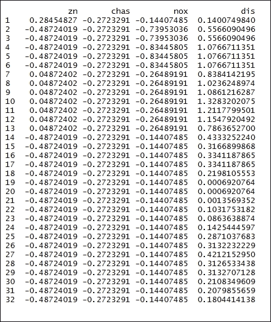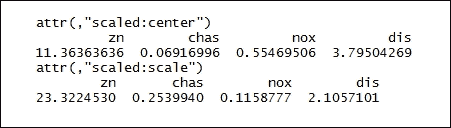

### 第 2 步 - 训练模型

创建 SOM 网格：`somgrid()` 绘制自组织映射网格的函数。`xdim = 20` 和 `ydim=20` 是网格的维度，而 `topo="hexagonal"` 表示网格的拓扑结构：

```py
    > som_grid <- somgrid(xdim = 20, ydim=20, topo="hexagonal")

```

训练自组织映射：`som()` 是自组织映射的一个函数，用于将高维光谱或模式映射到 2D。使用欧几里得距离度量。`training_matrix` 是数据矩阵，`rlen=1000` 是完整数据集将向网络展示以进行训练的次数，alpha 是学习率。`keep.data = TRUE` 表示数据需要保存在返回对象中，`n.hood="circular"` 表示邻域的形状：

```py
> som_model <- som(training_matrix,
+ grid=som_grid,
+ rlen=1000,
+ alpha=c(0.05,0.01),
+ keep.data = TRUE,
+ n.hood="circular")

```

### 第 3 步 - 绘制模型

绘制 `som_model` 对象：

```py
    > plot(som_model, main ="Training Progress", type="changes", col = "red")

```

结果如下：

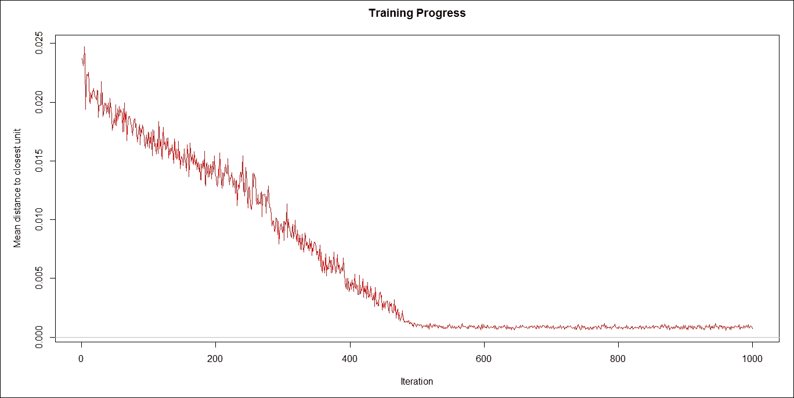

基于节点计数绘制模型：

```py
    > plot(som_model, main ="Node Count", type="count")

```

结果如下：

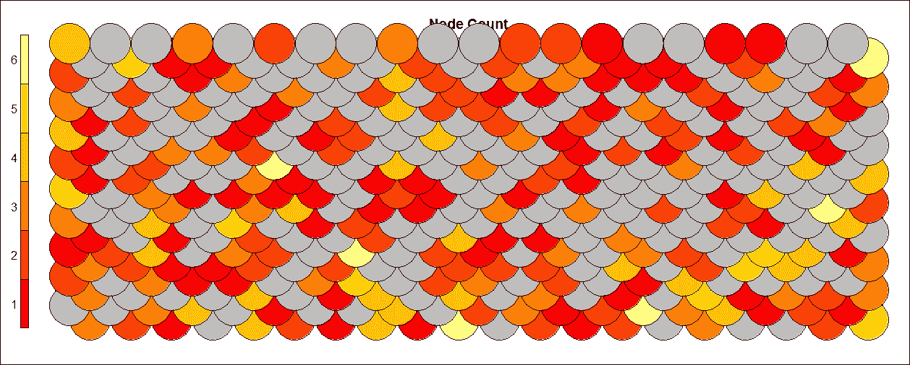

基于邻域距离绘制模型。

```py
    > plot(som_model, main ="Neighbour Distances", type="dist.neighbours")

```

结果如下：

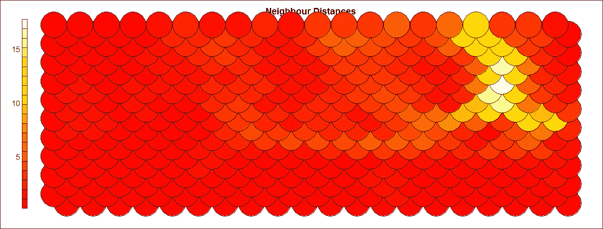

以下代码基于 `type = "codes"` 绘制模型。

```py
    > plot(som_model, type="codes")

```

结果如下：

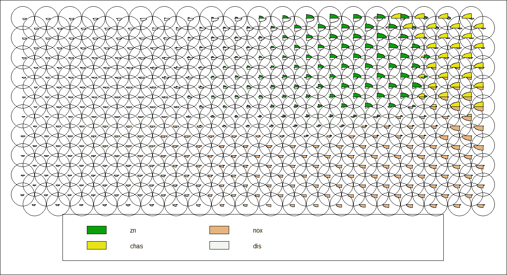

以下代码基于属性图绘制模型。

```py
    > plot(som_model, type = "property", property = som_model$codes[,4], main=names(som_model$data)[4])

```

结果如下：

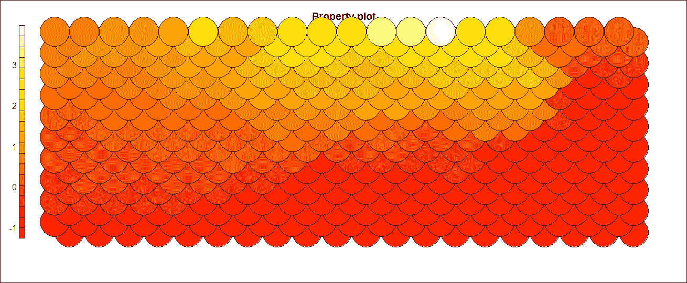

# 向量量化 - 图像聚类

数字媒体领域的科技发展产生了大量的非文本信息，以图像的形式存在。如果程序能够理解这些图像的重要性并理解它们的意义，这将导致大量不同的应用。其中一种应用可能是使用机器人从医院患者的身体扫描图像中提取恶性组织，以解释组织的位置。图像被认为是传达信息最重要的媒体之一。信息检索的潜力巨大，以至于用户可能会被检索到的信息量所淹没。图像的无结构格式对分类和聚类技术构成了挑战。机器学习算法用于提取信息以理解图像。理解图像的第一步是分割它们并识别其中的不同对象。为此，可以使用直方图和频域变换等特征。

## 准备工作

让我们开始吧。

### 步骤 1 - 收集和描述数据

使用 JPEG 文件。

## 如何操作...

让我们深入了解。

### 步骤 2 - 探索数据

以下包首先需要加载：

```py
> install.packages("jpeg")
> install.packages("ggplot2")
> library(jpeg)
> library(ggplot2)

```

### 注意

版本信息：本页面的代码在 R 版本 3.3.2 中进行了测试

使用 `readJPEG()` 函数读取 JPEG 文件格式的图像，并将其转换为栅格数组：。

```py
    > img <- readJPEG("d:/Image.jpg")

```

### 步骤 3 - 数据清洗

探索 `img` 的维度：`dim()` 函数返回 `img` 框架的维度。将 `img` 数据框作为输入参数传递：

```py
    > img_Dim <- dim(img)

```

现在我们来打印 `img_Dim`：

```py
    > img_Dim

```

结果如下：

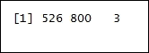

现在，我们将 RGB（红色、绿色和蓝色--RGB 通道大致遵循人眼中的颜色受体）通道分配给数据框。结果存储在 `img_RGB_channels` 数据框中：

```py
> img_RGB_channels <- data.frame(
+ x = rep(1:img_Dim[2], each = img_Dim[1]),
+ y = rep(img_Dim[1]:1, img_Dim[2]),
+ R = as.vector(img[,,1]),
+ G = as.vector(img[,,2]),
+ B = as.vector(img[,,3])
+ )

```

### 步骤 4 - 可视化清洗后的数据

让我们绘制原始图像：

```py
> plotTheme <- function() {
theme(
panel.background = element_rect(
size = 3,
colour = "black",
fill = "white"),
axis.ticks = element_line(
size = 2),
panel.grid.major = element_line(
colour = "gray80",
linetype = "dotted"),
panel.grid.minor = element_line(
colour = "gray90",
linetype = "dashed"),
axis.title.x = element_text(
size = rel(1.2),
face = "bold"),
axis.title.y = element_text(
size = rel(1.2),
face = "bold"),
plot.title = element_text(
size = 20,
face = "bold",
Unsupervised Learning
[ 327 ]
vjust = 1.5)
)
}
> ggplot(data = img_RGB_channels, aes(x = x, y = y)) +
+ geom_point(colour = rgb(img_RGB_channels[c("R", "G", "B")])) +
+ labs(title = "Original Image: Colorful Bird") +
+ xlab("x") +
+ ylab("y") +
+ plotTheme()

```

结果如下：

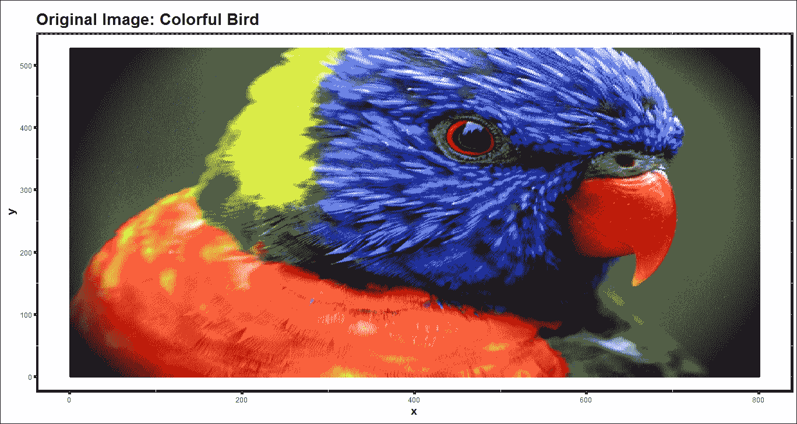

### 步骤 5 - 构建模型并可视化

分配聚类颜色：

```py
    > kClusters <- 3

```

执行 k-means 聚类：`kmeans()` 函数对数据矩阵 `img_RGB_channels` 进行聚类。`centers = kClusters` 表示初始聚类的数量：

```py
    > kMeans_clst <- kmeans(img_RGB_channels[, c("R", "G", "B")], centers = kClusters)

```

创建与给定红色、绿色和蓝色基色强度相对应的颜色。

```py
    > kColours <- rgb(kMeans_clst$centers[kMeans_clst$cluster,])

```

使用三个聚类绘制图像：

```py
> ggplot(data = img_RGB_channels, aes(x = x, y = y)) +
+ geom_point(colour = kColours) +
+ labs(title = paste("k-Means Clustering of", kClusters, "Colours"))
+
+ xlab("x") +
+ ylab("y") +
+ plotTheme()

```

结果如下：

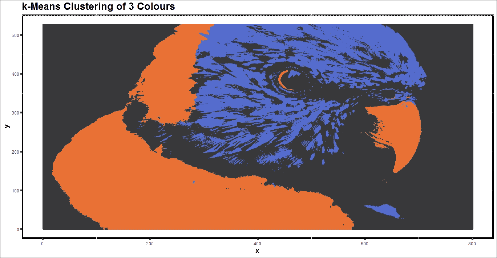

分配聚类颜色：

```py
    > kClusters <- 5

```

执行 k-means 聚类：

```py
    > kMeans_clst <- kmeans(img_RGB_channels[, c("R", "G", "B")], centers = kClusters)

```

创建与给定红色、绿色和蓝色基色强度相对应的颜色。

```py
    > kColours <- rgb(kMeans_clst$centers[kMeans_clst$cluster,])

```

使用五个聚类绘制图像：

```py
> ggplot(data = img_RGB_channels, aes(x = x, y = y)) +
+ geom_point(colour = kColours) +
+ labs(title = paste("k-Means Clustering of", kClusters, "Colours"))
+
+ xlab("x") +
+ ylab("y") +
+ plotTheme()

```

结果如下：

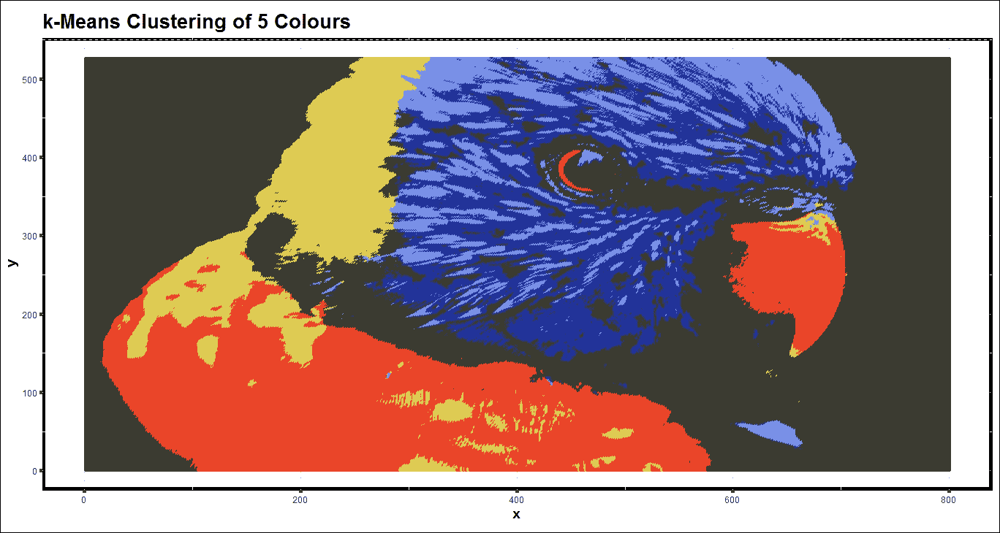
