# 第九章：结构化预测

在本章中，我们将介绍以下食谱：

+   隐藏马尔可夫模型 - 欧元和美元

+   用于制度检测的隐藏马尔可夫模型

# 简介

隐藏马尔可夫模型（**HMM**）是一种非常强大的统计方法，用于表征离散时间序列的观察数据样本。它不仅能够提供一种构建简约参数模型的高效方法，还可以将其核心中的动态规划原理用于统一的时间序列数据序列的模式分割和模式分类。时间序列中的数据样本可以是离散的或连续的；它们可以是标量或向量。HMM 的潜在假设是数据样本可以很好地表征为参数随机过程，并且随机过程的参数可以在精确和定义良好的框架中估计。

# 隐藏马尔可夫模型 - 欧元和美元

欧元/美元（EUR/USD）是外汇市场中最常交易的货币对。它们的流行可以归因于这样一个事实：每种货币都代表着世界上两个最大的经济和贸易集团，以及许多在跨大西洋地区开展业务的跨国公司。

对于这个货币对的汇率变动通常与影响欧元或美元价值的因素有关。作为世界上最具流动性的货币对，EUR/USD 为寻求即时买入或卖出的交易者提供了紧密的价差和持续的流动性。稳定性和波动性的结合使 EUR/USD 成为初学者和高级交易者的绝佳选择。EUR/USD 对为交易者提供了高流动性，并且具有非常紧密和具有竞争力的价差。美国经济和欧洲经济的相对强度，可以通过每日新闻追踪，通常影响这一对。

## 准备工作

为了将隐藏马尔可夫模型应用于寻找不同的市场制度，并因此优化交易策略，我们将使用收集在欧元/美元数据集上的数据集。

### 第 1 步 - 收集和描述数据

将使用标题为`EURUSD1d.csv`的数据集。此数据集以 CSV 格式提供，称为`EURUSD1d.csv`。数据集采用标准格式。有 1,008 行数据，五个变量。数值变量如下：

+   `开盘`

+   `高`

+   `低`

+   `收盘价`

非数值变量是：

+   `开盘时间戳`

## 如何操作...

让我们深入了解。

### 第 2 步 - 探索数据

需要在第一步中加载以下包：

```py
 > install.packages("depmixS4")
 > install.packages("quantmod")
 > install.packages("ggplot2")
 > library(depmixS4)
 > library(quantmod)
 > library(ggplot2)

```

### 注意

版本信息：本页面的代码在 R 版本 3.2.2（2015-08-14）上进行了测试

让我们探索数据并了解变量之间的关系：

我们将首先导入名为`EURUSD1d.csv`的 CSV 数据文件。我们将如下将数据保存到`EuroUSD`数据框中：

```py
> EuroUSD <- read.csv("d:/EURUSD1d.csv", header = TRUE)

```

打印`EuroUSD`框架：`head()`函数返回`EuroUSD`框架的第一部分。`EuroUSD`框架作为输入参数传递：

```py
> head(EuroUSD)

```

结果如下：

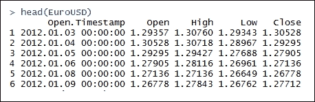

打印 `EuroUSD` 数据框的摘要：`summary()` 函数是一个多功能函数。`summary()` 是一个通用函数，它提供了与单个对象或数据框相关的数据的摘要。`EuroUSD` 数据框作为 R 对象传递给 `summary()` 函数：

```py
> summary(EuroUSD)

```

结果如下：

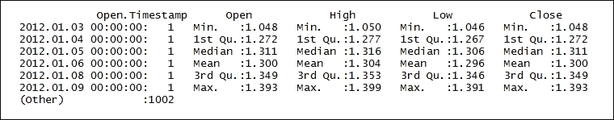

探索 `EuroUSD` 数据框的内部结构：`str()` 函数显示数据框的内部结构。`EuroUSD` 作为 R 对象传递给 `str()` 函数：

```py
> str(EuroUSD)

```

结果如下：

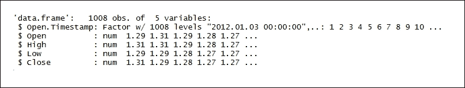

### 第 3 步 - 将数据转换为时间序列

创建字符类型对象：`as.character()` 函数将实数和复数表示为 15 位有效数字。除了第 1 列之外，整个 `EuroUSD` 数据框被传递：

```py
> Date <- as.character(EuroUSD[,1])

```

操作 `Date` 数据框以表示日历日期。结果随后存储在数据框 `DateTimeSeries` 中：

```py
> DateTimeSeries <- as.POSIXlt(Date, format = "%Y.%m.%d %H:%M:%S")

```

创建紧密耦合的数据框。`data.frame()` 为 `EuroUSD[,2:5]` 创建数据框。`row.names = DateTimeSeries` 为创建的数据框提供行名：

```py
> TimeSeriesData <- data.frame(EuroUSD[,2:5], row.names = DateTimeSeries)

```

打印 `TimeSeriesData` 数据框。`head()` 函数返回 `TimeSeriesData` 数据框的前部分。`TimeSeriesData` 数据框作为输入参数传递：

```py
> head(TimeSeriesData)

```

结果如下：

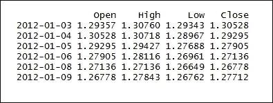

`as.xts()` 函数将 `TimeSeriesData` 数据对象转换为 `xts` 类，而不丢失 `TimeSeriesData` 数据框的任何属性，如下所示：

```py
> TimeSeriesData <- as.xts(TimeSeriesData)

```

测量高低收盘价序列的波动性。`ATR()` 函数测量 `TimeSeriesData` 高低收盘价序列的平均波动性。`TimeSeriesData[,2:4]` 表示 `TimeSeriesData` 的高低收盘价。结果随后存储在 `ATRindicator` 数据框中：

```py
> ATRindicator <- ATR(TimeSeriesData[,2:4],n=14)

```

打印 `ATRindicator` 数据框。`head()` 函数返回 `ATRindicator` 数据框的前部分。`ATRindicator` 数据框作为输入参数传递：

```py
> head(ATRindicator)

```

结果如下：

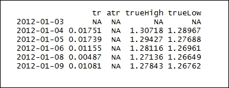

测量高频率序列的波动性。`ATRindicator [,2]` 表示 `TimeSeriesData` 的高点。结果随后存储在 `TrueRange` 数据框中：

```py
> TrueRange <- ATRindicator[,2]

```

打印 `TrueRange` 数据框：

```py
> head(TrueRange)

```

结果如下：

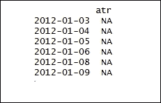

计算收盘价和开盘价的 `LogReturns` 之间的差异。结果随后存储在 `LogReturns` 数据框中：

```py
> LogReturns <- log(EuroUSD$Close) - log(EuroUSD$Open)

```

打印 `LogReturns` 数据框的摘要。`summary()` 函数用于提供与单个对象或数据框相关的数据的摘要。`LogReturns` 数据框作为 R 对象传递给 `summary()` 函数：

```py
> summary(LogReturns)

```

结果如下：

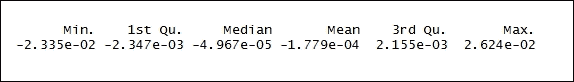

### 第 4 步 - 建立模型

创建 HMM 模型的数据框。`data.frame()` 函数创建紧密耦合的数据框，这些数据框具有许多与矩阵相似的属性：

```py
> HMMModel <- data.frame(LogReturns, TrueRange)

```

删除计算 `HMMModel` 指标的数据：

```py
> HMMModel <- HMMModel[-c(1:14),]

```

打印 `HMMModel` 数据框：

```py
> head(HMMModel)

```

结果如下：

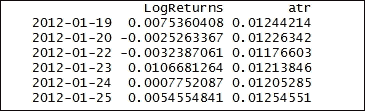

命名列。`c()` 函数将参数组合成向量。传递给函数的所有参数组合成返回值的共同类型：

```py
> colnames(HMMModel) <- c("LogReturns","TrueRange")

```

打印列名：

```py
> colnames(HMMModel)

```

结果如下：

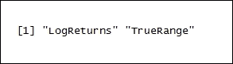

```py
> set.seed(1)

```

建立三状态机制并将响应分布设置为高斯状态。`depmix()` 函数创建隐马尔可夫模型。`LogReturns~1`、`TrueRange~1` 代表要建模的响应。`data = HMMModel` 代表解释响应变量的数据框，而 `nstates=3` 是状态的数量：

```py
> HMM <- depmix(list(LogReturns~1, TrueRange~1), data = HMMModel, nstates=3, family=list(gaussian(), gaussian()))

```

将 HMM 模型拟合到定义的数据集。`fit()` 函数优化 HMM 模型的参数，受线性不等式约束。HMM 是 HMM 类的对象，而 `verbose = FALSE` 表示信息不应显示在屏幕上。优化后的参数存储在 `depmix` 类的 `HMMfit` 对象中：

```py
> HMMfit <- fit(HMM, verbose = FALSE)

```

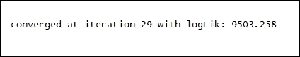

比较对数似然、AIC 和 BIC 值。`print()` 函数打印 `HMMfit` 的参数：

```py
> print(HMMfit)

```

结果如下：

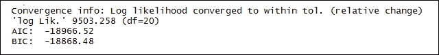

```py
> summary(HMMfit)

```

打印 `LogReturns` 数据框的摘要。`summary()` 函数用于提供与单个对象或数据框相关的数据摘要。将 `LogReturns` 数据框作为 R 对象传递给 `summary()` 函数：

结果如下：

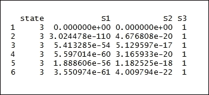

为数据集中的每个状态找到后验概率。结果存储在 `HMMstate` 中：

```py
> HMMstate <- posterior(HMMfit)

```

打印 `HMMstate` 数据框。显示每一天每个状态的概率以及最高概率的类别：

```py
> head(HMMstate)

```

结果如下：


### 第 5 步 - 显示结果

按以下步骤显示计算出的 `HMMstate` 数据框：

创建 HMM 模型的数据框。`data.frame()` 函数创建紧密耦合的数据框，这些数据框具有许多与矩阵相似的属性。`DateTimeSeries`、`LogReturns` 和 `TrueRange` 数据框被传递以紧密耦合。结果随后存储在 `DFIndicators` 中：

```py
 > DFIndicators <- data.frame(DateTimeSeries, LogReturns, TrueRange)
 > DFIndicatorsClean <- DFIndicators[-c(1:14), ]

```

创建如下数据框：

```py
> Plot1Data <- data.frame(DFIndicatorsClean, HMMstate$state)

```

使用 `ggplot()` 绘制结果：

```py
 > LogReturnsPlot <- ggplot(Plot1Data,aes(x=Plot1Data[,1],y=Plot1Data[,2]))+geom_line(color="darkred")+labs(,y="Log Return Values",x="Date")
 > LogReturnsPlot

```

结果如下：

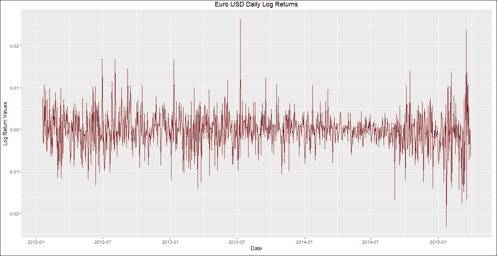

# 隐藏马尔可夫模型 - 机制检测

标准普尔 500 指数（S&P 500）是美国股票市场 500 支股票的指数。它是美国股票市场的一个领先指标，反映了经济学家选定的大型公司的表现。在确定 500 支股票时，专家会考虑包括在指数中的因素，包括市场规模、流动性和行业分组。它是一个市值加权指数，也是美国股市的常见基准之一。基于 S&P 500 的投资产品包括指数基金和交易所交易基金，可供投资者购买。由于需要 500 家公司的股票按整个投资组合的比例来复制指数的市场资本化方法，因此投资者复制 S&P 500 具有挑战性。对于投资者来说，购买 S&P 500 投资产品之一，如先锋 S&P 500 ETF、SPDR S&P 500 ETF 或 S&P 500 指数 ETF，会更容易一些。

## 准备工作

为了执行隐藏马尔可夫模型，我们将使用收集在 `S&P500` 回报集中的数据集。

### 第一步 - 收集和描述数据

要使用的数据集是从 2004 年 1 月 1 日到现在的 `S&P500` 每日回报值。此数据集在 [`yahoo.com/`](https://yahoo.com/) 上免费提供，我们将从那里下载数据。

## 如何操作...

让我们深入了解细节。

### 第二步 - 探索数据

加载以下包：

```py
 > install.packages("depmixS4")
 > install.packages("quantmod")

```

### 注意

版本信息：本页面的代码在 R 版本 3.3.0（2016-05-03）上进行了测试

上述每个库都需要安装。

```py
 > library("depmixS4 ")
 > library("quantmod")
 > set.seed(1)

```

让我们下载数据。我们首先为所需数据的时间段标记开始日期和结束日期。

使用 `getSymbols()` 函数按以下方式加载数据。该函数从多个来源加载数据，无论是本地还是远程来源。GSPC 是字符向量，指定要加载的符号名称：

```py
> getSymbols( "^GSPC", from="2004-01-01" )

```

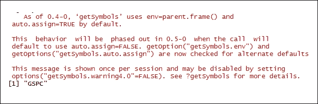

计算每个收盘价的对数差异。然后将结果保存在 `GSPCDiff` 数据框中：

```py
> GSPCDiff = diff( log( Cl( GSPC ) ) )

```

探索 `GSPCDiff` 框架的内部结构。`str()` 函数显示数据框的内部结构。`GSPCDiff` 作为 R 对象传递给 `str()` 函数：

```py
> str(GSPCDiff)

```

结果如下：

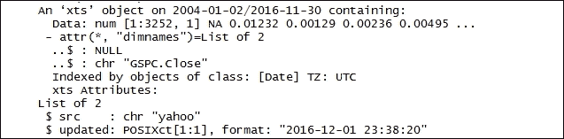

按以下方式打印 `GSPCDiff` 数据框：

```py
> head(GSPCDiff)

```

结果如下：

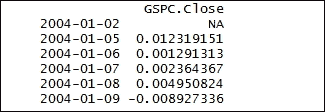

创建 `GSPCDiff` 数据框的数值：

```py
> returns = as.numeric(GSPCDiff)

```

绘制 `GSPCDiff` 数据框：

```py
> plot(GSPCDiff)

```

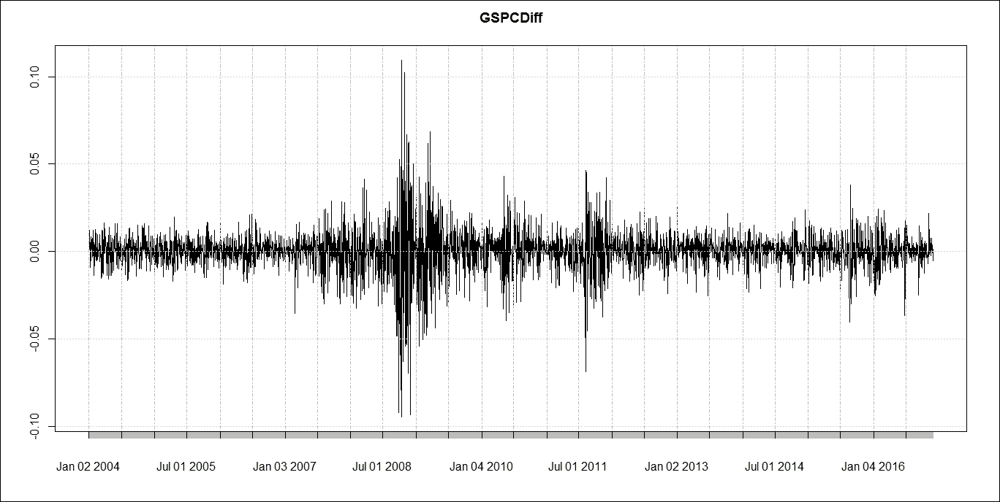

### 第三步 - 准备模型

将具有两个状态的隐藏马尔可夫模型拟合到 S&P 回报。为两个状态创建隐藏马尔可夫模型。

`depmix()` 函数创建隐藏马尔可夫模型。`returns ~ 1` 表示要建模的响应。`data=data.frame(returns=returns)` 表示数据框，用于解释响应中的变量，而 `nstates = 2` 是状态的数量：

```py
 > hmm2states <- depmix(returns ~ 1, family = gaussian(), nstates = 2, data=data.frame(returns=returns))
 > hmm2states

```

结果如下：

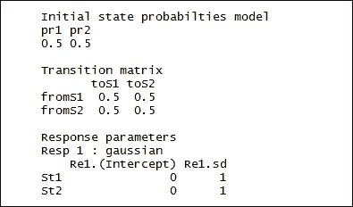

将 HMM 模型拟合到定义的数据集。`fit()`函数优化 HMM 模型的参数，受线性不等式约束。`hmm2states`是 HMM 类的一个对象，而`verbose = FALSE`指示信息不应显示在屏幕上。优化后的参数存储在`depmix`类的`hmmfit2states`对象中：

```py
> hmmfit2states <- fit(hmm2states, verbose = FALSE)

```

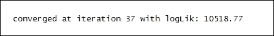

比较对数似然、AIC 和 BIC 值：

```py
> hmmfit2states

```

结果如下：

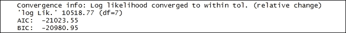

为数据集的每个状态找到后验概率。结果存储在`PosteriorProbs`中：

```py
> PosteriorProbs <- posterior(hmmfit2states)

```

打印`PosteriorProbs`框架。`head()`函数返回`PosteriorProbs`框架的第一部分。`PosteriorProbs`框架作为输入参数传递：

```py
> head (PosteriorProbs)

```

结果如下：

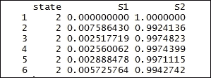

绘制两个状态的结果。`type='l'`表示为线图：

```py
> plot(returns, type='l', main='Regime Detection', xlab='No of Observations', ylab='Returns')

```

结果如下：

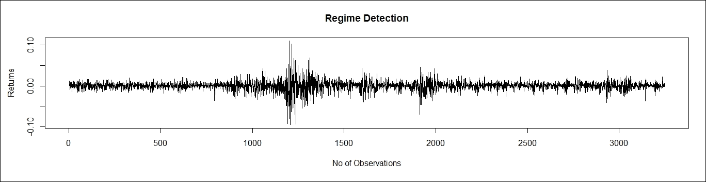

绘制`PosteriorProbs`数据框的列：

```py
> matplot(PosteriorProbs[,-1], type='l', main='Regime Posterior Probabilities', xlab='No of Observations', ylab='Probability')

```

结果如下：

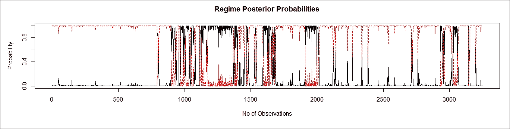

创建三个状态的秘密马尔可夫模型：

```py
 > hmm3states <- depmix(returns ~ 1, family = gaussian(), nstates = 3, data=data.frame(returns=returns))
 > hmm3states

```

结果如下：

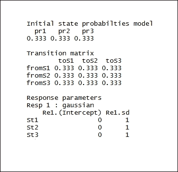

将 HMM 模型拟合到定义的数据集：

```py
> hmmfit3states <- fit(hmm3states, verbose = FALSE)

```

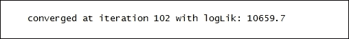

为数据集的每个状态找到后验概率：

```py
> PosteriorProbs <- posterior(hmmfit3states)

```

打印`PosteriorProbs`框架：

```py
> head(PosteriorProbs)

```

结果如下：

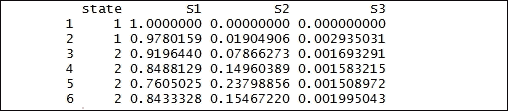

```py
> plot(returns, type='l', main='Regime Detection', xlab='No of Observations', ylab='Returns')

```

结果如下：

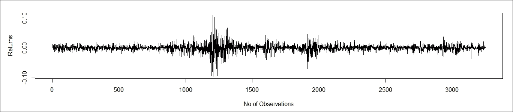

```py
> matplot(PosteriorProbs[,-1], type='l', main='Regime Posterior Probabilities', xlab='No of Observations', ylab='Probability')

```

结果如下：

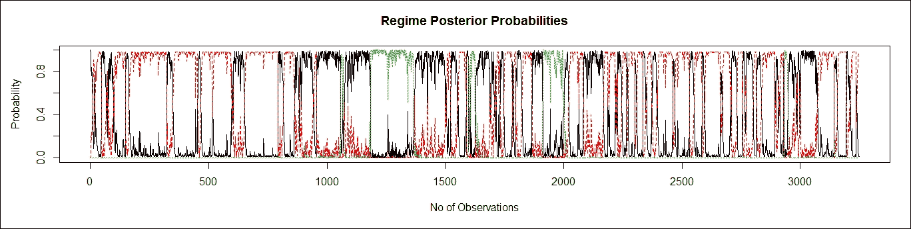

创建四个状态的秘密马尔可夫模型：

```py
    > hmm4states <- depmix(returns ~ 1, family = gaussian(), nstates = 4, data=data.frame(returns=returns))
    > hmm4states

```

结果如下：

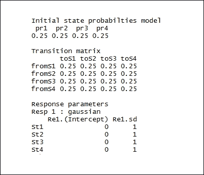

将 HMM 模型拟合到定义的数据集：

```py
> hmmfit4states <- fit(hmm4states, verbose = FALSE)

```

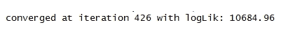

为数据集的每个状态找到后验概率：

```py
    > PosteriorProbs <- posterior(hmmfit4states)    > plot(returns, type='l', main='Regime Detection', xlab='No of Observations', ylab='Returns')

```

结果如下：

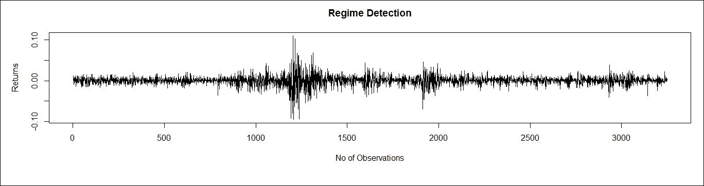

```py
> matplot(PosteriorProbs[,-1], type='l', main='Regime Posterior Probabilities', xlab='No of Observations', ylab='Probability')

```

结果如下：

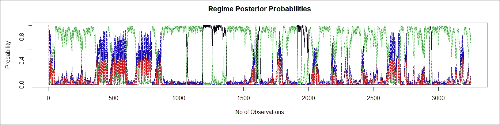
