# 第十二章. 案例研究 - 探索世界银行数据

# 简介

**世界银行指标**（**WDI**）是世界银行汇编的关于全球发展增长及其对人们生活质量的国际可比和可衡量统计数据的集合。通过分析来自 200 多个经济体和 50 多个合作伙伴组织收集的数据，衡量各国、地区和收入群体的发展状况，展示了 1400 多个指标。2015 年 9 月 25 日，联合国大会正式通过了 2030 年可持续发展议程，以指导未来 15 年的全球行动。可持续发展目标（SDG）的五大主要关注主题是人、地球、繁荣、和平和伙伴关系。各国已承诺消除贫困和饥饿，并确保所有人都能在尊严和平等的环境中充分发挥其潜能；保护地球免受退化，并就气候变化采取紧急行动；确保所有人都能享有繁荣充实的生活，并且进步与自然和谐共生；培育和平、公正和包容的社会，消除恐惧和暴力；并动员实施 2030 年议程的手段，重点关注最贫困和最脆弱的人群，通过强大的全球伙伴关系。对于这 17 个目标，世界银行发展数据组、全球实践和跨领域解决方案领域的专家为每个目标选择了指标，以识别和分析重要趋势和挑战，并就测量问题进行讨论。《世界发展指标》是众多国际机构、200 多个国家统计办公室以及许多其他机构合作的结果。

# 探索世界银行数据

2012 年，全球 13%的人口生活在每天 1.90 美元的国际贫困线以下，而 1990 年这一比例为 37%。所有地区的下降都为提前实现全球减半极端贫困的千年发展目标做出了贡献。目标是到 2030 年消除所有形式的贫困，并为贫困人口提供社会保障，增加基本服务的获取，并支持受冲突和气候相关灾害影响的人。

在低收入国家记录的死亡中，超过一半是由于传染病或母体、围产期或营养状况。而在中高收入国家，记录的死亡中超过三分之二是由于非传染性疾病。全球能源使用量在 1990 年至 2013 年之间增长了约 54%。能源获取是发展的基础，但随着经济的演变，收入增长和人口增长对能源的需求也在增加。能源，尤其是电力，对于提高低收入和中收入国家人们的生活水平至关重要。

## 准备中...

为了执行再保险合同的定价，我们将使用从飓风数据集收集的数据集。

为了对世界银行的数据模式进行分析，我们将使用从以下数据集收集的数据集：

+   全球总人口（1960-2015）

+   所有国家和地区的出生预期寿命（1960-2014）

+   所有国家和地区的生育率（每名女性的出生数），时间范围为（1960-2014）

+   所有国家和地区的 GDP（以美元计），时间范围为（1960-2015）

+   所有国家和地区的贫困人口比例（1960-2016）

+   所有国家和地区的卫生设施普及率（1960-2016）

+   所有国家和地区的电力普及率（1960-2016）

+   所有国家和地区的二氧化碳排放量（1960-2016）

### 第 1 步 - 收集和描述数据

世界银行用于分析的数据集可以从世界银行数据库免费下载。

## 如何操作...

让我们深入了解细节。

### 第 2 步 - 下载数据

加载以下包：

```py
 > install.packages("wbstats")
 > install.packages("data.table")
 > install.packages("googleVis")

```

### 备注

版本信息：本页面的代码在 R 版本 3.3.0（2016-05-03）上进行了测试

以下每个库都需要安装：

```py
 > library(wbstats)
 > library(data.table)
 > library(googleVis)

```

让我们下载数据并了解变量之间的关系。我们将首先从世界银行网站下载数据。`data.table()`函数允许快速聚合大型数据集，排序连接，通过组添加/修改/删除列，列出列，友好的文件读取器，以及并行文件写入器。`wb()`函数使用世界银行 API 下载所需信息。indicator 代表指标代码的字符向量。

指标代码如下：

+   `SP.POP.TOTL`: 全球总人口（1960-2015）

+   `SP.DYN.LE00.IN`: 所有国家和地区的出生预期寿命（1960-2014）

+   `SP.DYN.TFRT.IN`: 所有国家和地区的生育率（每名女性的出生数），时间范围为（1960-2014）

结果存储在`Pop_LifeExp_FertRt`数据框中。使用以下命令：

```py
> Pop_LifeExp_FertRt <- data.table(wb(indicator = c("SP.POP.TOTL", "SP.DYN.LE00.IN", "SP.DYN.TFRT.IN"), startdate = 1960, enddate = 2016))

```

指标代码如下：

+   `SP.POP.TOTL`: 全球总人口（1960-2015）

+   `NY.GDP.MKTP.CD-GDP`: 所有国家和地区的 GDP（以美元计），时间范围为（1960-2015）

+   `SI.POV.2DAY`: 所有国家和地区的贫困人口比例（1960-2016）

结果存储在`Pop_GDPUSD_HeadCnt`数据框中。使用以下命令：

```py
> Pop_GDPUSD_HeadCnt <- data.table(wb(indicator = c("SP.POP.TOTL", "NY.GDP.MKTP.CD", "SI.POV.2DAY"), startdate = 1960, enddate = 2016))

```

指标代码如下：

+   `SP.POP.TOTL`: 全球总人口（1960-2015）

+   `NY.GDP.MKTP.CD`: 所有国家和地区的 GDP（以美元计），时间范围为（1960-2015）

+   `SH.STA.ACSN`: 所有国家和地区的卫生设施普及率（1960-2016）

结果存储在`Pop_GDPUSD_Sanitation`数据框中。使用以下命令：

```py
> Pop_GDPUSD_Sanitation <- data.table(wb(indicator = c("SP.POP.TOTL", "NY.GDP.MKTP.CD", "SH.STA.ACSN"), startdate = 1960, enddate = 2016))

```

指标代码如下：

+   `NY.GDP.MKTP.CD`: 所有国家和地区的 GDP（以美元计），时间范围为（1960-2015）

+   `EG.ELC.ACCS.ZS`: 所有国家和地区的电力普及率（1960-2016）

+   `EN.ATM.CO2E.KT`：所有国家和地区的每人大电力消耗 KWh（1960-2016）

结果存储在 `GDPUSD_Electricity_CO2` 数据框中。使用以下命令：

```py
> GDPUSD_Electricity_CO2 <- data.table(wb(indicator = c("NY.GDP.MKTP.CD", "EG.ELC.ACCS.ZS", "EN.ATM.CO2E.KT"), startdate = 1960, enddate = 2016))

```

### 步骤 3 - 探索数据

探索 `Pop_LifeExp_FertRt` 数据框的维度：`dim()` 函数返回 `Pop_LifeExp_FertRt` 数据框的维度。`Pop_LifeExp_FertRt` 数据框作为输入参数传递。结果明确指出有 41150 行数据和六个列：

```py
> dim(Pop_LifeExp_FertRt)

```

结果如下：

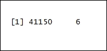

探索 `Pop_LifeExp_FertRt` 数据框的维度：结果明确指出有 27023 行数据和六个列：

```py
> dim(Pop_GDPUSD_HeadCnt)

```

结果如下：

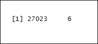

探索 `Pop_GDPUSD_Sanitation` 数据框的维度：结果明确指出有 31884 行数据和六个列：

```py
> dim(Pop_GDPUSD_Sanitation)

```

结果如下：

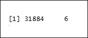

探索 `GDPUSD_Electricity_CO2` 数据框的维度：结果明确指出有 23994 行数据和六个列：

```py
> dim(GDPUSD_Electricity_CO2)

```

结果如下：

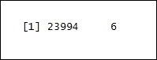

探索 `Pop_LifeExp_FertRt` 数据框的内部结构：`str()` 函数显示数据框的内部结构。`Pop_LifeExp_FertRt` 作为 R 对象传递给 `str()` 函数：

```py
> str(Pop_LifeExp_FertRt)

```

结果如下：

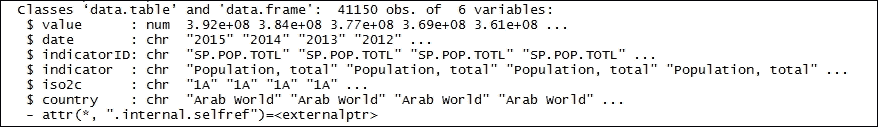

探索 `Pop_GDPUSD_HeadCnt` 数据框的内部结构：

```py
> str(Pop_GDPUSD_HeadCnt)

```

结果如下：

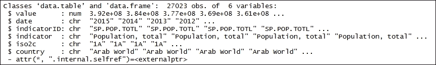

探索 `Pop_GDPUSD_Sanitation` 数据框的内部结构：

```py
> str(Pop_GDPUSD_Sanitation)

```

结果如下：

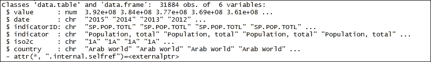

探索 `GDPUSD_Electricity_CO2` 数据框的内部结构：

```py
> str(GDPUSD_Electricity_CO2)

```

结果如下：


探索 `GDPUSD_Electricity_CO2` 数据框的内部结构：

```py
> str(GDPUSD_Electricity_CO2)

```

结果如下：

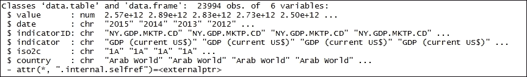

打印 `Pop_LifeExp_FertRt` 数据框：`head()` 函数返回 `Pop_LifeExp_FertRt` 数据框的前部分。`Pop_LifeExp_FertRt` 数据框作为输入参数传递：

```py
> head(Pop_LifeExp_FertRt)

```

结果如下：


打印 `Pop_GDPUSD_HeadCnt` 数据框：

```py
> head(Pop_GDPUSD_HeadCnt)

```

结果如下：

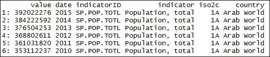

打印 `Pop_GDPUSD_Sanitation` 数据框：

```py
> head(Pop_GDPUSD_Sanitation)

```

结果如下：

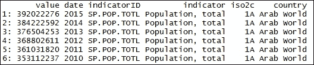

打印 `GDPUSD_Electricity_CO2` 数据框：

```py
> head(GDPUSD_Electricity_CO2)

```

结果如下：

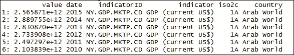

探索 `SP.POP.TOTL` 数据框的维度：`dim()` 函数返回 `SP.POP.TOTL` 数据框的维度。`SP.POP.TOTL` 数据框作为输入参数传递。结果清楚地表明有 14623 行数据和六个列：

```py
> dim(wb(indicator = "SP.POP.TOTL"))

```

结果如下：

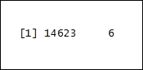

探索 `SP.DYN.LE00.IN` 数据框的维度：

```py
> dim(wb(indicator = "SP.DYN.LE00.IN"))

```

结果如下：

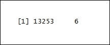

探索 `SP.DYN.TFRT.IN` 数据框的维度：

```py
> dim(wb(indicator = " SP.DYN.TFRT.IN "))

```

结果如下：

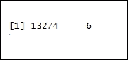

探索 `NY.GDP.MKTP.CD` 数据框的维度：

```py
> dim(wb(indicator = " NY.GDP.MKTP.CD"))

```

结果如下：

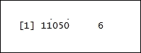

探索 `SI.POV.2DAY` 数据框的维度：

```py
> dim(wb(indicator = " SI.POV.2DAY "))

```

结果如下：

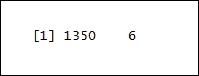

探索 `SH.STA.ACSN` 数据框的维度：

```py
> dim(wb(indicator = " SH.STA.ACSN "))

```

结果如下：

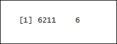

探索 `EG.ELC.ACCS.ZS` 数据框的维度：

```py
> dim(wb(indicator = "EG.ELC.ACCS.ZS"))

```

结果如下：

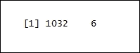

探索 `EN.ATM.CO2E.KT` 数据框的维度：

```py
> dim(wb(indicator = "EN.ATM.CO2E.KT"))

```

结果如下：

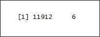

使用 `wbcountries()` 函数从世界银行 API 下载更新的国家和区域信息：

```py
> Countries <- data.table(wbcountries())

```

打印 `Countries` 数据框：`head()` 函数返回 `Countries` 数据框的前部分：

```py
> head(Countries)

```

结果如下：

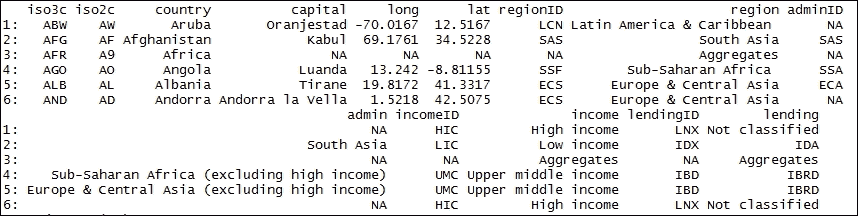

### 步骤 4 - 构建模型

对 `Pop_LifeExp_FertRt` 数据表进行排序：`setkey()` 函数对 `Pop_LifeExp_FertRt` 数据表进行排序并标记为已排序。排序的列是键。键位于 `iso2c` 列；`iso2c` 列始终按升序排序。表通过引用进行更改，因此非常节省内存：

```py
> setkey(Pop_LifeExp_FertRt, iso2c)

```

对 `Pop_GDPUSD_HeadCnt` 数据表进行排序：

```py
> setkey(Pop_GDPUSD_HeadCnt, iso2c)

```

对 `Pop_GDPUSD_Sanitation` 数据表进行排序：

```py
> setkey(Pop_GDPUSD_Sanitation, iso2c)

```

对 `GDPUSD_Electricity_CO2` 数据表进行排序：

```py
> setkey(GDPUSD_Electricity_CO2, iso2c)

```

对 `Countries` 数据表进行排序：

```py
> setkey(Countries, iso2c)

```

打印 `Countries` 数据表：

```py
> head(setkey(Countries, iso2c))

```

结果如下：

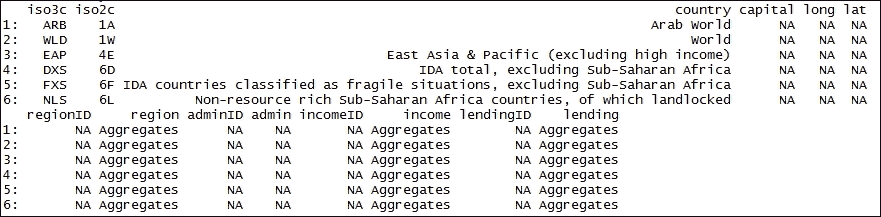

在数据集中添加区域的同时从 `Pop_LifeExp_FertRt` 数据集中移除聚合：

```py
> Pop_LifeExp_FertRt <- Countries[Pop_LifeExp_FertRt][ ! region %in% "Aggregates"]

```

打印 `Pop_LifeExp_FertRt` 数据表：

```py
> head(Pop_LifeExp_FertRt)

```

结果如下：

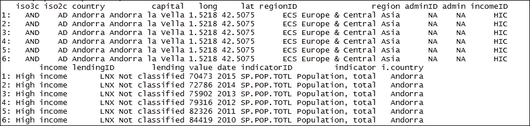

在数据集中添加区域的同时从 `Pop_GDPUSD_HeadCnt` 数据集中移除聚合：

```py
> Pop_GDPUSD_HeadCnt <- Countries[Pop_GDPUSD_HeadCnt][ ! region %in% "Aggregates"]

```

在数据集中添加区域的同时从 `Pop_GDPUSD_Sanitation` 数据集中移除聚合：

```py
> Pop_GDPUSD_Sanitation <- Countries[Pop_GDPUSD_Sanitation][ ! region %in% "Aggregates"]

```

在数据集中添加区域的同时从 `GDPUSD_Electricity_CO2` 数据集中移除聚合：

```py
> GDPUSD_Electricity_CO2 <- Countries[GDPUSD_Electricity_CO2][ ! region %in% "Aggregates"]

```

```py
 > wPop_LifeExp_FertRt <- reshape(Pop_LifeExp_FertRt[, list(country, region, date, value, indicator)], v.names = "value", idvar=c("date", "country", "region"), timevar="indicator", direction = "wide")
 > wPop_GDPUSD_HeadCnt <- reshape(Pop_GDPUSD_HeadCnt[, list(country, region, date, value, indicator)], v.names = "value", idvar=c("date", "country", "region"), timevar="indicator", direction = "wide")
 > wPop_GDPUSD_Sanitation <- reshape(Pop_GDPUSD_Sanitation[, list(country, region, date, value, indicator)], v.names = "value", idvar=c("date", "country", "region"), timevar="indicator", direction = "wide")
 > wGDPUSD_Electricity_CO2 <- reshape(GDPUSD_Electricity_CO2[, list(country, region, date, value, indicator)], v.names = "value", idvar=c("date", "country", "region"), timevar="indicator", direction = "wide")

```

打印数据框 `wPop_LifeExp_FertRt` 的内容：

```py
> wPop_LifeExp_FertRt

```

结果如下：

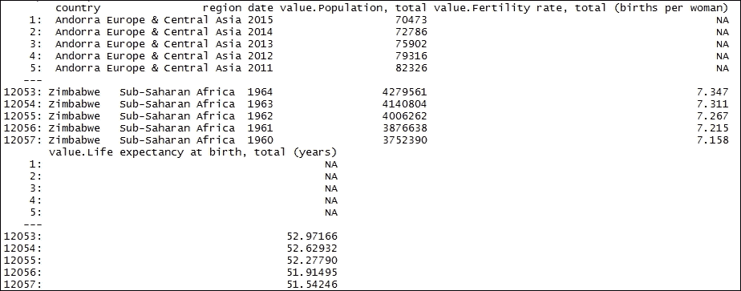

打印数据框 `wGDPUSD_Electricity_CO2` 的内容：

```py
> wGDPUSD_Electricity_CO2

```

结果如下：

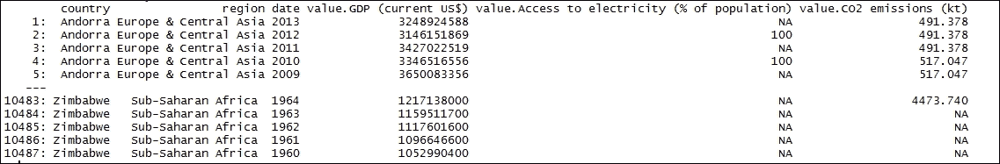

将`wPop_LifeExp_FertRt`、`wPop_GDPUSD_HeadCnt`、`wPop_GDPUSD_Sanitation`和`wGDPUSD_Electricity_CO2`数据集从字符格式转换为整数格式：

```py
 > wPop_LifeExp_FertRt[, date := as.integer(date)]
 > wPop_GDPUSD_HeadCnt[, date := as.integer(date)]
 > wPop_GDPUSD_Sanitation[, date := as.integer(date)]
 > wGDPUSD_Electricity_CO2[, date := as.integer(date)]

```

设置名称：`setnames()`函数设置`wPop_LifeExp_FertRt`、`wPop_GDPUSD_HeadCnt`、`wPop_GDPUSD_Sanitation`和`wGDPUSD_Electricity_CO2`对象的名字：

```py
    > setnames(wPop_LifeExp_FertRt, names(wPop_LifeExp_FertRt), c("Country", "Region", "Year", "Population", "Fertility", "LifeExpectancy"))
    > setnames(wPop_GDPUSD_HeadCnt, names(wPop_GDPUSD_HeadCnt), c("Country", "Region", "Year", "Population", "GDPUSD", "PovertyHead"))
    > setnames(wPop_GDPUSD_Sanitation, names(wPop_GDPUSD_Sanitation), c("Country", "Region", "Year", "Population", "GDPUSD", "SanitationAccess"))
    > setnames(wGDPUSD_Electricity_CO2, names(wGDPUSD_Electricity_CO2), c("Country", "Region", "Year", "GDPUSD", "ElectricityConsumption", "CO2Emissions"))

```

### 第 5 步 - 绘制模型

按以下步骤绘制`wPop_LifeExp_FertRt`数据框模型。`gvisMotionChart()`函数读取`wPop_LifeExp_FertRt`数据框。它使用 Google Visualization API 创建包含在网页中的文本输出。图表由网络浏览器在 Flash 中渲染。动态的动图探索指标。`wPop_LifeExp_FertRt`是数据框。`idvar = "Country"`表示要分析的数据的列名。`timevar = "Year"`是表示时间维度的数据的列名。`xvar = "LifeExpectancy"`是要绘制在*x*轴上的数据的数值向量。`yvar = "Fertility"`是要绘制在 y 轴上的数据的数值向量。`sizevar = "Population"`表示要映射到实际像素值的列值。`colorvar = "Region"`标识气泡。使用以下命令：

```py
 > pltPop_LifeExp_FertRt <- gvisMotionChart(wPop_LifeExp_FertRt, idvar = "Country", timevar = "Year", xvar = "LifeExpectancy", yvar = "Fertility", sizevar = "Population", colorvar = "Region")
 > plot(pltPop_LifeExp_FertRt)

```

绘制`wPop_GDPUSD_HeadCnt`数据框模型：

```py
 > pltPop_GDPUSD_HeadCnt <- gvisMotionChart(wPop_GDPUSD_HeadCnt, idvar = "Country", timevar = "Year", xvar = "GDPUSD", yvar = "PovertyHead", sizevar = "Population", colorvar = "Region")
 > plot(pltPop_GDPUSD_HeadCnt)

```

绘制`wPop_GDPUSD_Sanitation`数据框模型：

```py
 > pltPop_GDPUSD_Sanitation <- gvisMotionChart(wPop_GDPUSD_Sanitation, idvar = "Country", timevar = "Year", xvar = "GDPUSD", yvar = "SanitationAccess", sizevar = "Population", colorvar = "Region")
 > plot(pltPop_GDPUSD_Sanitation)

```

绘制`pltGDPUSD_Electricity_CO2`数据框模型：

```py
 > pltGDPUSD_Electricity_CO2 <- gvisMotionChart(wGDPUSD_Electricity_CO2, idvar = "Country", timevar = "Year", xvar = "GDPUSD", yvar = "ElectricityAccess", sizevar = "CO2Emissions", colorvar = "Region")
 > plot(pltGDPUSD_Electricity_CO2)

```

结果如下，生育率与预期寿命的关系：

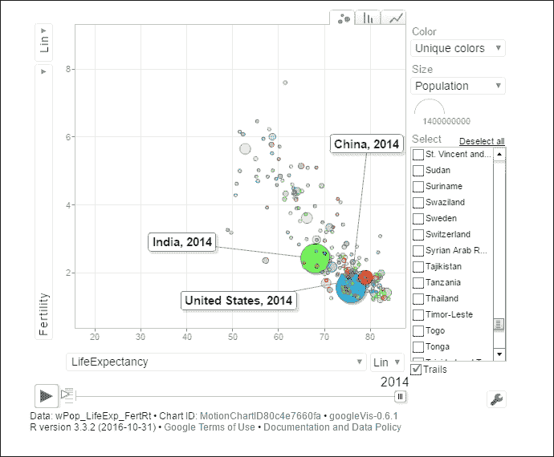

人口增长：

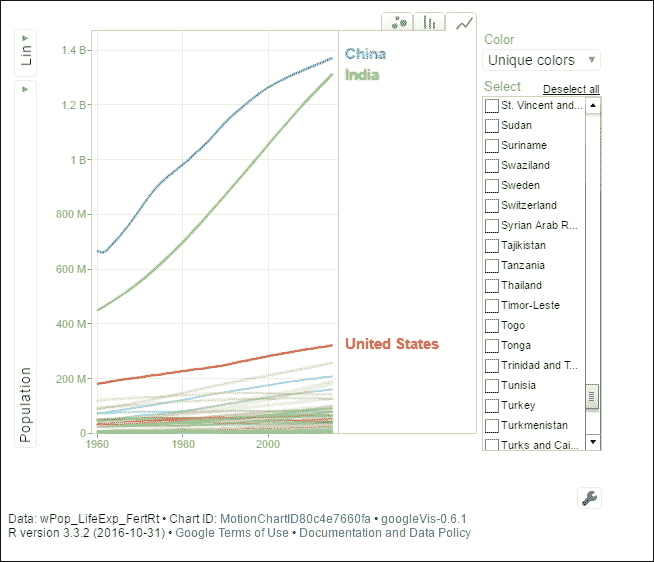

以美元计算的 GDP 增长：

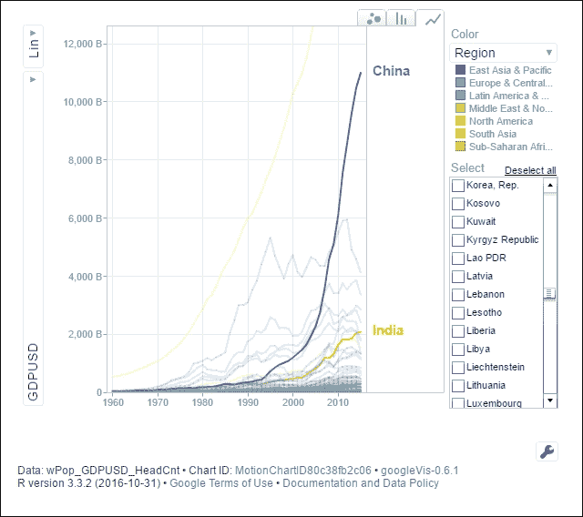

贫困人口比例与人口增长的关系：

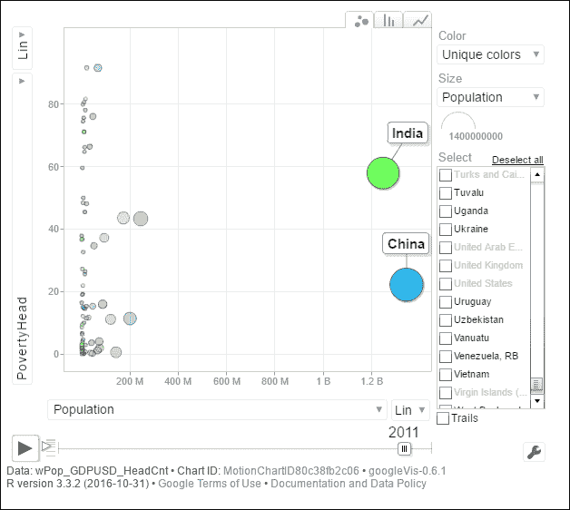

人群获得卫生设施的增长：

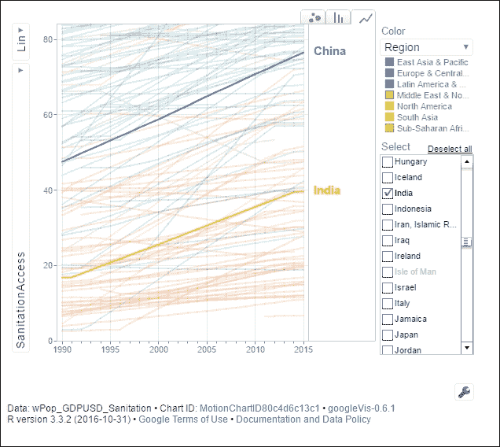

卫生设施普及率：

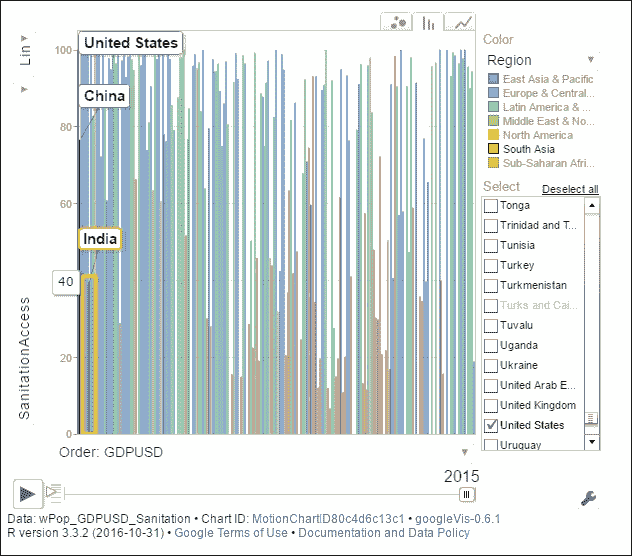

卫生设施普及率的改善与人口增长的关系：

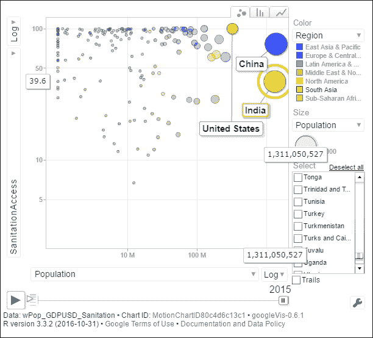

所有国家和地区的电力普及率人口：

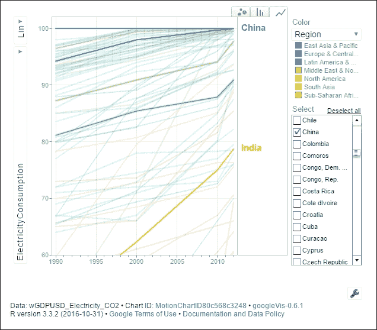

二氧化碳排放（对数刻度）：

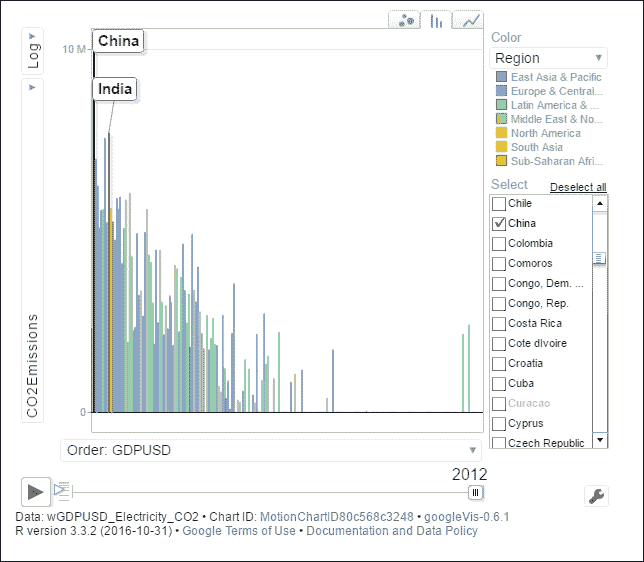

二氧化碳排放与电力消费的关系：

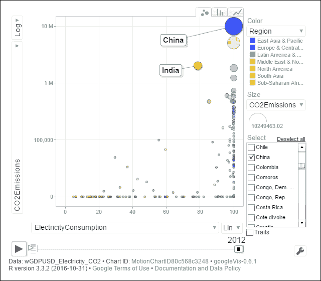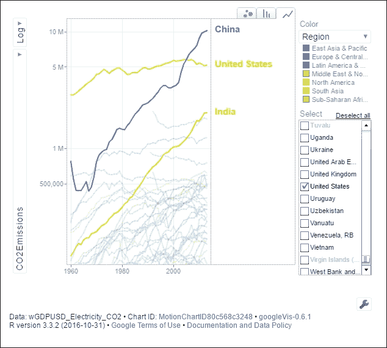
