# 第十三章. 案例研究 - 重新保险合同的定价

# 简介

如同其名，再保险是从保险业务发展而来的，其使用的程度不仅取决于直接承保人要承保的风险的金额，还取决于这些风险的特征。可以进行的再保险业务的量主要取决于任何给定时间可用的直接业务量。再保险的想法根植于与保险产生相同的人类本能，即希望一个人的损失由许多人分担。

# 重新保险合同的定价

保险公司安排重新保险的关键目标包括但不限于：通过将不会因财务限制而承担的那部分风险转嫁给再保险公司，从而增加处理更大风险的能力；增强接受比资本允许的更大保额的能力；通过再保险公司吸收更大的索赔或灾难损失，使年度经营结果稳定；通过加强承保人建立既在规模又在风险质量上同质化的账户的尝试，增加盈利的机会；能够承保新的风险敞口。再保险的功能可以视为提供保护增加能力、财务稳定性、稳定索赔比率、积累不同类别的索赔、风险分散、保护偿付能力边际和稳定利润的服务。再保险有助于吸收由经济变化、社会变化、保险方法的变化以及科学发展引起的新的风险敞口。重新保险合同可以安排的方式只有两种：一种是自愿再保险，针对单一保单的一次性；另一种是合同再保险，针对定义好的保单组的自动安排。

## 准备中...

为了进行重新保险合同的定价，我们将使用收集在飓风数据集上的数据集。

### 第 1 步 - 收集和描述数据

将使用名为 `publicdatamay2007.xls` 的 XLS 格式数据集。该数据集采用标准格式。共有 207 行数据。有 7 个变量。数值变量如下：

+   `年份`

+   `基础经济损失`

+   `标准化 PL05`

+   `标准化 CL05`

非数值变量如下：

+   `飓风描述`

+   `状态`

+   `类别`

## 如何操作...

让我们深入了解细节。

### 第 2 步 - 探索数据

加载以下包：

```py
 > install.packages("gdata")
 > install.packages("evir")
 > library(gdata)
 > library(evir)

```

### 注意

版本信息：本页面的代码在 R 版本 3.2.2 中进行了测试

让我们探索数据并了解变量之间的关系，如下所示。我们将首先导入名为 `publicdatamay2007.xls` 的 XLS 数据文件。我们将把数据保存到 `StormDamageData` 数据框中：

```py
> StormDamageData <- read.xls("d:/publicdatamay2007.xls", sheet = 1)

```

打印 `StormDamageData` 数据框：`head()` 函数返回 `StormDamageData` 数据框的第一部分。将 `StormDamageData` 数据框作为输入参数传递：

```py
> head(StormDamageData)

```

结果如下：

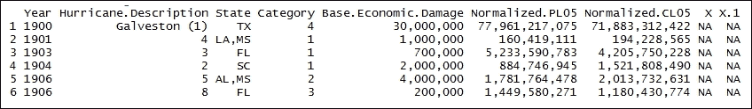

`tail()`函数返回`StormDamageData`框的最后部分，如下所示。将`StormDamageData`框作为输入参数传递。

```py
> tail(StormDamageData)

```

结果如下：

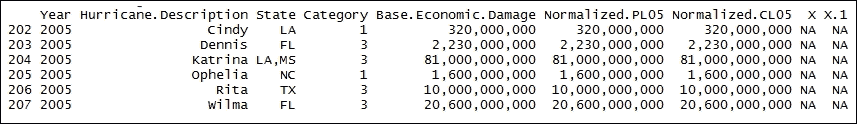

探索`StormDamageData`数据框的维度：`dim()`函数返回`StormDamageData`框的维度。将`StormDamageData`数据框作为输入参数传递。结果清楚地表明有 207 行数据和九列：

```py
> dim(StormDamageData)

```

结果如下：

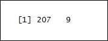

### 步骤 3 - 计算个别损失索赔

格式化数据：包装函数`ChangeFormat`消除了传递的值中的逗号（`,`），并以数值形式返回结果：

```py
 > ChangeFormat <- function(x){
 x = as.character(x)
 for(i in 1:10){x=sub(",","",as.character(x))}
 return(as.numeric(x)) }

```

将`StormDamageData`数据框存储在基础中：

```py
> base <- StormDamageData[,1:4]

```

调用包装函数，`ChangeFormat`：将`StormDamageData`数据框中的`Base.Economic.Damage`作为输入传递。`Vectorize()`函数创建了对`ChangeFormat()`函数的包装。结果存储在`base$Base.Economic.Damage`数据框中：

```py
> base$Base.Economic.Damage <- Vectorize(ChangeFormat)(StormDamageData$Base.Economic.Damage)

```

调用包装函数，`ChangeFormat`：将`StormDamageData`数据框中的`Normalized.PL05`作为输入传递。结果随后存储在`base$ Normalized.PL05`数据框中：

```py
> base$Normalized.PL05 <- Vectorize(ChangeFormat)(StormDamageData$Normalized.PL05)

```

调用包装函数，`ChangeFormat`：将`StormDamageData`数据框中的`Normalized.CL05`作为输入传递。结果随后存储在`base$ Normalized.CL05`数据框中：

```py
> base$Normalized.CL05 <- Vectorize(ChangeFormat)(StormDamageData$Normalized.CL05)

```

打印`base`数据框：`head()`函数返回基础数据框的前部分。将`base`数据框作为输入参数传递：

```py
> head(base)

```

结果如下：

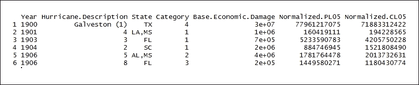

绘制 207 个飓风的标准化成本图：`plot()`是一个通用函数。`base$Normalized.PL05/1e9`代表图的*x*坐标。`type="h"`代表直方图表示风格。`ylim=c(0,155)`将 y 轴表示的上限设置为 0（下限）和 155（上限）。x 轴代表损失索引：

```py
> plot(base$Normalized.PL05/1e9, type="h", ylim=c(0,155), main = "207 Hurricanes, Normalized Costs: 1900 - 2005", xlab = "Index of Loss", ylab = "Normalized Costs", col = "red")

```

结果如下：

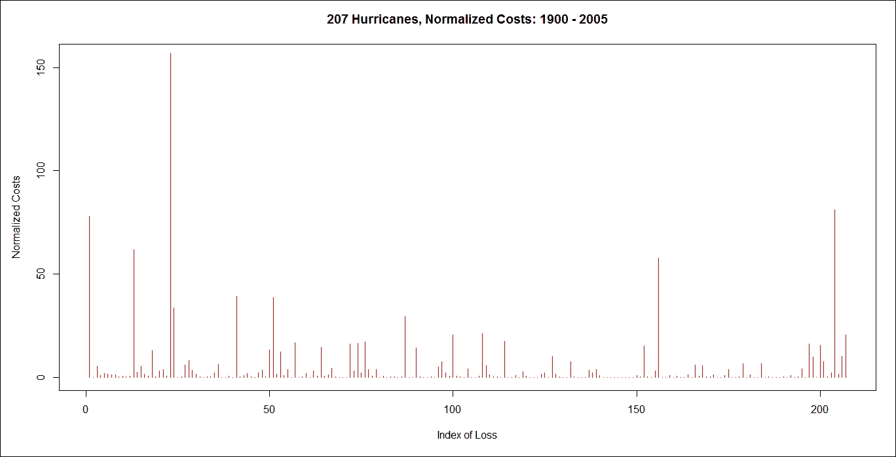

### 步骤 4 - 计算飓风数量

提取每年飓风计数及其频率：基础数据框包含前文所示详情。`table()`使用`base$Year`构建每年飓风计数的列联表。结果存储在`TestBase`数据框中：

```py
> TestBase <- table(base$Year)

```

打印`TestBase`数据框的内容：

```py
> TestBase

```

结果如下：

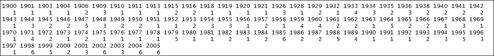

从 `TestBase` 数据框中提取年份：`names()` 函数提取每个年份的名称。`as.numeric()` 将提取的每个年份名称转换为数值。结果存储在年份数据框中：

```py
> years <- as.numeric(names(TestBase))

```

打印 `years` 数据框的内容：

```py
> years

```

结果如下：

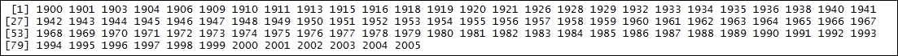

从 `TestBase` 数据框中提取每年飓风计数的频率：`names()` 提取每年飓风计数的频率。`as.numeric()` 将提取的每个飓风计数频率转换为数值。结果存储在频率数据框中：

```py
> frequency <- as.numeric(TestBase)

```

打印 `frequency` 数据框的内容：

```py
> frequency

```

结果如下：


从 `TestBase` 数据框中提取没有飓风发生年份的飓风计数频率：结果存储在 `years0frequency` 数据框中：

```py
> years0frequency <- (1900:2005)[which(!(1900:2005)%in%years)]

```

打印 `years0frequency` 数据框的内容：

```py
> years0frequency

```

结果如下：

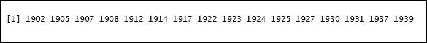

提取每年飓风的全部计数。结果存储在 `StormDamageData` 数据框中：

```py
> StormDamageData <- data.frame(years=c(years, years0frequency), frequency=c(frequency, rep(0,length(years0frequency))))

```

打印 `StormDamageData` 数据框。`head()` 函数返回 `StormDamageData` 数据框的前部分。将 `StormDamageData` 数据框作为输入参数传递：

```py
> head(StormDamageData) 

```

结果如下：

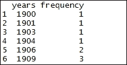

绘制 1900 年到 2005 年每年飓风的年份和频率计数：`plot()` 是一个通用函数。years 代表图表的 *x* 坐标，而 frequency 代表图表的 y 坐标。`type="h"` 代表直方图表示风格：

```py
> plot(years, frequency, type="h", main = "Frequency of Hurricanes: 1900 - 2005", xlab = "Time (Years)", ylab = "Annual Frequency", col = "red")

```

结果如下：

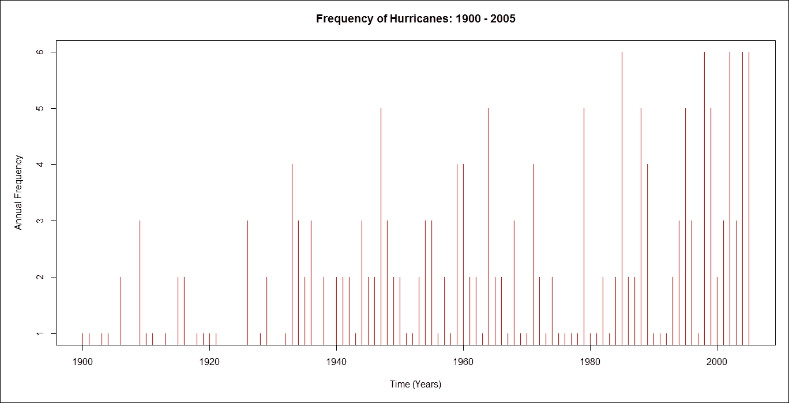

计算从 1900 年到 2005 年所有年份的飓风数量平均值：

```py
> mean(StormDamageData$frequency)

```

结果如下：

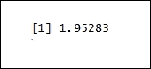

平均每年有两次飓风。

### 步骤 5 - 构建预测模型

让我们找出飓风发生频率中可能存在的线性趋势。使用 `glm()` 函数拟合广义线性模型。`frequency~years` 定义了公式。`data = StormDamageData` 定义了公式的数据集。`family=poisson(link="identity")` 函数表示泊松分布。

使用 `lm()` 函数拟合线性模型。`frequency~years` 定义了公式。`data = StormDamageData` 定义了公式的数据集。使用以下命令：

```py
> LinearTrend <- glm(frequency~years, data = StormDamageData, family=poisson(link="identity"), start=lm(frequency~years, data = StormDamageData)$coefficients)

```

打印 `LinearTrend` 的详细信息：

```py
> LinearTrend

```

结果如下：

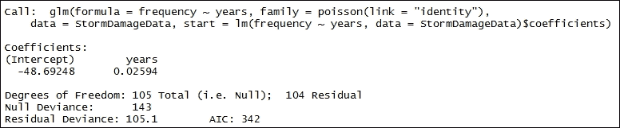

探索飓风发生频率中可能存在的指数趋势：

使用 `glm()` 函数拟合广义线性模型。`frequency~years` 定义公式。`data = StormDamageData` 定义用于公式的数据集。`family=poisson(link="identity")` 函数表示泊松分布。我们通过以下命令实现：

```py
> ExpTrend <- glm(frequency~years, data=StormDamageData, family = poisson(link="log"))

```

打印 `ExpTrend` 的详细信息：

```py
> ExpTrend

```

结果如下：

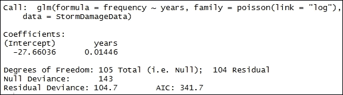

绘制 1900 年至 2005 年间每年飓风的年份和频率计数：`plot()` 是一个通用函数。年份代表图形的 *x* 坐标，而频率代表图形的 *y* 坐标。`type="h"` 代表直方图表示风格。`ylim=c(0,6)` 函数将 *y* 轴表示的上限设置为 `0`（下限）和 `6`（上限）：

```py
> plot(years, frequency, type='h', ylim=c(0,6), main = "No. of Major Hurricanes Predicted for 2014", xlim=c(1900,2020))

```

结果如下：

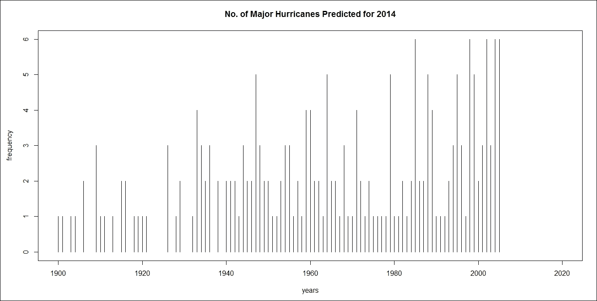

根据 2014 年的指数趋势预测趋势：使用 `predict()` 函数根据线性模型对象预测值。`ExpTrend` 代表从 `lm` 类继承的对象。`newdata = data.frame(years=1890:2030)` 函数代表用于查找预测变量的数据框：

```py
> cpred1 <- predict(ExpTrend, newdata = data.frame(years=1890:2030), type="response")

```

打印 `cpred1` 的详细信息：

```py
> cpred1

```

结果如下：


将 `cpred1` 的点与线段连接：`lines()` 是一个通用函数，它将 `cpred1` 数据框的值作为 *y* 轴的坐标，并用线段连接相应的点。`1890:2030` 代表 *x* 轴：

```py
> lines(1890:2030,cpred1,col="blue")

```

结果如下：

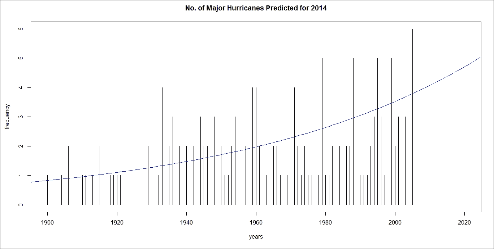

根据 2014 年的线性趋势预测趋势：使用 `predict()` 函数根据线性模型对象预测值。`LinearTrend` 代表从 `lm` 类继承的对象。`newdata = data.frame(years=1890:2030)` 函数代表用于查找预测变量的数据框：

```py
> cpred0 <- predict(LinearTrend, newdata=data.frame(years=1890:2030), type="response")

```

打印 `cpred0` 的详细信息：

```py
> cpred0

```

结果如下：

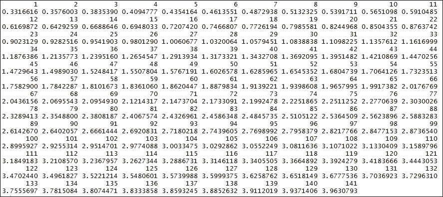

将 `cpred0` 的点与线段连接：`lines()` 是一个通用函数，它将 `cpred0` 数据框的值作为 *y-* 轴的坐标，并用线段连接相应的点。`1890:2030` 代表 *x*-轴：

```py
> lines(1890:2030, cpred0, col="red"))

```

结果如下：


绘制平均值：`abline()` 作为函数使用平均值绘制直线，该平均值是 `StormDamageData$frequency` 的 `1.95283`。`h = mean(StormDamageData$frequency)` 是水平线的 *y* 值：

```py
> abline(h = mean(StormDamageData$frequency), col="black")

```

结果如下：

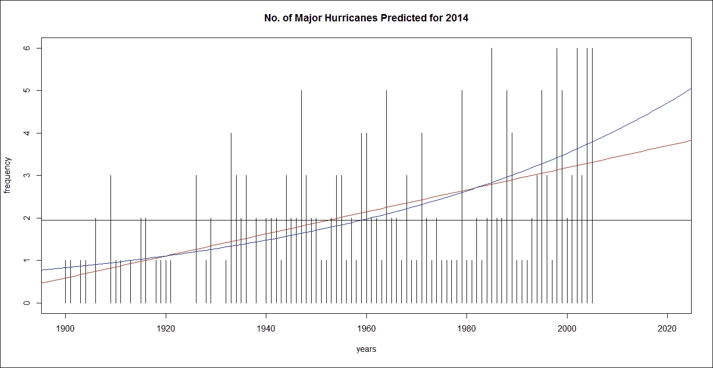

将 `StormDamageData$frequency`、`cpred0` 和 `cpred1` 的数据框值合并为平均值：

```py
> predictions <- cbind(constant = mean(StormDamageData$frequency), linear = cpred0[126], exponential=cpred1[126])

```

打印预测的详细信息：

```py
> predictions

```

结果如下：

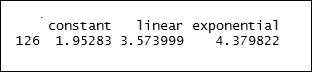

在 2014 年的图表上绘制预测点的位置：

```py
> points(rep((1890:2030)[126],3), predictions, col=c("black","red","blue"), pch=19)

```

结果如下：

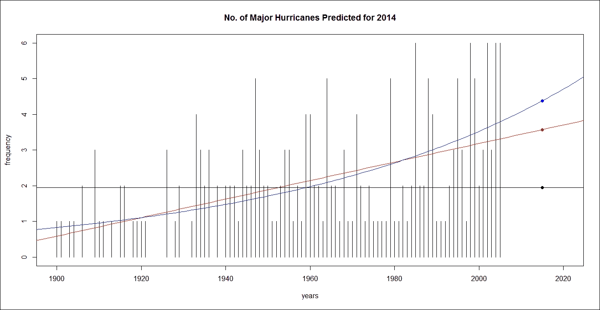

重要的是要注意，通过改变预测模型，保费将会发生变化。在平坦的预测中，不到两个（主要）飓风，但以指数趋势，则超过四个（主要）飓风。

### 步骤 6 - 计算再保险合同的纯保费

现在我们找到一个合适的模型来计算具有免赔额和有限保额的再保险合同的保费。使用希尔尾指数估计器估计尾指数如下。`hill()` 是用于估计重尾数据的指数尾部的函数，`base$Normalized.PL05`：

```py
> hill(base$Normalized.PL05)

```

结果如下：


前面的图示显示，主要飓风的成本具有重尾分布。

将帕累托模型的损失阈值设置为 5 亿以上如下：

```py
> threshold <- .5

```

我们使用以下命令返回一个表示广义帕累托模型对超过阈值的拟合的 `gpd` 类对象。数据集由 `base$Normalized.PL05/1e9/20` 表示：

```py
 > gpd.PL <- gpd(base$Normalized.PL05/1e9/20, threshold)$par.ests

```

结果如下：

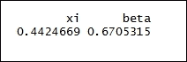

计算超过阈值 0.5 的 `base$Normalized.CL05/1e9/20` 数据框的均值：

```py
> mean(base$Normalized.CL05/1e9/20> .5)

```

结果如下：

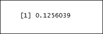

假设损失超过 5 亿，我们现在可以计算再保险合同的期望值：

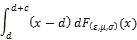

```py
 > ExpectedValue <- function(yinf,ysup,xi,beta){
 + as.numeric(integrate(function(x) (x-yinf) * dgpd(x,xi,mu=threshold,beta),
 + lower=yinf,upper=ysup)$value +
 + (1-pgpd(ysup,xi,mu=threshold,beta))*(ysup-yinf))
 + }

```

按如下方式找到预测数据框的均值：

```py
> predictions[1]

```

结果如下：

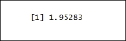

计算超过阈值 0.5 的 `base$Normalized.PL05/1e9/20` 数据框的均值：

```py
> mean(base$Normalized.PL05/1e9/20>.5)

```

结果如下：

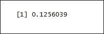

这表明每个飓风有 12.5% 的可能性会使保险公司损失超过 5 亿。

计算再保险合同的期望值：

```py
> ExpectedValue(2,6,gpd.PL[1],gpd.PL[2])*1e3

```

结果如下：

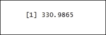

这表明再保险公司预期的还款金额约为 3.309865 亿。

计算再保险合同的保费：

```py
> predictions[1] * mean(base$Normalized.PL05/1e9/20> .5) * ExpectedValue(2, 6, gpd.PL[1], gpd.PL[2]) * 1e3

```

结果如下：

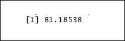
