# 第十四章. 案例研究 - 电力消费预测

# 简介

电力是唯一一种生产和消费同时进行的商品；因此，在电力市场必须始终保持供应和消费之间的完美平衡。对于任何国家来说，预测电力消费都是国家利益所在，因为电力是能源的关键来源。可靠的能源消费、生产和分配预测符合稳定和长期的政策。规模经济、关注环境问题、监管要求、良好的公众形象，以及通货膨胀、能源价格快速上涨、替代燃料和技术的出现、生活方式的变化等，都产生了使用建模技术的需求，这些技术可以捕捉价格、收入、人口、技术以及其他经济、人口、政策和技术变量的影响。

低估可能导致产能利用率不足，这会导致服务质量下降，包括局部停电，甚至停电。而另一方面，高估可能导致授权一个可能在未来几年内不需要的工厂。要求是确保投资的最佳时机，这是一个长期考虑，合理化定价结构并设计需求管理计划，以满足短期或中期需求的特点。预测进一步推动各种投资、建设和保护计划。

## 准备工作

为了进行电力消费预测，我们将使用一个收集于智能电表数据的数据集，该数据集按四个位于不同行业的行业进行时间序列汇总。

### 第 1 步 - 收集和描述数据

应使用名为 `DT_4_ind` 的数据集。数值变量如下：

+   `value`

非数值变量如下：

+   `date_time`

+   `week`

+   `date`

+   `type`

## 如何操作...

让我们深入了解。

### 第 2 步 - 探索数据

以下包需要在第一步加载：

```py

> install.packages("feather")
> install.packages("data.table")
> install.packages("ggplot2")
> install.packages("plotly")
> install.packages("animation")
> library(feather)
> library(data.table)
> library(ggplot2)
> library(plotly)
> library(animation)

```

### 注意

版本信息：本页面的代码在 R 版本 3.2.2 中进行了测试

让我们探索数据并了解变量之间的关系。

检查对象是否为 `as.data.table()`：数据框的二进制列式序列化使用 `feather` 实现。为了方便在不同数据分析语言之间共享、读取和写入数据，使用 `feather`。使用 `read_feather()` 函数读取 feather 文件。

我们将首先导入 `DT_4_ind` 数据集。我们将把数据保存到 `AggData` 数据框中：

```py
> AggData <- as.data.table(read_feather("d:/DT_4_ind"))

```

探索 `AggData` 数据框的内部结构：`str()` 函数显示数据框的内部结构。`AggData` 作为 R 对象传递给 `str()` 函数：

```py
> str(AggData)

```

结果如下：

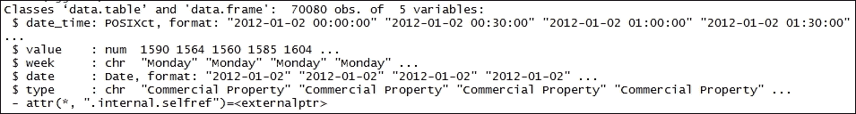

打印 `AggData` 数据框。`head()` 函数返回基本数据框的前部分。将 `AggData` 数据框作为输入参数传递：

```py
> head(AggData)

```

结果如下：

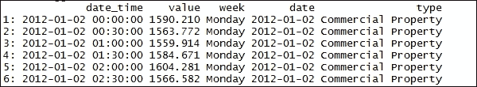

绘制按行业汇总的电力消耗时间序列数据。

`ggplot()` 函数声明用于图形的数据框，并指定在整个图形中要共同使用的绘图美学集。`data = AggData` 是用于绘图的数据库集，而 `aes()` 描述了数据中的变量如何映射到视觉属性。`geom_line()` 生成尝试连接所有观察值的单条线：

```py
    > ggplot(data = AggData, aes(x = date, y = value)) +
+ geom_line() + 
    + facet_grid(type ~ ., scales = "free_y") +
    + theme(panel.border = element_blank(),
    + panel.background = element_blank(),
    + panel.grid.minor = element_line(colour = "grey90"),
    + panel.grid.major = element_line(colour = "green"),
    + panel.grid.major.x = element_line(colour = "red"),
    + axis.text = element_text(size = 10),
    + axis.title = element_text(size = 12, face = "bold"),
    + strip.text = element_text(size = 9, face = "bold")) +
    + labs(title = "Electricity Consumption - Industry", x = "Date", y = "Load (kW)")

```

结果如下：

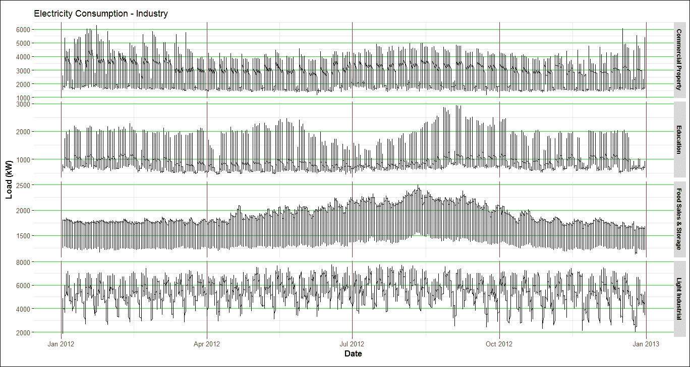

### 注意

重要的一点是，与其它行业相比，食品销售与储存行业的消费在假日期间变化不大。

### 步骤 3 - 时间序列 - 回归分析

回归模型如下所示：

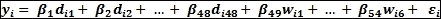

变量（输入）有两种类型的季节性虚拟变量--每日 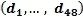 和每周 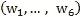 。 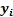 是时间 *i* 时的电力消耗，其中 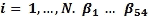 是要估计的回归系数。

打印 `AggData` 数据框的内容：

```py
> AggData

```

结果如下：

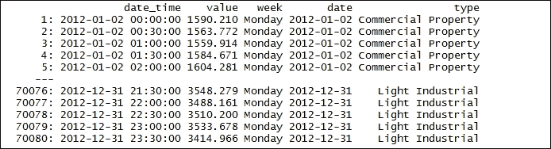

将工作日的字符转换为整数：使用 `as.factor()` 函数将向量编码为因子。`as.integer()` 函数创建 `AggData[, week]` 的整数类型对象：

```py
> AggData[, week_num := as.integer(as.factor(AggData[, week]))]

```

打印更改后的 `AggData` 数据框内容：

```py
> AggData

```

结果如下：

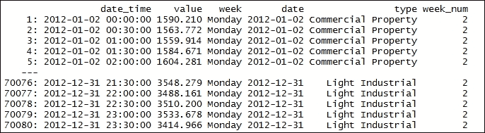

使用以下方法从 `AggData` 数据框中提取唯一的行业类型：

```py
 > n_type <- unique(AggData[, type]) 

```

打印更改后的数据框 `n_type` 内容：

```py
 > n_type 

```

结果如下：

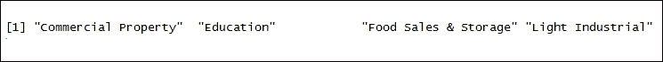

使用以下方法从 `AggData` 数据框中提取唯一日期：

```py
 > n_date <- unique(AggData[, date]) 

```

使用以下方法从 `AggData` 数据框中提取唯一的工作日：

```py
 > n_weekdays <- unique(AggData[, week]) 

```

使用以下方法设置 `period` 值：

```py
 > period <- 48 

```

在样本数据集上执行回归分析。

我们在两周的时间内提取教育（学校）建筑。结果存储在 `data_reg` 数据框中。`n_type[2]` 代表教育建筑，而 `n_date[57:70]` 表示两周的时间段：

```py
 > data_reg <- AggData[(type == n_type[2] & date %in% n_date[57:70])] 

```

打印更改后的 `data_reg` 数据框内容：

```py
 > data_reg 

```

结果如下：

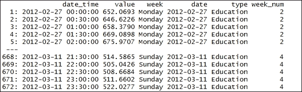

在 2 周期间（2 月 27 日至 3 月 12 日）绘制教育（学校建筑）样本数据集：

`ggplot()` 函数声明了图形的输入数据框并指定了在整个图形中要通用的绘图美学集。`data_reg` 是用于绘图的数据库，而 `aes()` 描述了数据中的变量如何映射到视觉属性。`geom_line()` 生成单条线，试图连接所有观测值：

```py
    > ggplot(data_reg, aes(date_time, value)) +
    + geom_line() +
    + theme(panel.border = element_blank(),
    + panel.background = element_blank(),
    + panel.grid.minor = element_line(colour = "grey90"),
    + panel.grid.major = element_line(colour = "green"),
    + panel.grid.major.x = element_line(colour = "red"),
    + axis.text = element_text(size = 10),
+ axis.title = element_text(size = 12, face = "bold")) 
    + labs(title = "Regression Analysis - Education Buildings", x = "Date", y = "Load (kW)")

```

结果如下：

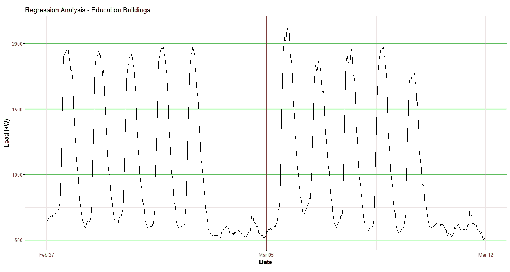

从 `data_reg` 数据框中提取行数：

```py
 > N <- nrow(data_reg) 

```

计算训练集中的天数：

```py
 > trainset_window <- N / period 

```

创建独立的季节性虚拟变量--每日 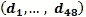 和每周 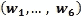 。每日季节性值从 *1,.....period, 1,.......period* 中提取 48 个每日变量的向量。每周值从 `week_num` 中提取。然后将结果存储在一个向量 `matrix_train` 中：

```py
 > matrix_train <- data.table(Load = data_reg[, value], Daily = as.factor(rep(1:period, trainset_window)), Weekly = as.factor(data_reg[, week_num])) 

```

在更改后打印 `matrix_train` 数据框的内容：

```py
 > matrix_train 

```

结果如下：

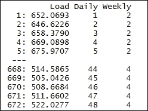

创建线性模型。`lm()` 函数拟合线性模型：`Load ~ 0 + .` 是公式。由于 `lm()` 自动添加到线性模型的截距，我们将其现在定义为 `0`。`data = matrix_train` 定义了包含数据的数据框：

```py
 > linear_model_1 <- lm(Load ~ 0 + ., data = matrix_train) 

```

在更改后打印 `linear_model_1` 数据框的内容：

```py
 > linear_model_1 

```

结果如下：

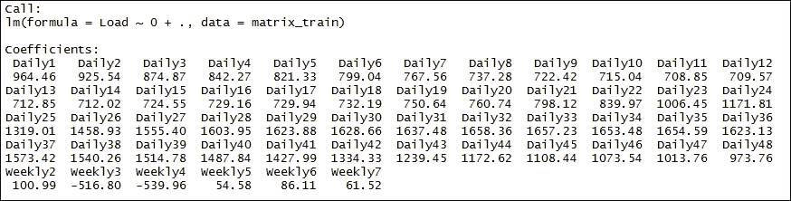

生成模型 `linear_model_1` 的结果摘要：

```py
> summary_1 <- summary(linear_model_1)

```

在更改后打印 `summary_1` 数据框的内容：

```py
 > summary_1 

```

结果如下：

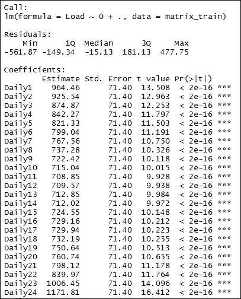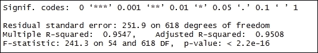

使用 `summary_1` 数据框中的 `r.squared` 属性提取决定系数：

```py
> paste("R-squared: ", round(summary_1$r.squared, 3), ", p-value of F test: ", 1-pf(summary_1$fstatistic[1], summary_1$fstatistic[2], summary_1$fstatistic[3]))

```

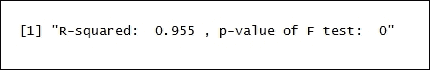

从 `data_reg` 列表创建一个 `data.table`：

```py
 > datas <- rbindlist(list(data_reg[, .(value, date_time)], data.table(value = linear_model_1$fitted.values, data_time = data_reg[, date_time]))) 

```

在更改后打印 `datas` 数据框的内容：

```py
 > datas 

```

结果如下：

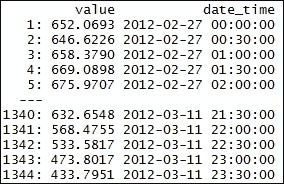

绘制 `linear_model_1` 的拟合值。

`data = datas` 是用于绘图的数据库，而 `aes()` 描述了数据中的变量如何映射到视觉属性。`geom_line()` 生成单条线，试图连接所有观测值：

```py
 > ggplot(data = datas, aes(date_time, value, group = type, colour = type)) + geom_line(size = 0.8) + theme_bw() + 
 + labs(x = "Time", y = "Load (kW)", title = "Fit from Multiple Linear Regression") 

```

结果如下：

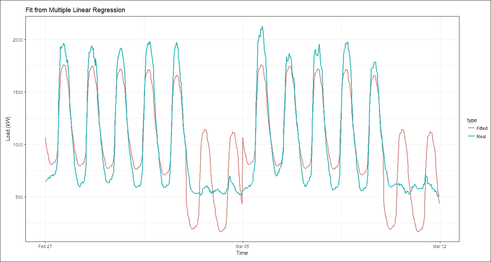

绘制拟合值与残差值的关系图。

`data` 是用于绘图的数据库，而 `aes()` 描述了数据中的变量如何映射到视觉属性：

```py
> ggplot(data = data.table(Fitted_values =
linear_model_2$fitted.values, Residuals = linear_model_2$residuals),
aes(Fitted_values, Residuals)) + geom_point(size = 1.7)
+ geom_hline(yintercept = 0, color = "red", size = 1) +
+ labs(title = "Fitted values vs Residuals")

```

结果如下：

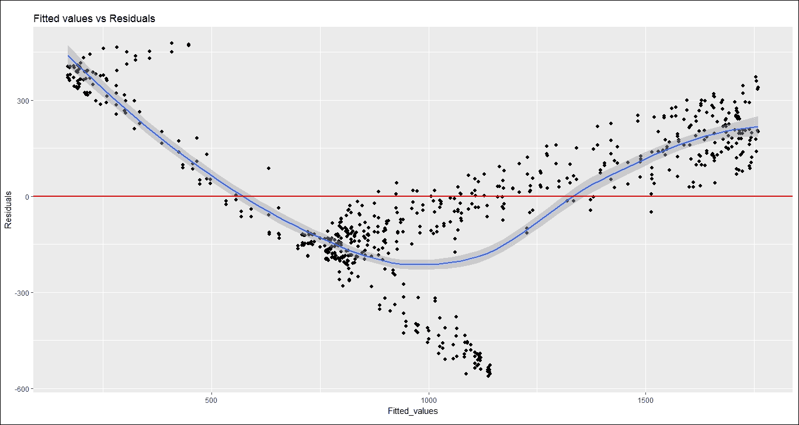

函数首先给出线性模型的标准化残差。然后计算`1Q`和`4Q`线。接着，从正态分布生成分位数分布。然后计算斜率和截距，并将其绘制出来：

```py
    > ggQQ <- function(lm) {
    # extracting residuals from the fit
    + d <- data.frame(std.resid = rstandard(lm))
    # calculate 1Q, 4Q line
    + y <- quantile(d$std.resid[!is.na(d$std.resid)], c(0.25, 0.75))
    # calculate 1Q, 4Q line
    + x <- qnorm(c(0.25, 0.75))
    + slope <- diff(y)/diff(x)
    + int <- y[1L] - slope * x[1L]
+ 
    + p <- ggplot(data = d, aes(sample = std.resid)) +
+ stat_qq(shape = 1, size = 3) + 
+ labs(title = "Normal Q-Q", 
+ x = "Theoretical Quantiles", 
+ y = "Standardized Residuals") + 
    + geom_abline(slope = slope, intercept = int, linetype = "dashed",
+ size = 1, col = "firebrick1") 
    + return(p)
    + }

```

我们可以使用以下命令绘制 Q-Q 图：

```py
 > ggQQ(linear_model_1) 

```

结果如下：

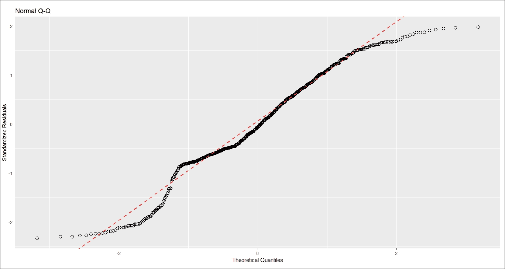

如清晰可见，点不在红色线上，它们不正常。由于周变量的估计系数，白天的测量值不断移动，但白天的行为没有被捕捉到。我们需要捕捉这种行为，因为周末的行为尤其不同。

### 步骤 4 - 时间序列 - 改进回归分析

创建线性模型：`lm()`函数拟合线性模型。`Load ~ 0 + Daily + Weekly + Daily:Weekly`是新的公式。由于`lm()`自动添加到线性模型的截距，我们将其现在定义为`0`。`data = matrix_train`定义了包含数据的数据框：

```py
> linear_model_2 <- lm(Load ~ 0 + Daily + Weekly + Daily:Weekly, data = matrix_train)

```

在更改后打印`linear_model_2`数据框的内容：

```py
 > linear_model_2 

```

结果如下：

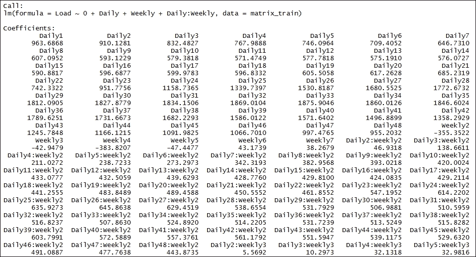

比较来自`linear_model_1`和`linear_model_2`模型摘要的 R-squared 值：

```py
> c(Previous = summary(linear_model_1)$r.squared, New = summary(linear_model_2)$r.squared)

```

结果如下：

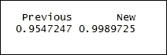

第二个模型的 R-squared 值有显著提高。

图形比较`linear_model_1`和`linear_model_2`模型的残差。

```py
 > ggplot(data.table(Residuals = c(linear_model_1$residuals, linear_model_2$residuals), Type = c(rep("Multiple Linear Reg - simple", nrow(data_reg)), rep("Multiple Linear Reg with interactions", nrow(data_reg)))), aes(Type, Residuals, fill = Type)) + geom_boxplot()
 > ggplotly()

```

结果如下：

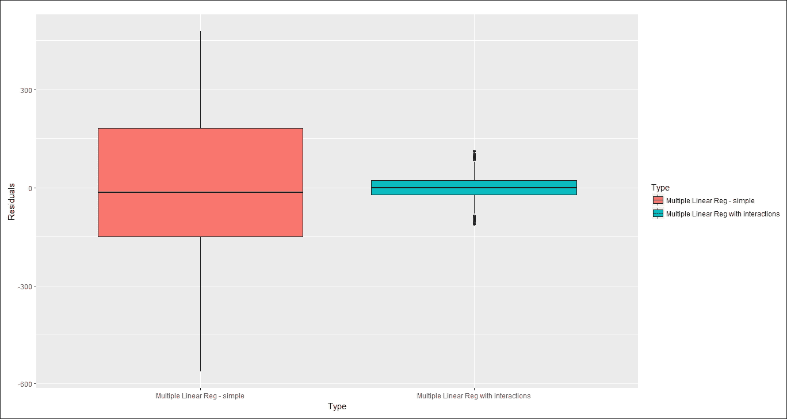

`linear_model_1`的残差细节。

结果如下：

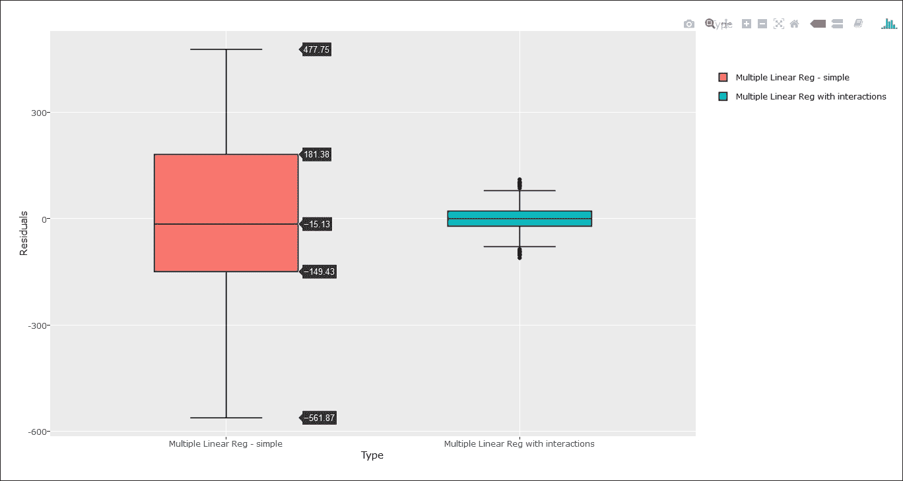

`linear_model_2`的残差细节。

结果如下：

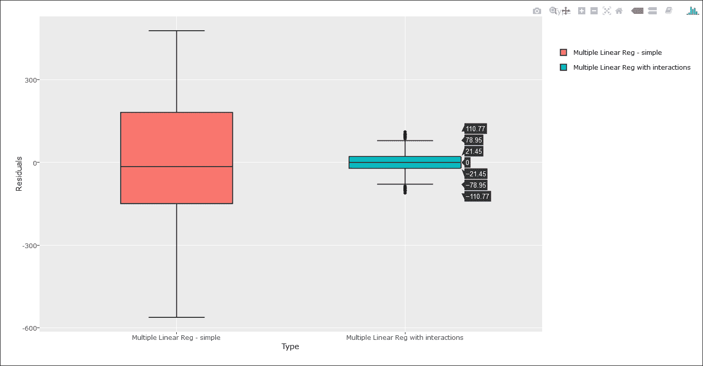

从`data_reg`和`linear_model_2`的列表中创建一个`data.table`：

```py
 > datas <- rbindlist(list(data_reg[, .(value, date_time)], data.table(value = linear_model_2$fitted.values, data_time = data_reg[, date_time]))) 

```

在更改后打印`datas`数据框的内容：

```py
 > datas 

```

结果如下：

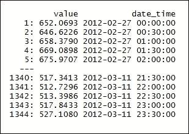

向`datas`添加`Real`和`Fitted`列：

```py
 > datas[, type := rep(c("Real", "Fitted"), each = nrow(data_reg))] 

```

在更改后打印`datas`数据框的内容：

```py
 > datas 

```

结果如下：

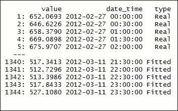

绘制`linear_model_2`的拟合值。

`data = datas`是用于绘图的数据库集，而`aes()`描述了数据中的变量如何映射到视觉属性。`geom_line()`生成试图连接所有观察值的单一线条：

```py
 > ggplot(data = datas, aes(date_time, value, group = type, colour =
type)) + geom_line(size = 0.8) + theme_bw() +
+ labs(x = "Time", y = "Load (kW)", title = "Fit from Multiple Linear
Regression")

```

结果如下：

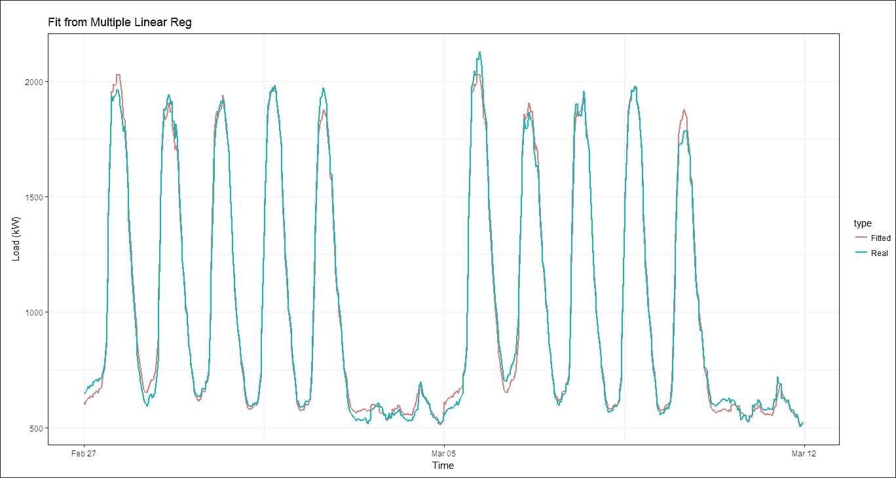

与之前 `linear_model_1` 的绘图相比，拟合值和实际值非常接近。

绘制拟合值与残差值的关系图。`Data` 是用于绘图的数据库，而 `aes()` 描述了数据中的变量如何映射到视觉属性：

```py
 > ggplot(data = data.table(Fitted_values = linear_model_2$fitted.values, Residuals = linear_model_2$residuals), aes(Fitted_values, Residuals)) + geom_point(size = 1.7) 
 + geom_hline(yintercept = 0, color = "red", size = 1) + 
 + labs(title = "Fitted values vs Residuals") 

```

结果如下：

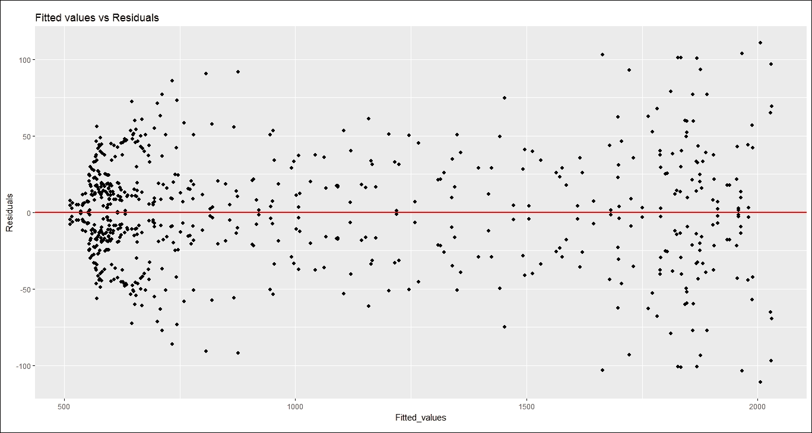

与之前 `linear_model_1` 的绘图相比，这些图看起来更接近残差线。

我们可以使用以下方式绘制 Q-Q 图：

```py
 > ggQQ(linear_model_2) 

```

结果如下：

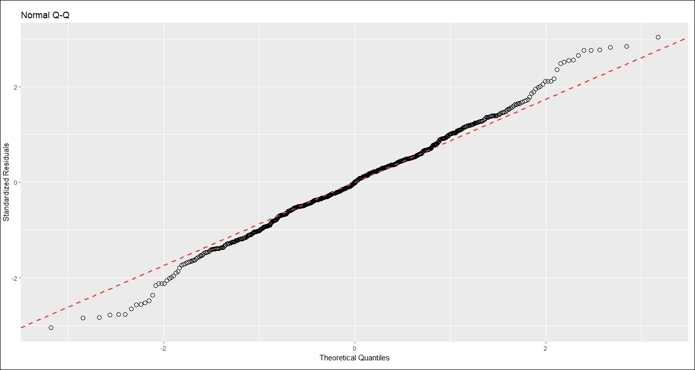

### 步骤 5 - 构建预测模型

我们可以定义一个函数来返回一周前预测的预测结果。输入参数是 `data` 和 `set_of_date`：

```py
    > predWeekReg <- function(data, set_of_date){
    + #creating the dataset by dates
+ data_train <- data[date %in% set_of_date] 
    + N <- nrow(data_train)
    +
    + # number of days in the train set
    + window <- N / period # number of days in the train set
    +
    + #1, ..., period, 1, ..., period - daily season periods
    + #feature "week_num"- weekly season
    + matrix_train <- data.table(Load = data_train[, value],
    + Daily = as.factor(rep(1:period, window)),
    + Weekly = as.factor(data_train[, week_num]))
    +
    + #creating linear model.
    + # formula - Load ~ 0 + Daily + Weekly + Daily:Weekly
    + # dataset - data = matrix_train
    + lm_m <- lm(Load ~ 0 + Daily + Weekly + Daily:Weekly, data = matrix_train)
+ 
    + #forecast of one week ahead
    + pred_week <- predict(lm_m, matrix_train[1:(7*period), -1, with = FALSE])
    + return(as.vector(pred_week))
    + }

```

定义评估预测的平均绝对百分比误差：

```py
 > mape <- function(real, pred){
 + return(100 * mean(abs((real - pred)/real)))
 + }

```

将训练集长度设置为 2 周，因此减去 2。将生成 50 周的预测。使用滑动窗口方法进行训练预测，为每种行业进行预测：

```py
> n_weeks <- floor(length(n_date)/7) - 2

```

打印周数：

```py
> n_weeks

```

结果如下：

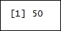

计算每种行业一周前预测的预测结果。

调用函数返回 `AggData` 商业地产和数据集一周前预测的预测结果：

```py
 > lm_pred_weeks_1 <- sapply(0:(n_weeks-1), function(i)
 + predWeekReg(AggData[type == n_type[1]], n_date[((i*7)+1):((i*7)+7*2)]))

```

调用函数返回 `AggData` - 教育和日期集一周前预测的预测结果：

```py
 > lm_pred_weeks_2 <- sapply(0:(n_weeks-1), function(i)
 + predWeekReg(AggData[type == n_type[2]], n_date[((i*7)+1):((i*7)+7*2)]))

```

调用函数返回 `AggData` 食品和销售以及日期集一周前预测的预测结果：

```py
 > lm_pred_weeks_3 <- sapply(0:(n_weeks-1), function(i)
 + predWeekReg(AggData[type == n_type[3]], n_date[((i*7)+1):((i*7)+7*2)]))

```

调用函数返回 `AggData` 照明行业和日期集一周前预测的预测结果：

```py
 > lm_pred_weeks_4 <- sapply(0:(n_weeks-1), function(i)
 + predWeekReg(AggData[type == n_type[4]], n_date[((i*7)+1):((i*7)+7*2)]))

```

计算每种行业的平均绝对百分比误差以评估预测。调用函数返回平均绝对百分比。计算评估 `AggData` 照明行业和日期集预测的误差：

```py
 > lm_err_mape_1 <- sapply(0:(n_weeks-1), function(i)
 + mape(AggData[(type == n_type[1] & date %in% n_date[(15+(i*7)):(21+(i*7))]), value],
 + lm_pred_weeks_1[, i+1]))

```

打印 `lm_err_mape_1` 数据框：

```py
> lm_err_mape_1

```

结果如下：

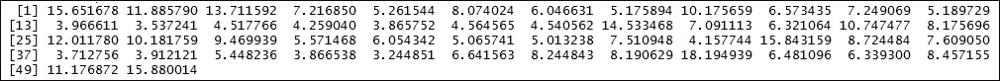

调用函数返回评估 `AggData` 教育和日期集预测的平均绝对百分比误差：

```py
 > lm_err_mape_2 <- sapply(0:(n_weeks-1), function(i)
 + mape(AggData[(type == n_type[2] & date %in% n_date[(15+(i*7)):(21+(i*7))]), value],
 + lm_pred_weeks_2[, i+1]))

```

打印 `lm_err_mape_2` 数据框：

```py
> lm_err_mape_2

```

结果如下：

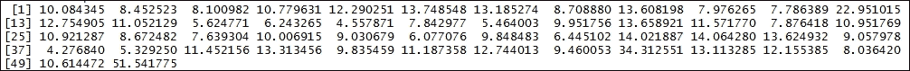

调用函数返回评估 `AggData` 食品和销售以及日期集预测的平均绝对百分比误差：

```py
 > lm_err_mape_3 <- sapply(0:(n_weeks-1), function(i)
 + mape(AggData[(type == n_type[3] & date %in% n_date[(15+(i*7)):(21+(i*7))]), value],
 + lm_pred_weeks_3[, i+1]))

```

打印 `lm_err_mape_3` 数据框：

```py
> lm_err_mape_3

```

结果如下：

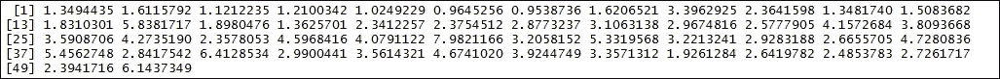

调用函数返回评估 `AggData` 照明行业和日期集预测的平均绝对百分比误差：

```py
 > lm_err_mape_4 <- sapply(0:(n_weeks-1), function(i)
 + mape(AggData[(type == n_type[4] & date %in% n_date[(15+(i*7)):(21+(i*7))]), value],
 + lm_pred_weeks_4[, i+1]))

```

打印 `lm_err_mape_4data` 数据框：

```py
> lm_err_mape_4

```

结果如下：

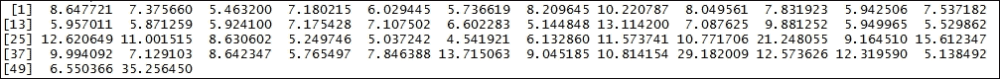

### 步骤 6 - 绘制一年的预测图

绘制结果：

### 注意

您需要安装 ImageMagick-7.0.4-Q16 以使 `saveGIF` 功能正常工作。

```py
    > datas <- data.table(value = c(as.vector(lm_pred_weeks_1),
 AggData[(type == n_type[1]) & (date %in% n_date[-c(1:14,365)]), value]),
    date_time = c(rep(AggData[-c(1:(14*48), (17473:nrow(AggData))), date_time], 2)),
    type = c(rep("MLR", nrow(lm_pred_weeks_1)*ncol(lm_pred_weeks_1)),
    rep("Real", nrow(lm_pred_weeks_1)*ncol(lm_pred_weeks_1))),
    week = c(rep(1:50, each = 336), rep(1:50, each = 336)))

    > saveGIF({
    oopt = ani.options(interval = 0.9, nmax = 50)
    for(i in 1:ani.options("nmax")){
    print(ggplot(data = datas[week == i], aes(date_time, value, group = type, colour = type)) +
    geom_line(size = 0.8) +
scale_y_continuous(limits = c(min(datas[, value]), max(datas[, value]))) + 
    theme(panel.border = element_blank(), panel.background = element_blank(),
    panel.grid.minor = element_line(colour = "grey90"),
    panel.grid.major = element_line(colour = "grey90"),
    panel.grid.major.x = element_line(colour = "grey90"),
    title = element_text(size = 15),
    axis.text = element_text(size = 10),
    axis.title = element_text(size = 12, face = "bold")) +
    labs(x = "Time", y = "Load (kW)",
    title = paste("Forecast of MLR (", n_type[1], "); ", "week: ", i, "; MAPE: ",
    round(lm_err_mape_1[i], 2), "%", sep = "")))
    ani.pause()
    }
    }, movie.name = "industry_1.gif", ani.height = 450, ani.width = 750)

```

结果如下：

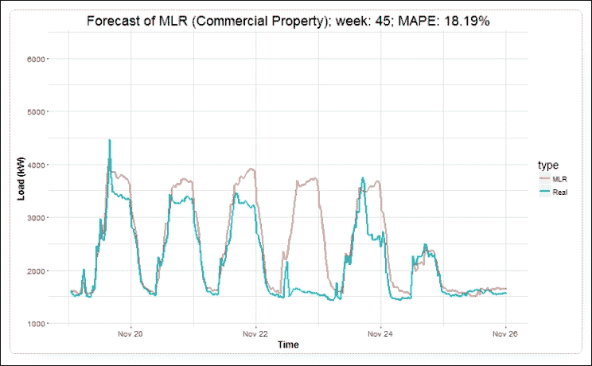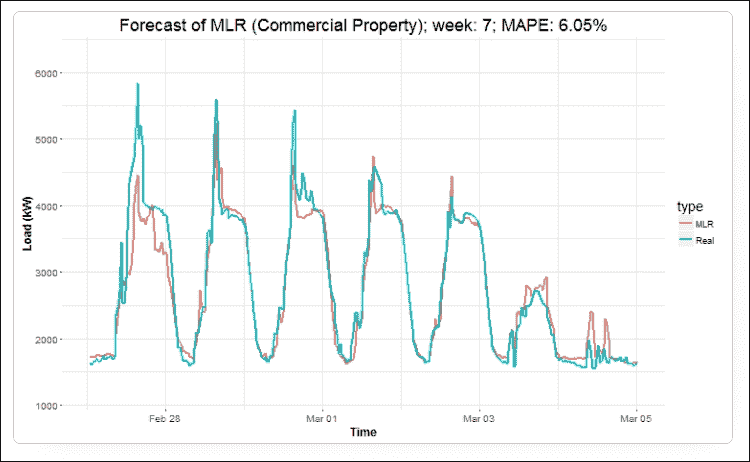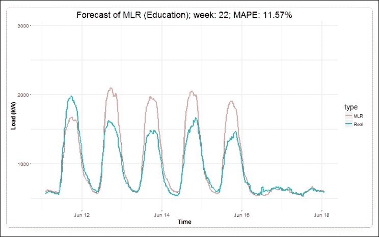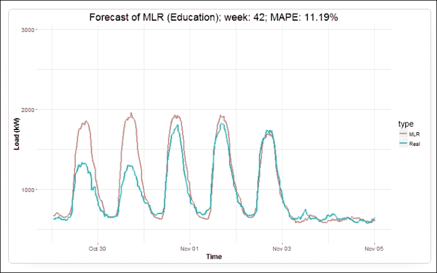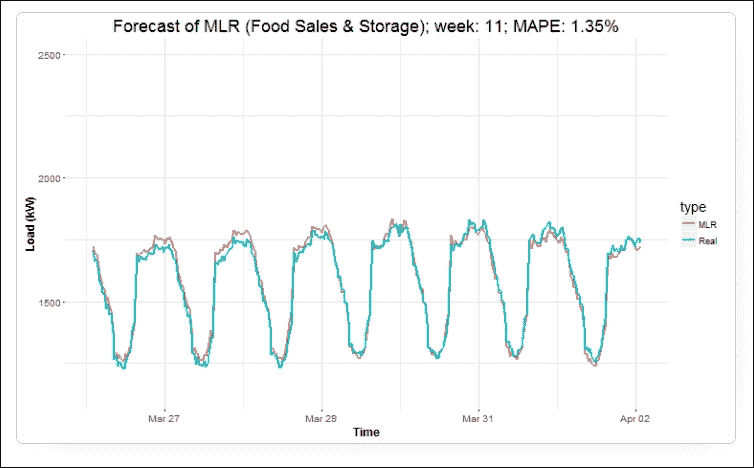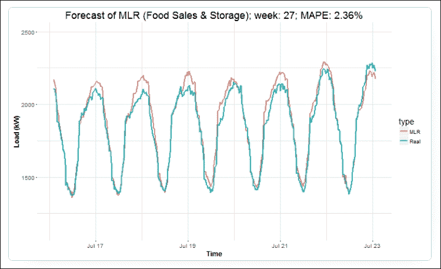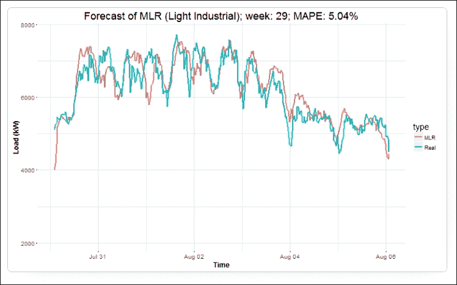

前面的结果证明，电力消耗模式是基于外部因素，如假日、天气、物业性质等。消耗模式在本质上是非常随机的。

### 注意

目标是向读者介绍如何应用多重线性回归来预测双季节时间序列。包含独立变量的交互作用以确保模型的有效性是非常有效的。
