# 第二章. 机器学习和大规模数据集

在最近过去，随着大数据的出现，数据处理的方式发生了戏剧性的变化。机器学习领域已经看到需要包括扩展策略来处理新时代的数据需求。这实际上意味着在大数据的背景下，一些传统的机器学习实现将不再相关。现在，基础设施和调整需求是挑战，需要存储和处理大规模数据，并辅以数据格式复杂性。

随着硬件架构的演变，更便宜且具有分布式架构的硬件的可用性以及新的编程范式以简化并行处理选项，这些现在可以应用于许多学习算法，我们看到对扩展机器学习系统的兴趣正在上升。

本章深入探讨了以下主题：

+   大数据简介和大规模机器学习的典型挑战

+   扩展和扩展机器学习的动机，以及针对大型数据集的并行和分布式处理概述

+   并发算法设计概述、大 O 符号和任务分解技术以实现并行性

+   云框架的出现，提供云集群、分布式数据存储、容错和高可用性，以及有效利用计算资源

+   实施大规模机器学习的框架和平台选项（例如在**大规模并行处理**（**MPP**）、MRI、GPU、FPGA 和多核平台上的并行处理框架）

# 大数据和大规模机器学习的背景

在我之前出版的 Packt 书籍《Greenplum 大数据分析入门》中，我已经涵盖了大数据的一些核心方面。在本节中，我们将快速回顾大数据的核心方面及其在机器学习领域的影响：

+   大规模的定义是千兆字节、太字节、艾字节或更高的规模。这通常是传统数据库引擎无法处理的数据量。以下图表列出了表示数据量的数量级：

    | 字节倍数 |
    | --- |
    | **国际单位制十进制前缀** | **二进制用法** |
    | **名称（符号）** | **值** |
    | Kilobyte (KB) | 103 | 210 |
    | Megabyte (MB) | 106 | 220 |
    | Gigabyte (GB) | 109 | 230 |
    | Terabyte (TB) | 1012 | 240 |
    | Petabyte (PB) | 1015 | 250 |
    | Exabyte (EB) | 1018 | 260 |
    | Zettabyte (ZB) | 1021 | 270 |
    | Yottabyte (YB) | 1024 | 280 |

+   在此背景下提到的数据格式是独特的；它们被生成和消费，不需要结构化（例如，DBMS 和关系型数据存储）。现在，有新的数据来源；这些数据可以由社交网站、设备等生成。这可以是异构的流数据（例如，视频、电子邮件、推文等）。再次强调，今天没有任何传统的数据集市/数据存储和数据挖掘应用支持这些格式。

+   此外，所有大规模处理总是批量进行的，但现在我们看到需要支持**实时**处理能力。新的**Lambda 架构**（**LA**）解决了支持批量数据和实时数据摄取及处理的需求。

+   总体而言，响应时间窗口正在缩小，这增加了挑战。

让我们回顾一下大数据的四个关键特征。所有这些都需要特殊的工具、框架、基础设施和能力：

+   更高的数据量（达到 PB 级别）

+   数据的可用性/可访问性需求（更实时）

+   多样化的数据格式

+   未标记数据的增加，因此产生了**噪声**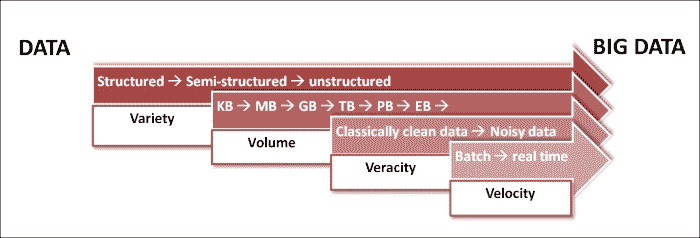

## 功能性 vs 结构性 – 方法论上的不匹配

我们甚至无法想象五年前，关系型数据库或非关系型数据库如对象数据库将只成为单一类型的数据库技术，而不是数据库技术本身。互联网规模的数据处理改变了我们处理数据的方式。

新一代架构，如 Facebook、Wikipedia、Salesforce 等，建立在原则和范式上，这些原则和范式与当前数据管理技术发展的稳固理论基础截然不同。

### 商品化信息

苹果应用商店、SaaS、普适计算、移动性、基于云的多租户架构在商业层面上释放了商品化信息传递的能力。这种模式几乎改变了所有的架构决策——我们现在需要从“可以提供并作为服务计费的信息单元”的角度来思考，而不是从解决方案的**总拥有成本**（**TCO**）的角度来思考。

### RDBMS 的理论局限性

如有影响力的数据库理论家迈克尔·斯坦纳布雷克最近所写，互联网规模架构的核心是一个新的数据处理和管理理论模型。数据库管理的理论现在已有三十多年历史，它们是为大型机类型的计算环境和不可靠的电子组件设计的。自然和系统及应用的特性自那时起已经发生了显著变化。随着可靠性成为底层环境的质量属性，系统由并行处理核心组成，数据创建和使用的性质也经历了巨大的变化。为了概念化这些新环境下的解决方案，我们需要从计算的角度来设计解决方案架构，而不仅仅是工程角度。

当前推动数据革命六大主要力量是：

+   大规模并行处理

+   通用信息传递

+   普遍计算和移动设备

+   非关系型数据库和语义数据库

+   社区计算

+   云计算

**Hadoop** 和 **MapReduce** 在巨规模上释放了数据的并行处理能力，并将程序平台中的复杂计算算法化。这永远地改变了分析和商业智能。同样，基于 Web 服务和 API 驱动的架构使信息传递在巨大规模上实现了通用化。

现在，可以以这种方式构建非常大的系统，即每个子系统或组件本身就是一个完整的平台，由完全不同的实体托管和管理。

迪杰斯特拉曾有过一个深刻的见解：

> *"计算机科学并不比天文学需要望远镜更多，天文学并不比望远镜需要天文学"*

他今天可能会感到高兴，因为计算已经摆脱了个人计算机（也称为工作站和服务器）的束缚。我们今天的大部分信息消费都来自我们几乎不称之为计算机的设备。移动设备、可穿戴设备和无处不在的信息正在改变数据创建、组装、消费和分析的方式。

随着传统数据库局限性的暴露，近年来，许多专用数据库应运而生——内存数据库、列式数据库、图数据库和语义存储现在都可在商业上获得。

之前提到的创新完全改变了传统的数据架构。特别是，语义计算、基于本体论的信息建模彻底颠覆了数据设计。从哲学上讲，数据架构正在经历事实基础的转变。在传统的数据模型中，我们首先设计“数据模型”——这是对世界及其未来的固定、设计时理解。数据模型将数据的含义永久固定在固定的结构中。表不过是一个类别，一组事物。因此，数据必须意味着如果我们理解它所属的集合/类别。例如，如果我们把汽车处理系统设计成一些类别，如四轮车、两轮车、商用车辆等，那么这种划分本身就嵌入了一个相关的意义。存储在每个这些类别中的数据并没有揭示嵌入在类别设计方式中的设计目的。例如，另一个系统可能会从驱动方式——电动、石油驱动、核驱动等——的角度看待汽车世界。

这种分类本身以某种方式揭示了系统的目的，这是无法从任何单个记录的属性中获得的。语义和元数据驱动架构可以彻底颠覆这样的数据模型。在元数据模型中，首先存在的是对象。

在基于关系型数据库管理系统（RDBMS）的存储系统中，数据存储和管理的一些核心特性如下：

+   数据存储在通常由行和列特征化的表中

+   表通过数据属性之间的关系相互链接

+   它以其效率和灵活性而闻名

+   这支持了减少数据重复的规范化技术

另一方面：

+   元数据驱动/NoSQL/语义数据架构不受限制数据使用目的的关系束缚

+   重点是更多地适应业务需求的持续变化，这导致构建的软件系统变化最小

+   支持使用分布式存储技术处理大型数据集，降低存储成本在元数据驱动/NoSQL/语义数据架构中非常重要

### 扩容与扩展存储

随着大数据时代的到来，现在需要扩展数据存储设备以存储达到拍字节级的数据。扩展存储设备有两种方式：

+   扩容（垂直可扩展性）

+   扩展（水平可扩展性）

**扩容**或垂直可扩展性是指向现有系统添加更多资源，从而增加存储更多数据的能力。在这里，资源可以指 RAM、计算能力、硬盘驱动器等。

**向外扩展**或水平可扩展性是指向系统中添加新组件。这需要数据被存储和分发，并且存在可以并行化的任务。这通常会增加系统的复杂性，并且大多数情况下需要重新设计系统。

所有的大数据技术都在基础设施的向外扩展上工作并支持。

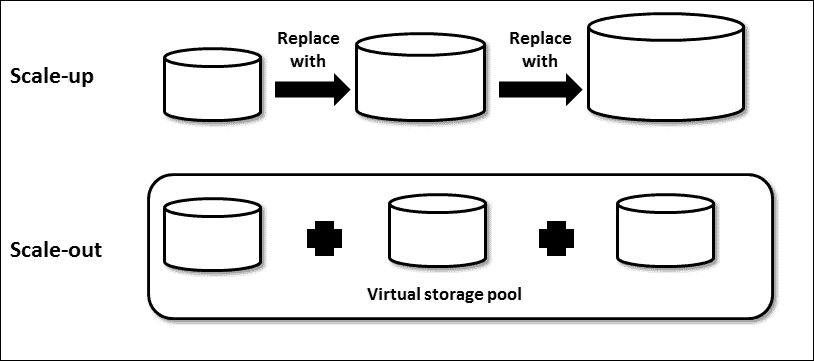

| 向上扩展（垂直可扩展性） | 向外扩展（水平可扩展性） |
| --- | --- |
| 较低容量和容量较高的服务器 | 更多和适中的，或低容量服务器 |
| 可能存在一个阈值，超过这个阈值，基础设施将无法垂直扩展 | 没有上限，基础设施可以根据需要扩展，而不会对设计产生影响 |
| 可以容纳更大的虚拟机 | 使用较低的虚拟机，并且可能受到主机故障的影响 |
| 所有共享的数据架构 | 无共享数据架构 |
| 较高总拥有成本 | 相对较低且可变成本 |
| 较低的网络设备 | 需要相对较多的设备（路由器、交换机等） |

### 分布式和并行计算策略

尽管分布式和并行处理已经存在多年，但随着对成本效益解决方案所需可用性优先级的出现，这些策略已成为机器学习任务的关键。

下面的图解展示了弗林分类法。分类是基于数据流数量与指令流数量的比较。

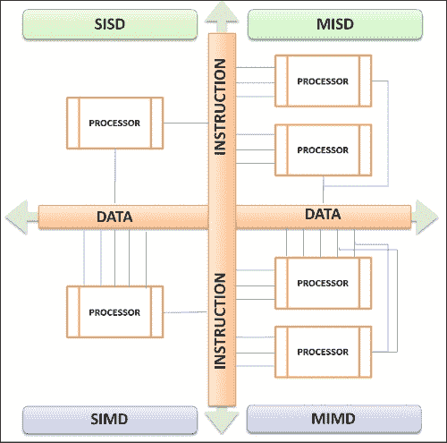

+   **单指令单数据**（**SISD**）：这是一个没有数据或指令并行的单个处理器的例子。单个指令以顺序方式在单个数据上执行，例如，单处理器。

+   **多指令单数据**（**MISD**）：在这里，多个指令在一个数据流上操作；一个典型的例子可以是容错性。

+   **单指令多数据**（**SIMD**）：这是一个自然并行的例子；单个指令触发对多个数据流的操作。

+   **多指令多数据**（**MIMD**）：这是一个多个独立指令在多个独立数据流上操作的例子。由于数据流是多个的，内存可以是共享的或分布式的。分布式处理可以归类在这里。前面的图示描绘了 MIMD 及其在“分布式”环境中的变化。

下面的图解解释了并行处理器架构和分类：

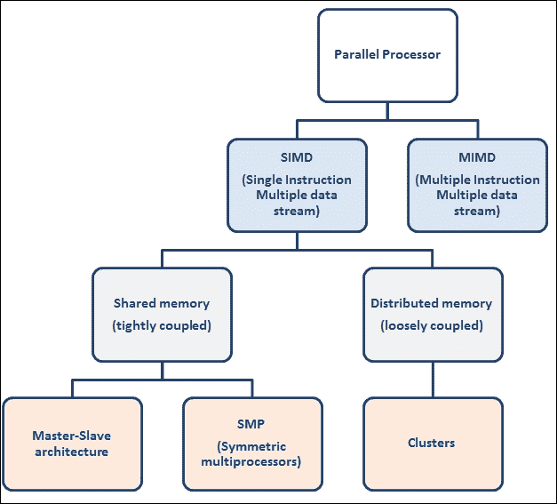

并行/分布式处理系统的关键需求之一是高可用性和容错性。有几种编程范式可以实现并行性。以下列表详细说明了重要的几个：

+   **主/从模型**：主模型是工作保持和随后分发给从属者的驱动器。Pivotal Greenplum 数据库和 HD（Pivotal 的 Hadoop 发行版）模块实现了这种模式。

+   **生产者/消费者模型**：在这里，没有所有者来触发工作。生产者生成工作项，消费者订阅并异步执行。基于**企业服务总线**（**ESB**）的数据集成系统实现了这种模式。

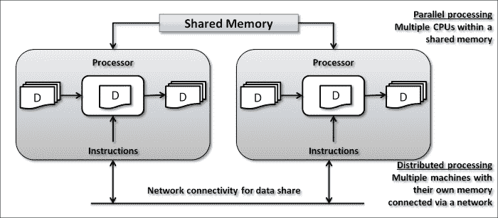

理论上，有两种类型的并行化；一种是数据并行化，另一种是执行或任务并行化：

+   **数据并行化**：它涉及并行运行具有多个输入的相同计算。在机器学习领域，这是一个我们考虑在不同数据样本上运行相同算法，而不真正关心数据样本如何分布的情况。

+   **执行或任务并行化**：与数据并行化不同，这是将功能分解成多个部分并以并行方式运行。这些工作部分可能处理相同的数据集，但这仅适用于可以并行化且子任务之间没有依赖关系的任务。

任务并行化可以是细粒度或粗粒度。

有许多分布式平台选项可以将效率扩展到机器学习算法并处理大数据集。一些选项包括：

+   **现场可编程门阵列**（**FPGA**）

+   **图形处理单元**（**GPU**）

+   **高性能计算**（**HPC**）

+   多核和多处理器并行系统

+   为虚拟大规模集群的云基础设施

除了可用的多个平台选项外，还有其他广泛采用的框架，它们提供了构建机器学习算法的即插即用 API。这个框架的选择特别取决于硬件的选择。

重要的是我们要选择一个能够充分利用现有架构、适合学习算法和数据结构选择的选项。

## 机器学习：可扩展性和性能

机器学习算法可以通过两种重要方式扩展：

+   采样

+   基于并行处理的分布式系统

可以并发执行给定的学习算法作为单独的工作块，并合并结果。这听起来像是一种相当简单的并行化方式，能够在更大的数据集上实现扩展和良好的性能。这假设数据集是离散的，并且这些分布式数据集之间没有依赖关系。

由于数据源的激增，我们现在可以访问已经分布的大型数据集，这需要我们具备在分布式模式下运行学习算法的能力。

现在有许多用于机器学习的分布式和并行框架的选项。让我们看看这些平台之间的一些关键区别因素：

+   并行化的粒度程度是一个关键方面。支持细粒度与粗粒度并行化是指什么。较低的粒度定义了细粒度任务并行化，而较高的粒度定义了粗粒度任务并行化。

+   算法定制支持的程度。

+   支持混合各种编程范式。

+   数据集扩展的容易程度。

+   支持批处理和实时处理的程度。

在给定的问题背景下，平台和编程框架的选择应受先前标准的指导。

以下是一些关键指标，用于衡量并行算法的计算性能：

+   **性能**是顺序算法与并行处理之间的解决方案时间的比率

+   **效率**或**吞吐量**衡量的是多个处理器之间性能的比率

+   **可扩展性**是随着处理器数量的增加，效率提高的百分比

下一节将介绍机器学习问题的一些关键特性，这些特性促使我们扩展机器学习算法。

### 数据点或实例过多

我们现在看到，在大多数机器学习问题中，数据集非常丰富，在许多情况下，所有这些数据点在模型构建和细化中都是相关的。这些数据点可能达到太字节规模，并且具有所有相关性。

这就引出了支持分布式存储和集群中处理这些数据点的带宽的需求。这里使用的是具有运行并行编程语言范式（如 MapReduce 和 LINQ）能力的高容量存储系统。

### 属性或特征过多

构成构建模型输入的数据集可能包含过多的特征、属性或维度。在这种情况下，机器学习算法将相关或更相关的属性分组，并在迭代中运行算法。这类数据集在文本挖掘和**自然语言处理**（**NLP**）的情况下可以见到，其中特征的数量可能达到数百万的倍数。在这种情况下，通过消除无关特征的方式并行化跨特征的计算可以有效地解决问题。随机森林和决策树是一些例子。此外，一些特定的特征选择技术，如正则化方法，将在后续章节中介绍。

### 缩小响应时间窗口 - 需要实时响应

某些机器学习需求，如语音识别，将要求系统提供实时响应。在这些应用中，机器学习实现的响应时间至关重要，否则响应本身将变得无关紧要。并行化可以带来这种效率。

模型的延迟和性能问题比吞吐量问题更重要。在许多用例中，这种推理延迟可能会使模型本身失效，因为响应变得过时。

对于这类问题，高度并行化的硬件架构，如 GPU 或 FPGA，将非常有效。

### 高度复杂的算法

这是一个选择算法本身就很复杂的情况，例如，计算密集型函数或任何非线性模型。以文本或图像内容为例；它本质上是非线性的。这种复杂性可以通过分布式计算轻松解决。

我们有多种方法可以解决这个问题，其中一种方法是优先考虑特征，并仍然追求更高的准确性。然而，这将消除学习中的自动化部分。在运行算法之前，总需要有一个工程师特征的过程。

在数据复杂性更高的情况下，存在计算复杂性。除非平台进行扩展，否则没有方法可以使学习过程运行得更快。

多核和 GPU 系统非常适合这种需求。它们带来了存储规模和计算效率的双重优势。

### 前馈，迭代预测周期

在机器学习领域有一些独特的用例，它们不会停止在算法执行的一个级别。算法是迭代和顺序运行的，其中一次迭代的输出会输入到另一个迭代中。这对于模型的输出至关重要。还可能需要合并所有顺序运行的迭代的推断。这可以使模型执行过程相当复杂。我们可以将推断过程视为一次性的过程，这将增加计算成本，或者可以有单个任务的并行化阶段。

一些现实世界的例子包括：

+   语音识别

+   机器翻译

## 模型选择过程

在某些情况下，我们需要在相同的训练和测试集上运行多个模型，这些模型的特征优先级不同，并比较准确性以选择给定问题域的适当模型。这些试验可以并行运行，因为这些模型之间没有任何依赖关系。当我们必须调整学习算法的参数并在多次执行中进行评估以从学习中进行推断时，复杂性会增加。

由于执行之间没有依赖关系，这使得它高度可并行化，并且不需要交互通信。这个用例的一个例子是统计显著性测试。对于这些任务，并行平台的有用性很明显，因为它们可以很容易地并发执行，而无需并行化实际的学习和推理算法。

## 大规模机器学习中的潜在问题

让我们看看在大规模机器学习实现中可能遇到的一些潜在问题：

+   **并行执行**：管理并行执行的准确性需要特别的关注和不同的设计范式。

+   **负载均衡**和**管理偏差**：随着数据和执行现在分布并行运行，管理数据和计算偏差变得非常迫切。不需要任何单个节点承担相对更多的数据存储或计算。

+   **监控**：需要放置各种硬件的有效监控和自动恢复系统。

+   **容错性**：一个万无一失的故障转移和恢复系统是强制性的。

+   **自动扩展**：扩展和升级过程是自动的。

+   **作业调度**：需要安排*批处理*作业。

+   **工作流管理**：协调和监控集群节点间工作执行的过程编排和编排。

# 算法和并发

在我们开始讨论在执行算法中构建并发性之前，让我们先看看算法的一些基础知识，时间复杂度；以及量级测量，然后探索并行化算法的方法。

一个算法可以被定义为一系列步骤，它将输入转换为所需的输出。它们是无关技术表示；让我们看看一个排序算法的例子：

```py
Input: A sequence of *n* number—*a1, a2, …,an*
Output: A permutation (reordering)—*a1', a2', …,an'* such that *a1'<=a2'<=… <=an'*

```

以下是一个插入排序算法：

```py
INSERTION-SORT(A)
1\. for j = 2 to length[A]
2\. dokey<-A[j]
3\. //insert A[j] to sorted sequence A[1..j-1]
4\. i<-j-1
5\. while i>0 and A[i]>key
6\. do A[i+1] <- A[i] //move A[i] one position right
7\. i<-i-1
8\. A[i+1]<-key
```

对于测量算法的时间和空间复杂度，一个元素是输入大小。时间复杂度是算法对于定义的需求“足够快”的度量；更重要的是，当数据量增加时，算法将如何反应。

频率计数是算法的一个关键度量。它是对算法的每个指令在执行过程中将运行多少次的预测。例如：

| 指令 | 代码 | 频率计数 (FC) |
| --- | --- | --- |
| 1 |

```py
for (int i=0; i< n ; i++)
```

| n+1 |
| --- |
| 2 |

```py
count << i
```

| N |
| --- |
| 3 |

```py
p = p + 1
```

| N |
| --- |
| 4 |   | 3n +1 |

FC 度量在未考虑相对性能与体积的关系时相对没有意义。还有一个叫做“量级”的度量，它是性能与数据体积的估计。*Big-O*是算法性能随所需处理的数据量增加而下降的速率的度量。

例如，*O(n)*代表线性性能下降，而*O(n²)*代表二次性能下降。

## 开发并发算法

开发并行算法的第一步是将问题分解为可以并发执行的任务。给定的问题可以以多种不同的方式分解为任务。任务可以是相同或不同的大小：

任务依赖图是一个有向图，节点对应任务，边表示一个任务的结果是处理下一个任务所必需的。

示例：这是数据库查询处理。

考虑以下查询的执行：

```py
MODEL = ``CIVIC'' AND YEAR = 2001 AND (COLOR = ``GREEN'' OR COLOR = ``WHITE)
```

在以下数据库上：

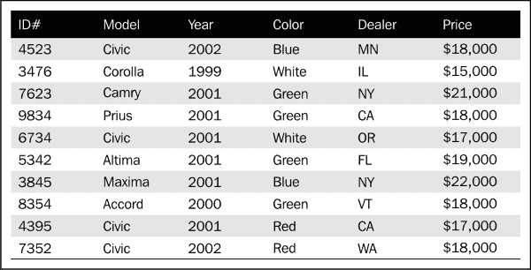

可以有细粒度和粗粒度任务分解。随着分解变得更加精细，并发度增加。

存在许多分解技术，并没有一种单一的最好方法。以下是一些技术：

+   递归分解

+   数据分解

+   探索性分解

+   投射性分解

分解会产生多个任务，这些任务的一些特性会严重影响并行算法的性能。这些特性包括任务交互（任务间通信）、每个任务处理的数据大小以及任务大小。在设计并行执行算法时需要考虑的一些重要方面包括以最小化交互和处理粒度权衡的方式解耦任务。

# 扩展机器学习的技术和实现选项

在本节中，我们将探讨一些机器学习实现可以采用的并行编程技术和分布式平台选项。Hadoop 平台将在下一章介绍，我们将从第三章，*Hadoop 架构和生态系统的介绍*，以及一些实际例子开始探讨一些实际例子。

## MapReduce 编程范式

MapReduce 是一种并行编程范式，它抽象了分布式计算环境中的并行计算和数据复杂性。它基于将计算函数带到数据而不是将数据带到计算函数的概念。

MapReduce 更像是一个带有许多内置函数的编程框架，开发者无需担心构建，可以减轻许多实现复杂性，如数据分区、调度、异常管理和跨系统通信。

下图展示了 MapReduce 函数的典型组成：

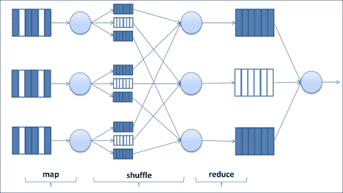

MapReduce 最初由 Google 设计并采用，作为在具有并行处理分布式存储的集群上处理大型数据集的编程模型。

MapReduce 模式现在已经成为行业标准，许多平台都是基于这个模式内部构建的，并支持 MapReduce 实现。例如，Hadoop 是一个开源实现，可以在内部运行或在云计算服务上运行，例如，**Amazon EC2** 配备弹性 MapReduce。

这在核心上具有 `Map()` 和 `Reduce()` 函数，这些函数能够在集群的节点上并行运行。`Map()` 函数在分布式数据上工作，并行运行所需的功能，而 `Reduce()` 函数运行数据的汇总操作。

## 使用消息传递接口（MPI）进行高性能计算（HPC）

MPI 被设计用来提供访问高级并行硬件的能力，旨在与异构网络和集群一起工作。这是一个令人印象深刻的规范，提供了一种可移植的方式来实现并行程序。

消息传递是发送者和接收者之间数据传输和同步的过程。以下图展示了发送者和接收者之间的消息传递：

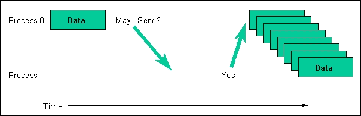

这些过程可以被分组；发送者和接收者之间的消息共享需要在相同上下文中发生。因此，通信者是一个组合了组和上下文的概念。消息中的数据以三元组的形式发送或接收。

MPI 可以用于实现可移植性，并通过并行处理提高性能。它可以支持独特的数据结构，并且可以构建库以供重用。MPI 不支持宽松的错误容忍。

## 语言集成查询（LINQ）框架

LINQ 框架是一个用于大规模数据和并行计算的一般用途系统。类似于 MapReduce 模式，它附带基础实现的高层次抽象，有助于开发者减少并行和分布式执行的开发复杂性。

随着机器学习函数从通用数据处理中移出，并在包括文档、图像和图在内的多种数据类型上操作，对通用实现模式的需求正在增加。此框架仅适用于 .NET 语言。

## 使用 LINQ 操作数据集

LINQ 随带一套在 .NET 对象集合上操作的功能。这些集合通过包含 .NET 数据类型的 LINQ 函数被修改。

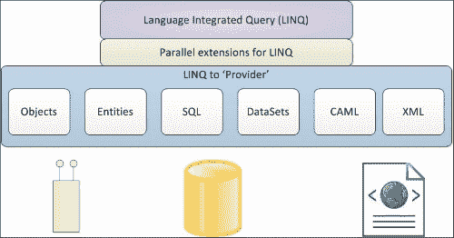

## 图形处理单元（GPU）

GPU 是设计用来处理内存需求并在帧缓冲区中快速创建用于视觉显示的图像的电子电路。

GPU 一直支持不断增长的计算能力。它们最初是用来处理图像处理和渲染的，但先进的 GPU 现在被视为自包含的通用计算平台。

虽然 CPU 旨在在异构工作负载上表现良好，但 GPU 是为确保大量数据集的可用性而构建的，并且以并行方式运行的任务。

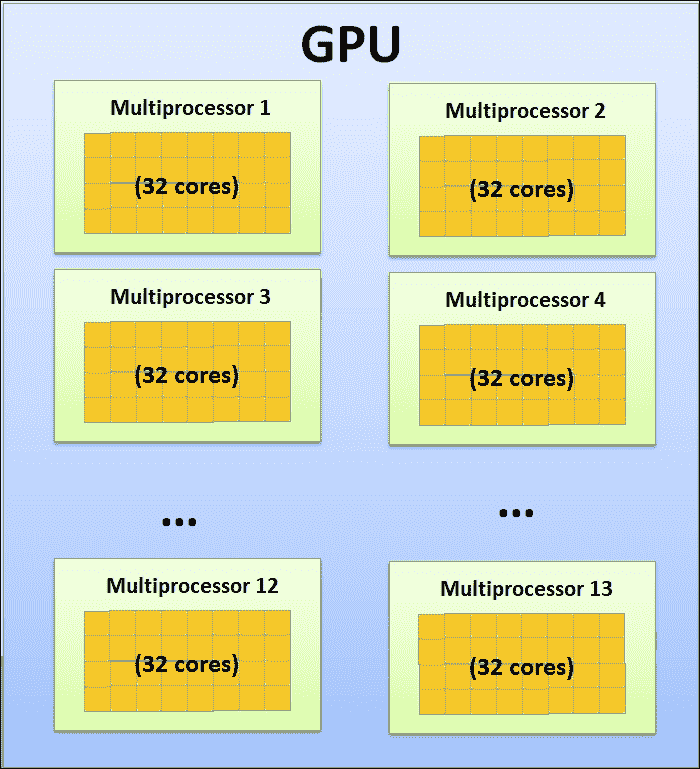

GPU 主要用于深度学习和训练可能需要更大训练数据集、较少计算能力和存储空间优化的神经网络。它们被用于解决云中的分类和预测问题。大多数社交媒体公司都曾是 GPU 的早期采用者。

### 注意

使用 GPU，预先录制的语音或多媒体内容可以转录得更快。与 CPU 实现相比，我们能够以高达 33 倍的速度进行识别。

## 场可编程门阵列（FPGA）

FPGAs 正在 HPC（高性能计算）的许多领域崭露头角。FPGA 可以在大规模并行处理的环境中应用。在本节中，我们将探讨理解 FPGA 的一些架构和实现方面的内容。

已知 FPGA 提供高性能。它们支持不同的并行计算应用。它们具有片上内存，便于处理器轻松访问内存。最重要的是，内存与算法逻辑相耦合，这意味着我们不需要任何额外的快速内存。

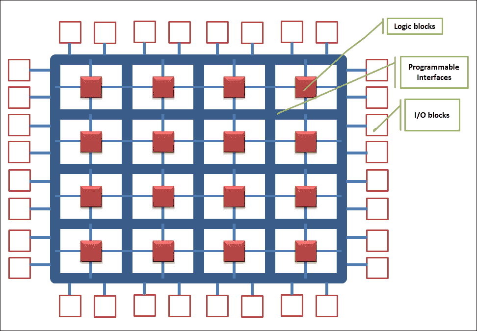

FPGA 包含大量的**可配置逻辑块**（**CLB**）；这些 CLB 通过可编程接口连接，传递它们之间的信号。I/O 块是 CLB 与外部世界的连接点。

FPGAs 提供各种范式，有助于加速硬件和软件设计中的计算。FPGA 具有成本效益，并且硬件资源以最佳方式使用。IBM Netezza 利用 FPGA 架构。

## 多核或多处理器系统

多处理器系统通常具有多个 CPU，这些 CPU 不一定在同一个芯片上。新一代的多处理器位于同一物理板上，通信通过高速连接接口进行。

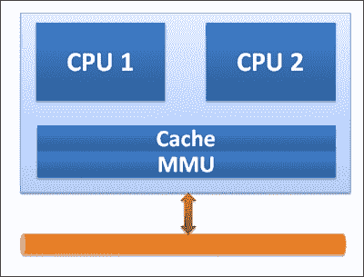

多核处理器代表了一类处理器，可能在一个芯片上包含许多 CPU（例如两个、四个和八个。在多核系统中，多线程实现的效率取决于代码的并行程度）。

除了所有硬件和基础设施的进步之外，我们刚刚看到，基于其能够在最佳成本下扩展机器学习过程的能力，云框架在机器学习领域正获得相当大的关注。

随着云计算的出现，基础设施服务提供商，如亚马逊网络服务（Amazon Web Services），提供基于使用情况付费的、几乎无限的按需计算能力。

# 摘要

在本章中，我们探讨了大数据集的限定条件、它们的共同特征、重复的问题以及数据量超高速增长的原因；实际上，这是大数据的背景。

将传统机器学习算法应用于大数据集的需要为机器学习从业者带来了新的挑战。传统的机器学习库并不完全支持处理大规模数据集。使用现代并行计算框架，如 MapReduce，进行并行化已经变得流行并被广泛采用；这导致了基于这些框架的新库的诞生。

重点关注适合大规模数据的方法，并且具有并行实施的潜力。在过去十年中，机器学习应用领域的格局发生了巨大变化。仅仅增加机器并不总是能证明是一个解决方案。需要重新审视传统算法和模型在执行方式上的问题，因为现在机器学习技术研究的另一个维度是可扩展性、并行执行、负载均衡、容错性和动态调度。

我们还研究了在大数据集背景下出现的并行化和分布式架构和框架，并理解了扩展机器学习的需求。此外，我们还回顾了一些并行和分布式平台技术，如 MapReduce、GPU、FPGA 等在机器学习中的应用。

在下一章中，我们将探讨 Hadoop 是如何成为大规模机器学习最佳平台的。
