# 第四章：机器学习工具、库和框架

在上一章中，我们介绍了机器学习解决方案架构和技术平台——Hadoop 的实施方面。在本章中，我们将探讨一些高度采用和即将推出的机器学习工具、库和框架。本章是后续章节的入门，因为它涵盖了如何使用特定机器学习框架的现成函数实现特定的机器学习算法。

我们将首先介绍市场上可用的开源和商业机器学习库或工具的概况，并挑选出前五个开源选项。对于每个已确定的选项，从安装步骤开始，学习语法，实现复杂的机器学习算法，到绘制图表，我们将全面介绍。对于读者来说，本章是按顺序出现的，因为它构成了后续章节中所有示例实现的基础。

每个已确定的框架都可以作为独立的库运行，也可以在 Hadoop 上运行。除了学习如何编程和实现机器学习算法外，我们还将介绍每个已确定的框架如何集成和运行在 Hadoop 上；这正是这些教程与网上主流教程的不同之处。

本章详细介绍了以下主题：

+   商业和开源机器学习库的简要列表。

+   涵盖的顶级库或框架是 R、Mahout、Julia、Python（特别是机器学习库）和 Spark。

+   Apache Mahout 是一个用于在 Hadoop 上运行机器学习算法的框架，是一个基于 Java 的开源机器学习选项。这个框架也可以独立运行。它以运行大量数据的机器学习算法而闻名。这个框架是 Hadoop 生态系统组件的一部分，并有自己的发行版。

+   R 是一种在机器学习社区中广泛采用的机器学习和数据挖掘工具。这个框架库既可以独立运行，也可以使用 Hadoop 运行时 R 扩展在 Hadoop 上运行。

+   Julia 是一种开源的高性能编程语言，支持以分布式和并行的方式运行数值和统计计算函数。

+   Python 是一种解释型、高级编程语言，旨在尝试不同的事物，并且它不属于传统的瀑布式开发方式。我们将探索基本的 Python 库——**NumPy**和**SciPy**，并使用 scikit-learn 来执行我们的第一个机器学习程序。此外，我们还将探讨如何在 Python 中编写 Hadoop MapReduce 程序。

+   Apache Spark 及其机器学习核心库：Spark 是一个具有 Java、Python 和 Scala API 的集群计算系统。我们将探索**MLlib API**用于机器学习，并使用 Apache Hadoop 的一个版本。重点将放在探索 Spark Java API 上。

+   对 Spring XD 及其相关机器学习库的简要介绍。

+   对于每个已识别的机器学习框架，与 Hadoop 的集成将是一个主要关注点。

# 机器学习工具 – 一览图

市场上存在许多开源和商业机器学习框架和工具，在过去几十年中不断发展。虽然机器学习本身在构建满足不同领域多样化需求的强大算法方面也在不断发展，但我们现在看到开源的大规模机器学习选项激增，这些选项已经达到显著成熟水平，并且被数据科学和机器学习社区广泛采用。

模型在最近几年发生了显著变化，研究人员被鼓励在开源模式下发布他们的软件。由于作者在发布他们的工作时使用算法实现机器学习会遇到问题，因此任何经过数据科学社区审查和改进的工作都被认为更有价值。

以下图展示了市场上一些重要的商业和开源机器学习框架和工具的概念模型。本章将深入探讨其中突出显示的部分。

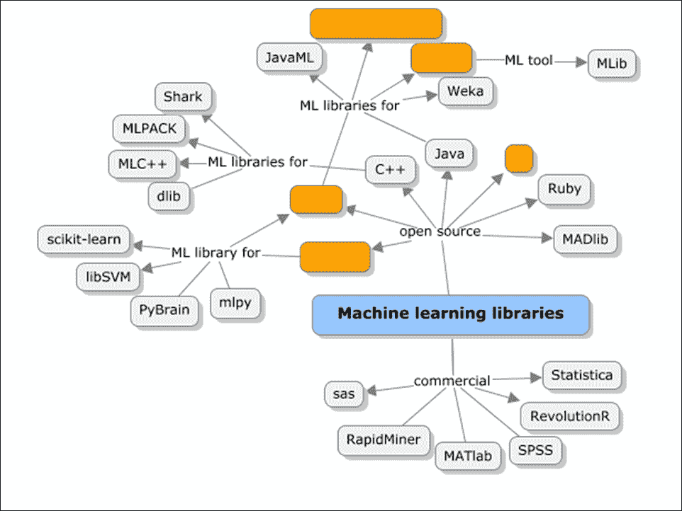

其中一些库针对特定的编程语言，如 Java、Python、C++、Scala 等。其中一些库，如 Julia、Spark 和 Mahout 已经支持分布式和并行处理，而其他如 R 和 Python 则可以在 Hadoop 上作为 MapReduce 函数运行。

在以下各节中，对于每个突出显示的机器学习库，以下内容将被涵盖：

+   对库或工具的概述，包括支持的即用型机器学习函数的详细信息

+   安装、设置和配置指南

+   语法介绍和基本数据处理函数，然后是高级机器学习函数示例实现

+   可视化和绘图示例（ wherever applicable）

+   在 Hadoop 平台上的集成和执行

# Apache Mahout

Apache Mahout 是一个与 Apache Hadoop 打包的机器学习库，构成了 Hadoop 生态系统的重要组成部分。

Mahout 于 2008 年作为 Apache Lucene（一个开源搜索引擎）的子项目诞生。Lucene 是一个具有搜索、文本挖掘和信息检索技术实现的 API。大多数这些搜索和文本分析在内部应用机器学习技术。为搜索引擎构建的推荐引擎最初是在一个新的子项目 Mahout 下开始的。Mahout 意味着“大象的骑手”，象征着机器学习算法在 Hadoop 上的运行。它是一个可扩展的机器学习实现，可以以独立模式运行（不紧密集成到 Hadoop 中）。


Mahout 是一组基本的机器学习 Java 库，用于分类、聚类、模式挖掘等。尽管今天的 Mahout 提供了对机器学习算法子集的支持，但它仍然是最受欢迎的框架之一，因为它本质上支持对数亿行的大型数据集进行数据分析，这些数据集在本质上可能是非结构化的。

## 如何工作？

Mahout 实现了 Hadoop MapReduce，最重要的方面是它在 Hadoop 之上运行并应用分布式计算范式。

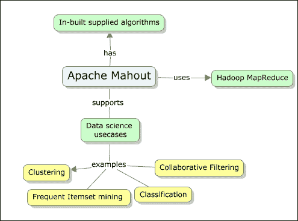

以下是 Mahout 目前实现的一些特定机器学习任务：

+   **协同过滤/推荐**：这接受用户输入并找到用户可能喜欢的项目

+   **聚类**：这接受一些文档作为输入，并根据它们所涉及或属于的主题将它们分组

+   **分类**：这接受一些文档，并根据文档的现有分类，学习给定文档可能属于哪个类别，并将文档映射到该类别

+   **频繁项集挖掘**：这接受一些项目作为输入，并根据从实际发生的学习中，确定哪些项目发生或一起出现

有一些算法，例如逻辑回归和 SVM（关于这些算法的更多内容将在后续章节中介绍），不能并行化并在独立模式下运行。

## 安装和设置 Apache Mahout

在本章中，我们将探讨如何在独立模式和 Hadoop 上运行 Mahout。尽管在撰写本书时 Apache Mahout 有新的 1.0 版本可用，但我们将在所有示例中使用 0.9 版本（最新的稳定版本）。使用的操作系统是 Ubuntu 12.04 桌面 32 位版本。

以下是安装 Apache Mahout 的依赖项和关键要求：

+   JDK (1.6 或更高版本；本书中的示例我们将使用 1.7 u9 版本)

+   Maven (2.2 或更高版本；本书中的示例我们将使用 3.0.4 版本)

+   Apache Hadoop (2.0；不是强制性的，因为 Mahout 可以在本地运行)

+   Apache Mahout (0.9 版本)

+   开发环境——Eclipse IDE（Luna）

在 第三章 中，我们了解到如何进行 Apache Hadoop 2.0 单节点安装，以及所需的先决条件，如 Java。

在本章中，我们将介绍 Maven、Eclipse 开发环境的设置，以及配置 Apache Mahout 在 Hadoop 上和离线运行。由于所考虑的平台和相关框架是开源的，我们将使用 Windows 7 专业版提供的 VirtualBox 虚拟机仿真器。

如您所回忆的，Hadoop 不能以 root 用户身份运行，因此我们为此创建了用户 `practical-ml` 来安装和运行所有内容。

### 设置 Maven

建议使用 Maven 来获取所需的 Mahout jar 包，这样就可以轻松地切换到任何更新的 Mahout 版本。如果没有 Maven，下载依赖项将会变得更加复杂。有关 Maven 的具体功能和其在应用程序开发中的实用性的更多详细信息，请参阅[`www.packtpub.com/application-development/apache-maven-3-cookbook`](https://www.packtpub.com/application-development/apache-maven-3-cookbook)。

Maven 版本 3.0.4 可以从 Apache 网站的镜像之一下载。以下命令可用于此目的：

```py
wget http://it.apache.contactlab.it/maven/maven-3/3.0.4/binaries/apachemaven-3.0.4-bin.tar.gz

```

要手动安装 Maven，请按照以下说明操作：

1.  将分发存档文件，即 `apache-maven-3.0.4-bin.tar.gz`，提取到您希望安装 Maven 3.0.4 的目录中。

1.  使用这些说明，将选择 `/usr/local/apache-maven` 路径。从存档中创建一个 `apache-maven-3.0.4` 子目录。

1.  以下行需要追加到 `.bashrc` 文件中：

    ```py
    export M2_HOME=/usr/local/apache-maven-3.0.4
    export M2=$M2_HOME/bin
    export PATH=$M2:$PATH
    export JAVA_HOME=$HOME/programs/jdk
    ```

`JAVA_HOME` 应指向 JDK 安装的位置。例如，导出 `JAVA_HOME=/usr/java/jdk1.7`，`JAVA_HOME/bin` 应包含在您的 `PATH` 环境变量中。`PATH` 变量是在 Java 安装期间设置的。这应该得到验证。

我们现在可以通过运行以下命令来检查 Maven 的安装是否成功：

```py
mvn –version

```

如果有任何代理设置，我们必须明确更新 Maven 安装目录中 `conf` 文件夹下的 `settings.xml` 文件中的代理设置。

### 使用 Eclipse IDE 设置 Apache Mahout

下一步详细说明了设置 Mahout 环境、代码库、访问示例、运行、调试和测试的步骤，使用 Eclipse IDE 进行这些操作是推荐的，也是最简单的方法来为开发团队设置 Apache Mahout。

执行以下步骤以获取 Apache Mahout 的 tar 文件，解压它并导航到安装目录。

1.  设置 Eclipse IDE。

    可以从以下链接下载最新版本的 Eclipse：

    [`www.eclipse.org/downloads/`](https://www.eclipse.org/downloads/)

1.  使用以下命令从直接链接下载 Mahout 分发版：

    ```py
    $ wget -c http://archive.apache.org/dist/mahout/0.9/mahout-distribution-0.9.tar.gz

    ```

1.  使用以下命令从存档中提取：

    ```py
    $ tar zxf mahout-distribution-0.9.tar.gz

    ```

1.  将项目转换为 Eclipse 项目：

    ```py
    $ cd mahout-distribution-0.9
    $ mvn eclipse: eclipse

    ```

    之前的命令构建了 Eclipse 项目。

1.  将 `M2_REPO` 类路径变量设置为指向本地仓库路径。以下命令将所有 Maven jar 添加到 Eclipse 类路径：

    ```py
    mvn -Declipse.workspace= eclipse:add-maven-repo

    ```

1.  现在，让我们导入 Eclipse Mahout 项目。

    从菜单中导航，**文件** | **导入** | **通用** | **现有项目**到**工作空间**。

    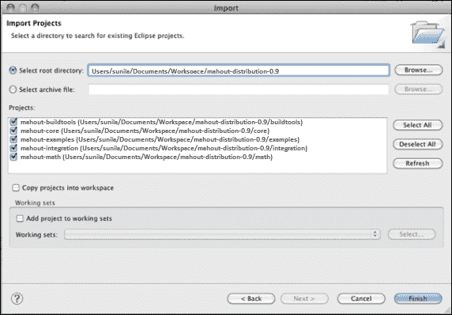

### 设置 Apache Mahout 而不使用 Eclipse

1.  使用以下命令从直接链接下载 Mahout 发行版：

    ```py
    $ wget -c http://archive.apache.org/dist/mahout/0.9/mahout-distribution-0.9.tar.gz

    ```

1.  将 Mahout 发行版提取到 `/usr/local` 文件夹：

    ```py
    $ cd /usr/local
    $ sudo tar xzf mahout-distribution-0.9.tar.gz
    $ sudo mv mahout-distribution-0.9.tar.gz mahout
    $ sudo chown –R practical-ml:hadoop mahout

    ```

1.  在 `.bashrc` 文件中设置 Java、Maven 和 Mahout 路径。

    使用以下命令打开 `.bashrc` 文件：

    ```py
    gedit ~/.bashrc

    ```

    将以下内容添加到文件中：

    ```py
    export MAHOUT_HOME = /usr/local/mahout
    path=$path:$MAHOUT_HOME/bin
    export M2_HOME=/usr/local/maven
    export PATH=$M2:$PATH
    export M2=$M2_HOME/bin
    PATH=$PATH:$JAVA_HOME/bin;$M2_HOME/bin
    ```

1.  要在本地模式（这意味着在独立模式中，不需要 Hadoop，算法将不会以并行或 MapReduce 模式运行）下运行 Mahout。

    使用以下命令将本地模式设置为 true：

    ```py
    $MAHOUT_LOCAL=true

    ```

    这将强制 Mahout 不在 `$HADOOP_CONF_DIR` 中查找 Hadoop 配置。

    `MAHOUT_LOCAL` 已设置，因此我们不需要将 `HADOOP_CONF_DIR` 添加到类路径中。

有一种在 Hadoop 上运行 Mahout 的替代方法。首先，确保已成功安装和配置 Hadoop 2.x。然后，按照以下说明操作：

1.  设置 `$HADOOP_HOME`、`$HADOOP_CONF_DIR` 并将其添加到 `$PATH`。

    ```py
    export HADOOP_CONF_DIR=$HADOOP_HOME/conf

    ```

    上面的设置设置了 Hadoop 运行的模式（例如，在 `core-site.xml`、`hdfs-site.xml`、`mapred-site.xml` 等等中）。

1.  现在，使用以下命令启动 Hadoop 实例：

    ```py
    $HADOOP_HOME/bin/start-all.sh

    ```

1.  检查 `http://localhost:50030` 和 `http://localhost:50070` 网址以确认 Hadoop 是否正在运行。

1.  使用 Maven 从 Mahout 目录运行以下 Maven 命令来构建 Apache Mahout：

    ```py
    /usr/local/mahout$ mvn install

    ```

在成功安装后，将看到以下输出：

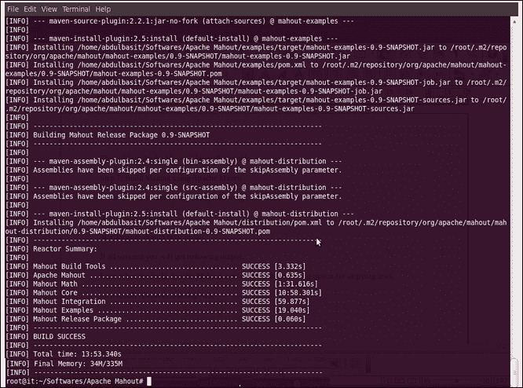

## Mahout 包

以下图展示了 Mahout 中提供对多个机器学习算法一些即用型支持的不同的包。在核心，模块包括实用工具、数学向量、集合、以及用于并行处理和分布式存储的 Hadoop 和 MapReduce。

此外，在核心模块之上还有以下列出的机器学习包：

+   分类

+   聚类

+   进化算法

+   推荐系统

+   回归

+   FPM

+   维度缩减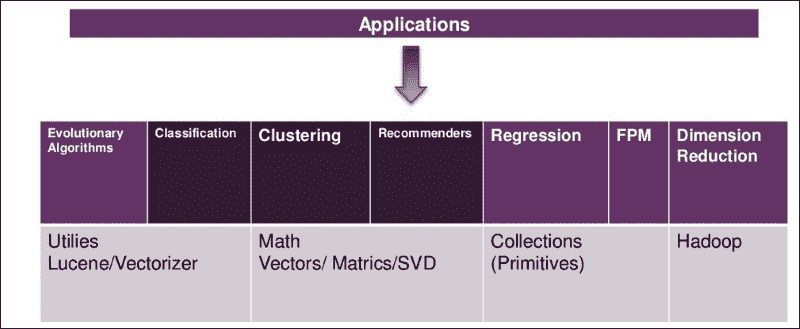

在接下来的章节中，将详细介绍之前提到的包，并使用每个包针对一个已识别的问题提供示例实现。

## 在 Mahout 中实现向量

如我们所知，为了演示 Mahout 中大多数机器学习算法的实现，我们需要经典 Mahout 数据集格式的数据。在核心，此代码主要使用一些 Mahout 可用脚本，并在设置中进行一些小的更改。以下为标准流程：

1.  从原始文本文件创建序列文件。

    **序列文件**主要是数据的关键/值对表示的二进制编码。以下给出的属性是键头元素，代表元数据细节：

    +   版本

    +   键名

    +   值名

    +   压缩

1.  从序列文件生成向量。关于生成序列文件的实际命令的更多内容将在以下章节中介绍，同时展示每个已识别的机器学习算法的实现。

1.  在这些工作向量上运行函数

Mahout 中有不同类型的向量实现，这些定义在一般情况下也是适用的。

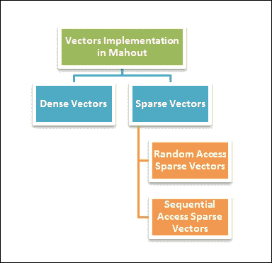

+   **密集向量**：这些向量通常是一个双精度浮点数数组，这个向量的大小与数据集中特征的数量相同。由于所有条目都是预先分配的，无论是否为零值，因此这些向量被称为密集向量。

+   **稀疏向量**：这些向量是向量的数组，并且只表示非零或空值。对于稀疏向量，有两种子类别：随机访问和顺序访问稀疏向量。

    +   **随机访问稀疏向量**：随机访问稀疏向量是 HashMap 表示，其中键是一个整数值，值是一个双精度浮点数。在任何给定的时间点，可以通过传递给定的键来访问一个值。

    +   **顺序访问稀疏向量**：这些向量实际上是一组两个数组，第一个数组是键（整数）数组，第二个数组是值（双精度浮点数）数组。这些向量针对线性读取进行了优化，与随机访问稀疏向量不同。同样，存储仅针对非零值。

    ### 注意

    为了详细了解如何使用 Apache Mahout，请参考 Packt 出版社出版的关于 Apache Mahout 的书籍《Apache Mahout Cookbook》。

虽然本节涵盖了只需进行少量配置更改即可与 Hadoop 一起工作的框架，但在下一节中，我们将介绍市场上广泛采用的强大选项——R。Hadoop 提供了明确的适配器，以便 R 程序能够在 MapReduce 模型中运行，这一点将在下一节中介绍。

# R

R 是一种数据分析语言，它被用作机器学习、统计计算和数据挖掘领域的主要驱动环境，并为基本和高级可视化或图形提供了一个全面的平台。如今，R 是几乎所有数据科学家或即将成为数据科学家的人必须学习的基本技能。

R 主要是一个 GNU 项目，类似于最初在贝尔实验室（以前称为 AT&T，现在是朗讯科技）由约翰·查默斯及其团队开发的 S 语言。S 的初始目标是支持所有统计函数，并被硬核统计学家广泛使用。

R 随带一系列开源包，可以免费下载和配置，并根据需要安装或加载到 R 环境中。这些包为各种统计技术提供即插即用的支持，包括线性和非线性建模、时间序列分析、分类、聚类等。

此外，还提供了高度可扩展的图形功能。这些高级图形功能的支持是 R 的主要差异化因素，因为其输出以其出版物质量的图表而闻名。除此之外，R 还支持许多开源图形库和可视化工具，这些工具既开源又商业。

尽管 R 在核心上并不旨在在分布式环境中工作或以并行模式运行算法，但有一些扩展（包括开源和商业）可以使 R 更具可扩展性并支持大数据集。在本章中，我们将介绍如何将 R 与 Apache Hadoop 集成，从而可以运行并利用 MapReduce 功能。

最重要的是，R 是一种广泛采用的免费软件，拥有许多提交者和支持小组不断努力保持其在数据科学领域的极高相关性。

R 支持的一些关键功能如下列出：

+   能够有效管理和存储模型操作的数据的能力

+   方便进行数组、向量和其他核心函数的计算

+   几种即插即用的机器学习函数，可以根据需要加载，并有助于轻松实现数据科学项目。

+   可以轻松使用并帮助生成对商业主有价值的仪表板的先进和复杂的图形功能

+   一个广泛且活跃的采用者和提交者社区，通过大量包的扩展迅速发展

+   R 被视为一个支持新兴的交互式数据分析方法的平台

## 安装和设置 R

在本书的所有示例中，我们将使用 R 的稳定版本 2.15.1 和 CRAN 引用，以获取所有最新的 R 包。

请参阅[`cran.r-project.org/bin/windows/base/old/2.15.1/`](https://cran.r-project.org/bin/windows/base/old/2.15.1/)链接下载 R for Windows。

详细安装过程请参阅[`cran.r-project.org/doc/manuals/R-admin.html#Top`](https://cran.r-project.org/doc/manuals/R-admin.html#Top)。

我们可以使用 R GUI 或 RStudio 来使用 R。以下是用户在成功安装 R GUI、R IDE 和 RStudio 后可以看到的 R 界面截图。

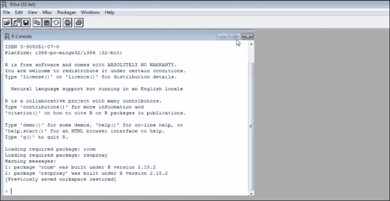

我们需要设置 CRAN 镜像路径，以便通过导航到菜单路径 **包** | **设置 CRAN 镜像** 来访问和加载所需的 R 包。

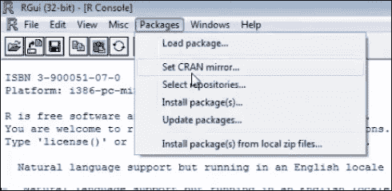

以下截图显示了开发者可以选择的最合适的镜像站点列表：

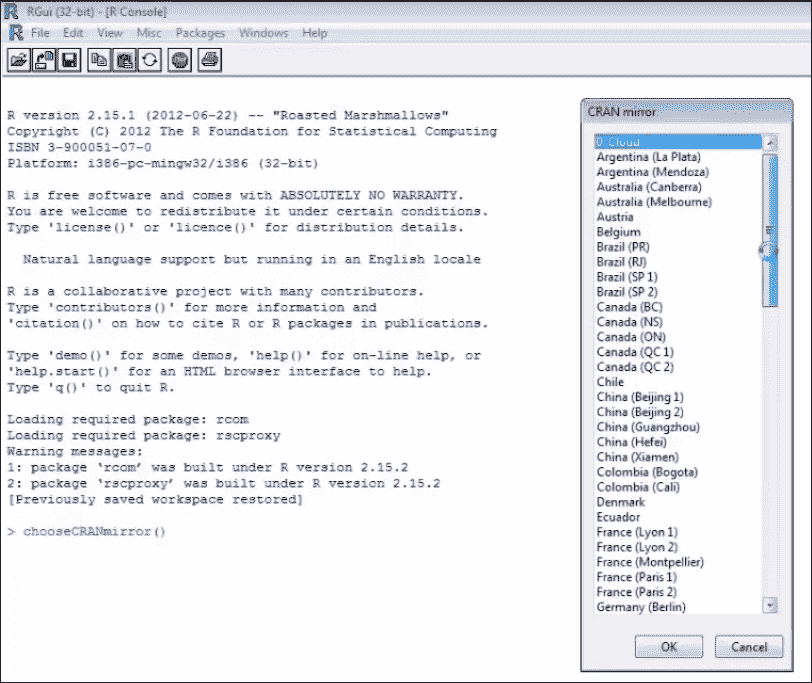

R 编辑器可以用来编写任何高级操作，结果可以在控制台看到，如下所示：

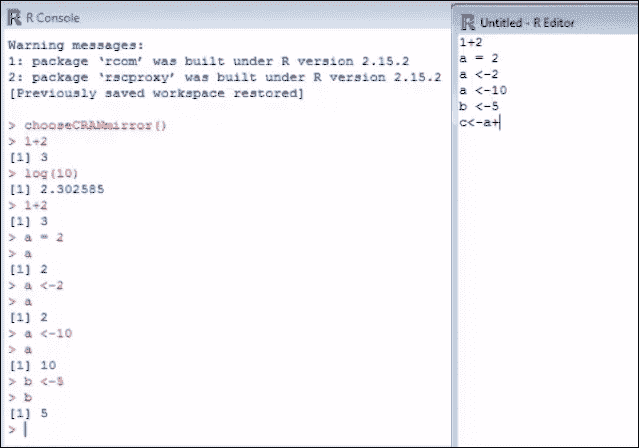

以下是一个图形图表的截图：

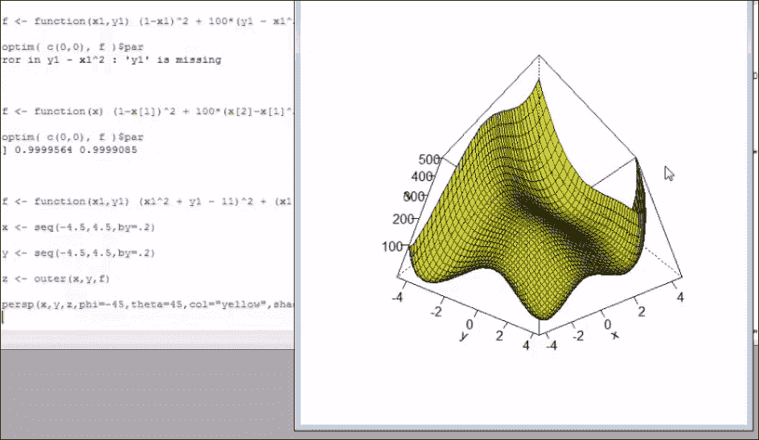

## 将 R 与 Apache Hadoop 集成

到目前为止，我们已经看到了 Apache Hadoop 及其核心组件，HDFS 和 YARN（MapReduce 2.0），以及 R。我们可以以三种不同的方式来看待将 R 与 Hadoop 集成，因此支持大规模机器学习。

### 方法 1 – 在 Hadoop 中使用 R 和 Streaming API

要将 R 函数与 Hadoop 集成并看到它在 MapReduce 模式下运行，Hadoop 支持 R 的 Streaming API。这些 Streaming API 主要帮助在 MapReduce 模式下运行任何可以访问和操作标准 I/O 的脚本。因此，在 R 的情况下，不会与 R 进行任何显式的客户端集成。以下是一个 R 和流处理的示例：

```py
$ ${HADOOP_HOME}/bin/Hadoop jar
${HADOOP_HOME}/contrib/streaming/*.jar \
-inputformat
org.apache.hadoop.mapred.TextInputFormat \
-input input_data.txt \
-output \
-mapper /home/tst/src/map.R \
-reducer /home/tst/src/reduce.R \
-file /home/tst/src/map.R \
-file /home/tst/src/reduce.R
```

### 方法 2 – 使用 R 的 Rhipe 包

R 中有一个名为 Rhipe 的包，允许在 R 中运行 MapReduce 作业。要使用这种方式在 Hadoop 上实现 R，有一些先决条件：

+   需要在 Hadoop 集群中的每个 DataNode 上安装 R

+   Protocol Buffers 将在每个 DataNode 上安装和可用（有关 Protocol Buffers 的更多信息，请参阅 [`wiki.apache.org/hadoop/ProtocolBuffers`](http://wiki.apache.org/hadoop/ProtocolBuffers)）

+   Rhipe 应该在每个数据节点上可用

以下是在 R 中使用 `Rhipe` 库实现 MapReduce 的示例格式：

```py
library(Rhipe)
rhinit(TRUE, TRUE);
map<-expression ( {lapply (map.values, function(mapper)…)})
reduce<-expression(
pre = {…},
reduce = {…},
post = {…},
)
x <- rhmr(map=map, reduce=reduce,
 ifolder=inputPath,
 ofolder=outputPath,
 inout=c('text', 'text'),
 jobname='test name'))
rhex(x)
```

### 方法 3 – 使用 RHadoop

与 Rhipe 非常相似的 RHadoop，便于在 MapReduce 模式下运行 R 函数。它是由 Revolution Analytics 开发的开源库。以下是一些 RHadoop 库的组成部分：

+   **plyrmr**：这是一个提供用于在 Hadoop 上运行大型数据集的常见数据操作函数的包

+   **rmr**：这是一个包含将 R 和 Hadoop 集成的函数集合的包

+   **rdfs**：这是一个提供帮助 R 和 HDFS 交互的函数的包

+   **rhbase**：这是一个包含帮助 R 和 HBase 交互的函数的包

以下是一个使用 rmr 包的示例，展示了使用该包中的函数集成 R 和 Hadoop 的步骤：

```py
library(rmr)
maplogic<-function(k,v) { …}
reducelogic<-function(k,vv) { …}
mapreduce( input ="data.txt",
output="output",
textinputformat =rawtextinputformat,
map = maplogic,
reduce=reducelogic
)
```

### R/Hadoop 集成方法总结

总结来说，所有前面三种方法都能产生结果并促进 R 和 Hadoop 的集成。它们帮助将 R 规模化以在 HDFS 上操作，这将有助于处理大规模数据。每种方法都有其优缺点。以下是一些结论的总结：

+   Hadoop Streaming API 是所有方法中最简单的一个，因为没有关于安装和设置要求的复杂性

+   Rhipe 和 RHadoop 都需要在 Hadoop 集群上设置 R 和相关包，这需要一些努力

+   关于实现方法，Streaming API 更像是一个命令行映射，reduce 函数是函数的输入，而 Rhipe 和 RHadoop 允许开发者在 R 中定义和调用自定义的 MapReduce 函数

+   在 Hadoop Streaming API 的情况下，不需要客户端集成，而 Rhipe 和 RHadoop 都需要客户端集成

+   机器学习的替代方案包括 Apache Mahout、Apache Hive 以及来自 Revolution Analytics、Segue 框架和其他一些商业版本的 R

### 在 R 中实现（使用示例）

在本节中，我们将简要介绍 R 的某些实现方面，并专注于学习语法以及理解一些核心函数及其用法。

#### R 表达式

R 可以用作简单的数学计算器；以下是使用它的基本方法。以下是 R 控制台上的输出跟踪：

```py
> 1+1
[1] 2
> "Welcome to R!"
[1] "Welcome to R!"
> 6*7
[1] 42
> 10<22
[1] TRUE
> 2+7==5
[1] FALSE
```

##### 分配

这用于将值分配给变量并对该变量执行一些操作：

情况 1：分配一个数值：

```py
> x<-24
> x/2
[1] 12
```

情况 2：分配一个字符串字面量：

```py
> x <- "Try R!"
[1] "Try R!"
> x
[1] " Try R!"
```

情况 3：分配一个逻辑值：

```py
> x <- TRUE
[1] TRUE
```

##### 函数

有许多现成的函数，要在 R 中调用一个函数，我们应该提供函数名并传递所需的参数。以下是一些函数及其结果的示例，如 R 控制台所示：

```py
> sum(4,3,5,7)
[1] 19
> rep("Fun!", times=3)
[1] " Fun!" "Fun!" "Fun!"
> sqrt(81)
[1] 9
```

这是获取 R 中函数帮助的命令：

```py
> help(sum)
sum package: base R Documentation

Sum of Vector Elements

Description:

     'sum' returns the sum of all the values present in its arguments.

Usage:

     sum(..., na.rm = FALSE)
```

#### R 向量

根据定义，向量是一个简单的值列表，它是 R 数据类型的核心。许多机器学习函数都利用了这些。

这里有一些关键函数及其使用上下文：

| 函数/语法 | 目的 | 示例 | R 控制台上的输出 |
| --- | --- | --- | --- |
| `m:n` | 输出从 `m` 到 `n` 的数字，每次增加 1 | `> 5:9` | `[1] 5 6 7 8 9` |
| `seq(m,n)` | 输出从 `m` 到 `n` 的数字，每次增加 1 | `> seq(5,9)` | `[1] 5 6 7 8 9` |
| `seq(m,n, i)` | 输出从 `m` 到 `n` 的数字，每次增加 `i` | `> seq(1,3,0.5)` | `[1] 1 1.5 2 2.5 3` |

##### 分配、访问和操作向量

下表提供了在 R 中创建、访问和操作矩阵的示例：

| 目的 | 示例 |
| --- | --- |
| 创建一个字面量向量 | `> sentence <- c('practical', 'machine', 'learning')` |
| 访问向量的第三个值 | `> sentence[3]``[1] "learning."` |
| 更新向量中的值 | `> sentence[1] <- "implementing"` |
| 向向量中添加新值 | `> sentence[4] <- "algorithms"` |
| 获取给定索引的值 | `> sentence[c(1,3)]``[1] "implementing" "learning"` |
| 获取指定索引范围的值 | `> sentence[2:4]``[1] "machine" "learning" "algorithms"` |
| 添加一系列新值 | `> sentence[5:7] <- c('for','large','datasets')` |
| 向量值加 1 | `> a <- c(1, 2, 3)```> a + 1``[1] 2 3 4` |
| 将向量中的每个值除以一个值 | `> a / 2``[1] 0.5 1.0 1.5` |
| 将向量的每个值乘以一个值 | `> a*2``[1] 2 4 6` |
| 添加两个向量 | `> b <- c(4, 5, 6)``> a + b``[1] 5 7 9` |
| 比较两个向量 | `> a == c(1, 99, 3)``[1] TRUE FALSE TRUE` |
| 对向量的每个值应用一个函数 | `> sqrt(a)``[1] 1.000000 1.414214 1.732051` |

#### R 矩阵

矩阵是具有行和列的二维向量。以下表格展示了在 R 中创建、访问和操作矩阵的示例：

| 目的 | 示例 |
| --- | --- |
| 创建一个默认值为零的 3 X 4 矩阵 | `> matrix(0, 3, 4)``[,1] [,2] [,3] [,4]``[1,] 0 0 0 0``[2,] 0 0 0 0``[3,] 0 0 0 0` |
| 使用一系列值初始化矩阵 | `> a <- 1:12``> m <- matrix(a, 3, 4)``[,1] [,2] [,3] [,4]``[1,] 1 4 7 10``[2,] 2 5 8 11``[3,] 3 6 9 12` |
| 从矩阵中访问一个值 | `> m[2, 3]``[1] 8` |
| 在矩阵中选择的位置赋值 | `> m[1, 4] <- 0` |
| 获取整个行或所选列的数组 | `> m[2,]``[1] 2 5 8 11``> m[3,]``[1] 7 8 9` |
| 从较大的矩阵中检索子集 | `> m[, 2:4]``[,1] [,2] [,3]``[1,] 4 7 10``[2,] 5 8 11` |

#### R 因子

在数据分析与机器学习中，分组或分类数据是很常见的。例如，好客户或坏客户。R 的 `factor` 数据类型用于跟踪分类数据。需要做的只是定义一个类别向量，并将其作为参数传递给 `factor` 函数。

以下示例展示了使用 `factors` 创建和赋值类别的操作：

```py
> ornaments <- c('ring', 'chain', 'bangle', 'anklet', 'nosepin', 'earring', 'ring', 'anklet')
> ornamenttypes <- factor(ornaments)
> print(ornamenttypes)
[1] ring chain bangle anklet nosepin earring
Levels: anklet bangle chain earring nosepin ring
```

每个定义的类别通常与一个整数值相关联。将 `factor` 传递给 `as.integer` 函数将给出整数等效值，如下所示：

```py
> as.integer(ornamenttypes)
[1] 6 3 2 1 5 4 6 1
```

#### R 数据框

数据框与数据库表的概念相关。在 R 中，这种数据类型非常强大，它有助于将数据集的不同相关属性联系起来。例如，购买的商品数量与总账单价值以及整体适用折扣有关。应该有一种方法将这些属性联系起来，数据框有助于做到这一点：

| 目的 | 示例 |
| --- | --- |
| 创建数据框并检查值 | `> purchase <- data.frame(totalbill, noitems, discount``> print(purchase)``totalbill noitems discount``1 300 5 10``2 200 3 7.5``3 100 1 5``)` |
| 使用索引或标签访问数据框的数据 | `> purchase[[2]]``[1] 5 3 1``> purchase[["totalbill"]]``[1] 300 200 100``> purchase$discount``[1] 10 7.5 5` |
| 使用从 CSV 文件加载数据的数据框 | `> list.files()``[1] "monthlypurchases.csv"``> read.csv("monthlypurchases.csv")``Amount Items Discount``1 2500 35 15``2 5464 42 25``3 1245 8 6` |

#### R 统计框架

R 支持大量统计内置函数，帮助统计学家解释数据。以下表格展示了其中一些带有示例的函数：

| 函数 | 示例 |
| --- | --- |
| 平均值 | `limbs <- c(4, 3, 4, 3, 2, 4, 4, 4)` `names(limbs) <- c('One-Eye', 'Peg-Leg', 'Smitty', 'Hook', 'Scooter', 'Dan', 'Mikey', 'Blackbeard')` `> mean(limbs)` `[1] 3.5` |
| 中位数 | `> median(limbs)` `[1] 4` |
| 标准差 | `pounds <- c(45000, 50000, 35000, 40000, 35000, 45000, 10000, 15000)` `> deviation <- sd(pounds)` |

每段包含的 R 代码都保存在一个以`.R`扩展名命名的文件中，以便于运行。

在本节中，我们看到了如何设置 R 以及如何使用一些基本函数和数据类型。在接下来的章节中，我们将探索许多特定于机器学习的包。

### 注意

对于使用 R 进行机器学习的详细理解，请参阅 Packt 出版的《Machine learning with R》。

# Julia

近年来，Julia 在机器学习和数据科学领域获得了广泛的流行和采用，作为 Python 的高性能替代品。Julia 是一种动态编程语言，旨在支持分布式和并行计算，因此被认为是方便且快速的。

Julia 的性能是 JIT 编译器和类型接口功能的结果。此外，与其它数值编程语言不同，Julia 不强制执行值的向量化。类似于 R、MATLAB 和 Python，Julia 为高级数值计算提供了便利和表达性。

以下是 Julia 的一些关键特性：

+   核心 API 和数学原始操作是用 Julia 编写的

+   它包含丰富的类型，用于构建和描述对象

+   Julia 支持多派发，允许在许多参数组合中使用函数

+   它简化了针对不同参数类型的专用代码生成的自动化

+   经证实的性能与静态编译语言如 C 相当

+   它是一种免费且开源的编程语言（MIT 授权）

+   用户自定义类型与内置类型一样快速且紧凑

+   它不强制或要求为性能编写向量化代码

+   它是为分布式和并行计算设计的

+   Julia 自带协程和轻量级线程

+   Julia 支持直接调用 C 函数的能力

+   类似于 shell 的能力来管理进程

+   它提供了 Lisp 样式的宏

## 安装和设置 Julia

我们将使用本书编写时可用的最新版本的 Julia——v 0.3.4。

Julia 程序可以通过以下方式构建和执行：

+   使用 Julia 命令行

+   使用 Juno——Julia 的 IDE

+   在[`juliabox.org/`](https://juliabox.org/)使用现成的环境，可以通过浏览器访问 Julia 环境

### 下载和使用 Julia 的命令行版本

使用[`julialang.org/downloads/`](http://julialang.org/downloads/)链接下载所需的 Julia 版本。

1.  下载适当的可执行文件并运行它。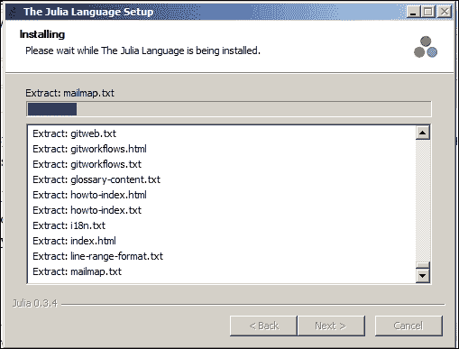

1.  安装成功后，打开 Julia 控制台，Julia 即可使用。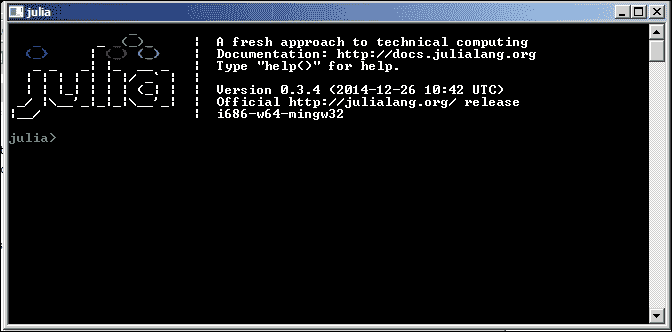

### 使用 Juno IDE 运行 Julia

Juno IDE 使开发 Julia 代码变得简单。从 [`junolab.org/docs/install.html`](http://junolab.org/docs/install.html) 下载最新的 Juno IDE 版本。

Juno 拥有 Julia 的核心 API 和函数，有助于简化开发过程。以下是如何使用 Juno 的截图：

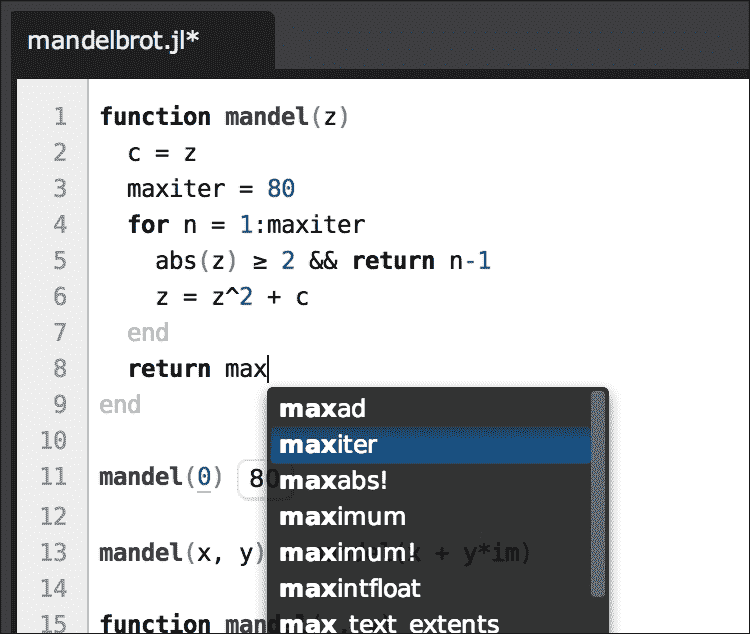

### 通过浏览器使用 Julia

使用此选项不需要安装 Julia。按照以下步骤在线访问 Julia 环境：

1.  通过浏览器访问 [`juliabox.org/`](https://juliabox.org/)

1.  使用 Google 账户登录。这将为登录用户创建一个独特的 Julia 实例。这将提供访问 Julia 控制台和 IJulia 实例的权限。

通过我们之前看到的三种方法之一，我们可以从 Julia 控制台执行 Julia 代码。包含的每段 Julia 代码都构建在一个以 `.jl` 扩展名结尾的文件中。

## 从命令行运行 Julia 代码

Julia 在运行时编译代码，并使用**即时编译器**（**JIT**）将每个方法转换为机器代码。内部，它使用**低级虚拟机**（**LLVM**）进行优化和代码生成。LLVM 是一个完整的项目，它是一系列标准编译技术的集合。这被用作 iOS 的一部分。

从所选的壳中运行以下命令：

```py
<</path/to/Julia>>/myjuliascript.jl
```

或者，从 Julia 命令行安装中打开 Julia 控制台并运行以下命令：

```py
julia> include("<<path/to/juliascript>>/myjuliascript.jl")
```

## 在 Julia 中实现（示例）

在本节中，我们将介绍一些关于 Julia 编程和语法理解的基本主题。在本节结束时，读者应该能够轻松地编写他们的 Julia 脚本并运行它。关于语法，Julia 编程语言与 MATLAB 非常相似。

## 使用变量和赋值

在 Julia 中，变量像任何其他编程语言一样，用于存储和操作数据。以下是一个定义、赋值和操作变量及值的示例：

```py
# Assign a numeric value to a variable
julia> x = 10
10

# Perform a simple mathematical manipulation of variables
julia> x + 1
11

# Assigning or reassigning values to variables.
julia> x = 1 + 1
2

# Assigning a string literal to a variable
julia> x = "Hello World!"
"Hello, World!"
```

Julia 作为一种数学编程语言，提供了几个基本常数。以下是一个可以直接在代码中使用的示例。此外，我们可以定义自己的常数并重新赋值：

```py
julia> pi
π = 3.1415926535897...
```

### 数值原语

对于任何支持基于数值计算的数学编程语言，整数和浮点值构成了基本构建块，被称为数值原语。

Julia 随带支持大量数值原语，这些原语广泛且与数学函数非常互补。

### 数据结构

Julia 支持多种数据结构，除了所有原始数据类型（如 Vectors、Matrices、Tuples、Dictionaries、Sets 等）之外。以下是一些示例表示及其用法：

```py
# Vector
b = [4, 5, 6]
b[1] # => 4
b[end] # => 6

# Matrix
matrix = [1 2; 3 4]

# Tuple
tup = (1, 2, 3)
tup[1] # => 1
tup[1] = 3 # => ERROR #since tuples are immutable, assigning a value results in an error

# Dictionary
dict = ["one"=> 1, "two"=> 2, "three"=> 3]
dict["one"] # => 1

# Set
filled_set = Set(1,2,2,3,4)
```

### 与字符串和字符串操作一起工作

这里有一些在 Julia 中操作字符串的示例：

```py
split("I love learning Julia ! ")
# => 5-element Array{SubString{ASCIIString},1}:
"I"
"love."
"learning."
"Julia"
"!"

join(["It seems to be interesting", "to see",
"how it works"], ", ")
# => "It seems interesting, to see, how it works."
```

### 包

Julia 随带了一些内置函数和许多开箱即用的功能，支持实现机器学习算法。以下是列表：

+   `Images.jl`

+   `Graphs.jl`

+   `DataFrames.jl`

+   `DimensionalityReduction.jl`

+   `Distributions.jl`

+   `NLOpt.jl`

+   `ArgParse.jl`

+   `Logging.jl`

+   `FactCheck.jl`

+   `METADATA.jl`

更多关于 Julia 包的详细信息可以在 [`github.com/JuliaLang/`](https://github.com/JuliaLang/) 查找。

### 互操作性

以下部分涵盖了 Julia 与各种其他编程语言的集成方面。

#### 与 C 集成

Julia 灵活，无需任何包装，可以直接调用 C 函数。以下是一个示例，演示了如何做到这一点：

```py
julia> ccall(:clock, Int32, ())
2292761
julia> ccall(:getenv, Ptr{Uint8int8}, (Ptr{Uint8},), "SHELL")
Ptr{Uint8} @0x00007fff5fbffc45
julia> bytestring(ans)
"/bin/bash"
```

#### 与 Python 集成

与 C 函数调用类似，Julia 支持直接调用 Python 函数。重要的是我们必须安装 `PyCall` 包才能这样做。`PyCall.jl` 提供了 Julia 和 Python 之间的自动类型转换。例如，Julia 数组被转换为 NumPy 数组。

以下是一个示例，演示了从 Julia 代码中调用 Python 函数：

```py
julia> using PyCall # Installed with Pkg.add("PyCall")
julia> @pyimport math
julia> math.sin(math.pi / 4) - sin(pi / 4)
0.0
julia> @pyimport pylab
julia> x = linspace(0,2*pi,1000); y = sin(3*x + 4*cos(2*x));
julia> pylab.plot(x, y; color="red", linewidth=2.0, linestyle="--")
julia> pylab.show()
```

#### 与 MATLAB 集成

以下示例演示了将 Julia 与 MATLAB 函数集成：

```py
using MATLAB

function sampleFunction(bmap::BitMatrix)
@mput bmap
@matlab bmapthin = bwmorph(bmap, "thin", inf)
convert(BitArray, @mget bmapthin)
end
```

### 图形和绘图

Julia 有几个包可以帮助生成图表和图形。其中一些列在这里：

+   `Gadfly.jl`: 这与 ggplot2 非常相似

+   `Winston.jl`: 这与 Matplotlib 非常相似

+   `Gaston.jl`: 这与 gnuplot 接口

此示例演示了使用 `PyPlot`：

```py
using PyPlot
x = linspace(-2pi, 2pi)
y = sin(x)
plot(x, y, "--b")
```

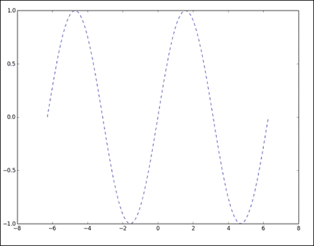

## 采用 Julia 的好处

以下是采用 Julia 在机器学习实现中可以期待的一些直接好处：

+   Julia 促进了快速原型设计，同时不牺牲性能

+   它固有地支持代码的并行化

+   它提供了一种更简单的方式来使用特殊的 Julia 类型表达算法

+   Julia 可以轻松调用或与 C、Python、MATLAB 和 C++ 集成

+   Julia 由一个热情、友好和支持性的社区所促进

+   它与 Hadoop 一起工作，并利用基于 Hive 的查询

## 将 Julia 与 Hadoop 集成

将任何编程语言与 Hadoop 集成通常意味着存储在 Hadoop 中的数据应该是可访问的，并且程序应该能够对数据进行特定的逻辑处理。这可以通过从 Hadoop 中检索数据并将其移至程序附近，或者将程序移动到数据所在位置并执行 MapReduce 或并行处理模式来实现。显然，在第一种情况下，即从 Hadoop 中检索数据并将其带到代码中以执行逻辑时，需要足够的 RAM 来在内存中保存和处理这些数据，这可能会限制在真正大型数据量上运行的能力。在第二种情况下，即将代码带到分布在不同数据节点上的数据时，逻辑应该是可并行化的，并且应该构建 Map 和 Reduce 逻辑。

Julia 与 Hadoop 平台的集成目前还处于初期阶段，详细说明的当前方法是之前描述的第一个方法，即使用标准 ODBC 连接从 Julia 代码连接到 Hadoop/HDFS。数据被检索到 RAM 中以进行进一步处理。现在，此代码可以直接在 DataNode 上运行并更新 HDFS 数据。

我们将使用可以从 GitHub 获取的 `ODBC.jl`——`[ODBC.jl](https://github.com/quinnj/ODBC.jl)`。

[ODBC.jl](https://github.com/quinnj/ODBC.jl)

这是一个为 Julia 设计的简单低级 ODBC 接口。您可以使用以下命令通过 Julia 软件包管理器进行安装：

以下命令创建 Julia 软件包仓库（对于所有软件包只运行一次）

```py
julia> Pkg.init()

```

以下命令创建 `ODBC repo` 文件夹并下载 `ODBC` 软件包及其依赖项（如果需要）

```py
julia> Pkg.add("ODBC")

```

以下命令用于加载 ODBC 模块以供使用（需要与每个新的 Julia 实例一起运行）

```py
julia> using ODBC

```

以下是一些可以用于与 Hadoop/HDFS 一起使用的重要函数：

+   要使用 ODBC 数据源、用户名和密码进行连接，请使用——`co = ODBC.connect("mydatasource",usr="johndoe",pwd="12345")`。

+   要断开连接，请使用 `disconnect(connection::Connection=conn)`。

+   要使用连接字符串进行连接，请使用 `advancedconnect(conn_string::String)`。

+   要对数据源进行查询并检索数据子集，此查询字符串是一个将在 HDFS 上运行的 Hive 查询——`query(connecti on Connection=conn, querystring; fi le=: DataFrame,delim='\t')`。

以下是一个示例实现：

使用以下命令来加载 ODBC 模块：

```py
using ODBC

```

要通过 Hive 连接到 Hadoop 集群，请使用以下命令：

```py
hiveconn = ODBC.connect("servername"; usr="your-user-name", pwd="your-password-here")

```

要编写 Hive 查询并将其存储为 Julia 字符串，请使用以下命令：

```py
hive_query_string = "select …;"

```

要运行查询并将结果直接保存到文件，请使用以下命令：

```py
query(hive_query_string, hiveconn;output="C:\\sample.csv",delim=',')

```

现在，Julia 程序可以访问此文件中的数据以执行机器学习算法。

# Python

Python 是机器学习和数据科学领域中高度采用的编程或脚本语言之一。Python 总是以其易于学习、实现和维护而闻名。Python 高度可移植，可以在基于 Unix 的、Windows 和 Mac 平台上运行。随着 Pydoop 和 SciPy 等库的可用性，其在大数据分析领域的重要性大大增加。以下是一些 Python 在解决机器学习问题中流行的关键原因：

+   Python 被认为非常适合数据分析。

+   它是一种多用途的脚本语言，可以用来编写一些基本的快速脚本，用于测试一些基本功能，或者可以用于实时应用，利用其功能齐全的工具包。

+   Python 附带完整的机器学习包（请参阅[`mloss.org/software/`](http://mloss.org/software/)），并且可以以即插即用的方式使用。

## Python 中的工具包选项

在我们深入探讨 Python 中可用的工具包选项之前，让我们首先了解在选择工具包之前应考虑的工具包选项权衡。

我们应该评估的一些关于适当工具包的问题可能如下：

+   我的性能优先级是什么？我需要离线或实时处理实现吗？

+   工具包的透明度如何？我能自己定制库吗？

+   社区状况如何？错误修复的速度如何？社区支持和专家沟通的可用性如何？

Python 中有三种选项：

+   使用 Python 外部绑定。这些是 Matlab、R、Octave 等市场中的流行包的接口。如果我们已经有一些在之前提到的框架中存在的实现，并且希望无缝迁移到 Python，这个选项将工作得很好。

+   使用基于 Python 的工具包。有一些用 Python 编写的工具包附带了一系列算法。下一节将介绍一些 Python 工具包。

+   编写你的逻辑/工具包。

## Python 的实现（使用示例）

Python 有两个核心工具包，它们更像是构建块，并且这里列出的几乎所有专用工具包都使用这些核心工具包。以下是这些工具包：

+   **NumPy**：NumPy 是关于在 Python 中构建快速高效的数组。

+   **SciPy**：这是一系列在 NumPy 中构建的标准操作算法。

有许多基于 C/C++的实现，例如 LIBLINEAR、LIBSVM、OpenCV 等。

现在让我们看看一些流行的 Python 工具包，以及那些在本书编写一年内更新的工具包：

+   **NLTK**：这代表自然语言工具包。它专注于**自然语言处理**（**NLP**）。

+   **mlpy**：这是一个包含对一些关键机器学习算法（如分类、回归和聚类等）支持的机器学习算法工具包。

+   **PyML**：这个工具包专注于**支持向量机**（**SVM**）。我们将在接下来的章节中详细介绍。

+   **PyBrain**：这个工具包专注于神经网络和相关功能。

+   **mdp-toolkit**：这个工具包的焦点是数据处理，它支持调度和并行化处理。

+   **scikit-learn**：这是最受欢迎的工具包之一，在最近几年被数据科学家广泛采用。它支持监督学习和无监督学习，一些特殊支持用于特征选择和可视化。有一个大型团队正在积极构建这个工具包，以其出色的文档而闻名。

+   **Pydoop**：这是与 Hadoop 平台集成的 Python。

**Pydoop**和**SciPy**在大数据分析中被广泛部署。

在本章中，我们将探讨 scikit-learn 工具包，并在接下来的章节中使用这个工具包演示所有示例。

对于 Python 程序员来说，使用 scikit-learn 可以帮助非常容易地将机器学习引入生产系统。

### 安装 Python 和设置 scikit-learn

以下是安装 Python 和 scikit-learn 的核心 Python 工具包版本和依赖项：

+   Python（>= 2.6 或>= 3.3）

+   NumPy（>= 1.6.1）

+   SciPy（>= 0.9）。

+   一个有效的 C++编译器

我们将使用来自 PyPI 的 scikit-learn 的 wheel 包（`.whl`文件），并使用 pip 实用程序进行安装。

要在您的家目录中安装，请使用以下命令：

```py
python setup.py install --home

```

要直接从 GitHub 的 git 仓库安装 scikit-learn 到本地磁盘，请使用以下命令：

```py
% git clone git://github.com/scikit-learn/scikit-learn/
% cd scikit-learn

```

#### 加载数据

Scikit-learn 附带了一些标准数据集，例如`iris`和`digits`数据集，可用于构建和运行机器学习算法。

以下是加载 scikit-learn 附带的标准数据集的步骤：

```py
>>> from sklearn import datasets
>>> iris = datasets.load_iris()
>>> digits = datasets.load_digits()
>>> print digits.data
[[ 0\. 0\. 5\. ..., 0\. 0\. 0.]
[ 0\. 0\. 0\. ..., 10\. 0\. 0.]
[ 0\. 0\. 0\. ..., 16\. 9\. 0.]
...,
[ 0\. 0\. 1\. ..., 6\. 0\. 0.]
[ 0\. 0\. 2\. ..., 12\. 0\. 0.]
[ 0\. 0\. 10\. ..., 12\. 1\. 0.]]
>>> digits.target
array([0, 1, 2, ..., 8, 9, 8])
```

# Apache Spark

Apache Spark 是一个开源框架，用于快速处理大数据或大规模数据，支持流处理、SQL、机器学习和图处理。这个框架是用 Scala 实现的，并支持 Java、Scala 和 Python 等编程语言。性能比传统的 Hadoop 堆栈高 10 倍到 20 倍。Spark 是一个通用框架，允许交互式编程，并支持流处理。Spark 可以以独立模式与支持 Hadoop 格式的 Hadoop 一起工作，如 SequenceFiles 或 InputFormats。它包括本地文件系统、Hive、HBase、Cassandra 和 Amazon S3 等。

我们将在整本书中使用 Spark 1.2.0。

下图展示了 Apache Spark 的核心模块：

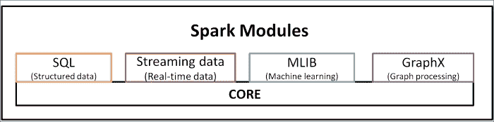

Spark 框架的一些基本功能包括任务调度、与存储系统的交互、容错性和内存管理。Spark 遵循名为**弹性分布式数据集**（**RDD**）的编程范式。这主要与分布式数据存储和并行计算管理相关。

+   **Spark SQL**是 Spark 用于查询和处理结构化和非结构化数据的包。此包的核心功能包括：

    +   为了便于从各种结构化数据源（如 Hive、JSON 等）加载数据

    +   为了在 SQL 和常规 Python 或 Java 或 Scala 代码之间提供集成，并提供构建可以在分布式数据上并行执行的自定义函数的能力

    +   支持通过标准数据库连接（JDBC/ODBC）从外部工具进行基于 SQL 的查询，包括**Tableau**

+   **Spark Streaming**模块用于处理实时、大规模的数据流。此 API 与 Hadoop 的 Streaming I/O API 不同。

+   **MLib**模块提供开箱即用的可扩展机器学习算法函数，可以在集群上运行。

+   **GraphX**模块提供图形操作的功能。

在本章中，我们将学习如何结合 Scala 编程语言使用 Spark。现在让我们快速概述 Scala 并学习如何在 Scala 中编码。

## Scala

Scala 是一种强类型编程语言，需要**JVM**（**Java 虚拟机**）来运行。它是一个独立平台，可以利用 Java API。我们将使用解释器提示符来运行带有 Spark 的 Scala。这里的命令提示符显示了如何使用解释器提示符运行 Spark 中的 Scala。

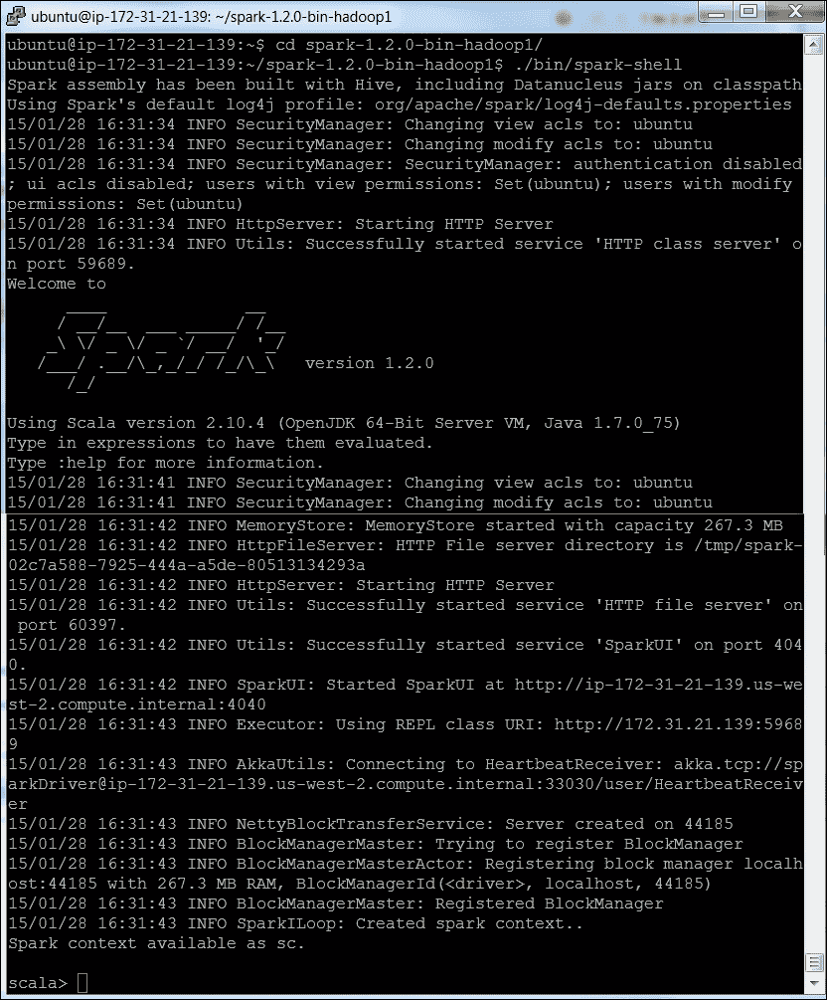

让我们看看一些 Scala 的示例。

以下代码可以直接粘贴到命令提示符中：

```py
//Default variables are assigned to any expressions
scala>8 * 5 + 2
Res0: Int = 42
Scala>0.5 * res0
Res1= Double = 21.0
//All simple data types are objects
scala>"Hello, " + res0
Res2: java.lang.String = Hello, 42
scala>10.toString()
Res2: String = 10
scala>a.+(b)
Res1: Int = 200            //So you can consider , the operator as a method
A method b as a shorthand for a.method(b)
scala>val myVal: String = "Foo"
keyword "val" this means that a variable cannot change value  (immutable variable)
scala>var myVar:String = "Foo"
the keyword var means that it is a variable that can be changed (mutable variable)
scala> def cube(a: Int): Int = a * a * a
cube: (a: Int)Int
scala> myNumbers.map(x => cube(x))
res8: List[Int] = List(1, 8, 27, 64, 125, 64, 27)
scala> myNumbers.map(x => x * x * x)
res9: List[Int] = List(1, 8, 27, 64, 125, 64, 27)
scala> val myNumbers = List(1,2,3,4,5,4,3)
myNumbers: List[Int] = List(1, 2, 3, 4, 5, 4, 3)
scala> def factorial(n:Int):Int = if (n==0) 1 else n * factorial(n-1)
factorial: (n: Int)Int
scala> myNumbers.map(factorial)
res18: List[Int] = List(1, 2, 6, 24, 120, 24, 6)
scala> myNumbers.map(factorial).sum
res19: Int = 183
scala> var factor = 3
factor: Int = 3
scala> val multiplier = (i:Int) => i * factor
multiplier: Int => Int = <function1>
scala> val l1 = List(1,2,3,4,5) map multiplier
l1: List[Int] = List(3, 6, 9, 12, 15)
scala> factor = 5
factor: Int = 5
```

## 使用弹性分布式数据集（RDD）进行编程

RDD 是 Spark 处理数据的核心抽象。它们是不可变的分布式元素集合。Spark 中的所有函数都仅在 RDD 上操作。

Spark 自动将 RDD 中包含的数据分布到集群中的节点上作为分区，并支持对这些分区进行并行处理。可以通过从外部数据集导入或分发驱动程序程序中的集合来创建 RDD。以下命令演示了此功能：

```py
scala> val c = file.filter(line => line.contains("and"))
```

`collect()`方法将输出写入控制台：

```py
scala>c.collect()
```

结果的输出通常保存到外部存储系统。`count()`函数给出输出行的数量。以下将打印出这些行：

```py
scala>println("input had " + c.count() + " lines")
```

`take()`函数将获取结果中的*n*条记录：

```py
scala>c.take(10).foreach(println)
```

RDDs 通过 Spark 以懒加载的方式处理，从而在处理大数据集时提高效率。

要在多个操作中重用 RDD，你可以要求 Spark 使用`RDD.persist()`来持久化它。

我们可以要求 Spark 将我们的数据持久化到不同的位置。第一次计算后，Spark 将 RDD 内容存储在内存中（跨集群中的机器分区）并用于未来的操作。

因此，以下处理 RDD 的基本步骤：

1.  从外部数据创建输入 RDD。

1.  使用转换（例如`filter()`）将它们转换为定义新的 RDD。

1.  使用`persist()`存储中间 RDD 以供重用。

1.  调用任何所需的函数（例如，`count()`）以启动并行计算过程。

以下是一个使用 Scala 的 Pi Estimation 的 RDD 示例：

```py
scala>var NUM_SAMPLES=5
scala> val count = sc.parallelize(1 to NUM_SAMPLES).map{i =>
     | val x = Math.random()
     | val y = Math.random()
     |  if (x*x + y*y < 1) 1 else 0
     | }.reduce(_ + _)
scala>println("Pi is roughly " + 4.0 * count / NUM_SAMPLES)
```

# Spring XD

虽然这本书没有包括 Spring XD 框架来演示机器学习算法，但在这里给出一个小介绍，因为发现在机器学习世界中快速被采用。

XD 代表极端数据。这个开源框架由 Pivotal 团队（之前称为 SpringSource）构建，作为开发和大数据应用程序部署的一站式商店。

Spring XD 是一个分布式且可扩展的框架，它统一了数据摄取、实时、批处理中的分析功能，并支持数据导出。Spring XD 建立在 Spring Integration 和 Spring Batch 框架之上。

以下是一些关键特性：

+   Spring XD 是一个批处理和流工作负载的统一平台。它是一个开放且可扩展的运行时。

+   可扩展且高性能，它是一个分布式数据摄取框架，可以从包括 HDFS、NOSQL 或 Splunk 在内的各种来源摄取数据。

+   它支持在摄取时进行实时分析，例如收集指标和计数值。

+   它通过批处理作业进行工作流管理，包括与标准 RDBMS 和 Hadoop 系统的交互。

+   它是一个可扩展且高性能的数据导出，例如从 HDFS 到 RDBMS 或 NoSQL 数据库。

Spring XD 已知实现了 Lambda 架构，理论上定义了支持批处理和实时处理。有关 Lambda 架构等进化架构的更多信息，请参阅第十四章，*机器学习的新一代数据架构*。

Spring XD 架构主要包含三个架构层，以帮助实现上述功能：

1.  **速度层**：这是关于实时访问和处理数据。这个过程使系统保持更及时。

1.  **批处理层**：批处理层可以访问完整的 master 数据集，也称为数据湖，意味着*真相之源*。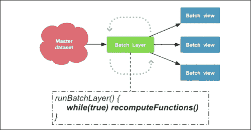

1.  **服务层**：服务层更像是查询层，负责将后处理数据暴露给未订阅的消费者。这一层使得批数据可查询，并且通常以其高吞吐量驱动的响应而闻名。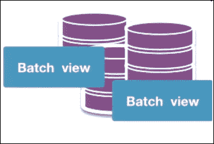

这里展示了 Spring XD 运行时架构（来源：Pivotal）：

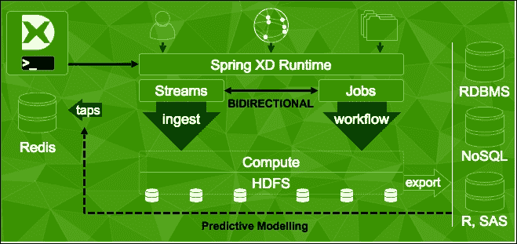

# 摘要

在本章中，我们学习了实现机器学习的开源选项，并涵盖了 Apache Mahout、Python、R、Julia 和 Apache Spark 的 MLib 等库、工具和框架的安装、实现和执行。重要的是，我们还介绍了这些框架与大数据平台 Apache Hadoop 的集成。本章更多的是为后续章节打基础，在后续章节中我们将学习如何使用这些框架来实现特定的机器学习算法。
