# 第五章。基于决策树的学习

从本章开始，我们将深入研究每种机器学习算法。我们从一个非参数监督学习方法——决策树及其用于分类和回归的高级技术开始。我们将概述一个可以通过构建基于决策树的模型来解决的问题，并学习如何在 Apache Mahout、R、Julia、Apache Spark 和 Python 中实现它。

本章深入探讨了以下主题：

+   决策树：定义、术语、需求、优点和局限性。

+   构建和理解决策树的基本知识以及一些关键方面，如信息增益和熵。你还将学习构建回归树、树的分类以及测量误差。

+   理解决策树的一些常见问题、修剪决策树的需求以及修剪技术。

+   你将学习决策树算法，如 CART、C4.5、C5.0 等；以及专门的树，如随机森林、斜树、进化树和 Hellinger 树。

+   理解分类和回归树在业务用例中的应用，以及使用 Apache Mahout、R、Apache Spark 和 Julia 以及 Python（scikit-learn）库和模块的实现。

# 决策树

决策树被认为是机器学习领域中最为强大和广泛使用的建模技术之一。

决策树自然地诱导出可用于数据分类和预测的规则。以下是从构建决策树中得出的规则定义示例：

如果（笔记本电脑型号是**x**）并且（由**y**制造）并且（**z**年）并且（某些所有者是**k**）那么（电池寿命是**n**小时）。

当仔细观察时，这些规则以简单、可读和易于理解的形式表达。此外，这些规则可以存储在数据存储中，以便以后参考。以下的概念图展示了将在以下章节中涵盖的决策树的各种特性和属性。

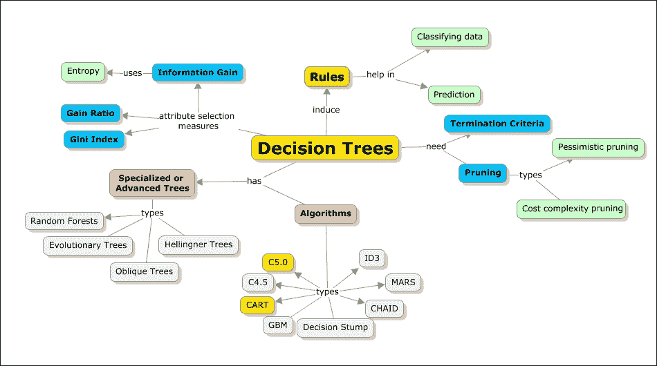

## 术语

决策树通过从根节点到叶节点的树结构来表示实例的分类。最重要的是，在高级别上，决策树有两种表示形式——节点和连接节点的弧。为了做出决策，流程从根节点开始，导航到弧，直到达到叶节点，然后做出决策。树中的每个节点表示属性的测试，分支表示属性可能采取的可能值。

以下是一些决策树表示的特性：

+   每个非叶节点（例如，决策节点）表示属性值的表示

+   每个分支表示值表示的其余部分

+   每个叶节点（或终端节点）代表目标属性的值

+   起始节点被称为根节点

下面的图表示了相同的内容：

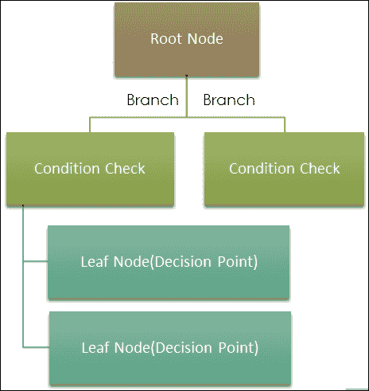

## 目的和用途

决策树用于分类和回归。在此背景下使用两种类型的树：

+   分类树

+   回归树

分类树用于将给定的数据集分类到类别中。要使用分类树，目标变量的响应需要是分类值，如是/否、真/假。另一方面，回归树用于解决预测需求，并且当目标或响应变量是数值或离散值（如股票价值、商品价格等）时总是使用。

下一个图展示了决策树的目的以及相关的树类别，即分类树或回归树：

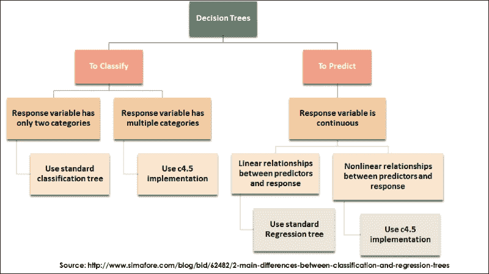

## 构建决策树

通过一个简单的例子和手动构建决策树，可以最好地学习决策树。在本节中，让我们看一个简单的例子；以下表格显示了手头的数据集。我们的目标是预测客户是否会接受贷款，给定他们的人口统计信息。显然，如果我们可以为这个数据集制定一个规则作为模型，这将最有用。

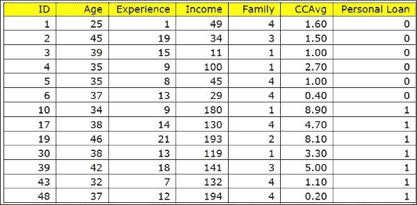

从前一个表中，由于年龄和经验高度相关，我们可以选择忽略其中一个属性。这隐式地帮助了特征选择。

情况 1：让我们开始构建决策树。首先，我们将选择根据 CCAvg（平均信用卡余额）进行分割。

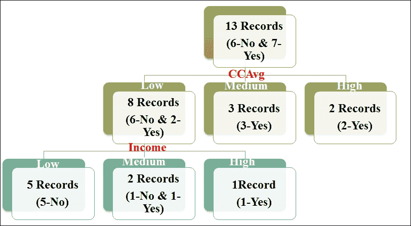

使用这个决策树，我们现在有两个非常明确的规则：

*如果 CCAvg 中等则贷款 = 接受* 或 *如果 CCAvg 高则贷款 = 接受*

为了更清晰地说明规则，让我们添加收入属性。我们还有两个额外的规则：

*如果 CCAvg 低且收入低，则贷款不接受*

*如果 CCAvg 低且收入高，则贷款接受*

通过结合这里的第二个规则和前两个规则，我们可以推导出以下规则：

*如果 (CCAvg 中等) 或 (CCAvg 高) 或 (CCAvg 低且收入高)，则贷款 = 接受*

情况 2：让我们使用家庭作为开始构建决策树。

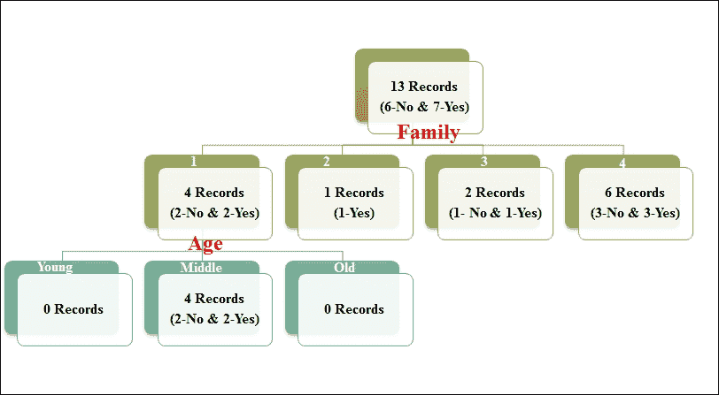

在这种情况下，只有一个规则，因为它只有两个数据点，所以结果并不准确。

因此，选择一个有效的属性来开始构建树对模型的准确性有影响。从先前的例子中，让我们列出构建决策树的一些核心规则：

+   我们通常从一个属性开始构建决策树，根据该属性分割数据，然后对其他属性继续同样的过程。

+   对于给定的问题，可能有多个决策树。

+   树的深度与所选属性的数目成正比。

+   需要有一个终止标准来确定何时停止进一步构建树。在没有终止标准的情况下，模型可能会导致数据过拟合。

+   最后，输出总是以简单规则的形式呈现，这些规则可以存储并应用于不同的数据集进行分类和/或预测。

决策树在机器学习领域被优先选择的原因之一是它们对错误的鲁棒性；当训练数据集中存在一些未知值时，它们也可以被使用（例如，收入数据并非所有记录都有）。

### 处理缺失值

为一些未知值分配值的一个有趣的方法是观察最常见的值被分配，在某些情况下，如果可能的话，它们可以属于同一类，如果可能的话，我们应该将其与准确性更接近。

这还有另一种概率方法，预测是按比例分配的：

为 *x* 的每个值 *vi* 分配一个概率 *pi*。

现在，将 *x* 的分数 *pi* 分配给每个后代。这些概率可以根据节点 *n* 中 A 的各种值的观察频率再次估计。

例如，让我们考虑一个布尔属性 *A*。假设 *A* 有 10 个值，其中三个值为 True，其余 7 个值为 False。因此，*A(x) = True* 的概率是 0.3，而 *A(x) = False* 的概率是 0.7。

其中 0.3 的分数沿着 *A = True* 的分支分布，0.7 的分数沿着另一个分支分布。这些概率值用于计算信息增益，如果需要测试第二个缺失的属性值，则可以使用这些值。同样的方法可以在学习时应用，当我们需要为新分支填充任何未知值时。C4.5 算法使用这种机制来填充缺失值。

### 构建决策树的考虑因素

构建决策树的关键在于知道如何对它们进行分割。为此，我们需要明确以下内容：

+   从哪个属性开始，以及随后的属性应用哪个？

+   我们何时停止构建决策树（即避免过拟合）？

#### 选择合适的属性（或属性组合）。

有三种不同的方法来识别最适合的属性：

+   信息增益和熵

+   吉尼指数

+   收益率

##### 信息增益和熵

这个实体在名为 C4.5 的算法中使用。熵是数据不确定性的度量。让我们用一个直观的方法来理解信息增益和熵的概念。

例如，考虑一个硬币正在被抛掷，有五个硬币，正面朝上的概率分别为 0, 0.25, 0.5, 0.75 和 1。所以，如果我们考虑哪个具有最高的不确定性和哪个具有最低的不确定性，那么 0 或 1 的情况将是最低的确定性，而最高的是当它是 0.5 时。以下图展示了相同的表示：

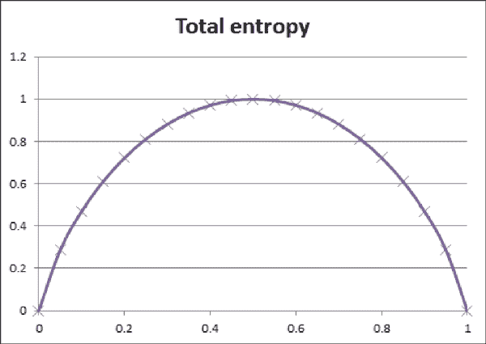

这里展示了数学表示：

H = -∑p[i]log2p[i]

在这里，p[i] 是特定状态的概率。

如果一个系统有四个事件，概率分别为 1/2, 1/4, 1/5 和 1/8，则表示系统的总熵如下：

H = -1/2 log2(1/2)-1/4log2(1/4)-1/5log2(1/5)-1/8log2(1/8)

在 C5.0 和 C4.5 算法的原始版本（ID3）中，根节点是根据如果选择此节点将减少多少总熵来选择的。这被称为信息增益。

信息增益 = 分割前系统的熵 - 分割后系统的熵

分割前的系统熵如下：

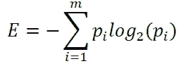

使用 *A* 将 *D* 划分为 *v* 个分区以分类 *D* 后的熵：

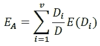

在属性上分支获得的信息增益：

现在我们来计算从我们的数据中获得的信息增益：

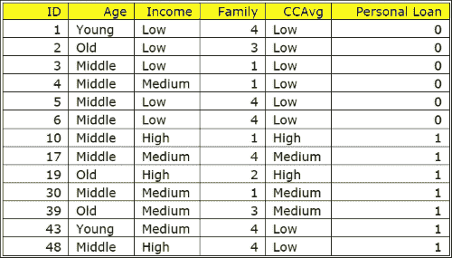

类 P 接受贷款 = 是/ 1. 类 N 接受贷款 = 否 / 0

分割前的熵如下：

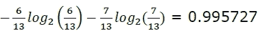

这是很明显且预期的，因为我们几乎有一半的数据是平分的。现在让我们看看哪个属性能给出最佳的信息增益。

如果分割是基于 CCAvg 和 Family，则熵的计算可以表示如下。总熵是作为创建的每个节点的熵之和的加权总和。

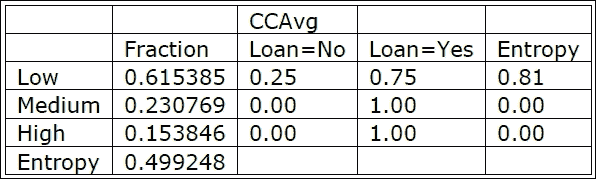

其分割后的熵如下：

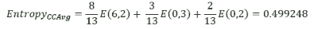

信息增益如下：

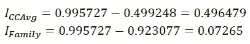

这种方法被应用于计算所有其他属性的信息增益。它选择信息增益最高的一个。这将在每个节点上进行测试以选择最佳节点。

##### Gini 指数

Gini 指数是一个通用的分割标准。它以意大利统计学家和经济学家 Corrado Gini 命名。Gini 指数用于衡量两个随机项目属于同一类的概率。在真实数据集的情况下，这个概率值是 1。一个节点的 Gini 测量值是类比例的平方和。具有两个类的节点得分为 *0.52 + 0.52 = 0.5*。这是因为随机选择相同类的概率是 2 中的 1。现在，如果我们对数据集应用 Gini 指数，我们得到以下结果：

原始基尼系数 = 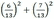 = 0.502959

当与 CCAvg 和 Family 分割时，基尼系数变为以下：

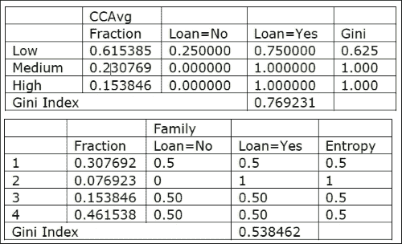

##### 增益率

与 ID3 相比，C4.5 的另一个改进是决定属性的因子是增益率。增益率是信息增益和信息含量的比率。提供最大增益率的属性是用于分割的属性。

让我们用一个极其简单的例子来做一些计算，以突出为什么增益率比信息增益是一个更好的属性：

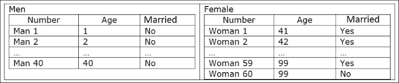

因变量是他们在特定情况下是否已婚。让我们假设在这种情况下，没有男人已婚。而所有女人（除了最后一位 60 位女性）都是已婚的。

所以，直观上规则必须如下：

+   如果是男性，那么他是未婚的

+   如果是女性，那么她是已婚的（唯一一个她未婚的孤立案例必须是噪声）。

让我们系统地解决这个问题，以深入了解各种参数。首先，让我们将数据分成两半作为训练数据和测试数据。因此，我们的训练集包括最后 20 个男性（所有不可感知且年龄在 21-40 岁之间），以及最后 30 个女性（所有已婚且年龄在 71-99 岁之间，除了最后一位）。测试数据包含另一半，其中所有女性都是已婚的。

增益率需要衡量**信息含量**。

信息含量定义为 *-f[i] log[2] f[i]*。请注意，在这里，我们不考虑因变量的值。我们只想知道一个状态中成员的分数除以总成员数。

性别的信息含量是指它只有两种状态；男性是 20，女性是 30。因此，性别信息含量为 *2/5*LOG(2/5,2)-3/5*LOG(3/5,2)=0.9709*。

年龄的信息含量是指年龄共有 49 个状态。对于只有一个数据点的状态，信息含量是 *-(1/50)*log(1/50,2) = 0.1129*。

有 48 个这样的状态只有一个数据点。因此，它们的信息含量是 (0.1129*48), 5.4192。在最后一个状态中，有两个数据点。因此，它的信息含量是 *-(2/50 * LOG(2/50,2)) = 0.1857*。年龄的总信息含量是 5.6039。

性别的增益率 = 性别的信息增益 / 性别的信息含量 = 0.8549/0.9709 = 0.8805。

年龄的增益率 = 0.1680

所以，如果我们考虑增益率，我们会得到性别是一个更合适的度量。这与直觉相符。现在让我们假设我们使用了增益率并构建了树。我们的规则是如果性别是男性，那么这个人未婚，如果性别是女性，那么这个人已婚。

#### 终止标准/剪枝决策树

每个分支都足够深入地生长，以便通过决策树算法完美地分类训练示例。这可能会成为一种可接受的方法，但在数据中存在噪声时，通常会导致问题。如果训练数据集太小，无法代表实际数据集的真实情况，决策树可能会最终过拟合训练示例。

在决策树学习中避免过拟合有许多方法。以下是两种不同的情况：

+   一种情况是决策树在完成训练数据的完美分类之前就终止了生长

+   另一种情况是数据过拟合后，然后剪枝以恢复

虽然第一种情况看起来可能更直接，但第二种情况，即对过拟合树进行后剪枝，在现实中更成功。原因是难以知道何时停止树的生长。无论采取何种方法，确定最终、适当的树大小的标准更为重要。

以下是一些寻找正确树大小的方法：

1.  识别一个与目标训练数据集不同的独立数据集，并评估树中后剪枝节点的正确性。这是一个常见的方法，被称为训练和验证集方法。

1.  在训练集中不使用数据子集，而是使用训练集中的所有数据，并应用概率方法来检查剪枝特定节点是否有任何可能产生超过训练数据集的改进。使用所有可用数据进行训练。例如，可以使用卡方检验来检查这个概率。

减少错误剪枝（D）：通过移除以节点为根的子树来剪枝。我们将该节点变为叶节点（具有相关示例的大多数标签）；算法如下所示：

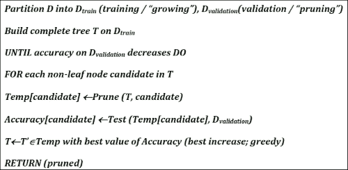

规则后剪枝是一种更常用的方法，是一种高度准确的理论技术。C4.5 中使用的是这种剪枝方法的变体。

以下是规则后剪枝过程的步骤：

1.  通过生长直到出现明显的过拟合来从训练集中构建决策树。

1.  从根节点到特定叶节点的每一条路径生成决策树中的规则，映射到一个规则。

1.  对每个规则应用剪枝，以去除已识别的先决条件，并有助于提高概率准确性。

1.  接下来，按照它们在后续实例中增加的准确度顺序使用剪枝规则。

以下是基于规则的剪枝的优点及其转换为规则的需求：

+   提高规则的易读性

+   可以在根节点和叶节点级别进行一致的测试。

+   可以清楚地决定是移除决策节点还是保留它

### 决策树图形表示

到目前为止，我们已经看到决策树是如何通过在节点处划分数据并与常数比较来描述的。另一种表示决策树的方法是可视化和图形表示。例如，我们可以在两个维度中选择两个输入属性，然后比较一个属性的值与常数，并在平行轴上显示数据分割。我们还可以比较两个属性，包括属性的线性组合，而不是与轴不平行的超平面。

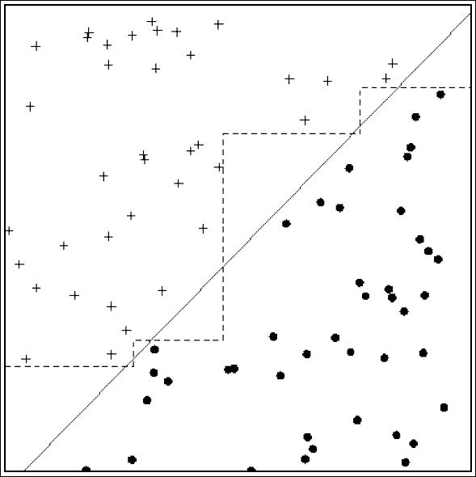

对于给定的数据，可以构建多个决策树。识别最小和完美树的过程称为最小一致假设。让我们用两个论点来看为什么这是最好的决策树：

奥卡姆剃刀原理很简单；当有两种方法可以解决问题并且两者都给出相同的结果时，最简单的那一个占上风。

在数据挖掘分析中，人们可能会陷入复杂方法和大量计算陷阱。因此，内化奥卡姆的推理路线至关重要。始终选择一个大小和误差最佳组合的决策树。

### 诱导决策树 – 决策树算法

有许多诱导决策树的方法。在所有方法中，C4.5 和 CART 是最被采用或最受欢迎的。在本节中，我们将深入探讨这些方法，并简要介绍其他方法。

#### CART

CART 代表分类和回归树（Breiman 等，1984）。CART 创建二叉树。这意味着从给定的节点总是有两个分支可以产生。CART 算法的哲学是遵循一个*良好性*标准，这关乎选择最佳可能的分区。此外，随着树的成长，采用成本复杂度剪枝机制。CART 使用基尼指数来选择适当的属性或分割标准。

使用 CART，可以提供先验概率分布。我们可以使用 CART 生成回归树，这反过来又有助于预测一个类别对实数的预测。预测是通过应用节点的加权平均值来完成的。CART 识别出最小化预测平方误差的分割（即最小二乘偏差）。

下图中 CART 的描述是针对前一小节中提到的相同示例，其中展示了决策树构建过程：

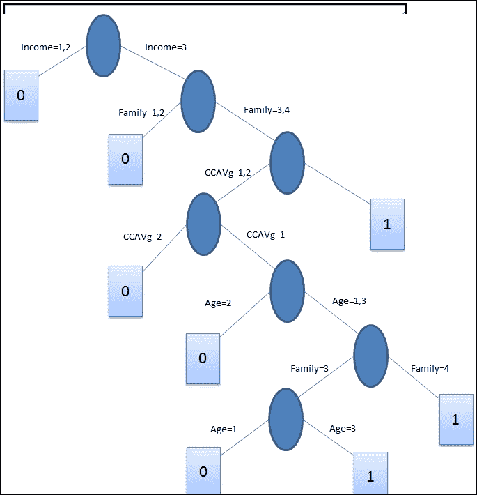

#### C4.5

与 CART 类似，C4.5 是一种决策树算法，其主要区别在于它可以生成超过二叉树，这意味着支持多路分割。在属性选择上，C4.5 使用信息增益度量。正如前一部分所解释的，具有最大信息增益（或最低熵减少）值的属性有助于以最少的数量数据实现更接近准确的分类。C4.5 的一个主要缺点是需要大量的内存和 CPU 容量来生成规则。C5.0 算法是 C4.5 的商业版本，于 1997 年推出。

C4.5 是 ID3 算法的演变。使用增益率度量来识别分割标准。分割过程在分割数量达到边界条件定义的阈值时停止。在树的这个生长阶段之后，进行剪枝，并遵循基于错误的剪枝方法。

这里是 C4.5 构建决策树的表示，用于与上一节中使用的相同示例：

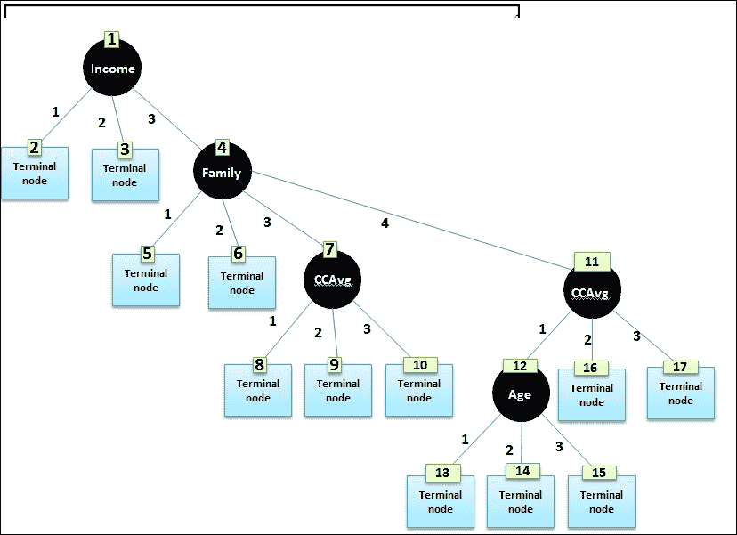

| 树形归纳法 | 它是如何工作的？ |
| --- | --- |
| ID3 | ID3（**迭代二分器 3**）算法被认为是决策树算法中最简单的一种。它使用信息增益方法作为分割标准；分割会一直进行，直到最佳信息增益不再大于零。ID3 没有进行特定的剪枝操作。它无法处理数值属性和缺失值。 |
| CHAID | **CHAID**（**卡方自动交互检测**）是为了仅支持名义属性而构建的。对于每个属性，选择一个值，使其与目标属性最接近。根据目标属性的类型，有一个额外的统计度量，区分了该算法。对于连续目标属性使用 F 检验，对于名义目标属性使用皮尔逊卡方检验，对于有序目标属性使用似然比检验。CHAID 检查一个条件以合并，这可能有一个阈值，并移动到下一个合并检查。这个过程会重复进行，直到找不到匹配的对。CHAID 以简单的方式处理缺失值，并假设所有值都属于一个单一的合法类别。在这个过程中没有进行剪枝操作。 |
| QUEST | QUEST 的缩写代表快速、无偏、高效和统计树。此算法支持单变量和线性组合分割。根据属性类型，使用 ANOVA F 检验或皮尔逊卡方检验或双均值聚类方法来计算每个输入属性与目标属性之间的关系。分割应用于与目标属性关联更强的属性。为了确保达到最优分割点，应用**二次判别分析**（**QDA**）。再次，QUEST 实现了二叉树，并且为了剪枝使用了 10 折交叉验证。 |
| CAL5 | 这与数值属性一起工作。 |
| FACT | 此算法是 QUEST 的早期版本，使用统计方法，随后进行判别分析以进行属性选择。 |
| LMDT | 这使用多元测试机制来构建决策树。 |
| MARS | 使用线性样条及其张量积来近似多个回归函数。 |

### 贪婪决策树

决策树的一个关键特征是它们是**贪婪的**！贪婪算法通过在每个阶段实现局部最优来全局地实现最优解。虽然全局最优并不总是有保证，但局部最优有助于最大限度地实现全局最优。

每个节点都会贪婪地搜索以达到局部最优，并且陷入局部最优的可能性很高。大多数时候，针对局部最优可能有助于提供足够好的解决方案。

### 决策树的好处

使用决策树的一些优点如下：

+   决策树构建快速且简单，且需要很少的实验

+   它们是健壮的

+   它们易于理解和解释

+   决策树不需要复杂的数据准备

+   它们可以处理分类数据和数值数据

+   它们通过使用统计模型进行验证来得到支持

+   它们可以处理高维数据，并且可以操作大型数据集

## 专用树

在本节中，我们将探讨一些重要的特殊情况以及特殊的决策树类型。在解决特殊类型的问题时，这些情况非常有用。

### 倾斜树

在数据极其复杂的情况下使用倾斜树。如果属性是 *x1, x2, AND x3…xn*，那么 C4.5 和 CART 测试标准为 *x1>某个值* 或 *x2<另一个值*，依此类推。在这种情况下，目标是找到每个节点要测试的属性。这些是如图所示图形上的平行轴分割：

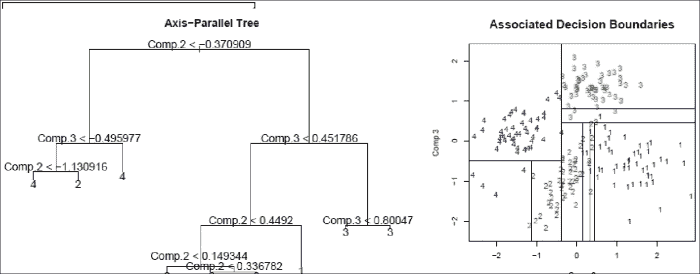

显然，我们需要构建巨大的树。在这个时候，让我们学习一个称为超平面的数据挖掘术语。

在**一维**问题中，一个点对空间进行分类。在**二维**中，一条直线（直线或曲线）对空间进行分类。在**三维**问题中，一个平面（线性或曲线）对空间进行分类。在更高维的空间中，我们想象一个平面像东西一样分裂并对空间进行分类，称之为**超平面**。以下图表展示了这一点：

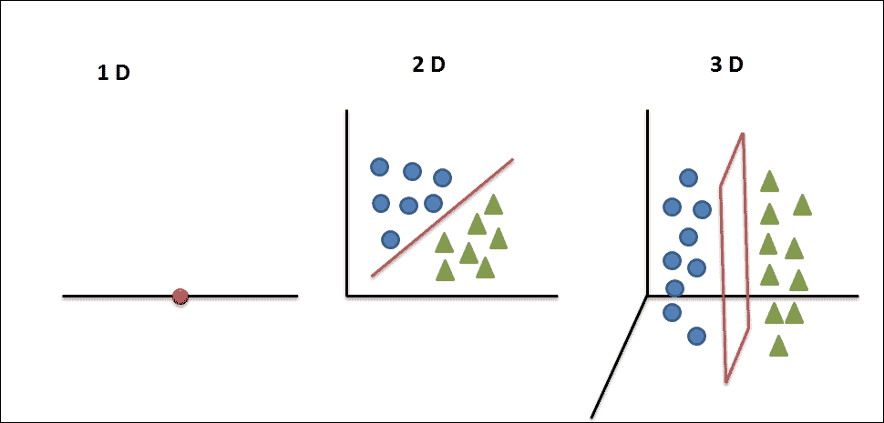

因此，传统的决策树算法产生的是与轴平行的超平面来分割数据。如果数据复杂，这可能会变得很繁琐。如果我们能构建斜面，虽然可解释性可能会降低，但我们可能会大幅减少树的大小。所以，我们的想法是将测试条件从以下内容改变：

xi > K 或 < K 到 a1x1+ a2x2+ … + c > K 或 < K

这些斜面超平面有时可以极大地减少树的大小。图 2 中所示的数据在这里使用斜面进行分类：

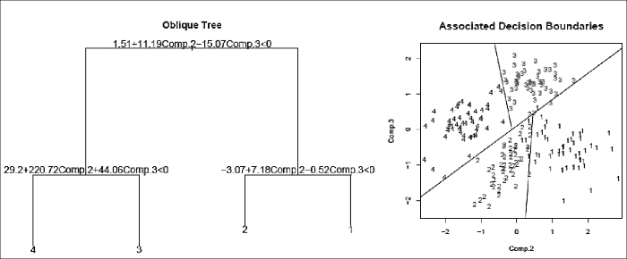

### 随机森林

当维度过多时，我们会使用这些专门的树木。我们在机器学习简介章节中学习了维度的诅咒。维度诅咒的基本前提是高维数据带来了复杂性。随着维度和特征的增多，错误的可能性也相应提高。在我们深入探讨随机森林之前，让我们先了解提升法的概念。关于提升法的更多细节可以在第十三章 *集成学习*中找到。在随机森林的情况下，提升法的应用主要涉及如何将单个决策树方法结合起来，以提升结果的准确性。

随机森林通过包含更多的决策树来扩展决策树。这些决策树是通过随机选择数据（样本）和随机选择属性子集的组合来构建的。以下图表展示了构建每个决策树时数据集的随机选择：

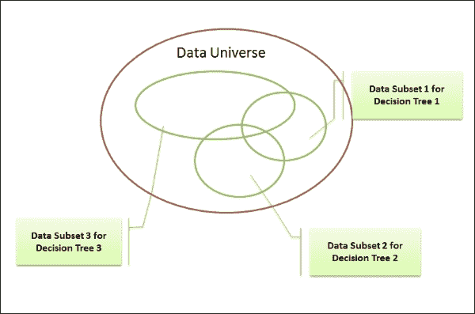

制作多个决策树所需的另一个变量输入是属性的随机子集，这在以下图表中有所表示：

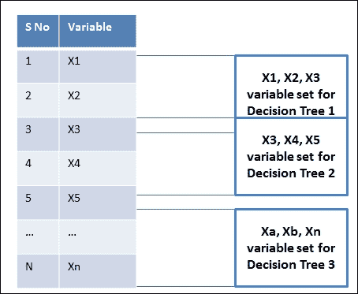

由于每棵树都是使用随机数据集和随机变量集构建的，因此这些树被称为随机树。此外，许多这样的随机树定义了一个随机森林。

随机树的结果基于两个根本的信念。一是每棵树都能对大部分数据做出准确的预测。二是错误会在不同的地方发生。因此，通常会对决策树的结果进行平均，以得出结论。

观察数据不足，无法得到良好的估计，这导致了稀疏性问题。空间密度指数的指数增长有两个重要原因，一是维度增加，二是数据中等距点的增加。大部分数据都在尾部。

为了估计给定精度的密度，以下表格显示了样本大小如何随着维度的增加而增加。随后的计算表格显示了多元正态分布估计的均方误差如何随着维度的增加而增加（如 Silverman 所展示，并使用此处给出的公式计算）：

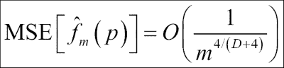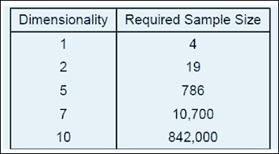

随机森林是决策树的一个重要扩展，非常容易理解，效率极高，尤其是在处理高维空间时。当原始数据有许多维度时，我们随机选择维度（列）的小子集并构建一棵树。我们让它无修剪地生长。现在，我们迭代这个过程，每次构建具有不同属性集的数百棵树。

对于预测，一个新的样本被推入树中。训练样本的新标签被分配给终端节点，它最终结束的地方。这个程序在组中的所有树上迭代，所有树的平均投票结果被报告为随机森林预测。

### 进化树

当达到全局最优解似乎几乎不可能时，会使用进化树。正如你所学的，决策树是贪婪的。因此，有时我们可能只是因为陷入了局部最优解，而构建出更大的树。所以，如果你的树长度实在太大，可以尝试斜树或进化树。

进化树的概念起源于一个非常激动人心的概念，即遗传算法。你将在另一门课程中详细了解它。让我们只看看其本质。

与在每一个节点数学上计算最佳属性不同，进化树在每个点随机选择一个节点并创建一棵树。然后它迭代并创建一系列树（森林）。现在，它识别森林中最佳树木用于数据。然后通过随机组合这些树来创建森林的下一代。

另一方面，进化树选择一个截然不同的顶级节点，并生成一个更短的树，具有相同的效率。进化算法的计算时间更长。

### 希尔林格树

已有尝试识别比熵或基尼指数对依赖变量值分布更不敏感的纯度度量。一篇最新的论文建议使用希尔林格距离作为不依赖于目标变量分布的纯度度量。

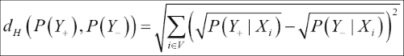

实质上，*P(Y+|X)* 是对于每个属性找到 *Y+* 的概率，同样地，对于每个属性的 *P(Y-|X)* 也是计算出来的。

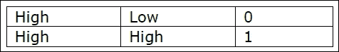

从上一张图中可以看出，对于第一个属性的**高**值，只有第二个属性的**高**值才能得到概率值为 1。这使得总距离值为 *sqrt(2)*。

# 实现决策树

请参考本章提供的源代码以实现决策树和随机森林（源代码路径 `.../chapter5/...` 在每个文件夹下的技术中）。

## 使用 Mahout

请参考文件夹 `.../mahout/chapter5/decisiontreeexample/`。

请参考文件夹 `.../mahout/chapter5/randomforestexample/`。

## 使用 R

请参考文件夹 `.../r/chapter5/decisiontreeexample/`。

请参考文件夹 `.../r/chapter5/randomforestexample/`。

## 使用 Spark

请参考文件夹 `.../spark/chapter5/decisiontreeexample/`。

请参考文件夹 `.../spark/chapter5/randomforestexample/`。

## 使用 Python (scikit-learn)

请参考文件夹 `.../python scikit-learn/chapter5/decisiontreeexample/`。

请参考文件夹 `.../python scikit-learn/chapter5/randomforestexample/`。

## 使用 Julia

请参考文件夹 `.../julia/chapter5/decisiontreeexample/`。

请参考文件夹 `.../julia/chapter5/randomforestexample/`。

# 摘要

在本章中，你学习了使用决策树进行监督学习的技术，以解决分类和回归问题。我们还介绍了选择属性、分割树和剪枝树的方法。在所有其他决策树算法中，我们还探讨了 CART 和 C4.5 算法。对于特殊需求或问题，你还学习了如何使用 Spark、R 和 Julia 的 MLib 实现基于决策树的模型。在下一章中，我们将介绍**最近邻**和**支持向量机（SVM**）来解决监督学习和无监督学习问题。
