# 第七章：基于关联规则的学习

在前几章中，我们已经介绍了决策树、实例和基于核的监督学习和无监督学习方法。在前几章中，我们还探讨了这些学习算法中最常用的算法。在本章中，我们将介绍基于关联规则的学习，特别是 Apriori 和 FP-Growth 算法等。我们将学习这项技术的基礎，并使用 Apache Mahout、R、Julia、Apache Spark 和 Python 等工具获得实际操作指导。以下图表展示了本书中涵盖的不同学习模型。本章将详细讨论橙色突出显示的技术。

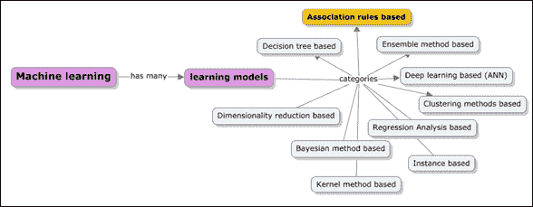

本章深入探讨了以下主题：

+   理解基于关联规则学习模型的基礎和核心原理

+   关联规则的核心应用案例，例如市场篮子问题

+   关键术语，如项集、提升度、支持度、置信度和频繁项集，以及规则生成技术

+   深入探讨基于关联规则的算法，如 Apriori 和 FP-Growth；在大型数据集的背景下比较和对比 Apriori 和 FP-Growth

+   一些高级关联规则概念（如相关规则和序列规则）的概述和目的

+   Apache Mahout、R、Apache Spark、Julia 和 Python（scikit-learn）库和模块的示例实现。

# 基于关联规则的学习

基于关联规则的机器学习处理的是寻找频繁模式、关联和交易，这些可以用于分类和预测需求。基于关联规则的学习过程如下：给定一组交易，找到规则并使用这些规则根据交易中其他项目的发生来预测项目的发生是关联规则学习。以下图表表示了机器学习的范围：

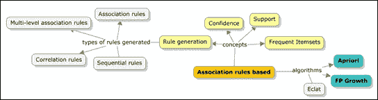

## 关联规则——一个定义

关联规则是对一个模式的表现，描述了在另一个事件发生的情况下，一个事件发生的概率。通常，关联规则的语法遵循*如果...那么*语句，这些语句将来自存储库的两个无关数据集联系起来。简而言之，它有助于找到经常一起使用的对象之间的关系。关联规则的目标是使用大数据集找到所有支持度大于最小支持度的项目集，以预测置信度大于最小置信度的规则。关联规则最常用的例子之一是市场篮子示例。为了详细说明市场篮子示例，如果一个顾客购买了 iPad，那么他或她很可能也会购买 iPad 保护套。

关联规则中使用两个重要标准，**支持度**和**置信度**。每个关联规则都应该同时具有最小置信度和最小支持度。这通常是用户定义的。

现在，让我们看看支持度、置信度和提升度度量是什么。让我们考虑之前解释的相同例子，*如果 X 则 Y*，其中 *X* 是购买 iPad，*Y* 是购买 iPad case。

然后，支持度定义为在所有购买或交易次数中，*X* 和 *Y* 一起购买的总频率。

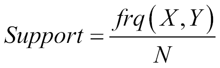

置信度可以定义为 *X* 和 *Y* 一起购买的频率与 *X* 单独购买的频率之比。

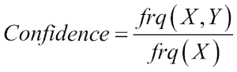

提升度定义为 *X* 的支持度除以 *X* 的支持度乘以 *Y* 的支持度。

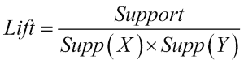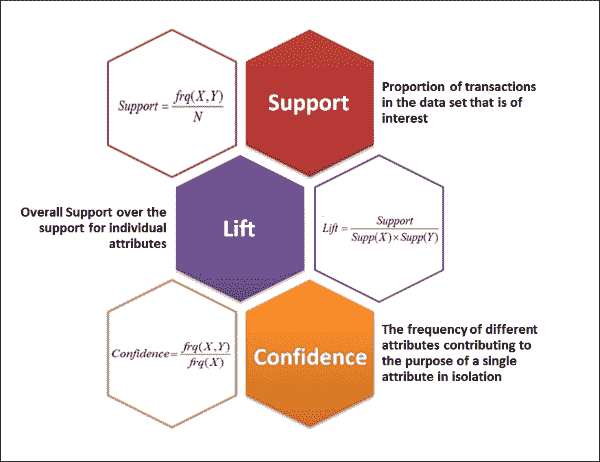

在理解这些度量的重要性之前，让我们以一个例子来看看这个上下文中使用的术语。仓库中物品的集合称为项集，表示为 *I = { i[1], i[2], …. i[n]}*，所有交易的集合，其中每个交易由项集的子集组成，表示为 *T = { t[1], t[2], …. t[n]}*，其中 *t*[x] 是 *I* 的一个具有**唯一交易标识符**（**UTI**）的子集。

现在让我们用一个例子来表示物品、交易和度量。

考虑五个项目和五个交易，如图所示：

*I = {iPad(A), iPad case(B), iPad scratch guard(C), Apple care (D), iPhone (E)}*


*T = {{ iPad, iPad case, iPad scratch guard }, { iPad, iPad scratch guard, Apple care }, { iPad case, iPad scratch guard, Apple care }, { iPad, Apple care, iPhone }, { iPad case, iPad scratch guard, iPhone }}*

下表显示了每个识别出的规则的支持度、置信度和提升度值。

| # | 规则 | 支持度 | 置信度 | 提升度 |
| --- | --- | --- | --- | --- |
| **1** | 如果购买 iPad (*A*)，则也会购买 iPhone (*D*) | 2/5 | 2/3 | 10/9 |
| **2** | 如果购买 iPad scratch guard(*C*)，则也会购买 iPad (*A*) | 2/5 | 2/4 | 5/6 |
| **3** | 如果购买 iPad (*A*)，则也会购买 iPad scratch guard (*C*) | 2/5 | 2/3 | 5/6 |
| **4** | 如果购买 iPad case(*B*) 和 iPad scratch guard (*C*)，则也会购买 apple care (*D*) | 1/5 | 1/3 | 5/9 |

从这些项集中，基于支持和置信度的计算，可以确定频繁项集。关联规则挖掘的目的是找到满足以下标准的规则：

+   支持度 ≥ 最小支持度（minsup）阈值

+   置信度 ≥ 最小置信度（minconf）阈值

频繁项集生成和关联规则挖掘涉及以下步骤：

1.  列出所有可能的关联规则。

1.  计算每个规则的支撑度和置信度。

1.  删除不满足最小支持度(minsup)和最小置信度(minconf)阈值值的规则。

这种方法称为暴力方法，通常被认为是计算上不可行的。

### 小贴士

来自同一项集的规则通常具有相同的支撑度，但置信度不同。最小支持度(minsup)和最小置信度(minconf)是在问题定义陈述中达成一致的价值。例如，最小支持度和置信度可以取百分比值，如 75%和 85%。

为了避免所有昂贵的计算，我们可以将这个过程简化为两个步骤：

+   **频繁项集生成**：这需要生成所有支持度 ≥ minsup 的项集

+   **规则生成**：从识别出的频繁项集中生成置信度最高的规则

当有五个项目时，有 32 个候选项集。以下图显示了五个项目的项集组合：**A**、**B**、**C**、**D**和**E**：

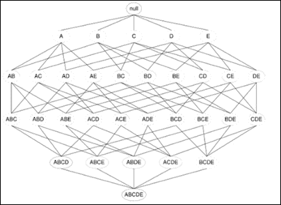

给定项目数量，可能的项集和规则数量在此定义：

给定*d*个唯一项目：

*可能的项集总数 = 2^d*

计算总可能关联规则的标准公式在此定义：

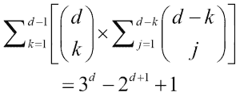

例如，如果*d*等于 6，那么*可能的项集总数 = 2^d* = 64

因此，*可能的关联规则总数 = 602 条规则*

下图显示了项目数量与可能的关联规则之间的关系。

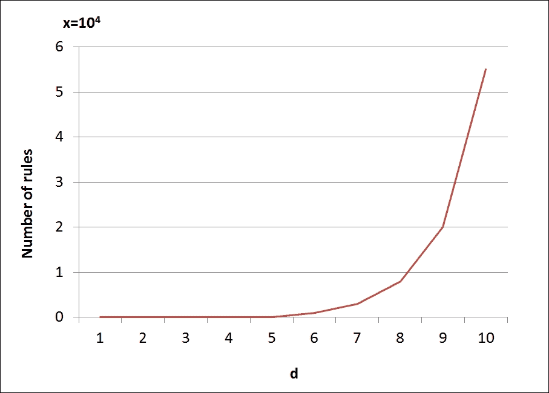

生成频繁项集和关联规则的高效方法决定了关联规则算法的效率。在接下来的章节中，我们将详细介绍 Apriori 和 FP-Growth 算法。

## Apriori 算法

在本节中，我们将通过一个示例逐步介绍 Apriori 算法。Apriori 算法如下所述：

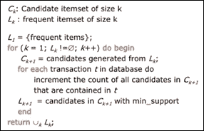

### 小贴士

Apriori 原理——对于所有频繁项集，其子集也必须是频繁的。

考虑前一个示例中的五个项目

*I = {iPad(A), iPad case(B), iPad scratch guard(C), Apple care (D), iPhone (E)}*，以下九个事务。假设最小支持度计数为两个：

| TID | 在机器学习中的目的或意义 |
| --- | --- |
| **1** | iPad(*A*)、iPad case(*B*)和 iPhone(*E*) |
| **2** | iPad case(*B*)和 Apple care(*D*) |
| **3** | iPad case(*B*)和 iPad scratch guard(*C*) |
| **4** | iPad(*A*)、iPad case(*B*)和 Apple care(*D*) |
| **5** | iPad(*A*)和 Apple care(*D*) |
| **6** | iPad case(*B*)和 iPad scratch guard(*C*) |
| **7** | iPad(*A*)和 Apple care(*D*) |
| **8** | iPad(*A*)、iPad case(*B*)、iPad scratch guard(*C*)和 iPhone (*E*) |
| **9** | iPad(*A*), iPad case(*B*), and iPad scratch guard(*C*) |

使用之前的数据集调试之前的算法：

1.  从之前的交易中获取每个项目的出现次数(*C*[1])：

    | Itemset | Support count |
    | --- | --- |
    | *{iPad(A)}* | 6 |
    | *{iPad case(B)}* | 7 |
    | *{iPad scratch guard(C)}* | 6 |
    | *{Apple care(D)}* | 2 |
    | *{iPhone(E)}* | 2 |

    从*C*[1]确定频繁 1 项集(*L*[1])：

    | Itemset | Support count |
    | --- | --- | --- |
    | *{iPad(A)}* | 6 |
    | *{iPad case(B)}* | 7 |
    | *{iPad scratch guard(C)}* | 6 |
    | *{Apple care(D)}* | 2 |
    | *{iPhone(E)}* | 2 |

1.  生成 2 项候选集(*C*[2])并扫描数据集以确定支持计数：

    | Itemset | Support count |
    | --- | --- |
    | *{iPad(A), iPad case(B)}* | 4 |
    | *{iPad(A), iPad scratch guard(C)}* | 4 |
    | *{iPad(A), Apple care(D)}* | 1 |
    | *{iPad(A), iPhone(E)}* | 2 |
    | *{iPad case(B), iPad scratch guard(C)}* | 4 |
    | *{iPad case(B), Apple care(D)}* | 2 |
    | *{iPad case(B), iPhone(E)}* | 2 |
    | *{iPad scratch guard(C), Apple care(D)}* | 0 |
    | *{iPad scratch guard(C), iPhone(E)}* | 1 |
    | *{Apple care(D), iPhone(E)}* | 0 |

1.  从*C*[2]确定频繁 2 项集(*L*[2])：

    | Itemset | Support count |
    | --- | --- |
    | *{iPad(A), iPad case(B)}* | 4 |
    | *{iPad(A), iPad scratch guard(C)}* | 4 |
    | *{iPad(A), Apple care(D)}* | 2 |
    | *{iPad case(B), iPad scratch guard(C)}* | 4 |
    | *{iPad case(B), Apple care(D)}* | 2 |
    | *{iPad case(B), iPhone(E)}* | 2 |

1.  生成 3 项候选集(*C*[3])。

1.  最后，扫描数据集以确定支持计数和频繁 3 项集识别。

这与之前遵循的步骤类似，但我们将演示如何根据 Apriori 原则有效地应用剪枝来识别频繁项集。首先，我们识别可能的子集项集。然后检查是否有任何子集项集不属于频繁项集列表。如果没有找到，我们消除该 3 项集的可能性。

| C3 | Itemset | Possible subset itemsets |
| --- | --- | --- |
| **1**✓ | *{A,B,C}* | *{A,B}*✓ | *{A,C}*✓ | *{B,C}*✓ |
| **2**✓ | *{A,B,D}* | *{A,B}*✓ | *{A,D}*✓ | *{B,D}*✓ |
| **3**✕ | *{A,C,D}* | *{A,C}*✓ | *{A,D}*✓ | *{C,D}*✕ |
| **4**✕ | *{B,C,D}* | *{B,C}*✓ | *{B,D}*✓ | *{C,D}*✕ |
| **5**✕ | *{B,C,E}* | *{B,C}*✓ | *{B,E}*✕ | *{C,E}*✕ |
| **6**✕ | *{B,D,E}* | *{B,D}*✓ | *{B,E}*✕ | *{D,E}*✕ |

在前一个表中，使用 Apriori 技术剪枝了✕项集，并使用了步骤 4(*L*[2])的数据。为了便于理解，项集使用项代码*A*、*B*、*C*、*D*和*E*表示，而不是实际名称。3 项集候选集可以按以下方式识别：

| C[3] | Itemset | Support Count |
| --- | --- | --- |
| **1** | *{iPad(A), iPad case (B), iPad scratch guard(C)}* | 2 |
| **2** | *{iPad(A), iPad case (B), Apple care(C)}* | 2 |

因此，频繁的 3 项集如下：

| L[3] | Itemset | Support Count |
| --- | --- | --- |
| **1** | *{iPad(A), iPad case (B), iPad scratch guard(C)}* | 2 |
| **2** | *{iPad(A), iPad case (B), Apple care(C)}* | 2 |

1.  生成 4-项集候选（*C*[4]）。

1.  最后，扫描数据集以获取支持度计数和频繁 3-项集识别（*L*[4]）。

如我们所见，剪枝在这里停止，因为没有更多的 *C*[3] 选项可用。

Apriori 算法效率不高，因为它需要多次数据集扫描。然而，有一些技术可以提高效率。以下是一些方法：

+   如果一个事务不包含任何频繁项集，则它没有用，不需要参与后续扫描

+   任何在数据集中频繁出现的项集至少应该在数据集的一个分区中频繁出现

+   应用采样，包括整个数据集的一个子集，具有较低的支持度阈值，将提高效率

### 规则生成策略

假设我们有一个频繁项集 *{A, B, C, D}*，可能的候选规则如下：

ABC→D

ABD→C

ACD→B

BCD→A

AB→CD

AC→BD

AD→BC

BC→AD

BD→AC

CD→AB

A→BCD

B→ACD

C→ABD

D→ABC

标准公式是，对于频繁项集中的每个 k 个项，可以定义 *2k-2* 个可能的候选规则。只有具有高置信度的规则可以保留。以下图示了标记低置信度规则并去除它们：

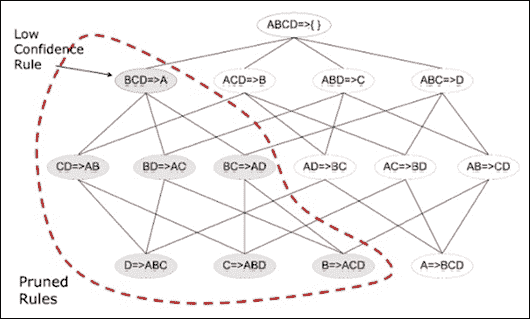

#### 定义适当最小支持度的规则

在定义基于关联规则挖掘的最小支持度阈值时，需要遵循的一些重要指南如下：

+   最小支持度太高：这将导致丢失包含稀有物品的项集

+   最小支持度太低：这将导致计算开销，因为需要更多的扫描

#### Apriori – 不足之处

现在很清楚，在 Apriori 算法中，对于每个 *k* 项集，我们都需要使用 *(k-1)* 个频繁项集，当数据库扫描完成后，使用模式匹配方法。主要瓶颈是两个巨大的候选集和多次数据库扫描。让我们看看一个例子——如果有 10⁴个频繁 1 项集，那么这将导致 10⁷个候选 2 项集。并且对于每个 *n* 项集，需要 *n + 1* 次扫描。

解决这个问题的方法是完全避免候选项集的生成，一种解决方法是将大型数据集或数据库压缩成一个紧凑的**频繁模式树**（**FP-tree**），这将避免昂贵的扫描。

有几种方法可以优化 Apriori 实现，以下是一些重要的方法：

+   **方法 1**—**基于项集计数的近似方法**：为每个 k 项集桶设置一个阈值，如果该项集的计数低于阈值，则该桶将不会处理。这反过来减少了需要考虑处理的项集桶，从而提高了效率。

+   **方法 2**—**事务消除/计数**：如果一个事务不包含目标 k 项集，则该事务不会增加价值或没有意义进行处理。因此，这种方法是识别这些事务并将它们从处理中排除。

+   **方法 3**—**分区**：任何在数据集中可能频繁的项集也必须在数据集的分区中频繁；否则，项集可能会被排除在处理之外。

+   **方法 4**—**采样**：这是一种考虑样本或大数据集子集的更简单方法，并运行挖掘过程。这将减少 k 值，从而减少频繁 k 项集。

+   **方法 5**—**动态项集计数**：这是最有效的方法之一，它只在新项集在其所有子项集中频繁时才包括新项集。

尽管 Apriori 有优化技术；但它由于固有的昂贵扫描而效率低下，这需要解决。这使我们来到了基于关联规则学习的下一个算法，即**FP-growth**算法。

## FP-growth 算法

FP-growth 算法是一种高效且可扩展的挖掘频繁模式、从而关联规则挖掘的替代方法。它解决了 Apriori 算法可能遇到的大部分性能瓶颈。它允许在不实际生成候选项集的情况下生成频繁项集。此算法主要有两个步骤：

+   从数据库中构建紧凑的数据结构称为 FP 树

+   直接从 FP 树中提取频繁项集

让我们考虑与 Apriori 算法中使用的相同示例。总共有五个项目（来自上一节中的示例）：

*I 是{iPad(A), iPad 保护壳(B), iPad 防刮保护膜(C), Apple Care (D), iPhone (E)}*，以及以下九个事务。假设最小支持计数为二：

| TID | 事务项集 |
| --- | --- |
| **1** | *iPad(A), iPad 保护壳(B), 和 iPhone(E)* |
| **2** | *iPad 保护壳(B), Apple Care(D)* |
| **3** | *iPad 保护壳(B), iPad 防刮保护膜(C)* |
| **4** | *iPad(A), iPad 保护壳(B), 和 Apple Care(D)* |
| **5** | *iPad(A), Apple Care(D)* |
| **6** | *iPad 保护壳(B), iPad 防刮保护膜(C)* |
| **7** | *iPad(A), Apple Care(D)* |
| **8** | *iPad(A), iPad 保护壳(B), iPad 防刮保护膜(C), 和 iPhone (E)* |
| **9** | *iPad(A), iPad 保护壳(B), 和 iPad 防刮保护膜(C)* |

我们现在将查看为该数据库构建 FP 树：

1.  识别/计算最小支持计数。由于需要 30%，最小支持计数计算如下：

    最小支持计数 = 30/100 * 9 = 2.7 ~ 3

1.  计算单项集的出现频率。此外，根据支持计数，添加优先级：

    | 项集 | 支持计数 | 优先级 |
    | --- | --- | --- |
    | *{iPad(A)}* | 6 | 2 |
    | *{iPad 保护壳(B)}* | 7 | 1 |
    | *{iPad 防刮保护膜(C)}* | 6 | 3 |
    | *{Apple care(D)}* | 2 | 4 |
    | *{iPhone(E)}* | 2 | 5 |

1.  根据优先级对每笔交易的物品进行排序：

    | TID | 交易项集 | 根据优先级重新排序的项集 |
    | --- | --- | --- |
    | **1** | iPad(*A*)，iPad 保护壳(*B*), 以及 iPhone(*E*) | iPad 保护壳(*B*), iPad(*A*), 以及 iPhone(*E*) |
    | **2** | iPad 保护壳(*B*), Apple care(*D*) | iPad 保护壳(*B*), Apple care(*D*) |
    | **3** | iPad 保护壳(*B*)，iPad 防刮保护膜(*C*) | iPad 保护壳(*B*)，iPad 防刮保护膜(*C*) |
    | **4** | iPad(*A*)，iPad 保护壳(*B*)，以及 Apple care(*D*) | iPad 保护壳(*B*)，iPad(*A*)，以及 Apple care(*D*) |
    | **5** | iPad(*A*)，Apple care(*D*) | iPad(*A*)，Apple care(*D*) |
    | **6** | iPad 保护壳(*B*), iPad 防刮保护膜(*C*) | iPad 保护壳(*B*), iPad 防刮保护膜(*C*) |
    | **7** | iPad(*A*)，Apple care(*D*) | iPad(*A*)，Apple care(*D*) |
    | **8** | iPad(*A*)，iPad 保护壳(*B*)，iPad 防刮保护膜(*C*)，以及 iPhone (*E*) | iPad 保护壳(*B*), iPad(*A*), iPad 防刮保护膜(*C*), 以及 iPhone (*E*) |
    | **9** | iPad(*A*)，iPad 保护壳(*B*)，以及 iPad 防刮保护膜(*C*) | iPad 保护壳(*B*), iPad(*A*), 以及 iPad 防刮保护膜(*C*) |

1.  为**TID** = **1**的交易创建 FP 树，并按顺序排列的项集是 iPad 保护壳(*B*)，iPad(*A*)，以及 iPhone(*E*)。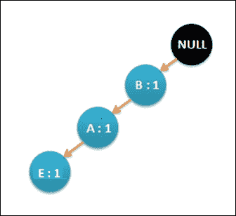

1.  现在，扫描数据库以查找**TID** = **2**，iPad 保护壳 (*B*) 和 Apple care(*D*)。更新后的 FP 树将如下所示：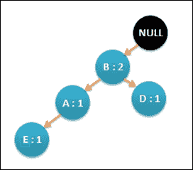

1.  按照 L 的顺序扫描所有交易并相应地更新 FP 树。最终的 FP 树将如下所示。请注意，每次在交易中遇到重复的项目时，节点上的计数值都会增加。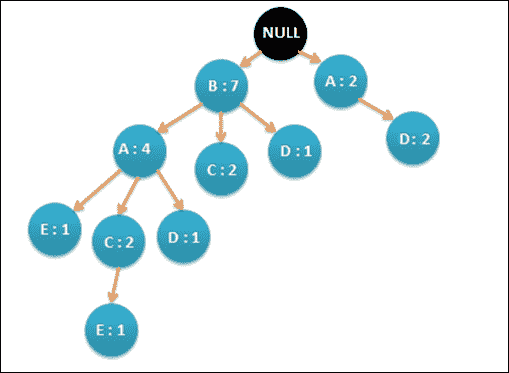

1.  为每笔交易生成一个条件 FP 树并定义条件模式基。

1.  最后，生成频繁模式。给定数据集的结果如下所示：

    ```py
    E: {B, E: 2}, {A, E: 2}, {B, A, E: 2}
    D: {B, D: 2}
    C: {B, C: 4}, {A, C: 4}, {B, A, C: 2}
    A: {B, A: 4}
    ```

## Apriori 与 FP-growth 对比

下面的图显示了不同 minsup 阈值值算法之间的关系：

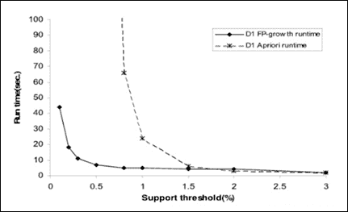

图片来源：Pier Luca Lanzi 教授的文章

FP-growth 算法的优点在此详细说明：

+   完整地保留了频繁模式挖掘的信息，而不会在长交易中打断模式。

+   通过消除不相关信息（在事先避免不频繁项集）来压缩数据。

+   FP-growth 算法以分而治之的模式工作，将数据集根据迄今为止发现的频繁项集模式进行分解。这减少了搜索到数据集的子集，而不是完整的数据库。

+   在这种情况下不会生成候选项集，因此不需要进行测试。

# 实现 Apriori 和 FP-growth

请参考本章提供的源代码以实现 Apriori 分类器（源代码路径在各个技术文件夹下的`.../chapter7/...`中）。

## 使用 Mahout

请参考代码文件文件夹 `.../mahout/chapter7/aprioriexample/`。

请参考代码文件文件夹 `.../mahout/chapter7/fpgrowthexample/`。

## 使用 R

请参考代码文件文件夹 `.../r/chapter7/aprioriexample/`。

请参考代码文件文件夹 `.../r/chapter7/fpgrowthexample/`。

## 使用 Spark

请参考代码文件文件夹 `.../spark/chapter7/aprioriexample/`。

请参考代码文件文件夹 `.../spark/chapter7/fpgrowthexample/`。

## 使用 Python (Scikit-learn)

请参考代码文件文件夹 `.../python-scikit-learn/ chapter7/aprioriexample/`。

请参考代码文件文件夹 `.../python-scikit-learn/chapter7/fpgrowthexample/`。

## 使用 Julia

请参考代码文件文件夹 `.../julia/chapter7/aprioriexample/`。

请参考代码文件文件夹 `.../julia/chapter7/fpgrowthexample/`。

# 摘要

在本章中，你学习了基于关联规则的学习方法以及 Apriori 和 FP-growth 算法。通过一个共同示例，你学习了如何使用 Apriori 和 FP-growth 算法进行频繁模式挖掘，并通过逐步调试算法来学习。我们还比较和对比了算法及其性能。我们提供了使用 Mahout、R、Python、Julia 和 Spark 的 Apriori 示例实现。在下一章中，我们将介绍贝叶斯方法，特别是朴素贝叶斯算法。
