# 第十三章。集成学习

本章是所有从第五章*基于决策树的学习*中学到的学习方法的总结章节。将本章作为学习方法的结尾章节是恰当的，因为这种学习方法解释了如何有效地将这些方法结合起来以最大化学习者的成果。集成方法在监督和无监督解决方案中具有有效、强大的技术，以实现高精度。不同的模型在选定的业务案例中效率高且表现良好。找到一种将竞争模型组合成委员会的方法很重要，在这方面已经进行了大量研究，并取得了相当程度的成功。此外，由于不同的观点产生了大量数据，关键是要巩固不同的概念以进行智能决策。推荐系统和基于流的文本挖掘应用广泛使用集成方法。

在监督学习和无监督学习小组中已经进行了许多独立研究。观察到的共同主题是，当许多混合模型结合在一起时，它们增强了弱模型，并带来了整体更好的性能。本章的一个重要目标是对不同的集成技术进行了系统比较，这些技术结合了监督和无监督技术，并介绍了一种合并结果的方法。

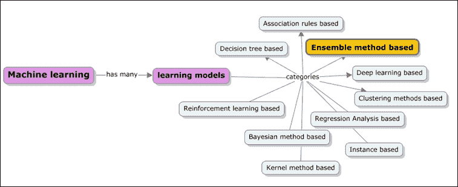

本章涵盖了以下主题：

+   集成方法学习的概述——群体智慧的概念和关键属性。

+   核心集成方法分类、现实世界示例和集成学习应用

+   集成方法类别和多种代表性方法：

    +   **监督集成方法**概述和详细介绍了诸如袋装、提升、梯度提升方法和随机决策树和随机森林等概念。

    +   **无监督集成方法**概述了包括聚类集成在内的生成、直接和间接方法。

+   使用 Apache Mahout、R、Julia、Python（scikit-learn）和 Apache Spark 进行动手实现练习

# 集成学习方法

集成，一般而言，意味着一组通常被视为整体而不是单个价值的事物。集成遵循分而治之的方法，用于提高性能。

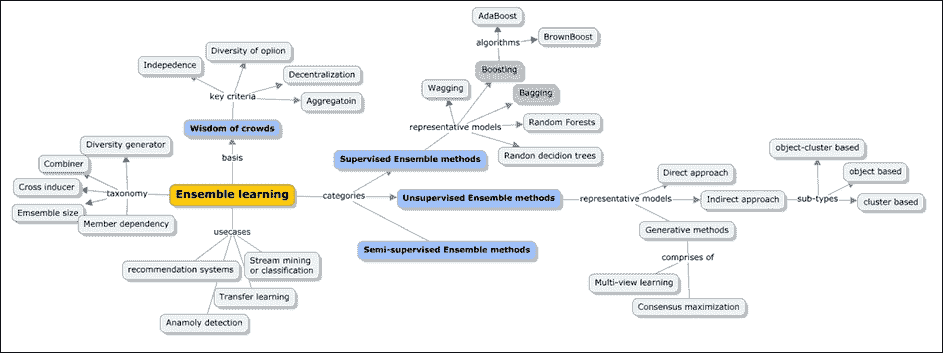

我们将从介绍著名的群体智慧概念开始，来理解具体的算法。

## 群体智慧

当以正确的方式汇总时，不完美的判断会导致集体智慧，从而产生更优越的结果。群体智慧就是关于这种集体智慧。

通常，群体一词通常与不合理性和普遍观念有关，即存在某种影响，在暴民和教派的情况下影响群体的行为。然而，事实并非总是如此负面，并且在与智力汇总合作时效果很好。群体智慧的关键概念是，一群人做出的决策总是比个人做出的决策更稳健和准确。机器学习的集成学习方法有效地利用了这个想法，以产生效率和准确的结果。

“群体智慧”这个术语是由高尔顿在 1906 年提出的。他参加了一个农民集市，那里有一个比赛，猜测被宰杀和加工的牛的重量。最接近猜测的获胜者从 800 名参赛者中赢得了奖品。他选择收集所有响应并进行分析。当他计算猜测的平均值时，他惊讶地发现它们非常接近实际值。这个集体猜测不仅比获奖者更准确，而且与牲畜专家的猜测相比也证明是最好的。思想的民主是明显的赢家。对于这样一个有用的输出，重要的是每个参赛者都有他/她的强有力信息来源。参赛者提供的独立猜测不应受他/她邻居猜测的影响，而且，还有一个无错误的机制来整合整个群体的猜测。所以简而言之，这不是一个容易的过程。另一个重要的方面是，这些猜测比任何个别专家的猜测都要优越。

一些基本的日常例子包括：

+   Google 搜索结果通常将最受欢迎的页面列在顶部

+   在像“谁想成为亿万富翁”这样的游戏中，观众投票用于回答参赛者不知道的问题。通常，大多数投票的答案是正确的。

群体智慧方法的结果并不保证。以下是使用此方法获得最佳结果的基本标准：

+   **聚合**：需要有一种万无一失的方法将个别响应整合成集体响应或判断。没有这个，集体观点或响应的核心目的就会落空。

+   **独立性**：在人群中，需要对控制来自一个实体对其他人的响应进行纪律约束。任何影响都会扭曲响应，从而影响准确性。

+   **去中心化**：个别响应有其来源，并依赖于有限的知识。

+   **意见多样性**：重要的是每个人都有一个独立的响应；响应的异常性仍然是可接受的。

术语“ensemble”意味着分组。要构建集成分类器，我们首先需要从训练数据中构建一组分类器，汇总这些分类器做出的预测，并使用这些数据预测新记录的类别标签。

下面的图解展示了这个过程：

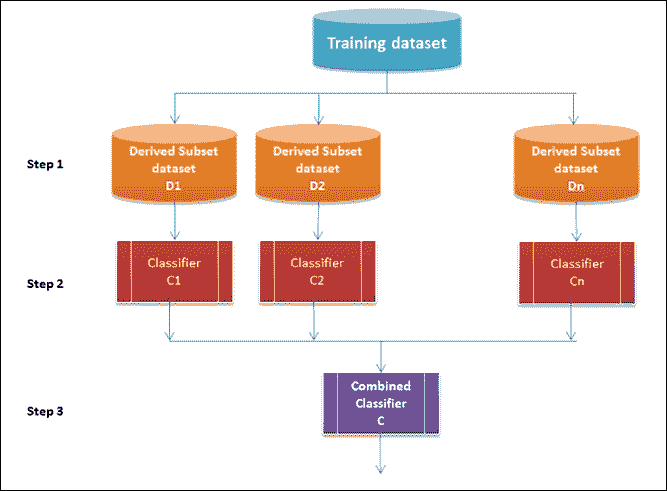

技术上，核心构建块包括训练集、诱导器和集成生成器。诱导器负责为每个样本训练数据集定义分类器。集成生成器创建分类器以及一个组合器或聚合器，该组合器或聚合器整合组合器之间的响应。有了这些构建块及其之间的关系，我们将使用以下属性来分类集成方法。下一节将介绍这些方法：

+   **组合器的使用**：这个属性定义了集成生成器和组合器之间的关系

+   **分类器之间的依赖性**：这个属性定义了分类器相互依赖的程度

+   **生成多样性**：这个属性定义了确保组合器之间多样性的程序

+   **集成的大小**：这个属性表示集成中使用的分类器数量

+   **交叉诱导器**：这个属性定义了分类器如何利用诱导器。有些情况下，分类器被构建成与特定的诱导器集一起工作

总结来说，构建模型集成首先涉及构建专家并让他们提供响应/投票。预期的收益是预测性能的提高，并产生一个单一的全球结构。尽管如此，产生的任何中间结果可能最终难以分析。

让我们全面地看看聚合/组合分类器的性能如何表现得更好。

让我们考虑三个错误率为 0.35（ε）或准确率为 0.65 的分类器。对于每个分类器，分类器预测错误的概率是 35%。

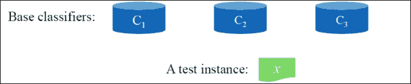

这里给出的是真值表，表示错误率为 0.35（35%）和准确率为 0.65（65%）：

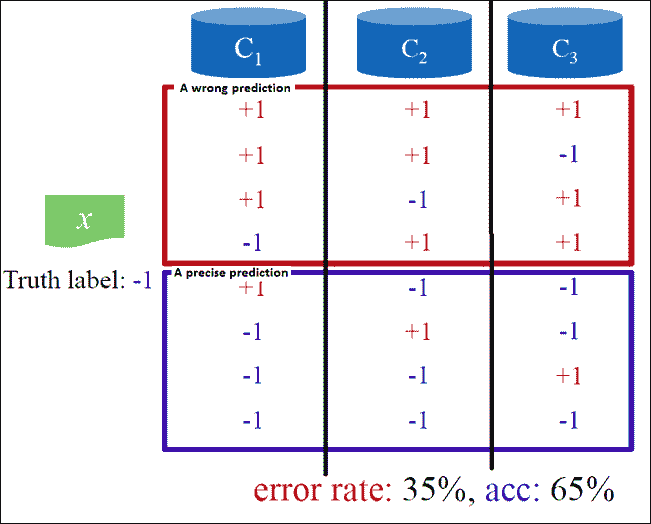

在三个分类器组合后，通过在组合器之间使用多数投票过程来预测测试实例的类别标签，计算集成分类器犯错的概率。这在下述公式中给出。

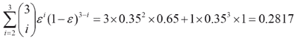

此外，准确率为 71.83%。很明显，当在分类器之间汇总时，错误率会降低。现在，如果我们扩展到 25 个分类器，根据错误率（6%）的计算，准确率会上升到 94%。

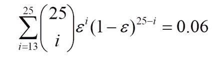

因此，集成工作得很好，因为它们提供了更大的视角。

在前一个章节中，我们已经讨论了群体智慧工作的标准。现在，让我们看看我们之前提到的 25 个基分类器的情况，看看集成分类器的准确率如何随着基分类器不同错误率的变化而变化。

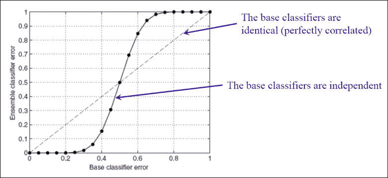

### 小贴士

当基分类器的错误率超过 0.5 时，集成分类器的性能会下降，并且比基分类器表现差得多。

在下一节中，我们将介绍一些应用集成方法的现实世界用例。

## 关键用例

本节详细讨论了集成学习方法在现实世界中的关键应用。

### 推荐系统

推荐系统的目的是向可能感兴趣的用户社区产生有意义的推荐。一些例子包括与决策过程相关的建议，例如在亚马逊上阅读哪些书籍，在 Netflix 上观看哪些电影，或在新闻网站上阅读哪些新闻。业务领域，或业务属性的设计的上下文和特征是推荐系统设计的主要输入。用户为每部电影提供的评分（在 1-5 的范围内）是一个重要的输入，因为它记录了用户与系统的互动程度。此外，用户的详细信息（如人口统计和其他个人或配置文件属性）也被推荐系统用于识别项目与潜在用户之间的潜在匹配。

以下截图是 Netflix 上推荐系统结果的示例：

### 异常检测

异常检测或离群值检测是集成学习方法最流行的用例或应用之一。这全部关于在数据中寻找异常或不寻常的模式。识别异常很重要，因为它可能导致采取任何决定性行动。一些著名的例子包括（许多其他例子中）：

+   信用卡欺诈检测

+   医疗保健中的罕见疾病检测

+   飞机发动机中的异常检测

让我们现在扩展关于飞机发动机异常检测的例子。以下是一些用于验证飞机发动机是否异常的特征：

+   产生的热量(*x*[1])

+   振动的强度 (*x*[2])

+   在数据集 = *x*[(1)]*，x*[(2)] *… x*[(m)] 标记的情况下，以下是对异常和非异常案例的描述：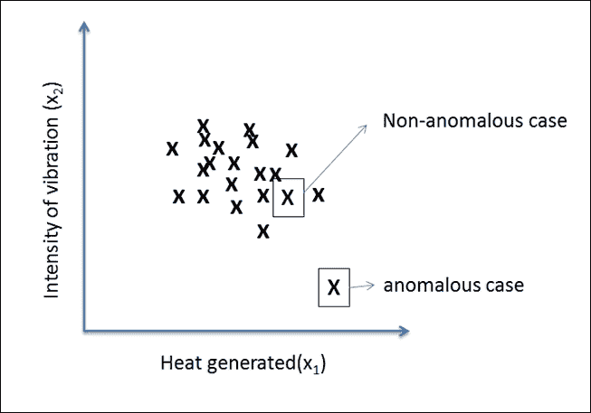

### 迁移学习

传统上，所有机器学习算法都假设每个新的学习问题都需要从头开始学习。这个假设是没有任何先前的学习会被利用。在学习问题的领域相关的情况下，将有一些从过去可以获取并使用的经验。一些常见的例子包括：

+   法语的知识可以帮助学生学习西班牙语

+   数学知识可以帮助学生学习物理

+   驾驶汽车的知识可以帮助驾驶员学习驾驶卡车

在机器学习领域，这指的是从相关领域的新任务中识别和应用先前任务积累的知识。这里的关键是识别领域之间的共性。强化学习和分类与回归问题应用迁移学习。迁移学习的过程流程如图所示：

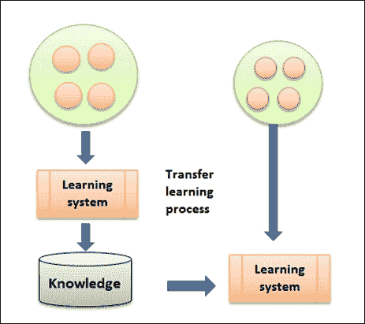

### 流式挖掘或分类

随着技术进步和社交媒体的兴起，流式数据挖掘已成为众多应用的关键需求。

与传统学习的主要区别在于，随着流数据的到来，训练和测试数据集以分布式方式演变。预测的目标现在变得稍微复杂一些，因为随着时间戳的变化，概率也在不断变化，这使得应用集成学习方法成为理想的环境。下一个图表显示了 *P(y)* 如何随时间戳和 *P(x)* 以及 *P (y|x)* 的变化而变化：

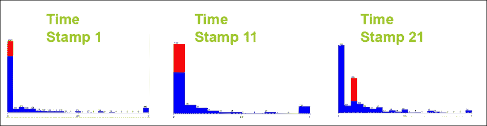

使用集成学习方法，单个模型产生的方差减少，随着分布的演变，预测或结果更加准确或鲁棒。

## 集成方法

如前几节所述，集成方法现在已被证明是提高监督学习、半监督学习和无监督学习解决方案的准确性和鲁棒性的强大方法。此外，我们也看到了随着不同来源开始持续产生大量数据，决策动态正变得越来越复杂。有效的整合现在是成功和智能决策的关键。

监督学习和无监督集成方法遵循相同的原理，涉及结合多样化的基础模型以增强弱模型。在接下来的章节中，我们将独立且详细地探讨监督、半监督和无监督技术。

下面的模型描述了各种学习类别以及涵盖结合学习和共识方法的各种算法：

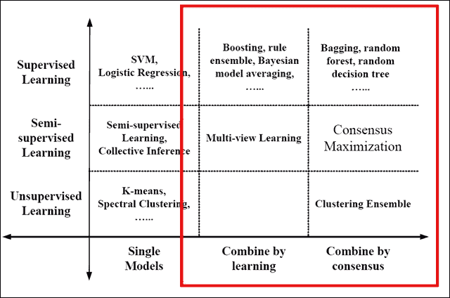

来源：关于集成方法的力量：监督学习和无监督方法达成一致([`it.engineering.illinois.edu/ews/`](http://it.engineering.illinois.edu/ews/))

在我们深入探讨每种集成技术之前，让我们了解通过学习结合与通过共识结合之间的区别：

|    | 优点 | 缺点 |
| --- | --- | --- |
| **通过学习结合** |

+   使用标记数据作为反馈机制

+   有潜力提高准确性

|

+   仅适用于标记数据

+   存在过拟合的风险

|

| **通过共识结合** |
| --- |

+   不需要标记数据

+   具有提高性能的潜力

|

+   标签数据的宝贵反馈信息缺失

+   基于共识是好事的假设

|

### 监督集成方法

在监督学习方法的情况下，输入始终是标记数据。*通过学习组合*的方法包括 Boosting 堆叠泛化和规则集成技术。*通过共识组合*的方法包括 Bagging、随机森林和随机决策树技术。以下展示了通过学习组合的过程流程，随后是另一个通过共识组合的模型：

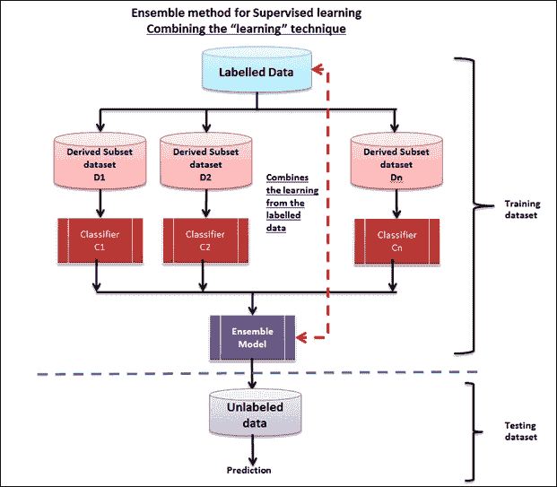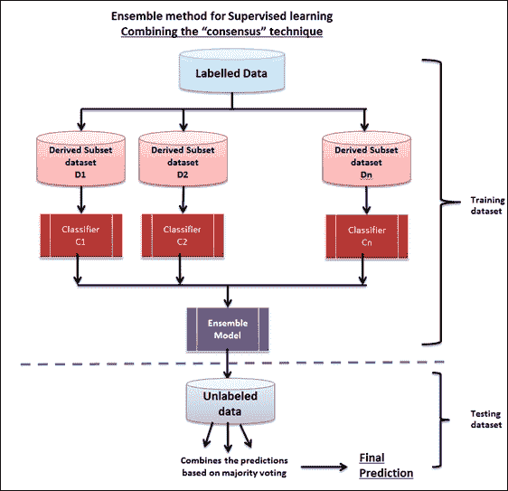

监督集成方法的问题陈述如下：

+   输入数据集是 *D={x*[1]*, x*[2]*, …, x*[n]*}*，相应的标签是 *L={l*[1]*,l*[2]*,…,l*[n]*}*

+   集成方法现在生成了一组分类器 *C = {f*[1]*,f*[2]*,…,f*[k]*}*

+   最后，分类器的组合 *f** 通过以下公式最小化泛化误差：*f*(x)= ω*[1]*f*[1]*(x)+ ω*[2]*f*[2]*(x)+ ….+ ω*[k]*f*[k]*(x)*

#### Boosting

Boosting 是一种相当直接的方法，通过应用多个模型生成的所有输出的加权平均来计算输出。它是一个弱学习者的框架。通过使用强大的加权公式，可以调整应用的权重，从而得出一个强大的预测模型，该模型解决了这些方法的缺陷，并且适用于更广泛的输入数据，使用不同的狭窄调整模型。

Boosting 在解决二元分类问题方面取得了成功。这项技术是由 Freund 和 Scaphire 在 20 世纪 90 年代通过著名的 AdaBoost 算法引入的。以下是该框架的一些关键特性：

+   它结合了多个基分类器，与基分类器相比，表现出改进的性能

+   弱学习器是按顺序训练的

+   训练每个基分类器所使用的数据基于先前分类器的性能

+   每个分类器投票并贡献于结果

+   该框架工作并使用在线算法策略

+   对于每一次迭代，权重都会重新计算或重新分配，其中错误的分类器将开始减少其权重

+   正确的分类器获得更多的权重，而错误的分类器则减少权重

+   Boosting 方法，虽然最初是为解决分类问题而设计的，但也被扩展到处理回归问题

Boosting 算法如下所述：

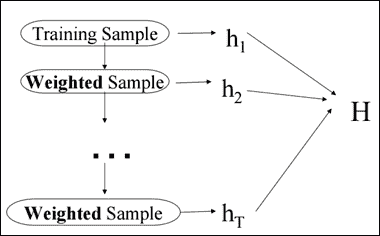

1.  训练一组弱假设：*h*[1]*, …, h*[T]*.*

1.  将假设 *H* 作为 *T* 个较弱假设的加权多数投票组合。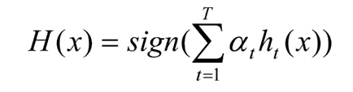

1.  每次迭代都专注于错误分类，并重新计算权重 *D*[t]*(i)*。

##### AdaBoost

AdaBoost 是一个线性分类器，它将更弱的功能*h*[t]*(x)*作为线性组合构建了一个更强的分类器*H(x)*。

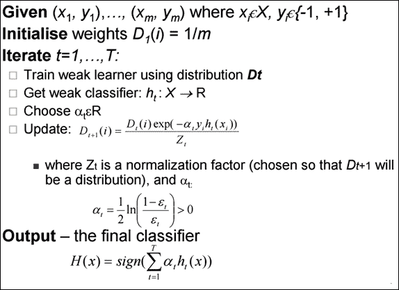

下面的图示展示了提升框架是如何工作的：

1.  所有数据点都被标记为两个类别*+1*和*-1*，权重相等—*1*。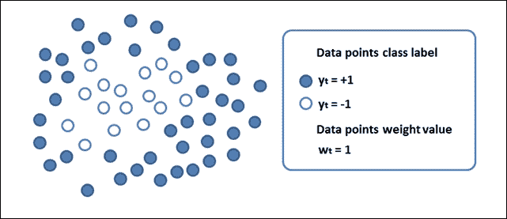

1.  应用一个*p (错误)*并按以下方式对数据点进行分类：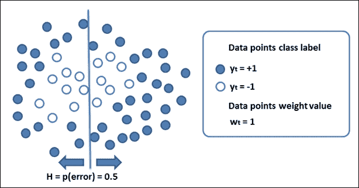

1.  重新计算权重。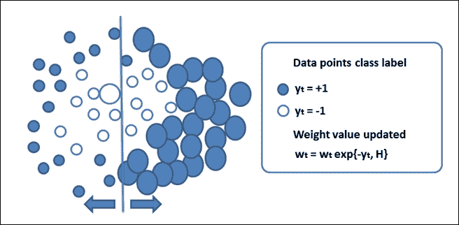

1.  让弱分类器再次参与一个新的问题集。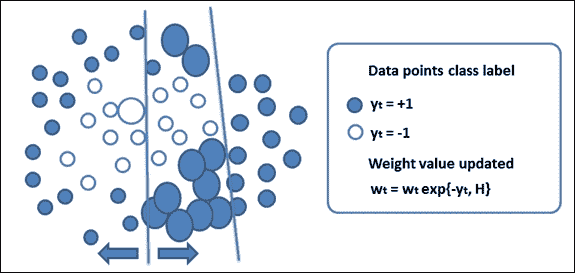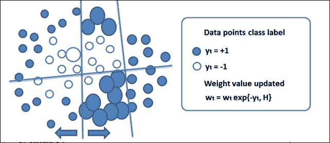

1.  通过迭代地使用弱分类器构建了一个强大的非线性分类器。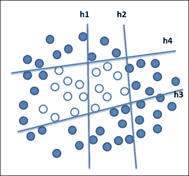

#### Bagging

Bagging 也称为**自助聚合**。这种集成学习方法结合了*共识*方法。该技术中有三个重要步骤：

1.  构建包含大约 63.2%原始记录的自助样本。

1.  使用每个自助样本对训练数据进行分类。

1.  使用多数投票并识别集成分类器的类别标签。

通过生成基于原始数据集的额外数据生成，结合相同大小的数据集的重复组合，这个过程减少了预测方差。随着方差的减少，模型的准确性增加，而不是通过增加数据集的大小。以下为 Bagging 算法：

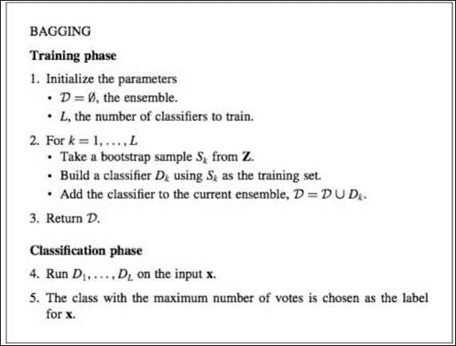

根据前面的算法步骤，这里展示了 Bagging 算法的流程和过程示例：

1.  **训练步骤**：对于每个迭代*t, t=1,…T*，从训练集中创建*N*个样本（这个过程称为自助抽样），选择一个基模型（例如，决策树、神经网络等），并使用这些样本进行训练。

1.  **测试步骤**：对于每个测试周期，通过结合所有*T*个训练模型的结果进行预测。在分类问题中，应用多数投票方法，而在回归中，则应用平均方法。

一些错误计算如下：

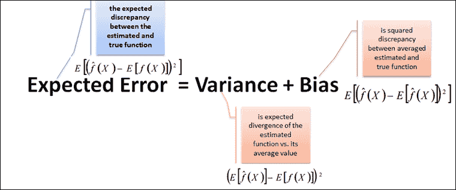

在以下条件下，Bagging 在过拟合和欠拟合情况下都有效：

+   **对于欠拟合**：高偏差和低方差情况

+   **对于过拟合**：小偏差和大方差情况

下面是 Bagging 的一个例子：

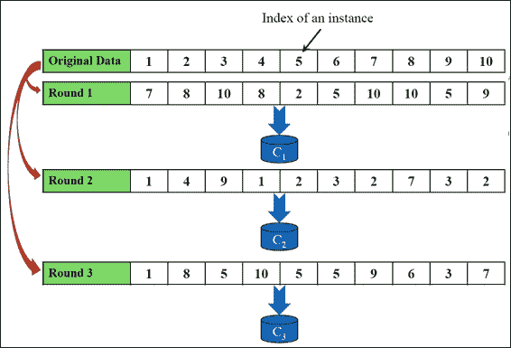

#### Wagging

**Wagging**是 Bagging 的另一种变体。使用整个数据集来训练每个模型。此外，权重是随机分配的。所以简而言之，Wagging 是带有基于泊松或指数分布的额外权重的 Bagging。以下为 Wagging 算法：

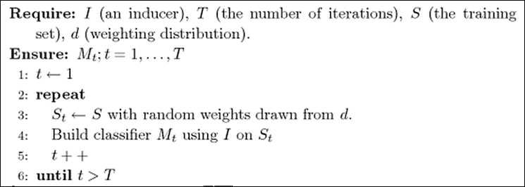

##### 随机森林

随机森林是另一种集成学习方法，它结合了多个决策树。以下图表表示了随机森林集成：

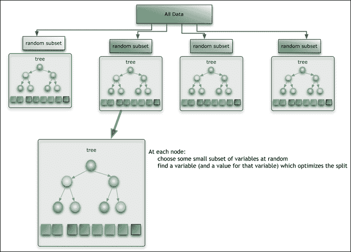

来源：[`citizennet.com/blog/2012/11/10/random-forests-ensembles-and-performance-metrics/`](https://citizennet.com/blog/2012/11/10/random-forests-ensembles-and-performance-metrics/)

对于具有 T 个树的随机森林，决策树分类器的训练如下：

+   与标准的 Bagging 技术类似，定义了一个随机替换的 *N* 个案例样本，以创建大约 62-66%的全面数据集的子集。

+   对于每个节点，执行以下操作：

    +   以一种方式选择 *m* 个预测变量，使得识别的变量给出最佳的分割（二分分割）

    +   在下一个节点，选择其他 *m* 个变量，它们执行相同的操作

+   *m* 的值可以变化

    +   对于随机分割选择—*m=1*

    +   对于 Breiman 的袋装器：*m=预测变量总数*

    +   对于随机森林，*m* 小于预测变量的数量，它可以取三个值：*½√m*，*√m* 和 *2√m*

现在，对于随机森林预测的每个新输入，新值会通过所有树运行，并使用平均值、加权平均值或投票多数来获取预测值。

### 小贴士

在第五章中，我们详细介绍了基于决策树的学习。

##### 梯度提升机（GBM）

GBM 是高度采用的机器学习算法之一。它们用于解决分类和回归问题。GBM 的基础是决策树，它们应用提升技术，其中多个弱算法通过算法组合产生强学习器。它们是随机和梯度提升的，这意味着它们迭代地解决残差。

它们因其可以使用各种损失函数而闻名，可以高度定制。我们已经看到，随机森林集成技术使用简单的平均方法与 GBM 相比，GBM 使用的是实用的集成形成策略。在这个策略中，新模型迭代地添加到集成中，其中每个迭代都训练弱模型以识别下一步。

GBM 灵活且比其他集成学习方法相对更高效。以下表格详细说明了 GBM 算法：

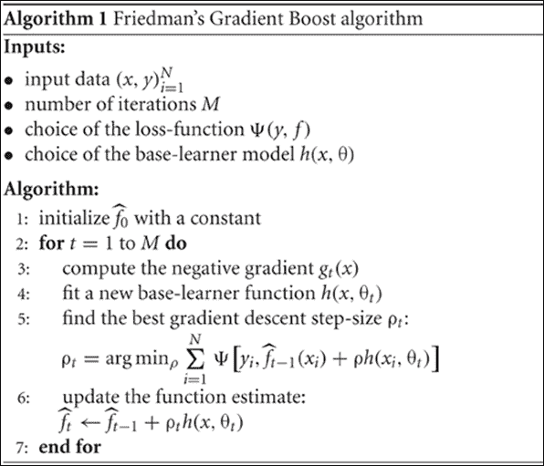

**梯度提升回归树**（**GBRT**）与遵循回归技术的 GBM 类似。

### 无监督集成方法

作为无监督集成学习方法的一部分，基于共识的集成之一是聚类集成。以下图表描述了基于聚类的集成的工作原理：

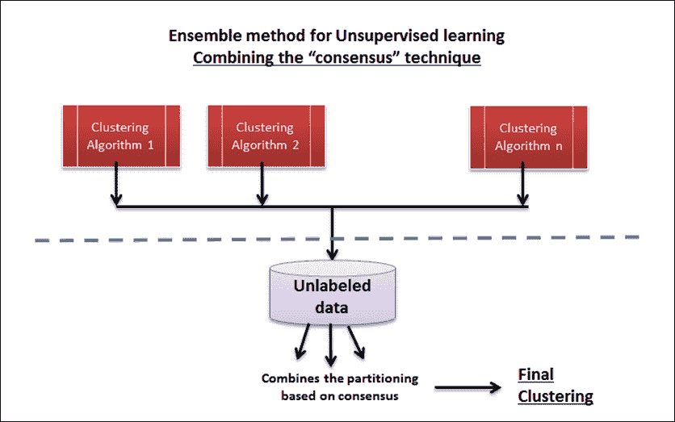

对于给定的未标记数据集 *D={x*[1]*,x*[2]*,…,x*[n]*}*)，聚类集成计算一组聚类 *C = { C*[1]*,C*[2]*,…,C*[k]*}*)，每个聚类将数据映射到一个聚类。形成一个基于共识的统一聚类。以下图表描述了此流程：

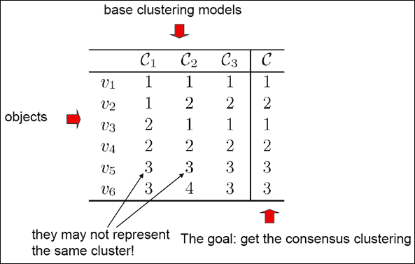

# 实现集成方法

请参考本章节提供的源代码以实现集成学习方法（仅限于监督学习技术）。(源代码路径 `.../chapter13/...` 位于每个技术文件夹下)。

## 使用 Mahout

请参考文件夹 `.../mahout/chapter13/ensembleexample/`。

## 使用 R

请参考文件夹 `.../r/chapter13/ensembleexample/`。

## 使用 Spark

请参考文件夹 `.../spark/chapter13/ensembleexample/`。

## 使用 Python (Scikit-learn)

请参考文件夹 `.../python (scikit-learn)/chapter13/ensembleexample/`。

## 使用 Julia

请参考文件夹 `.../julia/chapter13/ensembleexample/`。

# 摘要

在本章中，我们介绍了机器学习的集成学习方法。我们讨论了“群体智慧”的概念，以及如何在机器学习的背景下应用它，以及如何提高学习者的准确性和性能。具体来说，我们通过一些实际案例研究了某些监督集成学习技术。最后，本章提供了使用 R、Python (scikit-learn)、Julia 和 Spark 机器学习工具以及使用 Mahout 库的推荐引擎的梯度提升算法的源代码示例。

本章涵盖了所有机器学习方法，在接下来的最后一章中，我们将介绍一些机器学习的先进和新兴架构和技术策略。
