# 第十四章：新一代机器学习数据架构

这是我们的最后一章，我们将从我们通常的学习主题中偏离，来涵盖一些机器学习的解决方案方面。这是尝试完成实践者对机器学习解决方案实施方面的看法，涵盖更多关于不同业务案例平台选择的内容。让我们超越 Hadoop、NoSQL 和其他相关解决方案。新范式肯定是一个统一的平台架构，它关注机器学习的所有方面，从数据收集和准备到可视化，重点关注所有关键架构驱动因素，如数据量、来源、吞吐量、延迟、可扩展性、数据质量、可靠性、安全性、自助服务和成本。

以下流程图展示了本章将涵盖的不同数据架构范例：

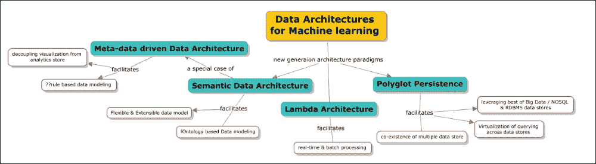

本章深入探讨了以下主题：

+   传统数据架构是如何实施以及为什么在大数据和分析的当前背景下被认为是可取的简要历史。

+   在机器学习背景下，包括**提取、转换和加载**（**ETL**）、存储、处理和报告、分发以及洞察展示的新时代数据架构要求概述。

+   Lambda 架构的介绍，这些架构统一了批处理和实时处理策略，并附带一些示例。

+   Polyglot Persistence 和 Polymorphic 数据库的介绍，这些数据库统一了包括结构化、非结构化和半结构化数据存储的数据存储策略，并集中了跨数据存储的查询方法。以下是如何 Greenplum 数据库支持这些策略以及它如何与 Hadoop 无缝集成的示例。

+   语义数据架构包括本体论演变、目的、用例和技术。

# 数据架构演变

我们将从了解数据架构传统上是如何遵循的，然后详细说明在大数据背景下现代机器学习或分析平台的需求。

观察一——数据存储始终有目的

传统上，数据架构有明确的目的分隔，**OLTP**（**在线事务处理**），通常用于交易需求，以及**OLAP**（**在线分析处理**）数据存储，通常用于报告和分析需求。以下表格详细说明了一般差异：

|   | OLTP 数据库 | OLAP 数据库 |
| --- | --- | --- |
| **定义** | 这涉及许多小的在线事务（INSERT、UPDATE 和 DELETE）。快速查询处理是核心要求；通过每秒事务数来衡量数据完整性、并发性和有效性。它通常以高度规范化为特征。 | 这涉及相对较小的事务量。复杂查询涉及数据的切片和切块。存储的数据通常是聚合的、历史性的，并且主要存储在多维模式中（通常是星型模式）。 |
| **数据类型** | 运营数据 | 集成/整合/聚合数据 |
| **来源** | OLTP 数据库通常是数据的实际来源 | OLAP 数据库从各种 OLTP 数据库中整合数据 |
| **主要用途** | 这涉及日常业务流程/任务的执行 | 这用于决策支持 |
| **CUD** | 这是由用户发起的简短、快速的插入和更新 | 定期运行的长作业正在刷新数据 |
| **查询** | 这通常在较小的数据量上工作，并执行简单的查询 | 这通常包括涉及聚合和多维结构切片和切块的复杂查询 |
| **吞吐量** | 由于数据量相对较小且查询运行速度快，这通常非常快 | 这通常以批量方式运行，在更高数据量下可能需要几个小时 |
| **存储容量** | 由于历史数据归档，相对较小 | 由于涉及的数据量较大，这需要更大的存储空间 |
| **模式设计** | 高度规范化，有许多表 | 这通常是去规范化，表较少，并使用星型和/或雪花模式 |
| **备份和恢复** | 这需要虔诚地进行适当的备份；运营数据对业务运营至关重要。数据丢失可能导致重大经济损失和法律责任 | 相比于常规备份，某些环境可能考虑仅重新加载 OLTP 数据作为恢复方法 |

观察二——数据架构是共享磁盘

共享磁盘数据架构指的是一种架构，其中有一个数据磁盘存储所有数据，集群中的每个节点都可以访问这些数据进行处理。所有数据操作都可以由任意节点在特定时间点执行，如果两个节点同时尝试持久化/写入一个元组，为了确保一致性，会传递基于磁盘的锁或预期的锁通信，从而影响性能。随着节点数量的增加，数据库级别的争用增加。这些架构是*写入*受限的，因为需要处理集群中节点间的锁。

即使在读取的情况下，也应该有效地实施分区以避免完整表扫描。所有传统的 RDBMS 数据库都是共享磁盘数据架构。

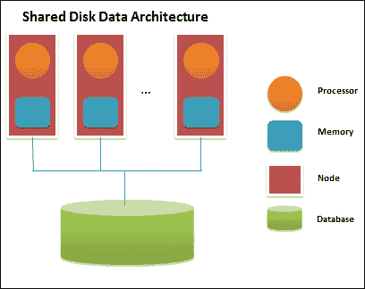

观察结果 3——传统 ETL 架构存在局限性。以下列表提供了这些局限性的详细信息：

+   上线和整合数据既缓慢又昂贵。今天存在的许多 ETL 逻辑都是定制编码的，并且与数据库紧密耦合。这种紧密耦合也导致了一个问题，即现有的逻辑代码无法重用。分析和报告需求需要应用不同的调整技术。分析优化既耗时又昂贵。

+   数据来源通常记录不佳。数据含义在翻译中丢失。上线后的维护和分析成本通常非常高。重建数据血缘是手动、耗时且易出错的。没有强大的审计或记录数据转换，通常在电子表格中跟踪。

+   目标数据难以消费。优化倾向于已知分析，但并不适合新需求。使用的是一刀切的标准视图，而不是适合目的的视图，或者缺乏一个易于消费目标数据的概念模型。很难确定哪些数据可用，如何获取访问权限，以及如何整合数据来回答问题。

观察结果 4——数据通常是结构化的

大多数时候，数据库的设计是为了适应关系数据库管理系统（RDBMS）模型。如果传入的数据实际上没有结构，ETLs 就会构建一个结构以便存储在标准的 OLTP 或 OLAP 存储中。

观察结果 5——性能和可扩展性

在给定基础设施的情况下，数据存储或查询的优化在某种程度上是可能的，但超过一定点，就需要重新设计。

# 新兴的数据架构视角与驱动因素

驱动因素 1——*大数据*干预。

我们在第二章“机器学习和大规模数据集”中定义了大数据和大型数据集的概念。现在正在被摄取并需要处理的数据通常具有以下特征：

+   **来源**：根据信息的性质，来源可能是一个实时数据流（例如，交易交易），或者自上次同步以来包含更新的数据批次

+   **内容**：数据可能代表不同类型的信息。通常，这些信息与其他数据相关，需要连接

    以下截图显示了需要支持的数据类型和不同来源：

    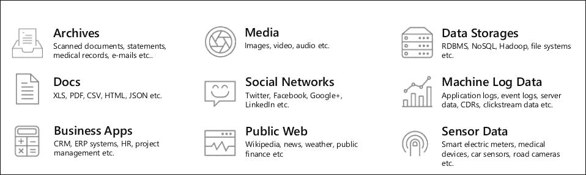

+   **体积**：根据数据的性质，正在处理的数据量可能不同。例如，主数据或证券定义数据相对固定，而交易数据与其他两种相比是巨大的。

+   **生命周期**：主数据有固定的生命周期，很少更新（例如，缓慢变化的维度）。然而，事务数据生命周期非常短，但需要长时间可用于分析、审计等。

+   **结构**：虽然大部分数据是有结构的，但在金融行业中出现了非结构化数据的新趋势。对于金融系统来说，将非结构化数据纳入其 IT 架构中变得越来越关键。

下一个图表展示了每个数据源的复杂性、速度、体积和各个方面：

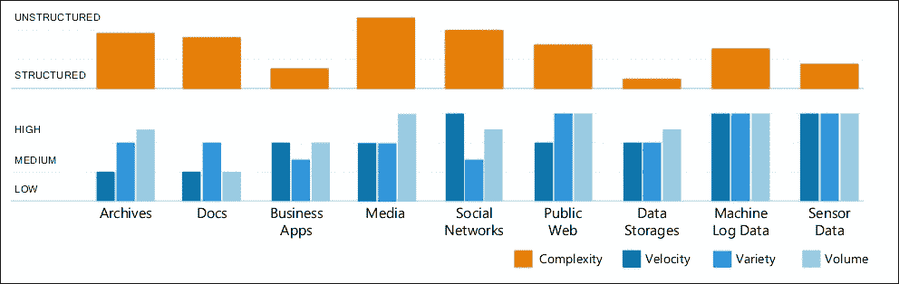

来源：SoftServe

驱动因素 2——数据平台需求高级

新时代数据平台需求的地貌正在急剧扩张，统一平台是当前的热点。下一张概念图将详细解释这一点。数据架构的核心元素包括 ETL（提取、转换和加载）、存储、报告、分析、可视化和数据分发。

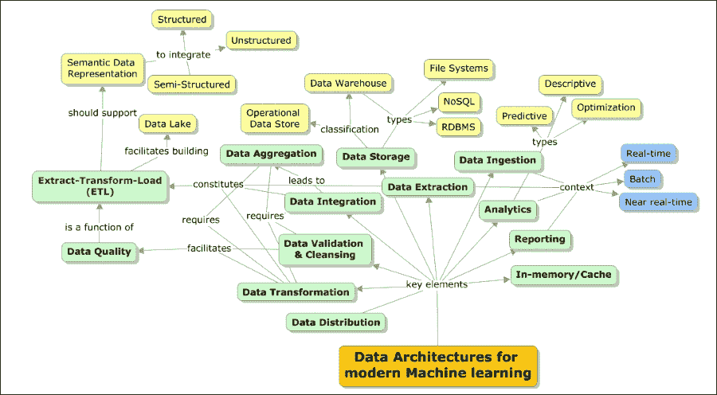

驱动因素 3——机器学习和分析平台现在有了新的目的和定义

以下图表展示了分析的发展及其自我重塑：

+   历史上，重点仅在于报告。汇总或预处理过的数据被加载到仓库中，以了解发生了什么。这被称为**描述性分析**，主要是向后一步。

+   随着临时数据包含的出现，需要理解某些行为发生的原因。这被称为**诊断分析**，其重点是理解行为背后的根本原因，这又基于历史数据。

+   现在，需求已经转变，需要理解将要发生什么。这被称为**预测分析**，其重点是根据历史行为预测事件。

+   随着实时数据的出现，现在的重点是是否能够实现它？这超越了预测分析，其中补救措施是某个部分的一部分。最终的重点是随着实时事件访问的出现，*实现它*！以下图表展示了分析在价值及其相关复杂性方面的演变：

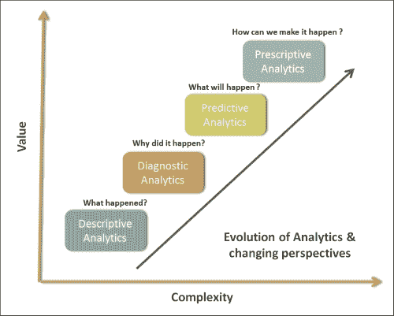

下一个表格区分了传统分析（BI）和新时代分析：

| 区域 | 传统分析（BI） | 新时代分析 |
| --- | --- | --- |
| **范围** | 描述性分析诊断分析 | 预测分析数据科学 |
| **数据** | 有限/受控的量预处理/验证基本模型 | 大量数据多种格式和多样性预处理/验证过的数据增长模型复杂性 |
| **结果** | 这里，重点是回顾和根本原因分析 | 这里，重点是预测/洞察力和分析的准确性 |

驱动因素 4—不仅仅关乎历史和批量，还有实时和即时洞察

输入数据量小、速度高是定义 *实时* 的关键。新一代分析系统预计将处理实时、批量以及近实时处理请求（这些是计划好的，被称为微批量）。以下图表描述了实时和批量数据特性在体积、速度和多样性保持恒定的情况下的属性。

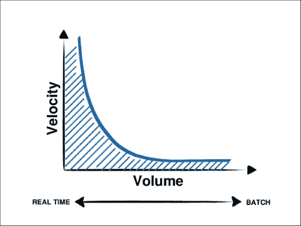

驱动因素 5—传统的 ETL 无法应对 *大数据*

目标是能够制定一个 ETL 架构策略，以解决以下问题区域：

+   促进实施标准化—处理一个标准的需求

+   支持构建可重用组件

+   构建无差别的函数

+   使用并行处理技术提高性能和可扩展性

+   降低总体拥有成本（**TCO**）

+   构建专门的技能库

以下表格提供了关键数据加载模式的比较分析：

|   | ETL 提取、转换和加载 | ELT 提取、加载和转换 | ETLT 提取、转换、加载和转换 |
| --- | --- | --- | --- |
| **概述** | 这是一个传统的数据移动和转换技术，其中 ETL 引擎要么与源数据库分离，要么目标 DBMS 执行数据转换。 | 这是一个将数据从一处移动和转换到另一实例和格式的技术。在这种集成风格中，目标 DBMS 成为转换引擎。 | 在这种技术中，转换部分由 ETL 引擎完成，部分推送到目标 DBMS。 |
| **高亮** | 在 ETL 引擎中进行了大量的转换工作。它使用集成的转换函数。转换逻辑可以通过 GUI 进行配置。这是由 Informatica 支持的。 | 转换工作被委托给 DBMS 层。转换逻辑运行得更接近数据。这是由 Informatica 支持的。 | 转换工作在 ETL 引擎和 DBMS 之间分配。这是由 Informatica 支持的。 |
| **好处** | 这是一个基于图形用户界面的简单配置。转换逻辑独立，位于数据库之外，且可重用。这对于粒度细、简单、面向功能的转换非常有效，这些转换不需要任何数据库调用。可以在 SMP 或 MPP 硬件上运行。 | 这利用了 RDBMS 引擎硬件以实现可扩展性。它始终将所有数据保留在 RDBMS 中。根据数据集进行并行化，并且通常在引擎级别优化磁盘 I/O 以实现更快的吞吐量。只要硬件和 RDBMS 引擎可以继续扩展，它就可以扩展。在适当调整的 MPP RDBMS 平台上可以实现 3 倍到 4 倍的吞吐量。 | 它可以平衡工作负载或与 RDBMS 共享工作负载。 |
| **风险** | 这需要在 ETL 侧有更高的处理能力。成本更高。它包括需要参考数据的复杂转换，这将减慢处理过程。 | 转换逻辑与数据库相关联。涉及较小体积和简单性质的转换不会带来很多好处。 | 这仍将在数据库内部包含一部分转换逻辑。 |

事实 6——没有“一个”数据模型适合高级或复杂的数据处理需求；需要多数据模型平台

不同的数据库被设计用来解决不同的问题。通常使用单个数据库引擎来满足所有需求会导致性能不佳的解决方案。RDBMS 在事务操作方面表现良好，OLAP 数据库用于报告，NoSQL 用于高容量数据处理和存储。一些解决方案统一了这些存储，并为跨这些存储的查询提供了抽象。

# 适用于机器学习的现代数据架构

从本节开始，我们将详细介绍一些新兴的数据架构、导致这种实现架构的挑战、一些相关的技术堆栈以及这些架构适用的用例（如有相关）。

## 语义数据架构

在上一节中提到的新兴观点中涵盖的一些事实引发了以下核心架构驱动因素，以构建语义数据模型驱动的数据湖，这些数据湖能够无缝集成更广泛的数据范围，并且为分析做好准备。分析的未来是语义化的。此处的目标是创建一个大规模、灵活、标准驱动的 ETL 架构框架，借助工具和其他架构资产进行建模，以实现以下功能：

+   使一个可以成为标准架构的通用数据架构。

+   与未来基于本体驱动的数据架构和数据湖相结合（重要的是要将此架构策略与数据聚合参考架构相结合）。这将确保有一个单一的数据策略来处理数据质量和数据集成。

+   使产品团队能够快速集成到数据架构中，并将数据存入和从公共数据存储库中提取。

+   根据需要启用即席分析。

+   减少实施新的数据聚合、摄取和转换所需的时间。

+   启用“任何格式到任何格式”的模式（一种涉及数据规范化的格式无关方法）。

+   遵守新兴的语义标准。这将带来灵活性。

+   使共同的 IT 管理成为可能并降低 TCO。

+   为 Broadridge 主业务数据存储库启用一个统一的云（这可能是一个专有的）。

+   使所有应用程序和产品能够“使用一种共同的语言”并构建 Broadridge 数据格式。

+   减少，在某些情况下消除，过多许可证、数据库、实施、堆栈等的泛滥。

+   数据语义化：分析底层架构以从中提取意义是很重要的。语义化过程始终是迭代的，并随着时间的推移而发展。在此过程中，元数据定义将被详细阐述或扩展。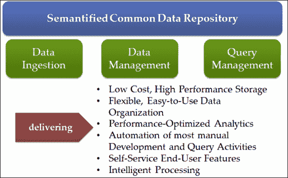

在企业范围内建立聚合数据集市并不是解决之前提出问题的方案。即使建立了这样的数据集市，保持其更新并与其他项目保持一致将是一个主要问题。正如之前所述，需要制定一个系统，该系统能够从多个来源积累数据，而不对数据的使用方式、地点或时间做出任何假设。

我们利用该领域的两个不同进展来解决架构层面的问题。这些是数据湖作为架构模式的演变，以及语义网的兴起及其在电子商务中的日益相关性。

### 业务数据湖

企业数据湖为数据仓库的概念带来了全新的维度。虽然数据仓库的方法一直是设计一个单一架构并汇总满足该架构所需的最少信息，但数据湖颠覆了传统数据仓库架构的这两个前提。传统的数据仓库是为了特定的目的而设计的（例如，分析、报告和运营洞察）。架构相应设计，所需的最少信息被汇总。这意味着如果使用这个仓库实现其他目标，那只是偶然的，而不是其设计目的。

商业数据湖促进了适当模式的概念——仓库不受固定、预定的模式的约束。这允许数据湖在组织内信息可用时吸收信息。这一重要直接影响是，而不是吸收最少的信息——数据湖可以吸收组织产生的所有信息。由于没有对数据是什么的假设，未来可以使用信息进行任何目的的选项仍然开放。这使得数据湖能够通过提供数据湖中已有的数据来支持新想法，从而提高业务敏捷性。

商业数据湖解决了以下问题：

+   如何处理非结构化数据？

+   如何链接内部和外部数据？

+   如何适应业务变化的速度？

+   如何消除重复的 ETL 周期？

+   如何根据不同的业务需求支持不同层次的数据质量和治理？

+   如何让本地业务单元采取主动？

+   如何确保平台的交付并使其被采用？

### 语义网技术

当使用在网络上最常找到的外部数据时，最重要的要求是理解数据的精确语义。没有这一点，结果无法信任。在这里，语义网技术提供了帮助，因为它们允许为任何可用的资源指定从非常简单到非常复杂的语义。语义网技术不仅支持捕获被动的语义，还支持对数据进行主动的推理和推理。

语义网技术允许数据被附加额外的元数据（作为 RDF）。这种能力添加的最基本的能力之一是语义计算的**AAA 原则**——*任何人都可以在任何时候添加关于任何事物的任何内容*。由于信息由元数据组成，因此可以随时添加更多元数据来丰富信息。

使用 SPARQL 查询 RDF 数据，它允许导航复杂的关系图，从数据存储中提取有意义的信息。推理器（或推理引擎）与 RDF 元数据一起工作，在数据顶部提供推理。这允许系统提取原本在传入数据中不可用的新的见解。

现在，大量的信息正在通过互联网和公司及监管网络变得可用。然而，只要信息被分别存储，没有简单的方法将它们从不同的来源组合起来，对所有可用信息的访问仍然有限。

这加剧了对合适方法的需求，以结合来自各种来源的数据。这被称为“信息系统的合作”。这被定义为能够在透明的方式下，在最终用户之间共享、组合和交换异构源信息的能力。这些异构源通常被认为是始终在孤岛中处理数据，因此它们是不可访问的。为了实现数据互操作性，需要消除数据异质性提出的问题。数据源可以以下方式异构：

+   **句法**：句法异质性是由使用不同的模型或语言引起的

+   **模式**：模式异质性源于结构差异

+   **语义学**：语义异质性是由不同语境中数据的不同含义或解释所引起的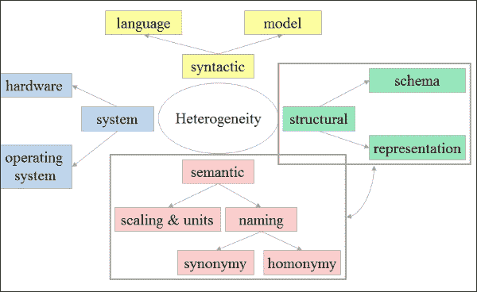

数据集成提供了在多个数据源之间透明地操作数据的能力。基于架构，存在两种系统：

+   **中央数据集成**：中央数据集成系统通常具有全局模式，它为用户提供了一个统一的接口来访问存储在数据源中的信息。

+   **对等网络**：相比之下，在对等网络数据集成系统中，数据源（或对等点）上没有一般性的控制点。相反，任何对等点都可以接受用户对整个系统中分布的信息的查询。

信息系统的合作是指能够从多个信息源共享、组合和/或交换信息，以及最终接收者能够透明地访问集成信息的能力。阻碍信息系统合作的主要问题是信息源的自主性、分布、异质性和不稳定性。特别是，我们对可以在几个层面上识别的异质性问题感兴趣：系统、句法、结构和语义异质性。信息系统的合作已被广泛研究，并提出了几种方法来弥合异构信息系统之间的差距，例如：数据库转换、标准化、联邦、调解和 Web 服务。这些方法为句法和基本层面的异质性问题提供了适当的解决方案。

然而，为了实现异构信息系统之间的语义互操作性，交换信息的含义必须在系统中被理解。每当两个语境不使用对信息的相同解释时，就会发生语义冲突。

因此，为了处理语义异构性，需要更多语义专业化的方法，例如本体。在本章中，我们的重点是展示信息系统如何使用语义进行合作。在下一节中，让我们看看语义数据架构的构成。

#### 本体和数据集成

此图表示基于语义数据架构的参考架构：

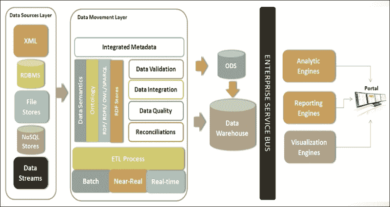

语义数据架构的关键特性如下：

+   **元数据表示**：每个来源都可以表示为支持元数据字典以解释术语的本地本体。

+   **全局概念化**：将有一个全局本体定义，它映射本地本体，并为共同视图提供单一视图或术语。

+   **通用查询**：将根据消费者/客户端的需求和目的，在本地或全局本体级别提供查询支持。

+   **物化视图**：一种高级查询策略，用于隐藏术语和同源之间的查询。

+   **映射**：将支持定义本体属性和值之间的术语表映射。

### 供应商

| 类型 | 产品/框架 | 供应商 |
| --- | --- | --- |
| 开源和商业版本 | MarkLogic 8 是支持存储和处理 RDF 数据格式的 NoSQL 图存储，可以作为三元组存储。 | MarkLogic |
| 开源和商业版本 | Stardog 是最简单且功能最强大的图数据库：在轻量级、纯 Java 系统中进行搜索、查询、推理和约束。 | Stardog |
| 开源 | 4Store 是一个高效、可扩展且稳定的 RDF 数据库。 | Garlik Ltd. |
| 开源 | Jena 是一个用于构建语义网和链接数据应用的免费开源 Java 框架。 | Apache |
| 开源 | Sesame 是一个强大的 Java 框架，用于处理和操作 RDF 数据。这包括创建、解析、存储、推理和查询此类数据。它提供了一个易于使用的 API，可以连接到所有领先的 RDF 存储解决方案。 | GPL v2 |
| 开源 | Blazegraph 是 SYSTAP 的旗舰图数据库。它专门设计用于支持大型图，提供语义网（RDF/SPARQL）和图数据库（TinkerPop、blueprints 和以顶点为中心）API。 | GPL v2 |

## 多模型数据库架构/多语言持久性

即使五年前，我们也无法想象关系数据库只会成为数据库技术的一种，而不是数据库技术本身。互联网规模的数据处理改变了我们处理数据的方式。

新一代架构，如 Facebook、Wikipedia、SalesForce 等，在原则和范例上与当前数据管理技术发展的既定理论基础截然不同。

这些架构的主要架构挑战可以概括如下：

+   信息商品化：

    苹果应用商店、SaaS、通用计算、移动性和基于云的多租户架构在商业术语上释放了商品化信息交付的能力。这种模型几乎改变了所有的架构决策，因为我们现在需要考虑的是可以提供并作为服务计费的信息“单元”，而不是考虑解决方案的总拥有成本（TCO）。

+   关系型数据库管理系统（RDBMS）的理论局限性：

    影响力巨大的数据库理论家迈克尔·斯坦利布雷克（Michael Stonebraker）最近在互联网规模架构的核心所撰写的，是一个新的数据处理和管理理论模型。数据库管理的理论现在已有三十多年历史，当时它们是为大型机类型的计算环境和非常不可靠的电子组件而设计的。自然和系统以及应用的能力已经发生了显著变化。随着可靠性成为底层环境的质量属性，系统由并行处理核心组成，数据创建和使用的性质也发生了巨大变化。为了概念化这些新环境下的解决方案，我们需要从计算的角度来设计解决方案架构，而不仅仅是工程角度。

六大主要力量正在推动今天的数据革命。它们如下：

+   大规模并行处理

+   信息交付商品化

+   通用计算和移动设备

+   非 RDBMS 和语义数据库

+   社区计算

+   云计算

Hadoop 和 MapReduce 在很大程度上释放了数据的并行处理能力，并在程序化平台上实现了复杂的计算算法。这永远地改变了分析和商业智能。同样，基于 Web 服务和 API 驱动的架构在很大基础上实现了信息交付的商品化。如今，可以以这种方式构建极其庞大的系统，使得每个子系统或组件本身就是一个完整的平台，由完全不同的实体托管和管理。

之前的创新已经完全改变了传统的数据架构。特别是，语义计算和基于本体论的信息建模已经彻底颠覆了数据设计。

从哲学上讲，数据架构正在经历事实基础。在传统的数据模型中，我们首先设计*数据模型*——对世界及其未来的固定、设计时理解。数据模型将数据的含义永远固定在固定的结构中。

表不过是一个类别，一组事物。因此，数据只有在理解它所属的集合/类别时才有意义。例如，如果我们把汽车处理系统设计成一些类别，如四轮车、两轮车、商用车辆等，这种划分本身就包含了一些重要的意义。存储在每个类别中的数据并不能揭示设计嵌入的方式中的*设计目的*。例如，另一个系统可能会从驱动方式的角度来看待汽车世界——电动、石油驱动、核驱动等。这种分类本身以某种方式揭示了系统的目的，这是无法从任何单个记录的属性中获得的。

“多语言”这个术语通常用来定义能够说多种语言的人。在大数据背景下，这个术语指的是一组使用多种数据库技术的应用程序，其中每种数据库技术解决特定的问题。这种数据架构的基本前提是不同的数据库技术解决各种问题，因为复杂的应用程序有很多问题，选择一个选项来解决特定问题比试图用一个选项解决所有问题更好。当我们谈论数据系统时，它被定义为负责数据存储和查询的系统，其运行时间可达数年，并需要解决所有可能的硬件和维护复杂性。

当遇到复杂问题时，会采用多语言持久化数据架构，将问题分解成更小的部分，并通过应用不同的数据库模型来解决。随后将结果汇总到一个混合数据存储平台，并进行分析。影响数据库选择的一些因素如下：

因素 1—数据模型：

+   我们希望整合哪些类型的数据源？

+   我们希望如何操作/分析数据？

+   数据的量、种类和速度是多少？

+   例子—关系型、键值型、列式、文档型、图等。

因素 2—一致性、可用性和分区（CAP）：

+   **一致性**：每个客户端的对象只有一个值（原子性）

+   **可用性**：所有对象始终可用（低延迟）

+   **分区容错性**：数据被分割成多个网络分区（聚类）

CAP 定理要求我们在这两个特性中选择任何一个：

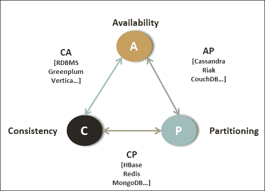

以下图表是一个示例系统，该系统具有多个应用程序，并为其目的构建了数据模型：

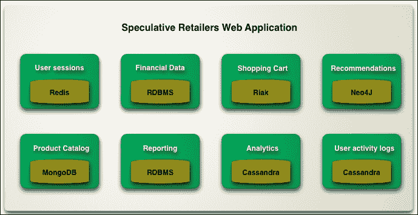

来源：ThoughtWorks

影响此解决方案的一些重要方面如下：

+   确保提出的混合环境被清楚地理解，以确保它有助于做出关于数据集成、分析、数据可见性等方面的正确决策，从而确定解决方案如何融入整个大数据和数据分析实施框架。

+   由于存在多个数据模型，因此将需要一个能够与为解决方案和聚合而指定的所有数据库接口的统一平台。这个平台应该解决一些大数据平台的基本期望，如：容错性、高可用性、事务完整性、数据敏捷性和可靠性、可扩展性和性能。

+   根据具体要求，了解/理解哪种数据模型既适用于特定问题，也适用于整体解决方案，这一点非常重要。

+   数据摄取策略解决实时和批量数据更新，以及如何在多模型数据库的上下文中使其工作。由于将会有各种数据存储，**系统记录**（SOR）将是什么？我们如何确保所有数据源中的数据保持同步或是最新的？

因此，这可能是最好的大数据挑战。需要收集、集成和分析多个来源的、结构非常不同的数据，以解决特定的商业问题。然后，关键是确定数据是否需要按需或实时推送到客户端。显然，这种类型的问题不能简单地或以成本效益的方式使用一种数据库技术来解决。在某些情况下，直接使用 RDBMS 可能可行，但在存在非关系型数据的情况下，需要不同的持久化引擎，如 NoSQL。同样，对于电子商务业务问题，我们还需要一个高度可用和可扩展的数据存储，用于购物车功能。然而，要找到特定群体购买的产品，同一个存储无法提供帮助。这里的需求是采用混合方法，并使用多个数据存储联合使用，这被称为多语言持久化。

### 供应商

| 类型 | 产品/框架 | 供应商 |
| --- | --- | --- |
| 商业 | FoundationDB 是一个坚如磐石的数据库，提供 NoSQL（键值存储）和 SQL 访问。 | FoundationDB |
| 开源 | ArangoDB 是一个开源的 NoSQL 解决方案，具有灵活的数据模型，适用于文档、图和键值。 | GPL v2 |

## Lambda 架构（LA）

Lambda 架构解决了机器学习的一个重要方面；即提供一个统一平台，用于实时和批量分析。我们至今所见的大多数框架都支持批量架构（例如，Hadoop），以便支持与特定框架（例如，Storm）的实时处理集成。

Nathan Marz 提出了 Lambda 架构的概念，这是一个通用的、可扩展的、容错的数据处理架构，它将实时流处理和批量处理作为一个统一的解决方案。

Lambda 架构促进了一个高度容错的数据架构，既对抗硬件故障，也对抗人为错误。同时，它服务于广泛的用途和工作负载，在这些用途和工作负载中，需要低延迟的读取和更新。结果系统应该是线性可扩展的，并且应该向外扩展而不是向上扩展。

从高层次来看，它看起来是这样的：

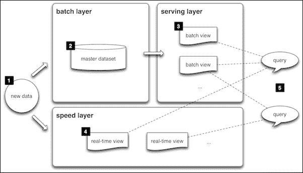

+   **数据层**：进入系统的所有数据都被分配到批量层和速度层进行处理。

+   **批量层**：此层管理主数据，并负责批量预计算。它处理大量数据。

+   **速度层**：速度层负责处理最近的数据，并补偿服务层更新的高延迟。平均而言，这一层不处理大量数据。

+   **服务层**：服务层处理批量视图的索引，并促进低延迟的即席查询。

+   **查询函数**：此函数结合了批量视图和实时视图的结果。

### Vendors

| 类型 | 产品/框架 | 供应商 |
| --- | --- | --- |
| 开源和商业 | Spring XD 是一个针对碎片化 Hadoop 生态系统的统一平台。它建立在经过实战检验的开源项目之上，极大地简化了大数据工作负载和数据管道的编排。 | Pivotal (Spring Source) |
| 开源 | Apache Spark 是一个快速的传统大数据处理引擎，内置流、SQL、机器学习和图处理模块。 | Apache |
| 开源 | Oryx 是一个简单、实时和大规模的机器学习基础设施。 | Apache (Cloudera) |
| 开源 | Storm 是一个用于实时处理流数据的系统。 | Apache (Hortonworks) |

# 摘要

在本章的结尾，我们的重点是机器学习的实现方面。我们已经了解了传统分析平台是什么，以及它们如何无法满足现代数据需求。您还学习了推动新数据架构范式（如 Lambda 架构和多语言持久性[多模型数据库架构]）的架构驱动因素，以及语义架构如何帮助实现无缝数据集成。通过本章，您可以假设您已经准备好为任何领域实施机器学习解决方案，并且不仅能够识别出解决学习问题所需应用哪些算法或模型，而且还能找到最佳的平台解决方案。
