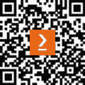

# 前言

在当今互联的世界中，个人和组织生成的大量数据已成为开发强大机器学习模型的有价值资源。这些模型有可能彻底改变行业、改善服务和揭示前所未有的洞察。然而，这个巨大的机会也伴随着一个重大的挑战：保护敏感数据的隐私和安全。

随着数据泄露和隐私问题继续成为头条新闻，个人和组织越来越意识到与共享和分析他们的数据相关的潜在风险。对能够同时利用机器学习力量并保护个人隐私以及保护敏感信息的创新解决方案的需求日益增长。

这本书，《隐私保护机器学习》，旨在解决这些紧迫的问题，并探索旨在调和机器学习力量与数据隐私必要性的最新技术和方法。我们深入探讨隐私保护技术、算法和框架的复杂世界，这些技术、算法和框架使组织能够在遵守严格的隐私法规和伦理考量的情况下，充分发挥其数据潜力。

在本书的每一页中，我们提供了该领域的全面概述，涵盖了基本概念和高级技术。我们讨论了与机器学习相关的各种隐私威胁和风险，包括成员推断攻击和模型反演攻击。此外，我们还探讨了机器学习中的隐私法律和伦理方面，揭示了诸如**通用数据保护条例**（**GDPR**）和**加州消费者隐私法案**（**CCPA**）等法规。

本书的一个核心主题是探索能够实现安全且隐私保护的机器学习的隐私增强技术。我们深入研究了差分隐私、同态加密、安全多方计算和联邦学习等领域。我们考察了它们的底层原理、优势和局限性，为您提供选择最适合您特定隐私需求的技术所需的必要工具。

随着人工智能和数据科学领域的持续进步，确保隐私始终处于创新的前沿至关重要。

本书旨在为对隐私与机器学习交叉领域感兴趣的研究人员、实践者和政策制定者提供宝贵的资源。通过理解隐私保护机器学习中的挑战、解决方案和新兴趋势，我们可以共同塑造一个隐私与创新和谐共存的未来。让我们共同踏上探索隐私保护机器学习世界的旅程，并解锁人工智能的变革潜力，同时维护个人和组织的权利和隐私。

# 本书面向的读者

这本书面向对隐私和机器学习交叉领域感兴趣的广泛读者。目标受众包括以下几类：

+   **数据科学家和机器学习从业者**：与数据和开发机器学习模型工作的专业人士将发现这本书非常有价值。它提供了隐私保护技术和框架的见解，这些技术和框架可以集成到他们现有的工作流程中，使他们能够构建安全且具有隐私意识的机器学习系统。

+   **研究人员和学者**：计算机科学、数据科学、人工智能和隐私领域的学者和研究人员将从对隐私保护机器学习技术的全面覆盖中受益。本书探讨了该领域的最新进展和挑战，为深入研究提供了坚实的基础。

+   **隐私专业人士和数据保护官**：负责确保符合隐私法规和保护敏感数据的隐私专业人士将发现这本书与他们的工作高度相关。它涵盖了机器学习中隐私的法律和伦理方面，为将隐私增强技术纳入组织实践提供了指导。

+   **政策制定者和政府官员**：参与制定隐私法规和指南的政策制定者和政府官员可以从这本书中获得宝贵的见解。它探讨了监管环境，并讨论了隐私保护机器学习对政策制定和实施的影响。

+   **行业领袖和决策者**：来自各个行业的执行人员、经理和决策者将发现这本书有助于理解机器学习中隐私的重要性。它提供了实际案例和使用场景，展示了隐私保护技术的益处，使他们在数据保护策略方面做出明智的决策。

+   **隐私倡导者和活动家**：倡导隐私权利和数据保护的个人和组织将发现这本书有助于理解隐私保护机器学习的技术方面。它为他们提供了知识，使他们能够参与有见地的讨论，并为发展隐私友好的实践和政策做出贡献。

无论你在机器学习或隐私方面的专业知识水平如何，这本书都提供了对该主题的全面介绍，并逐步建立基础概念。它提供了理论洞察力和实际应用，使不同背景的读者能够应对隐私保护机器学习带来的挑战和机遇。

# 本书涵盖的内容

*第一章*，《数据隐私、隐私泄露和威胁建模导论》，作为数据隐私各个方面的入门介绍。我们首先探讨数据隐私的概念，区分敏感数据和个人信息敏感数据。此外，我们还深入研究数据隐私法规领域，强调其在保护个人信息的意义。本章还介绍了隐私设计概念，强调其在确保数据生命周期中隐私的重要性。此外，我们通过讨论显著的案例和针对大型企业公司施加的罚款，来考察隐私泄露的现实影响。这些例子揭示了未能充分保护敏感数据所带来的后果。然后，本章深入探讨使用 LINDDUN 框架的隐私威胁建模。我们解释了可链接性和可识别性威胁的概念，并提供实例以增强理解。通过全面涵盖这些主题，本章为书中讨论的隐私保护技术和方法的深入探索奠定了基础。它使你具备理解数据隐私的重要性、隐私泄露的风险以及减轻这些风险的策略，同时实现数据分析和利用的必要知识。

*第二章*，《机器学习阶段及每个阶段的隐私威胁/攻击》，概述了各种类型的机器学习，包括监督学习、无监督学习和强化学习，并探讨了机器学习阶段和流程。它还提供了持久化 ML 模型的各种格式以及模型持久化所面临的挑战。此外，它强调了在机器学习过程的每个阶段考虑隐私的重要性。我们深入研究与机器学习不同阶段相关的隐私需求，即训练数据隐私、输入数据隐私、模型隐私和推理/输出数据隐私。本章接着考察针对每个阶段的特定隐私攻击。我们关注对训练数据、模型持久化和推理过程构成的威胁。我们深入探讨模型反演攻击、模型推理攻击和训练数据提取攻击，并提供了使用开源框架详细说明这些攻击如何工作的实例。

*第三章*, *隐私保护数据分析概述与差分隐私简介*，作为隐私保护数据分析、隐私增强技术和差分隐私概念的介绍。这些主题被探讨以提供理解和实施数据分析与机器学习中隐私保护措施的基础。本章还涵盖了 SQL 的重建攻击，探讨了实际应用案例，并介绍了如何使用提供强大隐私保护的 Open Diffix 框架来预防此类攻击。具体来说，详细探讨了差分隐私的概念，包括隐私损失、隐私预算、差分隐私机制以及局部/全局差分隐私。

*第四章*, *差分隐私算法与差分隐私的局限性*，深入探讨了在差分隐私中使用的各种算法（拉普拉斯、高斯、计数、求和、均值、方差、标准差和阈值算法）以及差分隐私的局限性。

*第五章*, *使用开源框架开发具有差分隐私的应用程序*，深入探讨了使用开源框架的**差分隐私**（**DP**）以及使用机器学习（ML）和深度学习（DL）开源框架实现欺诈检测用例的实施。本章还概述了利用差分隐私的实际情况。

*第六章*, *联邦学习的需求与使用开源框架实现联邦学习*，涵盖了**联邦学习**（**FL**）的重要性以及与将数据发送到中央服务器进行模型训练相关的隐私问题。它探讨了**独立同分布**（**IID**）和非 IID 数据集的概念，以及非 IID 数据的不同类别。理解这些数据特征对于有效地实施联邦学习至关重要。此外，它讨论了联邦学习技术（FedAvg、FedYogi、FedSGD 等）并介绍了支持联邦学习实现的可用开源框架。它还使用 Flower 开源框架在金融领域实现了一个用例。

*第七章*，*联邦学习基准、初创企业和下一个机会*，专注于联邦学习数据集和基准的比较。它深入探讨了可用的联邦学习基准，并提供了如何使用它们来评估联邦学习算法和技术的方法。此外，它讨论了选择最适合您特定项目的联邦学习基准的过程，考虑了数据特性和评估标准等因素。它还探讨了联邦学习领域的最先进研究，突出了该领域的最新进展、方法和挑战，并揭示了正在积极从事联邦学习并专注于特定领域的初创企业。

*第八章*，*同态加密和多方安全计算*，探讨了各种增强隐私的技术，包括加密、匿名化和去标识化。它讨论了这些技术的原理和局限性，了解它们在保护敏感数据的同时保持数据有效性的有效性。它涵盖了**同态加密**（**HE**）的概念及其数学基础，并探讨了如何在机器学习场景中应用 HE，允许在加密数据上直接执行计算而不损害隐私。此外，我们讨论了**多方安全计算**（**SMC**）及其用例，并展示了使用**私有集交互**（**PSI**）SMC 技术的一个用例实现。在章节末尾，我们提供了**零知识证明**（**ZKP**）的高级概述，这是一种密码学协议，允许一方在不透露信息本身的情况下证明对某些信息的了解。

*第九章*，*保密计算——是什么、为什么以及当前状态*，深入探讨了针对存储在内存中的数据的隐私和安全攻击。我们讨论了此类攻击的漏洞和潜在风险，强调了在整个生命周期中保护数据的重要性。我们介绍了保密计算的概念，重点关注**可信执行环境**（**TEEs**），并探讨了源代码认证的概念及其在减轻内部威胁攻击方面的作用。通过验证源代码的完整性和真实性，组织可以建立信任并确保恶意行为者无法危害其系统的安全性。此外，我们比较了主要云服务提供商（如 AWS、Azure、GCP 和 Anjuna）对安全区域的支持。我们评估了这些提供商提供的功能、特性和安全措施，使您在选择部署需要安全区域的平台时能够做出明智的决定。

*第十章*，*大型语言模型中的隐私保护*，介绍了生成式人工智能和 LLMs 的基础知识，以及与之相关的隐私漏洞，以及在使用这些模型时保护隐私的技术和方法。本章涵盖了使用开源 LLMs 开发 LLM 应用程序以及保护它们免受隐私攻击（提示注入攻击、成员推理攻击等），并以 LLMs 的最新隐私研究结束。

# 要充分利用本书

虽然不需要了解**人工智能**（**AI**）、**机器学习**（**ML**）和**生成式人工智能**（**GenAI**），但对此中任何一种有所了解将有助于理解本书中涵盖的一些概念。了解 Python 将有助于执行每章提供的示例源代码。

| **本书涵盖的软件/硬件** | **操作系统要求** |
| --- | --- |
| Python 3.7 或更高版本 | Windows、macOS 或 Linux |
| Jupyter Notebook |  |

为了深入探讨本书中一些更复杂的概念，我们在 GitHub 上创建了 Jupyter Notebook 文件（详情见下文）。

**如果您使用的是本书的数字版，我们建议您亲自输入代码或从本书的 GitHub 仓库（下一节中提供链接）获取代码。这样做将有助于您避免与代码复制和粘贴相关的任何潜在错误。**

# 下载动手实验室和示例代码文件

您可以从 GitHub（[`github.com/PacktPublishing/Privacy-Preserving-Machine-Learning`](https://github.com/PacktPublishing/Privacy-Preserving-Machine-Learning)）下载本书的动手实验室和示例代码文件。如果动手实验室或任何代码有更新，这将在之前提到的 GitHub 仓库中更新。

我们还提供其他丰富的图书和视频的代码包，可在 GitHub（[`github.com/PacktPublishing/`](https://github.com/PacktPublishing/)）上找到。查看它们吧！

# 使用的约定

本书中使用了多种文本约定。

`文本中的代码`：表示文本中的代码单词、数据库表名、文件夹名、文件名、文件扩展名、路径名、虚拟 URL、用户输入和 Twitter 昵称。以下是一个示例：“安装 Jupyter Notebook（pip install notebook）。”

代码块设置如下：

```py
import numpy as np 
from sklearn.linear_model import LinearRegression 
# Prepare sample input data with two features (feature 1, feature 2 
X = np.array([[10, 10], [10, 20], [20, 20], [20, 30]]) 
# Assume that target feature has some relationship with the input features with the formula y = 3 * x_1 + 5 * x_2 + 50 
y = np.dot(X, np.array([3, 5])) + 50
```

当我们希望您注意代码块中的特定部分时，相关的行或项目将以粗体显示：

```py
SELECT DEPTNO, DEPTNAME, MGRNO, MGRNAME, MGREMAILID,LOCATION FROM DEPARTMENT;
```

任何命令行输入或输出都如下所示：

```py
!pip3 install tmlt-analytics
!pip3 install onnx --user
```

**粗体**：表示新术语、重要单词或您在屏幕上看到的单词。例如，菜单或对话框中的单词以粗体显示。以下是一个示例：“攻击者的代码旨在通过在相同的数据集上训练一个新的**LogisticRegression**模型（**extracted_model**）来执行模型提取攻击。”

小贴士或重要注意事项

看起来是这样的。

# 联系我们

我们始终欢迎读者的反馈。

`customercare@packtpub.com`，并在邮件主题中提及书名。

**勘误表**：尽管我们已经尽一切努力确保内容的准确性，但错误仍然可能发生。如果您在此书中发现了错误，我们将非常感激您向我们报告。请访问[www.packtpub.com/support/errata](http://www.packtpub.com/support/errata)并填写表格。

`copyright@packt.com`，并附上材料的链接。

**如果您有兴趣成为作者**：如果您在某个领域有专业知识，并且您有兴趣撰写或为书籍做出贡献，请访问[authors.packtpub.com](http://authors.packtpub.com)。

# 分享您的想法

一旦您阅读了《隐私保护机器学习》，我们很乐意听听您的想法！请[点击此处直接访问此书的亚马逊评论页面](https://packt.link/r/1-800-56467-8)并分享您的反馈。

您的评论对我们和科技社区都很重要，并将帮助我们确保我们提供高质量的内容。

# 下载此书的免费 PDF 副本

感谢您购买此书！

您喜欢在路上阅读，但无法携带您的印刷书籍到处走？

您的电子书购买是否与您选择的设备不兼容？

请放心，现在，每购买一本 Packt 书籍，您都可以免费获得该书的 DRM 免费 PDF 版本。

在任何地方、任何设备上阅读。直接从您喜欢的技术书籍中搜索、复制和粘贴代码到您的应用程序中。

优惠不会就此结束，您还可以获得独家折扣、时事通讯和每日免费内容的每日电子邮件。

按照以下简单步骤获取优惠：

1.  扫描二维码或访问以下链接



[`packt.link/free-ebook/9781800564671`](https://packt.link/free-ebook/9781800564671)

1.  提交您的购买证明

1.  就这样！我们将直接将免费 PDF 和其他优惠发送到您的电子邮件。
