# 第二章：机器学习阶段和每个阶段的隐私威胁/攻击概述

在本章中，我们将快速回顾不同类型的**机器学习**（**ML**）：监督学习、无监督学习和强化学习。我们还将回顾 ML 的基本阶段或流程。你可能已经熟悉这些内容；如果不熟悉，本章将作为一个基础性的介绍。

随后，我们将深入研究 ML 过程中的每个阶段隐私保护的关键主题。具体来说，我们将探讨在训练数据、输入数据、模型存储和推理/输出数据中保持隐私的重要性。此外，我们还将检查每个阶段可能发生的各种隐私攻击，例如训练数据提取攻击、模型反演攻击和模型推理攻击。通过详细的示例，我们将了解这些攻击是如何工作的，并讨论防范策略。

我们将涵盖以下主要主题：

+   机器学习类型

+   ML 阶段概述

+   机器学习阶段中的隐私威胁/攻击

# 机器学习类型

一些人对不同的 ML 类型可能已经熟悉，即监督学习、无监督学习和强化学习。在接下来的章节中，我们将快速回顾这些 ML 类型，总结你可能已经学到的内容。

## 监督学习

监督学习模型涉及使用一组输入数据和相应的实际输出开发一个数学模型。输入数据被称为训练数据，而输出被称为预测输出。这些模型使用数学函数从训练数据中学习，并旨在使用最优函数最小化预测输出和预期输出之间的误差。由输入示例组成的数据通常以数组、向量、矩阵或张量等格式表示。这种数据通常被称为特征数据或特征向量，其中数据中的每个属性都被视为一个特征。

| **类型** | **示例** | **细节** |
| --- | --- | --- |
| 标量 | 1 | 标量是一个单独的数字。 |
| 向量 | [ 1 2 3 4 ] | 向量是由不同数据类型的数字或对象组成的数组。 |
| 矩阵 | [1 2 3 4 5 6 7 8 9] | 矩阵是按行和列排列的数字数组。为了访问矩阵，我们需要两个索引：列号和行号。 |
| 张量 | [[ 1 2] [ 3 4] [ 5 6][ 7 8 ] [9 0] [ 0 1]] | 张量是一个*n*-维数组，其中*n>2*。 |

表 2.1 – 标量、向量、矩阵和张量的示例

在数学术语中，ML 中的监督学习可以用一个带有参数*𝜃*的模型来表示。该模型充当输入*x*和输出*y*之间的映射函数，表示为*y =* 𝑓 *(x,* 𝜃*).* 在这个上下文中，*x*代表一个具有*𝑛*维度的属性或特征向量。输出或标签*y*的维度可以根据特定的学习任务而变化。

为了训练模型，使用了一个训练集 T，它由形式为 T = {(x, y𝑖)}的数据点组成，其中*𝑖*的范围从 1 到 n，代表输入-输出对的数目。

监督机器学习算法通常分为两类：回归和分类。这些算法旨在学习训练数据中的模式和关系，以便对新、未见过的数据进行预测或分配标签。

### 回归

在机器学习中，目标变量是我们旨在预测或预测的变量。它也常被称为因变量。它是机器学习模型训练用来使用独立或特征变量预测的变量。例如，在房价预测模型中，房价将是目标变量。

回归是机器学习中的一个基本概念，它侧重于根据输入变量预测连续数值。它是一种监督学习技术，涉及分析输入特征与目标变量之间的关系。回归的目标是构建一个数学模型，当提供新的输入数据时，可以准确地估计或近似目标变量的值。

在回归中，目标变量，也称为因变量，是一个连续值。输入变量，也称为独立变量或特征，可以是数值或分类的。回归模型旨在理解这些输入变量与目标变量之间的关系，从而能够对未见数据做出预测。

回归模型的性能通常通过评估其预测值与实际目标值之间的接近程度来衡量。存在各种回归算法，如线性回归、多项式回归，以及更复杂的支持向量回归和随机森林回归等技术。这些算法使用数学优化方法来拟合回归函数，以最小化预测值与目标变量的真实值之间的差异。

回归分析在众多领域都有应用，包括金融、经济学、医疗保健和社会科学，其中它被用于诸如价格预测、需求预测、风险评估和趋势分析等任务。通过利用回归算法，可以从数据中获得有价值的见解，从而实现明智的决策和准确的预测。

#### 回归模型示例

这是一个使用两个输入特征预测目标变量的简单示例。在这种情况下，模型是在一组历史数据上训练的，通常代表过去 X 天的数据。

目的是根据提供的输入数据预测或预测目标变量。通过分析历史数据集中的模式和关系，训练好的模型可以在呈现新的输入数据时对目标变量进行预测。这个过程允许根据给定的输入预测未来的值或理解潜在的结果。模型的准确性和性能是根据其预测目标变量的能力与实际值相比来评估的。通过利用历史数据和利用机器学习算法，可以获得有价值的见解，从而实现准确的预测和明智的决策。

| 特征 1 值 | 特征 2 值 | 目标变量值 |
| --- | --- | --- |
| 10 | 10 | 130 |
| 10 | 20 | 180 |
| 20 | 20 | 210 |
| 20 | 30 | 260 |
| 30 | 50 | ?? |

表 2.2 – 回归模型示例

此示例使用 scikit-learn 库实现。我使用了 Python 3.8 和 scikit-learn 1.2.1 版本。

这些是在本例中遵循的步骤：

1.  安装 Jupyter Notebook（**pip** **install notebook**）。

1.  打开一个 Python Jupyter 笔记本（**jupyter notebook**）。

1.  安装 sci-kit learn 库（**pip install -****U scikit-learn**）。

1.  输入以下代码并运行模型代码。

您可以直接使用本书 GitHub 位置提供的 Jupyter 笔记本执行代码—`LinearRegression.ipynb`—位于[`github.com/PacktPublishing/Privacy-Preserving-Machine-Learning/blob/main/Chapter%202/LinearRegression.ipynb`](https://github.com/PacktPublishing/Privacy-Preserving-Machine-Learning/blob/main/Chapter%202/LinearRegression.ipynb)：

```py
import numpy as np
from sklearn.linear_model import LinearRegression
# Prepare sample input data with two features (feature 1, feature 2
X = np.array([[10, 10], [10, 20], [20, 20], [20, 30]])
# Assume that target feature has some relationship with the input features with the formula y = 3 * x_1 + 5 * x_2 + 50
y = np.dot(X, np.array([3, 5])) + 50
# Run the model with the input data and output values
reg = LinearRegression().fit(X, y)
reg.score(X, y)
reg.coef_
reg.intercept_
reg.predict(np.array([[30, 50]]))
Output: array([390.])
```

在此示例中，目标变量 y 与输入变量 X0 和 X1 呈线性相关，线性方程为 y= 3X0+ 5X1+50（50 是直线的截距）。

模型使用均方根值作为最优函数，并预测目标变量。在这种情况下，由于特征和目标变量之间强烈的线性关系，它预测了 100%的准确率。

#### 模型持久化和检索持久化模型以进行推理

在使用训练数据开发和测试模型以及使用测试数据进行验证之后，下一步是持久化模型。这允许与其他开发人员或工程师轻松共享，而无需透露训练数据和复杂的模型细节。此外，如果模型在训练期间表现出足够的准确度，它可以在生产环境中部署。

为了持久化模型，支持多种格式以将其存储在磁盘或文件系统中。具体使用的格式取决于开发机器学习或**深度学习**（**DL**）模型所使用的框架。通过使用这些格式，模型可以高效地存储和访问，便于无缝集成到生产系统或与其他团队成员的合作中。

持久化模型可以实现可重复性和可扩展性，因为它可以在不同的环境中共享、重用和部署，而无需从头开始重新训练。它还有助于保护与模型相关的专有信息和知识产权，使组织能够保护其宝贵的研究和开发工作。

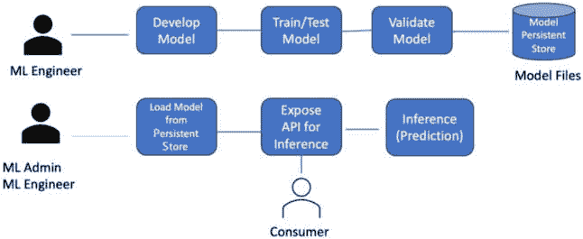

图 2.1 – 模型持久化和检索

下表显示了社区中广泛使用和接受的格式：

| 框架 | 模型持久化格式 | 详情 |
| --- | --- | --- |
| scikit-learn[`scikit-learn.org/`](https://scikit-learn.org/) | JoblibPickle | Joblib 和 pickle 格式不需要任何代码更改。pickle 格式存在安全问题，因此大多数框架不建议使用 pickle 格式进行模型持久化，因为在反序列化过程中可以执行任意代码。 |
| TensorFlow/Keras[`www.tensorflow.org/`](https://www.tensorflow.org/) | JSONYAMLHDF5 | 这是以 JSON 或 YAML 格式存储的模型数据，这些格式是基于文本的格式，因此它们是语言无关的。权重以 HDF5 格式保存。 |
| PyTorch[`pytorch.org/`](https://pytorch.org/) | state_dictPickle | 用于神经网络模型存储权重和偏差。 |
| ONNX | Onnx | 模型需要转换为 ONNX 格式，并使用 ONNX Runtime 导出和加载/执行，以便它们可以在基于 CPU 或 GPU 的服务器上运行。 |

表 2.3 – 标量、向量、矩阵和张量的示例

以下代码展示了如何使用 Python 存储和检索 Joblib 格式的模型：

什么是 Joblib？

Joblib ([`joblib.readthedocs.io/en/latest/`](https://joblib.readthedocs.io/en/latest/)) 是一组工具，用于在 Python 中提供轻量级管道，以持久化（或序列化）Python 对象。本代码中使用 Joblib 版本 1.2.0。

本例的 Jupyter 笔记本为 `LinearRegression_SaveModel.ipynb`：

```py
# Persist the model in python Joblib file
# Retrieve the model weights and use it further prediction
import joblib
import numpy as np
from sklearn.linear_model import LinearRegression
X = np.array([[10, 10], [10, 20], [20, 20], [20, 30]])
# Assume that target feature has some relationship with the input features with the formula y = 3 * x_1 + 5 * x2 + 50
y = np.dot(X, np.array([3, 5])) + 50# Run the model with the input data and output values
reg = LinearRegression().fit(X, y)
# Persist the model in python Joblib file
filename = "sample_model.sav"
joblib.dump(reg, filename)
# regression model which is used earlier 
# Share this file alone to others for deploying in to production and for inferencing/predictions
```

一旦模型在文件系统或文件中持久化，则可以与其他开发人员或工程师共享该文件，而无需共享代码中使用的任何训练数据或模型细节。其他开发人员/工程师然后可以加载此文件并用于进一步的预测或将其部署到生产环境中进行生产使用。这已在 *图 2**.1 中解释。该模型保存在当前目录中，名称为 `sample_model.sav`；您可以使用任何扩展名，因为它并不重要使用哪个扩展名。源代码在 `Linear_Regression_Load_Model.ipynb` 中：

```py
import joblib
import numpy as np
filename = "sample_model.sav"
# Load the model from disk
loaded_model = joblib.load(filename)
result = loaded_model.predict(np.array([[30, 50]]))
print(result)
Output: [390.]
```

### 分类

分类模型使用不同的算法根据输入变量之间的关系预测输出或因变量。分类算法专门设计用于预测离散值，例如垃圾邮件/非垃圾邮件、男性/女性、是/否等。这些预测值中的每一个都被称为标签或类别。

在二元分类场景中，只有两个可能的类别标签，例如，确定一封电子邮件是否为垃圾邮件。另一方面，多标签分类涉及同时预测多个类别标签。一个例子是将图像分类到各种类别，如猫、狗和鸟。

分类模型使用包含输入变量及其对应类别标签的历史数据进行训练。算法从这些有标签的数据中学习，并建立模式和关系，以便在新、未见过的数据上做出准确的预测。分类模型的性能基于准确率、精确率、召回率和 F1 分数等指标进行评估。这些指标评估模型根据其输入特征正确分配适当的类别标签到新实例的能力。

分类模型在各个领域都有广泛的应用，包括垃圾邮件过滤、情感分析、客户流失预测、欺诈检测和医疗诊断。通过利用不同的分类算法，可以从数据中获得有价值的见解，从而实现明智的决策和高效的问题解决。

| **分类类型** | **详细信息** | **示例** | **算法** |
| --- | --- | --- | --- |
| 二元 | 基于训练数据预测两个类别中的一个 | 是/否垃圾邮件/非垃圾邮件通过/失败癌症/无癌症 | 逻辑回归 K 最近邻决策树支持向量机朴素贝叶斯 |
| 多分类 | 预测两个以上类别中的一个 | 基于症状，例如，感冒、流感或 COVID-19 | K 最近邻决策树朴素贝叶斯随机森林梯度提升 |
| 多标签 | 有两个或更多类别标签 | 根据内容预测主题：金融、政治、科学、语言或所有这些 | 多标签决策树多标签随机森林多标签梯度提升 |
| 极端 | 候选标签数量巨大的分类任务 | 亚马逊 3M 数据集，其中标签数量为 2,812,281 | 深度学习算法更多算法：[`manikvarma.org/downloads/XC/XMLRepository.html`](http://manikvarma.org/downloads/XC/XMLRepository.html) |

表 2.4 – 分类类型和相关算法

#### 分类示例

在这个例子中，我们将利用决策树分类算法，根据两个特征：年龄和是否有既往癌症状况，来确定患者生存的可能性。

决策树分类算法是机器学习中广泛使用的技术，它构建了一个决策的树状模型。它分析提供的数据以创建一个表示决策过程的结构。

在我们的场景中，患者的年龄和他们的癌症状态将被用作分类的输入特征。通过检查包含患者信息的有标签数据集，包括年龄、癌症状态和生存结果，算法学习模式并建立决策规则。

一旦模型经过训练，它就能够预测之前未曾遇到的新患者的存活结果。通过考虑这些患者的年龄和癌症状况，模型遍历决策树，直到达到表示预测结果的叶节点：患者是否预期会存活。

通过在这个例子中使用决策树分类算法，我们的目标是根据患者的年龄和癌症状况来分类患者的存活概率。这一宝贵的见解可以帮助医疗专业人员评估患者预后并告知治疗决策。

| **年龄（年）** | **是否有/曾经有癌症（1 = 是，0 = 否）** | **存活（1 = 是，0 = 否）** |
| --- | --- | --- |
| 10 | 1 | 1 |
| 20 | 1 | 1 |
| 30 | 1 | 1 |
| 80 | 1 | 0 |
| 75 | 0 | 0 |
| 78 | 0 | 0 |
| 35 | 1 | ?? (预测) |
| 78 | 1 | ?? (预测) |

表 2.5 – 分类示例的玩具数据集

在这个玩具数据集中，模型需要根据模型训练的历史数据预测最后两位患者的存活情况（具有两个标签的分类）。

源代码位于`Classification_Example.ipynb`。

Scikit-learn 为分类算法提供了各种 Python 类。由于我们在这个例子中选择了决策树算法，因此导入必要的类并准备模型接受的格式化的数据：

```py
from sklearn import tree
X = [[10,1],[20,1],[30,1],[80,1],[75,0],[78,0]]
Y = [1,1,1,0,0,0]
clf = tree.DecisionTreeClassifier()
clf = clf.fit(X, Y)
clf.predict([[35,1]])
Output: array([1])
clf.predict([[78,1]])
Output: array([0])
```

在这种情况下，模型根据提供的训练数据预测，35 岁的患者会存活，而 78 岁的患者不会存活。

要了解决策树及其分裂方式，让我们看看以下代码行：

```py
tree.plot_tree(clf)
```

这将基于输入特征和树的分裂方式绘制树。当训练数据中有更多特征，我们需要知道哪个特征更重要时，这很有用：

```py
[Text(167.4, 163.07999999999998, ‘X[0] <= 52.5\ngini = 0.5\nsamples = 6\nvalue = [3, 3]’),
 Text(83.7, 54.360000000000014, ‘gini = 0.0\nsamples = 3\nvalue = [0, 3]’),
 Text(251.10000000000002, 54.360000000000014, ‘gini = 0.0\nsamples = 3\nvalue = [3, 0]’)]
```

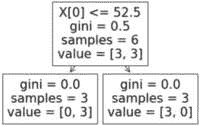

图 2.2 - 树分裂的可视化

一旦模型经过训练和测试，它就可以在文件系统中持久化或直接用于生产。

在上一个例子中，我们使用 Joblib 格式持久化了模型。

现在我们尝试使用 ONNX 格式持久化模型，以了解更多信息。

#### 使用 ONNX 格式持久化模型和执行模型

**ONNX**，即**开放神经网络交换**，是一个为机器学习和深度学习模型设计的开源格式。其目的是促进不同框架之间模型的互操作性。它通过提供一个可扩展的计算图模型并定义一组内置运算符和标准数据类型来实现这一点。

使用 ONNX，ML/DL 模型可以轻松转换为 ONNX 格式，允许使用 ONNX Runtime 无缝部署、导出、加载和执行。ONNX Runtime 是一个强大的工具，它可以在 CPU 或 GPU 上实现高性能的 ML 模型执行。重要的是，它不依赖于用于开发模型的特定训练框架的依赖项。通过利用 ONNX 和 ONNX Runtime，开发者可以确保他们的模型可以在各种框架之间移植，并且可以高效地执行。有关 ONNX 的更多详细信息，请参阅[`github.com/onnx/onnx`](https://github.com/onnx/onnx)。

#### 将 sklearn 样本模型转换为 ONNX 格式

将模型转换为 ONNX 格式需要`onnx`、`onnxruntime`和`skl2onnx`框架。以下是如何安装这些框架的方法：

```py
pip3 install onnx --user
pip3 install onnxruntime --user
pip3 install skl2onnx --user
```

框架安装完成后，执行以下代码将模型转换为 ONNX 格式（源代码位于`Model_Persistence_Load_ONNX_Format.ipynb`）：

```py
import numpy as np
from sklearn.linear_model import LinearRegression
from skl2onnx import convert_sklearn
from skl2onnx.common.data_types import FloatTensorType
initial_type = [('float_input', FloatTensorType([None, 2]))]
onx = convert_sklearn(clf, initial_types=initial_type)
with open("survive.onnx", "wb") as f:
    f.write(onx.SerializeToString())
```

在此情况下，要将使用`sklearn`开发的 ML 模型转换为 ONNX 格式，首先需要提供训练中使用的数据类型：

```py
initial_type = [(‘float_input’, FloatTensorType([None, 2]))]
```

然后，使用提供的方法将模型转换为 ONNX 格式，并指定在`sklearn`中使用的分类器。在我们的示例中，我们使用了决策树，并将模型命名为`clf`：

```py
onx = convert_sklearn(clf, initial_types=initial_type)
```

一旦模型转换为 ONNX 格式，将其存储在磁盘上，并命名模型文件（在我们的例子中，为`survive.onnx`）：

```py
with open(“survive.onnx”, “wb”) as f:
    f.write(onx.SerializeToString())
```

现在模型已存储为 ONNX 格式，并且可以在支持 ONNX Runtime 的任何框架上加载和执行。

#### 使用 ONNX 格式加载 ML 模型并执行模型

以下代码行展示了如何加载存储在 ONNX 格式的模型以及如何使用该模型进行推理。本代码使用 ONNX 版本 1.14.1（源代码位于`Model_Persistence_Load_ONNX_Format.ipynb`）：

```py
import onnxruntime as rt
import numpy as np
sess = rt.InferenceSession("survive.onnx")
input_name = sess.get_inputs()[0].name
# To test whether the patient will survive or not with 78 years age and doesn’t have prior cancer
X_test = np.array([[78.0, 0.0]])
pred_onx = sess.run(None, {input_name: X_test.astype(np.float32)})[0]
print(pred_onx)
Output: [0]
```

## 无监督机器学习

在无监督机器学习中，模型使用未标记的训练数据进行训练，这意味着没有提供目标标签或类别。相反，无监督机器学习模型专注于理解数据中的内在模式和结构。与监督学习不同，监督学习中的模型从标记的示例中学习，无监督机器学习模型在没有任何预定义的类别标签的情况下揭示数据中的隐藏模式和关系。这允许发现以前未知的见解和模式，这些模式可能并不明显。通过利用无监督机器学习技术，分析师和数据科学家可以从未标记的数据中获得有价值的见解，揭示隐藏的结构，并根据数据集中发现的内在模式做出数据驱动的决策。

#### 聚类

聚类是用于无监督机器学习的主要技术。它涉及根据数据点的内在特征将相似的数据点分组在一起。通过检查数据和识别相似性，无监督模型创建聚类，这些聚类代表了数据集中的不同组或模式。

聚类算法，如 k-means 聚类、层次聚类或基于密度的聚类，在无监督机器学习中常用于将数据组织成有意义的组。这些簇有助于数据探索、异常检测、客户细分和其他数据驱动任务。

#### 聚类示例

让我们考虑一个公司旨在为其员工提供运输服务，并希望根据他们的居住地对他们进行聚类的场景。为了实现这一点，公司可以利用一个聚类模型，该模型以每个员工居住地的经纬度坐标作为输入数据。机器学习模型将根据指定的簇大小对员工进行聚类，簇大小可以等于可用于运输的车辆数量。通过分析员工的地理位置空间数据，聚类模型将把居住地相近的个人分组。这种分组使公司能够有效地将车辆分配到每个簇。

一旦聚类模型训练并建立，它可以根据新员工的居住坐标预测他们适当的簇。这使得公司可以轻松地确定新员工应加入哪个簇，从而便于无缝的运输安排。

通过在这个场景中利用机器学习聚类技术，公司可以有效地组织其运输服务，并根据员工的居住地优化资源配置。

| **员工编号** | **纬度（****北纬）** | **经度（****东经）** |
| --- | --- | --- |
| 1 | 12.93 | 77.4472 |
| 2 | 12.32 | 77.4472 |
| 3 | 12.51 | 77.4472 |
| 4 | 12.62 | 77.4472 |
| 5 | 12.73 | 77.4472 |
| 6 | 12.84 | 76.4158 |
| 7 | 12.91 | 76.4158 |
| 8 | 12.41 | 76.4158 |
| 9 | 12.92 | 76.4158 |
| 10 | 12.55 | 76.4158 |

表 2.6 – 聚类示例的玩具数据集

`sklearn` 框架支持各种聚类算法，在本例中我们将使用 K-means 聚类算法对给定数据进行聚类。

K-means 算法是一种基于质心的算法，其中每个簇都与一个质心相关联。该算法的主要目的是最小化输入数据点与其对应簇之间的距离之和。

源代码位于 `Clustering_Example.ipynb`。

导入 `sklearn` K-means 聚类类，并将训练数据准备为 `numpy` 数组格式：

```py
from sklearn.cluster import KMeans
import numpy as np
from sklearn.cluster import KMeans
import numpy as np
X = np.array([
              [12.93,77.4472],
              [12.32,77.4472],
              [12.51,77.4472],
              [12.62,77.4472],
              [12.73,77.4472],
              [12.84,76.4158],
              [12.91,76.4158],
              [12.41,76.4158],
              [12.92,76.4158],
              [12.55,76.4158],
             ])
kmeans = KMeans(n_clusters=2, random_state=0).fit(X)
kmeans.labels_
array([1, 1, 1, 1, 1, 0, 0, 0, 0, 0], dtype=int32)
      kmeans.cluster_centers_
array([[12.726 , 76.4158],
       [12.622 , 77.4472]])
kmeans.predict([[12.88, 76.88]])
      array([0], dtype=int32
```

在这种情况下，前五个员工被分配到簇 `1`，其余的分配到簇 `0`：

| 员工编号 | 纬度（北纬） | 经度（东经） | 分配的簇 |
| --- | --- | --- | --- |
| 1 | 12.93 | 77.4472 | 1 |
| 2 | 12.32 | 77.4472 | 1 |
| 3 | 12.51 | 77.4472 | 1 |
| 4 | 12.62 | 77.4472 | 1 |
| 5 | 12.73 | 77.4472 | 1 |
| 6 | 12.84 | 76.4158 | 0 |
| 7 | 12.91 | 76.4158 | 0 |
| 8 | 12.41 | 76.4158 | 0 |
| 9 | 12.92 | 76.4158 | 0 |
| 10 | 12.55 | 76.4158 | 0 |

表 2.7 - 分配的簇

基于输入学习并形成的聚类模型分为两个簇。K-means 是一种聚类算法，它找到簇的中心，将数据划分为簇，并根据最近的簇预测新数据。

以下是由`sklearn`框架支持的聚类算法列表：

+   相似性传播

+   聚类

+   BIRCH

+   DBSCAN

+   K-means

+   Mini-batch K-means

+   均值漂移

+   OPTICS

+   谱聚类

+   高斯混合模型

## 强化机器学习

**强化学习**（**RL**）是一种机器学习技术，它使智能体能够通过尝试错误，利用自身行动和经验中的反馈在交互式环境中学习。智能体学习一系列导致最终目标的行动，最大化其总奖励。RL 与监督学习不同，因为模型是从采取行动和观察结果中学习，而不是从明确的教学中学习。

强化学习的一个经典用例是在游戏领域，例如教模型下棋并取得优异成绩。模型开始时对游戏一无所知，但通过移动和观察所玩游戏的结果来学习，目标是最大化奖励（即赢得游戏）。

在强化学习的背景下，探索和利用是智能体可以用来在环境中导航的两个策略：

+   **探索**：这是智能体试图了解更多关于其环境的时候。这意味着尝试不同的行动并收集更多信息，以了解每个可能行动的奖励。智能体的目标是平衡从已知信息中获得的奖励与从未知区域获得更高奖励的可能性。然而，探索可能涉及智能体做出非最优选择的风险。

+   **利用**：在这里，智能体使用它已经学习到的信息来采取最佳行动，以最大化其奖励。这意味着使用已知信息来最大化成功，而不是进一步探索。利用的好处是它允许获得更确定、即时的奖励，但过度利用可能导致次优结果，因为它可能忽略了更好的选项。挑战在于找到正确的平衡，因为过分关注探索可能意味着智能体会失去即时奖励，而过分关注利用可能阻止智能体探索可能导致未来更大奖励的选项。这种权衡通常被称为探索-利用困境。

### 使用 RL 的示例问题——多臂老虎机问题

多臂老虎机问题是强化学习领域的一个经典问题，它捕捉了探索与利用之间的基本权衡。这个名字来源于一个假设的实验，在这个实验中，你面对几个具有不同固定收益的老虎机（也称为“单臂老虎机”）。由于这些不同的收益，你的目标是通过对哪些机器进行游戏、每次玩多少次以及以何种顺序进行游戏来最大化在一定次数尝试中的总收益——因此，这就是“多臂老虎机问题”。

多臂老虎机问题的主要挑战在于平衡来自利用性动作（玩你认为当前具有最高预期收益率的机器）的即时奖励与来自探索（尝试其他可能具有更高预期收益但不太确定的机器）的潜在收益。这种探索与利用之间的紧张关系是许多强化学习问题的核心。

以下为强化学习的示例代码——源代码位于`BandIt_RL_Example.ipynb`中：

```py
import numpy as np
# This example will use a 4-armed bandit.
# Initialization
num_trials = 1000
bandit_probabilities = [0.1, 0.15, 0.3, 0.35]  # The probability of each bandit to give reward
reward_counts = np.zeros(4)
selected_bandit = 0
for i in range(num_trials):
    # Select a bandit
    selected_bandit = np.random.randint(0, 4)
    # Pull bandit’s arm
    random_num = np.random.random()
    if random_num <= bandit_probabilities[selected_bandit]:
         reward = 1
    else:
         reward = 0
    reward_counts[selected_bandit] += reward
print(“Most successful bandit:”, np.argmax(reward_counts))
Most successful bandit: 3
```

在本例中，使用了ε-贪婪策略，其中ε为`1`。

这是一个非常简单的例子，而现实世界的强化学习问题需要更复杂的算法（例如 Q 学习、策略梯度等），因此使用专门的库来实现。

在本节中，我们介绍了不同类型的机器学习，并提供了如何保存和加载模型以进行推理和预测的示例。接下来，下一节将深入探讨机器学习的各个阶段，提供详细的探索。

# 机器学习阶段概述

机器学习包含各种技术和方法，它涉及在开发和部署机器学习模型过程中的几个不同的阶段或阶段。这些阶段有助于指导工程师通过机器学习项目的迭代和循环性质，使他们能够构建有效且准确的模型。

机器学习过程通常包括几个关键阶段，每个阶段都服务于特定目的，并有助于项目的整体成功。这些阶段并不总是严格线性，它们之间可能发生迭代，以精炼和改进模型。具体步骤和术语的使用可能因采用的机器学习方法而异，但核心阶段保持一致。

机器学习阶段提供了一个系统框架，用于开发和部署机器学习模型，指导实践者通过构建有效解决方案固有的复杂性和挑战。通过遵循这些阶段，实践者可以最大化成功的机会，并创建能够在广泛应用中提供有价值和预测的机器学习模型。

## 机器学习的主要阶段

以下为机器学习的主要阶段：

+   **数据收集**：这个阶段涉及从各种来源收集相关数据，例如数据库、API 或手动收集。数据应代表问题域，并涵盖广泛的场景。

+   **数据准备**：在这个阶段，收集到的数据被预处理并转换为适合分析的形式。这可能包括诸如清理数据、处理缺失值、去除异常值以及归一化或缩放特征等任务。

+   **特征工程**：特征工程涉及从可用数据中选择和创建相关特征，这些特征将增强模型的预测能力。这个阶段需要领域知识和创造力，以从数据中提取有意义的见解。

+   **模型开发**：在这个阶段，根据手头的问题选择合适的机器学习算法或模型。模型在准备好的数据上训练，以学习数据中的模式和关系。

+   **模型评估**：使用适当的评估指标对训练好的模型进行评估，以评估其性能。这有助于了解模型在未见过的数据上的泛化能力以及它是否满足准确性和可靠性方面的预期标准。

+   **模型优化**：如果模型的性能不满意，这个阶段涉及通过调整超参数或尝试不同的算法来微调模型，以提高其性能。优化过程旨在实现最佳可能的结果。

+   **模型部署**：一旦模型经过训练和优化，它就被部署到生产环境中，可以在新的、未见过的数据上进行预测。这个阶段涉及将模型集成到现有系统中或为用户创建与模型交互的界面。

+   **模型监控和维护**：部署后，需要监控模型以确保其随着时间的推移继续表现良好。监控涉及跟踪性能指标、识别数据分布的漂移，并在必要时更新模型。定期维护对于保持模型最新和准确至关重要。

这些阶段提供了一个系统的方法来构建和部署机器学习模型，使组织能够利用数据的力量并做出明智的决策。

### 机器学习过程中的子阶段

下面的图显示了机器学习过程的阶段：

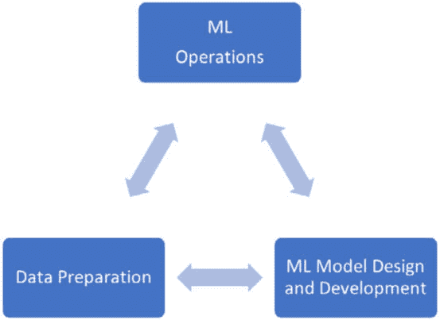

图 2.3 – 机器学习阶段

这些是主要阶段：

+   数据准备阶段

+   机器学习模型阶段（设计和开发）

+   机器学习操作阶段

让我们更详细地看看这些。

#### 数据准备阶段

数据准备阶段处理数据收集、提取和操作。

| **阶段** | **子阶段** | **细节** |
| --- | --- | --- |
| 数据准备 | 数据收集 | 确定需要分析的数据 |
| 数据提取 | 从数据源中提取数据 |
| 数据操作 | 数据转换、缺失数据、重复数据、噪声和数据预处理 |
| **探索性数据分析**（EDA） | EDA 和数据处理 |

表 2.8 - 数据准备阶段

下图展示了数据准备子阶段：

#### 数据准备阶段


图 2.4 – 机器学习数据准备子阶段

#### 机器学习模型阶段

此阶段被细分为几个阶段，以处理特征工程、实际模型识别、模型的训练和测试等。

| **阶段** | **子阶段** | **详细信息** |
| --- | --- | --- |
| 机器学习模型 | 模型识别 | 这涉及到分类、聚类、强化学习、时间序列分析等。 |
| 特征工程 | 在此阶段，从数据中选择特征。 |
| 为模型准备输入数据 | 这涉及到以模型期望的格式处理和准备的数据。 |
| 分割数据（训练、测试和验证） | 将整个数据分割成三个部分——训练数据、测试数据和验证数据，以训练、测试和验证模型。 |
| 使用训练数据集训练模型 | 在此阶段，模型使用训练数据进行训练。 |
| 使用测试数据集测试模型 | 使用测试数据测试机器学习模型，以找出预测的准确性。 |
| 数据、模型、模型参数和结果版本 | 对使用的数据集、模型及其参数以及每个实验的结果应用版本控制。 |
| 使用训练模型验证数据集 | 这类似于测试数据，但样本来自验证数据集。 |
| 使用新数据预测结果（推理） | 对于推理，使用新数据并找出结果。 |

表 2.9 - 机器学习模型阶段

下图展示了机器学习模型子阶段：

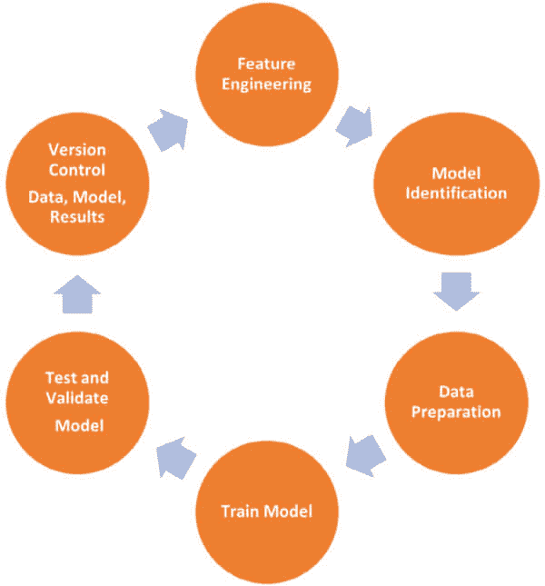

图 2.5 – 机器学习模型子阶段

#### 机器学习操作阶段

此阶段主要关注生产中模型的操作。

| 阶段 | 子阶段 | 详细信息 |
| --- | --- | --- |
| 机器学习操作（MLOps） | 打包模型工件 | 将模型（存储权重和偏差）持久化存储为 ONNX 格式或其他格式。 |
| 部署模型 | 这涉及到模型的实际生产部署。（A/B 测试、金丝雀部署、影子模型等） |
| 验证推理结果 |  |
| 监控模型性能 | 监控模型性能，即准确性是否在一段时间内保持不变或下降。 |
| 重新训练模型并重复机器学习模型生命周期 | 如果模型性能下降，则重新训练模型，并相应地处理模型漂移和数据漂移。 |

表 2.10 - 机器学习操作

下图展示了机器学习操作子阶段：

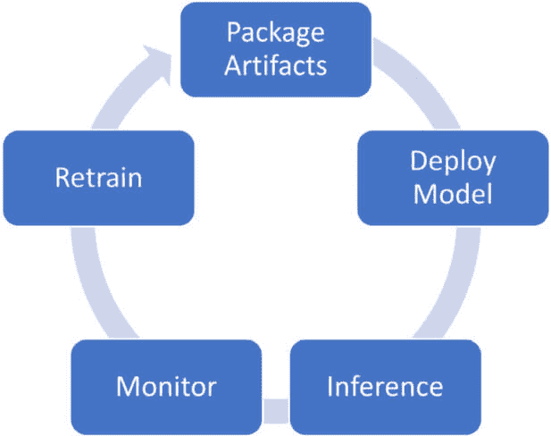

图 2.6 – 机器学习操作子阶段

我们已经详细介绍了机器学习模型的发展以及该过程中涉及的各种阶段。在接下来的部分，我们的重点将转向探索机器学习每个阶段可能发生的隐私威胁和攻击。我们将深入了解这些威胁，并讨论有效的缓解策略，以保护数据和模型涉及的隐私。通过在每个阶段解决这些隐私问题，我们可以确保机器学习技术的负责任和安全实施。

# 机器学习阶段中的隐私威胁/攻击

机器学习项目是由数据工程师、机器学习工程师和软件工程师协作开发的，每个角色都在开发端到端系统以预测和提供见解中扮演不同的角色。

## 机器学习项目中的协作角色

机器学习项目是涉及各种角色如数据工程师、机器学习工程师和软件工程师的协作努力。每个角色以不同的方式为开发端到端系统做出贡献，这些系统能够预测结果并提供有价值的见解。让我们来探讨在机器学习项目生命周期中各个角色的职责：

+   **数据工程师**：数据工程师主要关注数据准备阶段。他们负责从一个或多个来源提取数据，并确保其质量适合机器学习项目。数据工程师从事数据清洗、转换和特征选择等任务，以准备数据用于机器学习建模。

+   **机器学习工程师**：机器学习工程师在设计和开发机器学习模型中扮演着至关重要的角色。他们利用数据工程师提供的数据来训练和测试模型。机器学习工程师负责选择合适的算法或模型架构，调整超参数，并优化模型以提高准确性和效率。他们使用验证测试数据验证模型，并提供推理或模型导出/部署到生产环境的 API。

+   **模型消费者**：模型消费者可以是个人或另一个与机器学习模型交互的应用程序。他们通过 API 调用向模型提供输入以进行预测或推理。模型消费者利用机器学习模型生成的见解做出明智的决策或采取适当的行动。

## 机器学习中的隐私威胁/攻击

在机器学习的背景下，对手指的是一个试图积极破坏或利用机器学习模型或系统的实体或系统。对手的目标通常是操纵模型的行为，未经授权访问敏感信息，或者通过利用漏洞欺骗系统。

对手可以采取各种形式，具有不同的动机。

这里有一些例子：

+   **对抗样本**：在这种情况下，攻击者的目标是创建旨在误导或欺骗 ML 模型的输入样本（例如，图像或文本）。对抗样本旨在利用模型决策过程中的漏洞，导致错误预测或误分类。

+   **数据中毒**：攻击者可能会尝试将恶意或误导性数据注入训练数据集中。通过插入精心制作的样本，攻击者旨在操纵模型的训练过程，导致结果偏差或受损。这在从不可信或不可靠来源收集训练数据的情况下尤其成问题。

+   **模型反演**：攻击者可能会尝试从训练好的模型中提取敏感信息。通过提供特定输入并观察模型的输出，攻击者旨在推断用于训练模型的机密或私人数据，例如**个人身份信息**（**PII**）或专有知识。

+   **逃避攻击**：攻击者也可以在部署阶段发起逃避攻击，也称为对抗攻击。在这些攻击中，攻击者通过仔细修改输入样本来尝试绕过或操纵模型的防御机制。例如，在垃圾邮件分类器的情况下，攻击者可能会添加特定的模式或关键词来欺骗模型，将其分类为合法的恶意邮件。

为了减轻攻击者的影响，研究人员和从业者开发了鲁棒的 ML 模型和技术，例如对抗训练、防御蒸馏和输入净化。这些方法旨在增强 ML 系统对对抗攻击的弹性，并在潜在威胁存在的情况下保持其性能和可靠性。

在整个 ML 生命周期中，隐私威胁或攻击都可能发生，对敏感信息的机密性构成风险。在 ML 的背景下，攻击者试图未经授权访问用于 ML 的机密数据、核心 ML 模型或数据的特定特征。

有两种主要的攻击类型，白盒和黑盒：

+   **白盒攻击**：白盒攻击假设攻击者对 ML 模型有全面的知识和访问权限，包括其架构、输入、输出和权重。攻击者利用这些信息来提取机密细节。

+   **黑盒攻击**：相比之下，黑盒攻击假设攻击者只能访问 ML 模型的输入和输出。他们对底层架构或 ML/DL 模型中使用的权重一无所知。尽管信息有限，但他们旨在从模型中推断敏感信息。

### 隐私威胁/攻击分类：

以下是对分类机器学习模型的隐私攻击

+   **成员推理攻击**：这种攻击旨在确定特定数据点是否是用于训练机器学习模型的训练数据集的一部分。攻击者试图通过利用模型的响应来推断成员信息。

+   **模型提取攻击**：在这种攻击中，攻击者试图提取整个或部分机器学习模型架构、权重或参数。这种攻击允许攻击者复制机器学习模型以供自己使用，可能导致知识产权盗窃。

+   **重建攻击**：这种攻击专注于从机器学习模型的输出中重建敏感信息。攻击者的目标是推断出用于生成模型预测的私有数据或特定特征。通过理解和应对这些隐私威胁，机器学习从业者可以采取适当的措施来保护敏感数据，并确保机器学习模型在其整个生命周期中的安全性。

我们将在接下来的章节中更详细地探讨这些问题。

## 成员推理攻击

假设开发了一个分类模型，使用某些输入训练数据 X {x1, x2, x3, …. Xn}，通过函数 F 预测某些标签 y。

成员推理攻击试图确定输入样本 x 是否是训练数据集 X 的一部分。基本上，攻击者（攻击者）需要找出当前数据点是否属于用于训练机器学习模型的原始数据集。

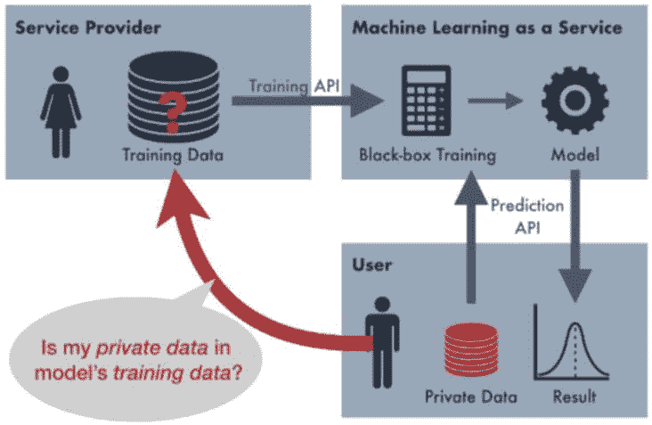

图 2.7 – 成员推理攻击 - 示例

（图片来源：Suha Hussain，PrivacyRaven，[`blog.openmined.org/privacyraven-comprehensive-privacy-testing-for-deep-learning/`](https://blog.openmined.org/privacyraven-comprehensive-privacy-testing-for-deep-learning/))

让我们来看一个例子。假设一个攻击者想要确定某个特定人的数据是否被用于训练数据中，而不需要知道这个人。后来，这些数据被用来推断是否批准该人的保险政策。

这是攻击中最受欢迎的类别，最初由 Shokri 等人提出。

这里是完整论文的引用：*Reza Shokri, Marco Stronati, Congzheng Song, and Vitaly Shmatikov. 2017\. Membership inference attacks against machine learning models. In 2017 IEEE Symposium on Security and Privacy (SP). IEEE, San Francisco, CA,* *USA, 3–18.*

这是一种黑盒测试攻击，因为攻击者没有实际机器学习模型的详细信息；他们所拥有的只是输入数据集和模型推断结果。

论文关于这种方法是这样说的：

“攻击者用一个数据记录查询目标模型，并获取该模型对该记录的预测。预测是一个向量，每个类别一个概率，表示记录属于某个类别的概率。这个预测向量，连同目标记录的标签一起，被传递给攻击模型，该模型确定记录是否在目标模型的训练数据集中。”

下一个图也来自上述论文（[`arxiv.org/pdf/1610.05820.pdf`](https://arxiv.org/pdf/1610.05820.pdf)）：

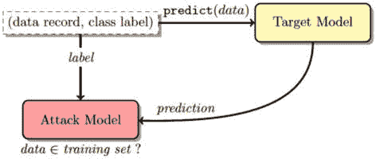

图 2.8 – 成员推理攻击 - 示例

### 成员推理攻击—基本示例

在成员推理攻击中，攻击者试图确定特定数据点是否被用于机器学习模型的训练集中，如前所述。

这里是一个使用简单的决策树分类器的例子（源代码可以在`Membership_Inference_basic_example.ipynb`中找到）：

```py
from sklearn import datasets
from sklearn.model_selection import train_test_split
from sklearn.tree import DecisionTreeClassifier
# Load the dataset (e.g., Iris dataset)
iris = datasets.load_iris()
X = iris.data
y = iris.target
# Split the data into training and test sets
X_train, X_test, y_train, y_test = train_test_split(X, y, test_size=0.5, random_state=42)
# Train a decision tree classifier on the training set
clf = DecisionTreeClassifier()
clf.fit(X_train, y_train)
for i in range (0,75):
    # Select a data point from the test set
    target_data = X_test[i]
    #Determine if the target data point was in the training set
    predicted_class = clf.predict([target_data])
    is_in_training_set = predicted_class == y_test[i]
    # Print the result
    if is_in_training_set:
        print(target_data, "Membership Inference Attack successful! Target data point was in the training set.")
    else:
        print( target_data, "Membership Inference Attack unsuccessful. Target data point was not in the training set.")
Output:
[6.9 3.1 5.1 2.3] Membership Inference Attack successful! Target data point was in the training set.
[6.2 2.2 4.5 1.5] Membership Inference Attack unsuccessful. Target data point was not in the training set.
```

在这个例子中，我们从 scikit-learn 中加载了`Iris`数据集，并将其分为训练集和测试集。然后我们在训练集上训练一个决策树分类器。接下来，我们从测试集中选择一个数据点（或一组数据点），并通过预测其类别来尝试确定它是否存在于训练集中。如果预测的类别与测试集中的实际类别相匹配，我们推断目标数据点在训练集中，这表明攻击成功。记住，未经适当授权进行成员推理攻击是不道德的，通常是非法的。

### 成员推理攻击—高级示例

让我们考虑一个场景，其中攻击者试图确定特定个人的数据是否存在于训练数据中，而对该个人没有任何先前的了解。这个场景涉及发现一个人的名字是否存在于医院的敏感临床数据中。攻击者打算利用这些信息来做出决策，例如根据从训练数据中获得的认识来授予或拒绝保险政策。

为了说明这种情况，让我们使用一个类似我们之前讨论的分类示例的样本数据集（仅用于说明目的）。该数据集侧重于根据年龄和现有疾病等因素预测患者是否能在未来 5 到 10 年内生存。

在这种情况下，攻击者的目标是确定与特定人员相关的数据（他们不知道该人员的身份）是否存在于训练数据中。通过发现这些信息，攻击者可以基于从训练数据中获得的认识来操纵与保险政策相关的决策。

需要注意的是，此示例旨在突出潜在的隐私威胁，并不旨在验证其准确性或实际应用性。目标是提高人们对保护敏感数据以及实施强大的隐私措施以防止未经授权的访问和滥用的认识。

| 年龄（年） | 是否患有癌症（1 = 是，0 = 否） | 是否存活（1 = 是，0 = 否） |
| --- | --- | --- |
| 10 | 1 | 1 |
| 20 | 1 | 1 |
| 30 | 1 | 1 |
| 80 | 1 | 0 |
| 75 | 0 | 0 |
| 78 | 0 | 0 |

表 2.11 - 训练数据

该机器学习模型的源代码可在 `Membership_Inference_advanced_example.ipynb` 中找到：

```py
from sklearn import tree
X = [[10,1],[20,1],[30,1],[80,1],[75,0],[78,0]]
Y = [1,1,1,0,0,0]
clf = tree.DecisionTreeClassifier()
clf = clf.fit(X, Y)
clf.predict([[35,1]])
```

#### 样本测试数据的推理结果

攻击者创建具有不同输入的合成测试数据以评估模型性能。他们的目标是确定给定的患者数据是否存在于训练数据集中，使用模型预测：

```py
testY=[
       [25,1],[25,0],[30,1],[30,0],[45,0],[45,1],
       [50,1],[50,0],[60,1],[60,0],[75,0],[75,1],
       [80,1],[80,0],[90,1],[90,0],[100,0],[100,1],
       [10,1],[20,1],[30,1],[78,0]
      ]
clf.predict(testY)
array([1, 1, 1, 1, 1, 1, 1, 1, 0, 0, 0, 0, 0, 0, 0, 0, 0, 0, 1, 1, 1, 0])
clf.predict_proba(testY)
array([[0., 1.],
       [0., 1.],
       [0., 1.],
       [0., 1.],
       [0., 1.],
       [0., 1.],
       [0., 1.],
       [0., 1.],
       [1., 0.],
       [1., 0.],
       [1., 0.],
       [1., 0.],
       [1., 0.],
       [1., 0.],
       [1., 0.],
       [1., 0.],
       [1., 0.],
       [1., 0.],
       [0., 1.],
       [0., 1.],
       [0., 1.],
       [1., 0.]])
```

结果以表格形式呈现；1 表示该人患有癌症，预测概率列显示预测概率的百分比：

| 年龄 | 癌症 | 预测类别 | 预测概率 |
| --- | --- | --- | --- |
| 25 | 1 | 1 | 100 |
| 25 | 0 | 1 | 100 |
| 30 | 1 | 1 | 100 |
| 30 | 0 | 1 | 100 |
| 45 | 1 | 1 | 100 |
| 45 | 0 | 1 | 100 |
| 50 | 1 | 1 | 100 |
| 50 | 0 | 1 | 100 |
| 60 | 1 | 0 | 0 |
| 60 | 0 | 0 | 0 |
| 75 | 1 | 0 | 0 |
| 75 | 0 | 0 | 0 |
| 80 | 1 | 0 | 0 |
| 80 | 0 | 0 | 0 |
| 90 | 1 | 0 | 0 |
| 90 | 0 | 0 | 0 |
| 100 | 1 | 0 | 0 |
| 100 | 0 | 0 | 0 |
| 10 | 1 | 0 | 100 |
| 20 | 1 | 0 | 100 |
| 30 | 1 | 0 | 100 |
| 78 | 0 | 1 | 0 |

表 2.12 - 预测概率

接下来，攻击者开始开发影子模型和最终的攻击模型。这些模型旨在预测给定的数据记录是否用于训练数据集。通过利用每个记录及其预测类别，以及相应的预测概率，攻击者推断该数据记录是否是训练集的一部分。

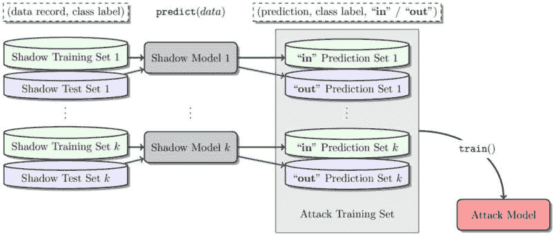

图 2.9 – 影子模型

前面的图表来源于论文[`arxiv.org/pdf/1610.05820.pdf`](https://arxiv.org/pdf/1610.05820.pdf)。

攻击模型使用类别标签 'In' 表示用于训练的给定输入记录，而 'out' 表示它没有被使用。

这是最终攻击模型的训练数据：

| 年龄 | 癌症 | 预测类别 | 预测概率 | 训练集中使用的记录（in = 1，out = 0） |
| --- | --- | --- | --- | --- |
| 25 | 1 | 1 | 100 | 1 |
| 25 | 0 | 1 | 100 | 1 |
| 30 | 1 | 1 | 100 | 1 |
| 30 | 0 | 1 | 100 | 1 |
| 45 | 1 | 1 | 100 | 1 |
| 45 | 0 | 1 | 100 | 1 |
| 50 | 1 | 1 | 100 | 1 |
| 50 | 0 | 1 | 100 | 1 |
| 10 | 1 | 0 | 100 | 1 |
| 20 | 1 | 0 | 100 | 1 |
| 30 | 1 | 0 | 100 | 1 |
| 60 | 1 | 0 | 0 | 0 |
| 60 | 0 | 0 | 0 | 0 |
| 75 | 1 | 0 | 0 | 0 |
| 75 | 0 | 0 | 0 | 0 |
| 80 | 1 | 0 | 0 | 0 |
| 80 | 0 | 0 | 0 | 0 |
| 90 | 1 | 0 | 0 | 0 |
| 90 | 0 | 0 | 0 | 0 |
| 100 | 1 | 0 | 0 | 0 |
| 100 | 0 | 0 | 0 | 0 |
| 78 | 0 | 1 | 0 | 0 |

表 2.13 - 最终攻击模型的训练数据

成员推理攻击可以在简单的线性模型中轻松执行，并且准确性非常高，如前例所示。托管在云中的机器学习模型容易受到此类推理攻击，因为研究人员已经成功演示了准确率超过 90%的成员攻击模型。

#### 减轻成员推理攻击的技术

在涉及敏感数据的机器学习模型中，成员推理攻击可能是一个问题。

以下是一些减轻成员推理攻击的技术：

+   **限制对敏感信息的访问**：减轻成员推理攻击的一种简单方法就是限制对敏感信息的访问。通过最小化暴露的敏感数据量，可以减少攻击者执行成员推理的可能性。

+   **差分隐私**：差分隐私是一种向训练数据或模型输出添加噪声的技术，使得攻击者更难确定特定记录是否是训练集的一部分。应用差分隐私机制可以帮助抵御成员推理攻击。我们将在下一章学习差分隐私。

+   **训练集增强**：通过向训练集添加额外的合成或生成数据，可以使得攻击者更难区分真实训练实例和潜在成员。数据生成、扰动或添加噪声等增强技术可以帮助提高训练集的隐私性。

+   **正则化和 dropout**：应用 L1 或 L2 正则化技术，并在神经网络中引入 dropout 层可以提高模型的鲁棒性并减少过拟合。正则化有助于减少训练实例的记忆，使得攻击者更难推断成员身份。

+   **模型压缩**：在共享模型或进行预测时，考虑使用模型压缩技术以减少关于训练数据的泄露信息量。例如，量化、剪枝或知识蒸馏等技术可以帮助降低模型对训练集的敏感性。

+   **集成方法**：通过训练具有不同架构或使用不同算法的多个模型，可以使得攻击者更难执行准确的成员推理。集成方法使得攻击者更难学习训练数据中的特定模式。

+   **安全聚合**：如果模型是在分布式环境中训练的，可以使用安全聚合协议来确保不同各方贡献的个体信息得到保护，并且成员信息不会被泄露。

+   **随机响应**：在推理过程中，可以使用随机响应技术向模型输出引入噪声，使攻击者更难确定成员资格状态。随机响应机制确保了个人记录的可信否认性。

+   **访问控制和授权**：实施访问控制措施和强大的授权机制可以帮助限制对敏感模型和数据的访问，减少潜在攻击者的暴露。

+   **模型监控**：持续监控模型的行为，以检测任何异常模式或意外的输出，有助于检测潜在的成员推断攻击。监控可能涉及异常检测、对抗鲁棒性检查或模型输出的统计分析等技术。

重要的是要注意，没有单一的技术可以提供对成员推断攻击的完全保护。通常需要结合多种技术和对隐私和安全的全面方法来有效地减轻这些攻击。

## 模型提取攻击

模型提取攻击是一种黑盒攻击，其中攻击者通过创建一个替代模型（表示为 *𝑓*’），该模型紧密模拟被针对的原始模型（表示为 *𝑓*）的行为，旨在提取信息，并可能重新创建模型。

让我们考虑一个场景，即我们开发了一个专门用于预测给定帖子/推文是否与灾难相关的机器学习模型。我们向消费者提供 API，使他们能够访问这些预测功能，并对每个 API 请求收费。

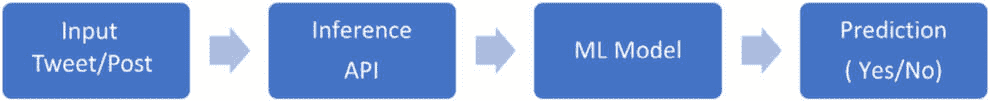

图 2.10 - 保护机器学习模型完整性

对手利用提供的 API，系统地提交数千条输入推文以获取相应的预测。随后，对手继续构建一个新的机器学习模型，这些推文是通过查询原始作者暴露的 API 获得的。从 API 获得的预测结果作为新模型的类别标签，指示推文是否被分类为与灾难相关。

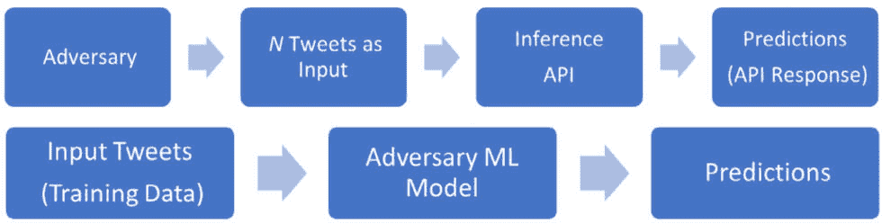

图 2.11 – 模型提取攻击—对手的机器学习模型

在某些情况下，对手开发的机器学习模型可能比原始作者的机器学习模型具有更高的准确性。因此，这可能会严重影响原始作者公司的收入。对手可能通过公开类似的推理 API，收取比原始作者低得多的费用，并可能涉及知识产权的盗窃。此外，模型提取攻击使对手能够访问与机器学习模型相关的私人信息，进一步加剧了可能造成的损害。

#### 模型提取攻击的示例

本例的源代码可以在`Model` `Extraction_Attack Example.ipynb`中找到。

在本例中，我们首先创建一个包含两个特征(*X*)及其对应标签(*y*)的样本数据集。随后，我们使用 scikit-learn 的`LogisticRegression`类在这个数据集上训练逻辑回归模型。

攻击者的代码旨在通过在相同的数据集上训练一个新的`LogisticRegression`模型(`extracted_model`)来执行模型提取攻击。攻击者的目标是复制原始模型的行为，而不直接访问其内部工作原理。

一旦提取的模型成功生成，它可以被用于未经授权的目的，例如在新数据(`new_data`)上做出预测，而无需访问原始模型。这种未经授权的使用引发了关于原始模型功能安全和完整性的担忧。

以下是为模型提取攻击编写的源代码(`Model` `Extraction_Attack Example.ipynb`)：

```py
import numpy as np
from sklearn.linear_model import LogisticRegression
# Create a sample dataset for demonstration
X = np.array([[1, 1], [2, 2], [3, 3], [4, 4], [5, 5]])
y = np.array([0, 0, 0, 1, 1])
# Train a simple logistic regression model on the dataset
model = LogisticRegression()
model.fit(X, y)
# Attacker's code to perform model extraction attack
extracted_model = LogisticRegression()
extracted_model.fit(X, y)
# Extracted model can be further used for unauthorized purposes
# such as making predictions on new data without access to the original model
new_data = np.array([[6, 6], [7, 7]])
predictions = extracted_model.predict(new_data)
print(predictions)
[1 1]
```

#### 减缓模型提取攻击的技术

缓解模型提取攻击，即对手试图提取底层模型的架构、参数或功能，对于保护知识产权和维护敏感模型的安全至关重要。

减缓模型提取攻击的一些技术如下：

+   **模型水印**: 将一个独特的水印嵌入模型的参数或架构中，可以帮助识别模型的来源并阻止未经授权的提取。水印技术可以设计成对移除尝试或修改具有抵抗力，同时在正常模型操作中保持不可察觉。

+   **模型混淆**: 对模型的代码或架构应用混淆技术可以使攻击者更难理解模型的内部工作原理。混淆可能涉及代码混淆、函数重命名、控制流多样化或加密等技术，以保护模型的实现细节。

+   **安全模型共享**: 当与授权用户或合作者共享模型时，重要的是要采用安全的共享机制。这可能包括在传输和静止状态下的加密、强大的访问控制措施以及安全的身份验证和授权协议，以防止对模型的未经授权访问。

+   **模型压缩**: 使用量化、剪枝或知识蒸馏等模型压缩技术可以使模型更加紧凑，并减少可以提取的信息量。压缩模型通常具有更少的参数和结构细节，这使得它们对模型提取攻击更具抵抗力。

+   **细粒度访问控制**：实施细粒度访问控制机制可以限制敏感模型的暴露。这可能包括根据用户角色和权限仅提供对模型必要组件或功能的访问。

+   **安全执行环境**：在安全的执行环境中运行模型可以帮助防止提取攻击。例如，安全区域（如英特尔 SGX 或 AMD SEV）、**可信执行环境**（**TEEs**）和**安全多方计算**（**MPC**）等技术可以为执行模型提供隔离和完整性保证，防止未经授权访问模型的内部信息。我们将在*第九章*中了解更多关于 TEE 的内容。

+   **模型元数据保护**：保护与模型相关的元数据，如训练数据、超参数或训练过程细节，可以使攻击者更难提取有关模型的有意义信息。例如，差分隐私或数据扰动等技术可以帮助在模型元数据中保持隐私。

+   **监控异常模型使用**：实施模型监控和异常检测机制可以帮助识别可疑活动，如重复查询或过度模型交互，这可能表明未经授权的提取尝试。当检测到潜在攻击时，监控可以触发警报或启动防御行动。

+   **法律和许可措施**：实施法律保护，如版权、专利或许可协议，可以提供额外的法律救济并阻止未经授权的模型提取和使用。

正如我们讨论的成员推理攻击，需要注意的是，没有单一的技术可以提供对模型提取攻击的完全保护；通常需要多种技术的组合。缓解技术的选择取决于具体的威胁模型、模型敏感性以及所需的保护水平。

我们已经了解了针对机器学习模型的成员推理攻击和模型提取攻击。现在让我们探索机器学习模型的第三种隐私攻击：重建攻击。

## 重建攻击——模型反转攻击

重建攻击试图重建一个或多个训练数据实例及其相应的类标签。重建可能是部分或完整的，这取决于原始模型的力量。一次完全成功的攻击可以生成更真实的训练数据和各种样本，以匹配精确的类标签预测。

模型反转或属性推理都是重建攻击的一种。它们属于黑盒攻击类别，因为攻击者不需要了解模型结构的细节或内部工作原理。他们只需要根据一些输入数据访问模型的输出。利用这一点，他们可以推断出用于训练模型的数据的详细信息。

#### 创建模型反转攻击的逐步示例

在本例中，我们首先创建一个包含两个输入特征（`X`）和二进制标签（`y`）的简单数据集。我们使用此数据集训练一个逻辑回归模型。`model_inversion_attack` 函数试图通过找到产生所需输出概率的输入来反转模型。

请注意，这是一个基本示例，用于说明模型反转攻击的概念。在实际场景中，模型反转攻击可能更加复杂，需要更高级的技术来处理更大和更复杂的模型。

完整的源代码可以在 `Model_Inversion_LR_Sample.ipynb` 中找到：

```py
from sklearn.linear_model import LogisticRegression
import numpy as np
# Create a sample dataset
X = np.array([[1, 2], [3, 4], [5, 6], [7, 8]])  # Input features
y = np.array([0, 0, 1, 1])  # Corresponding labels
# Train a logistic regression model on the dataset
model = LogisticRegression()
model.fit(X, y)
# Function to perform model inversion attack
def model_inversion_attack(model, output):
    # Generate a random input within a certain range
    input_range = np.arange(0, 10, 0.01)
    best_input = None
    best_loss = float('inf')
    # Find the input that minimizes the loss function
    for i in input_range:
        input_guess = np.array([[i, i]])
        predicted_output = model.predict_proba(input_guess)
        loss = abs(predicted_output[0][1] - output)
if loss < best_loss:
            best_input = input_guess
            best_loss = loss

    return best_input
# Perform model inversion attack on a specific output
target_output = 0.8
inverted_input = model_inversion_attack(model, target_output)
print("Inverted Input:", inverted_input)
target_output = 1
inverted_input = model_inversion_attack(model, target_output)
print("Inverted Input:", inverted_input)
target_output = 0.5
inverted_input = model_inversion_attack(model, target_output)
print("Inverted Input:", inverted_input)
target_output = 0
inverted_input = model_inversion_attack(model, target_output)
print("Inverted Input:", inverted_input)
Inverted Input: [[5.64 5.64]]
Inverted Input: [[9.99 9.99]]
Inverted Input: [[4.5 4.5]]
Inverted Input: [[0\. 0.]]
```

让我们探索一个更复杂的例子来理解模型反转攻击。

## 神经网络中的模型反转攻击

神经网络是一类受人类大脑结构和功能启发的机器学习模型。它们被设计用来识别数据中的复杂模式和关系。神经网络由相互连接的人工神经元层组成，称为节点或单元，共同形成一个网络。

每个神经元接收输入信号，对它们应用数学运算，并产生输出信号。这些信号通过网络传递，神经元之间的连接权重决定了信号的强度。神经网络通过称为反向传播的过程进行训练，该过程根据预测输出和实际输出之间的误差调整权重。

神经网络的隐藏层使其能够学习并表示数据中的复杂非线性关系，使其能够解决高度复杂的问题，如图像和语音识别、自然语言处理，甚至玩游戏。流行的神经网络架构包括前馈神经网络、**卷积神经网络**（**CNNs**）和**循环神经网络**（**RNNs**）。

神经网络在各个领域取得了显著的成功，在许多领域展示了最先进的性能。它们已成为机器学习的一个基本工具，并通过实现复杂的决策和模式识别能力，继续推动人工智能的边界。

我们不会深入探讨神经网络的复杂性，因为这超出了本书的范围。

在本例中，我们将演示攻击者如何利用神经网络模型的输出生成输入数据。攻击者的目标是利用模型行为的特征，重建导致特定输出预测的原始输入。通过逆向工程模型输出与相应输入数据之间的关系，攻击者可以深入了解用于训练模型的原始数据点。

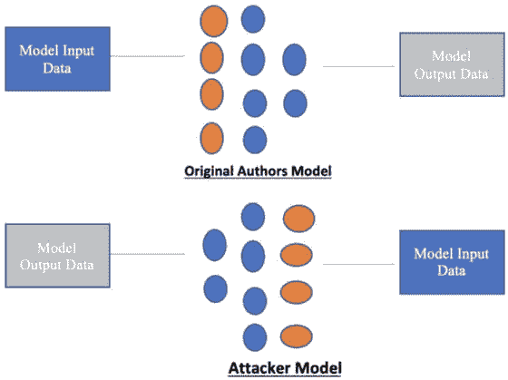

图 2.12 – 原作者和对手的神经网络模型

#### 输入数据

在这个例子中，我们使用 **Modified National Institute of Standards and Technology** （**MNIST**）数据集来训练一个神经网络模型。MNIST 数据集包含 60,000 张 0 到 9 之间的手写单数字的灰度图像。每张图像都是一个 28 x 28 像素的小正方形。

#### 原作者模型

```py
mnist_data.pkl. We open the file in binary read mode and load the dataset using the pickle.load() function. The dataset is then split into the training and test sets, with the corresponding labels.
```

注意

从 Github ([`github.com/pytorch/tutorials/blob/main/_static/mnist.pkl.gz`](https://github.com/pytorch/tutorials/blob/main/_static/mnist.pkl.gz)) 下载数据集并将其保存在 **data/mnist** 目录中。

完整的源代码可以在 `Model_Inversion_Attack_Example.ipynb` 中找到。这里我们使用 PyTorch 版本 1.13.1：

```py
from pathlib import Path
import requests
import pickle
import gzip
DATA_PATH = Path(“data”)
PATH = DATA_PATH / “mnist”
PATH.mkdir(parents=True, exist_ok=True)
# 10.195.33.40 - Github
URL = "https://10.195.33.40/pytorch/tutorials/raw/main/_static/"
FILENAME = “mnist.pkl.gz”
with gzip.open((PATH / FILENAME).as_posix(), “rb”) as f:
((x_train, y_train), (x_valid, y_valid), _) = pickle.load(f, encoding=”latin-1”)
```

加载数据后，您可以使用 Matplotlib 库可视化一个样本图像并获取其形状。以下是代码片段：

```py
from matplotlib import pyplot
import numpy as np
pyplot.imshow(x_train[0].reshape((28, 28)), cmap=”gray”)
print(x_train.shape, y_train[0])
```

这将产生以下输出：


`(50000, 784) 5`

现在，将训练样本转换为张量格式，以便在神经网络模型中作为输入使用：

```py
import torch
x_train, y_train, x_valid, y_valid = map(
    torch.tensor, (x_train, y_train, x_valid, y_valid)
)
n, c = x_train.shape
print(x_train, y_train)
print(x_train.shape)
print(y_train.min(), y_train.max())
tensor([[0., 0., 0.,  ..., 0., 0., 0.],
        [0., 0., 0.,  ..., 0., 0., 0.],
        [0., 0., 0.,  ..., 0., 0., 0.],
        ...,
        [0., 0., 0.,  ..., 0., 0., 0.],
        [0., 0., 0.,  ..., 0., 0., 0.],
        [0., 0., 0.,  ..., 0., 0., 0.]])
tensor([5, 0, 4,  ..., 8, 4, 8])
print(x_train.shape)
torch.Size([50000, 784])
print(y_train.min(), y_train.max())
tensor(0) tensor(9)
```

让我们使用作为激活函数的 **rectified linear unit** （**ReLU**）构建一个简单的顺序神经网络模型：

```py
from torch import nn, optim
class AuthorsNN(nn.Module):
  def __init__(self):
    super().__init__()
    self.first_sec = nn.Sequential(
                           nn.Linear(784, 450),
                           nn.ReLU(),
                         )
    self.second_sec = nn.Sequential(
                           nn.Linear(450, 450),
                           nn.ReLU(),
                           nn.Linear(450, 10),
                           nn.Softmax(dim=-1),
                         )
  def forward(self, x):
    return self.second_sec(self.first_sec(x))
```

`AuthorsNN` 类扩展了 PyTorch 的 `nn.Module` 类。此类代表一个用于分类任务的神经网络模型。以下是前面代码及其功能的分解：

+   **The AuthorsNN 类**：此类代表作者（们）设计的神经网络模型。它继承自 PyTorch 中所有神经网络模块的基类 **nn.Module**。

+   **__init__ 方法**：此方法是 **AuthorsNN** 类的构造函数，在创建类的实例时被调用。在此方法内部，定义了模型的架构：

    +   **self.first_sec** 是一个由两个层组成的顺序模块：

        +   **nn.Linear(784, 450)** 代表一个具有 784 个输入特征和 450 个输出特征的线性层。

        +   **nn.ReLU()** 应用 ReLU 激活函数以引入非线性。

    +   **self.second_sec** 是另一个由三个层组成的顺序模块：

        +   **nn.Linear(450, 450)** 代表一个具有 450 个输入特征和 450 个输出特征的线性层。

        +   **nn.ReLU()** 应用 ReLU 激活函数。

        +   **nn.Linear(450, 10)** 代表一个具有 450 个输入特征和 10 个输出特征的线性层，对应于类别的数量。

        +   **nn.Softmax(dim=-1)** 将原始输出分数应用 softmax 激活函数转换为概率，确保它们在各个类别中总和为 **1**。

+   **前向方法**：此方法定义了模型的前向传递，指定输入数据如何通过网络。输入 **x** 通过 **self.first_sec**，然后是 **self.second_sec**，最终返回输出结果。

以下代码创建了一个名为`auth_nn`的`AuthorsNN`类实例。此实例代表初始化的神经网络模型：

```py
auth_nn = AuthorsNN()
auth_nn
```

打印`auth_nn`将显示有关模型的信息，例如其架构和可训练参数的数量：

```py
AuthorsNN(
  (first_sec): Sequential(
    (0): Linear(in_features=784, out_features=450, bias=True)
    (1): ReLU()
  )
  (second_sec): Sequential(
    (0): Linear(in_features=450, out_features=450, bias=True)
    (1): ReLU()
    (2): Linear(in_features=450, out_features=10, bias=True)
    (3): Softmax(dim=-1)
  )
)
```

接下来，我们定义一个损失函数来衡量实际数据与预测数据之间的误差：

```py
loss_func = nn.CrossEntropyLoss()
loss_func
CrossEntropyLoss()
```

为了增强网络，让我们添加 Adam 优化器函数。这是一个优化算法，用于替换训练深度学习模型时使用的**随机梯度下降**（**SGD**）。

它结合了`AdaGrad`和`RMSProp`算法的优点，使其适合处理噪声问题场景中的稀疏梯度：

```py
from torch import optim
optimizer = optim.Adam(auth_nn.parameters(), lr = 0.01)
```

在这里，我们从 PyTorch 中导入`optim`模块。在实例化`AuthorsNN`类之后，我们使用`optim.Adam()`函数定义 Adam 优化器。优化器使用模型的参数（`auth_nn.parameters()`）初始化，使其能够在训练过程中优化模型。

接下来，打印`optimizer`以提供有关模型优化器配置的详细信息：

```py
optimizer
```

这将产生以下输出：

```py
Adam (
Parameter Group 0
    amsgrad: False
    betas: (0.9, 0.999)
    capturable: False
    differentiable: False
    eps: 1e-08
    foreach: None
    fused: False
    lr: 0.01
    maximize: False
    weight_decay: 0
)
```

现在，使用我们之前加载的 MNIST 训练数据集来训练神经网络模型，并将其封装在一个 Python 函数中：

```py
def train(num_epochs, ann):
    ann.train()
    for epoch in range(num_epochs):
            output = ann(x_train)
            loss = loss_func(output, y_train)
            # clear gradients for this training step
            optimizer.zero_grad()
            # backpropagation, compute gradients
            loss.backward()
            # apply gradients
            optimizer.step()
            print(epoch, loss.item())
    pass
```

让我们分解这段代码：

+   **train 函数**：此函数使用指定的 epoch 数量（**num_epochs**）训练神经网络模型（**ann**）。该函数假定存在用于训练模型的数据（**x_train**）和相应的目标标签（**y_train**）。在此，调用**ann.train()**将模型设置为训练模式，启用诸如 dropout 和批量归一化等功能。

+   **训练循环**：在**num_epochs**的范围内，对每个 epoch 执行以下步骤：

    +   **output = ann(x_train)**：通过模型进行前向传递，获得输出预测。

    +   **loss = loss_func(output, y_train)**：计算预测输出与真实标签之间的损失。

    +   **optimizer.zero_grad()**：清除之前迭代累积的梯度。

    +   **loss.backward()**：执行反向传播以计算模型参数相对于损失的梯度。

    +   **optimizer.step()**：通过应用计算出的梯度并使用选择的优化器来更新模型的参数。

    +   **print(epoch, loss.item()**): 打印当前 epoch 编号和**loss**值。

    +   **pass 语句**：在此上下文中什么都不做的占位符，如果不需要可以删除。

现在，使用我们之前加载的 MNIST 训练数据集以及作者在之前步骤中构建的神经网络模型（使用`100`个 epoch）来训练神经网络模型：

```py
train(100,auth_nn)
0 1.6085695028305054
1 1.6047792434692383
2 1.59657621383667
….
100 1.4667187929153442
```

一旦模型训练完成，就可以用于进一步的预测。现在，我们将构建一个对抗攻击者模型，其目标是重新创建训练数据。

#### 对抗模型以获取训练输入数据

考虑到作者的模型是在 MNIST 数据集上训练的，并且我们有访问模型第一部分（`first_sec`）输出的`450`向量大小，我们可以利用这些信息进行攻击。接下来，我们将开发我们的对抗模型。这个模型以一个大小为`450`的向量作为输入，这对应于目标的第一部分的输出。对抗模型的目标是生成一个大小为`784`的向量，与原始输入数据的大小相匹配：

```py
class Adversary(nn.Module):
  def __init__(self):
    super().__init__()
    self.layers= nn.Sequential(
                      nn.Linear(450, 800),
                      nn.ReLU(),
                      nn.Linear(800, 784),
                    )
  def forward(self, x):
    return self.layers(x)
```

根据现有信息，作者的原模型是在包含手写图像的数据集上训练的。这一知识使我们能够理解模型的训练数据来源。

为了训练我们的对抗模型，我们可以利用 MNIST 测试数据。具体来说，我们将使用 MNIST 测试数据的前 1000 行来训练我们的对抗模型。训练完成后，我们可以使用从第 1000 行到第 2000 行的 MNIST 测试数据来评估对抗模型的准确性。

让我们训练对抗模型：

```py
adversary = Adversary()
optimizer = optim.Adam(adversary.parameters(), lr=1e-4)
for i in range (0,1000):
    optimiser.zero_grad()
    #print(x_train[i])
    target_outputs  = auth_nn.first_sec(x_valid[i])
    adversary_outputs = adversary(target_outputs)
    #print(adversary_outputs)
    loss = ((x_valid[i] - adversary_outputs)**2).mean()
    #print(loss.item())
    loss.backward()
    optimiser.step()
Now, let’s test the adversary model:
for i in range (1000,2000):
    target_outputs = auth_nn.first_sec(x_train[i])
    recreated_data = adversary(target_outputs)
    #print(recreated_data)
```

为了评估重建数据与训练数据集中原始训练图像之间的相似性，我们可以利用 Matplotlib 库来可视化图像。通过绘制重建图像，我们可以确定它与原始训练图像的相似程度：

```py
With torch.no_grad():
 pyplot.imshow(recreated_data.reshape((28, 28)), cmap=”gray”)
```

这导致了以下输出：

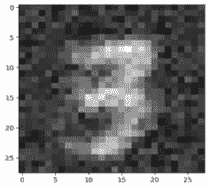

显然，使用模型反演攻击生成的图像与训练数据非常相似。这个例子展示了成功重建训练数据而不需要完全了解模型细节，从而实现了模型反演攻击。

#### 减轻模型反演攻击的技术

减轻模型反演攻击，即攻击者试图从训练模型的输出中推断敏感训练数据，对于保护隐私和敏感信息至关重要。

减轻模型反演攻击的一些技术包括以下内容：

+   **差分隐私**：在训练过程中应用差分隐私机制可以帮助抵御模型反演攻击。差分隐私通过向训练数据或模型的输出添加受控噪声，使得攻击者从模型的预测中提取特定敏感信息变得更加困难。我们将在接下来的两章中学习更多关于差分隐私的知识。

+   **限制对敏感输出的访问**：限制对敏感模型输出或预测的访问可以帮助减轻模型反演攻击。通过仔细控制谁可以访问输出以及在什么情况下访问，可以降低攻击者推断敏感训练数据的风险。

+   **预处理和后处理**：对数据和模型输出应用预处理和后处理技术可以帮助抵御模型反演攻击。例如，可以应用数据匿名化、聚合或转换技术来从输入或输出中移除或模糊敏感信息。我们将在后续章节中了解更多关于数据匿名化和聚合的内容。

+   **正则化**：在模型训练过程中结合正则化技术，如 L1 或 L2 正则化，可以帮助通过减少模型对特定敏感特征的依赖来提高隐私性。正则化可以帮助防止过拟合并限制通过模型预测泄露的敏感信息。

+   **生成对抗网络**（**GANs**）：使用生成模型，如 GANs，可以帮助抵御模型反演攻击。通过生成保留原始数据统计特性的合成数据，GANs 可以为攻击者提供替代输出，而不会泄露特定的敏感训练实例。

+   **安全多方计算**（**MPC**）：利用安全 MPC 协议可以使多个方能够协作训练模型，同时保持各自的训练数据私密。安全 MPC 确保没有任何一方可以访问其他方的敏感数据，从而减轻模型反演攻击。

+   **安全聚合**：在模型使用分布式设置进行训练的情境中，可以采用安全聚合协议来防止在模型更新聚合过程中敏感信息泄露。这可以在训练过程中保护免受模型反演攻击。

+   **访问控制和授权**：实施访问控制措施和强大的授权机制可以帮助限制对敏感模型输出的访问，减少潜在攻击者的暴露。只有授权实体应有权访问敏感预测或输出。

+   **合成数据生成**：不是直接在敏感数据上训练模型，而是使用从原始数据生成的合成数据可以帮助缓解模型反演攻击。合成数据保留了原始数据的统计特性，但不会暴露敏感信息。

+   **模型监控**：持续监控模型的行为，寻找任何异常模式或意外输出，可以帮助检测潜在的模型反演攻击。监控可能涉及异常检测、对抗鲁棒性检查或模型预测的统计分析等技术。

与前两次攻击一样，需要注意的是，选择缓解技术取决于具体情境、数据的敏感性和所需的隐私保护水平。可以将多种技术结合起来，以实现更强的隐私保障，抵御模型反演攻击。

# 摘要

总结来说，我们已经涵盖了不同类型的机器学习（监督学习和无监督学习），并探讨了如何以各种格式保存和执行模型。此外，我们还深入探讨了机器学习的不同阶段（数据提取、数据准备、模型开发、模型部署和推理），并详细讨论了与每个阶段相关的隐私威胁和攻击。

在下一章中，我们将更深入地探讨隐私保护数据分析，并专注于理解差分隐私的概念。这将使我们能够探索确保在执行数据分析任务时保持隐私的技术和方法。通过全面理解差分隐私，我们可以更好地保护敏感信息并减轻机器学习环境中的隐私风险。
