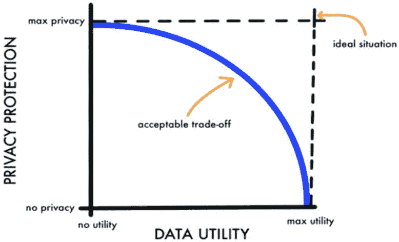
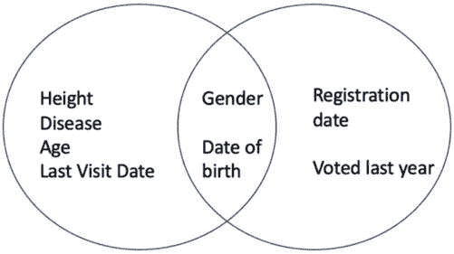
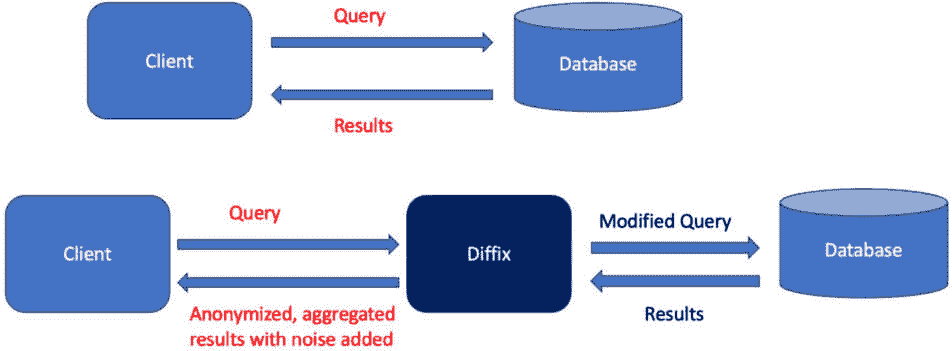

# 第三章：隐私保护数据分析概述及差分隐私简介

在本章中，我们将探讨大数据背景下隐私的概念及其相关风险。我们将深入研究数据分析中的隐私，重点关注隐私与效用之间的权衡。此外，我们将研究各种隐私保护技术，如匿名化、k-匿名性、t-接近性和ℓ-多样性，同时讨论它们的局限性。随后，我们将介绍一种关键的隐私增强方法，即差分隐私。我们将对差分隐私提供一个高级概述，涵盖隐私损失、隐私预算和差分隐私机制等基本概念。

本章涵盖的主要内容包括以下内容：

+   数据分析中的隐私：

    +   数据分析中的隐私，数据分析中隐私的必要性以及数据分析中隐私的目标

+   隐私保护技术：

    +   研究各种隐私保护技术，包括匿名化、k-匿名性、t-接近性和ℓ-多样性

    +   数据聚合

    +   数据聚合中的隐私攻击

    +   用于保护 SQL 中数据隐私的工具/框架

+   增强隐私的技术：

    +   介绍差分隐私作为一种隐私增强技术以及联邦学习和同态加密

+   差分隐私：

    +   深入探讨差分隐私概念，包括隐私损失、隐私预算和差分隐私机制

# 数据分析中的隐私

数据分析中的隐私是一个关键方面，它确保个人敏感信息不会被泄露或滥用。这涉及到实施数据匿名化和加密等措施，以保护个人的身份和个人详细信息，同时仍然允许进行有意义的数据分析。

## 数据分析中隐私的必要性

许多企业、社交网络公司、电子商务平台、网络公司、出租车/出租车聚合器、食品配送服务以及政府机构等，收集和处理大量数据——包括个人和非个人信息——以使用机器学习和人工智能技术得出见解。这些实体收集的数据涵盖了广泛的信息，如浏览历史、购买记录、社交网络互动、健康数据、位置数据、内容消费模式、设备信息等。需要注意的是，这些数据通常包含敏感的个人信息。在必要之外（考虑基于数据类别的数据保留法律）分享或保留这些数据可能导致隐私风险，并可能导致违反隐私和法律法规。正如我们在第一章中讨论的，一些隐私风险/违规与以下相关：

+   **窃取个人信息**：这包括未经授权访问个人的凭证，如信用卡号码、密码和其他敏感数据

+   **身份盗窃**：个人身份信息，如美国的社会安全号码或印度的 Aadhaar 唯一身份标识、姓名、银行信息、生物识别数据和驾驶执照，可能成为身份盗窃的目标。

+   **歧视和针对个人**：某些类型的数据，如病历，可能被用来基于个人的宗教信仰进行歧视，或导致诸如保险拒绝等后果。其他例子包括政治帖子、社交媒体上的评论/意见等。

为了解决这些担忧，全球范围内实施了隐私法律。例如，欧洲的**通用数据保护条例**（**GDPR**）和美国加州的**加州消费者隐私法案**（**CCPA**）为敏感数据的保护提供了指南和规定，并解决了与隐私相关的违规和问题。

对于组织来说，了解数据分析中的隐私实践至关重要，以便了解隐私风险，遵守相关的隐私法律和规定，并采取必要的措施保护个人数据隐私。

**数据分析中的隐私**指的是在保护数据隐私和机密性的同时执行数据分析任务的过程。它涉及应用各种技术和方法从数据中提取有意义的见解，而不损害被分析的个人数据的隐私权利。目标是平衡数据效用和隐私，这在隐私数据分析中至关重要。然而，每种方法都有其权衡：

+   **高数据隐私**：强调严格的隐私措施可能会导致数据效用较差。例如，如果为了保护隐私而删除或匿名化敏感个人信息，如社会安全号码或病历，那么将这些数据与其他相关数据点联系起来就变得困难。因此，由此产生的见解可能对分析目的不那么有用。

+   **高数据效用**：优先考虑高数据效用可能会导致隐私保护较弱。在这种情况下，数据对于分析仍然非常有用和有价值。然而，敏感信息的保护可能不足，增加了重新识别或意外泄露个人细节的风险。


图 3.1 – 隐私与效用权衡



图 3.2 – 隐私与效用权衡

图片来源：*Churi, Prathamesh & Pawar, Dr. Ambika & Moreno Guerrero, Antonio. (2021). A Comprehensive Survey on Data Utility and Privacy: Taking Indian Healthcare System as a Potential Case Study. Inventions. 6\.* *1-30\. 10.3390/inventions6030045.*

在隐私和效用之间找到正确的平衡是数据分析中隐私保护的一个关键挑战。组织必须实施隐私保护技术，如匿名化、聚合和噪声添加，以保护敏感信息，同时仍然能够进行有意义的分析。通过仔细考虑隐私和效用两个方面，有可能从数据中获得有价值的见解，同时保护个人的隐私权利。

### 数据分析中隐私保护的目标

数据分析中隐私保护的目标如下：

+   **隐私保护**：主要关注保护数据集中包含的敏感信息，确保个人的隐私得到尊重和保护。这包括防止未经授权的访问、披露或从数据中识别个人。

+   **数据效用**：在保护隐私的同时，分析还应提供有价值且准确的结果，以保持数据的有用性和质量。挑战在于找到允许有效分析的同时最小化对数据效用影响的方法。

+   **风险评估**：数据分析中的隐私保护涉及识别和评估与被分析数据相关的潜在隐私风险。这包括评估重新识别的可能性或分析过程中意外披露敏感信息的可能性。

+   **匿名化技术**：采用各种匿名化技术从数据集中删除或模糊化识别信息。这可能包括数据泛化、抑制、噪声添加和数据扰动等方法，以保护个人的身份。

+   **隐私保护算法/技术**：利用专门的算法和方法来执行分析任务，同时最小化隐私风险。这些算法确保结果揭示的是汇总和匿名化的见解，而不是个人层面的细节。

+   **合规性和伦理考量**：数据分析中的隐私保护遵守相关的隐私法律和法规，以确保对敏感数据的合规和伦理处理。组织必须遵守法律要求和伦理指南，以保护个人的隐私权利。

通过在数据分析技术中保护隐私，组织可以从敏感数据中获得有价值的见解，同时尊重隐私限制。这种方法在分析个人数据的人之间建立信任，并促进负责任的数据处理实践。

# 隐私保护技术

重要的是要注意，数据隐私是一项基本权利，个人有权控制其个人信息如何被收集、使用和共享。此外，如上所述，缺乏数据隐私保护可能导致严重的后果，如身份盗窃、金融欺诈和歧视。

在数据分析的背景下，对手是指积极寻求未经授权访问或利用敏感数据、干扰数据分析过程或操纵结果以谋取自身利益或恶意意图的实体或当事人。数据分析中的对手可能包括个人、组织或旨在损害数据或分析过程本身完整性、机密性或可用性的自动化系统。

组织可以实施各种隐私保护技术，允许分析数据同时保护个人的隐私。我们将介绍以下隐私保护技术和相关的隐私攻击：

+   数据匿名化技术和算法：

    +   K-匿名性、ℓ-多样性、t-接近性

+   数据聚合和与数据聚合相关的隐私攻击

## 数据匿名化和数据匿名化算法

保护隐私和遵守数据保护法规的技术之一是数据匿名化。通过匿名化数据，组织可以在保留数据的效用和分析价值的同时，减轻与未经授权披露和滥用个人信息相关的风险。

通常，数据集由三种类型的属性组成——即关键标识符、准标识符和敏感属性：

+   **关键标识符**：这些属性在数据集中唯一地识别个人。

+   **准标识符**：准标识符是间接标识符，当与其他属性结合使用时，可以用来识别个人或揭露个人信息。它们提供提示或部分识别。

+   **敏感属性**：这些属性包含需要保护以维护隐私的敏感个人信息。

让我们考虑一个来自医院或医疗诊所的示例数据集，该数据集收集并维护患者数据。假设医院为每位患者收集各种数据，包括姓名、出生日期、性别、邮政编码/邮编、身高、体重、血压、SpO2 水平、当前医疗状况、上次就诊日期等。

下面是关于这个数据集的一些详细信息：

+   姓名作为一个关键属性，因为它可以唯一地识别每个人。

+   准标识符包括出生日期、性别、邮政编码和身高等属性。虽然仅知道出生日期可能不足以识别个人，但将其与其他准标识符（如性别、邮政编码和医疗状况）结合使用，可能会使识别个人成为可能。

+   敏感属性包括与患者所患疾病类型相关的信息。保护这些信息对于维护患者的隐私至关重要。

通过了解数据集中不同类型的属性，组织可以实施适当的匿名化技术，以保护个人的隐私，同时仍允许进行有价值的分析和研究。

现在我们了解了不同类型的属性，让我们尝试在一个样本玩具数据集上进行数据匿名化，并分析结果。

让我们考虑一个包含个人年龄和医疗状况信息的示例数据集。在这种情况下，敏感属性是医疗状况，我们希望在保护数据有效性的同时保护它。

| 关键属性 | 准标识符 |  | 敏感属性 | 其他数据 … |
| --- | --- | --- | --- | --- |
| 姓名 | 出生日期 | 性别 | 邮编 | 身高（厘米） | 疾病 | 其他数据 … |
| John | 2000-09-15 | 男 | 90001 | 170 | COVID | …. |
| Rosy | 2002-12-08 | 女 | 96162 | 165 | COVID |  |
| Robin | 1945-07-24 | 男 | 92348 | 180 | 癌症 |  |
| Hellen | 1950-01-13 | 女 | 95411 | 156 | 癌症 |  |
| Antonio | 1970-01-13 | 男 | 95416 | 180 | 发热 | ….. |

表 3.1 – 样本数据集

显然，收集的数据包含诸如姓名、出生日期等个人信息，因此为了保护个人，让我们尝试数据匿名化技术，看看它是否有帮助。数据匿名化意味着移除或修改个人可识别信息，以便其他人无法从数据中检测到个人。

让我们尝试一个简单的解决方案，即从给定的数据中移除个人信息（在这种情况下，是人的姓名）。移除姓名后，数据看起来如下。

| 姓名 | 出生日期 | 性别 | 邮编 | 身高（厘米） | 诊断疾病 | 其他数据 … |
| --- | --- | --- | --- | --- | --- | --- |
|  | 2000-09-15 | 男 | 90001 | 170 | COVID | …. |
|  | 2002-12-08 | 女 | 96162 | 165 | COVID |  |
|  | 1945-07-24 | 男 | 92348 | 180 | 癌症 |  |
|  | 1950-03-13 | 女 | 95411 | 156 | 癌症 |  |
|  | 1970-01-13 | M | 95416 | 180 | 发热 | ….. |

表 3.2 – 无姓名的数据集

移除姓名是否足以保护敏感数据？现在能否与他人共享这些数据？是否有人能从这些数据中准确识别出患有癌症的个人？

根据前面的数据表，看起来人们将无法找到信息，因为我们已经从数据中移除了个人的姓名。这是从这些数据中得到的第一印象。从数据集中移除个人的姓名是保护敏感数据并保留隐私的一个步骤。

然而，重要的是要注意，仅仅移除姓名并不能保证完全的隐私保护。数据集中的其他准标识符和敏感属性仍然可能潜在地导致个人的重新识别。

让我们看看对手将如何能够使用这个所谓的匿名化数据集来识别个人。

政府机构每 5 年或 10 年进行一次人口普查数据调查（人口调查和选民名单更新/添加等），并根据国家规定与其他部门共享。

匿名化数据集（如前面的数据表）可能与由政府机构或非营利组织发布的公开数据集链接，从而得出见解或识别个人，即可以找到敏感个人信息。

以下是从政府获取的选民 ID 数据样本：

| 姓名 | 出生日期 | 性别 | 邮政编码 | 上次投票年份 | 注册日期 | 其他数据 … |
| --- | --- | --- | --- | --- | --- | --- |
| John | 2000-09-15 | M | 90001 | 2020 | 2018 | …. |
| Rosy | 2002-12-08 | F | 96162 | - | 2020 |  |
| Robin | 1945-07-24 | M | 92348 | 2020 | 1963 |  |
| Hellen | 1950-03-13 | F | 92411 | 2020 | 1968 |  |
| Antonio | 1970-01-13 | M | 95416 | - | 1988 |  |

表 3.3 – 样本选民 ID 数据集

非常可能将这两个数据集链接起来，即患者的数据与选民的数据（参考 LINDDUN 框架的隐私威胁链接类别，该类别在 *第一章* 中描述）并从给定的邮政编码中找出谁患有癌症。



图 3.3 – 链接两个数据集

很明显，Robin 住在邮政编码 92348，因此对手可以链接选民 ID 和医疗数据记录，并确定他患有癌症。一旦对手找到此案例中的敏感信息，即谁患有癌症，那么作为此数据隐私泄露的副作用，可能的歧视可能是拒绝为 Robin 提供医疗保险。

因此，仅仅从数据集中删除一个或两个字段是不够保护个人敏感信息的。

让我们尝试另一种数据匿名化技术，称为 k-匿名性。

### K-匿名性 – 数据匿名化

*Latanya Sweeney* 和 *Pierangela Samarati* 在 1998 年引入了 k-匿名性，其描述如下：

给定特定于个人的字段结构化数据，产生一个数据发布，保证数据主体在数据保持实际有用的同时不能被重新识别。如果发布的数据中每个个人的信息不能与至少 k-1 个信息也出现在发布中的个人区分开来，则称数据发布具有 k-匿名性属性。

*(**来源：维基百科)*

为了应用 k-匿名性匿名化，需要执行以下操作：

1.  识别给定数据集中的准标识符。

1.  对数据集中的属性进行泛化（而不是使用确切日期，使用范围）或抑制属性（而不是显示完整的邮政编码，只显示部分邮政编码）至少 k-1 条记录。

| 姓名 | 出生日期 | 性别 | 邮政编码 | 身高（厘米） | 诊断疾病 | 其他数据… |
| --- | --- | --- | --- | --- | --- | --- |
|  | 2000-09-15 | M | 90001 | 170 | COVID | …. |
|  | 2002-12-08 | F | 96162 | 165 | COVID |  |
|  | 1945-07-24 | M | 92348 | 180 | 癌症 |  |
|  | 1950-03-13 | F | 92411 | 156 | 癌症 |  |
|  | 1970-01-13 | M | 95416 | 180 | 发烧 |  |

表 3.4 – 无姓名的数据集

在本例中，准标识符是邮编和出生日期。这些被认为是间接标识符，因为可能有具有相同邮编和出生日期的个人，但这两个因素不一定能识别出特定的个人。一旦确定了准标识符，就可以选择抑制它们或泛化属性。让我们尝试用***抑制邮编的最后三位，并使用范围而不是确切的出生日期来泛化出生日期。

更新后的数据（匿名化）如下所示：

| 姓名 | 出生日期 | 性别 | 邮编 | 身高（厘米） | 诊断疾病 | 其他数据… |
| --- | --- | --- | --- | --- | --- | --- |
|  | 20-30 | M | 90*** | 170 | COVID | …. |
|  | 20-30 | F | 96*** | 165 | COVID |  |
|  | 70-80 | M | 92*** | 180 | CANCER |  |
|  | 70-80 | F | 92*** | 156 | CANCER |  |
|  | 50-60 | M | 95*** | 180 | FEVER |  |

表 3.5 – 泛化和抑制后的数据集

请过一遍这些问题：

+   现在是否足够保护敏感数据，因为我们已经使用 k-匿名性对数据进行匿名化（准标识符）？

+   现在能否与他人共享这些数据？

+   现在是否有人能从这个数据中找出确切的癌症患者是谁？

在这种情况下，仍然有可能识别出个人，因为在相同的年龄范围内（70-80），每个人都有癌症。这种脆弱性被称为同质性攻击，它可能在 k-匿名性中发生，当一组 k 个记录具有精确的敏感值时。尽管数据已经进行了 k-匿名化，但由于我们示例中敏感值“癌症”的日期范围相同，因此 k 个记录集的敏感值仍然可以准确预测。

现在我们将使用 Python 实现一个示例数据集的 k-匿名性。

源代码：K-Anonymity_Example.ipynb

我们将创建一个包含准标识符（年龄和性别）和敏感属性（诊断）的医学记录合成数据集：

```py
import pandas as pd
import random
# Step 1: Define the parameters
num_records = 1000  # Number of records in the dataset
k = 5  # Desired k-anonymity level
# Step 2: Generate the synthetic dataset
age_range = (20, 80)
gender_list = ["Male", "Female"]
diagnosis_list = ["Covid", "Cancer", "Fever", "Obesity"]
data = []
for _ in range(num_records):
    age = random.randint(age_range[0], age_range[1])
    gender = random.choice(gender_list)
    diagnosis = random.choice(diagnosis_list)
    data.append({"age": age, "gender": gender, "diagnosis": diagnosis})
dataset = pd.DataFrame(data)
dataset.to_csv("dataset.csv", index=False)
# Step 3: Apply k-anonymity
groups = dataset.groupby(["age", "gender"])
anonymized_data = pd.DataFrame()
for _, group in groups:
    if len(group) < k:
        group["age"] = generalize(group["age"])
        group["gender"] = generalize(group["gender"])
    anonymized_data = anonymized_data.append(group)
# Save the anonymized dataset to a file
anonymized_data.to_csv("k_anonymized_dataset.csv", index=False)
def generalize(attribute):
    if attribute.name == "age":
        # Generalize age into predefined ranges
        age_ranges = [(0, 20), (20, 40), (40, 60), (60, 80)]
        for start, end in age_ranges:
            if start <= attribute.iloc[0] < end:
                return f"{start}-{end}"
    elif attribute.name == "gender":
        # Generalize gender to binary values
        return "Other"
    else:
        # Handle other attributes if needed
        return attribute.
```

在本例中，我们首先定义参数，包括所需的记录数（`num_records`）和所需的 k-匿名性级别（`k`）。然后，我们通过随机分配准标识符（年龄和性别）和敏感属性（诊断）的值来生成一个合成数据集。在生成数据集后，我们根据准标识符对记录进行分组，并检查组大小是否小于 k。如果组大小小于 k，我们就通过应用合适的泛化技术来泛化准标识符。

`generalize()`函数接受一个属性（例如，年龄或性别）作为输入，并应用特定的泛化技术。在这里，我们通过将其划分为预定义的年龄范围（例如，0-20，20-40，40-60 和 60-80）来实现对年龄属性的泛化。对于性别属性，我们将其泛化为`"其他"`。

我们可以根据数据集特定的泛化要求修改和扩展此功能。例如，我们可能需要以不同的方式处理其他属性，或者为不同的准标识符定义额外的泛化规则。

最后，匿名化后的数据集被保存到名为`k_anonymized_dataset.csv`的文件中。

让我们尝试另一种匿名化技术，称为ℓ-diversity，看看它是否能够解决我们在 k 匿名性分析中讨论的隐私问题。

### ℓ-diversity – 数据匿名化

ℓ-diversity 是一种旨在减轻对匿名化数据同质性攻击的脆弱性的方法。它通过确保每个准标识符序列都与一个“良好表示”的敏感属性相关联来实现这一点。换句话说，ℓ-diversity 旨在在具有相同准标识符的记录组内引入多样性，确保存在多个敏感属性值。通过这样做，ℓ-diversity 降低了从匿名化数据中准确推断敏感信息的风险。

#### 原始数据集

| Quasi-Identifiers | Sensitive Attribute |
| --- | --- |
| 出生日期 | 邮编 | 疾病 |
| 2000-09-15 | 90001 | COVID |
| 2002-12-08 | 96162 | COVID |
| 1945-07-24 | 92348 | CANCER |
| 1950-03-13 | 95411 | CANCER |
| 1970-01-13 | 95416 | FEVER |

表 3.6 – 原始数据集

#### K 匿名化数据集

| Quasi-Identifiers | Sensitive Attribute |
| --- | --- |
| 出生日期 | 邮编 | 疾病 |
| 20-30 | 90*** | COVID |
| 20-30 | 96*** | COVID |
| 70-80 | 92*** | CANCER |
| 70-80 | 92*** | CANCER |
| 50-60 | 95*** | FEVER |

表 3.7 – K 匿名化数据集

当与其他人共享这些数据时，这些数据不具有多样性。

为了使这个数据集达到ℓ多样性（对于ℓ=2），我们需要在每个具有相同出生日期和邮编的组中至少引入一种独特的疾病。以下是我们如何修改数据集的一个示例：

| ℓ -Diversity Dataset Quasi-Identifiers | Sensitive Attribute |
| --- | --- |
| 出生日期 | Zip Code | 疾病 |
| 20-30 | 90*** | COVID |
| 70-80 | 92*** | CANCER |
| 50-60 | 95*** | FEVER |
| 20-30 | 96*** | COVIDFLU |
| 70-80 | 92*** | CANCERHEART DISEASE |

表 3.8– ℓ-diversity 数据集（具有一定多样性）

具有邮编 96***的 20-30 岁年龄组，其`疾病`已更改为`流感`。70-80 岁年龄组中，邮编为 92***的记录，其`疾病`已更改为`心脏病`。现在，每个具有相同出生日期和邮编的相似日期集合至少有两种独特的疾病，这使得数据集具有 2 种多样性。

在较小的数据集上实现ℓ多样性可能看起来很简单，正如我们的示例所示。然而，它的适用性存在局限性，尤其是在处理包含数百万或数十亿记录的大型数据集时。在这种情况下，实现ℓ多样性变得具有挑战性，并且在所有情况下可能都不是必要的。需要注意的是，尽管ℓ多样性有帮助，但它并不是保护敏感信息的全面解决方案。虽然它引入了记录组内的多样性，但它不能保证完全的隐私。可能需要额外的隐私保护技术和措施来提供对敏感数据的更强保护。

现在我们使用 Python 在样本数据集上实现ℓ多样性。

*源代码*：L-Diversity_Example.ipynb

让我们在之前生成的合成数据集上实现`ℓ-diversity`。我们将诊断属性视为敏感属性，并确保每个组至少有ℓ个不同的敏感属性值：

```py
import pandas as pd
import random
# Step 1: Define the parameters
num_records = 1000  # Number of records in the dataset
l = 3  # Desired l-diversity level
# Step 2: Generate the synthetic dataset
age_range = (20, 70)
gender_list = ["Male", "Female"]
diagnosis_list = ["Covid", "Cancer", "Fever", "Obesity"]
data = []
for _ in range(num_records):
    age = random.randint(age_range[0], age_range[1])
    gender = random.choice(gender_list)
    diagnosis = random.choice(diagnosis_list)
    data.append({"age": age, "gender": gender, "diagnosis": diagnosis})
dataset = pd.DataFrame(data)
dataset.to_csv("dataset_before_l_diversity.csv", index=False)
# Step 3: Apply l-diversity
groups = dataset.groupby(["age", "gender"])
anonymized_data = pd.DataFrame()
for _, group in groups:
    if len(group["diagnosis"].unique()) < l:
        # Generalize or suppress the sensitive attribute
        group["diagnosis"] = generalize(group["diagnosis"])
        anonymized_data = anonymized_data.append(group)
    else:
        anonymized_data = anonymized_data.append(group)
# Save the anonymized dataset to a file
anonymized_data.to_csv("l_diversity_dataset.csv", index=False)
```

我们生成一个与之前类似的合成数据集。之后，我们根据准标识符（年龄和性别）对记录进行分组，并检查不同敏感属性值（诊断）的数量是否少于“ℓ”。如果条件满足，我们将对敏感属性应用泛化或抑制，以确保组内至少有“ℓ”个不同的值。请注意，在这个示例中，对诊断属性调用了`generalize()`函数。最后，匿名化后的数据集被保存到名为`l_diversity_dataset.csv`的文件中：

```py
def generalize(attribute):
    if attribute.name == "diagnosis":
        # Generalize diagnosis to a higher-level category
        diagnosis_mapping = {
            "Covid": "Chronic Condition",
            "Cancer": "Chronic Condition",
            "Fever": "Non-Chronic Condition",
            "Obesity": "Non-Chronic Condition"
        }
        return attribute.map(diagnosis_mapping)
    else:
        # Handle other attributes if needed
        return attribute
```

在这个示例中，`generalize()`函数接受一个属性（例如，诊断）作为输入，并应用特定的泛化技术。在这里，我们通过将特定的诊断映射到更高级别的类别来演示对诊断属性的泛化。例如，诊断如`"Fever"`和`"Obesity"`被泛化到类别`"Non-Chronic Condition"`，而`"Cancer"`和`"Covid"`被泛化到`"Chronic Condition"`。

现在，让我们深入了解另一种方法，称为 t 接近度。

### t 接近度

t 接近度方法确保个体组中敏感属性分布与整体人口中相同属性的分布没有显著差异。它通过设置一个阈值值，用`t`表示，来维护隐私和数据实用性的平衡，该阈值代表分布之间的最大允许差异。

为了满足 t 接近度，数据集应在每个个体组中展示与整体数据集相似的敏感属性（如年龄、收入和性别）的概率分布。如果组与整体分布之间的差异超过指定的 t 值，可能需要额外的匿名化措施。

让我们通过一个例子来说明 t-closeness。假设我们有一个包含个人年龄和医疗状况信息的数据集。在这种情况下，敏感属性是医疗状况，我们希望在保护数据效用性的同时保护它。

我们根据一组准标识符将数据集划分为组，例如年龄范围和性别。为了简单起见，让我们专注于年龄范围。我们有两组：A 组（年龄范围 30-40）和 B 组（年龄范围 40-50）。

为了满足 t-closeness，我们需要比较每个组内医疗状况的分布与数据集中整体分布。假设整体数据集的医疗状况分布如下：60%癌症，30%糖尿病，10%哮喘。

在 A 组中，我们发现医疗状况的分布是 70%癌症，20%糖尿病，10%哮喘。在 B 组中，分布是 50%癌症，30%糖尿病，20%哮喘。

为了确定数据集是否满足 t-closeness，我们计算组分布与整体分布之间的差异。假设我们将阈值值设定为 t = 0.2（20%）。

在 A 组中，癌症的差异是 10%（70%-60%），在 t 值范围内。对于糖尿病，差异是 10%（20%-30%），也在阈值内。哮喘的情况相同，差异为 0%（10%-10%）。

在 B 组中，癌症的差异是 10%（50%-60%），在 t 值范围内。对于糖尿病，差异是 0%（30%-30%），对于哮喘，差异是 10%（20%-10%）。这两个差异都在指定的阈值内。

由于组分布与整体分布之间的所有差异都在 t 值范围内，我们可以得出结论，该数据集对于给定的阈值满足 t-closeness。

这个例子演示了 t-closeness 如何确保每个组中敏感属性的分布与整体数据集中的分布没有显著差异，从而在保持数据效用性的同时提供更高的隐私级别。

与 k 匿名性相比，t-closeness 提供了更严格的隐私要求，因为它考虑了敏感属性的实际情况分布，而不仅仅是群体大小。然而，在保持数据效用性的同时实现 t-closeness 可能具有挑战性。已经开发出各种技术和算法，以在数据匿名化过程中应用 t-closeness 时在隐私和效用之间取得平衡。

现在我们将使用 Python 实现一个示例数据集的 t-closeness。

`源代码:t_Closeness_Example.ipynb`

让我们看看在之前生成的合成数据集上实现 t-closeness 的例子。我们将诊断属性视为敏感属性，并确保每个组中敏感属性值的分布与整体分布没有显著偏差：

```py
import pandas as pd
import random
# Step 1: Define the parameters
num_records = 1000  # Number of records in the dataset
t = 0.2  # Desired t-closeness threshold
# Step 2: Generate the synthetic dataset
age_range = (20, 70)
gender_list = ["Male", "Female"]
diagnosis_list = ["Covid", "Cancer", "Fever", "Obesity"]
data = []
for _ in range(num_records):
    age = random.randint(age_range[0], age_range[1])
    gender = random.choice(gender_list)
    diagnosis = random.choice(diagnosis_list)
    data.append({"age": age, "gender": gender, "diagnosis": diagnosis})
dataset = pd.DataFrame(data)
dataset.to_csv("t-close_before_dataset.csv", index=False)
# Step 3: Calculate the overall distribution of the sensitive attribute
overall_distribution = dataset["diagnosis"].value_counts(normalize=True)
# Step 4: Apply t-closeness
groups = dataset.groupby(["age", "gender"])
anonymized_data = pd.DataFrame()
for _, group in groups:
    group_distribution = group["diagnosis"].value_counts(normalize=True)
    max_divergence = max(abs(group_distribution - overall_distribution))
    if max_divergence > t:
        # Generalize or suppress the sensitive attribute
        group["diagnosis"] = generalize(group["diagnosis"])
    anonymized_data = anonymized_data.append(group)
# Save the anonymized dataset to a file
anonymized_data.to_csv("t_closeness_dataset.csv", index=False)
def generalize(attribute):
    if attribute.name == "diagnosis":
        # Generalize diagnosis to a higher-level category
        diagnosis_mapping = {
            "Covid": "Chronic Condition",
            "Cancer": "Chronic Condition",
            "Fever": "Non-Chronic Condition",
            "Obesity": "Non-Chronic Condition"
        }
        return attribute.map(diagnosis_mapping)
    else:
        # Handle other attributes if needed
        return attribute
```

在这个例子中，我们像以前一样生成一个合成数据集。我们计算数据集中敏感属性（诊断）的整体分布。然后，我们根据准标识符（年龄和性别）对记录进行分组，并计算每个组中敏感属性的分布。如果组分布与整体分布之间的最大差异超过指定的阈值`t`，我们对敏感属性应用泛化或抑制。

#### k-anonymity、l-diversity 和 t-closeness 的比较

| 隐私技术 | 优点 | 缺点 |
| --- | --- | --- |
| k-anonymity |

+   简单性和易于实现

+   提供强大的身份隐私保证

+   有效防止属性关联攻击

+   在一定程度上保留数据效用

|

+   未考虑敏感属性的分布，可能导致属性披露

+   可能导致过度泛化，降低数据效用

+   敏感属性抑制可能导致信息丢失

+   容易受到背景知识攻击

|

| ℓ -diversity |
| --- |

+   通过考虑组内的多样性增强 k-anonymity

+   提供更好的属性披露保护

+   允许对多样性要求进行细粒度控制

+   在隐私和数据效用之间提供权衡

|

+   泛化和抑制可能导致信息丢失和降低数据效用

+   “ℓ”值的选取可能具有主观性且具有挑战性

+   仍然容易受到背景知识攻击

+   不能保证对所有类型的属性披露提供保护

|

| t-closeness |
| --- |

+   通过考虑敏感属性的分布扩展ℓ-diversity

+   提供对属性披露的统计保证

+   考虑多样性和分布，在隐私和数据效用之间取得平衡

+   允许对 t-closeness 阈值进行细粒度控制

|

+   泛化和抑制仍可能导致信息丢失

+   确定适当的 t-closeness 阈值可能具有挑战性

+   统计措施可能需要领域专业知识

+   容易受到背景知识攻击和相关性攻击

|

表 3.9– k-anonymity、ℓ-diversity 和 t-closeness 的比较

这份数据提供了每种技术优缺点的高级概述。每种技术的实际有效性和局限性可能因具体实现、数据集特征和隐私要求而异。根据具体用例仔细评估和选择最合适的技术非常重要。

让我们探索数据聚合技术，这是另一种隐私保护技术。我们将尝试实现数据聚合，看看聚合是否解决了预测敏感数据的问题。

## 数据聚合

正如我们所见，数据不能完全匿名化同时保持有用。让我们尝试聚合数据集，看看聚合数据是否有助于保护隐私。

数据聚合是指将来自多个来源或个人的数据点或记录进行组合和汇总，以获得综合视图或分析的过程。它包括收集数据点或记录并将它们转换成更简洁的表示形式，通常以统计指标或汇总值的形式出现。数据聚合的目的是从大量数据集中提取有意义的洞察和模式，同时降低复杂性和维护数据隐私。

### 数据聚合的关键方面

根据数据性质和预期结果，采用不同的聚合方法。常见的技术包括求和、平均、计数、最大/最小值、百分位数或其他统计指标。这些方法有助于压缩数据，同时保留基本特征或模式。

数据聚合可以在不同的粒度级别上进行，具体取决于分析需求。它可能涉及在个人层面、组层面、地理层面、时间间隔或其他相关分组标准上聚合数据。调整粒度允许从数据中获得不同的视角和洞察。

汇总数据提供了对原始数据集更易于管理和简洁的表示，使得有效的分析、可视化和决策过程成为可能。它有助于识别趋势、模式、相关性或异常，这些在检查单个数据点时可能并不明显。

### 与数据聚合相关的隐私攻击

数据聚合，虽然是一种从大量数据集中提取洞察的有用技术，但也可能引入隐私风险。以下是一些与数据聚合相关的隐私攻击：

+   **再识别攻击**：即使移除了个人标识符或匿名化，汇总数据仍然可能容易受到再识别攻击。通过结合多个汇总数据集或利用外部信息，攻击者可能能够识别汇总数据中的个人，从而损害他们的隐私。

+   **推断攻击**：当攻击者可以通过分析汇总数据推断出有关个人的敏感信息时，就会发生推断攻击。通过识别汇总数据集中的模式、相关性或统计指标，攻击者可能能够推断出个人的一些旨在保持保密的私人属性或行为。

+   **成员推断攻击**：成员推断攻击旨在确定特定个人的数据是否包含在汇总数据集中。通过利用统计分析技术，攻击者可以利用汇总数据中的模式或特征来推断某些个人的存在或不存在，从而侵犯他们的隐私。

+   **属性泄露攻击**：即使移除了直接标识符，汇总数据也可能无意中泄露敏感属性或关于个人的信息。通过分析汇总数据并结合外部知识，攻击者可能能够推断出个人的私人属性、偏好或特征。

+   **合成攻击**：合成攻击利用多个汇总数据集的组合来揭示敏感信息。即使单个数据集本身不构成隐私风险，多个数据集的汇总可能使攻击者能够通过交叉引用不同来源的数据来识别个人或提取私人信息。

在数据汇总过程中减轻隐私攻击风险，需要在数据实用性和隐私保护之间取得平衡。

让我们通过汇总数据集的关键隐私攻击进行探讨。

### 差分隐私攻击与汇总数据集

差分隐私攻击利用不同查询输出的统计差异来推断个人或其数据点的敏感信息。

#### 示例

对手试图通过利用提供薪酬汇总统计输出的查询或输出，来推断个别员工的薪酬信息。

考虑一个包含公司员工薪酬信息的数据集。该数据集包括员工姓名、年龄和薪酬等属性。

**玩具数据集示例（****原始数据集）：**

| 员工姓名 | 年龄 | 薪酬（美元，千） |
| --- | --- | --- |
| John | 30 | 200 |
| Rosy | 35 | 300 |
| Robin | 40 | 250 |
| Hellen | 50 | 315 |

表 3.10 – 玩具数据集示例

假设汇总数据默认保护了个人隐私。

如果这家公司的人力资源部门每周发布一个汇总数据集而不是分享原始数据集，这有助于减轻与个人薪酬信息相关的隐私风险。通过仅提供汇总统计数据，人力资源部门可以保护个人薪酬的敏感细节，同时仍然向利益相关者提供有用的见解。

**汇总数据集 –** **第 1 周：**

| 平均年龄 | 平均薪酬 |
| --- | --- |
| 38.75 | 266.25 |

表 3.11 – 汇总数据集 – 第 1 周

假设在下个星期，公司又雇佣了一名新员工。然后，原始数据被更新为新员工的详细信息，并发布了汇总数据集。

| 员工姓名 | 年龄 | 薪酬（美元，千） |
| --- | --- | --- |
| John | 30 | 200 |
| Rosy | 35 | 300 |
| Robin | 40 | 250 |
| Hellen | 50 | 315 |
| Fedrick | 55 | 335 |

表 3.12 – 汇总数据集 – 第 1 周

**汇总数据集 –** **第 2 周：**

| 平均年龄 | 平均薪酬 |
| --- | --- |
| 42 | 280 |

表 3.13 – 汇总数据集 – 第 2 周

由于人力资源部门只分享了汇总数据而没有实际数据集，这足够保护个人信息吗？在这种情况下，个人的薪酬信息是个人信息。

由于我们有新员工加入前后的平均工资，任何人都可以猜出新员工在第二周加入时的薪水。

新员工薪水 = （加入后员工总数 * 平均薪水）-（加入前员工总数 * 平均薪水）= 5 * 280 - 4 * 266.25 = 335

这被称为差异攻击，即通过组合多个聚合查询来获取关于特定个人的精确信息。因此，聚合数据集在差异攻击方面存在问题，仅通过聚合数据并不能完全保护个人的个人信息。

### 重构攻击

让我们考虑一个假设的数据集，从中可以推断出以下信息：

*“确定了三个特定疾病的发病率较高的群体，并收集了与该特定疾病相关的症状和治疗数据。”*

利用这些知识，攻击者缩小了可能性，并在目标年龄组中确定了一个潜在候选人。他们将个人在公共来源中可用的特征、症状和治疗历史与聚合数据进行比较，以找到匹配项。

通过利用统计技术、机器学习算法或特定领域的知识，攻击者细化他们的假设，并逐步重构目标个人的医疗历史。他们可以揭露敏感信息，例如具体疾病、相关共病、既往治疗和潜在的健康风险。

这种重构攻击展示了对手如何利用聚合数据、外部信息和统计分析来推断详细的个人级信息。通过结合公开数据、聚合统计数据中观察到的模式以及辅助知识，攻击者可以侵犯个人的隐私并揭露敏感的个人信息。

让我们通过另一个针对公共数据的重构攻击来详细了解聚合数据集中的问题。

### 数据库重构攻击

如前所述，大多数国家每 5 年或 10 年进行一次人口普查调查（对其人口的调查），并将聚合数据与组织以及各种政府门户网站共享。

让我们通过以下数据的重构攻击示例来了解：

| 姓名 | 年龄（年） | 性别 | 城市 | 教育 |
| --- | --- | --- | --- | --- |
| A | 15 | M | 印度班加罗尔 | 本科在读 |
| B | 80 | M | 印度班加罗尔 | 文盲 |
| C | 25 | M | 印度班加罗尔 | 毕业 |
| D | 45 | F | 印度班加罗尔 | 毕业 |
| E | 40 | F | 印度班加罗尔 | 毕业 |
| F | 20 | F | 印度班加罗尔 | 毕业 |
| G | 15 | F | 印度班加罗尔 | 毕业 |

表 3.14 - 重构攻击数据

假设一个中间人可以访问前面的原始数据，但只允许他们公开发布聚合数据。中间人基于原始数据发布了以下基于统计的统计数据集：

| 性别 | 数量 | 平均年龄 | 中位数年龄 |
| --- | --- | --- | --- |
| 男性 | 3 | 40 | 25 |
| 女性 | 4 | 30 | 40 |
| 总计 | 7 | 34.28 | 25 |

表 3.15 – 统计数据集

仅使用聚合数据集，是否可以找出个人的大致年龄（考虑男性性别的情况）？

让我们尝试使用 SAT 求解器来解决这个问题。SAT 求解器是一个旨在解决布尔可满足性问题的程序。我使用 Python 的 Google 开源 OR-Tools 包来解决这个问题。

根据前面的数据，数据集中有 3 名男性，平均年龄为 40 岁，中位数为 25 岁。假设 x、y 和 z 是 3 名男性的年龄，那么 y 将是 25 岁（因为中位数是 25）。x、y 和 z 的平均年龄是 40 岁，所以他们的年龄总和等于 120 岁。假设一个人的最大寿命是 110 岁：

```py
from ortools.sat.python import cp_model
def AgeFindSATprogram():
    # Creates the model.
    model = cp_model.CpModel()
    # Creates 3 variable
    num_vals = 3
    x = model.NewIntVar(1,110, 'x')
    y = 25
    z = model.NewIntVar(1,110, 'z')
    # Creates the constraints.
    model.Add(x+y+z==120)
    # Creates a solver and solves the model.
    solver = cp_model.CpSolver()
    status = solver.Solve(model)
    if status == cp_model.OPTIMAL or status == cp_model.FEASIBLE:
        print('x = %i' % solver.Value(x))
        print('y = %i' % solver.Value(y))
        print('z = %i' % solver.Value(z))
    else:
        print('No solution found.')
AgeFindSATprogram()
```

这将返回以下输出：

```py
x = 94
y = 25
z = 1
```

这样，可以通过使用聚合数据集来求解原始数据集的大致值。这就是为什么一些国家的政府（如印度）不允许发布聚合数据集，只发布原始计数。

| 性别 | 数量 |
| --- | --- |
| 男性 | 3 |
| 女性 | 4 |
| 总计 | 7 |

表 3.16 – 聚合数据集

#### 缓解数据库重建攻击

为了缓解重建攻击并保护数据隐私，可以采用以下技术：

+   **强匿名化**：对发布的数据应用稳健的匿名化技术，如泛化、抑制或聚合。通过以保护隐私的方式转换数据，攻击者更难以准确重建个人记录。

+   **噪声添加**：向发布的数据或查询中引入受控噪声，以增加额外的隐私保护层。通过注入随机扰动，攻击者揭露原始数据或推断精确信息的可能性降低。

+   **数据扰动**：通过扰动或修改某些属性或值来修改数据，同时保持数据的整体效用。这可以使攻击者更难以准确重建原始信息。

+   **查询限制**：限制可以对数据进行查询的类型或数量，以减少敏感信息的暴露。通过限制对某些查询的访问或应用基于查询的隐私机制，可以降低重建攻击的风险。

#### 用于使用 SQL 查询保护隐私的工具/框架

**Open Diffix** 是 Diffix 的开源实现，它允许使用 SQL 进行隐私保护的数据分析。它为需要分析敏感数据同时保护个人隐私的组织或研究人员提供了解决方案。Open Diffix 采用强大的匿名化技术来实现这一目标，确保数据库查询的结果不会泄露关于个人的敏感信息。

Diffix 充当客户端（对手或善意）与数据库之间的 SQL 代理。Diffix 返回 SQL 查询结果并添加最小量的噪声。Open Diffix 旨在确保个人敏感信息不能从发布的数据中推断出来。Open Diffix 背后的关键思想是在查询响应或统计汇总中引入受控噪声，以防止识别个人记录。



图 3.4– diffix 系统流程

Open Diffix 具有以下关键特性：

+   噪声添加

+   抑制

让我们快速回顾一下这两个特性的更多细节。

#### **噪声添加**

Open Diffix 支持向查询结果添加噪声。噪声可以以不同的方式添加：

+   **固定数量的噪声**：在这种情况下，向查询结果添加有限数量的噪声。这被称为隐私预算。

+   **粘性噪声**：每次执行查询时，都会添加随机噪声，但重复执行相同的查询将给出相同的结果，即向查询添加相同数量的噪声。

+   **成比例的噪声**：根据实际数据和数据的分布（时间序列数据），工具将添加相应的噪声。

#### **抑制**

Open Diffix 支持抑制某些数据（例如，数字中的极端值以及某些文本数据），并返回 SQL 查询的结果。这样，除了添加噪声外，抑制还将有助于防止揭示极端值，从而有助于保护隐私。

#### 在 Postgres DB 上使用 Open Diffix 的示例用例

让我们通过 Postgres DB 的示例数据库，使用 Open Diffix 执行 SQL 查询，并了解 Open Diffix 如何通过添加噪声来匿名化和汇总结果，以保护个人的隐私。

这些是我们将在以下示例中执行的步骤：

1.  数据库创建

1.  用户角色创建和授权访问

1.  在数据库表上启用 Diffix 以保护隐私

**数据库创建**

在这种情况下，我们将创建两个表（`Employee`和`Department`）以及一个示例数据库（`sample_db`）。

`sample_db`

`schema_owner,` `analyst_trusted, analyst_untrusted`

`Employee, Department`

```py
CREATE TABLE department(
       deptno  INT GENERATED ALWAYS AS IDENTITY,
       deptname VARCHAR(255) NOT NULL,
       mgrno INT NOT NULL,
       mgrname VARCHAR(255)  NOT NULL,
       mgremailid VARCHAR(255) NOT NULL,
       location  VARCHAR(255) NOT NULL,
       PRIMARY KEY(deptno));
```

| 列名称 | 列类型 | 描述 | PII 数据 | 数据被屏蔽 |
| --- | --- | --- | --- | --- |
| DEPTNO | 整数（主键） | 部门编号或 ID | 否 | 否 |
| DEPTNAME | 文本 | 部门名称 | 否 | 否 |
| MGRNO | 整数 | 部门主管员工 ID | 否 | 否 |
| MGRNAME | 文本 | 部门主管员工姓名 | 否 | 否 |
| MGREMAILID | 文本 | 部门主管员工电子邮件 ID | 是 | 是 |
| 位置 | 文本 | 部门位置 | 否 | 否 |

表 3.17 - 创建示例数据库

```py
CREATE TABLE employee(
   empno  INT GENERATED ALWAYS AS IDENTITY,
   ename VARCHAR(255) NOT NULL,
   job VARCHAR(255) NOT NULL,
   emailid VARCHAR(255) NOT NULL,
   mgr INT NOT NULL,
   hiredate DATE NOT NULL,
   deptno INT NOT NULL,
   PRIMARY KEY(empno),
   CONSTRAINT fk_department
      FOREIGN KEY(deptno) REFERENCES department(deptno)
);
```

| 列名称 | 列类型 | 描述 | PII 数据 | 数据被屏蔽 |
| --- | --- | --- | --- | --- |
| EMPNO | 整数（主键） | 员工编号或 ID | 否 | 否 |
| ENAME | 文本 | 员工姓名 | 否 | 否 |
| JOB | 文本 | 职位名称 | 否 | 否 |
| EMAILID | 文本 | 员工电子邮件 ID | 是 | 是 |
| MGR | 整数 | 经理的员工 ID | 否 | 否 |
| HIREDATE | 日期 | 加入日期 | 否 | 否 |
| DEPTNO | 整数 | 部门编号或 ID | 否 | 否 |

表 3.18 - 创建示例数据库

一旦创建了表，按照以下方式插入示例数据并运行一个示例查询：

`SELECT DEPTNO, DEPTNAME, MGRNO, MGRNAME, MGREMAILID,LOCATION` `FROM DEPARTMENT;`

| DEPTNO | DEPTNAME | MGRNO | MGRNAME | MGREMAILID | LOCATION |
| --- | --- | --- | --- | --- | --- |
| 1 | 研发 | 45 | Michael | o64jDLFOfpfCe1fENtwVSAAT | 印度 |
| 2 | IT 服务 | 47 | Anna | i1ALN8ApLAaQrccuuGqAZgAP | 印度 |
| 3 | 销售和营销 | 43 | Srinivas | yvGkdh5dKQcN41nXWyYOjgAM | 印度 |
| 4 | 账户和财务 | 44 | Sankara | 4jDkdh5LAN841nX9yYOjQrc2 | 印度 |
| 5 | 人力资源 | 43 | Meena | 2II8Wq_aJDy1hGuNdYMeKQAB | 印度 |
| 6 | 基础设施 | 42 | Deepa | o2xkrwTjAcHghtiNWX5zSgAF | 印度 |

表 3.19 - 插入示例数据

`SELECT EMPNO,ENAME,JOB,EMAILID,MGR,HIREDATE,DEPTNO FROM EMPLOYEE` `LIMIT 5;`

| EMPNO | ENAME | JOB | EMAILID | MGR | HIREDATE | DEPTNO |
| --- | --- | --- | --- | --- | --- | --- |
| 1 | Melissa | 测试员 | RGk3h5dKccN41nyYOj | 45 | 2020-01-17 | 1 |
| 2 | Lzenson | 网络安全工程师 | FJDy1hGuNdYMeKQAB | 43 | 2020-06-11 | 2 |
| 3 | Dyer | 项目经理 | Hy1hGuNdYMeKQAthy | 43 | 2020-11-13 | 4 |
| 4 | Kesavan | 法律助理 | HghtiNWX5zStsadgA1 | 42 | 2021-03-11 | 4 |
| 5 | Jonathan | 数据工程师 | pfC3e1fE3Nt4wVSAer | 47 | 2021-10-06 | 6 |

表 3.20 - 插入示例数据

**用户创建**

用户可以拥有以下数据库访问级别之一——Diffix 支持三种类型的用户：

+   **direct**：直接（非匿名）访问数据。本文件中列出的限制在直接模式下不适用。

+   **anonymized_trusted**：匿名访问数据。防止意外泄露个人数据。

+   `CREATE USER schema_owner WITH` `PASSWORD 'schema_owner';`

    `CREATE USER analyst_trusted WITH` `PASSWORD 'analyst_trusted';`

    `CREATE USER analyst_untrusted WITH` `PASSWORD 'analyst_untrusted';`

#### 授予访问权限

授予这三个用户访问权限，以便他们可以选择数据和执行功能：

```py
GRANT SELECT ON ALL TABLES IN SCHEMA public TO schema_owner;
GRANT EXECUTE ON ALL FUNCTIONS IN SCHEMA public TO schema_owner;
GRANT SELECT ON ALL TABLES IN SCHEMA public TO analyst_trusted;
GRANT EXECUTE ON ALL FUNCTIONS IN SCHEMA public TO analyst_trusted;
GRANT SELECT ON ALL TABLES IN SCHEMA public TO analyst_untrusted;
GRANT EXECUTE ON ALL FUNCTIONS IN SCHEMA public TO analyst_untrusted;
```

#### 定义角色

通过调用 Diffix 的标记角色函数为每个用户定义一个角色：

+   直接访问：

    `CALL` `diffix.mark_role('schema_owner', 'direct');`

+   受信任访问：

    `CALL` `diffix.mark_role('analyst_trusted', 'anonymized_trusted');`

+   不受信任访问：

    `CALL` `diffix.mark_role('analyst_untrusted', 'anonymized_untrusted');`

#### 在表上启用 Diffix

通过执行以下代码在表上启用 Diffix：

```py
CALL diffix.mark_personal('employee', 'empno');
CALL diffix.mark_personal('department', 'deptno');
```

运行 SQL 查询并查看隐私是如何受到保护的。

使用不同的用户（直接和匿名受信任及不受信任的用户）执行此查询并观察结果：

`SELECT deptname, count(*), diffix.count_noise(*) FROM employee GROUP` `BY deptname`

**针对直接用户：**

| Deptname | Count | Count_noise |
| --- | --- | --- |
| 学习与发展 | 15959 | 0.0 |
| 销售和营销 | 737 | 0.0 |
| 账户和财务 | 573 | 0.0 |
| 人力资源 | 435 | 0.0 |
| 基础设施 | 20448 | 0.0 |
| IT 服务 | 21021 | 0.0 |

表 3.21 - 直接用户的实际结果

`匿名可信` `匿名不可信`**用户***：*

| 部门名称 | 计数 | 计数噪声 |
| --- | --- | --- |
| 培训与发展 | 15957 | 1.0 |
| 销售和营销 | 736 | 1.0 |
| 账户和财务 | 571 | 1.0 |
| 人力资源 | 436 | 1.0 |
| 基础设施 | 20446 | 1.0 |
| IT 服务 | 21018 | 1.0 |

表 3.22 - 匿名用户受保护的结果

对于直接用户，Diffix 将提供实际结果。对于匿名用户，它通过添加噪声提供结果，这样对手将无法找到实际结果。

#### 子查询

任何 SQL 查询都可以在匿名子查询的输出上执行，因为它们的输出不再被视为个人信息。直接用户与匿名用户之间的查询结果不同：

```py
SELECT avg(tab.deptwise_count) FROM
      (SELECT  deptname, count(*) AS deptwise_count
      FROM employee
      GROUP BY deptname) tab
```

+   **对于** **直接用户**：

| 平均值 |
| --- |
| 8578.1428571428571429 |

表 3.23 - 直接用户的平均值

+   **对于** **匿名可信** **和** **匿名不可信** **用户**：

| 平均值 |
| --- |
| 8576.8571428571428571 |

表 3.24 - 匿名用户的平均值

#### 抑制

让我们考虑一个场景，一个组织总共有 874 名员工。通过特定表上的查询，可以明显看出那天只有一名员工被雇佣。这一观察结果引发了隐私担忧，因为没有适当的匿名化，如果我们知道个人的雇佣日期，那么通过查询数据库中的其他表，我们很可能提取出关于该个人的其他信息。

表格中未出现同一天雇佣多个员工的情况，这表明隐私保护可能存在潜在漏洞。如果攻击者或未经授权的实体获得了个人的雇佣日期，他们可能会通过在其他相互关联的表上执行查询来利用这一知识，从而推断出额外的个人信息。这可能会损害员工的敏感数据的隐私和机密性。

为了减轻这种风险并保护隐私，实施适当的隐私保护技术，如抑制，至关重要。

### 查询员工确切入职日期的 SQL 语句

```py
SELECT hiredate, count(*) FROM employee
where deptname='Research and Development'
GROUP BY hiredate ORDER BY count(*) DESC LIMIT 5
```

**对于** **直接** **用户**：

| 入职日期 | 计数 |
| --- | --- |
| 2021-12-10 | 723 |
| 2020-03-03 | 98 |
| 2020-03-01 | 36 |
| 2021-01-13 | 1 |
| 2020-03-19 | 1 |

表 3.25 - 单一员工入职日期和隐私风险的分析

从这个结果来看，只有两个日期有单个员工加入该组织。这种特定的模式可能构成隐私风险，因为了解这些信息的个人可能会将其与其他数据源联系起来，从而揭示额外的个人信息。为了保护这些敏感信息并防止未经授权的推断，对于`匿名可信`和`匿名不可信`用户，提供与实际结果不同的替代结果至关重要。

作为一种隐私保护技术，Diffix 通过确保不受信任且匿名化的用户不会收到实际的查询结果来解决这个问题。相反，Diffix 抑制了结果计数太小以至于无法揭示有意义信息的数据。通过这样做，它有效地隐藏了精确细节，同时仍然提供统计洞察和分析。

| 招聘日期 | 数量 |
| --- | --- |
| 2021-12-10 | 723 |
| 2020-03-03 | 96 |
| 2020-03-01 | 37 |
| * | 18 |

表 3.26 - 员工招聘日期的抑制数据计数

在前面的表中，我们看到几乎所有数据都被抑制了。只显示了四个日期的计数。* 符号代表与个别员工相关的招聘日期，并且由于不同的招聘日期可能会泄露敏感信息，因此没有显示 18 名员工的精确招聘日期。

Diffix Elm 自动识别这一点并抑制日期，将它们合并为一个包含值 * 的单个区间，我们称之为抑制区间。除了抑制外，计数中也包含了噪声。

通过抑制结果计数较低的数据，Diffix 限制了通过查询发现敏感信息的机会。这种方法保护了个人的隐私，并防止了潜在的关联攻击，攻击者试图关联多个数据集以揭示个人细节。Diffix 通过在不损害统计准确性的情况下改变查询结果，为数据添加了额外的保护层。

总结来说，我们已经探讨了不同的匿名化技术和聚合数据集，了解了每种方法的优缺点。然而，需要注意的是，这些技术可能无法为个人提供完整的隐私保护。这一认识促使我们开发了一种名为差分隐私的新技术，我们将在下一节中详细学习。

# 隐私增强技术

**隐私增强技术**（**PETs**）是一套技术和方法，有助于在允许对数据进行有用分析和处理的同时保护敏感信息。以下是关于一些常用 PETs 的高级介绍。

## 差分隐私

这是一种向数据集中添加一定量噪声的技术，以保护个人记录的隐私，同时仍然允许进行统计分析。差分隐私确保对数据集进行的任何查询都不会泄露关于特定个人的信息，使其成为保护大型数据集中隐私的有力工具。我们将在本章以及后续章节的其他 PETs 中介绍差分隐私。

## 联邦学习

这是一种在不需要集中数据的情况下，在多个设备或服务器上训练机器学习模型的技术。在联邦学习中，模型在每个设备上本地训练，然后更新的模型被发送回中央服务器进行聚合。这种方法有助于保护个人数据的隐私，同时仍然允许进行有用的分析和处理。我们将在*第七章*中了解更多关于联邦学习的内容。

## 安全多方计算（SMC）

这是一种使多个参与方能够在不向彼此透露各自输入的情况下对各自的输入进行函数计算的技术。SMC 可用于一系列保护隐私的计算，包括安全投票、隐私保护数据挖掘和安全拍卖。我们将在*第九章*中了解更多关于 SMC 的内容。

## 同态加密

这是一种允许在未先解密数据的情况下对加密数据进行计算的技术。这意味着数据可以在受到保护的同时进行处理，使得同态加密成为保护数据分析隐私的强大工具。我们将在*第九章*中了解更多关于同态加密的内容。

## 匿名化

这是从数据集中移除识别信息的过程，例如姓名、地址和其他个人信息。匿名化有助于保护数据集中个人的隐私，同时仍然允许进行有用的分析。我们已经在上一节中学习了数据匿名化。

## 去标识化

这是一种从数据集中移除识别信息的技术，同时仍然保持数据在分析中的有用性。去标识化涉及以使数据难以追溯到个人的方式转换数据，但仍然保持其统计特性。单向哈希是实施数据去标识化以保护隐私的技术之一。

总体而言，PETs 是保护数据分析隐私的重要工具集，允许组织在有用数据分析和保护个人隐私的需求之间取得平衡。

让我们现在更多地了解差分隐私。

## 差分隐私

差分隐私是数据隐私中的一个概念，它为量化和控制数据分析算法的隐私保证提供了一个严格的框架。它确保个人数据的出现或缺失不会显著影响分析结果。

从数学上讲，差分隐私使用两个关键概念来定义：**敏感性**和**隐私预算**。

### 敏感性（Δf）

敏感性衡量函数 f 的输出在向数据集添加或从数据集中删除单个数据点时可能的最大变化量。它量化了个体数据对分析结果的影响。敏感性通常使用称为 L1 或 L2 范数的度量来定义。

### 隐私预算（ε）

隐私预算，也称为隐私参数，控制着差分隐私算法提供的隐私保护量。ε 的较小值表示更强的隐私保证。它表示算法输出在包含或排除单个个体数据时发生显著变化的允许最大概率。

使用这些概念，我们可以将差分隐私定义为如下：

*一个随机化的机制或算法 L，如果存在两个相邻数据集 D1 和 D2，它们仅在一个人的数据上有所不同，并且对于任何定义为 S 的输出子集，则提供 ε-差分隐私。*

从数学的角度来看，差分隐私被定义为如下：

Pr ( L[D1] ∈ S ) ≤ exp( ε) . Pr. ( L[D2] [[OMML-EQ-4]] S ) + δ

其中 Pr 是概率：

+   D1 和 D2 是两个仅在一项记录上有所不同的数据集。

+   S 是应用随机算法/机制的 L 的所有子集。

+   ε（epsilon）是一个控制隐私损失或隐私预算的正实数。

ε 决定了算法在两个数据库之间的差异程度，并捕捉了算法在数据库上运行时的隐私损失。

当 ε 设置为零时，两个查询的答案将非常相似，从而导致隐私的减少。

这个不等式表明，当算法在数据集 D1 上操作时，获得集合 S 中输出的概率至多为 `exp(ε)` 倍，当算法在相邻数据集 D2 上操作时获得相同输出的概率。

`exp(ε)` 因子量化了隐私保证，其中 ε 的较小值提供更强的隐私保护。

注意，差分隐私定义的变体和扩展包括额外的参数，例如查询次数或多次分析中的隐私损失。

差分隐私提供了一种严格且可量化的方法来平衡隐私和效用，允许在最小化隐私泄露风险的同时分析数据集。

差分隐私具有以下属性，这在整体隐私中非常有用：

+   隐私保证

+   可组合性

+   群组隐私

+   对辅助信息的鲁棒性

### 隐私保证

差分隐私提供了一种正式的保证，即查询的输出不会泄露数据集中任何个人的敏感信息。这意味着即使攻击者能够访问除一个人之外的所有数据，他们也不会以高概率确定该个人的信息。

以下是一个示例，用于说明差分隐私中的隐私保证。

让我们考虑一个场景，其中一家公司希望发布关于其员工平均工资的汇总信息。然而，他们也想保护个别员工的隐私。为了实现这一点，他们决定使用差分隐私。

使用差分隐私，公司在发布汇总结果之前向数据添加随机噪声。假设员工的实际平均工资是$50,000。通过应用差分隐私，发布的结果可能会略有扰动，例如$50,150 或$49,850，以确保隐私保护。

现在，让我们假设一个外部攻击者试图通过分析发布的汇总信息来识别特定员工的工资。由于添加了噪声，攻击者无法准确确定任何个别员工的工资。差分隐私引入的随机性确保发布的数据不会透露任何个人工资的精确信息。

通过控制添加噪声的水平（基于 epsilon 参数），公司可以调整隐私保证。例如，如果选择较小的 epsilon 值，添加的噪声将更高，提供更强的隐私保证，但可能会牺牲一些汇总结果的准确性。

在这个例子中，差分隐私保证了即使发布汇总统计数据，个人工资信息仍然受到保护。它确保没有任何外部方可以精确识别任何特定员工的工资，从而在保护隐私的同时，仍然可以从数据中得出有用的见解。

### 随机响应

差分隐私通过向查询输出添加随机噪声来实现其隐私保证。噪声的量被校准以平衡隐私保证与输出准确性的平衡。

随机响应是一种将随机性引入数据收集过程以保护个人隐私的方法。让我们用另一个例子来解释这项技术。

假设进行一项调查以收集关于人群非法活动的敏感信息。目标是估计参与非法活动的人数百分比，同时不透露具体个人的回答。

由于隐私问题可能导致人们不愿意或说谎，调查员采用随机响应技术，而不是直接询问个人是否参与非法活动。

这就是它的工作原理：

1.  每个参与者都会得到一枚公平的硬币（正面和反面出现的概率相等）。

1.  参与者在私下翻转硬币，而不透露结果。

1.  如果硬币落在正面，参与者将诚实地回答关于非法活动的问题。

1.  如果硬币落在反面，参与者提供随机响应，与其实际行为无关。例如，他们可能会说“是”，无论他们是否参与非法活动。

通过使用这种随机响应方法，任何个体的真实响应被随机性所掩盖。提供真实响应或随机响应的概率是相等的（例如，本例中为 50%），这使得根据个体的响应推断其真实行为变得困难。

现在，当分析调查结果时，研究人员会考虑随机响应和整体统计数据来估计参与非法活动的人数百分比。这种估计结合了随机响应技术引入的随机性，为个人提供隐私保护，同时仍然允许从汇总数据中得出有价值的见解。

随机响应技术只是差分隐私中用于确保隐私保证的许多方法之一。它有效地向个体响应添加噪声和不确定性，使得识别特定个体及其敏感信息变得具有挑战性。

### 可组合性

可组合性是差分隐私的一个关键特性，它指的是以保持整体隐私保证的方式组合多个差分隐私机制的能力。

在差分隐私中，如果一个机制被称为ε-差分隐私，那么两个相邻数据集产生相同输出的概率最多是单个数据集产生输出的概率的 eε倍。

可组合性特性确保了如果我们依次应用多个ε-差分隐私机制，整体隐私保证仍然保持ε-差分隐私。也就是说，由于多个机制的组合而产生的总隐私损失最多是各个隐私损失的总和。

这一特性很重要，因为它允许我们设计使用不同差分隐私机制来完成不同任务的复杂系统，同时仍然提供强大的隐私保证。

例如，我们可以使用差分隐私机制从多个来源收集敏感数据，然后汇总数据以获得有用的见解，同时保护隐私。现在让我们用一个例子来说明这一点。

考虑一家收集客户数据，包括他们的购买历史记录的公司。该公司希望在确保使用差分隐私保护隐私的同时为客户提供个性化推荐。他们决定应用差分隐私机制来保护数据。首先，公司使用差分隐私根据每个客户的购买历史生成个性化的推荐。这种分析向推荐算法引入随机噪声，确保在推荐中不会精确地揭示任何个人的购买历史。接下来，公司想要进行一项单独的分析，以确定不同年龄组客户平均消费金额。他们利用相同的差分隐私机制来计算平均消费，并引入随机噪声以保护个人消费信息。

差分隐私中可组合性的关键方面是，即使这些分析被组合在一起，隐私保证仍然有效。在这个例子中，当对同一数据集执行个性化推荐和平均消费分析时，隐私保证得到保留。

假设一个外部攻击者试图识别特定客户的购买历史或消费细节。由于添加的噪声和差分隐私的可组合性属性，攻击者无法准确区分分析期间生成的随机数据与真实个人数据。差分隐私提供的隐私保证跨越多个分析，即使在同一数据集上执行多个查询时也能保护个人隐私。

可组合性确保差分隐私的隐私保证保持完整，允许组织在保持一致隐私保护水平的同时对敏感数据进行各种分析。

然而，可组合性属性假设差分隐私机制是独立的，并且不共享任何信息。如果机制共享信息或者它们之间存在相关性，那么整体隐私保证可能比单个隐私保证的总和要弱。因此，仔细设计和分析差分隐私机制的组合以确保隐私得到保护是很重要的。

### 群体隐私

差分隐私中的一个关键概念是群体隐私，它指的是对个人群体隐私的保护，而不是对个人隐私的保护。

在差分隐私中，通过确保数据分析的结果不泄露任何特定个人或个人子组的任何信息来实现群体隐私。

这通常是通过以这种方式向数据添加噪声来实现的，即数据的统计属性保持基本不变，但任何个人或子组的具体细节被掩盖。

例如，假设一位研究人员想要分析某个特定人口群体的平均收入。在微分隐私框架中，研究人员首先会对群体中每个个体的收入数据添加随机噪声，这样数据的整体统计特性得以保留，但任何个体的收入都无法确定。然后，研究人员可以计算群体的平均收入，而不透露任何个体的收入。

在微分隐私中，群体隐私非常重要，因为它确保即使攻击者对个体子集有一些额外的信息，他们也无法利用这些信息来了解群体中其他个体的任何信息。

这使得微分隐私成为保护数据分析和个体及群体隐私的强大工具。

在数据集术语中，隐私不仅可以在一行上得到保护，还可以在数据集中的 X 行上得到保护：

Pr ( L[D1] ∈ S ) ≤ exp( X * ε) . Pr( L[D2] ∈ S ) + δ

X 定义了需要使用微分隐私保护的、数据集中需要保护的个人（行）数量。

### 对辅助信息的鲁棒性

对辅助信息的鲁棒性是微分隐私的一个关键特性，它确保即使攻击者（对手）对正在分析的个人有一些额外的信息，框架的隐私保证仍然保持完整。

在我们研究过的隐私框架中，例如 k-匿名性和ℓ-多样性，通过确保每个个体的数据至少与其他 k 或ℓ-1 个个体不可区分来保护个体的隐私。然而，这些框架没有考虑到攻击者可能关于个体的任何额外信息。例如，即使根据这些框架对数据进行匿名化，攻击者可能仍然能够根据个人的邮政编码或职业推断出个人的敏感信息。

另一方面，微分隐私即使在面对这样的辅助信息时也能提供强大的隐私保证。这是通过以这种方式向数据添加随机噪声来实现的，即噪声使得无法以高置信度确定特定个体的数据是否包含在数据集中，无论攻击者可能拥有的任何额外信息。

即使攻击者知道群体中某一个人的确切收入，添加的噪声使得无法以高置信度确定该个体的数据是否包含在数据集中。对辅助信息的鲁棒性是微分隐私的一个重要特性，因为它确保即使在面对可能访问数据集中个体额外信息的对手的复杂攻击时，框架的隐私保证仍然保持完整。

### 本地与全局微分隐私

差分隐私是一个概念，它有助于在仍然允许对数据进行有用分析的同时保护个人的隐私。

**局部差分隐私**（**LDP**）和**全局差分隐私**（**GDP**）是两种实现差分隐私的不同方法。LDP 是一种差分隐私方法，涉及在数据点共享之前向其添加噪声。这意味着在发布之前每个数据点都会受到扰动，这有助于保护数据集中个人的隐私。LDP 常用于个人提供自己的数据的情况，例如在移动应用中，并确保数据即使在服务器上也是私密的。

另一方面，GDP 涉及向汇总数据添加噪声。这意味着隐私保护应用于分析的整体结果，而不是单个数据点。GDP 常用于数据集中式收集的情况，例如在医院或政府机构，必须保护数据集中个人的隐私。

LDP 和 GDP 都有其自身的优缺点。LDP 在保护单个数据点的隐私方面更为有效，但在分析数据时可能不够准确。另一方面，GDP 更为准确，但可能不会为单个数据点提供同样强大的隐私保护。最终，LDP 和 GDP 之间的选择将取决于具体情况以及所需的准确性和隐私之间的权衡。

# 摘要

总之，我们探讨了数据分析中的隐私领域和隐私保护技术的重要性。我们讨论了匿名化、k-匿名性、t-接近性和ℓ-多样性等概念，它们在数据分析期间保护隐私中起着至关重要的作用。然而，我们也承认了这些技术的局限性。此外，我们深入探讨了隐私增强技术的概述，特别关注差分隐私。我们探讨了隐私损失、隐私预算和差分隐私机制等基本概念，了解它们如何有助于隐私保护。我们还考察了差分隐私属性的实现及其在确保隐私保证中的重要性。

在下一章中，我们的重点将转向差分隐私算法。我们将对这些算法进行概述，并探讨在差分隐私的背景下，敏感性、截断等概念的重要性。此外，我们将深入研究使用差分隐私生成汇总的方法，了解这种方法如何提供统计洞察力同时保护隐私。通过深入研究这些主题，我们将增强对差分隐私的实际应用的理解，以及如何有效地实施以平衡隐私和数据效用。
