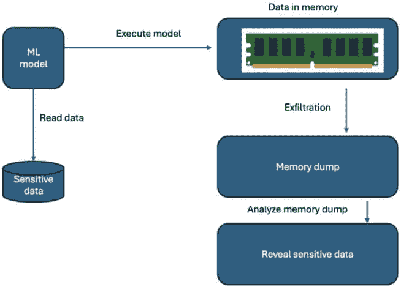
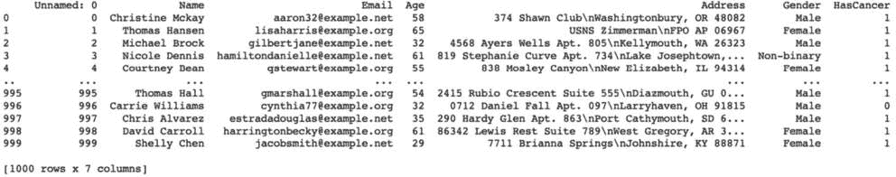

# 第九章：机密计算 – 什么是、为什么以及当前状态

对于处理敏感数据的企业来说，数据保护是一个重要的考虑因素，这些数据可以是个人数据或非个人数据。数据在组织内部可以存在于三种主要状态：静态数据、运动中的数据和内存中的数据。每种状态都有独特的安全和隐私问题，需要不同的安全方法和数据保护措施。在本章中，你将了解机密计算，包括它是什么、为什么需要它、它如何帮助保护内存中的数据攻击，以及当前技术的状态。

我们将涵盖以下主要主题：

+   对内存中数据的隐私/安全攻击：

+   机密计算的介绍

+   可信执行环境（TEE） – 源代码的证明及其如何帮助保护免受内部威胁攻击

+   TEE 中机器学习的行业标准

+   机密计算联盟

+   Intel、AWS、Azure、GCP 和 Anjuna 对安全区域支持的比较

# 对内存中数据的隐私/安全攻击

数据泄露指的是从计算机或网络到攻击者控制的远程位置的敏感信息的未授权传输或盗窃。这可以通过各种手段发生，例如黑客攻击、恶意软件、钓鱼或社会工程学。攻击者通常使用数据泄露来窃取有价值的知识产权、财务信息、**个人身份信息**（**PII**）或商业机密以谋取私利。一旦数据被盗，它可以在暗网出售、用于身份盗窃或被勒索。为了防止数据泄露，组织可以实施诸如防火墙、入侵检测和预防系统、加密、访问控制和员工培训计划等安全措施。

## 静态数据

在典型的产品/应用程序中，数据将持久化在物理存储系统上，例如文件系统、数据库系统（SQL/NoSQL）、Hadoop 文件系统、磁带、驱动器或云。这种数据被称为**静态数据**。如果存储设备落入错误的手中，静态数据容易受到盗窃或未授权访问的威胁。加密是保护静态数据最常见的方法之一，使用强大的加密算法（如上一章所述）并保持加密密钥安全至关重要。保持密钥安全的一种方法是通过使用安全保险库（开源或商业的，基于软件或硬件）。HashiCorp（[`github.com/hashicorp/vault`](https://github.com/hashicorp/vault)）是最著名的开源软件保险库之一，用于保护安全密钥。


图 9.1 – 静态数据的安全机制

## 运动中的数据

在数据在运动的情况下，数据在两个或多个系统（客户端和服务器）或两个或多个设备（相同或不同）之间流动。数据在运动可以是同步的或异步的。异步通信使用 Kafka 或 ActiveMQ 等消息系统，通过互联网或本地/广域网等网络进行。数据在运动也容易在传输过程中被拦截或篡改。为了保护数据在运动，应使用 HTTPS、**安全套接字层**（**SSL**）、**传输层安全性**（**TLS**）和**安全外壳**（**SSH**）等安全通信协议。


图 9.2 – 数据在运动中的保护机制

## 内存中的数据

内存中的数据是指在程序执行/运行期间临时存储在计算机内存（RAM 或缓存）中的数据。如果系统被黑客或企业内部人员破坏，内存中的数据也容易受到未经授权的访问、篡改或盗窃。在这种情况下，如何保护正在使用或存储在内存中的数据，以及哪种技术支持内存数据保护？


图 9.3 – 内存中数据的保护机制

### 示例程序展示存储在内存中的数据也容易受到内存攻击

在这个示例演示中，我们将展示一个简单的**机器学习**（**ML**）模型，该模型容易受到内部人员或通过恶意软件注入的程序进行的内存攻击。

内存攻击涉及的步骤如下：

+   开发一个简单的 ML 模型，该模型使用敏感信息进行训练。

+   执行模型。

+   生成进程的内存转储。

+   分析内存转储以发现 PII。



图 9.4 – 内部人员进行的内存数据攻击

让我们看看这个演示中涉及的步骤。

#### 步骤 1 – 生成敏感数据

在这个例子中，我们将使用 Faker 框架生成合成数据，具有以下特征 – `name`、`age`、`e-mail`、`gender`、`address`和`has_cancer`（是/否） – 以及 1,000 个样本。每次执行此代码时，都会生成不同的合成数据示例，因此您在环境中执行此代码时可能不会得到相同的数据：

生成合成数据

```py
from faker import Faker
import random
import pandas as pd
fake = Faker()
# Set random seed for reproducibility
random.seed(42)
# Generate 1000 random samples of sensitive data
data = []
for i in range(1000):
    name = fake.name()
    email = fake.email()
    age = random.randint(18, 80)
    address = fake.address()
    gender = random.choice(['Male', 'Female', 'Non-binary'])
    has_cancer = random.choice([1, 0])
    data.append([name, email, age, address, gender, has_cancer])
# Convert data to a pandas dataframe
df = pd.DataFrame(data, columns=['Name', 'Email', 'Age', 'Address', 'Gender', 'HasCancer'])
```

这是 DataFrame：



图 9.5 – 样本敏感数据集

#### 步骤 2 – 开发 ML 模型

使用生成的数据，使用随机森林算法开发一个机器学习模型：

```py
from sklearn.feature_extraction.text import HashingVectorizer
from sklearn.model_selection import train_test_split
from sklearn.linear_model import LogisticRegression
from sklearn.metrics import accuracy_score
import time
# Encode string features using HashingVectorizer
vectorizer = HashingVectorizer(n_features=4)
X = pd.DataFrame(
    vectorizer.fit_transform(df[['Name', 'Email', 'Address', 'Gender']].apply(lambda x: ' '.join(x), axis=1)).toarray(),
    columns=[f'feature_{i}' for i in range(4)]
)
# Concatenate encoded features with numeric features
X = pd.concat([X, df[['Age']]], axis=1)
print (X)
# Split the data into training and testing sets
X_train, X_test, y_train, y_test = train_test_split(
    X, df['HasCancer'], test_size=0.2, random_state=42
)
# Create an instance of the logistic regression model with default hyperparameters
model = LogisticRegression()
# Train the model on the training set
model.fit(X_train, y_train)
# Make predictions on the testing set
y_pred = model.predict(X_test)
# Evaluate the accuracy of the model
accuracy = accuracy_score(y_test, y_pred)
print(f'Accuracy: {accuracy}')
time.sleep(10000)
```

将整个代码存储在`CancerPredictionML.py`文件中，以便执行。

#### 步骤 3 – 执行此 ML 模型

要执行模型，只需使用以下命令：

python CancerPredictionML.py

#### 步骤 4 – 内存转储和泄露

`gcore`是 Unix 系统中的一个命令行实用程序，用于生成运行进程的核心转储。核心转储是一个文件，包含转储时进程内存的快照，可用于调试和法医分析目的。

识别`ps`命令：

```py
ps aux | grep CancerPredictionML
```

在这个例子中，`CancerPredictionML`程序进程的 PID 是`736`：

```py
user  736  0.5  0.0 604740 112264 pts/2   S+   09:07   0:01 python CancerPredictionML.py
user   768  0.0  0.0  14476  1108 pts/3    S+   09:11   0:00 grep CancerPredictionML
```

使用`gcore`生成进程的核心转储：

```py
gcore 736
```

此命令将在当前目录中创建一个名为`core.736`的文件，其中包含转储时的进程内存：

```py
[Thread debugging using libthread_db enabled]
Using host libthread_db library “/lib/x86_64-linux-gnu/libthread_db.so.1”.
0x00007fa2eab12d1f in select () from /lib/x86_64-linux-gnu/libc.so.6
warning: target file /proc/736/cmdline contained unexpected null characters
Saved corefile core.736
```

使用适合您调查的工具和技术分析内存转储文件。

#### 第 5 步 - 分析内存转储并找到敏感数据

要使用 Python 分析内存转储，可以使用`strings`等框架。

例如，您可以使用以下`strings`命令在内存转储中搜索敏感数据：

```py
strings dump_file | grep -i text_to search
```

此命令将在内存转储文件中搜索包含单词`Shelly`的字符串，并列出详细信息：

```py
strings core.736 | grep -i Shelly
Shelly Chen jacobsmith@example.net 7711 Brianna Springs
Shelly Chen jacobsmi
Shelly Chen
Shellyberg, CA 45423
```

现在，我们已经知道了*Shelly*的完整地址——她的电子邮件地址和物理地址。这样，内部人员就能在不接触源代码或训练或测试数据的情况下攻击机器学习模型并获取敏感信息。

注意，分析核心转储需要计算机系统和法医分析技术的专业知识。此外，未经适当授权和同意创建运行进程的核心转储是非法的，并可能导致严重的法律后果。

# 机密计算

**机密计算**是指在一个安全和可信的环境中处理敏感数据的做法，即使基础设施的所有者，数据的机密性也会得到保护。

机密计算旨在为计算系统的用户提供隐私、安全和完整性的保证，即使基础设施被黑客或恶意软件破坏。

我们将在下一节讨论机密计算的概念以及机密计算的好处。

## 什么是机密计算？

机密计算提供了一个安全和可信的空间，在称为安全区域（enclaves）的隔离和保护环境中处理数据。**安全区域**是内存中的安全区域，受到其他进程和操作系统的保护。安全区域对于**隐私保护机器学习**（**PPML**）应用非常有用，在这些应用中，敏感数据用于训练机器学习模型。在 PPML 中，确保数据的隐私得到保护，同时仍然允许模型有效训练是至关重要的。安全区域可以通过提供一个安全和可信的环境来帮助实现这一点，在该环境中，敏感数据可以处理而不会暴露给宿主系统或其他应用程序。

可以使用硬件安全功能，如英特尔**软件保护扩展**（**SGX**）或 ARM Trust Zone 来创建安全区域。

## 机密计算的好处

机密计算的主要好处如下：

+   **机密性**：机密计算通过在安全且可信的环境中处理数据来确保数据的机密性，防止未经授权的数据访问

+   **完整性**：机密计算通过验证数据在处理过程中未被篡改来确保数据的完整性

+   **信任**：机密计算提供了一个可信的环境，其中敏感数据可以在无需信任主机系统或其他应用程序的情况下进行处理

+   **合规性**：机密计算可以帮助组织遵守需要保护敏感数据的法规和行业标准

## 可信执行环境 - 源代码的认证及其如何帮助保护免受内部威胁攻击

**可信执行环境**（**TEE**）是计算机系统中的一个安全区域，它确保敏感数据和代码的机密性、完整性和可用性。TEE 提供了一个安全且隔离的执行环境，该环境与主操作系统隔离，旨在防止各种类型的攻击。

**认证**是验证软件或硬件组件身份的过程。它用于在计算系统中的不同实体之间建立信任。认证可以用来确保在 TEE 中运行的代码是真实的，并且未被篡改。

认证有多种类型，包括源代码认证、二进制认证和运行时认证。**源代码认证**涉及验证用于构建软件组件的源代码的完整性。**二进制认证**涉及验证由编译源代码产生的二进制代码的完整性。**运行时认证**涉及验证在系统中实际运行的代码的完整性。

认证可以帮助通过确保仅在 TEE 中执行授权代码来保护免受内部威胁攻击。内部威胁可能特别难以防御，因为它们涉及有合法访问敏感数据和系统的可信个人。认证可以通过确保只有授权个人有权访问敏感数据和系统来帮助减轻内部威胁的风险。

源代码认证的一种方法是通过使用加密哈希函数为源代码生成哈希值。然后可以使用数字签名算法对哈希值进行签名，以创建数字签名。数字签名可以用来验证源代码的完整性。

源代码认证的另一种方法是使用在构建过程中为源代码生成加密哈希值的加密构建系统。然后可以使用数字签名算法对哈希值进行签名，以创建数字签名。数字签名可以用来验证源代码的完整性。

除了源代码认证之外，还可以使用其他技术来防止内部威胁攻击。例如，可以使用访问控制策略来限制内部人员对敏感数据和系统的访问。加密可以用来保护静态和传输中的敏感数据。监控和审计可以用来检测可疑活动，并为法医分析提供活动记录。

通过使用这些和其他技术，组织可以帮助减轻内部威胁攻击的风险，并保护其敏感数据和系统。

### 英特尔 SGX 如何帮助在 PPML 中

英特尔 SGX 可以通过创建安全区域来帮助解决隐私和安全问题，在这些区域中，机器学习算法可以安全地执行，而不会使敏感数据面临暴露给其他软件或操作系统的风险。

英特尔 SGX 的一个关键特性是它能够在 CPU 内部创建隔离的安全区域，这些区域可以以安全加密的方式执行代码和存储数据。这些区域的内容受到其他软件和操作系统的保护，这意味着即使攻击者获得了对宿主系统的访问权限，他们也无法访问区域的内容。

这一特性对于 PPML 应用尤为重要，因为它允许敏感数据，如病历或财务数据，在 enclave 中安全存储和处理，而不会面临暴露给未经授权的方的风险。

除了提供隔离的 enclave 外，英特尔 SGX 还提供了认证功能，允许远程方验证 enclave 的身份，并确保其中的代码和数据没有被篡改。

这一特性对于涉及敏感数据的应用至关重要，因为它使各方能够验证机器学习算法是在可信环境中执行的，并且没有被破坏。英特尔 SGX 还可以帮助解决多方机器学习场景中关于数据隐私和安全的担忧，在这些场景中，多个方向共享模型贡献数据。

在这些场景中，使用安全区域可以使每一方都能控制自己的数据，同时仍然为共享模型做出贡献。这有助于在各方之间建立信任，并促进更有效的机器学习模型的创建。

# TEEs 中机器学习的行业标准

为了使用加密数据训练机器学习模型并将它们部署到第三方 TEE 中进行执行，各种标准机构定义了架构。

IEEE 2830-2021 是 IEEE 定义的标准之一，作为基于共享机器学习的可信执行环境的技术框架和要求的标准化文件 ([`ieeexplore.ieee.org/document/9586768`](https://ieeexplore.ieee.org/document/9586768))。

本标准规定了在 TEE 中执行机器学习应用的功能组件、工作流程、安全要求、技术要求和协议。本标准中定义的高级协议步骤如下：

1.  数据提供者从计算平台下载并部署工具。

1.  数据提供者执行数据准备，包括数据加密和授权。

1.  数据提供者将加密数据上传到计算平台。

1.  任务发起者在平台上启动计算任务，包括要训练的模型和算法。

1.  计算平台创建了一个 TEE。

1.  计算平台在 TEE 内部解密加密数据。

1.  计算平台使用解密数据在 TEE 内部执行计算，从而产生计算结果。

1.  计算结果由计算平台交付给结果接收者。

1.  然后，计算平台销毁 TEE 及其中的数据。

# 机密计算联盟

机密计算联盟([`confidentialcomputing.io/`](https://confidentialcomputing.io/))是由一些公司和组织组成的团体，他们共同努力推广机密计算技术的采用。该联盟成立于 2019 年，由 Linux 基金会主办。

机密计算联盟旨在通过推广行业标准与实践、教育开发者和用户关于机密计算的好处和用例，以及开发开源工具和框架以支持机密计算，来加速机密计算技术的采用。

联盟包括广泛的公司和组织，包括云服务提供商、硬件制造商、软件供应商和学术机构。联盟成员共同努力开发开源项目和工具，以实现机密计算，例如英特尔 SGX、AMD SEV 和谷歌 Asylo。

通过推广机密计算的采用，机密计算联盟旨在使新一代应用能够在安全和可信的环境中处理敏感数据，为 PPML、安全数据库和其他需要强大数据保护的应用开辟新的可能性。

## 高级比较：英特尔 SGX、AWS Nitro Enclaves、谷歌 Asylo、Azure enclaves 和 Anjuna

英特尔 SGX、AWS Nitro Enclaves、谷歌 Asylo、Azure enclaves 和 Anjuna 都是能够在更大计算系统内创建安全区域或安全计算环境的技术。

**英特尔 SGX**是一种基于硬件的技术，为应用提供安全的执行环境，以保护敏感数据和代码免受未经授权的访问。SGX 通过结合硬件和软件功能来创建隔离的区域，从而保护敏感数据和代码免受其他软件甚至操作系统本身的侵害。

**AWS Nitro Enclaves**与 Intel SGX 类似的技术，但作为**亚马逊网络服务**（**AWS**）中的一个服务提供，并在亚马逊的 Nitro 虚拟机上运行。Nitro Enclaves 允许在 AWS 实例中创建隔离的安全区域以保护敏感数据和代码。Nitro Enclaves 还与其他 AWS 服务集成，例如**密钥管理服务**（**KMS**）和 AWS **身份和访问管理**（**IAM**）。

**Google Asylo**是一个开源框架，它允许开发者在不同平台上构建和运行在安全区域中的应用程序，包括 Intel SGX 和 AMD **安全加密虚拟化**（**SEV**）。Asylo 提供了一个**软件开发工具包**（**SDK**），使得构建和部署利用安全区域的应用程序变得容易。

**Azure 安全区域**是微软 Azure 中的一个功能，它允许创建安全区域以保护敏感数据和代码。Azure 安全区域使用 Intel SGX 技术，在 Azure 虚拟机内创建隔离的安全区域。

**Anjuna** ([`www.anjuna.io/`](https://www.anjuna.io/))是一个平台，它使组织能够使用可以在本地或云中运行的安全区域来保护应用程序和数据。Anjuna 支持 Intel SGX 和 AMD SEV 技术，并提供了一系列用于构建、部署和管理安全区域的工具。使用 Anjuna 平台非常简单，无需对现有产品进行任何更改；您只需运行/开始使用它们的库即可。

这里是功能级别的比较：

| 功能/TEE | Intel SGX | AWS Nitro Enclaves | Google Asylo | Azure 安全区域 | Anjuna |
| --- | --- | --- | --- | --- | --- |
| 平台支持 | 基于 Intel 的平台 | AWS EC2 实例 | 多平台（包括 Intel SGX、SEV 和 ARM 架构上的 TEE） | Azure 机密计算虚拟机 | 多平台（包括 Intel SGX 和 AMD SEV） |
| 隔离机制 | 基于硬件的安全区域 | 基于硬件的安全区域 | 软件基础（带有硬件选项） | 基于硬件的安全区域 | 基于硬件的安全区域 |
| 认证 | 本地和远程 | AWS 认证服务 | 本地和远程 | 微软 Azure 认证 | 本地和远程 |
| 支持的语言 | C、C++、Rust、Go、Python 和 Java | C、C++和 Python | C、C++、Go、Java、Python 和 Rust | C、C++、.NET、Python、Go、Java 和 Rust | C、C++、Go、Python、Java 和 Rust |
| 开源 | 否（SDK 是开源的） | 否 | 是 | 否 | 否 |
| 易用性 | 中等（需要理解安全区域） | 高（完全集成到 AWS 服务中） | 高（灵活且可跨各种安全区域技术移植） | 高（集成到 Azure 服务中） | 高（提供了一种简单的方式来保护应用程序而无需对其进行修改） |

表 9.1 – TEE 的比较

总结来说，所有这些技术都使得创建安全区域以保护敏感数据和代码成为可能。然而，它们在支持的平台上、提供的工具以及与其他服务的集成程度方面有所不同。最终，技术的选择将取决于组织的具体需求和需求。

## TEE 的优缺点

假设我们正在为一个医疗保健组织开发一个机器学习模型。该模型旨在根据各种患者数据预测疾病结果。这些数据非常敏感，包括个人标识符和健康记录。为了保护这些数据，我们决定使用 TEE。

### 优点

使用 TEE 的优点包括：

+   **安全性**：TEE 在处理器内部提供了一个安全区域，其中执行机器学习模型。这个区域与系统其他部分隔离，降低了数据泄露或暴露的风险。

+   **数据隐私**：患者数据被加载到安全的区域，在处理过程中永远不会离开。这确保了数据不能被系统上的任何其他进程访问或查看，从而保护患者隐私。

+   **完整性**：TEE 确保区域内的代码和数据不会被篡改。这意味着机器学习模型做出的预测可以信任是准确和无偏见的，因为它们没有被干扰。

### 缺点

使用 TEE 的缺点包括：

+   **复杂性**：实现 TEE 可能很复杂。它需要仔细管理密钥和证书，以确保只有授权的代码和数据可以进入区域。这可能会增加系统的复杂性，并需要深入了解安全原则。

+   **性能开销**：TEE 引入的额外安全措施可能会引入性能开销。这可能会减慢机器学习模型的执行速度，如果需要实时预测，这可能会成为一个问题。

+   **调试有限**：在 TEE 内部调试机器学习模型可能更困难。区域的安全性质意味着传统的调试工具可能无法访问它，这使得识别和修复问题更加困难。

+   **潜在漏洞**：虽然 TEE 被设计成安全的，但它们对侧信道攻击等攻击免疫。如果在 TEE 本身中发现漏洞，可能会被利用来获取对安全区域的访问权限。这可能会暴露敏感的患者数据并损害机器学习模型的完整性。

### 对 TEE 的侧信道攻击

TEE 并非对所有类型的威胁免疫。一种特别阴险的攻击类型可以破坏 TEE，那就是侧信道攻击。

侧信道攻击利用程序执行过程中泄露的信息，如时间信息、功耗，甚至电磁辐射。这些攻击并不直接针对 TEE 保护的算法或数据，而是利用间接信息，这些信息可以用来推断敏感数据。

侧信道攻击对 TEE 特别有效有几个原因。首先，TEE 通常处理高度敏感的数据，使其成为攻击者的诱人目标。其次，由于 TEE 被设计为与系统其他部分隔离，它们可能无法访问其他部分系统中可用的相同类型的保护和对策。最后，TEE 的性质可能使得检测和应对侧信道攻击变得困难。

几种类型的侧信道攻击对 TEE（可信执行环境）特别有效。例如，时间攻击可以利用 TEE 执行某些操作所需时间的差异。通过仔细测量这些时间，攻击者可以推断出 TEE 正在处理的数据信息。功率分析攻击可以类似地利用功耗的变化，而电磁攻击可以利用非预期的电磁辐射。

为了防御侧信道攻击，TEE 可以采用各种对策。例如，它们可以使用恒定时间编程技术来消除时间变化。它们还可以使用功率分析对策，如随机化功耗或使用功率平滑技术。此外，它们可以使用屏蔽或其他技术来减少电磁辐射。

尽管有这些对策，侧信道攻击仍然是 TEE 的重大威胁。随着 TEE 在保护现代计算系统中继续发挥关键作用，行业必须继续研究和开发新的防御措施来对抗这些以及其他类型的攻击。

总之，虽然 TEE 在现代计算系统中提供了关键的安全层，但它们并非对侧信道攻击免疫。这些攻击利用程序执行过程中泄露的间接信息，并且对 TEE 特别有效。因此，开发并实施强大的对策来保护 TEE 免受侧信道攻击至关重要。

# 摘要

在本章中，我们介绍了针对内存中数据的隐私攻击以及保护机器学习应用免受内存攻击的框架和标准。在下一章中，我们将讨论涉及生成式 AI 和大型语言模型的隐私攻击，以及一些用于保护个人隐私的技术。
