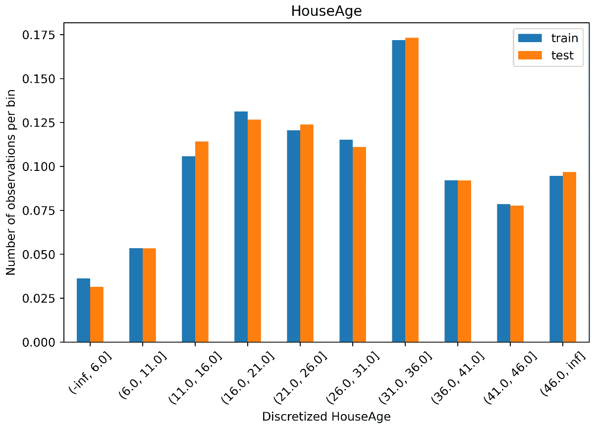
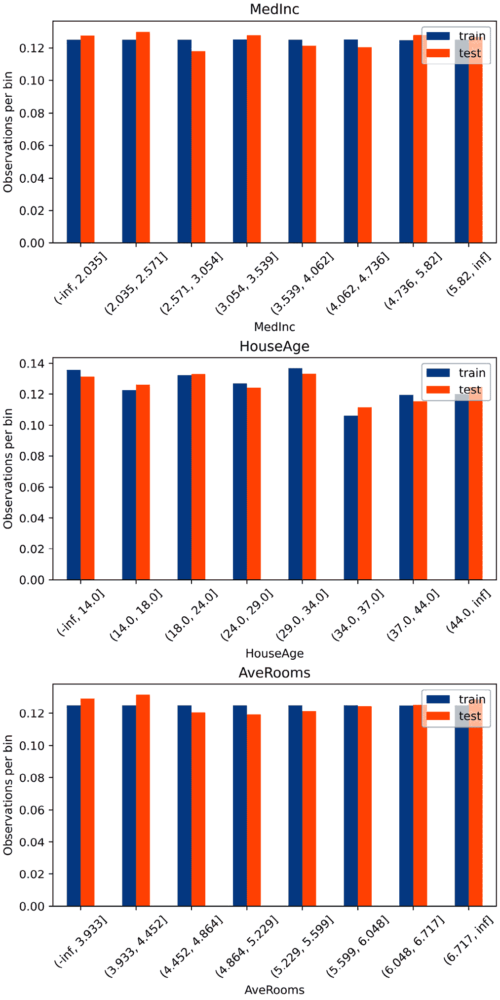
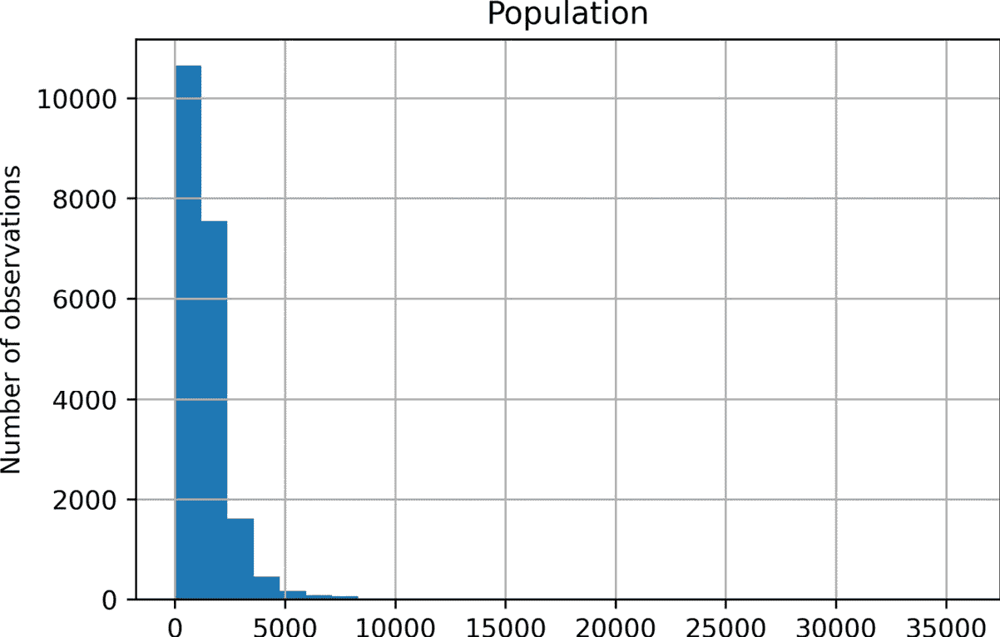
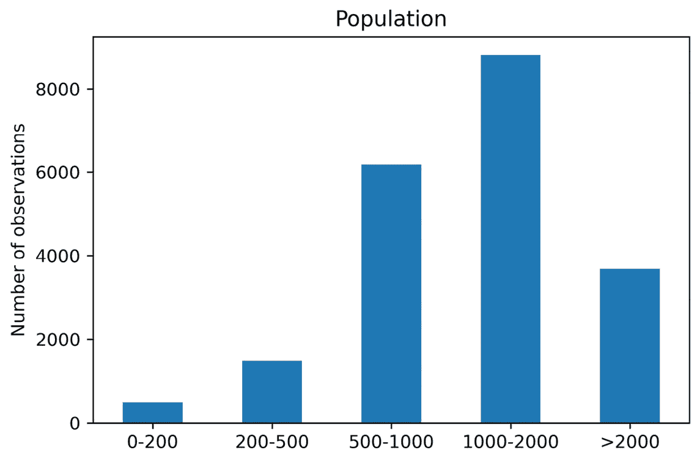
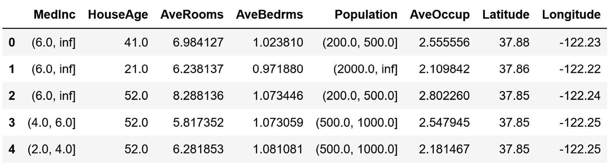
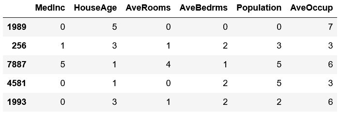
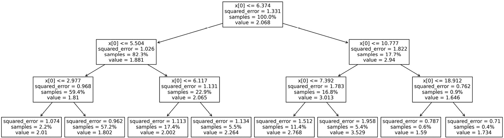
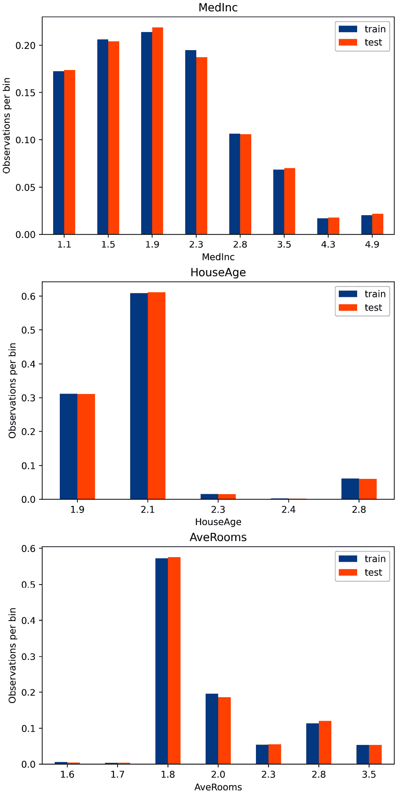

# 第四章：执行变量离散化

离散化是将连续变量通过创建一系列连续区间（也称为**bins**，跨越变量值的范围）转换为离散特征的过程。随后，这些区间被视为分类数据。

许多机器学习模型，如决策树和朴素贝叶斯，与离散属性配合工作效果更好。事实上，基于决策树的模型是根据属性上的离散分区做出决策的。在归纳过程中，决策树评估所有可能的特征值以找到最佳分割点。因此，特征值越多，树的归纳时间就越长。从这个意义上说，离散化可以减少模型训练所需的时间。

离散化还有额外的优势。数据被减少和简化；离散特征可以更容易被领域专家理解。离散化可以改变偏斜变量的分布；在按等频对区间进行排序时，值在范围内分布得更均匀。此外，离散化可以通过将它们放置在较低或较高的区间中，与分布的剩余**内点**值一起，最小化异常值的影响。总的来说，离散化减少了数据并简化了数据，使学习过程更快，并可能产生更准确的结果。

离散化也可能导致信息丢失，例如，通过将强烈关联不同类别或目标值的值组合到同一个区间中。因此，离散化算法的目标是在不造成重大信息丢失的情况下找到最小数量的区间。在实践中，许多离散化过程需要用户输入将值排序到的区间数量。然后，算法的任务是找到这些区间的分割点。在这些过程中，我们发现最广泛使用的等宽和等频离散化方法。基于决策树的离散化方法则能够找到最佳分区数量以及分割点。

离散化过程可以分为**监督**和**非监督**。非监督离散化方法仅使用变量的分布来确定连续区间的界限。另一方面，监督方法使用目标信息来创建区间。

在本章中，我们将讨论在成熟的开源库中广泛使用的监督和非监督离散化过程。在这些过程中，我们将涵盖等宽、等频、任意、k-均值和基于决策树的离散化。更详细的方法，如 ChiMerge 和 CAIM，超出了本章的范围，因为它们的实现尚未开源。

本章包含以下食谱：

+   执行等宽离散化

+   实现等频率离散化

+   将变量离散化到任意区间

+   使用 k-means 聚类进行离散化

+   实现特征二值化

+   使用决策树进行离散化

# 技术要求

在本章中，我们将使用数值计算库`pandas`、`numpy`、`matplotlib`、`scikit-learn`和`feature-engine`。我们还将使用`yellowbrick` Python 开源库，您可以使用`pip`进行安装：

```py
 pip install yellowbrick
```

想了解更多关于`yellowbrick`的信息，请访问以下文档：

https://www.scikit-yb.org/en/latest/index.html

# 进行等宽离散化

等宽离散化包括将变量的观测值范围划分为用户提供的*k*个等大小的区间。*X*变量的区间宽度如下所示：

![<math xmlns="http://www.w3.org/1998/Math/MathML" display="block"><mrow><mrow><mi mathvariant="bold-italic">W</mi><mi mathvariant="bold-italic">i</mi><mi mathvariant="bold-italic">d</mi><mi mathvariant="bold-italic">t</mi><mi mathvariant="bold-italic">h</mi><mo>=</mo><mfrac><mrow><mi mathvariant="bold-italic">M</mi><mi mathvariant="bold-italic">a</mi><mi mathvariant="bold-italic">x</mi><mfenced open="(" close=")"><mi mathvariant="bold-italic">X</mi></mfenced><mo>−</mo><mi mathvariant="bold-italic">M</mi><mi mathvariant="bold-italic">i</mi><mi mathvariant="bold-italic">n</mi><mo>(</mo><mi mathvariant="bold-italic">X</mi><mo>)</mo></mrow><mi mathvariant="bold-italic">k</mi></mfrac></mrow></mrow></math>](img/20.png)

然后，如果变量的值在 0 到 100 之间变化，我们可以创建五个箱，如下所示：*width = (100-0) / 5 = 20*。箱将分别是 0–20、20–40、40–60 和 80–100。第一个和最后一个箱（0–20 和 80–100）可以通过扩展限制到负无穷和正无穷来扩展，以容纳小于 0 或大于 100 的值。

在本配方中，我们将使用`pandas`、`scikit-learn`和`feature-engine`进行等宽离散化。

## 如何操作...

首先，让我们导入必要的 Python 库并准备好数据集：

1.  让我们导入库和函数：

    ```py
    import numpy as np
    import pandas as pd
    import matplotlib.pyplot as plt
    from sklearn.datasets import fetch_california_housing
    from sklearn.model_selection import train_test_split
    ```

1.  让我们加载加利福尼亚住房数据集的预测变量和目标变量：

    ```py
    X, y = fetch_california_housing(
        return_X_y=True, as_frame=True)
    ```

注意

为了避免数据泄露，我们将通过使用训练集中的变量来找到区间的限制。然后，我们将使用这些限制来对训练集和测试集中的变量进行离散化。

1.  让我们将数据分为训练集和测试集：

    ```py
    X_train, X_test, y_train, y_test = train_test_split(
        X, y, test_size=0.3, random_state=0)
    ```

    接下来，我们将使用`pandas`和配方开头描述的公式将连续的`HouseAge`变量划分为 10 个区间。

1.  让我们捕获`HouseAge`的最小和最大值：

    ```py
    min_value = int(X_train["HouseAge"].min())
    max_value = int(X_train["HouseAge"].max())
    ```

1.  让我们确定区间宽度，即变量的值范围除以箱数：

    ```py
    width = int((max_value - min_value) / 10)
    ```

    如果我们执行`print(width)`，我们将获得`5`，这是区间的尺寸。

1.  现在我们需要定义区间限制并将它们存储在一个列表中：

    ```py
    interval_limits = [i for i in range(
        min_value, max_value, width)]
    ```

    如果我们现在执行 `print(interval_limits)`，我们将看到区间限制：

    ```py
    [1, 6, 11, 16, 21, 26, 31, 36, 41, 46, 51]
    ```

1.  让我们将第一个和最后一个区间的限制范围扩展，以适应测试集或未来数据源中可能找到的较小或较大的值：

    ```py
    interval_limits[0] = -np.inf
    interval_limits[-1] = np.inf
    ```

1.  让我们复制 DataFrame，这样我们就不会覆盖原始的 DataFrame，我们将在后续步骤中需要它们：

    ```py
    train_t = X_train.copy()
    test_t = X_test.copy()
    ```

1.  让我们将 `HouseAge` 变量排序到我们在 *步骤 6* 中定义的区间中：

    ```py
    train_t["HouseAge_disc"] = pd.cut(
        x=X_train["HouseAge"],
        bins=interval_limits,
        include_lowest=True)
    test_t["HouseAge_disc"] = pd.cut(
        x=X_test["HouseAge"],
        bins=interval_limits,
        include_lowest=True)
    ```

注意

我们已将 `include_lowest=True` 设置为包含第一个区间中的最低值。请注意，我们使用训练集来找到区间，然后使用这些限制对两个数据集中的变量进行排序。

1.  让我们打印离散化和原始变量的前 `5` 个观测值：

    ```py
    print(train_t[["HouseAge", "HouseAge_disc"]].head(5))
    ```

    在以下输出中，我们可以看到 `52` 值被分配到 46–无限区间，`43` 值被分配到 41–46 区间，依此类推：

    ```py
             HouseAge HouseAge_disc
    1989         52.0   (46.0, inf]
    256           43.0  (41.0, 46.0]
    7887         17.0  (16.0, 21.0]
    4581         17.0  (16.0, 21.0]
    1993         50.0   (46.0, inf]
    ```

注意

区间中的括号和方括号表示一个值是否包含在区间内。例如，(41, 46] 区间包含所有大于 41 且小于或等于 46 的值。

等宽离散化将不同数量的观测值分配给每个区间。

1.  让我们绘制一个条形图，显示训练集和测试集中 `HouseAge` 区间的观测值比例：

    ```py
    t1 = train_t["HouseAge_disc"].value_counts(
        normalize=True, sort=False)
    t2 = test_t["HouseAge_disc"].value_counts(
        normalize=True, sort=False)
    tmp = pd.concat([t1, t2], axis=1)
    tmp.columns = ["train", "test"]
    tmp.plot.bar(figsize=(8, 5))
    plt.xticks(rotation=45)
    plt.ylabel("Number of observations per bin")
    plt.xlabel('Discretized HouseAge')
    plt.title("HouseAge")
    plt.show()
    ```

    在以下输出中，我们可以看到训练集和测试集中每个区间的观测值比例大致相同，但区间之间不同：



图 4.1 – 离散化后每个区间的观测值比例

使用 `feature-engine`，我们可以用更少的代码行和一次对多个变量执行等宽离散化。

1.  首先，让我们导入离散化器：

    ```py
    from feature_engine.discretisation import EqualWidthDiscretiser
    ```

1.  让我们将离散化器设置为将三个连续变量排序到八个区间中：

    ```py
    variables = ['MedInc', 'HouseAge', 'AveRooms']
    disc = EqualWidthDiscretiser(
        bins=8, variables=variables)
    ```

注意

`EqualWidthDiscretiser()` 返回一个整数，表示默认情况下值是否被排序到第一个、第二个或第八个箱中。这相当于顺序编码，我们在 *第二章* 的 *用顺序数字替换类别* 菜谱中描述过，*编码分类变量*。要使用 `feature-engine` 或 `category` `encoders` Python 库执行不同的编码，请将返回的变量作为对象类型，通过设置 `return_object` 为 `True`。或者，通过设置 `return_boundaries` 为 `True`，让转换器返回区间限制。

1.  让我们将离散化器适配到训练集，以便它为每个变量学习切点：

    ```py
    disc.fit(X_train)
    ```

    适配后，我们可以通过执行 `print(disc.binner_dict_)` 来检查 `binner_dict_` 属性中的切点。

注意

`feature-engine` 将自动将下限和上限区间的范围扩展到无限大，以适应未来数据中的潜在异常值。

1.  让我们将训练集和测试集中的变量进行离散化：

    ```py
    train_t = disc.transform(X_train)
    test_t = disc.transform(X_test)
    ```

    `EqualWidthDiscretiser()` 返回一个 DataFrame，其中选定的变量已离散化。如果我们运行 `test_t.head()`，我们将看到以下输出，其中 `MedInc`、`HouseAge` 和 `AveRooms` 的原始值被区间编号所取代：


图 4.2 – 包含三个离散化变量：HouseAge、MedInc 和 AveRooms 的 DataFrame

1.  现在，让我们通过绘制每个区间的观测比例的条形图来更好地理解等宽离散化的效果：

    ```py
    plt.figure(figsize=(6, 12), constrained_layout=True)
    for i in range(3):
        # location of plot in figure
        ax = plt.subplot(3, 1, i + 1)
        # the variable to plot
        var = variables[i]
        # determine proportion of observations per bin
        t1 = train_t[var].value_counts(normalize=True,
            sort=False)
        t2 = test_t[var].value_counts(normalize=True,
            sort=False)
        # concatenate proportions
        tmp = pd.concat([t1, t2], axis=1)
        tmp.columns = ['train', 'test']
        # sort the intervals
        tmp.sort_index(inplace=True)
        # make plot
        tmp.plot.bar(ax=ax)
        plt.xticks(rotation=0)
        plt.ylabel('Observations per bin')
        ax.set_title(var)
    plt.show()
    ```

    如以下图表所示，区间包含不同数量的观测值：


图 4.3 – 离散化后每个区间的观测比例的条形图

现在，让我们使用 scikit-learn 实现等宽离散化。

1.  让我们导入 scikit-learn 中的类：

    ```py
    from sklearn.compose import ColumnTransformer
    from sklearn.preprocessing import kBinsDiscretizer
    ```

1.  让我们通过将其 `strategy` 设置为 `uniform` 来设置一个等宽离散化器：

    ```py
    disc = KBinsDiscretizer(
        n_bins=8, encode='ordinal', strategy='uniform')
    ```

注意

`KBinsDiscretiser()` 可以通过将 `encoding` 设置为 `'ordinal'` 返回整数箱，或者通过将 `encoding` 设置为 `'onehot-dense'` 返回独热编码。

1.  让我们使用 `ColumnTransformer()` 来将离散化限制为从 *步骤 13* 中选择的变量：

    ```py
    ct = ColumnTransformer(
        [("discretizer", disc, variables)],
        remainder="passthrough",
    ).set_output(transform="pandas")
    ```

注意

将 `remainder` 设置为 `passthrough`，`ColumnTransformer()` 返回变换后的输入 DataFrame 中的所有变量。要仅返回变换后的变量，将 `remainder` 设置为 `drop`。

1.  让我们将离散化器拟合到训练集，以便它学习区间界限：

    ```py
    ct.fit(X_train)
    ```

1.  最后，让我们对训练集和测试集中的选定变量进行离散化：

    ```py
    train_t = ct.transform(X_train)
    test_t = ct.transform(X_test)
    ```

    我们可以通过执行 `ct.named_transformers_["discretizer"].bin_edges_` 来检查变压器学习到的切分点。

注意

`ColumnTransformer()` 将 `discretize` 添加到已离散化的变量，将 `remainder` 添加到未修改的变量。

我们可以通过执行 `test_t.head()` 来检查输出。

## 它是如何工作的…

在这个菜谱中，我们将变量值排序到等距区间中。要使用 `pandas` 进行离散化，我们首先使用 `max()` 和 `min()` 方法找到 `HouseAge` 变量的最大值和最小值。然后，我们通过将值范围除以任意箱子的数量来估计区间宽度。有了宽度和最小值、最大值，我们确定了区间界限并将它们存储在一个列表中。我们使用这个列表与 pandas 的 `cut()` 方法将变量值排序到区间中。

注意

Pandas 的 `cut()` 默认按等大小区间对变量进行排序。它将在每侧扩展变量范围的 .1%，以包含最小值和最大值。我们手动生成区间的理由是为了适应在部署我们的模型时，未来数据源中可能出现的比数据集中看到的更小或更大的值。

离散化后，我们通常将区间视为分类值。默认情况下，pandas 的 `cut()` 函数返回区间值作为有序整数，这相当于顺序编码。或者，我们可以通过将 `labels` 参数设置为 `None` 来返回区间限制。

为了显示每个区间的观测数，我们创建了一个条形图。我们使用 pandas 的 `value_counts()` 函数来获取每个区间的观测数比例，该函数返回一个 pandas Series，其中索引是区间，计数是值。为了绘制这些比例，首先，我们使用 pandas 的 `concat()` 函数在一个 DataFrame 中连接了训练集和测试集系列，并将其分配给 `train` 和 `test` 列名称。最后，我们使用 `plot.bar()` 显示条形图。我们使用 Matplotlib 的 `xticks()` 函数旋转标签，并使用 `xlabels()` 和 `ylabel()` 添加了 *x* 和 *y* 图例，以及使用 `title()` 添加了标题。

要使用 `feature-engine` 进行等宽离散化，我们使用了 `EqualWidthDiscretiser()`，它接受区间数量和要离散化的变量作为参数。通过 `fit()`，离散化器为每个变量学习了区间限制。通过 `transform()`，它将值排序到每个区间。

`EqualWidthDiscretiser()` 默认返回按顺序排列的整数作为区间，这相当于顺序编码。为了在 `feature-engine` 或 `category encoders` 库中跟随任何其他编码过程进行离散化，我们需要通过在设置转换器时将 `return_object` 设置为 `True` 来返回作为对象的区间。

注意

`EqualWidthDiscretiser()` 默认将第一个和最后一个区间的值扩展到负无穷和正无穷，以自动适应训练集中未见到的较小和较大的值。

我们使用条形图跟随离散化，以显示每个转换变量的每个区间的观测数比例。我们可以看到，如果原始变量是偏斜的，条形图也是偏斜的。注意 `MedInc` 和 `AveRooms` 变量的某些区间，这些变量具有偏斜分布，其中包含非常少的观测值。特别是，尽管我们想要为 `AveRooms` 创建八个区间，但只有足够的数据来创建五个，并且大多数变量的值都被分配到了第一个区间。

最后，我们使用 scikit-learn 的 `KBinsDiscretizer()` 将三个连续变量离散化到等宽区间。为了创建等宽区间，我们将 `strategy` 参数设置为 `uniform`。通过 `fit()`，转换器学习了区间的限制，而通过 `transform()`，它将值排序到每个区间。

我们使用了 `ColumnTransformer()` 来限制离散化到选定的变量，并将转换输出设置为 pandas，以在转换后获得 DataFrame。`KBinsDiscretizer()` 可以返回作为序数的区间，正如我们在配方中所做的那样，或者作为 one-hot 编码的变量。这种行为可以通过 `encode` 参数进行修改。

## 参考以下内容

为了比较等宽离散化与更复杂的方法，请参阅 Dougherty J, Kohavi R, Sahami M. *Supervised and unsupervised discretization of continuous features*. In: Proceedings of the 12th international conference on machine learning. San Francisco: Morgan Kaufmann; 1995\. p. 194–202.

# 实现等频离散化

等宽离散化直观且易于计算。然而，如果变量是偏斜的，那么将会有很多空区间或只有少数值的区间，而大多数观测值将被分配到少数几个区间。这可能导致信息丢失。这个问题可以通过自适应地找到区间切点来解决，使得每个区间包含相似比例的观测值。

等频离散化将变量的值划分为具有相同观测比例的区间。区间宽度由 **分位数** 决定。分位数是分割数据为相等部分的值。例如，中位数是一个将数据分为两半的分位数。四分位数将数据分为四个相等的部分，而百分位数将数据分为 100 个相等大小的部分。因此，区间可能具有不同的宽度，但观测数数量相似。区间的数量由用户定义。

在本配方中，我们将使用 `pandas`、`scikit-learn` 和 `feature-engine` 来执行等频离散化。

## 如何操作...

首先，让我们导入必要的 Python 库并准备数据集：

1.  让我们导入所需的 Python 库和函数：

    ```py
    import pandas as pd
    import matplotlib.pyplot as plt
    from sklearn.datasets import fetch_california_housing
    from sklearn.model_selection import train_test_split
    ```

1.  让我们将加利福尼亚住房数据集加载到 DataFrame 中：

    ```py
    X, y = fetch_california_housing(
        return_X_y=True, as_frame=True)
    ```

注意

为了避免数据泄露，我们将从训练集中确定区间界限或分位数。

1.  让我们将数据分为训练集和测试集：

    ```py
    X_train, X_test, y_train, y_test = train_test_split(
        X, y, test_size=0.3, random_state=0)
    ```

1.  让我们复制 DataFrame：

    ```py
    train_t = X_train.copy()
    test_t = X_test.copy()
    ```

1.  我们将使用 pandas 的 `qcut()` 函数来获取 `HouseAge` 变量的离散化副本，并将其存储为训练集中的一个新列，以及八个等频区间的界限：

    ```py
    train_t["House_disc"], interval_limits = pd.qcut(
        x=X_train["HouseAge"],
        q=8,
        labels=None,
        retbins=True,
    )
    ```

    如果你执行 `print(interval_limits)`，你会看到以下区间界限：`array([ 1., 14., 18., 24., 29., 34., 37., 44., 52.])`。

1.  让我们打印离散化和原始变量的前五个观测值：

    ```py
    print(train_t[["HouseAge", "House_disc"]].head(5))
    ```

    在以下输出中，我们可以看到 `52` 值被分配到 44–52 区间，`43` 值被分配到 37–44 区间，依此类推：

    ```py
           HouseAge     House_disc
    1989       52.0   (44.0, 52.0]
    256        43.0   (37.0, 44.0]
    7887       17.0   (14.0, 18.0]
    4581       17.0   (14.0, 18.0]
    HouseAge in the test set, using pandas cut() with the interval limits determined in *step 5*:

    ```

    test_t["House_disc"] = pd.cut(

    x=X_test["HouseAge"],

    bins=interval_limits,

    include_lowest=True)

    ```py

    ```

1.  让我们制作一个条形图，展示训练集和测试集中每个区间的观测比例：

    ```py
    # determine proportion of observations per bin
    t1 = train_t["House_disc"].value_counts(
        normalize=True)
    t2 = test_t["House_disc"].value_counts(normalize=True)
    # concatenate proportions
    tmp = pd.concat([t1, t2], axis=1)
    tmp.columns = ["train", "test"]
    tmp.sort_index(inplace=True)
    # plot
    tmp.plot.bar()
    plt.xticks(rotation=45)
    plt.ylabel("Number of observations per bin")
    plt.title("HouseAge")
    plt.show()
    ```

    在以下图中，我们可以看到每个区间包含相似比例的观测值：


图 4.4 – HouseAge 在等频率离散化后的每个区间的观测比例

使用`feature-engine`，我们可以将多个变量应用等频率离散化。

1.  让我们导入离散化器：

    ```py
    from feature_engine.discretisation import EqualFrequencyDiscretiser
    ```

1.  让我们设置转换器，将三个连续变量离散化到八个区间：

    ```py
    variables = ['MedInc', 'HouseAge', 'AveRooms']
    disc = EqualFrequencyDiscretiser(
        q=8, variables=variables, return_boundaries=True)
    ```

注

使用`return_boundaries=True`，转换器将在离散化后返回区间边界。要返回区间编号，将其设置为`False`。

1.  让我们将离散化器拟合到训练集，以便它学习区间限制：

    ```py
    disc.binner_dict_ attribute.
    ```

注

`feature-engine`将自动将下限和上限区间的限制扩展到无限，以适应未来数据中的潜在异常值。

1.  让我们将训练集和测试集中的变量进行转换：

    ```py
    train_t = disc.transform(X_train)
    test_t = disc.transform(X_test)
    ```

1.  让我们用每个区间的观测比例制作条形图，以便更好地理解等频率离散化的效果：

    ```py
    plt.figure(figsize=(6, 12), constrained_layout=True)
    for i in range(3):
        # location of plot in figure
        ax = plt.subplot(3, 1, i + 1)
        # the variable to plot
        var = variables[i]
        # determine proportion of observations per bin
        t1 = train_t[var].value_counts(normalize=True)
        t2 = test_t[var].value_counts(normalize=True)
        # concatenate proportions
        tmp = pd.concat([t1, t2], axis=1)
        tmp.columns = ['train', 'test']
        # sort the intervals
        tmp.sort_index(inplace=True)
        # make plot
        tmp.plot.bar(ax=ax)
        plt.xticks(rotation=45)
        plt.ylabel("Observations per bin")
        # add variable name as title
        ax.set_title(var)
     plt.show()
    ```

    在以下图中，我们可以看到区间具有相似比例的观测值：



图 4.5 – 对三个变量进行等频率离散化后每个区间的观测比例。

现在，让我们使用 scikit-learn 进行等频率离散化：

1.  让我们导入转换器：

    ```py
    from sklearn.preprocessing import KBinsDiscretizer
    ```

1.  让我们设置离散化器，将变量排序到八个等频率的区间：

    ```py
    disc = KBinsDiscretizer(
        n_bins=8, encode='ordinal', strategy='quantile')
    ```

1.  让我们将离散化器拟合到包含从*步骤 10*的变量的训练集切片，以便它学习区间限制：

    ```py
    disc.fit(X_train[variables])
    ```

注

scikit-learn 的`KBinsDiscretiser()`将离散化数据集中的所有变量。要仅对子集进行离散化，我们将转换器应用于包含感兴趣变量的 DataFrame 切片。或者，我们可以通过使用`ColumnTransformer()`来限制离散化到变量的子集，就像我们在*执行等宽* *离散化*配方中所做的那样。

1.  让我们复制包含我们将存储离散化变量的 DataFrames：

    ```py
    train_t = X_train.copy()
    test_t = X_test.copy()
    ```

1.  最后，让我们将训练集和测试集中的变量进行转换：

    ```py
    train_t[variables] = disc.transform(
        X_train[variables])
    test_t[variables] = disc.transform(X_test[variables])
    ```

我们可以通过执行`disc.bin_edges_`来检查切分点。

## 它是如何工作的...

在这个配方中，我们将变量值排序到具有相似观测比例的区间中。

我们使用 pandas 的 `qcut()` 从训练集中识别区间限制，并将 `HouseAge` 变量的值排序到这些区间中。接下来，我们将这些区间限制传递给 pandas 的 `cut()`，以在测试集中对 `HouseAge` 进行离散化。请注意，pandas 的 `qcut()`，就像 pandas 的 `cut()` 一样，返回区间值作为有序整数，这相当于顺序编码，

注意

在等频率离散化中，小连续范围内值的许多出现可能导致具有非常相似值的观测值，从而产生不同的区间。这个问题在于，它可能会在实际上性质相当相似的数据点之间引入人为的区别，从而偏置模型或后续数据分析。

使用 Feature-engine 的 `EqualFrequencyDiscretiser()`，我们将三个变量离散化到八个箱中。通过 `fit()`，离散化器学习了区间限制并将它们存储在 `binner_dict_` 属性中。通过 `transform()`，观测值被分配到各个箱中。

注意

`EqualFrequencyDiscretiser()` 返回一个整数，表示默认情况下值是否被排序到第一个、第二个或第八个箱中。这相当于顺序编码，我们在*第二章*的*用顺序数字替换类别*食谱中描述过，*编码* *分类变量*。

要使用不同类型的编码来跟进离散化，我们可以通过将 `return_object` 设置为 `True` 来返回作为对象的变量，然后使用任何 `feature-engine` 或 `category encoders` 转换器。或者，我们可以返回区间限制，就像在这个食谱中所做的那样。

最后，我们使用 `scikit-learn` 的 `KBinsDiscretizer()` 将变量离散化到八个等频率箱中。通过 `fit()`，转换器学习了切点并将它们存储在其 `bin_edges_` 属性中。通过 `transform()`，它将值排序到每个区间中。请注意，与 `EqualFrequencyDiscretiser()` 不同，`KBinsDiscretizer()` 将转换数据集中的所有变量。为了避免这种情况，我们只在需要修改变量的数据子集上应用离散化器。

注意

scikit-learn 的 `KbinsDiscretizer` 有一个选项可以返回作为顺序数字或独热编码的区间。可以通过 `encode` 参数修改行为。

# 将变量离散化到任意区间

在各个行业中，将变量值分组到对业务有意义的段是常见的。例如，我们可能希望将变量年龄分组到代表儿童、年轻人、中年人和退休人员的区间。或者，我们可能将评级分为差、好和优秀。有时，如果我们知道变量处于某个尺度（例如，对数尺度），我们可能希望在尺度内定义区间切点。

在这个食谱中，我们将使用 `pandas` 和 `feature-engine` 将变量离散化到预定义的用户区间。

## 人口值在 0 到大约 40,000 之间变化：

让我们检查原始变量和离散化变量的前五行：

1.  导入 Python 库和类：

    ```py
    import numpy as np
    import pandas as pd
    import matplotlib.pyplot as plt
    from sklearn.datasets import fetch_california_housing
    ```

1.  让我们将加利福尼亚住房数据集加载到`pandas` DataFrame 中：

    ```py
    X, y = fetch_california_housing(
        return_X_y=True, as_frame=True)
    ```

1.  让我们绘制`Population`变量的直方图以找出其值范围：

    ```py
    X["Population"].hist(bins=30)
    plt.title("Population")
    plt.ylabel("Number of observations")
    plt.show()
    ```

    

首先，让我们导入必要的 Python 库并准备好数据集：

图 4.6 – Population 变量的直方图

1.  让我们创建一个具有任意区间限制的列表，将上限设置为无穷大以适应更大的值：

    ```py
    intervals = [0, 200, 500, 1000, 2000, np.inf]
    ```

1.  让我们创建一个包含区间限制的字符串列表：

    ```py
    labels = ["0-200", "200-500", "500-1000", "1000-2000",
        ">2000"]
    ```

1.  让我们复制数据集并使用*步骤 4*中的预定义限制对`Population`变量进行离散化：

    ```py
    X_t = X.copy()
    X_t[«Population_limits»] = pd.cut(
        X["Population"],
        bins=intervals,
        labels=None,
        include_lowest=True)
    ```

1.  现在，让我们将`Population`离散化到预定义的区间，并使用我们在*步骤 5*中定义的标签来命名这些区间以进行比较：

    ```py
    X_t[«Population_range»] = pd.cut(
        X[„Population"],
        bins=intervals,
        labels=labels,
        include_lowest=True)
    ```

1.  如何操作...

    ```py
    X_t[['Population', 'Population_range',
        'Population_limits']].head()
    ```

    在 DataFrame 的最后两列中，我们可以看到离散化变量：第一个以我们在*步骤 5*中创建的字符串作为值，第二个以区间限制作为值：

    ```py
       Population Population_range Population_limits
    0       322.0          200-500    (200.0, 500.0]
    1      2401.0            >2000     (2000.0, inf]
    2       496.0          200-500    (200.0, 500.0]
    3       558.0         500-1000   (500.0, 1000.0]
    4       565.0         500-1000   (500.0, 1000.0]
    ```

注意

我们只需要变量版本中的一个，无论是值范围还是区间限制。在这个菜谱中，我创建了两个来突出`pandas`提供的不同选项。

1.  最后，我们可以计算并绘制每个区间内的观测数：

    ```py
    X_t['Population_range'
        ].value_counts().sort_index().plot.bar()
    plt.xticks(rotation=0)
    plt.ylabel("Number of observations")
    plt.title("Population")
    plt.show()
    ```

    在以下图中，我们可以看到每个区间的观测数不同：



图 4.7 – 离散化后每个区间的观测数比例。

为了总结这个菜谱，让我们利用`feature-engine`对多个变量进行离散化：

1.  让我们导入转换器：

    ```py
    from feature_engine.discretisation import
        ArbitraryDiscretiser
    ```

1.  让我们创建一个字典，以变量作为键，以区间限制作为值：

    ```py
    intervals = {
        "Population": [0, 200, 500, 1000, 2000, np.inf],
        "MedInc": [0, 2, 4, 6, np.inf]}
    ```

1.  让我们使用*步骤 11*中的限制设置离散化器：

    ```py
    discretizer = ArbitraryDiscretiser(
        binning_dict=intervals, return_boundaries=True)
    ```

1.  现在，我们可以继续对变量进行离散化：

    ```py
    X_t = discretizer.fit_transform(X)
    ```

    如果我们执行`X_t.head()`，我们将看到以下输出，其中`Population`和`MedInc`变量已被离散化：



图 4.8 – 包含离散化变量的 DataFrame

让我们检查原始变量和离散化变量的前五行：

## 人口值在 0 到大约 40,000 之间变化：

在这个菜谱中，我们将一个变量的值排序到用户定义的区间中。首先，我们绘制了`Population`变量的直方图，以了解其值范围。接下来，我们任意确定了区间的界限，并将它们记录在一个列表中。我们创建了包含 0–200、200–500、500–1000、1000–2000 以及超过 2,000 的区间，通过将上限设置为`np.inf`来表示无限大。然后，我们创建了一个包含区间名称的字符串列表。使用 pandas 的`cut()`函数并传递包含区间界限的列表，我们将变量值排序到预先定义的箱中。我们执行了两次命令；在第一次运行中，我们将`labels`参数设置为`None`，结果返回区间界限。在第二次运行中，我们将`labels`参数设置为字符串列表。我们将返回的输出捕获在两个变量中：第一个变量显示区间界限作为值，第二个变量具有字符串作为值。最后，我们使用 pandas 的`value_counts()`函数统计每个变量的观测数。

最后，我们使用`feature-engine`的`ArbitraryDiscretiser()`函数自动化了该过程。这个转换器接受一个字典，其中包含要离散化的变量作为键，以及作为值的区间界限列表，然后在底层使用 pandas 的`cut()`函数来离散化变量。使用`fit()`时，转换器不会学习任何参数，但会检查变量是否为数值型。使用`transform()`时，它会离散化变量。

# 使用 k-means 聚类进行离散化

离散化过程的目标是找到一组切割点，将变量划分为具有良好类别一致性的少量区间。为了创建将相似观测值分组在一起的分区，我们可以使用 k-means 等聚类算法。

在使用 k-means 聚类进行离散化时，分区是由 k-means 算法识别的聚类。k-means 聚类算法有两个主要步骤。在初始化步骤中，随机选择*k*个观测值作为*k*个聚类的初始中心，剩余的数据点被分配到最近的聚类中。聚类接近度是通过距离度量来衡量的，例如欧几里得距离。在迭代步骤中，聚类的中心被重新计算为聚类内所有观测值的平均值，观测值被重新分配到新创建的最近聚类。迭代步骤会继续进行，直到找到最优的*k*个中心。

使用 k-means 进行离散化需要一个参数，即*k*，即聚类数量。有几种方法可以确定最佳聚类数量。其中之一是肘部法，我们将在本食谱中使用这种方法。该方法包括使用不同的*k*值在数据上训练几个 k-means 算法，然后确定聚类返回的解释变异。在下一步中，我们将解释变异作为聚类数量*k*的函数进行绘图，并选择曲线的*肘部*作为要使用的聚类数量。肘部是表明增加*k*的数量不会显著增加模型解释的变异的拐点。有不同指标可以量化解释变异。我们将使用每个点到其分配中心的平方距离之和。

在本食谱中，我们将使用 Python 库`yellowbrick`来确定最佳聚类数量，然后使用 scikit-learn 执行 k-means 离散化。

## 如何操作...

让我们先导入必要的 Python 库并准备好数据集：

1.  导入所需的 Python 库和类：

    ```py
    import pandas as pd
    from sklearn.cluster import KMeans
    from sklearn.datasets import fetch_california_housing
    from sklearn.model_selection import train_test_split
    from sklearn.preprocessing import KBinsDiscretizer
    from yellowbrick.cluster import KElbowVisualizer
    ```

1.  让我们将加利福尼亚住房数据集加载到`pandas` DataFrame 中：

    ```py
    X, y = fetch_california_housing(
        return_X_y=True, as_frame=True)
    ```

1.  应该使用训练集来确定 k-means 最佳聚类，因此让我们将数据分为训练集和测试集：

    ```py
    X_train, X_test, y_train, y_test = train_test_split(
        X, y, test_size=0.3, random_state=0)
    ```

1.  让我们创建一个包含要转换的变量的列表：

    ```py
    variables = ['MedInc', 'HouseAge', 'AveRooms']
    ```

1.  让我们设置一个 k-means 聚类算法：

    ```py
    k_means = KMeans(random_state=10)
    ```

1.  现在，使用 Yellowbrick 的可视化器和肘部法，让我们找到每个变量的最佳聚类数量：

    ```py
    for variable in variables:
        # set up a visualizer
        visualizer = KElbowVisualizer(
            k_means, k=(4,12),
            metric='distortion',
            timings=False)
        visualizer.fit(X_train[variable].to_frame())
        visualizer.show()
    ```

    在以下图中，我们可以看到前两个变量的最佳聚类数量为六，第三个为七：


图 4.9 – 从上到下为 MedInc、HouseAge 和 AveRooms 变量的聚类数量与解释变异的关系

1.  让我们设置一个使用 k-means 聚类创建六个分区并返回聚类作为独热编码变量的离散化器：

    ```py
    disc = KBinsDiscretizer(
        n_bins=6,
        encode="onehot-dense",
        strategy="kmeans",
        subsample=None,
    ).set_output(transform="pandas")
    ```

1.  让我们将离散化器拟合到包含要离散化变量的 DataFrame 切片，以便它为每个变量找到聚类：

    ```py
    disc.fit(X_train[variables])
    ```

注意

在本食谱中，我们将所有三个变量的值排序到六个聚类中。要将`MedInc`和`HouseAge`离散化到六个分区，将`AveRooms`离散化到七个分区，我们需要为每个变量组设置一个离散化器实例，并使用`ColumnTransformer()`来限制离散化到每个组。

1.  让我们检查切分点：

    ```py
    disc.bin_edges_
    ```

    每个数组包含`MedInc`、`HouseAge`和`AveRooms`六个聚类的切分点：

    ```py
    array([array([0.4999, 2.49587954, 3.66599029, 4.95730115, 6.67700141, 9.67326677, 15.0001]),
    array([1., 11.7038878, 19.88430419, 27.81472503, 35.39424098, 43.90930314, 52.]),
    array([0.84615385, 4.84568771, 6.62222005, 15.24138445, 37.60664483, 92.4473438, 132.53333333])], dtype=object)
    ```

1.  让我们从训练测试集中获取变量的离散化形式：

    ```py
    train_features = disc.transform(X_train[variables])
    test_features = disc.transform(X_test[variables])
    ```

    使用 `print(test_features)`，我们可以检查离散化器返回的 DataFrame。它包含 18 个二进制变量，对应于每个三个数值变量返回的六个簇的一热编码转换：

    ```py
             MedInc_0.0  MedInc_1.0  MedInc_2.0  MedInc_3.0  MedInc_4.0  MedInc_5.0  \
    14740            0.0            0.0            1.0            0.0            0.0            0.0
    10101            0.0            0.0            0.0            1.0            0.0            0.0
    20566            0.0            0.0            1.0            0.0            0.0            0.0
    2670              1.0            0.0            0.0            0.0            0.0            0.0
    15709            0.0            0.0            0.0            1.0            0.0            0.0
             HouseAge_0.0  HouseAge_1.0  HouseAge_2.0  HouseAge_3.0  HouseAge_4.0  \
    14740               0.0               0.0               1.0               0.0               0.0
    10101               0.0               0.0               0.0               1.0               0.0
    20566               0.0               0.0               0.0               1.0               0.0
    2670                 0.0               0.0               0.0               0.0               1.0
    15709               0.0               0.0               1.0               0.0               0.0
             HouseAge_5.0  AveRooms_0.0  AveRooms_1.0  AveRooms_2.0  AveRooms_3.0  \
    14740               0.0               0.0               1.0               0.0               0.0
    10101               0.0               0.0               1.0               0.0               0.0
    20566               0.0               0.0               1.0               0.0               0.0
    2670                 0.0               0.0               1.0               0.0               0.0
    15709               0.0               1.0               0.0               0.0               0.0
             AveRooms_4.0  AveRooms_5.0
    14740               0.0               0.0
    10101               0.0               0.0
    20566               0.0               0.0
    2670                 0.0               0.0
    15709               0.0               0.0
    ```

您可以使用 `pandas` 将结果连接到原始 DataFrame，然后删除原始数值变量。或者，使用 `ColumnTransformer()` 类将离散化限制为所选变量，并通过将 `remainder` 设置为 `"passthrough"` 将结果添加到数据中。

## 它是如何工作的...

在这个配方中，我们使用 k-means 聚类进行了离散化。首先，我们通过使用 Yellowbrick 的 `KElbowVisualizer()` 利用肘部方法确定了最佳簇数量。

要执行 k-means 离散化，我们使用了 scikit-learn 的 `KBinsDiscretizer()`，将 `strategy` 设置为 `kmeans`，并在 `n_bins` 参数中将簇的数量设置为六。使用 `fit()`，转换器通过 k-means 算法学习了簇边界。使用 `transform()`，它将变量值排序到相应的簇。我们将 `encode` 设置为 `"onehot-dense"`；因此，在离散化后，转换器对簇应用了一热编码。我们还设置了离散化器的输出为 `pandas`，因此转换器返回了作为 DataFrame 的聚类变量的一个热编码版本。

## 参见

+   在 *Palaniappan 和 Hong, Discretization of Continuous Valued Dimensions in OLAP Data Cube* 文章中描述了使用 k-means 进行离散化。国际计算机科学和网络安全杂志，第 8 卷第 11 期，2008 年 11 月。[`paper.ijcsns.org/07_book/200811/20081117.pdf`](http://paper.ijcsns.org/07_book/200811/20081117.pdf)。

+   要了解更多关于肘部方法的信息，请访问 Yellowbrick 的文档和参考资料：[`www.scikit-yb.org/en/latest/api/cluster/elbow.html`](https://www.scikit-yb.org/en/latest/api/cluster/elbow.html)。

+   要了解确定 k-means 聚类拟合的其他方法，请查看 Yellowbrick 中的其他可视化工具：[`www.scikit-yb.org/en/latest/api/cluster/index.html`](https://www.scikit-yb.org/en/latest/api/cluster/index.html)。

# 实现特征二值化

一些数据集包含稀疏变量。稀疏变量是指大多数值都是 0 的变量。稀疏变量的经典例子是通过词袋模型从文本数据中得到的，其中每个变量是一个单词，每个值代表单词在某个文档中出现的次数。鉴于一个文档包含有限数量的单词，而特征空间包含所有文档中出现的单词，大多数文档，即大多数行，对于大多数列将显示 0 值。然而，单词并不是唯一的例子。如果我们考虑房屋细节数据，*桑拿数量*变量对于大多数房屋也将是 0。总之，一些变量具有非常偏斜的分布，其中大多数观测值显示相同的值，通常是 0，而只有少数观测值显示不同的值，通常是更高的值。

为了更简单地表示这些稀疏或高度偏斜的变量，我们可以通过将所有大于 1 的值裁剪为 1 来对它们进行二值化。实际上，二值化通常在文本计数数据上执行，我们考虑的是特征的缺失或存在，而不是单词出现次数的量化。

在本配方中，我们将使用`scikit-learn`执行二值化。

## 准备工作

我们将使用一个包含单词袋的数据集，该数据集可在 UCI 机器学习仓库（https://archive.ics.uci.edu/ml/datasets/Bag+of+Words）中找到。它受 CC BY 4.0 许可（[`creativecommons.org/licenses/by/4.0/legalcode`](https://creativecommons.org/licenses/by/4.0/legalcode)）。

我下载并准备了一个小型的单词袋数据集，它代表了一个数据集的简化版本。您可以在附带的 GitHub 仓库中找到这个数据集：

[`github.com/PacktPublishing/Python-Feature-Engineering-Cookbook-Third-Edition/tree/main/ch04-discretization`](https://github.com/PacktPublishing/Python-Feature-Engineering-Cookbook-Third-Edition/tree/main/ch04-discretization)

## 如何操作...

让我们先导入库并加载数据：

1.  让我们导入所需的 Python 库、类和数据集：

    ```py
    import pandas as pd
    import matplotlib.pyplot as plt
    from sklearn.model_selection import train_test_split
    from sklearn.preprocessing import Binarizer
    ```

1.  让我们加载数据集，该数据集包含单词作为列，不同的文本作为行：

    ```py
    data = pd.read_csv("bag_of_words.csv")
    ```

1.  让我们显示直方图以可视化变量的稀疏性：

    ```py
    data.hist(bins=30, figsize=(20, 20), layout=(3,4))
    plt.show()
    ```

    在以下直方图中，我们可以看到不同的单词在大多数文档中出现的次数为零：


图 4.10 – 表示每个单词在文档中出现的次数的直方图

1.  让我们设置`binarizer`以裁剪所有大于 1 的值到 1，并返回结果为 DataFrames：

    ```py
    binarizer = Binarizer(threshold = 0) .set_output(transform="pandas")
    ```

1.  让我们二值化变量：

    ```py
    data_t = binarizer.fit_transform(data)
    ```

    现在，我们可以通过显示直方图来探索二值化变量的分布，就像在*步骤 3*中那样，或者更好，通过创建条形图。

1.  让我们创建一个条形图，显示每个变量的每个箱中的观测数：

    ```py
    variables = data_t.columns.to_list()
    plt.figure(figsize=(20, 20), constrained_layout=True)
    for i in range(10):
        ax = plt.subplot(3, 4, i + 1)
        var = variables[i]
        t = data_t[var].value_counts(normalize=True)
        t.plot.bar(ax=ax)
        plt.xticks(rotation=0)
        plt.ylabel("Observations per bin")
        ax.set_title(var)
    plt.show()
    ```

    在下面的图表中，我们可以看到二值化变量，其中大多数出现次数显示的是`0`值：


图 4.11 – 包含显示或不显示每个单词的文档数量的条形图

就这样；现在我们有了数据的一个更简单的表示。

## 它是如何工作的...

在这个配方中，我们将稀疏变量的表示方式改为考虑出现的存在或不存在，在我们的案例中，这是一个单词。数据由一个词袋组成，其中每个变量（列）是一个单词，每行是一个文档，值表示单词在文档中出现的次数。大多数单词不会出现在大多数文档中；因此，数据中的大多数值都是 0。我们通过直方图证实了数据的稀疏性。

scikit-learn 的`Binarizer()`将大于阈值的值映射到`1`，在我们的案例中，这个阈值是 0，而小于或等于阈值的值被映射到 0。`Binarizer()`有`fit()`和`transform()`方法，其中`fit()`不做任何事情，而`transform()`对变量进行二值化。

`Binarizer()`默认通过 NumPy 数组修改数据集中的所有变量。要返回`pandas`数据框，我们将转换输出设置为`pandas`。

# 使用决策树进行离散化

在本章的所有先前配方中，我们任意确定区间的数量，然后离散化算法会以某种方式找到区间界限。决策树可以自动找到区间界限和最优的箱数。

决策树方法在学习过程中对连续属性进行离散化。在每个节点，决策树评估一个特征的所有可能值，并通过利用性能指标（如熵或基尼不纯度用于分类，或平方或绝对误差用于回归）选择最大化类别分离或样本一致性的切割点。因此，观察结果根据它们的特征值是否大于或小于某些切割点而最终落在某些叶子节点上。

在下面的图中，我们可以看到训练用来根据房产的平均房间数预测房价的决策树的图：


图 4.12 – 基于房产平均房间数预测房价的决策树图

基于此决策树，平均房间数小于 5.5 的房屋将进入第一个叶子节点，平均房间数在 5.5 到 6.37 之间的房屋将进入第二个叶子节点，平均房间数在 6.37 到 10.77 之间的房屋将进入第三个叶子节点，平均房间数大于 10.77 的房屋将进入第四个叶子节点。

如你所见，按照设计，决策树可以找到将变量分割成具有良好类别一致性的区间的切割点集。

在这个菜谱中，我们将使用 Feature-engine 执行基于决策树的离散化。

## 如何做到这一点...

让我们从导入一些库和加载数据开始：

1.  让我们导入所需的 Python 库、类和数据集：

    ```py
    import pandas as pd
    import matplotlib.pyplot as plt
    from sklearn.datasets import fetch_california_housing
    from sklearn.model_selection import train_test_split
    from sklearn.tree import plot_tree
    from feature_engine.discretisation import DecisionTreeDiscretiser
    ```

1.  让我们将加利福尼亚住房数据集加载到`pandas` DataFrame 中，然后将其拆分为训练集和测试集：

    ```py
    X, y = fetch_california_housing(return_X_y=True,
        as_frame=True)
    X_train, X_test, y_train, y_test = train_test_split(
        X, y, test_size=0.3, random_state=0)
    ```

1.  让我们创建一个包含要离散化变量名的列表：

    ```py
    variables = list(X.columns)[:-2]
    ```

    如果我们执行 `print(variables)`，我们将看到以下变量名：`['MedInc'`, `'HouseAge'`, `'AveRooms'`, `'AveBedrms'`, `'Population'`, `'AveOccup']`。

1.  让我们设置转换器来离散化第 3 步中的变量。我们希望转换器根据三折交叉验证的负均方误差指标优化每个树的超参数的最大深度和每个叶子的最小样本数。我们希望离散化的输出是区间的限制：

    ```py
    disc = DecisionTreeDiscretiser(
        bin_output="boundaries",
        precision=3,
        cv=3,
        scoring="neg_mean_squared_error",
        variables=variables,
        regression=True,
        param_grid={
            "max_depth": [1, 2, 3],
            "min_samples_leaf": [10, 20, 50]},
    )
    ```

1.  让我们使用训练集来拟合离散化器，以便它为每个变量找到最佳的决策树：

    ```py
    disc.fit(X_train, y_train)
    ```

注意

你可以通过执行 `disc.binner_dict_` 来检查每个变量在`binner_dict_`属性中找到的区间限制。注意离散化器如何将负无穷和正无穷添加到限制中，以适应训练集中观察到的较小和较大的值。

1.  让我们离散化变量，然后显示转换训练集的前五行：

    ```py
    train_t = disc.transform(X_train)
    test_t = disc.transform(X_test)
    train_t[variables].head()
    ```

    在以下输出中，我们可以看到每个观测值分配的区间限制：


图 4.13 – 包含离散化变量的转换训练集的前五行

注意

如果你选择返回区间限制并想使用这些数据集来训练机器学习模型，你需要对离散化进行后续的一热编码或序数编码。请参阅*第二章*，“分类变量编码”，以获取更多详细信息。

1.  而不是返回区间限制，我们可以通过设置转换器如下来返回每个观测值分配的区间编号：

    ```py
    disc = DecisionTreeDiscretiser(
        bin_output="bin_number",
        cv=3,
        scoring="neg_mean_squared_error",
        variables=variables,
        regression=True,
        param_grid={
            "max_depth": [1, 2, 3],
            "min_samples_leaf": [10, 20, 50]})
    ```

1.  我们现在可以拟合并转换训练集和测试集：

    ```py
    train_t = disc.fit_transform(X_train, y_train)
    test_t = disc.transform(X_test)
    ```

    如果你现在执行 `train_t[variables].head()`，你将看到整数作为结果而不是区间限制：



图 4.14 – 包含离散化变量的转换训练集的前五行

为了总结这个菜谱，我们将使离散化器返回树的预测作为离散化变量的替换值：

1.  让我们设置转换器以返回预测，然后将其拟合到训练集，并最终转换两个数据集：

    ```py
    disc = DecisionTreeDiscretiser(
        bin_output="prediction",
        precision=1,
        cv=3,
        scoring="neg_mean_squared_error",
        variables=variables,
        regression=True,
        param_grid=
            {"max_depth": [1, 2, 3],
                "min_samples_leaf": [10, 20, 50]},
    )
    train_t = disc.fit_transform(X_train, y_train)
    test_t = disc.transform(X_test)
    ```

1.  让我们探索 `AveRooms` 变量在离散化前后的唯一值数量：

    ```py
    X_test["AveRooms"].nunique(), test_t["AveRooms"].nunique()
    ```

    在以下输出中，我们可以看到决策树的预测也是离散的或有限的，因为树包含有限数量的终端叶子；`7`，而原始变量包含超过 6000 个不同的值：

    ```py
    (6034, 7)
    ```

1.  为了更好地理解树的结构，我们可以将其捕获到一个变量中：

    ```py
    tree = disc.binner_dict_["AveRooms"].best_estimator_
    ```

注意

当我们将转换器设置为返回整数或区间限制时，我们将在 `binner_dict_` 属性中获得区间限制。如果我们设置转换器以返回树预测，`binner_dict_` 将包含每个变量的训练树。

1.  现在，我们可以显示树结构：

    ```py
    fig = plt.figure(figsize=(20, 6))
    plot_tree(tree, fontsize=10, proportion=True)
    plt.show()
    ```

1.  在以下图中，我们可以看到树根据房间数量的平均值将样本分配到不同的终端叶子所使用的值：



图 4.15 – 训练用于离散化 AveRooms 的决策树结构

1.  为了总结这个方法，我们可以绘制三个变量的每个区间的观察值数量：

    ```py
    plt.figure(figsize=(6, 12), constrained_layout=True)
    for i in range(3):
        ax = plt.subplot(3, 1, i + 1)
        var = variables[i]
        t1 = train_t[var].value_counts(normalize=True)
        t2 = test_t[var].value_counts(normalize=True)
        tmp = pd.concat([t1, t2], axis=1)
        tmp.columns = ["train", "test"]
        tmp.sort_index(inplace=True)
        tmp.plot.bar(ax=ax)
        plt.xticks(rotation=0)
        plt.ylabel("Observations per bin")
        ax.set_title(var)
    plt.show()
    ```

    我们可以在以下输出中看到每个区间的观察值数量：



图 4.16 – 使用决策树离散化变量后的每个区间的观察值比例

如图中所示，使用决策树进行离散化会在每个节点或区间返回不同的观察值比例。

## 它是如何工作的...

要使用决策树进行离散化，我们使用了 `feature-engine` 的 `DecisionTreeDiscretiser()`。这个转换器使用每个变量作为离散化的输入来拟合决策树，并优化模型的超参数以找到基于性能指标的最佳分区。它自动找到了最佳区间数量以及它们的限制，并返回限制、区间编号或预测作为结果。

## 更多内容...

`feature-engine` 的实现灵感来源于 KDD 2009 数据科学竞赛的获胜方案。获胜者通过基于连续特征获取决策树的预测来创建新特征。您可以在《使用集成选择赢得 KDD Cup Orange 挑战赛》一文中找到更多详细信息，该文章系列位于 [`www.mtome.com/Publications/CiML/CiML-v3-book.pdf`](http://www.mtome.com/Publications/CiML/CiML-v3-book.pdf) 的第 27 页。

为了回顾离散化技术，您可能会发现以下文章很有用：

+   Dougherty 等人，*监督和非监督连续特征离散化，机器学习：第 12 届国际会议论文集*，1995 年，([`ai.stanford.edu/~ronnyk/disc.pdf`](https://ai.stanford.edu/~ronnyk/disc.pdf))。

+   Lu 等人，*离散化：一种使能技术，数据挖掘与知识发现*，第 6 卷，第 393–423 页，2002 年，([`www.researchgate.net/publication/220451974_Discretization_An_Enabling_Technique`](https://www.researchgate.net/publication/220451974_Discretization_An_Enabling_Technique))。

+   Garcia 等人，*离散化技术综述：监督学习中的分类和实证分析，IEEE 知识数据工程杂志 25 (4)*，2013 年，([`ieeexplore.ieee.org/document/6152258`](https://ieeexplore.ieee.org/document/6152258))。
