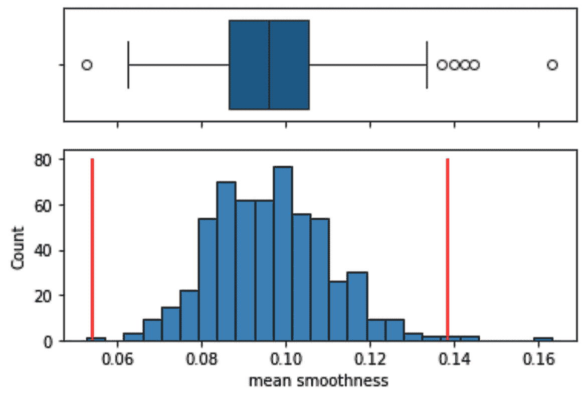
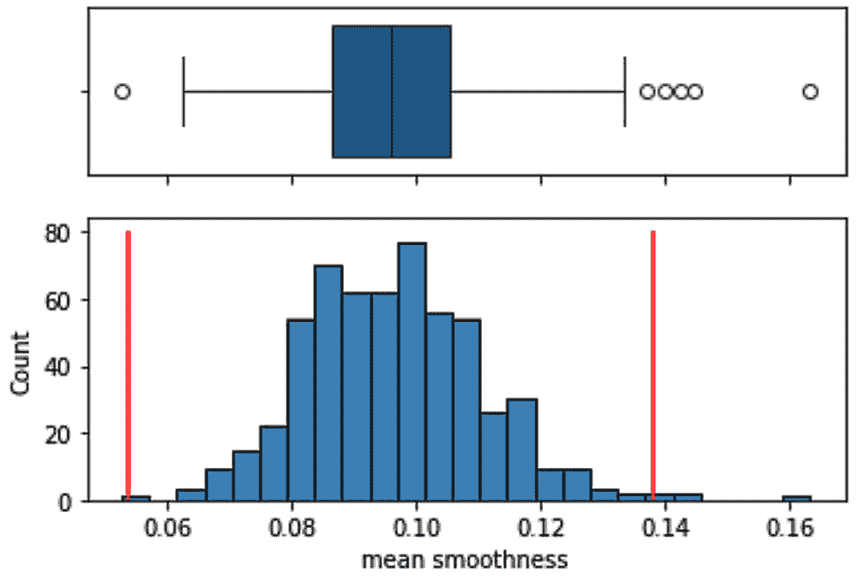
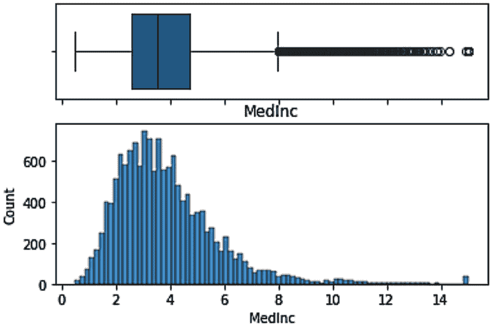

# 第五章：与异常值一起工作

异常值是指与变量中其他值显著不同的数据点。异常值可能源于特征本身的固有变异性，表现为在分布中不常出现的极端值（通常出现在尾部）。它们可能是实验误差或数据收集过程中的不准确性的结果，或者它们可能表明重要事件。例如，信用卡交易中异常高的费用可能表明欺诈活动，需要标记并可能阻止卡片以保护客户。同样，异常不同的肿瘤形态可能表明恶性，需要进一步检查。

异常值可以对统计分析产生不成比例的巨大影响。例如，少数异常值可以逆转测试的统计显著性（例如 A/B 测试）或直接影响统计模型参数的估计（例如系数）。一些机器学习模型因其对异常值的敏感性而闻名，如线性回归。其他模型因其对异常值的鲁棒性而闻名，如基于决策树的模型。AdaBoost 据说对目标变量的异常值敏感，原则上，基于距离的模型，如 PCA 和 KNN，也可能受到异常值存在的影响。

并没有严格的数学定义来界定什么算是异常值，也没有关于如何在统计或机器学习模型中处理异常值的共识。如果异常值源于数据收集的缺陷，丢弃它们似乎是一个安全的选择。然而，在许多数据集中，确定异常值的准确性质是具有挑战性的。最终，检测和处理异常值仍然是一项主观的练习，依赖于领域知识和对它们对模型潜在影响的了解。

在本章中，我们将首先讨论识别潜在异常值的方法，或者更确切地说，识别那些与整体显著不同的观察结果。然后，我们将在假设这些观察结果对分析不相关的前提下继续讨论，并展示如何通过截断移除它们或减少它们对模型的影响。

本章包含以下食谱：

+   使用箱线图和四分位数间距规则可视化异常值

+   使用均值和标准差查找异常值

+   使用中位数绝对偏差查找异常值

+   移除异常值

+   将异常值拉回到可接受的范围内

+   应用 winsorization

# 技术要求

在本章中，我们将使用 Python 的`numpy`、`pandas`、`matplotlib`、`seaborn`和`feature-engine`库。

# 使用箱线图和四分位数间距规则可视化异常值

可视化异常值的一种常见方法是使用箱线图。箱线图基于四分位数提供变量的标准化分布显示。箱子包含第一和第三四分位数内的观测值，称为**四分位距**（**IQR**）。第一四分位数是低于该值的观测值占 25%（相当于第 25 百分位数），而第三四分位数是低于该值的观测值占 75%（相当于第 75 百分位数）。IQR 的计算如下：

![<mml:math xmlns:mml="http://www.w3.org/1998/Math/MathML" xmlns:m="http://schemas.openxmlformats.org/officeDocument/2006/math" display="block"><mml:mi>I</mml:mi><mml:mi>Q</mml:mi><mml:mi>R</mml:mi><mml:mo>=</mml:mo><mml:mn>3</mml:mn><mml:mi>r</mml:mi><mml:mi>d</mml:mi><mml:mo> </mml:mo><mml:mi>q</mml:mi><mml:mi>u</mml:mi><mml:mi>a</mml:mi><mml:mi>r</mml:mi><mml:mi>t</mml:mi><mml:mi>i</mml:mi><mml:mi>l</mml:mi><mml:mi>e</mml:mi><mml:mo>−</mml:mo><mml:mn>1</mml:mn><mml:mi>s</mml:mi><mml:mi>t</mml:mi><mml:mo> </mml:mo><mml:mi>q</mml:mi><mml:mi>u</mml:mi><mml:mi>a</mml:mi><mml:mi>r</mml:mi><mml:mi>t</mml:mi><mml:mi>i</mml:mi><mml:mi>l</mml:mi><mml:mi>e</mml:mi></mml:math>](img/21.png)

箱线图也显示须须，这些须须是从箱子的两端向外延伸到最小值和最大值的线条，并延伸到一个极限。这些极限由分布的最小值或最大值给出，或者在存在极端值的情况下，由以下方程给出：


根据四分位数间距规则（**IQR proximity rule**），如果值落在由前述方程确定的须须极限之外，我们可以将其视为异常值。在箱线图中，异常值用点表示。

注意

如果变量服从正态分布，大约 99%的观测值将位于由须须定义的区间内。因此，我们可以将须须之外的值视为异常值。然而，箱线图是非参数的，这就是为什么我们也使用它们来可视化偏斜变量的异常值。

在这个菜谱中，我们将首先使用箱线图可视化变量分布，然后我们将手动计算触须的极限来识别那些我们可以将其视为异常值的点。

## 如何做到这一点...

我们将使用`seaborn`库创建箱线图。让我们首先导入 Python 库并加载数据集：

1.  让我们导入 Python 库和数据集：

    ```py
    import matplotlib.pyplot as plt
    import seaborn as sns
    from sklearn.datasets import fetch_california_housing
    ```

1.  修改`seaborn`的默认背景（它使图表更美观，但这当然是主观的）：

    ```py
    sns.set(style="darkgrid")
    ```

1.  从 scikit-learn 加载加利福尼亚房价数据集：

    ```py
    X, y = fetch_california_housing(
        return_X_y=True, as_frame=True)
    ```

1.  绘制`MedInc`变量的箱线图以可视化其分布：

    ```py
    plt.figure(figsize=(8, 3))
    sns.boxplot(data=X["MedInc"], orient="y")
    plt.title("Boxplot")
    plt.show()
    ```

    在下面的箱线图中，我们识别出包含在四分位数范围（IQR）内的观测值所在的箱子，即第一和第三四分位数之间的观测值。我们还可以看到触须。在左侧，触须延伸到`MedInc`的最小值；在右侧，触须延伸到第三四分位数加上 1.5 倍的四分位数范围。超出右侧触须的值用点表示，可能构成异常值：


图 5.1 – 突出显示分布右侧尾部的潜在异常值的`MedInc`变量的箱线图

注意

如*图 5.1*所示，箱线图返回不对称的边界，由左右触须的长度变化表示。这使得箱线图成为识别高度偏斜分布中异常值的合适方法。正如我们将在接下来的菜谱中看到，识别异常值的替代方法在分布中心周围创建对称边界，这可能不是不对称分布的最佳选择。

1.  现在让我们创建一个函数来在直方图旁边绘制箱线图：

    ```py
    def plot_boxplot_and_hist(data, variable):
        f, (ax_box, ax_hist) = plt.subplots(
            2, sharex=True,
            gridspec_kw={"height_ratios": (0.50, 0.85)})
        sns.boxplot(x=data[variable], ax=ax_box)
        sns.histplot(data=data, x=variable, ax=ax_hist)
        plt.show()
    ```

1.  让我们使用之前的函数来创建`MedInc`变量的绘图：

    ```py
    plot_boxplot_and_hist(X, "MedInc")
    ```

    在下面的图中，我们可以看到箱线图和变量分布在直方图中的关系。注意`MedInc`的大多数观测值都位于四分位数范围内。`MedInc`的潜在异常值位于右侧尾部，对应于收入异常高的个人：


图 5.2 – 箱线图和直方图 – 显示变量分布的两种方式

现在我们已经看到了如何可视化异常值，接下来让我们看看如何计算分布两侧的异常值所在的极限。

1.  让我们创建一个函数，该函数根据 IQR 邻近规则返回极限：

    ```py
    def find_limits(df, variable, fold):
        q1 = df[variable].quantile(0.25)
        q3 = df[variable].quantile(0.75)
        IQR = q3 - q1
        lower_limit = q1 - (IQR * fold)
        upper_limit = q3 + (IQR * fold)
        return lower_limit, upper_limit
    ```

注意

记住，第一和第三四分位数等同于第 25 和第 75 百分位数。这就是为什么我们使用 pandas 的`quantile`函数来确定这些值。

1.  使用第 7 步中的函数，我们将计算`MedInc`的极端极限：

    ```py
    lower_limit, upper_limit = find_limits(
        X, "MedInc", 1.5)
    ```

    如果我们现在执行 `lower_limit` 和 `upper_limit`，我们将看到 `-0.7063` 和 `8.013` 这两个值。下限超出了 `MedInc` 的最小值，因此在箱线图中，触须只延伸到最小值。另一方面，上限与右触须的极限相吻合。

注意

乘以 IQR 的常见值是 `1.5`，这是箱线图中的默认值，或者如果我们想更保守一些，是 `3`。

1.  让我们显示 `HouseAge` 变量的箱线图和直方图：

    ```py
    plot_boxplot_and_hist(X, "HouseAge")
    ```

    我们可以看到，这个变量似乎不包含异常值，因此箱线图中的触须延伸到最小值和最大值：


图 5.3 – HouseAge 变量的箱线图和直方图

1.  让我们根据四分位数间距规则找到变量的极限：

    ```py
    lower_limit, upper_limit = find_limits(
        X, "HouseAge", 1.5)
    ```

如果我们执行 `lower_limit` 和 `upper_limit`，我们将看到 `-10.5` 和 `65.5` 这两个值，它们超出了图表的边缘，因此我们没有看到任何异常值。

## 它是如何工作的...

在这个菜谱中，我们使用了 Seaborn 的 `boxplot` 方法来创建箱线图，然后我们根据四分位数间距规则计算了可以被认为是异常值的极限。

在 *图 5*.2 中，我们看到了 `MedInc` 的箱线图中的箱子从大约 2 延伸到 5，对应于第一和第三分位数（你可以通过执行 `X["MedInc"].quantile(0.25)` 和 `X["MedInc"].quantile(0.75)` 来精确确定这些值）。我们还看到，触须从左边的 `MedInc` 的最小值开始，延伸到右边的 `8.013`（我们知道这个值，因为我们已经在 *步骤 8* 中计算了它）。`MedInc` 显示了大于 `8.013` 的值，这些值在箱线图中以点表示。这些是可以被认为是异常值的值。

在 *图 5*.3 中，我们展示了 `HouseAge` 变量的箱线图。箱子包含了从大约 18 到 35 的值（你可以通过执行 `X["HouseAge"].quantile(0.25)` 和 `X["HouseAge"].quantile(0.75)` 来确定精确值）。触须延伸到分布的最小值和最大值。图表中触须的极限与基于四分位数间距规则（我们在 *步骤 10* 中计算的）的极限不一致，因为这些极限远远超出了这个变量观察到的值范围。

# 使用均值和标准差查找异常值

在正态分布的变量中，大约 99.8% 的观测值位于均值加减三倍标准差的区间内。因此，超出这些极限的值可以被认为是异常值；它们是罕见的。

注意

使用均值和标准差来检测异常值有一些缺点。首先，它假设包括异常值在内的正态分布。其次，异常值强烈影响均值和标准差。因此，一个推荐的替代方案是**中位数绝对偏差**（**MAD**），我们将在下一个菜谱中讨论。

在这个菜谱中，我们将识别异常值为那些位于均值加减三倍标准差定义的区间之外的观测值。

## 如何做到...

让我们开始菜谱，导入 Python 库并加载数据集：

1.  让我们导入 Python 库和数据集：

    ```py
    import numpy as np
    import matplotlib.pyplot as plt
    import seaborn as sns
    from sklearn.datasets import load_breast_cancer
    ```

1.  从 scikit-learn 加载乳腺癌数据集：

    ```py
    X, y = load_breast_cancer(
        return_X_y=True, as_frame=True)
    ```

1.  创建一个函数来在直方图旁边绘制箱线图：

    ```py
    def plot_boxplot_and_hist(data, variable):
        f, (ax_box, ax_hist) = plt.subplots(
            2, sharex=True,
            gridspec_kw={"height_ratios": (0.50, 0.85)})
        sns.boxplot(x=data[variable], ax=ax_box)
        sns.histplot(data=data, x=variable, ax=ax_hist)
        plt.show()
    ```

注意

我们在先前的菜谱中讨论了 *步骤 3* 的函数，*使用箱线图和四分位数接近规则可视化异常值*。

1.  让我们绘制 `mean` `smoothness` 变量的分布：

    ```py
    plot_boxplot_and_hist(X, "mean smoothness")
    ```

    在下面的箱线图中，我们看到变量的值显示出类似于正态分布的分布，并且它有六个异常值——一个在左侧，五个在右侧尾部：


图 5.4 – 变量均值平滑度的箱线图和直方图

1.  创建一个函数，该函数返回均值加减 `fold` 倍标准差，其中 `fold` 是函数的参数：

    ```py
    def find_limits(df, variable, fold):
        var_mean = df[variable].mean()
        var_std = df[variable].std()
        lower_limit = var_mean - fold * var_std
        upper_limit = var_mean + fold * var_std
        return lower_limit, upper_limit
    ```

1.  使用该函数来识别 `mean` `smoothness` 变量的极端限制：

    ```py
    lower_limit, upper_limit = find_limits(
        X, "mean smoothness", 3)
    ```

    如果我们现在执行 `lower_limit` 或 `upper_limit`，我们会看到值 `0.0541` 和 `0.13855`，这对应于我们可以考虑值为异常值的限制之外的范围。

注意

如果变量是正态分布的，均值加减三倍标准差之间的区间包含了 99.87% 的观测值。对于不那么保守的限制，我们可以将标准差乘以 2 或 2.5，这将产生包含 95.4% 和 97.6% 观测值的区间。

1.  创建一个布尔向量，标记超出在 *步骤 6* 中确定的限制的观测值：

    ```py
    outliers = np.where(
        (X[«mean smoothness»] > upper_limit) |
        (X[«mean smoothness»] < lower_limit),
        True,
        False
    )
    ```

    如果我们现在执行 `outliers.sum()`，我们会看到值 `5`，这表明有五个异常值或观测值比使用均值和标准差找到的极端值小或大。根据这些限制，我们将比 IQR 规则少识别一个异常值。

1.  让我们在 *步骤 3* 的直方图中添加红色垂直线，以突出显示使用均值和标准差确定的限制：

    ```py
    def plot_boxplot_and_hist(data, variable):
        f, (ax_box, ax_hist) = plt.subplots(
            2, sharex=True,
            gridspec_kw={"height_ratios": (0.50, 0.85)})
        sns.boxplot(x=data[variable], ax=ax_box)
        sns.histplot(data=data, x=variable, ax=ax_hist)
        plt.vlines(
            x=lower_limit, ymin=0, ymax=80, color='r')
        plt.vlines(
            x=upper_limit, ymin=0, ymax=80, color='r')
         plt.show()
    ```

1.  现在让我们制作这些图表：

    ```py
    plot_boxplot_and_hist(X, "mean smoothness")
    ```

    在下面的图中，我们看到箱线图中 IQR 接近规则观察到的限制比均值和标准差识别的限制更保守。因此，我们在箱线图中观察到六个潜在的异常值，但根据均值和标准差计算只有五个：



图 5.5 – 比较箱线图中触须的极限与使用平均值和标准差确定的极限（直方图中的垂直线）

由平均值和标准差推导出的边界是对称的。它们从分布的中心向两侧等距离延伸。如前所述，这些边界仅适用于正态分布的变量。

## 它是如何工作的…

使用 pandas 的`mean()`和`std()`，我们捕捉了变量的平均值和标准差。我们将极限确定为平均值加减三倍的标准差。为了突出异常值，我们使用了 NumPy 的`where()`。`where()`函数扫描变量的行，如果值大于上限或小于下限，则被分配`True`，否则分配`False`。最后，我们使用 pandas 的`sum()`对这个布尔向量进行求和，以计算异常值的总数。

最后，我们比较了边界，以确定由 IQR 邻近规则返回的异常值，我们在之前的配方中讨论了该规则，即*使用箱线图和四分位数邻近规则可视化异常值*，以及平均值和标准差。我们观察到 IQR 规则的极限更为保守。这意味着使用 IQR 规则，我们会在这个特定变量中标记出更多的异常值。

# 使用中位数绝对偏差来寻找异常值

平均值和标准差受到异常值的影响很大。因此，使用这些参数来识别异常值可能会适得其反。一种更好的识别异常值的方法是使用 MAD。MAD 是每个观测值与变量中位数绝对偏差的中位数：


在前一个方程中，`xi`是变量`X`中的每个观测值。MAD 的美丽之处在于它使用中位数而不是平均值，这使得它对异常值具有鲁棒性。`b`常数用于从 MAD 估计标准差，如果我们假设正态性，那么`b =` `1.4826`。

注意

如果假设变量具有不同的分布，则`b`的计算为 75 百分位数除以 1。在正态分布的情况下，1/75 百分位数 = 1.4826。

在计算 MAD 之后，我们使用中位数和 MAD 来建立分布极限，将超出这些极限的值指定为异常值。这些极限被设置为中位数加减 MAD 的倍数，通常在 2 到 3.5 之间。我们选择的乘数反映了我们希望有多严格（越高，越保守）。在这个菜谱中，我们将使用 MAD 来识别异常值。

## 如何做...

让我们从导入 Python 库和加载数据集开始这个菜谱：

1.  让我们导入 Python 库和数据集：

    ```py
    import numpy as np
    import matplotlib.pyplot as plt
    import seaborn as sns
    from sklearn.datasets import load_breast_cancer
    ```

1.  从 scikit-learn 加载乳腺癌数据集：

    ```py
    X, y = load_breast_cancer(
        return_X_y=True, as_frame=True)
    ```

1.  创建一个函数，根据 MAD 返回极限：

    ```py
    def find_limits(df, variable, fold):
        median = df[variable].median()
        center = df[variable] - median
        MAD = center.abs().median() * 1.4826
        lower_limit = median - fold * MAD
        upper_limit = median + fold * MAD
        return lower_limit, upper_limit
    ```

1.  让我们使用该函数来捕获`mean` `smoothness`变量的极端极限：

    ```py
    lower_limit, upper_limit = find_limits(
        X, "mean smoothness", 3)
    ```

    如果我们执行`lower_limit`或`upper_limit`，我们将看到`0.0536`和`0.13812`的值，这对应于我们可以考虑值为异常值的极限。

1.  让我们创建一个布尔向量，标记超出极限的观测值：

    ```py
    outliers = np.where(
        (X[«mean smoothness»] > upper_limit) |
        (X[«mean smoothness»] < lower_limit),
        True,
        False
    )
    ```

    如果我们现在执行`outliers.sum()`，我们将看到`5`的值，这表明有五个异常值或观测值，这些值小于或大于使用 MAD 找到的极端值。

1.  让我们编写一个函数，在变量的直方图旁边绘制箱线图，突出显示在直方图中计算的*步骤 4*的极限：

    ```py
    def plot_boxplot_and_hist(data, variable):
        f, (ax_box, ax_hist) = plt.subplots(
            2, sharex=True,
            gridspec_kw={"height_ratios": (0.50, 0.85)})
        sns.boxplot(x=data[variable], ax=ax_box)
        sns.histplot(data=data, x=variable, ax=ax_hist)
        plt.vlines(
            x=lower_limit, ymin=0, ymax=80, color='r')
        plt.vlines(
            x=upper_limit, ymin=0, ymax=80, color='r')
        plt.show()
    ```

1.  现在让我们制作这些图表：

    ```py
    plot_boxplot_and_hist(X, "mean smoothness")
    ```

    在下面的图中，我们可以看到，箱线图中 IQR 邻近规则观察到的极限比使用 MAD 确定的极限更为保守。MAD 返回对称边界，而箱线图生成非对称边界，这对于高度偏斜的分布更为合适：



图 5.6 – 箱线图中触须与使用 MAD 确定的极限之间的比较

注意

使用 MAD 检测异常值需要变量具有一定的变异性。如果一个变量中超过 50%的值是相同的，中位数将与最频繁的值一致，MAD=0。这意味着所有与中位数不同的值将被标记为异常值。这构成了使用 MAD 进行异常检测的另一个限制。

就这样！你现在知道如何使用中位数和 MAD 来识别异常值。

## 它是如何工作的…

我们使用 pandas 的`median()`确定了中位数，使用 pandas 的`abs()`确定了绝对差异。接下来，我们使用 NumPy 的`where()`函数创建一个布尔向量，如果值大于上限或小于下限，则为`True`，否则为`False`。最后，我们使用 pandas 的`sum()`在这个布尔向量上计算异常值的总数。

最后，我们将边界与 IQR 接近规则返回的异常值进行比较，我们在 *使用箱线图和四分位数范围接近规则可视化异常值* 烹饪法中讨论了这一点，以及使用 MAD 返回的异常值。IQR 规则返回的边界不太保守。通过将 IQR 乘以 3 而不是默认的 1.5（箱线图中的默认值）来改变这种行为。此外，我们注意到 MAD 返回对称边界，而箱线图提供了不对称的边界，这可能更适合不对称分布。

### 参见

要彻底讨论检测异常值的不同方法的优缺点，请查看以下资源：

+   Rousseeuw PJ, Croux C. *中位数绝对偏差的替代方案*。美国统计学会杂志，1993\. [`www.jstor.org/stable/2291267`](https://www.jstor.org/stable/2291267)。

+   Leys C, et. al. *检测异常值：不要使用围绕平均值的标准差，而要使用围绕中位数的绝对差分*。实验社会心理学杂志，2013\. http://dx.doi.org/10.1016/j.jesp.2013.03.013。

+   Thériault R, et. al. *检查你的异常值**！使用 easystats 在 R 中识别统计异常值入门*。行为研究方法，2024\. [`doi.org/10.3758/s13428-024-02356-w`](https://link.springer.com/article/10.3758/s13428-024-02356-w)。

# 移除异常值

近期研究区分了三种类型的异常值：错误异常值、有趣异常值和随机异常值。错误异常值可能是由人为或方法错误引起的，应该纠正或从数据分析中删除。在这个烹饪法中，我们假设异常值是错误（你不想删除有趣或随机异常值）并从数据集中删除它们。

## 如何做...

我们将使用 IQR 接近规则来查找异常值，然后使用 pandas 和 Feature-engine 从数据中移除它们。

1.  让我们导入 Python 库、函数和类：

    ```py
    import matplotlib.pyplot as plt
    import seaborn as sns
    from sklearn.datasets import fetch_california_housing
    from sklearn.model_selection import train_test_split
    from feature_engine.outliers import OutlierTrimmer
    ```

1.  从 scikit-learn 加载加利福尼亚住房数据集并将其分为训练集和测试集：

    ```py
    X, y = fetch_california_housing(
        return_X_y=True, as_frame=True)
    X_train, X_test, y_train, y_test = train_test_split(
        X, y, test_size=0.3, random_state=0)
    ```

1.  让我们创建一个函数，使用 IQR 接近规则找到我们将将其视为异常值的极限：

    ```py
    def find_limits(df, variable, fold):
        q1 = df[variable].quantile(0.25)
        q3 = df[variable].quantile(0.75)
        IQR = q3 - q1
        lower_limit = q1 - (IQR * fold)
        upper_limit = q3 + (IQR * fold)
        return lower_limit, upper_limit
    ```

注意

在 *第 3* 步中，我们使用 IQR 接近规则找到将数据点视为异常值的极限，我们在 *使用箱线图和四分位数接近规则可视化异常值* 烹饪法中讨论了这一点。或者，你可以使用均值和标准差或 MAD 来识别异常值，正如我们在 *使用均值和标准差查找异常值* 和 *使用中位数绝对偏差查找异常值* 烹饪法中所涵盖的。

1.  使用第 *3* 步中的函数，让我们确定 `MedInc` 变量的范围：

    ```py
    lower, upper = find_limits(X_train, "MedInc", 3)
    ```

    如果你执行 `print(lower_limit, upper_limit)`，你会看到上一个命令的结果：`(-3.925900000000002, 11.232600000000001)`。

1.  让我们保留训练集和测试集中值大于或等于（`ge`）下限的观测值：

    ```py
    inliers = X_train["MedInc"].ge(lower)
    train_t = X_train.loc[inliers]
    inliers = X_test["MedInc"].ge(lower)
    test_t = X_test.loc[inliers]
    ```

1.  让我们保留值低于或等于（`le`）上限的观测值：

    ```py
    inliers = X_train["MedInc"].le(upper)
    train_t = X_train.loc[inliers]
    inliers = X_test["MedInc"].le(upper)
    test_t = X_test.loc[inliers]
    ```

    继续执行 `X_train.shape` 然后执行 `train_t.shape` 以证实转换后的 DataFrame 在移除异常值后比原始的一个包含更少的观测值。

    我们可以使用 `feature-engine` 同时从多个变量中移除异常值。

1.  设置一个转换器，使用 IQR 规则识别三个变量中的异常值：

    ```py
    trimmer = OutlierTrimmer(
        variables = [«MedInc", "HouseAge", "Population"],
        capping_method="iqr",
        tail="both",
        fold=1.5,
    )
    ```

注意

`OutlierTrimmer` 可以使用 IQR 来识别边界，正如我们在本食谱中所示，也可以通过使用平均值和标准差，或 MAD 来实现。您需要将 `capping_method` 分别更改为 `gaussian` 或 `mad`。

1.  将转换器拟合到训练集，以便它学习这些限制：

    ```py
    trimmer.fit(X_train)
    ```

注意

通过执行 `trimmer.left_tail_caps_`，我们可以可视化三个变量的下限：`{'MedInc': -0.6776500000000012, 'HouseAge': -10.5, 'Population': -626.0}`。通过执行 `trimmer.right_tail_caps_`，我们可以看到变量的上限：`{'MedInc': 7.984350000000001, 'HouseAge': 65.5, 'Population': 3134.0}`。

1.  最后，让我们从训练集和测试集中移除异常值：

    ```py
    X_train_t = trimmer.transform(X_train)
    X_test_t = trimmer.transform(X_test)
    ```

    为了完成本食谱，让我们比较在移除异常值前后变量的分布情况。

1.  让我们创建一个函数来在直方图上方显示箱线图：

    ```py
    def plot_boxplot_and_hist(data, variable):
        f, (ax_box, ax_hist) = plt.subplots(
            2, sharex=True,
            gridspec_kw={"height_ratios": (0.50, 0.85)}
        )
        sns.boxplot(x=data[variable], ax=ax_box)
        sns.histplot(data=data, x=variable, ax=ax_hist)
        plt.show()
    ```

注意

我们在本章前面关于使用箱线图可视化异常值的食谱中讨论了 *步骤 10* 中的代码。

1.  让我们绘制移除异常值前的 `MedInc` 分布图：

    ```py
    plot_boxplot_and_hist(X_train, "MedInc")
    ```

    在下面的图中，我们看到 `MedInc` 是偏斜的，并且大于 8 的观测值被标记为异常值：



图 5.7– 移除异常值前的 MedInc 箱线图和直方图。

1.  最后，让我们绘制移除异常值后的 `MedInc` 分布图：

    ```py
    plot_boxplot_and_hist(train_t, "MedInc")
    ```

    移除异常值后，`MedInc` 的偏斜度似乎减小了，其值分布得更均匀：


图 5.8 – 移除异常值后的 MedInc 箱线图和直方图

注意

使用 IQR 规则对转换变量进行操作会揭示新的异常值。这并不令人惊讶；移除分布两端的观测值会改变参数，如中位数和四分位数，这些参数反过来又决定了触须的长度，从而可能将更多的观测值识别为异常值。我们用来识别异常值的工具只是工具。为了明确地识别异常值，我们需要用额外的数据分析来支持这些工具。

如果考虑从数据集中移除错误异常值，请确保比较并报告有异常值和无异常值的结果，以了解它们对模型的影响程度。

## 它是如何工作的...

pandas 中的`ge()`和`le()`方法创建了布尔向量，用于识别超过或低于由 IQR 接近规则设定的阈值的观测值。我们使用这些向量与 pandas 的`loc`一起保留在 IQR 定义的区间内的观测值。

`feature-engine`库的`OutlierTrimmer()`自动化了为多个变量移除异常值的程序。`OutlierTrimmer()`可以根据均值和标准差、IQR 接近规则、MAD 或分位数来识别异常值。我们可以通过`capping_method`参数修改这种行为。

通过改变我们乘以 IQR、标准差或 MAD 的系数，可以使得识别异常值的方法更加或更加保守。通过`OutlierTrimmer()`，我们可以通过`fold`参数控制方法的强度。

将`tails`设置为`"both"`时，`OutlierTrimmer()`在变量的分布两端找到了并移除了异常值。要仅移除一端的异常值，我们可以将`"left"`或`"right"`传递给`tails`参数。

`OutlierTrimmer()`采用 scikit-learn 的`fit()`方法来学习参数，并使用`transform()`来修改数据集。通过`fit()`，转换器学习并存储了每个变量的限制。通过`transform()`，它从数据中移除了异常值，返回`pandas`数据框。

## 参考内容

这是我之前提到的研究，它将异常值分类为错误；它很有趣且随机：Leys C, et.al. 2019\. *如何分类、检测和管理单变量和多变量异常，重点在于预注册*。国际社会心理学评论。[`doi.org/10.5334/irsp.289`](https://rips-irsp.com/articles/10.5334/irsp.289).

# 将异常值恢复到可接受的范围内

移除错误异常值可能是一种有效的策略。然而，这种方法可能会降低统计功效，特别是在许多变量都有异常值的情况下，因为我们最终移除了数据集的大部分内容。处理错误异常值的另一种方法是将其恢复到可接受的范围内。在实践中，这意味着用 IQR 接近规则、均值和标准差或 MAD 识别的某些阈值替换异常值的值。在这个菜谱中，我们将使用`pandas`和`feature-engine`替换异常值。

## 如何做到这一点...

我们将使用均值和标准差来查找异常值，然后使用`pandas`和`feature-engine`替换它们的值：

1.  让我们导入所需的 Python 库和函数：

    ```py
    from sklearn.datasets import load_breast_cancer
    from sklearn.model_selection import train_test_split
    from feature_engine.outliers import Winsorizer
    ```

1.  从 scikit-learn 加载乳腺癌数据集并将其分为训练集和测试集：

    ```py
    X, y = load_breast_cancer(
        return_X_y=True, as_frame=True)
    X_train, X_test, y_train, y_test = train_test_split(
        X, y, test_size=0.3, random_state=0)
    ```

1.  让我们创建一个函数来使用均值和标准差查找异常值：

    ```py
    def find_limits(df, variable, fold):
        var_mean = df[variable].mean()
        var_std = df[variable].std()
        lower_limit = var_mean - fold * var_std
        upper_limit = var_mean + fold * var_std
        return lower_limit, upper_limit
    ```

注意

在第 3 步中，我们使用平均值和标准差来找到数据点将被视为异常值的极限，正如我们在*使用平均值和标准差查找异常值*配方中讨论的那样。或者，您可以使用 IQR 规则或 MAD 来识别异常值，正如我们在*使用箱线图和四分位数间距规则可视化异常值*和*使用中位数绝对偏差查找异常值*配方中所述。

1.  使用第 3 步中的函数，让我们确定`mean smoothness`变量的极限，该变量大约遵循高斯分布：

    ```py
    var = "worst smoothness"
    lower_limit, upper_limit = find_limits(
        X_train, var, 3)
    ```

1.  让我们复制原始数据集：

    ```py
    train_t = X_train.copy()
    test_t = X_test.copy()
    ```

1.  现在，在新 DataFrame 中将异常值替换为第 4 步中的下限或上限：

    ```py
    train_t[var] = train_t[var].clip(
        lower=lower_limit, upper=upper_limit)
    test_t[var] = test_t[var].clip(
        lower=lower_limit, upper=upper_limit)
    ```

    为了证实异常值已被第 4 步中确定的值替换，执行`train_t["worst smoothness"].agg(["min", "max"])`以获取新的最大值和最小值。它们应该与变量的最小值和最大值或第 4 步中返回的极限相一致。

    我们可以通过利用`feature-engine`同时替换多个变量的异常值。

1.  让我们设置一个转换器，用平均值和标准差确定的极限替换两个变量中的异常值：

    ```py
    capper = Winsorizer(
        variables=[«worst smoothness», «worst texture»],
        capping_method="gaussian",
        tail="both",
        fold=3,
    )
    ```

注意

`Winsorizer`可以使用平均值和标准差识别边界，正如我们在本配方中所示，以及 IQR 间距规则和 MAD。您需要将`capping_method`更改为`iqr`或`mad`。

1.  让我们将转换器拟合到数据中，以便它学习这些极限：

    ```py
    capper.fit(X_train)
    ```

    通过执行`capper.left_tail_caps_`，我们可以可视化两个变量的下限：`{'worst smoothness': 0.06364743973736293, 'worst texture': 7.115307053129349}`。通过执行`capper.right_tail_caps_`，我们可以看到变量的上限：`{'worst smoothness': 0.20149734880520967, 'worst texture': 43.97692158753917}`。

1.  最后，让我们用第 8 步的极限值替换异常值：

    ```py
    X_train = capper.transform(X_train)
    X_test = capper.transform(X_test)
    ```

    如果我们现在执行`train_t[capper.variables_].agg(["min", "max"])`，我们将看到转换后的 DataFrame 的最大值和最小值与变量的最大值和最小值或识别的极限相一致，以先到者为准：

    ```py
          worst smoothness  worst texture
    min              0.071170        12.020000
    max              0.201411        43.953738
    ```

    如果您计划对变量进行上限处理，确保在替换异常值前后比较您模型的性能或分析结果。

## 它是如何工作的...

pandas 的 `clip()` 函数用于将值限制在指定的上下限。在这个菜谱中，我们使用均值和标准差找到了这些界限，然后剪切变量，使得所有观测值都位于这些界限内。`worst smoothness` 变量的最小值实际上大于我们在 *步骤 4* 中找到的下限，因此在其分布的左侧没有替换任何值。然而，有值大于 *步骤 4* 中的上限，这些值被替换为上限。这意味着转换变量的最小值与原始变量的最小值相同，但最大值不同。

我们使用 `feature-engine` 同时替换多个变量的异常值。`Winsorizer()` 可以根据均值和标准差、IQR 接近规则、MAD 或使用百分位数来识别异常值。我们可以通过 `capping_method` 参数修改这种行为。

通过改变我们乘以 IQR、标准差或 MAD 的因子，可以使得识别异常值的方法更加或更加保守。在 `Winsorizer()` 中，我们可以通过 `fold` 参数控制方法的强度。

当 `tails` 设置为 `"both"` 时，`Winsorizer()` 在变量的分布两端找到并替换了异常值。要替换任一端的异常值，我们可以将 `"left"` 或 `"right"` 传递给 `tails` 参数。

`Winsorizer()` 方法采用了 scikit-learn 的 `fit()` 方法来学习参数，以及 `transform()` 方法来修改数据集。通过 `fit()`，转换器学习并存储了每个变量的界限。通过 `transform()`，它替换了异常值，返回 pandas DataFrame。

## 参见

`feature-engine` 有 `ArbitraryOutlierCapper()`，可以在任意最小和最大值处限制变量：[`feature-engine.readthedocs.io/en/latest/api_doc/outliers/ArbitraryOutlierCapper.html`](https://feature-engine.readthedocs.io/en/latest/api_doc/outliers/ArbitraryOutlierCapper.html)。

# 应用 Winsorizing

Winsorizing 或 winsorization，包括用下一个最大（或最小）观测值的幅度替换极端、不太知名的观测值，即异常值。它与之前菜谱中描述的程序类似，*将异常值拉回到可接受的范围内*，但并不完全相同。Winsorization 涉及在分布两端替换相同数量的异常值，这使得 Winsorization 成为一个对称过程。这保证了 **Winsorized mean**，即替换异常值后的均值，仍然是变量中心趋势的稳健估计器。

实际上，为了在两端移除相似数量的观测值，我们会使用百分位数。例如，第 5 百分位数是低于 5%观测值的值，第 95 百分位数是高于 5%观测值的值。使用这些值作为替换可能会在两端替换相似数量的观测值，但这并不保证。如果数据集中包含重复值，获得可靠的百分位数具有挑战性，并且可能导致每个尾端值的不均匀替换。如果发生这种情况，则 winsorized 平均值不是中心趋势的良好估计量。在本配方中，我们将应用 winsorization。

## 如何操作...

我们将把乳腺癌数据集的所有变量限制在其第 5 和第 95 百分位数：

1.  让我们导入所需的 Python 库和函数：

    ```py
    import matplotlib.pyplot as plt
    import seaborn as sns
    from sklearn.datasets import load_breast_cancer
    from sklearn.model_selection import train_test_split
    ```

1.  从 scikit-learn 加载乳腺癌数据集：

    ```py
    X, y = load_breast_cancer(
        return_X_y=True, as_frame=True)
    ```

1.  将数据分为训练集和测试集：

    ```py
    X_train, X_test, y_train, y_test = train_test_split(
        X,
        y,
        test_size=0.3,
        random_state=0,
    )
    ```

1.  在字典中捕获每个变量的第 5 和第 95 百分位数：

    ```py
    q05 = X_train.quantile(0.05).to_dict()
    q95 = X_train.quantile(0.95).to_dict()
    ```

1.  现在我们将所有变量的值替换为相应的百分位数，超出这些百分位数：

    ```py
    train_t = X_train.clip(lower=q05, upper=q95)
    test_t = X_test.clip(lower=q05, upper=q95)
    ```

1.  让我们显示 winsorization 之前一个变量的最小值、最大值和平均值：

    ```py
    var = 'worst smoothness'
    X_train[var].agg(["min", "max", "mean"])
    ```

    我们可以在以下输出中看到值：

    ```py
    min      0.071170
    max      0.222600
    mean     0.132529
    Name: worst smoothness, dtype: float64
    ```

1.  显示 winsorization 后相同变量的最小值、最大值和平均值：

    ```py
    train_t[var].agg([„min", „max"])
    ```

    在以下输出中，我们可以看到最小值和最大值对应于百分位数。然而，平均值与变量的原始平均值相当相似：

    ```py
    min      0.096053
    max      0.173215
    mean     0.132063
    Name: worst smoothness, dtype: float64
    ```

注意

如果您想将 winsorization 作为 scikit-learn 管道的一部分使用，可以使用`feature-engine`库的`Winsorizer()`，设置如下：

`capper =` `Winsorizer(`

`capping_method="quantiles",`

`tail="both",`

`fold=0.05,`

`)`

在此之后，按照*将异常值拉回到可接受* *范围内*配方中描述的`fit()`和`transform()`方法进行操作。

值得注意的是，尽管使用了百分位数，但该程序并没有精确地替换分布两边的相同数量的观测值。如果您打算 winsorize 您的变量，请在 winsorization 前后比较您分析的结果。

## 它是如何工作的...

我们使用 pandas 的`quantiles()`获取数据集中所有变量的第 5 和第 95 百分位数，并将其与`to_dict()`结合，以保留这些百分位数在字典中，其中键是变量，值是百分位数。然后我们将这些字典传递给 pandas 的`clip()`，用百分位数替换小于或大于这些百分位数的值。通过使用字典，我们一次限制了多个变量。

## 参考以下内容

更多关于 winsorization 如何影响对称和不对称替换中的平均值和标准差详情，请查看原始文章：

Dixon W. *从截尾正态样本中简化的估计。数学统计年鉴*，1960 年。[`www.jstor.org/stable/2237953`](https://www.jstor.org/stable/2237953)
