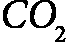
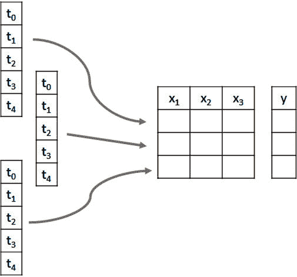
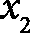
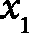
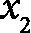
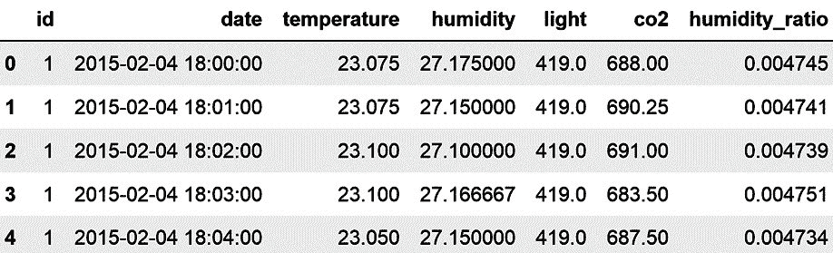
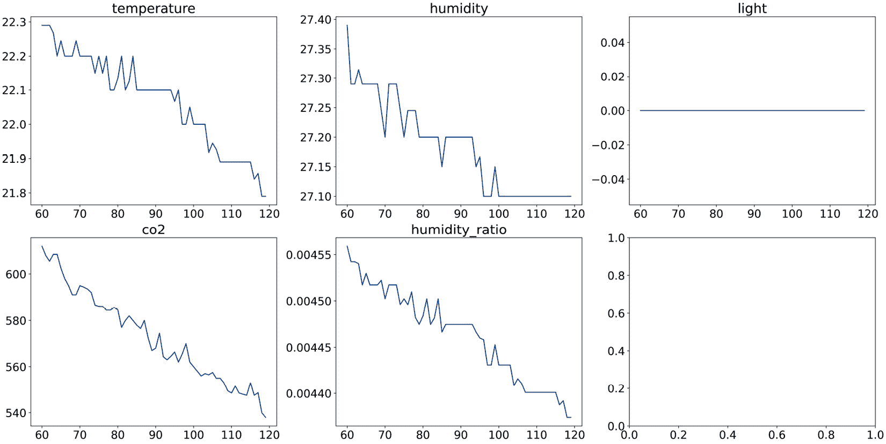
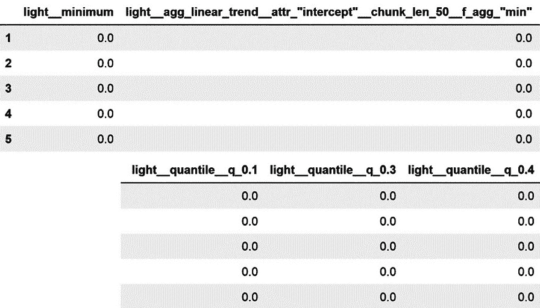
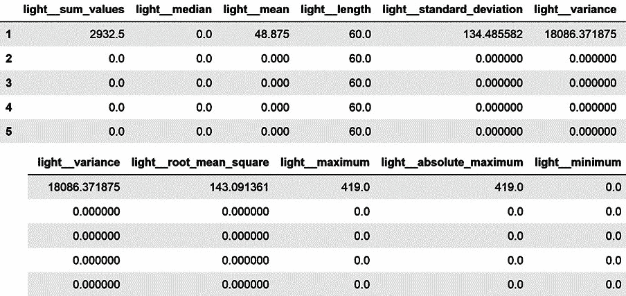

# 第十章：使用 tsfresh 从时间序列创建特征

在本书的整个过程中，我们讨论了针对表格和关系数据集定制的特征工程方法和工具。在本章中，我们将把我们的重点转向时间序列数据。时间序列是在时间上按顺序连续观察到的观察值的序列。例如包括能源生产和需求、温度、空气污染物浓度、股价和销售收入。这些示例中的每一个都代表一个变量，它们的值随时间变化。

便宜且能够测量运动、移动、湿度、葡萄糖和其他参数的传感器的广泛应用，显著增加了时间标注数据的数量。这些时间序列可以用于各种分类任务。例如，通过分析在特定时间间隔内家庭的电力使用模式，我们可以推断出是否使用了特定的电器。同样，超声波传感器的信号可以帮助确定（气体）管道故障的概率，而声音波长的特征可以帮助预测听众是否会喜欢一首歌。时间序列数据对于回归任务也很有价值。例如，机械设备传感器的信号可以用来预测设备的剩余使用寿命。

要使用时间序列与传统的监督机器学习模型，如线性回归、逻辑回归或基于决策树的算法，我们需要将每个时间序列映射到一个定义良好的特征向量，以捕捉其特征。时间序列模式，包括趋势、季节性和周期性等，可以通过简单和复杂的数学运算的组合来捕捉。简单的计算包括，例如，计算时间序列的平均值和标准差。更复杂的方法包括确定相关性或熵，例如。此外，我们可以应用非线性时间序列分析函数来分解时间序列信号，例如傅里叶变换或小波变换，并使用这些函数的参数作为监督模型的特征。

从时间序列中创建特征可能非常耗时；我们需要应用各种信号处理和时间序列分析算法来识别和提取有意义的特征。`tsfresh` Python 包，代表 `tsfresh`，包含一个特征选择算法，该算法可以识别给定时间序列的最具预测性的特征。通过自动化复杂时间序列方法的应用，`tsfresh`弥合了信号处理专家和机器学习实践者之间的差距，使得从时间序列数据中提取有价值特征变得更加容易。

在本章中，我们将学习如何通过利用 `tsfresh` 自动从时间序列数据中创建数百个特征。随后，我们将讨论如何通过选择最相关的特征、从不同的时间序列中提取不同的特征以及将特征创建过程集成到 scikit-learn 流程中来对时间序列数据进行分类。

在本章中，我们将介绍以下食谱：

+   从时间序列中自动提取数百个特征

+   从时间序列数据中自动创建和选择预测特征

+   从不同的时间序列中提取不同的特征

+   通过特征选择创建特征子集

+   将特征创建嵌入到 scikit-learn 流程中

# 技术要求

在本章中，我们将使用开源的 `tsfresh` Python 库。您可以通过执行 `pip install tsfresh` 来使用 `pip` 安装 `tsfresh`。

注意

如果您使用的是旧版 Microsoft 操作系统，您可能需要更新 Microsoft C++ 编译工具，以便继续安装 `tsfresh` 包。请按照此线程中的步骤进行操作：[`stackoverflow.com/questions/64261546/how-to-solve-error-microsoft-visual-c-14-0-or-greater-is-required-when-inst`](https://stackoverflow.com/questions/64261546/how-to-solve-error-microsoft-visual-c-14-0-or-greater-is-required-when-inst)。

我们将使用来自 UCI 机器学习仓库的 **Occupancy Detection** 数据集，该数据集可在 [`archive.ics.uci.edu/ml/datasets/Occupancy+Detection`](http://archive.ics.uci.edu/ml/datasets/Occupancy+Detection) 找到，并受 Creative Commons Attribution 4.0 国际 (CC BY 4.0) 许可协议的许可：[`creativecommons.org/licenses/by/4.0/legalcode`](https://creativecommons.org/licenses/by/4.0/legalcode)。该数据的相应引用如下：

Candanedo, Luis. (2016). Occupancy Detection. UCI Machine Learning Repository. [`doi.org/10.24432/C5X01N`](https://doi.org/10.24432/C5X01N)。

我已下载并修改了如本笔记本所示的数据：[`github.com/PacktPublishing/Python-Feature-engineering-Cookbook-Third-Edition/blob/main/ch10-tsfresh/prepare-occupancy-dataset.ipynb`](https://github.com/PacktPublishing/Python-Feature-engineering-Cookbook-Third-Edition/blob/main/ch10-tsfresh/prepare-occupancy-dataset.ipynb)

要获取修改后的数据集和目标变量，请查看以下链接中的文件 `occupancy.csv` 和 `occupancy_target.csv`：[`github.com/PacktPublishing/Python-Feature-engineering-Cookbook-Third-Edition/blob/main/ch10-tsfresh`](https://github.com/PacktPublishing/Python-Feature-engineering-Cookbook-Third-Edition/blob/main/ch10-tsfresh)

占用检测数据集包含在每分钟间隔内采集了 135 小时的时间序列数据。变量测量了温度、湿度、 级别和办公室的能耗。使用摄像头录像来确定是否有人在办公室。目标变量显示办公室在任意一小时是否被占用。如果目标值为 `1`，则表示该小时办公室被占用；否则，值为 `0`。

时间序列数据集和目标变量数据集的行数不同。时间序列数据集包含每分钟间隔的 135 小时记录，即 8,100 行。目标变量只有 135 行，每个标签指示在 135 小时中的每个小时办公室是否被占用。

注意

查看本书 GitHub 仓库中的笔记本，以熟悉数据集的不同时间序列的绘图：[`github.com/PacktPublishing/Python-Feature-Engineering-Cookbook-Third-Edition/blob/main/ch10-tsfresh/prepare-occupancy-dataset.ipynb`](https://github.com/PacktPublishing/Python-Feature-Engineering-Cookbook-Third-Edition/blob/main/ch10-tsfresh/prepare-occupancy-dataset.ipynb)

# 从时间序列中自动提取数百个特征

时间序列是按时间顺序索引的数据点。分析时间序列序列使我们能够做出各种预测。例如，传感器数据可以用来预测管道故障，声音数据可以帮助识别音乐类型，健康历史或个人测量，如血糖水平，可以指示一个人是否生病，正如我们将在这个菜谱中展示的，光照使用模式、湿度和 级别可以确定办公室是否被占用。

使用传统的机器学习算法，如线性回归或随机森林来训练回归和分类模型，我们需要一个大小为 *M x N* 的数据集，其中 M 是行数，N 是特征数或列数。然而，对于时间序列数据，我们拥有的是 *M* 个时间序列的集合，每个时间序列都有多个按时间顺序索引的行。要在监督学习模型中使用时间序列，每个时间序列都需要映射到一个定义良好的特征向量 *N*，如下面的图所示：



图 10.1 – 显示从时间序列创建特征以进行分类或回归的过程的图表

这些特征向量，如图 10.1.1 所示，表示为，，和，应该捕捉时间序列的特征。例如，可能是时间序列的均值，而是其方差。我们可以创建许多特征来描述数据点的分布、相关性、平稳性或熵等时间序列的特性。因此，特征向量 N 可以通过应用一系列**特征化方法**来构建，这些方法以时间序列作为输入，并返回一个或多个标量作为输出。均值或总和将时间序列序列作为输入，并返回一个标量作为输出，即时间序列的均值或其值的总和。我们还可以将线性趋势拟合到时间序列序列中，这将返回两个标量——一个表示斜率，另一个表示截距。

`tsfresh`对时间序列应用 63 种特征化方法，每种方法返回一个或多个标量，因此对于任何给定的时间序列，都会产生超过 750 个特征。在本配方中，我们将使用`tsfresh`将时间序列数据转换为 M x N 特征表，然后我们将使用该特征表来预测办公室占用情况。

## 准备工作

在本食谱中，我们将使用*技术要求*部分中描述的**占用检测**数据集。此数据集包含在办公室内每分钟间隔的温度、湿度、水平和照明消耗的测量值。共有 135 小时的测量数据，每小时都有一个唯一的标识符。还有一个包含目标变量的数据集，该变量指示在 135 小时中的哪一小时办公室是有人使用的。让我们加载数据并绘制一些图表来了解其模式：

1.  让我们加载`pandas`和`matplotlib`：

    ```py
    import matplotlib.pyplot as plt
    import pandas as pd
    ```

1.  加载数据集并显示前五行：

    ```py
    X = pd.read_csv(
        "occupancy.csv", parse_dates=["date"])
    X.head()
    ```

    在以下图中，我们可以看到包含唯一标识符的数据集，随后是测量日期和时间以及五个时间序列的值，这些时间序列捕捉了温度、湿度、灯光和水平：



图 10.2 – 包含时间序列数据的 DataFrame

1.  让我们创建一个函数来绘制给定小时（`id`列是 135 小时记录中每一小时的唯一标识符）的*步骤 2*中的时间序列图：

    ```py
    def plot_timeseries(n_id):
        fig, axes = plt.subplots(nrows=2, ncols=3,
        figsize=(20, 10))
        X[X[«id»] == n_id]["temperature"].plot(
            ax=axes[0, 0], title="temperature")
        X[X[«id»] == n_id]["humidity"].plot(
            ax=axes[0, 1], title="humidity")
        X[X[«id»] == n_id]["light"].plot(
            ax=axes[0, 2], title="light")
        X[X[«id»] == n_id]["co2"].plot(
        ax=axes[1, 0], title="co2")
        X[X[«id»] == n_id]["humidity_ratio"].plot(
            ax=axes[1,1], title="humidity_ratio")
        plt.show()
    ```

1.  让我们绘制一个小时办公室无人使用时的时间序列图：

    ```py
    plot_timeseries(2)
    ```

    在以下图中，我们可以看到记录的第二小时的时间序列值，当时办公室是空的：



图 10.3 – 数据收集第二小时办公室空时的时间序列值

注意到灯光是关闭的，这就是为什么我们在右上角`light`消耗的图表中看到一条平坦的直线。

1.  现在，让我们绘制一个小时办公室有人使用时的时间序列数据：

    ```py
    plot_timeseries(15)
    ```

    在以下图中，我们可以看到记录的第十五小时的时间序列值，当时办公室是有人使用的：


图 10.4 – 数据收集第十五小时办公室有人使用时的时间序列值

注意这次灯光是开着的（右上角面板）。

在这个菜谱中，我们将从这些每个时间序列数据的一小时窗口中提取特征，捕捉它们特性的各个方面。从每个这些 60 分钟的时间序列段中，我们将使用`tsfresh`自动生成超过 750 个特征，确保数据的属性得到全面表示。

## 如何实现...

我们将首先自动从单个时间序列`lights`创建数百个特征，然后使用这些特征来预测办公室在任意给定小时是否被占用：

1.  让我们导入所需的 Python 库和函数：

    ```py
    import pandas as pd
    from sklearn.linear_model import LogisticRegression
    from sklearn.metrics import classification_report
    from sklearn.model_selection import train_test_split
    from tsfresh import extract_features
    from tsfresh.utilities.dataframe_functions import (
        impute
    )
    ```

1.  加载*技术要求*部分中描述的数据集：

    ```py
    X = pd.read_csv("occupancy.csv", parse_dates=["date"])
    ```

1.  将目标变量加载到`pandas` Series 中：

    ```py
    y = pd.read_csv("occupancy_target.csv",
        index_col="id")["occupancy"]
    ```

1.  让我们使用`tsfresh`为每个小时的能耗记录自动创建数百个特征。要从`light`变量创建特征，我们将包含此变量的 DataFrame 和每个时间序列的唯一标识符传递给`tsfresh`的`extract_features`函数：

    ```py
    features = extract_features(
        X[[«id», «light»]], column_id="id")
    ```

    如果我们执行`features.shape`，我们会得到`(135, 789)`，这对应于结果 DataFrame 的大小，其中每一行代表一个小时的记录，每一列代表由`tsfresh`创建的一个特征。有 789 个特征可以描述任意给定小时的能耗。现在执行`features.head()`来查看结果 DataFrame 的概览。由于空间限制，我们无法在书中展示整个 DataFrame，所以我们将探索一些特征。

1.  让我们将创建的五个特征的名称存储在一个数组中：

    ```py
    feats = features.columns[10:15]
    ```

    如果我们执行`feats`，我们会看到五个特征的名称，分别对应每小时能耗的平均值、长度、标准差、变异系数和方差：

    ```py
    Index(['light__mean', 'light__length', 
        'light__standard_deviation', 
        'light__variation_coefficient', 
        'light__variance'], dtype='object')
    ```

1.  现在，让我们显示*步骤 5*中前五个小时的特征值：

    ```py
    features[feats].head()
    ```

    在下面的 DataFrame 中，我们看到从前五个小时的能耗时间序列中提取的特征：


图 10.5 – 为每小时能耗创建的特征

在**图 10.4**.4 中查看平均能耗值，我们可以看到前一个小时灯是亮着的，接下来的四个小时则是关闭的。时间序列的长度为 60，因为我们每小时有 60 分钟的记录。

注意

`tsfresh`对时间序列应用 63 种特征创建方法。根据时间序列的特性，如长度或其变异性，某些方法可能会返回缺失值或无穷大值。例如，在**图 10.4**.4 中，我们看到在能耗恒定的那些小时无法计算变异系数。在这些情况下，方差也是`0`。实际上，对于我们的数据集，许多生成的特征只包含`NaN`值，或者像长度一样是常数，因此对于训练机器学习模型没有用。

1.  `tsfresh` 包含一个插补函数，用于插补包含 `NaN` 值的特征。让我们继续插补我们的特征：

    ```py
    impute(features)
    ```

    `tsfresh` 的 `impute` 函数将 `NaN`、`-Inf` 和 `Inf` 值分别替换为变量的中位数、最小值或最大值。

    让我们使用这些特征来训练一个逻辑回归模型并预测办公室是否被占用。

1.  让我们先分离数据集为训练集和测试集：

    ```py
    X_train, X_test, y_train, y_test = train_test_split(
        features,
        y,
        test_size=0.1,
        random_state=42,
    )
    ```

1.  现在，让我们设置并训练一个逻辑回归模型，然后评估其性能：

    ```py
    cls = LogisticRegression(random_state=10, C=0.01)
    cls.fit(X_train, y_train)
    print(classification_report(
         y_test, cls.predict(X_test)))
    ```

    在以下输出中，我们看到用于分类分析的常用评估指标值，这表明创建的特征对预测办公室占用情况是有用的：

    ```py
                      precision     recall  f1-score   support
                   0         1.00        1.00        1.00           11
                   1         1.00        1.00        1.00            3
         accuracy                                       1.00           14
       macro avg         1.00        1.00        1.00           14
    weighted avg         1.00        1.00        1.00           14
    ```

注意

为了保持食谱简单，我没有优化模型超参数或调整概率阈值——这些是我们通常为了确保模型准确而做的事情。

1.  最后，让我们从每个时间序列中提取特征，即 `light`、`temperature`、`humidity` 和 `co2`，这次，我们将在提取后立即插补特征：

    ```py
    features = extract_features(
        X,
        column_id="id",
        impute_function=impute,
        column_sort="date",
    )
    ```

注意

在 *步骤 10* 中，我们指出我们想要根据包含测量时间和日期的时间戳对时间序列进行排序，通过将 `date` 变量传递给 `column_sort` 参数。当我们的时间序列不是等距的或不是按时间顺序排列时，这很有用。如果我们将此参数设置为 `None`，`tsfresh` 假设时间序列是有序且等距的。

*步骤 10* 的输出是一个包含 135 行的 DataFrame，包含 3,945 个特征（执行 `features.shape` 检查），这些特征描述了五个原始时间序列——温度、光照、湿度及其比率，以及  办公室。这些特征在 *步骤 10* 中进行了插补，因此您可以继续使用此 DataFrame 来训练另一个逻辑回归模型以预测办公室占用情况。

## 它是如何工作的...

在这个食谱中，我们使用了 `tsfresh` 从五个时间序列自动创建数百个特征，然后使用这些特征来训练一个逻辑回归模型以预测办公室是否被占用。

注意

要使用 `tsfresh` 创建特征，我们需要从其中提取特征的时间序列间隔必须用 `id` 变量标记。

要从时间序列创建特征，我们使用了 `tsfresh` 的 `extract_features` 函数。此函数接受包含时间序列的唯一标识符的 DataFrame 作为输入，并返回包含提取特征的 DataFrame 作为输出。

`extract_features` 有三个关键参数：`column_id`、`column_sort` 和 `impute_function`。`column_id` 接收用于提取特征的每个序列的唯一标识符列的名称。`column_sort` 用于在提取特征之前重新排序时间序列。当 `column_sort` 设置为 `None` 时，`tsfresh` 假设数据是按时间顺序排列的，并且时间戳是等距的。在 *步骤 10* 中，我们传递了 `date` 变量作为排序变量，这告诉 `tsfresh` 在提取特征之前如何排序数据。

注意

在我们的数据集中，将 `column_sort` 设置为 `None` 或传递 `date` 变量没有区别，因为我们的时间序列已经按时间顺序排列，并且时间戳是等距的。如果您的时序不是这种情况，请使用此参数正确创建特征。

最后，`extract_features` 函数也通过 `impute_function` 参数接受 `impute` 函数，以自动从创建的特征中移除无限和 `NaN` 值。将在接下来的菜谱中讨论 `extract_features` 的其他参数。

注意

更多关于 `extract_features` 函数的详细信息，请访问 [`tsfresh.readthedocs.io/en/latest/api/tsfresh.feature_extraction.html#module-tsfresh.feature_extraction.extraction`](https://tsfresh.readthedocs.io/en/latest/api/tsfresh.feature_extraction.html#module-tsfresh.feature_extraction.extraction)。

`impute` 函数，它可以独立使用，就像我们在 *步骤 7* 中做的那样，或者在我们 *步骤 10* 中做的那样，在 `extract_features` 函数内部使用，分别用变量的中位数、最小值或最大值替换 `NAN`、`-Inf` 和 `Inf` 值。如果特征只包含 `NaN` 值，则它们被零替换。插补是在原地发生的——也就是说，在正在插补的同一个 DataFrame 中。

`extract_features` 函数返回一个包含数据中唯一标识符行数的 DataFrame。在我们的例子中，它返回了一个包含 135 行的 DataFrame。结果 DataFrame 的列对应于应用于每个 135 个 60 分钟时间序列的 63 种表征方法返回的 789 个值。

在 *步骤 5* 中，我们探索了一些结果特征，这些特征捕捉了时间序列的均值、方差和变异系数，以及它们的长度。让我们再探索一些结果特征。

一些创建的变量是自我解释的。例如，`'light__skewness'` 和 `'light__kurtosis'` 变量包含偏度和峰度系数，这些系数表征了数据分布。`'light__has_duplicate_max'`，`'light__has_duplicate_min'` 和 `'light__has_duplicate'` 变量指示时间序列是否在时间间隔内有重复值或重复的最小值或最大值。`'light__quantile__q_0.1'`，`'light__quantile__q_0.2'` 和 `'light__quantile__q_0.3'` 变量显示了时间序列的不同分位数。最后，`'light__autocorrelation__lag_0'`，`'light__autocorrelation__lag_1'` 和 `'light__autocorrelation__lag_2'` 变量显示了时间序列与其过去值的自相关，滞后 0，1 或 2 步——这些信息通常对预测很有用。

其他特征化方法返回的是从信号处理算法中获取的特征，例如，对于 Ricker 小波，连续小波变换返回的 `'light__cwt_coefficients__coeff_0__w_2__widths_(2, 5, 10, 20)'`, `'light__cwt_coefficients__coeff_0__w_5__widths_(2, 5, 10, 20)'`, `'light__cwt_coefficients__coeff_0__w_10__widths_(2, 5, 10, 20)'`, 和 `'light__cwt_coefficients__coeff_0__w_20__widths_(2, 5, 10, 20)'` 等特征。

注意

由于方法众多，我们无法在本书中详细讨论每种特征化方法及其输出。您可以在 [`tsfresh.readthedocs.io/en/latest/api/tsfresh.feature_extraction.html`](https://tsfresh.readthedocs.io/en/latest/api/tsfresh.feature_extraction.html) 找到关于 `tsfresh` 支持的转换及其公式的更多详细信息。

一些由 `tsfresh` 自动创建的特征可能对于某些时间序列来说没有意义，甚至无法计算，因为它们需要一定的长度或数据变异性，或者时间序列必须满足某些分布假设。因此，特征的适用性将取决于时间序列的性质。

注意

您可以根据领域知识决定从您的时间序列中提取哪些特征，或者通过创建所有可能的特征，然后应用特征选择算法或进行数据分析来决定。实际上，从我们的数据集中，许多生成的特征要么是常数，要么只包含缺失数据。因此，我们可以通过从数据中去除这些特征来减少特征空间到信息特征。

## 参考资料链接

想要了解更多关于 `tsfresh` 的详细信息，请参阅文章 Christ M.，Braun N.，Neuffer J.，和 Kempa-Liehr A. (2018). *基于可扩展假设检验的时间序列特征提取 (tsfresh – 一个 Python 包). Neurocomputing 307 (2018). 页码 *72-77.* [`dl.acm.org/doi/10.1016/j.neucom.2018.03.067`](https://dl.acm.org/doi/10.1016/j.neucom.2018.03.067)。

# 从时间序列数据自动创建和选择预测特征

在先前的菜谱中，我们使用`tsfresh`自动从时间序列变量中提取了数百个特征。如果我们有多个时间序列变量，我们很容易得到一个包含数千个特征的数据库。此外，许多生成的特征只有缺失数据或常数，因此对训练机器学习模型没有用。

当我们创建分类和回归模型来解决现实生活中的问题时，我们通常希望我们的模型只输入少量相关特征以产生可解释的机器学习输出。简单的模型有很多优点。首先，它们的输出更容易解释。其次，简单的模型存储成本更低，训练速度更快。它们也能更快地返回输出。

`tsfresh`包含一个基于非参数统计假设检验的高度可并行化的特征选择算法，该算法可以在特征创建过程的后面执行，以快速去除无关特征。特征选择过程使用不同的测试针对不同的特征。

`tsfresh`使用以下测试来选择特征：

+   如果特征和目标都是二元的，则使用费舍尔精确检验独立性

+   如果特征或目标中任一个是二元的，则使用柯尔莫哥洛夫-斯米尔诺夫检验

+   如果特征或目标都不是二元的，则使用肯德尔秩检验

这些测试的优势在于它们是非参数的，因此不对被测试变量的潜在分布做出假设。

这些测试的结果是一个 p 值向量，衡量每个特征与目标之间的关联显著性。然后根据 Benjamini-Yekutieli 过程评估这些 p 值，以决定保留哪些特征。

注意

关于`tsfresh`的特征选择过程的更多详细信息，请参阅文章 Christ, Kempa-Liehr, and Feindt，*分布式和并行时间序列特征提取用于工业大数据应用*。亚洲机器学习会议（ACML）2016，大数据学习研讨会（WLBD），汉密尔顿（新西兰），arXiv，[`arxiv.org/abs/1610.07717v1`](https://arxiv.org/abs/1610.07717v1)。

在这个菜谱中，我们将自动从各种时间序列中创建数百个特征，然后利用`tsfresh`选择最相关的特征。

## 如何操作...

我们将首先自动从一条时间序列，`照明`，创建和选择特征，然后我们将自动化处理多条时间序列：

1.  让我们导入所需的 Python 库和函数：

    ```py
    import pandas as pd
    from sklearn.linear_model import LogisticRegression
    from sklearn.metrics import classification_report
    from sklearn.model_selection import train_test_split
    from tsfresh import (
        extract_features,
        extract_relevant_features,
        select_features,
    )
    from tsfresh.utilities.dataframe_functions import impute
    ```

1.  加载数据集和目标变量，如*技术* *要求*部分所述：

    ```py
    X = pd.read_csv("occupancy.csv", parse_dates=["date"])
    y = pd.read_csv("occupancy_target.csv",
        index_col="id")["occupancy"]
    ```

1.  让我们为每个小时的`照明`使用记录自动创建数百个特征，并对生成的特征进行插补：

    ```py
    features = extract_features(
        X[[«id», «light»]],
        column_id="id",
        impute_function=impute,
    )
    ```

    上一步的输出是一个包含 135 行和 789 列的 DataFrame，对应于从每个小时的照明消耗中创建的特征。

注意

有关*步骤 3*或占用检测数据集的更多详细信息，请查看*从时间序列自动提取数百个特征*菜谱。

1.  现在，让我们根据我们在本菜谱介绍中提到的非参数测试来选择特征：

    ```py
    features = select_features(features, y)
    ```

    如果我们执行`len(features)`，我们将看到值`135`，这意味着在*步骤 3*中创建的 789 个特征中，只有 135 个具有统计学意义。继续执行`features.head()`以显示结果的 DataFrame 的前五行。

1.  由于空间原因，我们只显示前五个特征：

    ```py
    feats = features.columns[0:5]
    features[feats].head()
    ```

    在以下 DataFrame 中，我们可以看到前五个小时光消耗的前五个特征的价值：



图 10.6 – 从每小时的光消耗中创建的五个选定特征的 DataFrame

请查看“*如何工作…*”部分，以获取对*步骤 4*生成的 DataFrame 的更详细分析。

1.  现在，我们将使用*步骤 4*中的特征来训练一个逻辑回归模型并预测办公室是否被占用。让我们首先将数据集分为训练集和测试集：

    ```py
    X_train, X_test, y_train, y_test = train_test_split(
        features,
        y,
        test_size=0.1,
        random_state=42,
    )
    ```

1.  让我们设置并训练一个逻辑回归模型，然后评估其性能：

    ```py
    cls = LogisticRegression(
        random_state=10, C=0.1, max_iter=1000)
    cls.fit(X_train, y_train)
    print(classification_report(
        y_test, cls.predict(X_test)))
    ```

    在以下输出中，我们可以看到分类分析中常用评估指标的价值。这些表明选定的特征对预测办公室占用是有用的：

    ```py
                      precision     recall  f1-score   support
                   0         1.00        0.91        0.95           11
                   1         0.75        1.00        0.86            3
    accuracy                                       0.93           14
       macro avg         0.88        0.95        0.90           14
    extract_relevant_features, and, like this, combine *steps 3* and *4*. We’ll do that to create and select features automatically for the five time series in our dataset:

    ```

    features = extract_relevant_features(

    X,

    y,

    column_id="id",

    column_sort="date",

    )

    ```py

    ```

注意

`extract_relevant_features`的参数与`extract_features`的参数非常相似。请注意，然而，前者将自动执行插补以能够进行特征选择。我们在*从时间序列自动提取数百个特征*菜谱中讨论了`extract_features`的参数。

*步骤 8*的输出是一个包含 135 行和 968 个特征的 DataFrame，来自`tsfresh`默认返回的原始 3,945 个特征（您可以通过执行`features.shape`来检查这一点）。继续使用此 DataFrame 来训练另一个逻辑回归模型以预测办公室占用。

## 如何工作...

在这个菜谱中，我们从时间序列中创建了数百个特征，然后根据非参数统计测试选择了最相关的特征。特征创建和选择过程由`tsfresh`自动执行。

为了创建特征，我们使用了`tsfresh`的`extract_features`函数，我们在*从时间序列自动提取数百个特征*菜谱中对其进行了详细描述。

为了选择特征，我们使用了来自 `tsfresh` 的 `select_features` 函数。这个函数根据特征和目标的不同性质应用不同的统计测试。简而言之，如果特征和目标是二元的，它通过费舍尔精确检验测试它们之间的关系。如果特征或目标是二元的，而另一个变量是连续的，它通过使用 Kolmogorov-Smirnov 检验测试它们之间的关系。如果特征和目标都不是二元的，它使用 Kendall 排序检验。

这些测试的结果是一个向量，每个特征都有一个 p 值。接下来，`tsfresh` 应用 Benjamini-Yekutieli 程序，旨在降低假发现率，根据 p 值选择要保留的特征。这个特征选择程序有一些优点，主要优点是统计测试计算速度快，因此选择算法可扩展且可并行化。另一个优点是测试是非参数的，因此适用于线性和非线性模型。

然而，评估每个特征单独的特征选择方法无法移除冗余特征。实际上，`tsfresh` 自动创建的许多特征将高度相关，例如那些捕捉到不同量级的光消费的特征。因此，它们将显示相似的 p 值并被保留。但在实践中，我们只需要一个或少数几个来捕捉时间序列的信息。我建议在 `tsfresh` 选择程序之后跟进其他能够识别特征交互的特征选择方法。

最后，在 *步骤 8* 中，我们通过使用 `extract_relevant_features` 函数将特征创建步骤 (*步骤 3*) 与特征选择步骤 (*步骤 4*) 结合起来。`extract_relevant_features` 函数将 `extract_features` 函数应用于每个时间序列以创建特征，并进行插补。接下来，它应用 `select_features` 函数以返回一个包含每个唯一标识符的行和一个为每个时间序列选择的特征的 DataFrame。请注意，对于不同的时间序列，可以选择不同的特征。

## 参见

`tsfresh` 中的选择算法提供了一种快速的方法来移除无关特征。然而，它并不能找到分类或回归任务的最佳特征子集。可以在 `tsfresh` 算法之后应用其他特征选择方法来进一步减少特征空间。

想要了解更多关于特征选择算法的细节，请查看 Soledad Galli 在 Leanpub 上出版的书籍《Python 机器学习中的特征选择》：[`leanpub.com/feature-selection-in-machine-learning/`](https://leanpub.com/feature-selection-in-machine-learning/)。

# 从不同的时间序列中提取不同的特征

`tsfresh` 基于时间序列的特征和分布提取许多特征，例如它们的关联属性、平稳性和熵。它还应用非线性时间序列分析函数，例如通过傅里叶或小波变换分解时间序列信号。根据时间序列的性质，这些变换中的一些比其他的有意义。例如，波长分解方法对于由信号或传感器产生的时间序列可能是有意义的，但并不总是对表示销售或股价的时间序列有用。

在这个食谱中，我们将讨论如何优化特征提取过程，从每个时间序列中提取特定特征，然后使用这些特征来预测办公室的占用情况。

## 如何操作...

`tsfresh` 通过包含方法名称作为键的字典访问将用于创建特征的函数，如果它们需要参数，则参数作为值。`tsfresh` 还包含一些预定义的字典。我们将首先探索这些预定义的字典，这些字典可以通过 `settings` 模块访问：

1.  让我们导入所需的 Python 库、函数和 `settings` 模块：

    ```py
    import pandas as pd
    from sklearn.linear_model import LogisticRegression
    from sklearn.metrics import classification_report
    from sklearn.model_selection import train_test_split
    from tsfresh.feature_extraction import (
        extract_features
    )
    from tsfresh.feature_extraction import settings
    ```

1.  加载数据集和 *技术要求* 部分中描述的目标变量：

    ```py
    X = pd.read_csv("occupancy.csv", parse_dates=["date"])
    y = pd.read_csv("occupancy_target.csv",
        index_col="id")["occupancy"]
    ```

    `tsfresh` 包含三个主要的字典来控制特征创建输出：`settings.ComprehensiveFCParameters`、`settings.EfficientFCParameters` 和 `settings.MinimalFCParameters`。在这里，我们将探索返回最少特征的字典。您可以重复这些步骤来探索其他字典。

1.  显示在字典返回最少特征时将应用的特征创建方法：

    ```py
    minimal_feat = settings.MinimalFCParameters()
    minimal_feat.items()
    ```

    在 *步骤 3* 的输出中，我们看到一个以特征提取方法名称为键，以这些方法使用的参数（如果有）为值的字典：

    ```py
    ItemsView({'sum_values': None, 'median': None, 'mean': None, 'length': None, 'standard_deviation': None, 'variance': None, 'root_mean_square': None, 'maximum': None, 'absolute_maximum': None, 'minimum': None})
    ```

注意

好吧，通过调整 *步骤 3* 中的代码，继续探索其他两个预定义的字典，`settings.ComprehensiveFCParameters` 和 `settings.EfficientFCParameters`。

1.  现在，让我们使用 *步骤 3* 中的字典从 `light` 时间序列中提取仅这些特征，然后显示生成的 DataFrame 的形状：

    ```py
    features = extract_features(
        X[[«id», «light»]],
        column_id="id",
        default_fc_parameters=minimal_feat,
    )
    features.shape
    ```

    *步骤 4* 的输出是 `(135, 10)`，这意味着为 135 小时的光照消耗数据中每个数据点只创建了 10 个特征。

1.  让我们显示生成的 DataFrame：

    ```py
    features.head()
    ```

    在以下 DataFrame 中，我们看到前五小时光照消耗生成的特征值：



图 10.7 – 为每小时光照消耗创建的 DataFrame

现在，我们将使用这些特征来训练一个逻辑回归模型，以预测办公室是否被占用。

1.  让我们先从将数据集分为训练集和测试集开始：

    ```py
    X_train, X_test, y_train, y_test = train_test_split(
        features,
        y,
        test_size=0.1,
        random_state=42,
    )
    ```

1.  现在，让我们设置并训练一个逻辑回归模型，然后评估其性能：

    ```py
    cls = LogisticRegression(random_state=10, C=0.01)
    cls.fit(X_train, y_train)
    print(classification_report(
        y_test, cls.predict(X_test)))
    ```

    在以下输出中，我们看到的是用于分类分析的常用评估指标。这些指标表明所选特征对预测办公室占用率是有用的：

    ```py
                        precision     recall  f1-score   support
    0         1.00        0.91        0.95           11
                   1         0.75        1.00        0.86            3
         accuracy                                       0.93           14
       macro avg         0.88        0.95        0.90           14
    weighted avg         0.95        0.93        0.93           14
    ```

注意

因为光照消耗是办公室占用率的一个非常好的指标，通过非常简单的特征，我们可以获得一个预测性的逻辑回归模型。

现在，让我们学习如何为不同的时间序列指定创建不同特征的方法。

1.  让我们创建一个包含我们想要用于从`light`时间序列创建特征的名称的字典。我们将方法名称作为键，如果方法需要参数，我们将它作为额外的字典传递给相应的键；否则，我们传递`None`作为值：

    ```py
    light_feat = {
        «sum_values": None,
        "median": None,
        «standard_deviation": None,
        "quantile": [{"q": 0.2}, {"q": 0.7}],
    }
    ```

1.  现在，让我们创建一个包含从`co2`时间序列创建的特征的字典：

    ```py
    co2_feat = {
        «root_mean_square": None,
        «number_peaks": [{"n": 1}, {"n": 2}],
    }
    ```

1.  让我们将这些字典合并到一个新的字典中：

    ```py
    kind_to_fc_parameters = {
        «light»: light_feat,
        "co2": co2_feat,
    }
    ```

1.  最后，让我们使用第 10 步的字典从两个时间序列中创建特征：

    ```py
    features = extract_features(
        X[[«id», «light», «co2»]],
        column_id="id",
        kind_to_fc_parameters=kind_to_fc_parameters,
    )
    ```

    第 11 步的输出是一个包含 135 行和 8 个特征的 DataFrame。如果我们执行`features.columns`，我们将看到创建的特征的名称：

    ```py
    Index(['light__sum_values', 'light__median',
        'light__standard_deviation',
        'light__quantile__q_0.2',
        'light__quantile__q_0.7',
        'co2__root_mean_square',
        'co2__number_peaks__n_1',
        'co2__number_peaks__n_2'],
        dtype='object')
    ```

注意，在第 11 步的输出中，从`light`和`co2`时间序列中分别创建了不同的变量。

## 它是如何工作的...

在这个菜谱中，我们从我们的时间序列数据中提取了特定的特征。首先，我们根据`tsfresh`附带的一个预定义字典创建了特征。接下来，我们创建了自己的字典，指定为不同的时间序列创建不同的特征。

`tsfresh`包附带了一些预定义的字典，可以通过`settings`模块访问。`MinimalFCParameters`字典用于根据时间序列分布的基本统计参数（如平均值、中位数、标准差、方差、值的总和、计数（或长度）、最小值和最大值）创建 10 个简单特征。在第 3 步中，我们展示了这个字典，其中方法名称作为键，由于这些方法不需要额外的参数，每个键的值都是`None`。

`tsfresh`有两个额外的预定义字典。`EfficientFCParameters`用于应用计算速度快的方法，而`ComprehensiveFCParameters`返回所有可能的特征，并且是`extract_features`函数默认使用的。

注意

更多关于预定义字典的详细信息，请查看`tsfresh`的文档：[`tsfresh.readthedocs.io/en/latest/text/feature_extraction_settings.html`](https://tsfresh.readthedocs.io/en/latest/text/feature_extraction_settings.html)

通过在 `tsfresh` 的 `extract_features` 函数的 `default_fc_parameters` 参数中使用这些预定义的字典，我们可以从一个或多个时间序列中创建特定特征，就像我们在 *步骤 4* 中做的那样。请注意，`default_fc_parameters` 指示 `extract_features` 从 *所有* 时间序列中创建相同的特征。如果我们想从不同的时间序列中提取不同的特征怎么办？

为了为不同的时间序列创建不同的特征，我们可以使用 `tsfresh` 的 `extract_features` 函数的 `kind_to_fc_parameters` 参数。该参数接受一个字典的字典，指定应用于每个时间序列的方法。

在 *步骤 8* 中，我们创建了一个字典来指定从 `light` 时间序列创建特定特征。请注意，`"sum_values"` 和 `"mean"` 方法使用 `None` 作为值，但 `quantile` 方法需要额外的参数，对应于应从时间序列返回的分位数。在 *步骤 9* 中，我们创建了一个字典来指定从 `co2` 时间序列创建特征。在 *步骤 10* 中，我们将这两个字典合并为一个，以时间序列的名称作为键，特征创建字典作为值。然后，我们将这个字典传递给 `tsfresh` 的 `extract_features` 函数的 `kind_to_fc_parameters` 参数。如果使用领域知识创建特征，或者只创建少量特征，这种方式指定特征是合适的。

如果我们想为各种时间序列创建多个特征，是否需要手动将每个方法键入字典中？实际上并不需要。在下面的食谱中，我们将学习如何根据 Lasso 选定的特征指定要创建哪些特征。

# 创建通过特征选择识别的特征子集

在 *从时间序列数据自动创建和选择预测特征* 食谱中，我们学习了如何使用 `tsfresh` 选择相关特征。我们还讨论了 `tsfresh` 选择过程的局限性，并建议采用替代特征选择方法来识别预测特征，同时避免冗余。

在本食谱中，我们将使用 `tsfresh` 创建和选择特征。之后，我们将通过利用 Lasso 正则化进一步减少特征空间。然后，我们将学习如何从选定的特征名称创建字典，以触发仅从未来的时间序列创建这些特征。

## 如何操作...

让我们先导入必要的库并准备数据集：

1.  让我们导入所需的库和函数：

    ```py
    import pandas as pd
    from sklearn.feature_selection import SelectFromModel
    from sklearn.linear_model import LogisticRegression
    from tsfresh import (
        extract_features,
        extract_relevant_features,
    )
    from tsfresh.feature_extraction import settings
    ```

1.  加载在 *技术要求* 部分描述的 *占用检测* 数据集：

    ```py
    X = pd.read_csv("occupancy.csv", parse_dates=["date"])
    y = pd.read_csv(
        "occupancy_target.csv",
        index_col="id")["occupancy"]
    ```

1.  从我们的五个时间序列中创建和选择特征，然后显示结果 DataFrame 的形状：

    ```py
    features = extract_relevant_features(
        X,
        y,
        column_id="id",
        column_sort="date",
    )
    features.shape
    ```

    *步骤 3* 的输出是 `(135, 968)`，表示从五个原始时间序列中返回了 968 个特征，对应于每小时的记录。

注意

我们在 *从时间序列数据自动创建和选择预测特征* 菜谱中讨论了 *步骤 3* 的函数。

让我们通过选择具有 Lasso 正则化的特征进一步减少特征空间。

1.  设置具有 Lasso 正则化的逻辑回归，这是 `"l1"` 惩罚。我还随意设置了一些额外的参数：

    ```py
    cls = LogisticRegression(
        penalty="l1",
        solver=»liblinear",
        random_state=10,
        C=0.05,
        max_iter=1000,
    )
    ```

1.  让我们设置一个转换器来保留那些逻辑回归系数不等于 0 的特征：

    ```py
    selector = SelectFromModel(cls)
    ```

1.  训练逻辑回归模型并选择特征：

    ```py
    selector.fit(features, y)
    ```

1.  现在，将所选特征捕获到一个变量中：

    ```py
    features = selector.get_feature_names_out()
    ```

    如果我们执行 `features`，我们将看到所选特征的名字：

    ```py
    array([
    'light__sum_of_reoccurring_data_points',
    'co2__fft_coefficient__attr_"abs"__coeff_0',
    'co2__spkt_welch_density__coeff_2', 'co2__variance',
    'temperature__c3__lag_1', 'temperature__abs_energy',
    'temperature__c3__lag_2', 'temperature__c3__lag_3',
    'co2__sum_of_reoccurring_data_points',
    'light__spkt_welch_density__coeff_8',
    'light__agg_linear_trend__attr_"intercept"__chunk_len_50__f_agg_"var"',
             'light__agg_linear_trend__attr_"slope"__chunk_len_50__f_agg_"var"',  'light__agg_linear_trend__attr_"intercept"__chunk_len_10__f_agg_"var"'],
    dtype=object)
    ```

1.  为了只从时间序列中提取 *步骤 6* 的特征，我们需要在字典中捕获特征创建方法名称和相应的参数。我们可以使用 `tsfresh` 自动完成此操作：

    ```py
    kind_to_fc_parameters = settings.from_columns(
        selector.get_feature_names_out(),
    )
    ```

    如果我们执行 `kind_to_fc_parameters`，我们将看到从 *步骤 6* 的特征名称创建的字典：

    ```py
    {'light':
        {‹sum_of_reoccurring_data_points': None,
        ‹spkt_welch_density': [{'coeff': 8}],
        'variance': None,
        ‹agg_linear_trend': [
            {‹attr': 'slope','chunk_len': 50,
                'f_agg': 'var'},
            {‹attr': 'intercept',
                'chunk_len': 10,'f_agg':'var'}
            ]
        },
    'co2':
        {‹spkt_welch_density': [{'coeff': 2}],
        'variance': None,
        ‹sum_of_reoccurring_data_points': None
        },
        'temperature': {
            'c3': [{'lag': 1}, {'lag': 2}, {'lag':3}],
            'abs_energy': None}
    }
    ```

1.  现在，我们可以使用 *步骤 8* 的字典与 `extract_features` 函数一起创建我们数据集中的特征：

    ```py
    features = extract_features(
        X,
        column_id="id",
        column_sort="date",
        kind_to_fc_parameters=kind_to_fc_parameters,
    )
    ```

新的 DataFrame，可以通过执行 `features.head()` 来显示，仅包含由 Lasso 选出的 12 个特征。请在你自己的计算机上验证这个结果。

## 它是如何工作的...

在这个菜谱中，我们从 5 个时间序列创建了 968 个特征。接下来，我们使用 Lasso 正则化将特征空间减少到 12 个特征。最后，我们在字典中捕获了所选特征的规格，以便在未来的操作中，我们只创建来自我们时间序列的特征。

要自动创建和选择 `tsfresh` 的特征，我们使用了 `extract_relevant_features` 函数，我们已在 *从时间序列数据自动创建和选择预测特征* 菜谱中详细描述了该函数。

Lasso 正则化具有将逻辑回归模型的一些系数减少到 0 的内在能力。系数为 0 的特征对办公室占用预测的贡献为零，因此可以被移除。`SelectFromModel()` 类可以识别并移除这些特征。我们使用具有 Lasso 正则化的逻辑回归模型设置了一个 `SelectFromModel()` 实例来找到模型系数。通过 `fit()`，`SelectFromModel()` 使用我们从时间序列创建的 968 个特征训练了逻辑回归模型，并识别了那些系数不等于 0 的特征。然后，通过 `get_feature_names_out()` 方法，我们在一个新变量中捕获了所选特征的名字。

为了只创建由 Lasso 正则化选择的 12 个特征，我们使用`tsfresh`的`from_columns()`函数从变量名创建了一个字典。此函数返回一个字典，其中的键是从中选择了特征的变量，值是包含用于创建特征的方法的键和（如果有的话）参数的值。为了创建新特征，我们使用此字典与`extract_features`函数一起。

注意

在*步骤 9*中，我们将整个数据集传递给了`extract_features`函数。结果特征只包含从五个时间序列中的三个提取的特征。另外两个时间序列被忽略了。

# 将特征创建嵌入到 scikit-learn 管道中

在本章中，我们讨论了如何通过利用`tsfresh`自动创建和选择时间序列数据中的特征。然后，我们使用这些特征来训练一个分类模型，以预测在任何给定小时办公室是否被占用。

`tsfresh`在其主要函数`extract_features`和`extract_relevant_features`周围包含*包装器*类，以便特征创建和选择与 scikit-learn 管道兼容。

在这个菜谱中，我们将设置一个 scikit-learn 管道，使用`tsfresh`从时间序列中提取特征，然后使用这些特征训练一个逻辑回归模型来预测办公室的占用情况。

## 如何做到这一点...

让我们首先导入必要的库并准备好数据集：

1.  让我们导入所需的库和函数：

    ```py
    import pandas as pd
    from sklearn.pipeline import Pipeline
    from sklearn.linear_model import LogisticRegression
    from sklearn.model_selection import train_test_split
    from sklearn.metrics import classification_report
    from tsfresh.transformers import (
        RelevantFeatureAugmenter)
    ```

1.  加载*技术要求*部分中描述的占用检测数据集：

    ```py
    X = pd.read_csv("occupancy.csv", parse_dates=["date"])
    y = pd.read_csv(
        "occupancy_target.csv",
        index_col="id")["occupancy"]
    ```

1.  创建一个包含目标变量索引的空 DataFrame：

    ```py
    tmp = pd.DataFrame(index=y.index)
    ```

1.  现在，让我们将*步骤 3*中的 DataFrame 和*步骤 2*中的目标分割成训练集和测试集：

    ```py
    X_train, X_test, y_train, y_test = train_test_split(
        tmp, y, random_state=0)
    ```

注意

`X_train`和`X_test`将用作容器来存储`tsfresh`创建的特征。它们对于我们将要讨论的`RelevantFeatureAugmenter()`的功能是必需的。

1.  让我们创建一个字典，指定从每个时间序列中提取的特征（我任意定义了以下特征）：

    ```py
    kind_to_fc_parameters = {
        "light": {
            "c3": [{"lag": 3}, {"lag": 2}, {"lag": 1}],
            «abs_energy": None,
            «sum_values": None,
            «fft_coefficient": [
                {«attr": "real", "coeff": 0},
                {«attr": "abs", "coeff": 0}],
            «spkt_welch_density": [
                {«coeff": 2}, {"coeff":5}, {"coeff": 8}
            ],
            «agg_linear_trend": [
                {«attr": "intercept",
                „chunk_len": 50, „f_agg": „var"},
                {"attr": "slope",
                «chunk_len": 50, "f_agg":"var"},
            ],
            «change_quantiles": [
                {«f_agg": "var", "isabs": False,
                «qh": 1.0,"ql": 0.8},
                {«f_agg": "var", "isabs": True,
                «qh": 1.0,"ql": 0.8},
            ],
        },
    "co2": {
        «fft_coefficient": [
            {«attr": "real", "coeff": 0},
            {«attr": "abs", "coeff": 0}],
        "c3": [{"lag": 3}, {"lag": 2}, {"lag": 1}],
        «sum_values": None,
        «abs_energy": None,
        «sum_of_reoccurring_data_points": None,
        «sum_of_reoccurring_values": None,
        },
    "temperature": {"c3": [{"lag": 1},
        {«lag»: 2},{«lag»: 3}], «abs_energy": None},
    }
    ```

    我们在*从不同时间序列提取不同特征*菜谱中讨论了此字典的参数。

1.  让我们设置`RelevantFeatureAugmenter()`，这是一个围绕`extract_relevant_features`函数的包装器，以创建*步骤 5*中指定的特征：

    ```py
    augmenter = RelevantFeatureAugmenter(
        column_id="id",
        column_sort="date",
        kind_to_fc_parameters=kind_to_fc_parameters,
    )
    ```

注意

要创建所有可能的特征，请在*步骤 6*中使用`FeatureAugmenter()`类。

1.  让我们将*步骤 6*中的特征创建实例与逻辑回归模型结合到一个 scikit-learn 管道中：

    ```py
    pipe = Pipeline(
        [
            ("augmenter", augmenter),
            («classifier», LogisticRegression(
        random_state=10, C=0.01)),
        ]
    )
    ```

1.  现在，让我们告诉`RelevantFeatureAugmenter()`它需要使用哪个数据集来创建特征：

    ```py
    pipe.set_params(augmenter__timeseries_container=X)
    ```

1.  让我们拟合管道，这将触发特征创建过程，然后训练逻辑回归模型：

    ```py
    pipe.fit(X_train, y_train)
    ```

1.  现在，让我们使用测试集中的时间序列来获取预测，并通过分类报告评估模型性能：

    ```py
    print(classification_report(
        y_test, pipe.predict(X_test)))
    ```

    我们可以在这里看到*步骤* *10*的输出：

    ```py
                      precision     recall  f1-score   support
                   0         1.00        0.96        0.98           28
                   1         0.86        1.00        0.92            6
         accuracy                                       0.97           34
    macro avg         0.93        0.98        0.95           34
    weighted avg         0.97        0.97        0.97           34
    ```

分类报告的值表明，提取的特征适合预测在任何给定小时办公室是否被占用。

## 它是如何工作的...

在这个配方中，我们将从时间序列创建特征与使用 scikit-learn 库训练机器学习算法的管道结合起来。

`tsfresh`库在其主要函数周围包含两个包装类，以使特征创建过程与 scikit-learn 管道兼容。在这个配方中，我们使用了`RelevantFeatureAugmenter()`类，它包装了`extract_relevant_features`函数，用于从时间序列创建并选择特征。

`RelevantFeatureAugmenter()`的工作方式如下；使用`fit()`，它通过`extract_relevant_features`创建并选择特征。所选特征的名称随后存储在转换器内部。使用`transform()`，`RelevantFeatureAugmenter()`从时间序列创建所选特征。

我们通过传递一个包含我们想要创建的特征的字典到其`kind_to_fc_parameters`参数，覆盖了`RelevantFeatureAugmenter()`的默认功能。因此，使用`transform()`，`RelevantFeatureAugmenter()`从时间序列创建了指定的特征。

要从时间序列创建所有特征，`tsfresh`包括`FeatureAugmenter()`类，它具有与`RelevantFeatureAugmenter()`相同的功能，但没有特征选择步骤。

`RelevantFeatureAugmenter()`和`FeatureAugmenter()`都需要两个 DataFrame 来工作。第一个 DataFrame 包含时间序列数据和唯一标识符（我们在*步骤 2*中加载了这个 DataFrame）。第二个 DataFrame 应该是空的，并包含其索引中的唯一标识符（我们在*步骤 3*中创建了此 DataFrame）。特征是从包含时间序列的第一个 DataFrame 中提取的（在应用`transform()`时），然后添加到第二个 DataFrame 中，然后用于训练逻辑回归或获取其预测。

注意

空 DataFrame 的索引被`RelevantFeatureAugmenter()`和`FeatureAugmenter()`用于识别从中提取特征的时间序列。因此，在传递`X_train`时应用`fit()`，从`id`值在训练集中的时间序列中提取了特征。之后，通过观察使用测试集做出的预测来评估模型，这触发了从`id`值在`X_test`中的时间序列创建特征。

当我们在管道上使用`fit()`时，我们从原始时间序列创建了特征，并使用这些特征训练了一个逻辑回归模型。使用`predict()`方法，我们从测试集创建了特征，并基于这些特征获得了逻辑回归的预测。

## 参见

如需了解此配方中使用的类和程序的更多详细信息，请访问以下链接：

+   `tsfresh` 文档：[`tsfresh.readthedocs.io/en/latest/api/tsfresh.transformers.html#tsfresh.transformers.relevant_feature_augmenter.RelevantFeatureAugmenter`](https://tsfresh.readthedocs.io/en/latest/api/tsfresh.transformers.html#tsfresh.transformers.relevant_feature_augmenter.RelevantFeatureAugmenter)

+   带有演示的 Jupyter 笔记本：[`github.com/blue-yonder/tsfresh/blob/main/notebooks/02%20sklearn%20Pipeline.ipynb`](https://github.com/blue-yonder/tsfresh/blob/main/notebooks/02%20sklearn%20Pipeline.ipynb)
