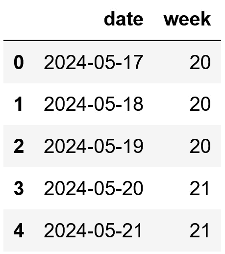

# 第七章：<st c="0">6</st>

# 从日期和时间变量中提取特征

日期和时间变量包含有关日期、时间或两者的信息，在编程中，我们将它们统称为 `<st c="177">datetime</st>` 特征。出生日期、事件发生时间以及最后付款的日期和时间是 `<st c="291">datetime</st>` 变量的例子。

由于它们的性质，`<st c="336">datetime</st>` 特征通常具有高基数。这意味着它们包含大量唯一的值，每个值对应一个特定的日期和/或时间组合。我们通常不会在原始格式下使用 `<st c="536">datetime</st>` 变量作为机器学习模型的输入。相反，我们通过从这些变量中提取多个特征来丰富数据集。这些新特征通常具有较低的基数，并允许我们捕捉到有意义的信息，例如趋势、季节性和重要事件和倾向。

在本章中，我们将探讨如何通过利用 `<st c="957">pandas</st>` `<st c="963">dt</st>` 模块从日期和时间中提取特征，然后使用 `<st c="1013">feature-engine</st>` 自动化此过程。

本章将涵盖以下内容：

+   使用 `<st c="1112">pandas</st>` 从日期中提取特征

+   使用 `<st c="1154">pandas</st>` 从时间中提取特征

+   捕获 `<st c="1192">datetime</st>` 变量之间的经过时间

+   在不同的时区中处理时间

+   使用 `<st c="1297">feature-engine</st>` 自动化 `<st c="1264">datetime</st>` 特征提取

# 技术要求

在本章中，我们将使用 `<st c="1368">pandas</st>`、`<st c="1376">numpy</st>` 和 `<st c="1387">feature-engine</st>` Python 库。

# 使用 pandas 从日期中提取特征

`<st c="1477">datetime</st>` 变量的值可以是日期、时间或两者。我们将首先关注包含日期的变量。我们很少使用原始数据与机器学习算法一起使用。相反，我们提取更简单的特征，如年份、月份或星期几，这些特征允许我们捕捉到季节性、周期性和趋势等洞察。

`<st c="1809">The</st>` `<st c="1814">pandas</st>` `<st c="1820">Python 库非常适合处理日期和时间。</st>` `<st c="1877">利用</st>` `<st c="1891">pandas</st>` `<st c="1897">dt</st>` `<st c="1900">模块，我们可以访问</st>` `<st c="1927">datetime</st>` `<st c="1935">属性，从而提取许多特征。</st>` `<st c="1992">然而，为了利用此功能，变量需要转换为支持这些操作的数据类型，例如</st>` `<st c="2120">datetime</st>` `<st c="2128">或</st>` `<st c="2132">timedelta</st>` `<st c="2141">.</st>`

`<st c="2142">注意</st>`

`<st c="2147">The</st>` `<st c="2152">datetime</st>` `<st c="2160">variables can be cast as objects, particularly when we load the data from a CSV file.</st>` `<st c="2247">为了提取本章中我们将讨论的日期和时间特征，有必要将变量重新转换为</st>` `<st c="2374">datetime</st>` `<st c="2382">.</st>`

在这个菜谱中，我们将学习如何通过利用 `<st c="2462">panda</st><st c="2467">s</st>` `<st c="2469">.</st>` 从日期中提取特征。

## `<st c="2470">准备就绪</st>`

`<st c="2484">以下是一些我们可以从</st>` `<st c="2553">date</st>` `<st c="2557">部分</st>` `<st c="2570">datetime</st>` `<st c="2578">变量</st>` `<st c="2602">使用</st>` `<st c="2608">pandas</st>` `<st c="2614">直接提取的特征</st>`:

+   `<st c="2616">pandas.Series.dt.year</st>`

+   `<st c="2637">pandas.Series.dt.quarter</st>`

+   `<st c="2662">pandas.Series.dt.month</st>`

+   `<st c="2685">pandas.Series.dt.isocalendar().week</st>`

+   `<st c="2721">pandas.Series.dt.day</st>`

+   `<st c="2742">pandas.Series.dt.day_of_week</st>`

+   `<st c="2771">pandas.Series.dt.weekday</st>`

+   `<st c="2796">pandas.Series.dt.dayofyear</st>`

+   `<st c="2823">pandas.Series.dt.day_of_year</st>`

`<st c="2852">我们可以</st>` `<st c="2860">使用我们使用</st>` `<st c="2897">pandas</st>` `<st c="2903">获得的特征</st>` `<st c="2906">创建更多特征，例如学期或</st>` `<st c="2958">是否为周末。</st>` `<st c="2983">我们将在下一节中学习如何做到这一点。</st>`

## `<st c="3033">How to do it...</st>`

`<st c="3049">为了继续这个菜谱，让我们导入</st>` `<st c="3093">pandas</st>` `<st c="3099">和</st>` `<st c="3104">numpy</st>` `<st c="3109">，并创建一个</st>` `<st c="3124">样本 DataFrame</st>` `<st c="3374">:</st>`

1.  `<st c="3141">Let’s import</st>` `<st c="3155">the libraries:</st>`

    ```py
     import numpy as np
    import pandas as pd
    ```

1.  `<st c="3208">我们将从创建 20 个</st>` `<st c="3236">datetime</st>` `<st c="3244">值开始，从</st>` `<st c="3267">2024-05-17</st>` `<st c="3277">午夜开始，然后以 1 天的增量递增。</st>` `<st c="3327">然后，我们将这些值捕获在一个</st>` `<st c="3365">DataFrame</st>` `<st c="3374">实例中，并显示前五行：</st>`

    ```py
     rng_ = pd.date_range(
        "2024-05-17", periods=20, freq="D")
    data = pd.DataFrame({"date": rng_})
    data.head()
    ```

    在以下输出中，我们看到我们在 *<st c="3602">Step</st><st c="3605"> 2</st>*<st c="3609"> 中创建的包含日期的变量：<st c="3520">：</st>


<st c="3680">图 6.1 – 仅包含日期的 datetime 变量的 DataFrame 的顶部行</st>

<st c="3763">注意</st>

我们可以通过执行 `<st c="3768">data["date"].dtypes</st>` 来检查变量的数据格式。如果变量被转换为对象，我们可以通过执行 `<st c="3938">data["date_dt"] =</st>` `<st c="3956">pd.to_datetime(data["date"])</st>` `<st c="3984">.</st>` 将其转换为 `<st c="3909">datetime</st>` 格式。

1.  <st c="3985">L</st><st c="3987">et’s</st> `<st c="3991">extract the year pa</st>` `<st c="4011">rt of the date in a</st> `<st c="4032">new column and display the top five rows of</st>` `<st c="4075">the</st>` `<st c="4080">resulting DataFrame:</st>

    ```py
     data["year"] = data["date"].dt.year
    data.head()
    ```

    <st c="4148">我们在以下输出中看到新的</st> `<st c="4164">year</st>` `<st c="4168">变量：</st>


<st c="4303">图 6.2 – 从日期中提取年份变量的 DataFrame 的前五行</st>

1.  让我们从日期中提取年份的四分之一到一个新列，并显示前五行：

    ```py
     data["quarter"] = data["date"].dt.quarter
    data[["date", "quarter"]].head()
    ```

    <st c="4573">我们在以下输出中看到新的</st> `<st c="4589">quarter</st>` `<st c="4596">变量：</st>


<st c="4722">图 6.3 – 从日期中提取四分之一变量的 DataFrame 的前五行</st>

1.  通过 `<st c="4825">quarte</st>` `<st c="4831">r</st>` `<st c="4833">`，我们现在可以创建 `<st c="4857">semester</st>` `<st c="4865">特征：</st>

    ```py
     data["semester"] = np.where(data["quarter"] < 3, 1, 2)
    ```

<st c="4929">注意</st>

您可以使用 `<st c="5002">pandas</st>` `<st c="5008">’</st>` `<st c="5011">unique()</st>` `<st c="5019">`，例如，通过执行 `<st c="5047">df["quarter"].unique()</st>` `<st c="5069">` 或 `<st c="5073">df["semester"].unique()</st>` `<st c="5096">.</st>` 来探索新变量的不同值。

1.  <st c="5097">让我们从日期中提取</st> `<st c="5116">month</st>` `<st c="5121">部分到一个新列，并显示 DataFrame 的前五行：</st>

    ```py
     data["month"] = data["date"].dt.month
    data[["date", "month"]].head()
    ```

    <st c="5271">我们在以下输出中看到新的</st> `<st c="5287">month</st>` `<st c="5292">变量：</st>


<st c="5411">图 6.4 – 带有新 month 变量的 DataFrame 的前五行</st><st c="5482">变量</st>

1.  <st c="5487">让我们从</st> `<st c="5545">日期</st>` <st c="5546">中提取周数（一年有 52 周）：</st>

    ```py
     data["week"] = data["date"].dt.isocalendar().week
    data[["date", "week"]].head()
    ```

    <st c="5634">我们在</st> `<st c="5646">下周</st>` <st c="5650">变量中看到</st> <st c="5667">以下</st><st c="5675">输出：</st>



<st c="5773">图 6.5 – 带有新 week 变量的 DataFrame 的前五行</st>

1.  <st c="5847">让我们提取月份的天数，它可以取</st> `<st c="5914">1</st>` <st c="5915">到</st> `<st c="5920">31</st>`<st c="5922">之间的值，到一个新列中：</st>

    ```py
     data["day_mo"] = data["date"].dt.day
    data[["date", "day_mo"]].head()
    ```

    <st c="6011">我们</st> <st c="6015">看到</st> `<st c="6023">day_mo</st>` <st c="6029">变量</st> <st c="6038">在</st> <st c="6046">以下</st><st c="6052">输出中：</st>


<st c="6154">图 6.6 – 带有新变量捕获月份天数的 DataFrame 的前几行</st>

1.  <st c="6247">让我们提取星期几，其值介于</st> `<st c="6303">0</st>` <st c="6304">和</st> `<st c="6309">6</st>` <st c="6310">(从星期一到星期日)，在一个新列中，然后显示前几行：</st>

    ```py
     data["day_week"] = data["date"].dt.dayofweek
    data[["date", "day_mo", "day_week"]].head()
    ```

    <st c="6468">我们在</st> `<st c="6480">day_week</st>` <st c="6488">变量中看到</st> <st c="6505">以下</st><st c="6512">输出：</st>


<st c="6633">图 6.7 – 带有表示一周中天的新变量的 DataFrame 的前几行](img/B22396_06_7.jpg)

1.  <st c="6721">使用来自</st> *<st c="6745">步骤 9</st>*<st c="6751">的变量，我们可以创建一个二元变量，表示是否是</st> <st c="6815">周末：</st>

    ```py
     data["is_weekend"] = (
        data[«date»].dt.dayofweek > 4).astype(int)
    data[["date", "day_week", "is_weekend"]].head()
    ```

    <st c="6939">我们在</st> `<st c="6943">看到</st>` <st c="6946">新的</st> `<st c="6955">is_weekend</st>` <st c="6965">变量</st> <st c="6975">在</st> <st c="6982">以下</st><st c="6987">输出中：</st>


<st c="7101">图 6.8 – 带有新 is_weekend 变量的 DataFrame 的前五行</st>

<st c="7181">注意</st>

<st c="7186">我们可以通过使用</st> `<st c="7249">feature-engine</st>`<st c="7263">来自动提取所有这些特征。</st> 查看本章的*<st c="7279">使用 feature-engine 自动化日期时间特征提取</st>* <st c="7337">食谱以获取更多详细信息。</st>

<st c="7378">有了这些，我们就使用</st> `<st c="7475">pandas</st>`<st c="7481">从</st> `<st c="7451">datetime</st>` <st c="7459">变量的日期部分提取了许多</st> <st c="7414">新特征。</st> 这些特征对于数据分析、可视化和</st> `<st c="7547">预测</st><st c="7556">建模</st>`非常有用。

## <st c="7569">它是如何工作的...</st>

在这个菜谱中，我们<st c="7585">提取了从</st> <st c="7604">一个</st> `<st c="7649">datetime</st>` <st c="7657">变量</st> <st c="7666">中</st> <st c="7680">使用</st> `<st c="7682">pandas</st>`<st c="7701">的</st> `<st c="7680">dt</st>` <st c="7682">模块</st>提取的许多与日期相关的特征。</st> <st c="7713">首先，我们</st> <st c="7778">使用</st> `<st c="7786">pandas</st>`<st c="7792">的</st> `<st c="7795">date_range()</st>` <st c="7807">创建了一个包含日期的变量的样本 DataFrame。</st> <st c="7915">使用</st> `<st c="7924">periods</st>` <st c="7931">参数，我们指明了要创建的值的范围数量——即日期的数量。</st> <st c="8031">使用</st> `<st c="8040">freq</st>` <st c="8044">参数，我们指明了日期之间的步长大小。</st> <st c="8109">在我们的例子中，我们使用了</st> `<st c="8117">D</st>` <st c="8118">来表示天数。</st> <st c="8144">最后，我们使用</st> `<st c="8205">pandas</st>` `<st c="8211">DataFrame()</st>`<st c="8223">将日期范围转换为一个 DataFrame。</st>

<st c="8224">为了提取日期的不同部分，我们使用了</st> `<st c="8275">pandas</st>`<st c="8281">的</st> `<st c="8284">dt</st>` <st c="8286">来访问一个</st> `<st c="8301">pandas</st>` <st c="8332">Series 的</st> `<st c="8309">datetime</st>` <st c="8326">属性，然后利用了不同的属性。</st> <st c="8384">我们使用了</st> `<st c="8392">year</st>`<st c="8396">、</st> `<st c="8398">month</st>`<st c="8403">和</st> `<st c="8409">quarter</st>` <st c="8416">来将年份、月份和季度捕获到 DataFrame 的新列中。</st> <st c="8492">为了找到学期，我们使用 NumPy 的</st> `<st c="8549">where()</st>` <st c="8556">结合新创建的</st> `<st c="8595">quarter</st>` <st c="8602">变量创建了一个布尔值。</st> <st c="8613">NumPy 的</st> `<st c="8621">where()</st>` <st c="8628">扫描了</st> `<st c="8655">quarter</st>` <st c="8662">变量的值；如果它们小于</st> `<st c="8699">3</st>`<st c="8700">，则返回</st> `<st c="8727">1</st>` <st c="8728">，对应于第一学期；否则，返回</st> `<st c="8789">2</st>`<st c="8790">，对应于第二学期。</st>

<st c="8830">为了提取</st> <st c="8841">不同</st> <st c="8855">的日和周表示，我们</st> <st c="8893">使用了</st> `<st c="8903">isocalender().week</st>`<st c="8921">,</st> `<st c="8923">day</st>`<st c="8926">, 和</st> `<st c="8932">dayofweek</st>` <st c="8941">属性。</st> <st c="8954">有了周几的信息，我们继续</st> <st c="8994">创建了一个二元变量来表示是否为周末。</st> <st c="9062">我们使用了</st> `<st c="9070">where()</st>` <st c="9077">函数来扫描周几，如果值大于</st> `<st c="9141">4</st>`<st c="9142">，即周六和周日，函数返回</st> `<st c="9208">True</st>` <st c="9212">，否则返回</st> `<st c="9227">False</st>`<st c="9232">。最后，我们将这个布尔向量转换为整数，以得到一个由 1 和 0 组成的二元变量。</st> <st c="9327">有了这个，我们就从日期中创建了多个特征，这些特征可以用于数据分析和</st> <st c="9416">预测建模。</st>

## <st c="9438">还有更多...</st>

<st c="9452">使用</st> `<st c="9459">pandas</st>`<st c="9465">’</st> `<st c="9468">dt</st>` <st c="9470">模块，我们可以</st> <st c="9485">从日期中提取更多特征，这些特征来自</st> <st c="9534">盒子。</st> <st c="9540">例如，我们可以提取月份、季度或年份的开始和结束，是否为闰年，以及月份中的天数。</st> <st c="9682">这些函数允许您</st> <st c="9724">这样做：</st>

+   `<st c="9730">pandas.Series.dt.is_month_start</st>`

+   `<st c="9762">pandas.Series.dt.is_month_end</st>`

+   `<st c="9792">pandas.Series.dt.is_quarter_start</st>`

+   `<st c="9826">pandas.Series.dt.is_quarter_end</st>`

+   `<st c="9858">pandas.Series.dt.is_year_start</st>`

+   `<st c="9889">pandas.Series.dt.is_year_end</st>`

+   `<st c="9918">pandas.Series.dt.is_leap_year</st>`

+   `<st c="9948">pandas.Series.dt.days_in_month</st>`

<st c="9979">我们还可以使用</st> `<st c="10043">pd.dt.days_in_month</st>` <st c="10062">来返回特定月份的天数，以及一年中的天数（从</st> `<st c="10091">1</st>` <st c="10092">到</st> `<st c="10096">365</st>`<st c="10099">）</st> <st c="10102">，使用</st> `<st c="10107">pd.dt</st><st c="10112">.dayofyear</st>`<st c="10122">。</st>

<st c="10123">有关</st> <st c="10128">更多详细信息，请访问</st> `<st c="10152">pandas</st>`<st c="10158">’</st> `<st c="10161">datetime</st>` <st c="10169">文档：</st> [<st c="10185">https://pandas.pydata.org/pandas-docs/stable/user_guide/timeseries.html#time-date-components</st>](https://pandas.pydata.org/pandas-docs/stable/user_guide/timeseries.html#time-date-components)<st c="10277">。</st>

## <st c="10278">另请参阅</st>

<st c="10287">要了解如何使用</st> <st c="10310">pandas</st> <st c="10348">的</st> `<st c="10351">date_ranges()</st>` <st c="10364">创建不同的</st> `<st c="10321">datetime</st>` <st c="10329">范围，请访问</st> [<st c="10372">https://pandas.pydata.org/pandas-docs/stable/user_guide/timeseries.html#offset-aliases</st>](https://pandas.pydata.org/pandas-docs/stable/user_guide/timeseries.html#offset-aliases)<st c="10458">。</st>

<st c="10459">要了解更多关于</st> <st c="10473">`<st c="10480">pandas</st>`<st c="10486">’</st> `<st c="10489">dt</st>`<st c="10491">,</st> <st c="10493">请访问</st> [<st c="10499">https://pandas.pydata.org/pandas-docs/stable/reference/series.html#datetime-properties</st>](https://pandas.pydata.org/pandas-docs/stable/reference/series.html#datetime-properties)<st c="10585">。</st>

# <st c="10586">使用 pandas 从时间中提取特征</st>

<st c="10628">一些</st> <st c="10634">事件</st><st c="10644">在一天中的特定时间发生得更频繁</st> – <st c="10692">例如，欺诈活动更可能在夜间或清晨发生。</st> <st c="10745">空气污染物浓度也随着一天中的时间变化，在交通高峰时段达到峰值，此时街道上有更多车辆。</st> <st c="10781">因此，从数据中提取时间特征对于数据分析和预测建模非常有用。</st> <st c="10917">在本教程中，我们将通过使用 <st c="11073">datetime</st> <st c="11081">变量并利用</st> `<st c="11095">pandas</st>` <st c="11105">和</st> `<st c="11111">NumPy</st>` <st c="11117">来提取不同的时间部分。</st>

## <st c="11122">准备就绪</st>

<st c="11136">我们可以使用以下</st> `<st c="11200">pandas</st>`<st c="11206">’</st> `<st c="11209">datetime</st>` <st c="11217">属性来提取小时、分钟和秒：</st>

+   `<st c="11229">pandas.Series.dt.hour</st>`

+   `<st c="11251">pandas.Series.dt.minute</st>`

+   `<st c="11276">pandas.Series.dt.second</st>`

## <st c="11300">如何操作...</st>

<st c="11316">在本</st> <st c="11325">教程</st> <st c="11339">中，我们</st> <st c="11351">将</st> <st c="11355">提取</st> `<st c="11357">分钟</st>`<st c="11363">，</st> `<st c="11369">秒</st>` <st c="11375">部分的时间</st> `<st c="11386">变量</st>` <st c="11390">。</st> <st c="11401">让我们首先导入库并创建一个</st> <st c="11429">样本数据集：</st>

1.  <st c="11470">让我们导入</st> `<st c="11484">pandas</st>` <st c="11490">和</st> `<st c="11495">numpy</st>`<st c="11500">:</st>

    ```py
     import numpy as np
    import pandas as pd
    ```

1.  让我们首先创建 20 个 **日期时间** 观察值，从 `<st c="11605">2024-05-17</st>` <st c="11615">午夜开始，然后以 1 小时、15 分钟和 10 秒的增量增加。接下来，我们将时间范围捕获到 DataFrame 中并显示前五行：

    ```py
     rng_ = pd.date_range(
        "2024-05-17", periods=20, freq="1h15min10s")
    df = pd.DataFrame({"date": rng_})
    df.head()
    ```

    在以下输出中，我们可以看到**步骤 2**中的变量，它包含一个**日期**部分和一个**时间**部分，并且值以 1 小时、15 分钟和 10 秒的间隔增加：


1.  让我们提取**小时**、**分钟**和**秒**部分，并将它们捕获到三个新的列中，然后显示 DataFrame 的前五行：

    ```py
     df["hour"] = df["date"].dt.hour
    df["min"] = df["date"].dt.minute
    df["sec"] = df["date"].dt.second
    df.head()
    ```

    在以下输出中，我们可以看到我们在**步骤 3**中提取的三个时间**特征**：


注意

记住，`<st c="12845">pandas</st>`<st c="12851"> 的 `<st c="12854">dt</st>` 需要一个 `<st c="12865">datetime</st>` 对象才能工作。您可以使用 `<st c="12964">pandas</st>` `<st c="12970">to_datetime()</st>`<st c="12984"> 将对象变量的数据类型更改为 `<st c="12946">datetime</st>`。

1.  让我们执行与**步骤 3**中相同的操作，但现在在一行代码中完成：

    ```py
     df[["h", "m", "s"]] = pd.DataFrame(
        [(x.hour, x.minute, x.second) for x in df["date"]]
    )
    df.head()
    ```

    在以下输出中，我们看到新创建的变量：


无

您可以使用 `<st c="13592">pandas</st>`<st c="13598"> 的 `<st c="13601">unique()</st>`<st c="13609"> 方法检查新变量的唯一值，例如，通过执行 `<st c="13637">df['hour'].unique()</st>`<st c="13656">。

1.  <st c="13657">最后，让我们</st> <st c="13672">创建一个二进制变量，该变量</st> <st c="13703">标记在早晨发生的事件，在</st> <st c="13753">早上 6 点</st> <st c="13761">和</st> <st c="13765">中午 12 点</st> <st c="13753">之间：</st>

    ```py
     df["is_morning"] = np.where(
        (df[«hour»] < 12) & (df[«hour»] > 6), 1, 0 )
    df.head()
    ```

    <st c="13857">我们在以下输出中看到了</st> `<st c="13869">is_morning</st>` <st c="13879">变量：</st>


<st c="14145">图 6.12 – 从时间派生的新变量的 DataFrame 的前几行</st>

<st c="14227">有了这个，我们从</st> `<st c="14294">datetime</st>` <st c="14302">变量的时间部分</st> <st c="14313">提取了多个特征。</st> <st c="14313">这些特征可用于数据分析</st><st c="14352">和</st> <st c="14363">预测建模。</st>

## <st c="14384">它是如何工作的...</st>

<st c="14400">在这个菜谱中，我们创建了捕获时间表示的特征。</st> <st c="14475">首先，我们创建了一个包含</st> `<st c="14519">datetime</st>` <st c="14527">变量的样本 DataFrame。</st> <st c="14538">我们使用</st> `<st c="14546">pandas</st>` `<st c="14552">date_range()</st>`<st c="14565">创建了一个从任意日期开始，以 1 小时、15 分钟和 10 秒为间隔的 20 个值的范围。</st> <st c="14597">我们使用</st> `<st c="14615">1h15min10s</st>` <st c="14619">字符串作为</st> `<st c="14757">freq</st>` <st c="14761">参数的频率项，以指示所需的增量。</st> <st c="14807">接下来，我们使用</st> `<st c="14865">pandas</st>`<st c="14871">’</st> `<st c="14874">DataFrame()</st>`<st c="14885">将日期范围转换为 DataFrame。</st>

<st c="14886">为了提取不同的时间部分，我们使用</st> `<st c="14932">pandas</st>`<st c="14938">’</st> `<st c="14941">dt</st>` <st c="14943">来访问</st> `<st c="14958">hour</st>`<st c="14962">,</st> `<st c="14964">minute</st>`<st c="14970">, 和</st> `<st c="14976">second</st>` `<st c="14982">时间</st>` <st c="14987">属性。</st> <st c="15000">在从</st> `<st c="15027">time</st>`<st c="15031">中提取</st> `<st c="15017">hour</st>` <st c="15021">之后，我们使用它通过 NumPy 的</st> `<st c="15123">where()</st>`<st c="15130">创建了一个新特征，该特征指示是否为早晨。NumPy 的</st> `<st c="15140">where()</st>` <st c="15147">扫描了</st> `<st c="15160">hour</st>` <st c="15164">变量；如果其值小于 12 且大于 6，则分配值为</st> `<st c="15253">1</st>`<st c="15254">；否则，分配值为</st> `<st c="15290">0</st>`<st c="15291">。通过这些操作，我们在 DataFrame 中添加了几个可用于数据分析和</st> <st c="15397">训练机器学习模型的特征。</st>

## <st c="15431">还有更多…</st>

<st c="15445">我们还可以使用以下</st> `<st c="15514">pandas</st>` <st c="15520">属性</st>提取微秒和纳秒：</st>

+   `<st c="15532">pandas.Series.dt.microsecond</st>`

+   `<st c="15561">pandas.Series.dt.nanosecond</st>`

<st c="15589">有关更多</st> <st c="15599">详细信息</st>，<st c="15608">请访问</st> [<st c="15614">https://pandas.pydata.org/pandas-docs/stable/user_guide/timeseries.html#time-date-components</st>](https://pandas.pydata.org/pandas-docs/stable/user_guide/timeseries.html#time-date-components)<st c="15706">。</st>

# <st c="15707">捕获 datetime 变量之间的经过时间</st>

<st c="15761">我们可以从每个</st> <st c="15777">datetime</st> <st c="15785">变量中提取强大的功能，就像我们在前两个食谱中所做的那样。</st> <st c="15876">我们可以通过组合多个</st> `<st c="15932">datetime</st>` <st c="15940">变量来创建额外的特征。</st> <st c="15952">一个常见的例子是通过比较</st> **<st c="15996">出生日期</st>** <st c="15999">和</st> **<st c="16041">事件日期</st>** <st c="16054">来提取事件发生时的</st> **<st c="16064">年龄</st>** <st c="16072">。</st>

<st c="16082">在这个食谱中，我们将学习如何通过利用</st> `<st c="16181">pandas</st>` <st c="16187">和</st> `<st c="16192">feature-engine</st>`<st c="16206">来捕获两个</st> `<st c="16149">datetime</st>` <st c="16157">变量之间的时间。</st>

## <st c="16207">如何实现...</st>

<st c="16223">要继续这个食谱，我们将创建一个包含两个</st> `<st c="16293">datatime</st>` <st c="16301">变量</st>的 DataFrame：</st>

1.  <st c="16312">让我们首先导入</st> `<st c="16338">pandas</st>`<st c="16344">，`<st c="16346">numpy</st>`<st c="16351">，和</st> `<st c="16353">datetime</st>`<st c="16365">：</st>

    ```py
     import datetime
    import numpy as np
    import pandas as pd
    ```

1.  <st c="16422">我们将首先创建两个</st> `<st c="16451">datetime</st>` <st c="16459">变量，每个变量包含 20 个值；值从</st> `<st c="16513">2024-05-17</st>` <st c="16523">开始，第一个变量的间隔为</st> `<st c="16553">1</st>` <st c="16554">小时，第二个变量的间隔为</st> `<st c="16588">1</st>` <st c="16589">月。</st> <st c="16612">然后，我们将变量捕获到 DataFrame 中，添加列名，并显示</st> <st c="16696">顶部行：</st>

    ```py
     date = "2024-05-17"
    rng_hr = pd.date_range(date, periods=20, freq="h")
    rng_month = pd.date_range(date, periods=20, freq="ME")
    df = pd.DataFrame(
        {"date1": rng_hr, "date2": rng_month})
    df.head()
    ```

    <st c="16899">在以下输出中，我们看到</st> <st c="16910">来自</st> *<st c="16950">步骤 2</st>* <st c="16956">的</st> <st c="16964">以下</st> <st c="16934">DataFram</st><st c="16942">e</st> 的前五行：</st>


<st c="17157">图 6.13 – 包含两个 datetime 变量的 DataFrame 的前五行</st>

1.  <st c="17234">让我们在新的特征中捕获两个变量之间的天数差异，然后显示 DataFrame 的</st> <st c="17349">顶部行：</st>

    ```py
     df["elapsed_days"] = (
        df["date2"] - df["date1"]).dt.days
    df.head()
    ```

    <st c="17426">我们可以在以下输出中看到天数差异：</st>


<st c="17687">图 6.14 – 捕获两个 datetime 特征之间时间差的新变量的 DataFrame 的顶部行</st>

1.  <st c="17808">让我们捕获</st> <st c="17822">两个</st> <st c="17841">datetime</st> <st c="17863">变量之间的</st> <st c="17871">周数差异，然后显示 DataFrame 的</st> <st c="17915">顶部行：</st>

    ```py
     df["weeks_passed"] = (
        (df[«date2»] - df[«date1»]) / np.timedelta64(1, "W"))
    df.head()
    ```

    <st c="18011">我们可以在以下屏幕截图中的变量之间看到周数差异：</st>


<st c="18361">图 6.15 – 以天数和周数表示的 datetime 变量之间的</st> <st c="18463">时间差</st>

1.  <st c="18490">现在，让我们计算变量之间的时间差，以分钟和秒为单位，然后显示 DataFrame 的</st> <st c="18602">顶部行：</st>

    ```py
     df["diff_seconds"] = (
        df[«date2»] - df[«date1»])/np.timedelta64(1, «s»)
    df["diff_minutes"] = (
        df[«date2»] - df[«date1»])/ np.timedelta64(1,»m»)
    df.head()
    ```

    <st c="18767">我们可以在以下输出中看到</st> <st c="18779">新变量：</st> <st c="18800">（输出内容省略）</st>


<st c="19205">图 6.16 – 以不同时间单位表示的两个 datetime 变量之间时间差的 DataFrame</st>

1.  <st c="19324">最后，让我们计算一个变量与当前日期之间的差异，以天数表示，然后显示 DataFrame 的前五行：</st>

    ```py
     df["to_today"] = (
        datetime.datetime.today() - df["date1"])
    df.head()
    ```

    <st c="19560">我们可以在以下输出的 DataFrame 的最后一列中找到新变量：</st>


<st c="20059">图 6.17 – 包含 date1 和执行此代码当天日期之间差异的新变量的 DataFrame</st>

<st c="20181">注意</st>

<st c="20186">你的电脑上的</st> `<st c="20191">to_today</st>` <st c="20199">变量将与本书中的不同，这是由于写作时的当前日期与</st> <st c="20352">你执行</st> <st c="20364">代码时的日期之间的差异造成的。</st>

<st c="20373">这就完成了！</st> <st c="20385">我们现在已经通过比较两个</st> `<st c="20470">datetime</st>` <st c="20478">变量创建的新特征丰富了我们的数据集。</st>

## <st c="20489">它是如何工作的...</st>

<st c="20505">在这个菜谱中，我们</st> <st c="20525">捕捉了两个</st> `<st c="20584">datetime</st>` <st c="20592">变量之间时间的不同表示。</st> <st c="20604">要继续这个菜谱，我们创建了一个包含两个变量的样本 DataFrame，每个变量从任意日期开始有 20 个日期。</st> <st c="20733">第一个变量以</st> `<st c="20778">1</st>` <st c="20779">小时的间隔增加，而第二个变量以</st> `<st c="20838">1</st>` <st c="20839">月的间隔增加。</st> <st c="20847">我们使用</st> `<st c="20877">pandas</st>`<st c="20883">’</st> `<st c="20886">date_range()</st>`<st c="20898">创建了这些变量，我们将在本章前两个菜谱中讨论它。</st>

<st c="20963">为了确定变量之间的差异——即确定它们之间的时间差——我们直接从另一个</st> `<st c="21089">datetime</st>` <st c="21097">变量中减去一个</st> `<st c="21137">pandas</st>` <st c="21143">Series</st> ——即从一个</st> `<st c="21198">pandas</st>` <st c="21204">Series</st> 中减去另一个。</st> <st c="21242">两个</st> `<st c="21227">pandas</st>` <st c="21233">Series</st> 之间的差异返回了一个新的</st> `<st c="21242">pandas</st>` <st c="21248">Series</st>。</st> <st c="21242">为了捕捉天数差异，我们使用了</st> `<st c="21285">pandas</st>`<st c="21291">’</st> `<st c="21294">dt</st>`<st c="21296">，后面跟着</st> `<st c="21310">days</st>`<st c="21314">。要将时间差转换为月份，我们使用了</st> `<st c="21368">timedelta()</st>` <st c="21379">从 NumPy，表示我们想要以周为单位传递差异，通过在方法的第二个参数中传递</st> `<st c="21453">W</st>` <st c="21454">。</st> <st c="21493">为了捕捉秒和分钟的差异，我们分别将</st> `<st c="21557">s</st>` <st c="21558">和</st> `<st c="21563">m</st>` <st c="21564">字符串传递给</st> `<st c="21576">timedelta()</st>`<st c="21587">。</st>

<st c="21602">注意</st>

<st c="21607">NumPy 的</st> `<st c="21634">timedelta</st>` <st c="21643">的参数是一个数字，</st> `<st c="21658">– 1</st>`<st c="21661">，在我们的例子中，表示单位数量，以及一个</st> `<st c="21719">datetime</st>` <st c="21727">单位，例如天（</st>`<st c="21747">D</st>`<st c="21749">），周（</st>`<st c="21758">W</st>`<st c="21760">），小时（</st>`<st c="21770">h</st>`<st c="21772">），分钟（</st>`<st c="21784">m</st>`<st c="21786">），或者</st> <st c="21792">秒（</st>`<st c="21801">s</st>`<st c="21803">）。</st>

最后，我们</st> `<st c="21818">从</st>` `<st c="21846">一个</st>` `<st c="21851">日期</st>` `<st c="21855">时间</st>` `<st c="21860">变量到今天的日期</st>` `<st c="21887">捕获了差异。</st>` `<st c="21887">我们通过使用</st>` `<st c="21960">today()</st>` `<st c="21967">从内置的</st>` `<st c="21986">datetime</st>` `<st c="21994">Python 库</st>` `<st c="21994">获得了今天的日期和时间（撰写本文时）。</st>

## [还有更多...</st>

[我们可以通过使用`<st c="22121">feature-engine</st>` `<st c="22135">的</st>` `<st c="22139">转换器</st>` `<st c="22151">DatetimeSubstraction()</st>` `<st c="22173">来自动化创建捕获变量之间时间的特征。</st>

1.  [让我们导入</st> `<st c="22188">pandas</st>` `<st c="22194">和</st>` `<st c="22199">feature-engine</st>` `<st c="22213">的转换器：</st>

    ```py
     import pandas as pd
    from feature_engine.datetime import (
        DatetimeSubtraction
    )
    ```

1.  [让我们重新创建我们在</st> *<st c="22366">步骤 2</st>* `<st c="22372">的</st> *<st c="22380">如何做</st>` *<st c="22390">它…</st>` `<st c="22393">部分中描述的</st>样本数据集：</st>

    ```py
     date = "2024-05-17"
    rng_hr = pd.date_range(date, periods=20, freq="h")
    rng_month = pd.date_range(date, periods=20, freq="ME")
    df = pd.DataFrame(
        {"date1": rng_hr, "date2": rng_month})
    ```

1.  [让我们设置</st>` `<st c="22600">DatetimeSubstraction()</st>` `<st c="22622">以返回第二个日期和第一个日期之间的时间差，以天为单位：</st>

    ```py
     ds = DatetimeSubtraction(
        variables="date2",
        reference="date1",
        output_unit="D",
    )
    ```

[注意</st>

[我们可以通过在`<st c="22897">variables</st>` `<st c="22906">和</st>` `<st c="22911">reference</st>` `<st c="22920">参数中传递变量列表来获得两个以上变量的差值。</st>

1.  [让我们创建</st> `<st c="22945">然后显示</st>` `<st c="22967">新功能：</st>

    ```py
     dft = ds.fit_transform(df)
    dft.head()
    ```

    [在以下输出中，我们看到捕获了两个</st>` `<st c="23113">日期时间</st>` `<st c="23121">变量</st>` `<st c="23132">之间时间差的变量，以天为单位：</st>

<st c="23613">。</st>

## 参见

[要了解更多关于 NumPy 的</st> `<st c="23652">timedelta</st>` `<st c="23661">，</st> `<st c="23663">请访问</st>` [<st c="23669">https://numpy.org/devdocs/reference/arrays.datetime.html#datetime-and-timedelta-arithmetic</st>](https://numpy.org/devdocs/reference/arrays.datetime.html#datetime-and-timedelta-arithmetic)<st c="23759">。</st>

# [在不同时区处理时间</st>

<st c="23802">一些</st> <st c="23807">组织在国际上运营；因此，他们收集关于事件的信息可能记录在事件发生地区的时区旁边。</st> <st c="23854">为了能够比较发生在不同时区的事件，我们通常必须将所有变量设置在同一个时区内。</st> <st c="23981">在本食谱中，我们将学习如何统一一个</st> `<st c="24184">datetime</st>` <st c="24192">变量的时区，以及如何使用</st> `<st c="24265">pandas</st>`<st c="24271">将变量重新分配到不同的时区。</st>

## <st c="24272">如何操作...</st>

<st c="24288">为了继续本食谱，我们将创建一个包含两个不同</st> <st c="24388">时区变量的样本 DataFrame：</st>

1.  <st c="24399">让我们</st> <st c="24406">导入</st> `<st c="24413">pandas</st>`<st c="24419">：</st>

    ```py
     import pandas as pd
    ```

1.  <st c="24441">让我们创建一个包含一个变量在不同</st> <st c="24516">时区值的 DataFrame：</st>

    ```py
     df = pd.DataFrame()
    df['time1'] = pd.concat([
        pd.Series(
            pd.date_range(
                start='2024-06-10 09:00',
                freq='h',
                periods=3,
                tz='Europe/Berlin')),
        pd.Series(
            pd.date_range(
                start='2024-09-10 09:00',
                freq='h',
                periods=3,
                tz='US/Central'))
        ], axis=0)
    ```

1.  <st c="24770">让我们向 DataFrame 添加另一个</st> <st c="24789">datetime</st> <st c="24797">变量，它也包含不同</st> <st c="24865">时区的值：</st>

    ```py
     df['time2'] = pd.concat([
        pd.Series(
            pd.date_range(
                start='2024-07-01 09:00',
                freq='h',
                periods=3,
                tz='Europe/Berlin')),
        pd.Series(
            pd.date_range(
                start='2024-08-01 09:00',
                freq='h',
                periods=3,
                tz='US/Central'))
        ], axis=0)
    ```

    <st c="25100">如果我们现在执行</st> `<st c="25119">df</st>`<st c="25121">，我们将看到包含不同时区变量的 DataFrame，如下面的输出所示：</st>


<st c="25549">图 6.19 – 包含不同时区两个日期时间变量的 DataFrame</st>

<st c="25626">注意</st>

<st c="25631">时区用</st> `<st c="25668">+02</st>` <st c="25671">和</st> `<st c="25676">-05</st>` <st c="25679">值表示，分别表示与**<st c="25745">协调世界时</st>** **<st c="25767">（</st>****<st c="25773">UTC</st>****<st c="25776">）**的时间差。</st>

1.  <st c="25779">为了处理不同的时区，我们通常将变量设置在同一个时区，在这种情况下，我们选择了</st> <st c="25892">协调世界时（UTC）：</st>

    ```py
     df['time1_utc'] = pd.to_datetime(
        df['time1'], utc=True)
    df['time2_utc'] = pd.to_datetime(
        df['time2'], utc=True)
    ```

<st c="26014">如果我们现在执行</st> `<st c="26033">df</st>`<st c="26035">，我们将看到新的变量，它们与 UTC 相比有</st> `<st c="26076">00</st>` <st c="26093">小时的时间差：</st>


<st c="26779">图 6.20 – 包含 UTC 新变量的 DataFrame</st>

1.  <st c="26844">让我们计算变量之间的天数差异，然后显示 DataFrame 的前五行：</st>

    ```py
     df['elapsed_days'] = (
        df[‹time2_utc›] - df[‹time1_utc›]). dt.days
    df['elapsed_days'].head()
    ```

    <st c="27053">我们在以下输出中看到变量之间的时间差：</st> <st c="27110">：</st>

    ```py
    <st c="27127">0    21</st>
    <st c="27132">1    21</st>
    <st c="27137">2    21</st>
    <st c="27142">0   -40</st>
    <st c="27148">1   -40</st>
    <st c="27231">datetime</st> variables to the <st c="27257">London</st> and <st c="27268">Berlin</st> time zones, and then display the resulting variables:

    ```

    df['time1_london'] = df[

        ‹time1_utc›].dt.tz_convert('Europe/London')

    df['time2_berlin'] = df[

        ‹time1_utc›].dt.tz_convert('Europe/Berlin')

    df[['time1_london', 'time2_berlin']]

    ```py

    <st c="27503">We see the variables in their</st> <st c="27534">respective time zones in the</st> <st c="27563">following output:</st>
    ```


<st c="27919">图 6.21 – 变量重新格式化为不同的时区</st>

<st c="27980">当更改时区时，不仅时区的值会改变——也就是说，之前图像中的`<st c="28064">+01</st>` <st c="28067">和`<st c="28072">+02</st>` <st c="28075">值——而且小时的值也会改变。</st>

## <st c="28150">它是如何工作的...</st>

<st c="28166">在这个菜谱中，我们更改了时区并执行了不同时区变量之间的操作。</st> <st c="28200">首先，我们创建了一个包含两个变量的 DataFrame，这些变量的值从一个任意日期开始，每小时增加；这些值设置在不同的时区。</st> <st c="28438">为了在一个 DataFrame 列中组合不同的时区变量，我们使用`<st c="28547">pandas</st>`<st c="28553">’</st> `<st c="28556">date_range()</st>` <st c="28568">返回的序列，通过利用`<st c="28582">pandas</st>`<st c="28588">’</st> `<st c="28591">concat()</st>`<st c="28599">。我们将`<st c="28612">axis</st>` <st c="28616">参数设置为`<st c="28629">0</st>` <st c="28630">，以指示我们想要将序列垂直地拼接在一列中。</st> <st c="28705">我们在本章前面的菜谱中广泛介绍了`<st c="28733">pandas</st>`<st c="28739">’</st> `<st c="28742">date_range()</st>` <st c="28754">的参数；请参阅*《从日期中提取特征》* <st c="28810">和《从时间中提取特征》* <st c="28852">的菜谱以获取更多详细信息。</st>

<st c="28924">要将变量的时区重置为中心时区，我们使用了`<st c="28994">pandas</st>`<st c="29000">’</st> `<st c="29003">to_datetime()</st>`<st c="29016">，传递`<st c="29026">utc=True</st>`<st c="29034">。最后，我们通过从一个序列减去另一个序列并捕获天数差异来确定变量之间的时间差。</st> <st c="29180">要重新分配不同的时区，我们使用了`<st c="29223">pandas</st>`<st c="29229">’</st> `<st c="29232">tz_convert</st><st c="29242">()</st>`<st c="29245">，将新的时区作为参数指定。</st>

## <st c="29291">另请参阅</st>

<st c="29300">要</st> <st c="29303">了解更多关于</st> `<st c="29321">pandas</st>`<st c="29327">’</st> `<st c="29330">to_datetime()</st>`<st c="29343">,</st> <st c="29345">请访问</st> [<st c="29351">https://pandas.pydata.org/pandas-docs/stable/reference/api/pandas.to_datetime.html</st>](https://pandas.pydata.org/pandas-docs/stable/reference/api/pandas.to_datetime.html)<st c="29433">.</st>

<st c="29434">要了解更多关于</st> <st c="29444">pandas</st>`<st c="29461">’</st> `<st c="29464">tz_convert()</st>`<st c="29476">,</st> <st c="29478">请访问</st> [<st c="29484">https://pandas.pydata.org/pandas-docs/stable/reference/api/pandas.Series.dt.tz_convert.html</st>](https://pandas.pydata.org/pandas-docs/stable/reference/api/pandas.Series.dt.tz_convert.html)<st c="29575">.</st>

# <st c="29576">使用</st> <st c="29604">Feature-engine</st> <st c="29625">自动化日期时间特征提取</st>

`<st c="29640">feature-engine</st>` <st c="29655">是一个</st> <st c="29661">Python 库，用于特征工程和选择，非常适合与</st> `<st c="29750">pandas</st>` <st c="29756">DataFrames</st> <st c="29769">一起使用。</st> `<st c="29773">DatetimeFeatures()</st>` <st c="29791">类可以通过使用</st> `<st c="29861">pandas</st>`<st c="29867">’</st> `<st c="29870">dt</st>` <st c="29872">自动提取日期和时间特征。</st> `<st c="29889">DatetimeFeatures()</st>` <st c="29907">允许您</st> <st c="29922">提取以下</st> <st c="29934">特征：</st>

+   <st c="29953">月</st>

+   <st c="29959">季度</st>

+   <st c="29967">学期</st>

+   <st c="29976">年</st>

+   <st c="29981">周</st>

+   <st c="29986">周</st> <st c="29994">的日</st>

+   <st c="30002">月份的</st> <st c="30010">日</st>

+   <st c="30019">年份的</st> <st c="30027">日</st>

+   <st c="30035">周末</st>

+   <st c="30043">月始</st>

+   <st c="30055">月末</st>

+   <st c="30065">季度始</st>

+   <st c="30079">季度尾</st>

+   <st c="30091">年始</st>

+   <st c="30102">年尾</st>

+   <st c="30111">闰年</st>

+   <st c="30121">一个月中的</st> <st c="30130">天数</st>

+   <st c="30137">小时</st>

+   <st c="30142">分钟</st>

+   <st c="30149">秒</st>

<st c="30156">在这个菜谱中，我们将通过利用</st> <st c="30244">feature-engine</st> <st c="30258">自动创建日期和时间的特征。</st>

## <st c="30259">如何做...</st>

<st c="30275">为了</st> <st c="30279">展示</st> `<st c="30288">feature-engine</st>`<st c="30302">’s</st> <st c="30327">功能，我们将</st> <st c="30360">创建一个包含</st> `<st c="30368">datetime</st>` <st c="30368">变量的</st> `<st c="30327">样本 DataFrame：</st>

1.  <st c="30378">让我们从导入</st> `<st c="30404">pandas</st>` <st c="30410">和</st> `<st c="30415">DatetimeFeatures()</st>`<st c="30433">:</st>

    ```py
     import pandas as pd
    from feature_engine.datetime import DatetimeFeatures
    ```

1.  <st c="30508">让我们创建一个包含 20 个值</st> `<st c="30524">datetime</st>` <st c="30532">变量，从</st> `<st c="30573">2024-05-17</st>` <st c="30583">午夜开始，然后以</st> `<st c="30626">1</st>` <st c="30627">天为增量。</st> <st c="30633">然后，我们将此变量存储在一个 DataFrame 中：</st>

    ```py
     rng_ = pd.date_range(
        '2024-05-17', periods=20, freq='D')
    data = pd.DataFrame({'date': rng_})
    ```

1.  <st c="30771">我们将</st> <st c="30777">首先设置</st> <st c="30795">转换器以提取所有支持的</st> `<st c="30839">datetime</st>` <st c="30847">特征：</st>

    ```py
     dtfs = DatetimeFeatures(
        variables=None,
        features_to_extract= "all",
    )
    ```

<st c="30928">注意</st>

`<st c="30933">DatetimeFeatures()</st>` <st c="30952">自动找到</st> `<st c="30994">datetime</st>` <st c="31002">类型的变量，或者当</st> `<st c="31063">变量</st>` <st c="31084">参数设置为</st> `<st c="31088">None</st>`<st c="31088">时可以解析为</st> `<st c="31036">datetime</st>` <st c="31044">的变量。或者，您可以传递一个包含您想要提取</st> `<st c="31188">日期</st>` <st c="31192">和时间</st> `<st c="31197">特征</st>` <st c="31201">的变量名称的列表。</st>

1.  <st c="31211">让我们将</st> `<st c="31226">日期</st>` <st c="31230">和</st> `<st c="31235">时间</st>` <st c="31239">特征添加到</st> `<st c="31252">数据中：</st>

    ```py
     dft = dtfs.fit_transform(data)
    ```

<st c="31292">注意</st>

<st c="31297">默认情况下，</st> `<st c="31310">DatetimeFeatures()</st>` <st c="31328">从每个</st> `<st c="31371">datetime</st>` <st c="31379">变量中提取以下特征：</st> `<st c="31390">月份</st>`<st c="31395">，</st> `<st c="31397">年份</st>`<st c="31401">，</st> `<st c="31403">星期几</st>`<st c="31414">，</st> `<st c="31416">月份中的天数</st>`<st c="31428">，</st> `<st c="31430">小时</st>`<st c="31434">，</st> `<st c="31436">分钟</st>`<st c="31442">，以及</st> `<st c="31448">秒</st>`<st c="31454">。我们可以通过</st> `<st c="31495">features_to_extra</st><st c="31513">ct</st>` <st c="31516">参数来修改此行为，就像我们在</st> *<st c="31540">步骤 3</st>*<st c="31546">中做的那样。</st>

1.  <st c="31547">让我们</st> <st c="31554">将新变量的名称捕获到一个列表中：</st>

    ```py
     vars_ = [v for v in dft.columns if "date" in v]
    ```

<st c="31651">注意</st>

`<st c="31656">DatetimeFeatures()</st>` <st c="31675">使用原始变量名称（在本例中为</st> `<st c="31747">date</st>`<st c="31751">）后跟一个下划线和创建的特征类型来命名新变量，例如，</st> `<st c="31831">date_day_of_week</st>` <st c="31847">包含从</st> `<st c="31896">date</st>` <st c="31900">变量中提取的星期几。</st>

<st c="31910">如果我们执行</st> `<st c="31925">vars_</st>`<st c="31930">，我们将看到创建的特征的名称：</st>

```py
<st c="31986">['date_month',</st>
 <st c="32001">'date_quarter',</st>
 <st c="32017">'date_semester',</st>
 <st c="32034">'date_year',</st>
 <st c="32047">'date_week',</st>
 <st c="32060">'date_day_of_week',</st>
 <st c="32080">'date_day_of_month',</st>
 <st c="32101">'date_day_of_year',</st>
 <st c="32121">'date_weekend',</st>
 <st c="32137">'date_month_start',</st>
 <st c="32157">'date_month_end',</st>
 <st c="32175">'date_quarter_start',</st>
 <st c="32197">'date_quarter_end',</st>
 <st c="32217">'date_year_start',</st>
 <st c="32236">'date_year_end',</st>
 <st c="32253">'date_leap_year',</st>
 <st c="32271">'date_days_in_month',</st>
 <st c="32293">'date_hour',</st>
 <st c="32306">'date_minute',</st>
<st c="32396">dft[vars_].head()</st>. We can’t show the resulting DataFrame in the book because it is too big.
			<st c="32487">Note</st>
			<st c="32492">We can create specific features by passing their names to the</st> `<st c="32555">features_to_extract</st>` <st c="32574">parameter.</st>
			<st c="32585">For example, to extract</st> `<st c="32610">week</st>` <st c="32614">and</st> `<st c="32619">year</st>`<st c="32623">, we set the transformer like this:</st> `<st c="32659">dtfs = DatetimeFeatures(features_to_extract=["week", "year"])</st>`<st c="32720">. We can also extract all supported features by setting the</st> `<st c="32780">features_to_extract</st>` <st c="32799">parameter</st> <st c="32810">to</st> `<st c="32813">"all"</st>`<st c="32818">.</st>
			`<st c="32819">DatetimeFe</st><st c="32830">atures()</st>` <st c="32839">can also</st> <st c="32849">create features from variables in different time zones.</st> <st c="32905">Let’s learn how to correctly set up the transformer in</st> <st c="32960">this situation.</st>

				1.  <st c="32975">Let’s create a sample DataFrame with a variable’s values in different</st> <st c="33046">time zones:</st>

    ```

    df = pd.DataFrame()

    df["time"] = pd.concat(

        [

            pd.Series(

                pd.date_range(

                start="2024-08-01 09:00",

                freq="h",

                periods=3,

                tz="Europe/Berlin"

                )

            ),

            pd.Series(

                pd.date_range(

                    start="2024-08-01 09:00",

                freq="h",

                periods=3, tz="US/Central"

                )

            ),

        ],

        axis=0,

    )

    ```py

    <st c="33308">If we</st> <st c="33314">execute</st> `<st c="33323">df</st>`<st c="33325">, we</st> <st c="33330">will se</st><st c="33337">e the DataFrame from</st> *<st c="33359">Step 6</st>*<st c="33365">, as shown in the</st> <st c="33383">following output:</st>

			

			<st c="33562">Figure 6.22 – A DataFrame with a variable’s values in different time zones</st>

				1.  <st c="33636">We’ll</st> <st c="33643">set the transformer to</st> <st c="33666">extract three specific features from this variable after setting it to</st> <st c="33737">the UTC:</st>

    ```

    dfts = DatetimeFeatures(

        features_to_extract=

            ["day_of_week", "hour","minute"],

        drop_original=False,

        utc=True,

    )

    ```py

    				2.  <st c="33858">Let’s create the</st> <st c="33876">new features:</st>

    ```

    dft = dfts.fit_transform(df)

    ```py

    `<st c="33918">DatetimeFeatures()</st>` <st c="33937">will set all variables into UTC before deriving the</st> <st c="33989">features.</st> <st c="34000">With</st> `<st c="34005">dft.head()</st>`<st c="34015">, we can see the</st> <st c="34032">resulting DataFrame:</st>

			

			<st c="34269">Fig</st><st c="34272">ure 6.23 – A DataFrame with t</st><st c="34302">he original and new variables</st>
			<st c="34332">With that, we’ve</st> <st c="34350">created multiple date</st> <st c="34372">and time-related features in a few lines of code.</st> `<st c="34422">feature-engine</st>` <st c="34436">offers a great alternative to manually creating features per feature with</st> `<st c="34511">pandas</st>`<st c="34517">. In addition,</st> `<st c="34532">DatetimeFeatures()</st>` <st c="34550">can be integrated in</st><st c="34571">to scikit-learn’s</st> `<st c="34590">Pipeline</st>` <st c="34598">and</st> `<st c="34603">GridSearchCV</st>`<st c="34615">, among</st> <st c="34623">other classes.</st>
			<st c="34637">How it works...</st>
			`<st c="34653">DatetimeFeatures()</st>` <st c="34672">extracts several date and time features from</st> `<st c="34718">datetime</st>` <st c="34726">variables automatically by utilizing</st> `<st c="34764">pandas</st>`<st c="34770">’</st> `<st c="34773">dt</st>` <st c="34775">under the hood.</st> <st c="34792">It works with variables whose original data types are</st> `<st c="34846">datetime</st>`<st c="34854">, as well as with object-like and categorical variables, provided that they can be parsed into a</st> `<st c="34951">datetime</st>` <st c="34959">format.</st>
			`<st c="34967">DatetimeFeatures()</st>` <st c="34986">extracts the following features by default:</st> `<st c="35031">month</st>`<st c="35036">,</st> `<st c="35038">year</st>`<st c="35042">,</st> `<st c="35044">day_of_week</st>`<st c="35055">,</st> `<st c="35057">day_of_month</st>`<st c="35069">,</st> `<st c="35071">hour</st>`<st c="35075">,</st> `<st c="35077">minute</st>` <st c="35083">and</st> `<st c="35088">second</st>`<st c="35094">. We can make the transformer return all the features it supports by setting the parameter</st> `<st c="35185">features_to_extract</st>` <st c="35204">to</st> `<st c="35208">all</st>`<st c="35211">. In addition, we can extract a specific subset of features by passing the feature names in a list, as we did in</st> *<st c="35324">Step 7</st>*<st c="35330">.</st>
			`<st c="35331">DatetimeFeatures()</st>` <st c="35350">automatically finds</st> `<st c="35371">datetime</st>` <st c="35379">variables or variables that can be parsed as</st> `<st c="35425">datetime</st>` <st c="35433">in the DataFrame passed to the</st> `<st c="35465">fit()</st>` <st c="35470">method.</st> <st c="35479">To extract features from a selected variable or group of variables, we can pass their name in a list to the</st> `<st c="35587">variables</st>` <st c="35596">parameter when we set up</st> <st c="35622">the transformer.</st>
			<st c="35638">With</st> `<st c="35644">fit()</st>`<st c="35649">,</st> `<st c="35651">Dat</st><st c="35654">etimeFeatures()</st>` <st c="35670">doe</st><st c="35674">s not learn any parameters; instead, it checks that the variables entered by the user are, or can be, parsed into a</st> `<st c="35791">datetime</st>` <st c="35799">format.</st> <st c="35808">If the user does not indicate variable names,</st> `<st c="35854">DatetimeFeatures()</st>` <st c="35872">finds the</st> `<st c="35883">datetime</st>` <st c="35891">variables</st> <st c="35902">automatically.</st> <st c="35917">With</st> `<st c="35922">transform()</st>`<st c="35933">, the</st> <st c="35939">tr</st><st c="35941">ansformer adds the date and time-derived variables to</st> <st c="35996">the DataFrame.</st>

```
