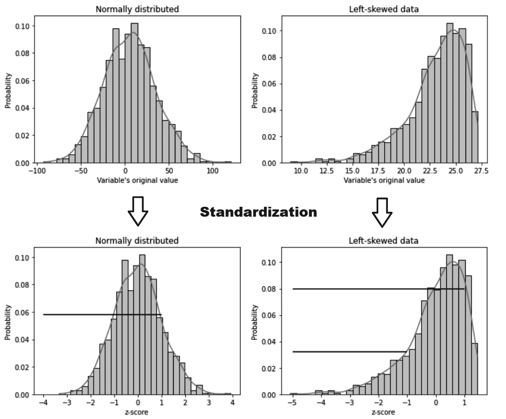
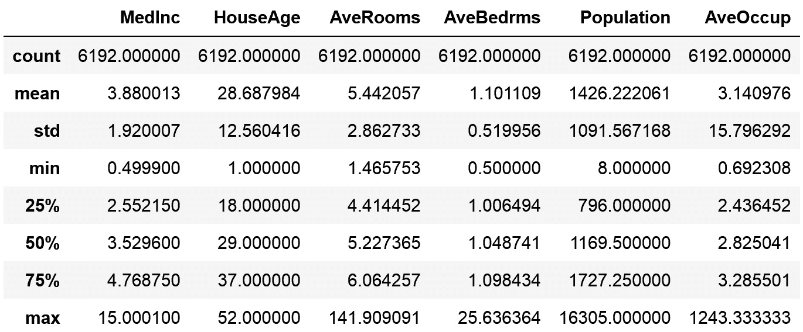
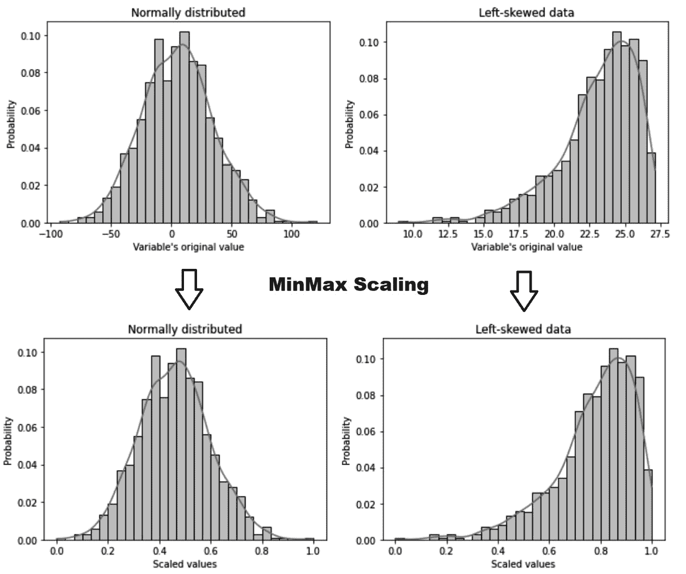
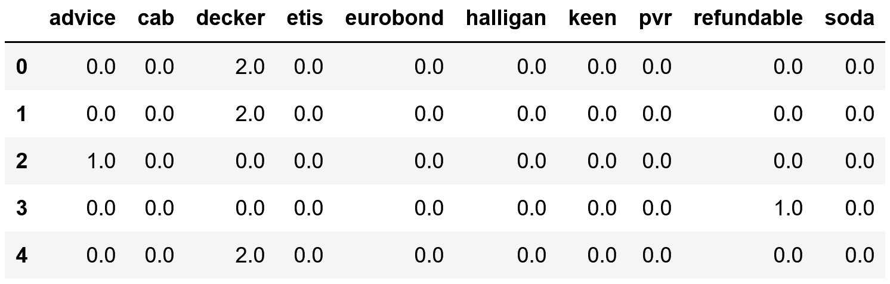
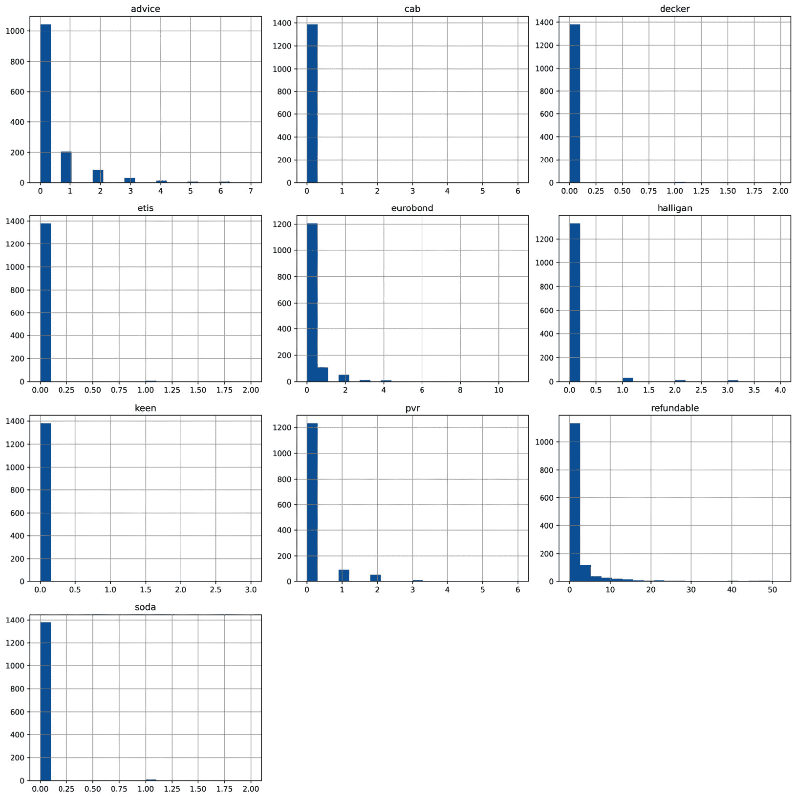
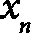

# 第八章：<st c="0">7</st>

# <st c="2">执行特征缩放</st>

<st c="28">许多机器学习算法对变量尺度很敏感。</st> <st c="99">例如，线性模型的系数取决于特征的尺度——也就是说，改变特征尺度将改变系数的值。</st> <st c="256">在线性模型中，以及在依赖于距离计算的算法（如聚类和主成分分析）中，值范围较大的特征往往会比值范围较小的特征占主导地位。</st> <st c="475">因此，将特征设置在相似尺度上允许我们比较特征重要性，并可能有助于算法更快收敛，从而提高性能和</st> <st c="628">训练时间。</st>

<st c="643">一般来说，缩放技术是将变量除以某个常数；因此，重要的是要强调，当我们对变量进行缩放时，变量分布的形状不会改变。</st> <st c="846">如果您想改变分布形状，请查看</st> *<st c="902">第三章</st>*<st c="911">，*<st c="913">转换</st>* *<st c="926">数值变量</st>*<st c="945">。</st>

<st c="946">在本章中，我们将描述不同的方法来设置特征在相似尺度上的值。</st>

<st c="1034">本章将涵盖以下内容：</st> <st c="1063">以下食谱：</st>

+   <st c="1081">标准化</st> <st c="1096">特征</st>

+   <st c="1108">缩放到最大值和</st> <st c="1136">最小值</st>

+   <st c="1150">使用中位数和分位数进行缩放</st> <st c="1175">和</st>

+   <st c="1188">执行</st> <st c="1200">均值归一化</st>

+   <st c="1218">实现最大</st> <st c="1240">绝对缩放</st>

+   <st c="1256">缩放到向量</st> <st c="1275">单位长度</st>

# <st c="1286">技术要求</st>

<st c="1309">在本章中，我们使用的主要库是用于缩放的 scikit-learn (</st>`<st c="1375">sklearn</st>`<st c="1383">)，用于处理数据的 pandas <st c="1399">，以及</st> `<st c="1430">matplotlib</st>` <st c="1440">用于绘图。</st>

# <st c="1454">标准化特征</st>

<st c="1481">标准化</st> <st c="1497">是将变量中心化到</st> `<st c="1542">0</st>` <st c="1543">并将方差标准化到</st> `<st c="1578">1</st>`<st c="1579">的过程。为了标准化特征，我们从每个观测值中减去均值，然后将结果除以</st> <st c="1683">标准差：</st>


<st c="1733">前面变换的结果称为</st> <st c="1785">z 分数</st> <st c="1797">，它表示一个给定观测值相对于平均值的偏离程度。</st>

<st c="1885">标准化通常在模型需要变量以零为中心且数据不稀疏时很有用（对稀疏数据进行中心化会破坏其稀疏性）。</st> <st c="2058">缺点是，标准化对异常值敏感，并且当变量高度偏斜时，z 分数不会保持对称属性，正如我们在下一节中讨论的那样。</st>

## <st c="2246">准备中</st>

<st c="2260">标准化时，变量分布不会改变；改变的是它们值的幅度，正如我们在以下图中看到的：</st> <st c="2390">图 7.1 – 标准化前后正态和偏态变量的分布。</st>



<st c="2777">图 7.1 – 标准化前后正态和偏态变量的分布。</st>

<st c="2868">z 分数（</st>*<st c="2882">x</st>* <st c="2884">轴在底部面板中）表示一个观测值偏离平均值的多少个标准差。</st> <st c="2921">当 z 分数为</st> `<st c="3010">1</st>`<st c="3011">时，观测值位于平均值右侧 1 个标准差处，而当 z 分数为</st> `<st c="3109">-1</st>`<st c="3111">时，样本位于平均值左侧 1 个标准差处。</st>

<st c="3172">在正态分布的变量中，我们可以估计一个值大于或小于给定 z 分数的概率，并且这种概率分布是对称的。</st> <st c="3346">一个观测值小于 z 分数</st> `<st c="3412">-1</st>` <st c="3414">的概率等同于一个值大于</st> `<st c="3478">1</st>` <st c="3479">(左下面板中的水平线)的概率。</st> <st c="3524">这种对称性是许多统计测试的基础。</st> <st c="3580">在偏态分布中，这种对称性不成立。</st> <st c="3634">如图 7**<st c="3678">.1</st>**<st c="3686">.1</st>**<st c="3688">(水平线)右下面板所示，一个值小于</st> `<st c="3755">-1</st>` <st c="3757">的概率与大于</st> `<st c="3798">1</st>`<st c="3804">的概率不同。</st>

<st c="3805">注意</st>

均值和标准差对异常值敏感；因此，在使用标准化时，特征可能在存在异常值的情况下以不同的方式缩放。

在实践中，我们经常在忽略分布形状的情况下应用标准化。然而，请记住，如果您使用的模型或测试假设数据分布，您可能从在标准化之前转换变量中受益，或者尝试不同的缩放方法。

## <st c="4300">如何做到这一点...</st>

在这个菜谱中，我们将对加利福尼亚住房数据集的变量应用标准化：

1.  让我们先导入所需的 Python 包、类和函数：

    ```py
     import pandas as pd
    from sklearn.datasets import fetch_california_housing
    from sklearn.model_selection import train_test_split
    from sklearn.preprocessing import StandardScaler
    ```

1.  让我们将加利福尼亚住房数据集从 scikit-learn 加载到 DataFrame 中，并删除 `<st c="4758">纬度</st>` 和 `<st c="4766">经度</st>` 变量：

    ```py
     X, y = fetch_california_housing(
        return_X_y=True, as_frame=True)
    X.drop(labels=["Latitude", "Longitude"], axis=1,
        inplace=True)
    ```

1.  现在，让我们将数据分为训练集和测试集：

    ```py
     X_train, X_test, y_train, y_test = train_test_split(
        X, y, test_size=0.3, random_state=0)
    ```

1.  接下来，我们将设置 scikit-learn 的 `<st c="5086">StandardScaler()</st>` 函数，并将其拟合到训练集，以便它学习每个变量的均值和标准差：

    ```py
     scaler = StandardScaler().set_output(
        transform="pandas")
    scaler.fit(X_train)
    ```

<st c="5298">注意</st>

Scikit-learn 的缩放器，就像任何 scikit-learn 转换器一样，默认返回 NumPy 数组。要返回 `<st c="5403">pandas</st>` 或 `<st c="5413">polars</st>` 数据帧，我们需要使用 `<st c="5481">set_output()</st>` 方法指定输出容器，就像我们在 *<st c="5515">步骤 4</st>* 中所做的那样。

1.  <st c="5522">现在，让我们使用训练好的缩放器对训练集和测试集进行标准化：

    ```py
     X_train_scaled = scaler.transform(X_train)
    X_test_scaled = scaler.transform(X_test)
    ```

    `<st c="5678">StandardScaler()</st>` 在 `<st c="5772">fit()</st>` 过程中存储从训练集学习到的均值和标准差。让我们可视化学习到的参数。

1.  首先，我们将打印 `<st c="5875">scaler</st>` 学习到的均值：

    ```py
     scaler.mean_
    ```

    我们可以在以下输出中看到每个变量的均值：

    ```py
    <st c="6133">scaler</st>:

    ```

    scaler.scale_

    <st c="6227">array([1.89109236e+00, 1.25962585e+01, 2.28754018e+00,                          4.52736275e-01, 1.14954037e+03, 6.86792905e+00])</st>

    ```py

    <st c="6331">Let’s compare the transformed data with the original data to understand</st> <st c="6404">the changes.</st>
    ```

1.  让我们打印测试集中原始变量的描述性统计信息：

    ```py
     X_test.describe()
    ```

    在以下输出中，我们可以看到变量的均值与零不同，并且方差有所变化：



<st c="7205">图 7.2 – 缩放前变量的描述性统计参数</st>

1.  <st c="7284">现在让我们打印</st> <st c="7300">转换变量的描述性统计值：</st>

    ```py
     X_test_scaled.describe()
    ```

    <st c="7392">在下面的输出中，我们看到变量的均值现在集中在</st> `<st c="7469">0</st>` <st c="7470">，方差大约为</st> <st c="7491">1</st>`<st c="7506">：</st>


<st c="8073">图 7.3 – 缩放变量的描述性统计参数，显示均值为 0，方差约为 1</st>

<st c="8196">注意</st>

<st c="8201">The</st> `<st c="8206">AveRooms</st>`<st c="8214">,</st> `<st c="8216">AveBedrms</st>`<st c="8225">, and</st> `<st c="8231">AveOccup</st>` <st c="8239">变量高度偏斜，这可能导致测试集中的观察值远大于或远小于训练集中的值，因此我们观察到方差偏离了</st> `<st c="8438">1</st>`<st c="8439">。这是可以预料的，因为标准化对异常值和非常</st> <st c="8522">偏斜的分布敏感。</st>

<st c="8543">我们在</st> <st c="8560">“准备”</st> <st c="8565">部分提到，分布的形状不会随着标准化而改变。</st> <st c="8661">继续执行</st> `<st c="8704">X_test.hist()</st>` <st c="8717">然后</st> `<st c="8727">X_test_scaled.hist()</st>` <st c="8747">来比较转换前后变量的分布。</st>

## <st c="8824">它是如何工作的...</st>

<st c="8840">在这个配方中，我们通过使用 scikit-learn 对加利福尼亚住房数据集的变量进行了标准化。</st> <st c="8948">我们将数据分为训练集和测试集，因为标准化的参数应该从训练集中学习。</st> <st c="9076">这是为了避免在预处理步骤中将测试集中的数据泄露到训练集中，并确保测试集对所有特征</st> <st c="9224">转换过程保持无知的。</st>

<st c="9249">为了标准化这些特征，我们使用了 scikit-learn 的</st> `<st c="9304">StandardScaler()</st>` <st c="9320">函数，该函数能够学习并存储在转换中使用的参数。</st> <st c="9411">使用</st> `<st c="9417">fit()</st>`<st c="9422">，缩放器学习每个变量的均值和标准差，并将它们存储在其</st> `<st c="9510">mean_</st>` <st c="9515">和</st> `<st c="9520">scale_</st>` <st c="9526">属性中。</st> <st c="9539">使用</st> `<st c="9545">transform()</st>`<st c="9556">，缩放器对训练集和测试集中的变量进行了标准化。</st> <st c="9624">`<st c="9646">StandardScaler()</st>` <st c="9662">的默认输出是一个 NumPy 数组，但通过</st> `<st c="9697">set_output()</st>` <st c="9709">参数，我们可以将输出</st> <st c="9746">容器更改为一个</st> `<st c="9761">pandas</st>` <st c="9767">DataFrame，就像我们在</st> *<st c="9792">步骤 4</st>*<st c="9798">中做的那样，或者更改为</st> `<st c="9806">polars</st>`<st c="9812">，通过</st> <st c="9817">设置</st> `<st c="9825">transform="polars"</st>`<st c="9843">。</st>

<st c="9844">注意</st>

`<st c="9849">StandardScaler()</st>` <st c="9866">默认会减去均值并除以标准差。</st> <st c="9942">如果我们只想将分布中心化而不标准化方差，我们可以在初始化转换器时设置</st> `<st c="10046">with_std=False</st>` <st c="10060">。</st> <st c="10096">如果我们想将方差设置为</st> `<st c="10130">1</st>`<st c="10131">，而不对分布进行中心化，我们可以在</st> *<st c="10212">步骤</st> <st c="10216">4</st>*<st c="10218">中设置</st> `<st c="10193">with_mean=False</st>` <st c="10208">。</st>

# <st c="10219">缩放到最大和最小值</st>

<st c="10261">缩放到最小和最大值</st> <st c="10270">值将变量的值压缩在</st> <st c="10328">0</st> <st c="10350">和</st> <st c="10356">1</st> <st c="10357">之间。要实现这种缩放方法，我们从所有观测值中减去最小值，并将结果除以值范围——即最大值和</st> <st c="10541">最小值之间的差：</st>

![<math xmlns="http://www.w3.org/1998/Math/MathML" display="block"><mrow><mrow><msub><mi>x</mi><mrow><mi>s</mi><mi>c</mi><mi>a</mi><mi{l}</mi><mi>e</mi><mi>d</mi></mrow></msub><mo>=</mo><mfrac><mrow><mi>x</mi><mo>−</mo><mi mathvariant="normal">m</mi><mi mathvariant="normal">i</mi><mi mathvariant="normal">n</mi><mo>(</mo><mi>x</mi><mo>)</mo></mrow><mrow><mi>max</mi><mfenced open="(" close=")"><mi>x</mi></mfenced><mo>−</mo><mi mathvariant="normal">m</mi><mi mathvariant="normal">i</mi><mi mathvariant="normal">n</mi><mo>(</mo><mi>x</mi><mo>)</mo></mrow></mfrac></mrow></mrow></math>](img/26.png)

<st c="10591">将变量缩放到最小值和最大值适用于标准差非常小的变量，当模型不需要数据以零为中心时，以及当我们想要保留稀疏数据中的零条目时，例如在一热编码的变量中。</st> <st c="10845">缺点是，它对异常值敏感</st> <st c="10878">。</st>

## <st c="10890">准备就绪</st>

<st c="10904">缩放到最小值和最大值不会改变变量的分布，如下所示：</st>



<st c="11270">图 7.4 – 缩放到最小值和最大值之前和之后的正态分布和偏斜变量的分布</st>

<st c="11385">这种方法将变量的最大值标准化为单位大小。</st> <st c="11391">缩放到最小值和最大值通常是标准化的首选替代方案，适用于标准差非常小的变量，并且当我们想要保留稀疏数据中的零条目时，例如在一热编码的变量中，或者从计数中派生的变量，例如词袋。</st> <st c="11470">然而，此过程不会将变量中心化到零，因此如果算法有此要求，这种方法可能不是</st> <st c="11924">最佳选择。</st>

<st c="11936">注意</st>

<st c="11941">缩放到最小值和最大值对异常值敏感。</st> <st c="12010">如果训练集中存在异常值，缩放会将值挤压到其中一个尾部。</st> <st c="12116">相反，如果测试集中存在异常值，变量在缩放后将会显示大于</st> `<st c="12210">1</st>` <st c="12211">或小于</st> `<st c="12228">0</st>` <st c="12229">的值，具体取决于异常值是在左侧还是</st> <st c="12296">右侧尾部。</st>

## <st c="12308">如何操作...</st>

<st c="12324">在这个配方中，我们将</st> <st c="12353">将加利福尼亚住房数据集的变量缩放到</st> <st c="12401">0</st> <st c="12419">和</st> `<st c="12420">1</st>` <st c="12424">之间</st> <st c="12425">的值：</st>

1.  <st c="12426">让我们首先导入</st> `<st c="12451">pandas</st>` <st c="12457">和所需的类</st> <st c="12483">和函数：</st>

    ```py
     import pandas as pd
    from sklearn.datasets import fetch_california_housing
    from sklearn.model_selection import train_test_split
    from sklearn.preprocessing import MinMaxScaler
    ```

1.  <st c="12671">让我们从 scikit-learn 中加载</st> <st c="12687">加利福尼亚住房数据集到</st> `<st c="12739">pandas</st>` <st c="12745">DataFrame 中，删除</st> `<st c="12770">纬度</st>` <st c="12778">和</st> `<st c="12783">经度</st>` <st c="12792">变量：</st>

    ```py
     X, y = fetch_california_housing(
        return_X_y=True, as_frame=True)
    X.drop(labels=["Latitude", "Longitude"], axis=1,
        inplace=True)
    ```

1.  <st c="12932">让我们将数据分为训练集和</st> <st c="12973">测试集：</st>

    ```py
     X_train, X_test, y_train, y_test = train_test_split(
        X, y, test_size=0.3, random_state=0)
    ```

1.  <st c="13073">让我们设置缩放器并将其拟合到训练集，以便它学习每个变量的最小值、最大值和值范围：</st>

    ```py
     scaler = MinMaxScaler().set_output(
        transform="pandas"")
    scaler.fit(X_train)
    ```

1.  <st c="13289">最后，让我们</st> <st c="13304">使用训练好的缩放器缩放训练集和测试集中的变量：</st>

    ```py
     X_train_scaled = scaler.transform(X_train)
    X_test_scaled = scaler.transform(X_test)
    ```

<st c="13460">注意</st>

`<st c="13465">MinMaxScale</st><st c="13477">r()</st>` <st c="13481">存储最大值和最小值以及值范围在其</st> `<st c="13548">data_max_</st>`<st c="13557">,</st> `<st c="13559">min_</st>`<st c="13563">, 和</st> `<st c="13569">data_range_</st>` <st c="13580">属性中，分别。</st>

我们可以通过执行 `<st c="13687">X_test_scaled.min()</st>` 来验证变换变量的最小值，这将返回以下输出：

```py
<st c="13747">MedInc           0.000000</st>
<st c="13763">HouseAge        0.000000</st>
<st c="13781">AveRooms        0.004705</st>
<st c="13799">AveBedrms      0.004941</st>
<st c="13818">Population     0.000140</st>
<st c="13838">AveOccup      -0.000096</st>
<st c="13886">X_test_scaled.max()</st>, we see that the maximum values of the variables are around <st c="13966">1</st>:

```

<st c="13968">MedInc           1.000000</st>

<st c="13983">HouseAge        1.000000</st>

<st c="14001">AveRooms        1.071197</st>

<st c="14019">AveBedrms      0.750090</st>

<st c="14038">Population     0.456907</st>

<st c="14058">AveOccup        2.074553</st>

<st c="14076">dtype: float64</st>

```py

			<st c="14091">Note</st>
			<st c="14096">If you check the maximum values of the variables in the train set after the transformation, you’ll see that they are exactly</st> `<st c="14222">1</st>`<st c="14223">. Yet, in the test set, we see values greater and smaller than</st> `<st c="14286">1</st>`<st c="14287">. This occurs because, in the test set, there are observations with larger or smaller magnitudes than those in the train set.</st> <st c="14413">In fact, we see the greatest differences in the variables that deviate the most from the normal distribution (the last four variables in the dataset).</st> <st c="14564">This behavior is expected because scaling to the minimum and maximum values is sensitive to outliers and very</st> <st c="14674">skewed distributions.</st>
			<st c="14695">Scaling to the</st> <st c="14710">minimum and maximum value does not change the shape</st> <st c="14762">of the variable’s distribution.</st> <st c="14795">You can corroborate that by displaying the histograms before and after</st> <st c="14866">the tr</st><st c="14872">ansformation.</st>
			<st c="14886">How it works...</st>
			<st c="14902">In this rec</st><st c="14914">ipe, we scaled the variables of the California housing dataset to values between</st> `<st c="14996">0</st>` <st c="14997">and</st> `<st c="15001">1</st>`<st c="15002">.</st>
			`<st c="15003">MinMaxScaler()</st>` <st c="15018">from scikit-learn learned the minimum and maximum values and the value range of each variable when we called the</st> `<st c="15132">fit()</st>` <st c="15137">method and stored these parameters in its</st> `<st c="15180">data_max_</st>`<st c="15189">,</st> `<st c="15191">min_</st>`<st c="15195">, and</st> `<st c="15201">data_range_</st>` <st c="15212">attributes.</st> <st c="15225">By using</st> `<st c="15234">transform()</st>`<st c="15245">, we made the scaler remove the minimum value from each variable in the train and test sets and divide the result by the</st> <st c="15366">value range.</st>
			<st c="15378">Note</st>
			`<st c="15383">MinMaxScaler()</st>` <st c="15398">will scale all variables by default.</st> <st c="15436">To scale only a subset of the variables in the dataset, you can use</st> `<st c="15504">ColumnTransformer()</st>` <st c="15523">from scikit-learn or</st> `<st c="15545">SklearnTransformerWrapper()</st>` <st c="15572">from</st> `<st c="15578">Feature-engine</st>`<st c="15592">.</st>
			`<st c="15593">MinMaxScaler()</st>` <st c="15608">will scale the variables between</st> `<st c="15642">0</st>` <st c="15643">and</st> `<st c="15648">1</st>` <st c="15649">by default.</st> <st c="15662">However, we have the option to scale to a different range by adjusting the tuple passed to the</st> `<st c="15757">feature_range</st>` <st c="15770">parameter.</st>
			<st c="15781">By default,</st> `<st c="15794">MinMaxScaler()</st>` <st c="15808">returns</st> <st c="15817">NumPy arrays, but we can modify this</st> <st c="15854">behavior to return</st> `<st c="15873">pandas</st>` <st c="15879">DataFrames with the</st> `<st c="15900">set_output()</st>` <st c="15912">method, as we</st> <st c="15926">did in</st> *<st c="15934">Step 4</st>*<st c="15940">.</st>
			<st c="15941">Scaling with the median and quantiles</st>
			<st c="15979">When</st> <st c="15985">scaling variab</st><st c="15999">les to</st> <st c="16007">the median and quantiles, the median value is removed from the observations, and the result is divided by</st> <st c="16112">the</st> **<st c="16117">Inter-Quarti</st><st c="16129">le Range</st>** <st c="16138">(</st>**<st c="16140">IQR</st>**<st c="16143">).</st> <st c="16147">The IQR is the difference between the 3rd quartile and the 1st quartile, or, in other words, the difference between the 75th percentile and the</st> <st c="16291">25th percent</st><st c="16303">ile:</st>
			![<math xmlns="http://www.w3.org/1998/Math/MathML" display="block"><mrow><mrow><mi>x</mi><mo>_</mo><mi>s</mi><mi>c</mi><mi>a</mi><mi>l</mi><mi>e</mi><mi>d</mi><mo>=</mo><mfrac><mrow><mi>x</mi><mo>−</mo><mi>m</mi><mi>e</mi><mi>d</mi><mi>i</mi><mi>a</mi><mi>n</mi><mo>(</mo><mi>x</mi><mo>)</mo></mrow><mrow><mn>3</mn><mi>r</mi><mi>d</mi><mi>q</mi><mi>u</mi><mi>a</mi><mi>r</mi><mi>i</mi><mi>t</mi><mi>l</mi><mi>e</mi><mfenced open="(" close=")"><mi>x</mi></mfenced><mo>−</mo><mn>1</mn><mi>s</mi><mi>t</mi><mi>q</mi><mi>u</mi><mi>a</mi><mi>r</mi><mi>t</mi><mi>i</mi><mi>l</mi><mi>e</mi><mo>(</mo><mi>x</mi><mo>)</mo></mrow></mfrac></mrow></mrow></math>](img/27.png)
			<st c="16310">This method is known</st> <st c="16330">as</st> **<st c="16334">robust</st> <st c="16340">scaling</st>** <st c="16348">because it produces more robust estimates for the center and value range of the variable.</st> <st c="16439">Robust scaling is a suitable alternative to standardization when models require the variables to be centered and the data contains outliers.</st> <st c="16580">It is worth noting that robust scaling will not change the overall shape of the</st> <st c="16660">vari</st><st c="16664">able distribution.</st>
			<st c="16683">How to do it...</st>
			<st c="16699">In this recipe, we will implement scaling with the median and IQR by</st> <st c="16769">utilizing scikit-learn:</st>

				1.  <st c="16792">Let’s start</st> <st c="16805">by importing</st> `<st c="16818">pandas</st>` <st c="16824">and the required scikit-learn classes</st> <st c="16863">and functions:</st>

    ```

    导入 pandas as pd

    从 `sklearn.datasets` 导入 `fetch_california_housing`

    从 `sklearn.model_selection` 导入 `train_test_split`

    从 `sklearn.preprocessing` 导入 `RobustScaler`

    ```py

    				2.  <st c="17051">Let’s load the California housing dataset into a</st> `<st c="17101">pandas</st>` <st c="17107">DataFrame and drop the</st> `<st c="17131">Latitude</st>` <st c="17139">and</st> `<st c="17144">Longitude</st>` <st c="17153">variables:</st>

    ```

    X, y = fetch_california_housing(

        return_X_y=True, as_frame=True)

    X.drop(labels=[     "Latitude", "Longitude"], axis=1,

        inplace=True)

    ```py

    				3.  <st c="17294">Let’s divide the data into train and</st> <st c="17332">test sets:</st>

    ```

    X_train, X_test, y_train, y_test = train_test_split(

        X, y, test_size=0.3, random_state=0)

    ```py

    				4.  <st c="17432">Let’s set up scikit-learn’s</st> `<st c="17461">RobustScaler()</st>`<st c="17475">and fit it to the train set so that it learns and stores the median</st> <st c="17544">and IQR:</st>

    ```

    scaler = RobustScaler().set_output(

        transform="pandas")

    scaler.fit(X_train)

    ```py

    				5.  <st c="17628">Finally, let’s</st> <st c="17643">scale the</st> <st c="17654">variables in the train and test sets with the</st> <st c="17700">trained scaler:</st>

    ```

    X_train_scaled = scaler.transform(X_train)

    X_test_scaled = scaler.transform(X_test)

    ```py

    				6.  <st c="17799">Let’s print the variable median values learned</st> <st c="17847">by</st> `<st c="17850">RobustScaler()</st>`<st c="17864">:</st>

    ```

    scaler.center_

    ```py

    <st c="17881">We see the parameters learned by</st> `<st c="17915">RobustScaler()</st>` <st c="17929">in the</st> <st c="17937">following output:</st>

    ```

    <st c="18097">RobustScaler()</st>:

    ```py
     scaler.scale_
    <st c="18189">array([2.16550000e+00, 1.90000000e+01, 1.59537022e+00,</st> <st c="18244">9.41284380e-02, 9.40000000e</st><st c="18272">+02, 8.53176853e-01])</st>
    ```

    <st c="18294">此缩放过程不会改变变量的分布。</st> <st c="18362">继续使用直方图比较变换前后变量的分布</st> <st c="18452">。</st>

    ```py

			<st c="18473">How it works...</st>
			<st c="18489">To scale the</st> <st c="18502">features using</st> <st c="18517">the median and IQR, we created an instance of</st> `<st c="18564">RobustScaler()</st>`<st c="18578">. With</st> `<st c="18585">fit()</st>`<st c="18590">, the scaler learned the median and IQR for each variable from the train set.</st> <st c="18668">With</st> `<st c="18673">transform()</st>`<st c="18684">, the scaler subtracted the median from each variable in the train and test sets and divided the result by</st> <st c="18791">the IQR.</st>
			<st c="18799">After the transformation, the median values of the variables were centered at</st> `<st c="18878">0</st>`<st c="18879">, but the overall shape of the distributions did not change.</st> <st c="18940">You can corroborate the effect of the transformation by displaying the histograms of the variables before and after the transformation and by printing out the main statistical parameters through</st> `<st c="19135">X_test.describe()</st>` <st c="19152">and</st> `<st c="19157">X_test_scaled.b()</st>`<st c="19174">.</st>
			<st c="19175">Performing mean normalization</st>
			<st c="19205">I</st><st c="19207">n mean normalization, we</st> <st c="19232">center the variable at</st> `<st c="19255">0</st>` <st c="19256">and rescale the distribution to the value range, so that its values lie between</st> `<st c="19337">-1</st>` <st c="19339">and</st> `<st c="19344">1</st>`<st c="19345">. This procedure involves subtracting the mean from each observation and then dividing the result by the difference between the minimum and maximum values, as</st> <st c="19504">sh</st><st c="19506">own here:</st>
			![<math xmlns="http://www.w3.org/1998/Math/MathML" display="block"><mrow><mrow><msub><mi>x</mi><mrow><mi>s</mi><mi>c</mi><mi>a</mi><mi>l</mi><mi>e</mi><mi>d</mi></mrow></msub><mo>=</mo><mfrac><mrow><mi>x</mi><mo>−</mo><mi>m</mi><mi>e</mi><mi>a</mi><mi>n</mi><mo>(</mo><mi>x</mi><mo>)</mo></mrow><mrow><mi>max</mi><mfenced open="(" close=")"><mi>x</mi></mfenced><mo>−</mo><mi mathvariant="normal">m</mi><mi mathvariant="normal">i</mi><mi mathvariant="normal">n</mi><mo>(</mo><mi>x</mi><mo>)</mo></mrow></mfrac></mrow></mrow></math>](img/28.png)
			<st c="19558">Note</st>
			<st c="19562">Mean normalization is an alternative to standardization.</st> <st c="19620">In both cases, the variables are centered at</st> `<st c="19665">0</st>`<st c="19666">. In mean normalization, the variance varies, while the values lie between</st> `<st c="19741">-1</st>` <st c="19743">and</st> `<st c="19748">1</st>`<st c="19749">. On the other hand, in standardization, the variance is set to</st> `<st c="19813">1</st>` <st c="19814">and the value</st> <st c="19829">range varies.</st>
			<st c="19842">Mean</st> <st c="19848">normalization is a suitable alternative for models that need the variables to be centered at zero.</st> <st c="19947">However, it is sensitive to outliers and not a suitable option for sparse data, as it will d</st><st c="20039">estroy the</st> <st c="20051">sparse nature.</st>
			<st c="20065">How to do it...</st>
			<st c="20081">In this recipe, we will implement mean normalization</st> <st c="20135">with</st> `<st c="20140">pandas</st>`<st c="20146">:</st>

				1.  <st c="20148">Let’s import</st> `<st c="20161">pandas</st>` <st c="20167">and the required scikit-learn class</st> <st c="20204">and function:</st>

    ```

    导入 pandas as pd

    从 `sklearn.datasets` 导入 `fetch_california_housing`

    从 `sklearn.model_selection` 导入 `train_test_split`

    ```py

    				2.  <st c="20344">Let’s load the California housing dataset from scikit-learn into a</st> `<st c="20412">pandas</st>` <st c="20418">DataFrame, dropping the</st> `<st c="20443">Latitude</st>` <st c="20451">and</st> `<st c="20456">Longitude</st>` <st c="20465">variables:</st>

    ```

    X, y = fetch_california_housing(

        return_X_y=True, as_frame=True)

    X.drop(labels=[

    "Latitude", "Longitude"], axis=1, inplace=True)

    ```py

    				3.  <st c="20606">Let’s divide the data into train and</st> <st c="20644">test sets:</st>

    ```

    X_train, X_test, y_train, y_test = train_test_split(

        X, y, test_size=0.3, random_state=0)

    ```py

    				4.  <st c="20744">Let’s learn the mean values from the variables in the</st> <st c="20799">train set:</st>

    ```

    means = X_train.mean(axis=0)

    ```py

			<st c="20839">Note</st>
			<st c="20844">We set</st> `<st c="20852">axis=0</st>` <st c="20858">to take the mean of the rows – that is, of the observations in each variable.</st> <st c="20937">If we set</st> `<st c="20947">axis=1</st>` <st c="20953">instead,</st> `<st c="20963">pandas</st>` <st c="20969">will calculate the mean value per observation across all</st> <st c="21027">the columns.</st>
			<st c="21039">By</st> <st c="21043">executing</st> `<st c="21053">print(mean)</st>`<st c="21064">, we display the mean values</st> <st c="21093">per variable:</st>

```

<st c="21106">MedInc           3.866667</st>

<st c="21122">HouseAge        28.618702</st>

<st c="21141">AveRooms         5.423404</st>

<st c="21159">AveBedrms        1.094775</st>

<st c="21178">Population    1425.157323</st>

<st c="21201">AveOccup         3.040518</st>

<st c="21219">dtype: float</st><st c="21232">64</st>

```py

				1.  <st c="21235">Now, let’s determine the difference between the maximum and minimum values</st> <st c="21311">per variable:</st>

    ```

    ranges = X_train.max(axis=0)-X_train.min(axis=0)

    ```py

    <st c="21373">By executing</st> `<st c="21387">print(ranges)</st>`<st c="21400">, we display the value ranges</st> <st c="21430">per variable:</st>

    ```

    <st c="21443">MedInc</st> <st c="21450">14.500200</st>

    <st c="21460">HouseAge         51.000000</st>

    <st c="21479">AveRooms        131.687179</st>

    <st c="21499">平均卧室数        33.733333</st>

    <st c="21519">人口        35679.000000</st>

    <st c="21543">平均占用        598.964286</st>

    <st c="21563">dtype: float64</st>

    ```py

			<st c="21578">Note</st>
			<st c="21583">The</st> `<st c="21588">pandas</st>` `<st c="21594">mean()</st>`<st c="21601">,</st> `<st c="21603">max()</st>`<st c="21608">, and</st> `<st c="21614">min()</st>` <st c="21619">methods return a</st> `<st c="21637">pandas</st>` <st c="21643">series.</st>

				1.  <st c="21651">Now, we’ll</st> <st c="21662">apply mean normalization to the train and test se</st><st c="21712">ts by utilizing the</st> <st c="21733">learned parameters:</st>

    ```

    X_train_scaled = (X_train - means) / ranges

    X_test_scaled = (X_test - means) / ranges

    ```py

			<st c="21838">Note</st>
			<st c="21843">In order to transform future data, you will need to store these parameters, for example, in a</st> `<st c="21938">.txt</st>` <st c="21942">or</st> `<st c="21946">.</st>``<st c="21947">csv</st>` <st c="21951">file.</st>
			*<st c="21957">Step 6</st>* <st c="21964">returns</st> `<st c="21973">pandas</st>` <st c="21979">DataFrames with the transformed train and test sets.</st> <st c="22033">Go ahead and compare the variables before and after the transformations.</st> <st c="22106">You’ll see that the distributions did not change, but the variables are centered at</st> `<st c="22190">0</st>`<st c="22191">, and their v</st><st c="22204">alues lie between</st> `<st c="22223">-1</st>` <st c="22225">and</st> `<st c="22230">1</st>`<st c="22231">.</st>
			<st c="22232">How it works…</st>
			<st c="22246">To implement mean normalization, we captured the mean values of the numerical variables in the train set using</st> `<st c="22358">mean()</st>` <st c="22364">from</st> `<st c="22370">pandas</st>`<st c="22376">. Next, we determined the difference between the maximum and minimum values of the numerical variables in the train set by utilizing</st> `<st c="22509">max()</st>` <st c="22514">and</st> `<st c="22519">min()</st>` <st c="22524">from</st> `<st c="22530">pandas</st>`<st c="22536">. Finally, we used the</st> `<st c="22559">pandas</st>` <st c="22565">series returned by these functions containing the mean values and the value ranges to normalize the train and test sets.</st> <st c="22687">We subtracted the mean from each observation in our train and test sets</st> <st c="22758">and divided the result by the value ranges.</st> <st c="22803">This returned the normalized vari</st><st c="22836">ables in a</st> `<st c="22848">pandas</st>` <st c="22854">DataFrame.</st>
			<st c="22865">There’s more...</st>
			<st c="22881">There is no dedicated scikit-learn transformer to implement mean normalization, but we can combine the use of two transformers to</st> <st c="23012">do so.</st>
			<st c="23018">To do this, we need to import</st> `<st c="23049">pandas</st>` <st c="23055">and load the data, just like we did in</st> *<st c="23095">Steps 1</st>* <st c="23102">to</st> *<st c="23105">3</st>* <st c="23107">in the</st> *<st c="23115">How to do it...</st>* <st c="23130">section of this recipe.</st> <st c="23155">Then, follow</st> <st c="23168">these steps:</st>

				1.  <st c="23180">Import the</st> <st c="23192">scikit-learn transformers:</st>

    ```

    from sklearn.preprocessing import (

        StandardScaler, RobustScaler

    )

    ```py

    				2.  <st c="23285">Let’s set up</st> `<st c="23299">StandardScaler()</st>` <st c="23315">to learn and subtract</st> <st c="23338">the mean without dividing the result by the</st> <st c="23382">standard deviation:</st>

    ```

    scaler_mean = StandardScaler(

        with_mean=True, with_std=False,

    ).set_output(transform="pandas")

    ```py

    				3.  <st c="23496">Now, let’s set up</st> `<st c="23515">RobustScaler()</st>` <st c="23529">so that it does not remove the median from the values but divides them by the value range – that is, the difference between the maximum and</st> <st c="23670">minimum values:</st>

    ```

    scaler_minmax = RobustScaler(

        with_centering=False,

        with_scaling=True,

        quantile_range=(0, 100)

    ).set_output(transform="pandas")

    ```py

			<st c="23813">Note</st>
			<st c="23818">To divide by the difference between the minimum and maximum values, we need to specify</st> `<st c="23906">(0, 100)</st>` <st c="23914">in the</st> `<st c="23922">quantile_range</st>` <st c="23936">argument</st> <st c="23946">of</st> `<st c="23949">RobustScaler()</st>`<st c="23963">.</st>

				1.  <st c="23964">Let’s fit the scalers to the train set so that they learn and store the mean, maximum, and</st> <st c="24056">minimum values:</st>

    ```

    scaler_mean.fit(X_train)

    scaler_minmax.fit(X_train)

    ```py

    				2.  <st c="24123">Finally, let’s apply mean normalization to the train and</st> <st c="24181">test sets:</st>

    ```

    X_train_scaled = scaler_minmax.transform(

        scaler_mean.transform(X_train)

    ])

    X_test_scaled = scaler_minmax.transform(

        scaler_mean.transform(X_test)

    )

    ```py

			<st c="24339">We transformed the data with</st> `<st c="24369">StandardScaler()</st>` <st c="24385">to remove the mean and then transformed the resulting DataFrame with</st> `<st c="24455">RobustScaler()</st>` <st c="24469">to divide the result by the range between the minimum and maximum values.</st> <st c="24544">We described the functionality of</st> `<st c="24578">StandardScaler()</st>` <st c="24594">in this chapter’s</st> *<st c="24613">Standardizing the features</st>* <st c="24639">recipe and</st> `<st c="24651">RobustScaler()</st>` <st c="24665">in the</st> *<st c="24673">Scaling with the median and quant</st><st c="24706">iles</st>* <st c="24711">recipe of</st> <st c="24722">this chapter.</st>
			<st c="24735">Implementing maximum absol</st><st c="24762">ute scaling</st>
			<st c="24774">Maximum absolute scaling</st> <st c="24800">scales the data to its maximum value – that is, it divides every observation by the maximum value of</st> <st c="24901">the variable:</st>
			
			<st c="24936">As a result, the maximum value of each feature will be</st> `<st c="24991">1.0</st>`<st c="24994">. Note that maximum absolute scaling does not center the data, and hence, it’s suitable for scaling sparse data.</st> <st c="25107">In this recipe, we will implement maximum absolute scaling</st> <st c="25166">with scikit-learn.</st>
			<st c="25184">Note</st>
			<st c="25189">Scikit-learn recommends using this transformer on data that is cen</st><st c="25256">tered at</st> `<st c="25266">0</st>` <st c="25267">or on</st> <st c="25274">sparse data.</st>
			<st c="25286">Getting ready</st>
			<st c="25300">Maximum absolute scaling</st> <st c="25325">was specifically designed to scale sparse data.</st> <st c="25374">Thus, we will use a bag-of-words dataset that contains sparse variables for the recipe.</st> <st c="25462">In this dataset, the variables are words, the observations are documents, and the values are the number of times each word appears in the document.</st> <st c="25610">Most entries</st> <st c="25623">in the data</st> <st c="25635">are</st> `<st c="25639">0</st>`<st c="25640">.</st>
			<st c="25641">We will use a dataset consisting of a bag of words, which is available in the UCI Machine Learning Repository (https://archive.ics.uci.edu/ml/datasets/Bag+of+Words), which is licensed under CC BY</st> <st c="25838">4.0 (</st><st c="25843">https://creativecommons.org/licenses/by/4.0/legalcode</st><st c="25897">).</st>
			<st c="25900">I downloaded and prepared a small bag of words representing a simplified version of one of those datasets.</st> <st c="26008">You will find this dataset in the accompanying GitHub</st> <st c="26062">repository:</st> [<st c="26074">https://github.com/PacktPublishing/Python-Feature-Engineering-Cookbook-Third-Edition/tree/main/ch07-scaling</st>](https://github.com/PacktPublishing/Python-Feature-Engineering-Cookbook-Third-Edition/tree/main/ch07-scaling)<st c="26181">.</st>
			<st c="26182">How to do it...</st>
			<st c="26198">Let’s begin by</st> <st c="26213">importing the required packages and loading</st> <st c="26258">the dataset:</st>

				1.  <st c="26270">Let’s import the required libraries and</st> <st c="26311">the scaler:</st>

    ```

    import matplotlib.pyplot as plt

    import pandas as pd

    from sklearn.preprocessing import MaxAbsScaler

    ```py

    				2.  <st c="26421">Let’s load the</st> <st c="26437">bag-of-words dataset:</st>

    ```

    data = pd.read_csv("bag_of_words.csv")

    ```py

    <st c="26497">If we execute</st> `<st c="26512">data.head()</st>`<st c="26523">, we will see the DataFrame consisting of the words as columns, the documents as rows, and the number of times each word appeared in a document</st> <st c="26667">as values:</st>

			

			<st c="26944">Figure 7.5 – DataFrame with the bag of words</st>
			<st c="26988">Note</st>
			<st c="26993">Although we omit this step in the recipe, remember that the maximum absolute values should be learned from a training dataset only.</st> <st c="27126">Split the dataset into train and test sets when carrying out</st> <st c="27187">your analysis.</st>

				1.  <st c="27201">Let’s set</st> <st c="27211">up</st> `<st c="27215">MaxAbsScaler()</st>` <st c="27229">and fit it to the data so that it learns the variables’</st> <st c="27286">maximum values:</st>

    ```

    scaler = MaxAbsScaler().set_output(

        transform="pandas")

    scaler.fit(data)

    ```py

    				2.  <st c="27374">Now, let’s scale the variables by utilizing the</st> <st c="27423">trained scaler:</st>

    ```

    data_scaled = scaler.transform(data)

    ```py

			<st c="27475">Note</st>
			`<st c="27480">MaxAbsScaler ()</st>` <st c="27496">stores the maximum values in its</st> `<st c="27530">max_ab</st><st c="27536">s_</st>` <st c="27539">attribute.</st>

				1.  <st c="27550">Let’s display the maximum values stored by</st> <st c="27594">the scaler:</st>

    ```

    scaler.max_abs_

    <st c="27715">array([ 7.,  6.,  2.,  2., 11.,  4.,  3.,  6., 52.,  2.])</st>

    ```py

    <st c="27766">To follow up, let’s plot the distributions of the original and</st> <st c="27830">scaled variables.</st>

    				2.  <st c="27847">Let’s make a histogram with the bag of words before</st> <st c="27900">the scaling:</st>

    ```

    data.hist(bins=20, figsize=(20, 20))

    plt.show()

    ```py

    <st c="27960">In the</st> <st c="27968">following output, we see histograms with the number of times e</st><st c="28030">ach word appears in</st> <st c="28051">a document:</st>

			

			<st c="28575">Figure 7.6 – Histograms with differen</st><st c="28612">t word counts</st>

				1.  <st c="28626">Now, let’s make a histogram with the</st> <st c="28664">scaled variables:</st>

    ```

    data_scaled.hist(bins=20, figsize=(20, 20))

    plt.show()

    ```py

    <st c="28736">In the following output, we can corroborate the change of scale of the v</st><st c="28809">ariables, but their</st> <st c="28830">distr</st><st c="28835">ibution shape remains</st> <st c="28858">the same:</st>

			

			<st c="29068">Figure 7.7 – Histograms of the word counts after the scaling</st>
			<st c="29128">With scaling to the maximum absolute value, we linearly scale down</st> <st c="29196">the magnitude of</st> <st c="29213">the features.</st>
			<st c="29226">How</st> <st c="29231">it works...</st>
			<st c="29242">In this recipe, we</st> <st c="29261">scaled the sparse variables of a bag of words to their absolute maximum values by using</st> `<st c="29350">MaxAbsScaler()</st>`<st c="29364">. With</st> `<st c="29371">fit()</st>`<st c="29376">, the scaler learned the maximum absolute values for each variable and stored them in its</st> `<st c="29466">max_abs_</st>` <st c="29474">attribute.</st> <st c="29486">With</st> `<st c="29491">transform()</st>`<st c="29502">, the scaler divided the variables by their ab</st><st c="29548">solute maximum values, returning a</st> `<st c="29584">pandas</st>` <st c="29590">DataFrame.</st>
			<st c="29601">Note</st>
			<st c="29606">Remember that you can change the output container to a NumPy array or a</st> `<st c="29679">polars</st>` <st c="29685">DataFrame through the</st> `<st c="29708">set_output()</st>` <st c="29720">method of the scik</st><st c="29739">it-learn</st> <st c="29749">library’s transformers.</st>
			<st c="29772">There’s m</st><st c="29782">ore...</st>
			<st c="29789">If you want to center the variables’ distribution at</st> `<st c="29843">0</st>` <st c="29844">and then scale them to their absolute maximum, you can do so by combining the use of two scikit-learn transformers within</st> <st c="29967">a pipeline:</st>

				1.  <st c="29978">Let’s import the required libraries, transformers,</st> <st c="30030">and functions:</st>

    ```

    import pandas as pd

    from sklearn.datasets import fetch_california_housing

    from sklearn.model_selection import train_test_split

    from sklearn.preprocessing import (

        MaxAbsScaler, StandardScaler)

    from sklearn.pipeline import Pipeline

    ```py

    				2.  <st c="30275">Let’s load the California housing dataset and split it into train and</st> <st c="30346">test sets:</st>

    ```

    X, y = fetch_california_housing(

        return_X_y=True, as_frame=True)

    X.drop( labels=[ "纬度",

        "经度"], axis=1, inplace=True)

    X_train, X_test, y_train, y_test = train_test_split(

        X, y, test_size=0.3, random_state=0)

    ```py

    				3.  <st c="30576">Let’s set up</st> `<st c="30590">StandardScaler()</st>` <st c="30606">from scikit-learn so that it learns and subtracts the mean but does not divide the result by the</st> <st c="30704">standard deviation:</st>

    ```

    scaler_mean = StandardScaler(

        with_mean=True, with_std=False)

    ```py

    				4.  <st c="30785">Now, let’s set up</st> `<st c="30804">MaxAbsScaler()</st>` <st c="30818">with its</st> <st c="30828">default parameters:</st>

    ```

    scaler_maxabs = MaxAbsScaler()

    ```py

    				5.  <st c="30878">Let’s include both scalers within a pipeline that returns</st> <st c="30937">pandas DataFrames:</st>

    ```

    scaler = Pipeline([

        ("scaler_mean", scaler_mean),

        ("scaler_max", scaler_maxabs),

    ]).set_output(transform="pandas")

    ```py

    				6.  <st c="31070">Let’s fit the scalers to the train set so that they learn the</st> <st c="31133">required parameters:</st>

    ```

    scaler.fit(X_train)

    ```py

    				7.  <st c="31173">Finally, let’s transform the train and</st> <st c="31213">test sets:</st>

    ```

    X_train_scaled = scaler.transform(X_train)

    X_test_scaled = scaler.transform(X_test)

    ```py

    <st c="31307">The pipeline applies</st> `<st c="31329">StandardScaler()</st>` <st c="31345">and</st> `<st c="31350">MaxAbsScaler()</st>` <st c="31364">in sequence to first remove the mean and then scale</st> <st c="31417">the resulting</st> <st c="31431">va</st><st c="31433">riables to their</st> <st c="31451">maximum values.</st>

			<st c="31466">Scaling to vector unit length</st>
			<st c="31496">Scaling to the vector unit length involves scaling individual observations (not features) to have a unit norm.</st> <st c="31608">Each sample (that is, each row of the data) is rescaled independently of other samples so that its norm equals one.</st> <st c="31724">Each</st> <st c="31729">row constitutes a</st> **<st c="31747">feature vector</st>** <st c="31761">containing the values of every variable for that row.</st> <st c="31816">Hence, with this scaling method, we rescale the</st> <st c="31864">feature vector.</st>
			<st c="31879">The norm of a vector is a measure of its magnitude or length in a given space and it can be determined by using the Manhattan (</st>*<st c="32007">l1</st>*<st c="32010">) or the Euclidean (</st>*<st c="32031">l2</st>*<st c="32034">) distance.</st> <st c="32047">The Manhattan distance is given by the sum of the absolute components of</st> <st c="32120">the vector:</st>
			
			<st c="32163">The Euclidean distance is given by the square root of the square sum of the component of</st> <st c="32252">the vector:</st>
			
			<st c="32284">Here,</st> <st c="32290"><st c="32301">and</st> <st c="32305"><st c="32306">are the values of variables</st> *<st c="32334">1</st>*<st c="32335">,</st> *<st c="32337">2</st>*<st c="32338">, and</st> *<st c="32344">n</st>* <st c="32345">for each observation.</st> <st c="32368">Scaling to unit norm consists of dividing each feature vector’s value by either</st> *<st c="32448">l1</st>* <st c="32450">or</st> *<st c="32454">l2</st>*<st c="32456">, so that after the</st> <st c="32475">scaling, the norm of the feature vector is</st> *<st c="32519">1</st>*<st c="32520">. To be clear, we divide each of</st> <st c="32553"><st c="32564">and</st> <st c="32568"><st c="32569">by</st> *<st c="32572">l1</st>* <st c="32574">or</st> *<st c="32578">l2</st>*<st c="32580">.</st></st></st></st></st>
			<st c="32581">This scaling procedure changes the variables’ distribution, as illustrated in the</st> <st c="32664">following figure:</st>
			

			<st c="33144">Figure 7.8 – Distribution of a normal and skewed variable before and after scaling each observation’s feature vector to its norm</st>
			<st c="33272">Note</st>
			<st c="33277">This scaling technique scales each observation and not each variable.</st> <st c="33348">The scaling methods that we discussed so far in this chapter aimed at shifting and resetting the scale of the variables’ distribution.</st> <st c="33483">When we scale to the unit length, however, we normalize each observation individually, contemplating</st> <st c="33584">their values across</st> <st c="33603">all features.</st>
			<st c="33617">Scaling</st> <st c="33626">to the unit norm can be used when utilizing kernels to quantify similarity for text classification and clustering.</st> <st c="33741">In this recipe, we will scale each observation’s feature vector to a un</st><st c="33812">it length of</st> `<st c="33826">1</st>` <st c="33827">using scikit-learn.</st>
			<st c="33846">How to do it...</st>
			<st c="33862">To begin, we’ll</st> <st c="33879">import the required packages, load the dataset, and prepare the train and</st> <st c="33953">test sets:</st>

				1.  <st c="33963">Let’s import the required Python packages, classes,</st> <st c="34016">and functions:</st>

    ```

    import numpy as np

    import pandas as pd

    from sklearn.datasets import fetch_california_housing

    from sklearn.model_selection import train_test_split

    from sklearn.preprocessing import Normalizer

    ```py

    				2.  <st c="34221">Let’s load the California housing dataset into a</st> `<st c="34271">pandas</st>` <st c="34277">DataFrame:</st>

    ```

    X, y = fetch_california_housing(

        return_X_y=True, as_frame=True)

    X.drop(labels=[

        "纬度", "经度"], axis=1, inplace=True)

    ```py

    				3.  <st c="34418">Let’s divide the data into train and</st> <st c="34456">test sets:</st>

    ```

    X_train, X_test, y_train, y_test = train_test_split(

        X, y, test_size=0.3, random_state=0)

    ```py

    				4.  <st c="34556">Let’s set up the scikit-learn library’s</st> `<st c="34597">Normalizer()</st>` <st c="34609">transformer to scale each observation to the Manhattan distance</st> <st c="34674">or</st> `<st c="34677">l1</st>`<st c="34679">:</st>

    ```

    scaler = Normalizer(norm='l1')

    ```py

			<st c="34712">Note</st>
			<st c="34717">To normalize to the Euclidean distance, you need to set the norm to</st> `<st c="34786">l2</st>` <st c="34788">using</st> `<st c="34795">scaler =</st>` `<st c="34804">Normalizer(no</st><st c="34817">rm='l2')</st>`<st c="34826">.</st>

				1.  <st c="34827">Let’s</st> <st c="34834">transform the train and test sets – that is, we’ll divide each observation’s feature vector by</st> <st c="34929">its norm:</st>

    ```

    X_train_scaled = scaler.fit_transform(X_train)

    X_test_scaled = scaler.transform(X_test)

    ```py

    <st c="35026">We can calculate the length (that is, the Manhattan distance of each observation’s feature vector) using</st> `<st c="35132">linalg()</st>` <st c="35140">from NumPy.</st>

    				2.  <st c="35152">Let’s calculate the norm (Manhattan distance) before scaling</st> <st c="35214">the variables:</st>

    ```

    np.round(np.linalg.norm(X_train, ord=1, axis=1), 1)

    ```py

    <st c="35280">As expected, the norm of each</st> <st c="35311">observation varies:</st>

    ```

    <st c="35330">array([ 255.3,  889.1, 1421.7, ...,  744.6, 1099.5,</st>

    <st c="35380">1048.9])</st>

    ```py

    				3.  <st c="35389">Let’s now calculate the norm after</st> <st c="35425">the scaling:</st>

    ```

    np.round(np.linalg.norm(

        X_train_scaled, ord=1, axis=1), 1)

    ```py

			<st c="35497">Note</st>
			<st c="35502">You need to set</st> `<st c="35519">ord=1</st>` <st c="35524">for the Manhattan distance and</st> `<st c="35556">ord=2</st>` <st c="35561">for the Euclidean distance as arguments of NumPy’s</st> `<st c="35613">linalg()</st>`<st c="35621">function, depending on whether you scaled the features to the</st> `<st c="35684">l1</st>` <st c="35686">or</st> `<st c="35690">l2</st>` <st c="35692">norm.</st>
			<st c="35698">We see that the Manhattan distance of each feature vector is</st> `<st c="35760">1</st>` <st c="35761">after scaling:</st>

```

array([1., 1., 1., ..., 1., 1., 1.])

```py

			<st c="35812">Based on the scikit-learn library’s documentation, this scaling method can be useful when using a quadratic form such as the dot-product or any other kernel to quantify</st> <st c="35982">the similarity of a pair</st> <st c="36007">of samples.</st>
			<st c="36018">How it wo</st><st c="36028">rks...</st>
			<st c="36035">In this recipe, we</st> <st c="36054">scaled the observations from the California housing dataset to their feature vector unit norm by utilizing the Manhattan or Euclidean distance.</st> <st c="36199">To scale the feature vectors, we created an instance of</st> `<st c="36255">Normalizer()</st>` <st c="36267">from scikit-learn and set the norm to</st> `<st c="36306">l1</st>` <st c="36308">for the Manhattan distance.</st> <st c="36337">For the Euclidean distance, we set the norm to</st> `<st c="36384">l2</st>`<st c="36386">. Then, we applied the</st> `<st c="36409">fit()</st>` <st c="36414">method, although there were no parameters to be learned, as this normalization procedure depends exclusively on the values of the features for each observation.</st> <st c="36576">Finally, with the</st> `<st c="36594">transform()</st>` <st c="36605">method, the scaler divided each observation’s feat</st><st c="36656">ure vector by its norm.</st> <st c="36681">This returned</st> <st c="36695">a NumPy array with the scaled dataset.</st> <st c="36734">After the scaling, we used NumPy’s</st> `<st c="36769">linalg.norm</st>` <st c="36780">function to calculate the norm (</st>`<st c="36813">l1</st>` <st c="36816">and</st> `<st c="36821">l2</st>`<st c="36823">) of each vector to confirm that after the transformation, it</st> <st c="36886">was</st> `<st c="36890">1</st>`<st c="36891">.</st>

```
