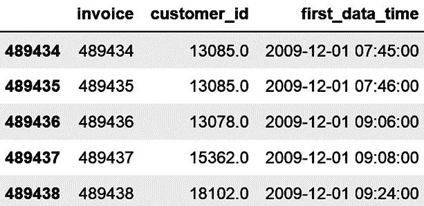
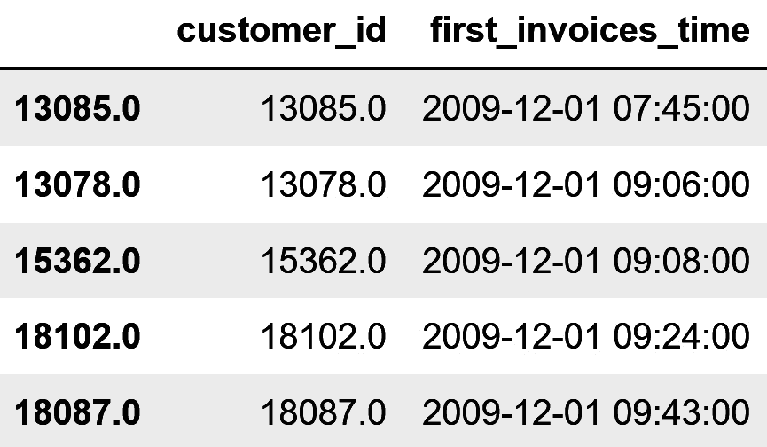
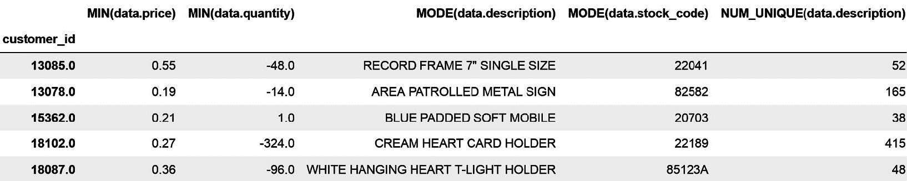
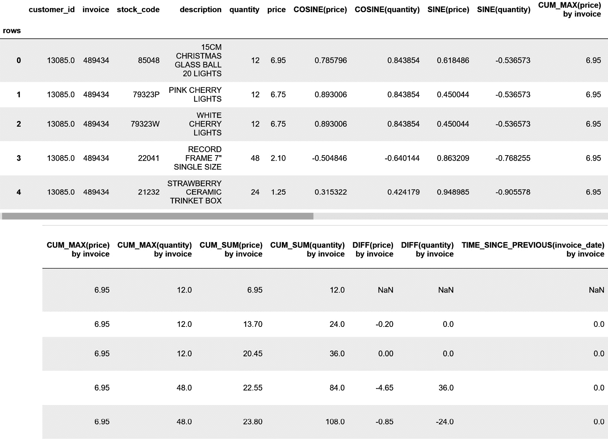
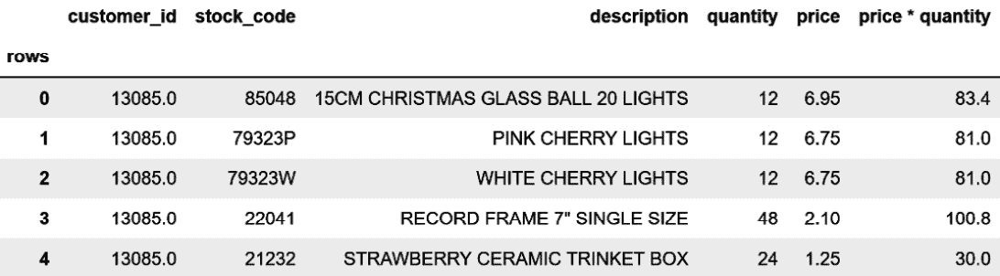
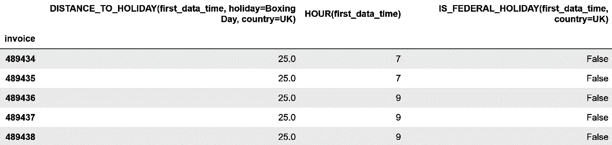
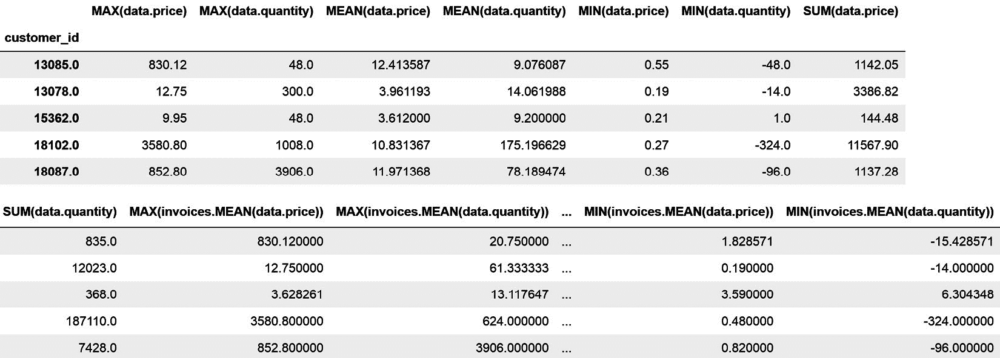

# 第十章：<st c="0">9</st>

# <st c="2">使用 Featuretools 从关系数据中提取特征</st>

<st c="60">在前几章中，我们处理的是以行和列组织的数据，其中列是变量，行是观测值，每个观测值都是独立的。</st> <st c="239">在本章中，我们将专注于从关系型数据集中创建特征。</st> <st c="317">在关系型数据集中，数据被结构化在不同的表中，这些表可以通过唯一标识符进行连接。</st> <st c="436">这些唯一标识符表示不同表之间存在的关联。</st> <st c="507">不同表之间的关联。</st>

<st c="524">关系数据的经典例子是零售公司持有的数据。</st> <st c="596">一个表包含有关客户的信息，例如姓名和地址。</st> <st c="673">第二个表包含有关客户购买的信息，例如每次购买购买的商品类型和数量。</st> <st c="805">第三个表包含有关客户与公司网站互动的信息，例如会话持续时间、使用的移动设备和访问的页面。</st> <st c="981">客户、购买和会话都使用唯一标识符进行标识。</st> <st c="1056">这些唯一标识符使我们能够将这些表组合起来，这样我们就可以获取有关客户购买或会话的信息。</st> <st c="1187">或会话。</st>

<st c="1199">如果我们想了解更多关于我们拥有的客户类型（即客户细分）或者预测他们是否会购买产品，我们可以在客户层面创建汇总或总结不同表信息的特征。</st> <st c="1464">例如，我们可以创建捕捉客户在购买中花费的最大金额、他们购买的商品数量、会话之间的时间或平均会话持续时间的特征。</st> <st c="1667">我们可以创建的特征数量以及我们在表中聚合数据的不同方式是丰富的。</st> <st c="1775">在本章中，我们将讨论一些使用`<st c="1887">featuretools</st>` `<st c="1899">Python 库</st>`创建关系数据聚合视图的常见方法。</st> <st c="1916">我们将从设置各种数据表及其关系并自动创建特征开始，然后我们将详细介绍我们可以创建的不同特征。</st> <st c="2099">我们可以创建的不同特征。</st>

<st c="2110">在本章中，我们将介绍以下食谱：</st> <st c="2146">以下食谱：</st>

+   <st c="2164">设置实体集并自动创建特征</st> <st c="2203">自动创建特征</st>

+   <st c="2225">使用通用和累积操作创建特征</st> <st c="2261">累积操作创建特征</st>

+   <st c="2282">结合</st> <st c="2293">数值特征</st>

+   <st c="2311">从日期和时间中提取特征</st> <st c="2342">和特征</st>

+   <st c="2350">从文本中提取特征</st> <st c="2371">从文本中提取特征</st>

+   <st c="2380">使用聚合原语创建特征</st>

# <st c="2426">技术要求</st>

<st c="2449">在本章中，我们将使用</st> `<st c="2479">pandas</st>`<st c="2485">,</st> `<st c="2487">matplotlib</st>`<st c="2497">, 和</st> `<st c="2503">featuretools</st>` <st c="2515">开源 Python 库。</st> <st c="2546">您可以使用</st> `<st c="2562">featuretools</st>` <st c="2574">通过</st> `<st c="2580">pip</st>`<st c="2583">进行安装：</st>

```py
 pip install featuretools
```

<st c="2610">此外，您还可以使用</st> <st c="2639">conda</st><st c="2649">来完成此操作：</st>

```py
 conda install -c conda-forge featuretools
```

<st c="2693">这些命令安装了基本的</st> `<st c="2727">featuretools</st>` <st c="2739">功能，但我们也可以安装用于使用</st> `<st c="2786">dask</st>` <st c="2857">作为后端而不是</st> `<st c="2888">pandas</st>`<st c="2894">来创建特征的附加组件。有关如何安装</st> `<st c="2935">featuretools</st>` <st c="2947">附加组件的更多信息，包括</st> `<st c="2967">graphviz</st>`<st c="2975">，请参阅他们的文档：</st> [<st c="3007">https://docs.featuretools.com/en/v0.16.0/getting_started/install.html</st>](https://docs.featuretools.com/en/v0.16.0/getting_started/install.html)<st c="3082">。</st>

<st c="3083">我们将</st> <st c="3087">与</st><st c="3090">来自 UCI 机器学习仓库的</st> *<st c="3107">在线零售 II</st>* <st c="3123">数据集</st>进行工作，该数据集可在[<st c="3196">https://archive.ics.uci.edu/ml/datasets/Online+Retail+II</st>](https://archive.ics.uci.edu/ml/datasets/Online+Retail+II) <st c="3252">找到，并受</st> **<st c="3274">Creative Commons Attribution 4.0 International</st>** <st c="3320">(</st>**<st c="3322">CC BY 4.0</st>**<st c="3331">)许可协议的约束：</st> [<st c="3343">https://creativecommons.org/licenses/by/4.0/legalcode</st>](https://creativecommons.org/licenses/by/4.0/legalcode)<st c="3396">。此数据的相应引用如下：</st> *<st c="3457">陈，大清</st>* <st c="3469">(</st>*<st c="3471">2019</st>*<st c="3475">).</st> *<st c="3479">在线零售 II</st>*<st c="3495">.</st> *<st c="3497">UCI 机器学习</st>* *<st c="3518">仓库</st>* <st c="3528">(</st>[<st c="3530">https://doi.org/10.24432/C5CG6D</st>](https://doi.org/10.24432/C5CG6D)<st c="3561">)</st><st c="3563">.</st>

<st c="3564">我下载并修改了如下</st> <st c="3617">笔记本</st>中的数据：[<st c="3627">https://github.com/PacktPublishing/Python-Feature-engineering-Cookbook-Third-Edition/blob/main/ch09-featuretools/prepare-retail-dataset.ipynb</st>](https://github.com/PacktPublishing/Python-Feature-engineering-Cookbook-Third-Edition/blob/main/ch09-featuretools/prepare-retail-dataset.ipynb)

<st c="3768">你可以在附带的 GitHub</st> <st c="3839">仓库中找到修改后的数据集：</st> [<st c="3851">https://github.com/PacktPublishing/Python-Feature-engineering-Cookbook-Third-Edition/blob/main/ch09-featuretools/retail.csv</st>](https://github.com/PacktPublishing/Python-Feature-engineering-Cookbook-Third-Edition/blob/main/ch09-featuretools/retail.csv)

# <st c="3974">设置实体集和自动创建特征</st>

<st c="4035">关系型数据集或数据库包含分散在多个表中的数据</st><st c="4045">，表之间的关系由一个唯一标识符决定，它告诉我们如何连接这些表。</st> <st c="4136">为了使用`<st c="4265">featuretools</st>`<st c="4277">自动创建特征，我们首先需要输入不同的数据表，并在所谓的</st> `<st c="4427">featuretools</st>`<st c="4439">中建立它们之间的关系，以便库可以自动根据这些关系创建特征。</st>

<st c="4554">我们将使用一个包含客户、发票和产品信息的</st><st c="4564">数据集进行工作。</st> <st c="4648">首先，我们将设置一个实体集，突出这三个项目之间的关系。</st><st c="4711">这个实体集将是本章剩余菜谱的起点。</st> <st c="4743">接下来，我们将通过聚合客户、发票和产品层次的数据来自动创建特征，利用来自`<st c="4981">featuretools</st>`<st c="4993">的默认参数。</st>

<st c="4994">在本菜谱中，你将学习如何正确设置实体集并为每个实体自动提取一系列特征。</st> <st c="5127">在接下来的菜谱中，我们将深入了解我们可以使用`<st c="5232">featuretoo</st><st c="5242">ls</st>`<st c="5245">创建的不同类型的特征。</st>

## <st c="5246">准备工作</st>

<st c="5260">在本菜谱中，我们将使用来自 UCI 机器学习仓库的</st> *<st c="5293">Online Retail II</st>* <st c="5309">数据集。</st> <st c="5360">在这个表中，有客户，他们是向零售公司大批量购买的企业。</st> <st c="5459">客户通过一个</st> `<st c="5491">customer_id</st>` <st c="5502">唯一标识符来识别。</st> <st c="5522">每个客户会进行一次或多次购买，这些购买通过一个</st> `<st c="5589">invoice</st>` <st c="5596">唯一标识符标记，包含发票号码。</st> <st c="5647">在每一张发票中，都有客户购买的一个或多个项目。</st> <st c="5731">公司销售的产品或每个项目也通过一个唯一的</st> `<st c="5805">stock code</st>` <st c="5806">来识别。</st>

<st c="5816">因此，数据有以下</st> <st c="5840">关系</st><st c="5858">：</st>


<st c="5960">图 9.1 – 显示数据关系的图</st>

<st c="6018">每位客户都进行了一笔或多笔购买，这些购买通过发票号来识别。</st> <st c="6096">每张发票包含一个或多个项目，这些项目通过库存代码来识别。</st> <st c="6145">每个项目可以被一个或多个客户购买，因此出现在多张发票中。</st> <st c="6168">考虑到这些关系，让我们继续进行</st> <st c="6314">下一步。</st>

## <st c="6326">如何操作...</st>

<st c="6342">在这个菜谱中，我们将</st> <st c="6367">使用数据设置一个实体集，然后</st> <st c="6412">突出显示数据集中的不同关系。</st> <st c="6466">最后，我们将通过在客户、发票和</st> <st c="6571">产品级别上汇总数据集中的信息来创建特征：</st>

1.  <st c="6586">让我们导入所需的库：</st>

    ```py
     import pandas as pd
    import featuretools as ft
    from woodwork.logical_types import Categorical
    ```

1.  <st c="6716">让我们加载在“准备”<st c="6764">部分中描述的零售数据集，并显示其前五行：</st>

    ```py
     df = pd.read_csv(
        «retail.csv», parse_dates=[«invoice_date»])
    df.head()
    ```

    <st c="6890">在下面的屏幕截图中，我们可以看到客户（</st>`<st c="6965">customer_id</st>`<st c="6977">）和发票（</st>`<st c="6994">invoice</st>`<st c="7002">）的唯一标识符，以及关于每张发票中购买的商品的附加信息，例如商品的代码（</st>`<st c="7099">stock_code</st>`<st c="7110">）、描述、数量、单价，以及发票的日期：</st>


<st c="7652">图 9.2 – 在线零售 II 数据集</st>

<st c="7689">注意</st>

<st c="7694">使用</st> `<st c="7699">pandas</st>`<st c="7705">’</st> `<st c="7708">unique()</st>` <st c="7716">函数</st> <st c="7726">来识别独特项目、客户和发票的数量 – 例如，通过</st> <st c="7808">执行</st> `<st c="7818">df["customer_id"].nunique()</st>`<st c="7845">.</st>

1.  <st c="7846">让我们用一个任意的名称初始化一个实体集，例如</st> <st c="7907">如下</st> `<st c="7910">data</st>`<st c="7914">:</st>

    ```py
     es = ft.EntitySet(id="data")
    ```

1.  <st c="7945">让我们向实体集添加一个 DataFrame；我们给 DataFrame 起个名字（</st>`<st c="8017">data</st>`<st c="8022">）。</st> <st c="8026">我们需要为每一行添加一个唯一标识符，我们称之为</st> `<st c="8089">rows</st>`<st c="8093">，由于在这个数据集中我们没有唯一的行标识符，我们将通过设置</st> `<st c="8214">make_index=True</st>`<st c="8229">创建它作为额外的列。最后，我们指出</st> `<st c="8257">invoice_date</st>` <st c="8269">是</st> `<st c="8280">datetime</st>` <st c="8288">类型，并且</st> `<st c="8298">customer_id</st>` <st c="8309">应该被处理</st> <st c="8328">为</st> `<st c="8331">Categorical</st>`<st c="8342">类型：</st>

    ```py
     es = es.add_dataframe(
        dataframe=df,
        dataframe_name=»data»,
        index="rows",
        make_index=True,
        time_index=»invoice_date»,
        logical_types={ «customer_id»: Categorical},
    )
    ```

1.  <st c="8509">接下来，我们添加原始</st><st c="8512">数据</st> <st c="8516">DataFrame</st> <st c="8521">和</st> `<st c="8562">invoices</st>`<st c="8566">之间的关系。为此，我们指出原始或基础 DataFrame，我们在</st> *<st c="8672">步骤 4</st>*<st c="8678">中称之为</st> `<st c="8664">data</st>` <st c="8668">，我们给新的 DataFrame 起个名字，</st> `<st c="8714">invoices</st>`<st c="8722">，我们添加发票的唯一标识符，并将包含</st> `<st c="8800">customer_id</st>` <st c="8811">的列添加到这个 DataFrame 中：</st>

    ```py
     es.normalize_dataframe(
        base_dataframe_name=»data»,
        new_dataframe_name=»invoices»,
        index="invoice",
        copy_columns=[«customer_id»],
    )
    ```

<st c="8962">注意</st>

<st c="8967">我们将</st> `<st c="8980">customer_id</st>` <st c="8991">变量复制到</st> `<st c="9008">invoices</st>` <st c="9016">数据中，因为我们想创建客户和发票之间的后续关系。</st> <st c="9092">。</st>

1.  <st c="9105">现在，我们添加第二个关系，即客户和发票之间的关系。</st> <st c="9182">为此，我们指出基础 DataFrame，我们在</st> *<st c="9253">步骤 5</st>*<st c="9259">中称之为</st> `<st c="9241">invoices</st>` <st c="9249">，然后我们给新的 DataFrame 起个名字，</st> `<st c="9300">customers</st>`<st c="9309">，并添加唯一的</st> <st c="9330">客户标识符：</st>

    ```py
     es.normalize_dataframe(
        base_dataframe_name=»invoices»,
        new_dataframe_name=»customers»,
        index=»customer_id», )
    ```

1.  <st c="9461">我们可以</st> <st c="9468">添加一个第三种关系，在原始</st><st c="9483">数据</st> <st c="9515">和</st> <st c="9524">产品</st> <st c="9529">之间：</st>

    ```py
     es.normalize_dataframe(
        base_dataframe_name=»data»,
        new_dataframe_name=»items»,
        index=»stock_code»,
    )
    ```

1.  <st c="9639">让我们显示实体集中的信息：</st> <st c="9677">实体集：</st>

    ```py
     es
    ```

    <st c="9691">在以下输出中，我们看到实体集包含四个 DataFrame：原始数据，</st> `<st c="9793">invoices</st>` <st c="9801">DataFrame，</st> `<st c="9817">customers</st>` <st c="9826">DataFrame，以及产品或</st> `<st c="9857">items</st>` <st c="9862">DataFrame。</st> <st c="9874">实体还包含发票或项目与原始数据之间的关系，以及客户</st> <st c="9996">和发票</st> <st c="9999">之间的关系：</st>

    ```py
    <st c="10009">Entityset: data</st>
     <st c="10025">DataFrames:</st>
     <st c="10037">data [Rows: 741301, Columns: 8]</st>
     <st c="10069">invoices [Rows: 40505, Columns: 3]</st>
     <st c="10104">customers [Rows: 5410, Columns: 2]</st>
     <st c="10139">items [Rows: 4631, Columns: 2]</st>
     <st c="10170">Relationships:</st>
     <st c="10185">data.invoice -> invoices.invoice</st>
     <st c="10218">invoices.customer_id -> customers.customer_id</st>
    <st c="10319">invoices</st> DataFrame:

    ```

    es["invoices"].head()

    ```py

    <st c="10361">We see in</st> <st c="10372">the following output that</st> `<st c="10398">featuretools</st>` <st c="10410">au</st><st c="10413">tomatically created a DataFrame containing the invoice’s unique</st> <st c="10478">identifier, followed by the customer’s unique identifier and the first date registered for</st> <st c="10569">ea</st><st c="10571">ch invoice:</st>
    ```



<st c="10830">图 9.3 – 发票级别的信息 DataFrame</st>

1.  <st c="10890">现在让我们显示</st> `<st c="10913">客户</st>` <st c="10922">DataFrame：</st>

    ```py
     es["customers"].head()
    ```

    <st c="10956">在以下输出中，我们可以看到</st> `<st c="10997">featuretools</st>` <st c="11009">自动创建了一个包含客户唯一标识符的 DataFrame，随后是此客户的首次发票日期：</st>



<st c="11362">图 9.4 – 客户级别的信息 DataFrame</st>

<st c="11423">注意</st>

<st c="11428">执行</st> `<st c="11501">es["items"].head()</st>` <st c="11519">来显示包含产品的 DataFrame。您还可以使用</st> `<st c="11586">pandas</st>` <st c="11592">的</st> `<st c="11595">shape</st>` <st c="11600">函数来评估不同 DataFrame 的大小。</st> <st c="11611">您将注意到每个 DataFrame 中的行数与唯一发票、客户和产品的数量相匹配。</st>

1.  <st c="11740">我们还可以以下方式显示这些数据表之间的</st> <st c="11748">关系：</st>

    ```py
     es.plot()
    ```

<st c="11827">注意</st>

<st c="11832">为了可视化数据关系，您需要安装</st> `<st c="11887">graphviz</st>` <st c="11895">。如果您还没有安装，请按照</st> <st c="11907">featuretools</st> <st c="11964">文档中的说明进行安装：</st> [<st c="11994">https://featuretools.alteryx.com/en/stable/install.html#installing-graphviz</st>](https://featuretools.alteryx.com/en/stable/install.html#installing-graphviz)<st c="12069">。</st>

<st c="12070">在以下输出中，我们可以看到关系数据集及其</st> <st c="12135">关系：</st>


<st c="12733">图 9.5 – 包含发票、客户和产品表的表之间的关系</st>

<st c="12823">在输入</st> <st c="12826">数据和它们的关系</st> <st c="12840">后，我们可以开始</st> <st c="12873">自动为我们的新 DataFrame 中的每一个创建特征——即客户、发票和产品——使用来自</st> `<st c="13035">featuretools</st>` <st c="13047">的默认参数。</st>

1.  <st c="13048">让我们通过聚合客户级别的数据来创建特征。</st> <st c="13062">为此，我们设置了</st> `<st c="13185">featuretools</st>` <st c="13197">，将</st> `<st c="13210">客户</st>` <st c="13219">指定为目标 DataFrame。</st> <st c="13245">在创建特征时，我们希望忽略具有唯一标识符的两个列：</st>

    ```py
     feature_matrix, feature_defs = ft.dfs(
        entityset=es,
        target_dataframe_name=»customers»,
        ignore_columns={
            «invoices»:[«invoice»],
            «invoices»:[«customer_id»],
        }
    )
    ```

<st c="13488">注意</st>

<st c="13493">来自</st><st c="13511">*<st c="13518">步骤 12</st>* <st c="13518">的命令触发了在客户级别对数据进行不同聚合的 114 个特征的创建。</st><st c="13617">`<st c="13621">feature_matrix</st>` <st c="13635">变量是一个包含特征值的 DataFrame，而`<st c="13689">feature_defs</st>` <st c="13701">是一个包含新特征名称的列表。</st><st c="13748">请继续执行`<st c="13769">feature_defs</st>` <st c="13781">或访问我们的配套 GitHub 仓库（</st>[<st c="13827">https://github.com/PacktPublishing/Python-Feature-Engineering-Cookbook-Third-Edition/blob/main/ch09-featuretools/Recipe1-Setting-up-an-entitity-set.ipynb</st>](https://github.com/PacktPublishing/Python-Feature-Engineering-Cookbook-Third-Edition/blob/main/ch09-featuretools/Recipe1-Setting-up-an-entitity-set.ipynb)<st c="13981">）以检查创建的特征名称。</st><st c="14028">您将在*<st c="14083">它如何工作…</st>* <st c="14090">部分中找到更多关于这些特征的信息。</st>

1.  <st c="14105">由于篇幅原因，我们无法在书中打印出所有特征</st><st c="14118">，因此，让我们显示五个</st><st c="14210">创建特征的</st><st c="14229">名称：</st>

    ```py
     feature_defs[5:10]
    ```

    <st c="14265">在以下输出中，我们看到由</st><st c="14328">`<st c="14331">featuretools</st>`<st c="14343">`</st><st c="14328">创建的 114 个特征中的 5 个</st>：

    ```py
    <st c="14345">[<Feature: MIN(data.price)>,</st>
    <st c="14373"><Feature: MIN(data.quantity)>,</st>
    <st c="14403"><Feature: MODE(data.description)>,</st>
    <st c="14437"><Feature: MODE(data.stock_code)>,</st>
    <st c="14470"><Feature: NUM_UNIQUE(data.description)>]</st>
    ```

<st c="14511">注意</st>

<st c="14516">`<st c="14521">featuretools</st>` <st c="14533">库使用创建它们的函数来命名新特征，然后是用于执行聚合的 DataFrame，最后是聚合变量的名称。</st><st c="14714">因此，`<st c="14720">MIN(data.quantity)</st>` <st c="14738">与`<st c="14756">df.groupby(["customer_id"])["quantity"].min()</st>`<st c="14801">等价，如果您熟悉`<st c="14828">pandas</st>`<st c="14834">。我们将在*<st c="14869">它如何工作…</st>* <st c="14876">部分中提供更多详细信息。</st>

1.  <st c="14892">让我们显示包含五个</st><st c="14937">创建特征的</st><st c="14968">DataFrame 的前五行：</st>

    ```py
     feature_matrix[feature_matrix.columns[5:10]].head()
    ```

    <st c="15037">在以下输出中，我们可以看到包含五个</st><st c="15094">新特征值的</st><st c="15123">五个</st><st c="15128">新特征的前五行：</st>



<st c="15542">图 9.6 – 通过在客户级别聚合数据创建的具有五个特征的 DataFrame</st>

1.  <st c="15637">同样，我们可以通过在</st><st c="15720">发票级别聚合信息来自动创建特征：</st>

    ```py
     feature_matrix, feature_defs = ft.dfs(
        entityset=es,
        target_dataframe_name=»invoices»,
        ignore_columns = {«data»: [«customer_id»]},
        max_depth = 1,
    )
    ```

1.  <st c="15882">上一步返回了 24 个特征 - 让我们显示它们的名称：</st>

    ```py
     feature_defs
    ```

    <st c="15962">我们可以在以下输出中看到特征的名称：</st> <st c="16007">如下：</st>

    ```py
    <st c="16024">[<Feature: customer_id>,</st>
    <st c="16049"><Feature: COUNT(data)>,</st>
    <st c="16072"><Feature: MAX(data.price)>,</st>
    <st c="16099"><Feature: MAX(data.quantity)>,</st>
    <st c="16129"><Feature: MEAN(data.price)>,</st>
    <st c="16157"><Feature: MEAN(data.quantity)>,</st>
    <st c="16188"><Feature: MIN(data.price)>,</st>
    <st c="16215"><Feature: MIN(data.quantity)>,</st>
    <st c="16245"><Feature: MODE(data.description)>,</st>
    <st c="16279"><Feature: MODE(data.stock_code)>,</st>
    <st c="16312"><Feature: NUM_UNIQUE(data.description)>,</st>
    <st c="16352"><Feature: NUM_UNIQUE(data.stock_code)>,</st>
    <st c="16391"><Feature: SKEW(data.price)>,</st>
    <st c="16419"><Feature: SKEW(data.quantity)>,</st>
    <st c="16450"><Feature: STD(data.price)>,</st>
    <st c="16477"><Feature: STD(data.quantity)>,</st>
    <st c="16507"><Feature: SUM(data.price)>,</st>
    <st c="16534"><Feature: SUM(data.quantity)>,</st>
    <st c="16564"><Feature: DAY(first_data_time)>,</st>
    <st c="16596"><Feature: MONTH(first_data_time)>,</st>
    <st c="16630"><Feature: WEEKDAY(first_data_time)>,</st>
    <st c="16666"><Feature: YEAR(first_data_time)>]</st>
    ```

<st c="16700">注意</st>

<st c="16705">通过执行`<st c="16782">feature_matrix.head()</st>` <st c="16803">来显示包含新特征的 DataFrame，或者检查我们附带的 GitHub 仓库以查看结果。</st>

<st c="16863">总结一下，通过使用*<st c="16899">步骤 1</st><st c="16905">6</st>* <st c="16907">中的代码，并将目标 DataFrame 的名称从`<st c="16952">invoices</st>` <st c="16960">更改为`<st c="16964">items</st>`<st c="16969">，然后在产品级别自动创建特征。</st>

## <st c="17035">它是如何工作的...</st>

<st c="17051">在这个菜谱中，我们设置了一个包含数据和某些变量（唯一标识符）之间关系的实体集。</st> <st c="17150">之后，我们通过聚合每个唯一标识符的数据集中的信息来自动创建特征。</st> <st c="17186">我们使用了`<st c="17344">featuretools</st>`<st c="17356">中的两个主要类，`<st c="17358">EntitySet</st>` <st c="17367">和`<st c="17372">dfs</st>`<st c="17375">，来创建特征。</st> <st c="17401">让我们更详细地讨论这些。</st>

<st c="17444">`<st c="17449">EntitySet</st>` <st c="17458">类存储了数据，变量的逻辑类型以及变量之间的关系。</st> <st c="17563">变量类型（是否为数值或分类）由`<st c="17645">featuretools</st>`<st c="17657">自动分配。我们也可以在将 DataFrame 添加到实体集时设置特定的变量类型。</st> <st c="17745">在*<st c="17748">步骤 4</st>*<st c="17754">中，我们将数据添加到实体集，并将`<st c="17820">customer_id</st>` <st c="17831">的逻辑类型设置为`<st c="17835">Categorical</st>`<st c="17846">。</st>

<st c="17847">注意</st>

<st c="17852">要检查`<st c="17890">featuretools</st>`<st c="17902">推断的数据类型，可以执行`<st c="17920">es["data"].ww</st>`<st c="17933">，其中`<st c="17941">es</st>` <st c="17943">是实体集，`<st c="17966">data</st>` <st c="17970">是 DataFrame 的名称。</st>

`<st c="18000">The</st>` `<st c="18005">EntitySet</st>` `<st c="18014">类具有</st>` `<st c="18029">add_dataframe</st>` `<st c="18042">方法，我们在</st> *<st c="18068">步骤 4</st>* `<st c="18074">中使用了该方法来添加一个新的 DataFrame。</st> `<st c="18099">在使用此方法时，我们需要指定唯一标识符，如果没有，则需要创建一个，就像我们在</st> *<st c="18228">步骤 4</st>* `<st c="18234">中做的那样，通过将</st> `<st c="18247">make_index</st>` `<st c="18257">设置为</st> `<st c="18261">True</st>` `<st c="18265">。</st>` `<st c="18284">注意</st>` 在 `<st c="18289">index</st>` `<st c="18294">参数中，从</st> `<st c="18305">add_dataframe</st>` `<st c="18318">传递了</st> `<st c="18334">"rows"</st>` `<st c="18340">字符串。</st>` `<st c="18349">使用此配置，</st>` `<st c="18374">EntitySet</st>` `<st c="18383">向 DataFrame 添加了一个</st> `<st c="18392">rows</st>` `<st c="18396">列，其中包含每行的唯一标识符，这是一个从 0 开始的新整数序列。</st>`

`<st c="18518">注意</st>`

`<st c="18523">而不是使用</st>` `<st c="18545">add_dataframe</st>` `<st c="18558">方法将 DataFrame 添加到实体集中，我们可以通过执行</st>` `<st c="18630">es["df_name"]=df</st>` `<st c="18646">来添加，其中</st>` `<st c="18654">"df_name"</st>` `<st c="18663">是我们想要给 DataFrame 的名字，</st>` `<st c="18713">df</st>` `<st c="18715">是我们想要</st>` `<st c="18741">添加的 DataFrame。</st>`

`<st c="18748">EntitySet</st>` `<st c="18753">类具有</st>` `<st c="18777">normalize_dataframe</st>` `<st c="18796">方法，该方法用于从现有列的唯一值创建一个新的 DataFrame 和关系。</st>` `<st c="18907">该方法接受新 DataFrame 将关联的 DataFrame 的名称以及</st>` `<st c="18998">新 DataFrame 的名称。</st>` `<st c="19028">我们</st>` `<st c="19030">还需要在</st>` `<st c="19057">index</st>` `<st c="19062">参数中指示新 DataFrame 的唯一标识符。</st>` `<st c="19121">默认情况下，此方法创建一个包含唯一标识符的新 DataFrame，后面跟着一个</st>` `<st c="19217">datetime</st>` `<st c="19225">列，包含每个唯一标识符首次注册的日期。</st>` `<st c="19298">我们可以通过使用</st>` `<st c="19353">copy_columns</st>` `<st c="19365">参数来向此 DataFrame 添加更多列，就像我们在</st>` *<st c="19391">步骤 5</st>* `<st c="19397">中做的那样。</st>` `<st c="19391">添加更多列到新 DataFrame 对于我们想要跟踪与此新 DataFrame 的关系是有用的，就像我们在</st>` *<st c="19529">步骤 6</st>* `<st c="19535">中做的那样。</st>`

<st c="19536">`<st c="19541">实体集</st>` <st c="19550">类还具有</st> `<st c="19570">plot()</st>` <st c="19576">方法，该方法显示实体集中的现有关系。</st> <st c="19642">在</st> *<st c="19645">图 9.5</st>**<st c="19653">中，</st> `<st c="19655">我们看到了我们的数据表之间的关系；</st> `<st c="19711">发票</st>` <st c="19719">和</st> `<st c="19724">项目</st>` <st c="19729">(产品) 表与原始数据相关，而</st> `<st c="19795">客户</st>` <st c="19804">表与</st> `<st c="19830">发票</st>` <st c="19838">表相关，该表反过来又与</st> <st c="19881">原始数据</st> <st c="19881">相关。</st>

<st c="19895">注意</st>

<st c="19900">表之间的关系决定了如何创建特征。</st> <st c="19976">《</st> `<st c="19980">发票</st>` <st c="19988">和</st> `<st c="19993">项目</st>` <st c="19998">表与原始数据相关。</st> <st c="20040">因此，我们只能创建深度为 1 的特征。</st> <st c="20088">另一方面，</st> `<st c="20092">客户</st>` <st c="20101">表与发票相关，而发票与数据相关。</st> <st c="20178">因此，我们可以创建深度为 2 的特征。</st> <st c="20221">这意味着新特征将包括整个数据集的聚合或首先对发票进行聚合，然后对客户进行后续聚合。</st> <st c="20397">我们可以使用</st> `<st c="20445">max_depth</st>` <st c="20454">参数</st> <st c="20465">在</st> `<st c="20468">dfs</st>`<st c="20471">中</st>来调整要创建的特征。</st>

<st c="20472">在设置数据和关系之后，我们使用了</st> `<st c="20530">dfs</st>` <st c="20533">从</st> `<st c="20539">featuretools</st>` <st c="20551">来自动创建特征。</st> <st c="20586">在创建特征时使用</st> `<st c="20614">dfs</st>`<st c="20617">，我们需要设置目标 DataFrame - 即为创建特征的数据表。</st> <st c="20723">`<st c="20727">dfs</st>` <st c="20730">类通过</st> *<st c="20757">转换</st>* <st c="20769">和</st> *<st c="20774">聚合</st> <st c="20785">现有变量，通过所谓的</st> **<st c="20830">转换</st>** <st c="20839">和</st> **<st c="20844">聚合</st> <st c="20854">原始操作</st>**<st c="20864">来创建特征。</st>

<st c="20865">一个转换</st> <st c="20878">原始转换变量。</st> <st c="20910">例如，从日期时间变量，使用转换原始操作，</st> `<st c="20977">dfs</st>` <st c="20980">提取</st> `<st c="20994">月份</st>`<st c="20999">，</st> `<st c="21001">年份</st>`<st c="21005">，</st> `<st c="21007">日</st>`<st c="21010">，和</st> `<st c="21016">周</st>` <st c="21020">值</st><st c="21027">。</st>

<st c="21028">聚合原语</st> <st c="21042">用于对唯一标识符的信息进行聚合。</st> <st c="21100">它使用数学运算，如均值、标准差、最大值和最小值、总和以及偏度系数来处理数值变量。</st> <st c="21257">对于分类变量，聚合原语使用众数和唯一项的计数。</st> <st c="21306">对于唯一标识符，它们计算出现的次数。</st>

考虑到转换和聚合原语的功能，让我们尝试理解在这个菜谱中创建的特性。<st c="21551">我们使用了</st> `<st c="21585">dfs</st>` <st c="21588">的默认参数来创建</st> `<st c="21603">默认特性</st>。</st>

<st c="21620">注意</st>

<st c="21625">有关</st> `<st c="21679">featuretools</st>` <st c="21691">返回的默认特性的更多详细信息，请访问</st> [<st c="21699">https://featuretools.alteryx.com/en/stable/generated/featuretools.dfs.html#featuretools.dfs</st>](https://featuretools.alteryx.com/en/stable/generated/featuretools.dfs.html#featuretools.dfs)<st c="21790">。</st>

<st c="21791">首先</st> <st c="21801">为每个客户创建了特性。</st> `<st c="21837">featuretools</st>` <st c="21849">为每个客户返回了 114 个特性。</st> <st c="21891">由于</st> `<st c="21903">客户</st>` <st c="21912">数据与</st> `<st c="21936">发票</st>` <st c="21944">数据相关，而发票数据又与整个数据集相关，因此</st> `<st c="21995">特性是通过在两个级别上聚合数据创建的。</st> <st c="22052">首先，使用整个数据集对每个客户的数据进行了聚合。</st> <st c="22127">接下来，首先对每个发票的数据进行了聚合，然后对预聚合的数据再次进行聚合以生成</st> `<st c="22233">每个客户的特性</st>。</st>

<st c="22247">The</st> `<st c="22252">featuretools</st>` <st c="22264">库使用用于聚合数据的函数来命名新特征 – 例如，</st> `<st c="22356">COUNT</st>`<st c="22361">,</st> `<st c="22363">MEAN</st>`<st c="22367">,</st> `<st c="22369">STD</st>`<st c="22372">, 和</st> `<st c="22378">SKEW</st>`<st c="22382">, 等等。</st> <st c="22398">接下来，它使用用于聚合的数据，并跟随聚合的变量。</st> <st c="22509">例如，</st> `<st c="22526">MEAN(data.quantity)</st>` <st c="22545">特征包含从整个数据集中计算出的客户购买物品的平均数量，这相当于</st> `<st c="22676">df.groupby("customer_id"])["quantity"].mean()</st>`<st c="22721">，如果你熟悉</st> `<st c="22748">pandas</st>`<st c="22754">。另一方面，</st> `<st c="22779">MEAN(invoices.MEAN(data.quantity))</st>` <st c="22813">特征首先获取每个发票的物品平均数量 – 即，</st> `<st c="22889">df.groupby("invoice"])["quantity"].mean()</st>` <st c="22930"> – 然后从结果序列中获取平均值，考虑特定客户的发票。</st>

<st c="23040">对于分类</st> <st c="23057">特征，</st> `<st c="23067">featuretools</st>` <st c="23079">确定众数和</st> <st c="23104">唯一值。</st> <st c="23123">例如，从</st> `<st c="23145">description</st>` <st c="23156">变量中，我们得到了</st> `<st c="23181">NUM_UNIQUE(data.description)</st>` <st c="23209">和</st> `<st c="23214">MODE(data.descripti</st><st c="23233">on)</st>` <st c="23237">特征。</st> <st c="23248">描述只是物品的名称。</st> <st c="23294">因此，这些特征突出了客户购买的独特物品数量和客户购买次数最多的物品。</st>

<st c="23421">注意一些有趣的事情</st>

<st c="23448">The</st> `<st c="23453">NUM_UNIQUE(data.description)</st>` <st c="23481">和</st> `<st c="23486">MODE(data.description)</st>` <st c="23508">变量在分类特征聚合后是数值型的。</st> <st c="23582">The</st> `<st c="23586">featuretools</st>` <st c="23598">库通过使用这些新创建变量的数值聚合来创建更多特征。</st> <st c="23695">In this way, the</st> `<st c="23712">MAX(invoices.NUM_UNIQUE(data.description)</st>` <st c="23753">feature first finds the number of unique items per invoice and then returns the maximum from those values for a particular customer, considering all the</st> <st c="23907">customer’s invoices.</st>

<st c="23927">从日期时间特征中，</st> `<st c="23952">featuretools</st>` <st c="23964">默认提取日期组成部分。</st> <st c="24002">请记住，</st> `<st c="24020">customers</st>` <st c="24029">DataFrame 包含了</st> `<st c="24053">customer_id</st>` <st c="24064">变量以及每个客户的首次发票日期，正如我们在</st> *<st c="24154">步骤 10</st>*<st c="24161">的输出中看到的。</st> 从这个日期时间特征中，</st> `<st c="24191">featuretools</st>` <st c="24203">创建了</st> `<st c="24212">DAY(first_invoices_time)</st>`<st c="24236">,</st> `<st c="24238">MONTH(first_invoices_time)</st>`<st c="24264">,</st> `<st c="24266">WEEKDAY(first_invoices_time)</st>`<st c="24294">, 和</st> `<st c="24300">YEAR(first_invoices_time)</st>` <st c="24325">特征，它们包含了不同的</st> <st c="24360">日期部分。</st>

<st c="24371">最后，</st> `<st c="24381">featuretools</st>` <st c="24393">还返回了每个客户的发票总数（</st>`<st c="24451">COUNT(invoices)</st>`<st c="24467">)和每客户的行总数（</st>`<st c="24497">COUNT(data)</st>`<st c="24501">)</st> <st c="24516">。</st>

## <st c="24529">另请参阅</st>

<st c="24538">要了解更多关于什么启发了</st> `<st c="24575">featuretools</st>`<st c="24587">的信息，请查看原文</st> *<st c="24616">深度特征合成：自动化数据科学努力的途径</st>* <st c="24681">由 Kanter 和 Veeramachaneni 所著</st> <st c="24711">在</st> [<st c="24714">https://www.jmaxkanter.</st><st c="24737">com/papers/DSAA_DSM_2015.pdf</st>](https://www.jmaxkanter.com/papers/DSAA_DSM_2015.pdf)<st c="24766">。</st>

# <st c="24767">使用通用和累积操作创建特征</st>

<st c="24824">The</st> `<st c="24829">f</st><st c="24830">eaturetools</st>` <st c="24841">库使用所谓的</st> **<st c="24871">转换原语</st>** <st c="24891">来创建特征。</st> <st c="24912">转换原语接受一个或多个数据集的列作为输入，并</st> <st c="24958">i</st><st c="24959">n</st> <st c="24984">返回一个或多个列作为输出。</st> <st c="25022">它们应用于一个</st> *<st c="25044">单个</st> <st c="25050">DataFrame。</st>

<st c="25061">The</st> `<st c="25066">featuretools</st>` <st c="25078">库根据它们执行的操作类型或修改的变量类型将它的变换原语分为各种类别。</st><st c="25146">例如，</st> **<st c="25243">通用变换原语</st>** <st c="25271">应用数学运算，如平方根、正弦和余弦。</st> **<st c="25354">累积变换原语</st>** <st c="25386">通过比较一行值与上一行值来创建新特征。</st> <st c="25441">例如，累积总和、累积平均值、累积最小值和最大值以及行值之间的差异都属于这一类别。</st> <st c="25463">还有一个可以应用于日期时间变量的累积变换，即</st> **<st c="25726">自上次以来</st>** <st c="25745">变换，它确定两个连续时间戳之间的时间流逝。</st>

<st c="25830">在这个食谱中，我们将使用来自</st> `<st c="25931">featuretools</st>`<st c="25943">的通用和累积变换原语来创建特征。</st>

## <st c="25944">准备就绪</st>

<st c="25958">变量变换，如平方根或对数变换，在我们想要改变变量的分布时很有用，正如我们在</st> *<st c="26104">第三章</st>*<st c="26113">,</st> *<st c="26115">变换数值变量</st>*<st c="26147">中看到的。其他数学推导，如正弦和余弦，有助于捕捉潜在的数据模式，正如我们在</st> *<st c="26273">从周期性变量创建周期特征</st>* <st c="26323">食谱</st> *<st c="26334">第八章</st>*<st c="26343">,</st> *<st c="26345">创建新特征</st>*<st c="26366">中描述的。从这些章节中描述的变换中，</st> `<st c="26422">featuretools</st>` <st c="26434">支持平方根和对数变换以及正弦和余弦（但不包括在 0</st> <st c="26558">和 2π之间的归一化）。</st>

<st c="26566">使用累积变换，例如，我们可以通过将发票级别的每一行的项目数量加起来来获取每张发票购买的项目总数。</st> <st c="26738">为了理解我们将在这个食谱中创建的特征，让我们先用</st> `<st c="26824">pandas</st>` <st c="26830">创建它们：</st>

1.  <st c="26837">让我们导入</st> `<st c="26851">pandas</st>` <st c="26857">和</st> `<st c="26862">numpy</st>`<st c="26867">:</st>

    ```py
     import numpy as np
    import pandas as pd
    ```

1.  <st c="26908">让我们加载在</st> *<st c="26956">技术</st>* *<st c="26966">要求</st>* <st c="26978">部分中描述的零售数据集：</st>

    ```py
     df = pd.read_csv(
        «retail.csv», parse_dates=[«invoice_date»])
    ```

1.  <st c="27049">让我们</st> <st c="27056">将两个数值变量，</st> `<st c="27093">价格</st>` <st c="27098">和</st> `<st c="27103">数量</st>`<st c="27111">，捕获到一个列表中：</st>

    ```py
     numeric_vars = ["quantity", "price"]
    ```

1.  <st c="27160">让我们</st> <st c="27167">将累积函数的名称捕获到一个列表中：</st>

    ```py
     func = ["cumsum", "cummax", "diff"]
    ```

1.  <st c="27260">让我们创建一个包含我们将要创建的变量的新名称的列表：</st>

    ```py
     new_names = [f"{var}_{function}"
        for function in func for var in numeric_vars]
    ```

1.  <st c="27414">让我们使用第 4 步中的累积函数创建新变量，并将其应用到第 3 步中的变量上，然后将它们添加到 DataFrame 中：</st>

    ```py
     df[new_names] = df.groupby(
        "invoice")[numeric_vars].agg(func)
    ```

    <st c="27617">上一步返回了每个发票内的累积和、累积最大值以及行之间的差异。</st> <st c="27744">一旦遇到新的发票号码，它</st> <st c="27794">就重新开始。</st>

1.  <st c="27808">让我们显示一个特定发票的原始和新特征：</st> <st c="27861">：</st>

    ```py
     df[df["invoice"] == "489434" ][
        numeric_vars + new_names]
    ```

    <st c="27938">在以下输出中，我们可以看到</st> `<st c="27980">quantity_cumsum</st>` <st c="27995">是数量变量的累积和，而</st> `<st c="28048">price_diff</st>` <st c="28058">是行</st> <st c="28087">之后的行价格差异：</st>


<st c="28371">图 9.7 – 显示对单个实体（发票）中的数值特征应用累积函数的 DataFrame</st>

<st c="28481">现在</st> <st c="28492">将正弦</st> <st c="28507">和余弦变换应用到整个 DataFrame。</st>

1.  <st c="28557">让我们创建一个包含新变量名称的列表：</st>

    ```py
     new_names = [
        f"{var}_{function}"
        for function in ["sin", "cos"]
        for var in numeric_vars]
    ```

1.  <st c="28701">让我们使用正弦</st> <st c="28755">和余弦将价格和数量进行转换：</st>

    ```py
     df[new_names] = df[numeric_vars].agg(
        [np.sin, np.cos])
    ```

    <st c="28822">第 9 步中的转换已应用于整个数据集，无论发票号码如何，这是可以的，因为它将一行映射到同一行，而不是像累积函数那样从一行映射到下一行。</st> <st c="28959">您可以通过执行`<st c="29094">df[new_names].head()</st>`<st c="29114">来检查结果。</st>

<st c="29115">现在我们了解了我们想要创建的特征类型，让我们使用`<st c="29213">featuretools</st>`<st c="29225">`来自动化这个过程。</st>

## <st c="29226">如何做...</st>

<st c="29242">我们将</st> <st c="29246">对每个发票应用累积变换</st> <st c="29284">并对整个数据集应用一般变换：</st>

1.  <st c="29351">首先，我们将导入</st> `<st c="29372">pandas</st>`<st c="29378">,</st> `<st c="29380">featuretools</st>`<st c="29392">, 以及</st> `<st c="29402">Categorical</st>` <st c="29413">逻辑类型：</st>

    ```py
     import pandas as pd
    import featuretools as ft
    from woodwork.logical_types import Categorical
    ```

1.  <st c="29520">让我们加载在技术</st> *<st c="29561">要求</st>* *<st c="29571">部分</st>* <st c="29583">中描述的数据集：</st>

    ```py
     df = pd.read_csv(
        «retail.csv», parse_dates=[«invoice_date»])
    ```

1.  <st c="29654">让我们设置一个</st> <st c="29671">实体集：</st>

    ```py
     es = ft.EntitySet(id="data")
    ```

1.  <st c="29711">让我们将 DataFrame 添加到</st> <st c="29743">实体集：</st>

    ```py
     es = es.add_dataframe(
        dataframe=df,
        dataframe_name=»data»,
        index="rows",
        make_index=True,
        time_index=»invoice_date»,
        logical_types={
            "customer_id": Categorical,
            "invoice": Categorical,
        }
    )
    ```

<st c="29944">注意</st>

<st c="29949">默认情况下，</st> `<st c="29962">featuretools</st>` <st c="29974">仅保留在创建新特征后生成的特征矩阵中的分类、数值和布尔特征。</st> <st c="30071">发票</st> <st c="30116">变量的类型无法准确推断，因此我们需要通过将其逻辑类型设置为我们在步骤 4 中所做的，来强制将其作为分类变量，如果我们希望</st> `<st c="30260">featuretools</st>` <st c="30272">将其保留在新特征数据集中。</st> <st c="30330">要了解</st> `<st c="30365">featuretools</st>`<st c="30377">推断的数据类型，您可以执行</st> `<st c="30387">es["data"].</st><st c="30406">ww</st>`<st c="30409">。</st>

1.  <st c="30410">让我们创建一个与步骤 4 的 DataFrame 相关的新 DataFrame：</st>

    ```py
     es.normalize_dataframe(
        base_dataframe_name=»data»,
        new_dataframe_name=»invoices»,
        index="invoice",
        copy_columns=[«customer_id»],
    )
    ```

<st c="30622">注意</st>

<st c="30627">有关步骤 4 和</st> *<st c="30651">步骤 5</st>* <st c="30658">的更多详细信息，请访问</st> *<st c="30676">设置实体集和自动创建特征</st>* *<st c="30723">的食谱。</st>

1.  <st c="30744">让我们列出我们将用于创建特征的累积转换：</st>

    ```py
     cum_primitives = [
        "cum_sum",
        "cum_max",
        "diff", "time_since_previous"]
    ```

<st c="30905">注意</st>

<st c="30910">您可以在以下链接找到</st> `<st c="30924">featuretools</st>`<st c="30936">支持的累积转换：</st> [<st c="30989">https://featuretools.alteryx.com/en/stable/api_reference.html#cumulative-transform-primitives</st>](https://featuretools.alteryx.com/en/stable/api_reference.html#cumulative-transform-primitives)

1.  <st c="31082">让我们列出要执行的一般转换：</st> <st c="31135">：</st>

    ```py
     general_primitives = ["sine", " cosine "]
    ```

<st c="31188">注意</st>

<st c="31193">您可以在以下链接找到</st> `<st c="31207">featuretools</st>`<st c="31219">支持的一般转换：</st> [<st c="31269">https://featuretools.alteryx.com/en/stable/api_reference.html#g</st><st c="31332">eneral-transform-primiti</st><st c="31357">ves</st>](https://featuretools.alteryx.com/en/stable/api_reference.html#general-transform-primitives)

1.  <st c="31361">最后，让我们</st> <st c="31377">创建特征。</st> <st c="31398">我们使用</st> `<st c="31409">dfs</st>` <st c="31412">类，将原始 DataFrame 设置为目标 DataFrame – 即，我们将使用其变量作为新特征的模板。</st> <st c="31556">请注意，我们向</st> `<st c="31595">agg_primitives</st>` <st c="31609">参数传递一个空列表；这是为了避免返回默认的聚合原语。</st> <st c="31684">我们从</st> *<st c="31720">步骤 7</st>* <st c="31726">将通用原语传递到</st> `<st c="31734">trans_primitives</st>` <st c="31750">参数，并将累积原语从</st> *<st c="31796">步骤 6</st>* <st c="31802">传递到</st> `<st c="31810">groupby_trans_primitives</st>` <st c="31834">参数：</st>

    ```py
     feature_matrix, feature_defs = ft.dfs(
        entityset=es,
        target_dataframe_name=»data»,
        agg_primitives=[],
        trans_primitives=general_primitives,
        groupby_trans_primitives = cum_primitives,
        ignore_dataframes = [«invoices»],
    )
    ```

<st c="32063">注意</st>

*<st c="32068">步骤 8</st>* <st c="32075">触发特征的创建，这可能会花费一些时间，具体取决于数据的大小、聚合级别以及要创建的特征数量。</st> <st c="32244">您可以通过将</st> *<st c="32282">在创建它们之前</st> <st c="32288">检查输出特征，通过设置</st> `<st c="32319">features_only</st>` <st c="32332">参数为</st> `<st c="32346">True</st>`<st c="32350">。这将仅返回特征名称；您可以检查它们，确保它们显示您需要的内容，然后通过将该参数重新设置为</st> `<st c="32527">False</st>`<st c="32535">来触发特征合成。</st>

1.  <st c="32536">现在让我们</st> <st c="32547">显示</st> <st c="32565">创建的特征</st> <st c="32572">名称：</st>

    ```py
     feature_defs
    ```

    <st c="32603">在以下输出中，我们可以看到我们创建的特征名称，包括价格和数量的正弦和余弦，以及将这些变量按发票号分组后的累积变换：</st> <st c="32813">：</st>

    ```py
    <st c="32828">[<Feature: customer_id>,</st>
    <st c="32853"><Feature: invoice>,</st>
    <st c="32872"><Feature: stock_code>,</st>
    <st c="32894"><Feature: description>,</st>
    <st c="32917"><Feature: quantity>,</st>
    <st c="32937"><Feature: price>,</st>
    <st c="32954"><Feature: COSINE(price)>,</st>
    <st c="32979"><Feature: COSINE(quantity)>,</st>
    <st c="33007"><Feature: SINE(price)>,</st>
    <st c="33030"><Feature: SINE(quantity)>,</st>
    <st c="33056"><Feature: CUM_MAX(price) by invoice>,</st>
    <st c="33093"><Feature: CUM_MAX(quantity) by invoice>,</st>
    <st c="33133"><Feature: CUM_SUM(price) by invoice>,</st>
    <st c="33170"><Feature: CUM_SUM(quantity) by invoice>,</st>
    <st c="33210"><Feature: DIFF(price) by invoice>,</st>
    <st c="33244"><Feature: DIFF(quantity) by invoice>,</st>
    <st c="33281"><Feature: TIME_SINCE_PREVIOUS(invoice_date) by invoice>]</st>
    ```

<st c="33338">注意</st>

<st c="33343">价格和数量的正弦和余弦变换可能不会增加太多价值，因为这些不是周期性特征。</st> <st c="33415">我保留了这些变换在配方中，以向您展示如何一般地应用变换原语，如果您需要的话。</st>

<st c="33603">如您从</st> <st c="33611">前面的列表中看到，新特征被附加为新的列到原始 DataFrame 中。</st> <st c="33686">您可以通过执行</st><st c="33686">`feature_matrix.head()`</st> <st c="33717">来显示</st> <st c="33740">最终的 DataFrame：</st>



<st c="34802">图 9.8 – 深度特征合成得到的 DataFrame，包含</st> <st c="34883">原始变量和新特征</st>

关于创建功能的更多详细信息，请查看 *<st c="34979">如何工作…</st>* *<st c="34986">部分。</st>

## *<st c="35001">如何工作…</st>*

要使用 `<st c="35087">featuretools</st>`<st c="35099">创建一般和累积转换的功能，我们首先需要设置一个包含数据的实体集并定义其变量之间的关系。</st> <st c="35205">我们在 *<st c="35253">设置实体集和自动创建功能</st>* *<st c="35300">配方</st> 中描述了如何设置实体集。</st>

为了应用累积和一般转换，我们使用了 `<st c="35378">dfs</st>` <st c="35381">类</st> 从 `<st c="35393">featuretools</st>`<st c="35405">。一般转换应用于整个 DataFrame，而不按特定变量进行分组。</st> <st c="35508">为了执行一般转换，我们将包含转换名称的字符串列表传递给 `<st c="35610">trans_primitives</st>` <st c="35626">参数</st> <st c="35637">fr</st><st c="35639">om</st> `<st c="35643">dfs</st>`<st c="35646">。</st>

我们在按 `<st c="35703">invoice</st>`<st c="35710">分组后应用累积转换。为此，我们将包含累积转换名称的字符串列表传递给 `<st c="35807">groupby_trans_primitives</st>` <st c="35831">参数</st> 从 `<st c="35847">dfs</st>`<st c="35850">。*<st c="35856">featuretools</st>* <st c="35868">库知道应该按发票分组，因为我们通过使用 `<st c="35969">normalize_dataframe</st>` <st c="35988">方法从 `<st c="36001">EntitySet</st>` <st c="36010">在 *<st c="36014">步骤 5</st>*<st c="36020">中建立了这个唯一标识符。</st>

最后，我们不想从 `<st c="36090">invoices</st>` <st c="36098">DataFrame 中的变量创建功能；因此，我们将 `<st c="36123">dfs</st>` <st c="36126">设置为通过设置 `<st c="36163">ignore_dataframes = ["</st>``<st c="36185">invoices"]</st>`<st c="36196">。</st>

`<st c="36197">dfs</st>` <st c="36202">类返回了两个变量，包含原始和新的 DataFrame 以及特征名称的列表。</st> <st c="36326">新特征以创建它们的操作命名，例如</st> `<st c="36405">SINE</st>`<st c="36409">,</st> `<st c="36411">COSINE</st>`<st c="36417">,</st> `<st c="36419">CUM_MAX</st>`<st c="36426">, 或</st> `<st c="36431">DIFF</st>`<st c="36435">，后跟应用转换的变量，以及当对应时，用于分组的变量。</st>

<st c="36567">请注意</st> `<st c="36578">featuretools</st>` <st c="36590">会自动识别并选择应用转换的变量。</st> `<st c="36692">正弦、余弦、累计总和、最大值和差值被应用于数值变量，而</st> `<st c="36799">time_since_previous</st>` <st c="36818">转换被应用于</st> `<st c="36853">datetime 变量</st>`。</st>

# <st c="36871">结合数值特征</st>

<st c="36900">在第</st> *<st c="36904">第八章</st>*<st c="36913">中</st>，*<st c="36915">创建新特征</st>*<st c="36936">，我们了解到我们可以通过结合</st> <st c="36991">变量和数学运算来创建新特征。</st> `<st c="37035">featuretools</st>` <st c="37047">库支持多种组合变量的操作，包括加法、除法、取模和乘法。</st> <st c="37167">在本例中</st><st c="37192">，我们将学习如何使用</st> `<st c="37233">featuretools</st>`<st c="37245">来组合这些特征。</st>

## <st c="37246">如何操作...</st>

<st c="37262">让我们首先导入库并准备数据集：</st>

1.  <st c="37332">首先，我们将导入</st> `<st c="37353">pandas</st>`<st c="37359">，`<st c="37361">featuretools</st>`<st c="37373">，以及</st> `<st c="37383">Categorical</st>` <st c="37394">逻辑类型：</st>

    ```py
     import pandas as pd
    import featuretools as ft
    from woodwork.logical_types import Categorical
    ```

1.  <st c="37501">让我们加载在</st> *<st c="37547">技术</st> * *<st c="37557">要求</st> * <st c="37569">部分中描述的数据集：</st>

    ```py
     df = pd.read_csv(
        «retail.csv», parse_dates=[«invoice_date»])
    ```

1.  <st c="37640">让我们设置一个</st> `<st c="37657">实体集</st>`：</st>

    ```py
     es = ft.EntitySet(id="data")
    ```

1.  <st c="37697">让我们将 DataFrame 添加到</st> <st c="37729">实体集：</st>

    ```py
     es = es.add_dataframe(
        dataframe=df,
        dataframe_name=»data»,
        index="rows",
        make_index=True,
        time_index=»invoice_date»,
        logical_types={«customer_id»: Categorical},
    )
    ```

1.  <st c="37904">让我们创建一个新的 DataFrame，它与从</st> *<st c="37976">步骤 4</st>*<st c="37982">中的 DataFrame 相关：</st>

    ```py
     es.normalize_dataframe(
        base_dataframe_name=»data»,
        new_dataframe_name=»invoices»,
        index="invoice",
        copy_columns=[«customer_id»],
    )
    ```

<st c="38116">注意</st>

<st c="38121">有关</st> *<st c="38145">步骤 4</st> * <st c="38152">和</st> *<st c="38157">步骤 5</st>*<st c="38158">的更多详细信息，请访问</st> *<st c="38170">设置实体集和自动创建特征</st> * *<st c="38217">食谱</st> *。</st>

1.  <st c="38238">我们将乘以</st> `<st c="38260">数量</st>` <st c="38268">和</st> `<st c="38273">价格</st>` <st c="38278">变量，分别反映购买的商品数量和单价，以获得总</st> <st c="38385">支付金额：</st>

    ```py
     feature_matrix, feature_defs = ft.dfs(
        entityset=es,
        target_dataframe_name=»data»,
        agg_primitives=[],
        trans_primitives=[«multiply_numeric»],
        primitive_options={
            («multiply_numeric»): {
                ‹include_columns›: {
                    'data': ["quantity", "price"]
                }
            }
        },
        ignore_dataframes=[«invoices»],
    )
    ```

<st c="38674">注意</st>

<st c="38679">我们将</st> `<st c="38687">agg_primitives</st>` <st c="38701">设置为空列表，以避免创建</st> `<st c="38744">默认原语</st>`。</st>

1.  <st c="38763">现在</st> <st c="38774">让我们显示新特征的名称：</st>

    ```py
     feature_defs
    ```

    <st c="39199">在以下输出中，我们看到特征名称，其中最后一个对应于</st> `<st c="38936">价格</st>` <st c="38941">和</st> `<st c="38946">数量</st>` <st c="38954">变量的组合：</st>

    ```py
    <st c="38965">[<Feature: customer_id>,</st>
    <st c="38990"><Feature: stock_code>,</st>
    <st c="39012"><Feature: description>,</st>
    <st c="39035"><Feature: quantity>,</st>
    <st c="39055"><Feature: price>,</st>
    <st c="39072"><Feature: price * quantity>]</st>
    ```

1.  <st c="39101">最后，让我们检查在</st> *<st c="39161">步骤 6</st>*<st c="39167">中创建的新 DataFrame：</st>

    ```py
     feature_matrix.head()
    ```

    <st c="39191">在以下输出中，我们可以看到新特征被附加到原始 DataFrame 的右侧：</st>



<st c="39658">图 9.9 – 由价格与数量的乘积产生的新特征的 DataFrame</st>

<st c="39751">与</st> `<st c="39776">featuretools</st>` <st c="39788">结合特征可能比</st> `<st c="39833">df["price"].mul(df["quantity"])</st>` <st c="39864">pandas</st> <st c="39871">函数更复杂。</st> <st c="39887">真正的力量在于我们以这种方式创建新特征并随后在发票或客户级别进行聚合时。</st> <st c="40020">我们将在</st> *<st c="40066">使用聚合原始操作创建特征</st>* *<st c="40101">食谱</st>* <st c="40111">中讨论聚合函数。</st>

## <st c="40119">接下来...</st>

<st c="40135">要乘积特征，我们使用了来自</st> `<st c="40201">featuretools</st>`<st c="40213">的</st> `<st c="40170">MultiplyNumeric</st>` <st c="40185">原始操作</st>，它可以通过</st> `<st c="40242">dfs</st>` <st c="40245">使用</st> `<st c="40256">multiply_numeric</st>` <st c="40272">字符串访问。</st> <st c="40281">我们将前面的字符串传递给</st> `<st c="40316">trans_primitive</st>` <st c="40331">参数，然后使用</st> `<st c="40360">primitive_options</st>` <st c="40377">参数指定要乘积的变量。</st> <st c="40428">请注意，此外，我们还向</st> `<st c="40482">agg_primitives</st>` <st c="40496">参数传递了一个空列表，以避免返回默认的聚合原始操作，并且我们忽略了来自</st> `<st c="40606">invoices</st>` <st c="40614">DataFrame 的特征。</st>

<st c="40625">要查看其他允许您组合变量的函数，请访问</st> [<st c="40698">https://featuretools.alteryx.com/en/stable/api_reference.html#binary-transform-primitives</st>](https://featuretools.alteryx.com/en/stable/api_reference.html#binary-transform-primitives)<st c="40787">。在撰写本文时，我发现</st> `<st c="40828">MultiplyNumeric</st>` <st c="40843">和</st> `<st c="40848">DivideNumeric</st>` <st c="40861">未在文档中列出。</st> <st c="40892">您可以通过检查源代码始终双重检查哪些函数受支持：</st> [<st c="40981">https://github.com/alteryx/featuretools/tree/main/featuretools/primitives/standard/transform/binary</st>](https://github.com/alteryx/featuretools/tree/main/featuretools/primitives/standard/transform/binary)<st c="41080">。您还可以通过在设置实体集及其关系后运行以下命令来检查您可以在数据上执行哪些操作：</st> `<st c="41239">ft.get_valid_primitives(es, target_dataframe_name="data", max_dep</st><st c="41304">th=2)</st>`<st c="41310">。在这里，<st c="41318">es</st> <st c="41320">是第 *<st c="41354">步骤 5</st>*<st c="41360">产生的实体集。</st>

# <st c="41361">从日期和时间中提取特征</st>

<st c="41400">在第</st> *<st c="41404">第六章</st>*<st c="41413">中</st>，*<st c="41415">从日期和时间中提取特征</st>* *<st c="41453">变量</st>*<st c="41463">，我们讨论了如何通过从日期和时间变量（如年份、月份、星期几、小时等）中提取特征来丰富我们的</st> <st c="41500">数据集</st>。我们可以利用 `<st c="41713">featuretools</st>`<st c="41725"> 自动提取这些特征。</st>

<st c="41726">`featuretools` <st c="41731">库</st> 支持使用其 **<st c="41828">日期时间转换原语</st>**<st c="41857">创建来自日期时间变量的各种特征</st>。这些原语包括常见的变量，如年份、月份和日期，以及其他特征，如 *<st c="41958">是否是午餐时间</st>* <st c="41974">或</st> *<st c="41978">是否是工作日</st>*<st c="41991">。此外，我们可以提取表示日期是否为联邦假日或银行假日（如英国所称）的特征，或者确定到特定日期的时间距离的特征。</st> <st c="42178">对于一家零售公司来说，圣诞节、黑色星期五或节礼日等日期的邻近性通常预示着销售额的增加，如果他们正在预测需求，这些将是有用的变量。</st>

<st c="42379">注意</st>

<st c="42384">有关从 datetime 变量创建的特征的更多详细信息，请访问</st> [<st c="42469">https://featuretools.alteryx.com/en/stable/api_reference.html#datetime-transform-primitives</st>](https://featuretools.alteryx.com/en/stable/api_reference.html#datetime-transform-primitives)<st c="42560">。</st>

<st c="42561">在这个配方中，我们将使用 `<st c="42656">featuretools</st>`<st c="42668">自动从 datetime 变量创建多个特征：</st>

## <st c="42669">如何做到这一点...</st>

<st c="42685">让我们开始</st> <st c="42698">通过导入库并准备</st> <st c="42741">数据集：</st>

1.  <st c="42755">首先，我们将导入</st> `<st c="42776">pandas</st>`<st c="42782">，`<st c="42784">featuretools</st>`<st c="42796">，以及一些特殊的</st> <st c="42815">datetime 原始设置：</st>

    ```py
     import pandas as pd
    import featuretools as ft
    from featuretools.primitives import (
        IsFederalHoliday, DistanceToHoliday)
    from woodwork.logical_types import Categorical
    ```

1.  <st c="43003">让我们加载</st> *<st c="43044">技术</st>* *<st c="43054">要求</st>* <st c="43066">部分中描述的数据集：</st>

    ```py
     df = pd.read_csv(
        «retail.csv», parse_dates=[«invoice_date»])
    ```

1.  <st c="43137">让我们设置一个</st><st c="43141">实体集：</st>

    ```py
     es = ft.EntitySet(id="data")
    ```

1.  <st c="43195">让我们将 DataFrame 添加到</st> <st c="43227">实体集：</st>

    ```py
     es = es.add_dataframe(
        dataframe=df,
        dataframe_name=»data»,
        index="rows",
        make_index=True,
        time_index=»invoice_date»,
        logical_types={«customer_id»: Categorical},
    )
    ```

1.  <st c="43402">让我们创建一个新的 DataFrame，它与</st> *<st c="43474">步骤 4</st>*<st c="43480">中的 DataFrame 有关系：</st>

    ```py
     es.normalize_dataframe(
        base_dataframe_name=»data»,
        new_dataframe_name=»invoices»,
        index="invoice",
        copy_columns=[«customer_id»],
    )
    ```

<st c="43614">注意</st>

<st c="43619">有关</st> *<st c="43643">步骤 4</st>* <st c="43650">和</st> *<st c="43655">步骤 5</st>*<st c="43656">的更多详细信息，请访问</st> *<st c="43668">设置实体集和自动创建特征</st>* *<st c="43715">的配方。</st>

1.  <st c="43736">让我们创建一个</st> <st c="43750">返回一个布尔向量，指示日期是否与英国的银行假日（即非工作日）相符的原始设置：</st> <st c="43860">：</st>

    ```py
     is_bank_hol = IsFederalHoliday(country="UK")
    ```

<st c="43922">注意</st>

<st c="43927">在设置用于确定银行假日的原始设置时，选择正确的国家非常重要。</st> <st c="44031">有关支持国家的列表，</st> <st c="44066">请访问</st> [<st c="44072">https://github.com/dr-prodigy/python-holidays#available-countries</st>](https://github.com/dr-prodigy/python-holidays#available-countries)<st c="44137">。</st>

1.  <st c="44138">让我们检查这个原始设置中包含哪些银行假日：</st>

    ```py
     hols = is_bank_hol.holidayUtil.federal_holidays.values()
    available_hols = list(set(hols))
    ```

    <st c="44296">如果我们</st> <st c="44303">执行</st> `<st c="44311">available_hols</st>`<st c="44325">`，我们将看到支持英国银行假日的列表：</st>

    ```py
    <st c="44382">['May Day',</st>
     <st c="44394">'Good Friday',</st>
     <st c="44409">'Wedding of William and Catherine',</st>
     <st c="44445">'Coronation of Charles III',</st>
     <st c="44474">'Christmas Day',</st>
     <st c="44491">'Wedding of Charles and Diana',</st>
     <st c="44523">'Christmas Day (observed)',</st>
     <st c="44551">'State Funeral of Queen Elizabeth II',</st>
     <st c="44590">'Silver Jubilee of Elizabeth II',</st>
     <st c="44624">'Spring Bank Holiday',</st>
     <st c="44647">'Diamond Jubilee of Elizabeth II',</st>
     <st c="44682">'Boxing Day (observed)',</st>
     <st c="44707">'Platinum Jubilee of Elizabeth II',</st>
     <st c="44743">"New Year's Day (observed)",</st>
     <st c="44772">'Boxing Day',</st>
     <st c="44786">'Golden Jubilee of Elizabeth II',</st>
     <st c="44820">'Millennium Celebrations',</st>
     <st c="44847">"New Year's Day"]</st>
    ```

1.  <st c="44865">让我们创建另一个原始设置，用于确定到特定日期的天数——在这种情况下，到节礼日的距离：</st>

    ```py
     days_to_boxing = DistanceToHoliday(
        holiday="Boxing Day", country="UK")
    ```

1.  <st c="45055">现在，让我们创建一个包含字符串的列表，这些字符串可以识别我们从</st> `<st c="45149">datetime</st>` <st c="45157">和包括从</st> *<st c="45190">步骤 6</st>* <st c="45197">和</st> *<st c="45202">步骤 8</st>*<st c="45203">中获取的原始设置：</st>

    ```py
     date_primitives = [
        "day", "year", "month", "weekday",
        "days_in_month", "part_of_day",
        "hour", "minute",
        is_bank_hol,
        days_to_boxing
    ]
    ```

1.  <st c="45340">现在让我们</st> <st c="45351">从</st> *<st c="45386">第 9 步</st>* <st c="45392">创建基于</st> `<st c="45406">invoice_date</st>` <st c="45418">日期变量的</st>日期和时间特征：</st>

    ```py
     feature_matrix, feature_defs = ft.dfs(
        entityset=es,
        target_dataframe_name=»invoices»,
        agg_primitives=[],
        trans_primitives=date_primitives,
    )
    ```

<st c="45575">注意</st>

<st c="45580">在第</st> *<st c="45584">4 步</st>*<st c="45590">中，我们输入了</st> `<st c="45607">invoice_date</st>` <st c="45619">变量作为时间变量。</st> <st c="45649">因此，</st> `<st c="45655">featuretools</st>` <st c="45667">将使用此变量来创建日期和</st> <st c="45711">时间相关的特征。</st>

1.  <st c="45733">让我们显示创建的</st> <st c="45765">特征名称：</st>

    ```py
     feature_defs
    ```

    <st c="45795">在以下输出中，我们看到原始特征和</st> <st c="45858">时间特征的名称：</st>

    ```py
    <st c="45872">[<Feature: customer_id>,</st>
    <st c="45897"><Feature: DAY(first_data_time)>,</st>
    <st c="45929"><Feature: DAYS_IN_MONTH(first_data_time)>,</st>
    <st c="45971"><Feature: DISTANCE_TO_HOLIDAY(</st>
     <st c="46002">first_data_time, holiday=Boxing Day, country=UK)>,</st>
    <st c="46053"><Feature: HOUR(first_data_time)>,</st>
    <st c="46086"><Feature: IS_FEDERAL_HOLIDAY(</st>
     <st c="46116">first_data_time, , country=UK)>,</st>
    <st c="46149"><Feature: MINUTE(first_data_time)>,</st>
    <st c="46184"><Feature: MONTH(first_data_time)>,</st>
    <st c="46218"><Feature: PART_OF_DAY(first_data_time)>,</st>
    <st c="46258"><Feature: WEEKDAY(first_data_time)>,</st>
    <st c="46350">feature_matrix.head()</st> to take a look at the resulting DataFrame with the features created from the invoice date. The DataFrame is quite big, so for reasons of space, we’ll only display a few columns in the book.
    ```

1.  <st c="46561">让我们显示包含三个新特征的</st> <st c="46624">结果 DataFrame：</st>

    ```py
     columns = [
        "DISTANCE_TO_HOLIDAY(first_data_time,
            holiday=Boxing Day, country=UK)",
        "HOUR(first_data_time)",
        "IS_FEDERAL_HOLIDAY(first_data_time,
            country=UK)",
    ]
    feature_matrix[columns].head()
    ```

    <st c="46830">在以下输出中，我们看到包含新特征的 DataFrame：</st>



<st c="47148">图 9.10 – 包含从 datetime 派生的一些特征的 DataF</st><st c="47167">rame</st>

<st c="47220">请注意，</st> <st c="47231">一些创建的特征是数值型的，例如</st> `<st c="47281">HOUR</st>` <st c="47285">或</st> `<st c="47289">DAY</st>`<st c="47292">，一些是布尔型的，例如</st> `<st c="47321">IS_FEDERAL_HOLIDAY</st>`<st c="47339">，还有一些是分类型的，例如</st> `<st c="47375">PART_OF_DAY</st>`<st c="47386">。要查看</st> `<st c="47420">PART_OF_DAY</st>`<st c="47431">的值，</st> <st c="47433">执</st><st c="47434">行</st> `<st c="47441">feature_matrix["PAR</st><st c="47460">T_OF_DAY(first_data_time)"].unique()</st>`<st c="47497">。</st>

## <st c="47498">它是如何工作的...</st>

<st c="47514">要从 datetime 变量创建特征，我们使用了来自</st> `<st c="47602">featuretools</st>` <st c="47615">(</st>[<st c="47616">https://featuretools.alteryx.com/en/stable/api_reference.html#datetime-transform-primitives</st>](https://featuretools.alteryx.com/en/stable/api_reference.html#datetime-transform-primitives)<st c="47707">)的 datetime 转换原语。</st> <st c="47711">这些原语可以通过</st> `<st c="47749">dfs</st>` <st c="47752">使用我们在</st> *<st c="47801">第 6 步</st>* <st c="47808">到</st> *<st c="47811">第 9 步</st>* <st c="47813">中指定的字符串和函数通过</st> `<st c="47826">trans_primitive</st>` <st c="47841">参数访问。</st> <st c="47853">注意，此外，我们还向</st> `<st c="47907">agg_primitives</st>` <st c="47921">参数传递了一个空列表，以避免返回应用于我们的 datetime 特征的默认聚合原语。</st> <st c="48046">我们还忽略了来自</st> `<st c="48091">invoices</st>` <st c="48099">DataFrame 的特征。</st>

<st c="48110">注意</st>

我们将`agg_primitives`设置为一个空列表，并忽略了`invoices` DataFrame，以保持输出简单并能够专注于日期时间特征。然而，请注意，`featuretools`的真正威力在于从`datetim`中创建原始数据，然后在不同实体级别进一步聚合它们。

# 从文本中提取特征

在第十一章中，*从文本变量中提取特征*，我们将讨论我们可以从文本片段中利用`pandas`和`scikit-learn`提取的各种特征。我们还可以通过利用`featuretools`自动从文本中提取多个特征。

`<st c="48704">featuretools</st>`库支持创建几个基本特征作为其默认功能的一部分，例如文本中的字符数、单词数、每个单词的平均字符数以及文本中的中位词长等。

**注意**

要获取默认文本原始数据的完整列表，请访问[`featuretools.alteryx.com/en/stable/api_reference.html#naturallanguage-transform-primitives`](https://featuretools.alteryx.com/en/stable/api_reference.html#naturallanguage-transform-primitives)。

此外，还有一个配套的 Python 库`nlp_primitives`，它包含额外的原始数据，用于创建基于 NLP 的更高级特征。在这些函数中，我们发现了一些用于确定多样性得分、极性得分或停用词计数的原始数据。

**注意**

在编写本文时，没有关于`nlp_primitives`库支持的原始数据的文档，因此要了解更多信息，您需要检查源代码：[`github.com/alteryx/nlp_primitives/tree/6243ef2379501bfec2c3f19e35a30b5954605e57/nlp_primitives`](https://github.com/alteryx/nlp_primitives/tree/6243ef2379501bfec2c3f19e35a30b5954605e57/nlp_primitives)。

<st c="49701">在这个食谱中，我们将首先利用`<st c="49788">featuretools</st>`<st c="49800">的默认功能以及</st><st c="49832">n</st>突出显示如何使用来自`<st c="49877">nlp_primitives</st>` <st c="49891">库的</st> `<st c="49857">p</st>`原语。</st>

## <st c="49900">准备就绪</st>

<st c="49914">为了跟随这个食谱，您需要安装`<st c="49973">nlp_primitives</st>` <st c="49987">库，您可以使用`<st c="50014">pip</st>`<st c="50022">来完成此操作：</st>

```py
 pip install nlp_primitives
```

<st c="50051">否则，您可以使用</st> <st c="50071">conda</st>`<st c="50080">:</st>

```py
 conda install -c conda-forge nlp-primitives
```

<st c="50126">注意</st>

<st c="50131">有关更多详细信息，请访问`<st c="50160">nlp_primi</st><st c="50169">tives</st>` <st c="50175">GitHub</st> <st c="50183">存储库：</st> [<st c="50195">https://github.com/alteryx/nlp_primitives</st>](https://github.com/alteryx/nlp_primitives)

## <st c="50236">如何操作...</st>

<st c="50252">让我们首先导入库并准备数据集：</st>

1.  <st c="50322">首先，我们将导入</st> `<st c="50343">pandas</st>`<st c="50349">，`<st c="50351">featuretools</st>`<st c="50363">，以及</st> <st c="50373">逻辑类型：</st>

    ```py
     import pandas as pd
    import featuretools as ft
    from woodwork.logical_types import (
       Categorical, NaturalLanguage)
    ```

1.  <st c="50500">让我们加载在`<st c="50541">技术</st>` *<st c="50551">要求</st> * <st c="50563">部分中描述的数据集：</st>

    ```py
     df = pd.read_csv(
        «retail.csv», parse_dates=[«invoice_date»])
    ```

1.  <st c="50634">让我们设置一个</st> <st c="50651">实体集：</st>

    ```py
     es = ft.EntitySet(id="data")
    ```

1.  <st c="50691">让我们将 DataFrame 添加到实体集中，突出显示</st> `<st c="50757">描述</st>` <st c="50768">变量是一个</st> <st c="50783">文本变量：</st>

    ```py
     es = es.add_dataframe(
        dataframe=df,
        dataframe_name=»data»,
        index="rows",
        make_index=True,
        time_index=»invoice_date»,
        logical_types={
            «customer_id»: Categorical,
            "invoice": Categorical,
            «description»: NaturalLanguage,
        }
    )
    ```

<st c="51019">注意</st>

<st c="51024">为了使`<st c="51033">featuretools</st>` <st c="51045">库的文本原语正常工作，我们需要使用`<st c="51139">NaturalLanguage</st>` <st c="51154">逻辑类型</st>来指示哪些变量是文本。</st>

1.  <st c="51168">让我们创建</st> <st c="51182">一个新的 DataFrame，它与`<st c="51240">步骤 4</st>`<st c="51246">中的 DataFrame 有关系：</st>

    ```py
     es.normalize_dataframe(
        base_dataframe_name=»data»,
        new_dataframe_name=»invoices»,
        index="invoice",
        copy_columns=[«customer_id»],
    )
    ```

<st c="51380">注意</st>

<st c="51385">有关</st> *<st c="51409">步骤 4</st> * <st c="51416">和</st> *<st c="51421">步骤 5</st>*<st c="51422">的更多详细信息，请访问</st> *<st c="51434">设置实体集并创建特征</st> * *<st c="51481">自动</st> * <st c="51494">食谱。</st>

1.  <st c="51502">让我们创建一个与我们要创建的文本特征对应的字符串列表：</st>

    ```py
     text_primitives = [
        "num_words",
        "num_characters",
        "MeanCharactersPerWord" ,
        "PunctuationCount"]
    ```

1.  <st c="51684">现在让我们</st> <st c="51695">从`<st c="51730">描述</st>` <st c="51741">变量中提取文本特征：</st>

    ```py
     feature_matrix, feature_defs = ft.dfs(
        entityset=es,
        target_dataframe_name=»data»,
        agg_primitives=[],
        trans_primitives=text_primitives,
        ignore_dataframes=[«invoices»],
    )
    ```

1.  <st c="51921">让我们显示已创建的特征的名称：</st>

    ```py
     feature_defs
    ```

    <st c="51983">在以下输出中，我们看到原始特征的名称，然后是来自</st> `<st c="52087">description</st>` <st c="52098">变量的特征：</st>

    ```py
    <st c="52108">[<Feature: customer_id>,</st>
    <st c="52133"><Feature: invoice>,</st>
    <st c="52152"><Feature: stock_code>,</st>
    <st c="52174"><Feature: quantity>,</st>
    <st c="52194"><Feature: price>,</st>
    <st c="52211"><Feature: MEAN_CHARACTERS_PER_WORD(description)>,</st>
    <st c="52260"><Feature: NUM_CHARACTERS(description)>,</st>
    <st c="52299"><Feature: NUM_WORDS(description)>,</st>
    <st c="52422">feature_matrix.head()</st>.
    ```

1.  <st c="52444">让我们显示包含从文本派生特征的 DataFrame 的一个片段：</st>

    ```py
    <st c="52521">text_f = [</st>
     <st c="52532">"NUM_CHARACTERS(description)",</st>
     <st c="52563">"NUM_WORDS(description)",</st>
     <st c="52589">"PUNCTUATION_COUNT(description)",</st>
    <st c="52623">]</st>
    <st c="52625">feature_matrix[text_f].head()</st>
    ```

    <st c="52654">在以下输出中，我们看到一个从</st><st c="52670">文本中创建的特征 DataFrame：</st>


<st c="52874">图 9.11 – 从文本创建的特征 DataFrame</st>

<st c="52933">注意</st>

<st c="52938">`<st c="52943">featuretools</st>` <st c="52955">库移除了原始文本变量</st> `<st c="53000">description</st>`<st c="53011">，并返回了</st> <st c="53046">新的特征。</st>

<st c="53059">要使用来自</st> `<st c="53109">nlp_primitives</st>` <st c="53123">包的原始函数创建特征，您首先需要导入它们 – 例如，通过执行</st> `<st c="53196">from nlp_primitives import DiversityScore</st>` <st c="53232">– 然后将原始函数添加到我们在</st> *<st c="53309">步骤 6</st>*<st c="53315">中创建的文本原始函数列表中。请注意，这些是</st> <st c="53336">复杂函数，因此创建特征可能需要一些时间。</st>

## <st c="53406">它是如何工作的...</st>

<st c="53422">要从文本变量创建特征，我们使用了来自</st> `<st c="53504">featuretools</st>`<st c="53516">的默认文本原始函数。这些原始函数可以通过传递一个包含与原始函数名称对应的字符串列表到</st> `<st c="53663">trans_primitives</st>` <st c="53679">参数中从</st> `<st c="53556">dfs</st>` <st c="53559">访问，例如来自</st> *<st c="53648">步骤 6</st>*<st c="53654">的，到</st> `<st c="53663">trans_primitives</st>` <st c="53679">参数。</st>

<st c="53690">对于更高级的原始函数，您需要从</st> `<st c="53773">nlp_primitives</st>` <st c="53787">库中导入原始函数，然后将它们传递给来自</st> `<st c="53857">dfs</st>`<st c="53860">的</st> `<st c="53825">trans_primitives</st>` <st c="53841">参数。有了这个，</st> `<st c="53873">dfs</st>` <st c="53876">就可以利用这些原始函数的功能从文本中创建新的特征。</st> `<st c="53966">nlp_primitives</st>` <st c="53984">库在底层使用</st> `<st c="54002">nltk</st>` <st c="54006">Python 库。</st>

# <st c="54038">使用聚合原始函数创建特征</st>

<st c="54084">在本章中，我们通过将现有变量映射到</st> <st c="54182">新特征中，通过各种函数自动创建了特征。</st> <st c="54222">例如，我们从日期时间变量中提取日期和时间部分，计算文本中的单词、</st> <st c="54321">字符和标点符号的数量，将数值特征组合成新变量，并使用正弦和余弦等函数转换特征。</st> <st c="54473">为了创建这些特征，我们使用了</st> <st c="54514">转换原语。</st>

<st c="54535">`<st c="54540">featuretools</st>` <st c="54552">库还</st> <st c="54566">支持</st> `<st c="54773">价格</st>`<st c="54778">，与发票相关，聚合原语将取单个发票的所有价格观测值并返回单个值，例如平均价格或总和（即支付的总金额），对于</st> <st c="54986">该发票。</st>

<st c="54999">注意</st>

<st c="55004">`<st c="55009">featuretools</st>` <st c="55021">的聚合功能相当于</st> `<st c="55069">groupby</st>` <st c="55076">在</st> `<st c="55080">pandas</st>`<st c="55086">中，随后是</st> `<st c="55100">pandas</st>` <st c="55106">fun</st><st c="55110">ctions</st>，如</st> `<st c="55126">mean</st>`<st c="55130">，</st> `<st c="55132">sum</st>`<st c="55135">，</st> `<st c="55137">std</st>`<st c="55140">，和</st> `<st c="55146">count</st>`<st c="55151">，以及其他函数。</st>

<st c="55166">一些聚合原语与数值变量一起工作，例如平均值、总和或最大值</st> <st c="55260">和最小值。</st> <st c="55280">其他聚合原语特定于分类变量，例如唯一值的数量和最频繁的</st> <st c="55366">值（众数）。</st>

<st c="55419">注意</st>

<st c="55424">要获取</st> <st c="55431">支持的聚合原语的完整列表，</st> <st c="55482">请访问</st> [<st c="55488">https://featuretools.alteryx.com/en/stable/api_reference.html#aggregation-primitives</st>](https://featuretools.alteryx.com/en/stable/api_reference.html#aggregation-primitives)<st c="55572">。</st>

<st c="55573">在本菜谱中，我们将首先通过聚合现有变量来创建多个特征。</st> <st c="55664">之后，我们将结合使用转换和聚合原语，以突出`<st c="55772">featuretools</st>`<st c="55784">的真正威力。</st>

## <st c="55785">准备就绪</st>

<st c="55799">在这个菜谱中，我们将使用来自 UCI 机器学习仓库的</st> *<st c="55832">在线零售 II</st>* <st c="55848">数据集。</st> <st c="55899">这个数据集包含有关产品（项目）、发票和客户的信息。</st> <st c="55977">为了跟随这个菜谱，了解这些实体的性质和它们之间的关系，以及如何使用</st> `<st c="56147">featuretools</st>`<st c="56159">正确设置实体集非常重要，我们在</st> *<st c="56187">设置实体集和自动创建特征</st>* <st c="56247">菜谱中描述了这一点。</st> <st c="56256">在继续下一节之前，请确保您已经检查了该菜谱。</st>

## <st c="56335">如何做到...</st>

<st c="56351">让我们首先导入库并准备好</st> <st c="56407">数据集：</st>

1.  <st c="56421">首先，我们将导入</st> `<st c="56442">pandas</st>`<st c="56448">，</st> `<st c="56450">featuretools</st>`<st c="56462">，以及逻辑类型：</st>

    ```py
     import pandas as pd
    import featuretools as ft
    from woodwork.logical_types import (
        Categorical, NaturalLanguage)
    ```

1.  <st c="56599">让我们加载</st> <st c="56611">在</st> *<st c="56640">技术</st>* *<st c="56650">要求</st>* <st c="56662">部分中描述的</st>数据集：</st>

    ```py
     df = pd.read_csv(
        «retail.csv», parse_dates=[«invoice_date»])
    ```

1.  <st c="56733">让我们设置一个</st> <st c="56750">实体集：</st>

    ```py
     es = ft.EntitySet(id="data")
    ```

1.  <st c="56790">让我们将 DataFrame 添加到实体集中，并强调以下内容：</st> `<st c="56856">描述</st>` <st c="56867">变量是一个文本变量，</st> `<st c="56897">customer_id</st>` <st c="56908">是分类变量，</st> `<st c="56929">invoice_date</st>` <st c="56941">是一个</st> <st c="56947">日期时间特征：</st>

    ```py
     es = es.add_dataframe(
        dataframe=df,
        dataframe_name=»data»,
        index="rows",
        make_index=True,
        time_index=»invoice_date»,
        logical_types={
            «customer_id»: Categorical,
            «description»: NaturalLanguage,
        }
    )
    ```

1.  <st c="57162">让我们创建一个新的 DataFrame，它与来自</st> *<st c="57234">步骤 4</st>*<st c="57240">的 DataFrame 有关系：</st>

    ```py
     es.normalize_dataframe(
        base_dataframe_name=»data»,
        new_dataframe_name=»invoices»,
        index="invoice",
        copy_columns=[«customer_id»],
    )
    ```

1.  <st c="57375">现在，我们添加第二个关系，即客户与发票之间的关系。</st> <st c="57454">为此，我们指示基础 DataFrame，我们在</st> *<st c="57526">步骤 5</st>*<st c="57532">中将其称为</st> `<st c="57514">invoices</st>` <st c="57522">，我们给新的 DataFrame 起名，</st> `<st c="57568">customers</st>`<st c="57577">，并添加一个唯一的</st> <st c="57599">客户标识符：</st>

    ```py
     es.normalize_dataframe(
        base_dataframe_name=»invoices»,
        new_dataframe_name=»customers»,
        index=»customer_id»,
    )
    ```

<st c="57730">注意</st>

<st c="57735">有关</st> *<st c="57759">步骤 4</st>* <st c="57766">到</st> *<st c="57770">5</st>*<st c="57771">的更多详细信息，请访问</st> *<st c="57783">设置实体集和自动创建特征</st>* *<st c="57830">自动</st>* <st c="57843">菜谱。</st>

1.  <st c="57851">让我们创建一个包含字符串名称的列表，这些名称标识了我们想要使用的聚合原语：</st> <st c="57937">要使用：</st>

    ```py
     agg_primitives = ["mean", "max", "min", "sum"]
    ```

1.  <st c="57991">让我们通过在客户级别聚合数据来创建特征。</st> <st c="58061">为此，我们设置了</st> `<st c="58087">dfs</st>` <st c="58090">类从</st> `<st c="58102">featuretools</st>`<st c="58114">，表示</st> `<st c="58127">customers</st>` <st c="58136">作为目标 DataFrame，并将来自</st> *<st c="58205">步骤 7</st>* <st c="58211">的聚合原语传递给</st> `<st c="58237">trans_primitives</st>` <st c="58253">参数，以防止</st> `<st c="58275">dfs</st>` <st c="58278">返回默认转换：</st>

    ```py
     feature_matrix, feature_defs = ft.dfs(
        entityset=es,
        target_dataframe_name=»customers»,
        agg_primitives=agg_primitives,
        trans_primitives=[],
    )
    ```

1.  <st c="58465">让我们显示</st> <st c="58480">创建的特征的</st> 名称：</st>

    ```py
     feature_defs
    ```

    <st c="58527">在以下输出中，我们看到在</st> <st c="58606">客户级别</st> 聚合的名称特征：</st>

    ```py
    <st c="58621">[<Feature: MAX(data.price)>,</st>
    <st c="58650"><Feature: MAX(data.quantity)>,</st>
    <st c="58680"><Feature: MEAN(data.price)>,</st>
    <st c="58708"><Feature: MEAN(data.quantity)>,</st>
    <st c="58739"><Feature: MIN(data.price)>,</st>
    <st c="58766"><Feature: MIN(data.quantity)>,</st>
    <st c="58796"><Feature: SUM(data.price)>,</st>
    <st c="58823"><Feature: SUM(data.quantity)>,</st>
    <st c="58853"><Feature: MAX(invoices.MEAN(data.price))>,</st>
    <st c="58895"><Feature: MAX(invoices.MEAN(data.quantity))>,</st>
    <st c="58940"><Feature: MAX(invoices.MIN(data.price))>,</st>
    <st c="58981"><Feature: MAX(invoices.MIN(data.quantity))>,</st>
    <st c="59025"><Feature: MAX(invoices.SUM(data.price))>,</st>
    <st c="59066"><Feature: MAX(invoices.SUM(data.quantity))>,</st>
    <st c="59110"><Feature: MEAN(invoices.MAX(data.price))>,</st>
    <st c="59152"><Feature: MEAN(invoices.MAX(data.quantity))>,</st>
    <st c="59197"><Feature: MEAN(invoices.MEAN(data.price))>,</st>
    <st c="59240"><Feature: MEAN(invoices.MEAN(data.quantity))>,</st>
    <st c="59286"><Feature: MEAN(invoices.MIN(data.price))>,</st>
    <st c="59328"><Feature: MEAN(invoices.MIN(data.quantity))>,</st>
    <st c="59373"><Feature: MEAN(invoices.SUM(data.price))>,</st>
    <st c="59415"><Feature: MEAN(invoices.SUM(data.quantity))>,</st>
    <st c="59460"><Feature: MIN(invoices.MAX(data.price))>,</st>
    <st c="59501"><Feature: MIN(invoices.MAX(data.quantity))>,</st>
    <st c="59545"><Feature: MIN(invoices.MEAN(data.price))>,</st>
    <st c="59587"><Feature: MIN(invoices.MEAN(data.quantity))>,</st>
    <st c="59632"><Feature: MIN(invoices.SUM(data.price))>,</st>
    <st c="59673"><Feature: MIN(invoices.SUM(data.quantity))>,</st>
    <st c="59717"><Feature: SUM(invoices.MAX(data.price))>,</st>
    <st c="59758"><Feature: SUM(invoices.MAX(data.quantity))>,</st>
    <st c="59802"><Feature: SUM(invoices.MEAN(data.price))>,</st>
    <st c="59844"><Feature: SUM(invoices.MEAN(data.quantity))>,</st>
    <st c="59889"><Feature: SUM(invoices.MIN(data.price))>,</st>
    <st c="59930"><Feature: SUM(invoices.MIN(data.quantity))>]</st>
    ```

<st c="59975">注意</st>

<st c="59980">请记住，</st> `<st c="59995">featuretools</st>` <st c="60007">使用创建它们的函数命名特征，然后是用于计算的 DataFrame，最后是用于计算的变量。</st> <st c="60181">因此，</st> `<st c="60187">MAX(data.price)</st>` <st c="60202">是每个客户在数据集中看到的最高价格。</st> <st c="60263">另一方面，</st> `<st c="60282">MEAN(invoices.MAX(data.price))</st>` <st c="60312">是特定客户在每张发票中观察到的所有最大价格的均值。</st> <st c="60405">也就是说，如果一个客户有六张发票，我们首先找到六张发票中的每张发票的最高价格，然后取这些值的平均值。</st>

1.  <st c="60549">现在让我们</st> <st c="60560">显示包含原始数据和</st> <st c="60625">新特征的</st> 结果 DataFrame：</st>

    ```py
     feature_matrix.head()
    ```

    <st c="60660">在以下输出中，我们看到</st> *<st c="60694">一些</st>* <st c="60698">由</st> `<st c="60742">dfs</st>`<st c="60745"> 返回的 DataFrame 中的变量：</st>



<st c="61524">图 9.12 – 包含客户级别聚合的一些特征的 DataFrame</st>

<st c="61623">由于空间限制，我们无法显示</st> *<st c="61688">步骤 10</st>*<st c="61695"> 的全部输出，所以请确保您在自己的计算机上执行它或访问我们的配套 GitHub 仓库以获取更多</st> <st c="61795">详细信息：</st> [<st c="61804">https://github.com/PacktPublishing/Python-Feature-Engineering-Cookbook-Third-Edition/blob/main/ch09-featuretools/Recipe6-Creating-features-with-aggregation-primitives.ipynb</st>](https://github.com/PacktPublishing/Python-Feature-Engineering-Cookbook-Third-Edition/blob/main/ch09-featuretools/Recipe6-Creating-features-with-aggregation-primitives.ipynb)<st c="61976">。</st>

<st c="61977">为了跟进，让我们将使用转换原语从菜谱中学到的知识与这个菜谱中的聚合</st> <st c="62086">函数结合起来。</st> <st c="62115">首先，我们将从现有的日期时间和文本变量中创建新特征；然后，我们将在</st> <st c="62275">客户级别对这些特征以及数值变量进行聚合。</st>

1.  <st c="62290">让我们使用日期和</st> <st c="62322">文本原语来创建列表：</st>

    ```py
     trans_primitives = ["month", "weekday", "num_words"]
    ```

1.  <st c="62391">让我们使用聚合原语创建一个列表：</st>

    ```py
     agg_primitives = ["mean"]
    ```

1.  <st c="62466">现在让我们通过转换然后</st> <st c="62477">自动创建特征，并聚合变量：</st>

    ```py
     feature_matrix, feature_defs = ft.dfs(
        entityset=es,
        target_dataframe_name=»customers»,
        agg_primitives=agg_primitives,
        trans_primitives=trans_primitives,
        max_depth=3,
    )
    ```

    <st c="62723">从</st> *<st c="62738">步骤 13</st>* <st c="62745">触发的代码会创建功能，并在</st> <st c="62824">客户级别进行后续聚合。</st>

1.  <st c="62839">让我们显示新功能的</st> <st c="62871">名称：</st>

    ```py
     feature_defs
    ```

    <st c="62897">在以下输出中，我们可以看到创建的变量的</st> <st c="62947">名称：</st>

    ```py
    <st c="62965">[<Feature: MEAN(data.price)>,</st>
    <st c="62995"><Feature: MEAN(data.quantity)>,</st>
    <st c="63026"><Feature: MONTH(first_invoices_time)>,</st>
    <st c="63064"><Feature: WEEKDAY(first_invoices_time)>,</st>
    <st c="63104"><Feature: MEAN(invoices.MEAN(data.price))>,</st>
    <st c="63147"><Feature: MEAN(invoices.MEAN(data.quantity))>,</st>
    <st c="63193"><Feature: MEAN(data.NUM_WORDS(description))>,</st>
    <st c="63238"><Feature: MEAN(invoi</st><st c="63259">ces.MEAN(data.NUM_</st>
     <st c="63278">WORDS(description)))>] WORDS(description)))>]</st>
    ```

<st c="63324">请注意，由于空间限制，在我们的菜谱中我们将特征的创建保持到最小，但你可以创建尽可能多的特征，并使用</st> <st c="63478">内置</st> <st c="63539">于</st> `<st c="63544">featuretools</st>`<st c="63556">的功能显著丰富你的数据集。</st>

## <st c="63557">它的工作原理...</st>

<st c="63573">在这个菜谱中，我们将使用转换原语创建功能的方法，这是我们</st> <st c="63672">在本章中讨论的，与使用</st> <st c="63742">聚合原语创建功能的方法结合起来。</st>

<st c="63765">要使用</st> `<st c="63790">featuretools</st>` <st c="63802">自动创建特征，我们首先需要将数据输入到实体集中，并建立数据之间的关系。</st> <st c="63919">我们在</st> *<st c="63967">设置实体集和自动创建特征</st>* *<st c="64014">菜谱</st>* <st c="64027">中讨论了如何设置实体集。</st>

<st c="64035">为了聚合现有的特征，我们使用了</st> `<st c="64080">dfs</st>` <st c="64083">类。</st> <st c="64091">我们创建了一个包含对应聚合原语的字符串的列表，并将其传递给</st> `<st c="64188">agg_primitives</st>` <st c="64202">参数，来自</st> `<st c="64218">dfs</st>`<st c="64221">。为了在不创建新特征的情况下聚合现有变量，我们将一个空列表传递给</st> `<st c="64317">trans_primitives</st>` <st c="64333">参数，来自</st> `<st c="64347">dfs</st>`<st c="64350">。</st>

<st c="64351">《</st> `<st c="64356">customers</st>` <st c="64365">DataFrame</st> 是</st> `<st c="64396">invoice</st>` <st c="64403">DataFrame</st> 的子集，而</st> `<st c="64396">invoice</st>` <st c="64403">DataFrame</st> 又是原始数据的子集。</st> <st c="64466">因此，</st> `<st c="64472">dfs</st>` <st c="64475">从原始数据和每个发票的预聚合数据中创建了聚合。</st> <st c="64566">因此，</st> `<st c="64576">MEAN(data.price)</st>` <st c="64592">特征由客户购买的商品的总数据的均值组成，而</st> `<st c="64702">MEAN(invoices.MEAN(data.price))</st>` <st c="64733">首先计算每张发票的平均价格，然后取这些值的均值。</st> <st c="64834">因此，如果一个客户有五张发票，</st> `<st c="64873">featuretools</st>` <st c="64885">首先计算每张发票支付的平均价格，然后取这些值的均值。</st> <st c="64991">因此，</st> `<st c="65000">MEAN(data.price)</st>` <st c="65016">和</st> `<st c="65021">MEAN(invoices.MEAN(data.price))</st>` <st c="65052">不是同一个特征。</st>

<st c="65078">注意</st>

<st c="65083">聚合原语对唯一标识符的信息进行聚合。</st> <st c="65155">聚合原语使用数学运算，如均值、标准差、最大值和最小值、总和以及偏度系数来处理数值变量。</st> <st c="65329">对于分类变量，聚合原语使用众数和唯一项的数量。</st> <st c="65421">对于唯一标识符，聚合原语计算出现的次数。</st>

<st c="65499">接下来，我们将</st> <st c="65518">从日期和文本变量中创建新特征与聚合相结合。</st> <st c="65594">为此，我们将对应于转换原语的一组字符串传递给</st> `<st c="65683">trans_primitives</st>` <st c="65699">参数，并将对应于聚合原语的一组字符串传递给</st> `<st c="65790">agg_primitives</st>` <st c="65804">参数</st> <st c="65815">的</st> `<st c="65818">dfs</st>`<st c="65821">。</st>

<st c="65822">步骤 13</st> *<st c="65845">的输出之一</st>* <st c="65852">是一个新特征列表。</st> <st c="65884">从这些特征中，我们可以识别出由每个客户的首次发票日期创建的特征，例如</st> `<st c="65984">MONTH(first_invoices_time)</st>` <st c="66010">和</st> `<st c="66015">WEEKDAY(first_invoices_time)</st>`<st c="66043">。我们还可以看到从文本特征创建的聚合特征，例如</st> `<st c="66132">MEAN(data.NUM_WORDS(description))</st>` <st c="66165">和</st> `<st c="66170">MEAN(invoices.MEAN(data.NUM_WORDS(description)))</st>`<st c="66218">。最后，我们还可以看到现有数值变量的聚合，例如</st> `<st c="66299">MEAN(data.price)</st>` <st c="66315">和</st> `<st c="66320">MEAN(invoices.MEAN(data.price))</st>`<st c="66351">。</st>

<st c="66352">注意</st>

<st c="66357">如果您想将转换和聚合原语应用于特定变量，您可以通过指定原语选项来实现，具体讨论如下</st> <st c="66502">此处：</st> [<st c="66508">https://docs.featuretools.com/en/stable/guides/specifying_primitive_options.html</st>](https://docs.featuretools.com/en/stable/guides/specifying_primitive_options.html)<st c="66588">。</st>
