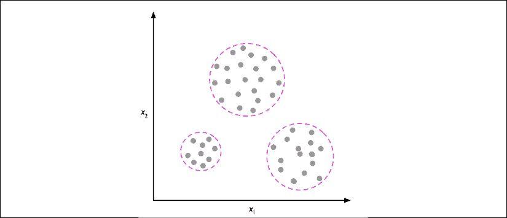
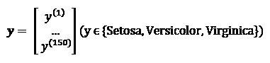

# 第一章：赋予计算机从数据中学习的能力

在我看来，**机器学习**，作为一种理解数据的算法应用与科学，是所有计算机科学领域中最令人兴奋的！我们正生活在一个数据充盈的时代；利用机器学习领域中的自我学习算法，我们可以将这些数据转化为知识。得益于近年来开发的许多强大的开源库，可能没有比现在更好的时机来进入机器学习领域，并学习如何利用强大的算法从数据中识别模式，并预测未来事件。

在本章中，你将学习机器学习的主要概念和不同类型的机器学习。结合对相关术语的基本介绍，我们将为成功使用机器学习技术解决实际问题奠定基础。

在本章中，我们将涵盖以下主题：

+   机器学习的通用概念

+   三种学习类型及基本术语

+   成功设计机器学习系统的构建模块

+   安装和设置Python用于数据分析和机器学习

# 构建智能机器，将数据转化为知识

在这个现代技术的时代，我们拥有一种丰富的资源：大量的结构化和非结构化数据。在20世纪下半叶，机器学习作为**人工智能**（**AI**）的一个子领域发展起来，涉及自我学习的算法，这些算法从数据中提取知识并进行预测。

机器学习提供了一种比要求人类手动从大量数据中推导规则和建立模型更高效的替代方案，通过捕获数据中的知识，逐步提高预测模型的性能，并做出基于数据的决策。

机器学习不仅在计算机科学研究中变得越来越重要，而且在我们日常生活中也扮演着越来越大的角色。得益于机器学习，我们享受着强大的电子邮件垃圾邮件过滤器、便捷的文本和语音识别软件、可靠的网页搜索引擎和具有挑战性的国际象棋程序。希望不久后，我们能将安全高效的自动驾驶汽车加入这个列表。此外，在医学应用方面也取得了显著进展；例如，研究人员证明深度学习模型能够以接近人类的准确性检测皮肤癌（[https://www.nature.com/articles/nature21056](https://www.nature.com/articles/nature21056)）。最近，DeepMind的研究人员通过深度学习预测3D蛋白质结构，首次超越了基于物理的传统方法（[https://deepmind.com/blog/alphafold/](https://deepmind.com/blog/alphafold/)）。

# 机器学习的三种不同类型

在本节中，我们将介绍三种类型的机器学习：**监督学习**、**无监督学习**和**强化学习**。我们将了解这三种不同学习类型之间的基本区别，并通过概念性示例，我们将理解它们可以应用于的实际问题领域：


## 用监督学习对未来进行预测

监督学习的主要目标是从标注好的训练数据中学习一个模型，使我们能够对未见过或未来的数据进行预测。在这里，“监督”一词指的是一组训练样本（数据输入），这些训练样本的目标输出信号（标签）已经知道。下图总结了一个典型的监督学习工作流程，其中标注好的训练数据被传递给机器学习算法，用于拟合一个预测模型，从而可以对新的、未标记的数据输入进行预测：


以电子邮件垃圾邮件过滤为例，我们可以使用监督学习算法在标注好的电子邮件语料库上训练一个模型，这些电子邮件已经正确地标记为垃圾邮件或非垃圾邮件，从而预测一封新邮件是否属于这两个类别之一。具有离散类别标签的监督学习任务，如之前的电子邮件垃圾邮件过滤示例，也被称为**分类任务**。监督学习的另一个子类别是**回归**，其中输出信号是一个连续值。

### 用于预测类别标签的分类

分类是监督学习的一个子类别，其目标是根据过去的观察来预测新实例的类别标签。这些类别标签是离散的、无序的值，可以理解为实例的组成员身份。之前提到的电子邮件垃圾邮件检测示例代表了一个典型的二分类任务，在这个任务中，机器学习算法学习一组规则，以区分两种可能的类别：垃圾邮件和非垃圾邮件。

以下图示说明了二分类任务的概念，给定30个训练样本；其中15个训练样本被标记为负类（减号），另外15个训练样本被标记为正类（加号）。在这种情况下，我们的数据集是二维的，这意味着每个样本有两个值与之相关：*x[1]* 和 *x[2]*。现在，我们可以使用监督学习算法来学习一个规则——决策边界，表示为虚线——它能够将这两个类别分开，并根据样本的 *x[1]* 和 *x[2]* 值将新数据分类到这两个类别中：


然而，类别标签集不必是二元的。监督学习算法学习到的预测模型可以将训练数据集中呈现的任何类别标签分配给新的、未标记的实例。

**多类分类**任务的一个典型例子是手写字符识别。我们可以收集一个训练数据集，其中包含每个字母的多个手写示例。字母（“A”，“B”，“C”等）将代表我们想要预测的不同无序类别或标签。现在，如果用户通过输入设备提供一个新的手写字符，我们的预测模型将能够以一定的准确度预测字母表中的正确字母。然而，如果这些数字（例如0到9之间的数字）没有出现在训练数据集中，我们的机器学习系统将无法正确识别它们。

### 用于预测连续结果的回归

我们在上一节中学到，分类任务是将类别化、无序的标签分配给实例。第二种类型的监督学习是预测连续的结果，也叫做**回归分析**。在回归分析中，我们给定若干个预测变量（**解释性变量**）和一个连续的响应变量（**结果**），然后尝试找到这些变量之间的关系，从而预测结果。

请注意，在机器学习领域，预测变量通常称为“特征”，响应变量通常被称为“目标变量”。本书中我们将采用这些约定。

例如，假设我们有兴趣预测学生的数学SAT成绩。如果学习考试的时间与最终成绩之间存在某种关系，我们可以利用这段时间作为训练数据，学习一个模型，该模型使用学习时间来预测未来计划参加此考试的学生的成绩。

**回归向均值**

“回归”这个术语是由弗朗西斯·高尔顿在他1886年的文章《*回归到平庸的遗传身高*》中提出的。高尔顿描述了这样一个生物现象：一个种群的身高方差随着时间的推移不会增加。

他观察到，父母的身高并没有遗传给孩子，而是孩子的身高会回归到种群的平均身高。

下图说明了线性回归的概念。给定一个特征变量 *x* 和目标变量 *y*，我们对这些数据拟合一条直线，使得数据点和拟合直线之间的距离——通常是平均平方距离——最小化。现在，我们可以利用从这些数据中学习到的截距和斜率来预测新数据的目标变量：


## 使用强化学习解决互动问题

另一种机器学习类型是**强化学习**。在强化学习中，目标是开发一个系统（**智能体**），该系统基于与环境的互动不断提升其表现。由于关于环境当前状态的信息通常也包括所谓的**奖励信号**，我们可以将强化学习视为与监督学习相关的领域。然而，在强化学习中，这种反馈不是正确的真实标签或值，而是通过奖励函数衡量行动效果的指标。通过与环境的互动，智能体可以使用强化学习来学习一系列行动，这些行动通过探索性的试错法或深思熟虑的规划来最大化奖励。

强化学习的一个常见例子是国际象棋引擎。在这个例子中，智能体根据棋盘的状态（即环境）决定一系列的棋步，而奖励可以定义为游戏结束时的**胜利**或**失败**：


强化学习有许多不同的子类型。然而，一般的框架是，强化学习中的智能体试图通过与环境的一系列互动来最大化奖励。每个状态都可以与正向或负向奖励相关联，奖励可以定义为实现一个整体目标，比如赢得或输掉一局国际象棋比赛。例如，在国际象棋中，每一步的结果可以看作是环境的一个不同状态。

进一步探讨国际象棋的例子，我们可以将访问棋盘上某些配置视为与更可能导致胜利的状态相关联——例如，移除对方的棋子或威胁对方的皇后。然而，其他位置则与更可能导致失败的状态相关联，比如在接下来的回合中失去棋子。现在，在国际象棋中，奖励（无论是赢得比赛的正奖励还是输掉比赛的负奖励）直到游戏结束时才会给出。此外，最终的奖励还将取决于对手的表现。例如，对手可能会牺牲皇后，但最终赢得比赛。

强化学习关注的是学习选择一系列能够最大化总奖励的行动，这些奖励可能在采取行动后立即获得，或通过*延迟*反馈获得。

## 使用无监督学习发现隐藏的结构

在监督学习中，我们在训练模型时已经知道正确的答案；在强化学习中，我们为代理执行的特定动作定义了奖励度量。然而，在无监督学习中，我们处理的是无标签数据或结构未知的数据。通过使用无监督学习技术，我们能够探索数据的结构，从中提取有意义的信息，而不依赖于已知的结果变量或奖励函数。

### 使用聚类找到子组

**聚类**是一种探索性数据分析技术，它允许我们将一堆信息组织成有意义的子组（**簇**），而不需要事先了解它们的组别。分析过程中产生的每个簇都定义了一组共享某种程度相似性的对象，但与其他簇中的对象更为不同，这也是为什么聚类有时被称为**无监督分类**的原因。聚类是一种很好的结构化信息的技术，可以从数据中推导出有意义的关系。例如，它可以帮助市场营销人员根据客户的兴趣发现客户群体，从而制定不同的营销方案。

下图展示了如何将聚类应用于将无标签数据根据其特征的相似性（*x[1]* 和 *x[2]*）组织成三个不同的组：



### 数据压缩的降维

无监督学习的另一个子领域是**降维**。我们常常处理的是高维数据——每个观察值都包含大量的测量值——这可能对有限的存储空间和机器学习算法的计算性能带来挑战。无监督降维是特征预处理中常用的一种方法，可以去除数据中的噪音，这些噪音可能会降低某些算法的预测性能，同时将数据压缩到一个较小的维度子空间，同时保留大部分相关信息。

有时候，降维也可以用于数据可视化；例如，某些高维特征集可以被投影到一维、二维或三维特征空间中，以便通过二维或三维散点图或直方图进行可视化。下图展示了一个例子，其中应用了非线性降维技术，将一个三维的瑞士卷数据压缩到新的二维特征子空间：


# 基本术语和符号介绍

现在我们已经讨论了机器学习的三大类别——监督学习、无监督学习和强化学习——接下来让我们看一下本书中将使用的基本术语。以下小节介绍了我们在谈到数据集的不同方面时常用的术语，以及用于更精确和高效沟通的数学符号。

由于机器学习是一个广泛且跨学科的领域，您很快就会遇到许多不同的术语，它们实际上指的是相同的概念。第二小节收集了机器学习文献中最常用的术语，这些术语在您阅读更多不同的机器学习文献时可能会作为参考部分对您有所帮助。

## 本书中使用的符号和约定

以下表格展示了Iris数据集的一个摘录，这是机器学习领域的经典例子。Iris数据集包含了来自三种不同物种——Setosa、Versicolor和Virginica的150朵鸢尾花的测量数据。在这里，每个花卉示例代表数据集中的一行，花卉的测量值（以厘米为单位）存储为列，我们也称这些为数据集的**特征**：


为了保持符号简洁而高效，我们将利用一些线性代数的基础知识。在接下来的章节中，我们将使用矩阵和向量的符号表示我们的数据。我们将遵循常用的约定，将每个示例表示为特征矩阵**X**中的一行，其中每个特征存储为一个单独的列。

由150个示例和四个特征组成的Iris数据集可以写成一个！[](img/B13208_01_001.png)矩阵，：


**符号约定**

在本书的其余部分，除非另有说明，我们将使用上标*i*来表示第*i*个训练示例，使用下标*j*来表示训练数据集的第*j*维度。

我们将使用小写粗体字母来表示向量！[](img/B13208_01_004.png)，大写粗体字母来表示矩阵！[](img/B13208_01_005.png)。若要表示向量或矩阵中的单个元素，我们将使用斜体字母（或，分别表示）。

例如，指的是花卉示例150的第一个维度，即*萼片长度*。因此，该特征矩阵中的每一行代表一个花卉实例，可以写成一个四维行向量，：


每个特征维度是一个150维的列向量，。例如：


类似地，我们将目标变量（在这里是类标签）存储为一个150维的列向量：



## 机器学习术语

机器学习是一个广阔的领域，也非常跨学科，因为它将许多来自其他研究领域的科学家聚集在一起。事实上，许多术语和概念已经被重新发现或重新定义，可能对你来说已经很熟悉，但以不同的名称出现。为了方便你，在以下列表中，你可以找到一些常见术语及其同义词，在阅读本书和一般机器学习文献时可能会派上用场：

+   训练示例：表示数据集的表中的一行，与观察值、记录、实例或样本同义（在大多数情况下，样本指的是一组训练示例）。

+   训练：模型拟合，对于类似于参数估计的参数化模型。

+   特征，缩写为 *x*：数据表或数据（设计）矩阵中的一列。与预测变量、输入、属性或协变量同义。

+   目标，缩写为 *y*：与结果、输出、响应变量、因变量、（类别）标签和真实标签同义。

+   损失函数：通常与 *成本* 函数同义。有时损失函数也称为 *错误* 函数。在某些文献中，“损失”一词指的是对单个数据点的损失，而成本是一个度量，它计算整个数据集上的损失（平均值或总和）。

# 构建机器学习系统的路线图

在前面的部分中，我们讨论了机器学习的基本概念和三种不同的学习类型。在这一部分，我们将讨论机器学习系统中伴随学习算法的其他重要部分。

下图展示了在预测建模中使用机器学习的典型工作流程，我们将在接下来的子章节中讨论：


## 数据预处理 – 使数据适配

让我们从讨论构建机器学习系统的路线图开始。原始数据很少以适合学习算法最佳性能的形式和结构出现。因此，数据预处理是任何机器学习应用中最关键的步骤之一。

如果我们以前面部分的鸢尾花数据集为例，我们可以将原始数据看作是一系列花卉图像，从中我们想要提取有意义的特征。有效的特征可能是花朵的颜色、色调和强度，或者花朵的高度、长度和宽度。

许多机器学习算法还要求所选特征在同一尺度上以实现最佳性能，这通常通过将特征转换到[0, 1]范围内或标准正态分布（均值为零，方差为单位）的方式来实现，正如我们将在后续章节中看到的那样。

一些选择的特征可能高度相关，因此在某种程度上是冗余的。在这种情况下，降维技术对于将特征压缩到较低维度的子空间是有用的。减少特征空间的维度具有以下优点：所需的存储空间较少，且学习算法可以运行得更快。在某些情况下，如果数据集包含大量无关特征（或噪声），降维还可以改善模型的预测性能；也就是说，如果数据集的信噪比低。

为了确定我们的机器学习算法不仅在训练数据集上表现良好，而且能够很好地泛化到新数据，我们还需要随机地将数据集划分为单独的训练集和测试集。我们使用训练集来训练和优化我们的机器学习模型，而在最后，我们保留测试集以评估最终的模型。

## 训练和选择预测模型

正如你将在后续章节中看到的那样，已经开发了许多不同的机器学习算法来解决不同的问题任务。从David Wolpert著名的*无免费午餐定理*中可以总结出一个重要的观点，那就是我们不能“免费”地进行学习（*学习算法之间缺乏先验区别*，D.H. Wolpert，1996；*优化的无免费午餐定理*，D.H. Wolpert和W.G. Macready，1997）。我们可以将这个概念与流行的说法相联系，"我想，如果你只有一把锤子，所有的东西都会看起来像钉子"（Abraham Maslow，1966）。例如，每个分类算法都有其固有的偏见，如果我们不对任务做任何假设，则没有一个单一的分类模型能在所有情况下占据优势。因此，在实践中，比较至少几个不同的算法以训练并选择表现最佳的模型是至关重要的。但在我们能够比较不同模型之前，首先必须决定一个衡量性能的标准。一种常用的衡量标准是分类准确率，它被定义为正确分类实例的比例。

一个合理的问题是：*如果我们不使用测试数据集来选择模型，而是将其保留用于最终的模型评估，那么我们如何知道哪个模型在最终测试数据集和真实世界数据上表现良好？* 为了解决这个问题，可以使用被总结为“交叉验证”的不同技术。在交叉验证中，我们将数据集进一步划分为训练集和验证集，以便估计模型的泛化性能。最后，我们也不能期望软件库提供的不同学习算法的默认参数对我们的特定问题任务是最优的。因此，我们将在后续章节中频繁使用超参数优化技术，以帮助我们微调模型的性能。

我们可以把这些超参数看作是模型的参数，它们不是从数据中学习到的，而是代表模型的控制按钮，我们可以调节它们来提高模型的性能。在后面的章节中，我们会通过实际的例子使这一点变得更加清晰。

## 评估模型并预测未见过的数据实例

在我们选择了一个已经在训练数据集上拟合的模型后，可以使用测试数据集来估计它在这些未见过的数据上的表现，从而估算所谓的泛化误差。如果我们对它的表现感到满意，我们就可以使用这个模型来预测新的未来数据。需要注意的是，之前提到的程序步骤中的参数（如特征缩放和降维）完全来源于训练数据集，并且这些相同的参数稍后会被重新应用于转换测试数据集以及任何新的数据实例——否则，在测试数据上的表现可能会过于乐观。

# 使用 Python 进行机器学习

Python 是数据科学中最受欢迎的编程语言之一，得益于其非常活跃的开发者和开源社区，已经开发出大量用于科学计算和机器学习的有用库。

尽管解释型语言（如 Python）在计算密集型任务中的性能不如低级编程语言，但已经开发出如 NumPy 和 SciPy 等扩展库，这些库建立在低层次的 Fortran 和 C 实现之上，以便在多维数组上进行快速的向量化操作。

对于机器学习编程任务，我们主要会参考 scikit-learn 库，这是目前最流行和易于访问的开源机器学习库之一。在后面的章节中，当我们专注于机器学习的一个子领域——深度学习时，我们将使用最新版本的 TensorFlow 库，它通过利用图形处理单元（GPU）非常高效地训练所谓的深度神经网络模型。

## 从 Python 包索引安装 Python 和软件包

Python 可用于所有三大主流操作系统——Microsoft Windows、macOS 和 Linux——安装程序及文档可以从官方 Python 网站下载：[https://www.python.org](https://www.python.org)。

本书适用于 Python 3.7 或更高版本，建议使用当前可用的最新 Python 3 版本。部分代码也可能与 Python 2.7 兼容，但由于 Python 2.7 的官方支持已于 2019 年结束，并且大多数开源库已停止对 Python 2.7 的支持（[https://python3statement.org](https://python3statement.org)），我们强烈建议使用 Python 3.7 或更新版本。

本书中使用的额外包可以通过 `pip` 安装程序进行安装，`pip` 自 Python 3.3 起成为 Python 标准库的一部分。更多关于 `pip` 的信息可以在 [https://docs.python.org/3/installing/index.html](https://docs.python.org/3/installing/index.html) 找到。

成功安装 Python 后，我们可以从终端执行 pip 来安装额外的 Python 包：

```py
pip install SomePackage 
```

已安装的包可以通过 `--upgrade` 标志进行更新：

```py
pip install SomePackage --upgrade 
```

## 使用 Anaconda Python 发行版和包管理器

推荐的科学计算 Python 发行版是 Continuum Analytics 提供的 Anaconda。Anaconda 是一个免费（包括商业用途）且企业级的 Python 发行版，集合了数据科学、数学和工程所需的所有核心 Python 包，且跨平台用户友好。Anaconda 安装程序可以从 [https://docs.anaconda.com/anaconda/install/](https://docs.anaconda.com/anaconda/install/) 下载，快速入门指南可以在 [https://docs.anaconda.com/anaconda/user-guide/getting-started/](https://docs.anaconda.com/anaconda/user-guide/getting-started/) 获取。

成功安装 Anaconda 后，我们可以使用以下命令安装新的 Python 包：

```py
conda install SomePackage 
```

可以使用以下命令更新现有的包：

```py
conda update SomePackage 
```

## 科学计算、数据科学和机器学习的相关包

在本书中，我们主要使用 NumPy 的多维数组来存储和处理数据。偶尔，我们会使用 pandas，这是一个基于 NumPy 构建的库，提供了更多高级的数据处理工具，使得处理表格数据变得更加方便。为了增强学习体验并可视化定量数据，我们将使用高度可定制的 Matplotlib 库，这对于理解数据非常有帮助。

本书中使用的主要 Python 包的版本号列在下方。请确保安装的包的版本号与这些版本号相等或更高，以确保代码示例能够正确运行：

+   NumPy 1.17.4

+   SciPy 1.3.1

+   scikit-learn 0.22.0

+   Matplotlib 3.1.0

+   pandas 0.25.3

# 总结

在本章中，我们以非常高的层次探讨了机器学习，并熟悉了我们将在接下来的章节中更详细探索的大致框架和主要概念。我们了解到，监督学习由两个重要的子领域组成：分类和回归。分类模型使我们能够将对象分类到已知类别中，而回归分析则帮助我们预测目标变量的连续结果。无监督学习不仅提供了有助于发现无标签数据结构的技术，还可以在特征预处理步骤中用于数据压缩。

我们简要地回顾了将机器学习应用于问题任务的典型路线图，接下来我们将以此为基础，在后续章节中进行更深入的讨论和实践示例。最后，我们设置了Python环境，并安装和更新了所需的包，为实际操作机器学习做好准备。

在本书的后续内容中，除了机器学习本身，我们还将介绍不同的数据集预处理技术，这将帮助你从不同的机器学习算法中获得最佳性能。尽管我们将贯穿全书详细讲解分类算法，我们也会探讨回归分析和聚类的不同技术。

我们即将开始一段令人兴奋的旅程，涵盖机器学习广阔领域中的许多强大技术。然而，我们将一步步地接触机器学习，在本书的各个章节中逐步构建我们的知识。在接下来的章节中，我们将通过实现最早的分类机器学习算法之一，开启这段旅程，为*第3章*，*使用scikit-learn探索机器学习分类器*做准备，届时我们将使用scikit-learn开源机器学习库，介绍更多高级的机器学习算法。
