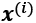
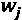
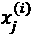
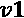
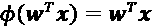
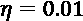
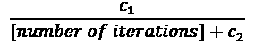

# 第二章：训练简单的机器学习分类算法

在本章中，我们将使用两种最早算法描述的机器学习分类算法：感知机和自适应线性神经元。我们将从头开始一步步实现感知机，并训练其在鸢尾花数据集上分类不同的花卉种类。这将帮助我们理解机器学习分类算法的概念，以及如何高效地在Python中实现它们。

通过使用自适应线性神经元讨论优化基础，将为在*第3章*《使用scikit-learn的机器学习分类器之旅》中使用更复杂的分类器奠定基础。

本章我们将涵盖的主题如下：

+   建立对机器学习算法的理解

+   使用pandas、NumPy和Matplotlib读取、处理和可视化数据

+   在Python中实现线性分类算法

# 人工神经元——机器学习早期历史的简要回顾

在我们更详细地讨论感知机及相关算法之前，让我们简要回顾一下机器学习的起源。为了理解生物大脑的工作原理，以设计人工智能（AI），沃伦·麦卡洛克和沃尔特·皮茨于1943年首次提出了简化版脑细胞的概念，即所谓的**麦卡洛克-皮茨**（**MCP**）神经元（《神经活动中固有思想的逻辑演算》，*W. S. McCulloch* 和 *W. Pitts*，*数学生物物理学公报*，5(4)：115-133，*1943*）。生物神经元是大脑中互相连接的神经细胞，参与处理和传递化学和电信号，如下图所示：


麦卡洛克和皮茨将这种神经细胞描述为一个具有二进制输出的简单逻辑门；多个信号通过树突到达细胞体，然后它们被整合，如果累积的信号超过某个阈值，则会生成一个输出信号，并通过轴突传递出去。

几年后，弗兰克·罗森布拉特基于MCP神经元模型提出了感知机学习规则的第一个概念（《感知机：一个感知和识别的自动机》，*F. Rosenblatt*，*康奈尔航空实验室*，*1957*）。通过他的感知机规则，罗森布拉特提出了一种算法，能够自动学习最优的权重系数，这些权重系数随后会与输入特征相乘，以决定神经元是否发火（传递信号）。在监督学习和分类的背景下，这样的算法可以用来预测一个新的数据点是否属于某一类别。

## 人工神经元的正式定义

更正式地说，我们可以将**人工神经元**的概念置于二分类任务的背景下，简化为我们称之为*1*（正类）和*–1*（负类）的两个类别。然后我们可以定义一个决策函数（！[](img/B13208_02_001.png)），它取某些输入值*x*和相应的权重向量*w*的线性组合，其中*z*是所谓的净输入！[](img/B13208_02_002.png)：


现在，如果某个特定示例的净输入！[](img/B13208_02_004.png)大于定义的阈值！[](img/B13208_02_005.png)，我们预测类别*1*，否则预测类别*–1*。在感知机算法中，决策函数！[](img/B13208_02_006.png)是一个**单位阶跃函数**的变体：


为了简化，我们可以将阈值！[](img/B13208_02_008.png)移到方程的左侧，并定义一个权重零为！[](img/B13208_02_009.png)和！[](img/B13208_02_010.png)，这样我们可以用更简洁的形式表示*z*：


以及：


在机器学习文献中，负阈值或权重！[](img/B13208_02_013.png)通常称为**偏置单元**。

**线性代数基础：点积和矩阵转置**

在接下来的部分中，我们将经常使用线性代数中的基本符号。例如，我们将通过向量点积来简化*x*和*w*值的乘积之和，而上标*T*表示转置，这是一个将列向量转换为行向量，反之亦然的操作：


例如：


此外，转置操作也可以应用于矩阵，以沿其对角线进行反射，例如：


请注意，转置操作严格来说只对矩阵定义；然而，在机器学习的上下文中，当我们使用“向量”一词时，我们指的是！[](img/B13208_02_017.png)或！[](img/B13208_02_018.png)矩阵。

在本书中，我们将只使用线性代数中的非常基础的概念；但是，如果你需要快速回顾，请查看Zico Kolter的优秀作品《线性代数复习与参考》，该书可以在[http://www.cs.cmu.edu/~zkolter/course/linalg/linalg_notes.pdf](http://www.cs.cmu.edu/~zkolter/course/linalg/linalg_notes.pdf)免费获取。

下图展示了净输入！[](img/B13208_02_019.png)是如何通过感知机的决策函数（左图）被压缩成二进制输出（–1 或 1），以及它如何用于区分**两个线性可分的类别**（右图）：


## 感知机学习规则

MCP 神经元和 Rosenblatt 的 *阈值* 感知机模型的核心思想是采用还原主义的方法来模拟大脑中单个神经元的工作方式：它要么 *发放* 信号，要么不发放。因此，Rosenblatt 最初的感知机规则相当简单，感知机算法可以通过以下步骤总结：

1.  初始化权重为 0 或小的随机数。

1.  对于每个训练样本，：

    1.  计算输出值，。

    1.  更新权重。

在这里，输出值是由我们之前定义的单位阶跃函数预测的类别标签，同时，权重向量中的每个权重（）也会更新，*w* 的更新可以更正式地写作：


（或  的变化）的更新值，我们称之为 ，是通过感知机学习规则计算的，如下所示：


其中， 是 **学习率**（通常是介于 0.0 和 1.0 之间的常数）， 是第 *i* 个训练样本的 **真实类别标签**，而  是 **预测的类别标签**。需要注意的是，权重向量中的所有权重是同时更新的，这意味着在通过各自的更新值（）更新所有权重之前，我们不会重新计算预测标签（）。具体来说，对于一个二维数据集，我们将这样写出更新公式：


在我们实现感知机规则之前，让我们通过一个简单的思想实验，来阐明这个学习规则的简洁性。在感知机正确预测类别标签的两个场景中，由于更新值为 0，权重保持不变：

(1) 

(2) 

然而，在预测错误的情况下，权重会朝着正类或负类目标的方向调整：

(3) 

(4) 

为了更好地理解乘法因子，，让我们通过另一个简单的例子来分析，其中：


假设 ，并且我们错误地将该样本分类为 *–1*。在这种情况下，我们会将相应的权重增加 1，以便下次遇到该样本时，净输入（）会更为正向，从而更有可能超过单位阶跃函数的阈值，预测该样本为 *+1*：


权重更新与的值成正比。例如，如果我们有另一个示例，它被错误地分类为 *–1*，我们将会推动决策边界进一步调整，以便下次正确地分类此示例：


需要注意的是，感知机的收敛性只有在两个类别线性可分并且学习率足够小的情况下才能得到保证（感兴趣的读者可以在我的讲义中找到数学证明：[https://sebastianraschka.com/pdf/lecture-notes/stat479ss19/L03_perceptron_slides.pdf](https://sebastianraschka.com/pdf/lecture-notes/stat479ss19/L03_perceptron_slides.pdf)）。如果两个类别不能通过线性决策边界分开，我们可以设置一个最大遍历次数（**epochs**）和/或一个容忍误分类的阈值——否则，感知机将永远不会停止更新权重：


**下载示例代码**

如果你是直接从Packt购买这本书，你可以从你的账户下载示例代码文件，访问[http://www.packtpub.com](http://www.packtpub.com)。如果你是从其他地方购买的这本书，你可以直接从[https://github.com/rasbt/python-machine-learning-book-3rd-edition](https://github.com/rasbt/python-machine-learning-book-3rd-edition)下载所有代码示例和数据集。

现在，在我们进入下一节的实现之前，你刚刚学到的内容可以通过一个简单的图示来总结，这个图示展示了感知机的基本概念：


上面的图示说明了感知机如何接收一个示例的输入**x**，并将其与权重**w**结合来计算净输入。净输入然后传递给阈值函数，该函数生成一个二进制输出——–1 或 +1——即该示例的预测类别标签。在学习阶段，这个输出用于计算预测的误差，并更新权重。

# 在Python中实现感知机学习算法

在上一节中，我们学习了Rosenblatt感知机规则的工作原理；现在让我们在Python中实现它，并将其应用于我们在*第1章*《让计算机从数据中学习》介绍的Iris数据集。

## 面向对象的感知机API

我们将采用面向对象的方法来定义感知机接口作为Python类，这将允许我们初始化新的`Perceptron`对象，这些对象可以通过`fit`方法从数据中学习，并通过单独的`predict`方法进行预测。作为一种约定，我们将下划线（`_`）附加到那些在对象初始化时没有创建但通过调用对象的其他方法来创建的属性上，例如`self.w_`。

**Python科学计算栈的额外资源**

如果你还不熟悉 Python 的科学库，或者需要复习一下，请参考以下资源：

+   **NumPy**: [https://sebastianraschka.com/pdf/books/dlb/appendix_f_numpy-intro.pdf](https://sebastianraschka.com/pdf/books/dlb/appendix_f_numpy-intro.pdf)

+   **pandas**: [https://pandas.pydata.org/pandas-docs/stable/10min.html](https://pandas.pydata.org/pandas-docs/stable/10min.html)

+   **Matplotlib**: [https://matplotlib.org/tutorials/introductory/usage.html](https://matplotlib.org/tutorials/introductory/usage.html)

以下是一个感知机在 Python 中的实现：

```py
import numpy as np
class Perceptron(object):
    """Perceptron classifier.

    Parameters
    ------------
    eta : float
      Learning rate (between 0.0 and 1.0)
    n_iter : int
      Passes over the training dataset.
    random_state : int
      Random number generator seed for random weight 
      initialization.

    Attributes
    -----------
    w_ : 1d-array
      Weights after fitting.
    errors_ : list
      Number of misclassifications (updates) in each epoch.

    """
    def __init__(self, eta=0.01, n_iter=50, random_state=1):
        self.eta = eta
        self.n_iter = n_iter
        self.random_state = random_state

    def fit(self, X, y):
        """Fit training data.

        Parameters
        ----------
        X : {array-like}, shape = [n_examples, n_features]
          Training vectors, where n_examples is the number of 
          examples and n_features is the number of features.
        y : array-like, shape = [n_examples]
          Target values.

        Returns
        -------
        self : object

        """
        rgen = np.random.RandomState(self.random_state)
        self.w_ = rgen.normal(loc=0.0, scale=0.01,
                              size=1 + X.shape[1])
        self.errors_ = []

        for _ in range(self.n_iter):
            errors = 0
            for xi, target in zip(X, y):
                update = self.eta * (target - self.predict(xi))
                self.w_[1:] += update * xi
                self.w_[0] += update
                errors += int(update != 0.0)
            self.errors_.append(errors)
        return self

    def net_input(self, X):
        """Calculate net input"""
        return np.dot(X, self.w_[1:]) + self.w_[0]

    def predict(self, X):
        """Return class label after unit step"""
        return np.where(self.net_input(X) >= 0.0, 1, -1) 
```

使用这个感知机实现，我们现在可以初始化具有给定学习率 `eta` 和迭代次数 `n_iter`（训练数据集的遍历次数）的新 `Perceptron` 对象。

通过 `fit` 方法，我们将 `self.w_` 中的权重初始化为一个向量，，其中 *m* 代表数据集中的维度（特征）数量，我们为该向量中的第一个元素添加 *1*，表示偏置单元。记住，这个向量中的第一个元素 `self.w_[0]` 代表我们之前讨论过的所谓偏置单元。

另外请注意，这个向量包含从正态分布中抽取的小随机数，标准差为 0.01，通过`rgen.normal(loc=0.0, scale=0.01, size=1 + X.shape[1])`生成，其中 `rgen` 是一个 NumPy 随机数生成器，我们为其指定了一个用户定义的随机种子，以便在需要时能够重现之前的结果。

需要记住的是，我们不将权重初始化为零，因为只有当权重初始化为非零值时，学习率  (`eta`) 才会影响分类结果。如果所有权重都初始化为零，那么学习率参数 `eta` 只会影响权重向量的规模，而不是方向。如果你熟悉三角学，考虑一个向量 ，其中  和一个向量  之间的夹角将恰好为零，以下代码片段演示了这一点：

```py
>>> v1 = np.array([1, 2, 3])
>>> v2 = 0.5 * v1
>>> np.arccos(v1.dot(v2) / (np.linalg.norm(v1) *
...           np.linalg.norm(v2)))
0.0 
```

在这里，`np.arccos` 是三角函数的反余弦，`np.linalg.norm` 是一个计算向量长度的函数（我们选择从正态分布中抽取随机数，而不是从均匀分布中抽取，且标准差为 `0.01` 是任意的；记住，我们只是希望得到小的随机值，以避免前面讨论的全零向量的特性）。

**NumPy 数组索引**

NumPy 对一维数组的索引方式类似于 Python 列表，使用方括号 (`[]`) 表示法。对于二维数组，第一个索引表示行号，第二个索引表示列号。例如，我们可以使用 `X[2, 3]` 来选择二维数组 `X` 的第三行和第四列。

在初始化权重之后，`fit`方法会遍历训练数据集中的所有单个样本，并根据我们在上一节中讨论的感知机学习规则更新权重。

类别标签由`predict`方法预测，该方法在训练过程中通过`fit`方法调用，以获取权重更新的类别标签；但是，`predict`也可以在我们拟合模型后用来预测新数据的类别标签。此外，我们还在`self.errors_`列表中收集每个时代的误分类数，以便稍后分析我们的感知机在训练过程中的表现。`net_input`方法中使用的`np.dot`函数简单地计算向量点积，。

我们可以用纯Python通过`sum([i * j for i, j in zip(a, b)])`来计算两个数组`a`和`b`的点积，而不是使用NumPy的`a.dot(b)`或`np.dot(a, b)`。然而，使用NumPy而不是经典的Python for循环结构的优势在于它的算术运算是矢量化的。**矢量化**意味着一个元素级别的算术运算会自动应用到数组中的所有元素。通过将我们的算术运算表示为数组上的一系列指令，而不是对每个元素执行一组操作，我们可以更好地利用现代中央处理单元（CPU）架构，尤其是支持**单指令、多数据**（**SIMD**）的架构。此外，NumPy还使用了高度优化的线性代数库，如**基本线性代数子程序**（**BLAS**）和**线性代数包**（**LAPACK**），这些库是用C或Fortran编写的。最后，NumPy还允许我们通过使用线性代数的基础知识，如向量和矩阵点积，编写更紧凑和直观的代码。

## 在鸢尾花数据集上训练感知机模型

为了测试我们的感知机实现，接下来的分析和示例将仅限于使用两个特征变量（维度）。尽管感知机规则不限于二维，考虑仅使用花萼长度和花瓣长度这两个特征将帮助我们在学习过程中通过散点图可视化训练模型的决策区域。

请注意，出于实际考虑，我们将只考虑鸢尾花数据集中的两类花卉——Setosa和Versicolor——记住，感知机是一个二分类器。然而，感知机算法可以扩展到多分类问题——例如，**一对多**（**OvA**）技术。

**多分类的OvA方法**

OvA，有时也被称为**一对多**（**OvR**），是一种技术，允许我们将任何二分类器扩展到多类问题。使用OvA，我们可以为每个类训练一个分类器，其中特定类被视为正类，所有其他类的样本被视为负类。如果我们要对一个新的、未标记的数据实例进行分类，我们将使用我们的*n*个分类器，其中*n*是类标签的数量，并将具有最高置信度的类标签分配给我们要分类的特定实例。在感知机的情况下，我们将使用OvA选择与最大绝对净输入值关联的类标签。

首先，我们将使用`pandas`库直接从*UCI机器学习库*加载Iris数据集到一个`DataFrame`对象中，并通过`tail`方法打印最后五行，以检查数据是否正确加载：

```py
>>> import os
>>> import pandas as pd
>>> s = os.path.join('https://archive.ics.uci.edu', 'ml',
...                  'machine-learning-databases',
...                  'iris','iris.data')
>>> print('URL:', s)
URL: https://archive.ics.uci.edu/ml/machine-learning-databases/iris/iris.data
>>> df = pd.read_csv(s,
...                  header=None,
...                  encoding='utf-8')
>>> df.tail() 
```


**加载Iris数据集**

你可以在本书的代码包中找到一份Iris数据集的副本（以及本书中使用的所有其他数据集），如果你在离线工作或者UCI服务器（[https://archive.ics.uci.edu/ml/machine-learning-databases/iris/iris.data](https://archive.ics.uci.edu/ml/machine-learning-databases/iris/iris.data)）暂时无法访问时，可以使用该副本。例如，要从本地目录加载Iris数据集，你可以将这一行替换为：

```py
df = pd.read_csv(
  'https://archive.ics.uci.edu/ml/'
  'machine-learning-databases/iris/iris.data',
  header=None, encoding='utf-8') 
```

使用以下代码：

```py
df = pd.read_csv(
  'your/local/path/to/iris.data',
  header=None, encoding='utf-8') 
```

接下来，我们提取前100个类标签，这些标签对应50个Iris-setosa花和50个Iris-versicolor花，并将类标签转换为两个整数类标签`1`（versicolor）和`-1`（setosa），我们将它们赋值给向量`y`，其中pandas `DataFrame`的`values`方法返回相应的NumPy表示。

同样，我们提取这100个训练样本的第一个特征列（花萼长度）和第三个特征列（花瓣长度），并将它们赋值给特征矩阵`X`，我们可以通过二维散点图进行可视化：

```py
>>> import matplotlib.pyplot as plt
>>> import numpy as np
>>> # select setosa and versicolor
>>> y = df.iloc[0:100, 4].values
>>> y = np.where(y == 'Iris-setosa', -1, 1)
>>> # extract sepal length and petal length
>>> X = df.iloc[0:100, [0, 2]].values
>>> # plot data
>>> plt.scatter(X[:50, 0], X[:50, 1],
...             color='red', marker='o', label='setosa')
>>> plt.scatter(X[50:100, 0], X[50:100, 1],
...             color='blue', marker='x', label='versicolor')
>>> plt.xlabel('sepal length [cm]')
>>> plt.ylabel('petal length [cm]')
>>> plt.legend(loc='upper left')
>>> plt.show() 
```

执行前面的代码示例后，我们现在应该看到以下散点图：


上面的散点图显示了Iris数据集中花卉样本沿两个特征轴的分布：花瓣长度和花萼长度（以厘米为单位）。在这个二维特征子空间中，我们可以看到，线性决策边界应该足以将Setosa花与Versicolor花分开。

因此，像感知机这样的线性分类器应该能够完美地对该数据集中的花进行分类。

现在，到了训练我们的感知机算法的时候了，我们将使用刚刚提取的Iris数据子集。此外，我们还将绘制每个epoch的误分类错误，以检查算法是否收敛，并找到分离两个Iris花类的决策边界：

```py
>>> ppn = Perceptron(eta=0.1, n_iter=10)
>>> ppn.fit(X, y)
>>> plt.plot(range(1, len(ppn.errors_) + 1),
...          ppn.errors_, marker='o')
>>> plt.xlabel('Epochs')
>>> plt.ylabel('Number of updates')
>>> plt.show() 
```

执行前述代码后，我们应该能看到误分类错误与迭代次数的关系图，如下图所示：


如我们在前面的图中所见，我们的感知机在第六次迭代后收敛，现在应该能够完美地分类训练样本。让我们实现一个小的便捷函数，来可视化二维数据集的决策边界：

```py
from matplotlib.colors import ListedColormap
def plot_decision_regions(X, y, classifier, resolution=0.02):
    # setup marker generator and color map
    markers = ('s', 'x', 'o', '^', 'v')
    colors = ('red', 'blue', 'lightgreen', 'gray', 'cyan')
    cmap = ListedColormap(colors[:len(np.unique(y))])

    # plot the decision surface
    x1_min, x1_max = X[:, 0].min() - 1, X[:, 0].max() + 1
    x2_min, x2_max = X[:, 1].min() - 1, X[:, 1].max() + 1
    xx1, xx2 = np.meshgrid(np.arange(x1_min, x1_max, resolution),
                           np.arange(x2_min, x2_max, resolution))
    Z = classifier.predict(np.array([xx1.ravel(), xx2.ravel()]).T)
    Z = Z.reshape(xx1.shape)
    plt.contourf(xx1, xx2, Z, alpha=0.3, cmap=cmap)
    plt.xlim(xx1.min(), xx1.max())
    plt.ylim(xx2.min(), xx2.max())

    # plot class examples
    for idx, cl in enumerate(np.unique(y)):
         plt.scatter(x=X[y == cl, 0],
                     y=X[y == cl, 1],
                     alpha=0.8,
                     c=colors[idx],
                     marker=markers[idx],
                     label=cl,
                     edgecolor='black') 
```

首先，我们定义一些`colors`和`markers`，并通过`ListedColormap`从颜色列表中创建一个颜色映射。然后，我们确定两个特征的最小值和最大值，并利用这些特征向量通过NumPy的`meshgrid`函数创建一对网格数组`xx1`和`xx2`。由于我们在两个特征维度上训练了感知机分类器，我们需要将网格数组展平，并创建一个具有与鸢尾花训练子集相同列数的矩阵，以便我们可以使用`predict`方法预测相应网格点的类别标签`Z`。

在将预测的类别标签`Z`重新塑形为与`xx1`和`xx2`相同维度的网格后，我们可以通过Matplotlib的`contourf`函数绘制一个等高线图，将不同的决策区域映射到网格数组中每个预测类别的不同颜色：

```py
>>> plot_decision_regions(X, y, classifier=ppn)
>>> plt.xlabel('sepal length [cm]')
>>> plt.ylabel('petal length [cm]')
>>> plt.legend(loc='upper left')
>>> plt.show() 
```

执行上述代码示例后，我们现在应该能够看到决策区域的图示，如下图所示：


如我们在图中所见，感知机学到了一个决策边界，能够完美地分类所有鸢尾花训练子集中的样本。

**感知机收敛性**

尽管感知机能够完美地分类两个鸢尾花类别，但收敛性是感知机面临的最大问题之一。Rosenblatt通过数学证明，如果两个类别可以通过线性超平面分隔，感知机学习规则是会收敛的。然而，如果这些类别无法通过这样的线性决策边界完美分隔，权重将永远不会停止更新，除非我们设置最大迭代次数。感兴趣的读者可以在我的讲义中找到该证明的摘要，地址是[https://sebastianraschka.com/pdf/lecture-notes/stat479ss19/L03_perceptron_slides.pdf](https://sebastianraschka.com/pdf/lecture-notes/stat479ss19/L03_perceptron_slides.pdf)。

# 自适应线性神经元和学习的收敛性

在这一部分，我们将了解另一种类型的单层神经网络（NN）：**自适应线性神经元**（**Adaline**）。Adaline是由Bernard Widrow和他的博士生Tedd Hoff在Rosenblatt的感知机算法发布几年后提出的，可以看作是对感知机的改进（*An Adaptive "Adaline" Neuron Using Chemical "Memistors"*, *技术报告编号1553-2, B. Widrow及其他人*, *斯坦福电子实验室*, 斯坦福，加利福尼亚州，*1960年10月*）。

Adaline 算法特别有趣，因为它展示了定义和最小化连续成本函数的关键概念。这为理解更高级的机器学习分类算法奠定了基础，如逻辑回归、支持向量机和回归模型，我们将在未来的章节中讨论这些内容。

Adaline 规则（也称为**Widrow-Hoff 规则**）与 Rosenblatt 的感知机之间的关键区别在于，权重是基于线性激活函数更新的，而不是像感知机那样基于单位阶跃函数。在 Adaline 中，这个线性激活函数，，仅仅是净输入的恒等函数，因此：



虽然线性激活函数用于学习权重，但我们仍然使用阈值函数进行最终预测，这与我们之前讨论的单位阶跃函数相似。

感知机与 Adaline 算法之间的主要区别在下图中得到了突出显示：


如图所示，Adaline 算法将真实类别标签与线性激活函数的连续值输出进行比较，以计算模型误差并更新权重。相比之下，感知机将真实类别标签与预测的类别标签进行比较。

## 使用梯度下降最小化成本函数

监督式机器学习算法的关键组成部分之一是一个定义好的**目标函数**，该函数将在学习过程中进行优化。这个目标函数通常是我们希望最小化的成本函数。在 Adaline 的情况下，我们可以定义成本函数 *J*，以学习权重为目标，作为计算结果与真实类别标签之间的**平方误差之和**（**SSE**）：


术语  仅为我们的方便而加上，它将使我们更容易推导出成本或损失函数关于权重参数的梯度，正如我们将在下面的段落中看到的那样。与单位阶跃函数相比，这个连续的线性激活函数的主要优点是成本函数变得可微分。这个成本函数的另一个优良性质是它是凸的；因此，我们可以使用一种非常简单却强大的优化算法，称为**梯度下降**，来找到最小化我们成本函数的权重，从而对 Iris 数据集中的样本进行分类。

如下图所示，我们可以将梯度下降的主要思想描述为*爬山*，直到达到局部或全局成本最小值。在每次迭代中，我们都会朝着梯度的相反方向迈出一步，其中步长由学习率的值以及梯度的坡度决定：


使用梯度下降法，我们现在可以通过在成本函数的梯度！[](img/B13208_02_058.png)的相反方向上采取一步来更新权重！[](img/B13208_02_059.png)：


权重变化！[](img/B13208_02_061.png)定义为负梯度乘以学习率！[](img/B13208_02_062.png)：


为了计算成本函数的梯度，我们需要计算成本函数相对于每个权重的偏导数！[](img/B13208_02_064.png)：


所以我们可以写出权重！[](img/B13208_02_066.png)的更新公式：


由于我们同时更新所有权重，我们的Adaline学习规则变成了：


**平方误差导数**

如果你熟悉微积分，SSE成本函数相对于第*j*个权重的偏导数可以通过以下方式得到：


尽管Adaline学习规则看起来与感知机规则相同，我们应该注意到！[](img/B13208_02_075.png)与！[](img/B13208_02_076.png)是实数而非整数类别标签。此外，权重更新是基于训练数据集中的所有样本计算的（而不是在每个训练样本后增量更新权重），这就是为什么这种方法也被称为**批量梯度下降**。

## 在Python中实现Adaline

由于感知机规则和Adaline非常相似，我们将采用之前定义的感知机实现，并修改`fit`方法，使得权重通过梯度下降法最小化成本函数来更新：

```py
class AdalineGD(object):
    """ADAptive LInear NEuron classifier.

    Parameters
    ------------
    eta : float
        Learning rate (between 0.0 and 1.0)
    n_iter : int
        Passes over the training dataset.
    random_state : int
        Random number generator seed for random weight initialization.

    Attributes
    -----------
    w_ : 1d-array
        Weights after fitting.
    cost_ : list
        Sum-of-squares cost function value in each epoch.

    """
    def __init__(self, eta=0.01, n_iter=50, random_state=1):
        self.eta = eta
        self.n_iter = n_iter
        self.random_state = random_state

    def fit(self, X, y):
        """ Fit training data.

        Parameters
        ----------
        X : {array-like}, shape = [n_examples, n_features]
            Training vectors, where n_examples
            is the number of examples and
            n_features is the number of features.
        y : array-like, shape = [n_examples]
            Target values.

        Returns
        -------
        self : object

        """
        rgen = np.random.RandomState(self.random_state)
        self.w_ = rgen.normal(loc=0.0, scale=0.01,
                              size=1 + X.shape[1])
        self.cost_ = []

        for i in range(self.n_iter):
            net_input = self.net_input(X)
            output = self.activation(net_input)
            errors = (y - output)
            self.w_[1:] += self.eta * X.T.dot(errors)
            self.w_[0] += self.eta * errors.sum()
            cost = (errors**2).sum() / 2.0
            self.cost_.append(cost)
        return self

    def net_input(self, X):
        """Calculate net input"""
        return np.dot(X, self.w_[1:]) + self.w_[0]

    def activation(self, X):
        """Compute linear activation"""
        return X

    def predict(self, X):
        """Return class label after unit step"""
        return np.where(self.activation(self.net_input(X))
                        >= 0.0, 1, -1) 
```

不像感知机在评估每个训练样本后更新权重，我们通过`self.eta * errors.sum()`来计算偏置单元（零权重）的梯度，使用`self.eta * X.T.dot(errors)`计算权重1到*m*的梯度，其中`X.T.dot(errors)`是特征矩阵与误差向量的矩阵-向量乘法。

请注意，`activation`方法在代码中没有效果，因为它只是一个恒等函数。在这里，我们添加了激活函数（通过`activation`方法计算）以说明单层神经网络中信息流动的一般概念：从输入数据的特征、净输入、激活到输出。

在下一章中，我们将学习使用非恒等、非线性激活函数的逻辑回归分类器。我们将看到逻辑回归模型与Adaline密切相关，唯一的区别是它的激活函数和成本函数。

现在，与之前的感知机实现类似，我们将成本值收集到 `self.cost_` 列表中，以检查算法在训练后是否已经收敛。

**矩阵乘法**

执行矩阵乘法类似于计算向量点积，其中矩阵中的每一行都被视为一个单独的行向量。这种向量化的方法代表了更紧凑的符号，并且使用 NumPy 可以实现更高效的计算。例如：


请注意，在前面的方程中，我们正在将矩阵与向量相乘，这在数学上是未定义的。然而，请记住，我们使用的约定是，将前面的向量视为一个  矩阵。

在实际应用中，通常需要一些实验来找到一个合适的学习率，，以实现最佳的收敛。因此，我们先选择两个不同的学习率， 和 ，并绘制成本函数与迭代次数的关系图，以观察 Adaline 实现从训练数据中学习的效果。

**感知机超参数**

学习率 （`eta`），以及迭代次数（`n_iter`）是感知机和 Adaline 学习算法的超参数（或调节参数）。在 *第六章*，*模型评估和超参数调优的最佳实践* 中，我们将探讨不同的技术，以自动找到能够实现分类模型最佳性能的超参数值。

现在，让我们绘制两个不同学习率的成本与迭代次数的关系图：

```py
>>> fig, ax = plt.subplots(nrows=1, ncols=2, figsize=(10, 4))
>>> ada1 = AdalineGD(n_iter=10, eta=0.01).fit(X, y)
>>> ax[0].plot(range(1, len(ada1.cost_) + 1),
...            np.log10(ada1.cost_), marker='o')
>>> ax[0].set_xlabel('Epochs')
>>> ax[0].set_ylabel('log(Sum-squared-error)')
>>> ax[0].set_title('Adaline - Learning rate 0.01')
>>> ada2 = AdalineGD(n_iter=10, eta=0.0001).fit(X, y)
>>> ax[1].plot(range(1, len(ada2.cost_) + 1),
...            ada2.cost_, marker='o')
>>> ax[1].set_xlabel('Epochs')
>>> ax[1].set_ylabel('Sum-squared-error')
>>> ax[1].set_title('Adaline - Learning rate 0.0001')
>>> plt.show() 
```

正如我们在成本函数图中看到的那样，我们遇到了两种不同类型的问题。左侧图表显示了如果我们选择一个过大的学习率可能会发生的情况。由于我们 *越过* 了全局最小值，每个迭代中的误差变得更大，而不是最小化成本函数。另一方面，我们可以看到右侧图表中的成本在下降，但所选择的学习率  太小，以至于算法需要大量的迭代才能收敛到全局成本最小值。


下图说明了如果我们改变某个特定权重参数的值来最小化成本函数 *J* 可能发生的情况。左侧子图展示了选择合适学习率的情况，其中成本逐渐下降，朝着全局最小值的方向移动。

然而，右侧子图说明了如果我们选择一个过大的学习率会发生什么——我们会越过全局最小值：


## 通过特征缩放来改进梯度下降

本书中我们将遇到的许多机器学习算法需要某种特征缩放来实现最佳性能，关于这一点我们将在*第3章*《使用scikit-learn的机器学习分类器巡礼》和*第4章*《构建良好的训练数据集——数据预处理》中详细讨论。

梯度下降是许多从特征缩放中受益的算法之一。在本节中，我们将使用一种名为**标准化**的特征缩放方法，它赋予我们的数据标准正态分布的特性：零均值和单位方差。这个归一化过程有助于梯度下降学习更快地收敛；然而，它并不会使原始数据集变为正态分布。标准化将每个特征的均值平移，使其居中于零，并且每个特征的标准差为1（单位方差）。例如，为了标准化第*j*个特征，我们可以简单地从每个训练样本中减去样本均值，并将其除以标准差：


这里，是一个由所有训练示例的第*j*个特征值构成的向量，*n*，该标准化技术应用于数据集中的每个特征*j*。

标准化有助于梯度下降学习的原因之一是，优化器需要经过更少的步骤来找到一个好的或最优的解决方案（全局成本最小值），如下图所示，其中子图表示在一个二维分类问题中，成本面作为两个模型权重的函数：


标准化可以通过使用内置的NumPy方法`mean`和`std`轻松实现：

```py
>>> X_std = np.copy(X)
>>> X_std[:,0] = (X[:,0] - X[:,0].mean()) / X[:,0].std()
>>> X_std[:,1] = (X[:,1] - X[:,1].mean()) / X[:,1].std() 
```

标准化之后，我们将再次训练Adaline，并会看到它在少数几个epoch后使用学习率就收敛了：

```py
>>> ada_gd = AdalineGD(n_iter=15, eta=0.01)
>>> ada_gd.fit(X_std, y)
>>> plot_decision_regions(X_std, y, classifier=ada_gd)
>>> plt.title('Adaline - Gradient Descent')
>>> plt.xlabel('sepal length [standardized]')
>>> plt.ylabel('petal length [standardized]')
>>> plt.legend(loc='upper left')
>>> plt.tight_layout()
>>> plt.show()
>>> plt.plot(range(1, len(ada_gd.cost_) + 1),
...          ada_gd.cost_, marker='o')
>>> plt.xlabel('Epochs')
>>> plt.ylabel('Sum-squared-error')
>>> plt.tight_layout()
>>> plt.show() 
```

执行此代码后，我们应该看到决策区域的图形，以及下降成本的图表，如下图所示：


正如我们在图表中看到的，Adaline在使用学习率对标准化特征进行训练后已收敛。然而，注意尽管所有的花卉示例都已正确分类，SSE仍然不为零。

## 大规模机器学习和随机梯度下降

在前一部分中，我们学习了如何通过朝着代价梯度的相反方向迈出一步来最小化代价函数，该代价梯度是从整个训练数据集中计算得出的；因此，这种方法有时也被称为**批量梯度下降**。现在假设我们有一个非常大的数据集，其中包含数百万个数据点，这在许多机器学习应用中并不罕见。在这种情况下，运行批量梯度下降的计算成本可能会非常高，因为每次向全局最小值迈出一步时，我们都需要重新评估整个训练数据集。

批量梯度下降算法的一个流行替代方法是**随机梯度下降（SGD）**，有时也被称为迭代或在线梯度下降。它不是基于所有训练样本的累积误差总和来更新权重，而是基于每个训练样本的误差来更新权重！[](img/B13208_02_090.png)：


我们对每个训练样本逐步更新权重：


尽管SGD可以看作是梯度下降的一种近似方法，但由于更频繁的权重更新，它通常能更快地达到收敛。由于每个梯度是基于单个训练样本计算的，因此误差面比梯度下降更加嘈杂，这也带来了一个优势，即如果我们处理的是非线性代价函数，SGD可以更容易地逃脱浅层局部最小值，正如我们将在*第12章*中看到的，*从头开始实现多层人工神经网络*。为了通过SGD获得令人满意的结果，重要的是将训练数据按随机顺序呈现；此外，我们还希望在每个周期后对训练数据集进行洗牌，以防止出现周期性问题。

**在训练过程中调整学习率**

在SGD的实现中，固定的学习率，，通常会被一个随着时间减少的自适应学习率替代，例如：



其中和是常数。请注意，SGD并未达到全局最小值，而是达到了一个非常接近全局最小值的区域。通过使用自适应学习率，我们可以进一步进行退火，以便更好地接近代价最小值。

随机梯度下降（SGD）的另一个优点是，我们可以用它进行**在线学习**。在在线学习中，随着新训练数据的到来，我们的模型会实时进行训练。这在我们积累大量数据时尤其有用，例如，Web应用中的客户数据。使用在线学习，系统可以立即适应变化，并且如果存储空间有限，更新模型后可以丢弃训练数据。

**小批量梯度下降**

批量梯度下降和 SGD 之间的折衷方法是所谓的 **小批量学习**。小批量学习可以理解为将批量梯度下降应用于较小的训练数据子集，例如一次处理 32 个训练样本。与批量梯度下降相比，小批量学习的优势在于，通过更频繁的权重更新，小批量方法能够更快地收敛。此外，小批量学习还允许我们将 SGD 中对训练样本的 `for` 循环替换为利用线性代数概念（例如，通过点积实现加权和）的向量化操作，从而进一步提高学习算法的计算效率。

由于我们已经使用梯度下降实现了 Adaline 学习规则，我们只需要做一些调整，就可以修改学习算法通过 SGD 更新权重。在 `fit` 方法中，我们现在将在每个训练样本之后更新权重。此外，我们将实现一个额外的 `partial_fit` 方法，用于在线学习，该方法不会重新初始化权重。为了检查我们的算法在训练后是否已收敛，我们将计算成本，即每个周期中训练样本的平均成本。此外，我们将添加一个选项，在每个周期之前打乱训练数据，以避免在优化成本函数时出现重复的周期；通过 `random_state` 参数，我们允许指定随机种子以确保可复现性：

```py
class AdalineSGD(object):
    """ADAptive LInear NEuron classifier.

    Parameters
    ------------
    eta : float
        Learning rate (between 0.0 and 1.0)
    n_iter : int
        Passes over the training dataset.
    shuffle : bool (default: True)
        Shuffles training data every epoch if True to prevent 
        cycles.
    random_state : int
        Random number generator seed for random weight 
        initialization.

    Attributes
    -----------
    w_ : 1d-array
        Weights after fitting.
    cost_ : list
        Sum-of-squares cost function value averaged over all
        training examples in each epoch.

    """
    def __init__(self, eta=0.01, n_iter=10,
              shuffle=True, random_state=None):
        self.eta = eta
        self.n_iter = n_iter
        self.w_initialized = False
        self.shuffle = shuffle
        self.random_state = random_state

    def fit(self, X, y):
        """ Fit training data.

        Parameters
        ----------
        X : {array-like}, shape = [n_examples, n_features]
            Training vectors, where n_examples is the number of 
            examples and n_features is the number of features.
        y : array-like, shape = [n_examples]
            Target values.

        Returns
        -------
        self : object

        """
        self._initialize_weights(X.shape[1])
        self.cost_ = []
        for i in range(self.n_iter):
            if self.shuffle:
                X, y = self._shuffle(X, y)
            cost = []
            for xi, target in zip(X, y):
                cost.append(self._update_weights(xi, target))
            avg_cost = sum(cost) / len(y)
            self.cost_.append(avg_cost)
        return self

    def partial_fit(self, X, y):
        """Fit training data without reinitializing the weights"""
        if not self.w_initialized:
            self._initialize_weights(X.shape[1])
        if y.ravel().shape[0] > 1:
            for xi, target in zip(X, y):
                self._update_weights(xi, target)
        else:
            self._update_weights(X, y)
        return self

    def _shuffle(self, X, y):
        """Shuffle training data"""
        r = self.rgen.permutation(len(y))
        return X[r], y[r]

    def _initialize_weights(self, m):
        """Initialize weights to small random numbers"""
        self.rgen = np.random.RandomState(self.random_state)
        self.w_ = self.rgen.normal(loc=0.0, scale=0.01,
                                   size=1 + m)
        self.w_initialized = True

    def _update_weights(self, xi, target):
        """Apply Adaline learning rule to update the weights"""
        output = self.activation(self.net_input(xi))
        error = (target - output)
        self.w_[1:] += self.eta * xi.dot(error)
        self.w_[0] += self.eta * error
        cost = 0.5 * error**2
        return cost

    def net_input(self, X):
        """Calculate net input"""
        return np.dot(X, self.w_[1:]) + self.w_[0]

    def activation(self, X):
        """Compute linear activation"""
        return X

    def predict(self, X):
        """Return class label after unit step"""
        return np.where(self.activation(self.net_input(X))
                        >= 0.0, 1, -1) 
```

我们现在在 `AdalineSGD` 分类器中使用的 `_shuffle` 方法如下工作：通过 `np.random` 中的 `permutation` 函数，我们生成一个从 0 到 100 的唯一数字的随机序列。然后可以将这些数字用作索引来打乱我们的特征矩阵和类别标签向量。

然后，我们可以使用 `fit` 方法训练 `AdalineSGD` 分类器，并使用我们的 `plot_decision_regions` 绘制训练结果：

```py
>>> ada_sgd = AdalineSGD(n_iter=15, eta=0.01, random_state=1)
>>> ada_sgd.fit(X_std, y)
>>> plot_decision_regions(X_std, y, classifier=ada_sgd)
>>> plt.title('Adaline - Stochastic Gradient Descent')
>>> plt.xlabel('sepal length [standardized]')
>>> plt.ylabel('petal length [standardized]')
>>> plt.legend(loc='upper left')
>>> plt.tight_layout()
>>> plt.show()
>>> plt.plot(range(1, len(ada_sgd.cost_) + 1), ada_sgd.cost_,
...          marker='o')
>>> plt.xlabel('Epochs')
>>> plt.ylabel('Average Cost')
>>> plt.tight_layout()
>>> plt.show() 
```

执行前面的代码示例后，我们获得的两个图表如下所示：


正如你所看到的，平均成本下降得非常快，经过 15 个周期后的最终决策边界与批量梯度下降的 Adaline 相似。如果我们想要更新模型，例如在流式数据的在线学习场景中，我们可以简单地对单个训练样本调用 `partial_fit` 方法——例如 `ada_sgd.partial_fit(X_std[0, :], y[0])`。

# 总结

在本章中，我们对监督学习中的线性分类器的基本概念有了较为深入的了解。在实现感知器之后，我们看到了如何通过梯度下降的向量化实现和通过 SGD 的在线学习高效训练自适应线性神经元。

现在我们已经了解了如何在Python中实现简单的分类器，接下来我们准备进入下一章，在那里我们将使用Python的scikit-learn机器学习库，获取更高级和更强大的机器学习分类器，这些分类器在学术界和工业界都有广泛应用。

我们用于实现感知机和Adaline算法的面向对象方法将有助于理解scikit-learn API，它基于我们在本章中使用的相同核心概念实现：`fit`和`predict`方法。基于这些核心概念，我们将学习用于建模类别概率的逻辑回归以及用于处理非线性决策边界的支持向量机。此外，我们还将介绍一种不同类别的监督学习算法——基于树的算法，这些算法通常会结合成强大的集成分类器。
