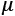
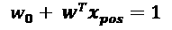
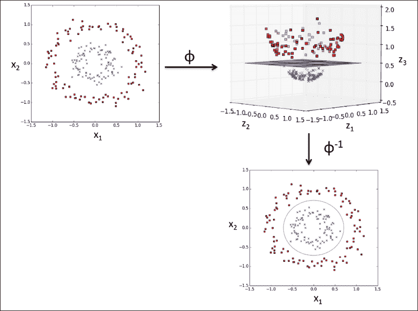
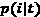
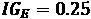
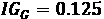
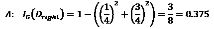
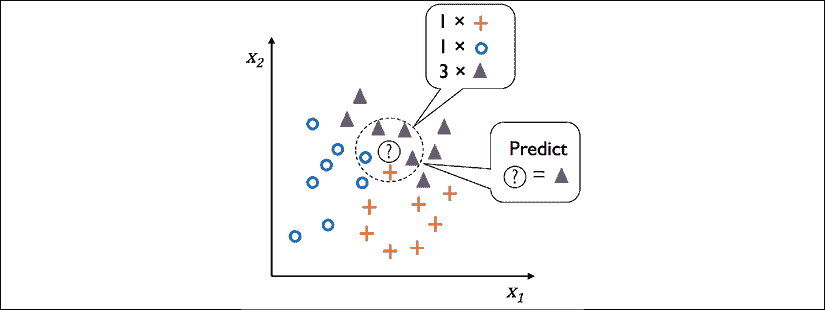

# 第三章：使用scikit-learn的机器学习分类器之旅

本章将介绍一些常用且强大的机器学习算法，这些算法在学术界和工业界都有广泛应用。在学习几种用于分类的监督学习算法的区别时，我们还将深入了解它们各自的优缺点。此外，我们还将迈出使用scikit-learn库的第一步，scikit-learn提供了一个用户友好且一致的接口，用于高效和富有成效地使用这些算法。

本章将涵盖的主题如下：

+   介绍一些稳健且流行的分类算法，如逻辑回归、支持向量机和决策树

+   使用scikit-learn机器学习库的示例和解释，scikit-learn提供了通过用户友好的Python API访问各种机器学习算法的功能

+   讨论具有线性和非线性决策边界的分类器的优缺点

# 选择分类算法

为特定问题选择合适的分类算法需要实践和经验；每种算法都有其独特之处，并且基于某些假设。重新表述大卫·沃尔珀特（David H. Wolpert）提出的**无免费午餐定理**，没有一种分类器在所有可能的情境中表现最佳（《学习算法之间缺乏先验区分》，*沃尔珀特，大卫·H*，*神经计算 8.7*（1996年）：1341-1390）。实际上，建议始终比较至少几种不同学习算法的性能，以选择最适合特定问题的模型；这些算法可能在特征或样本数量、数据集中的噪声量以及类别是否线性可分等方面有所不同。

最终，分类器的性能——包括计算性能和预测能力——在很大程度上依赖于可用于学习的基础数据。训练一个监督机器学习算法所涉及的五个主要步骤可以总结如下：

1.  选择特征并收集标注的训练样本。

1.  选择性能度量标准。

1.  选择分类器和优化算法。

1.  评估模型的性能。

1.  调整算法。

由于本书的教学方法是一步步构建机器学习知识，我们将在本章中主要关注不同算法的基本概念，并将在本书后续章节中重新探讨特征选择与预处理、性能度量和超参数调整等主题，进行更为详细的讨论。

# 使用scikit-learn的第一步——训练感知机

在*第二章*，*训练简单的机器学习分类算法*中，你学习了两种相关的分类学习算法：**感知机**规则和**Adaline**，我们通过 Python 和 NumPy 实现了这两种算法。现在我们将看一下 scikit-learn API，正如前面提到的，它结合了一个用户友好且一致的接口，以及几种分类算法的高度优化实现。scikit-learn 库不仅提供了大量的学习算法，还提供了许多便捷的函数，用于预处理数据以及微调和评估我们的模型。我们将在*第四章*，*构建良好的训练数据集 – 数据预处理*和*第五章*，*通过降维压缩数据*中进一步讨论这些内容，并讲解其背后的基本概念。

为了开始使用 scikit-learn 库，我们将训练一个类似于*第二章*中实现的感知机模型。为简便起见，接下来的部分我们将继续使用已经熟悉的**鸢尾花数据集**。方便的是，鸢尾花数据集已经可以通过 scikit-learn 获取，因为它是一个简单但广泛使用的数据集，经常用于算法测试和实验。与前一章类似，我们将在本章中仅使用鸢尾花数据集的两个特征来进行可视化展示。

我们将把 150 个花卉样本的花瓣长度和花瓣宽度分配给特征矩阵 `X`，并将对应的花卉物种的类别标签分配给向量数组 `y`：

```py
>>> from sklearn import datasets
>>> import numpy as np
>>> iris = datasets.load_iris()
>>> X = iris.data[:, [2, 3]]
>>> y = iris.target
>>> print('Class labels:', np.unique(y))
Class labels: [0 1 2] 
```

`np.unique(y)` 函数返回了存储在 `iris.target` 中的三个唯一类别标签，正如我们所见，鸢尾花的类别名称 `Iris-setosa`、`Iris-versicolor` 和 `Iris-virginica` 已经以整数形式存储（此处为：`0`、`1`、`2`）。尽管许多 scikit-learn 函数和类方法也可以处理字符串格式的类别标签，但使用整数标签是一种推荐的方法，能避免技术故障并提高计算性能，因为它占用更少的内存；此外，将类别标签编码为整数是大多数机器学习库的常见约定。

为了评估训练好的模型在未见过的数据上的表现，我们将进一步将数据集拆分为单独的训练集和测试集。在*第六章*，*模型评估与超参数调整的最佳实践*中，我们将更详细地讨论有关模型评估的最佳实践：

```py
>>> from sklearn.model_selection import train_test_split
>>> X_train, X_test, y_train, y_test = train_test_split(
...     X, y, test_size=0.3, random_state=1, stratify=y) 
```

使用 `train_test_split` 函数来自 scikit-learn 的 `model_selection` 模块，我们将 `X` 和 `y` 数组随机分割为 30% 的测试数据（45 个样本）和 70% 的训练数据（105 个样本）。

请注意，`train_test_split` 函数在拆分数据之前已经在内部对训练数据集进行了洗牌；否则，所有来自类别 `0` 和类别 `1` 的示例将会被分配到训练数据集中，而测试数据集将包含来自类别 `2` 的 45 个示例。通过 `random_state` 参数，我们为内部用于数据集洗牌的伪随机数生成器提供了一个固定的随机种子（`random_state=1`）。使用这样的固定 `random_state` 确保了我们的结果是可重复的。

最后，我们利用了 `stratify=y` 提供的内建分层支持。在此上下文中，分层意味着 `train_test_split` 方法返回的训练集和测试集子集与输入数据集具有相同的类别标签比例。我们可以使用 NumPy 的 `bincount` 函数，它用于计算数组中每个值的出现次数，以验证这一点是否成立：

```py
>>> print('Labels counts in y:', np.bincount(y))
Labels counts in y: [50 50 50]
>>> print('Labels counts in y_train:', np.bincount(y_train))
Labels counts in y_train: [35 35 35]
>>> print('Labels counts in y_test:', np.bincount(y_test))
Labels counts in y_test: [15 15 15] 
```

如我们在*第2章*，*训练简单机器学习算法进行分类*中的**梯度下降**示例所看到的，许多机器学习和优化算法也需要特征缩放才能获得最佳性能。在这里，我们将使用 scikit-learn 的 `preprocessing` 模块中的 `StandardScaler` 类对特征进行标准化：

```py
>>> from sklearn.preprocessing import StandardScaler
>>> sc = StandardScaler()
>>> sc.fit(X_train)
>>> X_train_std = sc.transform(X_train)
>>> X_test_std = sc.transform(X_test) 
```

使用前面的代码，我们从 `preprocessing` 模块加载了 `StandardScaler` 类，并初始化了一个新的 `StandardScaler` 对象，将其分配给 `sc` 变量。通过调用 `fit` 方法，`StandardScaler` 从训练数据中估算了每个特征维度的参数，（样本均值）和 （标准差）。接着，我们通过调用 `transform` 方法，利用这些估算的参数对训练数据进行了标准化。请注意，我们使用相同的缩放参数对测试数据集进行了标准化，这样训练数据集和测试数据集中的数值可以互相比较。

标准化了训练数据后，我们现在可以训练一个感知机模型。scikit-learn 中的大多数算法默认通过**一对多**（**OvR**）方法支持多类别分类，这使得我们可以一次性将三个花卉类别输入到感知机模型中。代码如下：

```py
>>> from sklearn.linear_model import Perceptron
>>> ppn = Perceptron(eta0=0.1, random_state=1)
>>> ppn.fit(X_train_std, y_train) 
```

scikit-learn 接口让你想起我们在*第2章*，*训练简单机器学习算法进行分类*中实现的感知机。在从 `linear_model` 模块加载 `Perceptron` 类之后，我们初始化了一个新的 `Perceptron` 对象，并通过 `fit` 方法训练了该模型。在这里，模型参数 `eta0` 相当于我们在自己实现的感知机中的学习率 `eta`，而 `n_iter` 参数定义了迭代次数（对训练数据集的遍历次数）。

正如你在*第2章*中所记得的，找到合适的学习率需要进行一些实验。如果学习率过大，算法会超过全局代价最小值。如果学习率太小，算法会需要更多的epochs直到收敛，这会使得学习变慢 —— 特别是对于大数据集。此外，我们使用了`random_state`参数来确保每个epoch后对训练数据集进行的初始洗牌是可重现的。

在scikit-learn中训练完模型后，我们可以通过`predict`方法进行预测，就像在*第2章*中我们自己的感知器实现中一样。代码如下：

```py
>>> y_pred = ppn.predict(X_test_std)
>>> print('Misclassified examples: %d' % (y_test != y_pred).sum())
Misclassified examples: 1 
```

执行代码后，我们可以看到感知器在45个花的示例中误分类了1个。因此，测试数据集上的误分类错误大约为0.022或2.2% ()。

**分类错误与准确率**

许多机器学习实践者报告模型的分类准确率而不是误分类错误，这简单地计算如下：

1 - *错误* = 0.978 或 97.8%

使用分类错误还是准确率仅仅是个人偏好的问题。

注意，scikit-learn还实现了许多不同的性能度量，通过`metrics`模块可用。例如，我们可以计算感知器在测试数据集上的分类准确率如下：

```py
>>> from sklearn.metrics import accuracy_score
>>> print('Accuracy: %.3f' % accuracy_score(y_test, y_pred))
Accuracy: 0.978 
```

在这里，`y_test`是真实的类标签，`y_pred`是我们之前预测的类标签。另外，scikit-learn中每个分类器都有一个`score`方法，通过将`predict`调用与`accuracy_score`结合起来计算分类器的预测准确率，如下所示：

```py
>>> print('Accuracy: %.3f' % ppn.score(X_test_std, y_test))
Accuracy: 0.978 
```

**过拟合**

注意，在本章中，我们将基于测试数据集评估模型的性能。在*第6章*，*学习模型评估和超参数调优的最佳实践*，你将学习到有用的技术，包括图形分析，如学习曲线，来检测和预防**过拟合**。过拟合，我们稍后将在本章返回讨论，意味着模型很好地捕捉了训练数据的模式，但对未见过的数据泛化能力不佳。

最后，我们可以使用我们从*第2章*，*简单机器学习算法的分类训练*中的`plot_decision_regions`函数来绘制我们新训练的感知器模型的**决策区域**，并可视化它如何将不同的花示例分离。然而，让我们通过小圆圈来突出显示来自测试数据集的数据实例：

```py
from matplotlib.colors import ListedColormap
import matplotlib.pyplot as plt
def plot_decision_regions(X, y, classifier, test_idx=None,
                          resolution=0.02):
    # setup marker generator and color map
    markers = ('s', 'x', 'o', '^', 'v')
    colors = ('red', 'blue', 'lightgreen', 'gray', 'cyan')
    cmap = ListedColormap(colors[:len(np.unique(y))])

    # plot the decision surface
    x1_min, x1_max = X[:, 0].min() - 1, X[:, 0].max() + 1
    x2_min, x2_max = X[:, 1].min() - 1, X[:, 1].max() + 1
    xx1, xx2 = np.meshgrid(np.arange(x1_min, x1_max, resolution),
                           np.arange(x2_min, x2_max, resolution))
    Z = classifier.predict(np.array([xx1.ravel(), xx2.ravel()]).T)
    Z = Z.reshape(xx1.shape)
    plt.contourf(xx1, xx2, Z, alpha=0.3, cmap=cmap)
    plt.xlim(xx1.min(), xx1.max())
    plt.ylim(xx2.min(), xx2.max())

    for idx, cl in enumerate(np.unique(y)):
        plt.scatter(x=X[y == cl, 0], y=X[y == cl, 1],
                    alpha=0.8, c=colors[idx],
                    marker=markers[idx], label=cl,
                    edgecolor='black')

    # highlight test examples
    if test_idx:
        # plot all examples
        X_test, y_test = X[test_idx, :], y[test_idx]

        plt.scatter(X_test[:, 0], X_test[:, 1],
                    c='', edgecolor='black', alpha=1.0,
                    linewidth=1, marker='o',
                    s=100, label='test set') 
```

我们稍微修改了`plot_decision_regions`函数，现在我们可以指定要在生成的图中标记的示例的索引。代码如下：

```py
>>> X_combined_std = np.vstack((X_train_std, X_test_std))
>>> y_combined = np.hstack((y_train, y_test))
>>> plot_decision_regions(X=X_combined_std,
...                       y=y_combined,
...                       classifier=ppn,
...                       test_idx=range(105, 150))
>>> plt.xlabel('petal length [standardized]')
>>> plt.ylabel('petal width [standardized]')
>>> plt.legend(loc='upper left')
>>> plt.tight_layout()
>>> plt.show() 
```

正如我们在生成的图中看到的，这三类花不能完美地通过线性决策边界分开：


记住在*第二章*《训练简单的机器学习分类算法》中提到的内容，感知器算法在数据集不是完全线性可分时永远不会收敛，这也是为什么在实际应用中通常不推荐使用感知器算法的原因。在接下来的章节中，我们将探讨一些更强大的线性分类器，即使类不是完全线性可分，它们也能收敛到一个最小的代价。

**附加的感知器设置**

`感知器`（Perceptron）以及其他 scikit-learn 函数和类，通常有一些额外的参数，为了简洁起见我们在这里省略了这些参数。你可以通过 Python 中的 `help` 函数（例如，`help(Perceptron)`）或通过浏览出色的 scikit-learn 在线文档，了解更多关于这些参数的内容：[http://scikit-learn.org/stable/](http://scikit-learn.org/stable/)。

# 通过逻辑回归建模类概率

尽管感知器规则为机器学习分类算法提供了一个简单且易于理解的入门，但其最大缺点是，如果类不是完全线性可分的，它永远不会收敛。上一节中的分类任务就是一个这样的例子。其原因在于，权重会持续更新，因为每个周期内总会至少存在一个被错误分类的训练样本。当然，你可以调整学习率并增加周期数，但请注意，在此数据集上感知器永远不会收敛。

为了更好地利用时间，我们现在来看另一种简单但更强大的线性和二分类问题算法：**逻辑回归**。需要注意的是，尽管它的名字里有“回归”二字，逻辑回归实际上是一种分类模型，而非回归模型。

## 逻辑回归与条件概率

逻辑回归是一种分类模型，容易实现，并且在类是线性可分的情况下表现非常好。它是工业界中应用最广泛的分类算法之一。与感知器和 Adaline 类似，本章中的逻辑回归模型也是一种用于二分类的线性模型。

**多类逻辑回归**

请注意，逻辑回归可以很容易地推广到多类设置，这被称为多项式逻辑回归或软最大回归（softmax regression）。关于多项式逻辑回归的详细内容超出了本书的范围，但感兴趣的读者可以在我的讲义中找到更多信息：[https://sebastianraschka.com/pdf/lecture-notes/stat479ss19/L05_gradient-descent_slides.pdf](https://sebastianraschka.com/pdf/lecture-notes/stat479ss19/L05_gradient-descent_slides.pdf) 或 [http://rasbt.github.io/mlxtend/user_guide/classifier/SoftmaxRegression/](http://rasbt.github.io/mlxtend/user_guide/classifier/SoftmaxRegression/)。

在多类设置中使用逻辑回归的另一种方式是通过OvR技术，这也是我们之前讨论过的。

为了将逻辑回归作为二元分类的概率模型来解释，我们首先引入**赔率**：某个特定事件的赔率。赔率可以写成，其中*p*代表正事件的概率。这里的“正事件”不一定意味着“好”，而是指我们想要预测的事件，例如，某个患者患有某种疾病的概率；我们可以将正事件视为类别标签*y* = 1。接着，我们可以进一步定义**logit**函数，它仅仅是赔率（log-odds）的对数：


请注意，*log*指的是自然对数，因为在计算机科学中这是常见的约定。*logit*函数接受0到1范围内的输入值，并将其转换为整个实数范围内的值，我们可以用它来表达特征值与log-odds之间的线性关系：


这里，是给定特征*x*的条件概率，即某个特定示例属于类别1的概率。

现在，我们实际上关心的是预测某个示例属于某个特定类别的概率，这就是logit函数的逆函数形式。

它也被称为**逻辑sigmoid函数**，有时由于其S形特征，简写为**sigmoid函数**：


这里，*z*是净输入，即权重和输入的线性组合（即与训练示例相关的特征）：


请注意，类似于我们在*第2章*中使用的约定，*训练简单机器学习算法进行分类*，表示偏置单元，是我们提供给的附加输入值，且其值设置为1。

现在，让我们绘制sigmoid函数在-7到7范围内的一些值，看看它的形态：

```py
>>> import matplotlib.pyplot as plt
>>> import numpy as np
>>> def sigmoid(z):
...     return 1.0 / (1.0 + np.exp(-z))
>>> z = np.arange(-7, 7, 0.1)
>>> phi_z = sigmoid(z)
>>> plt.plot(z, phi_z)
>>> plt.axvline(0.0, color='k')
>>> plt.ylim(-0.1, 1.1)
>>> plt.xlabel('z')
>>> plt.ylabel('$\phi (z)$')
>>> # y axis ticks and gridline
>>> plt.yticks([0.0, 0.5, 1.0])
>>> ax = plt.gca()
>>> ax.yaxis.grid(True)
>>> plt.tight_layout()
>>> plt.show() 
```

执行前面的代码示例后，我们现在应该能看到S形（sigmoidal）曲线：


我们可以看到，如果*z*趋向于无穷大（），则趋近于1，因为当*z*的值很大时，变得非常小。类似地，会趋向于0，原因是分母越来越大。由此，我们可以得出结论，这个sigmoid函数接收实数值作为输入，并将其转换为[0, 1]范围内的值，截距为。

为了更好地理解逻辑回归模型，我们可以将其与 *第 2 章* 关联。在 Adaline 中，我们使用恒等函数  作为激活函数。在逻辑回归中，这个激活函数则变成了我们之前定义的 Sigmoid 函数。

Adaline 和逻辑回归之间的差异如下面的图示所示：


Sigmoid 函数的输出被解释为给定特征 *x* 和由权重 *w* 参数化的情况下，一个特定样本属于类别 1 的概率，如 。例如，如果我们为某个特定的花朵样本计算 ，这意味着该样本是 `Iris-versicolor` 花朵的概率是 80%。因此，这朵花是 `Iris-setosa` 花朵的概率可以通过  计算，结果是 20%。接下来，预测的概率可以通过阈值函数简化为二元结果：


如果我们查看之前的 Sigmoid 函数图像，这就相当于以下内容：


事实上，在许多应用中，我们不仅仅关心预测的类别标签，还特别关心类别成员概率的估算（即在应用阈值函数之前的 Sigmoid 函数输出）。例如，逻辑回归被广泛应用于天气预报，不仅用来预测某天是否会下雨，还用来报告降雨的概率。类似地，逻辑回归还可以用来预测给定某些症状时患者患有特定疾病的几率，这也是逻辑回归在医学领域广受欢迎的原因。

## 学习逻辑回归代价函数的权重

你已经了解了如何使用逻辑回归模型来预测概率和类别标签；现在，让我们简要讨论如何拟合模型的参数，例如权重 *w*。在上一章中，我们将平方和误差代价函数定义为如下形式：


我们通过最小化这个函数来学习 Adaline 分类模型的权重 *w*。为了说明我们如何推导逻辑回归的代价函数，首先让我们定义我们希望最大化的似然 *L*，假设数据集中的每个样本是相互独立的。公式如下：


实际上，最大化该方程的（自然）对数会更容易，这个过程被称为 **对数似然** 函数：


首先，应用对数函数减少了数值下溢的可能性，若似然值非常小时可能会发生这种情况。其次，我们可以将因子的乘积转换为因子的求和，这使得通过加法技巧（你可能还记得微积分中的这一技巧）更容易得到该函数的导数。

现在，我们可以使用一种优化算法，例如梯度上升法，来最大化这个对数似然函数。或者，我们可以将对数似然函数重写为一个成本函数 *J*，并通过梯度下降法最小化，正如在*第2章*《训练简单的机器学习分类算法》中所示：


为了更好地理解这个成本函数，让我们看一下为单个训练样本计算的成本：


看这个方程，我们可以看到，当 *y* = 0 时，第一个项为零；当 *y* = 1 时，第二个项为零：


```py
:
```

```py
>>> def cost_1(z):
...     return - np.log(sigmoid(z))
>>> def cost_0(z):
...     return - np.log(1 - sigmoid(z))
>>> z = np.arange(-10, 10, 0.1)
>>> phi_z = sigmoid(z)
>>> c1 = [cost_1(x) for x in z]
>>> plt.plot(phi_z, c1, label='J(w) if y=1')
>>> c0 = [cost_0(x) for x in z]
>>> plt.plot(phi_z, c0, linestyle='--', label='J(w) if y=0')
>>> plt.ylim(0.0, 5.1)
>>> plt.xlim([0, 1])
>>> plt.xlabel('$\phi$(z)')
>>> plt.ylabel('J(w)')
>>> plt.legend(loc='best')
>>> plt.tight_layout()
>>> plt.show() 
```

结果图显示了在 *x* 轴上从 0 到 1 范围内的 sigmoid 激活（sigmoid 函数的输入值是 *z*，范围为 -10 到 10），以及在 *y* 轴上相应的逻辑回归成本：


我们可以看到，如果我们正确预测一个示例属于类别 1，成本会接近 0（连续线）。同样，我们也可以在 *y* 轴上看到，如果我们正确预测 *y* = 0，成本也会接近 0（虚线）。然而，如果预测错误，成本将趋向无穷大。关键点是，我们会用越来越大的成本惩罚错误的预测。

## 将 Adaline 实现转换为逻辑回归算法

如果我们自己实现逻辑回归，可以简单地将成本函数 *J* 从*第2章*《训练简单的机器学习分类算法》中的 Adaline 实现中替换为新的成本函数：


我们使用它来计算每个训练样本在每个周期的分类成本。此外，我们需要将线性激活函数替换为 sigmoid 激活，并将阈值函数更改为返回类别标签 0 和 1，而不是 -1 和 1。如果我们对 Adaline 代码进行这些更改，我们将得到一个可工作的逻辑回归实现，如下所示：

```py
class LogisticRegressionGD(object):
    """Logistic Regression Classifier using gradient descent.

    Parameters
    ------------
    eta : float
        Learning rate (between 0.0 and 1.0)
    n_iter : int
        Passes over the training dataset.
    random_state : int
        Random number generator seed for random weight
        initialization.

    Attributes
    -----------
    w_ : 1d-array
        Weights after fitting.
    cost_ : list
        Logistic cost function value in each epoch.

    """
    def __init__(self, eta=0.05, n_iter=100, random_state=1):
        self.eta = eta
        self.n_iter = n_iter
        self.random_state = random_state

    def fit(self, X, y):
        """ Fit training data.

        Parameters
        ----------
        X : {array-like}, shape = [n_examples, n_features]
            Training vectors, where n_examples is the number of
            examples and n_features is the number of features.
        y : array-like, shape = [n_examples]
            Target values.

        Returns
        -------
        self : object

        """
        rgen = np.random.RandomState(self.random_state)
        self.w_ = rgen.normal(loc=0.0, scale=0.01,
                              size=1 + X.shape[1])
        self.cost_ = []

        for i in range(self.n_iter):
            net_input = self.net_input(X)
            output = self.activation(net_input)
            errors = (y - output)
            self.w_[1:] += self.eta * X.T.dot(errors)
            self.w_[0] += self.eta * errors.sum()

            # note that we compute the logistic `cost` now
            # instead of the sum of squared errors cost
            cost = (-y.dot(np.log(output)) -
                        ((1 - y).dot(np.log(1 - output))))
            self.cost_.append(cost)
        return self

    def net_input(self, X):
        """Calculate net input"""
        return np.dot(X, self.w_[1:]) + self.w_[0]

    def activation(self, z):
        """Compute logistic sigmoid activation"""
        return 1\. / (1\. + np.exp(-np.clip(z, -250, 250)))

    def predict(self, X):
        """Return class label after unit step"""
        return np.where(self.net_input(X) >= 0.0, 1, 0)
        # equivalent to:
        # return np.where(self.activation(self.net_input(X))
        #                 >= 0.5, 1, 0) 
```

当我们拟合逻辑回归模型时，必须记住它仅适用于二分类任务。

因此，让我们只考虑 `Iris-setosa` 和 `Iris-versicolor` 花（类别 `0` 和 `1`），并检查我们实现的逻辑回归是否有效：

```py
>>> X_train_01_subset = X_train[(y_train == 0) | (y_train == 1)]
>>> y_train_01_subset = y_train[(y_train == 0) | (y_train == 1)]
>>> lrgd = LogisticRegressionGD(eta=0.05,
...                             n_iter=1000,
...                             random_state=1)
>>> lrgd.fit(X_train_01_subset,
...          y_train_01_subset)
>>> plot_decision_regions(X=X_train_01_subset,
...                       y=y_train_01_subset,
...                       classifier=lrgd)
>>> plt.xlabel('petal length [standardized]')
>>> plt.ylabel('petal width [standardized]')
>>> plt.legend(loc='upper left')
>>> plt.tight_layout()
>>> plt.show() 
```

结果的决策区域图如下所示：


**逻辑回归的梯度下降学习算法**

通过微积分，我们可以证明，通过梯度下降在逻辑回归中进行的权重更新等同于我们在*第2章*《*训练简单的机器学习算法进行分类*》中使用的Adaline方程。然而，请注意，下面的梯度下降学习规则的推导是为那些对逻辑回归梯度下降学习规则背后的数学概念感兴趣的读者准备的。对于本章余下内容的理解，并非必须。

我们从计算对数似然函数相对于*j*权重的偏导数开始：


在我们继续之前，先来计算一下sigmoid函数的偏导数：


现在，我们可以在我们的第一个方程中重新代入，得到如下结果：


记住，目标是找到使对数似然最大化的权重，从而对每个权重执行如下更新：


由于我们同时更新所有权重，因此我们可以将一般的更新规则写成如下形式：


我们将定义如下：


由于最大化对数似然等同于最小化之前定义的代价函数*J*，我们可以将梯度下降更新规则写成如下形式：


这与*第2章*《*训练简单的机器学习算法进行分类*》中Adaline的梯度下降规则相等。

## 使用scikit-learn训练一个逻辑回归模型

我们在上一小节中进行了一些有用的编码和数学练习，帮助说明了Adaline与逻辑回归的概念性差异。现在，让我们学习如何使用scikit-learn中更优化的逻辑回归实现，该实现也原生支持多类设置。需要注意的是，在最近版本的scikit-learn中，用于多类分类的技术（多项式或OvR）会自动选择。在接下来的代码示例中，我们将使用`sklearn.linear_model.LogisticRegression`类和熟悉的`fit`方法，使用标准化的花卉训练数据集训练模型，同时设置`multi_class='ovr'`作为示例。作为读者的练习，您可能会想比较一下使用`multi_class='multinomial'`的结果。请注意，`multinomial`设置通常在实际应用中推荐用于互斥类，比如鸢尾花数据集中的类。这里，"互斥"意味着每个训练样本只能属于一个类（与多标签分类不同，后者一个训练样本可以属于多个类）。

现在，让我们看看代码示例：

```py
>>> from sklearn.linear_model import LogisticRegression
>>> lr = LogisticRegression(C=100.0, random_state=1,
...                         solver='lbfgs', multi_class='ovr')
>>> lr.fit(X_train_std, y_train)
>>> plot_decision_regions(X_combined_std,
...                       y_combined,
...                       classifier=lr,
...                       test_idx=range(105, 150))
>>> plt.xlabel('petal length [standardized]')
>>> plt.ylabel('petal width [standardized]')
>>> plt.legend(loc='upper left')
>>> plt.tight_layout()
>>> plt.show() 
```

在训练数据上拟合模型后，我们绘制了决策区域、训练样本和测试样本，如下图所示：


请注意，解决优化问题的方法有很多种。对于最小化凸损失函数（如逻辑回归损失），建议使用比常规随机梯度下降（SGD）更先进的方法。事实上，scikit-learn实现了一整套此类优化算法，可以通过solver参数指定，分别是`'newton-cg'`、`'lbfgs'`、`'liblinear'`、`'sag'`和`'saga'`。

虽然逻辑回归损失是凸的，但大多数优化算法都应该轻松收敛到全局最小损失。然而，某些算法相比其他算法有一定的优势。例如，在当前版本（v 0.21）中，scikit-learn默认使用`'liblinear'`，它无法处理多项式损失，并且在多类分类中仅限于OvR方案。然而，在scikit-learn的未来版本（即v 0.22）中，默认的求解器将更改为`'lbfgs'`，即**有限内存Broyden-Fletcher-Goldfarb-Shanno**（**BFGS**）算法（[https://en.wikipedia.org/wiki/Limited-memory_BFGS](https://en.wikipedia.org/wiki/Limited-memory_BFGS)），并且在这方面更加灵活。为了采用这一新的默认选择，在本书中使用逻辑回归时我们将明确指定`solver='lbfgs'`。

看一下我们用于训练`LogisticRegression`模型的前面的代码，你可能会想，“这个神秘的参数C到底是什么？”我们将在下一小节中讨论这个参数，并介绍过拟合和正则化的概念。不过，在我们继续讨论这些主题之前，让我们先完成关于类别归属概率的讨论。

可以使用`predict_proba`方法计算训练样本属于某一类的概率。例如，我们可以预测测试数据集中前三个样本的概率，如下所示：

```py
>>> lr.predict_proba(X_test_std[:3, :]) 
```

这段代码返回如下数组：

```py
array([[3.81527885e-09, 1.44792866e-01, 8.55207131e-01],
       [8.34020679e-01, 1.65979321e-01, 3.25737138e-13],
       [8.48831425e-01, 1.51168575e-01, 2.62277619e-14]]) 
```

第一行对应于第一个花朵的类别归属概率，第二行对应于第二个花朵的类别归属概率，以此类推。请注意，各列的和都为1，正如预期的那样。（你可以通过执行`lr.predict_proba(X_test_std[:3, :]).sum(axis=1)`来确认这一点。）

第一行中的最大值约为0.85，这意味着第一个样本属于类别三（`Iris-virginica`）的预测概率为85%。所以，正如你可能已经注意到的那样，我们可以通过识别每一行中最大的一列来获得预测的类别标签，例如，使用NumPy的`argmax`函数：

```py
>>> lr.predict_proba(X_test_std[:3, :]).argmax(axis=1) 
```

返回的类别索引如下所示（它们对应于`Iris-virginica`、`Iris-setosa`和`Iris-setosa`）：

```py
array([2, 0, 0]) 
```

在前面的代码示例中，我们计算了条件概率并通过使用NumPy的`argmax`函数手动将其转换为类别标签。在实际操作中，使用scikit-learn时，更便捷的获取类别标签的方式是直接调用`predict`方法：

```py
>>> lr.predict(X_test_std[:3, :])
array([2, 0, 0]) 
```

最后，如果你想预测单一花卉示例的类别标签，需要注意：scikit-learn期望输入数据为二维数组；因此，我们必须先将单行切片转换成这种格式。将单行数据转换为二维数据数组的一种方式是使用NumPy的`reshape`方法添加一个新维度，如下所示：

```py
>>> lr.predict(X_test_std[0, :].reshape(1, -1))
array([2]) 
```

## 通过正则化来应对过拟合

过拟合是机器学习中的一个常见问题，指的是模型在训练数据上表现良好，但在未见过的数据（测试数据）上泛化能力较差。如果模型出现过拟合，我们也可以说模型具有较高的方差，这可能是由参数过多造成的，从而导致模型过于复杂，不符合数据的真实结构。同样地，我们的模型也可能会遭遇**欠拟合**（高偏差），这意味着模型不足够复杂，无法很好地捕捉训练数据中的模式，因此在未见过的数据上表现不佳。

虽然到目前为止我们只遇到了用于分类的线性模型，但过拟合和欠拟合问题可以通过将线性决策边界与更复杂的非线性决策边界进行比较来最清楚地说明，如下图所示：


**偏差-方差权衡**

通常，研究人员使用“偏差”和“方差”或“偏差-方差权衡”这两个术语来描述模型的表现——也就是说，你可能会在讲座、书籍或文章中看到人们说某个模型具有“高方差”或“高偏差”。那么，这是什么意思呢？一般来说，我们可以说“高方差”与过拟合成正比，“高偏差”与欠拟合成正比。

在机器学习模型的背景下，**方差**衡量的是如果我们多次重新训练模型，例如，在不同的训练数据子集上进行训练时，模型预测某个特定示例的一致性（或变异性）。我们可以说，模型对训练数据中的随机性比较敏感。相对地，**偏差**衡量的是如果我们在不同的训练数据集上多次重建模型时，预测值与正确值之间的偏差；偏差是衡量由系统性误差引起的偏差，而这种误差与随机性无关。

如果你对“偏差”和“方差”术语的技术规格及推导感兴趣，我在我的讲义中有写过相关内容，详见：[https://sebastianraschka.com/pdf/lecture-notes/stat479fs18/08_eval-intro_notes.pdf](https://sebastianraschka.com/pdf/lecture-notes/stat479fs18/08_eval-intro_notes.pdf)。

寻找良好的偏差-方差平衡的一种方法是通过正则化来调整模型的复杂性。正则化是处理共线性（特征之间的高相关性）、过滤数据噪声并最终防止过拟合的非常有用的方法。

正则化背后的概念是引入额外的信息（偏置），以惩罚极端的参数（权重）值。最常见的正则化形式是所谓的 **L2正则化**（有时也称为L2收缩或权重衰减），可以写作如下：


这里， 就是所谓的 **正则化参数**。

**正则化和特征归一化**

正则化是特征缩放（如标准化）重要性的另一个原因。为了使正则化正常工作，我们需要确保所有特征都在可比的尺度上。

逻辑回归的代价函数可以通过添加一个简单的正则化项来进行正则化，这将在模型训练过程中收缩权重：


通过正则化参数！[](img/B13208_03_047.png)，我们可以控制拟合训练数据的程度，同时保持权重较小。通过增加！[](img/B13208_03_048.png)的值，我们增加了正则化强度。

在scikit-learn中，`LogisticRegression`类中实现的参数`C`来自支持向量机中的一种约定，这将是下一节的主题。术语`C`与正则化参数！[](img/B13208_03_049.png)直接相关，它们是倒数。因此，减小逆正则化参数`C`的值意味着我们增加了正则化强度，我们可以通过绘制两个权重系数的L2正则化路径来可视化这一点：

```py
>>> weights, params = [], []
>>> for c in np.arange(-5, 5):
...     lr = LogisticRegression(C=10.**c, random_state=1,
...                             solver='lbfgs', multi_class='ovr')
...     lr.fit(X_train_std, y_train)
...     weights.append(lr.coef_[1])
...     params.append(10.**c)
>>> weights = np.array(weights)
>>> plt.plot(params, weights[:, 0],
...          label='petal length')
>>> plt.plot(params, weights[:, 1], linestyle='--',
...          label='petal width')
>>> plt.ylabel('weight coefficient')
>>> plt.xlabel('C')
>>> plt.legend(loc='upper left')
>>> plt.xscale('log')
>>> plt.show() 
```

通过执行前面的代码，我们拟合了10个逻辑回归模型，每个模型使用不同的逆正则化参数`C`值。为了方便说明，我们只收集了类别`1`（在数据集中是第二类：`Iris-versicolor`）与所有分类器的权重系数——请记住，我们使用的是一对多（OvR）技术进行多分类。

从结果图中可以看出，当我们减小参数`C`时，权重系数会收缩，也就是说，当我们增加正则化强度时：


**逻辑回归的额外资源**

由于对各个分类算法的深入讨论超出了本书的范围，*Logistic Regression: From Introductory to Advanced Concepts and Applications*，*Dr. Scott Menard*，*Sage Publications*，*2009*，推荐给那些想要深入了解逻辑回归的读者。

# 支持向量机的最大间隔分类

另一个强大且广泛使用的学习算法是**支持向量机**（**SVM**），它可以看作是感知机的扩展。通过使用感知机算法，我们最小化了误分类错误。然而，在SVM中，我们的优化目标是最大化间隔。间隔定义为分隔超平面（决策边界）与离该超平面最近的训练示例之间的距离，这些训练示例被称为**支持向量**。这在下图中得到了说明：


## 最大间隔直觉

设置具有大间隔的决策边界的原理是，它们通常具有较低的泛化误差，而具有小间隔的模型更容易出现过拟合。为了更好地理解间隔最大化的概念，我们来看一下那些与决策边界平行的正负超平面，它们可以表示为以下形式：

（1）（2）

如果我们将这两个线性方程（1）和（2）相互减去，我们得到：


我们可以通过向量*w*的长度来对这个方程进行归一化，定义如下：


因此，我们得到如下方程：


前面方程的左侧可以解释为正负超平面之间的距离，这就是我们希望最大化的所谓**间隔**。

现在，SVM的目标函数变成了通过最大化！[](img/B13208_03_055.png)来实现间隔最大化，同时约束条件是正确分类所有示例，可以写作：


这里，*N*是我们数据集中示例的数量。

这两个方程基本上表示，所有负类示例应位于负超平面的一侧，而所有正类示例应位于正超平面的另一侧，这也可以更紧凑地写成如下形式：


然而，实际上，更容易最小化倒数项！[](img/B13208_03_060.png)，它可以通过二次规划求解。然而，关于二次规划的详细讨论超出了本书的范围。您可以在*The Nature of Statistical Learning Theory*（*Springer Science*+*Business Media*，*Vladimir Vapnik*，2000年）中深入了解SVM，或者阅读Chris J.C. Burges在*《A Tutorial on Support Vector Machines for Pattern Recognition》*（*Data Mining and Knowledge Discovery*，*2(2)*：121-167，*1998年*）中的精彩讲解。

## 使用松弛变量处理非线性可分情况

虽然我们不想深入探讨最大间隔分类背后更复杂的数学概念，但简要提一下由 Vladimir Vapnik 在 1995 年引入的松弛变量 ，它促成了所谓的 **软间隔分类**。引入松弛变量的动机是，线性约束需要被放宽，以便对非线性可分数据进行优化，从而在误分类的情况下仍能让优化过程收敛，并进行适当的成本惩罚。

正值松弛变量简单地被添加到线性约束中：


这里，*N* 是我们数据集中样本的数量。所以，新的目标函数（在约束条件下最小化）变成了：


通过变量 `C`，我们可以控制误分类的惩罚。较大的 `C` 值对应较大的误差惩罚，而选择较小的 `C` 值时，我们对误分类的错误惩罚要求就会降低。然后我们可以利用 `C` 参数来控制间隔的宽度，从而调节偏差-方差的权衡，具体如下图所示：


这个概念与正则化相关，我们在上一节中讨论过正则化回归，其中减小 `C` 的值可以增加模型的偏差并降低方差。

现在我们已经了解了线性 SVM 背后的基本概念，接下来让我们训练一个 SVM 模型来分类 Iris 数据集中的不同花卉：

```py
>>> from sklearn.svm import SVC
>>> svm = SVC(kernel='linear', C=1.0, random_state=1)
>>> svm.fit(X_train_std, y_train)
>>> plot_decision_regions(X_combined_std,
...                       y_combined,
...                       classifier=svm,
...                       test_idx=range(105, 150))
>>> plt.xlabel('petal length [standardized]')
>>> plt.ylabel('petal width [standardized]')
>>> plt.legend(loc='upper left')
>>> plt.tight_layout()
>>> plt.show() 
```

在训练分类器时，使用 Iris 数据集执行上述代码示例后，SVM 的三个决策区域如以下图所示：


**逻辑回归与支持向量机（SVM）**

在实际的分类任务中，线性逻辑回归和线性 SVM 通常会产生非常相似的结果。逻辑回归试图最大化训练数据的条件似然，这使得它比 SVM 更容易受到异常值的影响，而 SVM 则更关注距离决策边界最近的点（支持向量）。另一方面，逻辑回归的优势在于它是一个更简单的模型，且实现起来更容易。此外，逻辑回归模型可以很容易地更新，这对于处理流数据时尤其具有吸引力。

## scikit-learn 中的替代实现

scikit-learn 库中的 `LogisticRegression` 类，我们在前面的章节中使用过，利用了 LIBLINEAR 库，这是一款由台湾大学开发的高度优化的 C/C++ 库 ([http://www.csie.ntu.edu.tw/~cjlin/liblinear/](http://www.csie.ntu.edu.tw/~cjlin/liblinear/))。

同样，我们用来训练 SVM 的 `SVC` 类利用了 LIBSVM，这是一个专门为 SVM 提供支持的 C/C++ 库（[http://www.csie.ntu.edu.tw/~cjlin/libsvm/](http://www.csie.ntu.edu.tw/~cjlin/libsvm/)）。

使用 LIBLINEAR 和 LIBSVM 的优势在于，它们能极其快速地训练大量线性分类器。而有时我们的数据集太大，无法完全加载到计算机内存中。因此，scikit-learn 还通过 `SGDClassifier` 类提供了替代实现，该类也支持通过 `partial_fit` 方法进行在线学习。`SGDClassifier` 类的概念类似于我们在*第二章*《训练简单的机器学习分类算法》中为 Adaline 实现的随机梯度算法。我们可以使用默认参数初始化感知机、逻辑回归和 SVM 的 SGD 版本，如下所示：

```py
>>> from sklearn.linear_model import SGDClassifier
>>> ppn = SGDClassifier(loss='perceptron')
>>> lr = SGDClassifier(loss='log')
>>> svm = SGDClassifier(loss='hinge') 
```

# 使用核 SVM 解决非线性问题

SVM 在机器学习实践者中广受欢迎的另一个原因是它们可以很容易地**核化**，用于解决非线性分类问题。在我们讨论所谓的**核 SVM**这一最常见的 SVM 变体的主要概念之前，让我们首先创建一个合成数据集，看看这种非线性分类问题是什么样的。

## 针对线性不可分数据的核方法

使用以下代码，我们将创建一个简单的数据集，该数据集通过 NumPy 的 `logical_or` 函数生成，形态类似于 XOR 门，其中 100 个示例被分配标签 `1`，另 100 个示例被分配标签 `-1`：

```py
>>> import matplotlib.pyplot as plt
>>> import numpy as np
>>> np.random.seed(1)
>>> X_xor = np.random.randn(200, 2)
>>> y_xor = np.logical_xor(X_xor[:, 0] > 0,
...                        X_xor[:, 1] > 0)
>>> y_xor = np.where(y_xor, 1, -1)
>>> plt.scatter(X_xor[y_xor == 1, 0],
...             X_xor[y_xor == 1, 1],
...             c='b', marker='x',
...             label='1')
>>> plt.scatter(X_xor[y_xor == -1, 0],
...             X_xor[y_xor == -1, 1],
...             c='r',
...             marker='s',
...             label='-1')
>>> plt.xlim([-3, 3])
>>> plt.ylim([-3, 3])
>>> plt.legend(loc='best')
>>> plt.tight_layout()
>>> plt.show() 
```

执行代码后，我们将得到一个带有随机噪声的 XOR 数据集，如下图所示：


显然，我们无法使用线性超平面作为决策边界很好地分离正负类别的示例，使用我们在前面章节中讨论的线性逻辑回归或线性支持向量机（SVM）模型。

**核方法**处理这类线性不可分数据的基本思想是，利用原始特征的非线性组合，通过映射函数将数据投影到更高维空间，，使得数据变得线性可分。如以下图所示，我们可以将二维数据集转换为新的三维特征空间，在这个空间中，类别可以通过以下投影分离：


这使得我们能够通过一个线性超平面来分离图中显示的两个类别，如果我们将其投影回原始特征空间，它会变成一个非线性的决策边界：



## 使用核技巧在高维空间中寻找分隔超平面

为了解决一个非线性问题，我们可以通过映射函数将训练数据转换到更高维的特征空间，并训练一个线性SVM模型，在这个新的特征空间中对数据进行分类。然后，我们可以使用相同的映射函数将新的、未见过的数据转换，并使用线性SVM模型对其进行分类。

然而，这种映射方法的一个问题是，构建新特征的计算开销非常大，特别是当我们处理高维数据时。这就是所谓的**核技巧**发挥作用的地方。

尽管我们没有深入讨论如何解决二次规划任务来训练SVM，但在实际操作中，我们只需要将点积替换为。为了节省显式计算两点之间点积的昂贵步骤，我们定义了一个所谓的**核函数**：


最广泛使用的核函数之一是**径向基函数**（**RBF**）核，也可以简单地称为**高斯核**：


这通常简化为：


这里，是一个需要优化的自由参数。

粗略来说，“核函数”这一术语可以解释为一对示例之间的**相似性函数**。负号将距离度量反转为相似性分数，而由于指数项的存在，最终的相似性分数将落在1（完全相似的示例）和0（非常不相似的示例）之间。

现在我们已经了解了核技巧背后的大致原理，接下来让我们看看能否训练一个能够画出非线性决策边界的核SVM，从而很好地分离XOR数据。这里，我们只需使用之前导入的scikit-learn中的`SVC`类，并将`kernel='linear'`参数替换为`kernel='rbf'`：

```py
>>> svm = SVC(kernel='rbf', random_state=1, gamma=0.10, C=10.0)
>>> svm.fit(X_xor, y_xor)
>>> plot_decision_regions(X_xor, y_xor, classifier=svm)
>>> plt.legend(loc='upper left')
>>> plt.tight_layout()
>>> plt.show() 
```

正如我们在结果图中看到的，核SVM相对较好地分离了XOR数据：


参数，我们将其设置为`gamma=0.1`，可以理解为高斯球的截断参数。如果我们增加的值，我们会增加训练样本的影响力或覆盖范围，从而导致更紧密且更崎岖的决策边界。为了更好地理解，我们来对鸢尾花数据集应用RBF核SVM：

```py
>>> svm = SVC(kernel='rbf', random_state=1, gamma=0.2, C=1.0)
>>> svm.fit(X_train_std, y_train)
>>> plot_decision_regions(X_combined_std,
...                       y_combined, classifier=svm,
...                       test_idx=range(105,150))
>>> plt.xlabel('petal length [standardized]')
>>> plt.ylabel('petal width [standardized]')
>>> plt.legend(loc='upper left')
>>> plt.tight_layout()
>>> plt.show() 
```

由于我们选择了相对较小的值，RBF核SVM模型的决策边界将相对平缓，如下图所示：


现在，让我们增加的值，并观察其对决策边界的影响：

```py
>>> svm = SVC(kernel='rbf', random_state=1, gamma=100.0, C=1.0)
>>> svm.fit(X_train_std, y_train)
>>> plot_decision_regions(X_combined_std,
...                       y_combined, classifier=svm,
...                       test_idx=range(105,150))
>>> plt.xlabel('petal length [standardized]')
>>> plt.ylabel('petal width [standardized]')
>>> plt.legend(loc='upper left')
>>> plt.tight_layout()
>>> plt.show() 
```

在生成的图中，我们现在可以看到，在使用相对较大值的条件下，类`0`和`1`周围的决策边界要紧密得多：


尽管模型非常适合训练数据集，这样的分类器在未见数据上可能会有很高的泛化误差。这说明当算法对训练数据集中的波动过于敏感时，**参数**也在控制过拟合或方差方面起着重要作用。

# 决策树学习

**决策树**分类器是具有吸引力的模型，如果我们关心其可解释性的话。正如名称“决策树”所示，我们可以将这个模型视为通过询问一系列问题来将我们的数据进行分解的模型。

让我们考虑以下示例，在这个示例中，我们使用决策树来决定特定日期的活动：


基于我们训练数据集中的特征，决策树模型学习一系列问题来推断示例的类标签。尽管前面的图示了基于分类变量的决策树概念，但是如果我们的特征是实数，比如在鸢尾花数据集中，同样的概念也适用。例如，我们可以简单地沿着**花萼宽度**特征轴定义一个截断值，并提出一个二元问题：“花萼宽度是否≥ 2.8 厘米？”

使用决策算法，我们从树根开始，并在导致最大**信息增益**（**IG**）的特征上分割数据，这将在以下部分详细解释。在迭代过程中，我们可以在每个子节点上重复这个分割过程，直到叶子节点变得纯净。这意味着每个节点上的训练示例都属于同一类。在实践中，这可能导致一个非常深的树，具有许多节点，这很容易导致过拟合。因此，我们通常希望通过设置树的最大深度限制来**修剪**树。

## 最大化信息增益 - 获取最大的回报

为了在最具信息特征处分割节点，我们需要定义一个通过树学习算法优化的目标函数。在这里，我们的目标函数是在每个分割点最大化信息增益（IG），定义如下：


这里，*f* 是执行分割的特征； 和  是父节点和第 *j* 个子节点的数据集；*I* 是我们的**不纯度**度量； 是父节点的训练示例总数； 是第 *j* 个子节点的示例数。正如我们所看到的，信息增益简单地是父节点的不纯度与子节点不纯度之和的差异——子节点的不纯度越低，信息增益越大。然而，为了简化和减少组合搜索空间，大多数库（包括 scikit-learn）实现了二叉决策树。这意味着每个父节点被分割成两个子节点， 和 ：


在二叉决策树中常用的三个不纯度度量或分割标准是**基尼不纯度**（）、**熵**（）和**分类错误率**（）。让我们从所有**非空**类别（）的熵定义开始：


这里， 是属于特定节点 *t* 的类别 *i* 的示例比例。因此，如果一个节点上的所有示例都属于同一类，则熵为 0，如果我们具有均匀的类分布，则熵最大。例如，在二元类设置中，如果  或 ，则熵为 0。如果类别均匀分布为  和 ，则熵为 1。因此，我们可以说熵标准试图在树中最大化互信息。

基尼不纯度可以理解为最小化误分类的概率：


类似于熵，基尼不纯度在类别完全混合时最大，例如，在二元类设置中（*c* = 2）：


然而，在实践中，基尼不纯度和熵通常产生非常相似的结果，通常不值得花费太多时间评估使用不同不纯度标准的树，而不是尝试不同的修剪截止值。

另一个不纯度度量是分类错误率：


这是修剪决策树的一个有用标准，但不建议用于生长决策树，因为它对节点类别概率的变化不太敏感。我们可以通过查看以下图示的两种可能的分割场景来说明这一点：


我们从一个数据集开始，，这是父节点处的 40 个类别 1 的示例和 40 个类别 2 的示例，我们将其拆分为两个数据集， 和 。使用分类误差作为分割标准时，信息增益在场景 A 和场景 B 中是相同的（）：


然而，基尼不纯度会偏向场景 B（）中的分割，而不是场景 A（），因为 B 的不纯度确实更低。



同样，熵准则也会偏向场景 B（）而非场景 A（）：


为了更直观地比较我们之前讨论的三种不同的不纯度准则，让我们绘制类别 1 的概率范围 [0, 1] 对应的不纯度指数。请注意，我们还将添加一个缩放版本的熵（熵 / 2），以观察基尼不纯度是熵和分类误差之间的中介度量。代码如下：

```py
>>> import matplotlib.pyplot as plt
>>> import numpy as np
>>> def gini(p):
...     return (p)*(1 - (p)) + (1 - p)*(1 - (1-p))
>>> def entropy(p):
...     return - p*np.log2(p) - (1 - p)*np.log2((1 - p))
>>> def error(p):
...     return 1 - np.max([p, 1 - p])
>>> x = np.arange(0.0, 1.0, 0.01)
>>> ent = [entropy(p) if p != 0 else None for p in x]
>>> sc_ent = [e*0.5 if e else None for e in ent]
>>> err = [error(i) for i in x]
>>> fig = plt.figure()
>>> ax = plt.subplot(111)
>>> for i, lab, ls, c, in zip([ent, sc_ent, gini(x), err],
...                           ['Entropy', 'Entropy (scaled)',
...                            'Gini impurity',
...                            'Misclassification error'],
...                           ['-', '-', '--', '-.'],
...                           ['black', 'lightgray',
...                            'red', 'green', 'cyan']):
...     line = ax.plot(x, i, label=lab,
...                   linestyle=ls, lw=2, color=c)
>>> ax.legend(loc='upper center', bbox_to_anchor=(0.5, 1.15),
...           ncol=5, fancybox=True, shadow=False)
>>> ax.axhline(y=0.5, linewidth=1, color='k', linestyle='--')
>>> ax.axhline(y=1.0, linewidth=1, color='k', linestyle='--')
>>> plt.ylim([0, 1.1])
>>> plt.xlabel('p(i=1)')
>>> plt.ylabel('impurity index') 
```

前述代码示例生成的图如下：


## 构建决策树

决策树可以通过将特征空间划分为矩形来构建复杂的决策边界。然而，我们必须小心，因为决策树越深，决策边界就越复杂，这很容易导致过拟合。使用 scikit-learn，我们将训练一个最大深度为 4 的决策树，使用基尼不纯度作为不纯度标准。虽然为了可视化目的可能需要特征缩放，但请注意，特征缩放并不是决策树算法的要求。代码如下：

```py
>>> from sklearn.tree import DecisionTreeClassifier
>>> tree_model = DecisionTreeClassifier(criterion='gini',
...                                     max_depth=4,
...                                     random_state=1)
>>> tree_model.fit(X_train, y_train)
>>> X_combined = np.vstack((X_train, X_test))
>>> y_combined = np.hstack((y_train, y_test))
>>> plot_decision_regions(X_combined,
...                       y_combined,
...                       classifier=tree_model,
...                       test_idx=range(105, 150))
>>> plt.xlabel('petal length [cm]')
>>> plt.ylabel('petal width [cm]')
>>> plt.legend(loc='upper left')
>>> plt.tight_layout()
>>> plt.show() 
```

执行代码示例后，我们得到了决策树的典型轴平行决策边界：


scikit-learn 的一个很好的功能是，它允许我们在训练后通过以下代码直观地可视化决策树模型：

```py
>>> from sklearn import tree
>>> tree.plot_tree(tree_model)
>>> plt.show() 
```


然而，通过使用 Graphviz 程序作为绘制 scikit-learn 决策树的后端，可以获得更漂亮的可视化效果。这个程序可以从[http://www.graphviz.org](http://www.graphviz.org)免费下载，并且支持 Linux、Windows 和 macOS。除了 Graphviz，我们还将使用一个名为 PyDotPlus 的 Python 库，它具有类似 Graphviz 的功能，并允许我们将 `.dot` 数据文件转换为决策树图像文件。在你安装了 Graphviz（按照[http://www.graphviz.org/download](http://www.graphviz.org/download)上的说明进行安装）后，你可以通过 pip 安装 PyDotPlus，例如在命令行终端中执行以下命令：

```py
> pip3 install pydotplus 
```

**安装 PyDotPlus 先决条件**

请注意，在某些系统上，你可能需要手动安装 PyDotPlus 的先决条件，可以通过执行以下命令来安装：

```py
pip3 install graphviz
pip3 install pyparsing 
```

以下代码将在本地目录中创建我们决策树的 PNG 格式图像：

```py
>>> from pydotplus import graph_from_dot_data
>>> from sklearn.tree import export_graphviz
>>> dot_data = export_graphviz(tree_model,
...                            filled=True,
...                            rounded=True,
...                            class_names=['Setosa',
...                                         'Versicolor',
...                                         'Virginica'],
...                            feature_names=['petal length',
...                                           'petal width'],
...                            out_file=None)
>>> graph = graph_from_dot_data(dot_data)
>>> graph.write_png('tree.png') 
```

通过使用 `out_file=None` 设置，我们直接将 DOT 数据分配给 `dot_data` 变量，而不是将中间的 `tree.dot` 文件写入磁盘。`filled`、`rounded`、`class_names` 和 `feature_names` 的参数是可选的，但通过添加颜色、圆角框边缘、在每个节点显示主要类标签的名称以及在每个分裂标准中显示特征名称，使得最终的图像文件在视觉上更具吸引力。这些设置产生了以下的决策树图像：


看着决策树图，我们现在可以清晰地追踪决策树从我们的训练数据集确定的分裂。我们从根节点的 105 个示例开始，并使用花瓣宽度 ≤ 0.75 cm 将它们分成了两个子节点，分别包含 35 个和 70 个示例。在第一次分裂后，我们可以看到左子节点已经纯净，且仅包含 `Iris-setosa` 类的示例（基尼不纯度 = 0）。接下来的分裂则用于将 `Iris-versicolor` 和 `Iris-virginica` 类的示例分开。

从这棵树以及树的决策区域图中，我们可以看到决策树在分离花卉类别方面做得非常好。不幸的是，当前的 scikit-learn 并没有实现手动后剪枝决策树的功能。不过，我们可以回到之前的代码示例，将决策树的`max_depth`改为`3`，并将其与当前模型进行比较，但我们将这个留给有兴趣的读者作为练习。

## 通过随机森林结合多个决策树

由于集成方法在过去十年里因其出色的分类性能和对过拟合的鲁棒性，已经在机器学习应用中获得了巨大的普及。虽然我们将在*第7章*《集成学习中不同模型的结合》中详细介绍不同的集成方法，包括**袋装法**和**提升法**，但在此我们先讨论基于决策树的**随机森林**算法，它因良好的可扩展性和易用性而著称。随机森林可以看作是决策树的**集成**。随机森林的基本思想是通过平均多个（深度）决策树的结果来降低每棵树的高方差，从而构建出一个更为稳健的模型，具有更好的泛化性能，并且更不容易过拟合。随机森林算法可以用四个简单步骤来总结：

1.  从训练数据集中随机抽取一个大小为*n*的**自助法**样本（带放回地随机选择*n*个样本）。

1.  从自助法样本中生成一棵决策树。在每个节点：

    1.  随机选择*d*个特征进行无放回抽样。

    1.  使用根据目标函数提供最佳切分的特征来分割节点，例如，最大化信息增益。

1.  重复执行步骤 1-2，共*k*次。

1.  通过每棵树的预测结果进行汇总，采用**多数投票**的方式来确定类别标签。**多数投票**将在*第7章*《集成学习中不同模型的结合》中进行更详细的讨论。

在训练单独的决策树时，我们应注意第2步的一个小修改：不是评估所有特征来确定每个节点的最佳切分，而是只考虑这些特征的一个随机子集。

**有放回和无放回抽样**

如果你不熟悉“有放回”和“无放回”抽样的术语，让我们通过一个简单的思维实验来讲解。假设我们正在玩一个彩票游戏，在这个游戏中，我们从一个抽签盒中随机抽取数字。我们从一个包含五个唯一数字的抽签盒开始，数字分别是 0、1、2、3 和 4，并且每次抽取一个数字。在第一轮中，从抽签盒中抽取特定数字的概率为 1/5。现在，在无放回抽样中，我们每次抽取后不会将数字放回抽签盒中。因此，在下一轮中，从剩余数字集合中抽取特定数字的概率会受到前一轮的影响。例如，如果剩余的数字集合是 0、1、2 和 4，那么下一轮抽取数字 0 的概率将变为 1/4。

然而，在有放回的随机抽样中，我们每次抽取后都会将数字放回抽签盒中，因此每次抽取特定数字的概率不会发生变化；同一个数字可能会被多次抽取。换句话说，在有放回抽样中，样本（数字）是独立的，并且它们的协方差为零。例如，五轮抽取随机数字的结果可能如下所示：

+   无放回的随机采样：2, 1, 3, 4, 0

+   有放回的随机采样：1, 3, 3, 4, 1

尽管随机森林不像决策树那样提供相同级别的可解释性，但随机森林的一个大优势是我们不必太过担心选择合适的超参数值。通常，我们不需要修剪随机森林，因为集成模型对单个决策树的噪声相当鲁棒。在实践中，我们真正需要关心的唯一参数是我们为随机森林选择的树的数量，*k*（步骤3）。通常，树的数量越大，随机森林分类器的性能越好，但代价是增加了计算成本。

尽管在实际操作中不太常见，但可以优化的随机森林分类器的其他超参数——使用我们将在*第6章*《*模型评估与超参数调优的最佳实践学习*》中讨论的技巧——分别是自助采样的大小，*n*（步骤1），以及为每个分裂随机选择的特征数量，*d*（步骤2.a）。通过自助采样的大小，*n*，我们可以控制随机森林的偏差-方差权衡。

减小自助采样的大小会增加个体树之间的多样性，因为某个特定训练样本被包含在自助采样中的概率较低。因此，缩小自助采样的大小可能会增加随机森林的*随机性*，并有助于减少过拟合的影响。然而，更小的自助采样通常会导致随机森林的整体性能较低，并且训练和测试性能之间差距较小，但测试性能整体较差。相反，增大自助采样的大小可能会增加过拟合的程度。由于自助采样，从而个体决策树变得彼此更相似，它们学会更紧密地拟合原始训练数据集。

在大多数实现中，包括scikit-learn中的`RandomForestClassifier`实现，自助采样的大小被选择为等于原始训练数据集中训练样本的数量，这通常提供一个良好的偏差-方差权衡。对于每个分裂时的特征数量，*d*，我们希望选择一个比训练数据集中总特征数小的值。在scikit-learn和其他实现中使用的合理默认值是，其中*m*是训练数据集中的特征数量。

方便的是，我们不需要自己从单独的决策树构建随机森林分类器，因为scikit-learn中已经有现成的实现可以使用：

```py
>>> from sklearn.ensemble import RandomForestClassifier
>>> forest = RandomForestClassifier(criterion='gini',
...                                 n_estimators=25,
...                                 random_state=1,
...                                 n_jobs=2)
>>> forest.fit(X_train, y_train)
>>> plot_decision_regions(X_combined, y_combined,
...                       classifier=forest, test_idx=range(105,150))
>>> plt.xlabel('petal length [cm]')
>>> plt.ylabel('petal width [cm]')
>>> plt.legend(loc='upper left')
>>> plt.tight_layout()
>>> plt.show() 
```

执行上述代码后，我们应该会看到由随机森林中树的集成所形成的决策区域，如下图所示：


使用上述代码，我们通过`n_estimators`参数从25棵决策树训练了一个随机森林，并使用Gini不纯度作为标准来划分节点。尽管我们从一个非常小的训练数据集生长了一个非常小的随机森林，但为了演示的目的，我们使用了`n_jobs`参数，这允许我们使用计算机的多个核心（这里是两个核心）来并行化模型训练。

# K近邻 – 一种惰性学习算法

本章中我们想讨论的最后一个监督学习算法是**k近邻**（**KNN**）分类器，它尤其有趣，因为它在本质上与我们迄今为止讨论的学习算法有所不同。

KNN是**惰性学习者**的典型例子。它之所以被称为“惰性”，并不是因为它显得简单，而是因为它并不从训练数据中学习一个区分性函数，而是记住了训练数据集。

**参数模型与非参数模型**

机器学习算法可以分为**参数模型**和**非参数模型**。使用参数模型时，我们通过训练数据集来估计参数，从而学习一个能够分类新数据点的函数，且不再需要原始的训练数据集。参数模型的典型例子有感知机、逻辑回归和线性支持向量机（SVM）。与之相对，非参数模型无法通过一组固定的参数来描述，且参数的数量会随着训练数据的增加而增长。到目前为止，我们所见的两个非参数模型的例子是决策树分类器/随机森林和核SVM。

KNN属于非参数模型中的一个子类，称为**基于实例的学习**。基于实例的学习模型的特点是记住训练数据集，而惰性学习则是基于实例学习的一个特殊情况，它在学习过程中没有（零）成本。

KNN算法本身相对简单，可以通过以下步骤总结：

1.  选择* k *的值和一个距离度量。

1.  找到我们想要分类的数据记录的* k *个最近邻。

1.  通过多数投票分配类别标签。

以下图示说明了如何通过多数投票的方式，根据其五个最近邻的类别，将一个新的数据点（**?**）分配到三角形类别标签。



基于所选的距离度量，KNN算法会找到训练数据集中与我们要分类的点最接近（最相似）的* k *个样本。然后，数据点的类别标签是通过它的* k *个最近邻的多数投票来确定的。

这种基于记忆的方法的主要优点是，当我们收集到新的训练数据时，分类器能够立即适应。然而，缺点是，在最坏的情况下，分类新示例的计算复杂度随着训练数据集中示例数量的增加而线性增长——除非数据集的维度（特征）非常少，且算法已使用高效的数据结构如k-d树（*An Algorithm for Finding Best Matches in Logarithmic Expected Time*，*J. H. Friedman*，*J. L. Bentley*，和*R.A. Finkel*，*ACM transactions on mathematical software* (*TOMS*)，*3(3): 209–226*，*1977*）来实现。此外，由于不涉及训练步骤，我们无法丢弃训练示例。因此，如果我们处理的是大数据集，存储空间可能会成为一个挑战。

通过执行以下代码，我们将使用欧几里得距离度量在scikit-learn中实现KNN模型：

```py
>>> from sklearn.neighbors import KNeighborsClassifier
>>> knn = KNeighborsClassifier(n_neighbors=5, p=2,
...                            metric='minkowski')
>>> knn.fit(X_train_std, y_train)
>>> plot_decision_regions(X_combined_std, y_combined,
...                       classifier=knn, test_idx=range(105,150))
>>> plt.xlabel('petal length [standardized]')
>>> plt.ylabel('petal width [standardized]')
>>> plt.legend(loc='upper left')
>>> plt.tight_layout()
>>> plt.show() 
```

在这个数据集的KNN模型中，我们通过指定五个邻居，获得了一个相对平滑的决策边界，如下图所示：


**解决平局**

在平局情况下，scikit-learn实现的KNN算法会优先选择距离数据记录较近的邻居进行分类。如果邻居之间的距离相似，算法将选择训练数据集中出现的第一个类别标签。

选择*正确的* *k*值对于找到过拟合和欠拟合之间的良好平衡至关重要。我们还必须确保选择适合数据集特征的距离度量。通常，对于实值示例（例如，我们的Iris数据集中的花卉，它们的特征是以厘米为单位测量的），会使用简单的欧几里得距离度量。然而，如果我们使用欧几里得距离度量，那么标准化数据也非常重要，这样每个特征对距离的贡献才能平等。我们在之前的代码中使用的`minkowski`距离就是欧几里得和曼哈顿距离的一个推广，可以写作如下：


如果我们将参数`p=2`，则变为欧几里得距离，`p=1`时则是曼哈顿距离。scikit-learn中还有许多其他的距离度量，可以提供给`metric`参数使用。它们的详细列表可以在[http://scikit-learn.org/stable/modules/generated/sklearn.neighbors.DistanceMetric.html](http://scikit-learn.org/stable/modules/generated/sklearn.neighbors.DistanceMetric.html)查看。

**维度灾难**

值得一提的是，KNN非常容易受到过拟合的影响，这是由于**维度灾难**所致。维度灾难描述的是在固定大小的训练数据集维度数增加时，特征空间变得越来越稀疏的现象。我们甚至可以认为在高维空间中，最接近的邻居也会因距离过远而无法提供好的估计。

我们在关于逻辑回归的章节中讨论了正则化的概念，作为避免过拟合的一种方法。然而，在正则化无法应用的模型中，如决策树和KNN，我们可以使用特征选择和降维技术来帮助我们避免维度灾难。这个内容将在下一章中详细讨论。

# 总结

在本章中，你学习了许多不同的机器学习算法，这些算法用于解决线性和非线性问题。你已经看到，决策树特别适合我们关注可解释性的情况。逻辑回归不仅是通过SGD进行在线学习的有用模型，而且还允许我们预测某个特定事件的概率。

尽管SVM是强大的线性模型，可以通过核技巧扩展到非线性问题，但它们有许多参数需要调优才能做出良好的预测。相比之下，集成方法如随机森林不需要太多的参数调优，且不像决策树那样容易过拟合，这使得它们在许多实际问题领域中成为有吸引力的模型。KNN分类器提供了一种通过惰性学习进行分类的替代方法，允许我们在没有任何模型训练的情况下进行预测，但预测步骤更具计算开销。

然而，比选择合适的学习算法更重要的是我们训练数据集中的可用数据。没有具有信息性和区分性的特征，任何算法都无法做出良好的预测。

在下一章中，我们将讨论数据预处理、特征选择和降维的相关重要话题，这意味着我们将需要构建强大的机器学习模型。稍后，在*第6章*，*模型评估与超参数调优的最佳实践*中，我们将了解如何评估和比较模型的性能，并学习一些有用的技巧来微调不同的算法。
