# 第四章：构建良好的训练数据集—数据预处理

数据的质量以及它所包含的有用信息的量是决定机器学习算法学习效果的关键因素。因此，在将数据集输入学习算法之前，确保我们检查并预处理数据集是至关重要的。在本章中，我们将讨论一些基本的数据预处理技术，它们将帮助我们构建良好的机器学习模型。

本章我们将讨论的主题如下：

+   从数据集中删除和填补缺失值

+   将分类数据整理成适合机器学习算法的格式

+   为模型构建选择相关特征

# 处理缺失数据

在实际应用中，我们的训练样本因各种原因可能缺少一个或多个值，这并不罕见。数据收集过程中可能发生了错误，某些测量可能不适用，或者某些字段可能在调查中被留空。例如，我们通常会在数据表中看到缺失值以空白的形式呈现，或以占位符字符串如`NaN`（表示“不是数字”）或`NULL`（在关系数据库中常用的未知值指示符）出现。不幸的是，大多数计算工具无法处理这些缺失值，或者如果我们简单地忽略它们，可能会产生不可预测的结果。因此，在进行进一步分析之前，务必处理这些缺失值。

在本节中，我们将通过几种实际技术来处理缺失值，这些技术包括从数据集中删除条目或从其他训练样本和特征中填补缺失值。

## 识别表格数据中的缺失值

在讨论处理缺失值的几种技术之前，让我们从一个**逗号分隔值**（**CSV**）文件中创建一个简单的示例数据框，以便更好地理解这个问题：

```py
>>> import pandas as pd
>>> from io import StringIO
>>> csv_data = \
... '''A,B,C,D
... 1.0,2.0,3.0,4.0
... 5.0,6.0,,8.0
... 10.0,11.0,12.0,'''
>>> # If you are using Python 2.7, you need
>>> # to convert the string to unicode:
>>> # csv_data = unicode(csv_data)
>>> df = pd.read_csv(StringIO(csv_data))
>>> df
        A        B        C        D
0     1.0      2.0      3.0      4.0
1     5.0      6.0      NaN      8.0
2    10.0     11.0     12.0      NaN 
```

使用前面的代码，我们通过`read_csv`函数将CSV格式的数据读入pandas的`DataFrame`，并注意到那两个缺失的单元格被`NaN`替换了。前面代码示例中的`StringIO`函数仅用于演示目的。它让我们能够像读取硬盘上的常规CSV文件一样，将赋值给`csv_data`的字符串读取到pandas的`DataFrame`中。

对于一个较大的`DataFrame`，手动查找缺失值可能非常繁琐；在这种情况下，我们可以使用`isnull`方法返回一个布尔值的`DataFrame`，指示某个单元格是否包含数值（`False`）或者数据是否缺失（`True`）。接着，使用`sum`方法，我们可以返回每列缺失值的数量，如下所示：

```py
>>> df.isnull().sum()
A      0
B      0
C      1
D      1
dtype: int64 
```

通过这种方式，我们可以统计每列缺失值的数量；在接下来的小节中，我们将探讨不同的策略来处理这些缺失数据。

**使用pandas的DataFrame便捷地处理数据**

尽管 scikit-learn 最初是为了仅处理 NumPy 数组而开发的，但有时使用 pandas 的 `DataFrame` 进行数据预处理会更为方便。如今，大多数 scikit-learn 函数支持将 `DataFrame` 对象作为输入，但由于 NumPy 数组的处理在 scikit-learn API 中更为成熟，因此建议在可能的情况下使用 NumPy 数组。请注意，在将 `DataFrame` 输入到 scikit-learn 估算器之前，您始终可以通过 `values` 属性访问 `DataFrame` 的底层 NumPy 数组：

```py
>>> df.values
array([[  1.,   2.,   3.,   4.],
       [  5.,   6.,  nan,   8.],
       [ 10.,  11.,  12.,  nan]]) 
```

## 删除包含缺失值的训练示例或特征

处理缺失数据最简单的方法之一就是完全删除相应的特征（列）或训练示例（行）；可以通过 `dropna` 方法轻松删除包含缺失值的行：

```py
>>> df.dropna(axis=0)
      A    B    C    D
0   1.0  2.0  3.0  4.0 
```

同样，我们也可以通过将 `axis` 参数设置为 `1`，删除任何行中至少包含一个 `NaN` 的列：

```py
>>> df.dropna(axis=1)
      A      B
0   1.0    2.0
1   5.0    6.0
2  10.0   11.0 
```

`dropna` 方法支持多个额外的参数，这些参数可能会很有用：

```py
# only drop rows where all columns are NaN
# (returns the whole array here since we don't
# have a row with all values NaN)
>>> df.dropna(how='all')
      A      B      C      D
0   1.0    2.0    3.0    4.0
1   5.0    6.0    NaN    8.0
2  10.0   11.0   12.0    NaN
# drop rows that have fewer than 4 real values
>>> df.dropna(thresh=4)
      A      B      C      D
0   1.0    2.0    3.0    4.0
# only drop rows where NaN appear in specific columns (here: 'C')
>>> df.dropna(subset=['C'])
      A      B      C      D
0   1.0    2.0    3.0    4.0
2  10.0   11.0   12.0    NaN 
```

尽管删除缺失数据似乎是一个方便的方法，但它也有一定的缺点；例如，我们可能会删除过多的样本，从而使得可靠的分析变得不可能。或者，如果我们删除了过多的特征列，就可能会失去分类器区分不同类别所需的重要信息。在下一节中，我们将介绍处理缺失值时最常用的替代方法之一：插值技术。

## 填充缺失值

通常，删除训练示例或整个特征列是不可行的，因为我们可能会丧失太多宝贵的数据。在这种情况下，我们可以使用不同的插值技术来根据数据集中其他训练示例估算缺失值。最常见的插值技术之一是 **均值填充**，即我们简单地用整个特征列的均值替换缺失值。实现这一点的一种方便方法是使用 scikit-learn 中的 `SimpleImputer` 类，如以下代码所示：

```py
>>> from sklearn.impute import SimpleImputer
>>> import numpy as np
>>> imr = SimpleImputer(missing_values=np.nan, strategy='mean')
>>> imr = imr.fit(df.values)
>>> imputed_data = imr.transform(df.values)
>>> imputed_data
array([[  1.,   2.,   3.,   4.],
       [  5.,   6.,  7.5,   8.],
       [ 10.,  11.,  12.,   6.]]) 
```

在这里，我们将每个 `NaN` 值替换为相应的均值，该均值是单独为每个特征列计算的。`strategy` 参数的其他选项包括 `median` 或 `most_frequent`，其中后者将缺失值替换为最频繁的值。这对于填补类别特征值很有用，例如存储颜色名称编码的特征列，如红色、绿色和蓝色。我们将在本章后面遇到这类数据的例子。

另一种更方便的填充缺失值的方法是使用 pandas 的 `fillna` 方法，并提供一个填充方法作为参数。例如，使用 pandas，我们可以通过以下命令直接在 `DataFrame` 对象中实现相同的均值填充：

```py
>>> df.fillna(df.mean()) 
```

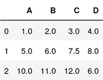

## 理解 scikit-learn 估算器 API

在上一节中，我们使用了scikit-learn中的`SimpleImputer`类来填补数据集中的缺失值。`SimpleImputer`类属于scikit-learn中所谓的**变换器**类，用于数据转换。此类估算器的两个基本方法是`fit`和`transform`。`fit`方法用于从训练数据中学习参数，而`transform`方法则使用这些参数来转换数据。任何需要转换的数据数组必须与用于拟合模型的数据数组具有相同的特征数量。

下图展示了如何在训练数据上安装变换器，并将其用于转换训练数据集和新的测试数据集：

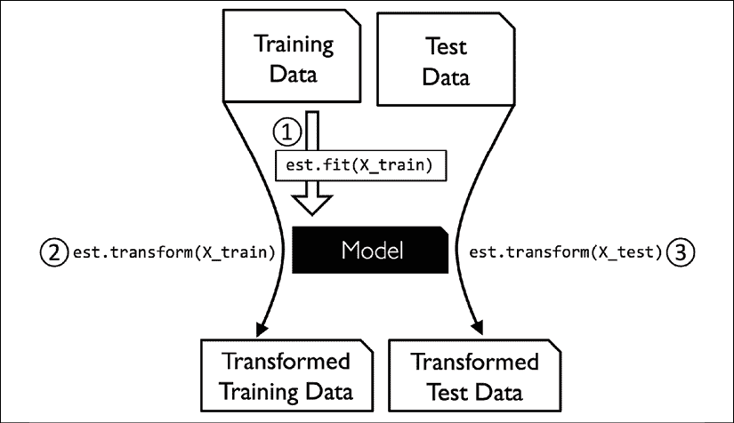

我们在*第3章*《使用scikit-learn的机器学习分类器巡礼》中使用的分类器属于scikit-learn中所谓的**估算器**，其API在概念上与变换器类非常相似。估算器具有`predict`方法，但也可以具有`transform`方法，正如你将在本章后面看到的那样。正如你可能记得的，我们在训练这些估算器进行分类时，也使用了`fit`方法来学习模型的参数。然而，在监督学习任务中，我们还提供了类标签来拟合模型，然后可以通过`predict`方法对新的未标记数据进行预测，如下图所示：

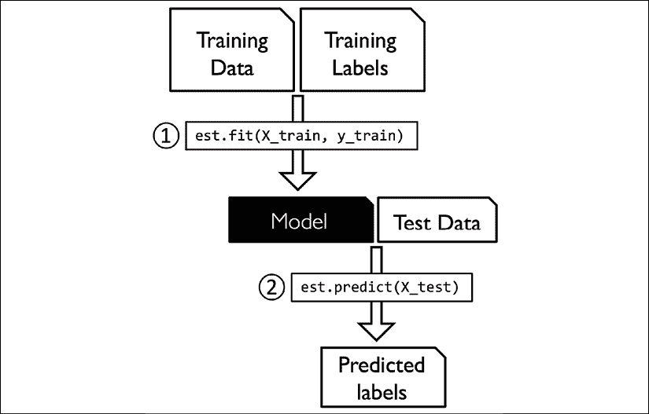

# 处理类别数据

到目前为止，我们只处理了数值型数据。然而，现实世界中的数据集常常包含一个或多个类别特征列。在本节中，我们将使用简单而有效的示例，看看如何在数值计算库中处理这类数据。

在讨论类别数据时，我们需要进一步区分**有序**和**无序**特征。可以理解为，有序特征是可以排序或排列的类别值。例如，T恤的尺寸是一个有序特征，因为我们可以定义顺序：*XL* > *L* > *M*。相比之下，无序特征没有任何排序含义，继续以T恤颜色为例，T恤颜色是无序特征，因为通常没有意义说红色比蓝色大。

## 使用pandas进行类别数据编码

在探讨处理此类类别数据的不同技术之前，让我们创建一个新的`DataFrame`来说明问题：

```py
>>> import pandas as pd
>>> df = pd.DataFrame([
...            ['green', 'M', 10.1, 'class2'],
...            ['red', 'L', 13.5, 'class1'],
...            ['blue', 'XL', 15.3, 'class2']])
>>> df.columns = ['color', 'size', 'price', 'classlabel']
>>> df
    color  size  price  classlabel
0   green     M   10.1      class2
1     red     L   13.5      class1
2    blue    XL   15.3      class2 
```

正如我们在前面的输出中所看到的，新创建的 `DataFrame` 包含一个名义特征（`color`）、一个顺序特征（`size`）和一个数值特征（`price`）列。类别标签（假设我们为监督学习任务创建了一个数据集）存储在最后一列。在本书中讨论的分类学习算法并不使用类别标签中的顺序信息。

## 映射顺序特征

为了确保学习算法正确解读顺序特征，我们需要将类别字符串值转换为整数。遗憾的是，没有方便的函数可以自动推导出我们 `size` 特征标签的正确顺序，因此我们必须手动定义映射。在以下简单示例中，假设我们知道特征之间的数值差异，例如，*XL* = *L* + 1 = *M* + 2：

```py
>>> size_mapping = {'XL': 3,
...                 'L': 2,
...                 'M': 1}
>>> df['size'] = df['size'].map(size_mapping)
>>> df
    color  size  price  classlabel
0   green     1   10.1      class2
1     red     2   13.5      class1
2    blue     3   15.3      class2 
```

如果我们希望在稍后的阶段将整数值转换回原始的字符串表示，我们可以简单地定义一个反向映射字典，`inv_size_mapping = {v: k for k, v in size_mapping.items()}`，然后通过 pandas 的 `map` 方法将其应用于转换后的特征列，它与我们之前使用的 `size_mapping` 字典类似。我们可以按如下方式使用它：

```py
>>> inv_size_mapping = {v: k for k, v in size_mapping.items()}
>>> df['size'].map(inv_size_mapping)
0   M
1   L
2   XL
Name: size, dtype: object 
```

## 编码类别标签

许多机器学习库要求类别标签以整数值进行编码。虽然 scikit-learn 中的大多数分类估计器会内部将类别标签转换为整数，但提供整数数组作为类别标签是良好的实践，避免了技术问题。为了编码类别标签，我们可以使用与之前讨论的顺序特征映射类似的方法。我们需要记住，类别标签是*非顺序的*，并且我们分配给特定字符串标签的整数值无关紧要。因此，我们可以简单地枚举类别标签，从 `0` 开始：

```py
>>> import numpy as np
>>> class_mapping = {label: idx for idx, label in
...                  enumerate(np.unique(df['classlabel']))}
>>> class_mapping
{'class1': 0, 'class2': 1} 
```

接下来，我们可以使用映射字典将类别标签转换为整数：

```py
>>> df['classlabel'] = df['classlabel'].map(class_mapping)
>>> df
    color  size  price  classlabel
0   green     1   10.1           1
1     red     2   13.5           0
2    blue     3   15.3           1 
```

我们可以通过如下方式反转映射字典中的键值对，将转换后的类别标签映射回原始的字符串表示：

```py
>>> inv_class_mapping = {v: k for k, v in class_mapping.items()}
>>> df['classlabel'] = df['classlabel'].map(inv_class_mapping)
>>> df
    color  size  price  classlabel
0   green     1   10.1      class2
1     red     2   13.5      class1
2    blue     3   15.3      class2 
```

或者，我们可以使用 scikit-learn 中直接实现的 `LabelEncoder` 类来方便地完成这个任务：

```py
>>> from sklearn.preprocessing import LabelEncoder
>>> class_le = LabelEncoder()
>>> y = class_le.fit_transform(df['classlabel'].values)
>>> y
array([1, 0, 1]) 
```

请注意，`fit_transform` 方法实际上是 `fit` 和 `transform` 方法的快捷方式，我们可以使用 `inverse_transform` 方法将整数类别标签转换回原始的字符串表示：

```py
>>> class_le.inverse_transform(y)
array(['class2', 'class1', 'class2'], dtype=object) 
```

## 对名义特征进行独热编码

在前面*映射顺序特征*的部分，我们使用了一个简单的字典映射方法，将有序的 `size` 特征转换为整数。由于 `scikit-learn` 的分类估算器将类标签视为没有任何顺序的类别数据（名义型数据），我们使用了方便的 `LabelEncoder` 将字符串标签编码为整数。看起来我们也可以使用类似的方法，将数据集中的名义型 `color` 列转换为整数，如下所示：

```py
>>> X = df[['color', 'size', 'price']].values
>>> color_le = LabelEncoder()
>>> X[:, 0] = color_le.fit_transform(X[:, 0])
>>> X
array([[1, 1, 10.1],
       [2, 2, 13.5],
       [0, 3, 15.3]], dtype=object) 
```

执行前述代码后，NumPy 数组 `X` 的第一列现在保存了新的 `color` 值，这些值被编码如下：

+   `blue = 0`

+   `green = 1`

+   `red = 2`

如果我们在此停止，并将数组输入到分类器中，我们将犯下处理类别数据时最常见的错误之一。你能发现问题吗？尽管颜色值没有任何特定顺序，但学习算法现在会假设 `green` 大于 `blue`，并且 `red` 大于 `green`。尽管这个假设不正确，算法仍然可能产生有用的结果。然而，这些结果并不会是最优的。

解决这个问题的常见方法是使用一种称为**独热编码**的技术。这种方法的思路是为名义型特征列中的每个唯一值创建一个新的虚拟特征。在这里，我们将把 `color` 特征转换为三个新特征：`blue`、`green` 和 `red`。然后可以使用二进制值来表示一个示例的具体 `color`；例如，一个 `blue` 示例可以被编码为 `blue=1`、`green=0`、`red=0`。为了执行这一转换，我们可以使用 `scikit-learn` 的 `preprocessing` 模块中实现的 `OneHotEncoder`：

```py
>>> from sklearn.preprocessing import OneHotEncoder
>>> X = df[['color', 'size', 'price']].values
>>> color_ohe = OneHotEncoder()
>>> color_ohe.fit_transform(X[:, 0].reshape(-1, 1)).toarray()
    array([[0., 1., 0.],
           [0., 0., 1.],
           [1., 0., 0.]]) 
```

注意，我们只对单列 `(X[:, 0].reshape(-1, 1))` 应用了 `OneHotEncoder`，以避免修改数组中的其他两列。如果我们希望在多特征数组中有选择地转换列，可以使用 `ColumnTransformer`，它接受一组 `(name, transformer, column(s))` 元组，如下所示：

```py
>>> from sklearn.compose import ColumnTransformer
>>> X = df[['color', 'size', 'price']].values
>>> c_transf = ColumnTransformer([ 
...     ('onehot', OneHotEncoder(), [0]),
...     ('nothing', 'passthrough', [1, 2])
... ])
>>> c_transf.fit_transform(X).astype(float)
    array([[0.0, 1.0, 0.0, 1, 10.1],
           [0.0, 0.0, 1.0, 2, 13.5],
           [1.0, 0.0, 0.0, 3, 15.3]]) 
```

在前面的代码示例中，我们通过`'passthrough'`参数指定只修改第一列，保持其他两列不变。

使用 `pandas` 实现的 `get_dummies` 方法，是通过独热编码创建虚拟特征的一个更便捷的方式。应用于 `DataFrame` 时，`get_dummies` 方法只会转换字符串类型的列，而保持其他列不变：

```py
>>> pd.get_dummies(df[['price', 'color', 'size']])
    price  size  color_blue  color_green  color_red
0    10.1     1           0            1          0
1    13.5     2           0            0          1
2    15.3     3           1            0          0 
```

当我们使用独热编码数据集时，我们需要注意，这会引入多重共线性问题，这对某些方法（例如需要矩阵求逆的方法）可能是个问题。如果特征高度相关，则矩阵求逆在计算上会变得困难，这可能导致数值不稳定的估计。为了减少变量之间的相关性，我们可以简单地从独热编码数组中删除一个特征列。请注意，删除特征列并不会丢失任何重要信息；例如，如果我们删除了 `color_blue` 列，特征信息仍然得到保留，因为如果我们观察到 `color_green=0` 和 `color_red=0`，则意味着观察结果必须是 `blue`。

如果我们使用 `get_dummies` 函数，我们可以通过将 `drop_first` 参数设置为 `True` 来删除第一列，如以下代码示例所示：

```py
>>> pd.get_dummies(df[['price', 'color', 'size']],
...                drop_first=True)
    price  size  color_green  color_red
0    10.1     1            1          0
1    13.5     2            0          1
2    15.3     3            0          0 
```

为了通过 `OneHotEncoder` 删除冗余列，我们需要设置 `drop='first'`，并将 `categories='auto'` 设置如下：

```py
>>> color_ohe = OneHotEncoder(categories='auto', drop='first')
>>> c_transf = ColumnTransformer([
...            ('onehot', color_ohe, [0]),
...            ('nothing', 'passthrough', [1, 2])
... ])
>>> c_transf.fit_transform(X).astype(float)
array([[  1\. ,  0\. ,  1\. ,  10.1],
       [  0\. ,  1\. ,  2\. ,  13.5],
       [  0\. ,  0\. ,  3\. ,  15.3]]) 
```

**可选：编码有序特征**

如果我们不确定有序特征类别之间的数值差异，或者两个有序值之间的差异没有定义，我们也可以使用阈值编码来对它们进行编码，使用 0/1 值。例如，我们可以将特征 `size` 的值 M、L 和 XL 拆分为两个新特征，“x > M”和“x > L”。让我们来看一下原始 DataFrame：

```py
>>> df = pd.DataFrame([['green', 'M', 10.1,
...                     'class2'],
...                    ['red', 'L', 13.5,
...                     'class1'],
...                    ['blue', 'XL', 15.3,
...                     'class2']])
>>> df.columns = ['color', 'size', 'price',
...               'classlabel']
>>> df 
```

我们可以使用 pandas DataFrame 的 apply 方法编写自定义的 lambda 表达式，采用值阈值方法对这些变量进行编码：

```py
>>> df['x > M'] = df['size'].apply(
...     lambda x: 1 if x in {'L', 'XL'} else 0)
>>> df['x > L'] = df['size'].apply(
...     lambda x: 1 if x == 'XL' else 0)
>>> del df['size']
>>> df 
```

# 将数据集划分为独立的训练集和测试集

我们在 *第 1 章*《让计算机从数据中学习》和 *第 3 章*《使用 scikit-learn 进行机器学习分类器的概览》中简要介绍了将数据集划分为独立的训练集和测试集的概念。请记住，在测试集上比较预测结果与真实标签，可以理解为我们对模型在将其应用于真实世界之前进行的无偏性能评估。在本节中，我们将准备一个新的数据集——**Wine** 数据集。预处理完数据集后，我们将探索不同的特征选择技术，以减少数据集的维度。

Wine 数据集是另一个可以从 UCI 机器学习库获取的开源数据集（[https://archive.ics.uci.edu/ml/datasets/Wine](https://archive.ics.uci.edu/ml/datasets/Wine)）；它包含 178 个葡萄酒样本，具有描述不同化学属性的 13 个特征。

**获取 Wine 数据集**

你可以在本书的代码包中找到 Wine 数据集（以及本书中使用的所有其他数据集）的副本，如果你在离线工作或 UCI 服务器上的 [https://archive.ics.uci.edu/ml/machine-learning-databases/wine/wine.data](https://archive.ics.uci.edu/ml/machine-learning-databases/wine/wine.data) 临时不可用，可以使用该副本。例如，要从本地目录加载 Wine 数据集，你可以替换这一行：

```py
df = pd.read_csv(
    'https://archive.ics.uci.edu/ml/'
    'machine-learning-databases/wine/wine.data',
    header=None) 
```

采用如下方式：

```py
df = pd.read_csv(
    'your/local/path/to/wine.data', header=None) 
```

使用 pandas 库，我们将直接从 UCI 机器学习库中读取开源的 Wine 数据集：

```py
>>> df_wine = pd.read_csv('https://archive.ics.uci.edu/'
...                       'ml/machine-learning-databases/'
...                       'wine/wine.data', header=None)
>>> df_wine.columns = ['Class label', 'Alcohol',
...                    'Malic acid', 'Ash',
...                    'Alcalinity of ash', 'Magnesium',
...                    'Total phenols', 'Flavanoids',
...                    'Nonflavanoid phenols',
...                    'Proanthocyanins',
...                    'Color intensity', 'Hue',
...                    'OD280/OD315 of diluted wines',
...                    'Proline']
>>> print('Class labels', np.unique(df_wine['Class label']))
Class labels [1 2 3]
>>> df_wine.head() 
```

Wine 数据集中的 13 个不同特征，描述了 178 个葡萄酒样本的化学属性，列在下表中：

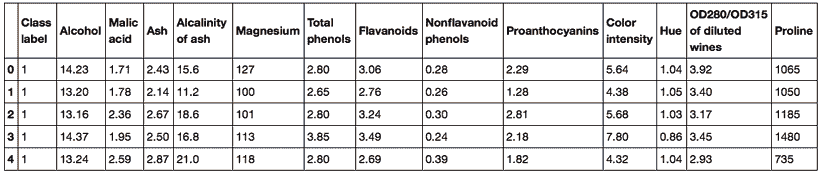

这些样本属于三种不同的类别，`1`、`2` 和 `3`，分别表示意大利同一地区种植的三种不同类型的葡萄，但它们来自不同的葡萄酒品种，具体见数据集概述（[https://archive.ics.uci.edu/ml/machine-learning-databases/wine/wine.names](https://archive.ics.uci.edu/ml/machine-learning-databases/wine/wine.names)）。

一种方便的方式是使用 scikit-learn 中 `model_selection` 子模块的 `train_test_split` 函数，随机将该数据集分割成测试集和训练集：

```py
>>> from sklearn.model_selection import train_test_split
>>> X, y = df_wine.iloc[:, 1:].values, df_wine.iloc[:, 0].values
>>> X_train, X_test, y_train, y_test =\
...     train_test_split(X, y,
...                      test_size=0.3,
...                      random_state=0,
...                      stratify=y) 
```

首先，我们将特征列 1-13 的 NumPy 数组表示赋值给变量 `X`，将第一列的类别标签赋值给变量 `y`。然后，我们使用 `train_test_split` 函数将 `X` 和 `y` 随机分割为训练集和测试集。通过设置 `test_size=0.3`，我们将 30% 的葡萄酒样本分配给 `X_test` 和 `y_test`，其余 70% 的样本分别分配给 `X_train` 和 `y_train`。将类别标签数组 `y` 作为 `stratify` 的参数，确保训练集和测试集的类别比例与原始数据集一致。

**选择适当的比例将数据集分割为训练集和测试集**

如果我们将数据集划分为训练集和测试集，我们必须记住，我们是在扣留学习算法可能受益的有价值信息。因此，我们不希望将过多信息分配给测试集。然而，测试集越小，泛化误差的估计就会越不准确。将数据集划分为训练集和测试集的关键在于平衡这种权衡。在实践中，最常用的划分比例是60:40、70:30或80:20，具体取决于初始数据集的大小。然而，对于大型数据集，90:10或99:1的划分也很常见且适用。例如，如果数据集包含超过100,000个训练样本，可能只需保留10,000个样本用于测试，就能很好地估算泛化性能。更多信息和示例可以在我的文章《模型评估、模型选择和算法选择》中找到，该文章在[https://arxiv.org/pdf/1811.12808.pdf](https://arxiv.org/pdf/1811.12808.pdf)上可以免费获取。

此外，模型训练和评估后，不是丢弃分配的测试数据，而是通常会在整个数据集上重新训练分类器，因为这样可以提高模型的预测性能。虽然这种方法通常被推荐，但如果数据集较小且测试数据集中包含异常值，比如说，可能会导致更差的泛化性能。另外，在对整个数据集重新拟合模型后，我们就没有任何独立的数据来评估其性能了。

# 将特征映射到相同的尺度

**特征缩放**是我们预处理管道中的一个关键步骤，然而它很容易被遗忘。**决策树**和**随机森林**是少数几个我们不需要担心特征缩放的机器学习算法。这些算法对尺度具有不变性。然而，大多数机器学习和优化算法在特征处于相同尺度时表现得更好，正如我们在《第2章：训练简单机器学习算法进行分类》中看到的，当我们实现**梯度下降优化**算法时就是这样。

特征缩放的重要性可以通过一个简单的例子来说明。假设我们有两个特征，其中一个特征的量表范围是1到10，另一个特征的量表范围是1到100,000。

当我们回想起《第2章：训练简单机器学习算法进行分类》中的Adaline的平方误差函数时，我们可以理解为什么说该算法主要会根据第二个特征中的较大误差来优化权重。另一个例子是**k近邻**（**KNN**）算法，它使用欧几里得距离度量：计算出的样本之间的距离将主要受第二个特征轴的影响。

现在，有两种常见的方法将不同的特征带到相同的尺度：**归一化**和**标准化**。这些术语在不同领域中经常被使用得比较随意，其含义需要从上下文中推断出来。通常，归一化指的是将特征重缩放到[0, 1]的范围内，这实际上是**最小-最大缩放**的一种特殊情况。为了归一化我们的数据，我们可以简单地对每个特征列应用最小-最大缩放，其中某个示例的新的值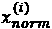，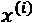，可以按如下方式计算：

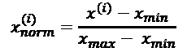

在这里，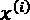是一个特定的例子，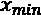是特征列中的最小值，而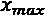是最大值。

最小-最大缩放过程已经在scikit-learn中实现，可以如下使用：

```py
>>> from sklearn.preprocessing import MinMaxScaler
>>> mms = MinMaxScaler()
>>> X_train_norm = mms.fit_transform(X_train)
>>> X_test_norm = mms.transform(X_test) 
```

尽管通过最小-最大缩放进行归一化是一种常用的技术，适用于我们需要将值限定在一个有界区间内的情况，但标准化对于许多机器学习算法来说可能更为实用，特别是对于像梯度下降这样的优化算法。原因是许多线性模型，如*第3章*中提到的逻辑回归和SVM（*使用scikit-learn进行机器学习分类器巡礼*），通常将权重初始化为0或接近0的小随机值。通过标准化，我们将特征列的均值置为0，标准差为1，这样特征列具有与标准正态分布（零均值和单位方差）相同的参数，从而更容易学习权重。此外，标准化保持了关于离群值的有用信息，并且使得算法对离群值不那么敏感，而与最小-最大缩放不同，后者将数据缩放到有限的值范围内。

标准化的过程可以通过以下方程式表示：

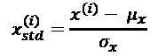

在这里，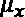是特定特征列的样本均值，而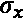是对应的标准差。

以下表格展示了标准化和归一化两种常用特征缩放技术在一个简单示例数据集（包含0到5的数字）中的区别：

| **输入** | **标准化** | **最小-最大归一化** |
| --- | --- | --- |
| 0.0 | -1.46385 | 0.0 |
| 1.0 | -0.87831 | 0.2 |
| 2.0 | -0.29277 | 0.4 |
| 3.0 | 0.29277 | 0.6 |
| 4.0 | 0.87831 | 0.8 |
| 5.0 | 1.46385 | 1.0 |

你可以通过执行以下代码示例手动进行标准化和归一化，如表所示：

```py
>>> ex = np.array([0, 1, 2, 3, 4, 5])
>>> print('standardized:', (ex - ex.mean()) / ex.std())
standardized: [-1.46385011  -0.87831007  -0.29277002  0.29277002
0.87831007  1.46385011]
>>> print('normalized:', (ex - ex.min()) / (ex.max() - ex.min()))
normalized: [ 0\.  0.2  0.4  0.6  0.8  1\. ] 
```

与`MinMaxScaler`类类似，scikit-learn还实现了标准化的类：

```py
>>> from sklearn.preprocessing import StandardScaler
>>> stdsc = StandardScaler()
>>> X_train_std = stdsc.fit_transform(X_train)
>>> X_test_std = stdsc.transform(X_test) 
```

再次强调，我们仅在训练数据上拟合一次`StandardScaler`类，并使用这些参数来转换测试数据集或任何新的数据点。

scikit-learn 提供了其他更先进的特征缩放方法，如 `RobustScaler`。如果我们处理的是包含许多异常值的小型数据集，`RobustScaler`尤其有帮助并且推荐使用。类似地，如果应用于该数据集的机器学习算法容易**过拟合**，那么 `RobustScaler` 是一个不错的选择。`RobustScaler` 独立地操作每个特征列，去除中位数值，并根据数据集的第1四分位数和第3四分位数（即第25和第75百分位数）对数据集进行缩放，从而使极端值和异常值不那么显著。感兴趣的读者可以在官方的 scikit-learn 文档中找到有关 `RobustScaler` 的更多信息，链接：[https://scikit-learn.org/stable/modules/generated/sklearn.preprocessing.RobustScaler.html](https://scikit-learn.org/stable/modules/generated/sklearn.preprocessing.RobustScaler.html)

# 选择有意义的特征

如果我们注意到模型在训练数据集上的表现远远优于在测试数据集上的表现，这一观察结果是过拟合的强烈指示。正如我们在*第三章*，*使用 scikit-learn 进行机器学习分类器巡礼*中所讨论的，过拟合意味着模型对训练数据集中的特定观察结果拟合得过于紧密，但对新数据的泛化能力较差；我们称模型具有**高方差**。过拟合的原因是我们的模型对于给定的训练数据过于复杂。减少泛化误差的常见解决方案如下：

+   收集更多的训练数据

+   通过正则化引入复杂度的惩罚

+   选择一个更简单的模型，减少参数数量

+   降低数据的维度

收集更多训练数据通常不可行。在*第六章*，*模型评估和超参数调优的最佳实践学习*中，我们将学习一种有用的技术来检查更多的训练数据是否有效。在接下来的章节中，我们将探讨通过正则化和特征选择进行降维的常见方法，从而通过减少需要拟合到数据的参数数量来简化模型。

## L1 和 L2 正则化作为针对模型复杂度的惩罚

你还记得在*第三章*，*使用 scikit-learn 进行机器学习分类器巡礼*中，**L2 正则化**是通过惩罚较大的单个权重来减少模型复杂度的一种方法。我们将权重向量 *w* 的平方 L2 范数定义如下：

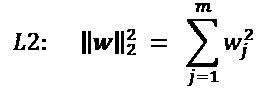

另一种减少模型复杂度的方法是相关的**L1 正则化**：

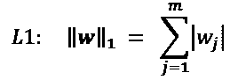

在这里，我们只是将权重的平方替换为权重绝对值的和。与L2正则化不同，L1正则化通常会产生稀疏的特征向量，大多数特征权重会为零。如果我们有一个高维数据集，且许多特征是无关的，稀疏性在实践中会非常有用，特别是在特征维度比训练样本还多的情况下。从这个角度看，L1正则化可以理解为一种特征选择技术。

## L2正则化的几何解释

如前所述，L2正则化向成本函数添加一个惩罚项，这使得相比于使用未正则化成本函数训练的模型，得到的权重值更加温和。

为了更好地理解L1正则化如何鼓励稀疏性，让我们退一步，看看正则化的几何解释。我们将绘制两个权重系数的凸成本函数的等高线，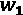 和 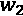。

在这里，我们将考虑**平方误差和**（**SSE**）成本函数，这是我们在*第二章*《训练简单的机器学习分类算法》中为Adaline使用的，因为它是球形的，比逻辑回归的成本函数更容易绘制；但是，相同的概念适用。记住，我们的目标是找到最小化训练数据成本函数的权重系数组合，如下图所示（椭圆中心的点）：

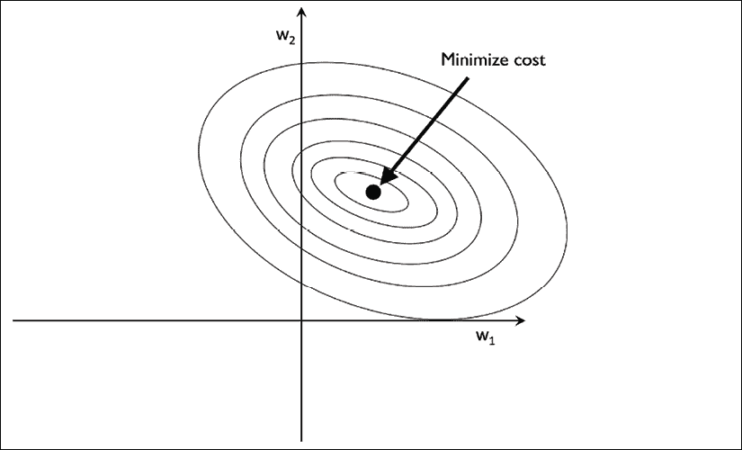

我们可以把正则化看作是向成本函数中添加一个惩罚项，以鼓励较小的权重；换句话说，我们对大权重进行惩罚。因此，通过通过正则化参数增加正则化强度，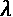，我们将权重收缩至零，并减少模型对训练数据的依赖。让我们通过以下图示来说明L2惩罚项的概念：

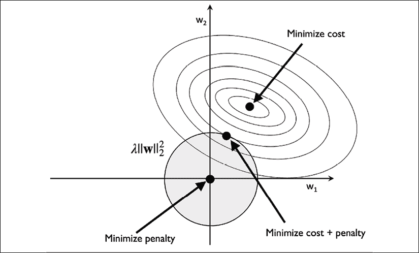

二次 L2 正则化项由阴影球体表示。在这里，我们的权重系数不能超过我们的正则化预算——权重系数的组合不能超出阴影区域。另一方面，我们仍然希望最小化成本函数。在惩罚约束下，我们的最佳努力是选择 L2 球体与未加惩罚的成本函数等高线交点的位置。正则化参数的值越大，惩罚成本增长得越快，从而导致 L2 球体变得更窄。例如，如果我们将正则化参数增大至无穷大，权重系数将有效地变为零，表示为 L2 球体的中心。总结这个例子的主要信息，我们的目标是最小化未加惩罚的成本与惩罚项的和，可以理解为增加偏置并倾向于选择更简单的模型，以减少在缺乏足够训练数据的情况下对模型的方差拟合。

## L1 正则化下的稀疏解

现在，让我们讨论一下 L1 正则化与稀疏性。L1 正则化背后的主要概念与我们在前一节讨论的相似。然而，由于 L1 惩罚是绝对权重系数的和（记住 L2 项是二次的），我们可以将其表示为一个菱形预算，如下图所示：

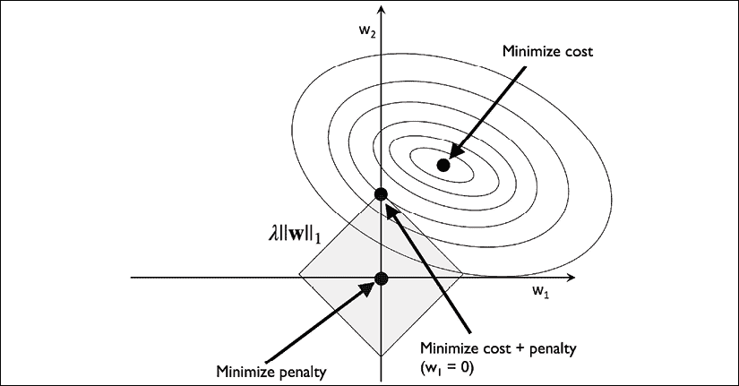

在前面的图中，我们可以看到成本函数的等高线在 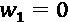 处触及 L1 菱形。由于 L1 正则化系统的等高线较为尖锐，因此最优解——即成本函数的椭圆与 L1 菱形边界的交点——更可能位于坐标轴上，这有助于稀疏性。

**L1 正则化与稀疏性**

L1 正则化能够导致稀疏解的数学细节超出了本书的范围。如果你有兴趣，可以参考*《统计学习的元素》*（*The Elements of Statistical Learning*）*第三章 3.4 节*，其中对 L2 与 L1 正则化的解释非常出色，作者为*Trevor Hastie*、*Robert Tibshirani* 和 *Jerome Friedman*，出版于*Springer Science*+*Business Media*，*2009*年。

对于支持 L1 正则化的 scikit-learn 正则化模型，我们只需将 `penalty` 参数设置为 `'l1'`，即可获得稀疏解：

```py
>>> from sklearn.linear_model import LogisticRegression
>>> LogisticRegression(penalty='l1',
...                    solver='liblinear',
...                    multi_class='ovr') 
```

请注意，我们还需要选择一个不同的优化算法（例如，`solver='liblinear'`），因为 `'lbfgs'` 当前不支持 L1 正则化的损失优化。应用于标准化后的葡萄酒数据，L1 正则化的逻辑回归将得到如下稀疏解：

```py
>>> lr = LogisticRegression(penalty='l1',
...                         C=1.0,
...                         solver='liblinear',
...                         multi_class='ovr')
# Note that C=1.0 is the default. You can increase
# or decrease it to make the regularization effect
# stronger or weaker, respectively.
>>> lr.fit(X_train_std, y_train)
>>> print('Training accuracy:', lr.score(X_train_std, y_train))
Training accuracy: 1.0
>>> print('Test accuracy:', lr.score(X_test_std, y_test))
Test accuracy: 1.0 
```

训练和测试的准确率（均为 100%）表明我们的模型在两个数据集上都表现得非常完美。当我们通过 `lr.intercept_` 属性访问截距项时，可以看到返回的数组包含三个值：

```py
>>> lr.intercept_
array([-1.26346036, -1.21584018, -2.3697841 ]) 
```

由于我们通过**一对其余**（**OvR**）方法在多类数据集上拟合了`LogisticRegression`对象，第一个截距属于拟合类1与类2、类3之间的模型，第二个值是拟合类2与类1、类3之间的模型的截距，第三个值是拟合类3与类1、类2之间的模型的截距：

```py
>>> lr.coef_
array([[ 1.24590762,  0.18070219,  0.74375939, -1.16141503,
         0\.        ,  0\.        ,  1.16926815,  0\.        ,
         0\.        ,  0\.        ,  0\.        ,  0.54784923,
         2.51028042],
       [-1.53680415, -0.38795309, -0.99494046,  0.36508729,
        -0.05981561,  0\.        ,  0.6681573 ,  0\.        ,
         0\.        , -1.93426485,  1.23265994,  0\.        ,
        -2.23137595],
       [ 0.13547047,  0.16873019,  0.35728003,  0\.        ,
         0\.        ,  0\.        , -2.43713947,  0\.        ,
         0\.        ,  1.56351492, -0.81894749, -0.49308407,
         0\.        ]]) 
```

我们通过`lr.coef_`属性访问到的权重数组包含三行权重系数，每行对应一个类别的权重向量。每一行包含13个权重，每个权重与13维的Wine数据集中的相应特征相乘，以计算净输入：

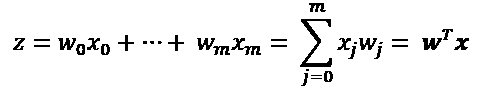

**访问scikit-learn估计器的偏置和权重参数**

在scikit-learn中，`intercept_`对应于 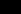，`coef_`对应于 *j* > 0时的值 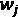。

由于L1正则化的结果，正如前文所述，L1正则化作为特征选择的一种方法，我们刚刚训练了一个对数据集中可能不相关特征具有鲁棒性的模型。然而，严格来说，前一个示例中的权重向量不一定是稀疏的，因为它们包含的非零项多于零项。然而，我们可以通过进一步增加正则化强度来强制执行稀疏性（即选择较低的`C`参数值）。

在本章最后一个关于正则化的示例中，我们将调整正则化强度并绘制正则化路径——不同正则化强度下不同特征的权重系数：

```py
>>> import matplotlib.pyplot as plt
>>> fig = plt.figure()
>>> ax = plt.subplot(111)
>>> colors = ['blue', 'green', 'red', 'cyan',
...           'magenta', 'yellow', 'black',
...           'pink', 'lightgreen', 'lightblue',
...           'gray', 'indigo', 'orange']
>>> weights, params = [], []
>>> for c in np.arange(-4., 6.):
...     lr = LogisticRegression(penalty='l1', C=10.**c,
...                             solver='liblinear',
...                             multi_class='ovr', random_state=0)
...     lr.fit(X_train_std, y_train)
...     weights.append(lr.coef_[1])
...     params.append(10**c)
>>> weights = np.array(weights)
>>> for column, color in zip(range(weights.shape[1]), colors):
...     plt.plot(params, weights[:, column],
...              label=df_wine.columns[column + 1],
...              color=color)
>>> plt.axhline(0, color='black', linestyle='--', linewidth=3)
>>> plt.xlim([10**(-5), 10**5])
>>> plt.ylabel('weight coefficient')
>>> plt.xlabel('C')
>>> plt.xscale('log')
>>> plt.legend(loc='upper left')
>>> ax.legend(loc='upper center',
...           bbox_to_anchor=(1.38, 1.03),
...           ncol=1, fancybox=True)
>>> plt.show() 
```

生成的图表为我们提供了进一步的见解，帮助我们了解L1正则化的行为。如我们所见，如果我们用强正则化参数惩罚模型（*C* < 0.01），所有特征权重将为零；*C*是正则化参数的倒数，！[](img/B13208_04_020.png)：

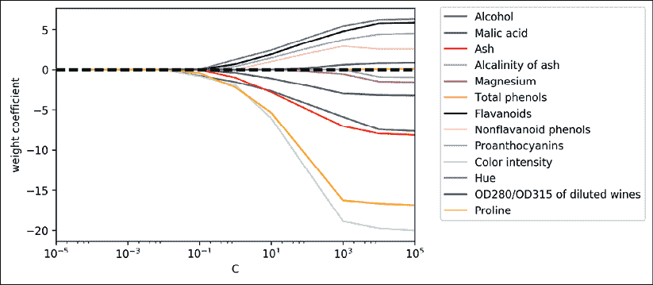

## 顺序特征选择算法

减少模型复杂度并避免过拟合的另一种方法是通过特征选择进行**降维**，这对于未经正则化的模型尤其有用。降维技术主要分为两类：**特征选择**和**特征提取**。通过特征选择，我们选择原始特征的子集，而在特征提取中，我们从特征集合中提取信息来构造一个新的特征子空间。

在本节中，我们将介绍一类经典的特征选择算法。在下一章，*第5章*，*通过降维压缩数据*，我们将学习不同的特征提取技术，将数据集压缩到低维特征子空间。

顺序特征选择算法是一类贪心搜索算法，旨在将初始的 *d* 维特征空间减少到一个 *k* 维的特征子空间，其中 *k*<*d*。特征选择算法的动机是自动选择与问题最相关的特征子集，以提高计算效率，或者通过移除无关特征或噪声来减少模型的泛化误差，这对于不支持正则化的算法尤为有用。

一种经典的顺序特征选择算法是 **顺序后向选择**（**SBS**），其目标是在尽量减少分类器性能下降的情况下，降低初始特征子空间的维度，从而提高计算效率。在某些情况下，如果模型存在过拟合，SBS甚至可以提高模型的预测能力。

**贪心搜索算法**

**贪心算法**在组合搜索问题的每个阶段做出局部最优选择，通常会导致次优解，而与之相对的是 **穷举搜索算法**，它评估所有可能的组合，并保证找到最优解。然而，在实际应用中，穷举搜索通常计算上不可行，而贪心算法则提供了一种更简单、计算上更高效的解决方案。

SBS算法背后的思想相当简单：SBS顺序地从完整特征子集中移除特征，直到新的特征子空间包含所需的特征数量。为了确定每个阶段要移除哪个特征，我们需要定义准则函数 *J*，以便最小化它。

由准则函数计算出的准则可以简单地是分类器在移除特定特征前后的性能差异。然后，在每个阶段要移除的特征可以简单地定义为最大化该准则的特征；或者用更简单的说法，每个阶段我们移除那个在移除后造成性能损失最小的特征。根据前述的SBS定义，我们可以将算法概括为四个简单的步骤：

1.  初始化算法时，设定 *k* = *d*，其中 *d* 是完整特征空间的维度，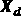。

1.  确定最大化准则的特征，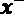，其准则为：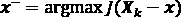，其中！[](img/B13208_04_024.png)。

1.  从特征集 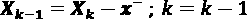 中移除特征 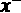。

1.  如果 *k* 等于所需的特征数，则终止；否则，转到步骤2。

**顺序特征算法的资源**

你可以在 *《大规模特征选择技术的比较研究》* 中找到对几种顺序特征算法的详细评估，*F. Ferri*、*P. Pudil*、*M. Hatef* 和 *J. Kittler*，第403-413页，*1994*。

不幸的是，SBS算法还未在scikit-learn中实现。但由于它非常简单，我们就来手动实现它，使用Python从头开始编写：

```py
from sklearn.base import clone
from itertools import combinations
import numpy as np
from sklearn.metrics import accuracy_score
from sklearn.model_selection import train_test_split
class SBS():
    def __init__(self, estimator, k_features,
                 scoring=accuracy_score,
                 test_size=0.25, random_state=1):
        self.scoring = scoring
        self.estimator = clone(estimator)
        self.k_features = k_features
        self.test_size = test_size
        self.random_state = random_state
    def fit(self, X, y):
        X_train, X_test, y_train, y_test = \
            train_test_split(X, y, test_size=self.test_size,
                             random_state=self.random_state)

        dim = X_train.shape[1]
        self.indices_ = tuple(range(dim))
        self.subsets_ = [self.indices_]
        score = self._calc_score(X_train, y_train,
                                 X_test, y_test, self.indices_)
        self.scores_ = [score]
        while dim > self.k_features:
            scores = []
            subsets = []

            for p in combinations(self.indices_, r=dim - 1):
                score = self._calc_score(X_train, y_train,
                                         X_test, y_test, p)
                scores.append(score)
                subsets.append(p)

            best = np.argmax(scores)
            self.indices_ = subsets[best]
            self.subsets_.append(self.indices_)
            dim -= 1

            self.scores_.append(scores[best])
        self.k_score_ = self.scores_[-1]

        return self

    def transform(self, X):
        return X[:, self.indices_]

    def _calc_score(self, X_train, y_train, X_test, y_test, indices):
        self.estimator.fit(X_train[:, indices], y_train)
        y_pred = self.estimator.predict(X_test[:, indices])
        score = self.scoring(y_test, y_pred)
        return score 
```

在之前的实现中，我们定义了`k_features`参数来指定我们希望返回的特征数量。默认情况下，我们使用来自scikit-learn的`accuracy_score`来评估模型（分类估计器）在特征子集上的表现。

在`fit`方法的`while`循环内部，`itertools.combination`函数创建的特征子集被评估并逐步减少，直到特征子集具有所需的维度。在每次迭代中，基于内部创建的测试数据集`X_test`，最佳子集的准确度得分会被收集到一个列表`self.scores_`中。我们稍后会使用这些得分来评估结果。最终特征子集的列索引被分配给`self.indices_`，我们可以通过`transform`方法使用它，返回一个包含所选特征列的新数据数组。请注意，`fit`方法内部并没有显式地计算标准，而是通过直接移除不在最佳表现特征子集中的特征来实现。

现在，让我们看看使用scikit-learn中的KNN分类器的SBS实现效果：

```py
>>> import matplotlib.pyplot as plt
>>> from sklearn.neighbors import KNeighborsClassifier
>>> knn = KNeighborsClassifier(n_neighbors=5)
>>> sbs = SBS(knn, k_features=1)
>>> sbs.fit(X_train_std, y_train) 
```

尽管我们的SBS实现已经在`fit`函数内部将数据集拆分为测试集和训练集，但我们仍然将训练数据集`X_train`输入给算法。SBS的`fit`方法会为测试（验证）和训练创建新的训练子集，这就是为什么这个测试集也被称为**验证数据集**。这种方法是必要的，以防我们的*原始*测试集成为训练数据的一部分。

记住，我们的SBS算法会在每个阶段收集最佳特征子集的得分，因此让我们进入实现中更激动人心的部分，绘制基于验证数据集计算的KNN分类器的分类准确率。代码如下：

```py
>>> k_feat = [len(k) for k in sbs.subsets_]
>>> plt.plot(k_feat, sbs.scores_, marker='o')
>>> plt.ylim([0.7, 1.02])
>>> plt.ylabel('Accuracy')
>>> plt.xlabel('Number of features')
>>> plt.grid()
>>> plt.tight_layout()
>>> plt.show() 
```

如下图所示，我们可以看到，当我们减少特征数量时，KNN分类器在验证数据集上的准确度得到了提升，这很可能是由于我们在*第3章*《使用scikit-learn进行机器学习分类器之旅》中讨论的**维度灾难**的减少。同时，我们也可以在下图中看到，分类器在*k*={*3, 7, 8, 9, 10, 11, 12*}时，达到了100%的准确率：

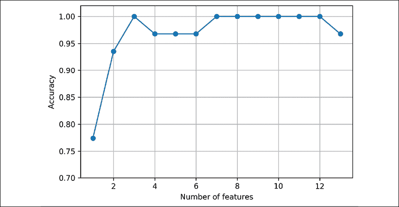

为了满足我们的好奇心，让我们看看最小的特征子集（*k*=*3*），它在验证数据集上表现得如此出色：

```py
>>> k3 = list(sbs.subsets_[10])
>>> print(df_wine.columns[1:][k3])
Index(['Alcohol', 'Malic acid', 'OD280/OD315 of diluted wines'], dtype='object') 
```

使用前面的代码，我们从`11`号位置的`sbs.subsets_`属性中获取了三特征子集的列索引，并从pandas Wine `DataFrame`的列索引中返回了相应的特征名称。

接下来，让我们评估KNN分类器在原始测试数据集上的表现：

```py
>>> knn.fit(X_train_std, y_train)
>>> print('Training accuracy:', knn.score(X_train_std, y_train))
Training accuracy: 0.967741935484
>>> print('Test accuracy:', knn.score(X_test_std, y_test))
Test accuracy: 0.962962962963 
```

在前面的代码部分，我们使用了完整的特征集，并在训练数据集上获得了约97%的准确率，在测试数据集上获得了约96%的准确率，这表明我们的模型已经能够很好地泛化到新数据上。现在，让我们使用选定的三个特征子集，看看KNN的表现如何：

```py
>>> knn.fit(X_train_std[:, k3], y_train)
>>> print('Training accuracy:',
...       knn.score(X_train_std[:, k3], y_train))
Training accuracy: 0.951612903226
>>> print('Test accuracy:',
...       knn.score(X_test_std[:, k3], y_test))
Test accuracy: 0.925925925926 
```

当在Wine数据集中使用不到原始特征的四分之一时，测试数据集上的预测准确性略有下降。这可能表明这三个特征提供的信息并不比原始数据集少。然而，我们也必须记住，Wine数据集是一个小数据集，非常容易受到随机性的影响——也就是说，我们如何将数据集划分为训练集和测试集，以及如何进一步将训练集划分为训练集和验证集。

尽管通过减少特征数量并没有提高KNN模型的性能，但我们缩小了数据集的大小，这在实际应用中可能很有用，尤其是当数据收集步骤非常昂贵时。另外，通过大幅减少特征数量，我们获得了更简洁的模型，*更易于解释*。

**scikit-learn中的特征选择算法**

通过scikit-learn，提供了更多的特征选择算法。这些算法包括基于特征权重的**递归后向消除**、通过重要性选择特征的基于树的方法，以及单变量统计检验。对不同特征选择方法的全面讨论超出了本书的范围，但可以在[http://scikit-learn.org/stable/modules/feature_selection.html](http://scikit-learn.org/stable/modules/feature_selection.html)找到一个很好的总结，并附有示例。你还可以在Python包`mlxtend`中找到与我们之前实现的简单SBS相关的几种不同类型的顺序特征选择的实现，地址是[http://rasbt.github.io/mlxtend/user_guide/feature_selection/SequentialFeatureSelector/](http://rasbt.github.io/mlxtend/user_guide/feature_selection/SequentialFeatureSelector/)。

# 使用随机森林评估特征重要性

在之前的章节中，你学习了如何通过逻辑回归使用 L1 正则化来将无关特征的系数归零，以及如何使用 SBS 算法进行特征选择并将其应用于 KNN 算法。另一种选择数据集中相关特征的有用方法是使用**随机森林**，这是一种集成技术，在*第 3 章*《使用 scikit-learn 进行机器学习分类器之旅》中有介绍。通过使用随机森林，我们可以通过计算森林中所有决策树的平均不纯度减少来衡量特征的重要性，而无需对数据是否线性可分作出任何假设。方便的是，scikit-learn 中的随机森林实现已经为我们收集了特征重要性值，因此在拟合 `RandomForestClassifier` 后，我们可以通过 `feature_importances_` 属性访问这些值。通过执行以下代码，我们将训练一个包含 500 棵树的森林，并根据它们各自的重要性度量对葡萄酒数据集中的 13 个特征进行排名——请记住，在*第 3 章*《使用 scikit-learn 进行机器学习分类器之旅》中我们讨论过，树模型不需要使用标准化或归一化的特征：

```py
>>> from sklearn.ensemble import RandomForestClassifier
>>> feat_labels = df_wine.columns[1:]
>>> forest = RandomForestClassifier(n_estimators=500,
...                                 random_state=1)
>>> forest.fit(X_train, y_train)
>>> importances = forest.feature_importances_
>>> indices = np.argsort(importances)[::-1]
>>> for f in range(X_train.shape[1]):
...     print("%2d) %-*s %f" % (f + 1, 30,
...                             feat_labels[indices[f]],
...                             importances[indices[f]]))
>>> plt.title('Feature Importance')
>>> plt.bar(range(X_train.shape[1]),
...         importances[indices],
...         align='center')
>>> plt.xticks(range(X_train.shape[1]),
...            feat_labels[indices] rotation=90)
>>> plt.xlim([-1, X_train.shape[1]])
>>> plt.tight_layout()
>>> plt.show()
 1) Proline                         0.185453
 2) Flavanoids                      0.174751
 3) Color intensity                 0.143920
 4) OD280/OD315 of diluted wines    0.136162
 5) Alcohol                         0.118529
 6) Hue                             0.058739
 7) Total phenols                   0.050872
 8) Magnesium                       0.031357
 9) Malic acid                      0.025648
 10) Proanthocyanins                0.025570
 11) Alcalinity of ash              0.022366
 12) Nonflavanoid phenols           0.013354
 13) Ash                            0.013279 
```

执行代码后，我们创建了一个图表，将葡萄酒数据集中不同特征按其相对重要性进行排名；请注意，特征重要性值已归一化，以便它们的总和为 1.0：

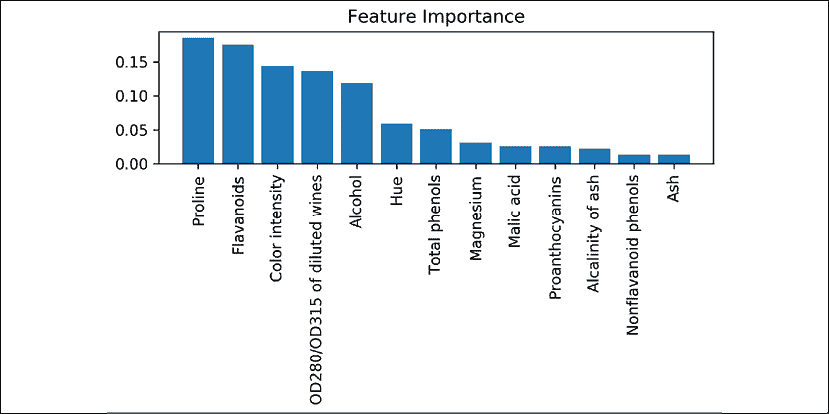

我们可以得出结论，葡萄酒的脯氨酸和类黄酮水平、颜色强度、OD280/OD315 衍射以及酒精浓度是数据集中最具辨别力的特征，这一结论基于 500 棵决策树中计算的平均不纯度减少。有趣的是，图表中排名靠前的两个特征也出现在我们在上一节中实现的 SBS 算法的三特征子集选择中（酒精浓度和稀释酒的 OD280/OD315）。

然而，就可解释性而言，随机森林技术有一个值得注意的重要*陷阱*。如果两个或多个特征高度相关，一个特征可能会被排名非常高，而另一个特征（或多个特征）的信息可能没有完全捕获。另一方面，如果我们仅对模型的预测性能感兴趣，而不是对特征重要性值的解释，则不需要担心这个问题。

总结这一节关于特征重要性值和随机森林的内容时，值得一提的是，scikit-learn 还实现了一个`SelectFromModel`对象，该对象在模型拟合后根据用户指定的阈值选择特征。如果我们想将`RandomForestClassifier`作为特征选择器，并作为scikit-learn `Pipeline`对象中的一个中间步骤，这非常有用，`Pipeline`允许我们将不同的预处理步骤与估计器连接起来，正如你将在*第六章*，*模型评估与超参数调优的最佳实践*中看到的那样。例如，我们可以将`threshold`设置为`0.1`，使用以下代码将数据集缩减为五个最重要的特征：

```py
>>> from sklearn.feature_selection import SelectFromModel
>>> sfm = SelectFromModel(forest, threshold=0.1, prefit=True)
>>> X_selected = sfm.transform(X_train)
>>> print('Number of features that meet this threshold', 
...       'criterion:', X_selected.shape[1])
Number of features that meet this threshold criterion: 5
>>> for f in range(X_selected.shape[1]):
...     print("%2d) %-*s %f" % (f + 1, 30,
...                             feat_labels[indices[f]],
...                             importances[indices[f]]))
 1) Proline                         0.185453
 2) Flavanoids                      0.174751
 3) Color intensity                 0.143920
 4) OD280/OD315 of diluted wines    0.136162
 5) Alcohol                         0.118529 
```

# 总结

我们在本章开始时探讨了确保正确处理缺失数据的有用技巧。在将数据输入到机器学习算法之前，我们还必须确保正确地编码分类变量，在这一章中，我们展示了如何将有序和名义特征值映射到整数表示。

此外，我们简要讨论了L1正则化，它通过减少模型的复杂性来帮助我们避免过拟合。作为移除无关特征的另一种方法，我们使用了一个序列特征选择算法，从数据集中选择有意义的特征。

在下一章中，你将学习到另一种有用的降维方法：特征提取。它允许我们将特征压缩到一个较低维度的子空间，而不是像特征选择那样完全去除特征。
