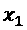
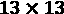
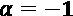
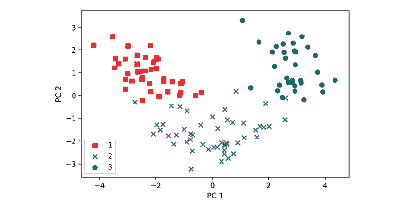
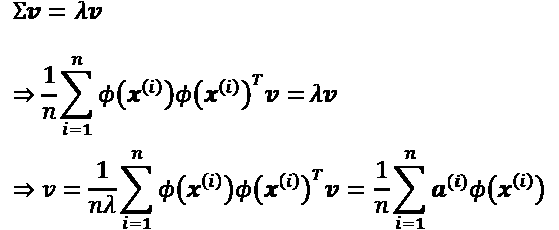
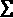
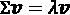

# 第五章：通过维度减少压缩数据

在*第4章*，*构建良好的训练数据集——数据预处理*中，您了解了使用不同特征选择技术来减少数据集维度的不同方法。另一种用于维度减少的特征选择方法是**特征提取**。在本章中，您将学习三种基本技术，它们将帮助您通过将数据转换到一个比原始数据低维的新特征子空间，从而总结数据集的信息内容。数据压缩是机器学习中的一个重要话题，它帮助我们存储和分析现代技术时代产生和收集的大量数据。

本章将涵盖以下主题：

+   **主成分分析**（**PCA**）用于无监督数据压缩

+   **线性判别分析**（**LDA**）作为一种监督式维度减少技术，用于最大化类分离度

+   通过**核主成分分析**（**KPCA**）的非线性维度减少

# 通过主成分分析进行无监督的维度减少

类似于特征选择，我们可以使用不同的特征提取技术来减少数据集中的特征数量。特征选择和特征提取的区别在于，使用特征选择算法（如**顺序后向选择**）时，我们保留原始特征，而使用特征提取时，我们将数据转换或投影到一个新的特征空间。

在维度减少的背景下，特征提取可以理解为一种数据压缩方法，目的是保持大部分相关信息。实际上，特征提取不仅用于提高存储空间或学习算法的计算效率，还可以通过减少**维度诅咒**来提高预测性能——特别是当我们使用非正则化模型时。

## 主成分分析的主要步骤

在本节中，我们将讨论主成分分析（PCA），这是一种无监督的线性变换技术，广泛应用于不同领域，最显著的应用包括特征提取和维度减少。PCA的其他常见应用包括探索性数据分析、股市交易中的信号去噪、以及生物信息学领域中基因组数据和基因表达水平的分析。

PCA帮助我们根据特征之间的相关性识别数据中的模式。简而言之，PCA旨在找到高维数据中最大方差的方向，并将数据投影到一个新的子空间，该子空间的维度与原始子空间相等或更少。新子空间的正交轴（主成分）可以解释为在新特征轴互相正交的约束下，最大方差的方向，如下图所示：


在前面的图中，和是原始特征轴，**PC1**和**PC2**是主成分。

如果我们使用PCA进行降维，我们构造一个-维的变换矩阵，*W*，它使我们能够将一个向量，*x*，即训练样本的特征，映射到一个新的*k*-维特征子空间，该子空间的维度比原始的*d*-维特征空间要低。例如，过程如下。假设我们有一个特征向量，*x*：


然后通过变换矩阵进行转换，：


从而得到输出向量：


由于将原始的*d*-维数据转换到这个新的*k*-维子空间（通常*k* << *d*）的结果，第一个主成分将具有最大的方差。所有后续的主成分将具有最大方差，前提是这些成分与其他主成分不相关（正交）——即使输入特征是相关的，结果主成分也会是互相正交的（不相关）。请注意，PCA的方向对数据缩放非常敏感，如果特征是以不同的尺度度量的，而我们希望为所有特征分配相等的重要性，那么我们需要在执行PCA之前对特征进行标准化。

在更详细地了解PCA降维算法之前，让我们用几个简单的步骤总结一下该方法：

1.  标准化*d*-维数据集。

1.  构建协方差矩阵。

1.  将协方差矩阵分解为其特征向量和特征值。

1.  按特征值的降序排列，以对相应的特征向量进行排序。

1.  选择与*k*个最大特征值相对应的*k*个特征向量，其中*k*是新特征子空间的维度（）。

1.  从“前面”的*k*个特征向量构建投影矩阵*W*。

1.  使用投影矩阵*W*对*d*-维输入数据集*X*进行变换，以获得新的*k*-维特征子空间。

在接下来的部分中，我们将逐步执行PCA，使用Python作为学习练习。然后，我们将看到如何使用scikit-learn更方便地执行PCA。

## 步骤提取主成分

在本小节中，我们将处理PCA的前四个步骤：

1.  标准化数据。

1.  构建协方差矩阵。

1.  获取协方差矩阵的特征值和特征向量。

1.  按照降序排列特征值，以对特征向量进行排序。

首先，我们将从 *第4章* 中使用过的Wine数据集开始加载：*构建良好的训练数据集——数据预处理*：

```py
>>> import pandas as pd
>>> df_wine = pd.read_csv('https://archive.ics.uci.edu/ml/'
...           'machine-learning-databases/wine/wine.data',
...           header=None) 
```

**获取Wine数据集**

你可以在本书的代码包中找到一份Wine数据集的副本（以及本书中使用的所有其他数据集），如果你在离线工作或者UCI服务器（[https://archive.ics.uci.edu/ml/machine-learning-databases/wine/wine.data](https://archive.ics.uci.edu/ml/machine-learning-databases/wine/wine.data)）暂时无法访问时，可以使用这份副本。例如，要从本地目录加载Wine数据集，你可以替换以下代码行：

```py
df = pd.read_csv(
    'https://archive.ics.uci.edu/ml/'
    'machine-learning-databases/wine/wine.data',
    header=None) 
```

以及以下条件：

```py
df = pd.read_csv(
    'your/local/path/to/wine.data',
    header=None) 
```

接下来，我们将Wine数据分为训练集和测试集，分别使用数据的70%和30%，并将其标准化为单位方差：

```py
>>> from sklearn.model_selection import train_test_split
>>> X, y = df_wine.iloc[:, 1:].values, df_wine.iloc[:, 0].values
>>> X_train, X_test, y_train, y_test = \
...     train_test_split(X, y, test_size=0.3,
...                      stratify=y,
...                      random_state=0)
>>> # standardize the features
>>> from sklearn.preprocessing import StandardScaler
>>> sc = StandardScaler()
>>> X_train_std = sc.fit_transform(X_train)
>>> X_test_std = sc.transform(X_test) 
```

完成前面的必要预处理代码后，接下来我们进入第二步：构建协方差矩阵。对称的  维协方差矩阵，其中 *d* 是数据集中的维度数，存储不同特征之间的成对协方差。例如，两个特征  和  在总体水平上的协方差可以通过以下公式计算：


这里， 和  分别是特征 *j* 和 *k* 的样本均值。请注意，如果我们对数据集进行了标准化，样本均值将为零。两个特征之间的正协方差表示这两个特征一起增加或减少，而负协方差则表示它们以相反的方向变化。例如，三个特征的协方差矩阵可以写成如下形式（注意， 代表希腊大写字母 sigma，与求和符号区分开）：


协方差矩阵的特征向量代表主成分（最大方差的方向），而相应的特征值则定义了它们的大小。在Wine数据集的情况下，我们将从该  维的协方差矩阵中获得13个特征向量和特征值。

现在，进入第三步，让我们获得协方差矩阵的特征对。如你从我们的线性代数入门课程中记得，特征向量 *v* 满足以下条件：


这里，是一个标量：特征值。由于手动计算特征向量和特征值是一个相当繁琐和复杂的任务，我们将使用NumPy的`linalg.eig`函数来获取Wine协方差矩阵的特征对：

```py
>>> import numpy as np
>>> cov_mat = np.cov(X_train_std.T)
>>> eigen_vals, eigen_vecs = np.linalg.eig(cov_mat)
>>> print('\nEigenvalues \n%s' % eigen_vals)
Eigenvalues
[ 4.84274532  2.41602459  1.54845825  0.96120438  0.84166161
  0.6620634   0.51828472  0.34650377  0.3131368   0.10754642
  0.21357215  0.15362835  0.1808613 ] 
```

使用`numpy.cov`函数，我们计算了标准化训练数据集的协方差矩阵。通过使用`linalg.eig`函数，我们进行了特征分解，得到一个向量（`eigen_vals`），其中包含13个特征值，以及存储为列的对应特征向量，保存在一个维度的矩阵（`eigen_vecs`）中。

**NumPy中的特征分解**

`numpy.linalg.eig`函数被设计为可以处理对称矩阵和非对称矩阵。然而，你可能会发现它在某些情况下返回复特征值。

一个相关的函数`numpy.linalg.eigh`已经实现，它用于分解厄米矩阵，这是处理对称矩阵（如协方差矩阵）的数值上更稳定的方法；`numpy.linalg.eigh`总是返回实特征值。

## 总方差和解释方差

由于我们希望通过将数据集压缩到一个新的特征子空间来减少数据的维度，因此我们只选择包含大部分信息（方差）的特征向量（主成分）的子集。特征值定义了特征向量的大小，因此我们需要按特征值的大小降序排序；我们关注的是基于其对应特征值的前*k*个特征向量。但在收集这*k*个最具信息量的特征向量之前，我们先绘制**方差解释比例**图。特征值的方差解释比例，，只是一个特征值，，与所有特征值总和的比值：


使用NumPy的`cumsum`函数，我们可以计算解释方差的累积和，然后通过Matplotlib的`step`函数绘制：

```py
>>> tot = sum(eigen_vals)
>>> var_exp = [(i / tot) for i in
...            sorted(eigen_vals, reverse=True)]
>>> cum_var_exp = np.cumsum(var_exp)
>>> import matplotlib.pyplot as plt
>>> plt.bar(range(1,14), var_exp, alpha=0.5, align='center',
...         label='Individual explained variance')
>>> plt.step(range(1,14), cum_var_exp, where='mid',
...          label='Cumulative explained variance')
>>> plt.ylabel('Explained variance ratio')
>>> plt.xlabel('Principal component index')
>>> plt.legend(loc='best')
>>> plt.tight_layout()
>>> plt.show() 
```

结果图表显示，单独的第一个主成分约占总方差的40%。

同时，我们还可以看到，前两个主成分组合解释了数据集近60%的方差：


尽管解释方差图让我们想起了我们在*第4章*，*构建良好的训练数据集—数据预处理*中通过随机森林计算的特征重要性值，但我们应该提醒自己，PCA是一种无监督方法，这意味着它忽略了类别标签的信息。而随机森林则使用类别成员信息来计算节点的杂质，方差则衡量了特征轴上值的分布。

## 特征转换

现在我们已经成功地将协方差矩阵分解为特征对，让我们继续进行最后三步，将Wine数据集变换到新的主成分轴上。接下来我们将处理的步骤如下：

1.  选择 *k* 个特征向量，这些特征向量对应于 *k* 个最大特征值，其中 *k* 是新特征子空间的维度（）。

1.  从“前 *k* ”个特征向量构造投影矩阵 *W*。

1.  使用投影矩阵 *W* 对 *d* 维输入数据集 *X* 进行变换，以获得新的 *k* 维特征子空间。

或者，用更通俗的说法，我们将按特征值的降序排序特征对，从选定的特征向量构建投影矩阵，并使用投影矩阵将数据变换到低维子空间。

我们首先按特征值降序排列特征对：

```py
>>> # Make a list of (eigenvalue, eigenvector) tuples
>>> eigen_pairs = [(np.abs(eigen_vals[i]), eigen_vecs[:, i])
...                for i in range(len(eigen_vals))]
>>> # Sort the (eigenvalue, eigenvector) tuples from high to low
>>> eigen_pairs.sort(key=lambda k: k[0], reverse=True) 
```

接下来，我们收集对应于两个最大特征值的两个特征向量，以捕捉数据集中约60%的方差。注意，选择了两个特征向量用于说明，因为稍后我们将在本小节中通过二维散点图绘制数据。实际上，主成分的数量需要通过计算效率与分类器性能之间的权衡来确定：

```py
>>> w = np.hstack((eigen_pairs[0][1][:, np.newaxis],
...                eigen_pairs[1][1][:, np.newaxis]))
>>> print('Matrix W:\n', w)
Matrix W:
[[-0.13724218   0.50303478]
 [ 0.24724326   0.16487119]
 [-0.02545159   0.24456476]
 [ 0.20694508  -0.11352904]
 [-0.15436582   0.28974518]
 [-0.39376952   0.05080104]
 [-0.41735106  -0.02287338]
 [ 0.30572896   0.09048885]
 [-0.30668347   0.00835233]
 [ 0.07554066   0.54977581]
 [-0.32613263  -0.20716433]
 [-0.36861022  -0.24902536]
 [-0.29669651   0.38022942]] 
```

执行前面的代码后，我们已从前两个特征向量创建了一个  维的投影矩阵 *W*。

**镜像投影**

根据你使用的NumPy和LAPACK版本，可能会得到带符号反转的矩阵 *W*。请注意，这不是问题；如果 *v* 是矩阵的特征向量 ，那么我们有：


这里，*v* 是特征向量，而 *–v* 也是特征向量，我们可以如下证明这一点。使用基本的代数，我们可以将方程两边同时乘以一个标量，：


由于矩阵乘法对于标量乘法是结合律的，我们可以将其重新排列为以下形式：


现在，我们可以看到  是一个特征向量，具有相同的特征值 ，适用于  和 。因此，*v* 和 *–v* 都是特征向量。

使用投影矩阵，我们现在可以将一个示例 *x*（表示为13维行向量）变换到PCA子空间（主成分一和二），得到 ，现在这是一个二维示例向量，由两个新特征组成：


```py
>>> X_train_std[0].dot(w)
array([ 2.38299011,  0.45458499]) 
```

类似地，我们可以通过计算矩阵点积，将整个  维训练数据集变换到两个主成分上：


```py
>>> X_train_pca = X_train_std.dot(w) 
```

最后，让我们将经过转换的 Wine 训练数据集（现在作为  维矩阵存储）在二维散点图中进行可视化：

```py
>>> colors = ['r', 'b', 'g']
>>> markers = ['s', 'x', 'o']
>>> for l, c, m in zip(np.unique(y_train), colors, markers):
...     plt.scatter(X_train_pca[y_train==l, 0],
...                 X_train_pca[y_train==l, 1],
...                 c=c, label=l, marker=m)
>>> plt.xlabel('PC 1')
>>> plt.ylabel('PC 2')
>>> plt.legend(loc='lower left')
>>> plt.tight_layout()
>>> plt.show() 
```

如我们在结果图中所见，数据沿着 *x* 轴——第一主成分——比第二主成分（*y* 轴）分布得更广，这与我们在前一小节中创建的解释方差比率图一致。然而，我们可以看出，线性分类器很可能能够很好地分离这些类别：



尽管我们在前述散点图中对类别标签信息进行了编码以便于说明，但我们必须牢记，PCA 是一种无监督技术，不使用任何类别标签信息。

## scikit-learn 中的主成分分析（PCA）

尽管前一小节中的详细方法帮助我们理解了 PCA 的内部工作原理，但现在我们将讨论如何使用 scikit-learn 中实现的 `PCA` 类。

`PCA` 类是 scikit-learn 中的另一个变换器类，我们首先使用训练数据拟合模型，然后使用相同的模型参数对训练数据和测试数据集进行变换。现在，让我们在 Wine 训练数据集上使用 scikit-learn 的 `PCA` 类，通过逻辑回归对转换后的样本进行分类，并通过我们在*第2章*中定义的 `plot_decision_regions` 函数可视化决策区域，*训练简单的机器学习分类算法*：

```py
from matplotlib.colors import ListedColormap
def plot_decision_regions(X, y, classifier, resolution=0.02):

    # setup marker generator and color map
    markers = ('s', 'x', 'o', '^', 'v')
    colors = ('red', 'blue', 'lightgreen', 'gray', 'cyan')
    cmap = ListedColormap(colors[:len(np.unique(y))])

    # plot the decision surface
    x1_min, x1_max = X[:, 0].min() - 1, X[:, 0].max() + 1
    x2_min, x2_max = X[:, 1].min() - 1, X[:, 1].max() + 1
    xx1, xx2 = np.meshgrid(np.arange(x1_min, x1_max, resolution),
                           np.arange(x2_min, x2_max, resolution))
    Z = classifier.predict(np.array([xx1.ravel(), xx2.ravel()]).T)
    Z = Z.reshape(xx1.shape)
    plt.contourf(xx1, xx2, Z, alpha=0.4, cmap=cmap)
    plt.xlim(xx1.min(), xx1.max())
    plt.ylim(xx2.min(), xx2.max())

    # plot examples by class
    for idx, cl in enumerate(np.unique(y)):
        plt.scatter(x=X[y == cl, 0],
                    y=X[y == cl, 1],
                    alpha=0.6,
                    color=cmap(idx),
                    edgecolor='black',
                    marker=markers[idx],
                    label=cl) 
```

为了方便起见，您可以将上述的 `plot_decision_regions` 代码放入当前工作目录中的单独代码文件中，例如 `plot_decision_regions_script.py`，并将其导入到当前的 Python 会话中。

```py
>>> from sklearn.linear_model import LogisticRegression
>>> from sklearn.decomposition import PCA
>>> # initializing the PCA transformer and
>>> # logistic regression estimator:
>>> pca = PCA(n_components=2)
>>> lr = LogisticRegression(multi_class='ovr',
...                         random_state=1,
...                         solver='lbfgs')
>>> # dimensionality reduction:
>>> X_train_pca = pca.fit_transform(X_train_std)
>>> X_test_pca = pca.transform(X_test_std)
>>> # fitting the logistic regression model on the reduced dataset:
>>> lr.fit(X_train_pca, y_train)
>>> plot_decision_regions(X_train_pca, y_train, classifier=lr)
>>> plt.xlabel('PC 1')
>>> plt.ylabel('PC 2')
>>> plt.legend(loc='lower left')
>>> plt.tight_layout()
>>> plt.show() 
```

通过执行前述代码，我们现在应该能看到训练数据在两个主成分轴上的决策区域：


当我们将通过 scikit-learn 进行的 PCA 投影与我们自己实现的 PCA 进行比较时，结果图可能是彼此的镜像。请注意，这并不是由于这两种实现中的任何错误；这种差异的原因是，取决于特征求解器，特征向量可能具有负号或正号。

虽然这不影响结果，但如果我们希望，可以通过将数据乘以 –1 来简单地反转镜像；请注意，特征向量通常会被缩放到单位长度 1。为了完整性，让我们绘制经过转换的测试数据集上逻辑回归的决策区域，看看它是否能够很好地分离类别：

```py
>>> plot_decision_regions(X_test_pca, y_test, classifier=lr)
>>> plt.xlabel('PC1')
>>> plt.ylabel('PC2')
>>> plt.legend(loc='lower left')
>>> plt.tight_layout()
>>> plt.show() 
```

在执行前述代码绘制测试数据集的决策区域后，我们可以看到，逻辑回归在这个小的二维特征子空间中表现得相当好，仅仅将测试数据集中的少数几个样本分类错误：


如果我们对不同主成分的解释方差比感兴趣，可以简单地将 `PCA` 类初始化，并将 `n_components` 参数设置为 `None`，这样所有主成分都会被保留，然后可以通过 `explained_variance_ratio_` 属性访问解释方差比：

```py
>>> pca = PCA(n_components=None)
>>> X_train_pca = pca.fit_transform(X_train_std)
>>> pca.explained_variance_ratio_
array([ 0.36951469, 0.18434927, 0.11815159, 0.07334252,
        0.06422108, 0.05051724, 0.03954654, 0.02643918,
        0.02389319, 0.01629614, 0.01380021, 0.01172226,
        0.00820609]) 
```

请注意，当我们初始化 `PCA` 类时，我们将 `n_components=None`，这样它将按排序顺序返回所有主成分，而不是进行降维。

# 通过线性判别分析进行的监督式数据压缩

LDA 可以作为一种特征提取技术，用于提高计算效率并减少由于高维数据导致的过拟合程度，尤其是在非正则化模型中。LDA 的基本概念与 PCA 非常相似，但 PCA 旨在寻找数据集中最大方差的正交分量轴，而 LDA 的目标是找到优化类间可分性的特征子空间。在接下来的部分中，我们将更详细地讨论 LDA 和 PCA 之间的相似性，并逐步讲解 LDA 方法。

## 主成分分析与线性判别分析

PCA 和 LDA 都是可以用于减少数据集维度的线性变换技术；前者是无监督算法，而后者是监督算法。因此，我们可能认为 LDA 在分类任务中是优于 PCA 的特征提取技术。然而，A.M. Martinez 报告称，在某些情况下，通过 PCA 进行预处理会导致更好的分类结果，尤其是在图像识别任务中，例如当每个类仅包含少量示例时（*PCA 与 LDA*，*A. M. Martinez* 和 *A. C. Kak*，*IEEE Transactions on Pattern Analysis and Machine Intelligence*，23(2): 228-233，*2001*）。

**Fisher LDA**

LDA 有时也被称为 Fisher 的 LDA。Ronald A. Fisher 于 1936 年首次为二类分类问题提出了 *Fisher 线性判别*（*The Use of Multiple Measurements in Taxonomic Problems*，*R. A. Fisher*，*Annals of Eugenics*，7(2): 179-188，*1936*）。Fisher 的线性判别后来由 C. Radhakrishna Rao 在 1948 年针对多类问题进行了推广，假设类内协方差相等且各类呈正态分布，这一方法我们现在称为 LDA（*The Utilization of Multiple Measurements in Problems of Biological Classification*，*C. R. Rao*，*Journal of the Royal Statistical Society*，Series B（Methodological），10(2): 159-203，*1948*）。

下图总结了用于二类问题的 LDA 概念。类 1 的示例用圆圈表示，类 2 的示例用叉号表示：


如*x*轴所示的线性判别（LD 1），能够很好地分开两个正态分布的类别。尽管如*y*轴所示的示例线性判别（LD 2）捕获了数据集中的大量方差，但由于它没有捕捉到任何类别区分信息，因此不能作为有效的线性判别。

LDA的一个假设是数据呈正态分布。此外，我们假设类别具有相同的协方差矩阵，并且训练样本彼此统计独立。然而，即使这些假设中的一个或多个被（稍微）违反，LDA作为降维方法仍然可以合理有效地工作（*Pattern Classification 第二版*，*R. O. Duda*，*P. E. Hart*，和*D. G. Stork*，*纽约*，*2001*）。

## 线性判别分析的内部工作原理

在深入代码实现之前，让我们简要总结一下执行LDA所需的主要步骤：

1.  标准化*d*维数据集（*d*是特征的数量）。

1.  对于每个类别，计算*d*维均值向量。

1.  构建类间散布矩阵和类内散布矩阵。

1.  计算矩阵的特征向量及其对应的特征值。

1.  按降序排列特征值，以对应的特征向量进行排名。

1.  选择与前*k*个最大特征值对应的*k*个特征向量，以构建一个维的转换矩阵*W*；特征向量是该矩阵的列。

1.  使用转换矩阵*W*将样本投影到新的特征子空间。

如我们所见，LDA与PCA非常相似，因为我们将矩阵分解为特征值和特征向量，这些将形成新的低维特征空间。然而，正如前面提到的，LDA考虑了类别标签信息，这些信息以第2步中计算的均值向量的形式表示。在接下来的章节中，我们将更详细地讨论这七个步骤，并提供示例代码实现。

## 计算散布矩阵

由于我们在本章开头的PCA部分已经对Wine数据集的特征进行了标准化，因此我们可以跳过第一步，直接计算均值向量，然后使用这些均值向量分别构建类内散布矩阵和类间散布矩阵。每个均值向量存储了类别*i*样本的均值特征值：


这将产生三个均值向量：


```py
>>> np.set_printoptions(precision=4)
>>> mean_vecs = []
>>> for label in range(1,4):
...     mean_vecs.append(np.mean(
...                X_train_std[y_train==label], axis=0))
...     print('MV %s: %s\n' %(label, mean_vecs[label-1]))
MV 1: [ 0.9066  -0.3497  0.3201  -0.7189  0.5056  0.8807  0.9589  -0.5516
0.5416  0.2338  0.5897  0.6563  1.2075]
MV 2: [-0.8749  -0.2848  -0.3735  0.3157  -0.3848  -0.0433  0.0635  -0.0946
0.0703  -0.8286  0.3144  0.3608  -0.7253]
MV 3: [ 0.1992  0.866  0.1682  0.4148  -0.0451  -1.0286  -1.2876  0.8287
-0.7795  0.9649  -1.209  -1.3622  -0.4013] 
```

使用均值向量，我们现在可以计算类内散布矩阵：


这是通过对每个类*i*的个别散布矩阵求和来计算的：


```py
>>> d = 13 # number of features
>>> S_W = np.zeros((d, d))
>>> for label, mv in zip(range(1, 4), mean_vecs):
...     class_scatter = np.zeros((d, d))
>>> for row in X_train_std[y_train == label]:
...     row, mv = row.reshape(d, 1), mv.reshape(d, 1)
...     class_scatter += (row - mv).dot((row - mv).T)
...     S_W += class_scatter
>>> print('Within-class scatter matrix: %sx%s' % (
...       S_W.shape[0], S_W.shape[1]))
Within-class scatter matrix: 13x13 
```

我们在计算散布矩阵时所做的假设是训练数据集中的类别标签是均匀分布的。然而，如果我们打印类别标签的数量，会发现这一假设被违背了：

```py
>>> print('Class label distribution: %s'
...       % np.bincount(y_train)[1:])
Class label distribution: [41 50 33] 
```

因此，我们希望在将个别散布矩阵相加形成散布矩阵之前，先对其进行缩放。当我们通过类别样本数量来除以散布矩阵时，我们可以看到，计算散布矩阵实际上与计算协方差矩阵是一样的—协方差矩阵是散布矩阵的标准化版本：


计算缩放后的类内散布矩阵的代码如下：

```py
>>> d = 13 # number of features
>>> S_W = np.zeros((d, d))
>>> for label,mv in zip(range(1, 4), mean_vecs):
...     class_scatter = np.cov(X_train_std[y_train==label].T)
...     S_W += class_scatter
>>> print('Scaled within-class scatter matrix: %sx%s'
...      % (S_W.shape[0], S_W.shape[1]))
Scaled within-class scatter matrix: 13x13 
```

在计算完缩放后的类内散布矩阵（或协方差矩阵）后，我们可以进入下一步，计算类间散布矩阵：


这里，*m*是计算得到的总体均值，包含来自所有*c*类别的样本：

```py
>>> mean_overall = np.mean(X_train_std, axis=0)
>>> d = 13 # number of features
>>> S_B = np.zeros((d, d))
>>> for i, mean_vec in enumerate(mean_vecs):
...     n = X_train_std[y_train == i + 1, :].shape[0]
...     mean_vec = mean_vec.reshape(d, 1) # make column vector
...     mean_overall = mean_overall.reshape(d, 1)
...     S_B += n * (mean_vec - mean_overall).dot(
...     (mean_vec - mean_overall).T)
>>> print('Between-class scatter matrix: %sx%s' % (
...                S_B.shape[0], S_B.shape[1]))
Between-class scatter matrix: 13x13 
```

## 为新的特征子空间选择线性判别

LDA的其余步骤与PCA的步骤类似。然而，代替对协方差矩阵进行特征分解，我们需要解矩阵的广义特征值问题：

```py
>>> eigen_vals, eigen_vecs =\
...     np.linalg.eig(np.linalg.inv(S_W).dot(S_B)) 
```

在计算特征对后，我们可以按降序排列特征值：

```py
>>> eigen_pairs = [(np.abs(eigen_vals[i]), eigen_vecs[:,i])
...                for i in range(len(eigen_vals))]
>>> eigen_pairs = sorted(eigen_pairs,
...               key=lambda k: k[0], reverse=True)
>>> print('Eigenvalues in descending order:\n')
>>> for eigen_val in eigen_pairs:
...     print(eigen_val[0])
Eigenvalues in descending order:
349.617808906
172.76152219
3.78531345125e-14
2.11739844822e-14
1.51646188942e-14
1.51646188942e-14
1.35795671405e-14
1.35795671405e-14
7.58776037165e-15
5.90603998447e-15
5.90603998447e-15
2.25644197857e-15
0.0 
```

在LDA中，线性判别数最多为*c*−1，其中*c*是类别标签的数量，因为类间散布矩阵是*c*个秩为1或更小的矩阵的总和。我们确实可以看到，只有两个非零特征值（特征值3-13并不完全为零，但这是由于NumPy中的浮点运算造成的）。

**共线性**

请注意，在完美共线性（所有对齐的样本点都位于一条直线上）的稀有情况下，协方差矩阵的秩为1，这将导致只有一个特征向量具有非零特征值。

为了衡量线性判别特征向量（特征向量）捕捉到的类别区分信息的多少，让我们绘制按特征值降序排列的线性判别特征向量图，类似于我们在PCA部分创建的解释方差图。为了简化，我们将类别区分信息的内容称为**判别度**：

```py
>>> tot = sum(eigen_vals.real)
>>> discr = [(i / tot) for i in sorted(eigen_vals.real, reverse=True)]
>>> cum_discr = np.cumsum(discr)
>>> plt.bar(range(1, 14), discr, alpha=0.5, align='center',
...         label='Individual "discriminability"')
>>> plt.step(range(1, 14), cum_discr, where='mid',
...          label='Cumulative "discriminability"')
>>> plt.ylabel('"Discriminability" ratio')
>>> plt.xlabel('Linear Discriminants')
>>> plt.ylim([-0.1, 1.1])
>>> plt.legend(loc='best')
>>> plt.tight_layout()
>>> plt.show() 
```

正如我们在结果图中看到的，前两个线性判别特征向量就能捕捉到Wine训练数据集中的100%有用信息：


现在，让我们将两个最具判别性的特征向量列堆叠起来，形成变换矩阵*W*：

```py
>>> w = np.hstack((eigen_pairs[0][1][:, np.newaxis].real,
...                eigen_pairs[1][1][:, np.newaxis].real))
>>> print('Matrix W:\n', w)
Matrix W:
 [[-0.1481  -0.4092]
  [ 0.0908  -0.1577]
  [-0.0168  -0.3537]
  [ 0.1484   0.3223]
  [-0.0163  -0.0817]
  [ 0.1913   0.0842]
  [-0.7338   0.2823]
  [-0.075   -0.0102]
  [ 0.0018   0.0907]
  [ 0.294   -0.2152]
  [-0.0328   0.2747]
  [-0.3547  -0.0124]
  [-0.3915  -0.5958]] 
```

## 将样本投影到新的特征空间

使用我们在前一小节中创建的变换矩阵 *W*，我们现在可以通过矩阵相乘来转换训练数据集：


```py
>>> X_train_lda = X_train_std.dot(w)
>>> colors = ['r', 'b', 'g']
>>> markers = ['s', 'x', 'o']
>>> for l, c, m in zip(np.unique(y_train), colors, markers):
...     plt.scatter(X_train_lda[y_train==l, 0],
...                 X_train_lda[y_train==l, 1] * (-1),
...                 c=c, label=l, marker=m)
>>> plt.xlabel('LD 1')
>>> plt.ylabel('LD 2')
>>> plt.legend(loc='lower right')
>>> plt.tight_layout()
>>> plt.show() 
```

从结果图中我们可以看到，三类Wine数据现在在新的特征子空间中变得完全线性可分：


## 通过scikit-learn实现LDA

这一步步的实现是理解LDA内部工作原理的好练习，并且有助于理解LDA与PCA之间的区别。现在，让我们来看看在scikit-learn中实现的`LDA`类：

```py
>>> # the following import statement is one line
>>> from sklearn.discriminant_analysis import LinearDiscriminantAnalysis as LDA
>>> lda = LDA(n_components=2)
>>> X_train_lda = lda.fit_transform(X_train_std, y_train) 
```

接下来，让我们看看逻辑回归分类器在经过LDA变换后的低维训练数据集上的表现：

```py
>>> lr = LogisticRegression(multi_class='ovr', random_state=1,
...                         solver='lbfgs')
>>> lr = lr.fit(X_train_lda, y_train)
>>> plot_decision_regions(X_train_lda, y_train, classifier=lr)
>>> plt.xlabel('LD 1')
>>> plt.ylabel('LD 2')
>>> plt.legend(loc='lower left')
>>> plt.tight_layout()
>>> plt.show() 
```

从结果图中我们可以看到，逻辑回归模型错误地分类了来自类别2的一个样本：


通过降低正则化强度，我们可能会将决策边界调整到一个位置，使得逻辑回归模型能够正确分类训练数据集中的所有样本。然而，更重要的是，让我们来看看测试数据集上的结果：

```py
>>> X_test_lda = lda.transform(X_test_std)
>>> plot_decision_regions(X_test_lda, y_test, classifier=lr)
>>> plt.xlabel('LD 1')
>>> plt.ylabel('LD 2')
>>> plt.legend(loc='lower left')
>>> plt.tight_layout()
>>> plt.show() 
```

如下图所示，逻辑回归分类器仅使用二维特征子空间，而不是原始的13个Wine特征，便能够完美地分类测试数据集中的样本，获得了完美的准确率：


# 使用核主成分分析进行非线性映射

许多机器学习算法都假设输入数据是线性可分的。你已经学习过感知机甚至需要完全线性可分的训练数据才能收敛。我们迄今为止介绍的其他算法假设缺乏完美的线性可分性是由噪声造成的：例如Adaline、逻辑回归和（标准）SVM等。

然而，如果我们处理的是非线性问题——这类问题在实际应用中可能非常常见——那么像PCA和LDA这样的线性降维技术可能不是最佳选择。

在这一部分，我们将介绍一个核化版本的主成分分析（PCA），或者称为KPCA，它与*第3章*中你将会记得的核支持向量机（SVM）概念相关。通过使用KPCA，我们将学习如何将非线性可分的数据转换到一个新的低维子空间，从而使得线性分类器适用。


## 核函数和核技巧

正如你会记得我们在*第3章*中讨论的关于核支持向量机（SVM）的内容，我们可以通过将非线性问题投影到一个新的高维特征空间来解决此类问题，在这个空间中，类别变得线性可分。为了将样本  转换到这个更高的 *k* 维子空间，我们定义了一个非线性映射函数，：


我们可以将  看作一个函数，用来创建原始特征的非线性组合，将原始的 *d* 维数据集映射到更大的 *k* 维特征空间。

例如，如果我们有一个特征向量 （*x* 是一个由 *d* 个特征组成的列向量），其维度为 2（*d* = 2），那么映射到 3D 空间的可能形式为：


换句话说，我们通过KPCA执行非线性映射，将数据转换到更高维空间。然后，我们在这个高维空间中使用标准PCA，将数据投影回低维空间，在该空间中，样本可以通过线性分类器分离（前提是样本在输入空间中可以通过密度分离）。然而，这种方法的一个缺点是计算开销非常大，这就是我们使用**核技巧**的地方。通过使用核技巧，我们可以在原始特征空间中计算两个高维特征向量之间的相似度。

在我们继续深入讨论用于解决计算密集型问题的核技巧之前，先回顾一下本章开始时实现的标准PCA方法。我们计算了两个特征，*k* 和 *j*，之间的协方差，如下所示：


由于特征的标准化使它们在均值为零的地方居中，例如， 和 ，我们可以将此方程简化如下：


请注意，前述方程指的是两个特征之间的协方差；现在，我们来写出计算协方差矩阵的通用方程，：


Bernhard Scholkopf 将这一方法进行了推广（*核主成分分析*，*B. Scholkopf*，*A. Smola*，和 *K.R. Muller*，第583-588页，*1997*），使得我们可以通过  用非线性特征组合替代原始特征空间中样本之间的点积：


为了从这个协方差矩阵中获得特征向量——主成分，我们必须解以下方程：



在这里， 和 *v* 是协方差矩阵的特征值和特征向量，，*a* 可以通过提取核（相似性）矩阵 *K* 的特征向量得到，正如你将在接下来的段落中看到的。

**推导核矩阵**

核矩阵的推导可以如下所示。首先，我们将协方差矩阵写成矩阵表示形式，其中  是一个  维的矩阵：


现在，我们可以将特征向量方程写成如下形式：


由于 ，我们得到：


将其左右两边同时乘以得到以下结果：


这里，*K*是相似度（核）矩阵：


正如你可能记得的那样，在*第3章*《使用scikit-learn进行机器学习分类器巡礼*》的*使用核SVM解决非线性问题*一节中，我们通过使用核函数来避免显式计算示例*x*之间的成对点积，*x*在下的核技巧，免去了显式计算特征向量：


换句话说，经过KPCA处理后，我们得到的是已经投影到相应成分上的示例，而不是像标准PCA方法那样构造一个变换矩阵。基本上，核函数（或简称核）可以理解为一个计算两个向量点积的函数——即相似度的度量。

最常用的核函数如下：

+   多项式核函数：

    这里，是阈值，*p*是需要用户指定的幂值。

+   双曲正切（Sigmoid）核函数：

+   **径向基函数**（**RBF**）或高斯核，我们将在接下来的小节中使用该核函数的示例：

    它通常写成以下形式，引入变量。

    

为了总结我们到目前为止的学习内容，我们可以定义以下三个步骤来实现RBF KPCA：

1.  我们计算核（相似度）矩阵，*K*，需要计算以下内容：

    我们对每一对示例都这样做：

    

    例如，如果我们的数据集包含100个训练示例，那么成对相似度的对称核矩阵将是维的。

1.  我们使用以下公式对核矩阵进行中心化，*K*：

    这里，是一个维的矩阵（与核矩阵的维度相同），其中所有值都等于。

1.  我们根据对应的特征值收集中心化核矩阵的前*k*个特征向量，这些特征值按降序排列。与标准PCA不同，特征向量不是主成分轴，而是已经投影到这些轴上的示例。

此时，您可能会想知道为什么在第二步中我们需要对核矩阵进行中心化。我们之前假设我们正在处理标准化数据，在我们构造协方差矩阵并通过用非线性特征组合替代点积时，所有特征的均值为零。因此，在第二步中对核矩阵进行中心化是必要的，因为我们并未显式计算新的特征空间，因此无法保证新的特征空间也以零为中心。

在下一节中，我们将通过在Python中实现KPCA来将这三步付诸实践。

## 在Python中实现核主成分分析

在上一小节中，我们讨论了KPCA背后的核心概念。现在，我们将按照总结KPCA方法的三个步骤，在Python中实现一个RBF KPCA。通过使用一些SciPy和NumPy辅助函数，我们会看到实现一个KPCA实际上非常简单：

```py
from scipy.spatial.distance import pdist, squareform
from scipy import exp
from scipy.linalg import eigh
import numpy as np
def rbf_kernel_pca(X, gamma, n_components):
    """
    RBF kernel PCA implementation.

    Parameters
    ------------
    X: {NumPy ndarray}, shape = [n_examples, n_features]

    gamma: float
        Tuning parameter of the RBF kernel

    n_components: int
        Number of principal components to return

    Returns
    ------------
    X_pc: {NumPy ndarray}, shape = [n_examples, k_features]
        Projected dataset

    """
    # Calculate pairwise squared Euclidean distances
    # in the MxN dimensional dataset.
    sq_dists = pdist(X, 'sqeuclidean')

    # Convert pairwise distances into a square matrix.
    mat_sq_dists = squareform(sq_dists)

    # Compute the symmetric kernel matrix.
    K = exp(-gamma * mat_sq_dists)

    # Center the kernel matrix.
    N = K.shape[0]
    one_n = np.ones((N,N)) / N
    K = K - one_n.dot(K) - K.dot(one_n) + one_n.dot(K).dot(one_n)

    # Obtaining eigenpairs from the centered kernel matrix
    # scipy.linalg.eigh returns them in ascending order
    eigvals, eigvecs = eigh(K)
    eigvals, eigvecs = eigvals[::-1], eigvecs[:, ::-1]

    # Collect the top k eigenvectors (projected examples)
    X_pc = np.column_stack([eigvecs[:, i]
                           for i in range(n_components)])

    return X_pc 
```

使用RBF KPCA进行降维的一个缺点是我们必须事先指定参数。找到适当的值需要实验，最好使用参数调优算法来完成，例如执行网格搜索，我们将在*第6章*，*模型评估与超参数调优的最佳实践*中更详细地讨论这个问题。

### 示例1 – 分离半月形状

现在，让我们在一些非线性示例数据集上应用我们的`rbf_kernel_pca`。我们将首先创建一个包含100个示例点的二维数据集，表示两个半月形状：

```py
>>> from sklearn.datasets import make_moons
>>> X, y = make_moons(n_samples=100, random_state=123)
>>> plt.scatter(X[y==0, 0], X[y==0, 1],
...             color='red', marker='^', alpha=0.5)
>>> plt.scatter(X[y==1, 0], X[y==1, 1],
...             color='blue', marker='o', alpha=0.5)
>>> plt.tight_layout()
>>> plt.show() 
```

为了便于说明，三角符号表示一个类的半月形状，而圆形符号表示另一个类的示例：


很明显，这两个半月形状是不可线性分隔的，我们的目标是通过KPCA *展开*半月形状，使得数据集可以作为线性分类器的合适输入。但首先，让我们看看如果我们通过标准PCA将数据投影到主成分上，数据集会是什么样子：

```py
>>> from sklearn.decomposition import PCA
>>> scikit_pca = PCA(n_components=2)
>>> X_spca = scikit_pca.fit_transform(X)
>>> fig, ax = plt.subplots(nrows=1, ncols=2, figsize=(7,3))
>>> ax[0].scatter(X_spca[y==0, 0], X_spca[y==0, 1],
...               color='red', marker='^', alpha=0.5)
>>> ax[0].scatter(X_spca[y==1, 0], X_spca[y==1, 1],
...               color='blue', marker='o', alpha=0.5)
>>> ax[1].scatter(X_spca[y==0, 0], np.zeros((50,1))+0.02,
...               color='red', marker='^', alpha=0.5)
>>> ax[1].scatter(X_spca[y==1, 0], np.zeros((50,1))-0.02,
...               color='blue', marker='o', alpha=0.5)
>>> ax[0].set_xlabel('PC1')
>>> ax[0].set_ylabel('PC2')
>>> ax[1].set_ylim([-1, 1])
>>> ax[1].set_yticks([])
>>> ax[1].set_xlabel('PC1')
>>> plt.tight_layout()
>>> plt.show() 
```

很明显，在得到的图形中，我们可以看到线性分类器无法在通过标准PCA转换后的数据集上表现良好：


请注意，当我们仅绘制第一个主成分时（右侧子图），我们稍微将三角形示例向上移动，将圆形示例向下移动，以更好地可视化类别重叠。正如左侧子图所示，原始的半月形状仅略微发生了剪切，并且沿垂直中心翻转——这种转换对于线性分类器在区分圆形和三角形之间并无帮助。类似地，如果我们将数据集投影到一维特征轴上，正如右侧子图所示，代表两种半月形状的圆形和三角形也不能线性分开。

**PCA 与 LDA**

请记住，PCA 是一种无监督方法，不使用类别标签信息来最大化方差，而与 LDA 相反。这里，三角形和圆形符号仅用于可视化目的，以表示分离程度。

现在，让我们尝试一下我们在上一小节中实现的内核 PCA 函数`rbf_kernel_pca`：

```py
>>> X_kpca = rbf_kernel_pca(X, gamma=15, n_components=2)
>>> fig, ax = plt.subplots(nrows=1, ncols=2, figsize=(7, 3))
>>> ax[0].scatter(X_kpca[y==0, 0], X_kpca[y==0, 1],
...               color='red', marker='^', alpha=0.5)
>>> ax[0].scatter(X_kpca[y==1, 0], X_kpca[y==1, 1],
...               color='blue', marker='o', alpha=0.5)
>>> ax[1].scatter(X_kpca[y==0, 0], np.zeros((50,1))+0.02,
...               color='red', marker='^', alpha=0.5)
>>> ax[1].scatter(X_kpca[y==1, 0], np.zeros((50,1))-0.02,
...               color='blue', marker='o', alpha=0.5)
>>> ax[0].set_xlabel('PC1')
>>> ax[0].set_ylabel('PC2')
>>> ax[1].set_ylim([-1, 1])
>>> ax[1].set_yticks([])
>>> ax[1].set_xlabel('PC1')
>>> plt.tight_layout()
>>> plt.show() 
```

我们现在可以看到，这两个类别（圆形和三角形）已经线性分开，因此我们得到了一个适合线性分类器的训练数据集：


不幸的是，对于不同的数据集，调节参数！[](img/B13208_05_109.png)并没有一个通用的最佳值。找到一个适合特定问题的！[](img/B13208_05_110.png)值需要进行实验。在*第六章*，*模型评估与超参数调优的最佳实践*中，我们将讨论一些有助于自动化优化这些调节参数的技术。这里，我们将使用已知能产生良好结果的！[](img/B13208_05_111.png)值。

### 示例 2 – 分离同心圆

在上一小节中，我们已经看到如何通过 KPCA 分离半月形状。既然我们在理解 KPCA 的概念上付出了很多努力，让我们来看看另一个有趣的非线性问题示例，同心圆：

```py
>>> from sklearn.datasets import make_circles
>>> X, y = make_circles(n_samples=1000,
...                     random_state=123, noise=0.1,
...                     factor=0.2)
>>> plt.scatter(X[y == 0, 0], X[y == 0, 1],
...             color='red', marker='^', alpha=0.5)
>>> plt.scatter(X[y == 1, 0], X[y == 1, 1],
...             color='blue', marker='o', alpha=0.5)
>>> plt.tight_layout()
>>> plt.show() 
```

再次，我们假设这是一个二分类问题，其中三角形代表一个类别，圆形代表另一个类别：


我们从标准 PCA 方法开始，将其与 RBF 内核 PCA 的结果进行比较：

```py
>>> scikit_pca = PCA(n_components=2)
>>> X_spca = scikit_pca.fit_transform(X)
>>> fig, ax = plt.subplots(nrows=1, ncols=2, figsize=(7,3))
>>> ax[0].scatter(X_spca[y==0, 0], X_spca[y==0, 1],
...               color='red', marker='^', alpha=0.5)
>>> ax[0].scatter(X_spca[y==1, 0], X_spca[y==1, 1],
...               color='blue', marker='o', alpha=0.5)
>>> ax[1].scatter(X_spca[y==0, 0], np.zeros((500,1))+0.02,
...               color='red', marker='^', alpha=0.5)
>>> ax[1].scatter(X_spca[y==1, 0], np.zeros((500,1))-0.02,
...               color='blue', marker='o', alpha=0.5)
>>> ax[0].set_xlabel('PC1')
>>> ax[0].set_ylabel('PC2')
>>> ax[1].set_ylim([-1, 1])
>>> ax[1].set_yticks([])
>>> ax[1].set_xlabel('PC1')
>>> plt.tight_layout()
>>> plt.show() 
```

再次，我们可以看到标准 PCA 无法产生适合训练线性分类器的结果：


给定一个合适的！[](img/B13208_05_112.png)值，让我们看看使用 RBF KPCA 实现是否更有运气：

```py
>>> X_kpca = rbf_kernel_pca(X, gamma=15, n_components=2)
>>> fig, ax = plt.subplots(nrows=1,ncols=2, figsize=(7,3))
>>> ax[0].scatter(X_kpca[y==0, 0], X_kpca[y==0, 1],
...               color='red', marker='^', alpha=0.5)
>>> ax[0].scatter(X_kpca[y==1, 0], X_kpca[y==1, 1],
...               color='blue', marker='o', alpha=0.5)
>>> ax[1].scatter(X_kpca[y==0, 0], np.zeros((500,1))+0.02,
...               color='red', marker='^', alpha=0.5)
>>> ax[1].scatter(X_kpca[y==1, 0], np.zeros((500,1))-0.02,
...               color='blue', marker='o', alpha=0.5)
>>> ax[0].set_xlabel('PC1')
>>> ax[0].set_ylabel('PC2')
>>> ax[1].set_ylim([-1, 1])
>>> ax[1].set_yticks([])
>>> ax[1].set_xlabel('PC1')
>>> plt.tight_layout()
>>> plt.show() 
```

再次，RBF KPCA 将数据投影到一个新的子空间中，在该空间中，两个类别变得线性可分：


## 投影新的数据点

在之前两个应用KPCA的示例中，半月形和同心圆形，我们将单一数据集投影到一个新的特征上。然而，在实际应用中，我们可能会有多个数据集需要转换，例如训练数据和测试数据，通常还包括我们在模型构建和评估后收集的新示例。在本节中，你将学习如何投影那些不属于训练数据集的数据点。

正如你从本章开始的标准PCA方法中所记得的那样，我们通过计算变换矩阵与输入示例之间的点积来进行数据投影；投影矩阵的列是我们从协方差矩阵中获得的前*k*个特征向量（*v*）。

现在，问题是我们如何将这一概念转移到KPCA中。如果回想一下KPCA背后的理念，我们会记得我们得到的是中心化核矩阵的特征向量（*a*），而不是协方差矩阵的特征向量，这意味着这些已经被投影到主成分轴上的示例是* v *。因此，如果我们想要将新的示例，，投影到这个主成分轴上，我们需要计算以下内容：


幸运的是，我们可以使用核技巧，这样就不需要显式地计算投影，。然而，值得注意的是，KPCA与标准PCA不同，它是一种基于记忆的方法，这意味着我们必须*每次都重用原始训练数据集来投影新的示例*。

我们必须计算训练数据集中每个第*i*个示例与新示例之间的成对RBF核（相似性），：


在这里，核矩阵的特征向量，*a*，和特征值，，满足方程中的以下条件：


在计算新示例与训练数据集中示例之间的相似性之后，我们需要通过其特征值来归一化特征向量，*a*。因此，让我们修改之前实现的`rbf_kernel_pca`函数，使其还返回核矩阵的特征值：

```py
from scipy.spatial.distance import pdist, squareform
from scipy import exp
from scipy.linalg import eigh
import numpy as np
def rbf_kernel_pca(X, gamma, n_components):
    """
    RBF kernel PCA implementation.

    Parameters
    ------------
    X: {NumPy ndarray}, shape = [n_examples, n_features]

    gamma: float
        Tuning parameter of the RBF kernel

    n_components: int
        Number of principal components to return

    Returns
    ------------
    alphas {NumPy ndarray}, shape = [n_examples, k_features]
        Projected dataset

    lambdas: list
        Eigenvalues

    """
    # Calculate pairwise squared Euclidean distances
    # in the MxN dimensional dataset.
    sq_dists = pdist(X, 'sqeuclidean')

    # Convert pairwise distances into a square matrix.
    mat_sq_dists = squareform(sq_dists)

    # Compute the symmetric kernel matrix.
    K = exp(-gamma * mat_sq_dists)

    # Center the kernel matrix.
    N = K.shape[0]
    one_n = np.ones((N,N)) / N
    K = K - one_n.dot(K) - K.dot(one_n) + one_n.dot(K).dot(one_n)

    # Obtaining eigenpairs from the centered kernel matrix
    # scipy.linalg.eigh returns them in ascending order
    eigvals, eigvecs = eigh(K)
    eigvals, eigvecs = eigvals[::-1], eigvecs[:, ::-1]

    # Collect the top k eigenvectors (projected examples)
    alphas = np.column_stack([eigvecs[:, i]
                             for i in range(n_components)])

    # Collect the corresponding eigenvalues
    lambdas = [eigvals[i] for i in range(n_components)]
    return alphas, lambdas 
```

现在，让我们创建一个新的半月形数据集，并使用更新后的RBF KPCA实现将其投影到一维子空间中：

```py
>>> X, y = make_moons(n_samples=100, random_state=123)
>>> alphas, lambdas = rbf_kernel_pca(X, gamma=15, n_components=1) 
```

为了确保我们已经实现了投影新示例的代码，假设半月形数据集中的第26个点是一个新的数据点，，我们的任务是将其投影到这个新的子空间中：

```py
>>> x_new = X[25]
>>> x_new
array([ 1.8713187 ,  0.00928245])
>>> x_proj = alphas[25] # original projection
>>> x_proj
array([ 0.07877284])
>>> def project_x(x_new, X, gamma, alphas, lambdas):
...     pair_dist = np.array([np.sum(
...                 (x_new-row)**2) for row in X])
...     k = np.exp(-gamma * pair_dist)
...     return k.dot(alphas / lambdas) 
```

通过执行以下代码，我们可以重现原始的投影。使用`project_x`函数，我们也能够投影任何新的数据示例。代码如下：

```py
>>> x_reproj = project_x(x_new, X,
...            gamma=15, alphas=alphas,
...            lambdas=lambdas)
>>> x_reproj
array([ 0.07877284]) 
```

最后，让我们可视化在第一个主成分上的投影：

```py
>>> plt.scatter(alphas[y==0, 0], np.zeros((50)),
...             color='red', marker='^',alpha=0.5)
>>> plt.scatter(alphas[y==1, 0], np.zeros((50)),
...             color='blue', marker='o', alpha=0.5)
>>> plt.scatter(x_proj, 0, color='black',
...             label='Original projection of point X[25]',
...             marker='^', s=100)
>>> plt.scatter(x_reproj, 0, color='green',
...             label='Remapped point X[25]',
...             marker='x', s=500)
>>> plt.yticks([], [])
>>> plt.legend(scatterpoints=1)
>>> plt.tight_layout()
>>> plt.show() 
```

正如我们在下面的散点图中看到的那样，我们将示例数据， ，正确地映射到了第一个主成分上：


## scikit-learn中的核主成分分析

为了方便，我们可以使用scikit-learn在`sklearn.decomposition`子模块中实现的KPCA类。它的使用方法类似于标准的PCA类，我们可以通过`kernel`参数指定核函数：

```py
>>> from sklearn.decomposition import KernelPCA
>>> X, y = make_moons(n_samples=100, random_state=123)
>>> scikit_kpca = KernelPCA(n_components=2,
...               kernel='rbf', gamma=15)
>>> X_skernpca = scikit_kpca.fit_transform(X) 
```

为了检查我们的结果是否与自己的KPCA实现一致，让我们将变换后的半月形数据绘制到前两个主成分上：

```py
>>> plt.scatter(X_skernpca[y==0, 0], X_skernpca[y==0, 1],
...             color='red', marker='^', alpha=0.5)
>>> plt.scatter(X_skernpca[y==1, 0], X_skernpca[y==1, 1],
...             color='blue', marker='o', alpha=0.5)
>>> plt.xlabel('PC1')
>>> plt.ylabel('PC2')
>>> plt.tight_layout()
>>> plt.show() 
```

正如我们所看到的，scikit-learn的`KernelPCA`结果与我们自己的实现一致：


**流形学习**

scikit-learn库还实现了超出本书范围的非线性降维技术。感兴趣的读者可以在[http://scikit-learn.org/stable/modules/manifold.html](http://scikit-learn.org/stable/modules/manifold.html)上找到一个有关当前scikit-learn实现的良好概述，并附有示例。

# 总结

在这一章节中，你学习了三种不同的、基础的特征提取降维技术：标准PCA、LDA和KPCA。通过PCA，我们将数据投影到低维子空间中，以最大化沿正交特征轴的方差，同时忽略类标签。与PCA不同，LDA是一种监督学习的降维技术，它考虑了训练数据集中的类别信息，旨在尽可能最大化类在特征空间中的可分性。

最后，你了解了一个非线性特征提取器——KPCA。通过核技巧和临时投影到更高维的特征空间，你最终能够将包含非线性特征的数据集压缩到一个低维子空间，在这个子空间中，类变得线性可分。

凭借这些基本的预处理技术，你现在已经为接下来章节中学习如何高效地整合不同的预处理技术，并评估不同模型的性能做好了充分准备。
