# 第六章：学习模型评估和超参数调优的最佳实践

在前几章中，你学习了用于分类的基本机器学习算法，并且了解了在将数据输入算法之前，如何将数据整理成适合的格式。现在，是时候学习通过微调算法和评估模型性能来构建优秀机器学习模型的最佳实践了。在本章中，我们将学习如何完成以下任务：

+   评估机器学习模型的性能

+   诊断机器学习算法中的常见问题

+   微调机器学习模型

+   使用不同的性能指标评估预测模型

# 使用管道简化工作流

当我们在前几章应用不同的预处理技术时，如在*第4章*，*构建良好的训练数据集 – 数据预处理*中进行的特征缩放标准化，或在*第5章*，*通过降维压缩数据*中进行的主成分分析（PCA），你已经学到，我们必须重用在训练数据拟合过程中获得的参数来缩放和压缩任何新的数据，例如在单独的测试数据集中出现的示例。在本节中，你将学习一个非常实用的工具，scikit-learn中的`Pipeline`类。它允许我们拟合一个模型，其中包括任意数量的转换步骤，并将其应用于对新数据进行预测。

## 加载乳腺癌威斯康星数据集

在本章中，我们将使用乳腺癌威斯康星数据集，该数据集包含569个恶性和良性肿瘤细胞的示例。数据集中的前两列分别存储示例的唯一ID号和相应的诊断（`M` = 恶性，`B` = 良性）。第3至第32列包含30个实值特征，这些特征是通过数字化细胞核图像计算得到的，可以用来构建模型预测肿瘤是良性还是恶性。乳腺癌威斯康星数据集已经被存储在UCI机器学习库中，关于该数据集的更多详细信息可以在[https://archive.ics.uci.edu/ml/datasets/Breast+Cancer+Wisconsin+(Diagnostic)](https://archive.ics.uci.edu/ml/datasets/Breast+Cancer+Wisconsin+(Diagnostic))找到。

**获取乳腺癌威斯康星数据集**

你可以在本书的代码包中找到数据集的副本（以及本书中使用的所有其他数据集），如果你在离线工作，或者UCI服务器[https://archive.ics.uci.edu/ml/machine-learning-databases/breast-cancer-wisconsin/wdbc.data](https://archive.ics.uci.edu/ml/machine-learning-databases/breast-cancer-wisconsin/wdbc.data)暂时无法访问，可以使用这些副本。例如，要从本地目录加载数据集，你可以替换以下几行：

```py
df = pd.read_csv(
     'https://archive.ics.uci.edu/ml/'
     'machine-learning-databases'
     '/breast-cancer-wisconsin/wdbc.data',
     header=None) 
```

与以下内容一起使用：

```py
df = pd.read_csv(
     'your/local/path/to/wdbc.data',
     header=None) 
```

在本节中，我们将读取数据集并通过三个简单的步骤将其拆分为训练数据集和测试数据集：

1.  我们将首先通过pandas直接从UCI网站读取数据集：

    ```py
    >>> import pandas as pd
    >>> df = pd.read_csv('https://archive.ics.uci.edu/ml/'
    ...                  'machine-learning-databases'
    ...                  '/breast-cancer-wisconsin/wdbc.data',
    ...                  header=None) 
    ```

1.  接下来，我们将把30个特征赋值给一个NumPy数组`X`。通过使用`LabelEncoder`对象，我们将把类别标签从原始字符串表示（`'M'`和`'B'`）转换为整数：

    ```py
    >>> from sklearn.preprocessing import LabelEncoder
    >>> X = df.loc[:, 2:].values
    >>> y = df.loc[:, 1].values
    >>> le = LabelEncoder()
    >>> y = le.fit_transform(y)
    >>> le.classes_
    array(['B', 'M'], dtype=object) 
    ```

    在将类别标签（诊断结果）编码到数组`y`后，恶性肿瘤现在表示为类别`1`，良性肿瘤表示为类别`0`。我们可以通过调用拟合后的`LabelEncoder`的`transform`方法，使用两个虚拟类别标签来再次检查这个映射：

    ```py
    >>> le.transform(['M', 'B'])
    array([1, 0]) 
    ```

1.  在我们在下一小节中构建第一个模型管道之前，先将数据集划分为单独的训练数据集（占数据的80%）和单独的测试数据集（占数据的20%）：

    ```py
    >>> from sklearn.model_selection import train_test_split
    >>> X_train, X_test, y_train, y_test = \
    ...     train_test_split(X, y,
    ...                      test_size=0.20,
    ...                      stratify=y,
    ...                      random_state=1) 
    ```

## 在管道中组合转换器和估算器

在上一章中，你学习到许多学习算法需要输入特征具有相同的尺度才能获得最佳性能。由于乳腺癌威斯康星数据集中的特征是以不同的尺度测量的，我们将在将其输入线性分类器（如逻辑回归）之前，对乳腺癌威斯康星数据集的列进行标准化。此外，假设我们想通过**主成分分析**（**PCA**）将数据从初始的30个维度压缩到一个较低的二维子空间，PCA是一种用于降维的特征提取技术，已经在*第5章*《通过降维压缩数据》中介绍过。

我们可以通过将`StandardScaler`、`PCA`和`LogisticRegression`对象连接在一个管道中，而不是分别为训练数据集和测试数据集进行模型拟合和数据转换步骤：

```py
>>> from sklearn.preprocessing import StandardScaler
>>> from sklearn.decomposition import PCA
>>> from sklearn.linear_model import LogisticRegression
>>> from sklearn.pipeline import make_pipeline
>>> pipe_lr = make_pipeline(StandardScaler(),
...                         PCA(n_components=2),
...                         LogisticRegression(random_state=1,
...                                            solver='lbfgs'))
>>> pipe_lr.fit(X_train, y_train)
>>> y_pred = pipe_lr.predict(X_test)
>>> print('Test Accuracy: %.3f' % pipe_lr.score(X_test, y_test))
Test Accuracy: 0.956 
```

`make_pipeline`函数接受任意数量的scikit-learn转换器（支持`fit`和`transform`方法的对象）作为输入，后面跟着一个实现`fit`和`predict`方法的scikit-learn估算器。在我们之前的代码示例中，我们提供了两个转换器，`StandardScaler`和`PCA`，以及一个`LogisticRegression`估算器作为输入传递给`make_pipeline`函数，这会从这些对象构建一个scikit-learn的`Pipeline`对象。

我们可以将scikit-learn的`Pipeline`视为这些独立转换器和估算器的元估算器或包装器。如果我们调用`Pipeline`的`fit`方法，数据将通过这些中间步骤中的`fit`和`transform`调用传递到转换器，直到它到达估算器对象（管道中的最后一个元素）。然后，估算器将被拟合到转换后的训练数据上。

当我们在前面的代码示例中对`pipe_lr`管道执行`fit`方法时，`StandardScaler`首先对训练数据执行`fit`和`transform`调用。然后，转换后的训练数据被传递给管道中的下一个对象`PCA`。与前一步类似，`PCA`也对经过缩放的输入数据执行`fit`和`transform`，并将其传递给管道的最后一个元素——估计器。

最终，`LogisticRegression`估计器在经过`StandardScaler`和`PCA`的转换后，拟合了训练数据。再次提醒，我们应注意，管道中间步骤的数量没有限制；但是，最后一个管道元素必须是一个估计器。

类似于在管道上调用`fit`，管道还实现了`predict`方法。如果我们将数据集传递给`Pipeline`对象实例的`predict`调用，数据将通过`transform`调用经过中间步骤。在最后一步，估计器对象将对转换后的数据进行预测并返回结果。

scikit-learn库的管道是非常有用的封装工具，我们将在本书的剩余部分频繁使用它们。为了确保你充分理解`Pipeline`对象的工作原理，请仔细查看以下插图，它总结了我们前述段落的讨论：

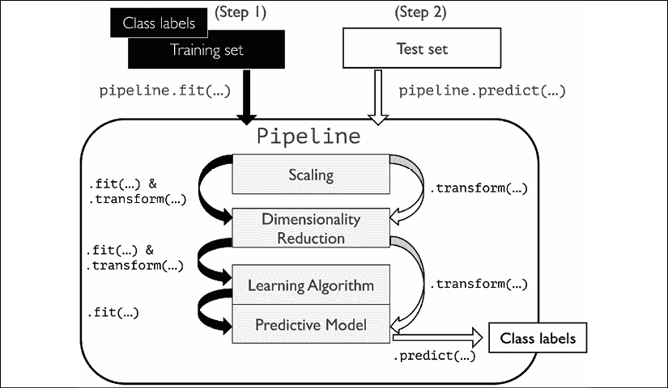

# 使用k折交叉验证评估模型性能

构建机器学习模型的关键步骤之一是估计模型在未见过数据上的表现。假设我们在训练数据集上拟合了模型，并使用相同的数据估算它在新数据上的表现。我们从*第3章，使用scikit-learn的机器学习分类器概览*中的*通过正则化解决过拟合问题*部分中记得，如果模型过于简单，可能会出现欠拟合（高偏差）；如果模型对于训练数据过于复杂，则可能会对训练数据过拟合（高方差）。

为了找到一个可接受的偏差-方差权衡，我们需要仔细评估我们的模型。在本节中，你将学习常见的交叉验证技术**保留法交叉验证**和**k折交叉验证**，它们可以帮助我们可靠地估计模型的泛化性能，即模型在未见过的数据上的表现。

## 保留法

一种经典且广泛使用的机器学习模型泛化性能估计方法是留出交叉验证。使用留出法时，我们将初始数据集划分为训练集和测试集——前者用于模型训练，后者用于估计模型的泛化性能。然而，在典型的机器学习应用中，我们还需要调整和比较不同的参数设置，以进一步提升模型在未见数据上的预测性能。这个过程称为**模型选择**，其名称指的是我们希望为给定的分类问题选择*最优*的*调参参数*（也称为**超参数**）。然而，如果在模型选择过程中不断重复使用相同的测试数据集，它将成为训练数据的一部分，从而使模型更容易出现过拟合。尽管存在这个问题，许多人仍然使用测试数据集进行模型选择，这并不是一种好的机器学习实践。

使用留出法进行模型选择的更好方法是将数据分为三部分：训练数据集、验证数据集和测试数据集。训练数据集用于拟合不同的模型，随后使用验证数据集的性能进行模型选择。拥有一个在训练和模型选择过程中未曾见过的测试数据集的优点在于，我们可以更少偏见地估计模型对新数据的泛化能力。下图展示了留出交叉验证的概念，我们使用验证数据集反复评估不同超参数值训练后的模型性能。一旦对超参数值的调整满意后，我们会在测试数据集上估计模型的泛化性能：

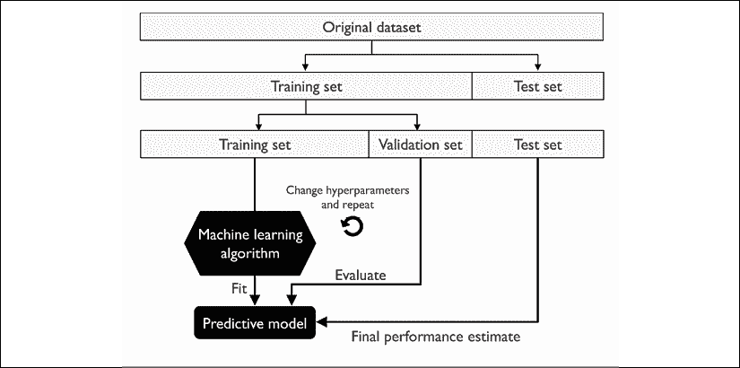

留出法的一个缺点是，性能估计可能会非常敏感于我们如何将训练数据集划分为训练子集和验证子集；对于不同的数据示例，估计会有所不同。在下一小节中，我们将探讨一种更稳健的性能估计技术——k折交叉验证，在这种方法中，我们会在训练数据的*k*个子集上重复留出法进行*k*次。

## K折交叉验证

在k折交叉验证中，我们将训练数据集随机划分为*k*个折叠，且不放回，其中*k* - 1个折叠用于模型训练，1个折叠用于性能评估。该过程会重复进行*k*次，以便获得*k*个模型和性能估计。

**有放回和无放回的抽样**

我们在*第3章*，*使用scikit-learn的机器学习分类器概览*中查看了一个例子来说明有放回和无放回采样。如果你没有阅读过那一章，或者想要复习一下，请参考*通过随机森林结合多个决策树*部分中的信息框，标题为*有放回与无放回采样*。

然后，我们根据不同的独立测试折叠计算模型的平均性能，以获得一个相比于保留法更加不敏感于训练数据子划分的性能估计。通常，我们使用k折交叉验证来进行模型调优，也就是寻找能够获得令人满意的泛化性能的最佳超参数值，这些性能是通过在测试折叠上评估模型性能得到的。

一旦我们找到了令人满意的超参数值，我们可以在完整的训练数据集上重新训练模型，并使用独立的测试数据集来获得最终的性能估计。对模型进行k折交叉验证后再用整个训练数据集进行训练的理论依据是，给学习算法提供更多的训练样本通常会产生一个更加准确且鲁棒的模型。

由于k折交叉验证是一种无放回的重采样技术，这种方法的优点是每个样本都会被用于训练和验证（作为测试折叠的一部分）一次，这相比于保留法能够提供一个更低方差的模型性能估计。下图总结了k折交叉验证的概念，其中*k* = 10。训练数据集被划分为10个折叠，在10次迭代过程中，九个折叠用于训练，剩下一个折叠用于模型评估的测试数据集。

此外，每个折叠的估计性能，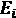（例如，分类准确率或错误率），然后被用来计算模型的估计平均性能，*E*：

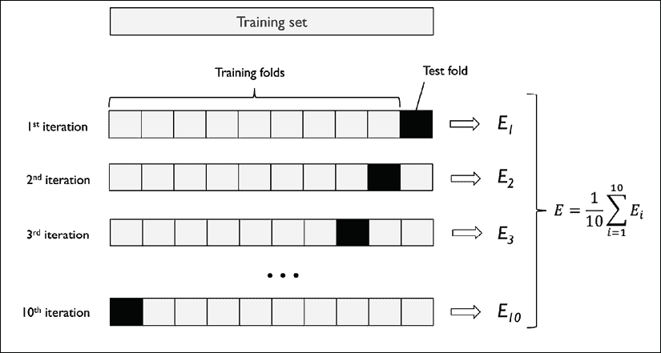

在k折交叉验证中，*k*的一个好的标准值是10，正如经验研究所表明的。例如，Ron Kohavi对多个现实世界数据集的实验表明，10折交叉验证在偏差和方差之间提供了最佳的折中（*A Study of Cross-Validation and Bootstrap for Accuracy Estimation and Model Selection*，*Kohavi, Ron*，*International Joint Conference on Artificial Intelligence (IJCAI)*，14 (12): 1137-43，*1995*）。

然而，如果我们处理的是相对较小的训练集，增加折数可能会很有用。如果我们增加*k*的值，那么每次迭代中将使用更多的训练数据，这会导致通过平均单个模型估计来估算泛化性能时产生较低的悲观偏差。然而，较大的*k*值也会增加交叉验证算法的运行时间，并且由于训练折更相似，这会导致估计的方差增大。另一方面，如果我们处理的是大规模数据集，可以选择较小的*k*值，例如*k* = 5，依然能够准确估算模型的平均性能，同时减少重新拟合和评估模型在不同折上的计算成本。

**留一交叉验证**

k折交叉验证的一个特例是**留一交叉验证**（**LOOCV**）方法。在LOOCV中，我们将折数设置为训练示例的数量（*k* = *n*），这样在每次迭代时，只使用一个训练示例进行测试，这是一种处理非常小的数据集时推荐的方法。

相对于标准的k折交叉验证方法，分层k折交叉验证稍作改进，尤其在类别不均衡的情况下，可以提供更好的偏差和方差估计，这一点也在本节中前面提到的Ron Kohavi的同一研究中有所展示。在分层交叉验证中，每个折中的类别标签比例得以保持，确保每个折都能代表训练数据集中类别的比例，我们将通过在scikit-learn中使用`StratifiedKFold`迭代器来进行说明：

```py
>>> import numpy as np
>>> from sklearn.model_selection import StratifiedKFold
>>> kfold = StratifiedKFold(n_splits=10).split(X_train, y_train)
>>> scores = []
>>> for k, (train, test) in enumerate(kfold):
...     pipe_lr.fit(X_train[train], y_train[train])
...     score = pipe_lr.score(X_train[test], y_train[test])
...     scores.append(score)
...     print('Fold: %2d, Class dist.: %s, Acc: %.3f' % (k+1,
...           np.bincount(y_train[train]), score))
Fold:  1, Class dist.: [256 153], Acc: 0.935
Fold:  2, Class dist.: [256 153], Acc: 0.935
Fold:  3, Class dist.: [256 153], Acc: 0.957
Fold:  4, Class dist.: [256 153], Acc: 0.957
Fold:  5, Class dist.: [256 153], Acc: 0.935
Fold:  6, Class dist.: [257 153], Acc: 0.956
Fold:  7, Class dist.: [257 153], Acc: 0.978
Fold:  8, Class dist.: [257 153], Acc: 0.933
Fold:  9, Class dist.: [257 153], Acc: 0.956
Fold: 10, Class dist.: [257 153], Acc: 0.956
>>> print('\nCV accuracy: %.3f +/- %.3f' %
...      (np.mean(scores), np.std(scores)))
CV accuracy: 0.950 +/- 0.014 
```

首先，我们从`sklearn.model_selection`模块初始化了`StratifiedKFold`迭代器，并使用训练数据集中的`y_train`类别标签，此外通过`n_splits`参数指定了折数。当我们使用`kfold`迭代器遍历`k`折时，我们使用返回的`train`索引来拟合我们在本章开始时设置的逻辑回归管道。通过使用`pipe_lr`管道，我们确保在每次迭代中，示例都被正确地缩放（例如标准化）。然后，我们使用`test`索引计算模型的准确性分数，并将其收集到`scores`列表中，用于计算平均准确率和估计的标准差。

尽管之前的代码示例有助于说明k折交叉验证的工作原理，scikit-learn还实现了一个k折交叉验证评分器，允许我们以更简洁的方式使用分层k折交叉验证来评估模型：

```py
>>> from sklearn.model_selection import cross_val_score
>>> scores = cross_val_score(estimator=pipe_lr,
...                          X=X_train,
...                          y=y_train,
...                          cv=10,
...                          n_jobs=1)
>>> print('CV accuracy scores: %s' % scores)
CV accuracy scores: [ 0.93478261  0.93478261  0.95652174
                      0.95652174  0.93478261  0.95555556
                      0.97777778  0.93333333  0.95555556
                      0.95555556]
>>> print('CV accuracy: %.3f +/- %.3f' % (np.mean(scores),
...       np.std(scores)))
CV accuracy: 0.950 +/- 0.014 
```

`cross_val_score` 方法的一个极其有用的功能是，我们可以将不同折叠的评估分配到机器上多个中央处理单元（CPU）上。如果我们将 `n_jobs` 参数设置为 `1`，则只会使用一个 CPU 来评估性能，就像我们之前的 `StratifiedKFold` 示例一样。然而，通过将 `n_jobs=2`，我们可以将 10 轮交叉验证分配到两个 CPU（如果机器上有的话），而将 `n_jobs=-1`，我们可以使用机器上所有可用的 CPU 来并行计算。

**估计泛化性能**

请注意，关于如何在交叉验证中估计泛化性能方差的详细讨论超出了本书的范围，但你可以参考一篇关于模型评估和交叉验证的综合文章（*《机器学习中的模型评估、模型选择与算法选择》*，*Raschka S*，arXiv 预印本 arXiv:1811.12808，2018），该文章更深入地讨论了这些主题。文章可以免费从[https://arxiv.org/abs/1811.12808](https://arxiv.org/abs/1811.12808)获取。

此外，你还可以在 M. Markatou 等人写的这篇优秀文章中找到详细讨论（*《交叉验证估计器的方差与泛化误差分析》*，*M. Markatou*，*H. Tian*，*S. Biswas* 和 *G. M. Hripcsak*，*机器学习研究期刊*，6：1127-1168，*2005*）。

你还可以阅读关于替代交叉验证技术的相关资料，比如 .632 Bootstrap 交叉验证方法（*《交叉验证的改进：.632+ Bootstrap 方法》*，*B. Efron* 和 *R. Tibshirani*，*美国统计学会期刊*，92(438)：548-560，*1997*）。

# 使用学习曲线和验证曲线调试算法

在本节中，我们将介绍两个非常简单但又强大的诊断工具，帮助我们提升学习算法的表现：**学习曲线**和**验证曲线**。在接下来的小节中，我们将讨论如何使用学习曲线诊断学习算法是否存在过拟合（高方差）或欠拟合（高偏差）的问题。此外，我们还将介绍验证曲线，这能帮助我们解决学习算法中的常见问题。

## 使用学习曲线诊断偏差和方差问题

如果一个模型对于给定的训练数据集过于复杂——即模型中有过多的自由度或参数——模型往往会出现过拟合，并且在面对未见过的数据时，表现不佳。通常，收集更多的训练样本有助于减少过拟合的程度。

然而，在实际应用中，收集更多数据通常非常昂贵或根本不可行。通过将模型的训练准确率和验证准确率绘制成训练数据集大小的函数，我们可以轻松检测模型是否存在高方差或高偏差问题，以及收集更多数据是否能帮助解决这个问题。在我们讨论如何在 scikit-learn 中绘制学习曲线之前，让我们通过以下插图来讨论这两种常见的模型问题：

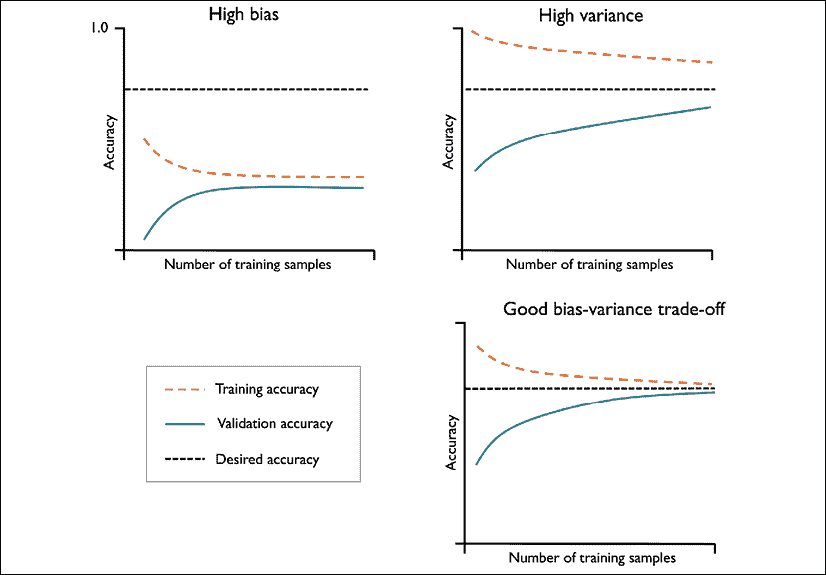

左上角的图显示了一个具有高偏差的模型。该模型的训练准确率和交叉验证准确率都很低，表明它在训练数据上存在欠拟合问题。解决这个问题的常见方法是增加模型的参数数量，例如，通过收集或构造额外的特征，或通过减少正则化的程度，例如，在**支持向量机**（**SVM**）或逻辑回归分类器中。

右上角的图显示了一个存在高方差的模型，这从训练准确率和交叉验证准确率之间的巨大差距可以看出。为了应对这个过拟合问题，我们可以收集更多的训练数据，减少模型的复杂度，或增加正则化参数等。

对于无正则化的模型，通过特征选择（*第 4 章*，*构建良好的训练数据集 – 数据预处理*）或特征提取（*第 5 章*，*通过降维压缩数据*）减少特征数量，也有助于降低过拟合的程度。虽然收集更多的训练数据通常有助于减少过拟合的机会，但它并不总是有效，例如，当训练数据噪声极大或模型已经非常接近最优时。

在下一小节中，我们将看到如何使用验证曲线来解决这些模型问题，但首先让我们看看如何使用 scikit-learn 的学习曲线函数来评估模型：

```py
>>> import matplotlib.pyplot as plt
>>> from sklearn.model_selection import learning_curve
>>> pipe_lr = make_pipeline(StandardScaler(),
...                         LogisticRegression(penalty='l2',
...                                            random_state=1,
...                                            solver='lbfgs',
...                                            max_iter=10000))
>>> train_sizes, train_scores, test_scores =\
...                 learning_curve(estimator=pipe_lr,
...                                X=X_train,
...                                y=y_train,
...                                train_sizes=np.linspace(
...                                            0.1, 1.0, 10),
...                                cv=10,
...                                n_jobs=1)
>>> train_mean = np.mean(train_scores, axis=1)
>>> train_std = np.std(train_scores, axis=1)
>>> test_mean = np.mean(test_scores, axis=1)
>>> test_std = np.std(test_scores, axis=1)
>>> plt.plot(train_sizes, train_mean,
...          color='blue', marker='o',
...          markersize=5, label='Training accuracy')
>>> plt.fill_between(train_sizes,
...                  train_mean + train_std,
...                  train_mean - train_std,
...                  alpha=0.15, color='blue')
>>> plt.plot(train_sizes, test_mean,
...          color='green', linestyle='--',
...          marker='s', markersize=5,
...          label='Validation accuracy')
>>> plt.fill_between(train_sizes,
...                  test_mean + test_std,
...                  test_mean - test_std,
...                  alpha=0.15, color='green')
>>> plt.grid()
>>> plt.xlabel('Number of training examples')
>>> plt.ylabel('Accuracy')
>>> plt.legend(loc='lower right')
>>> plt.ylim([0.8, 1.03])
>>> plt.show() 
```

请注意，当实例化 `LogisticRegression` 对象时，我们传递了 `max_iter=10000` 作为附加参数（默认使用 1,000 次迭代），以避免在较小数据集大小或极端正则化参数值下出现收敛问题（将在下一节中讨论）。在成功执行前面的代码后，我们将获得以下学习曲线图：

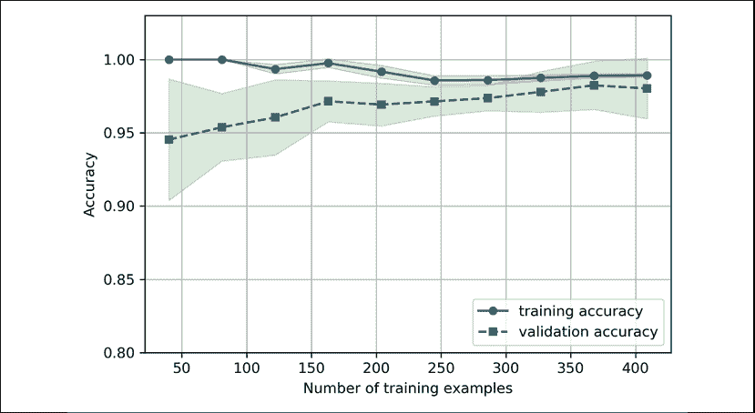

通过 `learning_curve` 函数中的 `train_sizes` 参数，我们可以控制用于生成学习曲线的训练样本的绝对数量或相对数量。在这里，我们将 `train_sizes=np.linspace(0.1, 1.0, 10)` 设置为使用 10 个均匀间隔的相对训练数据集大小。默认情况下，`learning_curve` 函数使用分层 k 折交叉验证来计算分类器的交叉验证准确率，并通过 `cv` 参数设置 *k*=10 进行 10 折分层交叉验证。

然后，我们简单地计算了不同训练数据集大小的交叉验证训练和测试得分的平均准确率，并使用 Matplotlib 的`plot`函数将其绘制出来。此外，我们还通过`fill_between`函数将平均准确率的标准差添加到图表中，以表示估计的方差。

正如我们在前面的学习曲线图中看到的，如果模型在训练过程中见过超过250个示例，它在训练和验证数据集上的表现都非常好。我们还可以看到，对于少于250个示例的训练数据集，训练准确率有所提高，同时验证和训练准确率之间的差距加大——这是过拟合程度增加的一个指示。

## 通过验证曲线解决过拟合和欠拟合问题

验证曲线是通过解决过拟合或欠拟合等问题来提高模型性能的有用工具。验证曲线与学习曲线相关，但不是将训练和测试的准确率作为样本大小的函数进行绘制，而是通过调整模型参数的值，例如逻辑回归中的逆正则化参数`C`。让我们继续看看如何通过 scikit-learn 创建验证曲线：

```py
>>> from sklearn.model_selection import validation_curve
>>> param_range = [0.001, 0.01, 0.1, 1.0, 10.0, 100.0]
>>> train_scores, test_scores = validation_curve(
...                             estimator=pipe_lr,
...                             X=X_train,
...                             y=y_train,
...                             param_name='logisticregression__C',
...                             param_range=param_range,
...                             cv=10)
>>> train_mean = np.mean(train_scores, axis=1)
>>> train_std = np.std(train_scores, axis=1)
>>> test_mean = np.mean(test_scores, axis=1)
>>> test_std = np.std(test_scores, axis=1)
>>> plt.plot(param_range, train_mean,
...          color='blue', marker='o',
...          markersize=5, label='Training accuracy')
>>> plt.fill_between(param_range, train_mean + train_std,
...                  train_mean - train_std, alpha=0.15,
...                  color='blue')
>>> plt.plot(param_range, test_mean,
...          color='green', linestyle='--',
...          marker='s', markersize=5,
...          label='Validation accuracy')
>>> plt.fill_between(param_range,
...                  test_mean + test_std,
...                  test_mean - test_std,
...                  alpha=0.15, color='green')
>>> plt.grid()
>>> plt.xscale('log')
>>> plt.legend(loc='lower right')
>>> plt.xlabel('Parameter C')
>>> plt.ylabel('Accuracy')
>>> plt.ylim([0.8, 1.0])
>>> plt.show() 
```

使用前面的代码，我们获得了参数`C`的验证曲线图：

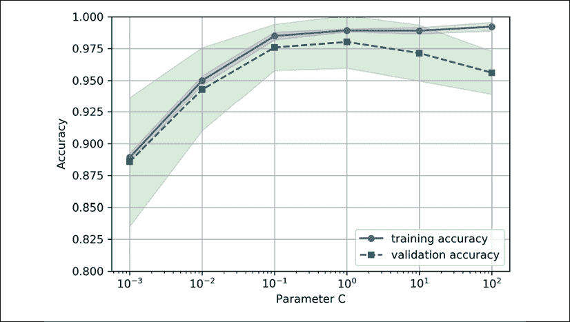

类似于`learning_curve`函数，`validation_curve`函数默认使用分层k折交叉验证来估计分类器的性能。在`validation_curve`函数内部，我们指定了要评估的参数。在这种情况下，是`C`，即`LogisticRegression`分类器的逆正则化参数，我们将其写为`'logisticregression__C'`，以访问 scikit-learn 管道中`LogisticRegression`对象，并通过`param_range`参数设置了指定值范围。与前一部分中的学习曲线示例类似，我们绘制了平均训练和交叉验证准确率及其相应的标准差。

尽管`C`值不同所导致的准确率差异较小，但我们可以看到，当增加正则化强度（即`C`的较小值）时，模型略微欠拟合数据。然而，对于较大的`C`值，这意味着减弱正则化强度，因此模型倾向于轻微地过拟合数据。在这种情况下，最佳的`C`值似乎介于0.01到0.1之间。

# 通过网格搜索微调机器学习模型

在机器学习中，我们有两种类型的参数：一种是从训练数据中学习到的参数，例如逻辑回归中的权重，另一种是独立优化的学习算法参数。后者是模型的调参参数（或超参数），例如逻辑回归中的正则化参数或决策树的深度参数。

在前一节中，我们通过调节模型的一个超参数来使用验证曲线提高模型的表现。在本节中，我们将介绍一种流行的超参数优化技术——**网格搜索**，它通过找到超参数值的*最佳*组合，进一步帮助提升模型的性能。

## 通过网格搜索调优超参数

网格搜索方法非常简单：它是一种暴力穷举搜索的范式，我们指定不同超参数的值列表，计算机会评估每种组合下的模型性能，以获得这个集合中值的最佳组合：

```py
>>> from sklearn.model_selection import GridSearchCV
>>> from sklearn.svm import SVC
>>> pipe_svc = make_pipeline(StandardScaler(),
...                          SVC(random_state=1))
>>> param_range = [0.0001, 0.001, 0.01, 0.1,
...                1.0, 10.0, 100.0, 1000.0]
>>> param_grid = [{'svc__C': param_range,
...                'svc__kernel': ['linear']},
...               {'svc__C': param_range,
...                'svc__gamma': param_range,
...                'svc__kernel': ['rbf']}]
>>> gs = GridSearchCV(estimator=pipe_svc,
...                   param_grid=param_grid,
...                   scoring='accuracy',
...                   cv=10,
...                   refit=True,
...                   n_jobs=-1)
>>> gs = gs.fit(X_train, y_train)
>>> print(gs.best_score_)
0.9846153846153847
>>> print(gs.best_params_)
{'svc__C': 100.0, 'svc__gamma': 0.001, 'svc__kernel': 'rbf'} 
```

使用前面的代码，我们从`sklearn.model_selection`模块初始化了一个`GridSearchCV`对象来训练和调优SVM管道。我们将`GridSearchCV`的`param_grid`参数设置为字典列表，以指定我们希望调优的参数。对于线性SVM，我们只评估了逆正则化参数`C`；对于RBF核SVM，我们调优了`svc__C`和`svc__gamma`两个参数。请注意，`svc__gamma`参数是专门针对核SVM的。

在我们使用训练数据进行网格搜索后，我们通过`best_score_`属性获得了最佳表现模型的得分，并查看了其参数，这些参数可以通过`best_params_`属性进行访问。在这个特定的例子中，使用`svc__C = 100.0`的RBF核SVM模型获得了最佳的k折交叉验证准确率：98.5%。

最后，我们使用独立的测试数据集来估计最佳选定模型的性能，模型可以通过`GridSearchCV`对象的`best_estimator_`属性获得：

```py
>>> clf = gs.best_estimator_
>>> clf.fit(X_train, y_train)
>>> print('Test accuracy: %.3f' % clf.score(X_test, y_test))
Test accuracy: 0.974 
```

请注意，在完成网格搜索后，手动使用`clf.fit(X_train, y_train)`在训练集上拟合具有最佳设置的模型（`gs.best_estimator_`）并非必要。`GridSearchCV`类有一个`refit`参数，如果我们设置`refit=True`（默认为True），它会自动将`gs.best_estimator_`重新拟合到整个训练集。

**随机超参数搜索**

尽管网格搜索是寻找最优参数集的强大方法，但评估所有可能的参数组合在计算上是非常昂贵的。使用 scikit-learn 进行不同参数组合采样的替代方法是*随机搜索*。随机搜索通常与网格搜索表现相当，但在成本和时间上更加高效。特别是，如果我们通过随机搜索仅采样 60 个参数组合，我们就已经有 95% 的概率在最优性能的 5% 范围内获得解（*用于超参数优化的随机搜索*。*Bergstra J*, *Bengio Y*. *机器学习研究期刊*。第281-305页，2012年）。

使用 scikit-learn 中的 `RandomizedSearchCV` 类，我们可以在指定的预算范围内从采样分布中随机选择参数组合。更多详细信息和使用示例可以在 [http://scikit-learn.org/stable/modules/grid_search.html#randomized-parameter-optimization](http://scikit-learn.org/stable/modules/grid_search.html#randomized-parameter-optimization) 找到。

## 带嵌套交叉验证的算法选择

将 k 折交叉验证与网格搜索结合使用是通过改变超参数值来微调机器学习模型性能的有用方法，正如我们在前一小节中所见。如果我们想在不同的机器学习算法之间进行选择，另一种推荐的方法是嵌套交叉验证。在一项关于误差估计偏差的研究中，Sudhir Varma 和 Richard Simon 得出结论，使用嵌套交叉验证时，估计的真实误差相对于测试数据集几乎没有偏差（*使用交叉验证进行模型选择时的误差估计偏差*，*BMC 生物信息学*，*S. Varma* 和 *R. Simon*，7(1): 91，*2006*）。

在嵌套交叉验证中，我们有一个外部的 k 折交叉验证循环，用于将数据拆分为训练集和测试集，内部循环则使用 k 折交叉验证在训练集上选择模型。模型选择完成后，测试集用于评估模型性能。下图解释了仅有五个外部折叠和两个内部折叠的嵌套交叉验证概念，这对于计算性能要求较高的大型数据集非常有用；这种特定类型的嵌套交叉验证也被称为**5x2交叉验证**：

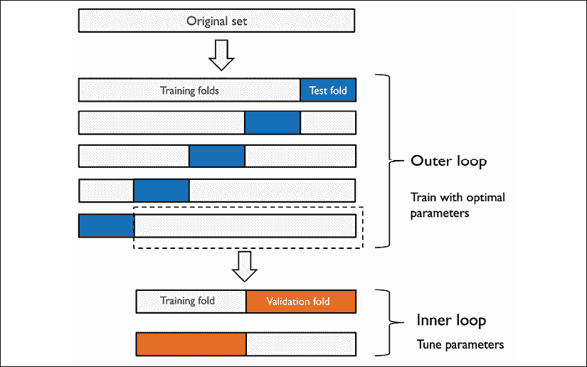

在 scikit-learn 中，我们可以按如下方式执行嵌套交叉验证：

```py
>>> gs = GridSearchCV(estimator=pipe_svc,
...                   param_grid=param_grid,
...                   scoring='accuracy',
...                   cv=2)
>>> scores = cross_val_score(gs, X_train, y_train,
...                          scoring='accuracy', cv=5)
>>> print('CV accuracy: %.3f +/- %.3f' % (np.mean(scores),
...                                       np.std(scores)))
CV accuracy: 0.974 +/- 0.015 
```

返回的平均交叉验证准确率可以很好地估计，如果我们调整模型的超参数并将其应用于未见过的数据时，期望的结果是什么。

例如，我们可以使用嵌套交叉验证方法将 SVM 模型与简单的决策树分类器进行比较；为了简化，我们将只调整它的深度参数：

```py
>>> from sklearn.tree import DecisionTreeClassifier
>>> gs = GridSearchCV(estimator=DecisionTreeClassifier(
...                       random_state=0),
...                   param_grid=[{'max_depth': [1, 2, 3,
...                                              4, 5, 6,
...                                              7, None]}],
...                   scoring='accuracy',
...                   cv=2)
>>> scores = cross_val_score(gs, X_train, y_train,
...                          scoring='accuracy', cv=5)
>>> print('CV accuracy: %.3f +/- %.3f' % (np.mean(scores),
...                                       np.std(scores)))
CV accuracy: 0.934 +/- 0.016 
```

如我们所见，SVM 模型的嵌套交叉验证性能（97.4%）明显优于决策树的性能（93.4%），因此，我们可以预期它可能是分类来自与此数据集相同人群的新数据的更好选择。

# 查看不同的性能评估指标

在之前的章节中，我们使用预测准确度评估了不同的机器学习模型，这个指标是量化模型表现的一个有用标准。然而，还有一些其他的性能指标可以用来衡量模型的相关性，如精确度、召回率和**F1 分数**。

## 解读混淆矩阵

在深入讨论不同的评分指标之前，让我们先看看一个**混淆矩阵**，这是一个展示学习算法表现的矩阵。

混淆矩阵只是一个方阵，报告分类器的**真正例**（**TP**）、**真负例**（**TN**）、**假正例**（**FP**）和**假负例**（**FN**）的预测计数，如下图所示：


尽管通过比较真实和预测的类别标签，可以轻松手动计算这些指标，scikit-learn 提供了一个方便的 `confusion_matrix` 函数，我们可以使用它，如下所示：

```py
>>> from sklearn.metrics import confusion_matrix
>>> pipe_svc.fit(X_train, y_train)
>>> y_pred = pipe_svc.predict(X_test)
>>> confmat = confusion_matrix(y_true=y_test, y_pred=y_pred)
>>> print(confmat)
[[71  1]
[ 2 40]] 
```

执行代码后返回的数组为我们提供了有关分类器在测试数据集上所犯的不同类型错误的信息。我们可以使用 Matplotlib 的 `matshow` 函数将这些信息映射到前面图示中的混淆矩阵：

```py
>>> fig, ax = plt.subplots(figsize=(2.5, 2.5))
>>> ax.matshow(confmat, cmap=plt.cm.Blues, alpha=0.3)
>>> for i in range(confmat.shape[0]):
...     for j in range(confmat.shape[1]):
...         ax.text(x=j, y=i,
...                 s=confmat[i, j],
...                 va='center', ha='center')
>>> plt.xlabel('Predicted label')
>>> plt.ylabel('True label')
>>> plt.show() 
```

现在，下面的混淆矩阵图表，添加了标签后，应该使结果更容易理解：


假设在本例中类 `1`（恶性）是正类，我们的模型正确地将属于类 `0`（TN）的71个示例分类为负类，将属于类 `1`（TP）的40个示例分类为正类。然而，我们的模型也错误地将来自类 `1` 的两个示例误分类为类 `0`（FN），并且它错误地预测了一个示例是恶性肿瘤，尽管它实际上是良性肿瘤（FP）。在下一小节中，我们将学习如何利用这些信息来计算各种错误指标。

## 优化分类模型的精确度和召回率

预测**误差**（**ERR**）和**准确度**（**ACC**）都提供了关于多少示例被误分类的总体信息。误差可以理解为所有假预测的总和除以总预测数量，而准确度则是正确预测的总和除以总预测数量：

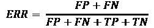

然后，预测准确度可以直接从错误中计算得出：

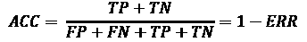

**真正例率** (**TPR**) 和 **假正例率** (**FPR**) 是特别适用于类别不平衡问题的性能指标：

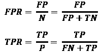

以肿瘤诊断为例，我们更关注的是恶性肿瘤的检测，以帮助患者获得适当的治疗。然而，同样重要的是减少将良性肿瘤错误分类为恶性肿瘤（假正例，FP）的数量，以免不必要地让患者担忧。与假正例率（FPR）相比，真正例率（TPR）提供了有关在所有正例（P）中，正确识别出的正例（或相关例子）所占的比例的有用信息。

性能指标 **精确度** (**PRE**) 和 **召回率** (**REC**) 与真正例和真负例的比率有关，实际上，REC 与 TPR 同义：

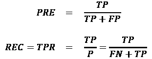

重新审视恶性肿瘤检测的例子，优化召回率有助于最小化漏掉恶性肿瘤的可能性。然而，这会导致将健康患者误判为患有恶性肿瘤（较高的假正例数量）。另一方面，如果我们优化精确度，则强调预测患者是否患有恶性肿瘤的正确性，但这会以更频繁地漏掉恶性肿瘤（较高的假负例数量）为代价。

为了平衡优化精确度（PRE）和召回率（REC）的优缺点，通常使用精确度和召回率的组合，即所谓的 F1 分数：

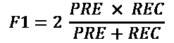

**进一步阅读精确度和召回率**

如果你对精确度和召回率等不同性能指标有更深入的讨论兴趣，可以阅读 David M. W. Powers 的技术报告 *Evaluation: From Precision, Recall and F-Factor to ROC, Informedness, Markedness & Correlation*，该报告可在 [http://www.flinders.edu.au/science_engineering/fms/School-CSEM/publications/tech_reps-research_artfcts/TRRA_2007.pdf](http://www.flinders.edu.au/science_engineering/fms/School-CSEM/publications/tech_reps-research_artfcts/TRRA_2007.pdf) 免费获取。

这些评分指标都已在 scikit-learn 中实现，可以从 `sklearn.metrics` 模块导入，以下代码片段展示了如何操作：

```py
>>> from sklearn.metrics import precision_score
>>> from sklearn.metrics import recall_score, f1_score
>>> print('Precision: %.3f' % precision_score(
...           y_true=y_test, y_pred=y_pred))
Precision: 0.976
>>> print('Recall: %.3f' % recall_score(
...           y_true=y_test, y_pred=y_pred))
Recall: 0.952
>>> print('F1: %.3f' % f1_score(
...           y_true=y_test, y_pred=y_pred))
F1: 0.964 
```

此外，我们还可以通过 `GridSearchCV` 中的 `scoring` 参数使用不同于准确率的评分指标。`scoring` 参数接受的不同值的完整列表可以在 [http://scikit-learn.org/stable/modules/model_evaluation.html](http://scikit-learn.org/stable/modules/model_evaluation.html) 查找到。

记住，在 scikit-learn 中，正类是标记为类 `1` 的类别。如果我们希望指定不同的 *正类标签*，可以通过 `make_scorer` 函数构造自己的评分器，然后将其直接作为 `GridSearchCV` 中 `scoring` 参数的参数（在这个例子中，使用 `f1_score` 作为度量标准）：

```py
>>> from sklearn.metrics import make_scorer, f1_score
>>> c_gamma_range = [0.01, 0.1, 1.0, 10.0]
>>> param_grid = [{'svc__C': c_gamma_range,
...                'svc__kernel': ['linear']},
...               {'svc__C': c_gamma_range,
...                'svc__gamma': c_gamma_range,
...                'svc__kernel': ['rbf']}]
>>> scorer = make_scorer(f1_score, pos_label=0)
>>> gs = GridSearchCV(estimator=pipe_svc,
...                   param_grid=param_grid,
...                   scoring=scorer,
...                   cv=10)
>>> gs = gs.fit(X_train, y_train)
>>> print(gs.best_score_)
0.986202145696
>>> print(gs.best_params_)
{'svc__C': 10.0, 'svc__gamma': 0.01, 'svc__kernel': 'rbf'} 
```

## 绘制接收器操作特性曲线

**接收器操作特征**（**ROC**）图是用于根据分类器在FPR和TPR上的表现选择分类模型的有用工具，FPR和TPR是通过调整分类器的决策阈值计算的。ROC图的对角线可以解释为*随机猜测*，而低于对角线的分类模型被认为比随机猜测差。一个完美的分类器将在图的左上角，具有TPR为1和FPR为0。基于ROC曲线，我们可以进一步计算所谓的**ROC曲线下面积**（**ROC AUC**），以表征分类模型的性能。

类似于ROC曲线，我们也可以计算**精确率-召回率曲线**，用于分类器在不同概率阈值下的表现。scikit-learn中也实现了绘制这些精确率-召回率曲线的函数，相关文档请见[http://scikit-learn.org/stable/modules/generated/sklearn.metrics.precision_recall_curve.html](http://scikit-learn.org/stable/modules/generated/sklearn.metrics.precision_recall_curve.html)。

执行以下代码示例，我们将绘制一个ROC曲线，该曲线来自一个分类器，该分类器只使用来自乳腺癌威斯康星数据集的两个特征来预测肿瘤是良性还是恶性。尽管我们将使用之前定义的相同的逻辑回归管道，但这次我们只使用两个特征。这是为了使分类任务对分类器更具挑战性，因通过省略其他特征中包含的有用信息，使得生成的ROC曲线在视觉上更具趣味性。出于类似的原因，我们还将`StratifiedKFold`验证器中的折数减少到三折。代码如下：

```py
>>> from sklearn.metrics import roc_curve, auc
>>> from scipy import interp
>>> pipe_lr = make_pipeline(StandardScaler(),
...                         PCA(n_components=2),
...                         LogisticRegression(penalty='l2',
...                                            random_state=1,
...                                            solver='lbfgs',
...                                            C=100.0))
>>> X_train2 = X_train[:, [4, 14]]
>>> cv = list(StratifiedKFold(n_splits=3,
...                           random_state=1).split(X_train,
...                                                 y_train))
>>> fig = plt.figure(figsize=(7, 5))
>>> mean_tpr = 0.0
>>> mean_fpr = np.linspace(0, 1, 100)
>>> all_tpr = []
>>> for i, (train, test) in enumerate(cv):
...     probas = pipe_lr.fit(
...         X_train2[train],
...         y_train[train]).predict_proba(X_train2[test])
...     fpr, tpr, thresholds = roc_curve(y_train[test],
...                                      probas[:, 1],
...                                      pos_label=1)
...     mean_tpr += interp(mean_fpr, fpr, tpr)
...     mean_tpr[0] = 0.0
...     roc_auc = auc(fpr, tpr)
...     plt.plot(fpr,
...              tpr,
...              label='ROC fold %d (area = %0.2f)'
...              % (i+1, roc_auc))
>>> plt.plot([0, 1],
...          [0, 1],
...          linestyle='--',
...          color=(0.6, 0.6, 0.6),
...          label='Random guessing')
>>> mean_tpr /= len(cv)
>>> mean_tpr[-1] = 1.0
>>> mean_auc = auc(mean_fpr, mean_tpr)
>>> plt.plot(mean_fpr, mean_tpr, 'k--',
...          label='Mean ROC (area = %0.2f)' % mean_auc, lw=2)
>>> plt.plot([0, 0, 1],
...          [0, 1, 1],
...          linestyle=':',
...          color='black',
...          label='Perfect performance')
>>> plt.xlim([-0.05, 1.05])
>>> plt.ylim([-0.05, 1.05])
>>> plt.xlabel('False positive rate')
>>> plt.ylabel('True positive rate')
>>> plt.legend(loc="lower right")
>>> plt.show() 
```

在前面的代码示例中，我们使用了scikit-learn中已经熟悉的`StratifiedKFold`类，并使用来自`sklearn.metrics`模块的`roc_curve`函数单独计算了我们`pipe_lr`管道中`LogisticRegression`分类器的ROC性能，每次迭代都如此。此外，我们通过从SciPy导入的`interp`函数对三折的平均ROC曲线进行了插值，并通过`auc`函数计算了曲线下面积。结果显示，ROC曲线表明不同折之间存在一定的方差，且平均ROC AUC（0.76）介于完美得分（1.0）与随机猜测（0.5）之间：

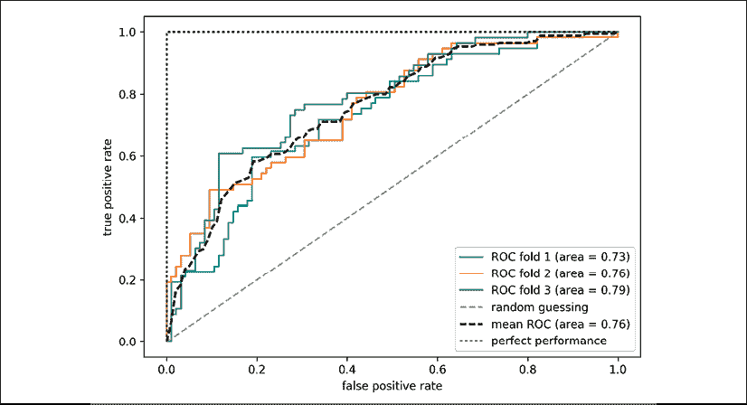

请注意，如果我们只对ROC AUC分数感兴趣，我们也可以直接从`sklearn.metrics`子模块导入`roc_auc_score`函数，该函数的使用方式与前面介绍的其他评分函数（例如`precision_score`）相似。

通过报告分类器的 ROC AUC 性能，可以进一步了解分类器在处理不平衡样本时的表现。然而，尽管准确率得分可以解释为 ROC 曲线上的一个单一截断点，A. P. Bradley 表明 ROC AUC 和准确率指标通常是相一致的：*《在机器学习算法评估中使用 ROC 曲线下的面积》*，*A. P. Bradley*，*模式识别*，30(7): 1145-1159，*1997*。

## 多类别分类的评分指标

目前我们讨论的评分指标是特定于二分类系统的。然而，scikit-learn 还实现了宏平均和微平均方法，通过 **一对多**（**OvA**）分类将这些评分指标扩展到多类别问题。微平均是通过系统的单个真正例（TP）、真负例（TN）、假正例（FP）和假负例（FN）来计算的。例如，*k* 类系统中精确度得分的微平均可以按如下方式计算：

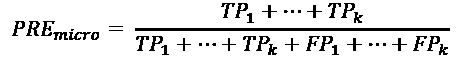

宏平均值是通过不同系统的平均得分来简单计算的：

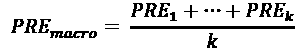

微平均适用于当我们想平等地对每个实例或预测加权时，而宏平均则是将所有类别平等加权，以评估分类器在处理最常见类别标签时的整体表现。

如果我们使用二分类性能指标来评估 scikit-learn 中的多类别分类模型，默认情况下会使用宏平均的归一化或加权变体。加权宏平均是通过在计算平均值时根据每个类别标签的真实实例数量加权每个类别的得分来计算的。加权宏平均在处理类别不平衡时非常有用，也就是说，当每个标签的实例数量不同。

虽然加权宏平均是 scikit-learn 中多类别问题的默认设置，但我们可以通过在从 `sklearn.metrics` 模块导入的不同评分函数中使用 `average` 参数来指定平均方法，例如 `precision_score` 或 `make_scorer` 函数：

```py
>>> pre_scorer = make_scorer(score_func=precision_score,
...                          pos_label=1,
...                          greater_is_better=True,
...                          average='micro') 
```

## 处理类别不平衡

我们在本章中已经多次提到类别不平衡的问题，但实际上我们还没有讨论如何在发生这种情况时适当地处理。类别不平衡是处理实际数据时一个非常常见的问题——数据集中某一类别或多个类别的样本被过度表示。我们可以想到一些可能出现这种情况的领域，例如垃圾邮件过滤、欺诈检测或疾病筛查。

假设我们在本章中使用的乳腺癌威斯康星数据集由90%的健康患者组成。在这种情况下，通过仅对所有示例预测多数类（良性肿瘤），我们就能在测试数据集上达到90%的准确率，而无需借助监督学习算法。因此，在这样的数据集上训练一个大约达到90%测试准确率的模型，意味着我们的模型没有从数据集中提供的特征中学到任何有用的东西。

在本节中，我们将简要介绍一些可以帮助处理不平衡数据集的技术。但在讨论解决这一问题的不同方法之前，让我们先从原本包含357个良性肿瘤（类别`0`）和212个恶性肿瘤（类别`1`）的数据集中创建一个不平衡数据集：

```py
>>> X_imb = np.vstack((X[y == 0], X[y == 1][:40]))
>>> y_imb = np.hstack((y[y == 0], y[y == 1][:40])) 
0), we would achieve a prediction accuracy of approximately 90 percent:
```

```py
>>> y_pred = np.zeros(y_imb.shape[0])
>>> np.mean(y_pred == y_imb) * 100
89.92443324937027 
```

因此，当我们在这类数据集上训练分类器时，比较不同模型时，除了准确率外，关注其他指标是有意义的，比如精确度、召回率、ROC曲线——根据我们的应用场景，选择我们最关心的指标。例如，我们的优先目标可能是识别大部分患有恶性癌症的患者，以推荐额外的筛查，因此召回率应该是我们选择的指标。在垃圾邮件过滤中，如果系统不太确定，我们不希望将邮件标记为垃圾邮件，此时精确度可能是更合适的指标。

除了评估机器学习模型之外，类别不平衡还会在模型拟合过程中影响学习算法。由于机器学习算法通常优化的是一个奖励或成本函数，该函数是根据它在拟合过程中看到的训练样本总和来计算的，因此决策规则很可能会偏向多数类。

换句话说，算法隐式地学习一个模型，该模型根据数据集中最丰富的类别优化预测，以最小化成本或最大化训练过程中的奖励。

处理类别不平衡问题的一种方法是在模型拟合过程中对少数类的错误预测赋予更大的惩罚。通过scikit-learn，调整这种惩罚与将`class_weight`参数设置为`class_weight='balanced'`一样方便，这对于大多数分类器都已经实现。

处理类别不平衡的其他流行策略包括对少数类进行上采样、对多数类进行下采样以及生成合成训练样本。不幸的是，没有一种通用的最佳解决方案或技术能够在不同问题领域中表现最好。因此，实际上，建议在给定问题上尝试不同的策略，评估结果，并选择看似最合适的技术。

scikit-learn库实现了一个简单的`resample`函数，可以通过从数据集中有放回地抽取新样本来帮助上采样少数类。以下代码将从我们不平衡的乳腺癌威斯康星数据集中提取少数类（这里是类别`1`），并不断从中抽取新样本，直到它包含与类别标签`0`相同数量的样本：

```py
>>> from sklearn.utils import resample
>>> print('Number of class 1 examples before:',
...       X_imb[y_imb == 1].shape[0])
Number of class 1 examples before: 40
>>> X_upsampled, y_upsampled = resample(
...         X_imb[y_imb == 1],
...         y_imb[y_imb == 1],
...         replace=True,
...         n_samples=X_imb[y_imb == 0].shape[0],
...         random_state=123)
>>> print('Number of class 1 examples after:',
...       X_upsampled.shape[0])
Number of class 1 examples after: 357 
```

在重新采样后，我们可以将原始类别`0`的样本与上采样的类别`1`子集堆叠在一起，以获得一个平衡的数据集，如下所示：

```py
>>> X_bal = np.vstack((X[y == 0], X_upsampled))
>>> y_bal = np.hstack((y[y == 0], y_upsampled)) 
```

因此，多数投票预测规则将仅达到50%的准确率：

```py
>>> y_pred = np.zeros(y_bal.shape[0])
>>> np.mean(y_pred == y_bal) * 100
50 
```

类似地，我们可以通过从数据集中删除训练样本来对多数类进行下采样。要使用`resample`函数执行下采样，我们可以简单地在之前的代码示例中交换类别`1`标签和类别`0`标签，反之亦然。

**生成新的训练数据以解决类别不平衡问题**

另一种处理类别不平衡的技术是生成合成训练样本，这超出了本书的范围。可能最广泛使用的合成训练数据生成算法是**合成少数类过采样技术**（**SMOTE**），您可以通过Nitesh Chawla等人发表的原始研究文章了解更多关于此技术的信息：《SMOTE: Synthetic Minority Over-sampling Technique》，《人工智能研究期刊》，16: 321-357，*2002*。同时，我们强烈推荐您查看`imbalanced-learn`，这是一个专注于不平衡数据集的Python库，其中包括SMOTE的实现。您可以在[https://github.com/scikit-learn-contrib/imbalanced-learn](https://github.com/scikit-learn-contrib/imbalanced-learn)了解更多关于`imbalanced-learn`的信息。

# 总结

在本章的开始，我们讨论了如何在便捷的模型管道中链式地组合不同的转换技术和分类器，这些管道帮助我们更高效地训练和评估机器学习模型。然后，我们使用这些管道进行了k折交叉验证，这是一种模型选择和评估的关键技术。通过k折交叉验证，我们绘制了学习曲线和验证曲线，以诊断学习算法中常见的问题，如过拟合和欠拟合。

通过网格搜索，我们进一步对模型进行了微调。然后，我们使用混淆矩阵和各种性能指标来评估和优化模型在特定问题任务中的表现。最后，我们通过讨论处理不平衡数据的不同方法来结束本章，这在许多现实世界应用中是一个常见问题。现在，您应该已经掌握了构建监督式机器学习分类模型的基本技术。

在下一章，我们将探讨集成方法：这些方法允许我们结合多个模型和分类算法，以进一步提升机器学习系统的预测性能。
