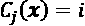
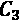

# 第七章：组合不同的模型进行集成学习

在前一章中，我们专注于调整和评估不同分类模型的最佳实践。在本章中，我们将进一步探讨这些技术，并探索构建一组分类器的不同方法，这些方法通常比其各个成员单独具有更好的预测性能。我们将学习如何执行以下操作：

+   基于多数投票进行预测

+   使用装袋减少过拟合，通过重复绘制训练数据集的随机组合

+   将提升应用于从其错误中学习的弱学习器构建强大的模型

# 用集成学习

**集成方法**的目标是将不同的分类器组合成一个元分类器，其泛化性能比单个分类器更好。例如，假设我们从10个专家的预测中收集了预测结果，集成方法允许我们通过这10个专家的预测策略性地组合这些预测结果，以得出比每个单独专家预测更准确和更稳健的预测结果。正如本章后面将看到的那样，有几种不同的方法可以创建一组分类器的集成。本节将介绍集成如何工作的基本解释，以及为什么它们通常因产生良好的泛化性能而受到认可。

在本章中，我们将重点介绍使用**多数投票**原则的最流行的集成方法。多数投票简单地意味着我们选择由大多数分类器预测的类标签，即获得超过50%选票的类标签。严格来说，“多数投票”一词仅适用于二元分类设置。然而，很容易将多数投票原则推广到多类设置，这称为**多数投票**。在这里，我们选择获得最多票数（众数）的类标签。下图说明了对10个分类器的集成进行多数投票和多数投票的概念，其中每个唯一符号（三角形、正方形和圆形）表示唯一的类标签：


使用训练数据集，我们首先通过训练*m*不同的分类器（）来开始。根据技术的不同，集成可以由不同的分类算法构建，例如决策树、支持向量机、逻辑回归分类器等。或者，我们也可以使用相同的基础分类算法，适合训练数据集的不同子集。这种方法的一个显著例子是随机森林算法，它结合了不同的决策树分类器。下图说明了使用多数投票的一般集成方法的概念：


为了通过简单的多数或选举投票来预测类别标签，我们可以将每个单独分类器预测的类别标签结合起来，，并选择获得最多票数的类别标签，：


（在统计学中，众数是一个集合中最频繁出现的事件或结果。例如，mode{1, 2, 1, 1, 2, 4, 5, 4} = 1。）

例如，在一个二分类任务中，其中class1 = –1，class2 = +1，我们可以将多数投票预测写作：


为了说明为什么集成方法比单一分类器更有效，我们可以应用组合学的简单概念。在以下示例中，我们假设所有用于二分类任务的*n*基分类器具有相同的错误率，。此外，我们假设分类器是独立的，且错误率之间没有相关性。在这些假设下，我们可以简单地将基分类器集成的错误概率表示为二项分布的概率质量函数：


这里， 是二项系数 *n 选择 k*。换句话说，我们计算集成的预测错误的概率。现在，让我们看看一个更具体的例子，假设有11个基分类器（*n* = 11），每个分类器的错误率为0.25（）：


**二项系数**

二项系数指的是从大小为 *n* 的集合中选择 *k* 个无序元素的方式数量；因此，它通常被称为“n 选择 k”。由于这里顺序无关，二项系数有时也被称为*组合*或*组合数*，在其完全形式下，它写作：


在这里，符号 (!) 代表阶乘，例如 。

如你所见，如果所有假设都成立，集成的错误率（0.034）明显低于每个单独分类器的错误率（0.25）。请注意，在这个简化的示例中，基分类器通过偶数个分类器进行50-50的划分时被视为错误，而实际上这种情况只在一半的时间内成立。为了将这样一个理想化的集成分类器与基分类器进行比较，我们将在不同的基错误率范围内实现概率质量函数，使用Python进行如下操作：

```py
>>> from scipy.special import comb
>>> import math
>>> def ensemble_error(n_classifier, error):
...     k_start = int(math.ceil(n_classifier / 2.))
...     probs = [comb(n_classifier, k) *
...              error**k *
...              (1-error)**(n_classifier - k)
...              for k in range(k_start, n_classifier + 1)]
...     return sum(probs)
>>> ensemble_error(n_classifier=11, error=0.25)
0.03432750701904297 
```

在实现了 `ensemble_error` 函数之后，我们可以计算出一系列不同基分类器错误率从0.0到1.0的集成错误率，并使用折线图可视化集成错误与基分类器错误之间的关系：

```py
>>> import numpy as np
>>> import matplotlib.pyplot as plt
>>> error_range = np.arange(0.0, 1.01, 0.01)
>>> ens_errors = [ensemble_error(n_classifier=11, error=error)
...               for error in error_range]
>>> plt.plot(error_range, ens_errors,
...          label='Ensemble error',
...          linewidth=2)
>>> plt.plot(error_range, error_range,
...          linestyle='--', label='Base error',
...          linewidth=2)
>>> plt.xlabel('Base error')
>>> plt.ylabel('Base/Ensemble error')
>>> plt.legend(loc='upper left')
>>> plt.grid(alpha=0.5)
>>> plt.show() 
```

如结果图所示，只要基分类器的表现优于随机猜测（），集成的错误概率总是比单个基分类器的错误率更好。注意，*y* 轴表示基误差（虚线）和集成误差（实线）：


# 通过多数投票组合分类器

在上一节简要介绍了集成学习后，让我们通过一个热身练习开始，使用 Python 实现一个简单的集成分类器进行多数投票。

**多数投票**

尽管我们将在本节讨论的多数投票算法也可以通过多数投票推广到多类问题，但为了简化起见，文献中通常使用“多数投票”这个术语。

## 实现一个简单的多数投票分类器

我们将在本节实现的算法将允许我们结合不同的分类算法，并为每个算法分配与置信度相关的权重。我们的目标是构建一个更强大的元分类器，平衡单个分类器在特定数据集上的弱点。用更精确的数学术语来说，我们可以将加权多数投票表示为：


这里， 是与基分类器  相关的权重； 是集成预测的类别标签；A 是唯一类别标签的集合；（希腊字母 chi）是特征函数或指示函数，如果第 *j* 个分类器的预测类别与 *i*（）匹配，则返回 1。对于相等的权重，我们可以简化这个方程并表示为：


为了更好地理解 *加权* 的概念，我们现在来看一个更具体的例子。假设我们有一个由三个基分类器组成的集成！[](img/B13208_07_021.png)，并且我们想要预测给定样本 *x* 的类别标签！[](img/B13208_07_022.png)。三个基分类器中有两个预测类别为 0，一个预测类别为 1。如果我们对每个基分类器的预测给予相同的权重，那么多数投票将预测该样本属于类别 0：


现在，让我们给  赋予 0.6 的权重，并将  和  的权重设置为 0.2：


更简单地说，由于 ，我们可以说，由  做出的预测比  或  的预测重三倍，表示为：


要将加权多数投票的概念转化为 Python 代码，我们可以使用 NumPy 中方便的 `argmax` 和 `bincount` 函数：

```py
>>> import numpy as np
>>> np.argmax(np.bincount([0, 0, 1],
...           weights=[0.2, 0.2, 0.6]))
1 
```

正如你从 *第 3 章* 中的逻辑回归讨论中记得的那样，*《使用 scikit-learn 的机器学习分类器之旅》*，scikit-learn 中某些分类器也可以通过 `predict_proba` 方法返回预测的类标签的概率。使用预测的类概率而不是类标签进行多数投票，如果我们的集成中的分类器经过良好校准，这种做法是非常有用的。根据概率预测类标签的修改版多数投票可以写成如下：


在这里，  是 *j*th 分类器对于类标签 *i* 的预测概率。

继续我们之前的例子，假设我们有一个二分类问题，类标签是 ，并且有三个分类器的集成 。假设分类器  为某个特定示例 *x* 返回以下的类成员概率：


使用之前相同的权重（0.2、0.2 和 0.6），然后可以计算各个类的概率，如下所示：


要实现基于类概率的加权多数投票，我们可以再次使用 NumPy，利用 `np.average` 和 `np.argmax`：

```py
>>> ex = np.array([[0.9, 0.1],
...                [0.8, 0.2],
...                [0.4, 0.6]])
>>> p = np.average(ex, axis=0, weights=[0.2, 0.2, 0.6])
>>> p
array([0.58, 0.42])
>>> np.argmax(p)
0 
```

把所有的内容组合起来，现在我们来实现 Python 中的 `MajorityVoteClassifier`：

```py
from sklearn.base import BaseEstimator
from sklearn.base import ClassifierMixin
from sklearn.preprocessing import LabelEncoder
from sklearn.base import clone
from sklearn.pipeline import _name_estimators
import numpy as np
import operator
class MajorityVoteClassifier(BaseEstimator,
                             ClassifierMixin):
    """ A majority vote ensemble classifier

    Parameters
    ----------
    classifiers : array-like, shape = [n_classifiers]
      Different classifiers for the ensemble

    vote : str, {'classlabel', 'probability'}
      Default: 'classlabel'
      If 'classlabel' the prediction is based on
      the argmax of class labels. Else if
      'probability', the argmax of the sum of
      probabilities is used to predict the class label
      (recommended for calibrated classifiers).

    weights : array-like, shape = [n_classifiers]
      Optional, default: None
      If a list of `int` or `float` values are
      provided, the classifiers are weighted by
      importance; Uses uniform weights if `weights=None`.

    """
    def __init__(self, classifiers,
                 vote='classlabel', weights=None):

        self.classifiers = classifiers
        self.named_classifiers = {key: value for
                                  key, value in
                                  _name_estimators(classifiers)}
        self.vote = vote
        self.weights = weights

    def fit(self, X, y):
        """ Fit classifiers.

        Parameters
        ----------
        X : {array-like, sparse matrix},
            shape = [n_examples, n_features]
            Matrix of training examples.

        y : array-like, shape = [n_examples]
            Vector of target class labels.

        Returns
        -------
        self : object

        """
        if self.vote not in ('probability', 'classlabel'):
            raise ValueError("vote must be 'probability'"
                             "or 'classlabel'; got (vote=%r)"
                             % self.vote)
        if self.weights and
        len(self.weights) != len(self.classifiers):
            raise ValueError("Number of classifiers and weights"
                             "must be equal; got %d weights,"
                             "%d classifiers"
                             % (len(self.weights),
                             len(self.classifiers)))
        # Use LabelEncoder to ensure class labels start
        # with 0, which is important for np.argmax
        # call in self.predict
        self.lablenc_ = LabelEncoder()
        self.lablenc_.fit(y)
        self.classes_ = self.lablenc_.classes_
        self.classifiers_ = []
        for clf in self.classifiers:
            fitted_clf = clone(clf).fit(X,
                               self.lablenc_.transform(y))
            self.classifiers_.append(fitted_clf)
        return self 
```

我在代码中添加了大量注释，来解释各个部分。然而，在我们实现剩下的方法之前，先休息一下，讨论一些可能一开始看起来有点困惑的代码。我们使用了 `BaseEstimator` 和 `ClassifierMixin` 父类来获取一些基本功能，*无需额外编写代码*，包括 `get_params` 和 `set_params` 方法来设置和返回分类器的参数，以及 `score` 方法来计算预测准确性。

接下来，我们将添加 `predict` 方法，通过基于类标签的多数投票来预测类标签，如果我们用 `vote='classlabel'` 初始化新的 `MajorityVoteClassifier` 对象。或者，我们也可以用 `vote='probability'` 来初始化集成分类器，通过类成员概率来预测类标签。此外，我们还会添加一个 `predict_proba` 方法，用来返回平均后的概率，这在计算接收者操作特征曲线下面积（ROC AUC）时非常有用：

```py
 def predict(self, X):
        """ Predict class labels for X.

        Parameters
        ----------
        X : {array-like, sparse matrix},
            Shape = [n_examples, n_features]
            Matrix of training examples.

        Returns
        ----------
        maj_vote : array-like, shape = [n_examples]
            Predicted class labels.

        """
        if self.vote == 'probability':
            maj_vote = np.argmax(self.predict_proba(X), axis=1)
        else: # 'classlabel' vote

            # Collect results from clf.predict calls
            predictions = np.asarray([clf.predict(X)
                                      for clf in
                                      self.classifiers_]).T

            maj_vote = np.apply_along_axis(lambda x: np.argmax(
                                           np.bincount(x,
                                           weights=self.weights)),
                                           axis=1,
                                           arr=predictions)
        maj_vote = self.lablenc_.inverse_transform(maj_vote)
        return maj_vote

    def predict_proba(self, X):
        """ Predict class probabilities for X.

        Parameters
        ----------
        X : {array-like, sparse matrix}, 
            shape = [n_examples, n_features]
            Training vectors, where
            n_examples is the number of examples and
            n_features is the number of features.

        Returns
        ----------
        avg_proba : array-like,
            shape = [n_examples, n_classes]
            Weighted average probability for
            each class per example.

        """
        probas = np.asarray([clf.predict_proba(X)
                             for clf in self.classifiers_])
        avg_proba = np.average(probas, axis=0,
                               weights=self.weights)
        return avg_proba

    def get_params(self, deep=True):
        """ Get classifier parameter names for GridSearch"""
        if not deep:
            return super(MajorityVoteClassifier, 
                           self).get_params(deep=False)
        else:
            out = self.named_classifiers.copy()
            for name, step in self.named_classifiers.items():
                for key, value in step.get_params(
                        deep=True).items():
                    out['%s__%s' % (name, key)] = value
            return out 
```

另外，请注意，我们定义了自己修改版的 `get_params` 方法，通过使用 `_name_estimators` 函数来访问集成中各个分类器的参数；这可能一开始看起来有点复杂，但当我们在后续章节使用网格搜索进行超参数调优时，这一做法就会变得非常有意义。

**scikit-learn 中的 VotingClassifier**

虽然`MajorityVoteClassifier`的实现非常适用于演示目的，但我们基于本书第一版中的实现在scikit-learn中实现了一个更复杂的多数投票分类器版本。该集成分类器在scikit-learn版本0.17及更高版本中作为`sklearn.ensemble.VotingClassifier`可用。

## 使用多数投票原则进行预测

现在是时候让我们在上一节中实现的`MajorityVoteClassifier`发挥作用了。但首先，让我们准备一个可以测试的数据集。由于我们已经熟悉从CSV文件加载数据集的技巧，我们将采取捷径并从scikit-learn的`datasets`模块加载鸢尾花数据集。此外，我们将仅选择两个特征，即*萼片宽度*和*花瓣长度*，以便更具挑战性地进行分类任务以进行说明。尽管我们的`MajorityVoteClassifier`适用于多类问题，但我们只会对来自`Iris-versicolor`和`Iris-virginica`类别的花卉示例进行分类，稍后我们将计算ROC AUC。代码如下：

```py
>>> from sklearn import datasets
>>> from sklearn.model_selection import train_test_split
>>> from sklearn.preprocessing import StandardScaler
>>> from sklearn.preprocessing import LabelEncoder
>>> iris = datasets.load_iris()
>>> X, y = iris.data[50:, [1, 2]], iris.target[50:]
>>> le = LabelEncoder()
>>> y = le.fit_transform(y) 
```

**决策树中的类成员概率**

请注意，scikit-learn使用`predict_proba`方法（如果适用）来计算ROC AUC分数。在*第3章*，*使用scikit-learn进行机器学习分类器之旅*中，我们看到了如何计算逻辑回归模型中的类概率。在决策树中，概率是从在训练时为每个节点创建的频率向量计算出来的。该向量收集从该节点的类标签分布中计算出的每个类标签的频率值。然后，将频率归一化，使它们总和为1。类似地，k最近邻算法中的k个最近邻居的类标签被聚合以返回归一化的类标签频率。尽管从决策树和k最近邻分类器返回的归一化概率看起来类似于从逻辑回归模型获得的概率，但我们必须意识到，这些实际上并非来自概率质量函数。

接下来，我们将把鸢尾花示例分成50%的训练数据和50%的测试数据：

```py
>>> X_train, X_test, y_train, y_test =\
...     train_test_split(X, y,
...                      test_size=0.5,
...                      random_state=1,
...                      stratify=y) 
```

使用训练数据集，我们现在将训练三种不同的分类器：

+   逻辑回归分类器

+   决策树分类器

+   k最近邻分类器

然后，我们将通过训练数据集上的10折交叉验证评估每个分类器的模型性能，然后将它们组合成一个集成分类器：

```py
>>> from sklearn.model_selection import cross_val_score
>>> from sklearn.linear_model import LogisticRegression
>>> from sklearn.tree import DecisionTreeClassifier
>>> from sklearn.neighbors import KNeighborsClassifier
>>> from sklearn.pipeline import Pipeline
>>> import numpy as np
>>> clf1 = LogisticRegression(penalty='l2',
...                           C=0.001,
...                           solver='lbfgs',
...                           random_state=1)
>>> clf2 = DecisionTreeClassifier(max_depth=1,
...                               criterion='entropy',
...                               random_state=0)
>>> clf3 = KNeighborsClassifier(n_neighbors=1,
...                             p=2,
...                             metric='minkowski')
>>> pipe1 = Pipeline([['sc', StandardScaler()],
...                   ['clf', clf1]])
>>> pipe3 = Pipeline([['sc', StandardScaler()],
...                   ['clf', clf3]])
>>> clf_labels = ['Logistic regression', 'Decision tree', 'KNN']
>>> print('10-fold cross validation:\n')
>>> for clf, label in zip([pipe1, clf2, pipe3], clf_labels):
...     scores = cross_val_score(estimator=clf,
...                              X=X_train,
...                              y=y_train,
...                              cv=10,
...                              scoring='roc_auc')
...     print("ROC AUC: %0.2f (+/- %0.2f) [%s]"
...           % (scores.mean(), scores.std(), label)) 
```

如下片段所示，我们收到的输出显示各个分类器的预测性能几乎相等：

```py
10-fold cross validation:
ROC AUC: 0.92 (+/- 0.15) [Logistic regression]
ROC AUC: 0.87 (+/- 0.18) [Decision tree]
ROC AUC: 0.85 (+/- 0.13) [KNN] 
```

你可能会想，为什么我们在一个管道中训练了逻辑回归和k近邻分类器。其背后的原因是，正如在*第3章*中讨论的，*《使用 scikit-learn 进行机器学习分类器巡礼》*，逻辑回归和k近邻算法（使用欧几里得距离度量）并不具备尺度不变性，这与决策树不同。尽管鸢尾花的特征都是以相同的尺度（厘米）测量的，但使用标准化特征是一个良好的习惯。

现在，让我们进入更有趣的部分，将各个分类器组合在一起，以便在我们的`MajorityVoteClassifier`中进行多数投票：

```py
>>> mv_clf = MajorityVoteClassifier(
...                  classifiers=[pipe1, clf2, pipe3])
>>> clf_labels += ['Majority voting']
>>> all_clf = [pipe1, clf2, pipe3, mv_clf]
>>> for clf, label in zip(all_clf, clf_labels):
...     scores = cross_val_score(estimator=clf,
...                              X=X_train,
...                              y=y_train,
...                              cv=10,
...                              scoring='roc_auc')
...     print("ROC AUC: %0.2f (+/- %0.2f) [%s]"
...           % (scores.mean(), scores.std(), label))
ROC AUC: 0.92 (+/- 0.15) [Logistic regression]
ROC AUC: 0.87 (+/- 0.18) [Decision tree]
ROC AUC: 0.85 (+/- 0.13) [KNN]
ROC AUC: 0.98 (+/- 0.05) [Majority voting] 
```

如你所见，`MajorityVotingClassifier`在 10 次交叉验证评估中相较于单一分类器的表现有所提高。

## 评估和调整集成分类器

在本节中，我们将从测试数据集中计算 ROC 曲线，以检查`MajorityVoteClassifier`在处理未见数据时是否能够很好地泛化。我们必须记住，测试数据集不应被用于模型选择；它的目的仅仅是提供分类器系统泛化性能的无偏估计：

```py
>>> from sklearn.metrics import roc_curve
>>> from sklearn.metrics import auc
>>> colors = ['black', 'orange', 'blue', 'green']
>>> linestyles = [':', '--', '-.', '-']
>>> for clf, label, clr, ls \
...     in zip(all_clf, clf_labels, colors, linestyles):
...     # assuming the label of the positive class is 1
...     y_pred = clf.fit(X_train,
...                      y_train).predict_proba(X_test)[:, 1]
...     fpr, tpr, thresholds = roc_curve(y_true=y_test,
...                                      y_score=y_pred)
...     roc_auc = auc(x=fpr, y=tpr)
...     plt.plot(fpr, tpr,
...              color=clr,
...              linestyle=ls,
...              label='%s (auc = %0.2f)' % (label, roc_auc))
>>> plt.legend(loc='lower right')
>>> plt.plot([0, 1], [0, 1],
...          linestyle='--',
...          color='gray',
...          linewidth=2)
>>> plt.xlim([-0.1, 1.1])
>>> plt.ylim([-0.1, 1.1])
>>> plt.grid(alpha=0.5)
>>> plt.xlabel('False positive rate (FPR)')
>>> plt.ylabel('True positive rate (TPR)')
>>> plt.show() 
```

如你在结果 ROC 曲线中看到的，集成分类器在测试数据集上表现也很出色（ROC AUC = 0.95）。然而，你可以看到逻辑回归分类器在相同数据集上的表现也很相似，这可能是由于数据集较小，导致高方差（在此情况下，是我们划分数据集时的敏感性）所致：


由于我们只选择了两个特征进行分类示例，因此查看集成分类器的决策区域究竟是什么样子会很有趣。

尽管在模型拟合之前标准化训练特征并非必要，因为我们的逻辑回归和k近邻管道会自动处理此操作，但为了视觉目的，我们将标准化训练数据集，以便决策树的决策区域能够在相同的尺度上呈现。代码如下：

```py
>>> sc = StandardScaler()
>>> X_train_std = sc.fit_transform(X_train)
>>> from itertools import product
>>> x_min = X_train_std[:, 0].min() - 1
>>> x_max = X_train_std[:, 0].max() + 1
>>> y_min = X_train_std[:, 1].min() - 1
>>>
>>> y_max = X_train_std[:, 1].max() + 1
>>> xx, yy = np.meshgrid(np.arange(x_min, x_max, 0.1),
...                      np.arange(y_min, y_max, 0.1))
>>> f, axarr = plt.subplots(nrows=2, ncols=2,
...                         sharex='col',
...                         sharey='row',
...                         figsize=(7, 5))
>>> for idx, clf, tt in zip(product([0, 1], [0, 1]),
...                         all_clf, clf_labels):
...     clf.fit(X_train_std, y_train)
...     Z = clf.predict(np.c_[xx.ravel(), yy.ravel()])
...     Z = Z.reshape(xx.shape)
...     axarr[idx[0], idx[1]].contourf(xx, yy, Z, alpha=0.3)
...     axarr[idx[0], idx[1]].scatter(X_train_std[y_train==0, 0],
...                                   X_train_std[y_train==0, 1],
...                                   c='blue',
...                                   marker='^',
...                                   s=50)
...     axarr[idx[0], idx[1]].scatter(X_train_std[y_train==1, 0],
...                                   X_train_std[y_train==1, 1],
...                                   c='green',
...                                   marker='o',
...                                   s=50)
...     axarr[idx[0], idx[1]].set_title(tt)
>>> plt.text(-3.5, -5.,
...          s='Sepal width [standardized]',	
...          ha='center', va='center', fontsize=12)
>>> plt.text(-12.5, 4.5,
...          s='Petal length [standardized]',
...          ha='center', va='center',
...          fontsize=12, rotation=90)
>>> plt.show() 
```

有趣的是，尽管也是预期中的，集成分类器的决策区域似乎是单个分类器决策区域的混合体。乍一看，多数投票决策边界看起来与决策树树桩的决策非常相似，对于*萼片宽度*≥1的情况，它与*y*轴正交。然而，你也可以注意到，k近邻分类器的非线性特征也被混合在其中：


在调整单个分类器的参数以进行集成分类之前，让我们调用`get_params`方法，初步了解如何在`GridSearchCV`对象中访问单个参数：

```py
>>> mv_clf.get_params()
{'decisiontreeclassifier':
 DecisionTreeClassifier(class_weight=None, criterion='entropy',
                        max_depth=1, max_features=None,
                        max_leaf_nodes=None, min_samples_leaf=1,
                        min_samples_split=2,
                        min_weight_fraction_leaf=0.0,
                        random_state=0, splitter='best'),
 'decisiontreeclassifier__class_weight': None,
 'decisiontreeclassifier__criterion': 'entropy',
 [...]
 'decisiontreeclassifier__random_state': 0,
 'decisiontreeclassifier__splitter': 'best',
 'pipeline-1':
 Pipeline(steps=[('sc', StandardScaler(copy=True, with_mean=True,
                                       with_std=True)),
                 ('clf', LogisticRegression(C=0.001,
                                            class_weight=None,
                                            dual=False,
                                            fit_intercept=True,
                                            intercept_scaling=1,
                                            max_iter=100,
                                            multi_class='ovr',
                                            penalty='l2',
                                            random_state=0,
                                            solver='liblinear',
                                            tol=0.0001,
                                            verbose=0))]),
 'pipeline-1__clf':
 LogisticRegression(C=0.001, class_weight=None, dual=False,
                    fit_intercept=True, intercept_scaling=1,
                    max_iter=100, multi_class='ovr',
                    penalty='l2', random_state=0,
                    solver='liblinear', tol=0.0001, verbose=0),
 'pipeline-1__clf__C': 0.001,
 'pipeline-1__clf__class_weight': None,
 'pipeline-1__clf__dual': False,
 [...]
 'pipeline-1__sc__with_std': True,
 'pipeline-2':
 Pipeline(steps=[('sc', StandardScaler(copy=True, with_mean=True,
                                       with_std=True)),
                 ('clf', KNeighborsClassifier(algorithm='auto',
                                            leaf_size=30,
                                            metric='minkowski',
                                            metric_params=None,
                                            n_neighbors=1,
                                            p=2,
                                            weights='uniform'))]),
 'pipeline-2__clf':
 KNeighborsClassifier(algorithm='auto', leaf_size=30,
                      metric='minkowski', metric_params=None,
                      n_neighbors=1, p=2, weights='uniform'),
 'pipeline-2__clf__algorithm': 'auto',
 [...]
 'pipeline-2__sc__with_std': True} 
```

根据 `get_params` 方法返回的值，我们现在知道如何访问单个分类器的属性。接下来，为了演示，我们将通过网格搜索调整逻辑回归分类器的逆正则化参数 `C` 和决策树的深度：

```py
>>> from sklearn.model_selection import GridSearchCV
>>> params = {'decisiontreeclassifier__max_depth': [1, 2],
...           'pipeline-1__clf__C': [0.001, 0.1, 100.0]}
>>> grid = GridSearchCV(estimator=mv_clf,
...                     param_grid=params,
...                     cv=10,
...                     iid=False,
...                     scoring='roc_auc')
>>> grid.fit(X_train, y_train) 
```

在网格搜索完成后，我们可以打印不同的超参数值组合以及通过 10 折交叉验证计算出的平均 ROC AUC 分数，具体如下：

```py
>>> for r, _ in enumerate(grid.cv_results_['mean_test_score']):
...     print("%0.3f +/- %0.2f %r"
...           % (grid.cv_results_['mean_test_score'][r],
...              grid.cv_results_['std_test_score'][r] / 2.0,
...              grid.cv_results_['params'][r]))
0.944 +/- 0.07 {'decisiontreeclassifier__max_depth': 1,
                'pipeline-1__clf__C': 0.001}
0.956 +/- 0.07 {'decisiontreeclassifier__max_depth': 1,
                'pipeline-1__clf__C': 0.1}
0.978 +/- 0.03 {'decisiontreeclassifier__max_depth': 1,
                'pipeline-1__clf__C': 100.0}
0.956 +/- 0.07 {'decisiontreeclassifier__max_depth': 2,
                'pipeline-1__clf__C': 0.001}
0.956 +/- 0.07 {'decisiontreeclassifier__max_depth': 2,
                'pipeline-1__clf__C': 0.1}
0.978 +/- 0.03 {'decisiontreeclassifier__max_depth': 2,
                'pipeline-1__clf__C': 100.0}
>>> print('Best parameters: %s' % grid.best_params_)
Best parameters: {'decisiontreeclassifier__max_depth': 1,
                  'pipeline-1__clf__C': 0.001}
>>> print('Accuracy: %.2f' % grid.best_score_)
Accuracy: 0.98 
```

正如你所看到的，当我们选择较低的正则化强度（`C=0.001`）时，我们得到最佳的交叉验证结果，而树的深度似乎对性能没有任何影响，这表明决策树桩足以分离数据。为了提醒自己，使用测试数据集多次进行模型评估是一个不好的做法，我们在本节中不会估计调整超参数的泛化性能。我们将迅速转向集成学习的另一种方法：**自助聚合（bagging）**。

**使用堆叠构建集成**

我们在本节中实现的多数投票方法不应与**堆叠（stacking）**混淆。堆叠算法可以理解为一个两层集成方法，其中第一层由独立的分类器组成，这些分类器将它们的预测结果传递给第二层，在第二层中，另一个分类器（通常是逻辑回归）对第一层分类器的预测进行拟合，从而做出最终预测。David H. Wolpert在《堆叠泛化》（*Stacked generalization*）一文中对此算法进行了更详细的描述，该文章发表在*Neural Networks*期刊，第5卷第2期，241-259页，*1992*年。不幸的是，在撰写本文时，scikit-learn 尚未实现该算法的实现；然而，这个功能正在开发中。与此同时，你可以在[http://rasbt.github.io/mlxtend/user_guide/classifier/StackingClassifier/](http://rasbt.github.io/mlxtend/user_guide/classifier/StackingClassifier/) 和 [http://rasbt.github.io/mlxtend/user_guide/classifier/StackingCVClassifier/](http://rasbt.github.io/mlxtend/user_guide/classifier/StackingCVClassifier/) 找到与 scikit-learn 兼容的堆叠实现。

# 自助聚合 — 从自助抽样中构建分类器集成

自助聚合是一种集成学习技术，与我们在上一节中实现的 `MajorityVoteClassifier` 密切相关。然而，和使用相同的训练数据集来拟合集成中的单个分类器不同，我们从初始训练数据集中抽取自助样本（带放回的随机样本），这也是为什么自助聚合又被称为 *自助抽样聚合*（bootstrap aggregating）。

自助聚合的概念在下图中总结：


在接下来的子节中，我们将通过手动方式进行一个简单的自助聚合示例，并使用 scikit-learn 对葡萄酒样本进行分类。

## 自助聚合概述

为了更具体地展示bagging分类器的自助聚合是如何工作的，我们考虑以下图示的例子。在这里，我们有七个不同的训练实例（表示为索引1-7），在每一轮bagging中都被随机地抽取且允许重复。每个自助样本随后用来拟合一个分类器，，它通常是一个未剪枝的决策树：


从之前的插图中可以看出，每个分类器都接收来自训练数据集的随机子集。我们将通过bagging获得的这些随机样本称为*Bagging轮次1*、*Bagging轮次2*，依此类推。每个子集包含一定比例的重复样本，且由于有放回抽样，一些原始样本在重新采样的数据集中根本不会出现。一旦个别分类器拟合了这些自助样本，预测结果便通过多数投票结合起来。

请注意，bagging（自助聚合法）与我们在*第3章*《使用scikit-learn的机器学习分类器概览》中介绍的随机森林分类器也有关。事实上，随机森林是bagging的一个特例，在拟合单个决策树时，我们还会使用随机的特征子集。

**使用bagging的模型集成**

Bagging首次由Leo Breiman在1994年的一份技术报告中提出；他还展示了bagging可以提高不稳定模型的准确性，并减少过拟合的程度。我强烈推荐你阅读他在*Bagging predictors*, *L. Breiman*, *Machine Learning*, 24(2):123–140, *1996*中的研究，文献可以在网上免费获取，以了解更多关于bagging的细节。

## 应用bagging来对葡萄酒数据集中的样本进行分类

为了展示bagging的实际应用，我们将使用*第4章*《构建优质训练数据集——数据预处理》中介绍的葡萄酒数据集，创建一个更复杂的分类问题。在这里，我们将只考虑葡萄酒类别2和3，并选择两个特征——`酒精`和`稀释酒的OD280/OD315`：

```py
>>> import pandas as pd
>>> df_wine = pd.read_csv('https://archive.ics.uci.edu/ml/'
...               'machine-learning-databases/wine/wine.data',
...               header=None)
>>> df_wine.columns = ['Class label', 'Alcohol',
...                    'Malic acid', 'Ash',
...                    'Alcalinity of ash',
...                    'Magnesium', 'Total phenols',
...                    'Flavanoids', 'Nonflavanoid phenols',
...                    'Proanthocyanins',
...                    'Color intensity', 'Hue',
...                    'OD280/OD315 of diluted wines',
...                    'Proline']
>>> # drop 1 class
>>> df_wine = df_wine[df_wine['Class label'] != 1]
>>> y = df_wine['Class label'].values
>>> X = df_wine[['Alcohol',
...              'OD280/OD315 of diluted wines']].values 
```

接下来，我们将把类别标签编码成二进制格式，并将数据集分别分割为80%的训练集和20%的测试集：

```py
>>> from sklearn.preprocessing import LabelEncoder
>>> from sklearn.model_selection import train_test_split
>>> le = LabelEncoder()
>>> y = le.fit_transform(y)
>>> X_train, X_test, y_train, y_test =\
...            train_test_split(X, y,
...                             test_size=0.2,
...                             random_state=1,
...                             stratify=y) 
```

**获取葡萄酒数据集**

你可以在本书的代码包中找到葡萄酒数据集的副本（以及本书中使用的所有其他数据集），如果你离线工作或UCI服务器[https://archive.ics.uci.edu/ml/machine-learning-databases/wine/wine.data](https://archive.ics.uci.edu/ml/machine-learning-databases/wine/wine.data)暂时不可用，你可以使用它。例如，要从本地目录加载葡萄酒数据集，可以执行以下代码：

```py
df = pd.read_csv(
         'https://archive.ics.uci.edu/ml/'
         'machine-learning-databases'
         '/wine/wine.data', header=None) 
```

并将其替换为以下内容：

```py
df = pd.read_csv(
         'your/local/path/to/wine.data',
         header=None) 
```

`BaggingClassifier`算法已经在scikit-learn中实现，我们可以从`ensemble`子模块中导入。这里，我们将使用未修剪的决策树作为基础分类器，并创建一个由500棵决策树组成的集成，这些决策树在训练数据集的不同自助抽样样本上进行拟合：

```py
>>> from sklearn.ensemble import BaggingClassifier
>>> tree = DecisionTreeClassifier(criterion='entropy',
...                               random_state=1,
...                               max_depth=None)
>>> bag = BaggingClassifier(base_estimator=tree,
...                         n_estimators=500,
...                         max_samples=1.0,
...                         max_features=1.0,
...                         bootstrap=True,
...                         bootstrap_features=False,
...                         n_jobs=1,
...                         random_state=1) 
```

接下来，我们将计算训练数据集和测试数据集上的预测准确度，以便将袋装分类器的表现与单个未修剪决策树的表现进行比较：

```py
>>> from sklearn.metrics import accuracy_score
>>> tree = tree.fit(X_train, y_train)
>>> y_train_pred = tree.predict(X_train)
>>> y_test_pred = tree.predict(X_test)
>>> tree_train = accuracy_score(y_train, y_train_pred)
>>> tree_test = accuracy_score(y_test, y_test_pred)
>>> print('Decision tree train/test accuracies %.3f/%.3f'
...       % (tree_train, tree_test))
Decision tree train/test accuracies 1.000/0.833 
```

根据我们在这里打印的准确度值，未修剪的决策树正确地预测了所有训练示例的类别标签；然而，明显较低的测试准确度表明模型的方差较高（过拟合）：

```py
>>> bag = bag.fit(X_train, y_train)
>>> y_train_pred = bag.predict(X_train)
>>> y_test_pred = bag.predict(X_test)
>>> bag_train = accuracy_score(y_train, y_train_pred)
>>> bag_test = accuracy_score(y_test, y_test_pred)
>>> print('Bagging train/test accuracies %.3f/%.3f'
...       % (bag_train, bag_test))
Bagging train/test accuracies 1.000/0.917 
```

尽管决策树和袋装分类器在训练数据集上的训练准确度相似（都是100%），但我们可以看到，袋装分类器在估计的测试数据集上的泛化性能稍好。接下来，让我们比较决策树和袋装分类器的决策区域：

```py
>>> x_min = X_train[:, 0].min() - 1
>>> x_max = X_train[:, 0].max() + 1
>>> y_min = X_train[:, 1].min() - 1
>>> y_max = X_train[:, 1].max() + 1
>>> xx, yy = np.meshgrid(np.arange(x_min, x_max, 0.1),
...                      np.arange(y_min, y_max, 0.1))
>>> f, axarr = plt.subplots(nrows=1, ncols=2,
...                         sharex='col',
...                         sharey='row',
...                         figsize=(8, 3))
>>> for idx, clf, tt in zip([0, 1],
...                         [tree, bag],
...                         ['Decision tree', 'Bagging']):
...     clf.fit(X_train, y_train)
...
...     Z = clf.predict(np.c_[xx.ravel(), yy.ravel()])
...     Z = Z.reshape(xx.shape)
...     axarr[idx].contourf(xx, yy, Z, alpha=0.3)
...     axarr[idx].scatter(X_train[y_train==0, 0],
...                        X_train[y_train==0, 1],
...                        c='blue', marker='^')
...     axarr[idx].scatter(X_train[y_train==1, 0],
...                        X_train[y_train==1, 1],
...                        c='green', marker='o')
...     axarr[idx].set_title(tt)
>>> axarr[0].set_ylabel('Alcohol', fontsize=12)
>>> plt.tight_layout()
>>> plt.text(0, -0.2,
...          s='OD280/OD315 of diluted wines',
...          ha='center',
...          va='center',
...          fontsize=12,
...          transform=axarr[1].transAxes)
>>> plt.show() 
```

从结果图中可以看到，三节点深度决策树的分段线性决策边界在袋装集成中看起来更平滑：


我们在这一节中只看了一个非常简单的袋装示例。在实际应用中，更多复杂的分类任务和数据集的高维度很容易导致单个决策树出现过拟合，而此时袋装算法正好能够发挥其优势。最后，我们必须注意，袋装算法在降低模型方差方面是一种有效的方法。然而，袋装并不能有效降低模型的偏差，也就是说，对于那些过于简单，无法很好地捕捉数据趋势的模型，袋装并不起作用。这就是为什么我们希望对低偏差的分类器集成进行袋装，比如未修剪的决策树。

# 通过自适应提升（AdaBoost）利用弱学习器

在这一节关于集成方法的最后，我们将讨论**提升**，特别关注其最常见的实现：**自适应提升**（**AdaBoost**）。

**AdaBoost识别**

AdaBoost的最初理念是由Robert E. Schapire于1990年提出的。*弱学习能力的强度*，*R. E. Schapire*，*机器学习*，5(2)：197-227，*1990*。在Robert Schapire和Yoav Freund于*第十三届国际会议论文集*（ICML 1996）上提出AdaBoost算法后，AdaBoost成为随后几年最广泛使用的集成方法之一（*Y. Freund*、*R. E. Schapire*等人的*新提升算法实验*，*ICML*，第96卷，148-156，*1996*）。2003年，Freund和Schapire因其开创性的工作获得了Gödel奖，这是计算机科学领域最具声望的奖项，授予最杰出的出版物。

在提升算法中，集成模型由非常简单的基本分类器组成，这些分类器通常被称为**弱学习器**，它们在性能上通常仅稍微优于随机猜测——一个典型的弱学习器例子是决策树桩。提升的关键概念是聚焦于那些难以分类的训练示例，即让弱学习器从错误分类的训练示例中学习，以提升集成模型的性能。

以下小节将介绍提升和AdaBoost背后的算法过程。最后，我们将使用scikit-learn进行一个实际的分类示例。

## 提升算法如何工作

与袋装法（bagging）不同，提升算法的初始形式使用的是从训练数据集中随机抽取的训练示例子集，且不进行替换；原始的提升过程可以总结为以下四个关键步骤：

1.  从训练数据集中抽取一个随机子集（样本），，并且不进行替换，从数据集*D*中训练一个弱学习器，。

1.  从训练数据集中抽取第二个随机训练子集，，并且不进行替换，同时将之前被错误分类的50%的示例加入其中，来训练一个弱学习器，。

1.  在训练数据集*D*中找到那些与和存在分歧的训练示例，，来训练第三个弱学习器，。

1.  通过多数投票将弱学习器，和结合起来。

正如Leo Breiman（*偏差、方差与弧形分类器*，*L. Breiman*，*1996*）所讨论的，提升方法相比袋装法可以减少偏差和方差。然而，实际上，像AdaBoost这样的提升算法也因其较高的方差而著名，即它们有过拟合训练数据的倾向（*AdaBoost的改进以避免过拟合*，*G. Raetsch*，*T. Onoda*和*K. R. Mueller*，*神经信息处理国际会议论文集*，*CiteSeer*，*1998*）。

与此处描述的原始提升过程不同，AdaBoost使用完整的训练数据集来训练弱学习器，其中在每次迭代中重新加权训练示例，以构建一个强分类器，使其能够从之前弱学习器的错误中学习。

在深入探讨AdaBoost算法的具体细节之前，我们先看一下下面的图，以便更好地理解AdaBoost背后的基本概念：


为了逐步演示 AdaBoost，我们从子图 **1** 开始，该子图表示一个用于二分类的训练数据集，所有训练示例都被分配了相等的权重。基于该训练数据集，我们训练了一个决策桩（以虚线表示），它试图对两类（三角形和圆形）的示例进行分类，同时尽可能地最小化代价函数（或者在决策树集成的特殊情况下最小化杂质分数）。

对于下一轮（子图 **2**），我们为之前被误分类的两个示例（圆形）分配更大的权重。同时，我们降低了正确分类的示例的权重。下一次决策桩将更加关注权重较大的训练示例——这些训练示例通常是难以分类的。在子图 **2** 中显示的弱学习器将三个来自圆形类的不同示例误分类，这些示例随后被赋予更大的权重，如子图 **3** 所示。

假设我们的 AdaBoost 集成仅由三轮提升组成，我们通过加权多数投票将训练在不同重加权训练子集上的三个弱学习器组合起来，如子图 **4** 所示。

现在我们对 AdaBoost 的基本概念有了更清楚的了解，接下来我们将使用伪代码更加详细地了解该算法。为了清晰起见，我们将用叉号（）表示逐元素乘法，用点号（）表示两个向量的点积：

1.  将权重向量 *w* 设置为均匀权重，其中 。

1.  对于 *m* 次提升轮中的 *j*，执行以下操作：

    1.  训练一个加权的弱学习器：。

    1.  预测类别标签：。

    1.  计算加权错误率：。

    1.  计算系数：

    1.  更新权重：。

    1.  将权重归一化使其总和为 1：。

1.  计算最终预测：。

注意，步骤 2c 中的表达式  表示一个由 1 和 0 组成的二进制向量，其中如果预测错误则赋值为 1，否则赋值为 0。

尽管 AdaBoost 算法看起来非常简单，但我们可以通过一个包含 10 个训练示例的训练数据集来详细演示，具体如以下表格所示：


表的第一列显示了训练样本1到10的索引。在第二列中，您可以看到单个样本的特征值，假设这是一个一维数据集。第三列显示了每个训练样本 的真实类标签，其中，其中。初始权重显示在第四列中；我们均匀初始化权重（分配相同的常量值），并将它们归一化为总和为1。对于10个样本的训练数据集，我们因此将0.1分配给权重向量*w*中的每个权重。假设我们的分割标准是，则第五列显示了预测的类标签。然后，表的最后一列根据我们在伪代码中定义的更新规则显示了更新后的权重。

由于权重更新的计算可能一开始看起来有点复杂，我们现在将逐步跟随计算。我们将从计算加权错误率 开始，如第2c步所述：


接下来，我们将计算系数，—如第2d步所示—这将在第2e步中用于更新权重，以及在多数投票预测（第3步）中使用权重：


在我们计算系数 后，现在可以使用以下方程更新权重向量：


这里， 是预测和真实类标签向量的逐元素乘积。因此，如果预测 正确， 将具有正号，因此我们减少第*i*个权重，因为 也是一个正数：


类似地，如果 预测的标签是错误的，我们将增加第*i*个权重：


或者说，它就像这样：


在我们更新权重向量中的每个权重之后，我们将归一化权重，使它们总和为1（第2f步）：


这里，。

因此，对于每个正确分类的样本对应的权重，其将从初始值0.1减少到，用于下一轮增强。类似地，错误分类样本的权重将从0.1增加到。

## 使用scikit-learn应用AdaBoost

前一小节简要介绍了AdaBoost。跳到更实际的部分，我们现在通过scikit-learn来训练一个AdaBoost集成分类器。我们将使用前一节中用于训练bagging元分类器的相同Wine子集。通过`base_estimator`属性，我们将在500个决策树桩上训练`AdaBoostClassifier`：

```py
>>> from sklearn.ensemble import AdaBoostClassifier
>>> tree = DecisionTreeClassifier(criterion='entropy',
...                               random_state=1,
...                               max_depth=1)
>>> ada = AdaBoostClassifier(base_estimator=tree,
...                          n_estimators=500,
...                          learning_rate=0.1,
...                          random_state=1)
>>> tree = tree.fit(X_train, y_train)
>>> y_train_pred = tree.predict(X_train)
>>> y_test_pred = tree.predict(X_test)
>>> tree_train = accuracy_score(y_train, y_train_pred)
>>> tree_test = accuracy_score(y_test, y_test_pred)
>>> print('Decision tree train/test accuracies %.3f/%.3f'
...       % (tree_train, tree_test))
Decision tree train/test accuracies 0.916/0.875 
```

如你所见，决策树桩似乎相较于我们在前一节看到的未经剪枝的决策树，对训练数据进行了欠拟合：

```py
>>> ada = ada.fit(X_train, y_train)
>>> y_train_pred = ada.predict(X_train)
>>> y_test_pred = ada.predict(X_test)
>>> ada_train = accuracy_score(y_train, y_train_pred)
>>> ada_test = accuracy_score(y_test, y_test_pred)
>>> print('AdaBoost train/test accuracies %.3f/%.3f'
...       % (ada_train, ada_test))
AdaBoost train/test accuracies 1.000/0.917 
```

在这里，你可以看到AdaBoost模型正确预测了训练数据集的所有类别标签，并且与决策树桩相比，测试数据集的性能也有所提高。然而，你也可以看到，由于我们试图减少模型偏差，导致了额外的方差——即训练和测试性能之间的差距更大。

虽然我们使用了另一个简单的示例来演示，但我们可以看到，AdaBoost分类器的性能相比决策树桩有所改善，并且与我们在前一节中训练的bagging分类器达到了非常相似的准确率。然而，我们必须注意，基于反复使用测试数据集来选择模型被认为是不良做法。对泛化性能的估计可能过于乐观，关于这一点我们在*第六章*中有更详细的讨论，*模型评估与超参数调优的最佳实践学习*。

最后，让我们检查一下决策区域的情况：

```py
>>> x_min = X_train[:, 0].min() - 1
>>> x_max = X_train[:, 0].max() + 1
>>> y_min = X_train[:, 1].min() - 1
>>> y_max = X_train[:, 1].max() + 1
>>> xx, yy = np.meshgrid(np.arange(x_min, x_max, 0.1),
...                      np.arange(y_min, y_max, 0.1))
>>> f, axarr = plt.subplots(1, 2,
...                         sharex='col',
...                         sharey='row',
...                         figsize=(8, 3))
>>> for idx, clf, tt in zip([0, 1],
...                         [tree, ada],
...                         ['Decision Tree', 'AdaBoost']):
...     clf.fit(X_train, y_train)
...     Z = clf.predict(np.c_[xx.ravel(), yy.ravel()])
...     Z = Z.reshape(xx.shape)
...     axarr[idx].contourf(xx, yy, Z, alpha=0.3)
...     axarr[idx].scatter(X_train[y_train==0, 0],
...                        X_train[y_train==0, 1],
...                        c='blue',
...                        marker='^')
...     axarr[idx].scatter(X_train[y_train==1, 0],
...                        X_train[y_train==1, 1],
...                        c='green',
...                        marker='o')
...     axarr[idx].set_title(tt)
...     axarr[0].set_ylabel('Alcohol', fontsize=12)
>>> plt.tight_layout()
>>> plt.text(0, -0.2,
...          s='OD280/OD315 of diluted wines',
...          ha='center',
...          va='center',
...          fontsize=12,
...          transform=axarr[1].transAxes)
>>> plt.show() 
```

通过查看决策区域，可以看到AdaBoost模型的决策边界比决策树桩的决策边界复杂得多。此外，注意到AdaBoost模型的特征空间划分与我们在前一节中训练的bagging分类器非常相似：


作为对集成技术的总结，值得注意的是，集成学习相比单个分类器增加了计算复杂度。在实践中，我们需要仔细考虑是否愿意为相对适度的预测性能提升支付增加的计算成本。

一个常被引用的关于这种权衡的例子是著名的100万美元*Netflix大奖*，该大奖通过集成技术获得。关于该算法的细节已发布在*A. Toescher*、*M. Jahrer*和*R. M. Bell*的《Netflix大奖的BigChaos解决方案》中，*Netflix Prize文档*，*2009年*，可以在[http://www.stat.osu.edu/~dmsl/GrandPrize2009_BPC_BigChaos.pdf](http://www.stat.osu.edu/~dmsl/GrandPrize2009_BPC_BigChaos.pdf)查看。获胜团队获得了100万美元的大奖奖金；然而，由于模型的复杂性，Netflix从未实现他们的模型，因为它对于实际应用来说不可行：

> “我们离线评估了一些新的方法，但我们测量的额外准确性提升似乎并不足以证明将它们引入生产环境所需的工程工作量是值得的。”
> 
> [http://techblog.netflix.com/2012/04/netflix-recommendations-beyond-5-stars.html](http://techblog.netflix.com/2012/04/netflix-recommendations-beyond-5-stars.html)

**梯度提升**

另一种流行的提升方法是**梯度提升**。AdaBoost和梯度提升共享一个主要的整体概念：将弱学习器（例如决策树桩）提升为强学习器。这两种方法——自适应提升和梯度提升——主要的区别在于权重的更新方式以及如何结合（弱）分类器。如果你熟悉基于梯度的优化并对梯度提升感兴趣，我推荐阅读Jerome Friedman的工作（*贪婪函数近似：一种梯度提升机*。*Jerome Friedman*。*Annals of Statistics 2001*，第1189-1232页）以及关于XGBoost的最新论文，XGBoost本质上是原始梯度提升算法的一种计算高效实现（*XGBoost：一种可扩展的树提升系统*。*Tianqi Chen* 和 *Carlos Guestrin*。*Proceeding of the 22nd ACM SIGKDD International Conference on Knowledge Discovery and Data Mining*。*ACM 2016*，第785-794页）。请注意，除了scikit-learn中的`GradientBoostingClassifier`实现，scikit-learn现在还在0.21版本中包含了一种显著更快的梯度提升版本——`HistGradientBoostingClassifier`，它比XGBoost还要快。有关scikit-learn中`GradientBoostingClassifier`和`HistGradientBoostingClassifier`的更多信息，你可以阅读文档：[https://scikit-learn.org/stable/modules/ensemble.html#gradient-tree-boosting](https://scikit-learn.org/stable/modules/ensemble.html#gradient-tree-boosting)。此外，梯度提升的简短通用解释可以在以下讲义中找到：[https://sebastianraschka.com/pdf/lecture-notes/stat479fs19/07-ensembles__notes.pdf](https://sebastianraschka.com/pdf/lecture-notes/stat479fs19/07-ensembles__notes.pdf)

# 概述

在本章中，我们讨论了一些最受欢迎和广泛使用的集成学习技术。集成方法将不同的分类模型结合起来，消除它们各自的弱点，这通常会导致稳定且表现优异的模型，这些模型对工业应用以及机器学习竞赛都非常具有吸引力。

在本章开始时，我们在 Python 中实现了 `MajorityVoteClassifier`，它允许我们将不同的分类算法结合起来。接着我们了解了袋装法（bagging），这是一种通过从训练数据集中随机抽取自助样本，并通过多数投票结合单独训练的分类器来降低模型方差的有用技术。最后，我们学习了 AdaBoost，它是一种基于弱学习者的算法，弱学习者通过从错误中学习来改进。

在前几章中，我们学到了许多关于不同学习算法、调优和评估技术的内容。在下一章中，我们将探讨机器学习的一个特定应用——情感分析，它已成为互联网和社交媒体时代的一个有趣话题。
