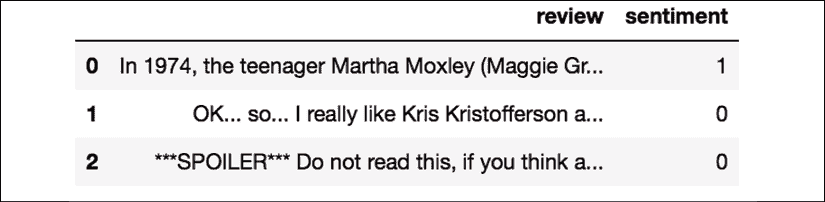
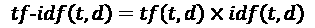
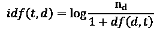
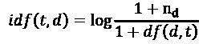
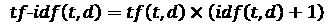
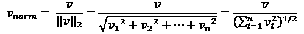
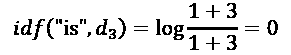
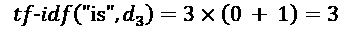
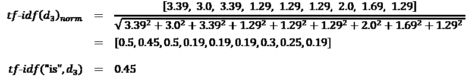

# 第八章：将机器学习应用于情感分析

在现代互联网和社交媒体时代，人们的意见、评论和推荐已经成为政治学和商业领域的宝贵资源。得益于现代技术，我们现在能够最有效地收集和分析这些数据。在本章中，我们将深入探讨自然语言处理（**NLP**）的一个子领域——**情感分析**，并学习如何使用机器学习算法根据文档的极性（作者的态度）来分类文档。特别地，我们将使用来自**互联网电影数据库**（**IMDb**）的50,000条电影评论数据集，构建一个预测模型，能够区分正面评论和负面评论。

我们将在接下来的章节中讨论以下主题：

+   清理和准备文本数据

+   从文本文档中构建特征向量

+   训练机器学习模型以分类正面和负面电影评论

+   使用外部学习处理大型文本数据集

+   从文档集合中推断主题进行分类

# 准备IMDb电影评论数据以进行文本处理

如前所述，情感分析，有时也叫做**意见挖掘**，是自然语言处理（NLP）这一广泛领域中的一个热门子学科；它关注的是分析文档的极性。情感分析中的一个常见任务是基于作者对某一特定话题表达的意见或情感对文档进行分类。

在本章中，我们将使用来自互联网电影数据库（IMDb）的一个大型电影评论数据集，该数据集由Andrew Maas等人收集（*Learning Word Vectors for Sentiment Analysis*, *A. L. Maas*, *R. E. Daly*, *P. T. Pham*, *D. Huang*, *A. Y. Ng*, and *C. Potts*, *Proceedings of the 49th Annual Meeting of the Association for Computational Linguistics: Human Language Technologies*, pages 142–150, Portland, Oregon, USA, Association for Computational Linguistics, *June 2011*）。该电影评论数据集包含50,000条极性电影评论，每条评论被标记为正面或负面；其中，正面表示电影在IMDb上的评分超过六星，负面表示电影在IMDb上的评分低于五星。在接下来的章节中，我们将下载数据集，进行预处理，将其转换为适用于机器学习工具的格式，并从这些电影评论的子集提取有意义的信息，构建一个机器学习模型，预测某个评论者是否喜欢或不喜欢一部电影。

## 获取电影评论数据集

可以从[http://ai.stanford.edu/~amaas/data/sentiment/](http://ai.stanford.edu/~amaas/data/sentiment/)下载电影评论数据集的压缩档案（84.1 MB），该档案为gzip压缩的tarball格式：

+   如果你使用的是 Linux 或 macOS，可以打开一个新的终端窗口，进入下载目录并执行 `tar -zxf aclImdb_v1.tar.gz` 来解压数据集。

+   如果你使用的是 Windows，可以下载一个免费的压缩工具，如 7-Zip ([http://www.7-zip.org](http://www.7-zip.org))，用来从下载档案中提取文件。

+   或者，你也可以直接在 Python 中解压 gzip 压缩的 tarball 文件，方法如下：

    ```py
    >>> import tarfile
    >>> with tarfile.open('aclImdb_v1.tar.gz', 'r:gz') as tar:
    ...     tar.extractall() 
    ```

## 将电影数据集预处理为更方便的格式

在成功解压数据集后，我们将把解压后的下载档案中的各个文本文件合并成一个单一的 CSV 文件。在接下来的代码段中，我们将把电影评论读取到一个 pandas `DataFrame` 对象中，这个过程在标准桌面计算机上可能需要最多 10 分钟。

为了可视化进度和预计完成时间，我们将使用 **Python 进度指示器** (**PyPrind**, [https://pypi.python.org/pypi/PyPrind/](https://pypi.python.org/pypi/PyPrind/)) 包，该包是几年前为此类目的开发的。你可以通过执行 `pip install pyprind` 命令来安装 PyPrind：

```py
>>> import pyprind
>>> import pandas as pd
>>> import os
>>> # change the 'basepath' to the directory of the
>>> # unzipped movie dataset
>>> basepath = 'aclImdb'
>>>
>>> labels = {'pos': 1, 'neg': 0}
>>> pbar = pyprind.ProgBar(50000)
>>> df = pd.DataFrame()
>>> for s in ('test', 'train'):
...     for l in ('pos', 'neg'):
...         path = os.path.join(basepath, s, l)
...         for file in sorted(os.listdir(path)):
...             with open(os.path.join(path, file),
...                       'r', encoding='utf-8') as infile:
...                 txt = infile.read()
...             df = df.append([[txt, labels[l]]],
...                            ignore_index=True)
...             pbar.update()
>>> df.columns = ['review', 'sentiment']
0%                          100%
[##############################] | ETA: 00:00:00
Total time elapsed: 00:02:05 
```

在前面的代码中，我们首先初始化了一个新的进度条对象 `pbar`，设置为 50,000 次迭代，这是我们要读取的文档数量。通过嵌套的 `for` 循环，我们遍历了主 `aclImdb` 目录中的 `train` 和 `test` 子目录，并从 `pos` 和 `neg` 子目录中读取了各个文本文件，最终将它们与整数分类标签（`1` = 正面，`0` = 负面）一起添加到 `df` pandas `DataFrame` 中。

由于合并后的数据集中的类标签是排序的，我们现在将使用 `np.random` 子模块中的 `permutation` 函数打乱 `DataFrame`——这将在后续部分中非常有用，当我们直接从本地驱动器流式传输数据时，用于将数据集分为训练集和测试集。

为了方便起见，我们还将把合并并打乱的电影评论数据集存储为 CSV 文件：

```py
>>> import numpy as np
>>> np.random.seed(0)
>>> df = df.reindex(np.random.permutation(df.index))
>>> df.to_csv('movie_data.csv', index=False, encoding='utf-8') 
```

由于我们将在本章后续部分使用这个数据集，让我们快速确认一下我们是否成功地将数据保存为正确的格式，通过读取 CSV 文件并打印前三个示例的部分内容：

```py
>>> df = pd.read_csv('movie_data.csv', encoding='utf-8')
>>> df.head(3) 
```

如果你在 Jupyter Notebook 中运行代码示例，你现在应该能看到数据集的前三个示例，如下表所示：



作为一个合理性检查，在我们继续下一节之前，让我们确认一下 `DataFrame` 中包含了所有 50,000 行数据：

```py
>>> df.shape
(50000, 2) 
```

# 介绍词袋模型

你可能还记得在*第4章*，*构建良好的训练数据集—数据预处理*中，我们需要将分类数据（如文本或单词）转换为数值形式，才能将其传递给机器学习算法。在本节中，我们将介绍**词袋模型**，它允许我们将文本表示为数值特征向量。词袋模型的核心思想非常简单，可以总结如下：

1.  我们从整个文档集合中创建唯一标记的词汇表——例如，单词。

1.  我们从每个文档中构建特征向量，该向量包含每个单词在特定文档中出现的次数。

由于每个文档中的唯一单词仅代表词袋词汇表中所有单词的一个小子集，因此特征向量大部分将由零组成，这就是为什么我们称它们为**稀疏**的原因。如果这听起来太抽象，不用担心；在接下来的小节中，我们将一步步演示如何创建一个简单的词袋模型。

## 将单词转换为特征向量

为了基于各个文档中的单词计数构建一个词袋模型，我们可以使用scikit-learn中实现的`CountVectorizer`类。如你将在接下来的代码部分看到的那样，`CountVectorizer`接受一个文本数据数组，这些数据可以是文档或句子，并为我们构建词袋模型：

```py
>>> import numpy as np
>>> from sklearn.feature_extraction.text import CountVectorizer
>>> count = CountVectorizer()
>>> docs = np.array(['The sun is shining',
...                  'The weather is sweet',
...                  'The sun is shining, the weather is sweet,'
...                  'and one and one is two'])
>>> bag = count.fit_transform(docs) 
```

通过在`CountVectorizer`上调用`fit_transform`方法，我们构建了词袋模型的词汇表，并将以下三个句子转换为稀疏特征向量：

+   `'太阳在照耀'`

+   `'天气很甜美'`

+   `'太阳在照耀，天气很甜美，一加一等于二'`

现在，让我们打印出词汇表的内容，以更好地理解其中的基本概念：

```py
>>> print(count.vocabulary_)
{'and': 0,
'two': 7,
'shining': 3,
'one': 2,
'sun': 4,
'weather': 8,
'the': 6,
'sweet': 5,
'is': 1} 
```

如你从执行前面的命令中看到的那样，词汇表存储在一个Python字典中，该字典将唯一的单词映射到整数索引。接下来，让我们打印出我们刚刚创建的特征向量：

```py
>>> print(bag.toarray())
[[0 1 0 1 1 0 1 0 0]
 [0 1 0 0 0 1 1 0 1]
 [2 3 2 1 1 1 2 1 1]] 
```

此处显示的特征向量中的每个索引位置对应于存储为字典项的`CountVectorizer`词汇表中的整数值。例如，索引位置`0`的第一个特征表示单词'and'的出现次数，这个单词只出现在最后一个文档中，而索引位置`1`的单词'is'（文档向量中的第二个特征）在所有三个句子中都出现。这些特征向量中的值也称为**原始词频**：*tf*(*t*, *d*)——词汇`t`在文档*d*中出现的次数。需要注意的是，在词袋模型中，句子或文档中单词或词语的顺序并不重要。词频在特征向量中出现的顺序是根据词汇表中的索引派生的，这些索引通常是按字母顺序分配的。

**N-gram模型**

我们刚刚创建的词袋模型中的项目序列也被称为 **1-gram** 或 **unigram** 模型——词汇表中的每个项目或标记代表一个单词。更一般地说，NLP 中的连续项序列——词、字母或符号——也被称为 **n-grams**。n-gram 模型中的数字 *n* 选择取决于具体应用；例如，Ioannis Kanaris 等人进行的研究表明，大小为 3 和 4 的 n-gram 在反垃圾邮件邮件过滤中表现良好（*Words versus character n-grams for anti-spam filtering*, *Ioannis Kanaris*, *Konstantinos Kanaris*, *Ioannis Houvardas*, 和 *Efstathios Stamatatos*, *International Journal on Artificial Intelligence Tools*, *World Scientific Publishing Company*, 16(06): 1047-1067, *2007*）。

为了总结 n-gram 表示法的概念，我们将构建我们第一个文档 "the sun is shining" 的 1-gram 和 2-gram 表示法如下：

+   1-gram: "the", "sun", "is", "shining"

+   2-gram: "the sun", "sun is", "is shining"

scikit-learn 中的 `CountVectorizer` 类允许我们通过其 `ngram_range` 参数使用不同的 n-gram 模型。默认情况下使用的是 1-gram 表示法，我们也可以通过用 `ngram_range=(2,2)` 初始化新的 `CountVectorizer` 实例来切换到 2-gram 表示法。

## 通过词频-逆文档频率评估词语相关性

在分析文本数据时，我们常常遇到一些在多个文档中都出现的词语。这些高频词通常不包含有用的或区分性的的信息。在本小节中，您将学习一种名为 **词频-逆文档频率**（**tf-idf**）的有用技术，它可以用于降低这些高频词在特征向量中的权重。tf-idf 可以定义为词频和逆文档频率的乘积：



这里，*tf*(*t*, *d*) 是我们在上一节中介绍的词频，*idf*(*t*, *d*) 是逆文档频率，可以通过以下方式计算：



这里， 是文档总数，*df*(*d*, *t*) 是包含词项 *t* 的文档数 *d*。注意，给分母加上常数 1 是可选的，它的目的是为那些在任何训练样本中都没有出现的词项分配一个非零值；使用 *log* 是为了确保低文档频率不会被赋予过多的权重。

scikit-learn 库还实现了另一个变换器——`TfidfTransformer` 类，它将 `CountVectorizer` 类的原始词频作为输入，并将其转换为 tf-idf：

```py
>>> from sklearn.feature_extraction.text import TfidfTransformer
>>> tfidf = TfidfTransformer(use_idf=True,
...                          norm='l2',
...                          smooth_idf=True)
>>> np.set_printoptions(precision=2)
>>> print(tfidf.fit_transform(count.fit_transform(docs))
...       .toarray())
[[ 0\.    0.43  0\.    0.56  0.56  0\.    0.43  0\.    0\.  ]
 [ 0\.    0.43  0\.    0\.    0\.    0.56  0.43  0\.    0.56]
 [ 0.5   0.45  0.5   0.19  0.19  0.19  0.3   0.25  0.19]] 
```

正如你在前一个小节中看到的，单词`'is'`在第三个文档中的词频最高，是最频繁出现的单词。然而，在将相同的特征向量转化为tf-idf后，单词`'is'`现在在第三个文档中的tf-idf值相对较小（`0.45`），因为它也出现在第一和第二个文档中，因此不太可能包含任何有用的区分信息。

然而，如果我们手动计算了特征向量中各个词的tf-idf值，我们会注意到`TfidfTransformer`计算tf-idf的方式与我们之前定义的标准教科书公式略有不同。scikit-learn中实现的逆文档频率公式计算如下：



类似地，scikit-learn中计算的tf-idf与我们之前定义的标准公式略有不同：



请注意，前面公式中的“+1”是由于在之前的代码示例中设置了`smooth_idf=True`，这有助于对出现在所有文档中的词汇赋予零权重（即，*idf*（*t*，*d*）= log(1) = 0）。

虽然在计算tf-idf之前对原始词频进行归一化更为常见，但`TfidfTransformer`类直接对tf-idf进行归一化。默认情况下（`norm='l2'`），scikit-learn的`TfidfTransformer`应用L2归一化，这通过将未归一化的特征向量*v*除以其L2范数，返回一个长度为1的向量：



为了确保我们理解`TfidfTransformer`的工作原理，让我们通过一个示例来计算单词`'is'`在第三个文档中的tf-idf值。单词`'is'`在第三个文档中的词频是3（*tf* = 3），并且该词的文档频率为3，因为单词`'is'`出现在所有三个文档中（*df* = 3）。因此，我们可以按如下方式计算逆文档频率：



现在，为了计算tf-idf，我们只需要将1加到逆文档频率上，然后将其与词频相乘：



如果我们对第三个文档中的所有词语重复此计算，我们将得到以下tf-idf向量：`[3.39, 3.0, 3.39, 1.29, 1.29, 1.29, 2.0, 1.69, 1.29]`。然而，注意到这个特征向量中的数值与我们之前使用的`TfidfTransformer`得到的值不同。我们在这个tf-idf计算中缺少的最后一步是L2归一化，可以按如下方式应用：



如你所见，结果现在与scikit-learn的`TfidfTransformer`返回的结果一致，既然你现在理解了tf-idf是如何计算的，让我们继续进入下一部分，并将这些概念应用到电影评论数据集上。

## 清理文本数据

在前面的子章节中，我们了解了词袋模型、词频和TF-IDF。然而，首先重要的一步——在构建我们的词袋模型之前——是通过去除所有不需要的字符来清理文本数据。

为了说明这一点的重要性，让我们展示重排后的电影评论数据集中第一篇文档的最后50个字符：

```py
>>> df.loc[0, 'review'][-50:]
'is seven.<br /><br />Title (Brazil): Not Available' 
```

正如你在这里看到的，文本中包含了HTML标记、标点符号和其他非字母字符。虽然HTML标记并不包含太多有用的语义，但在某些自然语言处理（NLP）上下文中，标点符号可以表示有用的附加信息。不过，为了简化，我们现在将移除所有标点符号，除了表情符号字符，如：:) ，因为这些显然对于情感分析是有用的。为了完成这个任务，我们将使用Python的**正则表达式**（**regex**）库`re`，如下面所示：

```py
>>> import re
>>> def preprocessor(text):
...     text = re.sub('<[^>]*>', '', text)
...     emoticons = re.findall('(?::|;|=)(?:-)?(?:\)|\(|D|P)',
...                            text)
...     text = (re.sub('[\W]+', ' ', text.lower()) +
...             ' '.join(emoticons).replace('-', ''))
...     return text 
```

通过前面代码段中的第一个正则表达式`<[^>]*>`，我们尝试从电影评论中移除所有的HTML标记。虽然许多程序员一般不建议使用正则表达式来解析HTML，但这个正则表达式应该足以*清理*这个特定的数据集。由于我们只关心移除HTML标记，并且不打算进一步使用HTML标记，因此使用正则表达式来完成这项工作是可以接受的。不过，如果你更倾向于使用更复杂的工具来从文本中移除HTML标记，可以查看Python的HTML解析器模块，相关内容描述在[https://docs.python.org/3/library/html.parser.html](https://docs.python.org/3/library/html.parser.html)中。在我们移除HTML标记之后，我们使用了一个稍微复杂一些的正则表达式来查找表情符号，并将其临时存储为表情符号。接着，我们通过正则表达式`[\W]+`移除文本中的所有非单词字符，并将文本转换为小写字母。

**处理单词大小写**

在本次分析的背景下，我们假设一个单词的大小写——例如，单词是否出现在句子的开头——不包含有意义的语义信息。然而，需要注意的是，也有例外；例如，我们会去除专有名词的标记。但在本次分析的背景下，我们简化假设字母的大小写并不包含对于情感分析相关的信息。

最终，我们将临时存储的表情符号添加到处理后文档字符串的末尾。此外，我们还为了保持一致性，去除了表情符号中的*鼻子*字符（:-)中的-）。

**正则表达式**

虽然正则表达式提供了一种高效且方便的方式来搜索字符串中的字符，但它们也有陡峭的学习曲线。不幸的是，关于正则表达式的深入讨论超出了本书的范围。然而，你可以在Google开发者门户网站找到一个很好的教程，地址是[https://developers.google.com/edu/python/regular-expressions](https://developers.google.com/edu/python/regular-expressions)，或者你也可以查看Python的`re`模块的官方文档，网址是[https://docs.python.org/3.7/library/re.html](https://docs.python.org/3.7/library/re.html)。

尽管将表情符号字符添加到清理后的文档字符串末尾可能看起来不是最优雅的方法，但我们必须注意，如果我们的词汇表仅包含单词级别的标记，那么在我们的词袋模型中，单词的顺序并不重要。但在我们进一步讨论如何将文档拆分为单独的术语、单词或标记之前，让我们先确认我们的`preprocessor`函数是否正常工作：

```py
>>> preprocessor(df.loc[0, 'review'][-50:])
'is seven title brazil not available'
>>> preprocessor("</a>This :) is :( a test :-)!")
'this is a test :) :( :)' 
```

最后，由于我们将在接下来的章节中反复使用*清理后的*文本数据，让我们现在将我们的`preprocessor`函数应用到`DataFrame`中的所有电影评论：

```py
>>> df['review'] = df['review'].apply(preprocessor) 
```

## 将文档处理成标记

成功准备好电影评论数据集后，我们现在需要考虑如何将文本语料库拆分成单独的元素。*分词*文档的一种方法是通过在清理后的文档中按照空白字符拆分它们，将文档分割成单个单词：

```py
>>> def tokenizer(text):
...     return text.split()
>>> tokenizer('runners like running and thus they run')
['runners', 'like', 'running', 'and', 'thus', 'they', 'run'] 
```

在分词的背景下，另一个有用的技术是**词干提取**，即将一个词转化为其词根形式的过程。它允许我们将相关的词映射到同一个词干。最初的词干提取算法是由Martin F. Porter于1979年开发的，因此被称为**Porter词干提取算法**（*一个后缀剥离算法*，*Martin F. Porter*，*程序：电子图书与信息系统*，14(3)：130–137，*1980*）。Python的**自然语言工具包**（**NLTK**，[http://www.nltk.org](http://www.nltk.org)）实现了Porter词干提取算法，我们将在以下代码部分中使用它。为了安装NLTK，你可以简单地执行`conda install nltk`或`pip install nltk`。

**NLTK在线书籍**

尽管NLTK不是本章的重点，但如果你对NLP中的更高级应用感兴趣，我强烈推荐你访问NLTK网站，并阅读官方的NLTK书籍，该书籍可以在[http://www.nltk.org/book/](http://www.nltk.org/book/)免费获得。

以下代码展示了如何使用Porter词干提取算法：

```py
>>> from nltk.stem.porter import PorterStemmer
>>> porter = PorterStemmer()
>>> def tokenizer_porter(text):
...     return [porter.stem(word) for word in text.split()]
>>> tokenizer_porter('runners like running and thus they run')
['runner', 'like', 'run', 'and', 'thu', 'they', 'run'] 
```

使用`nltk`包中的`PorterStemmer`，我们修改了我们的`tokenizer`函数，将单词还原为其词根形式，这在前面的简单示例中有所展示，其中单词`'running'`被*词干提取*为词根形式`'run'`。

**词干提取算法**

Porter词干提取算法可能是最古老且最简单的词干提取算法。其他流行的词干提取算法包括更新版的**Snowball词干提取器**（Porter2或英语词干提取器）和**Lancaster词干提取器**（Paice/Husk词干提取器）。尽管Snowball和Lancaster词干提取器比原始的Porter词干提取器更快，但Lancaster词干提取器因比Porter词干提取器更具侵略性而臭名昭著。这些替代的词干提取算法也可以通过NLTK包使用（[http://www.nltk.org/api/nltk.stem.html](http://www.nltk.org/api/nltk.stem.html)）。

虽然词干提取可能会产生非真实单词，例如从`thus`提取的`'thu'`，正如前面的例子所示，但一种叫做**词形还原**的技术旨在获得单个单词的标准（语法正确）形式——即所谓的**词根**。然而，与词干提取相比，词形还原在计算上更为复杂且成本更高，而且在实践中，已观察到词干提取和词形还原对文本分类的性能几乎没有影响（*单词规范化对文本分类的影响*，*Michal Toman*，*Roman Tesar*，和*Karel Jezek*，*InSciT会议录*，第354-358页，*2006*）。

在进入下一节之前，我们将训练一个机器学习模型，使用词袋模型，先简要谈谈另一个有用的主题——**停用词移除**。停用词是指在各种文本中非常常见的单词，这些单词可能没有（或仅有少量）可用来区分不同文档类别的有用信息。停用词的例子有*is*，*and*，*has*和*like*。如果我们正在处理原始或规范化的词频，而不是已经对高频词进行降权的tf-idf，移除停用词可能会有所帮助。

为了从电影评论中移除停用词，我们将使用来自NLTK库的127个英语停用词集合，您可以通过调用`nltk.download`函数来获取该集合：

```py
>>> import nltk
>>> nltk.download('stopwords')
After we download the stop-words set, we can load and apply the English stop-word set as follows:
>>> from nltk.corpus import stopwords
>>> stop = stopwords.words('english')
>>> [w for w in tokenizer_porter('a runner likes'
...  ' running and runs a lot')[-10:]
...  if w not in stop]
['runner', 'like', 'run', 'run', 'lot'] 
```

# 训练一个逻辑回归模型进行文档分类

在本节中，我们将训练一个逻辑回归模型，根据词袋模型将电影评论分类为*正面*和*负面*评论。首先，我们将把清理后的文本文档的`DataFrame`分成25,000篇训练文档和25,000篇测试文档：

```py
>>> X_train = df.loc[:25000, 'review'].values
>>> y_train = df.loc[:25000, 'sentiment'].values
>>> X_test = df.loc[25000:, 'review'].values
>>> y_test = df.loc[25000:, 'sentiment'].values 
```

接下来，我们将使用`GridSearchCV`对象，通过5折分层交叉验证，找到逻辑回归模型的最佳参数组合：

```py
>>> from sklearn.model_selection import GridSearchCV
>>> from sklearn.pipeline import Pipeline
>>> from sklearn.linear_model import LogisticRegression
>>> from sklearn.feature_extraction.text import TfidfVectorizer
>>> tfidf = TfidfVectorizer(strip_accents=None,
...                         lowercase=False,
...                         preprocessor=None)
>>> param_grid = [{'vect__ngram_range': [(1,1)],
...                'vect__stop_words': [stop, None],
...                'vect__tokenizer': [tokenizer,
...                                    tokenizer_porter],
...                'clf__penalty': ['l1', 'l2'],
...                'clf__C': [1.0, 10.0, 100.0]},
...               {'vect__ngram_range': [(1,1)],
...                'vect__stop_words': [stop, None],
...                'vect__tokenizer': [tokenizer,
...                                    tokenizer_porter],
...                'vect__use_idf':[False],
...                'vect__norm':[None],
...                'clf__penalty': ['l1', 'l2'],
...                'clf__C': [1.0, 10.0, 100.0]}
...              ]
>>> lr_tfidf = Pipeline([('vect', tfidf),
...                      ('clf',
...                       LogisticRegression(random_state=0,
...                                          solver='liblinear'))])
>>> gs_lr_tfidf = GridSearchCV(lr_tfidf, param_grid,
...                            scoring='accuracy',
...                            cv=5, verbose=2,
...                            n_jobs=1)
>>> gs_lr_tfidf.fit(X_train, y_train) 
```

**通过n_jobs参数进行多进程处理**

请注意，强烈建议在前面的代码示例中将`n_jobs=-1`（而不是`n_jobs=1`）设置为利用机器上的所有可用核心，从而加速网格搜索。然而，一些Windows用户在使用`n_jobs=-1`设置时遇到了与Windows上的`tokenizer`和`tokenizer_porter`函数的多进程序列化相关的问题。另一种解决方法是将这两个函数`[tokenizer, tokenizer_porter]`替换为`[str.split]`。但是，请注意，使用简单的`str.split`替换后，将不支持词干化。

当我们使用前面的代码初始化`GridSearchCV`对象及其参数网格时，我们将参数组合的数量限制在一定范围内，因为特征向量的数量以及大量的词汇量可能会使网格搜索的计算开销非常大。在标准台式计算机上，网格搜索可能需要最多40分钟才能完成。

在前面的代码示例中，我们将上一节中的`CountVectorizer`和`TfidfTransformer`替换为`TfidfVectorizer`，它将`CountVectorizer`和`TfidfTransformer`结合起来。我们的`param_grid`包含了两个参数字典。在第一个字典中，我们使用`TfidfVectorizer`的默认设置（`use_idf=True`、`smooth_idf=True`和`norm='l2'`）来计算tf-idfs；在第二个字典中，我们将这些参数设置为`use_idf=False`、`smooth_idf=False`和`norm=None`，以便基于原始词频训练模型。此外，对于逻辑回归分类器，我们通过惩罚参数训练了使用L2和L1正则化的模型，并通过定义反向正则化参数`C`的值范围来比较不同的正则化强度。

网格搜索完成后，我们可以打印出最佳的参数集：

```py
>>> print('Best parameter set: %s ' % gs_lr_tfidf.best_params_)
Best parameter set: {'clf__C': 10.0, 'vect__stop_words': None, 'clf__penalty': 'l2', 'vect__tokenizer': <function tokenizer at 0x7f6c704948c8>, 'vect__ngram_range': (1, 1)} 
```

如前面的输出所示，我们使用常规的`tokenizer`（不使用Porter词干化、没有停用词库，并且结合tf-idfs）与逻辑回归分类器（使用L2正则化，并设置正则化强度`C`为`10.0`）获得了最佳的网格搜索结果。

使用此网格搜索得到的最佳模型，我们可以打印出训练数据集的平均5折交叉验证准确率和测试数据集的分类准确率：

```py
>>> print('CV Accuracy: %.3f'
...       % gs_lr_tfidf.best_score_)
CV Accuracy: 0.897
>>> clf = gs_lr_tfidf.best_estimator_
>>> print('Test Accuracy: %.3f'
...       % clf.score(X_test, y_test))
Test Accuracy: 0.899 
```

结果表明，我们的机器学习模型能够以90%的准确率预测电影评论是正面还是负面。

**朴素贝叶斯分类器**

一种仍然非常流行的文本分类器是朴素贝叶斯分类器，它在电子邮件垃圾邮件过滤应用中获得了广泛使用。朴素贝叶斯分类器实现简单、计算高效，且在相对较小的数据集上通常表现特别好，优于其他算法。尽管本书中没有讨论朴素贝叶斯分类器，但有兴趣的读者可以在arXiv上找到一篇关于朴素贝叶斯文本分类的文章（*Naive Bayes and Text Classification I – Introduction and Theory*，*S. Raschka*，*Computing Research Repository* (*CoRR*)，abs/1410.5329，*2014*， [http://arxiv.org/pdf/1410.5329v3.pdf](http://arxiv.org/pdf/1410.5329v3.pdf)）。

# 处理更大的数据 – 在线算法与外部核心学习

如果你执行了上一节的代码示例，你可能已经注意到，在网格搜索过程中，为50,000条电影评论数据集构建特征向量可能非常耗费计算资源。在许多现实世界的应用中，处理更大的数据集也并不罕见，这些数据集可能超过我们计算机的内存容量。由于并非每个人都有超级计算机设施的使用权限，我们将应用一种叫做**外部核心学习（out-of-core learning）**的技术，它可以通过在数据集的小批次上逐步训练分类器，从而使我们能够处理这些大规模数据集。

**使用递归神经网络进行文本分类**

在*第16章*，*使用递归神经网络建模序列数据*中，我们将重新访问这个数据集，并训练一个基于深度学习的分类器（递归神经网络），以对IMDb电影评论数据集中的评论进行分类。这个基于神经网络的分类器采用与外部核心学习相同的原则，使用随机梯度下降优化算法，但不需要构建词袋模型。

在*第2章*，*训练简单的机器学习算法进行分类*中，介绍了**随机梯度下降**的概念；它是一种优化算法，通过每次使用一个示例来更新模型的权重。在本节中，我们将利用scikit-learn中`SGDClassifier`的`partial_fit`函数，直接从本地驱动器流式读取文档，并使用小批量文档训练一个逻辑回归模型。

首先，我们将定义一个`tokenizer`函数，用于清理我们在本章开头构建的`movie_data.csv`文件中的未处理文本数据，并将其拆分为词语标记，同时去除停用词：

```py
>>> import numpy as np
>>> import re
>>> from nltk.corpus import stopwords
>>> stop = stopwords.words('english')
>>> def tokenizer(text):
...     text = re.sub('<[^>]*>', '', text)
...     emoticons = re.findall('(?::|;|=)(?:-)?(?:\)|\(|D|P)',
...                            text.lower())
...     text = re.sub('[\W]+', ' ', text.lower()) \
...                   + ' '.join(emoticons).replace('-', '')
...     tokenized = [w for w in text.split() if w not in stop]
...     return tokenized 
```

接下来，我们将定义一个生成器函数`stream_docs`，该函数一次读取并返回一份文档：

```py
>>> def stream_docs(path):
...     with open(path, 'r', encoding='utf-8') as csv:
...         next(csv) # skip header
...         for line in csv:
...             text, label = line[:-3], int(line[-2])
...             yield text, label 
```

为了验证我们的`stream_docs`函数是否正常工作，让我们从`movie_data.csv`文件中读取第一份文档，该函数应返回一个元组，其中包括评论文本及其对应的类标签：

```py
>>> next(stream_docs(path='movie_data.csv'))
('"In 1974, the teenager Martha Moxley ... ',1) 
```

现在，我们将定义一个函数`get_minibatch`，该函数将从`stream_docs`函数中获取文档流，并返回由`size`参数指定的特定数量的文档：

```py
>>> def get_minibatch(doc_stream, size):
...     docs, y = [], []
...     try:
...         for _ in range(size):
...             text, label = next(doc_stream)
...             docs.append(text)
...             y.append(label)
...     except StopIteration:
...         return None, None
...     return docs, y 
```

不幸的是，我们无法使用`CountVectorizer`进行外部核心学习，因为它要求将完整的词汇表保存在内存中。另外，`TfidfVectorizer`需要将训练数据集的所有特征向量保存在内存中以计算逆文档频率。然而，scikit-learn中另一个有用的文本处理向量化工具是`HashingVectorizer`。`HashingVectorizer`与数据无关，并通过Austin Appleby的32位`MurmurHash3`哈希函数使用哈希技巧（[https://sites.google.com/site/murmurhash/](https://sites.google.com/site/murmurhash/)）：

```py
>>> from sklearn.feature_extraction.text import HashingVectorizer
>>> from sklearn.linear_model import SGDClassifier
>>> vect = HashingVectorizer(decode_error='ignore',
...                          n_features=2**21,
...                          preprocessor=None,
...                          tokenizer=tokenizer)
>>> clf = SGDClassifier(loss='log', random_state=1)
>>> doc_stream = stream_docs(path='movie_data.csv') 
```

使用上述代码，我们通过`tokenizer`函数初始化了`HashingVectorizer`，并将特征数量设置为`2**21`。此外，我们通过将`SGDClassifier`的`loss`参数设置为`'log'`重新初始化了逻辑回归分类器。请注意，通过选择`HashingVectorizer`中的大量特征，我们减少了哈希碰撞的可能性，但也增加了逻辑回归模型中的系数数量。

现在到了真正有趣的部分——在设置好所有的互补功能后，我们可以使用以下代码开始进行外部核心学习：

```py
>>> import pyprind
>>> pbar = pyprind.ProgBar(45)
>>> classes = np.array([0, 1])
>>> for _ in range(45):
...     X_train, y_train = get_minibatch(doc_stream, size=1000)
...     if not X_train:
...         break
...     X_train = vect.transform(X_train)
...     clf.partial_fit(X_train, y_train, classes=classes)
...     pbar.update()
0%                          100%
[##############################] | ETA: 00:00:00
Total time elapsed: 00:00:21 
```

再次，我们利用了PyPrind包来估计学习算法的进度。我们将进度条对象初始化为45次迭代，在接下来的`for`循环中，我们遍历了45个小批次的文档，每个小批次由1,000个文档组成。在完成增量学习过程后，我们将使用最后5,000个文档来评估模型的性能：

```py
>>> X_test, y_test = get_minibatch(doc_stream, size=5000)
>>> X_test = vect.transform(X_test)
>>> print('Accuracy: %.3f' % clf.score(X_test, y_test))
Accuracy: 0.868 
```

如你所见，该模型的准确率约为87%，略低于我们在上一节中通过网格搜索超参数调优所得到的准确率。然而，外部核心学习非常节省内存，完成的时间不到一分钟。最后，我们可以使用最后5,000个文档来更新我们的模型：

```py
>>> clf = clf.partial_fit(X_test, y_test) 
```

**word2vec模型**

一个比词袋模型更现代的替代方案是**word2vec**，这是Google在2013年发布的一种算法（*高效估计词向量表示*，*T. Mikolov*，*K. Chen*，*G. Corrado*，*J. Dean*，arXiv预印本arXiv:1301.3781，*2013*）。

word2vec算法是一种基于神经网络的无监督学习算法，旨在自动学习单词之间的关系。word2vec的思想是将意义相似的单词聚集在相似的簇中，通过巧妙的向量间距，模型可以使用简单的向量数学重新生成某些单词，例如，*king* – *man* + *woman* = *queen*。

原始的C语言实现，以及相关论文和其他实现的有用链接，可以在[https://code.google.com/p/word2vec/](https://code.google.com/p/word2vec/)找到。

# 使用潜在狄利克雷分配进行主题建模

**主题建模**描述了将主题分配给无标签文本文档的广泛任务。例如，一个典型的应用场景是将大量报纸文章文本集合中的文档进行分类。在主题建模的应用中，我们的目标是将这些文章分配到不同的类别标签，如体育、财经、世界新闻、政治、地方新闻等。因此，在我们在*第1章*《赋予计算机从数据中学习的能力》中讨论的机器学习广泛类别的背景下，我们可以将主题建模视为一种聚类任务，它是无监督学习的一个子类别。

在本节中，我们将讨论一种流行的主题建模技术，称为**潜在狄利克雷分配**（**LDA**）。然而，请注意，尽管潜在狄利克雷分配通常缩写为LDA，但它不能与*线性判别分析*混淆，后者是一种监督式的降维技术，在*第5章*《通过降维压缩数据》中进行了介绍。

**将电影评论分类器嵌入到Web应用程序中**

LDA不同于我们在本章中采用的监督学习方法，通过该方法我们将电影评论分类为正面和负面。因此，如果你有兴趣通过Flask框架将scikit-learn模型嵌入到Web应用程序中，并以电影评论为例，请随时跳到下一章，并在稍后的时间回到这一独立的主题建模部分。

## 使用LDA分解文本文档

由于LDA背后的数学内容较为复杂，并且需要一定的贝叶斯推断知识，我们将从实践者的角度来探讨这个主题，并用通俗的语言解释LDA。然而，感兴趣的读者可以通过以下研究论文了解更多关于LDA的内容：《潜在狄利克雷分配》（*Latent Dirichlet Allocation*），*David M. Blei*，*Andrew Y. Ng*，和*Michael I. Jordan*，*机器学习研究期刊 3*，第993-1022页，*2003年1月*。

LDA是一种生成式概率模型，它试图找到在不同文档中频繁同时出现的词组。这些频繁出现的词代表我们的主题，假设每个文档都是不同词的混合体。LDA的输入是我们在本章早些时候讨论的词袋模型。给定一个词袋矩阵作为输入，LDA将其分解为两个新的矩阵：

+   文档到主题矩阵

+   词到主题矩阵

LDA 将词袋矩阵分解成两部分，若我们将这两个矩阵相乘，就能够以最低的误差重建输入，即词袋矩阵。实际上，我们关注的是 LDA 在词袋矩阵中找到的那些主题。唯一的缺点可能是我们必须预先定义主题的数量——主题的数量是 LDA 的一个超参数，必须手动指定。

## 使用 scikit-learn 进行 LDA

在本小节中，我们将使用 scikit-learn 实现的 `LatentDirichletAllocation` 类，来分解电影评论数据集，并将其分类为不同的主题。在以下示例中，我们将分析限制为 10 个不同的主题，但鼓励读者尝试调整算法的超参数，以进一步探索该数据集中可以找到的主题。

首先，我们将使用本章开头创建的本地 `movie_data.csv` 文件，将数据集加载到 pandas `DataFrame` 中：

```py
>>> import pandas as pd
>>> df = pd.read_csv('movie_data.csv', encoding='utf-8') 
```

接下来，我们将使用已经熟悉的 `CountVectorizer` 来创建词袋矩阵，作为 LDA 的输入。

为了方便，我们将通过 `stop_words='english'` 使用 scikit-learn 内置的英语停用词库：

```py
>>> from sklearn.feature_extraction.text import CountVectorizer
>>> count = CountVectorizer(stop_words='english',
...                         max_df=.1,
...                         max_features=5000)
>>> X = count.fit_transform(df['review'].values) 
```

请注意，我们将考虑的词的最大文档频率设置为 10% (`max_df=.1`)，以排除在文档中出现频率过高的词。移除频繁出现的词的理由是，这些词可能是所有文档中常见的词，因此不太可能与给定文档的特定主题类别相关联。同时，我们将考虑的词的数量限制为最常出现的 5000 个词 (`max_features=5000`)，以限制数据集的维度，从而提高 LDA 推理的效果。然而，`max_df=.1` 和 `max_features=5000` 都是任意选择的超参数值，鼓励读者在比较结果时进行调优。

以下代码示例演示了如何将 `LatentDirichletAllocation` 估算器拟合到词袋矩阵上，并从文档中推断出 10 个不同的主题（请注意，模型拟合可能需要 5 分钟或更长时间，具体取决于笔记本电脑或标准桌面电脑的性能）：

```py
>>> from sklearn.decomposition import LatentDirichletAllocation
>>> lda = LatentDirichletAllocation(n_components=10,
...                                 random_state=123,
...                                 learning_method='batch')
>>> X_topics = lda.fit_transform(X) 
```

通过设置 `learning_method='batch'`，我们让 `lda` 估算器基于所有可用的训练数据（词袋矩阵）进行一次性估算，这比替代的 `'online'` 学习方法要慢，但可能会导致更准确的结果（设置 `learning_method='online'` 类似于在线或小批量学习，我们在 *第 2 章* *训练简单的机器学习分类算法* 和本章中有讨论）。

**期望最大化**

scikit-learn 库中 LDA 的实现使用了 **期望最大化**（**EM**）算法，通过迭代更新其参数估计。我们在本章中没有讨论 EM 算法，但如果你有兴趣了解更多内容，请参考 Wikipedia 上的精彩概述（[https://en.wikipedia.org/wiki/Expectation–maximization_algorithm](https://en.wikipedia.org/wiki/Expectation-maximization_algorithm)）以及 Colorado Reed 的教程《Latent Dirichlet Allocation: Towards a Deeper Understanding》，该教程详细介绍了如何在 LDA 中使用 EM 算法，且可在 [http://obphio.us/pdfs/lda_tutorial.pdf](http://obphio.us/pdfs/lda_tutorial.pdf) 免费阅读。

在拟合 LDA 模型后，我们现在可以访问 `lda` 实例的 `components_` 属性，该属性存储了一个矩阵，包含了每个主题的单词重要性（此处为 `5000`），并按递增顺序排列：

```py
>>> lda.components_.shape
(10, 5000) 
```

为了分析结果，我们首先打印每个主题的五个最重要的单词。请注意，单词的重要性值是按递增顺序排名的。因此，为了打印出前五个单词，我们需要将主题数组按逆序排序：

```py
>>> n_top_words = 5
>>> feature_names = count.get_feature_names()
>>> for topic_idx, topic in enumerate(lda.components_):
...     print("Topic %d:" % (topic_idx + 1))
...     print(" ".join([feature_names[i]
...                     for i in topic.argsort()\
...                     [:-n_top_words - 1:-1]]))
Topic 1:
worst minutes awful script stupid
Topic 2:
family mother father children girl
Topic 3:
american war dvd music tv
Topic 4:
human audience cinema art sense
Topic 5:
police guy car dead murder
Topic 6:
horror house sex girl woman
Topic 7:
role performance comedy actor performances
Topic 8:
series episode war episodes tv
Topic 9:
book version original read novel
Topic 10:
action fight guy guys cool 
```

基于每个主题的五个最重要单词，你可能会猜测 LDA 识别出了以下几个主题：

1.  一般来说，糟糕的电影（这并不是真正的主题类别）

1.  关于家庭的电影

1.  战争电影

1.  艺术电影

1.  犯罪电影

1.  恐怖电影

1.  喜剧电影评论

1.  与电视节目某种程度相关的电影

1.  基于书籍改编的电影

1.  动作电影

为了确认这些类别是否合理，我们绘制了三个来自恐怖电影类别的电影（恐怖电影属于类别 6，索引位置为 `5`）：

```py
>>> horror = X_topics[:, 5].argsort()[::-1]
>>> for iter_idx, movie_idx in enumerate(horror[:3]):
...     print('\nHorror movie #%d:' % (iter_idx + 1))
...     print(df['review'][movie_idx][:300], '...')
Horror movie #1:
House of Dracula works from the same basic premise as House of Frankenstein from the year before; namely that Universal's three most famous monsters; Dracula, Frankenstein's Monster and The Wolf Man are appearing in the movie together. Naturally, the film is rather messy therefore, but the fact that ...
Horror movie #2:
Okay, what the hell kind of TRASH have I been watching now? "The Witches' Mountain" has got to be one of the most incoherent and insane Spanish exploitation flicks ever and yet, at the same time, it's also strangely compelling. There's absolutely nothing that makes sense here and I even doubt there ...
Horror movie #3:
<br /><br />Horror movie time, Japanese style. Uzumaki/Spiral was a total freakfest from start to finish. A fun freakfest at that, but at times it was a tad too reliant on kitsch rather than the horror. The story is difficult to summarize succinctly: a carefree, normal teenage girl starts coming fac ... 
```

使用前面的代码示例，我们打印了前三部恐怖电影的前 300 个字符。评论——尽管我们不知道它们确切属于哪部电影——听起来像是恐怖电影的评论（然而，有人可能会认为 `Horror movie #2` 也可能适合分类为主题 1: *一般来说，糟糕的电影*）。

# 总结

在本章中，你学习了如何使用机器学习算法根据文本的极性对文档进行分类，这在自然语言处理领域的情感分析中是一个基础任务。你不仅学会了如何使用词袋模型将文档编码为特征向量，还学习了如何使用 tf-idf 根据相关性对词频进行加权。

处理文本数据的计算开销可能非常大，因为在这个过程中会创建大量的特征向量；在上一节中，我们介绍了如何利用外存或增量学习来训练机器学习算法，而不需要将整个数据集加载到计算机的内存中。

最后，你了解了使用 LDA 进行主题建模的概念，通过无监督的方式将电影评论分类到不同的类别中。

在下一章中，我们将使用我们的文档分类器，并学习如何将其嵌入到 Web 应用程序中。
