# 第九章：将机器学习模型嵌入Web应用程序

在前几章中，你学习了许多不同的机器学习概念和算法，它们可以帮助我们做出更好、更高效的决策。然而，机器学习技术不仅限于离线应用和分析，它们已经成为各种Web服务的预测引擎。例如，机器学习模型在Web应用中的一些流行且有用的应用包括提交表单中的垃圾邮件检测、搜索引擎、媒体或购物门户的推荐系统等等。

在本章中，你将学习如何将机器学习模型嵌入到一个Web应用程序中，该应用程序不仅可以分类，还可以实时从数据中学习。我们将覆盖的主题如下：

+   保存训练过的机器学习模型的当前状态

+   使用SQLite数据库进行数据存储

+   使用流行的Flask Web框架开发Web应用程序

+   将机器学习应用程序部署到公共Web服务器

# 序列化拟合的scikit-learn估算器

训练机器学习模型可能需要大量计算资源，就像你在*第8章*，*将机器学习应用于情感分析*中看到的那样。当然，我们不希望每次关闭Python解释器并想要进行新预测或重新加载我们的Web应用程序时，都重新训练模型吧？

一个模型持久化的选项是Python内置的`pickle`模块（[https://docs.python.org/3.7/library/pickle.html](https://docs.python.org/3.7/library/pickle.html)），它允许我们将Python对象结构序列化并反序列化为紧凑的字节码，这样我们就可以将分类器以当前状态保存下来，并在需要分类新的未标记样本时重新加载它，而无需让模型重新从训练数据中学习。在执行以下代码之前，请确保你已经在*第8章*的最后部分训练了外部核心逻辑回归模型，并且它已经准备好在当前的Python会话中使用：

```py
>>> import pickle
>>> import os
>>> dest = os.path.join('movieclassifier', 'pkl_objects')
>>> if not os.path.exists(dest):
...     os.makedirs(dest)
>>> pickle.dump(stop,
...             open(os.path.join(dest, 'stopwords.pkl'), 'wb'),
...             protocol=4)
>>> pickle.dump(clf,
...             open(os.path.join(dest, 'classifier.pkl'), 'wb'),
...             protocol=4) 
```

使用前面的代码，我们创建了一个`movieclassifier`目录，在其中存储我们Web应用程序的文件和数据。在这个`movieclassifier`目录中，我们创建了一个`pkl_objects`子目录，用来将序列化的Python对象保存到本地硬盘或固态硬盘中。通过`pickle`模块的`dump`方法，我们将训练好的逻辑回归模型以及**自然语言工具包**（**NLTK**）库的停用词集合序列化，这样我们就不需要在服务器上安装NLTK词汇。

`dump` 方法的第一个参数是我们要进行 Pickle 的对象。第二个参数是一个已打开的文件对象，Python 对象将被写入该文件。通过 `open` 函数中的 `wb` 参数，我们以二进制模式打开文件进行 Pickle，并设置 `protocol=4` 来选择 Python 3.4 中新增的最新且最有效的 Pickle 协议，它与 Python 3.4 或更新版本兼容。如果你在使用 `protocol=4` 时遇到问题，请检查你是否正在使用最新版本的 Python 3——本书推荐使用 Python 3.7。或者，你可以选择使用较低的协议版本。

还请注意，如果你使用的是自定义 Web 服务器，则需要确保该服务器上的 Python 安装与该协议版本兼容。

**使用 joblib 序列化 NumPy 数组**

我们的逻辑回归模型包含多个 NumPy 数组，例如权重向量。更高效的序列化 NumPy 数组的方式是使用替代库 `joblib`。为了确保与我们将在后续章节中使用的服务器环境兼容，我们将使用标准的 pickle 方法。如果你感兴趣，可以在 [https://joblib.readthedocs.io](https://joblib.readthedocs.io) 找到更多关于 `joblib` 的信息。

我们不需要对 `HashingVectorizer` 进行 Pickle，因为它不需要拟合。相反，我们可以创建一个新的 Python 脚本文件，并从中将矢量化器导入到当前的 Python 会话中。现在，复制以下代码并将其保存为 `vectorizer.py` 文件，放在 `movieclassifier` 目录中：

```py
from sklearn.feature_extraction.text import HashingVectorizer
import re
import os
import pickle
cur_dir = os.path.dirname(__file__)
stop = pickle.load(open(os.path.join(
                   cur_dir, 'pkl_objects', 'stopwords.pkl'),
                   'rb'))
def tokenizer(text):
    text = re.sub('<[^>]*>', '', text)
    emoticons = re.findall('(?::|;|=)(?:-)?(?:\)|\(|D|P)',
                           text.lower())
    text = re.sub('[\W]+', ' ', text.lower()) \
                  + ' '.join(emoticons).replace('-', '')
    tokenized = [w for w in text.split() if w not in stop]
    return tokenized

vect = HashingVectorizer(decode_error='ignore',
                         n_features=2**21,
                         preprocessor=None,
                         tokenizer=tokenizer) 
```

在我们对 Python 对象进行 Pickle 并创建了 `vectorizer.py` 文件后，最好重新启动 Python 解释器或 Jupyter Notebook 内核，以测试我们是否能够顺利反序列化这些对象。

**Pickle 可能带来安全风险**

请注意，从不受信任的来源反序列化数据可能会带来安全风险，因为 `pickle` 模块无法防范恶意代码。由于 `pickle` 被设计用来序列化任意对象，反序列化过程会执行存储在 pickle 文件中的代码。因此，如果你从不受信任的来源（例如从互联网下载）接收到 pickle 文件，请务必小心，并在虚拟环境中或在不存储重要数据的非关键机器上反序列化这些项目，这样除了你自己，其他人无法访问这些数据。

从终端进入 `movieclassifier` 目录，启动一个新的 Python 会话，并执行以下代码以验证你是否能够导入 `vectorizer` 并反序列化分类器：

```py
>>> import pickle
>>> import re
>>> import os
>>> from vectorizer import vect
>>> clf = pickle.load(open(os.path.join(
...                   'pkl_objects', 'classifier.pkl'),
...                   'rb')) 
```

成功加载 `vectorizer` 并反序列化分类器后，我们可以使用这些对象对文档示例进行预处理，并对其情感进行预测：

```py
>>> import numpy as np
>>> label = {0:'negative', 1:'positive'}
>>> example = ["I love this movie. It's amazing."]
>>> X = vect.transform(example)
>>> print('Prediction: %s\nProbability: %.2f%%' %\
...       (label[clf.predict(X)[0]],
...        np.max(clf.predict_proba(X))*100))
Prediction: positive
Probability: 95.55% 
```

由于我们的分类器返回的类别标签预测是整数类型，我们定义了一个简单的Python字典，将这些整数映射到其情感（`"positive"`或`"negative"`）。虽然这是一个仅包含两个类别的简单应用，但需要注意的是，这种字典映射的方法也可以推广到多类别的设置。此外，这个映射字典也应该与模型一同存档。

在这种情况下，由于字典定义只包含一行代码，我们不会费心使用pickle进行序列化。然而，在实际应用中，如果字典映射较大，可以利用我们在之前代码示例中使用的相同`pickle.dump`和`pickle.load`命令。

接着讨论之前的代码示例，我们使用了`HashingVectorizer`将简单的示例文档转换成了一个词向量`X`。最后，我们使用逻辑回归分类器的`predict`方法来预测类别标签，并使用`predict_proba`方法返回相应的预测概率。请注意，`predict_proba`方法返回一个数组，其中包含每个唯一类别标签的概率值。由于具有最大概率的类别标签就是`predict`方法返回的类别标签，我们使用了`np.max`函数来返回预测类别的概率。

# 设置SQLite数据库以存储数据

在本节中，我们将设置一个简单的SQLite数据库，用于收集Web应用用户对预测结果的可选反馈。我们可以使用这些反馈来更新我们的分类模型。SQLite是一个开源的SQL数据库引擎，无需单独的服务器即可操作，这使得它非常适合小型项目和简单的Web应用。实际上，SQLite数据库可以理解为一个单一的、独立的数据库文件，允许我们直接访问存储文件。

此外，SQLite不需要任何系统特定的配置，并且支持所有常见的操作系统。它因其高可靠性而广受欢迎，被谷歌、Mozilla、Adobe、苹果、微软等许多知名公司使用。如果你想了解更多关于SQLite的信息，请访问官网：[http://www.sqlite.org](http://www.sqlite.org)。

幸运的是，遵循Python的*电池包含*哲学，Python标准库中已经有一个API`sqlite3`，允许我们与SQLite数据库进行交互。（有关`sqlite3`的更多信息，请访问：[https://docs.python.org/3.7/library/sqlite3.html](https://docs.python.org/3.7/library/sqlite3.html)）。

通过执行以下代码，我们将在`movieclassifier`目录下创建一个新的SQLite数据库，并存储两个示例电影评论：

```py
>>> import sqlite3
>>> import os
>>> conn = sqlite3.connect('reviews.sqlite')
>>> c = conn.cursor()
>>> c.execute('DROP TABLE IF EXISTS review_db')
>>> c.execute('CREATE TABLE review_db'\
...           ' (review TEXT, sentiment INTEGER, date TEXT)')
>>> example1 = 'I love this movie'
>>> c.execute("INSERT INTO review_db"\
...           " (review, sentiment, date) VALUES"\
...           " (?, ?, DATETIME('now'))", (example1, 1))
>>> example2 = 'I disliked this movie'
>>> c.execute("INSERT INTO review_db"\
...           " (review, sentiment, date) VALUES"\
...           " (?, ?, DATETIME('now'))", (example2, 0))
>>> conn.commit()
>>> conn.close() 
```

按照前面的代码示例，我们通过调用`sqlite3`库的`connect`方法，创建了一个与SQLite数据库文件的连接（`conn`），如果该数据库文件`reviews.sqlite`在`movieclassifier`目录下不存在，它会被新建。

接下来，我们通过`cursor`方法创建了一个游标，它允许我们使用多功能的SQL语法遍历数据库记录。通过第一次调用`execute`，我们创建了一个新的数据库表`review_db`。我们用这个表来存储和访问数据库条目。除了`review_db`，我们还在这个数据库表中创建了三列：`review`、`sentiment`和`date`。我们用这些列来存储两条电影评论及其对应的分类标签（情感）。

通过使用`DATETIME('now')` SQL命令，我们还为我们的条目添加了日期和时间戳。除了时间戳，我们使用问号符号（`?`）将电影评论文本（`example1`和`example2`）和相应的分类标签（`1`和`0`）作为位置参数传递给`execute`方法，作为元组的成员。最后，我们调用了`commit`方法来保存对数据库所做的更改，并通过`close`方法关闭连接。

为了检查数据是否正确存储在数据库表中，我们现在将重新打开与数据库的连接，并使用SQL的`SELECT`命令来获取自2017年初至今天所有已提交的数据库表中的行：

```py
>>> conn = sqlite3.connect('reviews.sqlite')
>>> c = conn.cursor()
>>> c.execute("SELECT * FROM review_db WHERE date"\
...           " BETWEEN '2017-01-01 00:00:00' AND DATETIME('now')")
>>> results = c.fetchall()
>>> conn.close()
>>> print(results)
[('I love this movie', 1, '2019-06-15 17:53:46'), ('I disliked this movie', 0, '2019-06-15 17:53:46')] 
```

另外，我们也可以使用免费的SQLite浏览器应用（可通过[https://sqlitebrowser.org/dl/](https://sqlitebrowser.org/dl/)下载），它提供了一个漂亮的图形用户界面来操作SQLite数据库，如下图所示：

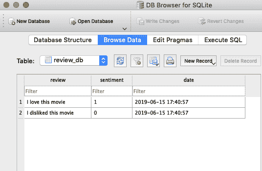

# 使用Flask开发Web应用

在上一小节准备好用于分类电影评论的代码后，让我们讨论Flask Web框架的基础知识，以便开发我们的Web应用。自2010年Armin Ronacher首次发布Flask以来，该框架获得了巨大的受欢迎程度，使用Flask的流行应用实例包括LinkedIn和Pinterest。由于Flask是用Python编写的，它为我们Python程序员提供了一个方便的接口，用于嵌入现有的Python代码，例如我们的电影分类器。

**Flask微框架**

Flask也被称为**微框架**，这意味着它的核心保持简洁而轻量，但可以通过其他库轻松扩展。虽然轻量级的Flask API的学习曲线远不如其他流行的Python Web框架（如Django）陡峭，但仍建议你查看Flask的官方文档：[https://flask.palletsprojects.com/en/1.0.x/](https://flask.palletsprojects.com/en/1.0.x/)，了解其更多功能。

如果 Flask 库还没有安装在你当前的 Python 环境中，你可以通过终端使用`conda`或`pip`轻松安装它（在撰写本文时，最新的稳定版本是 1.0.2）：

```py
conda install flask
# or: pip install flask 
```

## 我们的第一个 Flask Web 应用

在这一小节中，我们将开发一个非常简单的 web 应用，以便更熟悉 Flask API，然后再实现我们的电影分类器。我们将要构建的这个第一个应用包含一个简单的网页，网页上有一个表单字段，让我们输入一个名字。提交名字后，web 应用会将其渲染在一个新页面上。虽然这是一个非常简单的 web 应用示例，但它有助于理解如何在 Flask 框架中在不同部分之间存储和传递变量及值。

首先，我们创建一个目录树：

```py
1st_flask_app_1/
    app.py
    templates/
        first_app.html 
```

`app.py` 文件将包含由 Python 解释器执行的主要代码，以运行 Flask 网络应用。`templates` 目录是 Flask 查找静态 HTML 文件以供在网页浏览器中渲染的目录。现在，让我们来看看 `app.py` 的内容：

```py
from flask import Flask, render_template
app = Flask(__name__)
@app.route('/')
def index():
    return render_template('first_app.html')
if __name__ == '__main__':
    app.run() 
```

看过前面的代码示例后，让我们逐步讨论各个部分：

1.  我们将应用程序作为单个模块运行，因此我们使用参数 `__name__` 初始化了一个新的 Flask 实例，让 Flask 知道它可以在当前所在的目录中找到 HTML 模板文件夹（`templates`）。

1.  接下来，我们使用路由装饰器（`@app.route('/')`）来指定应触发 `index` 函数执行的 URL。

1.  在这里，我们的 `index` 函数简单地渲染了位于 `templates` 文件夹中的 `first_app.html` HTML 文件。

1.  最后，我们使用 `run` 函数来仅在 Python 解释器直接执行此脚本时运行应用程序，这一点我们通过使用 `if` 语句和 `__name__ == '__main__'` 来确保。

现在，让我们来看看 `first_app.html` 文件的内容：

```py
<!doctype html>
<html>
  <head>
    <title>First app</title>
  </head>
  <body>
    <div>Hi, this is my first Flask web app!</div>
  </body>
</html> 
```

**HTML 基础**

如果你还不熟悉 HTML 语法，可以访问 [https://developer.mozilla.org/en-US/docs/Web/HTML](https://developer.mozilla.org/en-US/docs/Web/HTML) 查阅关于 HTML 基础知识的有用教程。

在这里，我们简单地填充了一个空的 HTML 模板文件，里面有一个包含这句话的`<div>`元素（块级元素）：`Hi, this is my first Flask web app!`。

方便的是，Flask 允许我们在本地运行应用程序，这对在将 web 应用部署到公共服务器之前进行开发和测试非常有用。现在，让我们通过在 `1st_flask_app_1` 目录中的终端执行命令来启动我们的 web 应用：

```py
python3 app.py 
```

我们应该在终端看到类似以下的行：

```py
* Running on http://127.0.0.1:5000/ 
```

这一行包含了我们本地服务器的地址。我们可以在网页浏览器中输入此地址来查看 web 应用的运行效果。

如果一切顺利执行，我们应该能看到一个简单的网站，内容为`Hi, this is my first Flask web app!`，如以下图所示：

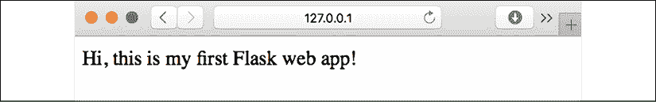

## 表单验证与渲染

在本小节中，我们将通过HTML表单元素扩展我们的简单Flask Web应用程序，学习如何使用WTForms库从用户收集数据（可以通过`conda`或`pip`安装该库），详细信息请参见[https://wtforms.readthedocs.org/en/latest/](https://wtforms.readthedocs.org/en/latest/)：

```py
conda install wtforms
# or pip install wtforms 
```

这个Web应用程序将提示用户在文本字段中输入姓名，如下图所示：

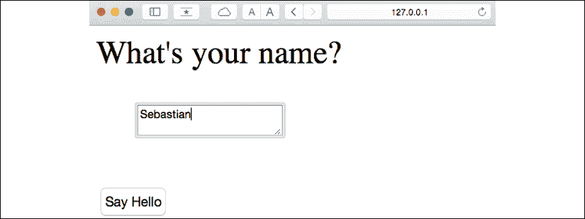

在提交按钮（**Say Hello**）被点击并且表单验证通过后，一个新的HTML页面将被渲染，显示用户的姓名：


### 设置目录结构

我们需要为此应用程序设置的新目录结构如下：

```py
1st_flask_app_2/
    app.py
    static/
        style.css
    templates/
        _formhelpers.html
        first_app.html
        hello.html 
```

以下是我们修改后的`app.py`文件的内容：

```py
from flask import Flask, render_template, request
from wtforms import Form, TextAreaField, validators
app = Flask(__name__)
class HelloForm(Form):
    sayhello = TextAreaField('',[validators.DataRequired()])
@app.route('/')
def index():
    form = HelloForm(request.form)
    return render_template('first_app.html', form=form)
@app.route('/hello', methods=['POST'])
def hello():
    form = HelloForm(request.form)
    if request.method == 'POST' and form.validate():
        name = request.form['sayhello']
        return render_template('hello.html', name=name)
    return render_template('first_app.html', form=form)
if __name__ == '__main__':
    app.run(debug=True) 
```

让我们逐步讨论之前的代码：

1.  使用`wtforms`，我们扩展了`index`函数，添加了一个文本字段，我们将通过`TextAreaField`类将其嵌入到我们的首页中，该类会自动检查用户是否提供了有效的输入文本。

1.  此外，我们定义了一个新的函数`hello`，该函数将在验证HTML表单后渲染HTML页面`hello.html`。

1.  在这里，我们使用`POST`方法将表单数据通过消息体传输到服务器。最后，通过在`app.run`方法中设置`debug=True`参数，我们进一步激活了Flask的调试器。这是开发新Web应用程序时非常有用的功能。

### 使用Jinja2模板引擎实现宏

现在，我们将在`_formhelpers.html`文件中通过Jinja2模板引擎实现一个通用宏，稍后我们将在`first_app.html`文件中导入该宏以渲染文本字段：

```py

  <dt>{{ field.label }}
  <dd>{{ field(**kwargs)|safe }}
  
    <ul class=errors>
    
      <li>{{ error }}</li>
    
    </ul>
  
  </dd>
  </dt>
 
```

对Jinja2模板语言的深入讨论超出了本书的范围。不过，您可以在[http://jinja.pocoo.org](http://jinja.pocoo.org)找到Jinja2语法的详细文档。

### 通过CSS添加样式

接下来，我们将设置一个简单的**层叠样式表**（**CSS**）文件，`style.css`，以演示如何修改HTML文档的外观和感觉。我们必须将以下CSS文件保存到名为`static`的子目录中，这是Flask查找静态文件（如CSS）的默认目录。文件内容如下：

```py
body {
     font-size: 2em;
} 
```

以下是修改后的`first_app.html`文件的内容，该文件现在将渲染一个文本表单，用户可以在其中输入姓名：

```py
<!doctype html>
<html>
  <head>
    <title>First app</title>
      <link rel="stylesheet"
       href="{{ url_for('static', filename='style.css') }}">
  </head>
  <body>
    
    <div>What's your name?</div>
    <form method=post action="/hello">
      <dl>
        {{ render_field(form.sayhello) }}
      </dl>
      <input type=submit value='Say Hello' name='submit_btn'>
    </form>
  </body>
</html> 
```

在 `first_app.html` 的头部部分，我们加载了 CSS 文件。现在它应该会改变 HTML 页面正文中所有文本元素的大小。在 HTML 页面正文部分，我们从 `_formhelpers.html` 导入了表单宏，并渲染了我们在 `app.py` 文件中指定的 `sayhello` 表单。此外，我们在同一表单元素中添加了一个按钮，以便用户能够提交文本框中的内容。原始和修改后的 `first_app.html` 文件之间的变化如以下图所示：

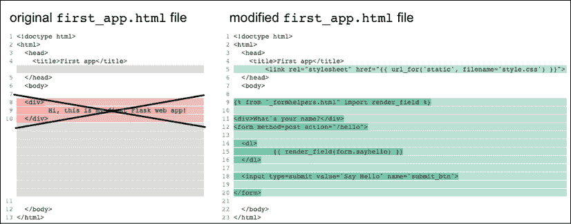

### 创建结果页面

最后，我们将创建一个 `hello.html` 文件，该文件将通过 `hello` 函数中的 `render_template('hello.html', name=name)` 这一行进行渲染，该函数是在 `app.py` 脚本中定义的，用于显示用户通过文本框提交的内容。文件内容如下：

```py
<!doctype html>
<html>
  <head>
    <title>First app</title>
      <link rel="stylesheet"
       href="{{ url_for('static', filename='style.css') }}">
  </head>
  <body>
    <div>Hello {{ name }}</div>
  </body>
</html> 
```

由于我们在前一部分已经涵盖了很多内容，下面的图提供了我们创建的文件的概述：

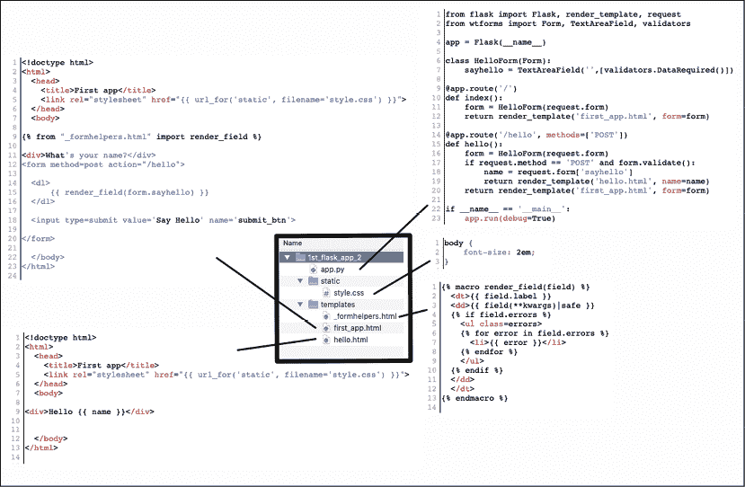

请注意，您不需要复制前一图中的任何代码，因为所有文件内容已经在之前的部分中提到过了。为了方便您，所有文件的副本也可以在网上找到，链接为 [https://github.com/rasbt/python-machine-learning-book-3rd-edition/tree/master/ch09/1st_flask_app_2](https://github.com/rasbt/python-machine-learning-book-3rd-edition/tree/master/ch09/1st_flask_app_2)。

在设置好修改后的 Flask Web 应用程序后，我们可以通过在应用程序主目录中执行以下命令来在本地运行它：

```py
python3 app.py 
```

然后，为了查看最终的网页，请在您的终端中输入显示的 IP 地址，通常是 `http://127.0.0.1:5000/`，将其输入到您的浏览器中查看渲染后的 Web 应用程序，具体内容总结如下图所示：

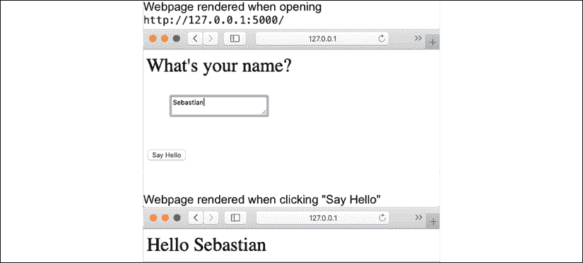

**Flask 文档和示例**

如果您是 Web 开发新手，一开始可能会觉得一些概念非常复杂。这种情况下，只需在您的硬盘上创建上述文件，并仔细查看它们。您会发现 Flask Web 框架相对简单，远比它初看起来要容易！此外，如果需要更多帮助，别忘了查阅优秀的 Flask 文档和示例，链接为 [http://flask.pocoo.org/docs/1.0/](http://flask.pocoo.org/docs/1.0/)。

# 将电影评论分类器转化为 Web 应用程序

现在我们已经对 Flask Web 开发的基础知识有所了解，接下来让我们进入下一步，将我们的电影分类器实现为一个 Web 应用程序。在这一部分，我们将开发一个 Web 应用程序，首先提示用户输入电影评论，如下图所示：

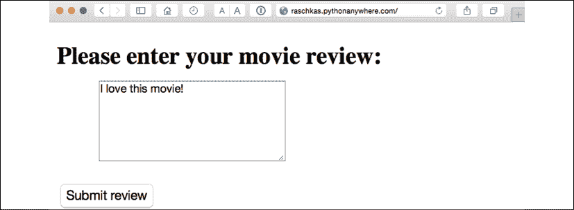

提交评论后，用户将看到一个新页面，显示预测的类别标签和预测的概率。此外，用户还可以通过点击 **Correct** 或 **Incorrect** 按钮对预测结果提供反馈，如下所示的截图：

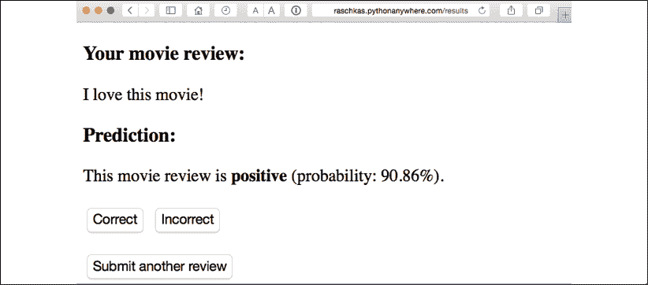

如果用户点击了 **Correct** 或 **Incorrect** 按钮，我们的分类模型将根据用户的反馈进行更新。此外，我们还将把用户提供的电影评论文本以及从按钮点击中推断出的建议类别标签存储到 SQLite 数据库中，以便将来参考。（另外，用户也可以跳过更新步骤，点击 **Submit another review** 按钮提交另一条评论。）

用户在点击反馈按钮后看到的第三个页面是一个简单的 *感谢* 页面，带有 **Submit another review** 按钮，点击该按钮将用户重定向回首页。如下所示的截图：

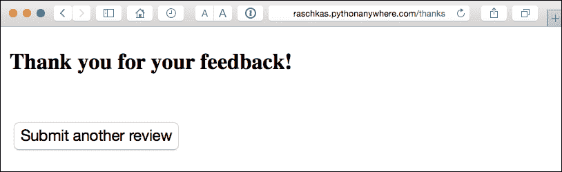

**实时演示**

在我们仔细查看此 Web 应用程序的代码实现之前，请访问 [http://raschkas.pythonanywhere.com](http://raschkas.pythonanywhere.com) 查看实时演示，以便更好地理解我们在本节中要完成的任务。

## 文件和文件夹 - 查看目录结构

为了从整体上了解，先来看看我们将为这个电影分类应用程序创建的目录结构，如下所示：

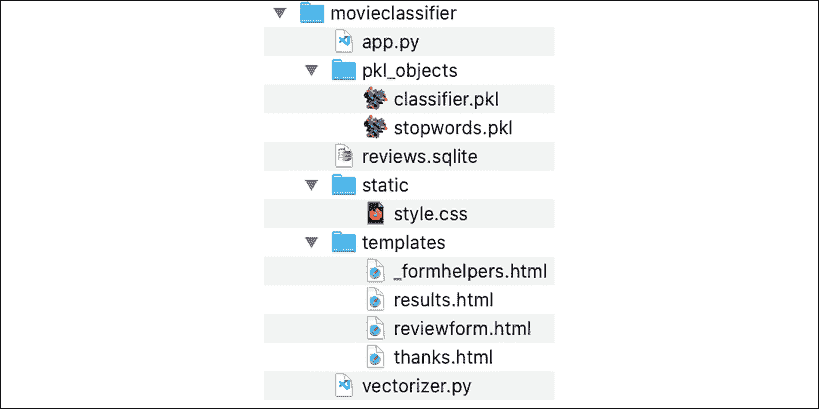

在本章的前面部分，我们创建了 `vectorizer.py` 文件、SQLite 数据库 `reviews.sqlite` 以及 `pkl_objects` 子目录，里面存储了已序列化的 Python 对象。

主目录中的 `app.py` 文件是包含 Flask 代码的 Python 脚本，我们将使用本章前面创建的 `review.sqlite` 数据库文件来存储提交到我们 Web 应用程序中的电影评论。`templates` 子目录包含将由 Flask 渲染并显示在浏览器中的 HTML 模板，`static` 子目录则包含一个简单的 CSS 文件，用于调整渲染 HTML 代码的外观。

**获取 movieclassifier 代码文件**

这本书的代码示例中提供了一个单独的目录，其中包含本节讨论的电影评论分类应用程序的代码，你可以直接从 Packt 获取或从 GitHub 下载，网址为 [https://github.com/rasbt/python-machine-learning-book-3rd-edition/](https://github.com/rasbt/python-machine-learning-book-3rd-edition/)。本节的代码可以在 `.../code/ch09/movieclassifier` 子目录中找到。

## 将主应用程序实现为 app.py

由于 `app.py` 文件相当长，我们将分两步来处理。`app.py` 的第一部分导入了我们需要的 Python 模块和对象，并包含了解压和设置分类模型的代码：

```py
from flask import Flask, render_template, request
from wtforms import Form, TextAreaField, validators
import pickle
import sqlite3
import os
import numpy as np
# import HashingVectorizer from local dir
from vectorizer import vect
app = Flask(__name__)
######## Preparing the Classifier
cur_dir = os.path.dirname(__file__)
clf = pickle.load(open(os.path.join(cur_dir,
                  'pkl_objects', 'classifier.pkl'),
                  'rb'))
db = os.path.join(cur_dir, 'reviews.sqlite')
def classify(document):
    label = {0: 'negative', 1: 'positive'}
    X = vect.transform([document])
    y = clf.predict(X)[0]
    proba = np.max(clf.predict_proba(X))
    return label[y], proba
def train(document, y):
    X = vect.transform([document])
    clf.partial_fit(X, [y])
def sqlite_entry(path, document, y):
    conn = sqlite3.connect(path)
    c = conn.cursor()
    c.execute("INSERT INTO review_db (review, sentiment, date)"\
              " VALUES (?, ?, DATETIME('now'))", (document, y))
    conn.commit()
    conn.close() 
```

`app.py` 脚本的第一部分现在应该非常熟悉了。我们简单地导入了 `HashingVectorizer` 并解压了逻辑回归分类器。接着，我们定义了一个 `classify` 函数，用来返回预测的类别标签，以及给定文本文档的相应概率预测。`train` 函数可以在提供文档和类别标签的情况下，用来更新分类器。

通过 `sqlite_entry` 函数，我们可以将提交的电影评论连同其类别标签和时间戳一起存储到我们的 SQLite 数据库中，供个人记录使用。请注意，如果我们重新启动 web 应用程序，`clf` 对象将被重置为其原始的、已序列化的状态。在本章结束时，您将学会如何使用我们在 SQLite 数据库中收集的数据来永久更新分类器。

`app.py` 脚本第二部分的概念也应该相当熟悉：

```py
######## Flask
class ReviewForm(Form):
    moviereview = TextAreaField('',
                                [validators.DataRequired(),
                                 validators.length(min=15)])
@app.route('/')
def index():
    form = ReviewForm(request.form)
    return render_template('reviewform.html', form=form)
@app.route('/results', methods=['POST'])
def results():
    form = ReviewForm(request.form)
    if request.method == 'POST' and form.validate():
        review = request.form['moviereview']
        y, proba = classify(review)
        return render_template('results.html',
                               content=review,
                               prediction=y,
                               probability=round(proba*100, 2))
    return render_template('reviewform.html', form=form)
@app.route('/thanks', methods=['POST'])
def feedback():
    feedback = request.form['feedback_button']
    review = request.form['review']
    prediction = request.form['prediction']

    inv_label = {'negative': 0, 'positive': 1}
    y = inv_label[prediction]
    if feedback == 'Incorrect':
        y = int(not(y))
    train(review, y)
    sqlite_entry(db, review, y)
    return render_template('thanks.html')
if __name__ == '__main__':
    app.run(debug=True) 
```

我们定义了一个 `ReviewForm` 类，该类实例化了一个 `TextAreaField`，该字段将渲染在 `reviewform.html` 模板文件中（即我们 web 应用程序的首页）。这个字段又会被 `index` 函数渲染。通过 `validators.length(min=15)` 参数，我们要求用户输入至少包含 15 个字符的评论。在 `results` 函数中，我们获取提交的网页表单内容，并将其传递给我们的分类器来预测电影的情感，预测结果将显示在渲染的 `results.html` 模板中。

`feedback` 函数在 `app.py` 中的实现可能乍一看会显得有点复杂。它本质上是从 `results.html` 模板中获取预测的类别标签（如果用户点击了 **正确** 或 **错误** 反馈按钮），然后将预测的情感转换回整数类别标签，以便通过我们在 `app.py` 脚本第一部分实现的 `train` 函数来更新分类器。如果提供了反馈，还会通过 `sqlite_entry` 函数向 SQLite 数据库中添加新的记录，最终，`thanks.html` 模板将被渲染，感谢用户的反馈。

## 设置评论表单

接下来，让我们看看 `reviewform.html` 模板，它构成了我们应用程序的起始页：

```py
<!doctype html>
<html>
  <head>
    <title>Movie Classification</title>
      <link rel="stylesheet"
       href="{{ url_for('static', filename='style.css') }}">
  </head>
  <body>

    <h2>Please enter your movie review:</h2>

    

    <form method=post action="/results">
      <dl>
        {{ render_field(form.moviereview, cols='30', rows='10') }}
      </dl>
      <div>
        <input type=submit value='Submit review' name='submit_btn'>
      </div>
    </form>

  </body>
</html> 
```

在这里，我们仅仅导入了之前在本章*表单验证与渲染*部分中定义的相同的`_formhelpers.html`模板。这个宏的`render_field`函数用于渲染一个`TextAreaField`，用户可以在其中提供电影评论，并通过页面底部显示的**提交评论**按钮提交。这一个`TextAreaField`宽度为30列，高度为10行，效果如下所示：

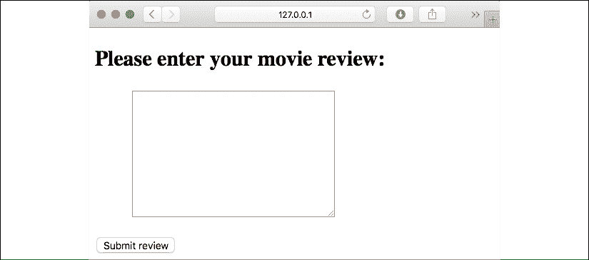

## 创建结果页面模板

我们的下一个模板，`results.html`，看起来稍微有点有趣：

```py
<!doctype html>
<html>
  <head>
    <title>Movie Classification</title>
      <link rel="stylesheet"
       href="{{ url_for('static', filename='style.css') }}">
  </head>
  <body>

    <h3>Your movie review:</h3>
    <div>{{ content }}</div>

    <h3>Prediction:</h3>
    <div>This movie review is <strong>{{ prediction }}</strong>
    (probability: {{ probability }}%).</div>

    <div id='button'>
      <form action="/thanks" method="post">
        <input type=submit value='Correct' name='feedback_button'>
        <input type=submit value='Incorrect' name='feedback_button'>
        <input type=hidden value='{{ prediction }}' name='prediction'>
        <input type=hidden value='{{ content }}' name='review'>
      </form>
    </div>

    <div id='button'>
      <form action="/">
        <input type=submit value='Submit another review'>
      </form>
    </div>

  </body>
</html> 
```

首先，我们将提交的评论以及预测结果插入到对应的字段`{{ content }}`、`{{ prediction }}`和`{{ probability }}`中。你可能会注意到，我们在包含**正确**和**错误**按钮的表单中第二次使用了`{{ content }}`和`{{ prediction }}`占位符变量（在此上下文中，也称为*隐藏字段*）。这是通过`POST`这些值回传给服务器，以便更新分类器并在用户点击这两个按钮中的一个时存储评论的解决方法。

此外，我们还在`results.html`文件的开头导入了一个CSS文件（`style.css`）。该文件的设置相当简单：它将Web应用程序内容的宽度限制为600像素，并将带有div id `button`的**错误**和**正确**按钮向下移动了20像素：

```py
body{
  width:600px;
}
.button{
  padding-top: 20px;
} 
```

这个CSS文件只是一个占位符，因此请随意修改它，以便根据你的喜好调整Web应用程序的外观和感觉。

我们将为Web应用程序实现的最后一个HTML文件是`thanks.html`模板。顾名思义，它在用户通过**正确**或**错误**按钮提供反馈后，简单地向用户展示一条*感谢*信息。此外，我们还将在此页面底部放置一个**提交另一个评论**按钮，点击该按钮将把用户重定向到起始页面。`thanks.html`文件的内容如下：

```py
<!doctype html>
<html>
  <head>
    <title>Movie Classification</title>
      <link rel="stylesheet"
       href="{{ url_for('static', filename='style.css') }}">
  </head>
  <body>

    <h3>Thank you for your feedback!</h3>

    <div id='button'>
      <form action="/">
        <input type=submit value='Submit another review'>
      </form>
    </div>

  </body>
</html> 
```

现在，在我们继续进行下一小节并将应用程序部署到公共Web服务器之前，最好先通过以下命令在命令行终端中本地启动Web应用程序：

```py
python3 app.py 
```

在我们完成应用程序的测试后，我们也不应该忘记删除`app.py`脚本中`app.run()`命令中的`debug=True`参数（或者设置`debug=False`），如下图所示：

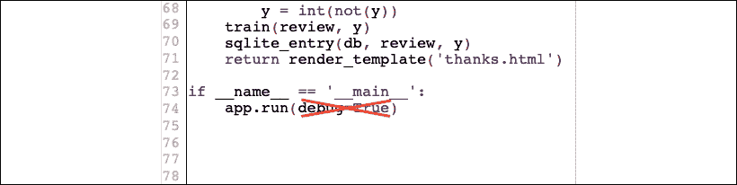

# 部署Web应用程序到公共服务器

在我们本地测试完Web应用程序后，现在可以将其部署到公共Web服务器上。对于本教程，我们将使用PythonAnywhere Web托管服务，该服务专门托管Python Web应用程序，使用起来非常简单方便。而且，PythonAnywhere提供了一个初学者账户选项，允许我们免费运行一个Web应用程序。

## 创建PythonAnywhere账户

要创建一个新的 PythonAnywhere 账户，我们访问 [https://www.pythonanywhere.com/](https://www.pythonanywhere.com/) 网站，点击右上角的**定价与注册**链接。接着，我们点击**创建初学者账户**按钮，在那里需要提供用户名、密码和有效的电子邮件地址。阅读并同意条款和条件后，我们就应该拥有一个新的账户。

不幸的是，免费的初学者账户不允许我们通过安全套接字外壳（SSH）协议从终端访问远程服务器。因此，我们需要使用 PythonAnywhere 的网页界面来管理我们的网页应用。但在将本地应用文件上传到服务器之前，我们需要为我们的 PythonAnywhere 账户创建一个新的网页应用。在点击右上角的**仪表盘**按钮后，我们可以访问页面顶部显示的控制面板。接下来，我们点击页面顶部现在可见的**Web**标签。然后，我们点击左侧的**+ 添加新网页应用**按钮，这样就可以创建一个新的 Python 3.7 Flask 网页应用，并将其命名为 `movieclassifier`。

## 上传电影分类器应用

在为我们的 PythonAnywhere 账户创建了一个新应用后，我们前往**文件**标签页，使用 PythonAnywhere 的网页界面上传我们本地 `movieclassifier` 目录中的文件。上传完我们在本地计算机上创建的网页应用文件后，我们的 PythonAnywhere 账户中应该会有一个 `movieclassifier` 目录，它将包含与本地 `movieclassifier` 目录相同的目录和文件，如下图所示：

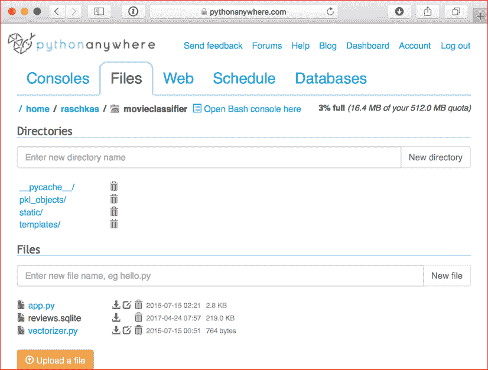

然后，我们再次前往**Web**标签，点击**重新加载 <username>.pythonanywhere.com**按钮，以传播更改并刷新我们的网页应用。最后，我们的网页应用应该已经启动并运行，并通过 `<username>.pythonanywhere.com` 公开可用。

**故障排除**

不幸的是，网页服务器对我们网页应用中的任何小问题都非常敏感。如果你在 PythonAnywhere 上运行网页应用时遇到问题，并且浏览器中显示错误信息，你可以检查服务器和错误日志，这些日志可以从你的 PythonAnywhere 账户中的**Web**标签访问，以便更好地诊断问题。

## 更新电影分类器

尽管每当用户提供分类反馈时，我们的预测模型都会即时更新，但如果 Web 服务器崩溃或重启，`clf` 对象的更新将会被重置。如果我们重新加载 Web 应用程序，`clf` 对象将会从 `classifier.pkl` pickle 文件中重新初始化。为了永久应用更新，一个选择是在每次更新后再次对 `clf` 对象进行 pickling。然而，随着用户数量的增加，这样做会变得在计算上非常低效，并且如果用户同时提供反馈，pickle 文件可能会损坏。

另一种解决方案是从收集到的 SQLite 数据库中的反馈数据中更新预测模型。一种选择是从 PythonAnywhere 服务器下载 SQLite 数据库，在本地计算机上更新 `clf` 对象，然后将新的 pickle 文件上传到 PythonAnywhere。为了在本地计算机上更新分类器，我们需要在 `movieclassifier` 目录中创建一个名为 `update.py` 的脚本文件，内容如下：

```py
import pickle
import sqlite3
import numpy as np
import os
# import HashingVectorizer from local dir
from vectorizer import vect
def update_model(db_path, model, batch_size=10000):
    conn = sqlite3.connect(db_path)
    c = conn.cursor()
    c.execute('SELECT * from review_db')

    results = c.fetchmany(batch_size)
    while results:
        data = np.array(results)
        X = data[:, 0]
        y = data[:, 1].astype(int)

        classes = np.array([0, 1])
        X_train = vect.transform(X)
        model.partial_fit(X_train, y, classes=classes)
        results = c.fetchmany(batch_size)

    conn.close()
    return model
cur_dir = os.path.dirname(__file__)
clf = pickle.load(open(os.path.join(cur_dir,
                  'pkl_objects',
                  'classifier.pkl'), 'rb'))
db = os.path.join(cur_dir, 'reviews.sqlite')
clf = update_model(db_path=db, model=clf, batch_size=10000)
# Uncomment the following lines if you are sure that
# you want to update your classifier.pkl file
# permanently.
# pickle.dump(clf, open(os.path.join(cur_dir,
#             'pkl_objects', 'classifier.pkl'), 'wb'),
#             protocol=4) 
```

**获取具有更新功能的电影分类器代码文件**

一个包含本章讨论的带有更新功能的电影评论分类器应用程序的独立目录，随书提供的代码示例一同提供，您可以直接从 Packt 获取，或者从 GitHub 下载：[https://github.com/rasbt/python-machine-learning-book-3rd-edition](https://github.com/rasbt/python-machine-learning-book-3rd-edition)。本节中的代码位于 `.../code/ch09/movieclassifier_with_update` 子目录中。

`update_model` 函数将一次性从 SQLite 数据库中批量获取 10,000 条记录，除非数据库中的记录更少。或者，我们也可以通过使用 `fetchone` 代替 `fetchmany` 来逐条获取记录，但这样做会在计算上非常低效。然而，请记住，如果我们处理的是超过计算机或服务器内存容量的大型数据集，使用替代的 `fetchall` 方法可能会成为一个问题。

现在我们已经创建了 `update.py` 脚本，我们还可以将其上传到 PythonAnywhere 上的 `movieclassifier` 目录，并在主应用程序脚本 `app.py` 中导入 `update_model` 函数，以便每次重新启动 Web 应用程序时从 SQLite 数据库中更新分类器。为此，我们只需要在 `app.py` 顶部添加一行代码，导入 `update.py` 脚本中的 `update_model` 函数：

```py
# import update function from local dir
from update import update_model 
```

然后我们需要在主应用程序代码中调用 `update_model` 函数：

```py
...
if __name__ == '__main__':
    clf = update_model(db_path=db,
                       model=clf,
                       batch_size=10000)
... 
```

如前所述，前面的代码片段中的修改将更新 PythonAnywhere 上的 pickle 文件。然而，在实际操作中，我们并不经常需要重启 Web 应用程序，因此，在更新之前验证 SQLite 数据库中的用户反馈，以确保这些反馈对分类器有价值，显得更加合理。

**创建备份**

在实际应用中，你可能还希望定期备份`classifier.pkl`的pickle文件，以防止文件损坏，例如在每次更新之前创建带时间戳的版本。为了创建pickle分类器的备份，你可以导入以下内容：

```py
from shutil import copyfile
import time 
```

然后，在更新pickle分类器的代码上方，代码如下：

```py
pickle.dump(
    clf, open(
        os.path.join(
            cur_dir, 'pkl_objects',
            'classifier.pkl'),
        'wb'),
    protocol=4) 
```

插入以下代码行：

```py
timestr = time.strftime("%Y%m%d-%H%M%S")
orig_path = os.path.join(
    cur_dir, 'pkl_objects', 'classifier.pkl')
backup_path = os.path.join(
    cur_dir, 'pkl_objects',
    'classifier_%s.pkl' % timestr)
copyfile(orig_path, backup_path) 
```

结果是，pickle后的分类器的备份文件将按照`YearMonthDay-HourMinuteSecond`的格式创建，例如`classifier_20190822-092148.pkl`。

# 总结

在本章中，你学习了许多有用且实用的主题，这些内容将扩展你对机器学习理论的理解。你学习了如何在训练后序列化一个模型，以及如何加载它以供以后使用。此外，我们创建了一个SQLite数据库用于高效的数据存储，并创建了一个网页应用程序，让我们能够将我们的电影分类器提供给外部世界。

到目前为止，在本书中，我们已经涵盖了许多机器学习概念、最佳实践以及用于分类的监督模型。在下一章中，我们将探讨监督学习的另一个子类别——回归分析，它可以让我们在连续尺度上预测结果变量，这与我们迄今为止所使用的分类模型的类别标签不同。
