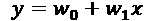
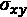
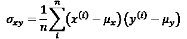
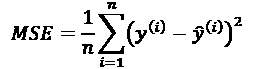
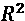
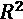
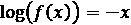
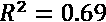

# 第十章：使用回归分析预测连续目标变量

在之前的章节中，您学到了许多关于**监督学习**的主要概念，并训练了许多不同的分类任务模型，以预测组别成员或分类变量。在本章中，我们将深入探讨监督学习的另一个子类别：**回归分析**。

回归模型用于预测连续范围的目标变量，这使得它们在解决许多科学问题时非常有吸引力。它们在工业中也有应用，例如理解变量之间的关系、评估趋势或进行预测。例如，预测公司未来几个月的销售额。

本章将讨论回归模型的主要概念，并涵盖以下主题：

+   探索和可视化数据集

+   查看实现线性回归模型的不同方法

+   训练对异常值稳健的回归模型

+   评估回归模型并诊断常见问题

+   将回归模型拟合到非线性数据

# 介绍线性回归

线性回归的目标是建模一个或多个特征与连续目标变量之间的关系。与分类——监督学习的另一个子类别——不同，回归分析旨在预测连续范围的输出，而不是分类标签。

在以下的小节中，您将了解最基本的线性回归类型——**简单线性回归**，并理解如何将其与更一般的多变量情况（具有多个特征的线性回归）联系起来。

## 简单线性回归

简单（**单变量**）线性回归的目标是建模单个特征（**解释变量**，*x*）与连续值**目标**（**响应变量**，*y*）之间的关系。具有一个解释变量的线性模型方程定义如下：



在这里，权重，，表示*y*轴截距，而是解释变量的权重系数。我们的目标是学习线性方程的权重，以描述解释变量与目标变量之间的关系，这些权重可以用来预测新的解释变量的响应，这些解释变量不属于训练数据集。

基于我们之前定义的线性方程，线性回归可以理解为寻找一条最佳拟合的直线，通过训练样本，如下图所示：


这条最佳拟合线也叫做**回归线**，从回归线到训练样本的垂直线被称为**偏差**或**残差**——即我们的预测误差。

## 多元线性回归

前一节介绍了简单线性回归，它是具有一个解释变量的线性回归的特例。当然，我们也可以将线性回归模型推广到多个解释变量；这个过程被称为**多元线性回归**：


这里，是*y*轴与的截距。

下图显示了具有两个特征的多元线性回归模型的二维拟合超平面可能的样子：


如你所见，多个线性回归超平面在三维散点图中的可视化，在查看静态图像时已经很难理解。由于我们没有很好的方法在散点图中可视化具有两个维度的超平面（适用于具有三个或更多特征的数据集的多元线性回归模型），本章中的示例和可视化将主要聚焦于单变量情况，使用简单线性回归。然而，简单线性回归和多元线性回归基于相同的概念和评估技术；我们将在本章讨论的代码实现也兼容这两种类型的回归模型。

# 探索住房数据集

在实现第一个线性回归模型之前，我们将讨论一个新的数据集——住房数据集，它包含由D. Harrison和D.L. Rubinfeld于1978年收集的波士顿郊区房屋信息。该住房数据集已经免费提供，并包含在本书的代码包中。尽管该数据集最近已从UCI机器学习库中删除，但它仍可在线访问，网址为[https://raw.githubusercontent.com/rasbt/python-machine-learning-book-3rd-edition/master/ch10/housing.data.txt](https://raw.githubusercontent.com/rasbt/python-machine-learning-book-3rd-edition/master/code/ch10/housing.data.txt)或通过scikit-learn ([https://github.com/scikit-learn/scikit-learn/blob/master/sklearn/datasets/data/boston_house_prices.csv](https://github.com/scikit-learn/scikit-learn/blob/master/sklearn/datasets/data/boston_house_prices.csv))。和每一个新的数据集一样，使用简单的可视化探索数据，总是有助于更好地理解我们正在处理的内容。

## 将住房数据集加载到数据框中

在本节中，我们将使用pandas的`read_csv`函数加载住房数据集，该函数快速且多功能，是处理以纯文本格式存储的表格数据的推荐工具。

住房数据集中506个示例的特征来自之前在[https://archive.ics.uci.edu/ml/datasets/Housing](https://archive.ics.uci.edu/ml/datasets/Housing)上分享的原始数据源，现总结如下：

+   `CRIM`：按城镇计算的人均犯罪率

+   `ZN`：划定为超过25,000平方英尺的住宅用地比例

+   `INDUS`：每个城镇非零售商业用地的比例

+   `CHAS`：查尔斯河虚拟变量（如果区域界限为河流，则为1，否则为0）

+   `NOX`：氮氧化物浓度（每千万分之一）

+   `RM`：每个住宅的平均房间数

+   `AGE`：1940年前建造的自有住房比例

+   `DIS`：到波士顿五个就业中心的加权距离

+   `RAD`：到辐射状高速公路的可达性指数

+   `TAX`：每 $10,000 的全额物业税税率

+   `PTRATIO`：各城镇的师生比

+   `B`：1000(*Bk* – 0.63)²，其中 *Bk* 是各城镇中[非洲裔美国人]人口的比例

+   `LSTAT`：低社会经济地位人群的百分比

+   `MEDV`：自有住房的中位数价值（单位为 $1000）

在本章的其余部分，我们将把房价（`MEDV`）视为目标变量——我们希望通过一个或多个解释变量来预测的变量。在进一步探索该数据集之前，让我们先将它加载到 pandas 的 `DataFrame` 中：

```py
>>> import pandas as pd
>>> df = pd.read_csv('https://raw.githubusercontent.com/rasbt/'
...                  'python-machine-learning-book-3rd-edition'
...                  '/master/ch10/housing.data.txt',
...                  header=None,
...                  sep='\s+')
>>> df.columns = ['CRIM', 'ZN', 'INDUS', 'CHAS',
...               'NOX', 'RM', 'AGE', 'DIS', 'RAD',
...               'TAX', 'PTRATIO', 'B', 'LSTAT', 'MEDV']
>>> df.head() 
```

为了确认数据集是否已成功加载，我们可以显示数据集的前五行，如下图所示：


**获取房屋数据集**

你可以在本书的代码包中找到一份房屋数据集的副本（以及本书中使用的所有其他数据集），如果你处于离线状态，或者 web 链接 [https://raw.githubusercontent.com/rasbt/python-machine-learning-book-3rd-edition/master/code/ch10/housing.data.txt](https://raw.githubusercontent.com/rasbt/python-machine-learning-book-3rd-edition/master/code/ch10/housing.data.txt) 暂时不可用，你可以使用该副本。例如，要从本地目录加载房屋数据集，你可以替换以下几行：

```py
df = pd.read_csv(
    'https://raw.githubusercontent.com/rasbt/'
    'python-machine-learning-book-3rd-edition/'
    'master/ch10/housing.data.txt',
    header=None,
    sep='\s+') 
```

在上面的代码示例中，使用这一行：

```py
df = pd.read_csv('./housing.data.txt',
    sep='\s+') 
```

## 可视化数据集的重要特征

**探索性数据分析**（**EDA**）是训练机器学习模型之前的重要且推荐的第一步。在本节的其余部分，我们将使用一些简单但有用的图形EDA工具箱中的技术，这些技术有助于我们从视觉上检测离群值的存在、数据的分布以及特征之间的关系。

首先，我们将创建一个**散点图矩阵**，它可以让我们在一个地方可视化数据集中不同特征之间的成对相关性。为了绘制散点图矩阵，我们将使用来自 MLxtend 库的`scatterplotmatrix`函数（[http://rasbt.github.io/mlxtend/](http://rasbt.github.io/mlxtend/)），这是一个包含多种机器学习和数据科学应用便捷函数的 Python 库。

你可以通过 `conda install mlxtend` 或 `pip install mlxtend` 安装 `mlxtend` 包。安装完成后，你可以导入该包并按如下方式创建散点图矩阵：

```py
>>> import matplotlib.pyplot as plt
>>> from mlxtend.plotting import scatterplotmatrix
>>> cols = ['LSTAT', 'INDUS', 'NOX', 'RM', 'MEDV']
>>> scatterplotmatrix(df[cols].values, figsize=(10, 8), 
...                   names=cols, alpha=0.5)
>>> plt.tight_layout()
>>> plt.show() 
```

如下图所示，散点图矩阵为我们提供了一个关于数据集中关系的有用图形总结：


由于篇幅限制和提高可读性的需要，我们仅绘制了数据集中的五列：`LSTAT`、`INDUS`、`NOX`、`RM`和`MEDV`。然而，建议你通过在前面的`scatterplotmatrix`函数调用中选择不同的列名，或者通过省略列选择器，来创建整个`DataFrame`的散点图矩阵，以便进一步探索数据集。

使用这个散点图矩阵，我们现在可以快速地观察数据的分布情况，并查看是否存在异常值。例如，我们可以看到`RM`和房价`MEDV`之间有线性关系（这是散点图矩阵第四行第五列的内容）。此外，在散点图矩阵的右下子图中，我们可以看到`MEDV`变量似乎呈正态分布，但包含几个异常值。

**线性回归的正态性假设**

请注意，与常见的看法相反，训练线性回归模型并不要求解释变量或目标变量必须符合正态分布。正态性假设仅是某些统计和假设检验的要求，而这些内容超出了本书的范围（有关此主题的更多信息，请参阅《线性回归分析导论》，*Montgomery*，*Douglas C. Montgomery*，*Elizabeth A. Peck*，*G. Geoffrey Vining*，*Wiley*，*2012*，第318-319页）。

## 使用相关矩阵查看变量之间的关系

在上一节中，我们通过直方图和散点图可视化了住房数据集变量的分布。接下来，我们将创建一个相关矩阵，以量化和总结变量之间的线性关系。相关矩阵与我们在*第5章*《通过主成分分析进行无监督降维》中讲解的协方差矩阵密切相关。我们可以将相关矩阵解释为协方差矩阵的重新缩放版本。实际上，相关矩阵与从标准化特征计算的协方差矩阵是相同的。

相关矩阵是一个方阵，包含**皮尔逊积矩相关系数**（通常缩写为**皮尔逊r**），它衡量特征对之间的线性依赖关系。相关系数的范围是 –1 到 1。两个特征如果*r* = 1，表示完美的正相关；如果*r* = 0，表示没有相关性；如果*r* = –1，表示完美的负相关。如前所述，皮尔逊相关系数可以简单地通过两个特征*x*和*y*之间的协方差（分子）除以它们标准差的乘积（分母）来计算：


这里， 表示相应特征的均值， 是特征 *x* 和 *y* 之间的协方差，而  和  是特征的标准差。

**标准化特征的协方差与相关性**

我们可以证明，一对标准化特征之间的协方差，实际上等于它们的线性相关系数。为了证明这一点，让我们首先标准化特征 *x* 和 *y*，得到它们的 z 分数，分别表示为  和 ：


请记住，我们计算两个特征之间的（总体）协方差的公式如下：



由于标准化将特征变量的均值中心化为零，我们现在可以按以下方式计算标准化特征之间的协方差：


通过重新代入，我们得到以下结果：


最后，我们可以将此方程简化为以下形式：


在以下代码示例中，我们将使用 NumPy 的 `corrcoef` 函数，作用于我们之前在散点图矩阵中可视化的五个特征列，并使用 MLxtend 的 `heatmap` 函数将相关矩阵数组绘制为热图：

```py
>>> from mlxtend.plotting import heatmap
>>> import numpy as np
>>> cm = np.corrcoef(df[cols].values.T)
>>> hm = heatmap(cm,
...              row_names=cols,
...              column_names=cols)
>>> plt.show() 
```

如结果图所示，相关矩阵为我们提供了另一个有用的总结图表，帮助我们基于特征之间的线性相关性选择特征：


为了拟合线性回归模型，我们关注与目标变量 `MEDV` 相关性较高的特征。通过查看先前的相关矩阵，我们可以看到目标变量 `MEDV` 与 `LSTAT` 变量（`-0.74`）的相关性最大；然而，正如你从散点图矩阵中观察到的，`LSTAT` 和 `MEDV` 之间存在明显的非线性关系。另一方面，`RM` 和 `MEDV` 之间的相关性也相对较高（`0.70`）。鉴于我们在散点图中观察到这两个变量之间的线性关系，`RM` 似乎是引入简单线性回归模型概念的一个很好的探索变量选择。

# 实现一个普通最小二乘线性回归模型

在本章开始时提到，线性回归可以理解为通过训练数据集中的样本点得到最佳拟合直线。然而，我们既没有定义*最佳拟合*这一术语，也没有讨论拟合这种模型的不同技术。在接下来的小节中，我们将使用**普通最小二乘法**（**OLS**）（有时也称为**线性最小二乘法**）来估计线性回归直线的参数，从而最小化垂直距离（残差或误差）的平方和。

## 使用梯度下降法求解回归参数

考虑我们在*第2章*《训练简单机器学习算法进行分类》中实现的**自适应线性神经元**（**Adaline**）。你一定还记得人工神经元使用的是线性激活函数。此外，我们定义了一个成本函数*J*(*w*)，并通过优化算法（如**梯度下降**（**GD**）和**随机梯度下降**（**SGD**））来最小化它，从而学习权重。Adaline中的成本函数是**平方误差和**（**SSE**），它与我们用于OLS的成本函数相同：


在这里， 是预测值 （注意，术语  只是为了方便推导GD的更新规则）。本质上，OLS回归可以理解为去掉单位阶跃函数后的Adaline，从而获得连续的目标值，而不是`-1`和`1`的类别标签。为了演示这一点，我们将从*第2章*《训练简单机器学习算法进行分类》中提取Adaline的GD实现，并去掉单位阶跃函数，来实现我们的第一个线性回归模型：

```py
class LinearRegressionGD(object):

    def __init__(self, eta=0.001, n_iter=20):
        self.eta = eta
        self.n_iter = n_iter

    def fit(self, X, y):
        self.w_ = np.zeros(1 + X.shape[1])
        self.cost_ = []

        for i in range(self.n_iter):
            output = self.net_input(X)
            errors = (y - output)
            self.w_[1:] += self.eta * X.T.dot(errors)
            self.w_[0] += self.eta * errors.sum()
            cost = (errors**2).sum() / 2.0
            self.cost_.append(cost)
        return self

    def net_input(self, X):
        return np.dot(X, self.w_[1:]) + self.w_[0]

    def predict(self, X):
        return self.net_input(X) 
```

**权重更新与梯度下降**

如果你需要复习权重是如何更新的——即沿梯度的相反方向更新——请重新阅读*第2章*《训练简单机器学习算法进行分类》中的*自适应线性神经元与学习的收敛性*一节。

为了演示我们的`LinearRegressionGD`回归器的应用，首先使用Housing数据集中的`RM`（房间数量）变量作为自变量，并训练一个能够预测`MEDV`（房价）的模型。此外，我们将对变量进行标准化，以便更好地实现GD算法的收敛。代码如下：

```py
>>> X = df[['RM']].values
>>> y = df['MEDV'].values
>>> from sklearn.preprocessing import StandardScaler
>>> sc_x = StandardScaler()
>>> sc_y = StandardScaler()
>>> X_std = sc_x.fit_transform(X)
>>> y_std = sc_y.fit_transform(y[:, np.newaxis]).flatten()
>>> lr = LinearRegressionGD()
>>> lr.fit(X_std, y_std) 
```

注意关于`y_std`的变通方法，使用了`np.newaxis`和`flatten`。scikit-learn中的大多数变换器都期望数据存储为二维数组。在之前的代码示例中，`y[:, np.newaxis]`中的`np.newaxis`为数组添加了一个新的维度。然后，在`StandardScaler`返回缩放后的变量后，我们通过`flatten()`方法将其转换回原始的、具有一维数组表示的形式，方便我们使用。

我们在*第2章*《*训练简单的机器学习算法进行分类*》中讨论过，当我们使用优化算法（如GD）时，绘制成本与训练数据集的迭代次数（epoch）之间的关系总是一个好主意，这样可以检查算法是否收敛到一个最小的成本（在这里是一个*全局*最小成本）：

```py
>>> plt.plot(range(1, lr.n_iter+1), lr.cost_)
>>> plt.ylabel('SSE')
>>> plt.xlabel('Epoch')
>>> plt.show() 
```

正如你在下面的图中看到的那样，GD算法在第5次迭代后收敛：


接下来，让我们可视化线性回归线拟合训练数据的效果。为此，我们将定义一个简单的辅助函数，用于绘制训练样本的散点图，并添加回归线：

```py
>>> def lin_regplot(X, y, model):
...     plt.scatter(X, y, c='steelblue', edgecolor='white', s=70)
...     plt.plot(X, model.predict(X), color='black', lw=2)
...     return None 
```

现在，我们将使用这个`lin_regplot`函数将房间数量与房价进行绘图：

```py
>>> lin_regplot(X_std, y_std, lr)
>>> plt.xlabel('Average number of rooms [RM] (standardized)')
>>> plt.ylabel('Price in $1000s [MEDV] (standardized)')
>>> plt.show() 
```

正如你在下面的图中看到的那样，线性回归线反映了房价随着房间数量的增加而普遍上升的趋势：


尽管这个观察结果是有道理的，但数据也告诉我们，在许多情况下，房间数量并不能很好地解释房价。在本章稍后，我们将讨论如何量化回归模型的表现。有趣的是，我们还可以观察到几个数据点排列在*y* = 3的位置，这表明价格可能被截断了。在某些应用中，报告预测结果变量的原始尺度可能也很重要。为了将预测的价格结果缩放回`Price in $1000s`轴，我们可以简单地使用`StandardScaler`的`inverse_transform`方法：

```py
>>> num_rooms_std = sc_x.transform(np.array([[5.0]]))
>>> price_std = lr.predict(num_rooms_std)
>>> print("Price in $1000s: %.3f" % \
...       sc_y.inverse_transform(price_std))
Price in $1000s: 10.840 
```

在这个代码示例中，我们使用了之前训练好的线性回归模型来预测一栋有五个房间的房子的价格。根据我们的模型，这样的房子价值$10,840。

顺便提一下，值得一提的是，如果我们使用标准化变量，我们在技术上不需要更新截距项的权重，因为在这种情况下，*y*轴的截距始终为0。我们可以通过打印权重来快速确认这一点：

```py
>>> print('Slope: %.3f' % lr.w_[1])
Slope: 0.695
>>> print('Intercept: %.3f' % lr.w_[0])
Intercept: -0.000 
```

## 通过scikit-learn估计回归模型的系数

在上一节中，我们实现了一个用于回归分析的工作模型；然而，在实际应用中，我们可能会对更高效的实现感兴趣。例如，scikit-learn 的许多回归估计器使用了 SciPy 中的最小二乘实现（`scipy.linalg.lstsq`），它基于线性代数库（LAPACK）进行了高度优化。scikit-learn 中的线性回归实现也能（更好地）处理未标准化的变量，因为它不使用基于（S）GD 的优化，因此我们可以跳过标准化步骤：

```py
>>> from sklearn.linear_model import LinearRegression
>>> slr = LinearRegression()
>>> slr.fit(X, y)
>>> y_pred = slr.predict(X)
>>> print('Slope: %.3f' % slr.coef_[0])
Slope: 9.102
>>> print('Intercept: %.3f' % slr.intercept_)
Intercept: -34.671 
```

从执行这段代码可以看出，scikit-learn 的 `LinearRegression` 模型，在未标准化的 `RM` 和 `MEDV` 变量上拟合时，得出了不同的模型系数，因为这些特征没有进行标准化。然而，当我们通过绘制 `MEDV` 与 `RM` 的关系来与我们的 GD 实现进行比较时，我们可以定性地看到它同样很好地拟合了数据：

```py
>>> lin_regplot(X, y, slr)
>>> plt.xlabel('Average number of rooms [RM]')
>>> plt.ylabel('Price in $1000s [MEDV]')
>>> plt.show() 
```

例如，我们可以看到整体结果与我们的 GD 实现非常相似：


**线性回归的解析解**

除了使用机器学习库外，解决 OLS 的另一个方法是通过一个线性方程组的封闭解，这个解可以在大多数入门统计学教材中找到：


我们可以通过以下方式在 Python 中实现：

```py
# adding a column vector of "ones"
>>> Xb = np.hstack((np.ones((X.shape[0], 1)), X))
>>> w = np.zeros(X.shape[1])
>>> z = np.linalg.inv(np.dot(Xb.T, Xb))
>>> w = np.dot(z, np.dot(Xb.T, y))
>>> print('Slope: %.3f' % w[1])
Slope: 9.102
>>> print('Intercept: %.3f' % w[0])
Intercept: -34.671 
```

这种方法的优点是它能够通过解析方法保证找到最优解。然而，如果我们处理的是非常大的数据集，求解这个公式中的矩阵逆可能会非常耗时（有时也称为**正态方程**），或者包含训练样本的矩阵可能是奇异矩阵（不可逆的），因此在某些情况下我们可能更倾向于使用迭代方法。

如果你想了解更多关于如何得到正态方程的信息，可以查看斯蒂芬·波洛克博士在莱斯特大学讲座中的章节 *经典线性回归模型*，该章节可以免费访问：[http://www.le.ac.uk/users/dsgp1/COURSES/MESOMET/ECMETXT/06mesmet.pdf](http://www.le.ac.uk/users/dsgp1/COURSES/MESOMET/ECMETXT/06mesmet.pdf)。

此外，如果你想比较通过 GD、SGD、封闭解、QR 分解和奇异值分解得到的线性回归解，可以使用 MLxtend 中实现的 `LinearRegression` 类（[http://rasbt.github.io/mlxtend/user_guide/regressor/LinearRegression/](http://rasbt.github.io/mlxtend/user_guide/regressor/LinearRegression/)），该类允许用户在这些选项之间切换。另一个非常值得推荐的 Python 回归建模库是 Statsmodels，它实现了更为先进的线性回归模型，详细内容请参见 [https://www.statsmodels.org/stable/examples/index.html#regression](https://www.statsmodels.org/stable/examples/index.html#regression)。

# 使用 RANSAC 拟合一个稳健的回归模型

线性回归模型可能会受到异常值的严重影响。在某些情况下，数据中的一个非常小的子集可能对估计的模型系数产生很大影响。有许多统计测试可以用来检测异常值，但这些内容超出了本书的范围。然而，去除异常值总是需要我们作为数据科学家的判断和我们的领域知识。

作为抛弃异常值的替代方法，我们将使用**随机样本一致性**（**RANSAC**）算法来进行回归分析，该算法将回归模型拟合到数据的子集上，即所谓的**内点**。

我们可以将迭代的 RANSAC 算法总结如下：

1.  随机选择一定数量的样本作为内点并拟合模型。

1.  将所有其他数据点与拟合模型进行测试，并将那些落在用户给定容差范围内的点添加到内点中。

1.  使用所有内点重新拟合模型。

1.  估算拟合模型与内点之间的误差。

1.  如果性能达到某个用户定义的阈值或达到固定的迭代次数，则终止算法；否则返回第 1 步。

现在，让我们使用线性模型并结合 scikit-learn 中实现的 RANSAC 算法，使用 `RANSACRegressor` 类：

```py
>>> from sklearn.linear_model import RANSACRegressor
>>> ransac = RANSACRegressor(LinearRegression(),
...                          max_trials=100,
...                          min_samples=50,
...                          loss='absolute_loss',
...                          residual_threshold=5.0,
...                          random_state=0)
>>> ransac.fit(X, y) 
```

我们将 `RANSACRegressor` 的最大迭代次数设置为 100，并且使用 `min_samples=50`，将随机选择的训练样本的最小数量设置为至少 50。通过将 `'absolute_loss'` 作为 `loss` 参数的参数，算法计算拟合线与训练样本之间的绝对垂直距离。通过将 `residual_threshold` 参数设置为 `5.0`，我们只允许当训练样本到拟合线的垂直距离在 5 个单位距离以内时才将其包含在内点集中，这在这个特定数据集上表现良好。

默认情况下，scikit-learn 使用**MAD**估算方法来选择内点阈值，其中 MAD 代表目标值`y`的**中位绝对偏差**。然而，选择适当的内点阈值是与问题相关的，这是 RANSAC 的一个缺点。近年来，已经开发了许多不同的方法来自动选择合适的内点阈值。你可以在*《鲁棒多重结构拟合中的内点阈值自动估计》*中找到详细讨论，*R. Toldo*，*A. Fusiello*，*Springer*，*2009*（见*《图像分析与处理–ICIAP 2009》*，第123-131页）。

一旦我们拟合了 RANSAC 模型，就让我们从拟合的 RANSAC 线性回归模型中获取内点和外点，并将它们与线性拟合一起绘制：

```py
>>> inlier_mask = ransac.inlier_mask_
>>> outlier_mask = np.logical_not(inlier_mask)
>>> line_X = np.arange(3, 10, 1)
>>> line_y_ransac = ransac.predict(line_X[:, np.newaxis])
>>> plt.scatter(X[inlier_mask], y[inlier_mask],
...             c='steelblue', edgecolor='white',
...             marker='o', label='Inliers')
>>> plt.scatter(X[outlier_mask], y[outlier_mask],
...             c='limegreen', edgecolor='white',
...             marker='s', label='Outliers')
>>> plt.plot(line_X, line_y_ransac, color='black', lw=2)
>>> plt.xlabel('Average number of rooms [RM]')
>>> plt.ylabel('Price in $1000s [MEDV]')
>>> plt.legend(loc='upper left')
>>> plt.show() 
```

如下图所示，线性回归模型是在检测到的内点集上拟合的，这些内点以圆圈表示：


当我们通过执行以下代码打印模型的斜率和截距时，线性回归线将与我们在上一节中没有使用RANSAC时得到的拟合线稍有不同：

```py
>>> print('Slope: %.3f' % ransac.estimator_.coef_[0])
Slope: 10.735
>>> print('Intercept: %.3f' % ransac.estimator_.intercept_)
Intercept: -44.089 
```

使用RANSAC，我们减少了数据集中异常值的潜在影响，但我们不知道这种方法是否会对未见数据的预测性能产生积极影响。因此，在下一节中，我们将探讨评估回归模型的不同方法，这是构建预测建模系统中至关重要的一部分。

# 评估线性回归模型的性能

在上一节中，你学习了如何在训练数据上拟合回归模型。然而，你在前几章中已经发现，至关重要的一点是要在模型没有在训练时见过的数据上进行测试，以获得更不偏倚的泛化性能估计。

正如你会记得的，从*第6章*，*模型评估和超参数调优的最佳实践学习*，我们希望将数据集分成单独的训练集和测试集，我们将使用前者来拟合模型，后者用来评估其在未见数据上的性能，以估计泛化性能。我们将不再继续使用简单回归模型，而是使用数据集中的所有变量并训练一个多元回归模型：

```py
>>> from sklearn.model_selection import train_test_split
>>> X = df.iloc[:, :-1].values
>>> y = df['MEDV'].values
>>> X_train, X_test, y_train, y_test = train_test_split(
...       X, y, test_size=0.3, random_state=0)
>>> slr = LinearRegression()
>>> slr.fit(X_train, y_train)
>>> y_train_pred = slr.predict(X_train)
>>> y_test_pred = slr.predict(X_test) 
```

由于我们的模型使用了多个解释变量，我们无法在二维图中可视化线性回归线（或者更准确地说，是超平面），但我们可以绘制残差图（实际值与预测值之间的差异或垂直距离）与预测值的关系图，从而诊断我们的回归模型。**残差图**是诊断回归模型时常用的图形工具。它们可以帮助检测非线性和异常值，并检查误差是否随机分布。

使用以下代码，我们现在将绘制一个残差图，在该图中，我们简单地从预测响应中减去真实的目标变量：

```py
>>> plt.scatter(y_train_pred, y_train_pred - y_train,
...             c='steelblue', marker='o', edgecolor='white',
...             label='Training data')
>>> plt.scatter(y_test_pred, y_test_pred - y_test,
...             c='limegreen', marker='s', edgecolor='white',
...             label='Test data')
>>> plt.xlabel('Predicted values')
>>> plt.ylabel('Residuals')
>>> plt.legend(loc='upper left')
>>> plt.hlines(y=0, xmin=-10, xmax=50, color='black', lw=2)
>>> plt.xlim([-10, 50])
>>> plt.show() 
```

执行代码后，我们应该看到一个通过 *x* 轴原点的残差图，如下所示：


在完美预测的情况下，残差应该恰好为零，但在实际应用中，我们可能永远不会遇到这种情况。然而，对于一个良好的回归模型，我们期望误差是随机分布的，残差应随机散布在中心线周围。如果在残差图中看到某种模式，这意味着我们的模型无法捕捉到一些解释性信息，这些信息已经渗入残差中，正如你在我们之前的残差图中可以略微看到的那样。此外，我们还可以利用残差图来检测异常值，这些异常值由偏离中心线较大的点表示。

另一种评估模型表现的有用定量指标是所谓的**均方误差**（**MSE**），它仅仅是我们在拟合线性回归模型时最小化的SSE成本的平均值。MSE对于比较不同的回归模型或通过网格搜索和交叉验证调节它们的参数非常有用，因为它通过样本大小对SSE进行归一化：



让我们计算一下训练集和测试集预测的MSE：

```py
>>> from sklearn.metrics import mean_squared_error
>>> print('MSE train: %.3f, test: %.3f' % (
...        mean_squared_error(y_train, y_train_pred),
...        mean_squared_error(y_test, y_test_pred)))
MSE train: 19.958, test: 27.196 
```

你可以看到，训练数据集上的均方误差（MSE）为19.96，而测试数据集上的MSE要大得多，达到了27.20，这表明我们的模型在这种情况下出现了过拟合。然而，请注意，与分类准确率等指标不同，MSE是没有上限的。换句话说，MSE的解释依赖于数据集和特征缩放。例如，如果房价以千元为单位（带有K后缀）表示，相比于处理未缩放特征的模型，相同的模型会得到较低的MSE。为了进一步说明这一点，。

因此，有时报告**决定系数**（）可能更为有用，它可以理解为MSE的标准化版本，有助于更好地解释模型的表现。换句话说，是模型捕获的响应方差的比例。的值定义为：


这里，SSE是误差平方和，SST是总平方和：


换句话说，SST仅仅是响应变量的方差。

让我们快速展示一下，实际上只是MSE的一个重新缩放版本：


对于训练数据集，的值限定在0到1之间，但对于测试数据集，它可能会变成负值。如果，则模型完美拟合数据，对应的*MSE*为0。

在训练数据上评估时，模型的为0.765，听起来还不错。然而，在测试数据集上的只有0.673，我们可以通过执行以下代码来计算这个值：

```py
>>> from sklearn.metrics import r2_score
>>> print('R^2 train: %.3f, test: %.3f' %
...       (r2_score(y_train, y_train_pred),
...        r2_score(y_test, y_test_pred)))
R^2 train: 0.765, test: 0.673 
```

# 使用正则化方法进行回归

正如我们在*第3章*中讨论的，*《使用scikit-learn的机器学习分类器巡礼》*，正则化是通过加入额外的信息来应对过拟合问题的一种方法，从而缩小模型参数值，给模型复杂度施加惩罚。最常见的正则化线性回归方法有**岭回归**、**最小绝对收缩与选择算子**（**LASSO**）和**弹性网**。

岭回归是一个L2惩罚模型，我们只是将权重的平方和添加到最小二乘成本函数中：


这里：


通过增大超参数的值，我们增加了正则化强度，从而缩小了模型的权重。请注意，我们不会对截距项进行正则化，。

一个可能导致稀疏模型的替代方法是LASSO。根据正则化强度，某些权重可以变为零，这也使得LASSO成为一种有监督的特征选择技术：


在这里，LASSO的L1惩罚定义为模型权重的绝对值之和，如下所示：


然而，LASSO的一个限制是，当*m* > *n*时，它最多选择*n*个特征，其中*n*是训练样本的数量。如果在某些特征选择应用中，这可能是不希望的。然而，在实践中，LASSO的这个特性往往是一个优势，因为它避免了模型的饱和。模型饱和是指训练样本的数量等于特征的数量，这是一种过度参数化的形式。因此，饱和模型可以总是完美地拟合训练数据，但仅仅是一种插值形式，因此不被期望能很好地推广。

Ridge回归和LASSO之间的折衷是弹性网，它具有L1惩罚以产生稀疏性，并且具有L2惩罚，因此在*m* > *n*时可以用于选择超过*n*个特征：


这些正则化回归模型都可以通过scikit-learn获得，其使用方式与普通回归模型类似，不同之处在于我们必须通过参数指定正则化强度，例如，通过k折交叉验证进行优化。

可以通过以下方式初始化Ridge回归模型：

```py
>>> from sklearn.linear_model import Ridge
>>> ridge = Ridge(alpha=1.0) 
```

请注意，正则化强度由参数`alpha`控制，类似于参数。同样，我们可以从`linear_model`子模块初始化LASSO回归器：

```py
>>> from sklearn.linear_model import Lasso
>>> lasso = Lasso(alpha=1.0) 
```

最后，`ElasticNet`实现允许我们调整L1与L2的比率：

```py
>>> from sklearn.linear_model import ElasticNet
>>> elanet = ElasticNet(alpha=1.0, l1_ratio=0.5) 
```

例如，如果我们将`l1_ratio`设置为1.0，则`ElasticNet`回归器将等于LASSO回归。有关不同线性回归实现的更多详细信息，请参阅文档：[http://scikit-learn.org/stable/modules/linear_model.html](http://scikit-learn.org/stable/modules/linear_model.html)。

# 将线性回归模型转化为曲线——多项式回归

在前面的部分中，我们假设了解释变量与响应变量之间存在线性关系。为了解决线性假设的违背问题，一种方法是通过添加多项式项来使用多项式回归模型：


这里，*d* 表示多项式的次数。虽然我们可以使用多项式回归来建模非线性关系，但由于使用的是线性回归系数 *w*，它仍然被视为一个多元线性回归模型。在接下来的子章节中，我们将看到如何方便地向现有数据集添加这些多项式项，并拟合多项式回归模型。

## 使用 scikit-learn 添加多项式项

我们现在将学习如何使用 scikit-learn 中的 `PolynomialFeatures` 变换器类，向一个简单回归问题中添加二次项（*d* = 2）。然后，我们将通过以下步骤将多项式与线性拟合进行比较：

1.  添加二次多项式项：

    ```py
    >>> from sklearn.preprocessing import PolynomialFeatures
    >>> X = np.array([ 258.0, 270.0, 294.0, 320.0, 342.0,
    ...                368.0, 396.0, 446.0, 480.0, 586.0])\
    ...              [:, np.newaxis]
    >>> y = np.array([ 236.4, 234.4, 252.8, 298.6, 314.2,
    ...                342.2, 360.8, 368.0, 391.2, 390.8])
    >>> lr = LinearRegression()
    >>> pr = LinearRegression()
    >>> quadratic = PolynomialFeatures(degree=2)
    >>> X_quad = quadratic.fit_transform(X) 
    ```

1.  拟合一个简单的线性回归模型以进行比较：

    ```py
    >>> lr.fit(X, y)
    >>> X_fit = np.arange(250, 600, 10)[:, np.newaxis]
    >>> y_lin_fit = lr.predict(X_fit) 
    ```

1.  对变换后的特征拟合多元回归模型以进行多项式回归：

    ```py
    >>> pr.fit(X_quad, y)
    >>> y_quad_fit = pr.predict(quadratic.fit_transform(X_fit)) 
    ```

1.  绘制结果：

    ```py
    >>> plt.scatter(X, y, label='Training points')
    >>> plt.plot(X_fit, y_lin_fit,
    ...          label='Linear fit', linestyle='--')
    >>> plt.plot(X_fit, y_quad_fit,
    ...          label='Quadratic fit')
    >>> plt.xlabel('Explanatory variable')
    >>> plt.ylabel('Predicted or known target values')
    >>> plt.legend(loc='upper left')
    >>> plt.tight_layout()
    >>> plt.show() 
    ```

在结果图中，您可以看到多项式拟合比线性拟合更好地捕捉了响应变量与解释变量之间的关系：


接下来，我们将计算 MSE 和  评估指标：

```py
>>> y_lin_pred = lr.predict(X)
>>> y_quad_pred = pr.predict(X_quad)
>>> print('Training MSE linear: %.3f, quadratic: %.3f' % (
...       mean_squared_error(y, y_lin_pred),
...       mean_squared_error(y, y_quad_pred)))
Training MSE linear: 569.780, quadratic: 61.330
>>> print('Training R^2 linear: %.3f, quadratic: %.3f' % (
...       r2_score(y, y_lin_pred),
...       r2_score(y, y_quad_pred)))
Training R^2 linear: 0.832, quadratic: 0.982 
```

如您所见，在执行代码后，MSE 从 570（线性拟合）降低到 61（二次拟合）；此外，决定系数反映了二次模型（）相比于线性模型（）在这个特定的示例问题中更贴合。

## 在房屋数据集中建模非线性关系

在前面的子章节中，您学习了如何构建多项式特征以拟合玩具问题中的非线性关系；现在，让我们来看一个更实际的例子，并将这些概念应用于房屋数据集中的数据。通过执行以下代码，我们将使用二次（平方）和三次（立方）多项式建模房价与 `LSTAT`（低收入群体百分比）之间的关系，并将其与线性拟合进行比较：

```py
>>> X = df[['LSTAT']].values
>>> y = df['MEDV'].values
>>> regr = LinearRegression()
# create quadratic features
>>> quadratic = PolynomialFeatures(degree=2)
>>> cubic = PolynomialFeatures(degree=3)
>>> X_quad = quadratic.fit_transform(X)
>>> X_cubic = cubic.fit_transform(X)
# fit features
>>> X_fit = np.arange(X.min(), X.max(), 1)[:, np.newaxis]
>>> regr = regr.fit(X, y)
>>> y_lin_fit = regr.predict(X_fit)
>>> linear_r2 = r2_score(y, regr.predict(X))
>>> regr = regr.fit(X_quad, y)
>>> y_quad_fit = regr.predict(quadratic.fit_transform(X_fit))
>>> quadratic_r2 = r2_score(y, regr.predict(X_quad))
>>> regr = regr.fit(X_cubic, y)
>>> y_cubic_fit = regr.predict(cubic.fit_transform(X_fit))
>>> cubic_r2 = r2_score(y, regr.predict(X_cubic))
# plot results
>>> plt.scatter(X, y, label='Training points', color='lightgray')
>>> plt.plot(X_fit, y_lin_fit,
...          label='Linear (d=1), $R^2=%.2f$' % linear_r2,
...          color='blue',
...          lw=2,
...          linestyle=':')
>>> plt.plot(X_fit, y_quad_fit,
...          label='Quadratic (d=2), $R^2=%.2f$' % quadratic_r2,
...          color='red',
...          lw=2,
...          linestyle='-')
>>> plt.plot(X_fit, y_cubic_fit,
...          label='Cubic (d=3), $R^2=%.2f$' % cubic_r2,
...          color='green',
...          lw=2,
...          linestyle='--')
>>> plt.xlabel('% lower status of the population [LSTAT]')
>>> plt.ylabel('Price in $1000s [MEDV]')
>>> plt.legend(loc='upper right')
>>> plt.show() 
```

结果图如下所示：


如您所见，三次拟合比线性和二次拟合更好地捕捉了房价与 `LSTAT` 之间的关系。然而，您应该意识到，添加越来越多的多项式特征会增加模型的复杂性，从而增加过拟合的风险。因此，在实际应用中，始终建议在一个单独的测试数据集上评估模型的性能，以估计其泛化能力。

此外，多项式特征并不总是建模非线性关系的最佳选择。例如，通过一些经验或直觉，仅查看`MEDV`-`LSTAT`散点图可能会导致一个假设，即对`LSTAT`特征变量进行对数转换，并对`MEDV`取平方根可能会将数据投射到适合线性回归拟合的线性特征空间。例如，我认为这两个变量之间的关系看起来非常类似于一个指数函数：


由于指数函数的自然对数是一条直线，我认为这样的对数转换在这里可能是有用的：



让我们通过执行以下代码来测试这一假设：

```py
>>> # transform features
>>> X_log = np.log(X)
>>> y_sqrt = np.sqrt(y)
>>>
>>> # fit features
>>> X_fit = np.arange(X_log.min()-1,
...                   X_log.max()+1, 1)[:, np.newaxis]
>>> regr = regr.fit(X_log, y_sqrt)
>>> y_lin_fit = regr.predict(X_fit)
>>> linear_r2 = r2_score(y_sqrt, regr.predict(X_log))
>>> # plot results
>>> plt.scatter(X_log, y_sqrt,
...             label='Training points',
...             color='lightgray')
>>> plt.plot(X_fit, y_lin_fit,
...          label='Linear (d=1), $R^2=%.2f$' % linear_r2,
...          color='blue',
...          lw=2)
>>> plt.xlabel('log(% lower status of the population [LSTAT])')
>>> plt.ylabel('$\sqrt{Price \; in \; \$1000s \; [MEDV]}$')
>>> plt.legend(loc='lower left')
>>> plt.tight_layout()
>>> plt.show() 
```

在将解释变量转换到对数空间并对目标变量取平方根后，我们能够通过线性回归线捕捉两个变量之间的关系，该线性回归线似乎比任何先前的多项式特征转换更适合数据（）：


# 使用随机森林处理非线性关系

在本节中，我们将介绍**随机森林**回归，这与本章中先前介绍的回归模型在概念上有所不同。随机森林是多个**决策树**的集成，可以理解为分段线性函数的总和，与我们之前讨论的全局线性和多项式回归模型形成对比。换句话说，通过决策树算法，我们将输入空间细分为更小的区域，从而更易管理。

## 决策树回归

决策树算法的优点在于，如果处理非线性数据，它不需要对特征进行任何转换，因为决策树一次分析一个特征，而不考虑加权组合。（同样，决策树不需要归一化或标准化特征。）你会记得*第三章*，*使用scikit-learn进行机器学习分类器之旅*，我们通过迭代地分割其节点来生长决策树，直到叶子节点纯净或满足停止准则。当我们将决策树用于分类时，我们定义熵作为不纯度的度量，以确定哪个特征分割最大化**信息增益**（**IG**），可以如下定义用于二进制分割：


这里，是执行分裂的特征，是父节点中的训练样本数量，*I*是纯度函数，是父节点中的训练样本子集，而和分别是分裂后左右子节点中的训练样本子集。请记住，我们的目标是找到最大化信息增益的特征分裂；换句话说，我们希望找到能够最大程度减少子节点纯度的特征分裂。在*第3章*，*使用scikit-learn的机器学习分类器导览*中，我们讨论了基尼纯度和熵作为纯度度量，它们都是分类问题中的有用标准。然而，若要使用决策树进行回归，我们需要一个适合连续变量的纯度度量，因此我们将节点*t*的纯度度量定义为均方误差（MSE）：


这里，是节点*t*中的训练样本数量，是节点*t*中的训练子集，是真实目标值，而是预测的目标值（样本均值）：


在决策树回归的背景下，MSE通常被称为**节点内方差**，这也是为什么分裂标准更常被称为**方差减少**。为了看到决策树的拟合效果，让我们使用scikit-learn中实现的`DecisionTreeRegressor`来建模`MEDV`和`LSTAT`变量之间的非线性关系：

```py
>>> from sklearn.tree import DecisionTreeRegressor
>>> X = df[['LSTAT']].values
>>> y = df['MEDV'].values
>>> tree = DecisionTreeRegressor(max_depth=3)
>>> tree.fit(X, y)
>>> sort_idx = X.flatten().argsort()
>>> lin_regplot(X[sort_idx], y[sort_idx], tree)
>>> plt.xlabel('% lower status of the population [LSTAT]')
>>> plt.ylabel('Price in $1000s [MEDV]')
>>> plt.show() 
```

正如您在结果图中所看到的，决策树捕捉到了数据中的一般趋势。然而，这个模型的一个局限性是，它没有捕捉到期望预测的连续性和可微性。此外，我们还需要小心选择决策树的适当深度，以避免过拟合或欠拟合数据；在这里，深度为三似乎是一个不错的选择：


在下一节中，我们将介绍一种更强大的回归树拟合方法：随机森林。

## 随机森林回归

正如你在*第3章*《使用scikit-learn的机器学习分类器概览》中学到的那样，随机森林算法是一种集成技术，它结合了多个决策树。由于随机性，随机森林通常比单独的决策树具有更好的泛化性能，这有助于降低模型的方差。随机森林的其他优点是它们对数据集中的异常值不太敏感，并且不需要太多的参数调优。随机森林中我们通常需要实验的唯一参数是集成中树的数量。回归的基本随机森林算法与我们在*第3章*《使用scikit-learn的机器学习分类器概览》中讨论的分类的随机森林算法几乎相同。唯一的区别是我们使用MSE标准来生长各个决策树，预测的目标变量是通过所有决策树的平均预测值来计算的。

现在，让我们使用住房数据集中的所有特征，在60%的样本上拟合一个随机森林回归模型，并在剩余的40%的样本上评估其性能。代码如下：

```py
>>> X = df.iloc[:, :-1].values
>>> y = df['MEDV'].values
>>> X_train, X_test, y_train, y_test =\
...     train_test_split(X, y,
...                      test_size=0.4,
...                      random_state=1)
>>>
>>> from sklearn.ensemble import RandomForestRegressor
>>> forest = RandomForestRegressor(n_estimators=1000,
...                                criterion='mse',
...                                random_state=1,
...                                n_jobs=-1)
>>> forest.fit(X_train, y_train)
>>> y_train_pred = forest.predict(X_train)
>>> y_test_pred = forest.predict(X_test)
>>> print('MSE train: %.3f, test: %.3f' % (
...       mean_squared_error(y_train, y_train_pred),
...       mean_squared_error(y_test, y_test_pred)))
MSE train: 1.642, test: 11.052
>>> print('R^2 train: %.3f, test: %.3f' % (
...       r2_score(y_train, y_train_pred),
...       r2_score(y_test, y_test_pred)))
R^2 train: 0.979, test: 0.878 
```

不幸的是，你可以看到随机森林倾向于过拟合训练数据。然而，它仍然能够相对较好地解释目标变量和解释变量之间的关系（在测试数据集上见）。

最后，让我们也来看一下预测的残差：

```py
>>> plt.scatter(y_train_pred,
...             y_train_pred - y_train,
...             c='steelblue',
...             edgecolor='white',
...             marker='o',
...             s=35,
...             alpha=0.9,
...             label='Training data')
>>> plt.scatter(y_test_pred,
...             y_test_pred - y_test,
...             c='limegreen',
...             edgecolor='white',
...             marker='s',
...             s=35,
...             alpha=0.9,
...             label='Test data')
>>> plt.xlabel('Predicted values')
>>> plt.ylabel('Residuals')
>>> plt.legend(loc='upper left')
>>> plt.hlines(y=0, xmin=-10, xmax=50, lw=2, color='black')
>>> plt.xlim([-10, 50])
>>> plt.tight_layout()
>>> plt.show() 
```

正如通过系数已经总结的那样，你可以看到模型在训练数据上的拟合效果优于测试数据，正如*y*轴方向上的异常值所示。此外，残差的分布似乎并非完全围绕零中心点随机分布，这表明模型无法捕捉到所有的探索性信息。然而，残差图显示出相较于我们在本章早些时候绘制的线性模型的残差图，模型有了很大的改进：


理想情况下，我们的模型误差应该是随机的或不可预测的。换句话说，预测的误差不应与任何解释变量中包含的信息相关，而应反映现实世界分布或模式的随机性。如果我们在预测误差中发现了模式，例如通过检查残差图，这意味着残差图中包含了预测信息。一个常见的原因可能是解释变量的信息泄漏到了这些残差中。

不幸的是，目前没有一种通用方法来处理残差图中的非随机性问题，这需要通过实验来解决。根据我们所拥有的数据，我们可能能够通过转换变量、调优学习算法的超参数、选择简单或复杂的模型、移除离群值或增加额外的变量来改进模型。

**支持向量机回归**

在*第3章*，*使用scikit-learn的机器学习分类器概览*中，我们还学习了核技巧，核技巧可以与**支持向量机**（**SVM**）结合使用进行分类，并且在处理非线性问题时非常有用。虽然讨论超出了本书的范围，但SVM也可以应用于非线性回归任务。感兴趣的读者可以参考一篇关于SVM回归的优秀报告：《用于分类和回归的支持向量机》，*S. R. Gunn*等人，*南安普敦大学技术报告*，14，*1998*（[http://citeseerx.ist.psu.edu/viewdoc/download?doi=10.1.1.579.6867&rep=rep1&type=pdf](http://citeseerx.ist.psu.edu/viewdoc/download?doi=10.1.1.579.6867&rep=rep1&type=pdf)）。scikit-learn中也实现了SVM回归器，关于其使用的更多信息可以参考[http://scikit-learn.org/stable/modules/generated/sklearn.svm.SVR.html#sklearn.svm.SVR](http://scikit-learn.org/stable/modules/generated/sklearn.svm.SVR.html#sklearn.svm.SVR)。

# 总结

在本章开始时，您学习了简单线性回归分析，用于建模单一解释变量与连续响应变量之间的关系。接着，我们讨论了一种有用的解释性数据分析技术，用于观察数据中的模式和异常，这在预测建模任务中是一个重要的第一步。

我们通过实现基于梯度优化方法的线性回归来构建了我们的第一个模型。然后，您看到了如何利用scikit-learn的线性模型进行回归，并实现了一种鲁棒回归技术（RANSAC）作为处理离群值的一种方法。为了评估回归模型的预测性能，我们计算了均方误差和相关的度量。此外，我们还讨论了一种有用的图形化方法来诊断回归模型的问题：残差图。

在我们探索了如何将正则化应用于回归模型以减少模型复杂度并避免过拟合之后，我们还介绍了几种建模非线性关系的方法，包括多项式特征转换和随机森林回归器。

在前几章中，我们详细讨论了监督学习、分类和回归分析。在下一章中，我们将学习机器学习的另一个有趣的子领域——无监督学习，以及如何在没有目标变量的情况下使用聚类分析来发掘数据中的隐藏结构。
