# 第十一章：使用未标记数据进行聚类分析

在前几章中，我们使用监督学习技术构建机器学习模型，使用的是答案已经知道的数据——训练数据中已经有类标签。在本章中，我们将转变思路，探索聚类分析，它是**无监督学习**的一种技术，允许我们在数据中发现隐藏的结构，而我们并不知道正确答案。**聚类**的目标是找到数据中的自然分组，使得同一聚类中的项彼此之间比与其他聚类中的项更相似。

由于聚类具有探索性，因此是一个令人兴奋的主题，在本章中，你将学习以下概念，这些概念有助于我们将数据组织成有意义的结构：

+   使用流行的**k-means**算法查找相似性的中心

+   采用自下而上的方法构建层次聚类树

+   使用基于密度的聚类方法识别任意形状的物体

# 使用k-means按相似性对物体进行分组

在本节中，我们将学习一种最流行的聚类算法——k-means，它在学术界和工业界都得到了广泛应用。聚类（或聚类分析）是一种技术，它可以帮助我们找到相似物体的组，这些物体之间比与其他组中的物体更为相关。聚类在商业中的应用实例包括根据不同主题对文档、音乐和电影进行分组，或者基于共同的购买行为找到具有相似兴趣的客户，从而为推荐引擎提供依据。

## 使用scikit-learn进行K-means聚类

正如你将在稍后看到的，k-means算法极其容易实现，但与其他聚类算法相比，它在计算上也非常高效，这可能解释了它的流行。k-means算法属于**基于原型的聚类**范畴。我们将在本章稍后讨论另外两种聚类类别——**层次聚类**和**基于密度的聚类**。

基于原型的聚类意味着每个聚类由一个原型表示，该原型通常是具有连续特征的相似点的**质心**（*平均值*），或者在处理类别特征时，表示为**中位点**（最*具代表性*的点或最小化与其他属于特定聚类点之间的距离的点）。虽然k-means非常擅长识别具有球形的聚类，但这种聚类算法的一个缺点是我们必须*先验*指定聚类的数量*k*。不合适的*k*选择可能导致聚类效果不佳。稍后我们将在本章中讨论**肘部法则**和**轮廓图**，这些都是评估聚类质量的有用技术，帮助我们确定最佳的聚类数量*k*。

尽管 k-means 聚类可以应用于高维数据，但我们将使用一个简单的二维数据集来进行讲解，以便于可视化：

```py
>>> from sklearn.datasets import make_blobs
>>> X, y = make_blobs(n_samples=150,
...                   n_features=2,
...                   centers=3,
...                   cluster_std=0.5,
...                   shuffle=True,
...                   random_state=0)
>>> import matplotlib.pyplot as plt
>>> plt.scatter(X[:, 0],
...             X[:, 1],
...             c='white',
...             marker='o',
...             edgecolor='black',
...             s=50)
>>> plt.grid()
>>> plt.tight_layout()
>>> plt.show() 
```

我们刚刚创建的数据集包含 150 个随机生成的点，这些点大致被分为三个高密度区域，通过二维散点图进行可视化：

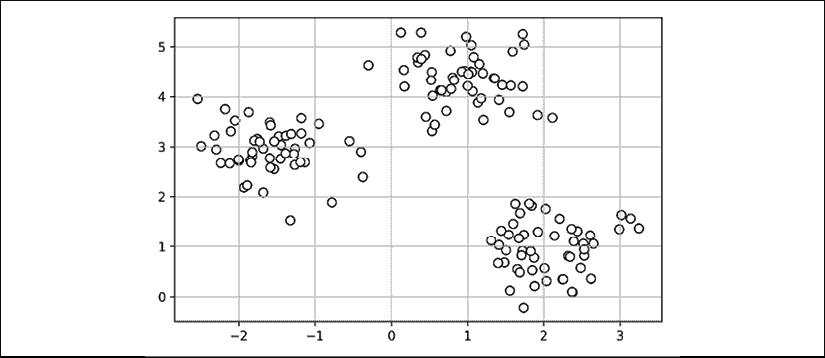

在聚类的实际应用中，我们没有关于这些示例的任何真实类别信息（与推理相对的经验性证据提供的信息）；如果我们有类标签，这项任务将属于监督学习的范畴。因此，我们的目标是根据特征相似性对示例进行分组，这可以通过 k-means 算法实现，概述如下四个步骤：

1.  随机从示例中挑选 *k* 个质心作为初始聚类中心。

1.  将每个示例分配给最近的质心，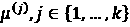。

1.  将质心移动到分配给它的示例的中心。

1.  重复步骤 2 和 3，直到聚类分配不再变化，或者达到用户定义的容忍度或最大迭代次数。

现在，下一个问题是，*我们如何衡量对象之间的相似性*？我们可以将相似性定义为距离的反面，而用于聚类具有连续特征的示例的常用距离是两个点 *x* 和 *y* 在 *m* 维空间中的 **平方欧几里得距离**：

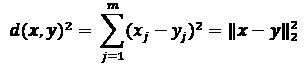

请注意，在前面的方程中，索引 *j* 指的是示例输入 *x* 和 *y* 的 *j* 维度（特征列）。在本节的其余部分，我们将使用上标 *i* 和 *j* 分别表示示例（数据记录）和聚类索引的索引。

基于这个欧几里得距离度量，我们可以将 k-means 算法描述为一个简单的优化问题，即一个迭代方法，用于最小化聚类内部的 **平方误差和**（**SSE**），有时也叫做 **聚类惯性**：

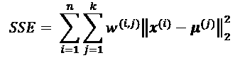

在这里，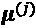 是聚类 *j* 的代表点（质心）。如果示例 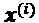 在聚类 *j* 中，则为 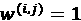，否则为 0。

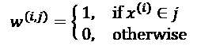

现在你已经了解了简单的 k-means 算法是如何工作的，让我们通过使用 scikit-learn 的 `cluster` 模块中的 `KMeans` 类，将它应用到我们的示例数据集上：

```py
>>> from sklearn.cluster import KMeans
>>> km = KMeans(n_clusters=3,
...             init='random',
...             n_init=10,
...             max_iter=300,
...             tol=1e-04,
...             random_state=0)
>>> y_km = km.fit_predict(X) 
```

使用前面的代码，我们将期望的聚类数量设置为 `3`；*预先*指定聚类数量是 k-means 的一个限制。我们设置 `n_init=10`，使得 k-means 聚类算法独立运行 10 次，并使用不同的随机质心来选择 SSE 最小的最终模型。通过 `max_iter` 参数，我们指定每次运行的最大迭代次数（这里为 `300`）。需要注意的是，如果在达到最大迭代次数之前就已经收敛，scikit-learn 中的 k-means 实现会提前停止。然而，也有可能 k-means 在某次运行中未能收敛，如果我们选择较大的 `max_iter` 值，这可能会带来计算上的问题。解决收敛问题的一种方法是选择更大的 `tol` 值，这是一个控制聚类内 SSE 变化的容差参数，以宣告收敛。在前面的代码中，我们选择了容差 `1e-04` (=0.0001)。

k-means 的一个问题是一个或多个聚类可能为空。需要注意的是，这个问题在 k-medoids 或模糊 C-means 中并不存在，这是一种我们将在本节稍后讨论的算法。

然而，这个问题在当前的 scikit-learn 中的 k-means 实现中得到了考虑。如果一个聚类为空，算法将搜索距离该空聚类质心最远的样本点，然后将质心重新分配到这个最远点。

**特征缩放**

当我们使用欧几里得距离度量将 k-means 应用于真实世界的数据时，我们希望确保特征在相同的尺度上进行衡量，并在必要时应用 z-score 标准化或最小-最大缩放。

在预测了聚类标签 `y_km` 并讨论了 k-means 算法的一些挑战之后，接下来我们将可视化 k-means 在数据集中识别出的聚类以及聚类质心。这些信息保存在拟合后的 `KMeans` 对象的 `cluster_centers_` 属性中：

```py
>>> plt.scatter(X[y_km == 0, 0],
...             X[y_km == 0, 1],
...             s=50, c='lightgreen',
...             marker='s', edgecolor='black',
...             label='Cluster 1')
>>> plt.scatter(X[y_km == 1, 0],
...             X[y_km == 1, 1],
...             s=50, c='orange',
...             marker='o', edgecolor='black',
...             label='Cluster 2')
>>> plt.scatter(X[y_km == 2, 0],
...             X[y_km == 2, 1],
...             s=50, c='lightblue',
...             marker='v', edgecolor='black',
...             label='Cluster 3')
>>> plt.scatter(km.cluster_centers_[:, 0],
...             km.cluster_centers_[:, 1],
...             s=250, marker='*',
...             c='red', edgecolor='black',
...             label='Centroids')
>>> plt.legend(scatterpoints=1)
>>> plt.grid()
>>> plt.tight_layout()
>>> plt.show() 
```

在下面的散点图中，你可以看到 k-means 将三个质心放置在每个球体的中心，考虑到这个数据集，这看起来是一个合理的分组：

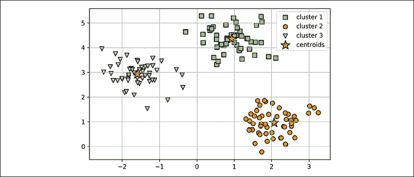

尽管 k-means 在这个玩具数据集上表现良好，但我们将突出 k-means 的另一个缺点：我们必须*预先*指定聚类的数量 *k*。在实际应用中，选择聚类的数量可能并不总是那么明显，尤其是当我们处理的是无法可视化的高维数据集时。k-means 的其他特点是聚类不重叠且没有层次结构，我们还假设每个聚类中至少有一个样本。在本章后面，我们将遇到不同类型的聚类算法，包括层次聚类和基于密度的聚类。两种算法都不要求我们预先指定聚类数量，也不假设数据集具有球形结构。

在下一小节中，我们将介绍经典k-means算法的一个流行变体——**k-means++**。虽然它没有解决前面一段中讨论的k-means的假设和缺点，但通过更加智能地初始化聚类中心，它可以显著改善聚类结果。

## 使用k-means++来智能地放置初始聚类质心。

到目前为止，我们讨论了经典的k-means算法，该算法使用随机种子来放置初始质心，如果初始质心选择不当，可能会导致不良的聚类结果或收敛缓慢。解决这一问题的一种方法是多次运行k-means算法，并选择SSE表现最好的模型。

另一种策略是通过k-means++算法将初始质心放置得彼此远离，这比经典的k-means算法能得到更好且更一致的结果（*k-means++: The Advantages of Careful Seeding*，*D. Arthur*和*S. Vassilvitskii*在*Proceedings of the eighteenth annual ACM-SIAM symposium on Discrete algorithms*，第1027-1035页，*Society for Industrial and Applied Mathematics*，*2007*）。

k-means++的初始化可以总结如下：

1.  初始化一个空集**M**，用于存储正在选择的*k*个质心。

1.  随机选择第一个质心，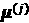，从输入示例中选取并分配给**M**。

1.  对于每个不在**M**中的示例，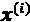，找到与**M**中任何质心的最小平方距离，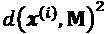。

1.  为了随机选择下一个质心，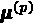，使用一个等于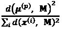的加权概率分布。

1.  重复步骤2和3，直到选择出*k*个质心。

1.  继续使用经典的k-means算法。

要在scikit-learn的`KMeans`对象中使用k-means++，只需要将`init`参数设置为`'k-means++'`。事实上，`'k-means++'`是`init`参数的默认值，这在实践中是强烈推荐的。我们在之前的示例中没有使用它的唯一原因是为了避免一次性引入太多概念。接下来的这一部分关于k-means的内容将使用k-means++，但你可以尝试更多两种不同的初始化方法（经典k-means通过`init='random'`与k-means++通过`init='k-means++'`）来放置初始聚类质心。

## 硬聚类与软聚类。

**硬聚类**描述了一类算法，其中数据集中的每个示例都被分配到一个簇中，就像我们在本章之前讨论的k-means和k-means++算法一样。相反，**软聚类**（有时也称为**模糊聚类**）的算法会将一个示例分配给一个或多个簇。**模糊C均值**（**FCM**）算法（也叫做**软k-means**或**模糊k-means**）是软聚类的一个流行例子。最初的想法可以追溯到1970年代，当时Joseph C. Dunn首次提出了一个早期版本的模糊聚类，以改进k-means（*A Fuzzy Relative of the ISODATA Process and Its Use in Detecting Compact Well-Separated Clusters*，*J. C. Dunn*，*1973*）。近十年后，James C. Bedzek发表了关于模糊聚类算法改进的工作，这一算法现在被称为FCM算法（*Pattern Recognition with Fuzzy Objective Function Algorithms*，*J. C. Bezdek*，*Springer Science+Business Media*，*2013*）。

FCM过程与k-means非常相似。然而，我们将硬聚类分配替换为每个点属于每个簇的概率。在k-means中，我们可以用一个稀疏的二进制向量来表示示例*x*的簇成员关系：

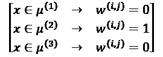

在这里，值为1的索引位置表示示例被分配到的簇质心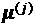（假设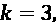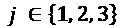）。相反，FCM中的成员关系向量可以表示如下：

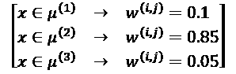

在这里，每个值的范围是[0, 1]，表示该点属于相应簇质心的概率。给定示例的所有成员关系之和等于1。与k-means算法一样，我们可以用四个关键步骤总结FCM算法：

1.  指定*k*个质心的数量，并随机分配每个点的簇成员关系。

1.  计算簇质心，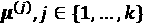。

1.  更新每个点的簇成员关系。

1.  重复步骤2和步骤3，直到成员系数不再变化，或者达到用户定义的容差或最大迭代次数。

FCM的目标函数——我们简写为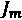——看起来非常类似于我们在k-means中最小化的簇内SSE：

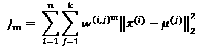

然而，请注意，成员指示符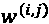不像k-means中的二值值（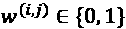），而是一个实值，表示簇成员的概率（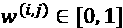）。你可能还注意到，我们在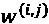中添加了一个额外的指数；这个指数*m*是一个大于或等于1的任意数字（通常*m*=2），它是所谓的**模糊度系数**（或简称**模糊因子**），控制着*模糊性*的程度。

*m*值越大，簇成员资格的值，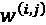，就越小，这会导致更模糊的簇。簇成员概率本身的计算公式如下：

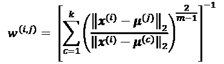

例如，如果我们选择了三个簇中心，如前面的k-means例子中所示，我们可以按照如下方式计算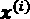属于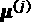簇的成员资格：

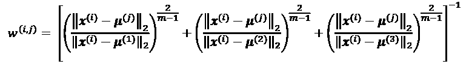

一个簇的中心，，是通过计算所有样本的加权平均得到的，权重取决于每个样本属于该簇的程度（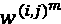）：

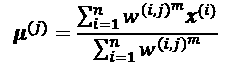

仅仅从计算簇成员资格的方程式来看，我们可以说，FCM中的每次迭代比k-means中的迭代更加昂贵。另一方面，FCM通常需要更少的迭代次数才能达到收敛。不幸的是，FCM算法目前并未在scikit-learn中实现。然而，实际应用中发现，k-means和FCM产生的聚类结果非常相似，正如一项研究所描述的那样（*Comparative Analysis of k-means and Fuzzy C-Means Algorithms*，*S. Ghosh*和*S. K. Dubey*，*IJACSA*，4: 35–38，*2013*）。

## 使用肘部法则找到最佳簇数

无监督学习中的主要挑战之一是我们并不知道确切的答案。我们的数据集中没有可以用来评估监督学习模型表现的真实标签，这使得我们无法应用在*第六章*中介绍的技术，*学习最佳实践：模型评估和超参数调优*，来评估监督模型的性能。因此，为了量化聚类质量，我们需要使用内在度量——比如簇内SSE（失真度）——来比较不同k-means聚类的表现。

方便的是，在使用scikit-learn时，我们不需要显式计算簇内SSE，因为在拟合`KMeans`模型之后，它已经可以通过`inertia_`属性直接访问：

```py
>>> print('Distortion: %.2f' % km.inertia_)
Distortion: 72.48 
```

基于簇内SSE，我们可以使用图形化工具，也就是所谓的**肘部法则**，来估算给定任务的最佳簇数*k*。我们可以说，如果*k*增加，失真度会减小。这是因为样本会更接近它们被分配的质心。肘部法则的核心思想是找出*k*的值，在这个值上，失真度开始最急剧增加，如果我们绘制不同*k*值的失真度曲线，效果会更加清晰：

```py
>>> distortions = []
>>> for i in range(1, 11):
...     km = KMeans(n_clusters=i,
...                 init='k-means++',
...                 n_init=10,
...                 max_iter=300,
...                 random_state=0)
...     km.fit(X)
...     distortions.append(km.inertia_)
>>> plt.plot(range(1,11), distortions, marker='o')
>>> plt.xlabel('Number of clusters')
>>> plt.ylabel('Distortion')
>>> plt.tight_layout()
>>> plt.show() 
```

如下图所示，*肘部*位于*k* = 3，因此这是证明*k* = 3确实是这个数据集的一个好选择的证据：

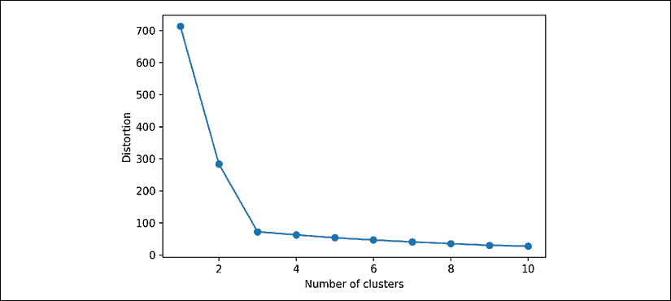

## 通过轮廓图量化聚类质量

另一种评估聚类质量的内在指标是**轮廓分析**，它也可以应用于k-means以外的聚类算法，我们将在本章稍后讨论。轮廓分析可以作为一种图形工具，绘制出聚类内样本紧密程度的度量。为了计算我们数据集中单个样本的**轮廓系数**，我们可以执行以下三个步骤：

1.  计算**聚类内聚度**，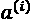，即样本与同一聚类内所有其他点之间的平均距离，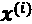。

1.  计算**聚类分离度**，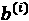，即通过下一个最接近的聚类与样本之间的平均距离，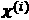，以及该聚类中的所有样本之间的距离。

1.  计算轮廓系数，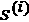，即通过聚类内聚度和分离度之差除以这两者中的较大者，如下所示：

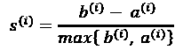

轮廓系数的范围为–1到1。根据前述公式，我们可以看到，当聚类分离度和内聚度相等时，轮廓系数为0（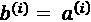）。此外，当聚类分离度较大时，轮廓系数接近理想值1（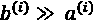），因为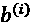量化了样本与其他聚类的差异，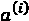则告诉我们该样本与自己聚类内其他样本的相似度。

轮廓系数可以通过scikit-learn的`metric`模块中的`silhouette_samples`获得，并且可以选择导入`silhouette_scores`函数以方便使用。`silhouette_scores`函数计算所有样本的平均轮廓系数，这等价于`numpy.mean(silhouette_samples(...))`。通过执行以下代码，我们将创建一个k-means聚类的轮廓系数图，*k* = 3：

```py
>>> km = KMeans(n_clusters=3,
...             init='k-means++',
...             n_init=10,
...             max_iter=300,
...             tol=1e-04,
...             random_state=0)
>>> y_km = km.fit_predict(X)
>>> import numpy as np
>>> from matplotlib import cm
>>> from sklearn.metrics import silhouette_samples
>>> cluster_labels = np.unique(y_km)
>>> n_clusters = cluster_labels.shape[0]
>>> silhouette_vals = silhouette_samples(X,
...                                      y_km,
...                                      metric='euclidean')
>>> y_ax_lower, y_ax_upper = 0, 0
>>> yticks = []
>>> for i, c in enumerate(cluster_labels):
...     c_silhouette_vals = silhouette_vals[y_km == c]
...     c_silhouette_vals.sort()
...     y_ax_upper += len(c_silhouette_vals)
...     color = cm.jet(float(i) / n_clusters)
...     plt.barh(range(y_ax_lower, y_ax_upper),
...              c_silhouette_vals,
...              height=1.0,
...              edgecolor='none',
...              color=color)
...     yticks.append((y_ax_lower + y_ax_upper) / 2.)
...     y_ax_lower += len(c_silhouette_vals)
>>> silhouette_avg = np.mean(silhouette_vals)
>>> plt.axvline(silhouette_avg,
...             color="red",
...             linestyle="--")
>>> plt.yticks(yticks, cluster_labels + 1)
>>> plt.ylabel('Cluster')
>>> plt.xlabel('Silhouette coefficient')
>>> plt.tight_layout()
>>> plt.show() 
```

通过对轮廓图的可视化检查，我们可以迅速审查不同聚类的大小，并识别包含*异常值*的聚类：

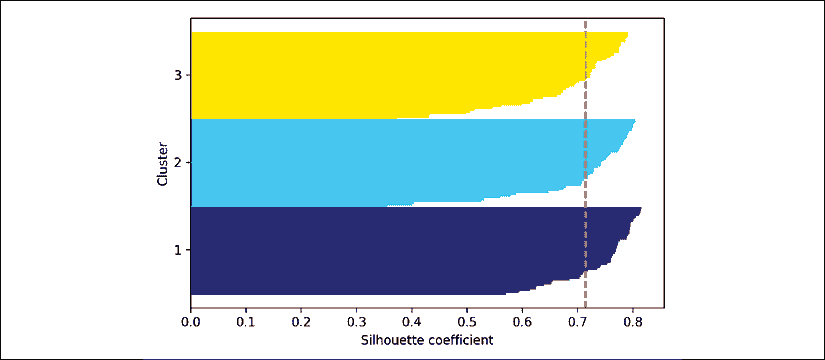

然而，正如你在之前的轮廓图中看到的，轮廓系数甚至没有接近**0**，这在本例中是*良好*聚类的一个指示符。此外，为了总结我们的聚类效果，我们将平均轮廓系数添加到图中（虚线）。

要查看相对*差*的聚类的轮廓图是什么样子，我们将k-means算法的初始质心数设置为仅有两个：

```py
>>> km = KMeans(n_clusters=2,
...             init='k-means++',
...             n_init=10,
...             max_iter=300,
...             tol=1e-04,
...             random_state=0)
>>> y_km = km.fit_predict(X)
>>> plt.scatter(X[y_km == 0, 0],
...             X[y_km == 0, 1],
...             s=50, c='lightgreen',
...             edgecolor='black',
...             marker='s',
...             label='Cluster 1')
>>> plt.scatter(X[y_km == 1, 0],
...             X[y_km == 1, 1],
...             s=50,
...             c='orange',
...             edgecolor='black',
...             marker='o',
...             label='Cluster 2')
>>> plt.scatter(km.cluster_centers_[:, 0],
...             km.cluster_centers_[:, 1],
...             s=250,
...             marker='*',
...             c='red',
...             label='Centroids')
>>> plt.legend()
>>> plt.grid()
>>> plt.tight_layout()
>>> plt.show() 
```

如你在结果图中看到的，某个质心位于输入数据的三个球形聚类之间。

尽管聚类看起来并不完全糟糕，但它仍然是次优的：

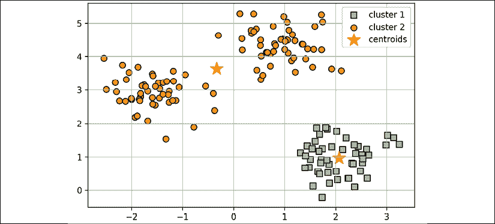

请记住，在实际问题中，我们通常没有将数据集可视化为二维散点图的奢侈，因为我们通常处理的是高维数据。所以接下来，我们将创建轮廓图来评估结果：

```py
>>> cluster_labels = np.unique(y_km)
>>> n_clusters = cluster_labels.shape[0]
>>> silhouette_vals = silhouette_samples(X,
...                                      y_km,
...                                      metric='euclidean')
>>> y_ax_lower, y_ax_upper = 0, 0
>>> yticks = []
>>> for i, c in enumerate(cluster_labels):
...     c_silhouette_vals = silhouette_vals[y_km == c]
...     c_silhouette_vals.sort()
...     y_ax_upper += len(c_silhouette_vals)
...     color = cm.jet(float(i) / n_clusters)
...     plt.barh(range(y_ax_lower, y_ax_upper),
...              c_silhouette_vals,
...              height=1.0,
...              edgecolor='none',
...              color=color)
...     yticks.append((y_ax_lower + y_ax_upper) / 2.)
...     y_ax_lower += len(c_silhouette_vals)
>>> silhouette_avg = np.mean(silhouette_vals)
>>> plt.axvline(silhouette_avg, color="red", linestyle="--")
>>> plt.yticks(yticks, cluster_labels + 1)
>>> plt.ylabel('Cluster')
>>> plt.xlabel('Silhouette coefficient')
>>> plt.tight_layout()
>>> plt.show() 
```

如结果图所示，轮廓现在有明显不同的长度和宽度，这是相对*差*或者至少是*不理想*的聚类的证据：

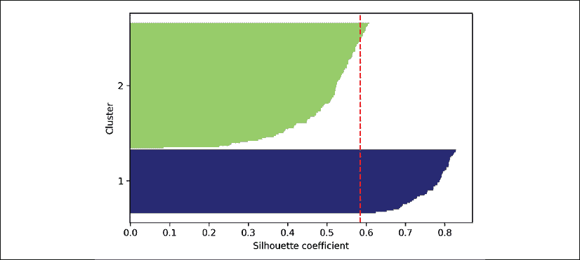

# 将簇组织为层次树

在本节中，我们将关注一种基于原型的聚类的替代方法：**层次聚类**。层次聚类算法的一个优点是，它允许我们绘制**树状图**（二叉层次聚类的可视化），通过创建有意义的分类法来帮助解释结果。另一个优点是这种层次方法不需要我们提前指定簇的数量。

层次聚类的两种主要方法是**聚合式**层次聚类和**分裂式**层次聚类。在分裂式层次聚类中，我们从包含完整数据集的一个簇开始，然后迭代地将该簇拆分为更小的簇，直到每个簇只包含一个样本。在本节中，我们将重点讨论聚合式聚类，它采取相反的方法。我们从每个样本作为一个单独的簇开始，逐步合并最接近的簇，直到只剩下一个簇。

## 自下而上的簇合并

两种标准的聚合式层次聚类算法是**单一连接法**和**完全连接法**。使用单一连接法时，我们计算每对簇中最相似成员之间的距离，并合并最相似成员之间距离最小的两个簇。完全连接法类似于单一连接法，但不同之处在于，我们比较每对簇中最不相似的成员进行合并。这在下面的图示中有所展示：

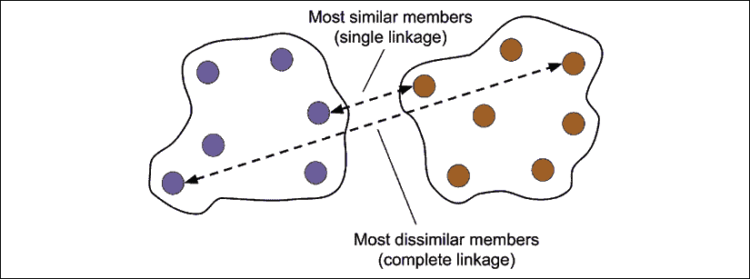

**替代类型的连接法**

其他常用的聚合层次聚类算法包括**平均连接法**和**Ward连接法**。在平均连接法中，我们根据两个簇中所有组成员之间的最小平均距离来合并簇对。在Ward连接法中，我们合并两个簇，这两个簇的合并会导致总的簇内平方误差（SSE）最小的增加。

在本节中，我们将重点讨论使用完全连接法的聚合式聚类。层次完全连接聚类是一个迭代过程，可以通过以下步骤总结：

1.  计算所有样本的距离矩阵。

1.  将每个数据点表示为一个单独的簇。

1.  基于最不相似（最远）成员之间的距离合并两个最接近的簇。

1.  更新相似度矩阵。

1.  重复步骤 2-4，直到只剩下一个簇。

接下来，我们将讨论如何计算距离矩阵（步骤 1）。但首先，让我们生成一个随机数据样本来进行操作。行表示不同的观察值（ID 0-4），列表示这些示例的不同特征（`X`，`Y`，`Z`）：

```py
>>> import pandas as pd
>>> import numpy as np
>>> np.random.seed(123)
>>> variables = ['X', 'Y', 'Z']
>>> labels = ['ID_0', 'ID_1', 'ID_2', 'ID_3', 'ID_4']
>>> X = np.random.random_sample([5, 3])*10
>>> df = pd.DataFrame(X, columns=variables, index=labels)
>>> df 
```

执行前述代码后，我们现在应该看到以下包含随机生成示例的数据框：

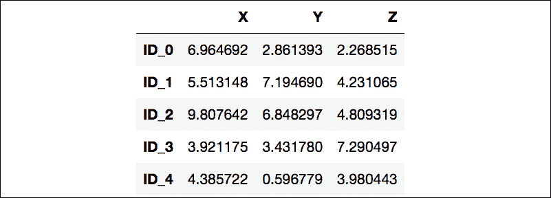

## 对距离矩阵进行层次聚类

为了计算作为层次聚类算法输入的距离矩阵，我们将使用 SciPy 的 `spatial.distance` 子模块中的 `pdist` 函数：

```py
>>> from scipy.spatial.distance import pdist, squareform
>>> row_dist = pd.DataFrame(squareform(
...                         pdist(df, metric='euclidean')),
...                         columns=labels, index=labels)
>>> row_dist 
```

使用前述代码，我们基于特征 `X`，`Y` 和 `Z` 计算了数据集中每一对输入示例之间的欧几里得距离。

我们将由 `pdist` 返回的压缩距离矩阵作为输入传递给 `squareform` 函数，以创建一个对称的成对距离矩阵，如下所示：

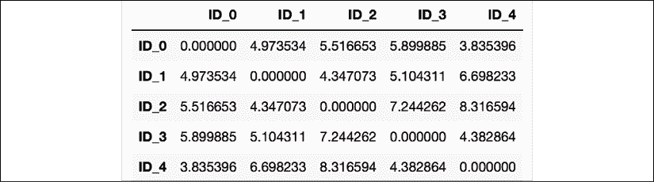

接下来，我们将使用 SciPy 的 `cluster.hierarchy` 子模块中的 `linkage` 函数对我们的簇应用完全连接聚合，该函数返回所谓的 **连接矩阵**。

然而，在调用 `linkage` 函数之前，让我们仔细查看一下该函数的文档：

```py
>>> from scipy.cluster.hierarchy import linkage
>>> help(linkage)
[...]
Parameters:
  y : ndarray
    A condensed or redundant distance matrix. A condensed
    distance matrix is a flat array containing the upper
    triangular of the distance matrix. This is the form
    that pdist returns. Alternatively, a collection of m
    observation vectors in n dimensions may be passed as
    an m by n array.

  method : str, optional
    The linkage algorithm to use. See the Linkage Methods
    section below for full descriptions.

  metric : str, optional
    The distance metric to use. See the distance.pdist
    function for a list of valid distance metrics.

  Returns:
  Z : ndarray
    The hierarchical clustering encoded as a linkage matrix.
[...] 
```

根据函数说明，我们可以使用 `pdist` 函数返回的压缩距离矩阵（上三角）作为输入属性。或者，我们也可以提供初始数据数组，并在 `linkage` 中使用 `'euclidean'` 度量作为函数参数。然而，我们不应使用之前定义的 `squareform` 距离矩阵，因为它会产生与预期不同的距离值。总而言之，以下是三种可能的情况：

+   **错误方法**：使用以下代码片段中显示的 `squareform` 距离矩阵会导致错误的结果：

    ```py
    >>> row_clusters = linkage(row_dist,
    ...                        method='complete',
    ...                        metric='euclidean') 
    ```

+   **正确方法**：使用以下代码示例中显示的压缩距离矩阵可以得到正确的连接矩阵：

    ```py
    >>> row_clusters = linkage(pdist(df, metric='euclidean'),
    ...                        method='complete') 
    ```

+   **正确方法**：使用以下代码片段中显示的完整输入示例矩阵（即所谓的设计矩阵）也能得到与前述方法类似的正确连接矩阵：

    ```py
    >>> row_clusters = linkage(df.values,
    ...                        method='complete',
    ...                        metric='euclidean') 
    ```

为了更仔细地查看聚类结果，我们可以将这些结果转换为 pandas `DataFrame`（在 Jupyter Notebook 中查看效果最佳），如下所示：

```py
>>> pd.DataFrame(row_clusters,
...              columns=['row label 1',
...                       'row label 2',
...                       'distance',
...                       'no. of items in clust.'],
...              index=['cluster %d' % (i + 1) for i in
...                     range(row_clusters.shape[0])]) 
```

如下图所示，连接矩阵由若干行组成，每行表示一次合并。第一列和第二列表示每个簇中最不相似的成员，第三列表示这两个成员之间的距离。

最后一列返回每个簇中成员的数量：


现在我们已经计算了连接矩阵，可以以树状图的形式可视化结果：

```py
>>> from scipy.cluster.hierarchy import dendrogram
>>> # make dendrogram black (part 1/2)
>>> # from scipy.cluster.hierarchy import set_link_color_palette
>>> # set_link_color_palette(['black'])
>>> row_dendr = dendrogram(row_clusters,
...                        labels=labels,
...                        # make dendrogram black (part 2/2)
...                        # color_threshold=np.inf
...                        )
>>> plt.tight_layout()
>>> plt.ylabel('Euclidean distance')
>>> plt.show() 
```

如果你正在执行前面的代码或阅读本书的电子书版本，你会注意到生成的树状图中的分支显示为不同的颜色。这种配色方案来自Matplotlib的颜色列表，用于在树状图中的距离阈值之间循环。例如，要以黑色显示树状图，你可以取消注释前面代码中插入的相关部分：


这样的树状图总结了在凝聚层次聚类过程中形成的不同聚类；例如，你可以看到，`ID_0`和`ID_4`，接着是`ID_1`和`ID_2`，是基于欧几里得距离度量最相似的样本。

## 将树状图附加到热力图

在实际应用中，层次聚类树状图通常与**热力图**结合使用，允许我们通过颜色编码表示包含训练示例的数据数组或矩阵中的各个值。在这一部分，我们将讨论如何将树状图附加到热力图上，并相应地对热力图中的行进行排序。

然而，将树状图附加到热力图上可能有点棘手，因此让我们一步步来执行这个过程：

1.  我们创建一个新的`figure`对象，并通过`add_axes`属性定义树状图的* x *轴位置、* y *轴位置、宽度和高度。此外，我们将树状图逆时针旋转90度。代码如下：

    ```py
    >>> fig = plt.figure(figsize=(8, 8), facecolor='white')
    >>> axd = fig.add_axes([0.09, 0.1, 0.2, 0.6])
    >>> row_dendr = dendrogram(row_clusters, 
    ...                        orientation='left')
    >>> # note: for matplotlib < v1.5.1, please use
    >>> # orientation='right' 
    ```

1.  接下来，我们根据可以从`dendrogram`对象中访问的聚类标签重新排序我们初始的`DataFrame`，该对象本质上是一个Python字典，可以通过`leaves`键访问。代码如下：

    ```py
    >>> df_rowclust = df.iloc[row_dendr['leaves'][::-1]] 
    ```

1.  现在，我们从重新排序的`DataFrame`构建热力图，并将其放置在树状图旁边：

    ```py
    >>> axm = fig.add_axes([0.23, 0.1, 0.6, 0.6])
    >>> cax = axm.matshow(df_rowclust,
    ...                   interpolation='nearest',
    ...                   cmap='hot_r') 
    ```

1.  最后，我们通过去除坐标轴刻度并隐藏坐标轴脊线来修改树状图的美学效果。我们还添加了一个颜色条，并将特征和数据记录名称分别分配给* x *和* y *轴刻度标签：

    ```py
    >>> axd.set_xticks([])
    >>> axd.set_yticks([])
    >>> for i in axd.spines.values():
    ...     i.set_visible(False)
    >>> fig.colorbar(cax)
    >>> axm.set_xticklabels([''] + list(df_rowclust.columns))
    >>> axm.set_yticklabels([''] + list(df_rowclust.index))
    >>> plt.show() 
    ```

按照前面的步骤操作后，热力图应该会显示附带树状图的效果：


如你所见，热力图中行的顺序反映了树状图中示例的聚类。此外，热力图中每个示例和特征的颜色编码值为我们提供了数据集的一个很好的概述。

## 通过scikit-learn应用凝聚层次聚类

在上一小节中，你已经了解了如何使用 SciPy 执行凝聚层次聚类。然而，scikit-learn 中也有一个`AgglomerativeClustering`实现，它允许我们选择希望返回的簇的数量。如果我们想修剪层次聚类树，这非常有用。通过将`n_cluster`参数设置为`3`，我们将像之前一样使用基于欧几里得距离度量的完整连接方法，将输入示例分为三个组：

```py
>>> from sklearn.cluster import AgglomerativeClustering
>>> ac = AgglomerativeClustering(n_clusters=3,
...                              affinity='euclidean',
...                              linkage='complete')
>>> labels = ac.fit_predict(X)
>>> print('Cluster labels: %s' % labels)
Cluster labels: [1 0 0 2 1] 
```

通过查看预测的聚类标签，我们可以看到，第一个和第五个示例（`ID_0`和`ID_4`）被分配到了一个簇（标签为`1`），而示例`ID_1`和`ID_2`被分配到了第二个簇（标签为`0`）。示例`ID_3`被放入了它自己的簇（标签为`2`）。总体来看，结果与我们在树状图中观察到的结果一致。然而我们应该注意到，`ID_3`与`ID_4`和`ID_0`的相似度要高于`ID_1`和`ID_2`，正如之前树状图中所示；这一点在 scikit-learn 的聚类结果中并不明显。接下来，我们将使用`n_cluster=2`重新运行`AgglomerativeClustering`，如以下代码片段所示：

```py
>>> ac = AgglomerativeClustering(n_clusters=2,
...                              affinity='euclidean',
...                              linkage='complete')
>>> labels = ac.fit_predict(X)
>>> print('Cluster labels: %s' % labels)
Cluster labels: [0 1 1 0 0] 
```

如你所见，在这个*修剪后的*聚类层次结构中，标签`ID_3`被分配到了与`ID_0`和`ID_4`相同的簇中，正如预期的那样。

# 通过 DBSCAN 定位高密度区域

尽管在本章中我们无法覆盖大量不同的聚类算法，但我们至少再介绍一种聚类方法：**基于密度的空间聚类应用及噪声**（**DBSCAN**），它不像 k-means 那样对球形簇做出假设，也不像层次聚类那样将数据集分割成需要手动切割的层次结构。正如其名字所示，基于密度的聚类是根据点的密集区域分配簇标签的。在 DBSCAN 中，密度的概念是通过在指定半径内的点数来定义的，。

根据 DBSCAN 算法，每个示例（数据点）都会根据以下标准分配一个特殊的标签：

+   如果一个点至少有指定数量（MinPts）的邻近点位于指定的半径范围内，则该点被视为**核心点**，。

+   **边界点**是指在ε半径内邻近点数目少于MinPts，但位于核心点的半径范围内的点。

+   所有既不是核心点也不是边界点的其他点都被视为**噪声点**。

在将点标记为核心点、边界点或噪声点后，DBSCAN 算法可以通过两个简单的步骤总结：

1.  为每个核心点或核心点的连接组形成一个独立的簇。（如果核心点之间的距离不超过，则它们是连接的。）

1.  将每个边界点分配给其对应核心点的簇。

为了更好地理解DBSCAN的结果是什么样的，在实现之前，让我们总结一下刚才关于核心点、边界点和噪声点的知识，如下图所示：


使用DBSCAN的主要优势之一是，它不假设聚类具有像k-means那样的球形结构。此外，DBSCAN与k-means和层次聚类的不同之处在于，它不一定会将每个点分配到一个聚类中，而是能够去除噪声点。

为了提供一个更具示范性的例子，让我们创建一个新的半月形状结构的数据集，来比较k-means聚类、层次聚类和DBSCAN。

```py
>>> from sklearn.datasets import make_moons
>>> X, y = make_moons(n_samples=200,
...                   noise=0.05,
...                   random_state=0)
>>> plt.scatter(X[:, 0], X[:, 1])
>>> plt.tight_layout()
>>> plt.show() 
```

正如你在结果图中看到的，有两个明显的半月形状的组，每个组包含100个示例（数据点）：


我们将首先使用k-means算法和完全链接聚类，看看这些之前讨论过的聚类算法是否能成功地将半月形状识别为独立的聚类。代码如下：

```py
>>> f, (ax1, ax2) = plt.subplots(1, 2, figsize=(8, 3))
>>> km = KMeans(n_clusters=2,
...             random_state=0)
>>> y_km = km.fit_predict(X)
>>> ax1.scatter(X[y_km == 0, 0],
...             X[y_km == 0, 1],
...             c='lightblue',
...             edgecolor='black',
...             marker='o',
...             s=40,
...             label='cluster 1')
>>> ax1.scatter(X[y_km == 1, 0],
...             X[y_km == 1, 1],
...             c='red',
...             edgecolor='black',
...             marker='s',
...             s=40,
...             label='cluster 2')
>>> ax1.set_title('K-means clustering')
>>> ac = AgglomerativeClustering(n_clusters=2,
...                              affinity='euclidean',
...                              linkage='complete')
>>> y_ac = ac.fit_predict(X)
>>> ax2.scatter(X[y_ac == 0, 0],
...             X[y_ac == 0, 1],
...             c='lightblue',
...             edgecolor='black',
...             marker='o',
...             s=40,
...             label='Cluster 1')
>>> ax2.scatter(X[y_ac == 1, 0],
...             X[y_ac == 1, 1],
...             c='red',
...             edgecolor='black',
...             marker='s',
...             s=40,
...             label='Cluster 2')
>>> ax2.set_title('Agglomerative clustering')
>>> plt.legend()
>>> plt.tight_layout()
>>> plt.show() 
```

根据可视化的聚类结果，我们可以看到k-means算法无法将两个聚类分开，而且层次聚类算法也在面对这些复杂形状时遇到了挑战：


最后，让我们在这个数据集上尝试DBSCAN算法，看看它是否能使用基于密度的方法找到两个半月形状的聚类：

```py
>>> from sklearn.cluster import DBSCAN
>>> db = DBSCAN(eps=0.2,
...             min_samples=5,
...             metric='euclidean')
>>> y_db = db.fit_predict(X)
>>> plt.scatter(X[y_db == 0, 0],
...             X[y_db == 0, 1],
...             c='lightblue',
...             edgecolor='black',
...             marker='o',
...             s=40,
...             label='Cluster 1')
>>> plt.scatter(X[y_db == 1, 0],
...             X[y_db == 1, 1],
...             c='red',
...             edgecolor='black',
...             marker='s',
...             s=40,
...             label='Cluster 2')
>>> plt.legend()
>>> plt.tight_layout()
>>> plt.show() 
```

DBSCAN算法可以成功地检测到半月形状，这突显了DBSCAN的一个优势——能够对任意形状的数据进行聚类：


然而，我们也应注意到DBSCAN的一些缺点。随着数据集中特征数量的增加——假设训练样本数量固定——**维度灾难**的负面影响会增加。如果我们使用欧几里得距离度量，这个问题尤为严重。然而，维度灾难问题并非DBSCAN特有：它也影响其他使用欧几里得距离度量的聚类算法，比如k-means和层次聚类算法。此外，DBSCAN有两个需要优化的超参数（MinPts和），只有优化它们，才能得到良好的聚类结果。如果数据集中的密度差异较大，找到MinPts和的良好组合可能会变得有问题。

**基于图的聚类**

到目前为止，我们已经了解了三种最基本的聚类算法类别：基于原型的k均值聚类、凝聚层次聚类和基于密度的DBSCAN聚类。然而，还有第四类更先进的聚类算法我们在本章中没有涉及：**基于图的聚类**。在基于图的聚类家族中，最为突出的算法可能是**谱聚类**算法。

尽管谱聚类有许多不同的实现方式，但它们的共同点是使用相似度或距离矩阵的特征向量来推导聚类关系。由于谱聚类超出了本书的讨论范围，你可以阅读Ulrike von Luxburg的精彩教程来了解更多相关内容（*谱聚类教程*，*U. Von Luxburg*，*统计与计算*，17(4): 395–416，*2007*）。这篇教程可以从arXiv免费下载，网址为[http://arxiv.org/pdf/0711.0189v1.pdf](http://arxiv.org/pdf/0711.0189v1.pdf)。

请注意，实际上并不总是显而易见，哪种聚类算法在给定数据集上表现最好，尤其是当数据维度较高，难以甚至不可能可视化时。此外，需要特别强调的是，成功的聚类不仅仅依赖于算法及其超参数；选择合适的距离度量方法和利用领域知识来指导实验设置可能更为重要。

在高维诅咒的背景下，通常的做法是在执行聚类之前应用降维技术。用于无监督数据集的降维技术包括主成分分析和径向基函数核主成分分析，这些内容我们在*第五章*《通过降维压缩数据》中已有涉及。此外，特别常见的做法是将数据集压缩到二维子空间，这使我们能够通过二维散点图可视化聚类和分配的标签，这对于评估结果尤为有帮助。

# 概述

在本章中，你学习了三种不同的聚类算法，这些算法可以帮助我们发现数据中的隐藏结构或信息。我们从基于原型的方法——k均值聚类开始，它根据指定数量的聚类中心将样本聚集成球形。由于聚类是无监督方法，我们没有真实标签来评估模型的表现。因此，我们使用了内在的性能度量方法，如肘部法则或轮廓分析，试图量化聚类的质量。

我们接着看了一种不同的聚类方法：凝聚层次聚类。层次聚类不需要预先指定聚类的数量，结果可以通过树状图（dendrogram）形式进行可视化，这有助于对结果的解释。本章我们讲解的最后一个聚类算法是DBSCAN，这是一种基于局部密度对点进行分组的算法，能够处理异常值并识别非球形的形状。

在这次关于无监督学习的探讨之后，现在是时候介绍一些最激动人心的监督学习算法：多层人工神经网络。随着其近期的复兴，神经网络再次成为机器学习研究中最热门的话题。得益于最近开发的深度学习算法，神经网络被认为是许多复杂任务（如图像分类和语音识别）的最前沿技术。在*第12章*，*从零开始实现多层人工神经网络*中，我们将构建自己的多层神经网络。在*第13章*，*使用TensorFlow并行化神经网络训练*中，我们将使用TensorFlow库，该库专门利用图形处理单元（GPU）非常高效地训练具有多层的神经网络模型。
