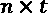
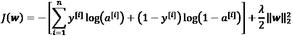
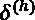

# 第十二章：从零开始实现多层人工神经网络

如你所知，深度学习正在受到媒体的广泛关注，毫无疑问，它是机器学习领域最热门的话题。深度学习可以理解为机器学习的一个子领域，专注于高效训练具有多层的人工神经网络（NN）。在本章中，你将学习人工神经网络的基本概念，为接下来的章节做好准备，后续章节将介绍基于Python的深度学习库以及特别适用于图像和文本分析的**深度神经网络**（**DNN**）架构。

本章将覆盖的主题如下：

+   获得多层神经网络的概念性理解

+   从头开始实现神经网络训练的基本反向传播算法

+   训练用于图像分类的基础多层神经网络

# 用人工神经网络建模复杂函数

在本书的开头，我们从*第2章* *训练简单的机器学习算法进行分类*开始了我们对机器学习算法的探索。人工神经元代表了我们将在本章讨论的多层人工神经网络的构建模块。

人工神经网络的基本概念建立在对人类大脑如何解决复杂问题任务的假设和模型之上。尽管人工神经网络近年来获得了很高的关注，但神经网络的早期研究可以追溯到1940年代，当时沃伦·麦卡洛克（Warren McCulloch）和沃尔特·皮茨（Walter Pitts）首次描述了神经元的工作原理。 (*神经活动中固有思想的逻辑演算*，*W. S. McCulloch* 和 *W. Pitts*， *数学生物物理学公报*，5(4):115–133，1943年)

然而，在**麦卡洛克-皮茨神经元**模型首次实现后的几十年里——20世纪50年代的罗森布拉特感知机——许多研究人员和机器学习从业者逐渐失去了对神经网络的兴趣，因为没有人找到一个有效的解决方案来训练具有多层的神经网络。最终，随着D.E. Rumelhart、G.E. Hinton和R.J. Williams在1986年重新发现并推广了反向传播算法，神经网络的兴趣再次被点燃，这使得神经网络的训练更加高效。我们将在本章稍后详细讨论这一点 (*通过反向传播错误学习表示*，*D. E. Rumelhart*，*G. E. Hinton*，*R. J. Williams*，*Nature*，323 (6088): 533–536，*1986*）。对于那些对**人工智能**（**AI**）、机器学习和神经网络的历史感兴趣的读者，我们也鼓励阅读维基百科上关于所谓的*AI寒冬*的文章，AI寒冬指的是研究界在一段时间内对神经网络的研究兴趣大幅下降的时期 ([https://en.wikipedia.org/wiki/AI_winter](https://en.wikipedia.org/wiki/AI_winter))。

然而，神经网络（NNs）今天比以往任何时候都更受欢迎，这得益于过去十年中的许多重大突破，最终催生了我们现在称之为深度学习算法和架构——由多层组成的神经网络。神经网络不仅在学术研究中是一个热门话题，而且在大科技公司中也同样火热，如Facebook、Microsoft、Amazon、Uber和Google，它们在人工神经网络和深度学习研究方面投入巨大。

截至今天，由深度学习算法驱动的复杂神经网络被认为是解决复杂问题（如图像和语音识别）的最先进解决方案。我们日常生活中许多基于深度学习的产品，如Google的图像搜索和Google翻译，都是这些技术的典型应用——一款智能手机应用，可以自动识别图像中的文字并实时翻译成20多种语言。

许多令人兴奋的深度神经网络（DNNs）应用已在主要科技公司和制药行业中开发，以下是一些示例（并非详尽无遗）：

+   Facebook的DeepFace用于图像标记（*DeepFace: Closing the Gap to Human-Level Performance in Face Verification*，*Y. Taigman*，*M. Yang*，*M. Ranzato*，和*L. Wolf*，*IEEE计算机视觉与模式识别会议(CVPR)*，第1701–1708页，*2014*）

+   百度的DeepSpeech，能够处理普通话语音查询（*DeepSpeech: Scaling up end-to-end speech recognition*，*A. Hannun*，*C. Case*，*J. Casper*，*B. Catanzaro*，*G. Diamos*，*E. Elsen*，*R. Prenger*，*S. Satheesh*，*S. Sengupta*，*A. Coates*，和*Andrew Y. Ng*，arXiv预印本arXiv:1412.5567，*2014*）

+   Google的新语言翻译服务（*Google's Neural Machine Translation System: Bridging the Gap between Human and Machine Translation*，arXiv预印本arXiv:1412.5567，*2016*）

+   药物发现和毒性预测的新技术（*Toxicity prediction using Deep Learning*，*T. Unterthiner*，*A. Mayr*，*G. Klambauer*，和*S. Hochreiter*，arXiv预印本arXiv:1503.01445，*2015*）

+   一款可以以类似专业训练皮肤科医生的准确性检测皮肤癌的移动应用（*Dermatologist-level classification of skin cancer with deep neural networks*，*A. Esteva*，*B.Kuprel*，*R. A. Novoa*，*J. Ko*，*S. M. Swetter*，*H. M. Blau*，和*S.Thrun*，发表于*自然*杂志，542卷，第7639期，*2017*，第115-118页）

+   从基因序列预测蛋白质三维结构（*De novo structure prediction with deep-learning based scoring*，*R. Evans*，*J. Jumper*，*J. Kirkpatrick*，*L. Sifre*，*T.F.G. Green*，*C. Qin*，*A. Zidek*，*A. Nelson*，*A. Bridgland*，*H. Penedones*，*S. Petersen*，*K. Simonyan*，*S. Crossan*，*D.T. Jones*，*D. Silver*，*K. Kavukcuoglu*，*D. Hassabis*，和*A.W. Senior*，发表于*第十三届蛋白质结构预测技术的关键评估*，2018年12月1-4日）

+   从纯粹的观察数据（如摄像头视频流）中学习如何在密集交通中驾驶（*基于模型的预测策略学习与不确定性正则化在密集交通中驾驶的应用，M. Henaff, A. Canziani, Y. LeCun, 2019*，发表于*国际学习表征会议论文集*，*ICLR*，2019）

## 单层神经网络回顾

本章讲述的是多层神经网络，它们是如何工作的，以及如何训练它们来解决复杂问题。然而，在我们深入探讨某一特定的多层神经网络架构之前，让我们简要回顾一下我们在*第2章*，*训练简单的机器学习算法进行分类*中介绍的一些单层神经网络的概念，即**自适应线性神经元**（**Adaline**）算法，如下图所示：


在*第2章*，*训练简单的机器学习算法进行分类*中，我们实现了 Adaline 算法来进行二分类，并使用梯度下降优化算法来学习模型的权重系数。在每一个训练周期（遍历训练数据集）中，我们使用以下更新规则更新权重向量 *w*：


换句话说，我们基于整个训练数据集计算梯度，并通过向梯度的反方向迈进一步来更新模型的权重！[](img/B13208_12_002.png)。为了找到模型的最优权重，我们优化了我们定义的目标函数，即**平方误差之和**（**SSE**）成本函数！[](img/B13208_12_003.png)。此外，我们还将梯度乘以一个因子——**学习率**！[](img/B13208_12_004.png)，该因子需要我们小心选择，以平衡学习的速度与避免超过成本函数的全局最小值之间的风险。

在梯度下降优化中，我们在每个训练周期（epoch）后同时更新所有权重，并且我们为权重向量 *w* 中的每个权重定义了偏导数，如下所示：


在这里，是特定样本的目标类标签 ，而是神经元的激活值，在 Adaline 的特例中，这是一个线性函数。

此外，我们还定义了激活函数，如下所示：


在这里，净输入 *z* 是连接输入层与输出层的权重的线性组合：


虽然我们使用激活值  来计算梯度更新，但我们实现了一个阈值函数，将连续值的输出压缩成二分类标签以进行预测：


**单层命名约定**

请注意，尽管Adaline由两层组成，一个输入层和一个输出层，但它被称为单层网络，因为输入层与输出层之间只有一个连接。

此外，我们还了解了一种加速模型学习的*技巧*，即所谓的**随机梯度下降**（**SGD**）优化方法。SGD通过一个单独的训练样本（在线学习）或一小部分训练样本（小批量学习）来逼近成本。稍后我们在本章中实现并训练多层感知机（MLP）时将会利用这个概念。除了比梯度下降更频繁地更新权重从而加速学习外，SGD的噪声特性在训练具有非线性激活函数且没有凸成本函数的多层神经网络（NN）时也被认为是有益的。这里，增加的噪声有助于逃离局部成本最小值，但我们将在本章后面详细讨论这个话题。

## 引入多层神经网络架构

在本节中，你将学习如何将多个单个神经元连接成一个多层前馈神经网络；这种特殊类型的*全连接*网络也被称为**MLP**。

下图展示了一个由三层组成的MLP的概念：


前面图示的MLP有一个输入层、一个隐藏层和一个输出层。隐藏层的单元与输入层全连接，输出层与隐藏层全连接。如果这样一个网络有多个隐藏层，我们也称之为**深度人工神经网络**。

**添加额外的隐藏层**

我们可以向MLP中添加任意数量的隐藏层，以创建更深的网络架构。在实际操作中，我们可以将神经网络中的层数和单元数视为额外的超参数，利用交叉验证技术优化这些超参数，以解决特定的任务，这一技术我们在*第六章*中讨论过，*模型评估与超参数调优的最佳实践*。

然而，随着网络中层数的增加，我们稍后通过反向传播计算的误差梯度将变得越来越小。这种梯度消失问题使得模型学习更加困难。因此，已经开发了特殊的算法来帮助训练这种深度神经网络（DNN）结构；这就是**深度学习**。

如前图所示，我们将层 *l* 中第 *i* 个激活单元表示为 。为了让数学公式和代码实现更加直观，我们不再使用数字索引来表示层，而是使用 *in* 上标表示输入层，*h* 上标表示隐藏层，*out* 上标表示输出层。例如， 表示输入层中的第 *i* 个值， 表示隐藏层中的第 *i* 个单元， 表示输出层中的第 *i* 个单元。这里，激活单元  和  是偏置单元，我们将其设为 1。输入层单元的激活值就是它的输入加上偏置单元：


**偏置单元的符号约定**

本章后面，我们将使用单独的向量来实现 MLP 中的偏置单元，这使得代码实现更高效、更易读。这个概念也被深度学习库 TensorFlow 使用，我们将在*第13章*《使用 TensorFlow 并行化神经网络训练》中详细讲解。然而，如果我们必须使用额外的偏置变量，接下来的数学方程会显得更加复杂或晦涩。请注意，通过将 1 附加到输入向量（如前所示）并使用权重变量作为偏置，实际上与使用单独的偏置向量的操作完全相同，只是采用了不同的约定。

层 *l* 中的每个单元都通过权重系数与层 *l* + 1 中的所有单元相连接。例如，层 *l* 中第 *k* 个单元与层 *l* + 1 中第 *j* 个单元之间的连接将写作 。回顾前面的图，我们将连接输入层和隐藏层的权重矩阵表示为 ，而将连接隐藏层和输出层的矩阵表示为 。

虽然输出层中的一个单元足以处理二分类任务，但我们在前面的图中看到了一种更通用的神经网络形式，它通过**一对多**（**OvA**）技术的泛化来实现多分类任务。为了更好地理解这种方法，回想一下我们在*第4章*《构建良好的训练数据集—数据预处理》中介绍的**一热编码**表示法。

例如，我们可以将熟悉的鸢尾花数据集中的三个类别标签（*0=Setosa, 1=Versicolor, 2=Virginica*）编码如下：


这种一热编码向量表示法使我们能够处理训练数据集中具有任意数量独特类别标签的分类任务。

如果你对神经网络（NN）表示法不熟悉，索引符号（下标和上标）一开始可能会有些混乱。最初看似过于复杂的东西，在后续章节中当我们对神经网络表示法进行向量化时，会更容易理解。正如前面所介绍的，我们通过矩阵  来总结连接输入层和隐藏层的权重，其中*d*是隐藏单元的数量，*m*是包括偏置单元在内的输入单元数量。由于掌握这一表示法对于理解本章后续概念非常重要，让我们通过一个简化的3-4-3 MLP示意图来总结我们刚刚学到的内容：


## 通过前向传播激活神经网络

在本节中，我们将描述**前向传播**的过程，以计算MLP模型的输出。为了理解它如何融入学习MLP模型的背景中，我们将MLP学习过程总结为三个简单步骤：

1.  从输入层开始，我们将训练数据的模式通过网络进行前向传播，以生成输出。

1.  基于网络的输出，我们计算希望最小化的误差，并使用稍后将描述的成本函数。

1.  我们反向传播误差，找到它对网络中每个权重的导数，并更新模型。

最后，在我们为多个时期重复这三步并学习MLP的权重后，我们使用前向传播来计算网络输出，并应用阈值函数以获得前一节中描述的独热表示的预测类别标签。

现在，让我们逐步通过前向传播来生成训练数据模式的输出。由于隐藏层中的每个单元都与输入层中的所有单元相连，我们首先计算隐藏层的激活单元 ，计算方式如下：


这里，是净输入，是激活函数，必须可微分，以便使用基于梯度的方法学习连接神经元的权重。为了能够解决图像分类等复杂问题，我们在MLP模型中需要非线性激活函数，例如我们在*第3章*《使用scikit-learn的机器学习分类器巡礼》中记得的sigmoid（逻辑）激活函数：


如你所记得，sigmoid函数是一个*S*形曲线，它将净输入*z*映射到一个在0到1范围内的逻辑分布，在*z* = 0时切割*y*轴，如下图所示：


MLP 是一种典型的前馈人工神经网络（NN）。术语 **前馈** 指的是每一层作为下一层的输入，没有循环，这与递归神经网络（RNN）不同——我们将在本章稍后讨论并在*第16章*《使用递归神经网络建模序列数据》中详细讨论。术语 *多层感知器* 可能有点令人困惑，因为在这个网络架构中，人工神经元通常是 sigmoid 单元，而不是感知器。我们可以把 MLP 中的神经元看作是逻辑回归单元，返回的值在 0 到 1 之间的连续范围内。

为了提高代码效率和可读性，我们将使用基础线性代数的概念以更紧凑的形式编写激活函数，这将使我们能够通过 NumPy 向量化实现代码，而不是编写多个嵌套且计算量大的 Python `for` 循环：


这里， 是我们样本的  维特征向量加上一个偏置单元 。

 是一个  维的权重矩阵，其中 *d* 是隐藏层中的单元数量。经过矩阵-向量乘法，我们得到  维的净输入向量 ，以计算激活值 （其中 ）。

此外，我们可以将此计算推广到训练数据集中的所有 *n* 个样本：


在这里， 现在是一个  矩阵，矩阵-矩阵乘法将得到一个  维的净输入矩阵 。最后，我们对净输入矩阵中的每个值应用激活函数 ，以获得下一层的激活矩阵（这里是输出层）：


类似地，我们可以为多个样本写出输出层的激活值的向量化形式：


在这里，我们将  矩阵 （*t* 是输出单元的数量）与  维的矩阵  相乘，以获得  维的矩阵 （该矩阵的列表示每个样本的输出）。

最后，我们应用 sigmoid 激活函数以获得网络的连续值输出：


# 手写数字分类

在上一节中，我们讲解了许多关于神经网络（NN）的理论，对于初学者来说，这可能会有些令人不知所措。在我们继续讨论用于学习MLP模型权重的算法——反向传播之前，先暂时休息一下理论部分，看看神经网络的实际应用。

**关于反向传播的额外资源**

神经网络理论可能相当复杂，因此建议参考两份额外资源，它们更加详细地讨论了我们在本章中讨论的一些概念：

+   *第6章*，*深度前馈网络*，*深度学习*，*I. Goodfellow*，*Y. Bengio*，*A. Courville*，MIT出版社，*2016*（手稿可在[http://www.deeplearningbook.org](http://www.deeplearningbook.org)免费下载）。

+   *模式识别与机器学习*，*C. M. Bishop* 等著，第1卷。*Springer New York*，*2006*。

+   来自威斯康星大学麦迪逊分校的深度学习课程讲义：

    1.  [https://sebastianraschka.com/pdf/lecture-notes/stat479ss19/L08_logistic_slides.pdf](https://sebastianraschka.com/pdf/lecture-notes/stat479ss19/L08_logistic_slides.pdf)

    1.  [https://sebastianraschka.com/pdf/lecture-notes/stat479ss19/L09_mlp_slides.pdf](https://sebastianraschka.com/pdf/lecture-notes/stat479ss19/L09_mlp_slides.pdf%20)

在这一节中，我们将实现并训练我们的第一个多层神经网络，用于从流行的**混合国家标准与技术研究所**（**MNIST**）数据集中分类手写数字。该数据集由Yann LeCun等人构建，是机器学习算法的一个流行基准数据集（*基于梯度的学习应用于文档识别*，*Y. LeCun*，*L. Bottou*，*Y. Bengio*，*P. Haffner*，*IEEE会议论文集*，86(11)：2278-2324，*1998年11月*）。

## 获取和准备MNIST数据集

MNIST数据集可以在[http://yann.lecun.com/exdb/mnist/](http://yann.lecun.com/exdb/mnist/)上公开获取，并包括以下四个部分：

+   **训练数据集图像**：`train-images-idx3-ubyte.gz`（9.9 MB，解压后为47 MB，共60,000个样本）

+   **训练数据集标签**：`train-labels-idx1-ubyte.gz`（29 KB，解压后为60 KB，共60,000个标签）

+   **测试数据集图像**：`t10k-images-idx3-ubyte.gz`（1.6 MB，解压后为7.8 MB，共10,000个样本）

+   **测试数据集标签**：`t10k-labels-idx1-ubyte.gz`（5 KB，解压后为10 KB，共10,000个标签）

MNIST数据集是由美国**国家标准与技术研究所**（**NIST**）的两个数据集构建的。训练数据集包含来自250个不同人的手写数字，其中50%来自高中生，50%来自人口普查局的工作人员。请注意，测试数据集包含来自不同人的手写数字，并且遵循相同的划分方式。

下载文件后，建议使用Unix/Linux中的`gzip`工具从终端解压这些文件，以提高效率。你可以在本地的MNIST下载目录中使用以下命令：

```py
gzip *ubyte.gz -d 
```

或者，如果你使用的是运行Microsoft Windows的机器，你也可以使用你喜欢的解压工具。

图像以字节格式存储，我们将它们读取到NumPy数组中，这些数组将用于训练和测试我们的MLP实现。为此，我们将定义以下辅助函数：

```py
import os
import struct
import numpy as np
def load_mnist(path, kind='train'):
    """Load MNIST data from 'path'"""
    labels_path = os.path.join(path,
                               '%s-labels-idx1-ubyte' % kind)
    images_path = os.path.join(path,
                               '%s-images-idx3-ubyte' % kind)

    with open(labels_path, 'rb') as lbpath:
        magic, n = struct.unpack('>II',
                                 lbpath.read(8))
        labels = np.fromfile(lbpath,
                             dtype=np.uint8)

    with open(images_path, 'rb') as imgpath:
        magic, num, rows, cols = struct.unpack(">IIII",
                                               imgpath.read(16))
        images = np.fromfile(imgpath,
                             dtype=np.uint8).reshape(
                             len(labels), 784)
        images = ((images / 255.) - .5) * 2

    return images, labels 
```

`load_mnist`函数返回两个数组，第一个是一个维的NumPy数组（`images`），其中*n*是示例的数量，*m*是特征的数量（这里是像素）。训练数据集包含60,000个训练数字，测试数据集包含10,000个示例。

MNIST数据集中的图像由像素组成，每个像素由灰度强度值表示。在这里，我们将像素展开为一维行向量，这些向量代表我们`images`数组中的行（每行或每幅图像有784个像素）。`load_mnist`函数返回的第二个数组（`labels`）包含相应的目标变量，即手写数字的类标签（整数0-9）。

我们读取图像的方式刚开始可能看起来有点奇怪：

```py
magic, n = struct.unpack('>II', lbpath.read(8))
labels = np.fromfile(lbpath, dtype=np.uint8) 
```

要理解这两行代码是如何工作的，让我们先看看来自MNIST网站的数据集描述：

```py
[offset] [type]           [value]           [description]
0000      32 bit integer  0x00000801(2049)  magic number (MSB first)
0004      32 bit integer  60000             number of items
0008      unsigned byte   ??                label
0009      unsigned byte   ??                label
........
xxxx      unsigned byte   ??                label 
```

使用前面两行代码，我们首先从文件缓冲区读取魔数，它是文件协议的描述，以及项目数量（`n`），然后我们使用`fromfile`方法将接下来的字节加载到NumPy数组中。我们传递给`struct.unpack`的`fmt`参数值`'>II'`可以分解成以下两个部分：

+   `>`: 这是大端字节序——它定义了字节序列的存储顺序；如果你不熟悉大端字节序和小端字节序的术语，你可以在维基百科上找到一篇关于*字节序*的优秀文章：[https://en.wikipedia.org/wiki/Endianness](https://en.wikipedia.org/wiki/Endianness)

+   `I`: 这是一个无符号整数

最后，我们还通过以下代码行将MNIST中的像素值规范化到范围–1到1（原始范围是0到255）：

```py
images = ((images / 255.) - .5) * 2 
```

这样做的原因是，基于梯度的优化在这些条件下更加稳定，正如*第2章*《为分类训练简单机器学习算法》中所讨论的那样。请注意，我们是按像素逐个对图像进行缩放的，这与我们在前几章中采取的特征缩放方法不同。

之前，我们从训练数据集中推导出缩放参数，并用这些参数对训练数据集和测试数据集中的每一列进行缩放。然而，在处理图像像素时，将像素值居中为零并重新缩放到[–1, 1]范围也是常见的做法，并且在实践中通常效果很好。

**批量归一化**

一个常用的技巧是通过输入缩放来改善基于梯度的优化收敛性，称为 *批量归一化*，这是一个高级主题，我们将在 *第17章*，*生成对抗网络用于合成新数据* 中详细讨论。此外，您还可以阅读由 *Sergey Ioffe* 和 *Christian Szegedy*（2015年，[https://arxiv.org/abs/1502.03167](https://arxiv.org/abs/1502.03167)）撰写的优秀研究文章 *Batch Normalization: Accelerating Deep Network Training by Reducing Internal Covariate Shift* 来了解更多批量归一化的内容。

```py
to the same directory in which this code was executed.)
```

```py
>>> X_train, y_train = load_mnist('', kind='train')
>>> print('Rows: %d, columns: %d'
...       % (X_train.shape[0], X_train.shape[1]))
Rows: 60000, columns: 784
>>> X_test, y_test = load_mnist('', kind='t10k')
>>> print('Rows: %d, columns: %d'
...       % (X_test.shape[0], X_test.shape[1]))
Rows: 10000, columns: 784 
```

为了了解 MNIST 中这些图像的样子，让我们在将特征矩阵中的 784 像素向量重塑为原始的  图像后，通过 Matplotlib 的 `imshow` 函数来可视化数字 0-9 的示例：

```py
>>> import matplotlib.pyplot as plt
>>> fig, ax = plt.subplots(nrows=2, ncols=5,
...                        sharex=True, sharey=True)
>>> ax = ax.flatten()
>>> for i in range(10):
...     img = X_train[y_train == i][0].reshape(28, 28)
...     ax[i].imshow(img, cmap='Greys')
>>> ax[0].set_xticks([])
>>> ax[0].set_yticks([])
>>> plt.tight_layout()
>>> plt.show() 
```

我们现在应该看到一个图形，展示了每个独特数字的代表性图像的  子图：


此外，我们还可以绘制多个相同数字的示例，以查看每个手写数字之间的差异：

```py
>>> fig, ax = plt.subplots(nrows=5,
...                        ncols=5,
...                        sharex=True,
...                        sharey=True)
>>> ax = ax.flatten()
>>> for i in range(25):
...     img = X_train[y_train == 7][i].reshape(28, 28)
...     ax[i].imshow(img, cmap='Greys')
>>> ax[0].set_xticks([])
>>> ax[0].set_yticks([])
>>> plt.tight_layout()
>>> plt.show() 
```

执行代码后，我们应该能看到数字 7 的前 25 种变体：


在完成之前的所有步骤后，最好将缩放后的图像保存为一种格式，以便在新的 Python 会话中更快速地加载，避免再次读取和处理数据的开销。当我们处理 NumPy 数组时，保存多维数组到磁盘的一种高效且方便的方法是使用 NumPy 的 `savez` 函数。（官方文档可以在这里找到：[https://docs.scipy.org/doc/numpy/reference/generated/numpy.savez.html](https://docs.scipy.org/doc/numpy/reference/generated/numpy.savez.html)。）

```py
mnist_scaled.npz:
```

```py
>>> import numpy as np
>>> np.savez_compressed('mnist_scaled.npz',
...                     X_train=X_train,
...                     y_train=y_train,
...                     X_test=X_test,
...                     y_test=y_test) 
```

创建 `.npz` 文件后，我们可以使用 NumPy 的 `load` 函数按如下方式加载预处理过的 MNIST 图像数组：

```py
>>> mnist = np.load('mnist_scaled.npz') 
```

`mnist` 变量现在指向一个对象，该对象可以访问我们作为关键字参数提供给 `savez_compressed` 函数的四个数据数组。这些输入数组现在列在 `mnist` 对象的 `files` 属性列表下：

```py
>>> mnist.files
['X_train', 'y_train', 'X_test', 'y_test'] 
```

例如，要将训练数据加载到当前的 Python 会话中，我们将按如下方式访问 `X_train` 数组（类似于 Python 字典）：

```py
>>> X_train = mnist['X_train'] 
```

使用列表推导式，我们可以按如下方式检索所有四个数据数组：

```py
>>> X_train, y_train, X_test, y_test = [mnist[f] for
...                                     f in mnist.files] 
```

请注意，虽然前面的 `np.savez_compressed` 和 `np.load` 示例对于执行本章代码并非必需，但它们作为如何方便高效地保存和加载 NumPy 数组的演示是很有帮助的。

**使用 scikit-learn 加载 MNIST**

使用 scikit-learn 新的 `fetch_openml` 函数，现在也可以更方便地加载 MNIST 数据集。例如，您可以使用以下代码通过从 [https://www.openml.org/d/554](https://www.openml.org/d/554) 获取数据集来创建一个包含 50,000 个示例的训练数据集和一个包含 10,000 个示例的测试数据集：

```py
>>> from sklearn.datasets import fetch_openml
>>> from sklearn.model_selection import train_test_split
>>> X, y = fetch_openml('mnist_784', version=1,
...                     return_X_y=True)
>>> y = y.astype(int)
>>> X = ((X / 255.) - .5) * 2
>>> X_train, X_test, y_train, y_test =\
...  train_test_split(
...     X, y, test_size=10000,
...     random_state=123, stratify=y) 
```

请注意，MNIST记录分配到训练集和测试集的方式将不同于本节中概述的手动方法。因此，如果你使用`fetch_openml`和`train_test_split`函数加载数据集，你将在接下来的章节中观察到略有不同的结果。

## 实现一个多层感知器

在本小节中，我们将从头开始实现一个多层感知器（MLP），以对MNIST数据集中的图像进行分类。为了简化，我们将只实现一个包含一个隐藏层的MLP。由于该方法一开始可能会显得有些复杂，建议你从Packt出版社网站或GitHub（[https://github.com/rasbt/python-machine-learning-book-3rd-edition](https://github.com/rasbt/python-machine-learning-book-3rd-edition)）下载本章的示例代码，以便查看带有注释和语法高亮的MLP实现，增强可读性。

如果你不是在配套的Jupyter Notebook文件中运行代码，或者没有互联网连接，可以将本章中的`NeuralNetMLP`代码复制到当前工作目录下的Python脚本文件中（例如，`neuralnet.py`），然后通过以下命令将其导入当前的Python会话：

```py
from neuralnet import NeuralNetMLP 
```

代码中将包含一些我们尚未讨论的部分，例如反向传播算法，但基于*第二章*《训练简单的机器学习分类算法》中的Adaline实现和前向传播的讨论，大部分代码对你来说应该是熟悉的。

如果所有代码对你来说一时难以理解，不要担心；我们将在本章后面讲解某些部分。然而，在此阶段回顾代码可以帮助你更容易地理解后续的理论内容。

以下是多层感知器的实现：

```py
import numpy as np
import sys
class NeuralNetMLP(object):
    """ Feedforward neural network / Multi-layer perceptron classifier.

    Parameters
    ------------
    n_hidden : int (default: 30)
        Number of hidden units.
    l2 : float (default: 0.)
        Lambda value for L2-regularization.
        No regularization if l2=0\. (default)
    epochs : int (default: 100)
        Number of passes over the training set.
    eta : float (default: 0.001)
        Learning rate.
    shuffle : bool (default: True)
        Shuffles training data every epoch
        if True to prevent circles.
    minibatch_size : int (default: 1)
        Number of training examples per minibatch.
    seed : int (default: None)
        Random seed for initializing weights and shuffling.

    Attributes
    -----------
    eval_ : dict
        Dictionary collecting the cost, training accuracy,
        and validation accuracy for each epoch during training.

    """
    def __init__(self, n_hidden=30,
                 l2=0., epochs=100, eta=0.001,
                 shuffle=True, minibatch_size=1, seed=None):

        self.random = np.random.RandomState(seed)
        self.n_hidden = n_hidden
        self.l2 = l2
        self.epochs = epochs
        self.eta = eta
        self.shuffle = shuffle
        self.minibatch_size = minibatch_size

    def _onehot(self, y, n_classes):
        """Encode labels into one-hot representation

        Parameters
        ------------
        y : array, shape = [n_examples]
            Target values.

        Returns
        -----------
        onehot : array, shape = (n_examples, n_labels)

        """
        onehot = np.zeros((n_classes, y.shape[0]))
        for idx, val in enumerate(y.astype(int)):
            onehot[val, idx] = 1.
        return onehot.T

    def _sigmoid(self, z):
        """Compute logistic function (sigmoid)"""
        return 1\. / (1\. + np.exp(-np.clip(z, -250, 250)))

    def _forward(self, X):
        """Compute forward propagation step"""

        # step 1: net input of hidden layer
        # [n_examples, n_features] dot [n_features, n_hidden]
        # -> [n_examples, n_hidden]
        z_h = np.dot(X, self.w_h) + self.b_h

        # step 2: activation of hidden layer
        a_h = self._sigmoid(z_h)

        # step 3: net input of output layer
        # [n_examples, n_hidden] dot [n_hidden, n_classlabels]
        # -> [n_examples, n_classlabels]

        z_out = np.dot(a_h, self.w_out) + self.b_out
        # step 4: activation output layer
        a_out = self._sigmoid(z_out)

        return z_h, a_h, z_out, a_out

    def _compute_cost(self, y_enc, output):
        """Compute cost function.

        Parameters
        ----------
        y_enc : array, shape = (n_examples, n_labels)
            one-hot encoded class labels.
        output : array, shape = [n_examples, n_output_units]
            Activation of the output layer (forward propagation)

        Returns
        ---------
        cost : float
            Regularized cost

        """
        L2_term = (self.l2 *
                   (np.sum(self.w_h ** 2.) +
                    np.sum(self.w_out ** 2.)))

        term1 = -y_enc * (np.log(output))
        term2 = (1\. - y_enc) * np.log(1\. - output)
        cost = np.sum(term1 - term2) + L2_term
        return cost

    def predict(self, X):
        """Predict class labels

        Parameters
        -----------
        X : array, shape = [n_examples, n_features]
            Input layer with original features.

        Returns:
        ----------
        y_pred : array, shape = [n_examples]
            Predicted class labels.

        """
        z_h, a_h, z_out, a_out = self._forward(X)
        y_pred = np.argmax(z_out, axis=1)
        return y_pred

    def fit(self, X_train, y_train, X_valid, y_valid):
        """ Learn weights from training data.

        Parameters
        -----------
        X_train : array, shape = [n_examples, n_features]
            Input layer with original features.
        y_train : array, shape = [n_examples]
            Target class labels.
        X_valid : array, shape = [n_examples, n_features]
            Sample features for validation during training
        y_valid : array, shape = [n_examples]
            Sample labels for validation during training

        Returns:
        ----------
        self

        """
        n_output = np.unique(y_train).shape[0] # no. of class
                                               #labels
        n_features = X_train.shape[1]

        ########################
        # Weight initialization
        ########################

        # weights for input -> hidden
        self.b_h = np.zeros(self.n_hidden)
        self.w_h = self.random.normal(loc=0.0, scale=0.1,
                                      size=(n_features,
                                            self.n_hidden))

        # weights for hidden -> output
        self.b_out = np.zeros(n_output)
        self.w_out = self.random.normal(loc=0.0, scale=0.1,
                                        size=(self.n_hidden,
                                              n_output))

        epoch_strlen = len(str(self.epochs)) # for progr. format.
        self.eval_ = {'cost': [], 'train_acc': [], 'valid_acc': \
                      []}

        y_train_enc = self._onehot(y_train, n_output)

        # iterate over training epochs
        for i in range(self.epochs):

            # iterate over minibatches
            indices = np.arange(X_train.shape[0])

            if self.shuffle:
                self.random.shuffle(indices)

            for start_idx in range(0, indices.shape[0] -\
                                   self.minibatch_size +\
                                   1, self.minibatch_size):
                batch_idx = indices[start_idx:start_idx +\
                                    self.minibatch_size]

                # forward propagation
                z_h, a_h, z_out, a_out = \
                    self._forward(X_train[batch_idx])

                ##################
                # Backpropagation
                ##################

                # [n_examples, n_classlabels]
                delta_out = a_out - y_train_enc[batch_idx]

                # [n_examples, n_hidden]
                sigmoid_derivative_h = a_h * (1\. - a_h)

                # [n_examples, n_classlabels] dot [n_classlabels,
                #                                 n_hidden]
                # -> [n_examples, n_hidden]
                delta_h = (np.dot(delta_out, self.w_out.T) *
                           sigmoid_derivative_h)

                # [n_features, n_examples] dot [n_examples,
                #                               n_hidden]
                # -> [n_features, n_hidden]
                grad_w_h = np.dot(X_train[batch_idx].T, delta_h)
                grad_b_h = np.sum(delta_h, axis=0)

                # [n_hidden, n_examples] dot [n_examples,
                #                            n_classlabels]
                # -> [n_hidden, n_classlabels]
                grad_w_out = np.dot(a_h.T, delta_out)
                grad_b_out = np.sum(delta_out, axis=0)

                # Regularization and weight updates
                delta_w_h = (grad_w_h + self.l2*self.w_h)
                delta_b_h = grad_b_h # bias is not regularized
                self.w_h -= self.eta * delta_w_h
                self.b_h -= self.eta * delta_b_h

                delta_w_out = (grad_w_out + self.l2*self.w_out)
                delta_b_out = grad_b_out # bias is not regularized
                self.w_out -= self.eta * delta_w_out
                self.b_out -= self.eta * delta_b_out

            #############
            # Evaluation
            #############

            # Evaluation after each epoch during training
            z_h, a_h, z_out, a_out = self._forward(X_train)

            cost = self._compute_cost(y_enc=y_train_enc,
                                      output=a_out)

            y_train_pred = self.predict(X_train)
            y_valid_pred = self.predict(X_valid)

            train_acc = ((np.sum(y_train ==
                          y_train_pred)).astype(np.float) /
                         X_train.shape[0])
            valid_acc = ((np.sum(y_valid ==
                          y_valid_pred)).astype(np.float) /
                         X_valid.shape[0])

            sys.stderr.write('\r%0*d/%d | Cost: %.2f '
                             '| Train/Valid Acc.: %.2f%%/%.2f%% '
                              %
                             (epoch_strlen, i+1, self.epochs,
                              cost,
                              train_acc*100, valid_acc*100))
            sys.stderr.flush()

            self.eval_['cost'].append(cost)
            self.eval_['train_acc'].append(train_acc)
            self.eval_['valid_acc'].append(valid_acc)

        return self 
```

执行此代码后，我们接下来将初始化一个新的784-100-10多层感知器（MLP）——一个具有784个输入单元（`n_features`）、100个隐藏单元（`n_hidden`）和10个输出单元（`n_output`）的神经网络：

```py
>>> nn = NeuralNetMLP(n_hidden=100,
...                   l2=0.01,
...                   epochs=200,
...                   eta=0.0005,
...                   minibatch_size=100,
...                   shuffle=True,
...                   seed=1) 
```

如果你浏览过`NeuralNetMLP`代码，可能已经猜到这些参数的用途。这里是它们的简短总结：

+   `l2`：这是用于L2正则化的参数，用于减少过拟合的程度。

+   `epochs`：这是对训练数据集的迭代次数。

+   `eta`：这是学习率。

+   `shuffle`：这是用于在每个训练轮次前对训练集进行洗牌，以防止算法陷入循环中。

+   `seed`：这是用于洗牌和权重初始化的随机种子。

+   `minibatch_size`：这是每个小批量中的训练样本数量，用于在每个epoch中将训练数据划分为小批量进行随机梯度下降（SGD）。梯度将在每个小批量上单独计算，而不是在整个训练数据上计算，以加速学习。

接下来，我们使用已经打乱的MNIST训练数据集中的55,000个示例来训练MLP，并使用剩余的5,000个示例在训练过程中进行验证。请注意，在标准桌面计算机硬件上，训练神经网络可能需要最多五分钟的时间。

正如你从前面的代码中可能已经注意到的，我们实现了`fit`方法，使其接受四个输入参数：训练图像、训练标签、验证图像和验证标签。在神经网络训练中，比较训练准确度和验证准确度非常有用，它帮助我们判断给定架构和超参数下，网络模型的表现如何。例如，如果我们观察到训练和验证准确度都很低，可能是训练数据集存在问题，或者超参数设置不理想。如果训练准确度和验证准确度之间存在较大差距，说明模型可能过拟合训练数据集，此时我们需要减少模型中的参数数量，或者增加正则化强度。如果训练和验证准确度都很高，模型可能会很好地泛化到新数据上，例如用于最终模型评估的测试数据集。

一般来说，训练（深度）神经网络比我们到目前为止讨论的其他模型更为昂贵。因此，我们希望在某些情况下提前停止训练，并以不同的超参数设置重新开始。另一方面，如果我们发现模型越来越倾向于过拟合训练数据（通过训练和验证数据集性能之间差距的增加可以观察到），我们也可能希望提前停止训练。

现在，为了开始训练，我们执行以下代码：

```py
>>> nn.fit(X_train=X_train[:55000],
...        y_train=y_train[:55000],
...        X_valid=X_train[55000:],
...        y_valid=y_train[55000:])
200/200 | Cost: 5065.78 | Train/Valid Acc.: 99.28%/97.98% 
```

在我们的`NeuralNetMLP`实现中，我们还定义了一个`eval_`属性，它收集每个epoch的成本、训练准确度和验证准确度，以便我们使用Matplotlib可视化结果：

```py
>>> import matplotlib.pyplot as plt
>>> plt.plot(range(nn.epochs), nn.eval_['cost'])
>>> plt.ylabel('Cost')
>>> plt.xlabel('Epochs')
>>> plt.show() 
```

前面的代码绘制了200个epoch中的成本变化，如下图所示：


如我们所见，成本在前100个epoch期间大幅下降，并且在最后100个epoch中似乎慢慢收敛。然而，`175`到`200`个epoch之间的斜率较小，表明继续训练更多epoch后，成本可能会进一步下降。

接下来，我们来看一下训练和验证的准确度：

```py
>>> plt.plot(range(nn.epochs), nn.eval_['train_acc'],
...          label='training')
>>> plt.plot(range(nn.epochs), nn.eval_['valid_acc'],
...          label='validation', linestyle='--')
>>> plt.ylabel('Accuracy')
>>> plt.xlabel('Epochs')
>>> plt.legend(loc='lower right')
>>> plt.show() 
```

前面的代码示例绘制了这200个训练epoch中的准确度值，如下图所示：


图表显示，随着训练epoch的增加，训练和验证准确度之间的差距逐渐增大。在大约第50个epoch时，训练和验证准确度相等，然后网络开始过拟合训练数据。

请注意，选择这个例子是故意为了说明过拟合的影响，并展示为什么在训练过程中比较验证集和训练集的准确率值是有用的。减少过拟合的一个方法是增加正则化强度——例如，设置`l2=0.1`。另一个应对神经网络中过拟合的有效技术是*dropout*，这一点将在*第15章*《使用深度卷积神经网络进行图像分类》中详细讨论。

最后，让我们通过计算测试数据集上的预测准确率来评估模型的泛化性能：

```py
>>> y_test_pred = nn.predict(X_test)
>>> acc = (np.sum(y_test == y_test_pred)
...        .astype(np.float) / X_test.shape[0])
>>> print('Test accuracy: %.2f%%' % (acc * 100))
Test accuracy: 97.54% 
```

尽管在训练数据上存在轻微的过拟合，我们的相对简单的一层隐藏层神经网络在测试数据集上取得了相对不错的表现，准确率与验证数据集相似（97.98%）。

为了进一步微调模型，我们可以改变隐藏单元的数量、正则化参数的值和学习率，或者使用多年来开发的各种技巧，这些技巧超出了本书的范围。在*第15章*《使用深度卷积神经网络进行图像分类》中，你将学习一种不同的神经网络架构，这种架构在图像数据集上表现良好。此外，本章还将介绍一些提升性能的技巧，如自适应学习率、更加复杂的基于SGD的优化算法、批归一化和dropout。

以下是一些常见的技巧，超出了接下来的章节的范围，包括：

+   添加跳跃连接，这是残差神经网络（*深度残差学习用于图像识别*，K. He, X. Zhang, S. Ren, J. Sun，2016年，见《IEEE计算机视觉与模式识别会议论文集》，第770-778页）最主要的贡献。

+   使用学习率调度器，在训练过程中动态改变学习率（*神经网络训练中的循环学习率*，L.N. Smith，2017年，见《2017年IEEE冬季计算机视觉应用会议（WACV）》论文集，第464-472页）。

+   将损失函数附加到网络的早期层，这与流行的Inception v3架构中的做法相似（*重新思考Inception架构用于计算机视觉*，C. Szegedy, V. Vanhoucke, S. Ioffe, J. Shlens, Z. Wojna，2016年，见《IEEE计算机视觉与模式识别会议论文集》，第2818-2826页）。

最后，让我们看看一些我们的多层感知机（MLP）难以处理的图像：

```py
>>> miscl_img = X_test[y_test != y_test_pred][:25]
>>> correct_lab = y_test[y_test != y_test_pred][:25]
>>> miscl_lab = y_test_pred[y_test != y_test_pred][:25]
>>> fig, ax = plt.subplots(nrows=5,
...                        ncols=5,
...                        sharex=True,
...                        sharey=True,)
>>> ax = ax.flatten()
>>> for i in range(25):
...     img = miscl_img[i].reshape(28, 28)
...     ax[i].imshow(img,
...                  cmap='Greys',
...                  interpolation='nearest')
...     ax[i].set_title('%d) t: %d p: %d'
...     % (i+1, correct_lab[i], miscl_lab[i]))
>>> ax[0].set_xticks([])
>>> ax[0].set_yticks([])
>>> plt.tight_layout()
>>> plt.show() 
```

我们现在应该看到一个子图矩阵，其中字幕中的第一个数字表示情节索引，第二个数字表示真实类别标签（`t`），第三个数字表示预测类别标签（`p`）：


正如我们在前面的图中看到的那样，其中一些图像甚至对于我们人类来说也很难正确分类。例如，子图`8`中的6看起来像是一个随意画的0，而子图`23`中的8可能会因为下部狭窄并且有粗线条而被误判为9。

# 训练人工神经网络

现在我们已经看到一个神经网络（NN）的实际应用，并通过查看代码对其工作原理有了基本了解，让我们进一步探讨一些概念，比如逻辑成本函数和我们实现的反向传播算法，用于学习权重。

## 计算逻辑成本函数

我们实现的作为`_compute_cost`方法的逻辑成本函数实际上很简单，因为它与我们在*第3章*“使用scikit-learn的机器学习分类器之旅”中描述的逻辑回归部分的成本函数相同：


这里，是数据集中第*i*个样本的Sigmoid激活值，这是我们在前向传播步骤中计算的：


再次提醒，在这个上下文中，上标[*i*]是训练示例的索引，而不是层的索引。

现在，让我们添加一个正则化项，这样可以帮助我们减少过拟合的程度。如你从前面的章节中回忆的那样，L2正则化项定义如下（请记住，我们不对偏置单元进行正则化）：


通过将L2正则化项添加到我们的逻辑成本函数中，我们得到以下方程：



之前，我们实现了一个用于多类分类的多层感知机（MLP），它返回一个包含*t*个元素的输出向量，我们需要将其与在独热编码表示中的维目标向量进行比较。如果我们使用这个MLP预测一个标签为2的输入图像的类别标签，那么第三层的激活值和目标可能如下所示：


因此，我们需要将逻辑成本函数推广到我们网络中的所有*t*个激活单元。

没有正则化项的成本函数变为如下：


这里，再次强调，上标[*i*]是我们训练数据集中某个特定样本的索引。

以下的广义正则化项一开始可能看起来有些复杂，但这里我们只是计算第*l*层所有权重的和（不包括偏置项），并将其添加到第一列：


这里，表示给定层*l*中的单元数量，以下表达式表示惩罚项：


记住，我们的目标是最小化成本函数*J*(*W*)；因此，我们需要计算每一层网络中参数*W*相对于每个权重的偏导数：


在接下来的部分中，我们将讨论反向传播算法，该算法允许我们计算这些偏导数以最小化成本函数。

请注意，*W*由多个矩阵组成。在具有一个隐藏层的MLP中，我们有连接输入到隐藏层的权重矩阵，以及连接隐藏层到输出层的权重矩阵。三维张量*W*的可视化如下图所示：


在这个简化的图中，似乎和的行数和列数相同，但通常情况下并非如此，除非我们初始化一个具有相同隐藏单元数、输出单元数和输入特征的MLP。

如果这听起来令人困惑，请继续关注下一部分，我们将在反向传播算法的背景下更详细地讨论和的维度问题。此外，建议您再次阅读带有关于不同矩阵和向量转换维度的有用注释的`NeuralNetMLP`代码。您可以从Packt或该书的GitHub仓库获取带有注释的代码，网址为[https://github.com/rasbt/python-machine-learning-book-3rd-edition](https://github.com/rasbt/python-machine-learning-book-3rd-edition)。

## 发展您对反向传播的理解

尽管反向传播在30多年前重新发现和广为流传（*通过反向传播误差学习表示*，*D.E. Rumelhart*，*G.E. Hinton*和*R.J. Williams*，*Nature*，323：6088，页533-536，*1986年*），但它仍然是训练人工神经网络非常高效的最广泛使用的算法之一。如果您对反向传播的历史有兴趣，可以阅读Juergen Schmidhuber撰写的一篇很好的调查文章，*Who Invented Backpropagation?*，您可以在[http://people.idsia.ch/~juergen/who-invented-backpropagation.html](http://people.idsia.ch/~juergen/who-invented-backpropagation.html)找到该文章。

本节将提供一个简短而清晰的总结，并展示这个迷人算法的全貌，然后再深入探讨更多的数学细节。本质上，我们可以将反向传播看作是一种计算多层神经网络（NN）中复杂成本函数的偏导数的高效方法。我们的目标是利用这些导数来学习权重系数，从而为多层人工神经网络（NN）进行参数化。神经网络参数化的挑战在于，我们通常需要处理在高维特征空间中非常大量的权重系数。与我们在前几章中看到的单层神经网络（如 Adaline 或逻辑回归）的成本函数不同，神经网络成本函数的误差面对于参数而言既不凸也不光滑。在这个高维成本面上有许多波动（局部最小值），我们必须克服这些波动，才能找到成本函数的全局最小值。

你可能还记得在初级微积分课程中学过链式法则的概念。链式法则是一种计算复杂嵌套函数（如 *f*(*g*(*x*））的导数的方法，具体如下：


同样，我们也可以对任意长的函数组合使用链式法则。例如，假设我们有五个不同的函数，*f*(*x*), *g*(*x*), *h*(*x*), *u*(*x*), 和 *v*(*x*)，并且令 *F* 为这些函数的组合：*F*(*x*) = *f*(*g*(*h*(*u*(*v*(*x*))))）。应用链式法则，我们可以如下计算该函数的导数：


在计算机代数的背景下，已经开发出一套技术来非常高效地解决此类问题，这也被称为**自动微分**。如果你有兴趣了解更多关于机器学习中自动微分的应用，可以阅读A. G. Baydin 和 B. A. Pearlmutter的文章《自动微分算法在机器学习中的应用》（*Automatic Differentiation of Algorithms for Machine Learning*），该文章已在 arXiv 上免费提供，预印本为 arXiv:1404.7456，发布时间为 *2014*，链接为 [http://arxiv.org/pdf/1404.7456.pdf](http://arxiv.org/pdf/1404.7456.pdf)。

自动微分有两种模式：前向模式和反向模式；反向传播实际上是反向模式自动微分的一个特例。关键点在于，在前向模式下应用链式法则可能非常昂贵，因为我们需要对每一层（雅可比矩阵）进行大矩阵相乘，最后再与一个向量相乘以获得输出。

反向模式的技巧在于我们从右到左开始：我们将一个矩阵与一个向量相乘，得到另一个向量，再与下一个矩阵相乘，以此类推。矩阵与向量相乘在计算上比矩阵与矩阵相乘便宜得多，这也是为什么反向传播是神经网络训练中最流行的算法之一。

**基础微积分回顾**

为了完全理解反向传播，我们需要借用一些微积分的概念，这些内容超出了本书的范围。然而，你可以参考本书的附录部分，它涵盖了最基本的微积分概念，可能在本节中会对你有所帮助。该部分讨论了函数的导数、偏导数、梯度和雅可比矩阵。这篇文章可以在 [https://sebastianraschka.com/pdf/books/dlb/appendix_d_calculus.pdf](https://sebastianraschka.com/pdf/books/dlb/appendix_d_calculus.pdf) 上免费获取。如果你不熟悉微积分或需要简要的复习，建议在阅读下一节之前先阅读这篇文章，作为补充资源。

## 通过反向传播训练神经网络

在本节中，我们将详细讲解反向传播的数学原理，以帮助你理解如何高效地学习神经网络中的权重。根据你对数学表示的熟悉程度，以下公式可能一开始看起来相对复杂。

在前面的部分中，我们看到如何计算代价函数，它是最后一层激活值与目标类标签之间的差异。现在，我们将从数学角度来看反向传播算法是如何工作的，来更新我们 MLP 模型中的权重，我们在 `fit` 方法中的 `# Backpropagation` 代码注释后实现了这一过程。正如我们从本章开头回忆的那样，我们首先需要应用前向传播，以便获得输出层的激活值，我们将其表示如下：


简而言之，我们通过网络中的连接将输入特征前向传播，具体如以下示意图所示：


在反向传播中，我们从右向左传播误差。我们首先计算输出层的误差向量：


这里，*y* 是真实类标签的向量（在 `NeuralNetMLP` 代码中对应的变量是 `delta_out`）。

接下来，我们计算隐藏层的误差项：


在这里， 只是 sigmoid 激活函数的导数，我们在 `NeuralNetMLP` 的 `fit` 方法中计算为 `sigmoid_derivative_h = a_h * (1. - a_h)`：


注意， 符号在此处表示按元素相乘。

**激活函数的导数**

虽然接下来的公式并不是必须完全跟随的，但你可能会好奇激活函数的导数是如何得到的；它在这里进行了逐步总结：


接下来，我们计算  层的误差矩阵（`delta_h`），计算公式如下：


为了更好地理解我们是如何计算这个项的，让我们更详细地讲解一下。在之前的方程中，我们使用了的转置，即维度的矩阵。这里，*t*是输出类标签的数量，*h*是隐藏单元的数量。维度的矩阵与维度的矩阵相乘，得到一个维度的矩阵，然后我们将该矩阵与同维度的sigmoid导数逐元素相乘，得到了维度的矩阵。

最终，在获得项后，我们现在可以将成本函数的推导写成如下：


接下来，我们需要累积每一层每个节点的偏导数和下一层节点的误差。不过，请记住，我们需要为训练数据集中的每个样本计算。因此，将其实现为矢量化版本，就像在我们的`NeuralNetMLP`代码实现中一样，会更容易一些：


在累积偏导数后，我们可以添加以下正则化项：


（请注意，偏置单元通常不进行正则化。）

前面两个数学方程对应于`NeuralNetMLP`中的代码变量`delta_w_h`、`delta_b_h`、`delta_w_out`和`delta_b_out`。

最后，在计算完梯度后，我们可以通过朝着每一层*l*的梯度方向迈出一个相反的步伐来更新权重：


它的实现如下：

```py
self.w_h -= self.eta * delta_w_h
self.b_h -= self.eta * delta_b_h
self.w_out -= self.eta * delta_w_out
self.b_out -= self.eta * delta_b_out 
```

为了将所有内容结合起来，让我们在下图中总结反向传播：


# 关于神经网络的收敛性

你可能会想，为什么我们没有使用常规的梯度下降法，而是使用小批量学习来训练我们用于手写数字分类的神经网络。你可能还记得我们在讨论 SGD 时提到过在线学习。在在线学习中，我们每次基于一个训练样本（*k* = 1）来计算梯度并执行权重更新。尽管这是一种随机方法，但它通常能比常规的梯度下降法更快收敛，并且能够得到非常准确的解决方案。小批量学习是 SGD 的一种特殊形式，其中我们基于 *n* 个训练样本中的一个子集 *k*（1 < *k* < *n*）来计算梯度。与在线学习相比，小批量学习的优势在于我们可以利用向量化实现来提高计算效率。然而，我们的权重更新速度要比常规的梯度下降法快得多。直观地讲，你可以将小批量学习看作是通过对一部分具有代表性的选民群体进行调查，而不是对整个选民群体进行投票调查，来预测总统选举的选民投票率（这相当于进行实际的选举）。

多层神经网络（NN）比简单的算法如 Adaline、逻辑回归或支持向量机更难训练。在多层神经网络中，我们通常需要优化数百、数千甚至数十亿个权重。不幸的是，输出函数具有粗糙的表面，优化算法很容易陷入局部最小值，正如下图所示：


请注意，这个表示方式是极其简化的，因为我们的神经网络具有许多维度，这使得人眼无法可视化实际的代价表面。在这里，我们仅展示了一个权重在 *x* 轴上的代价表面。然而，主要的信息是我们不希望我们的算法陷入局部最小值。通过增加学习率，我们可以更容易地跳出这些局部最小值。另一方面，如果学习率过大，我们也会增加越过全局最优解的机会。由于我们是随机初始化权重的，所以我们从一个通常完全错误的优化问题解开始。

# 关于神经网络实现的最后几点

你可能会想，为什么我们要通过这些理论来实现一个简单的多层人工神经网络，它可以对手写数字进行分类，而不使用开源的 Python 机器学习库。实际上，在接下来的章节中，我们将介绍更复杂的神经网络模型，并使用开源的 TensorFlow 库进行训练（[https://www.tensorflow.org](https://www.tensorflow.org)）。

尽管本章中从零实现的过程一开始看起来有些繁琐，但它是理解反向传播和神经网络训练基本原理的一个好练习，而对算法的基本理解对于恰当地和成功地应用机器学习技术至关重要。

现在你已经了解了前馈神经网络的工作原理，我们准备使用TensorFlow探索更复杂的DNN，它能让我们更高效地构建神经网络，正如我们将在*第13章*《使用TensorFlow并行训练神经网络》中看到的那样。

在过去的两年里，自2015年11月发布以来，TensorFlow在机器学习研究人员中获得了广泛的关注，他们使用它来构建DNN，因为它能够优化多维数组上使用**图形处理单元**（**GPU**）进行计算的数学表达式。虽然TensorFlow可以被认为是一个低级深度学习库，但已经开发出了像Keras这样的简化API，使得构建常见的深度学习模型更加便捷，正如我们在*第13章*《使用TensorFlow并行训练神经网络》中将看到的那样。

# 总结

在本章中，你学习了多层人工神经网络的基本概念，这是目前机器学习研究中最热门的话题。在*第2章*《训练简单的机器学习算法进行分类》中，我们从简单的单层神经网络结构开始，而现在我们已经将多个神经元连接成一个强大的神经网络架构，用来解决如手写数字识别等复杂问题。我们解开了流行的反向传播算法的神秘面纱，反向传播是许多深度学习神经网络模型的构建基石。通过学习本章的反向传播算法，我们已经为探索更复杂的DNN架构做好了准备。在接下来的章节中，我们将介绍TensorFlow，一个面向深度学习的开源库，它能让我们更高效地实现和训练多层神经网络。
