# 第十三章：使用 TensorFlow 并行化神经网络训练

在本章中，我们将从机器学习和深度学习的数学基础转向 TensorFlow。TensorFlow 是目前最流行的深度学习库之一，它让我们比之前任何的 NumPy 实现更高效地实现神经网络（NN）。在本章中，我们将开始使用 TensorFlow，并看到它如何显著提升训练性能。

本章将开始我们进入机器学习和深度学习的新阶段，我们将探索以下主题：

+   TensorFlow 如何提高训练性能

+   使用 TensorFlow 的 `Dataset` API（`tf.data`）构建输入管道和高效的模型训练

+   使用 TensorFlow 编写优化的机器学习代码

+   使用 TensorFlow 高级 API 构建多层神经网络

+   选择人工神经网络的激活函数

+   介绍 Keras（`tf.keras`），这是一个高层次的 TensorFlow 封装器，可方便地实现常见的深度学习架构

# TensorFlow 和训练性能

TensorFlow 可以显著加速我们的机器学习任务。为了理解它是如何做到这一点的，让我们首先讨论在硬件上进行昂贵计算时通常遇到的一些性能挑战。然后，我们将高层次地了解 TensorFlow 是什么，以及我们在本章中的学习方法是什么。

## 性能挑战

当然，近年来计算机处理器的性能不断提高，这使我们能够训练更强大和复杂的学习系统，这意味着我们可以提高机器学习模型的预测性能。即使是目前最便宜的桌面计算机硬件，也配备了多个核心的处理单元。

在前面的章节中，我们看到 scikit-learn 中的许多函数允许我们将计算分散到多个处理单元上。然而，默认情况下，由于**全局解释器锁**（**GIL**），Python 限制了只能在一个核心上执行。因此，尽管我们确实利用了 Python 的多进程库将计算分布到多个核心上，但我们仍然需要考虑到，最先进的桌面硬件通常只有八个或十六个这样的核心。

你会记得在*第12章*，*从零开始实现多层人工神经网络*中，我们实现了一个非常简单的多层感知器（MLP），只有一个包含100个单元的隐藏层。我们需要优化大约80,000个权重参数（[784*100 + 100] + [100 * 10] + 10 = 79,510）来学习一个非常简单的图像分类模型。MNIST中的图像相当小（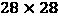），我们可以想象如果想要添加更多的隐藏层或处理更高像素密度的图像，参数的数量会爆炸式增长。这样的任务对于单一的处理单元来说很快就变得不可行。那么问题就来了，如何更有效地处理这样的任务呢？

解决这一问题的显而易见的方法是使用图形处理单元（GPU），它们是真正的工作马。你可以将显卡看作是你机器内部的一个小型计算机集群。另一个优势是，与最先进的中央处理单元（CPU）相比，现代GPU的价格相对便宜，正如以下概览所示：

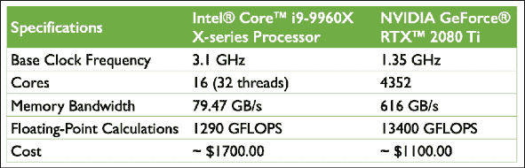

表格中信息的来源是以下网站（日期：2019年10月）：

+   [https://ark.intel.com/content/www/us/en/ark/products/189123/intel-core-i9-9960x-x-series-processor-22m-cache-up-to-4-50-ghz.html](https://ark.intel.com/content/www/us/en/ark/products/189123/intel-core-i9-9960x-x-series-processor-22m-cache-up-to-4-50-ghz.html)

+   [https://www.nvidia.com/en-us/geforce/graphics-cards/rtx-2080-ti/](https://www.nvidia.com/en-us/geforce/graphics-cards/rtx-2080-ti/)

以现代CPU价格的65%为代价，我们可以获得一款GPU，其核心数是现代CPU的272倍，且每秒能够进行约10倍更多的浮点计算。那么，是什么阻碍我们利用GPU来完成机器学习任务呢？挑战在于，编写针对GPU的代码并不像在解释器中执行Python代码那样简单。我们需要使用特殊的包，如CUDA和OpenCL，来利用GPU。然而，使用CUDA或OpenCL编写代码可能不是实现和运行机器学习算法的最便捷环境。好消息是，这正是TensorFlow的开发初衷！

## 什么是TensorFlow？

TensorFlow 是一个可扩展的多平台编程接口，用于实现和运行机器学习算法，包括深度学习的便捷封装。TensorFlow 是由 Google Brain 团队的研究人员和工程师开发的。虽然主要的开发工作由 Google 的研究人员和软件工程师团队领导，但其开发也得到了开源社区的许多贡献。TensorFlow 最初是为 Google 内部使用而构建的，但随后于 2015 年 11 月在宽松的开源许可证下发布。许多来自学术界和行业的机器学习研究人员和从业者已将 TensorFlow 应用于开发深度学习解决方案。

为了提高训练机器学习模型的性能，TensorFlow 允许在 CPU 和 GPU 上执行。然而，当使用 GPU 时，其最大的性能优势可以得到体现。TensorFlow 官方支持 CUDA 启用的 GPU。对 OpenCL 启用的设备的支持仍处于实验阶段。然而，OpenCL 很可能会在不久的将来得到官方支持。TensorFlow 当前支持多种编程语言的前端接口。

对于我们作为 Python 用户来说，TensorFlow 的 Python API 当前是最完整的 API，因此它吸引了许多机器学习和深度学习从业者。此外，TensorFlow 还提供了官方的 C++ API。此外，基于 TensorFlow 的新工具 TensorFlow.js 和 TensorFlow Lite 已经发布，专注于在 Web 浏览器和移动设备及物联网（IoT）设备上运行和部署机器学习模型。其他语言的 API，如 Java、Haskell、Node.js 和 Go，仍不稳定，但开源社区和 TensorFlow 开发人员正在不断改进它们。

TensorFlow 是围绕一个由一组节点组成的计算图构建的。每个节点代表一个操作，该操作可能有零个或多个输入和输出。张量是作为一个符号句柄来引用这些操作的输入和输出。

从数学角度来看，张量可以理解为标量、向量、矩阵等的推广。更具体地说，标量可以定义为一个零阶张量，向量可以定义为一个一阶张量，矩阵可以定义为一个二阶张量，堆叠在第三维的矩阵可以定义为三阶张量。但需要注意的是，在 TensorFlow 中，值是存储在 NumPy 数组中的，而张量提供对这些数组的引用。

为了更清楚地理解张量的概念，考虑下图，它在第一行表示零阶和一阶张量，在第二行表示二阶和三阶张量：

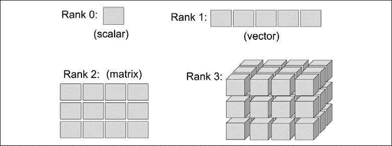

在原版 TensorFlow 发布时，TensorFlow 的计算依赖于构建一个静态的有向图来表示数据流。由于静态计算图的使用对于许多用户来说是一个主要的障碍，TensorFlow 库最近在 2.0 版本中进行了大规模的改进，使得构建和训练神经网络模型变得更加简单。尽管 TensorFlow 2.0 仍然支持静态计算图，但它现在使用动态计算图，这使得操作更加灵活。

## 我们将如何学习 TensorFlow

首先，我们将介绍 TensorFlow 的编程模型，特别是如何创建和操作张量。然后，我们将学习如何加载数据并利用 TensorFlow `Dataset` 对象，这将使我们能够高效地迭代数据集。此外，我们还将讨论 `tensorflow_datasets` 子模块中现有的、可直接使用的数据集，并学习如何使用它们。

学习了这些基础知识后，`tf.keras` API 将被介绍，我们将继续构建机器学习模型，学习如何编译和训练模型，并学习如何将训练好的模型保存在磁盘上，以便将来评估。

# TensorFlow 的第一步

在本节中，我们将迈出使用低级 TensorFlow API 的第一步。安装 TensorFlow 后，我们将介绍如何在 TensorFlow 中创建张量，以及如何操作它们的不同方式，例如改变它们的形状、数据类型等。

## 安装 TensorFlow

根据系统设置的不同，通常你只需使用 Python 的 `pip` 安装器，通过在终端中执行以下命令从 PyPI 安装 TensorFlow：

```py
pip install tensorflow 
```

这将安装最新的 *稳定* 版本，即本文撰写时的 2.0.0 版本。为了确保本章中展示的代码能够按预期执行，建议使用 TensorFlow 2.0.0 版本，可以通过明确指定版本来安装：

```py
pip install tensorflow==[desired-version] 
```

如果你想使用 GPU（推荐），你需要一块兼容的 NVIDIA 显卡，以及安装 CUDA Toolkit 和 NVIDIA cuDNN 库。如果你的机器满足这些要求，你可以按照以下步骤安装支持 GPU 的 TensorFlow：

```py
**pip install tensorflow-gpu** 
```

有关安装和设置过程的更多信息，请参阅官方推荐的[https://www.tensorflow.org/install/gpu](https://www.tensorflow.org/install/gpu)。

请注意，TensorFlow 仍在积极开发中；因此，每隔几个月会发布新版本，并进行重要的变更。在撰写本章时，最新的 TensorFlow 版本是 2.0。你可以通过终端来验证你的 TensorFlow 版本，如下所示：

```py
python -c 'import tensorflow as tf; print(tf.__version__)' 
```

**解决 TensorFlow 安装问题**

如果在安装过程中遇到问题，请查看 [https://www.tensorflow.org/install/](https://www.tensorflow.org/install/) 上提供的系统和平台特定的建议。请注意，本章中的所有代码都可以在 CPU 上运行；使用 GPU 是完全可选的，但如果你希望充分利用 TensorFlow 的优势，推荐使用 GPU。例如，使用 CPU 训练一些神经网络模型可能需要一周时间，而在现代 GPU 上训练相同的模型只需要几个小时。如果你有显卡，请参考安装页面以正确设置它。此外，你可能会发现这个 TensorFlow-GPU 安装指南很有用，指导你如何在 Ubuntu 上安装 NVIDIA 显卡驱动程序、CUDA 和 cuDNN（这些不是必需的，但如果你想在 GPU 上运行 TensorFlow，它们是推荐的要求）：[https://sebastianraschka.com/pdf/books/dlb/appendix_h_cloud-computing.pdf](https://sebastianraschka.com/pdf/books/dlb/appendix_h_cloud-computing.pdf)。此外，正如你将在 *第17章*《*生成对抗网络用于合成新数据*》中看到的，你还可以通过 Google Colab 免费使用 GPU 来训练模型。

## 在 TensorFlow 中创建张量

现在，让我们考虑几种不同的创建张量的方式，并查看它们的一些属性以及如何操作它们。首先，我们可以通过 `tf.convert_to_tensor` 函数从列表或 NumPy 数组简单地创建一个张量，如下所示：

```py
>>> import tensorflow as tf
>>> import numpy as np
>>> np.set_printoptions(precision=3)
>>> a = np.array([1, 2, 3], dtype=np.int32)
>>> b = [4, 5, 6]
>>> t_a = tf.convert_to_tensor(a)
>>> t_b = tf.convert_to_tensor(b)
>>> print(t_a)
>>> print(t_b)
tf.Tensor([1 2 3], shape=(3,), dtype=int32)
tf.Tensor([4 5 6], shape=(3,), dtype=int32) 
```

这导致了张量 `t_a` 和 `t_b`，它们的属性为 `shape=(3,)` 和 `dtype=int32`，这些属性来自它们的源。类似于 NumPy 数组，我们还可以查看这些属性：

```py
>>> t_ones = tf.ones((2, 3))
>>> t_ones.shape
TensorShape([2, 3]) 
```

要访问张量所引用的值，我们只需调用张量的 `.numpy()` 方法：

```py
>>> t_ones.numpy()
array([[1., 1., 1.],
       [1., 1., 1.]], dtype=float32) 
```

最后，创建一个常量值的张量可以通过以下方式完成：

```py
>>> const_tensor = tf.constant([1.2, 5, np.pi],
...                            dtype=tf.float32)
>>> print(const_tensor)
tf.Tensor([1.2   5\.    3.142], shape=(3,), dtype=float32) 
```

## 操作张量的数据类型和形状

学习如何操作张量是非常必要的，以使它们能够兼容模型或操作的输入。在本节中，你将学习如何通过几个 TensorFlow 函数操作张量的数据类型和形状，这些函数包括转换、重塑、转置和压缩。

`tf.cast()` 函数可用于将张量的数据类型转换为所需的类型：

```py
>>> t_a_new = tf.cast(t_a, tf.int64)
>>> print(t_a_new.dtype)
<dtype: 'int64'> 
```

正如你将在后续章节中看到的，某些操作要求输入张量具有特定的维度（即秩）和特定数量的元素（形状）。因此，我们可能需要更改张量的形状、添加新维度或压缩不必要的维度。TensorFlow 提供了有用的函数（或操作）来实现这一点，例如 `tf.transpose()`、`tf.reshape()` 和 `tf.squeeze()`。让我们来看一些例子：

+   **转置一个张量**：

    ```py
    >>> t = tf.random.uniform(shape=(3, 5))
    >>> t_tr = tf.transpose(t)
    >>> print(t.shape, ' --> ', t_tr.shape)
    (3, 5)  -->  (5, 3) 
    ```

+   **重塑一个张量（例如，从 1D 向量到 2D 数组）**：

    ```py
    >>> t = tf.zeros((30,))
    >>> t_reshape = tf.reshape(t, shape=(5, 6))
    >>> print(t_reshape.shape)
    (5, 6) 
    ```

+   **去除不必要的维度（大小为 1 的维度，通常是不需要的）**：

    ```py
    >>> t = tf.zeros((1, 2, 1, 4, 1))
    >>> t_sqz = tf.squeeze(t, axis=(2, 4))
    >>> print(t.shape, ' --> ', t_sqz.shape)
    (1, 2, 1, 4, 1)  -->  (1, 2, 4) 
    ```

## 对张量应用数学操作

应用数学运算，特别是线性代数运算，对于构建大多数机器学习模型是必需的。在本小节中，我们将介绍一些常用的线性代数操作，如元素级乘积、矩阵乘法和计算张量的范数。

首先，让我们实例化两个随机张量，一个是在区间 [–1, 1) 内均匀分布的张量，另一个是标准正态分布的张量：

```py
>>> tf.random.set_seed(1)
>>> t1 = tf.random.uniform(shape=(5, 2),
...                        minval=-1.0, maxval=1.0)
>>> t2 = tf.random.normal(shape=(5, 2),
...                       mean=0.0, stddev=1.0) 
```

请注意，`t1` 和 `t2` 具有相同的形状。现在，为了计算 `t1` 和 `t2` 的元素级乘积，我们可以使用以下方法：

```py
>>> t3 = tf.multiply(t1, t2).numpy()
>>> print(t3)
[[-0.27  -0.874]
 [-0.017 -0.175]
 [-0.296 -0.139]
 [-0.727  0.135]
 [-0.401  0.004]] 
```

要沿某一轴（或多个轴）计算均值、和与标准差，我们可以使用 `tf.math.reduce_mean()`、`tf.math.reduce_sum()` 和 `tf.math.reduce_std()`。例如，可以按照如下方式计算 `t1` 每一列的均值：

```py
>>> t4 = tf.math.reduce_mean(t1, axis=0)
>>> print(t4)
tf.Tensor([0.09  0.207], shape=(2,), dtype=float32) 
```

`t1` 和 `t2` 之间的矩阵乘积（即 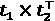，其中上标 T 表示转置）可以通过使用 `tf.linalg.matmul()` 函数按如下方式计算：

```py
>>> t5 = tf.linalg.matmul(t1, t2, transpose_b=True)
>>> print(t5.numpy())
[[-1.144  1.115 -0.87  -0.321  0.856]
 [ 0.248 -0.191  0.25  -0.064 -0.331]
 [-0.478  0.407 -0.436  0.022  0.527]
 [ 0.525 -0.234  0.741 -0.593 -1.194]
 [-0.099  0.26   0.125 -0.462 -0.396]] 
```

另一方面，计算 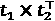 是通过转置 `t1` 来完成的，结果是一个大小为 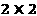 的数组：

```py
>>> t6 = tf.linalg.matmul(t1, t2, transpose_a=True)
>>> print(t6.numpy())
[[-1.711  0.302]
 [ 0.371 -1.049]] 
```

最后，`tf.norm()` 函数对于计算张量的 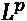 范数非常有用。例如，我们可以按照如下方式计算 `t1` 的 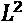 范数：

```py
>>> norm_t1 = tf.norm(t1, ord=2, axis=1).numpy()
>>> print(norm_t1)
[1.046 0.293 0.504 0.96  0.383] 
the  norm of t1 correctly, you can compare the results with the following NumPy function: np.sqrt(np.sum(np.square(t1), axis=1)).
```

## 拆分、堆叠和连接张量

在本小节中，我们将介绍 TensorFlow 中的操作，用于将一个张量拆分为多个张量，或执行相反的操作：将多个张量堆叠和连接成一个张量。

假设我们有一个单一的张量，并且我们想将其拆分成两个或更多张量。为此，TensorFlow 提供了一个便捷的 `tf.split()` 函数，它将输入张量分割成一个等大小的张量列表。我们可以使用参数 `num_or_size_splits` 来确定期望的拆分数量，沿着指定的维度（由 `axis` 参数指定）拆分张量。在这种情况下，输入张量在指定维度上的总大小必须能够被期望的拆分数量整除。或者，我们可以提供一个包含期望大小的列表。让我们看一下这两种选项的示例：

+   **提供拆分的数量（必须是可整除的）**：

    ```py
    >>> tf.random.set_seed(1)
    >>> t = tf.random.uniform((6,))
    >>> print(t.numpy())
    [0.165 0.901 0.631 0.435 0.292 0.643]
    >>> t_splits = tf.split(t, num_or_size_splits=3)
    >>> [item.numpy() for item in t_splits]
    [array([0.165, 0.901], dtype=float32),
     array([0.631, 0.435], dtype=float32),
     array([0.292, 0.643], dtype=float32)] 
    ```

    在这个例子中，一个大小为 6 的张量被分成了一个由三个大小为 2 的张量组成的列表。

+   **提供不同拆分的大小**：

    或者，除了定义拆分的数量外，我们还可以直接指定输出张量的大小。在这里，我们将一个大小为 `5` 的张量拆分成大小为 `3` 和 `2` 的张量：

    ```py
    >>> tf.random.set_seed(1)
    >>> t = tf.random.uniform((5,))
    >>> print(t.numpy())
    [0.165 0.901 0.631 0.435 0.292]
    >>> t_splits = tf.split(t, num_or_size_splits=[3, 2])
    >>> [item.numpy() for item in t_splits]
    [array([0.165, 0.901, 0.631], dtype=float32),
     array([0.435, 0.292], dtype=float32)] 
    ```

有时候，我们需要处理多个张量，并将它们连接或堆叠以创建一个单一的张量。在这种情况下，TensorFlow 的函数如 `tf.stack()` 和 `tf.concat()` 很有用。例如，让我们创建一个大小为 `3` 的包含 1 的一维张量 `A` 和一个大小为 `2` 的包含 0 的一维张量 `B`，并将它们连接成一个大小为 `5` 的一维张量 `C`：

```py
>>> A = tf.ones((3,))
>>> B = tf.zeros((2,))
>>> C = tf.concat([A, B], axis=0)
>>> print(C.numpy())
[1\. 1\. 1\. 0\. 0.] 
```

如果我们创建了大小为`3`的1D张量`A`和`B`，那么我们可以将它们堆叠在一起形成一个2D张量`S`：

```py
>>> A = tf.ones((3,))
>>> B = tf.zeros((3,))
>>> S = tf.stack([A, B], axis=1)
>>> print(S.numpy())
[[1\. 0.]
 [1\. 0.]
 [1\. 0.]] 
```

TensorFlow API提供了许多操作，可以用于构建模型、处理数据等。然而，涵盖所有的函数超出了本书的范围，本书将重点介绍最基本的操作。有关所有操作和函数的完整列表，可以参考TensorFlow文档页面：[https://www.tensorflow.org/versions/r2.0/api_docs/python/tf](https://www.tensorflow.org/versions/r2.0/api_docs/python/tf)。

# 使用tf.data构建输入管道——TensorFlow数据集API

在训练深度神经网络（NN）模型时，我们通常使用迭代优化算法（如随机梯度下降）逐步训练模型，正如我们在前面的章节中所看到的那样。

正如本章开头提到的，Keras API是一个围绕TensorFlow构建神经网络模型的包装器。Keras API提供了一个方法`.fit()`来训练模型。在训练数据集较小并且可以作为张量加载到内存中的情况下，使用Keras API构建的TensorFlow模型可以直接通过`.fit()`方法使用这个张量进行训练。然而，在典型的使用场景中，当数据集太大无法完全载入计算机内存时，我们需要从主存储设备（例如硬盘或固态硬盘）按批次加载数据（注意本章使用“批次”而非“迷你批次”以更接近TensorFlow术语）。此外，我们可能需要构建一个数据处理管道，应用某些转换和预处理步骤，如均值中心化、缩放或添加噪声，以增强训练过程并防止过拟合。

每次手动应用预处理函数可能会非常繁琐。幸运的是，TensorFlow提供了一个专门的类来构建高效且便捷的预处理管道。在这一节中，我们将概述不同的构建TensorFlow `Dataset`的方法，包括数据集转换和常见的预处理步骤。

## 从现有的张量创建一个TensorFlow数据集

如果数据已经以张量对象、Python列表或NumPy数组的形式存在，我们可以使用`tf.data.Dataset.from_tensor_slices()`函数轻松地创建数据集。该函数返回一个`Dataset`类的对象，我们可以用它来逐一遍历输入数据集中的元素。作为一个简单的例子，考虑以下代码，它从一个数值列表中创建数据集：

```py
>>> a = [1.2, 3.4, 7.5, 4.1, 5.0, 1.0]
>>> ds = tf.data.Dataset.from_tensor_slices(a)
>>> print(ds)
<TensorSliceDataset shapes: (), types: tf.float32> 
```

我们可以通过如下方式轻松地逐条遍历数据集中的每一项：

```py
>>> for item in ds:
...     print(item)
tf.Tensor(1.2, shape=(), dtype=float32)
tf.Tensor(3.4, shape=(), dtype=float32)
tf.Tensor(7.5, shape=(), dtype=float32)
tf.Tensor(4.1, shape=(), dtype=float32)
tf.Tensor(5.0, shape=(), dtype=float32)
tf.Tensor(1.0, shape=(), dtype=float32) 
```

如果我们想从这个数据集中创建批次，设定每个批次的大小为`3`，可以通过以下方式实现：

```py
>>> ds_batch = ds.batch(3)
>>> for i, elem in enumerate(ds_batch, 1):
...    print('batch {}:'.format(i), elem.numpy())
batch 1: [1.2 3.4 7.5]
batch 2: [4.1 5\.  1\. ] 
```

这将从该数据集中创建两个批次，其中前三个元素进入批次#1，剩余的元素进入批次#2。`.batch()`方法有一个可选参数`drop_remainder`，当张量中的元素数量不能被期望的批次大小整除时，`drop_remainder`非常有用。`drop_remainder`的默认值是`False`。我们将在后面的*打乱、批处理和重复*小节中看到更多示例，展示该方法的行为。

## 将两个张量组合成一个联合数据集

通常，我们可能会将数据存储在两个（或可能更多）张量中。例如，我们可能会有一个存储特征的张量和一个存储标签的张量。在这种情况下，我们需要构建一个数据集，将这些张量组合在一起，这样我们就可以以元组的形式获取这些张量的元素。

假设我们有两个张量，`t_x`和`t_y`。张量`t_x`存储我们的特征值，每个大小为`3`，而`t_y`存储类别标签。对于这个例子，我们首先按如下方式创建这两个张量：

```py
>>> tf.random.set_seed(1)
>>> t_x = tf.random.uniform([4, 3], dtype=tf.float32)
>>> t_y = tf.range(4) 
```

现在，我们想要从这两个张量中创建一个联合数据集。请注意，这两个张量的元素之间需要一一对应：

```py
>>> ds_x = tf.data.Dataset.from_tensor_slices(t_x)
>>> ds_y = tf.data.Dataset.from_tensor_slices(t_y)
>>>
>>> ds_joint = tf.data.Dataset.zip((ds_x, ds_y))
>>> for example in ds_joint:
...     print('  x:', example[0].numpy(),
...           '  y:', example[1].numpy())
  x: [0.165 0.901 0.631]   y: 0
  x: [0.435 0.292 0.643]   y: 1
  x: [0.976 0.435 0.66 ]   y: 2
  x: [0.605 0.637 0.614]   y: 3 
```

在这里，我们首先创建了两个独立的数据集，分别是`ds_x`和`ds_y`。然后，我们使用`zip`函数将它们组合成一个联合数据集。或者，我们也可以通过`tf.data.Dataset.from_tensor_slices()`来创建联合数据集，方法如下：

```py
>>> ds_joint = tf.data.Dataset.from_tensor_slices((t_x, t_y))
>>> for example in ds_joint:
...     print('  x:', example[0].numpy(),
...           '  y:', example[1].numpy())
  x: [0.165 0.901 0.631]   y: 0
  x: [0.435 0.292 0.643]   y: 1
  x: [0.976 0.435 0.66 ]   y: 2
  x: [0.605 0.637 0.614]   y: 3 
```

这会产生相同的输出。

请注意，一个常见的错误来源是，原始特征（*x*）和标签（*y*）之间的逐元素对应关系可能会丢失（例如，如果两个数据集分别被打乱）。但是，一旦它们合并为一个数据集，就可以安全地应用这些操作。

接下来，我们将看到如何对数据集中的每个元素应用转换。为此，我们将使用之前的`ds_joint`数据集，并应用特征缩放，将值缩放到范围[-1, 1)，因为目前`t_x`的值基于随机均匀分布在[0, 1)范围内：

```py
>>> ds_trans = ds_joint.map(lambda x, y: (x*2-1.0, y))
>>> for example in ds_trans:
...    print('  x:', example[0].numpy(),
...          '  y:', example[1].numpy())
  x: [-0.67   0.803  0.262]   y: 0
  x: [-0.131 -0.416  0.285]   y: 1
  x: [ 0.952 -0.13   0.32 ]   y: 2
  x: [ 0.21   0.273  0.229]   y: 3 
```

应用这种转换可以用于用户自定义的函数。例如，如果我们有一个由磁盘上图像文件名列表创建的数据集，我们可以定义一个函数从这些文件名中加载图像，并通过调用`.map()`方法应用该函数。你将在本章后面看到一个示例，展示如何对数据集应用多重转换。

## 打乱、批处理和重复

如*第2章：训练简单的机器学习分类算法*中所述，要使用随机梯度下降优化训练神经网络模型，重要的是要将训练数据作为随机打乱的批次输入。你已经看到如何通过调用数据集对象的`.batch()`方法来创建批次。现在，除了创建批次之外，你将看到如何对数据集进行打乱并重复迭代。我们将继续使用之前的`ds_joint`数据集。

首先，让我们从`ds_joint`数据集中创建一个洗牌版本：

```py
>>> tf.random.set_seed(1)
>>> ds = ds_joint.shuffle(buffer_size=len(t_x))
>>> for example in ds:
...     print('  x:', example[0].numpy(),
...           '  y:', example[1].numpy())
  x: [0.976 0.435 0.66 ]   y: 2
  x: [0.435 0.292 0.643]   y: 1
  x: [0.165 0.901 0.631]   y: 0
  x: [0.605 0.637 0.614]   y: 3 
```

其中，行被洗牌，但不失去`x`和`y`之间的一对一对应关系。`.shuffle()`方法需要一个叫做`buffer_size`的参数，该参数决定在洗牌之前，数据集中有多少个元素被组合在一起。缓冲区中的元素会被随机提取，并且其在缓冲区中的位置会被赋给原始（未洗牌）数据集中下一个元素的位置。因此，如果选择一个较小的`buffer_size`，我们可能无法完美地洗牌数据集。

如果数据集较小，选择一个相对较小的`buffer_size`可能会对神经网络的预测性能产生负面影响，因为数据集可能无法完全随机化。然而，实际上，当处理相对较大的数据集时（深度学习中常见的情况），通常不会产生明显的影响。或者，为了确保在每个epoch期间完全随机化，我们可以选择一个等于训练样本数量的缓冲区大小，就像前面的代码一样（`buffer_size=len(t_x)`）。

你可能还记得，为了进行模型训练，将数据集划分为批次是通过调用`.batch()`方法来完成的。现在，让我们从`ds_joint`数据集中创建这样的批次，并看看一个批次是什么样的：

```py
>>> ds = ds_joint.batch(batch_size=3,
...                     drop_remainder=False)
>>> batch_x, batch_y = next(iter(ds))
>>> print('Batch-x:\n', batch_x.numpy())
Batch-x:
[[0.165 0.901 0.631]
 [0.435 0.292 0.643]
 [0.976 0.435 0.66 ]]
>>> print('Batch-y: ', batch_y.numpy())
Batch-y: [0 1 2] 
```

此外，当对模型进行多次训练时，我们需要根据所需的epoch次数来洗牌并迭代数据集。因此，让我们将批处理数据集重复两次：

```py
>>> ds = ds_joint.batch(3).repeat(count=2)
>>> for i,(batch_x, batch_y) in enumerate(ds):
...     print(i, batch_x.shape, batch_y.numpy())
0 (3, 3) [0 1 2]
1 (1, 3) [3]
2 (3, 3) [0 1 2]
3 (1, 3) [3] 
```

这会导致每个批次有两份副本。如果我们改变这两个操作的顺序，也就是先批处理然后重复，结果会不同：

```py
>>> ds = ds_joint.repeat(count=2).batch(3)
>>> for i,(batch_x, batch_y) in enumerate(ds):
...     print(i, batch_x.shape, batch_y.numpy())
0 (3, 3) [0 1 2]
1 (3, 3) [3 0 1]
2 (2, 3) [2 3] 
```

注意批次之间的差异。当我们首先进行批处理然后重复时，会得到四个批次。另一方面，当先进行重复操作时，则会创建三个批次。

最后，为了更好地理解这三种操作（批处理、洗牌和重复）如何表现，让我们尝试以不同的顺序进行实验。首先，我们将按以下顺序组合这些操作：(1) 洗牌，(2) 批处理，(3) 重复：

```py
## Order 1: shuffle -> batch -> repeat
>>> tf.random.set_seed(1)
>>> ds = ds_joint.shuffle(4).batch(2).repeat(3)
>>> for i,(batch_x, batch_y) in enumerate(ds):
...     print(i, batch_x.shape, batch_y.numpy())
0 (2, 3) [2 1]
1 (2, 3) [0 3]
2 (2, 3) [0 3]
3 (2, 3) [1 2]
4 (2, 3) [3 0]
5 (2, 3) [1 2] 
```

现在，让我们尝试另一种顺序：(2) 批处理，(1) 洗牌，(3) 重复：

```py
## Order 2: batch -> shuffle -> repeat
>>> tf.random.set_seed(1)
>>> ds = ds_joint.batch(2).shuffle(4).repeat(3)
>>> for i,(batch_x, batch_y) in enumerate(ds):
...     print(i, batch_x.shape, batch_y.numpy())
0 (2, 3) [0 1]
1 (2, 3) [2 3]
2 (2, 3) [0 1]
3 (2, 3) [2 3]
4 (2, 3) [2 3]
5 (2, 3) [0 1] 
```

虽然第一个代码示例（洗牌、批处理、重复）似乎按预期洗牌了数据集，但我们可以看到在第二种情况下（批处理、洗牌、重复），批次内的元素根本没有被洗牌。通过仔细查看包含目标值`y`的张量，我们可以观察到这种没有洗牌的情况。所有批次要么包含一对值`[y=0, y=1]`，要么包含另一对值`[y=2, y=3]`；我们没有观察到其他可能的排列：`[y=2, y=0]`、`[y=1, y=3]`，依此类推。请注意，为了确保这些结果不是巧合，您可能希望使用大于3的重复次数。例如，尝试`.repeat(20)`。

现在，你能预测在使用重复操作之后，如果我们使用 shuffle 操作会发生什么吗？例如，(2) 批量处理，(3) 重复操作，(1) 打乱顺序？试试看。

一个常见的错误来源是对给定数据集连续调用 `.batch()` 两次。这样做会导致从结果数据集中提取项目时，生成批量的批量示例。基本上，每次对数据集调用 `.batch()` 时，它都会将提取的张量的维度增加一。

## 从本地存储磁盘上的文件创建数据集

在本节中，我们将从存储在磁盘上的图像文件构建数据集。本章的在线内容包含一个图像文件夹。下载该文件夹后，你应该能够看到六张猫和狗的 JPEG 格式图像。

这个小数据集将展示如何从存储的文件中构建数据集的一般过程。为了实现这一点，我们将使用 TensorFlow 中的两个额外模块：`tf.io` 用于读取图像文件内容，`tf.image` 用于解码原始内容并进行图像大小调整。

**tf.io 和 tf.image 模块**

`tf.io` 和 `tf.image` 模块提供了许多额外且有用的功能，超出了本书的范围。建议你浏览官方文档，了解更多关于这些功能的内容：

[https://www.tensorflow.org/versions/r2.0/api_docs/python/tf/io](https://www.tensorflow.org/versions/r2.0/api_docs/python/tf/io) 了解 `tf.io`

[https://www.tensorflow.org/versions/r2.0/api_docs/python/tf/image](https://www.tensorflow.org/versions/r2.0/api_docs/python/tf/image) 了解 `tf.image`

在我们开始之前，让我们先看看这些文件的内容。我们将使用 `pathlib` 库生成一个图像文件列表：

```py
>>> import pathlib
>>> imgdir_path = pathlib.Path('cat_dog_images')
>>> file_list = sorted([str(path) for path in
...                     imgdir_path.glob('*.jpg')])
['cat_dog_images/dog-03.jpg', 'cat_dog_images/cat-01.jpg', 'cat_dog_images/cat-02.jpg', 'cat_dog_images/cat-03.jpg', 'cat_dog_images/dog-01.jpg', 'cat_dog_images/dog-02.jpg'] 
```

接下来，我们将使用 Matplotlib 可视化这些图像示例：

```py
>>> import matplotlib.pyplot as plt
>>> fig = plt.figure(figsize=(10, 5))
>>> for i, file in enumerate(file_list):
...     img_raw = tf.io.read_file(file)
...     img = tf.image.decode_image(img_raw)
...     print('Image shape: ', img.shape)
...     ax = fig.add_subplot(2, 3, i+1)
...     ax.set_xticks([]); ax.set_yticks([])
...     ax.imshow(img)
...     ax.set_title(os.path.basename(file), size=15)
>>> plt.tight_layout()
>>> plt.show()
Image shape:  (900, 1200, 3)
Image shape:  (900, 1200, 3)
Image shape:  (900, 1200, 3)
Image shape:  (900, 742, 3)
Image shape:  (800, 1200, 3)
Image shape:  (800, 1200, 3) 
```

以下图展示了示例图像：

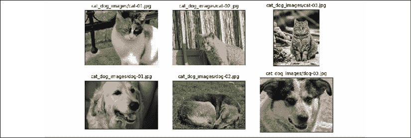

仅凭这个可视化和打印的图像形状，我们已经可以看到图像具有不同的纵横比。如果你打印这些图像的纵横比（或数据数组形状），你会看到一些图像高 900 像素，宽 1200 像素（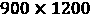），有些是 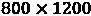，还有一个是 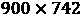。稍后，我们将把这些图像预处理为统一的尺寸。另一个需要考虑的点是，这些图像的标签包含在其文件名中。因此，我们将从文件名列表中提取这些标签，将标签 `1` 分配给狗，将标签 `0` 分配给猫：

```py
>>> labels = [1 if 'dog' in os.path.basename(file) else 0
...           for file in file_list]
>>> print(labels)
[1, 0, 0, 0, 1, 1] 
```

现在，我们有两个列表：一个是文件名列表（或者每个图像的路径），另一个是它们的标签。在上一节中，你已经学会了从两个张量创建联合数据集的两种方法。这里我们将使用第二种方法，如下所示：

```py
>>> ds_files_labels = tf.data.Dataset.from_tensor_slices(
...                                   (file_list, labels))
>>> for item in ds_files_labels:
...     print(item[0].numpy(), item[1].numpy())
b'cat_dog_images/dog-03.jpg' 1
b'cat_dog_images/cat-01.jpg' 0
b'cat_dog_images/cat-02.jpg' 0
b'cat_dog_images/cat-03.jpg' 0
b'cat_dog_images/dog-01.jpg' 1
b'cat_dog_images/dog-02.jpg' 1 
```

我们将这个数据集命名为 `ds_files_labels`，因为它包含文件名和标签。接下来，我们需要对这个数据集应用转换：从文件路径加载图像内容，解码原始内容，并调整到所需大小，例如，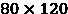。之前，我们已经看过如何使用 `.map()` 方法应用一个 lambda 函数。然而，由于这次我们需要应用多个预处理步骤，我们将编写一个辅助函数，并在调用 `.map()` 方法时使用它：

```py
>>> def load_and_preprocess(path, label):
...     image = tf.io.read_file(path)
...     image = tf.image.decode_jpeg(image, channels=3)
...     image = tf.image.resize(image, [img_height, img_width])
...     image /= 255.0
...     return image, label
>>> img_width, img_height = 120, 80
>>> ds_images_labels = ds_files_labels.map(load_and_preprocess)
>>>
>>> fig = plt.figure(figsize=(10, 6))
>>> for i,example in enumerate(ds_images_labels):
...     ax = fig.add_subplot(2, 3, i+1)
...     ax.set_xticks([]); ax.set_yticks([])
...     ax.imshow(example[0])
...     ax.set_title('{}'.format(example[1].numpy()),
...                  size=15)
>>> plt.tight_layout()
>>> plt.show() 
```

这会生成以下可视化效果，显示检索到的示例图像及其标签：

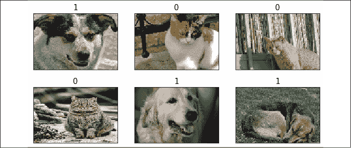

`load_and_preprocess()` 函数将所有四个步骤封装成一个函数，包括加载原始内容、解码和调整图像大小。该函数随后返回一个可以遍历的数据集，并可以应用我们在前面章节中学习的其他操作。

## 从 tensorflow_datasets 库中获取可用数据集

`tensorflow_datasets` 库提供了一系列免费可用的数据集，适用于训练或评估深度学习模型。这些数据集格式规范，并附带有信息性描述，包括特征和标签的格式、类型和维度，以及原始论文的引用，引用格式为 BibTeX。另外一个优点是，这些数据集已经准备好并可以作为 `tf.data.Dataset` 对象直接使用，因此我们在前面章节中介绍的所有函数都可以直接使用。那么，让我们看看如何在实际中使用这些数据集。

首先，我们需要通过命令行使用 `pip` 安装 `tensorflow_datasets` 库：

```py
pip install tensorflow-datasets 
```

现在，让我们导入这个模块，看看可用数据集的列表：

```py
>>> import tensorflow_datasets as tfds
>>> print(len(tfds.list_builders()))
101
>>> print(tfds.list_builders()[:5])
['abstract_reasoning', 'aflw2k3d', 'amazon_us_reviews', 'bair_robot_pushing_small', 'bigearthnet'] 
```

上面的代码表明，目前有 101 个可用数据集（截至写本章时有 101 个数据集，但这个数字可能会增加）——我们将前五个数据集打印到了命令行。有两种获取数据集的方式，我们将在接下来的段落中介绍，通过获取两个不同的数据集：CelebA（`celeb_a`）和 MNIST 数字数据集。

第一种方法包含三个步骤：

1.  调用数据集构建函数

1.  执行 `download_and_prepare()` 方法

1.  调用 `as_dataset()` 方法

让我们从 CelebA 数据集的第一步开始，并打印出库中提供的相关描述：

```py
>>> celeba_bldr = tfds.builder('celeb_a')
>>> print(celeba_bldr.info.features)
FeaturesDict({'image': Image(shape=(218, 178, 3), dtype=tf.uint8), 'landmarks': FeaturesDict({'lefteye_x': Tensor(shape=(), dtype=tf.int64), 'lefteye_y': Tensor(shape=(), dtype=tf.int64), 'righteye_x': Tensor(shape=(), dtype=tf.int64), 'righteye_y': ...
>>> print(celeba_bldr.info.features['image'])
Image(shape=(218, 178, 3), dtype=tf.uint8)
>>> print(celeba_bldr.info.features['attributes'].keys())
dict_keys(['5_o_Clock_Shadow', 'Arched_Eyebrows', ...
>>> print(celeba_bldr.info.citation)
@inproceedings{conf/iccv/LiuLWT15,
  added-at = {2018-10-09T00:00:00.000+0200},
  author = {Liu, Ziwei and Luo, Ping and Wang, Xiaogang and Tang, Xiaoou},
  biburl = {https://www.bibsonomy.org/bibtex/250e4959be61db325d2f02c1d8cd7bfbb/dblp},
  booktitle = {ICCV},
  crossref = {conf/iccv/2015},
  ee = {http://doi.ieeecomputersociety.org/10.1109/ICCV.2015.425},
  interhash = {3f735aaa11957e73914bbe2ca9d5e702},
  intrahash = {50e4959be61db325d2f02c1d8cd7bfbb},
  isbn = {978-1-4673-8391-2},
  keywords = {dblp},
  pages = {3730-3738},
  publisher = {IEEE Computer Society},
  timestamp = {2018-10-11T11:43:28.000+0200},
  title = {Deep Learning Face Attributes in the Wild.},
  url = {http://dblp.uni-trier.de/db/conf/iccv/iccv2015.html#LiuLWT15},
  year = 2015
} 
```

这提供了一些有用的信息，帮助我们理解该数据集的结构。特征以字典的形式存储，包含三个键：`'image'`、`'landmarks'` 和 `'attributes'`。

`'image'`条目表示名人的面部图像；`'landmarks'`表示提取的面部特征点字典，例如眼睛、鼻子的位置信息等；`'attributes'`是该图像中人物的40个面部特征属性字典，如面部表情、化妆、发型特征等。

接下来，我们将调用 `download_and_prepare()` 方法。这将下载数据并将其存储在所有 TensorFlow 数据集的指定文件夹中。如果您已经执行过此操作，它只会检查数据是否已下载，以便在指定位置已经存在数据时不会重新下载：

```py
>>> celeba_bldr.download_and_prepare() 
```

接下来，我们将按如下方式实例化数据集：

```py
>>> datasets = celeba_bldr.as_dataset(shuffle_files=False)
>>> datasets.keys()
dict_keys(['test', 'train', 'validation']) 
```

该数据集已经被拆分为训练集、测试集和验证集。为了查看图像示例的样子，我们可以执行以下代码：

```py
>>> ds_train = datasets['train']
>>> assert isinstance(ds_train, tf.data.Dataset)
>>> example = next(iter(ds_train))
>>> print(type(example))
<class 'dict'>
>>> print(example.keys())
dict_keys(['image', 'landmarks', 'attributes']) 
```

请注意，该数据集的元素以字典的形式出现。如果我们想在训练过程中将此数据集传递给一个监督学习的深度学习模型，我们必须将其重新格式化为 `(features, label)` 的元组。对于标签，我们将使用来自属性中的 `'Male'` 类别。我们将通过 `map()` 应用转换来完成这一操作：

```py
>>> ds_train = ds_train.map(lambda item:
...                (item['image'],
...                tf.cast(item['attributes']['Male'], tf.int32))) 
```

最后，让我们对数据集进行批处理，并从中提取18个示例批次，以便使用其标签可视化它们：

```py
>>> ds_train = ds_train.batch(18)
>>> images, labels = next(iter(ds_train))
>>> print(images.shape, labels)
(18, 218, 178, 3) tf.Tensor([0 0 0 1 1 1 0 1 1 0 1 1 0 1 0 1 1 1], shape=(18,), dtype=int32)
>>> fig = plt.figure(figsize=(12, 8))
>>> for i,(image,label) in enumerate(zip(images, labels)):
...     ax = fig.add_subplot(3, 6, i+1)
...     ax.set_xticks([]); ax.set_yticks([])
...     ax.imshow(image)
...     ax.set_title('{}'.format(label), size=15)
>>> plt.show() 
```

从`ds_train`中提取的示例及其标签如下图所示：

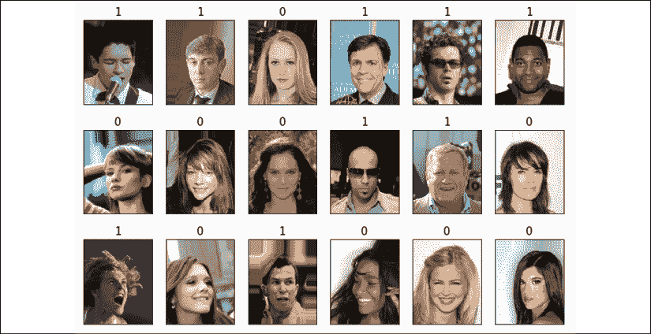

这就是我们需要做的所有事情，以获取并使用 CelebA 图像数据集。

接下来，我们将继续使用第二种方法，从 `tensorflow_datasets` 获取数据集。有一个叫做 `load()` 的包装函数，它将获取数据集的三个步骤合并为一个。让我们看看它如何用于获取 MNIST 数字数据集：

```py
>>> mnist, mnist_info = tfds.load('mnist', with_info=True,
...                               shuffle_files=False)
>>> print(mnist_info)
tfds.core.DatasetInfo(
    name='mnist',
    version=1.0.0,
    description='The MNIST database of handwritten digits.',
    urls=['https://storage.googleapis.com/cvdf-datasets/mnist/'],
    features=FeaturesDict({
        'image': Image(shape=(28, 28, 1), dtype=tf.uint8),
        'label': ClassLabel(shape=(), dtype=tf.int64, num_classes=10)
    },
    total_num_examples=70000,
    splits={
        'test': <tfds.core.SplitInfo num_examples=10000>,
        'train': <tfds.core.SplitInfo num_examples=60000>
    },
    supervised_keys=('image', 'label'),
    citation="""
        @article{lecun2010mnist,
          title={MNIST handwritten digit database},
          author={LeCun, Yann and Cortes, Corinna and Burges, CJ},
          journal={ATT Labs [Online]. Availablist},
          volume={2},
          year={2010}
        }

    """,
    redistribution_info=,
)
>>> print(mnist.keys())
dict_keys(['test', 'train']) 
```

如我们所见，MNIST 数据集被拆分为两个部分。现在，我们可以获取训练部分，应用转换将元素从字典转换为元组，并可视化 10 个示例：

```py
>>> ds_train = mnist['train']
>>> ds_train = ds_train.map(lambda item:
...                         (item['image'], item['label']))
>>> ds_train = ds_train.batch(10)
>>> batch = next(iter(ds_train))
>>> print(batch[0].shape, batch[1])
(10, 28, 28, 1) tf.Tensor([8 4 7 7 0 9 0 3 3 3], shape=(10,), dtype=int64)
>>> fig = plt.figure(figsize=(15, 6))
>>> for i,(image,label) in enumerate(zip(batch[0], batch[1])):
...     ax = fig.add_subplot(2, 5, i+1)
...     ax.set_xticks([]); ax.set_yticks([])
...     ax.imshow(image[:, :, 0], cmap='gray_r')
...     ax.set_title('{}'.format(label), size=15)
>>> plt.show() 
```

从该数据集中提取的手写数字示例如下所示：

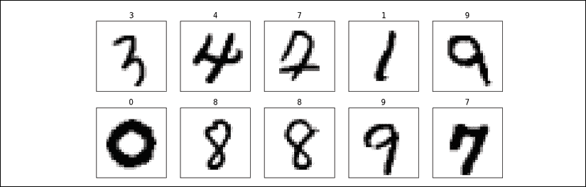

这就结束了我们关于构建和操作数据集以及从 `tensorflow_datasets` 库获取数据集的介绍。接下来，我们将学习如何在 TensorFlow 中构建神经网络模型。

**TensorFlow 风格指南**

请注意，官方 TensorFlow 风格指南（[https://www.tensorflow.org/community/style_guide](https://www.tensorflow.org/community/style_guide)）建议使用两个字符的缩进。然而，本书采用四个字符的缩进，因为它与官方 Python 风格指南更加一致，并且有助于在许多文本编辑器中正确显示代码语法高亮，以及在[https://github.com/rasbt/python-machine-learning-book-3rd-edition](https://github.com/rasbt/python-machine-learning-book-3rd-edition)上的 Jupyter 代码笔记本。

# 在 TensorFlow 中构建神经网络模型

到目前为止，在本章中，你已经了解了 TensorFlow 中用于操作张量和将数据组织为可以在训练过程中迭代的格式的基本工具组件。在本节中，我们将最终在 TensorFlow 中实现我们的第一个预测模型。由于 TensorFlow 比如 scikit-learn 等机器学习库更具灵活性，但也更复杂，因此我们将从一个简单的线性回归模型开始。

## TensorFlow Keras API（tf.keras）

Keras 是一个高级神经网络（NN）API，最初是为了在其他库（如 TensorFlow 和 Theano）之上运行而开发的。Keras 提供了一个用户友好且模块化的编程接口，允许用户在几行代码内轻松地进行原型设计并构建复杂的模型。Keras 可以独立安装于 PyPI 中，然后配置为使用 TensorFlow 作为其后端引擎。Keras 与 TensorFlow 紧密集成，其模块可以通过 `tf.keras` 进行访问。在 TensorFlow 2.0 中，`tf.keras` 已成为实现模型的主要且推荐的方式。这种方式的优点在于它支持 TensorFlow 特有的功能，比如使用 `tf.data` 构建数据集流水线，正如你在前一节中所学到的那样。在本书中，我们将使用 `tf.keras` 模块来构建神经网络模型。

正如你将在以下小节中看到的，Keras API（`tf.keras`）使得构建神经网络模型变得异常简单。构建神经网络的最常用方法是通过 `tf.keras.Sequential()`，该方法允许通过堆叠层来形成网络。层的堆叠可以通过将 Python 列表传递给定义为 `tf.keras.Sequential()` 的模型来实现。或者，也可以使用 `.add()` 方法逐一添加层。

此外，`tf.keras` 允许我们通过继承 `tf.keras.Model` 来定义模型。这使我们可以通过为模型类定义 `call()` 方法，明确地指定前向传播，从而对前向传播过程有更多的控制。我们将看到如何使用这两种方法，通过 `tf.keras` API 来构建神经网络模型的例子。

最后，正如你将在以下小节中看到的，通过 `tf.keras` API 构建的模型可以通过 `.compile()` 和 `.fit()` 方法进行编译和训练。

## 构建一个线性回归模型

在这一小节中，我们将构建一个简单的模型来解决线性回归问题。首先，让我们在 NumPy 中创建一个玩具数据集并进行可视化：

```py
>>> X_train = np.arange(10).reshape((10, 1))
>>> y_train = np.array([1.0, 1.3, 3.1, 2.0, 5.0, 6.3,
...                     6.6, 7.4, 8.0, 9.0])
>>> plt.plot(X_train, y_train, 'o', markersize=10)
>>> plt.xlabel('x')
>>> plt.ylabel('y')
>>> plt.show() 
```

结果是，训练样本将显示在如下所示的散点图中：

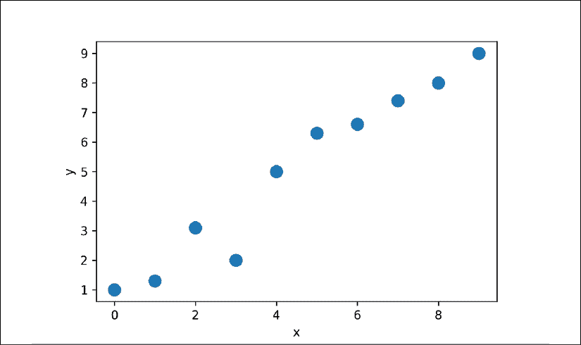

接下来，我们将对特征进行标准化（均值中心化并除以标准差），并创建一个 TensorFlow `Dataset`：

```py
>>> X_train_norm = (X_train - np.mean(X_train))/np.std(X_train)
>>> ds_train_orig = tf.data.Dataset.from_tensor_slices(
...                   (tf.cast(X_train_norm, tf.float32),
...                    tf.cast(y_train, tf.float32))) 
```

现在，我们可以为线性回归定义模型，如下图所示：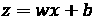。在这里，我们将使用 Keras API。`tf.keras` 提供了用于构建复杂神经网络模型的预定义层，但为了开始，你将学习如何从头开始定义模型。在本章稍后的部分，你将看到如何使用那些预定义层。

对于这个回归问题，我们将定义一个新的类，继承自`tf.keras.Model`类。通过子类化`tf.keras.Model`，我们可以使用Keras工具来探索模型、训练和评估。在我们类的构造函数中，我们将定义模型的参数`w`和`b`，它们分别对应权重和偏置参数。最后，我们将定义`call()`方法，以确定模型如何使用输入数据生成输出：

```py
>>> class MyModel(tf.keras.Model):
...     def __init__(self):
...         super(MyModel, self).__init__()
...         self.w = tf.Variable(0.0, name='weight')
...         self.b = tf.Variable(0.0, name='bias')
...
...     def call(self, x):
...         return self.w * x + self.b 
```

接下来，我们将从`MyModel()`类实例化一个新模型，我们可以根据训练数据对其进行训练。TensorFlow Keras API提供了一个名为`.summary()`的方法，用于从`tf.keras.Model`实例化的模型，这允许我们逐层查看模型组件的摘要以及每层的参数数量。由于我们已经将模型从`tf.keras.Model`子类化，因此`.summary()`方法对我们也是可用的。但是，为了能够调用`model.summary()`，我们首先需要指定此模型的输入维度（特征数量）。我们可以通过调用`model.build()`并传递期望的输入数据形状来做到这一点：

```py
>>> model = MyModel()
>>> model.build(input_shape=(None, 1))
>>> model.summary()
Model: "my_model"
_________________________________________________________________
Layer (type)                 Output Shape              Param #   
=================================================================
Total params: 2
Trainable params: 2
Non-trainable params: 0
_________________________________________________________________ 
```

请注意，我们通过`model.build()`将`None`用作期望输入张量的第一个维度的占位符，这使得我们可以使用任意批次大小。然而，特征数量是固定的（这里为`1`），因为它直接对应于模型的权重参数数量。通过调用`.build()`方法在实例化后构建模型层和参数被称为*延迟变量创建*。对于这个简单的模型，我们已经在构造函数中创建了模型参数；因此，通过`build()`指定`input_shape`对我们的参数没有进一步的影响，但如果我们想调用`model.summary()`，仍然是必要的。

定义模型后，我们可以定义我们想要最小化的代价函数，以找到最优的模型权重。在这里，我们将选择**均方误差**（**MSE**）作为我们的代价函数。此外，为了学习模型的权重参数，我们将使用随机梯度下降。在这一小节中，我们将通过随机梯度下降过程自己实现这个训练，但在下一小节中，我们将使用Keras方法`compile()`和`fit()`来做相同的事情。

要实现随机梯度下降算法，我们需要计算梯度。我们将使用TensorFlow API中的`tf.GradientTape`来计算梯度，而不是手动计算梯度。我们将在*第14章*、*深入探讨——TensorFlow的原理*中讲解`tf.GradientTape`及其不同的行为。代码如下：

```py
>>> def loss_fn(y_true, y_pred):
...     return tf.reduce_mean(tf.square(y_true - y_pred))
>>> def train(model, inputs, outputs, learning_rate):
...     with tf.GradientTape() as tape:
...         current_loss = loss_fn(model(inputs), outputs)
...     dW, db = tape.gradient(current_loss, [model.w, model.b])
...     model.w.assign_sub(learning_rate * dW)
...     model.b.assign_sub(learning_rate * db) 
```

现在，我们可以设置超参数并训练模型200个周期。我们将创建一个批处理版本的数据集，并通过`count=None`重复数据集，这将导致数据集无限重复：

```py
>>> tf.random.set_seed(1)
>>> num_epochs = 200
>>> log_steps = 100
>>> learning_rate = 0.001
>>> batch_size = 1
>>> steps_per_epoch = int(np.ceil(len(y_train) / batch_size))
>>> ds_train = ds_train_orig.shuffle(buffer_size=len(y_train))
>>> ds_train = ds_train.repeat(count=None)
>>> ds_train = ds_train.batch(1)
>>> Ws, bs = [], []
>>> for i, batch in enumerate(ds_train):
...     if i >= steps_per_epoch * num_epochs:
...         # break the infinite loop
...         break
...     Ws.append(model.w.numpy())
...     bs.append(model.b.numpy())
...
...     bx, by = batch
...     loss_val = loss_fn(model(bx), by)
...
...     train(model, bx, by, learning_rate=learning_rate)
...     if i%log_steps==0:
...         print('Epoch {:4d} Step {:2d} Loss {:6.4f}'.format(
...               int(i/steps_per_epoch), i, loss_val))
Epoch    0 Step  0 Loss 43.5600
Epoch   10 Step 100 Loss 0.7530
Epoch   20 Step 200 Loss 20.1759
Epoch   30 Step 300 Loss 23.3976
Epoch   40 Step 400 Loss 6.3481
Epoch   50 Step 500 Loss 4.6356
Epoch   60 Step 600 Loss 0.2411
Epoch   70 Step 700 Loss 0.2036
Epoch   80 Step 800 Loss 3.8177
Epoch   90 Step 900 Loss 0.9416
Epoch  100 Step 1000 Loss 0.7035
Epoch  110 Step 1100 Loss 0.0348
Epoch  120 Step 1200 Loss 0.5404
Epoch  130 Step 1300 Loss 0.1170
Epoch  140 Step 1400 Loss 0.1195
Epoch  150 Step 1500 Loss 0.0944
Epoch  160 Step 1600 Loss 0.4670
Epoch  170 Step 1700 Loss 2.0695
Epoch  180 Step 1800 Loss 0.0020
Epoch  190 Step 1900 Loss 0.3612 
```

让我们查看训练后的模型并对其进行绘制。对于测试数据，我们将创建一个 NumPy 数组，包含从 0 到 9 之间均匀间隔的值。由于我们用标准化特征训练了模型，因此我们也会对测试数据应用相同的标准化：

```py
>>> print('Final Parameters: ', model.w.numpy(), model.b.numpy())
Final Parameters:  2.6576622 4.8798566
>>> X_test = np.linspace(0, 9, num=100).reshape(-1, 1)
>>> X_test_norm = (X_test - np.mean(X_train)) / np.std(X_train)
>>> y_pred = model(tf.cast(X_test_norm, dtype=tf.float32))
>>> fig = plt.figure(figsize=(13, 5))
>>> ax = fig.add_subplot(1, 2, 1)
>>> plt.plot(X_train_norm, y_train, 'o', markersize=10)
>>> plt.plot(X_test_norm, y_pred, '--', lw=3)
>>> plt.legend(['Training examples', 'Linear Reg.'], fontsize=15)
>>> ax.set_xlabel('x', size=15)
>>> ax.set_ylabel('y', size=15)
>>> ax.tick_params(axis='both', which='major', labelsize=15)
>>> ax = fig.add_subplot(1, 2, 2)
>>> plt.plot(Ws, lw=3)
>>> plt.plot(bs, lw=3)
>>> plt.legend(['Weight w', 'Bias unit b'], fontsize=15)
>>> ax.set_xlabel('Iteration', size=15)
>>> ax.set_ylabel('Value', size=15)
>>> ax.tick_params(axis='both', which='major', labelsize=15)
>>> plt.show() 
```

下图展示了训练样本的散点图以及训练后的线性回归模型，同时还展示了权重 *w* 和偏置单位 *b* 的收敛历史：

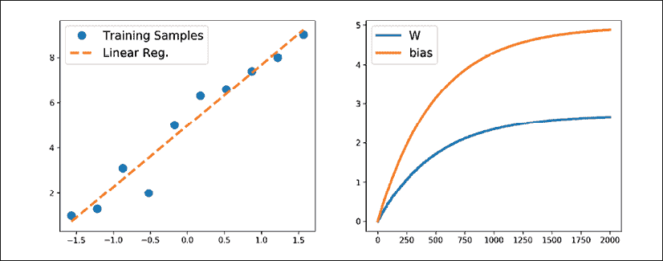

## 使用 .compile() 和 .fit() 方法训练模型

在前一个示例中，我们看到了如何通过编写自定义函数 `train()` 来训练模型，并应用随机梯度下降优化方法。然而，编写 `train()` 函数在不同项目中可能是一个重复的任务。TensorFlow Keras API 提供了一个便捷的 `.fit()` 方法，可以在实例化的模型上调用。为了展示这一点，让我们创建一个新模型并通过选择优化器、损失函数和评估指标来编译它：

```py
>>> tf.random.set_seed(1)
>>> model = MyModel()
>>> model.compile(optimizer='sgd',
...               loss=loss_fn,
...               metrics=['mae', 'mse']) 
```

现在，我们可以直接调用 `fit()` 方法来训练模型。我们可以传入一个批量数据集（例如在前一个示例中创建的 `ds_train`）。然而，这一次你会看到，我们可以直接传入 NumPy 数组作为 `x` 和 `y`，无需再创建数据集：

```py
>>> model.fit(X_train_norm, y_train,
...           epochs=num_epochs, batch_size=batch_size,
...           verbose=1)
Train on 10 samples
Epoch 1/200
10/10 [==============================] - 0s 4ms/sample - loss: 27.8578 - mae: 4.5810 - mse: 27.8578
Epoch 2/200
10/10 [==============================] - 0s 738us/sample - loss: 18.6640 - mae: 3.7395 - mse: 18.6640
...
Epoch 200/200
10/10 [==============================] - 0s 1ms/sample - loss: 0.4139 - mae: 0.4942 - mse: 0.4139 
```

模型训练完成后，进行可视化并确保结果与前一种方法的结果相似。

## 构建一个多层感知机，用于分类 Iris 数据集中的花卉

在前一个示例中，你看到了如何从零开始构建一个模型。我们使用随机梯度下降优化方法训练了这个模型。虽然我们从最简单的例子入手，但你可以看到，即使是如此简单的情况，完全从零定义模型既不吸引人也不具备良好的实践性。相反，TensorFlow 提供了通过 `tf.keras.layers` 预定义的层，可以直接作为神经网络模型的构建模块。在这一部分，你将学习如何使用这些层来解决 Iris 花卉数据集的分类任务，并使用 Keras API 构建一个两层感知机。首先，让我们从 `tensorflow_datasets` 获取数据：

```py
>>> iris, iris_info = tfds.load('iris', with_info=True)
>>> print(iris_info) 
```

这会打印一些关于数据集的信息（为节省空间，本文未打印）。然而，你会在显示的信息中注意到该数据集只有一个分区，因此我们必须自行将数据集拆分为训练集和测试集（并且为符合机器学习的最佳实践，也需要有验证集）。假设我们希望使用数据集的三分之二进行训练，其余部分用于测试。`tensorflow_datasets` 库提供了一个便捷的工具，允许我们在加载数据集之前通过 `DatasetBuilder` 对象来确定数据集的切片和拆分。你可以在 [https://www.tensorflow.org/datasets/splits](https://www.tensorflow.org/datasets/splits) 了解更多有关数据拆分的信息。

另一种方法是先加载整个数据集，然后使用 `.take()` 和 `.skip()` 将数据集分成两个部分。如果数据集开始时没有进行洗牌，我们也可以对数据集进行洗牌。然而，我们需要非常小心，因为这可能导致训练集和测试集混合，这在机器学习中是不可接受的。为了避免这种情况，我们必须在 `.shuffle()` 方法中设置一个参数，`reshuffle_each_iteration=False`。将数据集拆分为训练集/测试集的代码如下：

```py
>>> tf.random.set_seed(1)
>>> ds_orig = iris['train']
>>> ds_orig = ds_orig.shuffle(150, reshuffle_each_iteration=False)
>>> ds_train_orig = ds_orig.take(100)
>>> ds_test = ds_orig.skip(100) 
```

接下来，正如你在前面的部分中已经看到的，我们需要通过 `.map()` 方法应用一个转换，将字典转换为元组：

```py
>>> ds_train_orig = ds_train_orig.map(
...     lambda x: (x['features'], x['label']))
>>> ds_test = ds_test.map(
...     lambda x: (x['features'], x['label'])) 
```

现在，我们已经准备好使用 Keras API 高效地构建模型。特别是，使用 `tf.keras.Sequential` 类，我们可以堆叠一些 Keras 层并构建一个神经网络。你可以在[https://www.tensorflow.org/versions/r2.0/api_docs/python/tf/keras/layers](https://www.tensorflow.org/versions/r2.0/api_docs/python/tf/keras/layers)查看所有已存在的 Keras 层的列表。对于这个问题，我们将使用 `Dense` 层（`tf.keras.layers.Dense`），它也被称为全连接（FC）层或线性层，可以通过 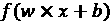 最好地表示，其中 *x* 是输入特征，*w* 和 *b* 是权重矩阵和偏置向量，*f* 是激活函数。

如果你考虑神经网络中的每一层，每一层都会从前一层接收输入；因此，它的维度（秩和形状）是固定的。通常，我们只在设计神经网络架构时才需要关心输出的维度。（注意：第一层是例外，但 TensorFlow/Keras 允许我们在定义模型后通过*延迟变量创建*来决定第一层的输入维度。）在这里，我们希望定义一个包含两层隐藏层的模型。第一层接收四个特征的输入，并将其投影到16个神经元上。第二层接收前一层的输出（其大小为`16`），并将其投影到三个输出神经元上，因为我们有三个类别标签。这可以通过 Keras 中的 `Sequential` 类和 `Dense` 层来实现，如下所示：

```py
>>> iris_model = tf.keras.Sequential([
...         tf.keras.layers.Dense(16, activation='sigmoid',
...                               name='fc1', input_shape=(4,)),
...         tf.keras.layers.Dense(3, name='fc2',
...                               activation='softmax')])
>>> iris_model.summary()
Model: "sequential"
_________________________________________________________________
Layer (type)                 Output Shape              Param #   
=================================================================
fc1 (Dense)                  (None, 16)                80        
_________________________________________________________________
fc2 (Dense)                  (None, 3)                 51        
=================================================================
Total params: 131
Trainable params: 131
Non-trainable params: 0
_________________________________________________________________ 
```

请注意，我们通过 `input_shape=(4,)` 确定了第一层的输入形状，因此我们不再需要调用 `.build()` 来使用 `iris_model.summary()`。

打印的模型摘要表明，第一个层（`fc1`）有80个参数，第二个层有51个参数。你可以通过查看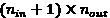来验证这一点，其中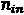是输入单元的数量，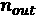是输出单元的数量。回想一下，对于全连接层（密集连接层），可学习的参数是大小为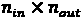的权重矩阵和大小为的偏置向量。此外，请注意，我们为第一个层使用了sigmoid激活函数，并为最后一层（输出层）使用了softmax激活函数。最后一层的softmax激活函数用于支持多类分类，因为在这里我们有三个类别标签（这也是为什么输出层有三个神经元）。我们将在本章稍后讨论不同的激活函数及其应用。

接下来，我们将编译此模型以指定损失函数、优化器和评估指标：

```py
>>> iris_model.compile(optimizer='adam',
...                    loss='sparse_categorical_crossentropy',
...                    metrics=['accuracy']) 
```

现在，我们可以训练模型。我们将指定训练的epoch数量为`100`，batch大小为`2`。在以下代码中，我们将构建一个无限重复的数据集，并将其传递给`fit()`方法来训练模型。在这种情况下，为了让`fit()`方法能够跟踪epoch数量，它需要知道每个epoch的步数。

根据我们的训练数据的大小（这里是`100`）和batch大小（`batch_size`），我们可以确定每个epoch中的步数`steps_per_epoch`：

```py
>>> num_epochs = 100
>>> training_size = 100
>>> batch_size = 2
>>> steps_per_epoch = np.ceil(training_size / batch_size)
>>> ds_train = ds_train_orig.shuffle(buffer_size=training_size)
>>> ds_train = ds_train.repeat()
>>> ds_train = ds_train.batch(batch_size=batch_size)
>>> ds_train = ds_train.prefetch(buffer_size=1000)
>>> history = iris_model.fit(ds_train, epochs=num_epochs,
...                          steps_per_epoch=steps_per_epoch,
...                          verbose=0) 
```

返回的变量history保存了每个epoch之后的训练损失和训练准确度（因为它们在`iris_model.compile()`中被指定为评估指标）。我们可以使用它来可视化学习曲线，如下所示：

```py
>>> hist = history.history
>>> fig = plt.figure(figsize=(12, 5))
>>> ax = fig.add_subplot(1, 2, 1)
>>> ax.plot(hist['loss'], lw=3)
>>> ax.set_title('Training loss', size=15)
>>> ax.set_xlabel('Epoch', size=15)
>>> ax.tick_params(axis='both', which='major', labelsize=15)
>>> ax = fig.add_subplot(1, 2, 2)
>>> ax.plot(hist['accuracy'], lw=3)
>>> ax.set_title('Training accuracy', size=15)
>>> ax.set_xlabel('Epoch', size=15)
>>> ax.tick_params(axis='both', which='major', labelsize=15)
>>> plt.show() 
```

学习曲线（训练损失和训练准确度）如下：

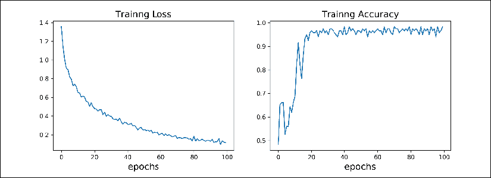

## 在测试数据集上评估训练过的模型

由于我们在`iris_model.compile()`中指定了`'accuracy'`作为评估指标，现在我们可以直接在测试数据集上评估模型：

```py
>>> results = iris_model.evaluate(ds_test.batch(50), verbose=0)
>>> print('Test loss: {:.4f}   Test Acc.: {:.4f}'.format(*results))
Test loss: 0.0692   Test Acc.: 0.9800 
```

请注意，我们也需要对测试数据集进行batch处理，以确保输入到模型的数据具有正确的维度（秩）。正如我们之前讨论的，调用`.batch()`会将获取的张量的秩增加1。`.evaluate()`方法的输入数据必须具有指定的批次维度，尽管在这里（评估时）批次大小并不重要。因此，如果我们将`ds_batch.batch(50)`传递给`.evaluate()`方法，整个测试数据集将在一个大小为50的批次中处理，但如果我们传递`ds_batch.batch(1)`，则会处理50个大小为1的批次。

## 保存和重新加载训练好的模型

训练好的模型可以保存到磁盘以供将来使用。可以通过以下方式进行保存：

```py
>>> iris_model.save('iris-classifier.h5',
...            overwrite=True,
...            include_optimizer=True,
...            save_format='h5') 
```

第一个选项是文件名。调用`iris_model.save()`将保存模型架构和所有学习到的参数。然而，如果你只想保存架构，可以使用`iris_model.to_json()`方法，这将以JSON格式保存模型配置。如果你只想保存模型权重，可以通过调用`iris_model.save_weights()`来实现。`save_format`可以指定为'h5'（HDF5格式）或'tf'（TensorFlow格式）。

现在，让我们重新加载已保存的模型。由于我们已经保存了模型架构和权重，我们可以通过一行代码轻松重建和重新加载参数：

```py
>>> iris_model_new = tf.keras.models.load_model('iris-classifier.h5') 
```

尝试通过调用`iris_model_new.summary()`来验证模型架构。

最后，让我们评估这个新模型，并在测试数据集上重新加载它，以验证结果是否与之前相同：

```py
>>> results = iris_model_new.evaluate(ds_test.batch(33), verbose=0)
>>> print('Test loss: {:.4f}   Test Acc.: {:.4f}'.format(*results))
Test loss: 0.0692   Test Acc.: 0.9800 
```

# 为多层神经网络选择激活函数

为了简便起见，我们到目前为止只讨论了在多层前馈神经网络中的sigmoid激活函数；我们在*第12章*中的多层感知机实现中，既在隐藏层也在输出层使用了它（*从头开始实现多层人工神经网络*）。

请注意，在本书中，S形逻辑函数（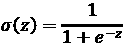）为了简洁起见被称为*sigmoid*函数，这在机器学习文献中是很常见的术语。在接下来的各小节中，您将了解更多关于实现多层神经网络（NN）时有用的其他非线性函数。

从技术上讲，只要激活函数是可微分的，我们可以在多层神经网络中使用任何函数。我们甚至可以使用线性激活函数，比如在Adaline中（*第2章*，*训练简单的机器学习算法进行分类*）。然而，实际上，如果我们在隐藏层和输出层都使用线性激活函数，这并不是很有用，因为在典型的人工神经网络中，我们希望引入非线性，以便能够处理复杂的问题。毕竟，线性函数的和仍然是线性函数。

我们在*第12章*中使用的逻辑（sigmoid）激活函数可能最接近模仿大脑中神经元的概念——我们可以将其视为神经元是否发火的概率。然而，如果输入值非常负，逻辑（sigmoid）激活函数可能会出现问题，因为此时sigmoid函数的输出将接近零。如果sigmoid函数返回接近零的输出，神经网络的学习速度将非常慢，并且在训练过程中更容易陷入局部最小值。这就是为什么人们通常更倾向于在隐藏层使用双曲正切作为激活函数的原因。

在我们讨论双曲正切的具体形态之前，让我们简要回顾一下逻辑函数的一些基本内容，并看看它的推广形式，看看它如何在多标签分类问题中更有用。

## 逻辑函数回顾

正如本节介绍中所提到的，Logistic函数实际上是Sigmoid函数的一个特例。你会从 *第3章*，《使用scikit-learn的机器学习分类器巡礼》中关于Logistic回归的部分回忆起，我们可以使用Logistic函数来建模样本 *x* 在二分类任务中属于正类（类别 `1`）的概率。

给定的净输入 *z* 如下方公式所示：

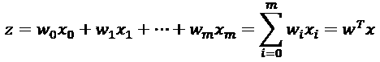

Logistic（Sigmoid）函数将计算以下内容：

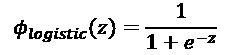

注意，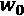是偏置单元（*y*-轴截距，这意味着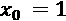）。为了提供一个更具体的例子，假设我们有一个二维数据点 *x* 的模型，并且该模型分配给 *w* 向量以下的权重系数：

```py
>>> import numpy as np
>>> X = np.array([1, 1.4, 2.5]) ## first value must be 1
>>> w = np.array([0.4, 0.3, 0.5])
>>> def net_input(X, w):
...     return np.dot(X, w)
>>> def logistic(z):
...     return 1.0 / (1.0 + np.exp(-z))
>>> def logistic_activation(X, w):
...     z = net_input(X, w)
...     return logistic(z)
>>> print(‘P(y=1|x) = %.3f’ % logistic_activation(X, w))
P(y=1|x) = 0.888 
```

如果我们计算净输入（*z*）并用它来激活具有这些特定特征值和权重系数的Logistic神经元，我们得到一个`0.888`的值，我们可以将其解释为该特定样本 *x* 属于正类的88.8%概率。

在 *第12章* 中，我们使用了独热编码技术来表示多类的真实标签，并设计了由多个Logistic激活单元组成的输出层。然而，正如以下代码示例所演示的，包含多个Logistic激活单元的输出层并没有生成有意义的、可解释的概率值：

```py
>>> # W : array with shape = (n_output_units, n_hidden_units+1)
>>> #     note that the first column are the bias units
>>> W = np.array([[1.1, 1.2, 0.8, 0.4],
...               [0.2, 0.4, 1.0, 0.2],
...               [0.6, 1.5, 1.2, 0.7]])
>>> # A : data array with shape = (n_hidden_units + 1, n_samples)
>>> #     note that the first column of this array must be 1
>>> A = np.array([[1, 0.1, 0.4, 0.6]])
>>> Z = np.dot(W, A[0])
>>> y_probas = logistic(Z)
>>> print(‘Net Input: \n’, Z)
Net Input:
[ 1.78  0.76  1.65]
>>> print(‘Output Units:\n’, y_probas)
Output Units:
[ 0.85569687  0.68135373  0.83889105] 
```

如你在输出中所看到的，得到的值不能解释为三类问题的概率。原因是这些值的总和不等于1。然而，如果我们仅使用我们的模型来预测类别标签，而不是类别成员概率，这实际上并不是一个大问题。从先前得到的输出单元中预测类别标签的一种方法是使用最大值：

```py
>>> y_class = np.argmax(Z, axis=0)
>>> print(‘Predicted class label: %d’ % y_class)
Predicted class label: 0 
```

在某些情况下，计算多类预测的有意义类别概率是有用的。在接下来的部分，我们将介绍Logistic函数的推广版，即`softmax`函数，它可以帮助我们完成这一任务。

## 通过softmax函数估计多类分类中的类别概率

在上一部分，你看到我们如何使用`argmax`函数获得类别标签。之前，在《为鸢尾花数据集构建多层感知机进行分类》部分中，我们确定了MLP模型最后一层的`activation='softmax'`。`softmax`函数是`argmax`函数的一种软形式；它不是给出一个单一的类别索引，而是提供每个类别的概率。因此，它允许我们在多类设置中计算有意义的类别概率（多项式Logistic回归）。

在`softmax`中，某个样本的净输入*z*属于第*i*类的概率可以通过分母中的归一化项计算，即所有指数加权线性函数的和：

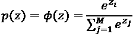

要查看`softmax`的实际应用，我们可以用Python来实现：

```py
>>> def softmax(z):
...     return np.exp(z) / np.sum(np.exp(z))
>>> y_probas = softmax(Z)
>>> print(‘Probabilities:\n’, y_probas)
Probabilities:
[ 0.44668973  0.16107406  0.39223621]
>>> np.sum(y_probas)
1.0 
```

如您所见，预测的类别概率现在加起来为1，这正是我们所期望的。值得注意的是，预测的类别标签与我们对逻辑输出应用`argmax`函数时得到的结果相同。

可以将`softmax`函数的结果看作是一个*归一化*输出，这对于在多分类设置中获取有意义的类别成员预测非常有用。因此，当我们在TensorFlow中构建多分类模型时，我们可以使用`tf.keras.activations.softmax()`函数来估计输入批次样本每个类别的概率。为了展示如何在TensorFlow中使用`softmax`激活函数，在以下代码中，我们将`Z`转换为张量，并为批次大小预留额外的维度：

```py
>>> import tensorflow as tf
>>> Z_tensor = tf.expand_dims(Z, axis=0)
>>> tf.keras.activations.softmax(Z_tensor)
<tf.Tensor: id=21, shape=(1, 3), dtype=float64, numpy=array([[0.44668973, 0.16107406, 0.39223621]])> 
```

## 使用双曲正切扩展输出谱

另一个常用于人工神经网络隐藏层的S形函数是**双曲正切**（通常称为**tanh**），它可以被解释为逻辑函数的缩放版本：

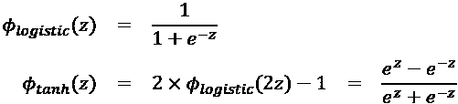

双曲正切函数相较于逻辑函数的优势在于，它有一个更广泛的输出谱，范围在开区间（–1, 1）内，这可以改善反向传播算法的收敛性（*模式识别中的神经网络*，*C. M. Bishop*，*牛津大学出版社*，第500-501页，*1995*）。

相比之下，逻辑函数的输出信号范围在开区间(0, 1)内。为了简单对比逻辑函数和双曲正切函数，我们可以绘制这两个S形函数：

```py
>>> import matplotlib.pyplot as plt
>>> def tanh(z):
...     e_p = np.exp(z)
...     e_m = np.exp(-z)
...     return (e_p - e_m) / (e_p + e_m)
>>> z = np.arange(-5, 5, 0.005)
>>> log_act = logistic(z)
>>> tanh_act = tanh(z)
>>> plt.ylim([-1.5, 1.5])
>>> plt.xlabel(‘net input $z$’)
>>> plt.ylabel(‘activation $\phi(z)$’)
>>> plt.axhline(1, color=’black’, linestyle=’:’)
>>> plt.axhline(0.5, color=’black’, linestyle=’:’)
>>> plt.axhline(0, color=’black’, linestyle=’:’)
>>> plt.axhline(-0.5, color=’black’, linestyle=’:’)
>>> plt.axhline(-1, color=’black’, linestyle=’:’)
>>> plt.plot(z, tanh_act,
...          linewidth=3, linestyle=’--’,
...          label=’tanh’)
>>> plt.plot(z, log_act,
...          linewidth=3,
...          label=’logistic’)
>>> plt.legend(loc=’lower right’)
>>> plt.tight_layout()
>>> plt.show() 
```

如您所见，这两个S形曲线的形状非常相似；然而，`tanh`函数的输出空间是`logistic`函数的两倍：

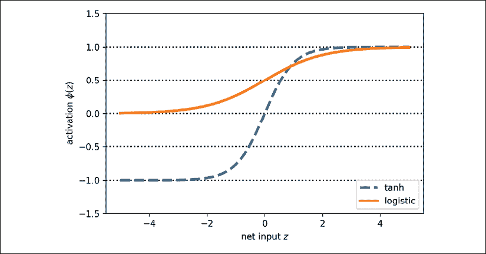

请注意，我们之前为了演示目的详细实现了`logistic`和`tanh`函数。实际上，我们可以使用NumPy的`tanh`函数。

或者，在构建神经网络模型时，我们可以在TensorFlow中使用`tf.keras.activations.tanh()`来实现相同的效果：

```py
>>> np.tanh(z)
array([-0.9999092 , -0.99990829, -0.99990737, ...,  0.99990644,
        0.99990737,  0.99990829])
>>> tf.keras.activations.tanh(z)
<tf.Tensor: id=14, shape=(2000,), dtype=float64, numpy=
array([-0.9999092 , -0.99990829, -0.99990737, ...,  0.99990644,
        0.99990737,  0.99990829])> 
```

此外，逻辑函数可以在SciPy的`special`模块中找到：

```py
>>> from scipy.special import expit
>>> expit(z)
array([0.00669285, 0.00672617, 0.00675966, ..., 0.99320669, 0.99324034,
       0.99327383]) 
```

类似地，我们可以在TensorFlow中使用`tf.keras.activations.sigmoid()`函数进行相同的计算，代码如下：

```py
>>> tf.keras.activations.sigmoid(z)
<tf.Tensor: id=16, shape=(2000,), dtype=float64, numpy=
array([0.00669285, 0.00672617, 0.00675966, ..., 0.99320669, 0.99324034,
       0.99327383])> 
```

## 整流线性单元激活

**整流线性单元**（**ReLU**）是另一个常用于深度神经网络中的激活函数。在深入研究ReLU之前，我们需要回顾一下tanh和逻辑激活函数的梯度消失问题。

为了理解这个问题，我们假设最初我们有净输入 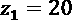，它变化为 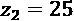。计算 tanh 激活函数后，我们得到 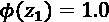 和 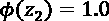，显示输出没有变化（由于 tanh 函数的渐近行为和数值误差）。

这意味着，当 *z* 变得很大时，激活函数对净输入的导数会减小。因此，在训练阶段，学习权重变得非常缓慢，因为梯度项可能非常接近零。ReLU 激活函数解决了这个问题。从数学上讲，ReLU 定义如下：

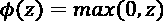

ReLU 仍然是一个非线性函数，适合用神经网络学习复杂的函数。除此之外，ReLU 对其输入的导数对于正输入值始终为 1。因此，它解决了梯度消失的问题，使其适合深度神经网络。在 TensorFlow 中，我们可以如下应用 ReLU 激活函数：

```py
>>> tf.keras.activations.tanh(z)
<tf.Tensor: id=23, shape=(2000,), dtype=float64, numpy=array([0\.   , 0\.   , 0\.   , ..., 4.985, 4.99 , 4.995])> 
```

在下一章中，我们将使用 ReLU 激活函数作为多层卷积神经网络的激活函数。

现在我们了解了更多关于常用的人工神经网络激活函数，让我们通过概述本书中遇到的不同激活函数来总结这一部分：

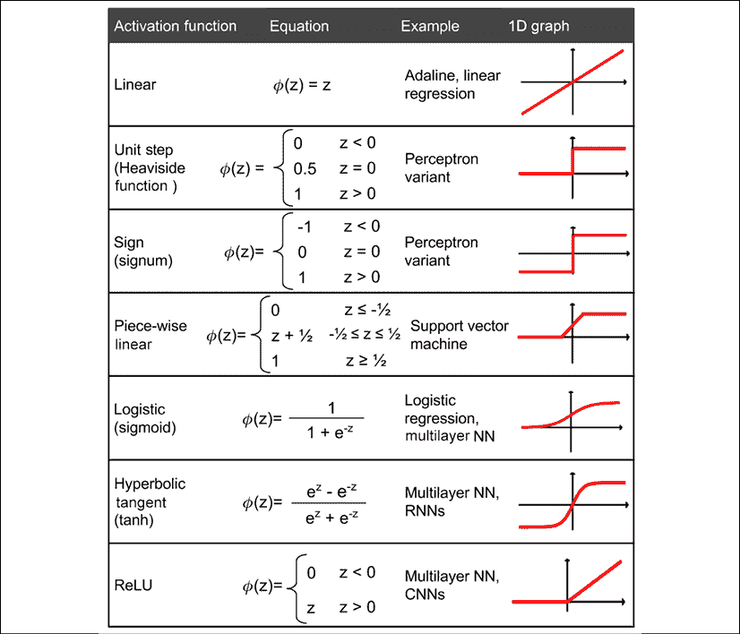

你可以在 [https://www.tensorflow.org/versions/r2.0/api_docs/python/tf/keras/activations](https://www.tensorflow.org/versions/r2.0/api_docs/python/tf/keras/activations) 查找 Keras API 中所有可用的激活函数列表。

# 总结

在本章中，你学习了如何使用 TensorFlow —— 一个开源的数值计算库，特别关注深度学习。虽然 TensorFlow 比 NumPy 更不方便使用，因为它需要额外的复杂性来支持 GPU，但它允许我们非常高效地定义和训练大型多层神经网络。

此外，你还学习了如何使用 TensorFlow Keras API 来构建复杂的机器学习和神经网络模型并高效运行它们。我们通过继承 `tf.keras.Model` 类从零开始定义模型，探索了 TensorFlow 中的模型构建。当我们必须在矩阵-向量乘法的层面编程并定义每个操作的细节时，模型的实现可能会很繁琐。然而，优点是，这使得我们作为开发人员能够将这些基础操作结合起来，构建更复杂的模型。接着，我们探索了 `tf.keras.layers`，它使得构建神经网络模型比从头实现它们要容易得多。

最后，你学习了不同的激活函数，并理解了它们的行为和应用。具体来说，在本章中，我们讨论了 tanh、softmax 和 ReLU。

在下一章，我们将继续我们的旅程，深入探讨 TensorFlow，在那里我们将与 TensorFlow 函数装饰器和 TensorFlow Estimators 一起工作。在这个过程中，你将学习到许多新概念，例如变量和特征列。
