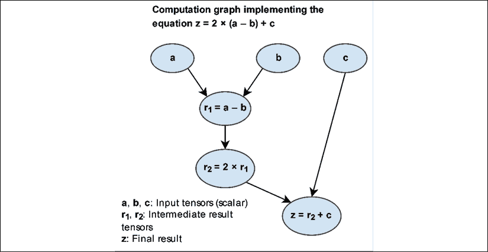
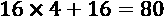
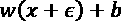
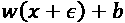
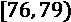

# 第十四章：深入探讨 – TensorFlow 的机制

在 *第 13 章* 中，*使用 TensorFlow 并行化神经网络训练*，我们介绍了如何定义和操作张量，并使用 `tf.data` API 构建输入流水线。我们进一步使用 TensorFlow Keras API (`tf.keras`) 构建和训练了一个多层感知器，以对鸢尾花数据集进行分类。

现在我们已经通过 TensorFlow 神经网络（NN）训练和机器学习有了一些实际经验，是时候深入研究 TensorFlow 库并探索其丰富的功能集了，这将使我们能够在接下来的章节中实现更高级的深度学习模型。

在本章中，我们将使用 TensorFlow API 的不同方面来实现 NNs。特别是，我们将再次使用 Keras API，它提供了多层抽象，使得实现标准架构非常方便。TensorFlow 还允许我们实现自定义 NN 层，这在需要更多定制的研究项目中非常有用。本章后面，我们将实现这样一个自定义层。

为了说明使用 Keras API 构建模型的不同方式，我们还将考虑经典的**异或**（**XOR**）问题。首先，我们将使用 `Sequential` 类构建多层感知器。然后，我们将考虑其他方法，如使用 `tf.keras.Model` 的子类化定义自定义层。最后，我们将介绍 `tf.estimator`，这是一个高级 TensorFlow API，将从原始输入到预测的机器学习步骤封装起来。

我们将涵盖的主题如下：

+   理解和使用 TensorFlow 图以及迁移到 TensorFlow v2

+   图编译的函数装饰

+   使用 TensorFlow 变量

+   解决经典的 XOR 问题并理解模型容量

+   使用 Keras 的 `Model` 类和 Keras 函数式 API 构建复杂的 NN 模型

+   使用自动微分和 `tf.GradientTape` 计算梯度

+   使用 TensorFlow Estimators

# TensorFlow 的关键特性

TensorFlow 为我们提供了一个可扩展的、多平台的编程接口，用于实现和运行机器学习算法。自 2017 年的 1.0 版本发布以来，TensorFlow API 相对稳定和成熟，但在 2019 年的最新 2.0 版本中经历了重大重新设计，本书中我们使用的就是这个版本。

自 2015 年首次发布以来，TensorFlow 已成为最广泛采用的深度学习库。然而，它的一个主要痛点是它是围绕静态计算图构建的。静态计算图具有某些优势，如更好的图优化和支持更广泛的硬件设备；但是，静态计算图需要单独的图声明和图评估步骤，这使得用户难以与 NNs 进行互动式开发和工作。

考虑到所有用户的反馈，TensorFlow 团队决定在 TensorFlow 2.0 中将动态计算图作为默认选项，这使得神经网络的开发和训练更加便捷。在接下来的章节中，我们将介绍从 TensorFlow v1.x 到 v2 的一些重要变化。动态计算图使得图的声明和评估步骤能够交替进行，这使得 TensorFlow 2.0 对于 Python 和 NumPy 用户来说，比起以前的版本更加自然。不过，请注意，TensorFlow 2.0 仍然允许用户通过 `tf.compat` 子模块使用 "旧版" TensorFlow v1.x API。这有助于用户更顺利地将代码库过渡到新的 TensorFlow v2 API。

TensorFlow 的一个关键特性，*第13章*中也提到过，*使用 TensorFlow 并行化神经网络训练*，是它能与单个或多个图形处理单元（GPU）协同工作。这使得用户能够在大型数据集和大规模系统上高效地训练深度学习模型。

虽然 TensorFlow 是一个开源库，任何人都可以自由使用，但其开发由 Google 提供资金支持，并且有一个庞大的软件工程团队在持续扩展和改进该库。由于 TensorFlow 是开源的，它还得到了来自 Google 以外的其他开发者的强大支持，他们热心地贡献代码并提供用户反馈。

这使得 TensorFlow 库对学术研究人员和开发人员都更加有用。这些因素的进一步影响是，TensorFlow 拥有丰富的文档和教程，帮助新用户上手。

最后但同样重要的是，TensorFlow 支持移动端部署，这使得它成为一个非常适合生产环境的工具。

# TensorFlow 的计算图：迁移到 TensorFlow v2

TensorFlow 基于有向无环图（DAG）进行计算。在 TensorFlow v1.x 中，这些图可以在低级 API 中显式定义，尽管对于大型和复杂的模型来说，这并非易事。在这一节中，我们将看到如何为简单的算术计算定义这些图。然后，我们将了解如何将图迁移到 TensorFlow v2，**即时执行**和动态图范式，以及如何通过函数装饰器加速计算。

## 理解计算图

TensorFlow 核心依赖于构建计算图，它利用这个计算图从输入到输出推导张量之间的关系。假设我们有 0 阶（标量）张量 *a*、*b* 和 *c*，并且我们希望计算 。这个计算可以表示为一个计算图，如下图所示：



如您所见，计算图实际上是一个节点网络。每个节点类似于一个操作，它将一个或多个输入张量应用一个函数，并返回一个或多个输出张量。TensorFlow 构建这个计算图并使用它来相应地计算梯度。在接下来的小节中，我们将看到使用 TensorFlow v1.x 和 v2 风格创建计算图的一些示例。

## 在 TensorFlow v1.x 中创建图

在 TensorFlow 较早版本（v1.x）中的低级 API 中，这个图必须显式声明。构建、编译和评估这种计算图的各个步骤如下所示：

1.  实例化一个新的空计算图

1.  向计算图中添加节点（张量和操作）

1.  评估（执行）图：

    1.  启动一个新的 session

    1.  初始化图中的变量

    1.  在此 session 中运行计算图

在我们研究 TensorFlow v2 中的动态方法之前，让我们先看一个简单的例子，说明如何在 TensorFlow v1.x 中创建一个图来评估上图所示的 。变量 *a*、*b* 和 *c* 是标量（单个数字），我们将这些定义为 TensorFlow 常量。然后可以通过调用 `tf.Graph()` 创建一个图。变量和计算代表图的节点，我们将按照以下方式定义它们：

```py
## TF v1.x style
>>> g = tf.Graph()
>>> with g.as_default():
...     a = tf.constant(1, name='a')
...	     b = tf.constant(2, name='b')
...	     c = tf.constant(3, name='c')
...	     z = 2*(a-b) + c 
```

在这段代码中，我们首先通过 `g=tf.Graph()` 定义了图 `g`。然后，我们使用 `with g.as_default()` 向图 `g` 中添加了节点。然而，请注意，如果我们没有显式创建图，总是会有一个默认图，变量和计算将自动添加到这个图中。

在 TensorFlow v1.x 中，session 是一个环境，在这个环境中可以执行图的操作和张量。`Session` 类在 TensorFlow v2 中被移除；然而，目前它仍然可以通过 `tf.compat` 子模块使用，以保持与 TensorFlow v1.x 的兼容性。可以通过调用 `tf.compat.v1.Session()` 创建一个 session 对象，该对象可以接收一个现有的图（这里是 `g`）作为参数，如 `Session(graph=g)`。

在 TensorFlow session 中启动图后，我们可以执行它的节点，也就是说，评估它的张量或执行它的操作符。评估每个独立的张量涉及在当前 session 中调用它的 `eval()` 方法。当评估图中的特定张量时，TensorFlow 必须执行图中的所有前置节点，直到它到达给定的目标节点。如果有一个或多个占位符变量，我们还需要通过 session 的 `run` 方法为这些变量提供值，正如我们稍后在本章中会看到的那样。

```py
z, as follows:
```

```py
## TF v1.x style
>>> with tf.compat.v1.Session(graph=g) as sess:
...     print(Result: z =', sess.run(z))
Result: z = 1 
```

## 将图迁移到 TensorFlow v2

接下来，让我们看看如何将这段代码迁移到 TensorFlow v2。TensorFlow v2 默认使用动态图（与静态图相对）（这也被称为 TensorFlow 中的急切执行），允许我们即时评估一个操作。因此，我们不必显式创建图和会话，这使得开发工作流更加方便：

```py
## TF v2 style
>>> a = tf.constant(1, name='a')
>>> b = tf.constant(2, name='b')
>>> c = tf.constant(3, name='c')
>>> z = 2*(a - b) + c
>>> tf.print('Result: z= ', z)
Result: z = 1 
```

## 将输入数据加载到模型中：TensorFlow v1.x 风格

从 TensorFlow v1.x 到 v2 的另一个重要改进是关于如何将数据加载到模型中。在 TensorFlow v2 中，我们可以直接以 Python 变量或 NumPy 数组的形式提供数据。然而，在使用 TensorFlow v1.x 的低级 API 时，我们必须创建占位符变量来为模型提供输入数据。对于前面的简单计算图示例，，假设 *a*、*b* 和 *c* 是秩 0 的输入张量。我们可以定义三个占位符，然后通过一个名为 `feed_dict` 的字典将数据“输入”到模型中，如下所示：

```py
## TF-v1.x style
>>> g = tf.Graph()
>>> with g.as_default():
...     a = tf.compat.v1.placeholder(shape=None,
...                                  dtype=tf.int32, name='tf_a')
...     b = tf.compat.v1.placeholder(shape=None,
...                                  dtype=tf.int32, name='tf_b')
...     c = tf.compat.v1.placeholder(shape=None,
...                                  dtype=tf.int32, name='tf_c')
...     z = 2*(a-b) + c
>>> with tf.compat.v1.Session(graph=g) as sess:
...     feed_dict={a:1, b:2, c:3}
...     print('Result: z =', sess.run(z, feed_dict=feed_dict))
Result: z = 1 
```

## 将输入数据加载到模型中：TensorFlow v2 风格

在 TensorFlow v2 中，所有这些操作可以简单地通过*定义一个普通的 Python 函数*，将 `a`、`b` 和 `c` 作为输入参数来完成，例如：

```py
## TF-v2 style
>>> def compute_z(a, b, c):
...     r1 = tf.subtract(a, b)
...     r2 = tf.multiply(2, r1)
...     z = tf.add(r2, c)
...     return z 
```

现在，为了执行计算，我们只需将`Tensor`对象作为函数参数调用此函数。请注意，TensorFlow 函数如 `add`、`subtract` 和 `multiply` 也允许我们以 TensorFlow `Tensor` 对象、NumPy 数组或其他 Python 对象（如列表和元组）的形式提供更高秩的输入。在下面的代码示例中，我们提供了标量输入（秩 0），以及秩 1 和秩 2 的输入，这些输入以列表的形式提供：

```py
>>> tf.print('Scalar Inputs:', compute_z(1, 2, 3))
Scalar Inputs: 1
>>> tf.print('Rank 1 Inputs:', compute_z([1], [2], [3]))
Rank 1 Inputs: [1]
>>> tf.print('Rank 2 Inputs:', compute_z([[1]], [[2]], [[3]]))
Rank 2 Inputs: [[1]] 
```

在本节中，您看到如何通过避免显式创建图和会话的步骤，迁移到 TensorFlow v2 使编程风格变得简单高效。现在，我们已经了解了 TensorFlow v1.x 与 TensorFlow v2 的比较，接下来我们将专注于 TensorFlow v2，在本书的剩余部分，我们将更深入地探讨如何将 Python 函数装饰成一个图，以便实现更快速的计算。

## 使用函数装饰器提高计算性能

如前一节所示，我们可以轻松编写一个普通的 Python 函数并利用 TensorFlow 操作。然而，通过动态执行（动态图）模式进行的计算效率不如 TensorFlow v1.x 中的静态图执行。因此，TensorFlow v2 提供了一种名为 AutoGraph 的工具，它可以自动将 Python 代码转换为 TensorFlow 的图代码，从而实现更快的执行。此外，TensorFlow 还提供了一种简单的机制，将普通的 Python 函数编译为静态 TensorFlow 图，以提高计算效率。

为了看看这如何在实际中工作，让我们用之前的 `compute_z` 函数并为其添加注解，以便使用 `@tf.function` 装饰器进行图编译：

```py
>>> @tf.function
... def compute_z(a, b, c):
...     r1 = tf.subtract(a, b)
...     r2 = tf.multiply(2, r1)
...     z = tf.add(r2, c)
...     return z 
```

请注意，我们可以像以前一样使用和调用此函数，但现在 TensorFlow 将根据输入参数构建一个静态图。Python 支持动态类型和多态性，因此我们可以定义一个函数，如 `def f(a, b): return a+b`，然后使用整数、浮动、列表或字符串作为输入来调用它（回顾一下，`a+b` 是一个有效的列表和字符串操作）。虽然 TensorFlow 图需要静态类型和形状，`tf.function` 支持这种动态类型能力。例如，让我们使用以下输入调用此函数：

```py
>>> tf.print('Scalar Inputs:', compute_z(1, 2, 3))
>>> tf.print('Rank 1 Inputs:', compute_z([1], [2], [3]))
>>> tf.print('Rank 2 Inputs:', compute_z([[1]], [[2]], [[3]])) 
```

这将产生与之前相同的输出。在这里，TensorFlow 使用跟踪机制根据输入参数构建图。对于这个跟踪机制，TensorFlow 会基于调用函数时提供的输入签名生成一个键的元组。生成的键如下所示：

+   对于 `tf.Tensor` 参数，键是基于它们的形状和数据类型的。

+   对于 Python 类型，例如列表，它们的 `id()` 被用来生成缓存键。

+   对于 Python 原始值，缓存键是基于输入值的。

调用这样的装饰函数时，TensorFlow 会检查是否已经生成了具有相应键的图。如果该图不存在，TensorFlow 会生成一个新图并存储新的键。另一方面，如果我们希望限制函数的调用方式，我们可以在定义函数时通过一组 `tf.TensorSpec` 对象指定其输入签名。例如，让我们重新定义之前的函数 `compute_z`，并指定只允许秩为 1 的 `tf.int32` 类型张量：

```py
>>> @tf.function(input_signature=(tf.TensorSpec(shape=[None],
...                                             dtype=tf.int32),
...                               tf.TensorSpec(shape=[None],
...                                             dtype=tf.int32),
...                               tf.TensorSpec(shape=[None],
...                                             dtype=tf.int32),))
... def compute_z(a, b, c):
...     r1 = tf.subtract(a, b)
...     r2 = tf.multiply(2, r1)
...     z = tf.add(r2, c)
...     return z 
```

现在，我们可以使用秩为 1 的张量（或可以转换为秩 1 张量的列表）来调用此函数：

```py
>>> tf.print('Rank 1 Inputs:', compute_z([1], [2], [3]))
>>> tf.print('Rank 1 Inputs:', compute_z([1, 2], [2, 4], [3, 6])) 
```

然而，使用秩不为 1 的张量调用此函数将导致错误，因为秩将与指定的输入签名不匹配，具体如下：

```py
>>> tf.print('Rank 0 Inputs:', compute_z(1, 2, 3)
### will result in error
>>> tf.print('Rank 2 Inputs:', compute_z([[1], [2]],
...                                      [[2], [4]],
...                                      [[3], [6]]))
### will result in error 
```

在本节中，我们学习了如何注解一个普通的 Python 函数，以便 TensorFlow 会将其编译成图以加速执行。接下来，我们将了解 TensorFlow 变量：如何创建它们以及如何使用它们。

# 用于存储和更新模型参数的 TensorFlow 变量对象

我们在*第 13 章*《使用 TensorFlow 并行训练神经网络》中讲解了 `Tensor` 对象。在 TensorFlow 中，`Variable` 是一个特殊的 `Tensor` 对象，允许我们在训练过程中存储和更新模型的参数。通过调用 `tf.Variable` 类并传入用户指定的初始值，可以创建一个 `Variable`。在下面的代码中，我们将生成 `float32`、`int32`、`bool` 和 `string` 类型的 `Variable` 对象：

```py
>>> a = tf.Variable(initial_value=3.14, name='var_a')
>>> print(a)
<tf.Variable 'var_a:0' shape=() dtype=float32, numpy=3.14>
>>> b = tf.Variable(initial_value=[1, 2, 3], name='var_b')
>>> print(b)
<tf.Variable 'var_b:0' shape=(3,) dtype=int32, numpy=array([1, 2, 3], dtype=int32)>
>>> c = tf.Variable(initial_value=[True, False], dtype=tf.bool)
>>> print(c)
<tf.Variable 'Variable:0' shape=(2,) dtype=bool, numpy=array([ True, False])>
>>> d = tf.Variable(initial_value=['abc'], dtype=tf.string)
>>> print(d)
<tf.Variable 'Variable:0' shape=(1,) dtype=string, numpy=array([b'abc'], dtype=object)> 
```

注意，我们在创建 `Variable` 时总是需要提供初始值。变量有一个名为 `trainable` 的属性，默认值为 `True`。像 Keras 这样的高级 API 将使用此属性来管理可训练变量和不可训练变量。你可以如下定义一个不可训练的 `Variable`：

```py
>>> w = tf.Variable([1, 2, 3], trainable=False)
>>> print(w.trainable)
False 
```

`Variable`的值可以通过执行一些操作，如`.assign()`、`.assign_add()`和相关方法来高效修改。让我们来看一些例子：

```py
>>> print(w.assign([3, 1, 4], read_value=True))
<tf.Variable 'UnreadVariable' shape=(3,) dtype=int32, numpy=array(
[3, 1, 4], dtype=int32)>
>>> w.assign_add([2, -1, 2], read_value=False)
>>> print(w.value())
tf.Tensor([5 0 6], shape=(3,), dtype=int32) 
```

当`read_value`参数设置为`True`（这也是默认值）时，这些操作会在更新`Variable`的当前值后自动返回新值。将`read_value`设置为`False`将抑制更新值的自动返回（但`Variable`仍然会就地更新）。调用`w.value()`将返回张量格式的值。请注意，在赋值期间，我们不能更改`Variable`的形状或类型。

你可能还记得，对于神经网络模型，使用随机权重初始化模型参数是必要的，以便在反向传播过程中打破对称性——否则，多层神经网络将和单层神经网络（例如逻辑回归）一样没有意义。在创建TensorFlow的`Variable`时，我们也可以使用随机初始化方案。TensorFlow可以通过`tf.random`基于多种分布生成随机数（请参见[https://www.tensorflow.org/versions/r2.0/api_docs/python/tf/random](https://www.tensorflow.org/versions/r2.0/api_docs/python/tf/random)）。在以下示例中，我们将查看Keras中也可用的一些标准初始化方法（请参见[https://www.tensorflow.org/versions/r2.0/api_docs/python/tf/keras/initializers](https://www.tensorflow.org/versions/r2.0/api_docs/python/tf/keras/initializers)）。

那么，接下来我们来看一下如何使用Glorot初始化创建一个`Variable`，这是一种经典的随机初始化方案，由Xavier Glorot和Yoshua Bengio提出。为此，我们创建一个名为`init`的操作符，作为`GlorotNormal`类的对象。然后，我们调用这个操作符并提供所需输出张量的形状：

```py
>>> tf.random.set_seed(1)
>>> init = tf.keras.initializers.GlorotNormal()
>>> tf.print(init(shape=(3,)))
[-0.722795904 1.01456821 0.251808226] 
```

现在，我们可以使用这个操作符来初始化形状为的`Variable`：

```py
>>> v = tf.Variable(init(shape=(2, 3)))
>>> tf.print(v)
[[0.28982234 -0.782292783 -0.0453658961]
 [0.960991383 -0.120003454 0.708528221]] 
```

**Xavier（或Glorot）初始化**

在深度学习的早期发展中，人们观察到随机均匀或随机正态权重初始化往往会导致模型在训练期间性能不佳。

在2010年，Glorot和Bengio研究了初始化的效果，并提出了一种新的、更稳健的初始化方案，以促进深度网络的训练。Xavier初始化的基本思想是大致平衡不同层之间的梯度方差。否则，一些层可能在训练中获得过多关注，而其他层则滞后。

根据Glorot和Bengio的研究论文，如果我们想要从均匀分布初始化权重，我们应该选择以下均匀分布的区间：


在这里， 是乘以权重的输入神经元数量， 是传递到下一层的输出神经元数量。为了从高斯（正态）分布初始化权重，建议选择此高斯分布的标准差为 。

TensorFlow 支持 Xavier 初始化，既可以使用均匀分布，也可以使用正态分布的权重。

关于 Glorot 和 Bengio 的初始化方案的更多信息，包括数学推导和证明，请阅读他们的原始论文（*理解深度前馈神经网络的困难*，*Xavier Glorot* 和 *Yoshua Bengio*，2010），该论文可以免费在 [http://proceedings.mlr.press/v9/glorot10a/glorot10a.pdf](http://proceedings.mlr.press/v9/glorot10a/glorot10a.pdf) 获取。

现在，为了将其置于更实际的用例上下文中，让我们看看如何在基础的 `tf.Module` 类中定义 `Variable`。我们将定义两个变量：一个是可训练的，另一个是不可训练的：

```py
>>> class MyModule(tf.Module):
...     def __init__(self):
...         init = tf.keras.initializers.GlorotNormal()
...         self.w1 = tf.Variable(init(shape=(2, 3)),
...                               trainable=True)
...         self.w2 = tf.Variable(init(shape=(1, 2)),
...                               trainable=False)
>>> m = MyModule()
>>> print('All module variables:', [v.shape for v in m.variables])
All module variables: [TensorShape([2, 3]), TensorShape([1, 2])]
>>> print('Trainable variable:', [v.shape for v in
...                               m.trainable_variables])
Trainable variable: [TensorShape([2, 3])] 
```

正如你在这个代码示例中看到的，子类化 `tf.Module` 类使我们可以通过 `.variables` 属性直接访问给定对象（这里是我们自定义的 `MyModule` 类的实例）中定义的所有变量。

最后，让我们来看一下在装饰有 `tf.function` 的函数中使用变量。当我们在普通函数（未装饰）中定义一个 TensorFlow `Variable` 时，我们可能会预期每次调用该函数时都会创建并初始化一个新的 `Variable`。然而，`tf.function` 会基于追踪和图的创建尝试重用 `Variable`。因此，TensorFlow 不允许在装饰的函数内部创建 `Variable`，因此，以下代码将引发错误：

```py
>>> @tf.function
... def f(x):
...     w = tf.Variable([1, 2, 3])
>>> f([1])
ValueError: tf.function-decorated function tried to create variables on non-first call. 
```

避免此问题的一种方法是将 `Variable` 定义在装饰的函数外部，并在函数内部使用它：

```py
>>> w = tf.Variable(tf.random.uniform((3, 3)))
>>> @tf.function
... def compute_z(x):
...     return tf.matmul(w, x)
>>> x = tf.constant([[1], [2], [3]], dtype=tf.float32)
>>> tf.print(compute_z(x)) 
```

# 通过自动微分和 GradientTape 计算梯度

正如你已经知道的，优化神经网络（NN）需要计算成本函数相对于神经网络权重的梯度。这是优化算法（如随机梯度下降（SGD））所必需的。此外，梯度还有其他应用，如诊断网络，找出为什么神经网络模型会对某个测试样本做出特定的预测。因此，在本节中，我们将讨论如何计算某些变量相对于计算的梯度。

## 计算损失相对于可训练变量的梯度

TensorFlow 支持 *自动微分*，它可以看作是计算嵌套函数梯度的 *链式法则* 的实现。当我们定义一系列操作，得到某个输出甚至中间张量时，TensorFlow 提供了一个计算这些张量梯度的上下文，这些梯度是相对于计算图中的依赖节点计算的。为了计算这些梯度，我们需要通过 `tf.GradientTape` 来“记录”这些计算。

让我们通过一个简单的例子来计算！[](img/B13208_14_009.png)，并将损失定义为目标与预测之间的平方损失，。在更一般的情况下，当我们可能有多个预测和目标时，我们将损失计算为平方误差的和，。为了在 TensorFlow 中实现这个计算，我们将定义模型参数，*w* 和 *b*，作为变量，而输入 *x* 和 *y* 作为张量。我们将在 `tf.GradientTape` 上下文中进行 *z* 和损失的计算：

```py
>>> w = tf.Variable(1.0)
>>> b = tf.Variable(0.5)
>>> print(w.trainable, b.trainable)
True True
>>> x = tf.convert_to_tensor([1.4])
>>> y = tf.convert_to_tensor([2.1])
>>> with tf.GradientTape() as tape:
...     z = tf.add(tf.multiply(w, x), b)
...     loss = tf.reduce_sum(tf.square(y – z))
>>> dloss_dw = tape.gradient(loss, w)
>>> tf.print('dL/dw:', dloss_dw)
dL/dw: -0.559999764 
```

在计算 *z* 的值时，我们可以将需要的操作（我们已记录到“梯度带”中）视为神经网络中的前向传播。我们使用 `tape.gradient` 来计算 。由于这是一个非常简单的例子，我们可以象征性地获得导数，，以验证计算出的梯度是否与我们在前面的代码示例中得到的结果一致：

```py
# verifying the computed gradient
>>> tf.print(2*x*(w*x+b-y))
[-0.559999764] 
```

**理解自动微分**

自动微分代表了一组计算技术，用于计算任意算术操作的导数或梯度。在这个过程中，通过重复应用链式法则来积累梯度，从而得到计算（表示为一系列操作）的梯度。为了更好地理解自动微分的概念，让我们考虑一系列计算，，其中输入为 *x*，输出为 *y*。这可以分解为以下几个步骤：

+   

+   

+   

+   

导数  可以通过两种不同的方式计算：前向积累，从  开始，和反向积累，从  开始。请注意，TensorFlow 使用的是后者，即反向积累。

## 计算相对于不可训练张量的梯度

`tf.GradientTape` 自动支持可训练变量的梯度。但是，对于不可训练变量和其他 `Tensor` 对象，我们需要对 `GradientTape` 进行额外修改，称为 `tape.watch()`，以便监视它们。例如，如果我们想计算 ，代码如下：

```py
>>> with tf.GradientTape() as tape:
...     tape.watch(x)
...     z = tf.add(tf.multiply(w, x), b)
...     loss = tf.reduce_sum(tf.square(y - z))
>>> dloss_dx = tape.gradient(loss, x)
>>> tf.print('dL/dx:', dloss_dx)
dL/dx: [-0.399999857] 
```

**对抗样本**

计算损失相对于输入示例的梯度用于生成*对抗样本*（或*对抗攻击*）。在计算机视觉中，对抗样本是通过向输入示例添加一些微小但不可察觉的噪音（或扰动）而生成的示例，这导致深度神经网络对其进行错误分类。覆盖对抗样本超出了本书的范围，但如果您感兴趣，可以在Christian Szegedy等人撰写的原始论文《神经网络的有趣性质》中找到，标题为*Intriguing properties of neural networks*，网址为[https://arxiv.org/pdf/1312.6199.pdf](https://arxiv.org/pdf/1312.6199.pdf)。

## 保持多个梯度计算的资源

当我们在`tf.GradientTape`的上下文中监视计算时，默认情况下，磁带将仅保留单次梯度计算的资源。例如，调用一次`tape.gradient()`后，资源将被释放并清除磁带。因此，如果我们要计算多个梯度，例如，和，我们需要使磁带持久化：

```py
>>> with tf.GradientTape(persistent=True) as tape:
...     z = tf.add(tf.multiply(w, x), b)
...     loss = tf.reduce_sum(tf.square(y – z))
>>> dloss_dw = tape.gradient(loss, w)
>>> tf.print('dL/dw:', dloss_dw)
dL/dw: -0.559999764
>>> dloss_db = tape.gradient(loss, b)
>>> tf.print('dL/db:', dloss_db)
dL/db: -0.399999857 
```

但是，请记住，这仅在我们想要计算多个梯度时才需要，因为记录并保留梯度磁带比在单次梯度计算后释放内存不那么内存高效。这也是为什么默认设置为`persistent=False`的原因。

最后，如果我们正在计算损失项相对于模型参数的梯度，我们可以定义一个优化器，并使用`tf.keras` API应用梯度来优化模型参数，如下所示：

```py
>>> optimizer = tf.keras.optimizers.SGD()
>>> optimizer.apply_gradients(zip([dloss_dw, dloss_db], [w, b]))
>>> tf.print('Updated w:', w)
Updated w: 1.0056
>>> tf.print('Updated bias:', b)
Updated bias: 0.504 
```

你会记得初始权重和偏置单元分别为*w* = 1.0和*b* = 0.5，应用于损失相对于模型参数的梯度后，模型参数变为*w* = 1.0056和*b* = 0.504。

# 通过Keras API简化常见架构的实现

你已经看到了构建前馈神经网络模型的一些示例（例如，多层感知器），并使用Keras的`Sequential`类定义了一系列层。在我们探讨配置这些层的不同方法之前，让我们简要回顾一下通过构建一个具有两个全连接层的模型的基本步骤：

```py
>>> model = tf.keras.Sequential()
>>> model.add(tf.keras.layers.Dense(units=16, activation='relu'))
>>> model.add(tf.keras.layers.Dense(units=32, activation='relu'))
>>> ## late variable creation
>>> model.build(input_shape=(None, 4))
>>> model.summary()
Model: "sequential"
_________________________________________________________________
Layer (type)                 Output Shape              Param #   
=================================================================
dense (Dense)                multiple                  80        
_________________________________________________________________
dense_1 (Dense)              multiple                  544       
=================================================================
Total params: 624
Trainable params: 624
Non-trainable params: 0
_________________________________________________________________ 
```

我们使用`model.build()`指定了输入形状，在为该特定形状定义模型后实例化变量。每层的参数数量显示如下：是第一层，是第二层。一旦创建变量（或模型参数），我们可以访问可训练和不可训练变量如下：

```py
>>> ## printing variables of the model
>>> for v in model.variables:
...     print('{:20s}'.format(v.name), v.trainable, v.shape)
dense/kernel:0       True (4, 16)
dense/bias:0         True (16,)
dense_1/kernel:0     True (16, 32)
dense_1/bias:0       True (32,) 
```

在这种情况下，每个层都有一个称为`kernel`的权重矩阵以及一个偏置向量。

接下来，让我们配置这些层，例如，通过为参数应用不同的激活函数、变量初始化器或正则化方法。这些类别的所有可用选项的完整列表可以在官方文档中找到：

+   通过 `tf.keras.activations` 选择激活函数：[https://www.tensorflow.org/versions/r2.0/api_docs/python/tf/keras/activations](https://www.tensorflow.org/versions/r2.0/api_docs/python/tf/keras/activations)

+   通过 `tf.keras.initializers` 初始化层参数：[https://www.tensorflow.org/versions/r2.0/api_docs/python/tf/keras/initializers](https://www.tensorflow.org/versions/r2.0/api_docs/python/tf/keras/initializers)

+   通过 `tf.keras.regularizers` 将正则化应用于层参数（以防止过拟合）：[https://www.tensorflow.org/versions/r2.0/api_docs/python/tf/keras/regularizers](https://www.tensorflow.org/versions/r2.0/api_docs/python/tf/keras/regularizers)

在下面的代码示例中，我们将通过为内核和偏差变量指定初始化器来配置第一层。然后，我们将通过为内核（权重矩阵）指定 L1 正则化器来配置第二层：

```py
>>> model = tf.keras.Sequential()
>>> model.add(
...     tf.keras.layers.Dense(
...         units=16,
...         activation=tf.keras.activations.relu,
...         kernel_initializer= \
...             tf.keras.initializers.glorot_uniform(),
...         bias_initializer=tf.keras.initializers.Constant(2.0)
...     ))
>>> model.add(
...     tf.keras.layers.Dense(
...         units=32,
...         activation=tf.keras.activations.sigmoid,
...         kernel_regularizer=tf.keras.regularizers.l1
...     )) 
```

此外，除了配置单独的层，我们还可以在编译模型时对其进行配置。我们可以为训练指定优化器的类型和损失函数，以及为报告训练、验证和测试数据集的性能指定哪些指标。再次提醒，所有可用选项的完整列表可以在官方文档中找到：

+   通过 `tf.keras.optimizers` 获取优化器：[https://www.tensorflow.org/versions/r2.0/api_docs/python/tf/keras/optimizers](https://www.tensorflow.org/versions/r2.0/api_docs/python/tf/keras/optimizers)

+   通过 `tf.keras.losses` 获取损失函数：[https://www.tensorflow.org/versions/r2.0/api_docs/python/tf/keras/losses](https://www.tensorflow.org/versions/r2.0/api_docs/python/tf/keras/losses)

+   通过 `tf.keras.metrics` 获取性能指标：[https://www.tensorflow.org/versions/r2.0/api_docs/python/tf/keras/metrics](https://www.tensorflow.org/versions/r2.0/api_docs/python/tf/keras/metrics)

**选择损失函数**

关于优化算法的选择，SGD 和 Adam 是最广泛使用的方法。损失函数的选择取决于任务；例如，对于回归问题，您可能会使用均方误差损失函数。

交叉熵损失函数家族为分类任务提供了可能的选择，这些内容在*第 15 章*《使用深度卷积神经网络进行图像分类》中有广泛讨论。

此外，你可以使用在前几章学到的技巧（例如，*第 6 章：模型评估的最佳实践与超参数调优* 中的模型评估技巧），结合问题的适当评估指标。例如，精度、召回率、准确率、曲线下面积（AUC），以及假阴性和假阳性评分，都是评估分类模型的适当指标。

在这个示例中，我们将使用 SGD 优化器、交叉熵损失（适用于二分类）和一系列特定的评估指标来编译模型，其中包括准确率、精度和召回率：

```py
>>> model.compile(
...     optimizer=tf.keras.optimizers.SGD(learning_rate=0.001),
...     loss=tf.keras.losses.BinaryCrossentropy(),
...     metrics=[tf.keras.metrics.Accuracy(),
...              tf.keras.metrics.Precision(),
...              tf.keras.metrics.Recall(),]) 
```

当我们通过调用 `model.fit(...)` 来训练这个模型时，将返回包含损失值和指定评估指标的历史记录（如果使用了验证数据集），这些信息可以帮助诊断学习行为。

接下来，我们将看一个更实际的例子：使用 Keras API 解决经典的 XOR 分类问题。首先，我们将使用 `tf.keras.Sequential()` 类构建模型。在这个过程中，你还将了解模型处理非线性决策边界的能力。然后，我们将介绍其他构建模型的方式，这些方式将为我们提供更多的灵活性和对网络层的控制。

## 解决 XOR 分类问题

XOR 分类问题是分析模型捕捉两个类别之间非线性决策边界能力的经典问题。我们生成了一个包含 200 个训练示例的玩具数据集，具有两个特征 ，这些特征是从  之间的均匀分布中抽取的。然后，我们根据以下规则为训练示例 *i* 分配真实标签：


我们将使用一半的数据（100 个训练示例）用于训练，另一半用于验证。生成数据并将其拆分为训练集和验证集的代码如下：

```py
>>> import tensorflow as tf
>>> import numpy as np
>>> import matplotlib.pyplot as plt
>>> tf.random.set_seed(1)
>>> np.random.seed(1)
>>> x = np.random.uniform(low=-1, high=1, size=(200, 2))
>>> y = np.ones(len(x))
>>> y[x[:, 0] * x[:, 1]<0] = 0
>>> x_train = x[:100, :]
>>> y_train = y[:100]
>>> x_valid = x[100:, :]
>>> y_valid = y[100:]
>>> fig = plt.figure(figsize=(6, 6))
>>> plt.plot(x[y==0, 0],
...          x[y==0, 1], 'o', alpha=0.75, markersize=10)
>>> plt.plot(x[y==1, 0],
...          x[y==1, 1], '<', alpha=0.75, markersize=10)
>>> plt.xlabel(r'$x_1$', size=15)
>>> plt.ylabel(r'$x_2$', size=15)
>>> plt.show() 
```

代码的结果是以下散点图，展示了不同类别标签的训练和验证示例，且根据其类别标签使用不同的标记表示：


在上一小节中，我们介绍了在 TensorFlow 中实现分类器所需的基本工具。现在，我们需要决定应该选择什么架构来处理此任务和数据集。作为一个一般规则，层数越多，每层神经元数量越多，模型的容量就越大。在这里，模型容量可以看作是衡量模型如何轻松逼近复杂函数的一个标准。尽管更多的参数意味着网络能够拟合更复杂的函数，但较大的模型通常更难训练（并且容易过拟合）。实际上，最好从一个简单的模型开始作为基线，例如，像逻辑回归这样的单层神经网络（NN）：

```py
>>> model = tf.keras.Sequential()
>>> model.add(tf.keras.layers.Dense(units=1,
...                                 input_shape=(2,),
...                                 activation='sigmoid'))
>>> model.summary()
Model: "sequential"
_________________________________________________________________
Layer (type)                 Output Shape              Param #   
=================================================================
dense (Dense)                (None, 1)                 3         
=================================================================
Total params: 3
Trainable params: 3
Non-trainable params: 0
_________________________________________________________________ 
```

这个简单的逻辑回归模型的参数总大小为3：一个大小为  的权重矩阵（或内核）和一个大小为1的偏置向量。定义好模型后，我们将编译模型，并用批量大小为2训练200个周期：

```py
>>> model.compile(optimizer=tf.keras.optimizers.SGD(),
...               loss=tf.keras.losses.BinaryCrossentropy(),
...               metrics=[tf.keras.metrics.BinaryAccuracy()])
>>> hist = model.fit(x_train, y_train,
...                  validation_data=(x_valid, y_valid),
...                  epochs=200, batch_size=2, verbose=0) 
```

注意，`model.fit()`返回的是训练周期的历史记录，这对于训练后进行可视化检查非常有用。在以下代码中，我们将绘制学习曲线，包括训练损失、验证损失及其准确率。

我们还将使用MLxtend库来可视化验证数据和决策边界。

可以通过`conda`或`pip`安装MLxtend，如下所示：

```py
conda install mlxtend -c conda-forge
pip install mlxtend 
```

以下代码将绘制训练表现以及决策区域的偏差：

```py
>>> from mlxtend.plotting import plot_decision_regions
>>> history = hist.history
>>> fig = plt.figure(figsize=(16, 4))
>>> ax = fig.add_subplot(1, 3, 1)
>>> plt.plot(history['loss'], lw=4)
>>> plt.plot(history['val_loss'], lw=4)
>>> plt.legend(['Train loss', 'Validation loss'], fontsize=15)
>>> ax.set_xlabel('Epochs', size=15)
>>> ax = fig.add_subplot(1, 3, 2)
>>> plt.plot(history['binary_accuracy'], lw=4)
>>> plt.plot(history['val_binary_accuracy'], lw=4)
>>> plt.legend(['Train Acc.', 'Validation Acc.'], fontsize=15)
>>> ax.set_xlabel('Epochs', size=15)
>>> ax = fig.add_subplot(1, 3, 3)
>>> plot_decision_regions(X=x_valid, y=y_valid.astype(np.integer),
...                       clf=model)
>>> ax.set_xlabel(r'$x_1$', size=15)
>>> ax.xaxis.set_label_coords(1, -0.025)
>>> ax.set_ylabel(r'$x_2$', size=15)
>>> ax.yaxis.set_label_coords(-0.025, 1)
>>> plt.show() 
```

这将产生以下图形，展示了损失、准确率以及验证示例的散点图，同时包括决策边界：


如你所见，一个没有隐藏层的简单模型只能得出一个线性决策边界，无法解决XOR问题。因此，我们可以观察到训练集和验证集的损失值都非常高，分类准确率也很低。

为了得出非线性决策边界，我们可以添加一个或多个通过非线性激活函数连接的隐藏层。通用逼近定理指出，一个具有单个隐藏层和相对较多隐藏单元的前馈神经网络（NN）可以相对较好地逼近任意连续函数。因此，解决XOR问题的一种更令人满意的方法是添加一个隐藏层，并比较不同数量的隐藏单元，直到我们在验证集上观察到满意的结果。添加更多隐藏单元相当于增加一个层的宽度。

或者，我们也可以添加更多的隐藏层，这将使模型更深。使网络更深而不是更宽的优势在于，达到相当的模型容量所需的参数较少。然而，深度（与宽度）模型的一个缺点是，深度模型容易出现梯度消失和爆炸问题，这使得它们更难训练。

作为一个练习，尝试添加一、二、三和四个隐藏层，每个层包含四个隐藏单元。在以下示例中，我们将查看具有三个隐藏层的前馈神经网络（NN）结果：

```py
>>> tf.random.set_seed(1)
>>> model = tf.keras.Sequential()
>>> model.add(tf.keras.layers.Dense(units=4, input_shape=(2,),
...                                 activation='relu'))
>>> model.add(tf.keras.layers.Dense(units=4, activation='relu'))
>>> model.add(tf.keras.layers.Dense(units=4, activation='relu'))
>>> model.add(tf.keras.layers.Dense(units=1, activation='sigmoid'))
>>> model.summary()
Model: "sequential_4"
_________________________________________________________________
Layer (type)                 Output Shape              Param #   
=================================================================
dense_11 (Dense)             (None, 4)                 12        
_________________________________________________________________
dense_12 (Dense)             (None, 4)                 20        
_________________________________________________________________
dense_13 (Dense)             (None, 4)                 20        
_________________________________________________________________
dense_14 (Dense)             (None, 1)                 5         
=================================================================
Total params: 57
Trainable params: 57
Non-trainable params: 0
_________________________________________________________________
>>> ## compile:
>>> model.compile(optimizer=tf.keras.optimizers.SGD(),
...               loss=tf.keras.losses.BinaryCrossentropy(),
...               metrics=[tf.keras.metrics.BinaryAccuracy()])
>>> ## train:
>>> hist = model.fit(x_train, y_train,
...                  validation_data=(x_valid, y_valid),
...                  epochs=200, batch_size=2, verbose=0) 
```

我们可以重复前面的代码进行可视化，得到以下结果：


现在，我们可以看到模型能够为这些数据得出一个非线性的决策边界，并且该模型在训练集上的准确率达到了100%。验证集的准确率为95%，这表明模型有轻微的过拟合现象。

## 使用Keras的函数式API让模型构建更具灵活性

在之前的示例中，我们使用了 Keras 的 `Sequential` 类来创建一个具有多层的全连接神经网络（NN）。这是一种非常常见且便捷的构建模型的方式。然而，它不允许我们创建具有多个输入、输出或中间分支的更复杂模型。在这种情况下，Keras 的所谓功能性 API 就显得非常有用。

为了说明如何使用功能性 API，我们将实现与上一节中使用面向对象（`Sequential`）方法构建的相同架构；不过这次我们将使用功能性方法。在这种方法中，我们首先指定输入。然后，构建隐藏层，并将它们的输出命名为 `h1`、`h2` 和 `h3`。对于这个问题，我们将每一层的输出作为下一层的输入（注意，如果你正在构建更复杂的模型，有多个分支，这种方法可能不适用，但通过功能性 API 仍然可以做到）。最后，我们指定输出为接收 `h3` 作为输入的最终全连接层。代码如下：

```py
>>> tf.random.set_seed(1)
>>> ## input layer:
>>> inputs = tf.keras.Input(shape=(2,))
>>> ## hidden layers
>>> h1 = tf.keras.layers.Dense(units=4, activation='relu')(inputs)
>>> h2 = tf.keras.layers.Dense(units=4, activation='relu')(h1)
>>> h3 = tf.keras.layers.Dense(units=4, activation='relu')(h2)
>>> ## output:
>>> outputs = tf.keras.layers.Dense(units=1, activation='sigmoid')(h3)
>>> ## construct a model:
>>> model = tf.keras.Model(inputs=inputs, outputs=outputs)
>>> model.summary() 
```

编译和训练该模型与我们之前做的类似：

```py
>>> ## compile:
>>> model.compile(
...     optimizer=tf.keras.optimizers.SGD(),
...     loss=tf.keras.losses.BinaryCrossentropy(),
...     metrics=[tf.keras.metrics.BinaryAccuracy()])
>>> ## train:
>>> hist = model.fit(
...     x_train, y_train,
...     validation_data=(x_valid, y_valid),
...     epochs=200, batch_size=2, verbose=0) 
```

## 基于 Keras 的 Model 类实现模型

构建复杂模型的另一种方式是通过子类化 `tf.keras.Model`。在这种方法中，我们创建一个从 `tf.keras.Model` 派生的新类，并将 `__init__()` 函数定义为构造函数。`call()` 方法用于指定前向传播。在构造函数 `__init__()` 中，我们将层定义为类的属性，以便通过 `self` 引用访问它们。然后，在 `call()` 方法中，我们指定这些层如何在神经网络的前向传播中使用。定义实现前面模型的新类的代码如下：

```py
>>> class MyModel(tf.keras.Model):
...     def __init__(self):
...         super(MyModel, self).__init__()
...         self.hidden_1 = tf.keras.layers.Dense(
...             units=4, activation='relu')
...         self.hidden_2 = tf.keras.layers.Dense(
...             units=4, activation='relu')
...         self.hidden_3 = tf.keras.layers.Dense(
...             units=4, activation='relu')
...         self.output_layer = tf.keras.layers.Dense(
...             units=1, activation='sigmoid')
...         
...     def call(self, inputs):
...         h = self.hidden_1(inputs)
...         h = self.hidden_2(h)
...         h = self.hidden_3(h)
...         return self.output_layer(h) 
```

注意，我们为所有隐藏层使用了相同的输出名称 `h`。这样使得代码更加可读和易于跟随。

从 `tf.keras.Model` 类派生的模型类通过继承获得了一般的模型属性，如 `build()`、`compile()` 和 `fit()`。因此，一旦我们定义了这个新类的实例，就可以像使用 Keras 构建的其他模型一样编译和训练它：

```py
>>> tf.random.set_seed(1)
>>> model = MyModel()
>>> model.build(input_shape=(None, 2))
>>> model.summary()
>>> ## compile:
>>> model.compile(optimizer=tf.keras.optimizers.SGD(),
...               loss=tf.keras.losses.BinaryCrossentropy(),
...               metrics=[tf.keras.metrics.BinaryAccuracy()])
>>> ## train:
>>> hist = model.fit(x_train, y_train,
...                  validation_data=(x_valid, y_valid),
...                  epochs=200, batch_size=2, verbose=0) 
```

## 编写自定义 Keras 层

当我们想定义一个 Keras 不支持的新层时，我们可以定义一个从 `tf.keras.layers.Layer` 类派生的新类。这对于设计新的层或定制现有层尤其有用。

为了说明实现自定义层的概念，让我们考虑一个简单的例子。假设我们想定义一个新的线性层，它计算 ，其中  代表一个作为噪声变量的随机变量。为了实现这个计算，我们定义一个新的类，作为 `tf.keras.layers.Layer` 的子类。对于这个新类，我们必须同时定义构造函数 `__init__()` 方法和 `call()` 方法。在构造函数中，我们为我们的自定义层定义变量和其他所需的张量。如果构造函数给定了 `input_shape`，我们可以选择在构造函数中创建变量并初始化它们。或者，如果我们事先不知道确切的输入形状，我们可以延迟变量初始化，并将其委托给 `build()` 方法进行后期创建。此外，我们可以定义 `get_config()` 来进行序列化，这意味着使用我们自定义层的模型可以通过 TensorFlow 的模型保存和加载功能有效地保存。

为了查看一个具体的例子，我们将定义一个新的层，名为 `NoisyLinear`，它实现前面段落中提到的计算 ：

```py
>>> class NoisyLinear(tf.keras.layers.Layer):
...     def __init__(self, output_dim, noise_stddev=0.1, **kwargs):
...         self.output_dim = output_dim
...         self.noise_stddev = noise_stddev
...         super(NoisyLinear, self).__init__(**kwargs)
...
...     def build(self, input_shape):
...         self.w = self.add_weight(name='weights',
...                                  shape=(input_shape[1],
...                                         self.output_dim),
...                                  initializer='random_normal',
...                                  trainable=True)
...         
...         self.b = self.add_weight(shape=(self.output_dim,),
...                                  initializer='zeros',
...                                  trainable=True)
...
...     def call(self, inputs, training=False):
...         if training:
...             batch = tf.shape(inputs)[0]
...             dim = tf.shape(inputs)[1]
...             noise = tf.random.normal(shape=(batch, dim),
...                                      mean=0.0,
...                                      stddev=self.noise_stddev)
...
...             noisy_inputs = tf.add(inputs, noise)
...         else:
...             noisy_inputs = inputs
...         z = tf.matmul(noisy_inputs, self.w) + self.b
...         return tf.keras.activations.relu(z)
...     
...     def get_config(self):
...         config = super(NoisyLinear, self).get_config()
...         config.update({'output_dim': self.output_dim,
...                        'noise_stddev': self.noise_stddev})
...         return config 
, was to be generated and added to the input during training only and not used for inference or evaluation.
```

在我们更进一步并在模型中使用自定义的 `NoisyLinear` 层之前，让我们在一个简单的例子中测试它。

在接下来的代码中，我们将定义这个层的新实例，通过调用 `.build()` 初始化它，并在输入张量上执行它。然后，我们将通过 `.get_config()` 序列化它，并通过 `.from_config()` 恢复序列化的对象：

```py
>>> tf.random.set_seed(1)
>>> noisy_layer = NoisyLinear(4)
>>> noisy_layer.build(input_shape=(None, 4))
>>> x = tf.zeros(shape=(1, 4))
>>> tf.print(noisy_layer(x, training=True))
[[0 0.00821428 0 0]]
>>> ## re-building from config:
>>> config = noisy_layer.get_config()
>>> new_layer = NoisyLinear.from_config(config)
>>> tf.print(new_layer(x, training=True))
[[0 0.0108502861 0 0]] 
NoisyLinear layer added random noise to the input tensor.
```

现在，让我们创建一个类似于之前的模型，用于解决 XOR 分类任务。和之前一样，我们将使用 Keras 的 `Sequential` 类，但这次我们将使用 `NoisyLinear` 层作为多层感知机的第一个隐藏层。代码如下：

```py
>>> tf.random.set_seed(1)
>>> model = tf.keras.Sequential([
...     NoisyLinear(4, noise_stddev=0.1),
...     tf.keras.layers.Dense(units=4, activation='relu'),
...     tf.keras.layers.Dense(units=4, activation='relu'),
...     tf.keras.layers.Dense(units=1, activation='sigmoid')])
>>> model.build(input_shape=(None, 2))
>>> model.summary()
>>> ## compile:
>>> model.compile(optimizer=tf.keras.optimizers.SGD(),
...               loss=tf.keras.losses.BinaryCrossentropy(),
...               metrics=[tf.keras.metrics.BinaryAccuracy()])
>>> ## train:
>>> hist = model.fit(x_train, y_train,
...                  validation_data=(x_valid, y_valid),
...                  epochs=200, batch_size=2,
...                  verbose=0)
>>> ## Plotting
>>> history = hist.history
>>> fig = plt.figure(figsize=(16, 4))
>>> ax = fig.add_subplot(1, 3, 1)
>>> plt.plot(history['loss'], lw=4)
>>> plt.plot(history['val_loss'], lw=4)
>>> plt.legend(['Train loss', 'Validation loss'], fontsize=15)
>>> ax.set_xlabel('Epochs', size=15)
>>> ax = fig.add_subplot(1, 3, 2)
>>> plt.plot(history['binary_accuracy'], lw=4)
>>> plt.plot(history['val_binary_accuracy'], lw=4)
>>> plt.legend(['Train Acc.', 'Validation Acc.'], fontsize=15)
>>> ax.set_xlabel('Epochs', size=15)
>>> ax = fig.add_subplot(1, 3, 3)
>>> plot_decision_regions(X=x_valid, y=y_valid.astype(np.integer),
...                       clf=model)
>>> ax.set_xlabel(r'$x_1$', size=15)
>>> ax.xaxis.set_label_coords(1, -0.025)
>>> ax.set_ylabel(r'$x_2$', size=15)
>>> ax.yaxis.set_label_coords(-0.025, 1)
>>> plt.show() 
```

生成的图形将如下所示：


在这里，我们的目标是学习如何定义一个从 `tf.keras.layers.Layer` 子类化的新自定义层，并像使用其他标准 Keras 层一样使用它。虽然在这个特定的例子中，`NoisyLinear` 并没有帮助提高性能，但请记住，我们的主要目标是学习如何从头编写一个自定义层。通常，编写新的自定义层在其他应用中是有用的，例如，如果你开发了一个依赖于新层的算法，而这个新层超出了现有的层的范畴。

# TensorFlow 估算器

到目前为止，在本章中我们大多集中于低级别的TensorFlow API。我们使用装饰器修改函数，以显式地编译计算图，以提高计算效率。然后，我们使用了Keras API并实现了前馈神经网络，并为其添加了自定义层。在本节中，我们将转换思路，使用TensorFlow Estimators。`tf.estimator` API封装了机器学习任务中的基本步骤，如训练、预测（推理）和评估。与本章前面讲解的其他方法相比，Estimators封装性更强，同时也更具可扩展性。此外，`tf.estimator` API还支持在多个平台上运行模型，而无需进行重大代码更改，这使得它们更适合工业应用中的所谓“生产阶段”。另外，TensorFlow还提供了一些现成的Estimators，用于常见的机器学习和深度学习架构，适用于比较研究，例如快速评估某种方法是否适用于特定的数据集或问题。

在本章的后续部分，你将学习如何使用这些预制的Estimators，以及如何从现有的Keras模型创建Estimator。Estimator的一个关键要素是定义特征列，这是将数据导入基于Estimator的模型的一种机制，下一节我们将详细讲解。

## 使用特征列

在机器学习和深度学习应用中，我们可能会遇到各种不同类型的特征：连续型、无序类别型（名义型）和有序类别型（顺序型）。你会记得在*第4章*，*构建良好的训练数据集 – 数据预处理*中，我们讲解了不同类型的特征，并学习了如何处理每种类型。需要注意的是，虽然数值数据可以是连续型或离散型，但在TensorFlow API的语境下，“数值”数据特指浮动点类型的连续数据。

有时，特征集由多种不同类型的特征组成。尽管TensorFlow Estimators被设计用来处理这些不同类型的特征，但我们必须指定每个特征应该如何被Estimator解释。例如，考虑以下图示中的七个不同特征：


图中显示的特征（车型年份、气缸数、排量、马力、重量、加速度和来源）来自Auto MPG数据集，这是一个常见的机器学习基准数据集，用于预测汽车的油耗（每加仑多少英里）。完整的数据集及其描述可以通过UCI的机器学习仓库访问，网址为[https://archive.ics.uci.edu/ml/datasets/auto+mpg](https://archive.ics.uci.edu/ml/datasets/auto+mpg)。

我们将从Auto MPG数据集中选择五个特征（气缸数、排量、马力、重量和加速度）作为“数值型”（即连续）特征。车型年份可以视为有序的类别（ordinal）特征。最后，制造原产地可以视为无序的类别（nominal）特征，具有三个可能的离散值，1、2和3，分别对应美国、欧洲和日本。

首先加载数据并应用必要的预处理步骤，如将数据集划分为训练集和测试集，以及标准化连续特征：

```py
>>> import pandas as pd
>>> dataset_path = tf.keras.utils.get_file(
...     "auto-mpg.data",
...     ("http://archive.ics.uci.edu/ml/machine-learning"
...      "-databases/auto-mpg/auto-mpg.data"))
>>> column_names = [
...     'MPG', 'Cylinders', 'Displacement',
...     'Horsepower', 'Weight', 'Acceleration',
...     'ModelYear', 'Origin']
>>> df = pd.read_csv(dataset_path, names=column_names,
...                  na_values = '?', comment='\t',
...                  sep=' ', skipinitialspace=True)
>>> ## drop the NA rows
>>> df = df.dropna()
>>> df = df.reset_index(drop=True)
>>> ## train/test splits:
>>> import sklearn
>>> import sklearn.model_selection
>>> df_train, df_test = sklearn.model_selection.train_test_split(
...    df, train_size=0.8)
>>> train_stats = df_train.describe().transpose()
>>> numeric_column_names = [
...     'Cylinders', 'Displacement',
...     'Horsepower', 'Weight',
...     'Acceleration']
>>> df_train_norm, df_test_norm = df_train.copy(), df_test.copy()
>>> for col_name in numeric_column_names:
...     mean = train_stats.loc[col_name, 'mean']
...     std  = train_stats.loc[col_name, 'std']
...     df_train_norm.loc[:, col_name] = (
...         df_train_norm.loc[:, col_name] - mean)/std
...     df_test_norm.loc[:, col_name] = (
...         df_test_norm.loc[:, col_name] - mean)/std
>>> df_train_norm.tail() 
```

这将得到如下结果：


```py
float. These columns will constitute the continuous features. In the following code, we will use TensorFlow's feature_column function to transform these continuous features into the feature column data structure that TensorFlow Estimators can work with:
```

```py
>>> numeric_features = []
>>> for col_name in numeric_column_names:
...     numeric_features.append(
...         tf.feature_column.numeric_column(key=col_name)) 
```

接下来，将较为精细的车型年份信息分组到桶中，以简化我们稍后将要训练的模型的学习任务。具体来说，我们将把每辆车分配到以下四个“年份”桶中的一个：


请注意，选择的区间是为了说明“分桶”（bucketing）概念而任意选择的。为了将汽车分组到这些桶中，我们将首先根据每个原始车型年份定义一个数值特征。然后，这些数值特征将传递给`bucketized_column`函数，我们将为其指定三个区间切割值：[73, 76, 79]。指定的值包括右侧切割值。这些切割值用于指定半闭区间，例如，，，，和。代码如下：

```py
>>> feature_year = tf.feature_column.numeric_column(key='ModelYear')
>>> bucketized_features = []
>>> bucketized_features.append(
...     tf.feature_column.bucketized_column(
...         source_column=feature_year,
...         boundaries=[73, 76, 79])) 
```

为了保持一致性，我们将此分桶特征列添加到一个Python列表中，尽管该列表只有一个条目。在接下来的步骤中，我们将把这个列表与其他特征列表合并，然后将合并后的结果作为输入提供给基于TensorFlow Estimator的模型。

接下来，我们将继续为无序的分类特征 `Origin` 定义一个列表。在 TensorFlow 中，有多种方式可以创建分类特征列。如果数据包含类别名称（例如，像“US”，“Europe”和“Japan”这样的字符串格式），则可以使用 `tf.feature_column.categorical_column_with_vocabulary_list` 并提供一个唯一的类别名称列表作为输入。如果可能的类别列表过大，例如，在典型的文本分析上下文中，可以使用 `tf.feature_column.categorical_column_with_vocabulary_file`。使用此函数时，我们只需提供一个包含所有类别/单词的文件，这样就无需将所有可能的单词列表存储在内存中。此外，如果特征已经与类别索引相关联，索引范围为 [0, `num_categories`)，则可以使用 `tf.feature_column.categorical_column_with_identity` 函数。然而，在这种情况下，特征 `Origin` 被表示为整数值 1，2，3（而不是 0，1，2），这与分类索引的要求不匹配，因为它期望索引从 0 开始。

在以下代码示例中，我们将使用词汇表列表：

```py
>>> feature_origin = tf.feature_column.categorical_column_with_vocabulary_list(
...     key='Origin',
...     vocabulary_list=[1, 2, 3]) 
```

某些 Estimators，如 `DNNClassifier` 和 `DNNRegressor`，仅接受所谓的“稠密列”。因此，下一步是将现有的分类特征列转换为这种稠密列。有两种方法可以做到这一点：通过 `embedding_column` 使用嵌入列，或通过 `indicator_column` 使用指示符列。指示符列将分类索引转换为独热编码向量，例如，索引 0 会被编码为 [1, 0, 0]，索引 1 会被编码为 [0, 1, 0]，依此类推。另一方面，嵌入列将每个索引映射到一个随机数向量，类型为 `float`，该向量可以训练。

当类别数量较多时，使用维度少于类别数量的嵌入列可以提高性能。在以下代码片段中，我们将使用指示符列方法处理分类特征，以将其转换为稠密格式：

```py
>>> categorical_indicator_features = []
>>> categorical_indicator_features.append(
...     tf.feature_column.indicator_column(feature_origin)) 
```

在本节中，我们已经介绍了几种常见的创建特征列的方法，这些特征列可以与 TensorFlow Estimators 配合使用。然而，还有一些额外的特征列我们没有讨论，包括哈希列和交叉列。有关这些其他特征列的更多信息，可以在官方 TensorFlow 文档中找到，链接：[https://www.tensorflow.org/versions/r2.0/api_docs/python/tf/feature_column](https://www.tensorflow.org/versions/r2.0/api_docs/python/tf/feature_column)。

## 使用预制估计器的机器学习

现在，在构建了必要的特征列后，我们终于可以使用 TensorFlow 的 Estimators 了。使用预制的 Estimators 可以概括为四个步骤：

1.  定义数据加载的输入函数

1.  将数据集转换为特征列

1.  实例化一个估算器（使用预制的估算器或创建一个新的估算器，例如通过将Keras模型转换为估算器）

1.  使用估算器方法`train()`、`evaluate()`和`predict()`。

继续使用上一节中的Auto MPG示例，我们将应用这四个步骤来说明如何在实践中使用估算器。在第一步中，我们需要定义一个处理数据并返回一个TensorFlow数据集的函数，该数据集包含一个元组，其中包含输入特征和标签（真实的MPG值）。请注意，特征必须以字典格式提供，并且字典的键必须与特征列的名称匹配。

从第一步开始，我们将定义训练数据的输入函数，如下所示：

```py
>>> def train_input_fn(df_train, batch_size=8):
...     df = df_train.copy()
...     train_x, train_y = df, df.pop('MPG')
...     dataset = tf.data.Dataset.from_tensor_slices(
...         (dict(train_x), train_y))
... 
...     # shuffle, repeat, and batch the examples.
...     return dataset.shuffle(1000).repeat().batch(batch_size) 
```

请注意，我们在这个函数中使用了`dict(train_x)`来将pandas的`DataFrame`对象转换为Python字典。我们来加载一个批次的数据，看看它的样子：

```py
>>> ds = train_input_fn(df_train_norm)
>>> batch = next(iter(ds))
>>> print('Keys:', batch[0].keys())
Keys: dict_keys(['Cylinders', 'Displacement', 'Horsepower', 'Weight', 'Acceleration', 'ModelYear', 'Origin'])
>>> print('Batch Model Years:', batch[0]['ModelYear'])
Batch Model Years: tf.Tensor([74 71 81 72 82 81 70 74], shape=(8,), dtype=int32) 
```

我们还需要定义一个测试数据集的输入函数，用于在模型训练后进行评估：

```py
>>> def eval_input_fn(df_test, batch_size=8):
...     df = df_test.copy()
...     test_x, test_y = df, df.pop('MPG')
...     dataset = tf.data.Dataset.from_tensor_slices(
...         (dict(test_x), test_y))
...     return dataset.batch(batch_size) 
```

现在，进入第2步，我们需要定义特征列。我们已经定义了一个包含连续特征的列表、一个包含桶化特征列的列表以及一个包含类别特征列的列表。现在，我们可以将这些单独的列表合并成一个包含所有特征列的单一列表：

```py
>>> all_feature_columns = (
...     numeric_features +
...     bucketized_features +
...     categorical_indicator_features) 
```

对于第3步，我们需要实例化一个新的估算器。由于预测MPG值是一个典型的回归问题，我们将使用`tf.estimator.DNNRegressor`。在实例化回归估算器时，我们将提供特征列的列表，并使用`hidden_units`参数指定每个隐藏层的单元数。这里，我们将使用两个隐藏层，第一个隐藏层有32个单元，第二个隐藏层有10个单元：

```py
>>> regressor = tf.estimator.DNNRegressor(
...     feature_columns=all_feature_columns,
...     hidden_units=[32, 10],
...     model_dir='models/autompg-dnnregressor/') 
```

另一个参数`model_dir`指定了用于保存模型参数的目录。估算器的一个优势是它们在训练过程中会自动保存模型检查点，因此，如果模型训练因为意外原因（如停电）中断，我们可以轻松加载最后保存的检查点并从那里继续训练。检查点也将保存在`model_dir`指定的目录中。如果我们没有指定`model_dir`参数，估算器将创建一个随机的临时文件夹（例如，在Linux操作系统中，会在`/tmp/`目录中创建一个随机文件夹），用于保存检查点。

完成这三步基本设置后，我们终于可以使用估算器进行训练、评估，并最终进行预测。回归器可以通过调用`train()`方法进行训练，而我们需要之前定义的输入函数：

```py
>>> EPOCHS = 1000
>>> BATCH_SIZE = 8
>>> total_steps = EPOCHS * int(np.ceil(len(df_train) / BATCH_SIZE))
>>> print('Training Steps:', total_steps)
Training Steps: 40000
>>> regressor.train(
...     input_fn=lambda:train_input_fn(
...         df_train_norm, batch_size=BATCH_SIZE),
...     steps=total_steps) 
```

调用`.train()`将自动在模型训练过程中保存检查点。我们可以随后重新加载最后一个检查点：

```py
>>> reloaded_regressor = tf.estimator.DNNRegressor(
...     feature_columns=all_feature_columns,
...     hidden_units=[32, 10],
...     warm_start_from='models/autompg-dnnregressor/',
...     model_dir='models/autompg-dnnregressor/') 
```

然后，为了评估训练模型的预测性能，我们可以使用 `evaluate()` 方法，如下所示：

```py
>>> eval_results = reloaded_regressor.evaluate(
...     input_fn=lambda:eval_input_fn(df_test_norm, batch_size=8))
>>> print('Average-Loss {:.4f}'.format(
...       eval_results['average_loss']))
Average-Loss 15.1866 
```

最后，为了对新数据点预测目标值，我们可以使用 `predict()` 方法。对于本示例，假设测试数据集表示的是现实应用中的新、未标记的数据点。

请注意，在真实的预测任务中，输入函数只需要返回一个包含特征的数据集，假设标签不可用。在这里，我们将简单地使用我们在评估时使用的相同输入函数来获取每个示例的预测值：

```py
>>> pred_res = regressor.predict(
...     input_fn=lambda: eval_input_fn(
...         df_test_norm, batch_size=8))
>>> print(next(iter(pred_res)))
{'predictions': array([23.747658], dtype=float32)} 
```

虽然前面的代码片段展示了使用预制 Estimators 所需的四个步骤，但为了练习，让我们看看另一个预制 Estimator：提升树回归器 `tf.estimator.BoostedTreeRegressor`。由于输入函数和特征列已经构建完成，我们只需要重复步骤 3 和步骤 4。对于步骤 3，我们将创建一个 `BoostedTreeRegressor` 实例，并将其配置为拥有 200 棵树。

**决策树提升**

我们已经在*第 7 章*《*结合不同模型进行集成学习*》中介绍了集成算法，包括提升算法。提升树算法是提升算法的一个特殊家族，它基于任意损失函数的优化。请随时访问 [https://medium.com/mlreview/gradient-boosting-from-scratch-1e317ae4587d](https://medium.com/mlreview/gradient-boosting-from-scratch-1e317ae4587d) 了解更多信息。

```py
>>> boosted_tree = tf.estimator.BoostedTreesRegressor(
...     feature_columns=all_feature_columns,
...     n_batches_per_layer=20,
...     n_trees=200)
>>> boosted_tree.train(
...     input_fn=lambda:train_input_fn(
...         df_train_norm, batch_size=BATCH_SIZE))
>>> eval_results = boosted_tree.evaluate(
...     input_fn=lambda:eval_input_fn(
...         df_test_norm, batch_size=8))
>>> print('Average-Loss {:.4f}'.format(
...       eval_results['average_loss']))
Average-Loss 11.2609 
```

如你所见，提升树回归器的平均损失低于 `DNNRegressor`。对于这样一个小数据集，这是预期中的结果。

在本节中，我们介绍了使用 TensorFlow 的 Estimators 进行回归的基本步骤。在下一小节中，我们将通过一个典型的分类示例来展示如何使用 Estimators。

## 使用 Estimators 进行 MNIST 手写数字分类

对于这个分类问题，我们将使用 TensorFlow 提供的 `DNNClassifier` Estimator，它可以让我们方便地实现多层感知机。在上一节中，我们详细介绍了使用预制 Estimators 的四个基本步骤，在本节中我们将需要重复这些步骤。首先，我们将导入 `tensorflow_datasets` (`tfds`) 子模块，利用它加载 MNIST 数据集，并指定模型的超参数。

**Estimator API 和图问题**

由于 TensorFlow 2.0 的某些部分仍然存在一些不完善的地方，你在执行下一个代码块时可能会遇到以下问题：`RuntimeError: Graph is finalized and cannot be modified.` 目前，没有很好的解决方案，建议的解决方法是在执行下一个代码块之前，重新启动 Python、IPython 或 Jupyter Notebook 会话。

设置步骤包括加载数据集并指定超参数（`BUFFER_SIZE`用于数据集的洗牌，`BATCH_SIZE`用于小批量的大小，以及训练周期数）：

```py
>>> import tensorflow_datasets as tfds
>>> import tensorflow as tf
>>> import numpy as np
>>> BUFFER_SIZE = 10000
>>> BATCH_SIZE = 64
>>> NUM_EPOCHS = 20
>>> steps_per_epoch = np.ceil(60000 / BATCH_SIZE) 
```

请注意，`steps_per_epoch`决定了每个周期中的迭代次数，这是处理无限重复数据集所必需的（如在*第13章*《使用TensorFlow并行化神经网络训练》中讨论的）。接下来，我们将定义一个辅助函数，用于预处理输入图像及其标签。

由于输入图像最初是`'uint8'`类型（在[0, 255]范围内），我们将使用`tf.image.convert_image_dtype()`将其类型转换为`tf.float32`（从而使其在[0, 1]范围内）：

```py
>>> def preprocess(item):
...     image = item['image']
...     label = item['label']
...     image = tf.image.convert_image_dtype(
...         image, tf.float32)
...     image = tf.reshape(image, (-1,))
...
...     return {'image-pixels':image}, label[..., tf.newaxis] 
```

**步骤1**：定义两个输入函数（一个用于训练，另一个用于评估）：

```py
>>> ## Step 1: Define the input functions
>>> def train_input_fn():
...     datasets = tfds.load(name='mnist')
...     mnist_train = datasets['train']
...
...     dataset = mnist_train.map(preprocess)
...     dataset = dataset.shuffle(BUFFER_SIZE)
...     dataset = dataset.batch(BATCH_SIZE)
...     return dataset.repeat()
>>> def eval_input_fn():
...     datasets = tfds.load(name='mnist')
...     mnist_test = datasets['test']
...     dataset = mnist_test.map(preprocess).batch(BATCH_SIZE)
...     return dataset 
```

请注意，特征字典中只有一个键，`'image-pixels'`。我们将在下一步中使用这个键。

**步骤2**：定义特征列：

```py
>>> ## Step 2: feature columns
>>> image_feature_column = tf.feature_column.numeric_column(
...     key='image-pixels', shape=(28*28)) 
```

请注意，这里我们定义的特征列的大小为784（即 ），这是输入MNIST图像在扁平化后得到的大小。

**步骤3**：创建一个新的估计器。在这里，我们指定两个隐藏层：第一个隐藏层有32个单元，第二个隐藏层有16个单元。

我们还使用`n_classes`参数指定类别的数量（请记住，MNIST包含10个不同的数字，0-9）：

```py
>>> ## Step 3: instantiate the estimator
>>> dnn_classifier = tf.estimator.DNNClassifier(
...     feature_columns=[image_feature_column],
...     hidden_units=[32, 16],
...     n_classes=10,
...     model_dir='models/mnist-dnn/') 
```

**步骤4**：使用估计器进行训练、评估和预测：

```py
>>> ## Step 4: train and evaluate
>>> dnn_classifier.train(
...     input_fn=train_input_fn,
...     steps=NUM_EPOCHS * steps_per_epoch)
>>> eval_result = dnn_classifier.evaluate(
...     input_fn=eval_input_fn)
>>> print(eval_result)
{'accuracy': 0.8957, 'average_loss': 0.3876346, 'loss': 0.38815108, 'global_step': 18760} 
```

到目前为止，你已经学会了如何使用预制的估计器（Estimators）并将其应用于初步评估，以便查看，例如，现有的模型是否适用于特定的问题。除了使用预制的估计器，我们还可以通过将一个Keras模型转换为估计器来创建一个新的估计器，我们将在下一小节中进行此操作。

## 从现有的Keras模型创建一个自定义估计器

将Keras模型转换为估计器在学术界和工业界都非常有用，特别是在你已经开发了一个模型并希望发布或与组织中的其他成员共享该模型的情况下。这样的转换使我们能够利用估计器的优势，比如分布式训练和自动检查点。此外，这将使其他人能够轻松使用此模型，特别是通过指定特征列和输入函数来避免在解释输入特征时的混乱。

为了学习如何从Keras模型创建我们自己的估计器，我们将使用之前的XOR问题。首先，我们将重新生成数据并将其拆分为训练集和验证集：

```py
>>> tf.random.set_seed(1)
>>> np.random.seed(1)
>>> ## Create the data
>>> x = np.random.uniform(low=-1, high=1, size=(200, 2))
>>> y = np.ones(len(x))
>>> y[x[:, 0] * x[:, 1]<0] = 0
>>> x_train = x[:100, :]
>>> y_train = y[:100]
>>> x_valid = x[100:, :]
>>> y_valid = y[100:] 
```

让我们也构建一个我们想要稍后转换为估计器的Keras模型。我们将像之前一样使用`Sequential`类定义模型。这一次，我们还将添加一个输入层，定义为`tf.keras.layers.Input`，以给该模型的输入命名：

```py
>>> model = tf.keras.Sequential([
...     tf.keras.layers.Input(shape=(2,), name='input-features'),
...     tf.keras.layers.Dense(units=4, activation='relu'),
...     tf.keras.layers.Dense(units=4, activation='relu'),
...     tf.keras.layers.Dense(units=4, activation='relu'),
...     tf.keras.layers.Dense(1, activation='sigmoid')
... ]) 
```

接下来，我们将回顾我们在前一小节中描述的四个步骤。步骤 1、2 和 4 与我们使用预制 Estimator 时相同。请注意，我们在步骤 1 和 2 中使用的输入特征的关键名称必须与我们在模型的输入层中定义的名称一致。代码如下：

```py
>>> ## Step 1: Define the input functions
>>> def train_input_fn(x_train, y_train, batch_size=8):
...     dataset = tf.data.Dataset.from_tensor_slices(
...         ({'input-features':x_train}, y_train.reshape(-1, 1)))
...
...     # shuffle, repeat, and batch the examples.
...     return dataset.shuffle(100).repeat().batch(batch_size)
>>> def eval_input_fn(x_test, y_test=None, batch_size=8):
...     if y_test is None:
...         dataset = tf.data.Dataset.from_tensor_slices(
...             {'input-features':x_test})
...     else:
...         dataset = tf.data.Dataset.from_tensor_slices(
...             ({'input-features':x_test}, y_test.reshape(-1, 1)))
...
...
...     # shuffle, repeat, and batch the examples.
...     return dataset.batch(batch_size)
>>> ## Step 2: Define the feature columns
>>> features = [
...     tf.feature_column.numeric_column(
...         key='input-features:', shape=(2,))
... ] 
```

在步骤 3 中，我们将使用 `tf.keras.estimator.model_to_estimator` 将模型转换为 Estimator，而不是实例化一个预先制作好的 Estimator。在转换模型之前，我们首先需要对其进行编译：

```py
>>> model.compile(optimizer=tf.keras.optimizers.SGD(),
...               loss=tf.keras.losses.BinaryCrossentropy(),
...               metrics=[tf.keras.metrics.BinaryAccuracy()])
>>> my_estimator = tf.keras.estimator.model_to_estimator(
...     keras_model=model,
...     model_dir='models/estimator-for-XOR/') 
```

最后，在步骤 4 中，我们可以使用 Estimator 训练模型并在验证数据集上评估其表现：

```py
>>> ## Step 4: Use the estimator
>>> num_epochs = 200
>>> batch_size = 2
>>> steps_per_epoch = np.ceil(len(x_train) / batch_size)
>>> my_estimator.train(
...     input_fn=lambda: train_input_fn(x_train, y_train, batch_size),
...     steps=num_epochs * steps_per_epoch)
>>> my_estimator.evaluate(
...     input_fn=lambda: eval_input_fn(x_valid, y_valid, batch_size))
{'binary_accuracy': 0.96, 'loss': 0.081909806, 'global_step': 10000} 
```

如你所见，将一个 Keras 模型转换为 Estimator 非常直接。这样做使我们能够轻松利用 Estimator 的各种优势，例如分布式训练和在训练过程中自动保存检查点。

# 概述

在本章中，我们介绍了 TensorFlow 最基本和最有用的特性。我们首先讨论了从 TensorFlow v1.x 到 v2 的迁移，特别是我们使用了 TensorFlow 的动态计算图方法——即所谓的即时执行模式（eager execution），这种方式相比使用静态图使得实现计算更加便捷。我们还介绍了将 TensorFlow `Variable` 对象定义为模型参数的语义，并使用 `tf.function` 装饰器注解 Python 函数，以通过图编译提高计算效率。

在我们考虑了计算任意函数的偏导数和梯度的概念之后，我们更加详细地介绍了 Keras API。它为我们提供了一个用户友好的接口，用于构建更复杂的深度神经网络模型。最后，我们利用 TensorFlow 的 `tf.estimator` API 提供了一个一致的接口，这通常在生产环境中更为优选。我们通过将 Keras 模型转换为自定义 Estimator 来结束本章内容。

现在我们已经介绍了 TensorFlow 的核心机制，下一章将介绍 **卷积神经网络**（**CNN**）架构在深度学习中的概念。卷积神经网络是强大的模型，在计算机视觉领域表现出色。
