# 第十五章：使用深度卷积神经网络进行图像分类

在上一章中，我们深入探讨了TensorFlow API的不同方面，熟悉了张量和装饰函数，学习了如何使用TensorFlow Estimators。在本章中，你将学习用于图像分类的**卷积神经网络**（**CNNs**）。我们将从讨论CNN的基本构建模块开始，采用自下而上的方法。接着，我们将深入了解CNN架构，并探索如何在TensorFlow中实现CNN。在本章中，我们将涵盖以下主题：

+   一维和二维的卷积操作

+   CNN架构的构建模块

+   在TensorFlow中实现深度CNN

+   提高泛化性能的数据增强技术

+   实现基于面部图像的CNN分类器，以预测个人的性别

# CNN的构建模块

CNN是一个模型家族，最初的灵感来自于人类大脑视觉皮层在识别物体时的工作方式。CNN的发展可以追溯到1990年代，当时Yann LeCun和他的同事们提出了一种新型的神经网络架构，用于从图像中分类手写数字（*Handwritten Digit Recognition with a Back-Propagation Network*，*Y*. *LeCun* 等人，*1989*，发表于*Neural Information Processing Systems (NeurIPS)*会议）。

**人类视觉皮层**

1959年，David H. Hubel和Torsten Wiesel首次发现了我们大脑视觉皮层的功能，当时他们将一个微电极插入到麻醉猫的初级视觉皮层。然后，他们观察到，在猫眼前投射不同的光图案时，大脑神经元的反应不同。这最终导致了视觉皮层不同层次的发现。初级层主要检测边缘和直线，而更高层次则更专注于提取复杂的形状和图案。

由于卷积神经网络（CNN）在图像分类任务中的出色表现，这种特定类型的前馈神经网络（NN）受到了广泛关注，并推动了计算机视觉领域机器学习的巨大进步。几年后，2019年，Yann LeCun因其在人工智能（AI）领域的贡献获得了图灵奖（计算机科学领域的最高奖项），与他一起获奖的还有另外两位研究者，Yoshua Bengio和Geoffrey Hinton，他们的名字你在前面的章节中已经遇到过。

在接下来的章节中，我们将讨论CNN的更广泛概念，以及为什么卷积架构通常被描述为“特征提取层”。然后，我们将深入探讨CNN中常用的卷积操作类型的理论定义，并通过一维和二维卷积计算的示例来讲解。

## 理解CNN和特征层次

成功提取**显著**（**相关**）**特征**是任何机器学习算法性能的关键，传统的机器学习模型依赖于输入特征，这些特征可能来自领域专家或基于计算特征提取技术。

某些类型的神经网络，如CNN，能够自动从原始数据中学习出对于特定任务最有用的特征。因此，通常将CNN层视为特征提取器：早期的层（即输入层之后的层）从原始数据中提取**低级特征**，而后来的层（通常是**全连接层**，如多层感知器（MLP）中的层）则使用这些特征来预测连续目标值或分类标签。

某些类型的多层神经网络，尤其是深度卷积神经网络，构建了所谓的**特征层次结构**，通过逐层组合低级特征来形成高级特征。例如，如果我们处理的是图像，那么低级特征，如边缘和斑块，来自早期层，这些特征组合在一起形成高级特征。这些高级特征可以形成更复杂的形状，例如建筑物、猫或狗的轮廓。

如下图所示，CNN从输入图像中计算**特征图**，其中每个元素来自输入图像中局部像素块：


（图片由Alexander Dummer提供，来源于Unsplash）

这个局部像素块称为**局部感受野**。CNN通常在图像相关任务上表现非常好，这主要得益于两个重要思想：

+   **稀疏连接**：特征图中的单个元素仅连接到一个小的像素块。（这与感知器连接到整个输入图像非常不同。你可能会发现回顾并比较我们在*第12章*“*从零开始实现多层人工神经网络*”中实现的全连接网络非常有用。）

+   **参数共享**：相同的权重用于输入图像的不同块区域。

作为这两种思想的直接结果，用卷积层替换传统的全连接多层感知器（MLP）大大减少了网络中的权重（参数）数量，我们将看到在捕捉*显著*特征的能力上有所提升。在图像数据的背景下，假设邻近的像素通常比远离彼此的像素更相关，这是合理的。

通常，CNN 由多个**卷积**层和子采样层组成，最后会接一个或多个全连接层。全连接层本质上是一个多层感知器（MLP），其中每个输入单元 *i* 都与每个输出单元 *j* 连接，并且有权重 （我们在*第12章*《从零开始实现多层人工神经网络》中已经详细介绍过）。

请注意，子采样层，通常称为**池化层**，没有任何可学习的参数；例如，池化层中没有权重或偏置单元。然而，卷积层和全连接层有权重和偏置，这些会在训练过程中进行优化。

在接下来的几节中，我们将更详细地研究卷积层和池化层，并了解它们是如何工作的。为了理解卷积操作的原理，我们从一维卷积开始，它有时用于处理某些类型的序列数据，如文本。在讨论完一维卷积后，我们将继续探讨通常应用于二维图像的典型二维卷积。

## 执行离散卷积

**离散卷积**（或简称**卷积**）是卷积神经网络（CNN）中的一个基础操作。因此，理解这个操作的原理非常重要。在本节中，我们将介绍数学定义，并讨论一些计算一维张量（向量）和二维张量（矩阵）卷积的**简单**算法。

请注意，本节中的公式和描述仅用于帮助理解 CNN 中卷积操作的原理。事实上，像 TensorFlow 这样的包中已经存在更高效的卷积操作实现，正如你将在本章后面看到的那样。

**数学符号**

在本章中，我们将使用下标来表示多维数组（张量）的大小；例如，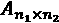 是一个大小为  的二维数组。我们使用方括号 [ ] 来表示多维数组的索引。

例如，*A*[*i*, *j*] 表示矩阵 *A* 中索引 *i*，*j* 处的元素。此外，请注意，我们使用一个特殊符号  来表示两个向量或矩阵之间的卷积操作，这与 Python 中的乘法操作符 * 不同。

### 一维离散卷积

让我们从一些基本的定义和符号开始，这些是我们接下来将使用的。两个向量 *x* 和 *w* 的离散卷积用 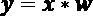 表示，其中向量 *x* 是我们的输入（有时称为**信号**），而 *w* 被称为**滤波器**或**核**。离散卷积在数学上定义如下：


如前所述，方括号[ ]用于表示向量元素的索引。索引 *i* 遍历输出向量 *y* 的每个元素。前面的公式中有两个需要澄清的奇怪之处： 到  的索引和 *x* 的负索引。

求和从  到  的过程看起来很奇怪，主要是因为在机器学习应用中，我们通常处理的是有限的特征向量。例如，如果 *x* 有 10 个特征，索引为 0, 1, 2,…, 8, 9，那么索引  和 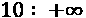 对于 *x* 来说是越界的。因此，为了正确计算前面公式中的求和，假设 *x* 和 *w* 被填充了零。这将导致输出向量 *y* 也具有无限大小，并且包含很多零。由于在实际应用中这并没有用处，因此 *x* 仅会被填充有限数量的零。

这个过程被称为 **零填充**，或简称为 **填充**。这里，填充在每一侧的零的数量用 *p* 表示。下面的图示展示了一个一维向量 *x* 的填充示例：


假设原始输入 *x* 和滤波器 *w* 分别有 *n* 和 *m* 个元素，其中 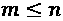。因此，填充后的向量 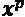 的大小为 *n* + 2*p*。计算离散卷积的实际公式将变为以下形式：


现在我们已经解决了无限索引的问题，第二个问题是使用 *i* + *m* – *k* 来索引 *x*。这里需要注意的要点是，在这个求和过程中，*x* 和 *w* 的索引方向是不同的。用一个反向方向的索引计算和，相当于在将其中一个向量（*x* 或 *w*）填充后，翻转其中一个向量，使得两个索引都朝前计算，然后简单地计算它们的点积。假设我们将滤波器 *w* 进行翻转（旋转），得到旋转后的滤波器，。然后，计算点积 ，得到一个元素 *y*[*i*]，其中 *x*[*i*: *i* + *m*] 是 *x* 中大小为 *m* 的一个片段。这个操作像滑动窗口一样重复，直到计算出所有的输出元素。下图展示了一个例子，其中 *x* = [3 2 1 7 1 2 5 4]，并且 ，计算得到前三个输出元素：


你可以在前面的示例中看到填充大小为零（*p* = 0）。注意，旋转后的滤波器  每次**平移**时都移动了两个单元。这种平移是卷积的另一个超参数，即**步幅**，*s*。在这个例子中，步幅是二，*s* = 2。请注意，步幅必须是小于输入向量大小的正数。我们将在下一部分详细讨论填充和步幅。

**互相关**

输入向量与滤波器之间的互相关（或简称相关）用  表示，它与卷积非常相似，唯一的区别是：在互相关中，乘法是在相同方向上进行的。因此，旋转滤波器矩阵*w*在每个维度中并不是必需的。从数学角度讲，互相关定义如下：

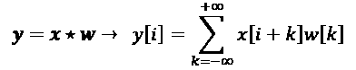

填充和步幅的相同规则也可以应用于互相关。请注意，大多数深度学习框架（包括 TensorFlow）实现了互相关，但称其为卷积，这在深度学习领域是一种常见的约定。

### 填充输入以控制输出特征图的大小

到目前为止，我们仅在卷积中使用了零填充来计算有限大小的输出向量。从技术上讲，可以使用任何  来应用填充。根据*p*的选择，边界单元可能与位于 *x* 中间的单元有所不同。

现在，考虑一个例子，其中*n* = 5 和 *m* = 3。那么，在*p* = 0的情况下，*x*[0] 仅用于计算一个输出元素（例如，*y*[0]），而 *x*[1] 用于计算两个输出元素（例如，*y*[0] 和 *y*[1]）。因此，你可以看到，*x* 中元素的这种不同处理方法可以人为地更加突出中间元素 *x*[2]，因为它出现在大多数计算中。如果选择*p* = 2，则可以避免这个问题，在这种情况下，*x* 的每个元素都将参与计算 *y* 的三个元素。

此外，输出的大小*y*也取决于我们使用的填充策略。

在实践中，常用的填充模式有三种：*全填充*、*相同填充* 和 *有效填充*：

+   在全模式下，填充参数 *p* 设置为 *p* = *m* – 1。全填充增加了输出的维度，因此在CNN架构中很少使用。

+   相同填充通常用于确保输出向量与输入向量 *x* 的大小相同。在这种情况下，填充参数 *p* 是根据滤波器大小计算的，并且要求输入和输出大小相同。

+   最后，在有效模式下计算卷积是指*p* = 0（无填充）的情况。

下图展示了对于一个简单的  像素输入，卷积核大小为 ，步长为1时的三种不同填充模式：


在卷积神经网络（CNN）中，最常用的填充模式是同填充（same padding）。它相对于其他填充模式的一个优点是，它能够保持向量的大小——或者在处理与图像相关的任务时保持输入图像的高度和宽度——这使得设计网络架构更加方便。

例如，valid填充相对于full和same填充的一个大缺点是，在具有多个层的神经网络中，张量的体积会显著减少，这可能会对网络性能产生不利影响。

在实践中，建议使用同填充（same padding）来保持卷积层的空间大小，而通过池化层来减少空间大小。至于全填充（full padding），它的大小导致输出大于输入大小。全填充通常用于信号处理应用中，在这些应用中，最小化边界效应很重要。然而，在深度学习中，边界效应通常不是问题，因此我们很少看到全填充被实际使用。

### 确定卷积输出的大小

卷积的输出大小由我们沿输入向量移动滤波器 *w* 的次数决定。假设输入向量的大小为 *n*，滤波器的大小为 *m*，那么带有填充 *p* 和步长 *s* 的输出大小可以通过以下公式确定：


在这里， 表示 *向下取整* 操作。

**向下取整操作**

向下取整操作返回不大于输入值的最大整数，例如：


考虑以下两种情况：

+   计算输入向量大小为10，卷积核大小为5，填充为2，步长为1时的输出大小：

    （请注意，在这种情况下，输出大小与输入相同；因此，我们可以得出结论，这就是同填充模式。）

+   当我们有一个大小为3的卷积核和步长为2时，对于相同的输入向量，输出大小如何变化？

如果你有兴趣深入了解卷积输出的大小，我们推荐阅读 *Vincent Dumoulin* 和 *Francesco Visin* 的手稿《深度学习卷积算术指南》，该文档可以在 [https://arxiv.org/abs/1603.07285](https://arxiv.org/abs/1603.07285) 免费获取。

最后，为了学习如何计算一维卷积，以下代码块展示了一个简单的实现，并将其结果与 `numpy.convolve` 函数进行比较。代码如下：

```py
>>> import numpy as np
>>> def conv1d(x, w, p=0, s=1):
...     w_rot = np.array(w[::-1])
...     x_padded = np.array(x)
...     if p > 0:
...         zero_pad = np.zeros(shape=p)
...         x_padded = np.concatenate([zero_pad,
...                                    x_padded,
...                                    zero_pad])
...     res = []
...     for i in range(0, int(len(x)/s),s):
...         res.append(np.sum(x_padded[i:i+w_rot.shape[0]] *
...                           w_rot))
...     return np.array(res)
>>> ## Testing:
>>> x = [1, 3, 2, 4, 5, 6, 1, 3]
>>> w = [1, 0, 3, 1, 2]
>>> print('Conv1d Implementation:',
...       conv1d(x, w, p=2, s=1))
Conv1d Implementation: [ 5\. 14\. 16\. 26\. 24\. 34\. 19\. 22.]
>>> print('NumPy Results:',
...       np.convolve(x, w, mode='same'))
NumPy Results: [ 5 14 16 26 24 34 19 22] 
```

到目前为止，我们主要关注的是向量的卷积（1D卷积）。我们从1D卷积开始，以便使概念更易于理解。在下一节中，我们将更详细地介绍二维卷积，它们是卷积神经网络（CNN）在与图像相关任务中的基本构建模块。

### 执行二维离散卷积

你在前几节中学到的概念可以很容易地扩展到二维。当我们处理二维输入，如矩阵  和滤波器矩阵 ，其中  和 ，那么矩阵  就是 *X* 和 *W* 之间的二维卷积的结果。数学上可以定义为如下：


请注意，如果你省略了其中一个维度，剩下的公式与我们之前用于计算1D卷积的公式完全相同。实际上，之前提到的所有技术，如零填充、旋转滤波器矩阵和步幅的使用，也适用于二维卷积，只要它们被独立地扩展到两个维度。下图展示了对大小为  的输入矩阵进行二维卷积，使用的卷积核大小为 。输入矩阵在零填充下，*p* = 1。结果，二维卷积的输出将具有大小 ：


下例说明了如何计算输入矩阵  和卷积核矩阵  之间的二维卷积，使用填充 *p* = (1, 1) 和步幅 *s* = (2, 2)。根据指定的填充方式，输入矩阵的每一侧都会添加一层零，得到填充后的矩阵 ，如下所示：


对于上述滤波器，旋转后的滤波器为：


请注意，这种旋转与转置矩阵不同。为了在NumPy中得到旋转后的滤波器，我们可以写`W_rot=W[::-1,::-1]`。接下来，我们可以将旋转后的滤波器矩阵沿着填充的输入矩阵  移动，像滑动窗口一样，并计算元素乘积的和，这个操作在下图中用  表示：


结果将是  矩阵，*Y*。

我们也可以根据所描述的*简单*算法实现二维卷积。`scipy.signal`包提供了一种通过`scipy.signal.convolve2d`函数计算二维卷积的方法：

```py
>>> import numpy as np
>>> import scipy.signal
>>> def conv2d(X, W, p=(0, 0), s=(1, 1)):
...     W_rot = np.array(W)[::-1,::-1]
...     X_orig = np.array(X)
...     n1 = X_orig.shape[0] + 2*p[0]
...     n2 = X_orig.shape[1] + 2*p[1]
...     X_padded = np.zeros(shape=(n1, n2))
...     X_padded[p[0]:p[0]+X_orig.shape[0],
...              p[1]:p[1]+X_orig.shape[1]] = X_orig
...
...     res = []
...     for i in range(0, int((X_padded.shape[0] - \
...                            W_rot.shape[0])/s[0])+1, s[0]):
...         res.append([])
...         for j in range(0, int((X_padded.shape[1] - \
...                                W_rot.shape[1])/s[1])+1, s[1]):
...             X_sub = X_padded[i:i+W_rot.shape[0],
...                              j:j+W_rot.shape[1]]
...             res[-1].append(np.sum(X_sub * W_rot))
...     return(np.array(res))
>>> X = [[1, 3, 2, 4], [5, 6, 1, 3], [1, 2, 0, 2], [3, 4, 3, 2]]
>>> W = [[1, 0, 3], [1, 2, 1], [0, 1, 1]]
>>> print('Conv2d Implementation:\n',
...       conv2d(X, W, p=(1, 1), s=(1, 1)))
Conv2d Implementation:
[[ 11\.  25\.  32\.  13.]
 [ 19\.  25\.  24\.  13.]
 [ 13\.  28\.  25\.  17.]
 [ 11\.  17\.  14\.   9.]]
>>> print('SciPy Results:\n',
...       scipy.signal.convolve2d(X, W, mode='same'))
SciPy Results:
[[11 25 32 13]
 [19 25 24 13]
 [13 28 25 17]
 [11 17 14  9]] 
```

**计算卷积的高效算法**

我们提供了一个简单的实现来计算二维卷积，以便帮助理解相关概念。然而，这个实现从内存需求和计算复杂度的角度来看非常低效。因此，它不应该在实际的神经网络应用中使用。

其中一方面是，滤波矩阵在大多数工具（如TensorFlow）中实际上并不会旋转。此外，近年来，已经开发出更多高效的算法，利用傅里叶变换来计算卷积。还需要注意的是，在神经网络的背景下，卷积核的大小通常远小于输入图像的大小。

例如，现代CNN通常使用如 、 或  等卷积核大小，针对这些卷积操作，已经设计了高效的算法，使得卷积操作能够更高效地执行，如**Winograd最小滤波**算法。这些算法超出了本书的范围，但如果你有兴趣了解更多，可以阅读*Andrew Lavin*和*Scott Gray*于2015年发布的手稿《卷积神经网络的快速算法》（*Fast Algorithms for Convolutional Neural Networks*），该文献可以在[https://arxiv.org/abs/1509.09308](https://arxiv.org/abs/1509.09308)免费下载。

在下一节中，我们将讨论下采样或池化，这是CNN中常用的另一种重要操作。

## 下采样层

下采样通常应用于卷积神经网络（CNN）中的两种池化操作：**最大池化**和**均值池化**（也称为**平均池化**）。池化层通常用  表示。在这里，下标决定了执行最大或均值操作的邻域大小（每个维度中相邻像素的数量）。我们将这样的邻域称为**池化大小**。

操作在以下图中描述。在这里，最大池化从像素的邻域中提取最大值，而均值池化计算它们的平均值：


池化的优势有两个方面：

+   池化（最大池化）引入了局部不变性。这意味着局部邻域的微小变化不会改变最大池化的结果。

    因此，它有助于生成对输入数据噪声更加鲁棒的特征。参见以下示例，显示了两个不同输入矩阵的最大池化结果， 和 ，它们产生了相同的输出：

    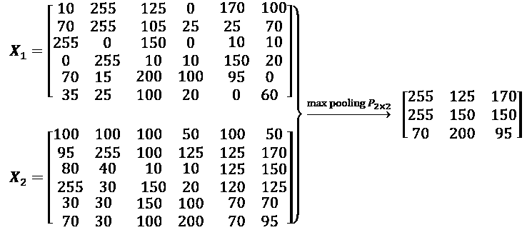

+   池化减少了特征的大小，从而提高了计算效率。此外，减少特征数量可能还会降低过拟合的程度。

**重叠池化与非重叠池化**

传统上，池化假设是非重叠的。池化通常在非重叠的邻域上执行，可以通过将步幅（stride）参数设置为池化大小来实现。例如，非重叠池化层需要步幅参数。另一方面，如果步幅小于池化大小，则会发生重叠池化。在卷积网络中使用重叠池化的一个例子，详见 *A. Krizhevsky*、*I. Sutskever* 和 *G. Hinton* 在2012年发表的论文 *ImageNet Classification with Deep Convolutional Neural Networks*，该论文可在[https://papers.nips.cc/paper/4824-imagenet-classification-with-deep-convolutional-neural-networks](https://papers.nips.cc/paper/4824-imagenet-classification-with-deep-convolutional-neural-networks)免费下载。

尽管池化仍然是许多CNN架构的一个重要组成部分，但也有一些CNN架构在没有使用池化层的情况下被开发出来。研究人员使用具有步幅为2\的卷积层来代替池化层，以减少特征的大小。

从某种意义上讲，你可以将步幅为2的卷积层视为具有可学习权重的池化层。如果你对开发有无池化层的不同CNN架构的实证比较感兴趣，我们推荐阅读研究文章 *Striving for Simplicity: The All Convolutional Net*，作者 *Jost Tobias Springenberg*、*Alexey Dosovitskiy*、*Thomas Brox* 和 *Martin Riedmiller*。该文章可以在[https://arxiv.org/abs/1412.6806](https://arxiv.org/abs/1412.6806)免费下载。

# 将一切整合——实现CNN

到目前为止，你已经学习了CNN的基本组成部分。本章所述的概念实际上并不比传统的多层神经网络（NN）更加复杂。我们可以说，传统神经网络中最重要的操作是矩阵乘法。例如，我们使用矩阵乘法来计算预激活（或净输入），如 *z* = *Wx* + *b*。这里，*x* 是表示像素的列向量（矩阵），*W* 是将像素输入与每个隐藏单元连接的权重矩阵。

在卷积神经网络（CNN）中，这一操作通过卷积操作来替代，如图中的，其中 *X* 是表示像素的矩阵，采用排列方式。在这两种情况下，预激活值会传递到激活函数，以获得隐藏单元的激活值，即，其中是激活函数。此外，你还记得，子采样是CNN的另一个组成部分，通常以池化（pooling）的形式出现，如前一节所述。

## 处理多个输入或颜色通道

卷积层的输入可能包含一个或多个二维数组或矩阵，尺寸为 （例如，图像的高度和宽度，以像素为单位）。这些  矩阵被称为 *通道*。常规的卷积层实现期望输入为三维张量表示，例如三维数组 ，其中  是输入通道的数量。例如，假设我们将图像作为 CNN 第一层的输入。如果图像是彩色的并使用 RGB 色彩模式，则 （表示 RGB 中的红、绿、蓝色通道）。然而，如果图像是灰度图像，则只有一个通道，即 ，其中包含灰度像素强度值。

**读取图像文件**

在处理图像时，我们可以使用 `uint8`（无符号 8 位整数）数据类型将图像读取为 NumPy 数组，相比于 16 位、32 位或 64 位整数类型，这样可以减少内存使用。

无符号 8 位整数的取值范围为 [0, 255]，这个范围足以存储 RGB 图像的像素信息，而 RGB 图像的像素值也在这个范围内。

在 *第13章*，《使用 TensorFlow 并行化神经网络训练》中，你看到 TensorFlow 提供了一个模块，通过 `tf.io` 和 `tf.image` 子模块加载/存储和操作图像。让我们回顾一下如何读取图像（这个 RGB 图像位于代码包文件夹中，章节提供的 [https://github.com/rasbt/python-machine-learning-book-3rd-edition/tree/master/code/ch15](https://github.com/rasbt/python-machine-learning-book-3rd-edition/tree/master/code/ch15)）：

```py
>>> import tensorflow as tf
>>> img_raw = tf.io.read_file('example-image.png')
>>> img = tf.image.decode_image(img_raw)
>>> print('Image shape:', img.shape)
Image shape: (252, 221, 3) 
```

在 TensorFlow 中构建模型和数据加载器时，建议也使用 `tf.image` 来读取输入图像。

现在，让我们看一个如何在 Python 会话中读取图像的例子，使用 `imageio` 包。我们可以通过 `conda` 或 `pip` 在命令行终端中安装 `imageio`：

```py
> conda install imageio 
```

或者

```py
> pip install imageio 
```

一旦安装了 `imageio`，我们可以使用 `imread` 函数通过 `imageio` 包读取我们之前使用的相同图像：

```py
>>> import imageio
>>> img = imageio.imread('example-image.png')
>>> print('Image shape:', img.shape)
Image shape: (252, 221, 3)
>>> print('Number of channels:', img.shape[2])
Number of channels: 3
>>> print('Image data type:', img.dtype)
Image data type: uint8
>>> print(img[100:102, 100:102, :])
[[[179 134 110]
 [182 136 112]]
[[180 135 11]
 [182 137 113]]] 
```

现在你已经熟悉了输入数据的结构，接下来的问题是，如何将多个输入通道融入我们在前面讨论的卷积操作中？答案很简单：我们为每个通道分别执行卷积操作，然后通过矩阵求和将结果加起来。与每个通道 (*c*) 相关的卷积有其自己的卷积核矩阵，记为 *W*[:, :, *c*]。总的预激活结果可以通过以下公式计算：


最终结果，*A*，是一个特征图。通常，CNN的卷积层有多个特征图。如果我们使用多个特征图，卷积核张量将变为四维：。这里， 是卷积核的大小， 是输入通道的数量， 是输出特征图的数量。因此，现在我们在前面的公式中加入输出特征图的数量并更新它，如下所示：


为了总结我们在神经网络中计算卷积的讨论，让我们来看一下下面的例子，展示了一个卷积层，后面跟着一个池化层。在这个例子中，有三个输入通道。卷积核张量是四维的。每个卷积核矩阵表示为 ，并且有三个卷积核，每个输入通道一个。此外，有五个这样的卷积核，对应五个输出特征图。最后，池化层用于对特征图进行下采样：


**在上述例子中有多少可训练参数？**

为了说明卷积、**参数共享**和**稀疏连接**的优势，我们通过一个例子来说明。前面图中显示的网络中的卷积层是一个四维张量。因此，与卷积核相关的参数数量为 。此外，对于每个卷积层的输出特征图，还有一个偏置向量。因此，偏置向量的大小为5。池化层没有任何（可训练的）参数；因此，我们可以写出以下公式：


如果输入张量的大小为 ，假设卷积采用相同填充模式，则输出特征图的大小将为 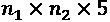。

请注意，如果我们使用全连接层代替卷积层，则这个数字会大得多。在全连接层的情况下，为了达到相同数量的输出单元，权重矩阵的参数数量将如下所示：


此外，偏置向量的大小为 （每个输出单元有一个偏置元素）。由于  和 ，我们可以看到可训练参数数量的差异是显著的。

最后，正如之前提到的，通常卷积操作是通过将具有多个颜色通道的输入图像视为矩阵堆栈来执行的；也就是说，我们分别在每个矩阵上执行卷积，然后将结果相加，正如之前的图示所示。然而，卷积也可以扩展到3D体积，如果你处理的是3D数据集，例如，如*Daniel Maturana*和*Sebastian Scherer*于2015年发表的论文*VoxNet: A 3D Convolutional Neural Network for Real-Time Object Recognition*中所示（可以通过[https://www.ri.cmu.edu/pub_files/2015/9/voxnet_maturana_scherer_iros15.pdf](https://www.ri.cmu.edu/pub_files/2015/9/voxnet_maturana_scherer_iros15.pdf)访问）。

在下一节中，我们将讨论如何对神经网络进行正则化。

## 使用dropout正则化神经网络

选择网络的大小，无论是传统的（全连接的）神经网络（NN）还是卷积神经网络（CNN），一直是一个具有挑战性的问题。例如，权重矩阵的大小和层数需要调整，以实现合理的性能。

你可能还记得在*第14章*，*深入探索——TensorFlow的机制*中提到，只有一个简单的没有隐藏层的网络只能捕捉到一个线性决策边界，这不足以应对异或（XOR）或类似的问题。网络的*容量*是指它能够学习并逼近的函数的复杂度。小型网络或具有相对较少参数的网络容量较低，因此可能会*欠拟合*，导致性能较差，因为它们无法学习复杂数据集的潜在结构。然而，过大的网络可能会导致*过拟合*，即网络会记住训练数据，在训练数据集上表现极其优秀，但在保留的测试数据集上表现差劲。当我们处理现实世界的机器学习问题时，我们并不知道网络应该有多大*先验*。

解决这个问题的一种方法是构建一个容量相对较大的网络（实际上，我们希望选择一个稍微大于必要的容量）以便在训练数据集上表现良好。然后，为了防止过拟合，我们可以应用一种或多种正则化方法，以在新数据上实现良好的泛化性能，例如保留的测试数据集。

在*第3章*，*使用scikit-learn的机器学习分类器简介*中，我们讨论了L1和L2正则化。在*通过正则化应对过拟合*一节中，您看到，L1和L2正则化都可以通过在损失函数中加入惩罚项来防止或减少过拟合的影响，从而在训练过程中缩小权重参数。虽然L1和L2正则化同样适用于神经网络（NNs），且L2是更常见的选择，但还有其他用于正则化神经网络的方法，例如dropout（丢弃法），我们将在本节中讨论。在我们继续讨论dropout之前，要在卷积网络或全连接（稠密）网络中使用L2正则化，您可以通过在使用Keras API时设置某一层的`kernel_regularizer`，简单地将L2惩罚项添加到损失函数中，如下所示（它将自动相应地修改损失函数）：

```py
>>> from tensorflow import keras 
>>> conv_layer = keras.layers.Conv2D(
...     filters=16,
...     kernel_size=(3,3),
...     kernel_regularizer=keras.regularizers.l2(0.001))
>>> fc_layer = keras.layers.Dense(
...     units=16,
...     kernel_regularizer=keras.regularizers.l2(0.001)) 
```

近年来，**dropout**成为一种流行的正则化（深度）神经网络技术，用于避免过拟合，从而提高泛化性能（*Dropout: a simple way to prevent neural networks from overfitting*，作者：*N. Srivastava, G. Hinton, A. Krizhevsky, I. Sutskever, 和 R. Salakhutdinov*，*机器学习研究杂志 15.1*，第1929-1958页，2014，[http://www.jmlr.org/papers/volume15/srivastava14a/srivastava14a.pdf](http://www.jmlr.org/papers/volume15/srivastava14a/srivastava14a.pdf)）。Dropout通常应用于较高层次的隐藏单元，其工作原理如下：在神经网络的训练阶段，每次迭代时，按概率（或保持概率）随机丢弃一部分隐藏单元。这个dropout概率由用户决定，常见的选择是*p* = 0.5，正如Nitish Srivastava等人2014年在上述文章中讨论的。当丢弃一定比例的输入神经元时，剩余神经元的权重会进行重新缩放，以补偿丢失的（被丢弃的）神经元。

这种随机dropout的效果是迫使网络学习数据的冗余表示。因此，网络不能依赖于任何一组隐藏单元的激活，因为它们可能在训练过程中随时被关闭，网络被迫从数据中学习更一般和更强健的模式。

这种随机dropout可以有效防止过拟合。下图展示了在训练阶段应用概率*p* = 0.5的dropout的示例，其中一半的神经元会随机变得不活跃（每次前向传播时随机选择丢弃的单元）。然而，在预测过程中，所有神经元都会参与计算下一层的预激活。


如图所示，一个需要记住的重要点是，单元在训练过程中可能会随机丢失，而在评估（推理）阶段，所有的隐藏单元都必须保持激活（例如，  或 ）。为了确保在训练和预测时整体激活值在相同的尺度上，必须适当缩放激活的神经元（例如，如果dropout概率设置为 *p* = 0.5，则需要将激活值减半）。

然而，由于在做预测时总是缩放激活值不方便，TensorFlow等工具会在训练过程中缩放激活值（例如，如果dropout概率设置为 *p* = 0.5，则将激活值加倍）。这种方法通常被称为逆向dropout。

虽然关系并不立即显现，但dropout可以解释为一个模型集成的共识（平均）。正如*第7章*中讨论的，*将不同模型结合用于集成学习*，在集成学习中，我们独立训练多个模型。在预测时，我们使用所有训练过的模型的共识。我们已经知道，模型集成的表现通常优于单一模型。然而，在深度学习中，训练多个模型以及收集和平均多个模型的输出计算代价很高。这里，dropout提供了一种解决方法，它可以高效地一次性训练多个模型，并在测试或预测时计算它们的平均预测。

如前所述，模型集成与dropout之间的关系并不立即显现。然而，考虑到在dropout中，我们每个小批量数据都有一个不同的模型（因为在每次前向传播时，随机将部分权重置为零）。

然后，通过对小批量数据进行迭代，我们本质上对  个模型进行采样，其中 *h* 是隐藏单元的数量。

然而，dropout与常规集成的一个不同之处在于，我们在这些“不同的模型”之间共享权重，这可以看作是一种正则化形式。然后，在“推理”过程中（例如，预测测试数据集中的标签），我们可以对训练过程中采样的所有不同模型进行平均。这是非常昂贵的。

然后，平均模型，即计算由模型 *i* 返回的类成员概率的几何平均，可以按如下方式计算：


现在，dropout背后的技巧是，模型集成的几何平均（这里指的是 *M* 个模型）可以通过将训练过程中最后一个（或最终）模型的预测结果按 1/(1 – *p*) 的比例进行缩放来近似，这比使用前面公式显式计算几何平均要便宜得多。（实际上，如果我们考虑线性模型，这个近似与真实的几何平均是完全等价的。）

## 分类的损失函数

在 *第 13 章*，*使用 TensorFlow 并行化神经网络训练* 中，我们见过不同的激活函数，如 ReLU、sigmoid 和 tanh。像 ReLU 这样的激活函数，主要用于神经网络的中间（隐藏）层，为模型加入非线性。但其他激活函数，如 sigmoid（用于二分类）和 softmax（用于多分类），则被添加到最后的（输出）层，从而使得模型的输出为类别成员概率。如果输出层没有包含 sigmoid 或 softmax 激活函数，那么模型将计算 logits，而非类别成员概率。

这里重点讲解分类问题，依据问题类型（二分类与多分类）和输出类型（logits 与概率），我们应选择合适的损失函数来训练我们的模型。**二元交叉熵**是二分类（具有单一输出单元）的损失函数，而**分类交叉熵**是多分类问题的损失函数。在 Keras API 中，分类交叉熵损失函数提供了两种选项，取决于真实标签是采用 one-hot 编码格式（例如，[0, 0, 1, 0]），还是作为整数标签（例如，*y*=2），在 Keras 中，这也被称为“稀疏”表示。

下表描述了 Keras 中三种可用于处理以下三种情况的损失函数：二分类、多类别（使用 one-hot 编码的真实标签）和多类别（使用整数（稀疏）标签）。这三种损失函数中的每一种也可以选择接受 logits 或类别成员概率形式的预测：


请注意，通常由于数值稳定性的原因，提供 logits 而非类别成员概率来计算交叉熵损失更为优选。如果我们将 logits 作为输入提供给损失函数并设置 `from_logits=True`，相应的 TensorFlow 函数将使用更高效的实现来计算损失及损失对权重的导数。这是可能的，因为某些数学项会相互抵消，因此在提供 logits 作为输入时，不需要显式计算这些项。

以下代码将展示如何使用这三种损失函数，并且输入可以是 logits 或类别成员概率的两种不同格式：

```py
>>> import tensorflow_datasets as tfds
>>> ####### Binary Crossentropy
>>> bce_probas = tf.keras.losses.BinaryCrossentropy(from_logits=False)
>>> bce_logits = tf.keras.losses.BinaryCrossentropy(from_logits=True)
>>> logits = tf.constant([0.8])
>>> probas = tf.keras.activations.sigmoid(logits)
>>> tf.print(
...     'BCE (w Probas): {:.4f}'.format(
...     bce_probas(y_true=[1], y_pred=probas)),
...     '(w Logits): {:.4f}'.format(
...     bce_logits(y_true=[1], y_pred=logits)))
BCE (w Probas): 0.3711 (w Logits): 0.3711
>>> ####### Categorical Crossentropy
>>> cce_probas = tf.keras.losses.CategoricalCrossentropy(
...     from_logits=False)
>>> cce_logits = tf.keras.losses.CategoricalCrossentropy(
...     from_logits=True)
>>> logits = tf.constant([[1.5, 0.8, 2.1]])
>>> probas = tf.keras.activations.softmax(logits)
>>> tf.print(
...     'CCE (w Probas): {:.4f}'.format(
...     cce_probas(y_true=[0, 0, 1], y_pred=probas)),
...     '(w Logits): {:.4f}'.format(
...     cce_logits(y_true=[0, 0, 1], y_pred=logits)))
CCE (w Probas): 0.5996 (w Logits): 0.5996
>>> ####### Sparse Categorical Crossentropy
>>> sp_cce_probas = tf.keras.losses.SparseCategoricalCrossentropy(
...     from_logits=False)
>>> sp_cce_logits = tf.keras.losses.SparseCategoricalCrossentropy(
...     from_logits=True)
>>> tf.print(
...     'Sparse CCE (w Probas): {:.4f}'.format(
...     sp_cce_probas(y_true=[2], y_pred=probas)),
...     '(w Logits): {:.4f}'.format(
...     sp_cce_logits(y_true=[2], y_pred=logits)))
Sparse CCE (w Probas): 0.5996 (w Logits): 0.5996 
```

请注意，有时你可能会遇到一个实现，其中对于二分类任务使用了类别交叉熵损失。通常，当我们进行二分类任务时，模型会为每个示例返回一个单一的输出值。我们将这个单一的模型输出解释为正类的概率（例如，类别 1），*P*[class = 1]。在二分类问题中，隐含着 *P*[class = 0] = 1 – *P*[class = 1]；因此，我们不需要第二个输出单元来获取负类的概率。然而，有时实践者会选择为每个训练示例返回两个输出，并将它们解释为每个类别的概率：*P*[class = 0] 与 *P*[class = 1]。在这种情况下，建议使用 softmax 函数（而不是逻辑 sigmoid）来归一化输出（使它们的和为 1），并且类别交叉熵是合适的损失函数。

# 使用 TensorFlow 实现深度 CNN

在*第14章*中，*深入了解 – TensorFlow的机制*，你可能还记得我们使用了 TensorFlow Estimators 来解决手写数字识别问题，使用了不同的 TensorFlow API 级别。你可能还记得我们通过使用 `DNNClassifier` Estimator 和两层隐藏层，达到了大约 89% 的准确率。

现在，让我们实现一个卷积神经网络（CNN），看看它是否能在手写数字分类任务中实现比多层感知机（`DNNClassifier`）更好的预测性能。请注意，在*第14章*中，我们看到的全连接层在这个问题上表现良好。然而，在某些应用中，如从手写数字中读取银行账户号码，即使是微小的错误也可能造成巨大的损失。因此，减少这个错误至关重要。

## 多层卷积神经网络架构

我们将要实现的网络架构如下图所示。输入为  灰度图像。考虑到通道数（灰度图像的通道数为 1）以及一批输入图像，输入张量的维度将是 。

输入数据经过两个卷积层处理，卷积核大小为 。第一个卷积层有 32 个输出特征图，第二个卷积层有 64 个输出特征图。每个卷积层后面都有一个子采样层，采用最大池化操作，。然后，一个全连接层将输出传递给第二个全连接层，后者作为最终的 *softmax* 输出层。我们将要实现的网络架构如下图所示：


每一层张量的维度如下：

+   输入: 

+   Conv_1: 

+   Pooling_1: 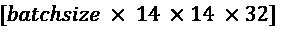

+   Conv_2: 

+   Pooling_2: 

+   FC_1： 

+   FC_2 和 softmax 层： 

对于卷积核，我们使用 `strides=1`，使输入维度在生成的特征图中得到保留。对于池化层，我们使用 `strides=2` 来对图像进行子采样，从而缩小输出特征图的尺寸。我们将使用 TensorFlow Keras API 实现这个网络。

## 加载和预处理数据

你会回想起在*第13章*，《*使用 TensorFlow 并行化神经网络训练*》中，你学到了两种从 `tensorflow_datasets` 模块加载可用数据集的方法。一种方法基于一个三步过程，而另一种更简单的方法是使用一个叫 `load` 的函数，它将这三步封装起来。这里，我们将使用第一种方法。加载 MNIST 数据集的三步过程如下：

```py
>>> import tensorflow_datasets as tfds
>>> ## Loading the data
>>> mnist_bldr = tfds.builder('mnist')
>>> mnist_bldr.download_and_prepare()
>>> datasets = mnist_bldr.as_dataset(shuffle_files=False)
>>> mnist_train_orig = datasets['train']
>>> mnist_test_orig = datasets['test'] 
```

MNIST 数据集提供了预先指定的训练集和测试集分割方案，但我们还希望从训练集分割出一个验证集。请注意，在第三步中，我们在 `.as_dataset()` 方法中使用了一个可选参数 `shuffle_files=False`。这防止了数据集的初始打乱，这对于我们来说是必要的，因为我们希望将训练数据集分成两部分：一部分较小的训练集和一部分验证集。（注意：如果没有关闭初始打乱，每次获取小批量数据时，数据集都会重新打乱。）

这种行为的一个例子展示在本章的在线内容中，在那里你可以看到，由于训练集/验证集的重新打乱，验证数据集中的标签数量发生了变化。这可能会导致模型的*错误*性能估计，因为训练集/验证集实际上是混合的。我们可以按如下方式划分训练集/验证集：

```py
>>> BUFFER_SIZE = 10000
>>> BATCH_SIZE = 64
>>> NUM_EPOCHS = 20
>>> mnist_train = mnist_train_orig.map(
...     lambda item: (tf.cast(item['image'], tf.float32)/255.0,
...                   tf.cast(item['label'], tf.int32)))
>>> mnist_test = mnist_test_orig.map(
...     lambda item: (tf.cast(item['image'], tf.float32)/255.0,
...                   tf.cast(item['label'], tf.int32)))
>>> tf.random.set_seed(1)
>>> mnist_train = mnist_train.shuffle(buffer_size=BUFFER_SIZE,
...                   reshuffle_each_iteration=False)
>>> mnist_valid = mnist_train.take(10000).batch(BATCH_SIZE)
>>> mnist_train = mnist_train.skip(10000).batch(BATCH_SIZE) 
```

现在，在准备好数据集后，我们可以实现刚才描述的 CNN。

## 使用 TensorFlow Keras API 实现 CNN

在 TensorFlow 中实现 CNN 时，我们使用 Keras 的 `Sequential` 类来堆叠不同的层，如卷积层、池化层、Dropout 层以及全连接（密集）层。Keras 层 API 为每个层提供了相应的类：`tf.keras.layers.Conv2D` 用于二维卷积层；`tf.keras.layers.MaxPool2D` 和 `tf.keras.layers.AvgPool2D` 用于子采样（最大池化和平均池化）；`tf.keras.layers.Dropout` 用于通过 Dropout 实现正则化。我们将更详细地介绍这些类。

### 在 Keras 中配置 CNN 层

使用 `Conv2D` 类构建卷积层时，我们需要指定输出过滤器的数量（这相当于输出特征图的数量）和卷积核的大小。

此外，还有一些可选的参数可以用来配置卷积层。最常用的参数是步幅（`strides`，在* x *和* y *维度上的默认值为1）和填充（padding），填充可以是`same`或`valid`。更多的配置参数列在官方文档中：[https://www.tensorflow.org/versions/r2.0/api_docs/python/tf/keras/layers/Conv2D](https://www.tensorflow.org/versions/r2.0/api_docs/python/tf/keras/layers/Conv2D)。

值得一提的是，通常当我们读取图像时，通道的默认维度是张量数组的最后一维。这被称为“NHWC”格式，其中*N*表示批次中的图像数量，*H*和*W*分别表示高度和宽度，*C*表示通道。

请注意，`Conv2D`类默认假设输入采用NHWC格式。（其他工具，如PyTorch，使用NCHW格式。）然而，如果你遇到一些数据，其通道位于第一维（即批次维度之后的第一维，或者考虑批次维度后为第二维），你需要在数据中交换轴，将通道移至最后一维。或者，另一种处理NCHW格式输入的方式是设置`data_format="channels_first"`。在构建该层后，可以通过提供一个四维张量来调用它，第一个维度保留作为一批样本；根据`data_format`参数，第二维或第四维对应于通道；其他两个维度是空间维度。

如我们想要构建的CNN模型架构所示，每个卷积层后面都跟着一个池化层进行子采样（减小特征图的尺寸）。`MaxPool2D`和`AvgPool2D`类分别构造最大池化层和平均池化层。参数`pool_size`决定了用于计算最大值或均值操作的窗口（或邻域）的大小。此外，`strides`参数可以用来配置池化层，正如我们之前讨论的那样。

最后，`Dropout`类将构建用于正则化的丢弃层，参数`rate`用于确定在训练过程中丢弃输入单元的概率。调用该层时，可以通过一个名为`training`的参数来控制其行为，以指定该调用是在训练期间进行的还是在推理期间进行的。

### 在Keras中构建CNN

现在你已经了解了这些类，我们可以构建前面图中显示的CNN模型。在以下代码中，我们将使用`Sequential`类并添加卷积层和池化层：

```py
>>> model = tf.keras.Sequential()
>>> model.add(tf.keras.layers.Conv2D(
...     filters=32, kernel_size=(5, 5),
...     strides=(1, 1), padding='same',
...     data_format='channels_last',
...     name='conv_1', activation='relu'))
>>> model.add(tf.keras.layers.MaxPool2D(
...     pool_size=(2, 2), name='pool_1'))
>>> model.add(tf.keras.layers.Conv2D(
...     filters=64, kernel_size=(5, 5),
...     strides=(1, 1), padding='same',
...     name='conv_2', activation='relu'))
>>> model.add(tf.keras.layers.MaxPool2D(
...     pool_size=(2, 2), name='pool_2')) 
```

到目前为止，我们已向模型中添加了两个卷积层。对于每个卷积层，我们使用了大小为  的卷积核，并采用了 `'same'` 填充方式。如前所述，使用 `padding='same'` 保留了特征图的空间维度（纵向和横向维度），使得输入和输出具有相同的高度和宽度（而通道数仅可能因所用滤波器的数量不同而有所不同）。最大池化层的池化大小为 ，步幅为 2，将空间维度减少了一半。（注意，如果在 `MaxPool2D` 中未指定 `strides` 参数，则默认将其设置为与池化大小相等。）

虽然我们可以手动计算此阶段特征图的大小，但 Keras API 提供了一个方便的方法来为我们计算：

```py
>>> model.compute_output_shape(input_shape=(16, 28, 28, 1))
TensorShape([16, 7, 7, 64]) 
```

通过在此示例中提供元组形式的输入形状，`compute_output_shape` 方法计算得出输出的形状为 (16, 7, 7, 64)，表示具有 64 个通道和空间大小为  的特征图。第一个维度对应于批次维度，我们任意选择了 16。我们也可以使用 `None`，即 `input_shape=(None, 28, 28, 1)`。

我们接下来要添加的层是一个全连接层（或称密集层），用于在卷积层和池化层之上实现分类器。此层的输入必须是二维的，即形状为 []。因此，我们需要将前面层的输出展平，以满足全连接层的要求：

```py
>>> model.add(tf.keras.layers.Flatten())
>>> model.compute_output_shape(input_shape=(16, 28, 28, 1))
TensorShape([16, 3136]) 
```

如 `compute_output_shape` 的结果所示，密集层的输入维度已正确设置。接下来，我们将添加两个密集层，中间夹一个丢弃层：

```py
>>> model.add(tf.keras.layers.Dense(
...     units=1024, name='fc_1',
...     activation='relu'))
>>> model.add(tf.keras.layers.Dropout(
...     rate=0.5))
>>> model.add(tf.keras.layers.Dense(
...     units=10, name='fc_2',
...     activation='softmax')) 
```

最后一层全连接层，命名为 `'fc_2'`，具有 10 个输出单元，用于 MNIST 数据集中的 10 个类别标签。此外，我们使用 softmax 激活函数来获得每个输入样本的类别归属概率，假设各类别是互斥的，因此每个样本的概率之和为 1（这意味着一个训练样本只能属于一个类别）。根据我们在 *分类损失函数* 部分讨论的内容，我们应该使用哪种损失函数呢？记住，对于具有整数（稀疏）标签的多类分类（与独热编码标签相对），我们使用 `SparseCategoricalCrossentropy`。以下代码将调用 `build()` 方法以进行延迟变量创建，并编译模型：

```py
>>> tf.random.set_seed(1)
>>> model.build(input_shape=(None, 28, 28, 1))
>>> model.compile(
...     optimizer=tf.keras.optimizers.Adam(),
...     loss=tf.keras.losses.SparseCategoricalCrossentropy(),
...     metrics=['accuracy']) 
```

**Adam 优化器**

请注意，在此实现中，我们使用了 `tf.keras.optimizers.Adam()` 类来训练 CNN 模型。Adam 优化器是一种强大的基于梯度的优化方法，适用于非凸优化和机器学习问题。两个受 Adam 启发的流行优化方法是：`RMSProp` 和 `AdaGrad`。

Adam的关键优势在于选择基于梯度矩的运行平均值计算更新步长。请随意阅读更多关于Adam优化器的文献，文献名为*Adam: A Method for Stochastic Optimization*，作者为*Diederik P. Kingma*和*Jimmy Lei Ba*，2014年。文章可以在[https://arxiv.org/abs/1412.6980](https://arxiv.org/abs/1412.6980)免费获取。

正如你已经知道的，我们可以通过调用`fit()`方法来训练模型。请注意，使用指定的训练和评估方法（如`evaluate()`和`predict()`）将自动为dropout层设置模式并适当重新缩放隐藏单元，这样我们就不需要担心这些问题。接下来，我们将训练这个CNN模型，并使用我们为监控学习进展所创建的验证数据集：

```py
>>> history = model.fit(mnist_train, epochs=NUM_EPOCHS,
...                     validation_data=mnist_valid,
...                     shuffle=True)
Epoch 1/20
782/782 [==============================] - 35s 45ms/step - loss: 0.1450 - accuracy: 0.8882 - val_loss: 0.0000e+00 - val_accuracy: 0.0000e+00
Epoch 2/20
782/782 [==============================] - 34s 43ms/step - loss: 0.0472 - accuracy: 0.9833 - val_loss: 0.0507 - val_accuracy: 0.9839
..
Epoch 20/20
782/782 [==============================] - 34s 44ms/step - loss: 0.0047 - accuracy: 0.9985 - val_loss: 0.0488 - val_accuracy: 0.9920 
```

一旦完成20个训练周期，我们可以可视化学习曲线：

```py
>>> import matplotlib.pyplot as plt
>>> hist = history.history
>>> x_arr = np.arange(len(hist['loss'])) + 1
>>> fig = plt.figure(figsize=(12, 4))
>>> ax = fig.add_subplot(1, 2, 1)
>>> ax.plot(x_arr, hist['loss'], '-o', label='Train loss')
>>> ax.plot(x_arr, hist['val_loss'], '--<', label='Validation loss')
>>> ax.legend(fontsize=15)
>>> ax = fig.add_subplot(1, 2, 2)
>>> ax.plot(x_arr, hist['accuracy'], '-o', label='Train acc.')
>>> ax.plot(x_arr, hist['val_accuracy'], '--<', 
...         label='Validation acc.')
>>> ax.legend(fontsize=15)
>>> plt.show() 
```


正如你在前两章中已经了解到的，可以通过调用`.evaluate()`方法在测试数据集上评估训练好的模型：

```py
>>> test_results = model.evaluate(mnist_test.batch(20))
>>> print('Test Acc.: {:.2f}\%'.format(test_results[1]*100))
Test Acc.: 99.39% 
```

该CNN模型达到了99.39%的准确率。记住，在*第14章*《*深入探讨 – TensorFlow的工作原理*》中，我们使用Estimator `DNNClassifier`时，准确率约为90%。

最后，我们可以以类别成员概率的形式获得预测结果，并通过使用`tf.argmax`函数来找到最大概率的元素，从而将其转换为预测标签。我们将对一批12个示例进行操作并可视化输入和预测标签：

```py
>>> batch_test = next(iter(mnist_test.batch(12)))
>>> preds = model(batch_test[0])
>>> tf.print(preds.shape)
TensorShape([12, 10])
>>> preds = tf.argmax(preds, axis=1)
>>> print(preds)
tf.Tensor([6 2 3 7 2 2 3 4 7 6 6 9], shape=(12,), dtype=int64)
>>> fig = plt.figure(figsize=(12, 4))
>>> for i in range(12):
...     ax = fig.add_subplot(2, 6, i+1)
...     ax.set_xticks([]); ax.set_yticks([])
...     img = batch_test[0][i, :, :, 0]
...     ax.imshow(img, cmap='gray_r')
...     ax.text(0.9, 0.1, '{}'.format(preds[i]),
...             size=15, color='blue',
...             horizontalalignment='center',
...             verticalalignment='center',
...             transform=ax.transAxes)
>>> plt.show() 
```

下图展示了手写输入和它们的预测标签：


在这一组绘制的示例中，所有的预测标签都是正确的。

我们将展示一些误分类的数字，这一任务与*第12章*《*从零实现多层人工神经网络*》中的练习类似，作为读者的练习。

# 使用CNN从面部图像进行性别分类

在本节中，我们将使用CelebA数据集实现一个用于从面部图像进行性别分类的CNN。如同你在*第13章*《*使用TensorFlow并行化神经网络训练*》中看到的，CelebA数据集包含了202,599张名人面部图像。此外，每张图像还包含40个二进制面部属性，包括性别（男性或女性）和年龄（年轻或年老）。

基于你目前学到的内容，本节的目标是构建并训练一个CNN模型，用于从这些面部图像中预测性别属性。为了简单起见，我们将仅使用一小部分训练数据（16,000个训练示例）来加速训练过程。然而，为了提高泛化性能并减少在如此小的数据集上的过拟合，我们将使用一种称为**数据增强**的技术。

## 加载CelebA数据集

首先，我们将以与上一节加载 MNIST 数据集时类似的方式加载数据。CelebA 数据集分为三个部分：训练数据集、验证数据集和测试数据集。接下来，我们将实现一个简单的函数来统计每个数据集中的样本数量：

```py
>>> import tensorflow as tf
>>> import tensorflow_datasets as tfds
>>> celeba_bldr = tfds.builder('celeb_a')
>>> celeba_bldr.download_and_prepare()
>>> celeba = celeba_bldr.as_dataset(shuffle_files=False)
>>> celeba_train = celeba['train']
>>> celeba_valid = celeba['validation']
>>> celeba_test = celeba['test']
>>>
>>> def count_items(ds):
...     n = 0
...     for _ in ds:
...         n += 1
...     return n
>>> print('Train set:  {}'.format(count_items(celeba_train)))
Train set:  162770
>>> print('Validation: {}'.format(count_items(celeba_valid)))
Validation: 19867
>>> print('Test set:   {}'.format(count_items(celeba_test)))
Test set:   19962 
```

因此，我们不会使用所有可用的训练和验证数据，而是选择一个包含16,000个训练样本和1,000个验证样本的子集，具体如下：

```py
>>> celeba_train = celeba_train.take(16000)
>>> celeba_valid = celeba_valid.take(1000)
>>> print('Train set:  {}'.format(count_items(celeba_train)))
Train set:  16000
>>> print('Validation: {}'.format(count_items(celeba_valid)))
Validation: 1000 
```

需要注意的是，如果在`celeba_bldr.as_dataset()`中的`shuffle_files`参数没有设置为`False`，我们仍然会看到16,000个训练样本和1,000个验证样本。然而，在每次迭代中，训练数据将被重新洗牌，并选取一组新的16,000个样本。这将违背我们的目的，因为我们的目标是故意用一个小数据集来训练模型。接下来，我们将讨论数据增强作为提高深度神经网络性能的技术。

## 图像变换与数据增强

数据增强总结了一组广泛的技术，用于处理训练数据有限的情况。例如，某些数据增强技术允许我们修改或甚至人工合成更多数据，从而通过减少过拟合来提高机器学习或深度学习模型的性能。尽管数据增强不仅限于图像数据，但有一组转换方法特别适用于图像数据，如裁剪图像的一部分、翻转、调整对比度、亮度和饱和度。让我们看看通过`tf.image`模块可以使用的一些变换。在以下代码块中，我们将首先从`celeba_train`数据集中获取五个样本，并应用五种不同的变换：1）将图像裁剪到边界框，2）水平翻转图像，3）调整对比度，4）调整亮度，5）对图像进行中心裁剪，并将结果图像调整回其原始大小（218，178）。在下面的代码中，我们将可视化这些变换的结果，并将每个变换单独展示在一列中以供比较：

```py
>>> import matplotlib.pyplot as plt
>>> # take 5 examples
>>> examples = []
>>> for example in celeba_train.take(5):
...     examples.append(example['image'])
>>> fig = plt.figure(figsize=(16, 8.5))
>>> ## Column 1: cropping to a bounding-box
>>> ax = fig.add_subplot(2, 5, 1)
>>> ax.set_title('Crop to a \nbounding-box', size=15)
>>> ax.imshow(examples[0])
>>> ax = fig.add_subplot(2, 5, 6)
>>> img_cropped = tf.image.crop_to_bounding_box(
...     examples[0], 50, 20, 128, 128)
>>> ax.imshow(img_cropped)
>>> ## Column 2: flipping (horizontally)
>>> ax = fig.add_subplot(2, 5, 2)
>>> ax.set_title('Flip (horizontal)', size=15)
>>> ax.imshow(examples[1])
>>> ax = fig.add_subplot(2, 5, 7)
>>> img_flipped = tf.image.flip_left_right(examples[1])
>>> ax.imshow(img_flipped)
>>> ## Column 3: adjust contrast
>>> ax = fig.add_subplot(2, 5, 3)
>>> ax.set_title('Adjust constrast', size=15)
>>> ax.imshow(examples[2])
>>> ax = fig.add_subplot(2, 5, 8)
>>> img_adj_contrast = tf.image.adjust_contrast(
...     examples[2], contrast_factor=2)
>>> ax.imshow(img_adj_contrast)
>>> ## Column 4: adjust brightness
>>> ax = fig.add_subplot(2, 5, 4)
>>> ax.set_title('Adjust brightness', size=15)
>>> ax.imshow(examples[3])
>>> ax = fig.add_subplot(2, 5, 9)
>>> img_adj_brightness = tf.image.adjust_brightness(
...     examples[3], delta=0.3)
>>> ax.imshow(img_adj_brightness)
>>> ## Column 5: cropping from image center
>>> ax = fig.add_subplot(2, 5, 5)
>>> ax.set_title('Centeral crop\nand resize', size=15)
>>> ax.imshow(examples[4])
>>> ax = fig.add_subplot(2, 5, 10)
>>> img_center_crop = tf.image.central_crop(
...     examples[4], 0.7)
>>> img_resized = tf.image.resize(
...     img_center_crop, size=(218, 178))
>>> ax.imshow(img_resized.numpy().astype('uint8'))
>>> plt.show() 
```

以下是结果图：


在前面的图中，原始图像显示在第一行，它们的变换版本显示在第二行。请注意，对于第一个变换（最左列），边界框由四个数字指定：边界框左上角的坐标（此处为*x*=20, *y*=50），以及框的宽度和高度（width=128, height=128）。还需要注意，对于由 TensorFlow（以及其他包如`imageio`）加载的图像，原点（即坐标为（0，0）的位置）是图像的左上角。

之前代码块中的变换是确定性的。然而，所有这些变换也可以进行随机化，这对于模型训练中的数据增强是推荐的。例如，可以从图像中随机裁剪出一个随机边界框（左上角坐标随机选择），图像也可以以0.5的概率沿水平方向或垂直方向随机翻转，或者图像的对比度可以随机改变，`contrast_factor` 在一个范围内随机选择，并采用均匀分布。此外，我们还可以创建这些变换的管道。

例如，我们可以先随机裁剪图像，然后随机翻转它，最后将其调整到所需的大小。代码如下（由于我们使用了随机元素，我们设置了随机种子以确保可重现性）：

```py
>>> tf.random.set_seed(1)
>>> fig = plt.figure(figsize=(14, 12))
>>> for i,example in enumerate(celeba_train.take(3)):
...     image = example['image']
...
...     ax = fig.add_subplot(3, 4, i*4+1)
...     ax.imshow(image)
...     if i == 0:
...         ax.set_title('Orig', size=15)
...
...     ax = fig.add_subplot(3, 4, i*4+2)
...     img_crop = tf.image.random_crop(image, size=(178, 178, 3))
...     ax.imshow(img_crop)
...     if i == 0:
...         ax.set_title('Step 1: Random crop', size=15)
...
...     ax = fig.add_subplot(3, 4, i*4+3)
...     img_flip = tf.image.random_flip_left_right(img_crop)
...     ax.imshow(tf.cast(img_flip, tf.uint8))
...     if i == 0:
...         ax.set_title('Step 2: Random flip', size=15)
...
...     ax = fig.add_subplot(3, 4, i*4+4)
...     img_resize = tf.image.resize(img_flip, size=(128, 128))
...     ax.imshow(tf.cast(img_resize, tf.uint8))
...     if i == 0:
...         ax.set_title('Step 3: Resize', size=15)
>>> plt.show() 
```

以下图展示了对三个示例图像进行随机变换的效果：


请注意，每次迭代这三个示例时，由于随机变换，得到的图像会略有不同。

为了方便起见，我们可以定义一个包装函数，在模型训练期间使用该管道进行数据增强。在以下代码中，我们将定义函数`preprocess()`，它将接收一个包含键 `'image'` 和 `'attributes'` 的字典。该函数将返回一个元组，包含变换后的图像和从属性字典中提取的标签。

然而，我们只会对训练样本应用数据增强，而不会对验证或测试图像进行处理。代码如下：

```py
>>> def preprocess(example, size=(64, 64), mode='train'):
...     image = example['image']
...     label = example['attributes']['Male']
...     if mode == 'train':
...         image_cropped = tf.image.random_crop(
...             image, size=(178, 178, 3))
...         image_resized = tf.image.resize(
...             image_cropped, size=size)
...         image_flip = tf.image.random_flip_left_right(
...             image_resized)
...         return image_flip/255.0, tf.cast(label, tf.int32)
...     else: # use center- instead of 
...           # random-crops for non-training data
...         image_cropped = tf.image.crop_to_bounding_box(
...             image, offset_height=20, offset_width=0,
...             target_height=178, target_width=178)
...         image_resized = tf.image.resize(
...             image_cropped, size=size)
...         return image_resized/255.0, tf.cast(label, tf.int32) 
```

现在，为了观察数据增强的实际效果，让我们创建一个小的训练数据集子集，应用这个函数，并对数据集进行五次迭代：

```py
>>> tf.random.set_seed(1)
>>> ds = celeba_train.shuffle(1000, reshuffle_each_iteration=False)
>>> ds = ds.take(2).repeat(5)
>>> ds = ds.map(lambda x:preprocess(x, size=(178, 178), mode='train'))
>>> fig = plt.figure(figsize=(15, 6))
>>> for j,example in enumerate(ds):
...     ax = fig.add_subplot(2, 5, j//2+(j%2)*5+1)
...     ax.set_xticks([])
...     ax.set_yticks([])
...     ax.imshow(example[0])
>>> plt.show() 
```

这张图展示了对两个示例图像进行数据增强后的五种转换结果：


接下来，我们将把这个预处理函数应用于我们的训练和验证数据集。我们将使用 `(64, 64)` 的图像大小。此外，当处理训练数据时，我们将指定 `mode='train'`，而对于验证数据，我们使用 `mode='eval'`，这样数据增强管道中的随机元素只会应用于训练数据：

```py
>>> import numpy as np
>>> BATCH_SIZE = 32
>>> BUFFER_SIZE = 1000
>>> IMAGE_SIZE = (64, 64)
>>> steps_per_epoch = np.ceil(16000/BATCH_SIZE)
>>> ds_train = celeba_train.map(
...     lambda x: preprocess(x, size=IMAGE_SIZE, mode='train'))
>>> ds_train = ds_train.shuffle(buffer_size=BUFFER_SIZE).repeat()
>>> ds_train = ds_train.batch(BATCH_SIZE)
>>> ds_valid = celeba_valid.map(
...     lambda x: preprocess(x, size=IMAGE_SIZE, mode='eval'))
>>> ds_valid = ds_valid.batch(BATCH_SIZE) 
```

## 训练一个CNN性别分类器

到目前为止，使用TensorFlow的Keras API构建和训练模型应该是很直接的。我们的CNN设计如下：CNN模型接收尺寸为的输入图像（这些图像有三个颜色通道，采用 `'channels_last'`）。

输入数据通过四个卷积层，使用大小为的滤波器生成32、64、128和256个特征图。前三个卷积层后面跟着最大池化层，。还包括两个dropout层用于正则化：

```py
>>> model = tf.keras.Sequential([
...     tf.keras.layers.Conv2D(
...         32, (3, 3), padding='same', activation='relu'),
...     tf.keras.layers.MaxPooling2D((2, 2)),
...     tf.keras.layers.Dropout(rate=0.5),
...     
...     tf.keras.layers.Conv2D(
...         64, (3, 3), padding='same', activation='relu'),
...     tf.keras.layers.MaxPooling2D((2, 2)),
...     tf.keras.layers.Dropout(rate=0.5),
...     
...     tf.keras.layers.Conv2D(
...         128, (3, 3), padding='same', activation='relu'),
...     tf.keras.layers.MaxPooling2D((2, 2)),
...     
...     tf.keras.layers.Conv2D(
...         256, (3, 3), padding='same', activation='relu')
>>>     ]) 
```

让我们看看在应用这些层之后，输出特征图的形状：

```py
>>> model.compute_output_shape(input_shape=(None, 64, 64, 3))
TensorShape([None, 8, 8, 256]) 
```

这里有256个特征图（或通道），大小为 。现在，我们可以添加一个全连接层，以便到达输出层，输出一个单一单元。如果我们将特征图展平（flatten），则输入到这个全连接层的单元数将是 。另外，我们可以考虑使用一个新的层，称为*全局平均池化*，它分别计算每个特征图的平均值，从而将隐藏单元减少到256。接着，我们可以添加一个全连接层。尽管我们没有明确讨论全局平均池化，但它在概念上与其他池化层非常相似。实际上，全球平均池化可以视为平均池化的特例，当池化大小等于输入特征图的大小时。

为了理解这一点，请参考下面的图，展示了输入特征图的示例，形状为 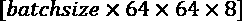。通道编号为 。全局平均池化操作计算每个通道的平均值，因此输出将具有形状 。 （注意：Keras API中的`GlobalAveragePooling2D`会自动压缩输出。）

如果不进行输出压缩，形状将是 ，因为全局平均池化将把  的空间维度减少到 ：


因此，考虑到在我们案例中，这一层之前的特征图形状为 ，我们期望得到256个单元作为输出，也就是说，输出的形状将是 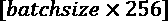。让我们添加这个层并重新计算输出形状，以验证这一点：

```py
>>> model.add(tf.keras.layers.GlobalAveragePooling2D())
>>> model.compute_output_shape(input_shape=(None, 64, 64, 3))
TensorShape([None, 256]) 
```

最后，我们可以添加一个全连接（密集）层，得到一个单一的输出单元。在这种情况下，我们可以指定激活函数为 `'sigmoid'`，或者直接使用 `activation=None`，这样模型将输出logits（而不是类别概率），因为在TensorFlow和Keras中，使用logits进行模型训练更具数值稳定性，如前所述：

```py
>>> model.add(tf.keras.layers.Dense(1, activation=None))
>>> tf.random.set_seed(1)
>>> model.build(input_shape=(None, 64, 64, 3))
>>> model.summary()
Model: "sequential"
_________________________________________________________________
Layer (type)                 Output Shape              Param #   
=================================================================
conv2d (Conv2D)              multiple                  896       
_________________________________________________________________
max_pooling2d (MaxPooling2D) multiple                  0         
_________________________________________________________________
dropout (Dropout)            multiple                  0         
_________________________________________________________________
conv2d_1 (Conv2D)            multiple                  18496     
_________________________________________________________________
max_pooling2d_1 (MaxPooling2 multiple                  0         
_________________________________________________________________
dropout_1 (Dropout)          multiple                  0         
_________________________________________________________________
conv2d_2 (Conv2D)            multiple                  73856     
_________________________________________________________________
max_pooling2d_2 (MaxPooling2 multiple                  0         
_________________________________________________________________
conv2d_3 (Conv2D)            multiple                  295168    
_________________________________________________________________
global_average_pooling2d (Gl multiple                  0         
_________________________________________________________________
dense (Dense)                multiple                  257       
=================================================================
Total params: 388,673
Trainable params: 388,673
Non-trainable params: 0
_________________________________________________________________ 
```

下一步是编译模型，在此时我们需要决定使用什么损失函数。我们有一个二分类任务，输出单元为单一单元，所以我们应该使用 `BinaryCrossentropy`。另外，由于我们最后一层没有应用sigmoid激活（我们使用了 `activation=None`），所以模型的输出是logits，而不是概率。因此，我们还将在 `BinaryCrossentropy` 中指定 `from_logits=True`，这样损失函数会内部应用sigmoid函数，由于底层代码的优化，这比手动执行更高效。编译和训练模型的代码如下：

```py
>>> model.compile(optimizer=tf.keras.optimizers.Adam(),
...     loss=tf.keras.losses.BinaryCrossentropy(from_logits=True),
...               metrics=['accuracy'])
>>> history = model.fit(ds_train, validation_data=ds_valid,
...                     epochs=20,
...                     steps_per_epoch=steps_per_epoch) 
```

现在，让我们可视化学习曲线，并比较每个周期后的训练和验证损失及准确率：

```py
>>> hist = history.history
>>> x_arr = np.arange(len(hist['loss'])) + 1
>>> fig = plt.figure(figsize=(12, 4))
>>> ax = fig.add_subplot(1, 2, 1)
>>> ax.plot(x_arr, hist['loss'], '-o', label='Train loss')
>>> ax.plot(x_arr, hist['val_loss'], '--<', label='Validation loss')
>>> ax.legend(fontsize=15)
>>> ax.set_xlabel('Epoch', size=15)
>>> ax.set_ylabel('Loss', size=15)
>>> ax = fig.add_subplot(1, 2, 2)
>>> ax.plot(x_arr, hist['accuracy'], '-o', label='Train acc.')
>>> ax.plot(x_arr, hist['val_accuracy'], '--<',
...         label='Validation acc.')
>>> ax.legend(fontsize=15)
>>> ax.set_xlabel('Epoch', size=15)
>>> ax.set_ylabel('Accuracy', size=15)
>>> plt.show() 
```

下图展示了训练和验证的损失与准确率：


如学习曲线所示，训练和验证的损失尚未收敛到平稳区域。基于这个结果，我们本可以继续训练更多的 epochs。使用 `fit()` 方法，我们可以按照如下方式继续训练额外的 10 个 epochs：

```py
>>> history = model.fit(ds_train, validation_data=ds_valid,
...                     epochs=30, initial_epoch=20,
...                     steps_per_epoch=steps_per_epoch) 
```

一旦我们对学习曲线感到满意，就可以在保持的测试数据集上评估模型：

```py
>>> ds_test = celeba_test.map(
...   lambda x:preprocess(x, size=IMAGE_SIZE, mode='eval')).batch(32)
>>> test_results = model.evaluate(ds_test)
>>> print('Test Acc: {:.2f}%'.format(test_results[1]*100))
Test Acc: 94.75% 
```

最后，我们已经知道如何使用 `model.predict()` 获取某些测试样本的预测结果。然而，请记住，模型输出的是 logits 而不是概率。如果我们对该二分类问题（具有单个输出单元）的类别成员概率感兴趣，可以使用 `tf.sigmoid` 函数来计算类别 1 的概率（对于多类问题，我们将使用 `tf.math.softmax`）。在下面的代码中，我们将从我们预处理过的测试数据集（`ds_test`）中提取 10 个样本，并运行 `model.predict()` 来获取 logits。然后，我们将计算每个样本属于类别 1 的概率（根据 CelebA 提供的标签，这对应于*男性*），并可视化这些样本及其真实标签和预测概率。请注意，我们首先对 `ds_test` 数据集应用 `unbatch()`，然后再取 10 个样本，否则 `take()` 方法将返回 10 个大小为 32 的批次，而不是 10 个单独的样本：

```py
>>> ds = ds_test.unbatch().take(10)
>>> pred_logits = model.predict(ds.batch(10))
>>> probas = tf.sigmoid(pred_logits)
>>> probas = probas.numpy().flatten()*100
>>> fig = plt.figure(figsize=(15, 7))
>>> for j,example in enumerate(ds):
...     ax = fig.add_subplot(2, 5, j+1)
...     ax.set_xticks([]); ax.set_yticks([])
...     ax.imshow(example[0])
...     if example[1].numpy() == 1:
...         label='M'
...     else:
...         label = 'F'
...     ax.text(
...         0.5, -0.15, 'GT: {:s}\nPr(Male)={:.0f}%'
...         ''.format(label, probas[j]),
...         size=16,
...         horizontalalignment='center',
...         verticalalignment='center',
...         transform=ax.transAxes)
>>> plt.tight_layout()
>>> plt.show() 
```

在下图中，您可以看到 10 个示例图像，以及它们的真实标签和它们属于类别 1（男性）的概率：


类别 1（即 CelebA 数据集中标记为*男性*）的概率列在每个图像下方。如你所见，我们训练的模型在这组 10 个测试样本中只犯了一个错误。

作为一个可选的练习，建议您尝试使用整个训练数据集，而不是我们创建的这个小子集。此外，您还可以更改或修改 CNN 架构。例如，您可以更改不同卷积层中的 dropout 概率和滤波器数量。同时，您也可以用全连接层替代全局平均池化层。如果您使用的是本章中训练的 CNN 架构并应用整个训练数据集，您应该能够达到约 97-99% 的准确率。

# 总结

在本章中，我们学习了卷积神经网络（CNN）及其主要组件。我们从卷积操作开始，研究了 1D 和 2D 的实现方式。接着，我们介绍了 CNN 中常见的另一种层：子采样层或称为池化层。我们主要聚焦于两种最常见的池化形式：最大池化（max-pooling）和平均池化（average-pooling）。

接下来，将所有这些单独的概念结合起来，我们使用 TensorFlow Keras API 实现了深度 CNN。我们实现的第一个网络应用于已经熟悉的 MNIST 手写数字识别问题。

然后，我们在一个包含人脸图像的更复杂数据集上实现了第二个 CNN，并训练该 CNN 进行性别分类。在此过程中，你还了解了数据增强以及如何使用 TensorFlow Dataset 类对人脸图像进行不同的变换。

在下一章，我们将讨论**递归神经网络**（**RNNs**）。RNN 用于学习序列数据的结构，并且具有一些令人着迷的应用，包括语言翻译和图像字幕生成。
