# 第十六章：使用递归神经网络建模顺序数据

在上一章中，我们集中讨论了**卷积神经网络**（**CNNs**）。我们介绍了CNN架构的构建块以及如何在TensorFlow中实现深度CNN。最后，你学习了如何使用CNN进行图像分类。在本章中，我们将探讨**递归神经网络**（**RNNs**），并看到它们在建模顺序数据中的应用。

我们将讨论以下主题：

+   介绍顺序数据

+   使用RNN建模序列

+   长短期记忆（LSTM）

+   截断反向传播通过时间（TBPTT）

+   在TensorFlow中实现多层RNN进行序列建模

+   项目一：RNN情感分析——IMDb电影评论数据集

+   项目二：使用LSTM单元进行RNN字符级语言建模，使用来自儒勒·凡尔纳的《*神秘岛*》的文本数据

+   使用梯度裁剪来避免梯度爆炸

+   介绍*Transformer*模型并理解*自注意力机制*

# 介绍顺序数据

我们通过先了解顺序数据的性质开始讨论RNN，这种数据通常被称为序列数据或**序列**。我们将查看序列的独特属性，这些属性使其与其他类型的数据不同。然后我们将看到如何表示顺序数据，并探讨针对顺序数据的各种模型类别，这些类别基于模型的输入和输出。这样有助于我们在本章中探讨RNN与序列的关系。

## 建模顺序数据——顺序很重要

与其他类型的数据相比，顺序数据的独特之处在于，序列中的元素按特定顺序出现，并且它们彼此之间不是独立的。典型的监督学习机器学习算法假设输入是**独立同分布**（**IID**）的数据，这意味着训练样本是*相互独立*的，并且有相同的底层分布。在这种假设下，训练样本的顺序对模型并不重要。例如，如果我们有一个包含*n*个训练样本的样本集，，我们用这些数据训练机器学习算法时，数据的顺序并不重要。这种情形的例子可以是我们之前使用的鸢尾花数据集。在鸢尾花数据集中，每朵花的测量值是独立的，某朵花的测量结果不会影响其他花的测量结果。

然而，当我们处理序列时，这一假设是不成立的——根据定义，顺序非常重要。预测某只股票的市场价值就是这种情况的一个例子。例如，假设我们有一个包含*n*个训练样本的数据集，其中每个训练样本表示某只股票在某一天的市场价值。如果我们的任务是预测未来三天的股市价值，那么考虑按日期排序的历史股价来推导趋势，而不是随机顺序使用这些训练样本，会更有意义。

**顺序数据与时间序列数据**

时间序列数据是一种特殊类型的顺序数据，其中每个示例都与时间维度相关联。在时间序列数据中，样本在连续的时间戳上采集，因此时间维度决定了数据点之间的顺序。例如，股价和语音或语音记录就是时间序列数据。

另一方面，并非所有的顺序数据都具有时间维度，例如文本数据或DNA序列，尽管这些示例是有序的，但它们并不符合时间序列数据的定义。正如您将在本章中看到的，我们将涵盖一些自然语言处理（NLP）和文本建模的示例，它们不是时间序列数据，但需要注意的是，RNN同样可以用于时间序列数据。

## 序列表示

我们已经确定，数据点之间的顺序在顺序数据中非常重要，因此我们接下来需要找到一种方法，将这个顺序信息融入到机器学习模型中。在本章中，我们将以 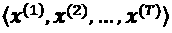 来表示序列。上标索引表示实例的顺序，序列的长度为*T*。为了给出一个合理的序列示例，考虑时间序列数据，其中每个示例点，，对应于某一特定时间点，*t*。下图展示了时间序列数据的一个示例，其中输入特征（*x*）和目标标签（*y*）自然地按时间轴顺序排列；因此，*x* 和 *y* 都是序列：


如我们之前提到的，我们目前讨论的标准神经网络（NN）模型，如多层感知器（MLP）和用于图像数据的卷积神经网络（CNN），假设训练样本彼此独立，因此没有考虑*顺序信息*。我们可以说，这些模型没有*记忆*以前见过的训练样本。例如，样本会经过前馈和反向传播步骤，权重的更新与训练样本处理的顺序无关。

与此相对，循环神经网络（RNN）专门用于建模序列，能够记住过去的信息并根据新事件进行处理，这在处理序列数据时具有明显的优势。

## 序列建模的不同类别

序列建模有许多引人入胜的应用，例如语言翻译（例如，将英语文本翻译成德语）、图像标注和文本生成。然而，为了选择适当的架构和方法，我们必须理解并能够区分这些不同的序列建模任务。下面的图基于*Andrej Karpathy*的优秀文章《递归神经网络的非理性有效性》([http://karpathy.github.io/2015/05/21/rnn-effectiveness/](http://karpathy.github.io/2015/05/21/rnn-effectiveness/))中的解释，总结了最常见的序列建模任务，这些任务取决于输入和输出数据的关系类别：

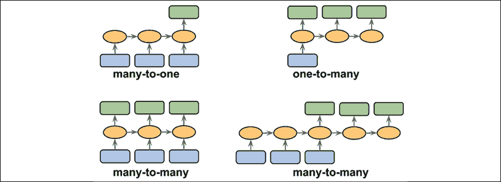

让我们更详细地讨论输入和输出数据之间的不同关系类别，这些类别在之前的图中有所展示。如果输入和输出数据都不是序列，那么我们处理的是标准数据，可能只需使用多层感知机（或本书之前介绍的其他分类模型）来建模此类数据。然而，如果输入或输出是序列，那么建模任务可能属于以下类别之一：

+   **多对一**：输入数据是一个序列，但输出是一个固定大小的向量或标量，而不是一个序列。例如，在情感分析中，输入是基于文本的（例如，一篇电影评论），输出是一个类别标签（例如，表示评论者是否喜欢这部电影的标签）。

+   **一对多**：输入数据是标准格式，而不是序列，但输出是一个序列。这个类别的一个例子是图像标注——输入是一张图像，输出是一个总结该图像内容的英文短语。

+   **多对多**：输入和输出数组都是序列。这个类别可以根据输入和输出是否同步进一步细分。一个同步的多对多建模任务的例子是视频分类，其中视频中的每一帧都被标注。一个*延迟*的多对多建模任务的例子是将一种语言翻译成另一种语言。例如，必须先由机器读取并处理整个英语句子，然后才能生成其德语翻译。

现在，在总结了序列建模的三大类之后，我们可以继续讨论RNN的结构。

# 用于建模序列的RNN

在本节中，在开始在TensorFlow中实现RNN之前，我们将讨论RNN的主要概念。我们将首先查看RNN的典型结构，其中包含递归组件来建模序列数据。然后，我们将研究在典型RNN中神经元激活是如何计算的。这将为我们讨论训练RNN时遇到的常见挑战提供背景，并接着讨论解决这些挑战的方法，例如LSTM和门控递归单元（GRU）。

## 理解 RNN 循环机制

让我们从 RNN 的架构开始。下图显示了一个标准的前馈神经网络和一个 RNN，便于进行比较：


这两个网络只有一个隐藏层。在这个表示中，单元未显示，但我们假设输入层（*x*）、隐藏层（*h*）和输出层（*o*）是包含多个单元的向量。

**确定 RNN 的输出类型**

这种通用 RNN 架构可能对应两种序列建模类别，其中输入是一个序列。通常，循环层可以返回一个序列作为输出，，或者仅返回最后一个输出（在 *t* = *T* 时，即 ）。因此，它可以是多对多的，或者如果我们仅使用最后一个元素，，作为最终输出，则它也可以是多对一的。

正如你稍后将看到的，在 TensorFlow Keras API 中，可以通过将参数`return_sequences`设置为`True`或`False`来指定循环层的行为，分别表示返回一个序列作为输出或仅使用最后一个输出。

在标准的前馈神经网络中，信息从输入层流向隐藏层，然后再从隐藏层流向输出层。另一方面，在 RNN 中，隐藏层的输入来自当前时间步的输入层和前一个时间步的隐藏层。

邻近时间步中隐藏层的信息流动使得网络能够记住过去的事件。这种信息流通常显示为一个循环，也称为**循环边**，在图示符号中就是这种通用 RNN 架构的名字来源。

与多层感知器类似，RNN 也可以包含多个隐藏层。注意，通常约定将只有一个隐藏层的 RNN 称为*单层 RNN*，这与没有隐藏层的单层神经网络（如 Adaline 或逻辑回归）不同。下图展示了一个带有一个隐藏层的 RNN（上图）和一个带有两个隐藏层的 RNN（下图）：


为了检查 RNN 的架构和信息流，可以展开带有循环边的紧凑表示，你可以在前面的图中看到它。

正如我们所知，标准 NN 中的每个隐藏单元只接收一个输入——与输入层相关的网络预激活。相比之下，RNN 中的每个隐藏单元接收两个*不同*的输入——来自输入层的预激活和来自前一个时间步（*t* - 1）的相同隐藏层的激活。

在第一个时间步 *t* = 0 时，隐藏单元被初始化为零或小的随机值。然后，在 *t* > 0 的时间步中，隐藏单元从当前时间的数据点！[](img/B13208_16_007.png)和前一个时间步 *t* – 1 的隐藏单元值接收输入，表示为！[](img/B13208_16_008.png)。

类似地，在多层RNN的情况下，我们可以将信息流总结如下：

+   *层* = 1：这里，隐藏层表示为！[](img/B13208_16_009.png)，并接收来自数据点！[](img/B13208_16_010.png)的输入，以及来自同一层但在前一个时间步的隐藏值！[](img/B13208_16_011.png)。

+   *层* = 2：第二个隐藏层，，接收来自下层的当前时间步的输出（）以及来自前一个时间步的自身隐藏值，。

因为在这种情况下，每个递归层必须接收一个序列作为输入，所以除最后一个层外，所有递归层都必须*返回一个序列作为输出*（即，`return_sequences=True`）。最后一个递归层的行为取决于问题的类型。

## 在RNN中计算激活值

现在你已经了解了RNN的结构和信息流的一般流程，让我们更加具体地计算隐藏层的实际激活值，以及输出层的激活值。为简化起见，我们只考虑一个隐藏层；然而，同样的概念也适用于多层RNN。

我们刚刚看到的RNN表示中的每条有向边（框之间的连接）都与一个权重矩阵相关联。这些权重与时间无关，*t*；因此，它们在时间轴上是共享的。单层RNN中的不同权重矩阵如下：

+   ：输入与隐藏层之间的权重矩阵，*h*

+   ：与递归边相关的权重矩阵

+   ：隐藏层与输出层之间的权重矩阵

这些权重矩阵在下图中表示：


在某些实现中，你可能会看到权重矩阵！[](img/B13208_16_019.png) 和  被合并为一个矩阵！[](img/B13208_16_021.png)。稍后在本节中，我们也将使用这种符号。

计算激活值非常类似于标准的多层感知机和其他类型的前馈神经网络。对于隐藏层，净输入！[](img/B13208_16_022.png)（预激活值）是通过线性组合计算的，即我们计算权重矩阵与相应向量的乘积之和，并加上偏置单元：


然后，隐藏单元在时间步长 *t* 时的激活计算如下：


这里， 是隐藏单元的偏置向量， 是隐藏层的激活函数。

如果你想使用连接的权重矩阵，，则计算隐藏单元的公式将发生变化，如下所示：


一旦计算出当前时间步的隐藏单元的激活值，就会计算输出单元的激活值，如下所示：


为了进一步澄清这一点，以下图展示了使用这两种公式计算激活值的过程：


**使用通过时间反向传播（BPTT）训练RNN**

RNN的学习算法于1990年提出：*反向传播通过时间：它的作用及如何实现*（*Paul Werbos*，*IEEE会议录*，78(10)：1550-1560，*1990*）。

梯度的推导可能有点复杂，但基本思想是整体损失，*L*，是从时间 *t* = 1 到 *t* = *T* 所有损失函数的总和：


由于时间 *t* 的损失依赖于所有之前时间步1 : *t*的隐藏单元，因此梯度将按如下方式计算：


这里， 是通过相邻时间步的乘法计算得出的：


## 隐藏层递归与输出层递归

到目前为止，你已经看到了隐藏层具有递归特性的递归网络。然而，注意还有一种替代模型，其中递归连接来自输出层。在这种情况下，来自前一时间步的输出层的净激活值，，可以通过以下两种方式之一添加：

+   对当前时间步的隐藏层，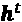（下图显示为输出到隐藏的递归）

+   对当前时间步的输出层，（下图显示为输出到输出的递归）


如前图所示，这些架构之间的差异可以清晰地通过递归连接看到。根据我们的符号，隐藏到隐藏的递归的权重将用  表示，输出到隐藏的递归的权重用  表示，输出到输出的递归的权重用  表示。在一些文献中，与递归连接相关的权重也用  表示。

为了看看这种方法如何在实践中工作，让我们手动计算其中一种循环类型的前向传递。使用TensorFlow Keras API，可以通过`SimpleRNN`定义一个循环层，这类似于输出到输出的递归。在下面的代码中，我们将从`SimpleRNN`创建一个循环层，并对长度为3的输入序列进行前向传递，计算输出。我们还将手动计算前向传递，并将结果与`SimpleRNN`的结果进行比较。首先，让我们创建这个层并为我们的手动计算分配权重：

```py
>>> import tensorflow as tf
>>> tf.random.set_seed(1)
>>> rnn_layer = tf.keras.layers.SimpleRNN(
...     units=2, use_bias=True,
...     return_sequences=True)
>>> rnn_layer.build(input_shape=(None, None, 5))
>>> w_xh, w_oo, b_h = rnn_layer.weights
>>> print('W_xh shape:', w_xh.shape)
>>> print('W_oo shape:', w_oo.shape)
>>> print('b_h  shape:', b_h.shape)
W_xh shape: (5, 2)
W_oo shape: (2, 2)
b_h  shape: (2,) 
```

该层的输入形状是`(None, None, 5)`，其中第一个维度是批次维度（使用`None`表示可变批量大小），第二个维度对应序列（使用`None`表示可变序列长度），最后一个维度对应特征。注意，我们设置了`return_sequences=True`，这对于长度为3的输入序列将导致输出序列为 。否则，它只会返回最终输出， 。

现在，我们将调用`rnn_layer`的前向传递，并手动计算每个时间步的输出并进行比较：

```py
>>> x_seq = tf.convert_to_tensor(
...     [[1.0]*5, [2.0]*5, [3.0]*5],
...     dtype=tf.float32)
>>> ## output of SimepleRNN:
>>> output = rnn_layer(tf.reshape(x_seq, shape=(1, 3, 5)))
>>> ## manually computing the output:
>>> out_man = []
>>> for t in range(len(x_seq)):
...     xt = tf.reshape(x_seq[t], (1, 5))
...     print('Time step {} =>'.format(t))
...     print('   Input           :', xt.numpy())
...     
...     ht = tf.matmul(xt, w_xh) + b_h
...     print('   Hidden          :', ht.numpy())
...     
...     if t>0:
...         prev_o = out_man[t-1]
...     else:
...         prev_o = tf.zeros(shape=(ht.shape))
...     ot = ht + tf.matmul(prev_o, w_oo)
...     ot = tf.math.tanh(ot)
...     out_man.append(ot)
...     print('   Output (manual) :', ot.numpy())
...     print('   SimpleRNN output:'.format(t),
...           output[0][t].numpy())
...     print()
Time step 0 =>
   Input           : [[1\. 1\. 1\. 1\. 1.]]
   Hidden          : [[0.41464037 0.96012145]]
   Output (manual) : [[0.39240566 0.74433106]]
   SimpleRNN output: [0.39240566 0.74433106]
Time step 1 =>
   Input           : [[2\. 2\. 2\. 2\. 2.]]
   Hidden          : [[0.82928073 1.9202429 ]]
   Output (manual) : [[0.80116504 0.9912947 ]]
   SimpleRNN output: [0.80116504 0.9912947 ]
Time step 2 =>
   Input           : [[3\. 3\. 3\. 3\. 3.]]
   Hidden          : [[1.243921  2.8803642]]
   Output (manual) : [[0.95468265 0.9993069 ]]
   SimpleRNN output: [0.95468265 0.9993069 ] 
```

在我们的手动前向计算中，我们使用了双曲正切（tanh）激活函数，因为它也用于`SimpleRNN`（默认激活函数）。从打印的结果可以看出，手动前向计算的输出与每个时间步的`SimpleRNN`层输出完全一致。希望这个动手任务能够启发你了解循环神经网络的奥秘。

## 学习长期交互的挑战

BPTT（之前简要提到的反向传播通过时间）引入了一些新的挑战。由于在计算损失函数的梯度时存在乘法因子 ，因此出现了所谓的**消失**和**爆炸**梯度问题。以下图中的示例解释了这些问题，图中展示了一个仅包含一个隐藏单元的RNN，简化了计算过程：


基本上， 具有 *t* – *k* 次乘法运算；因此，将权重 *w* 自身乘以 *t* – *k* 次，结果得到一个因子，。因此，如果 ，当 *t* – *k* 很大时，这个因子会变得非常小。另一方面，如果递归边的权重是 ，那么当 *t* – *k* 很大时， 会变得非常大。需要注意的是，大的 *t* – *k* 指的是长程依赖。我们可以看出，通过确保 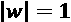，可以得到一个避免梯度消失或爆炸的简单解决方案。如果你有兴趣并希望更详细地了解，可以阅读 *R. Pascanu*、*T. Mikolov* 和 *Y. Bengio* 2012年发表的 *On the difficulty of training recurrent neural networks*（[https://arxiv.org/pdf/1211.5063.pdf](https://arxiv.org/pdf/1211.5063.pdf)）。

在实践中，解决此问题的方案至少有三种：

+   梯度裁剪

+   TBPTT

+   LSTM

使用梯度裁剪时，我们为梯度指定一个截止值或阈值，并将此截止值分配给超出此值的梯度值。相比之下，TBPTT仅限于信号在每次前向传播后反向传播的时间步数。例如，即使序列有100个元素或步骤，我们也许只能反向传播最近的20个时间步。

虽然梯度裁剪和TBPTT都可以解决梯度爆炸问题，但截断限制了梯度有效反向传播并正确更新权重的步骤数。另一方面，LSTM由Sepp Hochreiter和Jürgen Schmidhuber于1997年设计，在解决梯度消失和爆炸问题时，通过使用记忆单元在建模长程依赖方面取得了更大的成功。让我们更详细地讨论LSTM。

## 长短期记忆单元（LSTM）

如前所述，LSTM最初是为了克服梯度消失问题而提出的（*长短期记忆*，*S. Hochreiter* 和 *J. Schmidhuber*，*Neural Computation*，9(8)：1735-1780，*1997*）。LSTM的构建模块是**记忆单元**，它本质上代表或取代了标准RNN的隐藏层。

在每个记忆单元中，都有一条递归边，其权重为我们所讨论的理想值 *w* = 1，用以克服梯度消失和爆炸问题。与此递归边相关的值统称为 **单元状态**。现代LSTM单元的展开结构如下图所示：


注意，从前一个时间步的单元状态！[](img/B13208_16_050.png)被修改以获得当前时间步的单元状态！[](img/B13208_16_051.png)，并没有直接与任何权重因子相乘。这个记忆单元的信息流由几个计算单元（通常称为*门*）控制，这些计算单元将在此处描述。在前图中，表示**元素级乘积**（逐元素乘法），而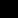表示**元素级求和**（逐元素加法）。此外，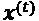表示时间*t*的输入数据，而表示时间*t* - 1的隐藏单元。四个框表示带有激活函数的单元，激活函数可能是sigmoid函数（）或tanh函数，并且有一组权重；这些框通过对输入（即和）执行矩阵向量乘法，应用线性组合。这些带有sigmoid激活函数的计算单元，其输出单位经过处理，称为“门”。

在LSTM单元中，有三种不同类型的门，它们分别是遗忘门、输入门和输出门：

+   **遗忘门**（）允许记忆单元重置单元状态，从而避免无限增长。实际上，遗忘门决定哪些信息允许通过，哪些信息需要抑制。现在，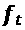的计算方式如下：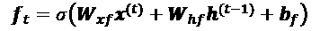

    请注意，遗忘门并不是原始LSTM单元的一部分；它是在几年后被添加进来的，用以改进原始模型（*学习遗忘：LSTM的持续预测*，*F. Gers*，*J. Schmidhuber*，和*F. Cummins*，*神经计算 12*，2451-2471，*2000*）。

+   **输入门**（）和**候选值**（）负责更新单元状态。它们的计算方式如下：

    在时间*t*的单元状态计算如下：

    

+   **输出门**（）决定如何更新隐藏单元的值：

    给定这一点，当前时间步的隐藏单元计算如下：

    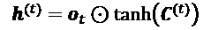

LSTM单元的结构及其底层计算可能看起来非常复杂且难以实现。然而，好消息是，TensorFlow已经将所有内容实现为优化的包装函数，使我们能够轻松高效地定义LSTM单元。我们将在本章后面将RNN和LSTM应用于实际数据集。

**其他先进的RNN模型**

LSTM提供了一种基础的方法，用于建模序列中的长距离依赖关系。然而，值得注意的是，文献中有许多不同类型的LSTM变种（*An Empirical Exploration of Recurrent Network Architectures*，*Rafal Jozefowicz*，*Wojciech Zaremba*，*Ilya Sutskever*，*Proceedings of ICML*，2342-2350，*2015*）。同样值得注意的是，2014年提出的一种更新方法——门控递归单元（GRU）。GRU的架构比LSTM更为简洁，因此在计算上更高效，同时在一些任务（如多音音乐建模）中的表现与LSTM相当。如果你对这些现代RNN架构感兴趣，可以参考*Junyoung Chung*等人的论文*Empirical Evaluation of Gated Recurrent Neural Networks on Sequence Modeling*，*2014*（[https://arxiv.org/pdf/1412.3555v1.pdf](https://arxiv.org/pdf/1412.3555v1.pdf)）。

# 在TensorFlow中实现RNN用于序列建模

现在我们已经覆盖了RNN背后的基础理论，准备进入本章的更实际部分：在TensorFlow中实现RNN。在接下来的章节中，我们将把RNN应用于两个常见的任务：

1.  情感分析

1.  语言建模

这两个项目将在接下来的页面中一起讨论，既有趣又涉及内容丰富。因此，我们不会一次性给出所有代码，而是将实现过程分成几个步骤，并详细讨论代码。如果你想先了解大致框架，并在深入讨论之前看到完整代码，可以先查看代码实现，网址为[https://github.com/rasbt/python-machine-learning-book-3rd-edition/tree/master/ch16](https://github.com/rasbt/python-machine-learning-book-3rd-edition/tree/master/ch16)。

## 项目一——预测IMDb电影评论的情感

你可能还记得在*第8章*，*将机器学习应用于情感分析*中，情感分析是关于分析句子或文本文档中表达的意见。在本节及随后的子节中，我们将使用多层RNN实现情感分析，采用多对一架构。

在下一节中，我们将实现一个多对多的RNN，应用于语言建模。虽然所选择的示例故意简单，以介绍RNN的主要概念，但语言建模有许多有趣的应用，比如构建聊天机器人——赋予计算机直接与人类交谈和互动的能力。

### 准备电影评论数据

在*第8章*的预处理步骤中，我们创建了一个名为`movie_data.csv`的干净数据集，今天我们将再次使用它。首先，我们将导入必要的模块，并将数据读取到pandas `DataFrame`中，如下所示：

```py
>>> import tensorflow as tf
>>> import tensorflow_datasets as tfds
>>> import numpy as np
>>> import pandas as pd
>>> df = pd.read_csv('movie_data.csv', encoding='utf-8') 
```

请记住，这个数据框 `df` 包含两列，分别是 `'review'` 和 `'sentiment'`，其中 `'review'` 包含电影评论的文本（输入特征），而 `'sentiment'` 代表我们想要预测的目标标签（`0` 代表负面情感，`1` 代表正面情感）。这些电影评论的文本由一系列单词组成，RNN 模型将每个序列分类为正面（`1`）或负面（`0`）评论。

然而，在我们将数据输入到 RNN 模型之前，我们需要执行几个预处理步骤：

1.  创建一个 TensorFlow 数据集对象，并将其划分为独立的训练、测试和验证分区。

1.  识别训练数据集中的唯一词。

1.  将每个独特的词映射到一个唯一的整数，并将评论文本编码为编码后的整数（每个唯一词的索引）。

1.  将数据集划分为小批次，作为模型的输入。

让我们从第一步开始：从这个数据框创建一个 TensorFlow 数据集：

```py
>>> ## Step 1: create a dataset
>>> target = df.pop('sentiment')
>>> ds_raw = tf.data.Dataset.from_tensor_slices(
...     (df.values, target.values))
>>> ## inspection:
>>> for ex in ds_raw.take(3):
...     tf.print(ex[0].numpy()[0][ :50], ex[1])
b'In 1974, the teenager Martha Moxley (Maggie Grace)' 1
b'OK... so... I really like Kris Kristofferson and h' 0
b'***SPOILER*** Do not read this, if you think about' 0 
```

现在，我们可以将其划分为训练集、测试集和验证集。整个数据集包含 50,000 个样本。我们将保留前 25,000 个样本用于评估（保留测试集），然后 20,000 个样本用于训练，5,000 个样本用于验证。代码如下：

```py
>>> tf.random.set_seed(1)
>>> ds_raw = ds_raw.shuffle(
...     50000, reshuffle_each_iteration=False)
>>> ds_raw_test = ds_raw.take(25000)
>>> ds_raw_train_valid = ds_raw.skip(25000)
>>> ds_raw_train = ds_raw_train_valid.take(20000)
>>> ds_raw_valid = ds_raw_train_valid.skip(20000) 
```

为了将数据准备好输入到神经网络（NN），我们需要将其编码为数值，如步骤 2 和 3 所提到的那样。为此，我们将首先在训练数据集中找到唯一的单词（标记）。虽然找到唯一的标记是一个可以使用 Python 数据集的过程，但使用 Python 标准库中的 `collections` 包中的 `Counter` 类会更高效。

在接下来的代码中，我们将实例化一个新的 `Counter` 对象（`token_counts`），该对象将收集唯一单词的频率。请注意，在这个特定的应用中（与词袋模型不同），我们只关心唯一词的集合，而不需要词频，它们是作为副产品创建的。为了将文本拆分为单词（或标记），`tensorflow_datasets` 包提供了一个 `Tokenizer` 类。

收集唯一标记的代码如下：

```py
>>> ## Step 2: find unique tokens (words)
>>> from collections import Counter
>>> tokenizer = tfds.features.text.Tokenizer()
>>> token_counts = Counter()
>>> for example in ds_raw_train:
...     tokens = tokenizer.tokenize(example[0].numpy()[0])
...     token_counts.update(tokens)
>>> print('Vocab-size:', len(token_counts))
Vocab-size: 87007 
```

如果你想了解更多关于 `Counter` 的信息，可以参考其文档：[https://docs.python.org/3/library/collections.html#collections.Counter](https://docs.python.org/3/library/collections.html#collections.Counter)。

接下来，我们将把每个独特的单词映射到一个唯一的整数。这可以通过手动使用 Python 字典来完成，其中键是独特的词汇（单词），每个键对应的值是唯一的整数。然而，`tensorflow_datasets` 包已经提供了一个类，`TokenTextEncoder`，我们可以用它来创建这样的映射并对整个数据集进行编码。首先，我们将通过传递唯一的词汇（`token_counts` 包含了词汇和它们的计数，尽管这里计数不需要，因此会被忽略）来从 `TokenTextEncoder` 类创建一个 `encoder` 对象。调用 `encoder.encode()` 方法将把输入文本转换为一个整数值的列表：

```py
>>> ## Step 3: encoding unique tokens to integers
>>> encoder = tfds.features.text.TokenTextEncoder(token_counts)
>>> example_str = 'This is an example!'
>>> print(encoder.encode(example_str))
[232, 9, 270, 1123] 
```

请注意，验证数据或测试数据中可能存在一些在训练数据中没有出现的词汇，因此它们不包含在映射中。如果我们有 *q* 个词汇（即传递给 `TokenTextEncoder` 的 `token_counts` 大小，在此案例中为 87,007），那么所有之前未见过的词汇，因而不在 `token_counts` 中的，将被分配整数 *q* + 1（在我们这个例子中为 87,008）。换句话说，索引 *q* + 1 被保留给未知词汇。另一个保留值是整数 0，它作为占位符来调整序列长度。稍后，当我们在 TensorFlow 中构建 RNN 模型时，我们将更加详细地考虑这两个占位符，0 和 *q* + 1。

我们可以使用数据集对象的 `map()` 方法来相应地转换数据集中的每个文本，就像我们对数据集应用任何其他变换一样。然而，有一个小问题：在这里，文本数据被封装在张量对象中，我们可以通过在激活执行模式下调用张量的 `numpy()` 方法来访问它们。但在通过 `map()` 方法进行转换时，激活执行将被禁用。为了解决这个问题，我们可以定义两个函数，第一个函数将处理输入的张量，就像启用了激活执行模式一样：

```py
>>> ## Step 3-A: define the function for transformation
>>> def encode(text_tensor, label):
...     text = text_tensor.numpy()[0]
...     encoded_text = encoder.encode(text)
...     return encoded_text, label 
```

在第二个函数中，我们将使用 `tf.py_function` 包装第一个函数，将其转换为 TensorFlow 操作符，之后可以通过其 `map()` 方法使用。将文本编码为整数列表的过程可以使用以下代码完成：

```py
>>> ## Step 3-B: wrap the encode function to a TF Op.
>>> def encode_map_fn(text, label):
...     return tf.py_function(encode, inp=[text, label],
...                           Tout=(tf.int64, tf.int64))
>>> ds_train = ds_raw_train.map(encode_map_fn)
>>> ds_valid = ds_raw_valid.map(encode_map_fn)
>>> ds_test = ds_raw_test.map(encode_map_fn)
>>> # look at the shape of some examples:
>>> tf.random.set_seed(1)
>>> for example in ds_train.shuffle(1000).take(5):
...     print('Sequence length:', example[0].shape)
Sequence length: (24,)
Sequence length: (179,)
Sequence length: (262,)
Sequence length: (535,)
Sequence length: (130,) 
```

到目前为止，我们已经将单词序列转换为整数序列。然而，我们仍然有一个问题需要解决——当前的序列长度不同（如执行前面代码后，随机选择的五个例子的结果所示）。尽管一般来说，RNN 可以处理不同长度的序列，但我们仍需要确保每个小批次中的所有序列具有相同的长度，以便能有效地存储在张量中。

为了将具有不同形状元素的数据集划分为 mini-batch，TensorFlow 提供了一种不同的方法 `padded_batch()`（代替 `batch()`），它会自动将要合并为批次的连续元素用占位符值（0）进行填充，从而确保每个批次中的所有序列具有相同的形状。为了通过实际示例说明这一点，假设我们从训练数据集 `ds_train` 中提取一个大小为 8 的小子集，并对该子集应用 `padded_batch()` 方法，`batch_size=4`。我们还将打印合并成 mini-batch 前单个元素的大小，以及结果 mini-batch 的维度：

```py
>>> ## Take a small subset
>>> ds_subset = ds_train.take(8)
>>> for example in ds_subset:
...     print('Individual size:', example[0].shape)
Individual size: (119,)
Individual size: (688,)
Individual size: (308,)
Individual size: (204,)
Individual size: (326,)
Individual size: (240,)
Individual size: (127,)
Individual size: (453,)
>>> ## Dividing the dataset into batches
>>> ds_batched = ds_subset.padded_batch(
...              4, padded_shapes=([-1], []))
>>> for batch in ds_batched:
...     print('Batch dimension:', batch[0].shape)
Batch dimension: (4, 688)
Batch dimension: (4, 453) 
```

如从打印的张量形状中可以观察到，第一批次的列数（即 `.shape[1]`）为 688，这是通过将前四个示例合并成一个批次并使用这些示例的最大大小得到的。这意味着该批次中的其他三个示例已经被填充了必要的零值，以匹配此大小。类似地，第二批次保持其四个示例的最大大小，即 453，并填充其他示例，使它们的长度小于最大长度。

让我们将所有三个数据集分成 mini-batch，每个批次大小为 32：

```py
>>> train_data = ds_train.padded_batch(
...     32, padded_shapes=([-1],[]))
>>> valid_data = ds_valid.padded_batch(
...     32, padded_shapes=([-1],[]))
>>> test_data = ds_test.padded_batch(
...     32, padded_shapes=([-1],[])) 
```

现在，数据已经被转换为适合 RNN 模型的格式，我们将在接下来的子章节中实现该模型。然而，在下一节中，我们将首先讨论特征**嵌入**，这是一种可选但强烈推荐的预处理步骤，用于减少词向量的维度。

### 用于句子编码的嵌入层

在前一步的数据准备过程中，我们生成了相同长度的序列。这些序列的元素是整数，表示唯一单词的*索引*。这些单词索引可以通过几种不同的方式转换为输入特征。一种简单的方法是应用 one-hot 编码，将索引转换为零和一的向量。然后，每个单词将被映射到一个向量，其大小是整个数据集中唯一单词的数量。考虑到唯一单词的数量（词汇表大小）可能达到 ，这也将是我们的输入特征的数量，基于这些特征训练的模型可能会遭遇**维度灾难**。此外，这些特征非常稀疏，因为除了一个以外，所有元素都是零。

一种更优雅的方法是将每个单词映射到一个具有固定大小的向量，向量元素为实数（不一定是整数）。与 one-hot 编码向量不同，我们可以使用有限大小的向量来表示无限多个实数。（理论上，我们可以从给定的区间中提取无限多个实数，例如 [–1, 1]。）

这就是嵌入（embedding）背后的思想，它是一种特征学习技术，我们可以在这里利用它自动学习显著特征来表示数据集中的单词。考虑到唯一单词的数量，，我们可以选择嵌入向量的大小（即嵌入维度）远小于唯一单词的数量（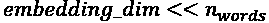），以便将整个词汇表表示为输入特征。

嵌入相对于独热编码的优势如下：

+   通过减少特征空间的维度来降低维度灾难的影响

+   提取显著特征，因为神经网络中的嵌入层可以被优化（或学习）

以下示意图展示了嵌入是如何通过将标记索引映射到一个可训练的嵌入矩阵来工作的：


给定一个包含*n* + 2个标记的集合（*n*是标记集合的大小，索引0保留用于填充占位符，*n* + 1用于表示不在标记集合中的单词），将创建一个大小为的嵌入矩阵，其中矩阵的每一行表示与一个标记相关联的数值特征。因此，当输入一个整数索引*i*时，嵌入层将查找矩阵中索引*i*对应的行，并返回数值特征。嵌入矩阵作为我们的神经网络模型的输入层。在实践中，创建嵌入层可以通过`tf.keras.layers.Embedding`来简便地实现。接下来让我们看一个示例，我们将创建一个模型并添加嵌入层，如下所示：

```py
>>> from tensorflow.keras.layers import Embedding
>>> model = tf.keras.Sequential()
>>> model.add(Embedding(input_dim=100,
...                     output_dim=6,
...                     input_length=20,
...                     name='embed-layer'))
>>> model.summary()
Model: "sequential"
_________________________________________________________________
Layer (type)                 Output Shape              Param #   
=================================================================
embed-layer (Embedding)      (None, 20, 6)             600      
=================================================================
Total params: 6,00
Trainable params: 6,00
Non-trainable params: 0
_________________________________________________________________ 
```

该模型的输入（嵌入层）必须具有2的秩，维度为，其中是序列的长度（在这里通过`input_length`参数设置为20）。例如，迷你批次中的一个输入序列可能是，其中每个元素是唯一单词的索引。输出将具有维度，其中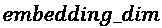是嵌入特征的大小（在这里通过`output_dim`设置为6）。嵌入层的另一个参数`input_dim`对应于模型将接收的唯一整数值（例如，*n* + 2，这里设置为100）。因此，在这种情况下，嵌入矩阵的大小是。

**处理可变序列长度**

请注意，`input_length`参数不是必需的，我们可以在输入序列长度变化的情况下使用`None`。你可以在官方文档中找到更多关于此函数的信息，链接是：[https://www.tensorflow.org/versions/r2.0/api_docs/python/tf/keras/layers/Embedding](https://www.tensorflow.org/versions/r2.0/api_docs/python/tf/keras/layers/Embedding)。

### 构建一个RNN模型

现在我们准备好构建RNN模型了。使用Keras的 `Sequential` 类，我们可以将嵌入层、RNN的循环层和非循环的全连接层结合起来。对于循环层，我们可以使用以下任何一种实现：

+   `SimpleRNN`：一个常规的RNN层，即完全连接的循环层

+   `LSTM`：长短期记忆RNN，用于捕捉长期依赖关系

+   `GRU`：带有门控循环单元的循环层，正如在 *《使用RNN编码器-解码器进行统计机器翻译学习短语表示》*（[https://arxiv.org/abs/1406.1078v3](https://arxiv.org/abs/1406.1078v3)）中提出的，作为LSTM的替代方案

要查看如何使用这些循环层之一构建多层RNN模型，在以下示例中，我们将创建一个RNN模型，首先使用 `input_dim=1000` 和 `output_dim=32` 的嵌入层。然后，添加两个类型为 `SimpleRNN` 的循环层。最后，我们将添加一个非循环的全连接层作为输出层，该层将返回一个单一的输出值作为预测：

```py
>>> from tensorflow.keras import Sequential
>>> from tensorflow.keras.layers import Embedding
>>> from tensorflow.keras.layers import SimpleRNN
>>> from tensorflow.keras.layers import Dense
>>> model = Sequential()
>>> model.add(Embedding(input_dim=1000, output_dim=32))
>>> model.add(SimpleRNN(32, return_sequences=True))
>>> model.add(SimpleRNN(32))
>>> model.add(Dense(1))
>>> model.summary()
Model: "sequential"
_________________________________________________________________
Layer (type)                 Output Shape              Param #   
=================================================================
embedding (Embedding)        (None, None, 32)          32000     
_________________________________________________________________
simple_rnn (SimpleRNN)       (None, None, 32)          2080      
_________________________________________________________________
simple_rnn_1 (SimpleRNN)     (None, 32)                2080      
_________________________________________________________________
dense (Dense)                (None, 1)                 33        
=================================================================
Total params: 36,193
Trainable params: 36,193
Non-trainable params: 0
_________________________________________________________________ 
```

如你所见，使用这些循环层构建RNN模型是相当简单的。在接下来的小节中，我们将回到情感分析任务，并构建一个RNN模型来解决该问题。

### 为情感分析任务构建RNN模型

由于我们有非常长的序列，我们将使用LSTM层来考虑长期效应。此外，我们还会将LSTM层放入 `Bidirectional` 包装器中，这样循环层将从两个方向处理输入序列，从前到后以及反向方向：

```py
>>> embedding_dim = 20
>>> vocab_size = len(token_counts) + 2
>>> tf.random.set_seed(1)
>>> ## build the model
>>> bi_lstm_model = tf.keras.Sequential([
...     tf.keras.layers.Embedding(
...         input_dim=vocab_size,
...         output_dim=embedding_dim,
...         name='embed-layer'),
...     
...     tf.keras.layers.Bidirectional(
...         tf.keras.layers.LSTM(64, name='lstm-layer'),
...         name='bidir-lstm'),
...
...     tf.keras.layers.Dense(64, activation='relu'),
...     
...     tf.keras.layers.Dense(1, activation='sigmoid')
>>> ])
>>> bi_lstm_model.summary()
>>> ## compile and train:
>>> bi_lstm_model.compile(
...     optimizer=tf.keras.optimizers.Adam(1e-3),
...     loss=tf.keras.losses.BinaryCrossentropy(from_logits=False),
...     metrics=['accuracy'])
>>> history = bi_lstm_model.fit(
...     train_data,
...     validation_data=valid_data,
...     epochs=10)
>>> ## evaluate on the test data
>>> test_results = bi_lstm_model.evaluate(test_data)
>>> print('Test Acc.: {:.2f}%'.format(test_results[1]*100))
Epoch 1/10
625/625 [==============================] - 96s 154ms/step - loss: 0.4410 - accuracy: 0.7782 - val_loss: 0.0000e+00 - val_accuracy: 0.0000e+00
Epoch 2/10
625/625 [==============================] - 95s 152ms/step - loss: 0.1799 - accuracy: 0.9326 - val_loss: 0.4833 - val_accuracy: 0.8414
. . .
Test Acc.: 85.15% 
```

在训练此模型10个epoch后，对测试数据的评估显示准确率为85%。 （请注意，与在IMDb数据集上使用的最先进方法相比，这个结果并不是最好的。目标仅仅是展示RNN如何工作。）

**关于双向RNN的更多内容**

`Bidirectional` 包装器对每个输入序列进行两次处理：一次前向传递和一次反向或后向传递（注意，这与反向传播中的前向和后向传递不同）。这些前向和后向传递的结果默认会被连接在一起。但如果你想改变这个行为，可以将参数 `merge_mode` 设置为 `'sum'`（求和）、`'mul'`（将两个传递结果相乘）、`'ave'`（取两个结果的平均值）、`'concat'`（默认值）或 `None`，后者会将两个张量返回为列表。如需了解有关 `Bidirectional` 包装器的更多信息，请查看官方文档：[https://www.tensorflow.org/versions/r2.0/api_docs/python/tf/keras/layers/Bidirectional](https://www.tensorflow.org/versions/r2.0/api_docs/python/tf/keras/layers/Bidirectional)。

我们还可以尝试其他类型的递归层，例如 `SimpleRNN`。然而，事实证明，使用常规递归层构建的模型无法达到良好的预测性能（即使是在训练数据上）。例如，如果你尝试用单向的 `SimpleRNN` 层替换前面代码中的双向 LSTM 层，并用全长序列训练模型，你可能会发现训练过程中损失甚至没有下降。原因是该数据集中的序列过长，因此具有 `SimpleRNN` 层的模型无法学习长期依赖关系，可能会遭遇梯度消失或爆炸的问题。

为了在此数据集上使用 `SimpleRNN` 获得合理的预测性能，我们可以截断序列。此外，利用我们的“领域知识”，我们可能会假设电影评论的最后几段包含大部分关于其情感的信息。因此，我们可以只关注每个评论的最后部分。为此，我们将定义一个辅助函数 `preprocess_datasets()`，以结合预处理步骤 2-4。此函数的一个可选参数是 `max_seq_length`，它决定每个评论应使用多少个标记。例如，如果我们设置 `max_seq_length=100` 并且某个评论的标记数超过 100，那么只会使用最后的 100 个标记。如果将 `max_seq_length` 设置为 `None`，则会像之前一样使用全长序列。尝试不同的 `max_seq_length` 值将为我们提供更多关于不同 RNN 模型处理长序列能力的见解。

`preprocess_datasets()` 函数的代码如下：

```py
>>> from collections import Counter
>>> def preprocess_datasets(
...     ds_raw_train,
...     ds_raw_valid,
...     ds_raw_test,
...     max_seq_length=None,
...     batch_size=32):
...     
...     ## (step 1 is already done)
...     ## Step 2: find unique tokens
...     tokenizer = tfds.features.text.Tokenizer()
...     token_counts = Counter()
...
...     for example in ds_raw_train:
...         tokens = tokenizer.tokenize(example[0].numpy()[0])
...         if max_seq_length is not None:
...             tokens = tokens[-max_seq_length:]
...         token_counts.update(tokens)
...
...     print('Vocab-size:', len(token_counts))
...
...     ## Step 3: encoding the texts
...     encoder = tfds.features.text.TokenTextEncoder(
...                   token_counts)
...     def encode(text_tensor, label):
...         text = text_tensor.numpy()[0]
...         encoded_text = encoder.encode(text)
...         if max_seq_length is not None:
...             encoded_text = encoded_text[-max_seq_length:]
...         return encoded_text, label
...
...     def encode_map_fn(text, label):
...         return tf.py_function(encode, inp=[text, label],
...                               Tout=(tf.int64, tf.int64))
...
...     ds_train = ds_raw_train.map(encode_map_fn)
...     ds_valid = ds_raw_valid.map(encode_map_fn)
...     ds_test = ds_raw_test.map(encode_map_fn)
...
...     ## Step 4: batching the datasets
...     train_data = ds_train.padded_batch(
...         batch_size, padded_shapes=([-1],[]))
...
...     valid_data = ds_valid.padded_batch(
...         batch_size, padded_shapes=([-1],[]))
...
...     test_data = ds_test.padded_batch(
...         batch_size, padded_shapes=([-1],[]))
...
...     return (train_data, valid_data,
...             test_data, len(token_counts)) 
```

接下来，我们将定义另一个辅助函数 `build_rnn_model()`，用于更方便地构建具有不同架构的模型：

```py
>>> from tensorflow.keras.layers import Embedding
>>> from tensorflow.keras.layers import Bidirectional
>>> from tensorflow.keras.layers import SimpleRNN
>>> from tensorflow.keras.layers import LSTM
>>> from tensorflow.keras.layers import GRU
>>> def build_rnn_model(embedding_dim, vocab_size,
...                     recurrent_type='SimpleRNN',
...                     n_recurrent_units=64,
...                     n_recurrent_layers=1,
...                     bidirectional=True):
...
...     tf.random.set_seed(1)
...
...     # build the model
...     model = tf.keras.Sequential()
...     
...     model.add(
...         Embedding(
...             input_dim=vocab_size,
...             output_dim=embedding_dim,
...             name='embed-layer')
...     )
...     
...     for i in range(n_recurrent_layers):
...         return_sequences = (i < n_recurrent_layers-1)
...             
...         if recurrent_type == 'SimpleRNN':
...             recurrent_layer = SimpleRNN(
...                 units=n_recurrent_units,
...                 return_sequences=return_sequences,
...                 name='simprnn-layer-{}'.format(i))
...         elif recurrent_type == 'LSTM':
...             recurrent_layer = LSTM(
...                 units=n_recurrent_units,
...                 return_sequences=return_sequences,
...                 name='lstm-layer-{}'.format(i))
...         elif recurrent_type == 'GRU':
...             recurrent_layer = GRU(
...                 units=n_recurrent_units,
...                 return_sequences=return_sequences,
...                 name='gru-layer-{}'.format(i))
...         
...         if bidirectional:
...             recurrent_layer = Bidirectional(
...                 recurrent_layer, name='bidir-' +
...                 recurrent_layer.name)
...             
...         model.add(recurrent_layer)
...
...     model.add(tf.keras.layers.Dense(64, activation='relu'))
...     model.add(tf.keras.layers.Dense(1, activation='sigmoid'))
...     
...     return model 
```

现在，利用这两个相对通用且便捷的辅助函数，我们可以轻松比较不同的 RNN 模型和不同输入序列长度的表现。作为示例，在下面的代码中，我们将尝试使用一个具有单层 `SimpleRNN` 的模型，并将序列截断为最多 100 个标记的长度：

```py
>>> batch_size = 32
>>> embedding_dim = 20
>>> max_seq_length = 100
>>> train_data, valid_data, test_data, n = preprocess_datasets(
...     ds_raw_train, ds_raw_valid, ds_raw_test,
...     max_seq_length=max_seq_length,
...     batch_size=batch_size
... )
>>> vocab_size = n + 2
>>> rnn_model = build_rnn_model(
...     embedding_dim, vocab_size,
...     recurrent_type='SimpleRNN',
...     n_recurrent_units=64,
...     n_recurrent_layers=1,
...     bidirectional=True)
>>> rnn_model.summary()
Model: "sequential"
_________________________________________________________________
Layer (type)                 Output Shape              Param #   
=================================================================
embed-layer (Embedding)      (None, None, 20)          1161300   
_________________________________________________________________
bidir-simprnn-layer-0 (Bidir (None, 128)               10880     
_________________________________________________________________
Dense    (Dense)             (None, 64)                8256      
_________________________________________________________________
dense_1  (Dense)             (None, 1)                 65        
=================================================================
Total params: 1,180,501
Trainable params: 1,180,501
Non-trainable params: 0
_________________________________________________________________
>>> rnn_model.compile(
...     optimizer=tf.keras.optimizers.Adam(1e-3),
...     loss=tf.keras.losses.BinaryCrossentropy(
...          from_logits=False), metrics=['accuracy'])
>>> history = rnn_model.fit(
...     train_data,
...     validation_data=valid_data,
...     epochs=10)
Epoch 1/10
625/625 [==============================] - 73s 118ms/step - loss: 0.6996 - accuracy: 0.5074 - val_loss: 0.6880 - val_accuracy: 0.5476
Epoch 2/10
>>> results = rnn_model.evaluate(test_data)
>>> print('Test Acc.: {:.2f}%'.format(results[1]*100))
Test Acc.: 80.70% 
```

例如，将序列截断为 100 个标记并使用双向 `SimpleRNN` 层，最终获得了 80% 的分类准确率。尽管与之前的双向 LSTM 模型（在测试数据集上的准确率为 85.15%）相比，预测稍低，但在这些截断序列上的表现要远好于我们用 `SimpleRNN` 对全长电影评论进行建模时的表现。作为一个可选练习，你可以通过使用我们已经定义的两个辅助函数来验证这一点。尝试将 `max_seq_length=None`，并在 `build_rnn_model()` 辅助函数中将 `bidirectional` 参数设置为 `False`。 （为了方便你，这段代码可以在本书的在线材料中找到。）

## 项目二 – 在 TensorFlow 中进行字符级语言建模

语言建模是一项迷人的应用，使机器能够执行与人类语言相关的任务，例如生成英语句子。该领域的一个有趣研究是*生成文本的递归神经网络*，*伊利亚·苏茨凯弗*，*詹姆斯·马滕斯*，*杰弗里·E·辛顿*，*第28届国际机器学习会议论文集（ICML-11）*，*2011年*，[https://pdfs.semanticscholar.org/93c2/0e38c85b69fc2d2eb314b3c1217913f7db11.pdf](https://pdfs.semanticscholar.org/93c2/0e38c85b69fc2d2eb314b3c1217913f7db11.pdf)。

在我们现在要构建的模型中，输入是一个文本文件，我们的目标是开发一个可以生成与输入文件风格相似的新文本的模型。这类输入的示例包括书籍或特定编程语言中的计算机程序。

在字符级语言建模中，输入被分解为一系列字符，并且每次将一个字符输入到我们的网络中。网络将结合先前看到的字符的记忆处理每个新字符，以预测下一个字符。下图展示了一个字符级语言建模的示例（请注意，EOS代表“序列结束”）：

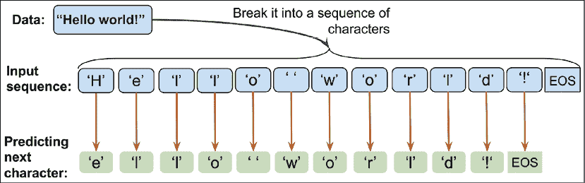

我们可以将此实现分为三个独立的步骤：准备数据、构建RNN模型，以及执行下一个字符预测和采样来生成新文本。

### 数据集预处理

在本节中，我们将准备字符级语言建模的数据。

要获取输入数据，请访问[Project Gutenberg网站](https://www.gutenberg.org/)，该网站提供了成千上万的免费电子书。以我们的示例为例，您可以从[http://www.gutenberg.org/files/1268/1268-0.txt](http://www.gutenberg.org/files/1268/1268-0.txt)下载《神秘岛》一书（由儒勒·凡尔纳于1874年出版）的纯文本格式。

请注意，此链接将直接带您到下载页面。如果您使用的是macOS或Linux操作系统，您可以在终端中使用以下命令下载文件：

```py
curl -O http://www.gutenberg.org/files/1268/1268-0.txt 
```

如果此资源将来无法使用，本章代码库中书籍的代码仓库也包含了该文本的副本，位于[https://github.com/rasbt/python-machine-learning-book-3rd-edition/code/ch16](https://github.com/rasbt/python-machine-learning-book-3rd-edition/code/ch16)。

一旦我们下载了数据集，就可以将其作为纯文本读取到Python会话中。使用以下代码，我们将直接从下载的文件中读取文本，并去掉开头和结尾的部分（这些部分包含一些关于古腾堡项目的描述）。然后，我们将创建一个Python变量`char_set`，表示在此文本中观察到的*唯一*字符集：

```py
>>> import numpy as np
>>> ## Reading and processing text
>>> with open('1268-0.txt', 'r') as fp:
...     text=fp.read()
>>> start_indx = text.find('THE MYSTERIOUS ISLAND')
>>> end_indx = text.find('End of the Project Gutenberg')
>>> text = text[start_indx:end_indx]
>>> char_set = set(text)
>>> print('Total Length:', len(text))
Total Length: 1112350
>>> print('Unique Characters:', len(char_set))
Unique Characters: 80 
```

下载并预处理文本后，我们得到了一个包含1,112,350个字符、80个独特字符的序列。然而，大多数神经网络库和循环神经网络（RNN）实现无法处理字符串格式的输入数据，这就是为什么我们需要将文本转换为数字格式。为此，我们将创建一个简单的Python字典，将每个字符映射到一个整数，`char2int`。我们还需要一个反向映射，将模型的输出结果转换回文本。尽管可以通过使用字典将整数键与字符值关联来实现反向映射，但使用NumPy数组并通过索引数组将索引映射到这些独特的字符更高效。下图展示了将字符转换为整数及其反向操作的示例，以单词`"Hello"`和`"world"`为例：


如前图所示，构建字典以将字符映射到整数，并通过索引NumPy数组进行反向映射如下所示：

```py
>>> chars_sorted = sorted(char_set)
>>> char2int = {ch:i for i,ch in enumerate(chars_sorted)}
>>> char_array = np.array(chars_sorted)
>>> text_encoded = np.array(
...     [char2int[ch] for ch in text],
...     dtype=np.int32)
>>> print('Text encoded shape:', text_encoded.shape)
Text encoded shape: (1112350,)
>>> print(text[:15], '== Encoding ==>', text_encoded[:15])
>>> print(text_encoded[15:21], '== Reverse ==>',
...     ''.join(char_array[text_encoded[15:21]]))
THE MYSTERIOUS == Encoding ==> [44 32 29  1 37 48 43 44 29 42 33 39 45 43  1]
[33 43 36 25 38 28] == Reverse ==> ISLAND 
```

NumPy数组`text_encoded`包含文本中所有字符的编码值。现在，我们将从该数组创建一个TensorFlow数据集：

```py
>>> import tensorflow as tf
>>> ds_text_encoded = tf.data.Dataset.from_tensor_slices(
...                   text_encoded)
>>> for ex in ds_text_encoded.take(5):
...     print('{} -> {}'.format(ex.numpy(), char_array[ex.numpy()]))
44 -> T
32 -> H
29 -> E
1 ->  
37 -> M 
```

到目前为止，我们已经创建了一个可迭代的`Dataset`对象，用于按文本中字符出现的顺序获取字符。现在，让我们回顾一下我们正在尝试做的大局观。对于文本生成任务，我们可以将问题表述为一个分类任务。

假设我们有一组不完整的文本字符序列，如下图所示：


在前面的图中，我们可以将左侧框中显示的序列视为输入。为了生成新的文本，我们的目标是设计一个模型，该模型能够预测给定输入序列的下一个字符，其中输入序列表示一个不完整的文本。例如，在看到 *"Deep Learn"* 后，模型应该预测 *"i"* 作为下一个字符。考虑到我们有80个独特的字符，这个问题变成了一个多类别分类任务。

从长度为1的序列开始（即一个单独的字母），我们可以基于这种多类别分类方法迭代地生成新文本，如下图所示：


为了在TensorFlow中实现文本生成任务，首先我们将序列长度限制为40。这意味着输入张量 *x* 包含40个标记。实际上，序列长度会影响生成文本的质量。较长的序列可能会生成更有意义的句子。然而，对于较短的序列，模型可能会专注于正确捕捉单个词汇，而大部分情况下忽略上下文。尽管较长的序列通常能生成更有意义的句子，但如前所述，对于长序列，RNN模型在捕捉长期依赖时可能会出现问题。因此，实际中，找到合适的序列长度是一项超参数优化问题，我们需要通过经验评估。在这里，我们选择40，因为它提供了一个较好的折衷方案。

如前图所示，输入 *x* 和目标 *y* 相差一个字符。因此，我们将把文本拆分为41个字符的块：前40个字符将构成输入序列 *x*，最后40个元素将构成目标序列 *y*。

我们已经将整个编码后的文本按原始顺序存储在 `Dataset` 对象 `ds_text_encoded` 中。使用本章中已涉及的关于转换数据集的技术（在 *准备电影评论数据* 部分），你能想到一种方法来获得输入 *x* 和目标 *y*，如前图所示吗？答案很简单：我们将首先使用 `batch()` 方法创建每个包含41个字符的文本块。这意味着我们将设置 `batch_size=41`。如果最后一个批次少于41个字符，我们会将其去除。因此，新的分块数据集，命名为 `ds_chunks`，将始终包含41个字符大小的序列。然后，这些41个字符的块将用于构建序列 *x*（即输入），以及序列 *y*（即目标），这两个序列都将包含40个元素。例如，序列 *x* 将由索引[0, 1, …, 39]的元素组成。此外，由于序列 *y* 相对于 *x* 会向右移动一个位置，因此其对应的索引将是[1, 2, …, 40]。然后，我们将使用 `map()` 方法应用一个转换函数，相应地分离 *x* 和 *y* 序列：

```py
>>> seq_length = 40
>>> chunk_size = seq_length + 1
>>> ds_chunks = ds_text_encoded.batch(chunk_size, 
...                                   drop_remainder=True)
>>> ## define the function for splitting x & y
>>> def split_input_target(chunk):
...     input_seq = chunk[:-1]
...     target_seq = chunk[1:]
...     return input_seq, target_seq
>>> ds_sequences = ds_chunks.map(split_input_target) 
```

让我们来看一下从这个转换后的数据集中提取的示例序列：

```py
>>> for example in ds_sequences.take(2):
...     print(' Input (x): ', 
...           repr(''.join(char_array[example[0].numpy()])))
...     print('Target (y): ', 
...           repr(''.join(char_array[example[1].numpy()])))
...     print()
 Input (x):  'THE MYSTERIOUS ISLAND ***\n\n\n\n\nProduced b'
Target (y):  'HE MYSTERIOUS ISLAND ***\n\n\n\n\nProduced by'
 Input (x):  ' Anthony Matonak, and Trevor Carlson\n\n\n\n'
Target (y):  'Anthony Matonak, and Trevor Carlson\n\n\n\n\n' 
```

最后，准备数据集的最后一步是将数据集划分为小批次。在第一次预处理步骤中，我们将数据集划分为批次时，创建了句子块。每个块代表一个句子，对应一个训练样本。现在，我们将重新洗牌训练样本，并再次将输入划分为小批次；不过这一次，每个批次将包含多个训练样本：

```py
>>> BATCH_SIZE = 64
>>> BUFFER_SIZE = 10000
>>> ds = ds_sequences.shuffle(BUFFER_SIZE).batch(BATCH_SIZE) 
```

### 构建字符级RNN模型

现在数据集已经准备好，构建模型将相对简单。为了代码的可重用性，我们将编写一个名为`build_model`的函数，通过Keras的`Sequential`类定义一个RNN模型。然后，我们可以指定训练参数并调用该函数来获取RNN模型：

```py
>>> def build_model(vocab_size, embedding_dim,rnn_units):
...     model = tf.keras.Sequential([
...         tf.keras.layers.Embedding(vocab_size, embedding_dim),
...         tf.keras.layers.LSTM(
...             rnn_units,
...             return_sequences=True),
...         tf.keras.layers.Dense(vocab_size)
...     ])
...     return model
>>> ## Setting the training parameters
>>> charset_size = len(char_array)
>>> embedding_dim = 256
>>> rnn_units = 512
>>> tf.random.set_seed(1)
>>> model = build_model(
...     vocab_size=charset_size,
...     embedding_dim=embedding_dim,
...     rnn_units=rnn_units)
>>> model.summary()
Model: "sequential"
_________________________________________________________________
Layer (type)                 Output Shape              Param #   
=================================================================
embedding (Embedding)        (None, None, 256)         20480     
_________________________________________________________________
lstm (LSTM)                  (None, None, 512)         1574912   
_________________________________________________________________
dense (Dense)                (None, None, 80)          41040     
=================================================================
Total params: 1,636,432
Trainable params: 1,636,432
Non-trainable params: 0
_________________________________________________________________ 
```

请注意，该模型中的LSTM层具有输出形状`(None, None, 512)`，这意味着LSTM的输出是3维的。第一个维度表示批次数，第二个维度表示输出序列的长度，最后一个维度对应隐藏单元的数量。LSTM层输出为3维的原因是我们在定义LSTM层时指定了`return_sequences=True`。全连接层（`Dense`）接收来自LSTM单元的输出，并计算输出序列中每个元素的logits。因此，模型的最终输出也将是一个3维的张量。

此外，我们在最后的全连接层中指定了`activation=None`。这样做的原因是，我们需要将logits作为模型的输出，以便从模型预测中采样生成新文本。采样部分稍后会介绍。现在，让我们开始训练模型：

```py
>>> model.compile(
...     optimizer='adam',
...     loss=tf.keras.losses.SparseCategoricalCrossentropy(
...         from_logits=True
...     ))
>>> model.fit(ds, epochs=20)
Epoch 1/20
424/424 [==============================] - 80s 189ms/step - loss: 2.3437
Epoch 2/20
424/424 [==============================] - 79s 187ms/step - loss: 1.7654
...
Epoch 20/20
424/424 [==============================] - 79s 187ms/step - loss: 1.0478 
```

现在，我们可以评估模型以生成新文本，从给定的短字符串开始。在下一节中，我们将定义一个函数来评估训练好的模型。

### 评估阶段 – 生成新文本段落

我们在上一节中训练的RNN模型返回每个独特字符的logits，大小为80。这些logits可以通过softmax函数轻松转换为概率，即一个特定字符作为下一个字符出现的概率。为了预测序列中的下一个字符，我们可以简单地选择具有最大logit值的元素，这等同于选择具有最高概率的字符。然而，我们并不总是选择具有最高概率的字符，而是希望从输出中（随机）*采样*；否则，模型将始终生成相同的文本。TensorFlow已经提供了一个函数`tf.random.categorical()`，我们可以使用它从分类分布中抽取随机样本。为了理解这一过程，让我们从三个类别[0, 1, 2]中生成一些随机样本，输入logits为[1, 1, 1]。

```py
>>> tf.random.set_seed(1)
>>> logits = [[1.0, 1.0, 1.0]]
>>> print('Probabilities:', tf.math.softmax(logits).numpy()[0])
Probabilities: [0.33333334 0.33333334 0.33333334]
>>> samples = tf.random.categorical(
...     logits=logits, num_samples=10)
>>> tf.print(samples.numpy())
array([[0, 0, 1, 2, 0, 0, 0, 0, 1, 0]]) 
```

如你所见，给定的logits下，各类别的概率是相同的（即，各类别具有相同概率）。因此，如果我们使用一个大样本量（），我们预计每个类别的出现次数将达到样本量的 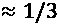。如果我们将logits更改为[1, 1, 3]，那么我们预计类别2会出现更多的次数（当从该分布中抽取大量样本时）：

```py
>>> tf.random.set_seed(1)
>>> logits = [[1.0, 1.0, 3.0]]
>>> print('Probabilities: ', tf.math.softmax(logits).numpy()[0])
Probabilities: [0.10650698 0.10650698 0.78698605]
>>> samples = tf.random.categorical(
...     logits=logits, num_samples=10)
>>> tf.print(samples.numpy())
array([[2, 0, 2, 2, 2, 0, 1, 2, 2, 0]]) 
```

使用 `tf.random.categorical` 函数，我们可以基于模型计算的 logits 生成示例。我们定义一个名为 `sample()` 的函数，接收一个短起始字符串 `starting_str`，并生成一个新字符串 `generated_str`，其初始设置为输入字符串。然后，从 `generated_str` 的末尾取大小为 `max_input_length` 的字符串，并将其编码为整数序列 `encoded_input`。`encoded_input` 被传递给 RNN 模型以计算 logits。需要注意的是，由于我们为 RNN 模型的最后一个循环层指定了 `return_sequences=True`，因此从 RNN 模型的输出是与输入序列相同长度的 logits 序列。因此，RNN 模型输出的每个元素表示模型在观察输入序列后下一个字符的 logits（这里是一个大小为 80 的向量，即字符的总数）。

在这里，我们仅使用输出 `logits` 的最后一个元素（即 ），该元素被传递给 `tf.random.categorical()` 函数以生成一个新的样本。这个新样本被转换为一个字符，然后附加到生成的字符串 `generated_text` 的末尾，使其长度增加 1。然后，此过程重复进行，从 `generated_str` 的末尾取最后 `max_input_length` 个字符，并使用它来生成一个新字符，直到生成字符串的长度达到所需值。将生成序列作为生成新元素的输入的过程称为 *自回归*。

**返回序列作为输出**

您可能会想知道为什么在仅使用最后一个字符来生成新字符并忽略输出的其余部分时我们使用 `return_sequences=True`。虽然这个问题非常合理，但不要忘记我们使用整个输出序列进行训练。损失是基于输出的每个预测而不仅仅是最后一个来计算的。

`sample()` 函数的代码如下所示：

```py
>>> def sample(model, starting_str,
...            len_generated_text=500,
...            max_input_length=40,
...            scale_factor=1.0):
...     encoded_input = [char2int[s] for s in starting_str]
...     encoded_input = tf.reshape(encoded_input, (1, -1))
...
...     generated_str = starting_str
...
...     model.reset_states()
...     for i in range(len_generated_text):
...         logits = model(encoded_input)
...         logits = tf.squeeze(logits, 0)
...
...         scaled_logits = logits * scale_factor
...         new_char_indx = tf.random.categorical(
...             scaled_logits, num_samples=1)
...         
...         new_char_indx = tf.squeeze(new_char_indx)[-1].numpy()
...
...         generated_str += str(char_array[new_char_indx])
...         
...         new_char_indx = tf.expand_dims([new_char_indx], 0)
...         encoded_input = tf.concat(
...             [encoded_input, new_char_indx],
...             axis=1)
...         encoded_input = encoded_input[:, -max_input_length:]
...
...     return generated_str 
```

现在让我们生成一些新文本：

```py
>>> tf.random.set_seed(1)
>>> print(sample(model, starting_str='The island'))
The island is probable that the view of the vegetable discharge on unexplainst felt, a thore, did not
refrain it existing to the greatest
possing bain and production, for a hundred streamled
established some branches of the
holizontal direction. It was there is all ready, from one things from
contention of the Pacific
acid, and
according to an occurry so
summ on the rooms. When numbered the prud Spilett received an exceppering from their head, and by went inhabited.
"What are the most abundance a report 
```

正如你所见，模型生成的大部分单词是正确的，并且在某些情况下，句子部分有意义。您可以进一步调整训练参数，例如用于训练的输入序列的长度，模型架构以及抽样参数（例如 `max_input_length`）。

此外，为了控制生成样本的可预测性（即生成遵循训练文本中学习到的模式的文本，还是增加更多的随机性），RNN 模型计算出的 logits 可以在传递给 `tf.random.categorical()` 进行采样之前进行缩放。缩放因子，，可以解释为物理学中的温度的倒数。较高的温度会导致更多的随机性，而较低的温度则会产生更可预测的行为。通过使用  缩放 logits，softmax 函数计算出的概率变得更加均匀，如以下代码所示：

```py
>>> logits = np.array([[1.0, 1.0, 3.0]])
>>> print('Probabilities before scaling:        ',
...       tf.math.softmax(logits).numpy()[0])
>>> print('Probabilities after scaling with 0.5:',
...       tf.math.softmax(0.5*logits).numpy()[0])
>>> print('Probabilities after scaling with 0.1:',
...       tf.math.softmax(0.1*logits).numpy()[0])
Probabilities before scaling:         [0.10650698 0.10650698 0.78698604]
Probabilities after scaling with 0.5: [0.21194156 0.21194156 0.57611688]
Probabilities after scaling with 0.1: [0.31042377 0.31042377 0.37915245] 
```

如你所见，通过  缩放 logits 会产生接近均匀的概率 [0.31, 0.31, 0.38]。现在，我们可以将生成的文本与  和  进行比较，如下所示：

+   

    ```py
    >>> tf.random.set_seed(1)
    >>> print(sample(model, starting_str='The island',
    ...              scale_factor=2.0))
    The island spoke of heavy torn into the island from the sea.
    The noise of the inhabitants of the island was to be feared that the colonists had come a project with a straight be put to the bank of the island was the surface of the lake and sulphuric acid, and several supply of her animals. The first stranger carried a sort of accessible to break these screen barrels to their distance from the palisade.
    "The first huntil," said the reporter, "and his companions the reporter extended to build a few days a 
    ```

+   

    ```py
    >>> tf.random.set_seed(1)
    >>> print(sample(model, starting_str='The island',
    ...              scale_factor=0.5))
    The island
    glissed in
    ascercicedly useful? loigeh, Cyrus,
    Spileots," henseporvemented
    House to a left
    the centlic moment. Tonsense craw.
    Pencrular ed/ of times," tading had coflently often above anzand?"
    "Wat;" then:y."
    Ardivify he acpearly, howcovered--he hassime; however, fenquests hen adgents!'.? Let us Neg eqiAl?.
    GencNal, my surved thirtyin" ou; is Harding; treuths. Osew apartarned. "N,
    the poltuge of about-but durired with purteg.
    Chappes wason!
    Fears," returned Spilett; "if
    you tear 8t trung 
    ```

结果表明，通过  缩放 logits（提高温度）会生成更多随机的文本。在生成文本的新颖性和正确性之间存在权衡。

在这一节中，我们使用了字符级文本生成，这是一个序列到序列（seq2seq）建模任务。虽然这个例子本身可能并不特别有用，但很容易想到几种这种类型模型的实际应用；例如，可以训练一个类似的 RNN 模型作为聊天机器人，以帮助用户解答简单问题。

# 理解使用 Transformer 模型的语言

本章中，我们使用基于 RNN 的神经网络解决了两个序列建模问题。然而，最近出现了一种新的架构，它在多个自然语言处理任务中已经被证明优于基于 RNN 的 seq2seq 模型。

这种架构被称为 **Transformer**，它能够建模输入和输出序列之间的全局依赖关系，并且在2017年由 Ashish Vaswani 等人在 NeurIPS 论文 *Attention Is All You Need* 中提出（该论文可以在线查阅：[http://papers.nips.cc/paper/7181-attention-is-all-you-need](http://papers.nips.cc/paper/7181-attention-is-all-you-need)）。Transformer 架构基于一种名为 **注意力** 的概念，具体来说，是 **自注意力机制**。我们来回顾一下本章早些时候讨论的情感分析任务。在这种情况下，使用注意力机制意味着我们的模型能够学会集中注意输入序列中与情感相关性更强的部分。

## 理解自注意力机制

本节将解释*自注意力机制*以及它如何帮助 Transformer 模型在自然语言处理（NLP）中聚焦于序列中的重要部分。第一小节将介绍一种非常基础的自注意力形式，以阐明学习文本表示的整体思路。接下来，我们将加入不同的权重参数，从而得到 Transformer 模型中常用的自注意力机制。

### 自注意力的基础版本

为了介绍自注意力背后的基本概念，假设我们有一个长度为 *T* 的输入序列，，以及一个输出序列，。这些序列的每个元素， 和 ，是大小为 *d* 的向量（即，）。然后，对于 seq2seq 任务，自注意力的目标是对输出序列中每个元素与输入元素之间的依赖关系建模。为了实现这一点，注意力机制由三个阶段组成。首先，我们基于当前元素与序列中所有其他元素之间的相似性来推导重要性权重。其次，我们对这些权重进行归一化，这通常涉及使用已熟悉的 softmax 函数。第三，我们将这些权重与相应的序列元素结合使用，以计算注意力值。

更正式地，自注意力的输出是所有输入序列的加权和。例如，对于*第 i* 个输入元素，计算其对应的输出值如下：


在这里，权重，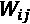，是基于当前输入元素，，与输入序列中所有其他元素之间的相似性来计算的。更具体地，这种相似性是通过当前输入元素，，与输入序列中的另一个元素，，的点积来计算的：


在为*第 i* 个输入以及序列中的所有输入计算这些基于相似性的权重之后（ 到 ），这些“原始”权重（ 到 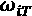）将使用熟悉的 softmax 函数进行归一化，如下所示：


注意，由于应用了 softmax 函数，权重在此归一化后将总和为 1，即，


总结一下，让我们概括自注意力操作背后的三个主要步骤：

1.  对于给定的输入元素，，以及区间 [0，*T*] 中的每个*第 j* 个元素，计算点积，

1.  通过使用 softmax 函数归一化点积来获得权重，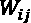

1.  计算输出，，作为对整个输入序列的加权和：

以下图进一步说明这些步骤：


### 用查询、键和值权重参数化自注意力机制

现在，您已经了解了自注意力机制的基本概念，本小节总结了在 Transformer 模型中使用的更高级的自注意力机制。请注意，在上一小节中，我们在计算输出时没有涉及任何可学习的参数。因此，如果我们想要训练一个语言模型，并希望通过改变注意力值来优化目标，例如最小化分类错误，我们就需要更改每个输入元素的词嵌入（即输入向量）！[](img/B13208_16_114.png)。换句话说，使用前面介绍的基本自注意力机制，Transformer 模型在优化给定序列时，更新或更改注意力值的能力相当有限。为了使自注意力机制更加灵活，并便于模型优化，我们将引入三个额外的权重矩阵，这些矩阵可以在模型训练期间作为模型参数进行拟合。我们将这三个权重矩阵表示为！[](img/B13208_16_115.png)，！[](img/B13208_16_116.png)，和！[](img/B13208_16_117.png)。它们用于将输入投影到*查询*、*键*和*值*序列元素：

+   查询序列： 对应 ，

+   关键序列： 对应 ，

+   值序列： 对应 

这里，！[](img/B13208_16_124.png) 和！[](img/B13208_16_125.png)都是大小为！[](img/B13208_16_126.png)的向量。因此，投影矩阵！[](img/B13208_16_127.png) 和！[](img/B13208_16_128.png)的形状为！[](img/B13208_16_129.png)，而！[](img/B13208_16_130.png)的形状为！[](img/B13208_16_131.png)。为了简化，我们可以设计这些向量具有相同的形状，例如使用！[](img/B13208_16_132.png)。现在，我们可以计算查询和键之间的点积，而不是计算给定输入序列元素！[](img/B13208_16_133.png)与*第j*个序列元素！[](img/B13208_16_134.png)之间的未归一化权重的成对点积：

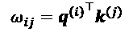

然后，我们可以进一步使用 *m*，或更准确地说，！[](img/B13208_16_136.png)，来缩放 ，然后通过 softmax 函数对其进行归一化，如下所示：


请注意，通过  缩放 ，可以确保权重向量的欧几里得长度大致处于相同范围内。

## 多头注意力和 Transformer 块

另一个大大提升自注意力机制判别能力的技巧是**多头注意力**（**MHA**），它将多个自注意力操作组合在一起。在这种情况下，每个自注意力机制被称为*头*，可以并行计算。使用*r*个并行头，每个头都会产生一个大小为*m*的向量*h*。这些向量随后被串联起来，得到一个形状为的向量*z*。最后，使用输出矩阵对串联向量进行投影，得到最终输出，如下所示：


Transformer块的架构如下图所示：


请注意，在前面图示的Transformer架构中，我们添加了两个尚未讨论的额外组件。其中一个组件是*残差连接*，它将层（或多个层）的输出添加到其输入中，也就是说，*x* + *layer*(*x*)。由一个层（或多个层）与这种残差连接组成的模块称为*残差块*。前面图示中的Transformer模块包含两个残差块。

另一个新的组件是*层归一化*，在前面图中表示为“Layer norm”。归一化层有一个家族，包括批量归一化，我们将在*第17章*《用于生成新数据的生成对抗网络》中介绍。现在，你可以将层归一化看作是规范化或缩放每层神经网络输入和激活的一种更花哨或更先进的方法。

回到前面图示的Transformer模型，现在我们来讨论这个模型是如何工作的。首先，输入序列传递到MHA层，该层基于我们之前讨论的自注意力机制。此外，输入序列通过残差连接添加到MHA层的输出中——这确保了在训练过程中早期的层将接收到足够的梯度信号，这是提高训练速度和收敛性的一种常见技巧。如果你感兴趣，你可以阅读*Deep Residual Learning for Image Recognition*（深度残差学习用于图像识别）一文，作者为*何凯明、张祥宇、任少卿和孙剑*，该文章可以在[http://openaccess.thecvf.com/content_cvpr_2016/html/He_Deep_Residual_Learning_CVPR_2016_paper.html](http://openaccess.thecvf.com/content_cvpr_2016/html/He_Deep_Residual_Learning_CVPR_2016_paper.html)免费获取。

在将输入序列添加到MHA层的输出后，通过层归一化对输出进行归一化。然后，这些归一化信号通过一系列MLP（即全连接）层，这些层还具有残差连接。最后，残差块的输出再次进行归一化，并作为输出序列返回，可用于序列分类或序列生成。

为了节省空间，省略了Transformer模型的实现和训练说明。然而，有兴趣的读者可以在官方TensorFlow文档中找到出色的实现和详细说明，链接如下：

[https://www.tensorflow.org/tutorials/text/transformer](https://www.tensorflow.org/tutorials/text/transformer)。

# 总结

在本章中，您首先了解了使序列与其他类型的数据（如结构化数据或图像）不同的特性。然后，我们介绍了用于序列建模的RNN基础知识。您了解了基本RNN模型的工作原理，并讨论了其在捕获序列数据中的长期依赖方面的局限性。接下来，我们介绍了LSTM单元，它包括门控机制以减少基本RNN模型中常见的梯度爆炸和消失问题的影响。

讨论了RNN背后的主要概念后，我们使用Keras API实现了几个具有不同递归层的RNN模型。特别是，我们实现了一个用于情感分析的RNN模型，以及一个用于生成文本的RNN模型。最后，我们介绍了Transformer模型，它利用自注意力机制来集中关注序列中的相关部分。

在下一章中，您将学习生成模型，特别是在计算机视觉社区中展示了显著结果的**生成对抗网络**（**GANs**）的相关视觉任务。
