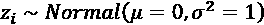
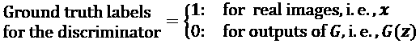
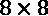
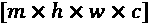
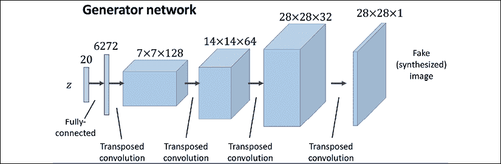
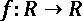
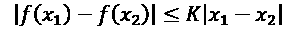

# 第十七章：用于合成新数据的生成对抗网络

在上一章，我们重点介绍了用于建模序列的**循环神经网络**。在本章中，我们将探索**生成对抗网络**（**GANs**）并了解其在合成新数据样本中的应用。GANs被认为是深度学习中的最重要突破，它允许计算机生成新数据（例如新图像）。

本章将涵盖以下主题：

+   引入用于合成新数据的生成模型

+   自编码器、**变分自编码器**（**VAEs**）及其与GAN的关系

+   了解GAN的构建模块

+   实现一个简单的GAN模型来生成手写数字

+   了解转置卷积和**批归一化**（**BatchNorm**或**BN**）

+   改进GAN：深度卷积GAN和使用Wasserstein距离的GAN

# 引入生成对抗网络

让我们首先来看一下GAN模型的基础。GAN的总体目标是合成具有与训练数据集相同分布的新数据。因此，GAN在其原始形式下被认为是无监督学习类别中的机器学习任务，因为不需要标注数据。然而，值得注意的是，对原始GAN的扩展可以同时应用于半监督和监督任务。

2014年，Ian Goodfellow及其同事首次提出了通用的GAN概念，作为一种使用深度神经网络（NNs）合成新图像的方法（Goodfellow, I., Pouget-Abadie, J., Mirza, M., Xu, B., Warde-Farley, D., Ozair, S., Courville, A.和Bengio, Y.，《生成对抗网络》，发表于《神经信息处理系统进展》，第2672-2680页，2014年）。虽然这篇论文中提出的最初GAN架构是基于完全连接的层，类似于多层感知机架构，并且训练生成低分辨率的MNIST风格手写数字，但它更多的是作为一个概念验证，展示了这种新方法的可行性。

然而，自从它的提出以来，原作者以及许多其他研究人员提出了众多改进和不同领域的应用。例如，在计算机视觉中，GANs被用于图像到图像的转换（学习如何将输入图像映射到输出图像）、图像超分辨率（从低分辨率版本生成高分辨率图像）、图像修复（学习如何重建图像中缺失的部分）等多个应用。比如，最近GAN研究的进展已经导致了能够生成新高分辨率人脸图像的模型。此类高分辨率图像的示例可以在[https://www.thispersondoesnotexist.com/](https://www.thispersondoesnotexist.com/)上找到，该网站展示了由GAN生成的合成面部图像。

## 从自编码器开始

在我们讨论GAN如何工作之前，我们首先从自动编码器开始，自动编码器可以压缩和解压训练数据。虽然标准的自动编码器无法生成新数据，但理解它们的功能将帮助你在下一节中理解GAN。

自动编码器由两个网络连接在一起组成：**编码器**网络和**解码器**网络。编码器网络接收一个与示例 *x* 相关的 *d* 维输入特征向量（即，），并将其编码成一个 *p* 维向量 *z*（即，）。换句话说，编码器的作用是学习如何建模函数 。编码后的向量 *z* 也叫做潜在向量，或潜在特征表示。通常，潜在向量的维度小于输入示例的维度；换句话说，*p* < *d*。因此，我们可以说编码器充当了数据压缩函数的角色。然后，解码器从低维的潜在向量 *z* 解压出 ，我们可以把解码器看作是一个函数，。下图展示了一个简单的自动编码器架构，其中编码器和解码器部分各自只包含一个全连接层：


**自动编码器与降维之间的关系**

在*第5章*，*通过降维压缩数据*，你学习了降维技术，如主成分分析（PCA）和线性判别分析（LDA）。自动编码器也可以作为一种降维技术。事实上，当两个子网络（编码器和解码器）中都没有非线性时，自动编码器方法*几乎与PCA相同*。

在这种情况下，如果我们假设单层编码器（没有隐藏层和非线性激活函数）的权重用矩阵 *U* 表示，那么编码器建模 。类似地，单层线性解码器建模 。将这两个组件结合起来，我们得到了 。这正是PCA所做的，唯一的区别是PCA有一个附加的正交归一约束：。

虽然前面的图展示了一个没有隐藏层的编码器和解码器的自动编码器，但我们当然可以添加多个带有非线性的隐藏层（如多层神经网络）来构建一个深度自动编码器，它能够学习更有效的数据压缩和重建功能。此外，注意到这一节中提到的自动编码器使用的是全连接层。当我们处理图像时，我们可以用卷积层替代全连接层，正如你在*第15章*，*使用深度卷积神经网络分类图像*中学到的那样。

**基于潜在空间大小的其他类型的自动编码器**

如前所述，自编码器的潜在空间维度通常低于输入的维度（*p* < *d*），这使得自编码器适用于降维。因此，潜在向量通常也被称为“瓶颈”，这种特定配置的自编码器被称为*欠完备*。然而，还有一种不同类型的自编码器，称为*过完备*，在这种情况下，潜在向量的维度，*z*，实际上大于输入示例的维度（*p* > *d*）。

在训练过完备自编码器时，会出现一个简单的解决方案，其中编码器和解码器可以仅通过学习复制（记忆）输入特征到其输出层。显然，这个解决方案并不是很有用。然而，通过对训练过程进行一些修改，过完备自编码器可以用于*降噪*。

在这种情况下，在训练过程中，会向输入示例中添加随机噪声，，网络学习从噪声信号中重建干净的示例，*x*，。然后，在评估时，我们提供自然带有噪声的新示例（即，噪声已经存在，因此不再添加额外的人工噪声，），以从这些示例中去除已有的噪声。这种特定的自编码器架构和训练方法被称为*去噪自编码器*。

如果您感兴趣，可以通过Vincent等人的研究文章《*堆叠去噪自编码器：通过局部去噪标准在深度网络中学习有用的表示*》进一步了解，该文章可以免费访问：[http://www.jmlr.org/papers/v11/vincent10a.html](http://www.jmlr.org/papers/v11/vincent10a.html)。

## 用于合成新数据的生成模型

自编码器是确定性模型，这意味着在自编码器训练完成后，给定输入，*x*，它将能够从其在低维空间中的压缩版本中重建输入。因此，它无法生成超出通过压缩表示的转换重建其输入的新数据。

另一方面，生成模型可以从一个随机向量，*z*（对应于潜在表示），生成一个新的示例，。生成模型的示意图如下所示。随机向量，*z*，来自一个简单的分布，具有完全已知的特征，因此我们可以轻松地从该分布中采样。例如，*z* 的每个元素可以来自范围[–1, 1]内的均匀分布（我们可以写作），或者来自标准正态分布（在这种情况下，我们写作）。


当我们将注意力从自编码器转移到生成模型时，你可能已经注意到自编码器的解码器组件与生成模型有些相似。特别是，它们都接收潜在向量*z*作为输入，并返回与*x*相同空间的输出。（对于自编码器，是输入*x*的重构，对于生成模型，是合成的样本。）

然而，两者之间的主要区别在于我们不知道自编码器中*z*的分布，而在生成模型中，*z*的分布是完全可以表征的。不过，将自编码器推广为生成模型是可能的。一种方法是**变分自编码器（VAEs）**。

在VAE中，接收到输入示例*x*时，编码器网络被修改成这样一种形式，使其计算潜在向量的两个时刻：均值，，和方差，。在VAE的训练过程中，网络被迫使这些时刻与标准正态分布的时刻匹配（即均值为零，方差为单位）。然后，在VAE模型训练完成后，编码器被丢弃，我们可以使用解码器网络通过输入来自“学习”高斯分布的随机*z*向量来生成新的示例，。

除了变分自编码器（VAEs），还有其他类型的生成模型，例如*自回归模型*和*正则化流模型*。然而，在本章中，我们只会专注于GAN模型，后者是深度学习中最现代且最流行的生成模型之一。

**什么是生成模型？**

请注意，生成模型通常定义为模拟数据输入分布的算法，*p*(*x*)，或者输入数据与相关目标的联合分布，*p*(*x*, *y*)。按照定义，这些模型也能从某些特征中采样，，并且条件于另一个特征，，这称为*条件推理*。然而，在深度学习的背景下，*生成模型*这个术语通常指的是生成逼真数据的模型。这意味着我们可以从输入分布*p*(*x*)中采样，但不一定能够进行条件推理。

## 使用GAN生成新样本

简而言之，为了理解GAN的作用，我们首先假设有一个网络，它接收一个从已知分布中采样的随机向量*z*并生成输出图像*x*。我们将这个网络称为**生成器**（*G*），并使用符号表示生成的输出。假设我们的目标是生成一些图像，例如人脸图像、建筑物图像、动物图像，甚至是像MNIST这样的手写数字。

像往常一样，我们将用随机权重初始化这个网络。因此，在这些权重调整之前，第一次输出的图像看起来像白噪声。现在，假设存在一个可以评估图像质量的函数（我们称之为 *评估函数*）。

如果存在这样的函数，我们可以利用该函数的反馈来告诉生成器网络如何调整其权重，以提高生成图像的质量。通过这种方式，我们可以基于评估函数的反馈训练生成器，使其学习改善输出，朝着生成真实感图像的方向努力。

尽管前述的评估函数会使图像生成任务变得非常简单，但问题在于是否存在这样一个通用函数来评估图像质量，如果存在，它又是如何定义的。显然，作为人类，我们可以轻松地评估当我们观察网络输出时图像的质量；尽管我们目前还不能（暂时）将这一结果从大脑反向传播到网络。那么，如果我们的脑袋能够评估合成图像的质量，我们能否设计一个神经网络模型来做同样的事情？实际上，这正是 GAN 的基本思想。如以下图所示，GAN 模型包含一个额外的神经网络，称为 **判别器** (*D*)，它是一个分类器，学习区分合成图像  和真实图像 *x*：


在 GAN 模型中，生成器和判别器两个网络是一起训练的。最初，在初始化模型权重后，生成器创建的图像看起来不真实。类似地，判别器也难以区分真实图像和生成器合成的图像。但随着时间的推移（即通过训练），两个网络会随着相互作用变得越来越好。实际上，这两个网络玩的是一种对抗性游戏，生成器学习提高其输出，以便能够欺骗判别器。同时，判别器变得更擅长检测合成图像。

## 理解 GAN 模型中生成器和判别器网络的损失函数

GANs 的目标函数，如 Goodfellow 等人在原始论文 *Generative Adversarial Nets* 中所描述的 ([https://papers.nips.cc/paper/5423-generative-adversarial-nets.pdf](https://papers.nips.cc/paper/5423-generative-adversarial-nets.pdf))，如下所示：


这里，！[](img/B13208_17_025.png)被称为*价值函数*，它可以解释为一种收益：我们希望相对于判别器（*D*）最大化其值，同时相对于生成器（*G*）最小化其值，即！[](img/B13208_17_026.png)。*D*（*x*）是一个概率，表示输入样本*x*是否为真实的（即，是否为生成的）。表达式！[](img/B13208_17_027.png)指的是相对于数据分布（真实样本的分布）的期望值；！[](img/B13208_17_028.png)指的是相对于输入*z*向量分布的期望值。

一个包含这种价值函数的GAN模型训练步骤需要两次优化： (1) 最大化判别器的收益，(2) 最小化生成器的收益。训练GAN的一个实用方法是交替进行这两次优化步骤： (1) 固定（冻结）一个网络的参数，优化另一个网络的权重，(2) 固定第二个网络并优化第一个网络。这个过程应在每次训练迭代时重复。假设生成器网络被固定，我们想要优化判别器。价值函数中的两项！[](img/B13208_17_029.png)都会对优化判别器产生贡献，其中第一项对应于真实样本的损失，第二项则是假样本的损失。因此，当*G*被固定时，我们的目标是*最大化*！[](img/B13208_17_030.png)，即使判别器更好地区分真实图像和生成图像。

在使用真实样本和假样本的损失项优化判别器后，我们接着固定判别器并优化生成器。在这种情况下，只有公式中第二项！[](img/B13208_17_031.png)会对生成器的梯度产生贡献。因此，当*D*被固定时，我们的目标是*最小化*！[](img/B13208_17_032.png)，其表达式可以写为！[](img/B13208_17_033.png)。正如Goodfellow等人在原始GAN论文中提到的，这个函数！[](img/B13208_17_034.png)在训练初期会出现梯度消失问题。其原因在于，在学习过程的初期，*G*（*z*）的输出与真实样本差异很大，因此*D*（*G*（*z*））的值将以很高的置信度接近零。这个现象称为*饱和*。为了解决这个问题，我们可以通过将最小化目标！[](img/B13208_17_035.png)重新写为！[](img/B13208_17_036.png)来重新构造。

这一替换意味着在训练生成器时，我们可以交换真实和伪造样本的标签，并执行常规的函数最小化。换句话说，尽管生成器合成的示例是假的，因此标记为0，但我们可以通过将标签设置为1来翻转标签，并*最小化*这些新标签下的二元交叉熵损失，而不是最大化！[](img/B13208_17_036.png)。

现在我们已经介绍了训练GAN模型的常规优化过程，接下来我们来探讨在训练GAN时可以使用的各种数据标签。由于判别器是一个二元分类器（类标签分别为0和1，表示伪造和真实图像），因此我们可以使用二元交叉熵损失函数。因此，我们可以按如下方式确定判别器损失的地面真相标签：



那么训练生成器的标签应该是什么呢？因为我们希望生成器合成真实的图像，所以当生成器的输出没有被判别器分类为真实时，我们希望对生成器进行惩罚。这意味着我们在计算生成器的损失函数时，将假定生成器输出的地面真相标签为1。

将所有内容汇总，以下图展示了一个简单GAN模型中的各个步骤：


在接下来的章节中，我们将从零开始实现一个GAN，生成新的手写数字。

# 从零开始实现GAN

在本节中，我们将介绍如何实现和训练一个GAN模型来生成新的图像，比如MNIST数字。由于在普通中央处理单元（CPU）上训练可能需要很长时间，在接下来的子节中，我们将介绍如何设置Google Colab环境，这样我们就可以在图形处理单元（GPU）上运行计算。

## 在Google Colab上训练GAN模型

本章中的一些代码示例可能需要大量计算资源，这些资源超出了普通笔记本电脑或没有GPU的工作站的能力。如果您已经有一台配备NVIDIA GPU的计算机，并且已安装CUDA和cuDNN库，那么您可以使用它来加速计算。

然而，由于我们很多人没有高性能的计算资源，我们将使用Google Colaboratory环境（通常称为Google Colab），它是一个免费的云计算服务（在大多数国家/地区都可用）。

Google Colab提供了基于云运行的Jupyter Notebook实例；这些笔记本可以保存在Google Drive或GitHub上。尽管该平台提供了多种不同的计算资源，如CPU、GPU甚至张量处理单元（TPU），但需要强调的是，执行时间目前限制为12小时。因此，任何运行超过12小时的笔记本将会被中断。

本章中的代码块最大需要的计算时间为两到三小时，因此这不会成为问题。然而，如果你决定在其他项目中使用 Google Colab 并且这些项目的运行时间超过 12 小时，请务必使用检查点并保存中间检查点。

**Jupyter Notebook**

Jupyter Notebook 是一个图形用户界面（GUI），用于交互式运行代码，并将代码与文本文档和图形交织在一起。由于其多功能性和易用性，它已成为数据科学中最受欢迎的工具之一。

如需了解有关 Jupyter Notebook 图形用户界面的更多信息，请查看官方文档：[https://jupyter-notebook.readthedocs.io/en/stable/](https://jupyter-notebook.readthedocs.io/en/stable/)。本书中的所有代码也以 Jupyter 笔记本的形式提供，简短的介绍可以在第一章的代码目录中找到：[https://github.com/rasbt/python-machine-learning-book-3rd-edition/tree/master/ch01#pythonjupyter-notebook](https://github.com/rasbt/python-machine-learning-book-3rd-edition/tree/master/ch01#pythonjupyter-notebook)。

最后，我们强烈推荐 Adam Rule 等人撰写的文章 *Ten simple rules for writing and sharing computational analyses in Jupyter Notebooks*，该文章介绍了如何在科学研究项目中有效使用 Jupyter Notebook，文章可以在[https://journals.plos.org/ploscompbiol/article?id=10.1371/journal.pcbi.1007007](https://journals.plos.org/ploscompbiol/article?id=10.1371/journal.pcbi.1007007)免费下载。

访问 Google Colab 非常简单。你可以访问 [https://colab.research.google.com](https://colab.research.google.com)，该网址会自动带你进入一个提示窗口，在这里你可以看到现有的 Jupyter 笔记本。在这个提示窗口中，点击**GOOGLE DRIVE**标签，如下图所示。这是你将保存笔记本的地方。

然后，点击提示窗口底部的链接**NEW PYTHON 3 NOTEBOOK**以创建一个新的笔记本：


这将为你创建并打开一个新的笔记本。你在此笔记本中编写的所有代码示例将自动保存，你以后可以通过 Google Drive 中名为 Colab Notebooks 的目录访问该笔记本。

在下一步中，我们将利用 GPU 运行本笔记本中的代码示例。为此，在本笔记本的菜单栏中，从**运行时**选项中点击**更改运行时类型**，并选择**GPU**，如图所示：


在最后一步，我们只需要安装本章所需的 Python 包。Colab Notebooks 环境已经预装了某些包，如 NumPy、SciPy 和最新的稳定版本的 TensorFlow。然而，在撰写本文时，Google Colab 上的最新稳定版本是 TensorFlow 1.15.0，但我们希望使用 TensorFlow 2.0。因此，首先，我们需要通过在 notebook 的新单元格中执行以下命令来安装带 GPU 支持的 TensorFlow 2.0：

```py
! pip install -q tensorflow-gpu==2.0.0 
```

（在 Jupyter Notebook 中，以感叹号开头的单元格将被解释为 Linux shell 命令。）

现在，我们可以通过以下代码来测试安装并验证 GPU 是否可用：

```py
>>> import tensorflow as tf
>>> print(tf.__version__)
'2.0.0'
>>> print("GPU Available:", tf.test.is_gpu_available())
GPU Available: True
>>> if tf.test.is_gpu_available():
...     device_name = tf.test.gpu_device_name()
... else:
...     device_name = '/CPU:0'
>>> print(device_name)
'/device:GPU:0' 
```

此外，如果你想将模型保存到个人的 Google Drive，或者传输或上传其他文件，你需要挂载 Google Drive。为此，请在 notebook 中的新单元格中执行以下操作：

```py
>>> from google.colab import drive
>>> drive.mount('/content/drive/') 
```

这将提供一个链接，用于验证 Colab Notebook 访问你的 Google Drive。在按照验证步骤操作后，它会提供一个认证代码，你需要将其复制并粘贴到刚才执行的单元格下方的指定输入框中。然后，你的 Google Drive 将被挂载，并可以在 `/content/drive/My Drive` 位置访问。

## 实现生成器和判别器网络

我们将通过实现一个生成器和判别器的第一版 GAN 模型开始，其中生成器和判别器是两个完全连接的网络，包含一个或多个隐藏层（见下图）。

这是原始的 GAN 版本，我们将其称为 *原生 GAN*。

在这个模型中，对于每个隐藏层，我们将应用带泄漏的 ReLU 激活函数。ReLU 的使用会导致稀疏梯度，这在我们希望对所有输入值范围的梯度进行计算时可能不太合适。在判别器网络中，每个隐藏层后面还会接一个 dropout 层。此外，生成器中的输出层使用双曲正切（tanh）激活函数。（推荐在生成器网络中使用 tanh 激活函数，因为它有助于学习过程。）

判别器中的输出层没有激活函数（即线性激活）来获取 logits。或者，我们可以使用 sigmoid 激活函数来获得概率作为输出：


**带泄漏的修正线性单元（ReLU）激活函数**

在*第 13 章*，*使用 TensorFlow 并行化神经网络训练*，我们讨论了在神经网络模型中可以使用的不同非线性激活函数。如果你还记得，ReLU 激活函数定义为 ，它会抑制负的（预激活）输入；也就是说，负输入会被设为零。因此，使用 ReLU 激活函数可能会导致反向传播时梯度稀疏。稀疏梯度并不总是有害的，甚至可以对分类模型有益。然而，在某些应用中，例如 GANs，获取完整输入值范围的梯度是有益的，我们可以通过对 ReLU 函数做小幅修改来实现这一点，使其对负输入也输出小的值。这个修改版本的 ReLU 函数也被称为*泄漏 ReLU*。简而言之，泄漏 ReLU 激活函数允许负输入也产生非零梯度，因此，它使网络整体上更具表现力。

泄漏 ReLU 激活函数定义如下：


在这里， 确定了负（预激活）输入的斜率。

我们将为每个网络定义两个辅助函数，从 Keras `Sequential` 类实例化一个模型，并按描述添加各层。代码如下：

```py
>>> import tensorflow as tf
>>> import tensorflow_datasets as tfds
>>> import numpy as np
>>> import matplotlib.pyplot as plt
>>> ## define a function for the generator:
>>> def make_generator_network(
...         num_hidden_layers=1,
...         num_hidden_units=100,
...         num_output_units=784):
...
...     model = tf.keras.Sequential()
...     for i in range(num_hidden_layers):
...         model.add(
...             tf.keras.layers.Dense(
...                 units=num_hidden_units, use_bias=False))
...         model.add(tf.keras.layers.LeakyReLU())
...         
...     model.add(
...         tf.keras.layers.Dense(
...             units=num_output_units, activation='tanh'))
...     return model
>>> ## define a function for the discriminator:
>>> def make_discriminator_network(
...         num_hidden_layers=1,
...         num_hidden_units=100,
...         num_output_units=1):
...
...     model = tf.keras.Sequential()
...     for i in range(num_hidden_layers):
...         model.add(
...             tf.keras.layers.Dense(units=num_hidden_units))
...         model.add(tf.keras.layers.LeakyReLU())
...         model.add(tf.keras.layers.Dropout(rate=0.5))
...         
...     model.add(
...         tf.keras.layers.Dense(
...             units=num_output_units, activation=None))
...     return model 
```

接下来，我们将为模型指定训练设置。如你所记得，MNIST 数据集中的图像大小是  像素。（因为 MNIST 只包含灰度图像，所以只有一个颜色通道。）我们还将进一步指定输入向量 *z* 的大小为 20，并使用随机均匀分布来初始化模型权重。由于我们仅为说明目的实现了一个非常简单的 GAN 模型，并且使用的是全连接层，所以我们将在每个网络中只使用一个包含 100 个单元的隐藏层。在下面的代码中，我们将指定并初始化这两个网络，并打印它们的摘要信息：

```py
>>> image_size = (28, 28)
>>> z_size = 20
>>> mode_z = 'uniform' # 'uniform' vs. 'normal'
>>> gen_hidden_layers = 1
>>> gen_hidden_size = 100
>>> disc_hidden_layers = 1
>>> disc_hidden_size = 100
>>> tf.random.set_seed(1)
>>> gen_model = make_generator_network(
...     num_hidden_layers=gen_hidden_layers,
...     num_hidden_units=gen_hidden_size,
...     num_output_units=np.prod(image_size))
>>> gen_model.build(input_shape=(None, z_size))
>>> gen_model.summary()
Model: "sequential"
_________________________________________________________________
Layer (type)                 Output Shape              Param #   
=================================================================
dense (Dense)                multiple                  2000      
_________________________________________________________________
leaky_re_lu (LeakyReLU)      multiple                  0         
_________________________________________________________________
dense_1 (Dense)              multiple                  79184     
=================================================================
Total params: 81,184
Trainable params: 81,184
Non-trainable params: 0
_________________________________________________________________
>>> disc_model = make_discriminator_network(
...     num_hidden_layers=disc_hidden_layers,
...     num_hidden_units=disc_hidden_size)
>>> disc_model.build(input_shape=(None, np.prod(image_size)))
>>> disc_model.summary()
Model: "sequential_1"
_________________________________________________________________
Layer (type)                 Output Shape              Param #   
=================================================================
dense_2 (Dense)              multiple                  78500     
_________________________________________________________________
leaky_re_lu_1 (LeakyReLU)    multiple                  0         
_________________________________________________________________
dropout (Dropout)            multiple                  0         
_________________________________________________________________
dense_3 (Dense)              multiple                  101       
=================================================================
Total params: 78,601
Trainable params: 78,601
Non-trainable params: 0
_________________________________________________________________ 
```

## 定义训练数据集

在下一步中，我们将加载 MNIST 数据集并应用必要的预处理步骤。由于生成器的输出层使用了 tanh 激活函数，合成图像的像素值将在（–1, 1）范围内。然而，MNIST 图像的输入像素值范围是 [0, 255]（使用 TensorFlow 数据类型 `tf.uint8`）。因此，在预处理步骤中，我们将使用 `tf.image.convert_image_dtype` 函数将输入图像张量的 `dtype` 从 `tf.uint8` 转换为 `tf.float32`。结果，除了改变 `dtype`，调用此函数还会将输入像素的强度范围更改为 [0, 1]。然后，我们可以通过一个因子 2 来缩放它们，并将其偏移 –1，使得像素强度重新缩放到 [–1, 1] 范围内。此外，我们还将根据所需的随机分布（在这个代码示例中是均匀分布或正态分布，它们是最常见的选择）创建一个随机向量 *z*，并返回预处理后的图像和随机向量作为一个元组：

```py
>>> mnist_bldr = tfds.builder('mnist')
>>> mnist_bldr.download_and_prepare()
>>> mnist = mnist_bldr.as_dataset(shuffle_files=False)
>>> def preprocess(ex, mode='uniform'):
...     image = ex['image']
...     image = tf.image.convert_image_dtype(image, tf.float32)
...     image = tf.reshape(image, [-1])
...     image = image*2 - 1.0
...     if mode == 'uniform':
...         input_z = tf.random.uniform(
...             shape=(z_size,), minval=-1.0, maxval=1.0)
...     elif mode == 'normal':
...         input_z = tf.random.normal(shape=(z_size,))
...     return input_z, image
>>> mnist_trainset = mnist['train']
>>> mnist_trainset = mnist_trainset.map(preprocess) 
```

请注意，这里我们返回了输入向量 *z* 和图像，以便在模型训练过程中方便地获取训练数据。然而，这并不意味着向量 *z* 与图像有任何关系——输入图像来自数据集，而向量 *z* 是随机生成的。在每次训练迭代中，随机生成的向量 *z* 代表了生成器接收到的输入，用于合成新图像，而图像（无论是真实图像还是合成图像）则是判别器的输入。

让我们检查一下我们创建的数据集对象。在以下代码中，我们将取一批样本，并打印这一批输入向量和图像的数组形状。此外，为了理解 GAN 模型的整体数据流，在以下代码中，我们将处理一次生成器和判别器的前向传播。

首先，我们将输入 *z* 向量批次喂入生成器，得到它的输出 `g_output`。这将是一批假样本，将被输入到判别器模型中，以获取这批假样本的 logits，即 `d_logits_fake`。此外，我们从数据集对象中获取的处理后的图像将被输入到判别器模型中，从而得到真实样本的 logits，即 `d_logits_real`。代码如下：

```py
>>> mnist_trainset = mnist_trainset.batch(32, drop_remainder=True)
>>> input_z, input_real = next(iter(mnist_trainset))
>>> print('input-z -- shape:   ', input_z.shape)
>>> print('input-real -- shape:', input_real.shape)
input-z -- shape:    (32, 20)
input-real -- shape: (32, 784)
>>> g_output = gen_model(input_z)
>>> print('Output of G -- shape:', g_output.shape)
Output of G -- shape: (32, 784)
>>> d_logits_real = disc_model(input_real)
>>> d_logits_fake = disc_model(g_output)
>>> print('Disc. (real) -- shape:', d_logits_real.shape)
>>> print('Disc. (fake) -- shape:', d_logits_fake.shape)
Disc. (real) -- shape: (32, 1)
Disc. (fake) -- shape: (32, 1) 
```

两个 logits，`d_logits_fake` 和 `d_logits_real`，将用于计算模型训练的损失函数。

## 训练 GAN 模型

下一步，我们将创建一个`BinaryCrossentropy`的实例作为我们的损失函数，并用它来计算刚刚处理的批次中生成器和鉴别器的损失。为此，我们还需要每个输出的地面真实标签。对于生成器，我们将创建一个与包含生成图像预测logits的向量`d_logits_fake`形状相同的1向量。对于鉴别器损失，我们有两个术语：涉及`d_logits_fake`检测伪例的损失和基于`d_logits_real`检测真实例的损失。

伪造术语的真实标签将是一个由`tf.zeros()`（或`tf.zeros_like()`）函数生成的零向量。类似地，我们可以通过`tf.ones()`（或`tf.ones_like()`）函数为真实图像生成地面真实值，该函数创建一个由1组成的向量：

```py
>>> loss_fn = tf.keras.losses.BinaryCrossentropy(from_logits=True)
>>> ## Loss for the Generator
>>> g_labels_real = tf.ones_like(d_logits_fake)
>>> g_loss = loss_fn(y_true=g_labels_real, y_pred=d_logits_fake)
>>> print('Generator Loss: {:.4f}'.format(g_loss))
Generator Loss: 0.7505
>>> ## Loss for the Discriminator
>>> d_labels_real = tf.ones_like(d_logits_real)
>>> d_labels_fake = tf.zeros_like(d_logits_fake)
>>> d_loss_real = loss_fn(y_true=d_labels_real,
...                       y_pred=d_logits_real)
>>> d_loss_fake = loss_fn(y_true=d_labels_fake,
...                       y_pred=d_logits_fake)
>>> print('Discriminator Losses: Real {:.4f} Fake {:.4f}'
...       .format(d_loss_real.numpy(), d_loss_fake.numpy()))
Discriminator Losses: Real 1.3683 Fake 0.6434 
```

前面的代码示例展示了逐步计算不同损失项的过程，以便理解训练GAN模型背后的整体概念。接下来的代码将设置GAN模型并实现训练循环，我们将在`for`循环中包含这些计算。

另外，我们将使用`tf.GradientTape()`来计算相对于模型权重的损失梯度，并使用两个单独的Adam优化器来优化生成器和鉴别器的参数。正如您将在以下代码中看到的那样，为了在TensorFlow中交替训练生成器和鉴别器，我们明确地提供了每个网络的参数，并将每个网络的梯度分别应用于各自指定的优化器：

```py
>>> import time
>>> num_epochs = 100
>>> batch_size = 64
>>> image_size = (28, 28)
>>> z_size = 20
>>> mode_z = 'uniform'
>>> gen_hidden_layers = 1
>>> gen_hidden_size = 100
>>> disc_hidden_layers = 1
>>> disc_hidden_size = 100
>>> tf.random.set_seed(1)
>>> np.random.seed(1)
>>> if mode_z == 'uniform':
...     fixed_z = tf.random.uniform(
...         shape=(batch_size, z_size),
...         minval=-1, maxval=1)
>>> elif mode_z == 'normal':
...     fixed_z = tf.random.normal(
...         shape=(batch_size, z_size))
>>> def create_samples(g_model, input_z):
...     g_output = g_model(input_z, training=False)
...     images = tf.reshape(g_output, (batch_size, *image_size))
...     return (images+1)/2.0
>>> ## Set-up the dataset
>>> mnist_trainset = mnist['train']
>>> mnist_trainset = mnist_trainset.map(
...     lambda ex: preprocess(ex, mode=mode_z))
>>> mnist_trainset = mnist_trainset.shuffle(10000)
>>> mnist_trainset = mnist_trainset.batch(
...     batch_size, drop_remainder=True)
>>> ## Set-up the model
>>> with tf.device(device_name):
...     gen_model = make_generator_network(
...         num_hidden_layers=gen_hidden_layers,
...         num_hidden_units=gen_hidden_size,
...         num_output_units=np.prod(image_size))
...     gen_model.build(input_shape=(None, z_size))
...
...     disc_model = make_discriminator_network(
...         num_hidden_layers=disc_hidden_layers,
...         num_hidden_units=disc_hidden_size)
...     disc_model.build(input_shape=(None, np.prod(image_size)))
>>> ## Loss function and optimizers:
>>> loss_fn = tf.keras.losses.BinaryCrossentropy(from_logits=True)
>>> g_optimizer = tf.keras.optimizers.Adam()
>>> d_optimizer = tf.keras.optimizers.Adam()
>>> all_losses = []
>>> all_d_vals = []
>>> epoch_samples = []
>>> start_time = time.time()
>>> for epoch in range(1, num_epochs+1):
...
...     epoch_losses, epoch_d_vals = [], []
...
...     for i,(input_z,input_real) in enumerate(mnist_trainset):
...         
...         ## Compute generator's loss
...         with tf.GradientTape() as g_tape:
...             g_output = gen_model(input_z)
...             d_logits_fake = disc_model(g_output,
...                                        training=True)
...             labels_real = tf.ones_like(d_logits_fake)
...             g_loss = loss_fn(y_true=labels_real,
...                              y_pred=d_logits_fake)
...             
...         ## Compute the gradients of g_loss
...         g_grads = g_tape.gradient(g_loss,
...                       gen_model.trainable_variables)
...
...         ## Optimization: Apply the gradients
...         g_optimizer.apply_gradients(
...             grads_and_vars=zip(g_grads,
...             gen_model.trainable_variables))
...
...         ## Compute discriminator's loss
...         with tf.GradientTape() as d_tape:
...             d_logits_real = disc_model(input_real,
...                                        training=True)
...
...             d_labels_real = tf.ones_like(d_logits_real)
...             
...             d_loss_real = loss_fn(
...                 y_true=d_labels_real, y_pred=d_logits_real)
...
...             d_logits_fake = disc_model(g_output,
...                                        training=True)
...             d_labels_fake = tf.zeros_like(d_logits_fake)
...
...             d_loss_fake = loss_fn(
...                 y_true=d_labels_fake, y_pred=d_logits_fake)
...
...             d_loss = d_loss_real + d_loss_fake
...
...         ## Compute the gradients of d_loss
...         d_grads = d_tape.gradient(d_loss,
...                       disc_model.trainable_variables)
...         
...         ## Optimization: Apply the gradients
...         d_optimizer.apply_gradients(
...             grads_and_vars=zip(d_grads,
...             disc_model.trainable_variables))
...                            
...         epoch_losses.append(
...             (g_loss.numpy(), d_loss.numpy(),
...              d_loss_real.numpy(), d_loss_fake.numpy()))
...         
...         d_probs_real = tf.reduce_mean(
...                            tf.sigmoid(d_logits_real))
...         d_probs_fake = tf.reduce_mean(
...                            tf.sigmoid(d_logits_fake))
...         epoch_d_vals.append((d_probs_real.numpy(),
...                              d_probs_fake.numpy()))
...       
...     all_losses.append(epoch_losses)
...     all_d_vals.append(epoch_d_vals)
...     print(
...         'Epoch {:03d} | ET {:.2f} min | Avg Losses >>'
...         ' G/D {:.4f}/{:.4f} [D-Real: {:.4f} D-Fake: {:.4f}]'
...         .format(
...             epoch, (time.time() - start_time)/60,
...             *list(np.mean(all_losses[-1], axis=0))))
...     epoch_samples.append(
...         create_samples(gen_model, fixed_z).numpy())
Epoch 001 | ET 0.88 min | Avg Losses >> G/D 2.9594/0.2843 [D-Real: 0.0306 D-Fake: 0.2537]
Epoch 002 | ET 1.77 min | Avg Losses >> G/D 5.2096/0.3193 [D-Real: 0.1002 D-Fake: 0.2191]
Epoch ...
Epoch 100 | ET 88.25 min | Avg Losses >> G/D 0.8909/1.3262 [D-Real: 0.6655 D-Fake: 0.6607] 
```

使用GPU，在Google Colab上我们实现的训练过程应该在一个小时内完成。（如果您有一台最近和能力强大的CPU和GPU，您的个人电脑上可能会更快。）模型训练完成后，通常有助于绘制鉴别器和生成器损失，以分析两个子网络的行为并评估它们是否收敛。

还有助于绘制鉴别器在每次迭代中计算的真实和伪例子批次的平均概率。我们预计这些概率约为0.5，这意味着鉴别器不能确信地区分真实和伪造图像。

```py
>>> import itertools
>>> fig = plt.figure(figsize=(16, 6))
>>> ## Plotting the losses
>>> ax = fig.add_subplot(1, 2, 1)
>>> g_losses = [item[0] for item in itertools.chain(*all_losses)]
>>> d_losses = [item[1]/2.0 for item in itertools.chain(
...             *all_losses)]
>>> plt.plot(g_losses, label='Generator loss', alpha=0.95)
>>> plt.plot(d_losses, label='Discriminator loss', alpha=0.95)
>>> plt.legend(fontsize=20)
>>> ax.set_xlabel('Iteration', size=15)
>>> ax.set_ylabel('Loss', size=15)
>>> epochs = np.arange(1, 101)
>>> epoch2iter = lambda e: e*len(all_losses[-1])
>>> epoch_ticks = [1, 20, 40, 60, 80, 100]
>>> newpos = [epoch2iter(e) for e in epoch_ticks]
>>> ax2 = ax.twiny()
>>> ax2.set_xticks(newpos)
>>> ax2.set_xticklabels(epoch_ticks)
>>> ax2.xaxis.set_ticks_position('bottom')
>>> ax2.xaxis.set_label_position('bottom')
>>> ax2.spines['bottom'].set_position(('outward', 60))
>>> ax2.set_xlabel('Epoch', size=15)
>>> ax2.set_xlim(ax.get_xlim())
>>> ax.tick_params(axis='both', which='major', labelsize=15)
>>> ax2.tick_params(axis='both', which='major', labelsize=15)
>>> ## Plotting the outputs of the discriminator
>>> ax = fig.add_subplot(1, 2, 2)
>>> d_vals_real = [item[0] for item in itertools.chain(
...                *all_d_vals)]
>>> d_vals_fake = [item[1] for item in itertools.chain(
...                *all_d_vals)]
>>> plt.plot(d_vals_real, alpha=0.75,
...          label=r'Real: $D(\mathbf{x})$')
>>> plt.plot(d_vals_fake, alpha=0.75,
...          label=r'Fake: $D(G(\mathbf{z}))$')
>>> plt.legend(fontsize=20)
>>> ax.set_xlabel('Iteration', size=15)
>>> ax.set_ylabel('Discriminator output', size=15)
>>> ax2 = ax.twiny()
>>> ax2.set_xticks(newpos)
>>> ax2.set_xticklabels(epoch_ticks)
>>> ax2.xaxis.set_ticks_position('bottom')
>>> ax2.xaxis.set_label_position('bottom')
>>> ax2.spines['bottom'].set_position(('outward', 60))
>>> ax2.set_xlabel('Epoch', size=15)
>>> ax2.set_xlim(ax.get_xlim())
>>> ax.tick_params(axis='both', which='major', labelsize=15)
>>> ax2.tick_params(axis='both', which='major', labelsize=15)
>>> plt.show() 
```

下图显示了结果：


注意，鉴别器模型输出logits，但为了这个可视化，我们已经存储了通过sigmoid函数计算的概率，在计算每批次的平均值之前。

如你从前面的判别器输出中看到的，在训练的早期阶段，判别器能够迅速并准确地区分真实和伪造样本，即伪造样本的概率接近0，真实样本的概率接近1。原因是伪造样本与真实样本差异很大，因此区分它们相对容易。随着训练的继续，生成器会越来越擅长合成逼真的图像，这将导致真实和伪造样本的概率都接近0.5。

此外，我们还可以看到生成器输出（即合成图像）在训练过程中如何变化。在每个周期之后，我们通过调用`create_samples()`函数生成一些样本，并将它们存储在Python列表中。在以下代码中，我们将可视化在不同周期生成器产生的部分图像：

```py
>>> selected_epochs = [1, 2, 4, 10, 50, 100]
>>> fig = plt.figure(figsize=(10, 14))
>>> for i,e in enumerate(selected_epochs):
...     for j in range(5):
...         ax = fig.add_subplot(6, 5, i*5+j+1)
...         ax.set_xticks([])
...         ax.set_yticks([])
...         if j == 0:
...             ax.text(
...                 -0.06, 0.5, 'Epoch {}'.format(e),
...                 rotation=90, size=18, color='red',
...                 horizontalalignment='right',
...                 verticalalignment='center',
...                 transform=ax.transAxes)
...         
...         image = epoch_samples[e-1][j]
...         ax.imshow(image, cmap='gray_r')
...     
>>> plt.show() 
```

以下图展示了生成的图像：


如你从前面的图示中看到的，生成器网络随着训练的进行，生成的图像变得越来越真实。然而，即便训练了100个周期，生成的图像与MNIST数据集中包含的手写数字仍然有很大的不同。

在本节中，我们设计了一个非常简单的GAN模型，生成器和判别器都有一个单独的全连接隐藏层。经过在MNIST数据集上的训练，我们能够取得一些有希望的结果，虽然还未达到理想状态，生成了新的手写数字。如我们在*第15章*《*使用深度卷积神经网络进行图像分类*》中学到的，卷积层的神经网络架构在图像分类方面，相比全连接层有许多优势。类似地，向我们的GAN模型中添加卷积层来处理图像数据，可能会改善结果。在下一节中，我们将实现一个**深度卷积GAN**（**DCGAN**），该模型为生成器和判别器网络都使用卷积层。

# 使用卷积和Wasserstein GAN提高合成图像的质量

在本节中，我们将实现一个DCGAN，这将使我们能够提高在前一个GAN示例中看到的性能。此外，我们还将采用一些额外的关键技术，并实现一个**Wasserstein GAN**（**WGAN**）。

本节中，我们将介绍以下技术：

+   转置卷积

+   批量归一化（BatchNorm）

+   Wasserstein GAN（WGAN）

+   梯度惩罚

DCGAN于2016年由A. Radford、L. Metz和S. Chintala在其文章《*无监督表示学习与深度卷积生成对抗网络*》中提出，文章可以在[https://arxiv.org/pdf/1511.06434.pdf](https://arxiv.org/pdf/1511.06434.pdf)免费获取。在这篇文章中，研究人员提出在生成器和判别器网络中都使用卷积层。从随机向量*z*开始，DCGAN首先使用全连接层将*z*投影到一个新的向量，使其具有适当的大小，以便可以将其重塑为空间卷积表示()，该表示比输出图像大小要小。然后，使用一系列卷积层，称为**转置卷积**，来将特征图上采样到所需的输出图像大小。

## 转置卷积

在*第15章*，*使用深度卷积神经网络进行图像分类*中，你学习了在一维和二维空间中的卷积操作。特别地，我们探讨了填充和步幅的选择如何改变输出特征图。虽然卷积操作通常用于对特征空间进行下采样（例如，通过将步幅设置为2，或在卷积层后添加池化层），但*转置卷积*操作通常用于*上采样*特征空间。

为了理解转置卷积操作，让我们通过一个简单的思想实验。假设我们有一个大小为的输入特征图。然后，我们对这个输入应用一个带有特定填充和步幅参数的二维卷积操作，得到一个大小为的输出特征图。现在，问题是，我们如何应用另一个卷积操作，从这个输出特征图中获得具有初始维度的特征图，同时保持输入和输出之间的连接模式？请注意，只有输入矩阵的形状被恢复，而不是实际的矩阵值。这正是转置卷积的作用，如下图所示：


**转置卷积与反卷积**

转置卷积也叫做*分数步幅卷积*。在深度学习文献中，另一个常用的术语是*反卷积*，用于指代转置卷积。然而，值得注意的是，反卷积最初被定义为卷积操作*f*的逆操作，它作用于特征图*x*，并与权重参数*w*结合，产生特征图，。然后，反卷积函数可以定义为。然而，转置卷积仅关注恢复特征空间的维度，而非实际的数值。

使用转置卷积进行特征图上采样，通过在输入特征图的元素之间插入0来工作。下图显示了应用转置卷积于大小为  的输入的示例，步幅为 ，卷积核大小为 。中间的  大小矩阵显示了将0插入输入特征图后的结果。然后，使用步幅为1的  卷积核进行常规卷积，得到大小为  的输出。我们可以通过对输出进行步幅为2的常规卷积来验证反向方向，从而得到大小为  的输出特征图，这与原始输入大小相同：


上述插图展示了转置卷积的一般工作原理。在各种情况下，输入大小、卷积核大小、步幅和填充变化可能会改变输出。如果您想了解所有这些不同情况的更多信息，请参考 Vincent Dumoulin 和 Francesco Visin 撰写的教程 *A Guide to Convolution Arithmetic for Deep Learning*，该教程可以在 [https://arxiv.org/pdf/1603.07285.pdf](https://arxiv.org/pdf/1603.07285.pdf) 上免费获得。

## 批量归一化

**BatchNorm** 是由 Sergey Ioffe 和 Christian Szegedy 于2015年在文章 *Batch Normalization: Accelerating Deep Network Training by Reducing Internal Covariate Shift* 中提出的，您可以通过 arXiv 在 [https://arxiv.org/pdf/1502.03167.pdf](https://arxiv.org/pdf/1502.03167.pdf) 访问这篇文章。BatchNorm 背后的主要思想之一是对层的输入进行归一化，并防止训练过程中其分布的变化，这使得训练更快且收敛效果更好。

BatchNorm 根据计算出的统计数据转换一个小批次的特征。假设我们有一个四维张量 *Z*，它是在卷积层之后得到的净激活特征图，其形状为 ，其中 *m* 是批次中的样本数（即批次大小）， 是特征图的空间维度，*c* 是通道数。BatchNorm 可以总结为三个步骤，如下所示：

1.  计算每个小批次的净输入的均值和标准差：

    ，，其中  和  都的大小为 *c*。

1.  标准化批次中所有样本的净输入：，其中  是一个小数值，用于数值稳定性（即避免除以零）。

1.  使用两个可学习的参数向量  和  对归一化后的净输入进行缩放和平移，它们的大小为 *c*（通道数）：。

以下图示说明了这个过程：


在 BatchNorm 的第一步中，会计算小批量的均值，，和标准差，。这两个值， 和 ，都是大小为 *c* 的向量（其中 *c* 是通道数）。接着，在第二步中，这些统计量用于通过 z-score 标准化（标准化）来缩放每个小批量中的示例，从而得到标准化后的网络输入，。因此，这些网络输入是均值中心化的，并且具有 *单位方差*，这通常是基于梯度下降优化的有用特性。另一方面，始终将网络输入标准化，使得它们在不同的小批量中具有相同的特性，而这些小批量可能是多样化的，这可能会严重影响神经网络的表征能力。这可以通过考虑一个特征，，它经过 sigmoid 激活后变成 ，导致对于接近 0 的值出现线性区域来理解。因此，在第三步中，可学习的参数， 和 ，它们是大小为 *c* 的向量（通道数），使得 BatchNorm 可以控制归一化特征的偏移和扩展。

在训练过程中，会计算运行平均值，，和运行方差，，这些值将与调优后的参数， 和 ，一起用于在评估时归一化测试示例。

**为什么 BatchNorm 有助于优化？**

最初，BatchNorm 是为了减少所谓的 *内部协方差偏移*，即由于训练过程中更新的网络参数而导致的某一层激活值分布的变化。

通过一个简单的例子来解释，考虑一个固定的批次，它在第 1 轮通过网络。我们记录这个批次在每一层的激活值。经过遍历整个训练数据集并更新模型参数后，我们开始第二轮训练，这时之前固定的批次再次通过网络。然后，我们将第一轮和第二轮的层激活值进行比较。由于网络参数发生了变化，我们观察到激活值也发生了变化。这种现象被称为内部协方差偏移，曾被认为会减缓神经网络的训练。

然而，在 2018 年，S. Santurkar、D. Tsipras、A. Ilyas 和 A. Madry 进一步研究了 BatchNorm 为什么如此有效。在他们的研究中，研究人员观察到 BatchNorm 对内部协方差偏移的影响是微不足道的。根据实验结果，他们假设 BatchNorm 的有效性实际上是基于损失函数的平滑表面，这使得非凸优化更加稳健。

如果你对进一步了解这些结果感兴趣，可以阅读原始论文《*Batch Normalization如何帮助优化？*》，该论文可以在[http://papers.nips.cc/paper/7515-how-does-batch-normalization-help-optimization.pdf](http://papers.nips.cc/paper/7515-how-does-batch-normalization-help-optimization.pdf)免费获取。

TensorFlow Keras API提供了一个类`tf.keras.layers.BatchNormalization()`，我们可以在定义模型时作为一层使用；它将执行我们描述的所有BatchNorm步骤。请注意，更新可学习参数和的行为取决于`training=False`还是`training=True`，这可以确保这些参数只在训练期间进行学习。

## 实现生成器和判别器

到目前为止，我们已经介绍了DCGAN模型的主要组件，接下来我们将实现这些组件。生成器和判别器网络的架构总结在以下两个图中。

生成器以一个大小为20的向量*z*作为输入，应用全连接（密集）层将其大小增加到6,272，然后将其重塑为一个形状为（空间维度和128个通道）的3阶张量。接着，使用`tf.keras.layers.Conv2DTransposed()`进行一系列转置卷积操作，直到生成的特征图的空间维度达到。每个转置卷积层后，通道数减半，除了最后一层，它仅使用一个输出滤波器生成灰度图像。每个转置卷积层后跟随BatchNorm和leaky ReLU激活函数，除了最后一层，它使用tanh激活函数（不使用BatchNorm）。生成器的架构（每层之后的特征图）如下图所示：



判别器接收大小为的图像，并通过四个卷积层进行处理。前三个卷积层将空间维度降低4倍，同时增加特征图的通道数。每个卷积层后面也跟着BatchNorm、leaky ReLU激活函数和一个丢弃层，丢弃率为`rate=0.3`（丢弃概率）。最后一个卷积层使用大小为的卷积核和一个滤波器，将输出的空间维度减少到：


**卷积GAN的架构设计考虑**

注意，生成器和判别器之间的特征图数量趋势是不同的。在生成器中，我们从大量的特征图开始，并随着接近最后一层时逐渐减少。而在判别器中，我们从少量的通道开始，并向最后一层逐步增加。这是设计CNN时一个重要的要点，特征图数量和特征图的空间大小是反向排列的。当特征图的空间大小增大时，特征图的数量减少，反之亦然。

此外，注意通常不建议在BatchNorm层之后的层中使用偏置单元。使用偏置单元在这种情况下是多余的，因为BatchNorm已经有一个平移参数，。你可以通过在`tf.keras.layers.Dense`或`tf.keras.layers.Conv2D`中设置`use_bias=False`来省略给定层的偏置单元。

用于创建生成器和判别器网络的两个辅助函数的代码如下：

```py
>>> def make_dcgan_generator(
...         z_size=20,
...         output_size=(28, 28, 1),
...         n_filters=128,
...         n_blocks=2):
...     size_factor = 2**n_blocks
...     hidden_size = (
...         output_size[0]//size_factor,
...         output_size[1]//size_factor)
...     
...     model = tf.keras.Sequential([
...         tf.keras.layers.Input(shape=(z_size,)),
...         
...         tf.keras.layers.Dense(
...             units=n_filters*np.prod(hidden_size),
...             use_bias=False),
...         tf.keras.layers.BatchNormalization(),
...         tf.keras.layers.LeakyReLU(),
...         tf.keras.layers.Reshape(
...             (hidden_size[0], hidden_size[1], n_filters)),
...     
...         tf.keras.layers.Conv2DTranspose(
...             filters=n_filters, kernel_size=(5, 5),
...             strides=(1, 1), padding='same', use_bias=False),
...         tf.keras.layers.BatchNormalization(),
...         tf.keras.layers.LeakyReLU()
...     ])
...         
...     nf = n_filters
...     for i in range(n_blocks):
...         nf = nf // 2
...         model.add(
...             tf.keras.layers.Conv2DTranspose(
...                 filters=nf, kernel_size=(5, 5),
...                 strides=(2, 2), padding='same',
...                 use_bias=False))
...         model.add(tf.keras.layers.BatchNormalization())
...         model.add(tf.keras.layers.LeakyReLU())
...                 
...     model.add(
...         tf.keras.layers.Conv2DTranspose(
...             filters=output_size[2], kernel_size=(5, 5),
...             strides=(1, 1), padding='same', use_bias=False,
...             activation='tanh'))
...         
...     return model
>>> def make_dcgan_discriminator(
...         input_size=(28, 28, 1),
...         n_filters=64,
...         n_blocks=2):
...     model = tf.keras.Sequential([
...         tf.keras.layers.Input(shape=input_size),
...         tf.keras.layers.Conv2D(
...             filters=n_filters, kernel_size=5,
...             strides=(1, 1), padding='same'),
...         tf.keras.layers.BatchNormalization(),
...         tf.keras.layers.LeakyReLU()
...     ])
...     
...     nf = n_filters
...     for i in range(n_blocks):
...         nf = nf*2
...         model.add(
...             tf.keras.layers.Conv2D(
...                 filters=nf, kernel_size=(5, 5),
...                 strides=(2, 2),padding='same'))
...         model.add(tf.keras.layers.BatchNormalization())
...         model.add(tf.keras.layers.LeakyReLU())
...         model.add(tf.keras.layers.Dropout(0.3))
...         
...     model.add(
...         tf.keras.layers.Conv2D(
...                 filters=1, kernel_size=(7, 7),
...                 padding='valid'))
...     
...     model.add(tf.keras.layers.Reshape((1,)))
...     
...     return model 
```

有了这两个辅助函数，你可以构建一个DCGAN模型，并使用我们在上一节中初始化的相同MNIST数据集对象来训练它，当时我们实现了简单的全连接GAN。此外，我们可以像之前一样使用相同的损失函数和训练过程。

在本章的剩余部分，我们将对DCGAN模型进行一些额外的修改。请注意，`preprocess()`函数用于转换数据集时，必须更改为输出图像张量，而不是将图像展平为向量。以下代码显示了构建数据集所需的修改，以及创建新的生成器和判别器网络：

```py
>>> mnist_bldr = tfds.builder('mnist')
>>> mnist_bldr.download_and_prepare()
>>> mnist = mnist_bldr.as_dataset(shuffle_files=False)
>>> def preprocess(ex, mode='uniform'):
...     image = ex['image']
...     image = tf.image.convert_image_dtype(image, tf.float32)
...
...     image = image*2 - 1.0
...     if mode == 'uniform':
...         input_z = tf.random.uniform(
...             shape=(z_size,), minval=-1.0, maxval=1.0)
...     elif mode == 'normal':
...         input_z = tf.random.normal(shape=(z_size,))
...     return input_z, image 
```

我们可以使用辅助函数`make_dcgan_generator()`来创建生成器网络，并按如下方式打印其架构：

```py
>>> gen_model = make_dcgan_generator()
>>> gen_model.summary()
Model: "sequential_2"
_________________________________________________________________
Layer (type)                 Output Shape              Param #   
=================================================================
dense_1 (Dense)              (None, 6272)              125440    
_________________________________________________________________
batch_normalization_7 (Batch (None, 6272)              25088     
_________________________________________________________________
leaky_re_lu_7 (LeakyReLU)    (None, 6272)              0         
_________________________________________________________________
reshape_2 (Reshape)          (None, 7, 7, 128)         0         
_________________________________________________________________
conv2d_transpose_4 (Conv2DTr (None, 7, 7, 128)         409600    
_________________________________________________________________
batch_normalization_8 (Batch (None, 7, 7, 128)         512       
_________________________________________________________________
leaky_re_lu_8 (LeakyReLU)    (None, 7, 7, 128)         0         
_________________________________________________________________
conv2d_transpose_5 (Conv2DTr (None, 14, 14, 64)        204800    
_________________________________________________________________
batch_normalization_9 (Batch (None, 14, 14, 64)        256       
_________________________________________________________________
leaky_re_lu_9 (LeakyReLU)    (None, 14, 14, 64)        0         
_________________________________________________________________
conv2d_transpose_6 (Conv2DTr (None, 28, 28, 32)        51200     
_________________________________________________________________
batch_normalization_10 (Batc (None, 28, 28, 32)        128       
_________________________________________________________________
leaky_re_lu_10 (LeakyReLU)   (None, 28, 28, 32)        0         
_________________________________________________________________
conv2d_transpose_7 (Conv2DTr (None, 28, 28, 1)         800       
=================================================================
Total params: 817,824
Trainable params: 804,832
Non-trainable params: 12,992
_________________________________________________________________ 
```

同样地，我们可以生成判别器网络并查看其架构：

```py
>>> disc_model = make_dcgan_discriminator()
>>> disc_model.summary()
Model: "sequential_3"
_________________________________________________________________
Layer (type)                 Output Shape              Param #   
=================================================================
conv2d_4 (Conv2D)            (None, 28, 28, 64)        1664      
_________________________________________________________________
batch_normalization_11 (Batc (None, 28, 28, 64)        256       
_________________________________________________________________
leaky_re_lu_11 (LeakyReLU)   (None, 28, 28, 64)        0         
_________________________________________________________________
conv2d_5 (Conv2D)            (None, 14, 14, 128)       204928    
_________________________________________________________________
batch_normalization_12 (Batc (None, 14, 14, 128)       512       
_________________________________________________________________
leaky_re_lu_12 (LeakyReLU)   (None, 14, 14, 128)       0         
_________________________________________________________________
dropout_2 (Dropout)          (None, 14, 14, 128)       0         
_________________________________________________________________
conv2d_6 (Conv2D)            (None, 7, 7, 256)         819456    
_________________________________________________________________
batch_normalization_13 (Batc (None, 7, 7, 256)         1024      
_________________________________________________________________
leaky_re_lu_13 (LeakyReLU)   (None, 7, 7, 256)         0         
_________________________________________________________________
dropout_3 (Dropout)          (None, 7, 7, 256)         0         
_________________________________________________________________
conv2d_7 (Conv2D)            (None, 1, 1, 1)           12545     
_________________________________________________________________
reshape_3 (Reshape)          (None, 1)                 0         
=================================================================
Total params: 1,040,385
Trainable params: 1,039,489
Non-trainable params: 896
_________________________________________________________________ 
```

注意，BatchNorm层的参数数量确实是通道数的四倍（）。记住，BatchNorm参数， 和 ，表示从给定批次推断出的每个特征值的（非可训练参数）均值和标准差； 和  是可训练的BN参数。

请注意，这种特定的架构在使用交叉熵作为损失函数时表现并不好。

在下一小节中，我们将介绍WGAN，它使用基于所谓的Wasserstein-1（或地球移动者）距离的修改版损失函数，来改进真实图像和假图像分布之间的训练性能。

## 两个分布之间的相异度度量

我们将首先看到几种计算两个分布之间散度的方法。接着，我们将看到这些方法中哪一种已经嵌入到原始的GAN模型中。最后，在GAN中切换这种度量将引导我们实现WGAN。

如本章开头所述，生成模型的目标是学习如何合成新的样本，这些样本与训练数据集的分布相同。让*P*(*x*)和*Q*(*x*)表示随机变量*x*的分布，如下图所示。

首先，看看下图所示的几种方法，我们可以用来衡量两个分布之间的差异，*P*和*Q*：


在总变差（TV）度量中使用的上确界函数，sup(*S*)，指的是大于集合*S*中所有元素的最小值。换句话说，sup(*S*)是*S*的最小上界。反之，EM距离中使用的下确界函数，inf(*S*)，指的是小于集合*S*中所有元素的最大值（即最大下界）。让我们通过简单的语言简要了解这些度量方法的作用：

+   第一种，TV距离，衡量的是两个分布在每个点上的最大差异。

+   EM距离可以理解为将一个分布转化为另一个分布所需的最小工作量。EM距离中的下确界函数是在！[](img/B13208_17_096.png)上取值的，这个集合包含了所有其边际分布为*P*或*Q*的联合分布。然后，！[](img/B13208_17_097.png)是一个传输计划，表示我们如何在地理位置*u*和*v*之间重新分配地球资源，同时确保在这种转移后分布仍然有效。计算EM距离本身是一个优化问题，目标是找到最优的传输计划，！[](img/B13208_17_098.png)。

+   Kullback-Leibler（KL）散度和Jensen-Shannon（JS）散度源自信息论领域。请注意，KL散度不是对称的，即与JS散度不同，！[](img/B13208_17_099.png)。

上一图中提供的差异度量公式适用于连续分布，但也可以扩展到离散情况。以下图展示了计算这几种不同差异度量方法的例子，使用了两个简单的离散分布：


请注意，在EM距离的情况下，对于这个简单的例子，我们可以看到在 *x* = 2 时，*Q*(*x*) 的过剩值为 ，而其他两个 *x* 的 *Q* 值低于1/3\. 因此，最小的工作量是在 *x* = 2 时将额外的值转移到 *x* = 1 和 *x* = 3，如前图所示。对于这个简单的例子，很容易看出这些转移将导致所有可能转移中的最小工作量。然而，对于更复杂的情况，这种方法可能不可行。

**KL散度与交叉熵之间的关系**

KL散度，，衡量分布 *P* 相对于参考分布 *Q* 的相对熵。KL散度的公式可以扩展为


此外，对于离散分布，KL散度可以写成


可以类似地扩展为


基于扩展的公式（无论是离散的还是连续的），KL散度被视为 *P* 和 *Q* 之间的交叉熵（前面公式中的第一项），减去 *P* 的（自）熵（第二项），即 。

现在，回到我们对GAN的讨论，让我们看看这些不同的距离度量如何与GAN的损失函数相关。可以通过数学证明，原始GAN中的损失函数确实*最小化了真实样本和假样本分布之间的JS散度*。但是，正如Martin Arjovsky等人（*Wasserstein Generative Adversarial Networks*， [http://proceedings.mlr.press/v70/arjovsky17a/arjovsky17a.pdf](http://proceedings.mlr.press/v70/arjovsky17a/arjovsky17a.pdf)）在一篇文章中讨论的那样，JS散度在训练GAN模型时存在问题，因此，为了改善训练，研究人员提出使用EM距离作为衡量真实样本和假样本分布之间相异性的度量。

**使用EM距离的优势是什么？**

为了回答这个问题，我们可以考虑Martin Arjovsky等人文章中给出的一个例子，标题为 *Wasserstein GAN*。简单来说，假设我们有两个分布 *P* 和 *Q*，它们是两条平行线。一条线固定在 *x* = 0，另一条线可以沿 *x*-轴移动，但最初位于 ，其中 。

可以证明，KL、TV和JS不相似度度量是 、 和 。这些不相似度度量都不是参数  的函数，因此，它们无法对  进行求导来使得分布 *P* 和 *Q* 变得相似。另一方面，EM距离是 ，其关于  的梯度存在，并且可以推动 *Q* 向 *P* 靠近。

现在，让我们集中注意力在EM距离如何用于训练GAN模型上。假设  是真实样本的分布，而  表示假（生成）样本的分布。  和  代替了EM距离公式中的 *P* 和 *Q*。如前所述，计算EM距离本身就是一个优化问题；因此，如果我们想在GAN训练循环的每次迭代中重复计算它，这会变得计算上不可行。幸运的是，EM距离的计算可以通过一个叫做 *Kantorovich-Rubinstein 对偶性* 的定理来简化，如下所示：


这里，supremum是取所有*1-Lipschitz*连续函数的上确界，记作 。

**Lipschitz 连续性**

基于1-Lipschitz连续性，函数 *f* 必须满足以下性质：


此外，满足该性质的实函数为 。



被称为K-Lipschitz连续。

## 在实践中使用EM距离来训练GAN

现在，问题是，如何找到这样的1-Lipschitz连续函数来计算真实样本分布（）和假样本分布（）之间的Wasserstein距离？虽然WGAN方法背后的理论概念一开始可能看起来很复杂，但这个问题的答案其实比它看起来要简单。回想一下，我们认为深度神经网络是通用的函数逼近器。这意味着我们可以简单地训练一个神经网络模型来逼近Wasserstein距离函数。正如你在上一部分看到的，简单的GAN使用了一个分类器形式的鉴别器。对于WGAN，鉴别器可以改为作为一个 *评论家* 来工作，它返回一个标量分数，而不是一个概率值。我们可以将这个分数解释为输入图像的真实度（就像艺术评论家给画廊中的艺术作品打分一样）。

为了使用 Wasserstein 距离训练 GAN，定义了鉴别器 *D* 和生成器 *G* 的损失如下。鉴别器（即鉴别网络）返回其对于真实图像样本批次和生成样本批次的输出。我们分别使用符号 *D*(*x*) 和 *D*(*G*(*z*))。然后，可以定义以下损失项：

+   鉴别器损失的真实部分：

+   鉴别器损失的伪造部分：

+   生成器的损失：

WGAN 的所有内容就到此为止，除了我们需要确保在训练过程中鉴别器函数的 1-Lipschitz 性质得到保持。为此，WGAN 论文建议将权重限制在一个小区域内，例如 [–0.01, 0.01]。

## 梯度惩罚

在 Arjovsky 等人的论文中，建议通过权重裁剪来保持鉴别器（或鉴别网络）的 1-Lipschitz 性质。然而，在另一篇题为 *改进的 Wasserstein GAN 训练* 的论文中，该论文可以在 [https://arxiv.org/pdf/1704.00028.pdf](https://arxiv.org/pdf/1704.00028.pdf) 免费获取，Ishaan Gulrajani 等人展示了裁剪权重可能导致梯度爆炸和梯度消失。此外，权重裁剪还可能导致模型容量不足，这意味着鉴别器网络只能学习一些简单的函数，而无法学习更复杂的函数。因此，Ishaan Gulrajani 等人提出了 **梯度惩罚** (**GP**) 作为替代方案。最终结果就是 **带有梯度惩罚的 WGAN** (**WGAN-GP**)。

每次迭代中加入的 GP 过程可以通过以下步骤总结：

1.  对于给定批次中的每对真实和伪造样本 ，选择一个随机数，，从均匀分布中采样，即 。

1.  计算真实和伪造样本之间的插值：，得到一批插值样本。

1.  计算所有插值样本的鉴别器（鉴别器）输出，。

1.  计算鉴别器输出相对于每个插值样本的梯度，即：。

1.  计算梯度惩罚为：。

鉴别器的总损失如下所示：

，

这里， 是一个可调的超参数。

## 实现 WGAN-GP 来训练 DCGAN 模型

我们已经定义了创建 DCGAN 生成器和鉴别器网络的辅助函数（`make_dcgan_generator()` 和 `make_dcgan_discriminator()`）。构建 DCGAN 模型的代码如下：

```py
>>> num_epochs = 100
>>> batch_size = 128
>>> image_size = (28, 28)
>>> z_size = 20
>>> mode_x = 'uniform'
>>> lambda_gp = 10.0
>>> tf.random.set_seed(1)
>>> np.random.seed(1)
>>> ## Set-up the dataset
>>> mnist_trainset = mnist['train']
>>> mnist_trainset = mnist_trainset.map(preprocess)
>>> mnist_trainset = mnist_trainset.shuffle(10000)
>>> mnist_trainset = mnist_trainset.batch(
...     batch_size, drop_remainder=True)
>>> ## Set-up the model
>>> with tf.device(device_name):
...     gen_model = make_dcgan_generator()
...     gen_model.build(input_shape=(None, z_size))
...
...     disc_model = make_dcgan_discriminator()
...     disc_model.build(input_shape=(None, np.prod(image_size))) 
```

现在我们可以开始训练模型。请注意，通常建议使用 RMSprop 优化器来训练 WGAN（不带 GP），而使用 Adam 优化器来训练 WGAN-GP。代码如下：

```py
>>> import time
>>> ## Optimizers:
>>> g_optimizer = tf.keras.optimizers.Adam(0.0002)
>>> d_optimizer = tf.keras.optimizers.Adam(0.0002)
>>> if mode_z == 'uniform':
...     fixed_z = tf.random.uniform(
...         shape=(batch_size, z_size), minval=-1, maxval=1)
... elif mode_z == 'normal':
...     fixed_z = tf.random.normal(shape=(batch_size, z_size))
...
>>> def create_samples(g_model, input_z):
...     g_output = g_model(input_z, training=False)
...     images = tf.reshape(g_output, (batch_size, *image_size))
...     return (images+1)/2.0
>>> all_losses = []
>>> epoch_samples = []
>>> start_time = time.time()
>>> for epoch in range(1, num_epochs+1):
...
...     epoch_losses = []
...
...     for i,(input_z,input_real) in enumerate(mnist_trainset):
...         
...         with tf.GradientTape() as d_tape, tf.GradientTape() \
...                 as g_tape:
... 
...             g_output = gen_model(input_z, training=True)
...             
...             d_critics_real = disc_model(input_real,
...                 training=True)
...             d_critics_fake = disc_model(g_output,
...                 training=True)
...
...             ## Compute generator's loss:
...             g_loss = -tf.math.reduce_mean(d_critics_fake)
...
...             ## compute discriminator's losses:
...             d_loss_real = -tf.math.reduce_mean(d_critics_real)
...             d_loss_fake =  tf.math.reduce_mean(d_critics_fake)
...             d_loss = d_loss_real + d_loss_fake
...         
...             ## Gradient-penalty:
...             with tf.GradientTape() as gp_tape:
...                 alpha = tf.random.uniform(
...                     shape=[d_critics_real.shape[0], 1, 1, 1],
...                     minval=0.0, maxval=1.0)
...                 interpolated = (alpha*input_real +
...                                  (1-alpha)*g_output)
...                 gp_tape.watch(interpolated)
...                 d_critics_intp = disc_model(interpolated)
...             
...             grads_intp = gp_tape.gradient(
...                 d_critics_intp, [interpolated,])[0]
...             grads_intp_l2 = tf.sqrt(
...                 tf.reduce_sum(tf.square(grads_intp),
...                               axis=[1, 2, 3]))
...             grad_penalty = tf.reduce_mean(tf.square(
...                                grads_intp_l2 - 1.0))
...         
...             d_loss = d_loss + lambda_gp*grad_penalty
...             
...         ## Optimization: Compute the gradients apply them
...         d_grads = d_tape.gradient(d_loss,
...                       disc_model.trainable_variables)
...         d_optimizer.apply_gradients(
...             grads_and_vars=zip(d_grads,
...             disc_model.trainable_variables))
...
...         g_grads = g_tape.gradient(g_loss,
...                       gen_model.trainable_variables)
...         g_optimizer.apply_gradients(
...             grads_and_vars=zip(g_grads,
...             gen_model.trainable_variables))
...
...         epoch_losses.append(
...             (g_loss.numpy(), d_loss.numpy(),
...              d_loss_real.numpy(), d_loss_fake.numpy()))
...
...     all_losses.append(epoch_losses)
...     print(
...         'Epoch {:03d} | ET {:.2f} min | Avg Losses >>'
...         ' G/D {:6.2f}/{:6.2f} [D-Real: {:6.2f}'
...         ' D-Fake: {:6.2f}]'
...         .format(
...             epoch, (time.time() - start_time)/60,
...             *list(np.mean(all_losses[-1], axis=0))))
...     epoch_samples.append(
...         create_samples(gen_model, fixed_z).numpy()) 
```

最后，让我们可视化在一些训练周期保存的样本，看看模型是如何学习的，以及合成样本的质量如何随着学习过程而变化：

```py
>>> selected_epochs = [1, 2, 4, 10, 50, 100]
>>> fig = plt.figure(figsize=(10, 14))
>>> for i,e in enumerate(selected_epochs):
...     for j in range(5):
...         ax = fig.add_subplot(6, 5, i*5+j+1)
...         ax.set_xticks([])
...         ax.set_yticks([])
...         if j == 0:
...             ax.text(-0.06, 0.5, 'Epoch {}'.format(e),
...                     rotation=90, size=18, color='red',
...                     horizontalalignment='right',
...                     verticalalignment='center',
...                     transform=ax.transAxes)
...         
...         image = epoch_samples[e-1][j]
...         ax.imshow(image, cmap='gray_r')
>>> plt.show() 
```

以下图展示了结果：


我们使用与香草 GAN 部分相同的代码来可视化结果。比较新的示例可以看到，DCGAN（结合 Wasserstein 和 GP）能够生成质量更高的图像。

## 模式崩溃

由于 GAN 模型的对抗性特性，它们的训练非常困难。训练 GAN 失败的一个常见原因是生成器卡在一个小子空间中，并学会生成相似的样本。这被称为**模式崩溃**，以下图展示了一个例子。

这个图中的合成样本并非精心挑选的。这表明生成器未能学会整个数据分布，而是采取了一种懒惰的方法，专注于一个子空间：


除了我们之前看到的梯度消失和梯度爆炸问题外，还有一些其他方面也可能使得 GAN 模型的训练变得困难（事实上，这是一门艺术）。这里有一些来自 GAN 艺术家的建议技巧。

一种方法叫做*小批量判别*，它基于以下事实：由真实或伪造样本组成的小批量数据分别输入判别器。在小批量判别中，我们让判别器比较这些批次中的样本，看看一个批次是来自真实数据还是伪造数据。如果模型发生模式崩溃，那么仅由真实样本组成的批次的多样性通常会高于伪造批次的多样性。

另一种常用来稳定 GAN 训练的技术是*特征匹配*。在特征匹配中，我们通过增加一个额外的项来稍微修改生成器的目标函数，该项最小化基于判别器中间表示（特征图）之间的原始图像和合成图像的差异。我们鼓励您阅读 Ting-Chun Wang 等人撰写的原始文章，标题为*使用条件 GAN 进行高分辨率图像合成和语义操控*，该文章可以免费访问，链接：[https://arxiv.org/pdf/1711.11585.pdf](https://arxiv.org/pdf/1711.11585.pdf)。

在训练过程中，GAN 模型也可能会卡在几个模式之间，只是在这些模式之间跳来跳去。为了避免这种情况，您可以存储一些旧的样本并将其输入判别器，以防止生成器重新访问先前的模式。这种技术被称为*经验回放*。此外，您还可以用不同的随机种子训练多个 GAN，这样所有 GAN 的组合覆盖的数据分布范围要比单一模型更广。

# 其他 GAN 应用

在本章中，我们主要集中于使用GAN生成示例，并探讨了一些技巧和技术，以提高合成输出的质量。GAN的应用正在迅速扩展，包括计算机视觉、机器学习，甚至其他科学和工程领域。在[https://github.com/hindupuravinash/the-gan-zoo](https://github.com/hindupuravinash/the-gan-zoo)上可以找到一份有关不同GAN模型和应用领域的良好列表。

值得一提的是，我们在本章中以无监督的方式介绍了GAN，也就是说，在本章所覆盖的模型中并未使用类别标签信息。然而，GAN方法也可以推广到半监督和监督任务。例如，Mehdi Mirza和Simon Osindero在论文*Conditional Generative Adversarial Nets*中提出的条件GAN（cGAN）（[https://arxiv.org/pdf/1411.1784.pdf](https://arxiv.org/pdf/1411.1784.pdf)）使用类别标签信息，并学习在提供的标签条件下合成新的图像，即！[](img/B13208_17_138.png)—应用于MNIST数据集。这使得我们可以有选择性地生成0-9范围内的不同数字。此外，条件GAN还允许我们进行图像到图像的转换，即学习如何将特定领域的给定图像转换到另一个领域。在这个背景下，一个有趣的工作是Pix2Pix算法，它发表在Philip Isola等人的论文*Image-to-Image Translation with Conditional Adversarial Networks*中（[https://arxiv.org/pdf/1611.07004.pdf](https://arxiv.org/pdf/1611.07004.pdf)）。值得一提的是，在Pix2Pix算法中，判别器提供多个图像区域的真/假预测，而不是对整个图像的单一预测。

CycleGAN是另一个基于cGAN的有趣GAN模型，同样用于图像到图像的转换。然而，请注意，在CycleGAN中，来自两个领域的训练示例是非配对的，这意味着输入和输出之间没有一一对应关系。例如，使用CycleGAN，我们可以将一张夏季拍摄的图片的季节转换为冬季。在Jun-Yan Zhu等人的论文*Unpaired Image-to-Image Translation Using Cycle-Consistent Adversarial Networks*中（[https://arxiv.org/pdf/1703.10593.pdf](https://arxiv.org/pdf/1703.10593.pdf)），一个令人印象深刻的示例展示了将马转化为斑马。

# 小结

在本章中，你首先了解了深度学习中的生成模型及其总体目标：合成新数据。接着我们介绍了GAN模型如何使用生成网络和判别网络，在对抗训练设置中互相竞争，从而彼此改进。随后，我们实现了一个简单的GAN模型，其中生成器和判别器都只使用了全连接层。

我们还讨论了如何改进GAN模型。首先，你了解了DCGAN，它为生成器和判别器都使用了深度卷积网络。在这个过程中，你还学习了两个新概念：转置卷积（用于上采样特征图的空间维度）和BatchNorm（用于提高训练过程中的收敛性）。

然后我们讨论了WGAN，它使用EM距离来衡量真实样本和伪造样本之间的分布距离。最后，我们讲解了带有GP的WGAN，它通过保持1-Lipschitz性质来代替对权重的裁剪。

在下一章，我们将讨论强化学习，这是与本书目前内容完全不同的机器学习类别。
