# 第十八章：强化学习在复杂环境中的决策制定

在前几章中，我们重点讨论了监督学习和无监督学习。我们还学习了如何利用人工神经网络和深度学习来解决这些类型机器学习中遇到的问题。如你所记得，监督学习专注于根据给定的输入特征向量预测类别标签或连续值。无监督学习则专注于从数据中提取模式，因此它在数据压缩（*第5章*，*通过降维压缩数据*）、聚类（*第11章*，*处理无标签数据——聚类分析*）或通过近似训练集分布来生成新数据（*第17章*，*生成对抗网络用于合成新数据*）等方面非常有用。

本章我们将讨论机器学习的另一类，**强化学习**（**RL**），它不同于前面讨论的类别，因为它专注于学习*一系列动作*以优化整体奖励——例如，在国际象棋游戏中获胜。总之，本章将涵盖以下内容：

+   学习RL的基础知识，熟悉智能体/环境交互，并理解奖励过程的工作原理，从而帮助在复杂环境中做出决策

+   介绍不同类别的RL问题、基于模型和无模型的学习任务、蒙特卡洛算法和时序差分学习算法

+   在表格格式中实现Q学习算法

+   理解函数逼近在解决RL问题中的应用，并通过实现*深度*Q学习算法将RL与深度学习相结合

强化学习是一个复杂且广泛的研究领域，本章重点介绍基础内容。由于本章是入门章节，为了让我们集中精力关注重要的方法和算法，我们将主要使用基本示例来说明主要概念。然而，在本章的最后，我们将讨论一个更具挑战性的例子，并使用深度学习架构来实现一种特定的RL方法，称为深度Q学习。

# 引言——从经验中学习

在本节中，我们将首先介绍强化学习（RL）作为机器学习的一个分支，并与其他机器学习任务进行比较，了解其主要差异。接着，我们将讨论RL系统的基本组成部分。然后，我们将介绍基于马尔可夫决策过程的RL数学模型。

## 理解强化学习

到目前为止，本书主要关注了*监督*学习和*无监督*学习。回顾一下，在*监督*学习中，我们依赖于标注的训练样本，这些样本由监督者或人类专家提供，目标是训练一个能够很好地对未见过的、未标注的测试样本进行泛化的模型。这意味着监督学习模型应该学习如何为给定的输入样本分配与监督者或人类专家相同的标签或值。另一方面，在*无监督*学习中，目标是学习或捕捉数据集的潜在结构，例如在聚类和降维方法中；或者学习如何生成具有相似潜在分布的新的合成训练样本。强化学习（RL）与监督学习和无监督学习有本质的不同，因此强化学习通常被视为“机器学习的第三类”。

区分强化学习与机器学习其他子任务（如监督学习和无监督学习）的关键因素是，强化学习围绕*通过交互学习*的概念展开。这意味着在强化学习中，模型通过与环境的交互来学习，以最大化*奖励函数*。

虽然最大化奖励函数与监督学习中最小化成本函数的概念相关，但在强化学习（RL）中，学习一系列动作的*正确*标签是未知的或没有事先定义的——相反，它们需要通过与环境的交互来学习，以实现某个期望的结果——例如赢得一场游戏。在强化学习中，模型（也称为**智能体**）与环境进行交互，通过这些交互生成一系列的交互过程，统称为*一个回合*。通过这些交互，智能体收集由环境确定的一系列奖励。这些奖励可以是正向的，也可以是负向的，有时直到回合结束才会向智能体披露奖励。

举个例子，假设我们想教一个计算机下棋，并且赢得人类玩家的比赛。每一个由计算机做出的棋步的标签（奖励）在游戏结束之前是无法知道的，因为在游戏过程中，我们并不清楚某一步棋是否会导致胜利或失败。只有在游戏结束时，反馈才会被确定。如果计算机赢得了比赛，那么反馈很可能是一个正向奖励，因为智能体实现了预期的最终目标；相反，如果计算机输了比赛，那么很可能会给一个负向奖励。

此外，考虑到下棋的例子，输入是当前的配置，例如棋盘上各个棋子的排列。由于可能的输入（系统的状态）种类繁多，我们无法将每种配置或状态标记为正面或负面。因此，为了定义学习过程，我们在每场比赛结束时提供奖励（或惩罚），此时我们已经知道是否达到了期望的结果——无论我们是否赢得了比赛。

这就是强化学习的本质。在强化学习中，我们不能也不需要教智能体、计算机或机器人，*如何*做事情；我们只能指定*我们*希望智能体达成的目标。然后，根据特定尝试的结果，我们可以根据智能体的成功或失败来确定奖励。这使得强化学习在复杂环境中的决策制定中非常有吸引力——特别是当问题解决任务需要一系列未知的步骤，或者这些步骤很难解释或定义时。

除了在游戏和机器人学中的应用外，强化学习的例子也可以在自然界中找到。例如，训练一只狗就涉及强化学习——当狗做出某些期望的动作时，我们会给予它奖励（零食）。再比如，考虑一只训练有素的医疗犬，它能够警告其主人即将发生癫痫发作。在这种情况下，我们不知道狗如何准确地检测到即将发生的癫痫发作，甚至如果我们知道这一机制，也无法定义一系列步骤来学习癫痫检测。然而，如果狗成功地检测到癫痫发作，我们可以通过奖励它零食来*强化*这一行为！

虽然强化学习提供了一个强大的框架，用于学习实现某个目标所需的任意一系列动作，但请记住，强化学习仍然是一个相对年轻且活跃的研究领域，面临许多未解决的挑战。使得训练强化学习模型特别具有挑战性的一方面是，随之而来的模型输入依赖于先前采取的行动。这可能会导致各种问题，通常会导致不稳定的学习行为。此外，强化学习中的这一序列依赖性会产生所谓的*延迟效应*，这意味着在时间步* t *采取的动作可能导致未来某个任意步数后出现奖励。

## 定义强化学习系统中的智能体-环境接口

在所有强化学习的例子中，我们可以找到两个截然不同的实体：一个是智能体，一个是环境。正式来说，**智能体**被定义为一种通过采取行动来学习如何做出决策并与周围环境互动的实体。作为回报，智能体采取行动后，环境根据规定返回观察值和奖励信号。**环境**是指智能体之外的任何事物。环境与智能体进行交互，并确定智能体行为的奖励信号及其观察结果。

**奖励信号**是智能体通过与环境互动所收到的反馈，通常以标量值的形式提供，可能是正值也可能是负值。奖励的目的是告诉智能体它的表现如何。智能体接收到奖励的频率取决于特定的任务或问题。例如，在国际象棋游戏中，奖励会在整场比赛结束后，根据所有棋步的结果来决定：获胜或失败。另一方面，我们也可以定义一个迷宫，在每个时间步之后决定奖励。在这样的迷宫中，智能体会尝试最大化它在生命周期中的累计奖励——其中生命周期指的是一个回合的持续时间。

以下图示说明了智能体与环境之间的交互和通信：

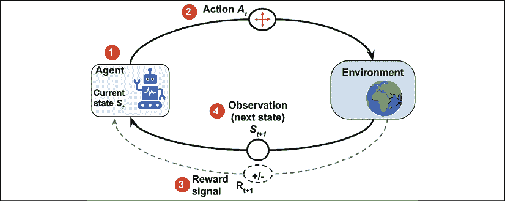

如前图所示，智能体的状态是它所有变量的集合（1）。例如，在机器人无人机的情况下，这些变量可能包括无人机的当前位置（经度、纬度和高度）、剩余电池电量、每个风扇的速度等。每个时间步，智能体通过一组可用动作与环境进行交互 （2）。根据智能体所采取的动作！[](img/B13208_18_002.png)，当它处于状态 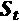 时，智能体将接收到一个奖励信号 （3），并且它的状态将变为 （4）。

在学习过程中，智能体必须尝试不同的动作（**探索**），这样它就能逐步学会哪些动作更优，并更加频繁地执行这些动作（**利用**），以最大化总的累计奖励。为了理解这个概念，我们可以考虑一个非常简单的例子：一个新毕业的计算机科学硕士，专注于软件工程，他在考虑是加入一家公司工作（利用）还是继续攻读硕士或博士学位，深入学习数据科学和机器学习（探索）。一般来说，利用会导致选择短期回报更大的动作，而探索则有可能在长期内带来更大的总回报。探索与利用之间的权衡已被广泛研究，但对于这一决策困境，目前并没有普遍的答案。

# 强化学习的理论基础

在我们跳入一些实际的例子并开始训练一个强化学习（RL）模型之前，接下来我们将在本章进行相关操作，首先让我们了解一下强化学习的一些理论基础。接下来的章节将首先通过考察**马尔可夫决策过程**的数学形式、阶段性任务与连续任务的区别、一些强化学习的关键术语，以及使用**贝尔曼方程**的动态规划，来开始介绍。让我们从马尔可夫决策过程开始。

## 马尔可夫决策过程

通常，强化学习所处理的问题类型通常被表述为**马尔可夫决策过程**（**MDPs**）。解决 MDP 问题的标准方法是使用动态规划，但强化学习相比动态规划具有一些关键优势。

**动态规划**

动态规划是理查德·贝尔曼（Richard Bellman）在1950年代开发的一组计算机算法和编程方法。从某种意义上说，动态规划是一种递归问题求解方法——通过将相对复杂的问题分解为更小的子问题来解决。

递归和动态规划之间的主要区别在于，动态规划会存储子问题的结果（通常以字典或其他查找表的形式），以便在将来再次遇到时可以在常数时间内访问（而不是重新计算）。

动态规划解决的计算机科学中的一些著名问题包括序列对齐和计算从 A 点到 B 点的最短路径。

然而，当状态的规模（即可能的配置数量）相对较大时，动态规划并不是一种可行的方法。在这种情况下，强化学习被认为是一种更加高效且实用的替代方法，用于解决 MDP 问题。

## 马尔可夫决策过程的数学表述

需要学习互动和顺序决策过程的问题类型，其中时间步 *t* 的决策会影响后续的情况，数学上被形式化为马尔可夫决策过程（MDPs）。

在强化学习中，若我们将智能体的初始状态表示为 ，那么智能体和环境之间的交互会产生如下的序列：


请注意，大括号仅作为视觉辅助。这里， 和  表示时间步 *t* 时的状态和所采取的动作。 表示执行动作  后从环境中获得的奖励。请注意，、 和  是时间相关的随机变量，它们的取值来自预定义的有限集合，分别由 、 和  表示。在马尔可夫决策过程中，这些时间相关的随机变量  和  的概率分布只依赖于它们在前一个时间步 *t* - 1 的值。 和  的概率分布可以表示为对前一个状态 () 和所采取动作 () 的条件概率，如下所示：


这个概率分布完全定义了**环境的动态**（或环境模型），因为基于这个分布，可以计算环境的所有转移概率。因此，环境动态是对不同强化学习方法进行分类的核心标准。需要环境模型或试图学习环境模型（即环境动态）的强化学习方法被称为*基于模型*方法，区别于*无模型*方法。

**无模型和基于模型的强化学习**

当概率  已知时，可以通过动态规划来解决学习任务。但当环境的动态未知时（这在许多现实世界问题中是常见的），则需要通过与环境交互获得大量样本，以弥补环境动态的未知。

解决这个问题的两种主要方法是无模型蒙特卡洛（MC）方法和时间差分（TD）方法。下图展示了这两种主要类别及其各自的分支：

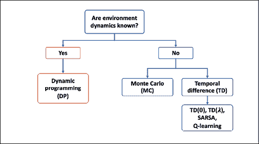

本章将从理论到实际算法介绍这些不同的方法及其分支。

如果在给定状态下的特定动作总是或从不被执行，则可以认为环境动态是确定性的，即 。否则，在更一般的情况下，环境将表现出随机行为。

为了理解这种随机行为，让我们考虑在当前状态  和执行的动作 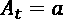 条件下观察未来状态  的概率。这用  表示。

它可以通过对所有可能的奖励求和来计算为边际概率：


这个概率称为**状态转移概率**。基于状态转移概率，如果环境动态是确定性的，那么这意味着当智能体在状态  执行动作  时，转移到下一个状态  将是 100% 确定的，即 。

### 马尔可夫过程的可视化

马尔可夫过程可以表示为一个有向环图，其中图中的节点表示环境的不同状态。图的边（即节点之间的连接）表示状态之间的转移概率。

例如，假设我们考虑一个学生在三种不同情境间做出选择：(A) 在家备考，(B) 在家玩电子游戏，或者 (C) 在图书馆学习。此外，还存在一个终端状态 (T)，即去睡觉。每小时做出一个决策，做出决策后，学生将在该小时内保持在选择的情境中。假设在家（状态 A）时，学生有50%的概率会切换到玩电子游戏（状态 B）。而当学生处于状态 B（玩电子游戏）时，学生有相对较高的概率（80%）在接下来的小时继续玩电子游戏。

学生行为的动态在下图中作为马尔可夫过程展示，其中包含一个循环图和转移表：


图中边缘的数值表示学生行为的转移概率，这些数值也在右侧的表格中显示。查看表格中的行时，请注意，从每个状态（节点）出来的转移概率总和始终为1。

### 回合任务与持续任务

随着代理与环境的互动，观察或状态的序列形成一条轨迹。轨迹有两种类型。如果一个代理的轨迹可以被分割成若干子部分，使得每部分都从时间 *t* = 0 开始，并以终端状态  结束（在 *t* = *T* 时），则该任务被称为 *回合任务*。另一方面，如果轨迹是无限连续的，并且没有终端状态，则该任务被称为 *持续任务*。

与学习代理相关的任务，例如国际象棋游戏，是一个回合任务；而保持房屋整洁的清洁机器人通常执行的是一个持续任务。本章中，我们仅考虑回合任务。

在回合任务中，**回合**是一个代理从起始状态  到终端状态  所经历的序列或轨迹：


对于前述图中展示的马尔可夫过程，该过程描述了学生为考试学习的任务，我们可能会遇到如下三个示例的回合：


## 强化学习术语：回报、策略和值函数

接下来，我们将定义一些剩余章节中将用到的强化学习（RL）专有术语。

### 回报

所谓的时间 *t* 时的回报是从整个回合期间获得的累计奖励。回想一下， 是执行动作  后，在时间 *t* 获得的 *即时奖励*；*后续*奖励则是 ，，依此类推。

时间 *t* 时的回报可以通过即时奖励以及后续奖励计算得出，公式如下：


这里，是[0, 1]范围内的*折现因子*。参数 表示当前时刻（时间*t*）未来奖励的“价值”。请注意，通过设置 ，我们实际上是在表明不关心未来的奖励。在这种情况下，回报将等于即时奖励，忽略*t*+1之后的奖励，智能体将变得目光短浅。另一方面，如果 ，则回报将是所有后续奖励的无权重总和。

此外，请注意，回报的方程可以通过*递归*的方式更简洁地表达，如下所示：


这意味着在时间*t*时的回报等于即时奖励*r*加上时间*t*+1时折现后的未来回报。这是一个非常重要的属性，便于回报的计算。

**折现因子的直觉**

为了理解折现因子的含义，可以参考以下图示，展示今天赚取100美元与一年后赚取100美元的价值。在某些经济情况下，比如通货膨胀，今天赚到100美元的价值可能比一年后赚到更多：


因此，我们可以说，如果这张票现在值100美元，那么在一年后，考虑到折现因子，它的价值将是90美元！[](img/B13208_18_051.png)。

让我们计算在前面学生示例中的不同时间步的回报。假设 ，并且唯一的奖励是基于考试结果（通过考试得+1，未通过得–1）。中间时间步的奖励为0。

：

+   

+   

+   

+   ...

+   

+   

：

+   

+   

+   ...

+   

+   

我们将回报的计算留给第三集作为读者的练习。

### 策略

一个通常用 表示的*策略*是一个函数，用来决定采取什么动作，动作可以是确定性的，也可以是随机的（即，采取下一步动作的概率）。随机策略则有一个动作的概率分布，表示在给定状态下智能体可以采取的动作：


在学习过程中，随着智能体积累更多经验，策略可能会发生变化。例如，智能体可能从一个随机策略开始，在这种策略下，所有动作的概率是均匀的；与此同时，智能体希望能够学习并优化其策略，朝着最优策略靠近。*最优策略* 是能带来最高回报的策略。

### 价值函数

*价值函数*，也称为*状态价值函数*，衡量每个状态的*优劣*——换句话说，就是处于某个特定状态时，这个状态好坏的衡量标准。请注意，优劣的标准是基于回报的。

现在，基于回报 ，我们将状态 *s* 的价值函数定义为在*遵循策略*  后的期望回报（所有可能情境的平均回报）：


在实际实现中，我们通常使用查找表来估算价值函数，这样就不必多次重新计算它。（这就是动态规划的方面。）例如，在实际应用中，当我们使用这种表格方法来估算价值函数时，我们将所有状态值存储在一个由 *V*(*s*) 表示的表格中。在 Python 实现中，这可能是一个列表或一个 NumPy 数组，其索引指向不同的状态；或者，它也可以是一个 Python 字典，其中字典的键将状态映射到相应的值。

此外，我们还可以为每个状态-动作对定义一个值，这个值称为*动作价值函数*，表示为 。动作价值函数指的是在代理处于状态  并执行动作  时的期望回报 。将状态价值函数的定义扩展到状态-动作对，我们得到以下公式：

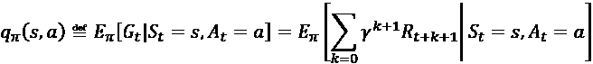

与最优策略的表示类似，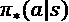、 和  同样表示最优的状态价值函数和动作价值函数。

估算价值函数是强化学习（RL）方法中的一个重要组成部分。我们将在本章稍后讨论计算和估算状态价值函数和动作价值函数的不同方法。

**奖励、回报和价值函数之间的区别**

**奖励**是代理在给定环境当前状态下执行某个动作后获得的结果。换句话说，奖励是代理在执行动作以从一个状态转移到下一个状态时收到的信号。然而，请记住，并不是每个动作都会产生正或负的奖励——回想一下我们的象棋示例，只有在赢得比赛时才会获得正奖励，所有中间动作的奖励都是零。

一个状态本身有一个特定的价值，我们为它赋值以衡量这个状态的优劣——这就是价值函数的作用所在。通常，具有“高”或“好”价值的状态是那些具有高期望**回报**的状态，并且在给定特定策略时，很可能会产生高奖励。

例如，让我们再次考虑一个下棋的计算机。如果计算机赢得比赛，可能只有在比赛结束时才会给予正向奖励。如果计算机输掉比赛，则不会有（正向）奖励。现在，假设计算机进行了一步棋，捕获了对手的皇后，并且这对计算机没有负面影响。由于计算机只有在赢得比赛时才会获得奖励，因此通过这一捕获对手皇后的动作，计算机并不会立即获得奖励。然而，新的状态（捕获皇后后的棋盘状态）可能具有**较高的价值**，这可能会在比赛最终获胜时带来奖励。从直觉上讲，我们可以认为，捕获对手皇后的高价值与捕获皇后通常会导致赢得比赛这一事实相关联——因此有较高的预期回报或价值。然而，请注意，捕获对手的皇后并不总是意味着赢得比赛；因此，智能体很可能会获得正向奖励，但这并不保证。

简而言之，**回报**是整个回合**奖励**的加权和，在我们的国际象棋示例中，它将等于折扣后的最终奖励（因为只有一个奖励）。**值函数**是所有可能回合的期望，它基本上计算的是做出某个特定动作的“价值”平均值。

在我们直接进入一些强化学习（RL）算法之前，先简要回顾一下贝尔曼方程的推导过程，我们可以利用它来实现策略评估。

## 使用贝尔曼方程的动态规划

贝尔曼方程是许多强化学习算法的核心元素之一。贝尔曼方程简化了值函数的计算，避免了对多个时间步的求和，而是使用类似于计算回报的递归。

基于总回报的递归方程！[](img/B13208_18_078.png)，我们可以将值函数重写如下：


请注意，即时奖励*r*被从期望值中移除，因为它是一个常量，并且在时刻*t*时是已知的。

类似地，对于动作值函数，我们可以写成：


我们可以利用环境动态来通过对所有可能的下一状态！[](img/B13208_18_081.png)及相应的奖励*r*的概率求和，来计算期望：


现在，我们可以看到回报的期望！[](img/B13208_18_083.png)，本质上是状态值函数！[](img/B13208_18_084.png)。所以，我们可以将！[](img/B13208_18_085.png)写成！[](img/B13208_18_086.png)的函数：


这被称为**贝尔曼方程**，它将一个状态*s*的价值函数与其后继状态的价值函数  关联起来。这大大简化了价值函数的计算，因为它消除了沿时间轴的迭代循环。

# 强化学习算法

在本节中，我们将介绍一系列学习算法。我们将从动态规划开始，假设转移动态（或者环境动态，即 ）是已知的。然而，在大多数强化学习（RL）问题中，情况并非如此。为了应对未知的环境动态，开发了通过与环境互动来学习的RL技术。这些技术包括MC、TD学习，以及日益流行的Q学习和深度Q学习方法。下图描述了RL算法的进展过程，从动态规划到Q学习：


在本章的后续部分，我们将逐步讲解这些RL算法。我们将从动态规划开始，然后是MC，最后是TD及其分支：基于策略的**SARSA**（**状态–动作–奖励–状态–动作**）和基于离策略的Q学习。我们还将进入深度Q学习，同时构建一些实际模型。

## 动态规划

在本节中，我们将重点解决在以下假设下的RL问题：

+   我们对环境动态有完整的知识；也就是说，所有的转移概率 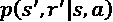 都是已知的。

+   智能体的状态具有马尔可夫性质，这意味着下一个动作和奖励仅依赖于当前状态以及我们在此时刻或当前时间步选择的动作。

使用马尔可夫决策过程（MDP）来描述RL问题的数学公式已在本章前面介绍。如果需要复习，请参考名为*马尔可夫决策过程的数学公式*的章节，其中介绍了价值函数的正式定义 ，跟随策略 ，以及通过环境动态推导出的贝尔曼方程。

我们应该强调，动态规划并不是解决RL问题的实际方法。使用动态规划的一个问题是它假设已知环境动态，但在大多数现实应用中，这通常是不可行或不现实的。然而，从教育的角度来看，动态规划有助于以简单的方式引入RL，并激发使用更先进和复杂的RL算法的兴趣。

以下小节描述的任务有两个主要目标：

1.  获取真实的状态值函数，；此任务也称为预测任务，通过*策略评估*来完成。

1.  找到最优值函数，，这是通过*广义策略迭代*来完成的。

### 策略评估——使用动态规划预测值函数

基于贝尔曼方程，当已知环境动态时，我们可以通过动态规划计算任意策略  的值函数。为了计算这个值函数，我们可以采用迭代解法，从  开始，该值对于每个状态初始化为零。然后，在每次迭代 *i* + 1 时，我们根据贝尔曼方程更新每个状态的值，而贝尔曼方程又基于上一迭代 *i* 的状态值，具体如下：


可以证明，当迭代次数趋于无穷大时， 会收敛到真实的状态值函数 。

另外，请注意，我们在这里不需要与环境互动。原因是我们已经准确了解了环境动态。因此，我们可以利用这些信息，轻松估算值函数。

计算完值函数后，一个显而易见的问题是，如果我们的策略仍然是随机策略，那么该值函数如何对我们有用。答案是，我们实际上可以利用这个计算出的  来改进我们的策略，正如我们接下来将看到的那样。

### 使用估计的值函数改进策略

现在我们已经通过遵循现有策略  计算出了值函数 ，我们希望利用  来改进现有的策略 。这意味着我们希望找到一个新的策略，，对于每个状态 *s*，遵循  会比使用当前策略  产生更高的值或至少相等的值。用数学语言表达，我们可以将改进策略  的目标表示为：


首先，回顾一下，策略  决定了在代理处于状态 *s* 时选择每个动作 *a* 的概率。现在，为了找到 ，确保每个状态都具有更好或至少相等的值，我们首先基于计算出的状态值（使用值函数 ）为每个状态 *s* 和动作 *a* 计算动作值函数 。我们遍历所有状态，对于每个状态 *s*，我们比较如果选择动作 *a* 时，下一状态 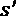 的值。

在通过  评估所有状态-动作对后获得最高状态值后，我们可以将对应的动作与当前策略选择的动作进行比较。如果当前策略建议的动作（即 ）与动作值函数建议的动作（即 ）不同，那么我们可以通过重新分配动作的概率来更新策略，以匹配给出最高动作值的动作，即 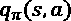。这被称为 *策略改进* 算法。

### 策略迭代

使用上一小节中描述的策略改进算法，可以证明，策略改进将严格地产生一个更好的策略，除非当前策略已经是最优的（这意味着对于每个 ，都有 ）。因此，如果我们反复执行策略评估然后进行策略改进，我们就能确保找到最优策略。

请注意，这种技术被称为 **广义策略迭代**（**GPI**），它在许多强化学习方法中很常见。我们将在本章的后续部分中使用 GPI 来实现蒙特卡洛和时序差分学习方法。

### 值迭代

我们看到，通过反复进行策略评估（计算 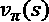 和 ）和策略改进（找到 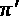，使得 ），我们可以达到最优策略。然而，如果我们将策略评估和策略改进的两个任务合并为一个步骤，那么可以提高效率。以下方程式更新迭代 *i* + 1 的值函数（用 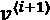 表示），它基于选择最大化下一个状态值和即时奖励的加权和的动作（）。


在这种情况下，更新后的值是通过从所有可能的动作中选择最佳动作来最大化的，而在策略评估中，更新的值是通过对所有动作的加权和来计算的。

**状态值函数和动作值函数的表格估计符号**

在大多数强化学习文献和教科书中，使用小写字母  和  来表示真实的状态值函数和真实的动作值函数，分别作为数学函数。

同时，对于实际的实现，这些值函数被定义为查找表。这些值函数的表格估计用  和  表示。本章中我们也将使用这种符号。

## 蒙特卡洛强化学习

正如我们在前一节动态规划中看到的，它依赖于一个简单的假设，即环境的动态是完全已知的。脱离动态规划方法，我们现在假设我们对环境的动态一无所知。

也就是说，我们不知道环境的状态转移概率，而是希望代理通过*与环境交互*来学习。使用MC方法，学习过程基于所谓的*模拟经验*。

对于基于MC的强化学习，我们定义一个遵循概率策略的代理类，，并根据这个策略，代理在每一步采取一个动作。这会生成一个模拟情节。

早些时候，我们定义了状态值函数，其中状态的值表示从该状态开始的预期回报。在动态规划中，这一计算依赖于对环境动态的了解，即！[](img/B13208_18_134.png)。

然而，从现在开始，我们将开发不需要环境动态的算法。基于MC的方法通过生成模拟情节来解决这个问题，代理与环境进行交互。从这些模拟情节中，我们将能够计算在该模拟情节中访问的每个状态的平均回报。

### 使用MC进行状态值函数估计

在生成一组情节后，对于每个状态*s*，考虑所有通过状态*s*的情节集合来计算状态*s*的值。假设使用查找表来获取与值函数对应的值，。MC更新用于估计值函数，基于从第一次访问状态*s*开始的情节中获得的总回报。这个算法被称为*首次访问蒙特卡罗*值预测。

### 使用MC进行动作值函数估计

当环境的动态已知时，我们可以通过向前看一步来推断出动作值函数，找到给出最大值的动作，正如*动态规划*部分所示。然而，如果环境动态未知，这是不可行的。

为了解决这个问题，我们可以扩展算法，用于估计首次访问MC状态值预测。例如，我们可以使用动作值函数来计算每个状态-动作对的*估计*回报。为了获得这个估计回报，我们考虑访问每个状态-动作对（*s*，*a*），这指的是访问状态*s*并采取动作*a*。

然而，出现了一个问题，因为有些动作可能永远不会被选择，从而导致探索不足。有几种方法可以解决这个问题。最简单的方法叫做*探索性起始*，它假设每个状态-动作对在情节开始时有一个非零的概率。

解决探索不足问题的另一种方法叫做 -*贪婪策略*，将在下一节关于策略改进的内容中讨论。

### 使用 MC 控制找到最优策略

*MC 控制*是指优化过程以改进策略。类似于前一节中的策略迭代方法（*动态规划*），我们可以反复在策略评估和策略改进之间交替，直到得到最优策略。因此，从一个随机策略开始，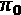，策略评估和策略改进交替进行的过程可以表示如下：


### 策略改进——从动作-价值函数计算贪婪策略

给定一个动作-价值函数，*q*(*s*, *a*)，我们可以生成如下的贪婪（确定性）策略：


为了避免探索不足问题，并考虑到之前讨论的未访问的状态-动作对，我们可以让非最优动作有一个小的概率（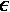）被选择。这被称为 -贪婪策略，根据该策略，所有在状态 *s* 下的非最优动作都有一个最小的  概率被选择（而不是 0），而最优动作的概率是 （而不是 1）。

## 时序差分学习

到目前为止，我们已经看到了两种基本的强化学习技术，动态规划和基于 MC 的学习。回想一下，动态规划依赖于对环境动态的完全准确了解，而基于 MC 的方法则通过模拟经验进行学习。在本节中，我们将介绍第三种强化学习方法——TD 学习，它可以被视为对基于 MC 的强化学习方法的改进或扩展。

类似于 MC 技术，TD 学习也是基于经验学习，因此不需要了解环境动态和转移概率。TD 和 MC 技术的主要区别在于，在 MC 中，我们必须等到一集结束才能计算总回报。

然而，在 TD 学习中，我们可以利用一些已经学习到的属性，在一集结束之前就更新估计值。这被称为 *引导*（在强化学习的上下文中，术语引导不应与我们在*第7章* *结合不同模型进行集成学习* 中使用的自举估计混淆）。

类似于动态规划方法和基于 MC 的学习，我们将考虑两个任务：估计价值函数（也叫做价值预测）和改进策略（也叫做控制任务）。

### TD 预测

让我们首先回顾一下MC的值预测。在每个回合结束时，我们能够为每个时间步*t*估计回报！[](img/B13208_18_144.png)。因此，我们可以按如下方式更新已访问状态的估计值：


在这里，用作*目标回报*来更新估计值，而是添加到我们当前估计值中的*修正*项。值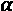是表示学习率的超参数，在学习过程中保持不变。

注意，在MC中，修正项使用的是*实际*回报！[](img/B13208_18_150.png)，这在回合结束之前是未知的。为了澄清这一点，我们可以将实际回报！[](img/B13208_18_151.png)重命名为！[](img/B13208_18_152.png)，其中下标表示这是在时间步*t*时获得的回报，并且考虑了从时间步*t*到最终时间步*T*期间发生的所有事件。

在TD学习中，我们将实际回报！[](img/B13208_18_154.png)替换为新的目标回报！[](img/B13208_18_155.png)，这大大简化了值函数的更新。基于TD学习的更新公式如下：


在这里，目标回报！[](img/B13208_18_158.png)使用的是观察到的奖励！[](img/B13208_18_159.png)和下一步的估计值。注意MC与TD的区别。在MC中，直到本回合结束后才能获得，因此我们需要执行尽可能多的步骤才能到达那里。相反，在TD中，我们只需前进一步即可获得目标回报。这也称为TD(0)。

此外，TD(0)算法可以推广到所谓的*n步TD*算法，它包括更多的未来步骤——更精确地说，是*n*个未来步骤的加权和。如果我们定义*n* = 1，那么n步TD过程与上一段中描述的TD(0)相同。但是，如果，那么n步TD算法将与MC算法相同。n步TD的更新规则如下：


而定义为：


**MC与TD：哪种方法收敛更快？**

尽管这个问题的精确答案仍然未知，但在实践中，实验证明TD收敛的速度通常比MC快。如果你感兴趣的话，可以在《强化学习：导论》一书中，Richard S. Sutton和Andrew G. Barto为你提供更多关于MC和TD收敛性的信息。

现在我们已经讲解了使用TD算法的预测任务，我们可以继续讨论控制任务。我们将讨论两种TD控制算法：*基于策略的*控制和*离策略的*控制。在这两种情况下，我们都使用了在动态规划和MC算法中使用的GPI。在基于策略的TD控制中，价值函数是根据智能体遵循的相同策略中的动作来更新的，而在离策略算法中，价值函数是根据当前策略以外的动作来更新的。

### 基于策略的TD控制（SARSA）

为了简化起见，我们只考虑一步TD算法，或者说TD(0)。然而，基于策略的TD控制算法可以很容易地推广到 *n* 步TD。我们将从扩展预测公式开始，定义状态值函数，并用它来描述动作值函数。为此，我们使用查找表，即一个二维数组 ，它表示每个状态-动作对的动作值函数。在这种情况下，我们将有以下内容：


这个算法通常称为SARSA，指的是更新公式中使用的五元组 。

正如我们在前面的部分描述动态规划和MC算法时所看到的，我们可以使用GPI框架，并从随机策略开始，我们可以反复估计当前策略的动作值函数，然后使用基于当前动作值函数的 -贪婪策略来优化策略。

### 离策略TD控制（Q学习）

我们看到，在使用前面提到的基于策略的TD控制算法时，如何估计动作值函数是基于在模拟回合中使用的策略。在更新了动作值函数后，我们通过采取具有更高值的动作来执行单独的策略改进步骤。

一种替代（且更好的）方法是将这两步结合起来。换句话说，假设智能体遵循策略 ，生成一个当前过渡五元组 的回合。与其使用智能体采取的  动作值来更新动作值函数，我们可以即使该动作没有被智能体根据当前策略实际选择，也能找到最佳动作。（这就是为什么它被认为是 *off-policy* 算法的原因。）

为了做到这一点，我们可以修改更新规则，通过变化下一状态中不同动作的最大Q值来进行考虑。更新Q值的修改公式如下：


我们鼓励你将此处的更新规则与SARSA算法的更新规则进行比较。正如你所看到的，我们在下一个状态中找到最佳动作 ，并将其用于修正项，以更新我们对  的估计。

为了更好地理解这些材料，在接下来的部分，我们将展示如何实现用于解决*网格世界问题*的Q学习算法。

# 实现我们的第一个强化学习算法

在这一部分，我们将介绍如何实现Q学习算法来解决*网格世界问题*。为此，我们使用OpenAI Gym工具包。

## 介绍OpenAI Gym工具包

OpenAI Gym是一个专门的工具包，用于促进强化学习模型的开发。OpenAI Gym提供了多个预定义的环境。一些基础示例包括CartPole和MountainCar，任务分别是保持杆子平衡和让小车爬坡，正如其名称所示。还有许多高级机器人环境，用于训练机器人去取、推、或获取桌子上的物品，或者训练机器人手去定位块、球或笔。此外，OpenAI Gym还提供了一个便捷的统一框架，供开发新环境使用。更多信息可以在其官网找到：[https://gym.openai.com/](https://gym.openai.com/)。

要跟随接下来的OpenAI Gym代码示例，你需要安装`gym`库，可以通过`pip`轻松安装：

```py
> pip install gym 
```

如果你需要额外的安装帮助，请参考官方安装指南：[https://gym.openai.com/docs/#installation](https://gym.openai.com/docs/#installation)。

### 使用OpenAI Gym中的现有环境

为了练习使用Gym环境，让我们从OpenAI Gym中创建一个现有的`CartPole-v1`环境。在这个示例环境中，有一个杆子附着在一个可以水平移动的小车上，如下图所示：


杆子的运动受物理定律的控制，强化学习代理的目标是学习如何移动小车以稳定杆子，并防止其倾斜到任一侧。

现在，让我们从强化学习的角度来看一下CartPole环境的一些特性，比如其状态（或观测）空间、动作空间，以及如何执行一个动作：

```py
>>> import gym
>>> env = gym.make('CartPole-v1')
>>> env.observation_space
Box(4,)
>>> env.action_space
Discrete(2) 
```

在之前的代码中，我们为`CartPole`问题创建了一个环境。该环境的观测空间是`Box(4,)`，表示一个四维空间，对应四个实数值：小车的位置、小车的速度、杆子的角度和杆子尖端的速度。动作空间是一个离散空间，`Discrete(2)`，有两个选择：将小车推向左边或右边。

我们之前通过调用`gym.make('CartPole-v1')`创建的环境对象`env`，有一个`reset()`方法，我们可以在每次开始一个新回合之前使用它重新初始化环境。调用`reset()`方法将基本上设置杆子的初始状态（）：

```py
>>> env.reset()
array([-0.03908273, -0.00837535,  0.03277162, -0.0207195 ]) 
```

`env.reset()`方法调用返回的数组中的值表示小车的初始位置为–0.039，速度为–0.008，杆子的角度为0.033弧度，而其尖端的角速度为–0.021。调用`reset()`方法时，这些值会初始化为在[–0.05, 0.05]范围内的均匀分布的随机值。

重置环境后，我们可以通过选择一个动作并将该动作传递给`step()`方法来与环境进行交互：

```py
>>> env.step(action=0)
(array([-0.03925023, -0.20395158,  0.03235723,  0.28212046]), 1.0, False, {})
>>> env.step(action=1)
(array([-0.04332927, -0.00930575,  0.03799964, -0.00018409]), 1.0, False, {}) 
```

通过之前的两个命令，`env.step(action=0)`和`env.step(action=1)`，我们分别将小车推向左侧（`action=0`）和右侧（`action=1`）。根据选择的动作，小车及其杆子会按照物理定律运动。每次调用`env.step()`时，它会返回一个包含四个元素的元组：

+   新状态（或观测）的数组

+   奖励（类型为`float`的标量值）

+   终止标志（`True`或`False`）

+   包含辅助信息的Python字典

`env`对象也有一个`render()`方法，我们可以在每个步骤（或一系列步骤）之后执行它，以便通过时间可视化环境以及杆子和小车的运动。

当杆子的角度相对于虚拟垂直轴超过12度（无论哪一侧）时，或者当小车的位置距离中心位置超过2.4个单位时，剧集终止。在这个示例中定义的奖励是最大化小车和杆子在有效区域内稳定的时间——换句话说，通过最大化剧集的长度可以最大化总奖励（即回报）。

### 网格世界示例

在将CartPole环境作为使用OpenAI Gym工具包的热身练习之后，我们将切换到另一个环境。我们将使用一个网格世界示例，这是一个简化的环境，具有*m*行和*n*列。假设*m* = 4且*n* = 6，我们可以总结这个环境，如下图所示：


在这个环境中，有30个不同的可能状态。其中四个状态是终止状态：在状态16处有一个金锅，状态10、15和22处分别有三个陷阱。落入这四个终止状态中的任何一个都会结束剧集，但金锅和陷阱状态有所不同。落入金锅状态会获得正奖励+1，而进入陷阱状态则会获得负奖励–1。所有其他状态的奖励为0。代理始终从状态0开始。因此，每次重置环境时，代理都会回到状态0。动作空间由四个方向组成：向上、向下、向左和向右。

当代理位于网格的外边界时，选择一个会导致离开网格的动作不会改变状态。

接下来，我们将看到如何使用OpenAI Gym包在Python中实现这个环境。

### 在OpenAI Gym中实现网格世界环境

在通过OpenAI Gym实验网格世界环境时，强烈建议使用脚本编辑器或IDE，而不是交互式执行代码。

首先，我们创建一个新的Python脚本，命名为`gridworld_env.py`，然后导入必要的包和我们定义的两个辅助函数，这些函数用于构建环境的可视化。

为了将环境渲染以便进行可视化，OpenAI Gym库使用了Pyglet库，并为我们的方便提供了封装类和函数。在以下代码示例中，我们将使用这些封装类来可视化网格世界环境。关于这些封装类的更多信息，可以参考：

[https://github.com/openai/gym/blob/master/gym/envs/classic_control/rendering.py](https://github.com/openai/gym/blob/master/gym/envs/classic_control/rendering.py)

以下代码示例使用了这些封装类：

```py
## Script: gridworld_env.py
import numpy as np
from gym.envs.toy_text import discrete
from collections import defaultdict
import time
import pickle
import os
from gym.envs.classic_control import rendering
CELL_SIZE = 100
MARGIN = 10
def get_coords(row, col, loc='center'):
    xc = (col+1.5) * CELL_SIZE
    yc = (row+1.5) * CELL_SIZE
    if loc == 'center':
        return xc, yc
    elif loc == 'interior_corners':
        half_size = CELL_SIZE//2 - MARGIN
        xl, xr = xc - half_size, xc + half_size
        yt, yb = xc - half_size, xc + half_size
        return [(xl, yt), (xr, yt), (xr, yb), (xl, yb)]
    elif loc == 'interior_triangle':
        x1, y1 = xc, yc + CELL_SIZE//3
        x2, y2 = xc + CELL_SIZE//3, yc - CELL_SIZE//3
        x3, y3 = xc - CELL_SIZE//3, yc - CELL_SIZE//3
        return [(x1, y1), (x2, y2), (x3, y3)]
def draw_object(coords_list):
    if len(coords_list) == 1: # -> circle
        obj = rendering.make_circle(int(0.45*CELL_SIZE))
        obj_transform = rendering.Transform()
        obj.add_attr(obj_transform)
        obj_transform.set_translation(*coords_list[0])
        obj.set_color(0.2, 0.2, 0.2) # -> black
    elif len(coords_list) == 3: # -> triangle
        obj = rendering.FilledPolygon(coords_list)
        obj.set_color(0.9, 0.6, 0.2) # -> yellow
    elif len(coords_list) > 3: # -> polygon
        obj = rendering.FilledPolygon(coords_list)
        obj.set_color(0.4, 0.4, 0.8) # -> blue
    return obj 
```

第一个辅助函数`get_coords()`返回我们将用于标注网格世界环境的几何形状的坐标，例如用三角形表示金币，或者用圆形表示陷阱。坐标列表传递给`draw_object()`，该函数根据输入坐标列表的长度决定绘制圆形、三角形或多边形。

现在，我们可以定义网格世界环境。在同一个文件（`gridworld_env.py`）中，我们定义了一个名为`GridWorldEnv`的类，该类继承自OpenAI Gym的`DiscreteEnv`类。这个类最重要的功能是构造方法`__init__()`，在该方法中我们定义了动作空间，指定了每个动作的作用，并确定了终止状态（金币和陷阱），具体如下：

```py
class GridWorldEnv(discrete.DiscreteEnv):
    def __init__(self, num_rows=4, num_cols=6, delay=0.05):
        self.num_rows = num_rows
        self.num_cols = num_cols
        self.delay = delay
        move_up = lambda row, col: (max(row-1, 0), col)
        move_down = lambda row, col: (min(row+1, num_rows-1), col)
        move_left = lambda row, col: (row, max(col-1, 0))
        move_right = lambda row, col: (
            row, min(col+1, num_cols-1))
        self.action_defs={0: move_up, 1: move_right,
                          2: move_down, 3: move_left}
        ## Number of states/actions
        nS = num_cols*num_rows
        nA = len(self.action_defs)
        self.grid2state_dict={(s//num_cols, s%num_cols):s
                              for s in range(nS)}
        self.state2grid_dict={s:(s//num_cols, s%num_cols)
                              for s in range(nS)}
        ## Gold state
        gold_cell = (num_rows//2, num_cols-2)

        ## Trap states
        trap_cells = [((gold_cell[0]+1), gold_cell[1]),
                       (gold_cell[0], gold_cell[1]-1),
                       ((gold_cell[0]-1), gold_cell[1])]
        gold_state = self.grid2state_dict[gold_cell]
        trap_states = [self.grid2state_dict[(r, c)]
                       for (r, c) in trap_cells]
        self.terminal_states = [gold_state] + trap_states
        print(self.terminal_states)
        ## Build the transition probability
        P = defaultdict(dict)
        for s in range(nS):
            row, col = self.state2grid_dict[s]
            P[s] = defaultdict(list)
            for a in range(nA):
                action = self.action_defs[a]
                next_s = self.grid2state_dict[action(row, col)]

                ## Terminal state
                if self.is_terminal(next_s):
                    r = (1.0 if next_s == self.terminal_states[0]
                         else -1.0)
                else:
                    r = 0.0
                if self.is_terminal(s):
                    done = True
                    next_s = s
                else:
                    done = False
                P[s][a] = [(1.0, next_s, r, done)]
        ## Initial state distribution
        isd = np.zeros(nS)
        isd[0] = 1.0
        super(GridWorldEnv, self).__init__(nS, nA, P, isd)
        self.viewer = None
        self._build_display(gold_cell, trap_cells)
    def is_terminal(self, state):
        return state in self.terminal_states
    def _build_display(self, gold_cell, trap_cells):
        screen_width = (self.num_cols+2) * CELL_SIZE
        screen_height = (self.num_rows+2) * CELL_SIZE
        self.viewer = rendering.Viewer(screen_width, 
                                       screen_height)
        all_objects = []
        ## List of border points' coordinates
        bp_list = [
            (CELL_SIZE-MARGIN, CELL_SIZE-MARGIN),
            (screen_width-CELL_SIZE+MARGIN, CELL_SIZE-MARGIN),
            (screen_width-CELL_SIZE+MARGIN,
             screen_height-CELL_SIZE+MARGIN),
            (CELL_SIZE-MARGIN, screen_height-CELL_SIZE+MARGIN)
        ]
        border = rendering.PolyLine(bp_list, True)
        border.set_linewidth(5)
        all_objects.append(border)
        ## Vertical lines
        for col in range(self.num_cols+1):
            x1, y1 = (col+1)*CELL_SIZE, CELL_SIZE
            x2, y2 = (col+1)*CELL_SIZE,\
                     (self.num_rows+1)*CELL_SIZE
            line = rendering.PolyLine([(x1, y1), (x2, y2)], False)
            all_objects.append(line)

        ## Horizontal lines
        for row in range(self.num_rows+1):
            x1, y1 = CELL_SIZE, (row+1)*CELL_SIZE
            x2, y2 = (self.num_cols+1)*CELL_SIZE,\
                     (row+1)*CELL_SIZE
            line=rendering.PolyLine([(x1, y1), (x2, y2)], False)
            all_objects.append(line)

        ## Traps: --> circles
        for cell in trap_cells:
            trap_coords = get_coords(*cell, loc='center')
            all_objects.append(draw_object([trap_coords]))

        ## Gold:  --> triangle
        gold_coords = get_coords(*gold_cell,
                                 loc='interior_triangle')
        all_objects.append(draw_object(gold_coords))
        ## Agent --> square or robot
        if (os.path.exists('robot-coordinates.pkl') and
                CELL_SIZE==100):
            agent_coords = pickle.load(
                open('robot-coordinates.pkl', 'rb'))
            starting_coords = get_coords(0, 0, loc='center')
            agent_coords += np.array(starting_coords)
        else:
            agent_coords = get_coords(
                0, 0, loc='interior_corners')
        agent = draw_object(agent_coords)
        self.agent_trans = rendering.Transform()
        agent.add_attr(self.agent_trans)
        all_objects.append(agent)
        for obj in all_objects:
            self.viewer.add_geom(obj)
    def render(self, mode='human', done=False):
        if done:
            sleep_time = 1
        else:
            sleep_time = self.delay
        x_coord = self.s % self.num_cols
        y_coord = self.s // self.num_cols
        x_coord = (x_coord+0) * CELL_SIZE
        y_coord = (y_coord+0) * CELL_SIZE
        self.agent_trans.set_translation(x_coord, y_coord)
        rend = self.viewer.render(
             return_rgb_array=(mode=='rgb_array'))
        time.sleep(sleep_time)
        return rend
    def close(self):
        if self.viewer:
            self.viewer.close()
            self.viewer = None 
```

这段代码实现了网格世界环境，我们可以基于此创建该环境的实例。然后，我们可以像在CartPole示例中一样与之互动。实现的类`GridWorldEnv`继承了`reset()`等方法用于重置状态，以及`step()`方法用于执行动作。实现的具体细节如下：

+   我们使用lambda函数定义了四个不同的动作：`move_up()`、`move_down()`、`move_left()`和`move_right()`。

+   NumPy数组`isd`保存了起始状态的概率，因此在调用`reset()`方法（来自父类）时，系统会根据该分布随机选择一个状态。由于我们总是从状态0（网格世界的左下角）开始，因此我们将状态0的概率设置为1.0，其他29个状态的概率设置为0.0。

+   在Python字典`P`中定义的转移概率，决定了在选择一个动作时，从一个状态到另一个状态的概率。这使得我们可以拥有一个概率环境，其中执行一个动作可能会有不同的结果，取决于环境的随机性。为了简单起见，我们只使用一个结果，那就是根据选择的动作改变状态。最终，这些转移概率将由`env.step()`函数用于确定下一个状态。

+   此外，函数`_build_display()`将设置环境的初始可视化，而`render()`函数将展示代理的运动过程。

请注意，在学习过程中，我们并不知道转移概率，目标是通过与环境的互动来学习。因此，我们在类定义之外无法访问`P`。

现在，我们可以通过创建一个新的环境并通过在每个状态下采取随机动作来可视化一个随机的回合，来测试这个实现。在同一个Python脚本（`gridworld_env.py`）的末尾加入以下代码，然后执行脚本：

```py
if __name__ == '__main__':
    env = GridWorldEnv(5, 6)
    for i in range(1):
        s = env.reset()
        env.render(mode='human', done=False)
        while True:
            action = np.random.choice(env.nA)
            res = env.step(action)
            print('Action  ', env.s, action, ' -> ', res)
            env.render(mode='human', done=res[2])
            if res[2]:
                break
    env.close() 
```

执行脚本后，你应该会看到一个网格世界环境的可视化，如下图所示：

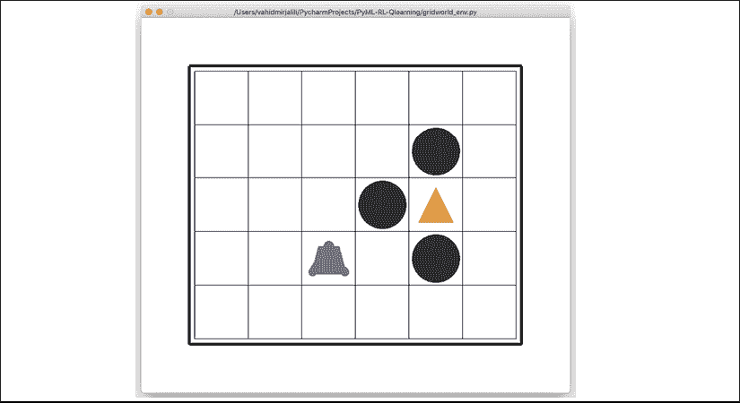

## 使用Q-learning解决网格世界问题

在关注RL算法的理论与开发过程，并通过OpenAI Gym工具包设置环境之后，我们将实现当前最流行的RL算法——Q-learning。为此，我们将使用之前在脚本`gridworld_env.py`中实现的网格世界示例。

### 实现Q-learning算法

现在，我们创建一个新的脚本并命名为`agent.py`。在这个`agent.py`脚本中，我们定义了一个用于与环境交互的代理，具体如下：

```py
## Script: agent.py
from collections import defaultdict
import numpy as np
class Agent(object):
    def __init__(
            self, env,
            learning_rate=0.01,
            discount_factor=0.9,
            epsilon_greedy=0.9,
            epsilon_min=0.1,
            epsilon_decay=0.95):
        self.env = env
        self.lr = learning_rate
        self.gamma = discount_factor
        self.epsilon = epsilon_greedy
        self.epsilon_min = epsilon_min
        self.epsilon_decay = epsilon_decay
        ## Define the q_table
        self.q_table = defaultdict(lambda: np.zeros(self.env.nA))
    def choose_action(self, state):
        if np.random.uniform() < self.epsilon:
            action = np.random.choice(self.env.nA)
        else:
            q_vals = self.q_table[state]
            perm_actions = np.random.permutation(self.env.nA)
            q_vals = [q_vals[a] for a in perm_actions]
            perm_q_argmax = np.argmax(q_vals)
            action = perm_actions[perm_q_argmax]
        return action
    def _learn(self, transition):
        s, a, r, next_s, done = transition
        q_val = self.q_table[s][a]
        if done:
            q_target = r
        else:
            q_target = r + self.gamma*np.max(self.q_table[next_s])
        ## Update the q_table
        self.q_table[s][a] += self.lr * (q_target - q_val)
        ## Adjust the epislon
        self._adjust_epsilon()
    def _adjust_epsilon(self):
        if self.epsilon > self.epsilon_min:
            self.epsilon *= self.epsilon_decay 
```

`__init__()`构造函数设置了各种超参数，如学习率、折扣因子()，以及-贪婪策略的参数。最初，我们从较高的值开始，但方法`_adjust_epsilon()`会逐步将其减少，直到达到最小值。方法`choose_action()`根据-贪婪策略选择一个动作。通过选择一个随机均匀数，来决定动作是应该随机选择还是根据动作价值函数进行选择。方法`_learn()`实现了Q-learning算法的更新规则。它接收每个过渡的元组，其中包括当前状态(*s*)、选择的动作(*a*)、观察到的奖励(*r*)、下一个状态(*s'*)，以及一个标志来判断是否已达到回合结束。若该标志表示回合结束，则目标值等于观察到的奖励(*r*)；否则，目标值为。

最后，为了进行下一步操作，我们创建了一个新的脚本`qlearning.py`，将所有内容整合在一起，并使用Q-learning算法训练代理。

在下面的代码中，我们定义了一个函数`run_qlearning()`，它实现了Q-learning算法，通过调用代理的`_choose_action()`方法并执行环境来模拟一个回合。然后，过渡元组被传递给代理的`_learn()`方法，用于更新动作价值函数。此外，为了监控学习过程，我们还存储了每个回合的最终奖励（可能是-1或+1），以及回合的长度（代理从回合开始到结束所采取的动作数）。

然后使用函数`plot_learning_history()`绘制奖励和动作次数的列表：

```py
## Script: qlearning.py
from gridworld_env import GridWorldEnv
from agent import Agent
from collections import namedtuple
import matplotlib.pyplot as plt
import numpy as np
np.random.seed(1)
Transition = namedtuple(
    'Transition', ('state', 'action', 'reward',
                   'next_state', 'done'))
def run_qlearning(agent, env, num_episodes=50):
    history = []
    for episode in range(num_episodes):
        state = env.reset()
        env.render(mode='human')
        final_reward, n_moves = 0.0, 0
        while True:
            action = agent.choose_action(state)
            next_s, reward, done, _ = env.step(action)
            agent._learn(Transition(state, action, reward,
                                    next_s, done))
            env.render(mode='human', done=done)
            state = next_s
            n_moves += 1
            if done:
                break
            final_reward = reward
        history.append((n_moves, final_reward))
        print('Episode %d: Reward %.1f #Moves %d'
              % (episode, final_reward, n_moves))
    return history
def plot_learning_history(history):
    fig = plt.figure(1, figsize=(14, 10))
    ax = fig.add_subplot(2, 1, 1)
    episodes = np.arange(len(history))
    moves = np.array([h[0] for h in history])
    plt.plot(episodes, moves, lw=4,
             marker='o', markersize=10)
    ax.tick_params(axis='both', which='major', labelsize=15)
    plt.xlabel('Episodes', size=20)
    plt.ylabel('# moves', size=20)
    ax = fig.add_subplot(2, 1, 2)
    rewards = np.array([h[1] for h in history])
    plt.step(episodes, rewards, lw=4)
    ax.tick_params(axis='both', which='major', labelsize=15)
    plt.xlabel('Episodes', size=20)
    plt.ylabel('Final rewards', size=20)
    plt.savefig('q-learning-history.png', dpi=300)
    plt.show()
if __name__ == '__main__':
    env = GridWorldEnv(num_rows=5, num_cols=6)
    agent = Agent(env)
    history = run_qlearning(agent, env)
    env.close()
    plot_learning_history(history) 
```

执行此脚本将运行Q-learning程序50个回合。代理的行为将被可视化，您会看到在学习过程的开始阶段，代理大多会进入陷阱状态。但随着时间的推移，它从失败中学习，并最终找到金状态（例如，第7回合第一次找到）。下图展示了代理的动作次数和奖励：


前面图中绘制的学习历史表明，经过30个回合后，代理学会了找到一条通往金状态的短路径。因此，30回合之后的每个回合长度基本相同，只有由于-贪婪策略产生的微小偏差。

## 深度Q学习概述

在前面的代码中，我们展示了一个针对网格世界示例的流行Q-learning算法的实现。该示例包含了一个大小为30的离散状态空间，在这里，将Q值存储在Python字典中就足够了。

然而，我们应该注意到，有时状态的数量可能非常大，甚至几乎是无限大的。此外，我们可能会处理连续的状态空间，而不是离散的状态。并且，某些状态在训练期间可能根本不会被访问，这在将智能体泛化到处理这些未见过的状态时可能会带来问题。

为了解决这些问题，我们不再像图像  或  中那样以表格形式表示值函数，或者对于动作值函数，我们使用 *函数逼近* 方法。在这里，我们定义了一个参数化函数 ，它可以学习逼近真实的值函数，即 ，其中  是一组输入特征（或“特征化”状态）。

当逼近器函数  是深度神经网络（DNN）时，得到的模型称为 **深度 Q 网络**（**DQN**）。在训练 DQN 模型时，权重会根据 Q-learning 算法进行更新。下图展示了一个 DQN 模型的示例，其中状态表示为传递到第一层的特征：


现在，让我们看看如何使用 *深度 Q-learning* 算法训练 DQN。总体来说，主要方法与表格 Q-learning 方法非常相似。主要区别在于，我们现在有一个多层神经网络来计算动作值。

### 根据 Q-learning 算法训练 DQN 模型

在本节中，我们描述了使用 Q-learning 算法训练 DQN 模型的过程。深度 Q-learning 方法要求我们对之前实现的标准 Q-learning 方法进行一些修改。

其中一个修改是在智能体的 `choose_action()` 方法中，在上一节 Q-learning 的代码中，这个方法仅仅是访问存储在字典中的动作值。现在，这个函数应该被修改为执行神经网络模型的前向传播，以计算动作值。

深度 Q-learning 算法所需的其他修改在以下两个小节中描述。

#### 回放记忆

使用之前的表格方法进行 Q-learning 时，我们可以更新特定状态-动作对的值，而不会影响其他值。然而，现在我们使用神经网络模型来逼近 *q*(*s*, *a*)，更新一个状态-动作对的权重很可能会影响其他状态的输出。在使用随机梯度下降法训练神经网络进行监督任务（例如分类任务）时，我们会使用多个训练周期多次迭代训练数据，直到收敛。

这在 Q-learning 中不可行，因为在训练过程中，回合会发生变化，结果是，一些在训练早期访问的状态在后期变得不太可能被再次访问。

此外，另一个问题是，当我们训练神经网络时，通常假设训练示例是 **IID**（**独立同分布**）。然而，从智能体的一个回合中采样的样本并不是 IID，因为它们显然形成了一个过渡序列。

为了解决这些问题，当智能体与环境交互并生成一个过渡五元组 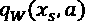 时，我们将大量（但有限）这样的过渡存储在一个记忆缓冲区中，这通常称为 *回放记忆*。每次新的交互（即智能体选择一个动作并在环境中执行）之后，产生的新过渡五元组会被添加到记忆中。

为了保持记忆的大小有限，最旧的过渡将从记忆中移除（例如，如果它是一个 Python 列表，我们可以使用 `pop(0)` 方法移除列表中的第一个元素）。然后，从记忆缓冲区中随机选择一个小批量的示例，用于计算损失并更新网络参数。下图说明了这个过程：


**实现回放记忆**

回放记忆可以使用 Python 列表实现，每次向列表中添加新元素时，我们需要检查列表的大小，并在必要时调用 `pop(0)`。

或者，我们可以使用 Python `collections` 库中的 `deque` 数据结构，它允许我们指定一个可选参数 `max_len`。通过指定 `max_len` 参数，我们将获得一个有界的双端队列。因此，当队列已满时，添加新元素会自动移除队列中的一个元素。

请注意，这比使用 Python 列表更高效，因为使用 `pop(0)` 从列表中移除第一个元素的时间复杂度是 O(n)，而双端队列的运行时复杂度是 O(1)。你可以通过官方文档了解更多关于双端队列的实现。

[https://docs.python.org/3.7/library/collections.html#collections.deque](https://docs.python.org/3.7/library/collections.html#collections.deque)。

#### 确定计算损失的目标值

从表格 Q-learning 方法中需要做的另一个变更是如何调整更新规则来训练 DQN 模型参数。回想一下，批量示例中存储的过渡五元组 *T* 包含 。

如下图所示，我们执行了DQN模型的两次前向传播。第一次前向传播使用当前状态的特征（！[](img/B13208_18_192.png)）。然后，第二次前向传播使用下一个状态的特征（！[](img/B13208_18_193.png)）。因此，我们将分别从第一次和第二次前向传播中获得估计的动作值，！[](img/B13208_18_194.png)和！[](img/B13208_18_195.png)。 （在这里，这个！[](img/B13208_18_196.png)符号表示的是在！[](img/B13208_18_197.png)中所有动作的Q值向量。）从过渡五元组中，我们知道智能体选择了动作*a*。

因此，根据Q学习算法，我们需要更新与状态-动作对对应的动作值！[](img/B13208_18_198.png)，其标量目标值为！[](img/B13208_18_199.png)。我们将不再形成标量目标值，而是创建一个目标动作值向量，该向量保留了其他动作的动作值，！[](img/B13208_18_200.png)，如下面的图所示：


我们将其视为一个回归问题，使用以下三个量：

+   当前预测值，！[](img/B13208_18_201.png)

+   如上所述的目标值向量

+   标准均方误差（MSE）损失函数

结果是，除了*a*以外，所有动作的损失都为零。最终，计算出的损失将通过反向传播更新网络参数。

### 实现深度Q学习算法

最后，我们将使用所有这些技术来实现深度Q学习算法。这次，我们使用的是前面介绍的OpenAI Gym环境中的CartPole环境。回想一下，CartPole环境的状态空间是连续的，大小为4。在接下来的代码中，我们定义了一个类`DQNAgent`，该类构建了模型并指定了各种超参数。

与之前基于表格Q学习的智能体相比，此类多了两个方法。方法`remember()`将会把新的过渡五元组添加到记忆缓冲区，而方法`replay()`会创建一个小批量的示例过渡，并将其传递给`_learn()`方法以更新网络的权重参数：

```py
import gym
import numpy as np
import tensorflow as tf
import random
import matplotlib.pyplot as plt
from collections import namedtuple
from collections import deque
np.random.seed(1)
tf.random.set_seed(1)
Transition = namedtuple(
            'Transition', ('state', 'action', 'reward',
                           'next_state', 'done'))
class DQNAgent:
    def __init__(
            self, env, discount_factor=0.95,
            epsilon_greedy=1.0, epsilon_min=0.01,
            epsilon_decay=0.995, learning_rate=1e-3,
            max_memory_size=2000):
        self.enf = env
        self.state_size = env.observation_space.shape[0]
        self.action_size = env.action_space.n
        self.memory = deque(maxlen=max_memory_size)
        self.gamma = discount_factor
        self.epsilon = epsilon_greedy
        self.epsilon_min = epsilon_min
        self.epsilon_decay = epsilon_decay
        self.lr = learning_rate
        self._build_nn_model()
    def _build_nn_model(self, n_layers=3):
        self.model = tf.keras.Sequential()

        ## Hidden layers
        for n in range(n_layers-1):
            self.model.add(tf.keras.layers.Dense(
                units=32, activation='relu'))
            self.model.add(tf.keras.layers.Dense(
                units=32, activation='relu'))
        ## Last layer
        self.model.add(tf.keras.layers.Dense(
            units=self.action_size))
        ## Build & compile model
        self.model.build(input_shape=(None, self.state_size))
        self.model.compile(
            loss='mse',
            optimizer=tf.keras.optimizers.Adam(lr=self.lr))
    def remember(self, transition):
        self.memory.append(transition)
    def choose_action(self, state):
        if np.random.rand() <= self.epsilon:
            return random.randrange(self.action_size)
        q_values = self.model.predict(state)[0]
        return np.argmax(q_values)  # returns action
    def _learn(self, batch_samples):
        batch_states, batch_targets = [], []
        for transition in batch_samples:
            s, a, r, next_s, done = transition
            if done:
                target = r
            else:
                target = (r +
                    self.gamma * np.amax(
                        self.model.predict(next_s)[0]
                    )
                )
            target_all = self.model.predict(s)[0]
            target_all[a] = target
            batch_states.append(s.flatten())
            batch_targets.append(target_all)
            self._adjust_epsilon()
        return self.model.fit(x=np.array(batch_states),
                              y=np.array(batch_targets),
                              epochs=1,
                              verbose=0)
    def _adjust_epsilon(self):
        if self.epsilon > self.epsilon_min:
            self.epsilon *= self.epsilon_decay
    def replay(self, batch_size):
        samples = random.sample(self.memory, batch_size)
        history = self._learn(samples)
        return history.history['loss'][0] 
```

最后，使用以下代码，我们训练模型200个回合，并在结束时使用`plot_learning_history()`函数可视化学习历史：

```py
def plot_learning_history(history):
    fig = plt.figure(1, figsize=(14, 5))
    ax = fig.add_subplot(1, 1, 1)
    episodes = np.arange(len(history[0]))+1
    plt.plot(episodes, history[0], lw=4,
             marker='o', markersize=10)
    ax.tick_params(axis='both', which='major', labelsize=15)
    plt.xlabel('Episodes', size=20)
    plt.ylabel('# Total Rewards', size=20)
    plt.show()
## General settings
EPISODES = 200
batch_size = 32
init_replay_memory_size = 500
if __name__ == '__main__':
    env = gym.make('CartPole-v1')
    agent = DQNAgent(env)
    state = env.reset()
    state = np.reshape(state, [1, agent.state_size])
    ## Filling up the replay-memory
    for i in range(init_replay_memory_size):
        action = agent.choose_action(state)
        next_state, reward, done, _ = env.step(action)
        next_state = np.reshape(next_state, [1, agent.state_size])
        agent.remember(Transition(state, action, reward,
                                  next_state, done))
        if done:
            state = env.reset()
            state = np.reshape(state, [1, agent.state_size])
        else:
            state = next_state
    total_rewards, losses = [], []
    for e in range(EPISODES):
        state = env.reset()
        if e % 10 == 0:
            env.render()
        state = np.reshape(state, [1, agent.state_size])
        for i in range(500):
            action = agent.choose_action(state)
            next_state, reward, done, _ = env.step(action)
            next_state = np.reshape(next_state,
                                    [1, agent.state_size])
            agent.remember(Transition(state, action, reward,
                                      next_state, done))
            state = next_state
            if e % 10 == 0:
                env.render()
            if done:
                total_rewards.append(i)
                print('Episode: %d/%d, Total reward: %d'
                      % (e, EPISODES, i))
                break
            loss = agent.replay(batch_size)
            losses.append(loss)
    plot_learning_history(total_rewards) 
```

在训练智能体200个回合后，我们发现它确实学会了随着时间的推移增加总奖励，如下图所示：


请注意，某一回合中获得的总奖励等于智能体能够保持杆平衡的时间。图中的学习历史显示，在大约30个回合后，智能体学会了如何平衡杆并将其保持超过200个时间步。

# 章节和书籍总结

在本章中，我们介绍了强化学习（RL）中的基本概念，从最基础的内容开始，探讨了强化学习如何支持在复杂环境中做出决策。

我们学习了智能体与环境的互动和马尔科夫决策过程（MDP），并考虑了解决强化学习问题的三种主要方法：动态规划、MC学习和TD学习。我们讨论了动态规划算法假设已知完整的环境动态，而这一假设通常不适用于大多数实际问题。

然后，我们看到基于MC和TD的算法通过允许智能体与环境互动并生成模拟经验来学习。在讨论了相关理论之后，我们实现了Q学习算法，作为TD算法的一个离策略子类别，用于解决网格世界示例。最后，我们介绍了函数逼近的概念，特别是深度Q学习，它可以用于处理具有大规模或连续状态空间的问题。

我们希望你喜欢*《Python机器学习》*的最后一章，以及我们对机器学习和深度学习的精彩之旅。在本书的旅程中，我们涵盖了该领域提供的基本主题，现在你应该已经能够将这些技术应用于解决实际问题。

我们从简要概述不同类型的学习任务开始：监督学习、强化学习和无监督学习。接着，我们讨论了几种用于分类的学习算法，从*第二章*中的简单单层神经网络开始，*训练简单的机器学习算法进行分类*。

我们继续在*第三章*中讨论了高级分类算法，*使用scikit-learn探索机器学习分类器*，并且在*第四章*中学习了机器学习管道中最重要的几个方面，*构建良好的训练数据集——数据预处理*，以及*第五章*，*通过降维压缩数据*。

请记住，即使是最先进的算法，也受到它所学习的训练数据中信息的限制。因此，在*第六章*中，*构建模型评估和超参数调优的最佳实践*，我们学习了构建和评估预测模型的最佳实践，这是机器学习应用中另一个重要的方面。

如果单一的学习算法未能达到我们期望的性能，有时通过创建一个专家集群来进行预测是有帮助的。我们在*第七章*中探讨了这一点，*结合不同模型进行集成学习*。

然后，在*第八章*中，*将机器学习应用于情感分析*，我们应用机器学习来分析现代社交媒体平台主导的互联网时代中最受欢迎和最有趣的数据形式之一——文本文件。

接下来，我们提醒自己，机器学习技术不仅限于离线数据分析，在*第9章*，*将机器学习模型嵌入到Web应用中*中，我们展示了如何将机器学习模型嵌入到Web应用中，与外界分享。

大部分时间里，我们的重点是分类算法，这是机器学习中最常见的应用。然而，这并不是我们旅程的终点！在*第10章*，*使用回归分析预测连续目标变量*中，我们探讨了几种回归分析算法，用于预测连续的目标变量。

机器学习的另一个令人激动的子领域是聚类分析，它可以帮助我们发现数据中隐藏的结构，即使我们的训练数据没有正确的答案可以学习。在*第11章*，*处理无标签数据——聚类分析*中，我们探讨了这一领域。

接着，我们将注意力转向了整个机器学习领域中最令人兴奋的算法之一——人工神经网络。我们从*第12章*，*从头开始实现多层感知器*开始，使用NumPy实现了一个多层感知器。

*第13章*，*使用TensorFlow并行化神经网络训练*中，TensorFlow 2在深度学习中的应用变得显而易见，我们使用TensorFlow简化了神经网络模型的构建过程，处理了TensorFlow `Dataset`对象，并学习了如何对数据集应用预处理步骤。

在*第14章*，*深入探讨——TensorFlow的机制*中，我们更深入地了解了TensorFlow的机制，讨论了TensorFlow的各个方面，包括变量、TensorFlow函数装饰器、计算梯度以及TensorFlow估算器。

在*第15章*，*使用深度卷积神经网络分类图像*中，我们深入研究了卷积神经网络，目前这些网络在计算机视觉中广泛应用，特别是在图像分类任务中的出色表现。

在*第16章*，*使用循环神经网络建模序列数据*中，我们学习了使用RNN进行序列建模，并介绍了Transformer模型，这是最近在seq2seq建模中使用的深度学习算法之一。

在*第17章*，*利用生成对抗网络合成新数据*中，我们学习了如何使用GAN生成新图像，同时还了解了自动编码器、批量归一化、转置卷积以及Wasserstein GAN。

最后，在本章中，我们讨论了机器学习任务的一个完全独立的类别，展示了如何开发通过与环境交互并通过奖励过程进行学习的算法。

尽管深入研究深度学习远超本书的范围，但我们希望已经激发了你足够的兴趣，能够跟进这一领域中最新的深度学习进展。

如果你正在考虑从事机器学习职业，或者只是想跟上这一领域的最新进展，我们可以推荐以下机器学习领域的顶尖专家的作品：

+   Geoffrey Hinton ([http://www.cs.toronto.edu/~hinton/](http://www.cs.toronto.edu/~hinton/))

+   Andrew Ng ([http://www.andrewng.org/](http://www.andrewng.org/))

+   Yann LeCun ([http://yann.lecun.com](http://yann.lecun.com))

+   Juergen Schmidhuber ([http://people.idsia.ch/~juergen/](http://people.idsia.ch/~juergen/))

+   Yoshua Bengio ([http://www.iro.umontreal.ca/~bengioy/yoshua_en/](http://www.iro.umontreal.ca/~bengioy/yoshua_en/))

仅仅列举几位！

最后，你可以通过以下网站了解我们这些作者的最新动态：

[https://sebastianraschka.com](https://sebastianraschka.com)

[http://vahidmirjalili.com](http://vahidmirjalili.com)。

如果你对本书有任何问题，或需要一些关于机器学习的常规建议，欢迎随时联系我们。
