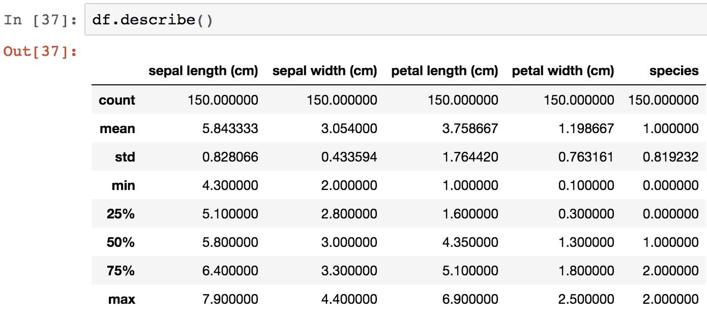

# 第一章：Python 机器学习生态系统

机器学习正在迅速改变我们的世界。作为人工智能的核心，几乎每天我们都会看到有关它将引领我们进入类似奇点的技术乌托邦，或是某种全球性《银翼杀手》式噩梦场景的讨论。虽然评论员可能喜欢讨论这些夸张的未来，但更为平凡的现实是，机器学习正迅速成为我们日常生活的一部分。通过在我们与计算机及周围世界互动方式中的微妙但逐步改进，机器学习正在逐步改善我们的生活。

如果你在亚马逊等在线零售商购物，使用 Spotify 或 Netflix 等流媒体音乐或电影服务，或者甚至只是进行过 Google 搜索，那么你已经遇到了一个利用机器学习的应用程序。这些服务收集了大量数据——其中很多来自用户——并用这些数据来构建改善用户体验的模型。

现在是深入开发机器学习应用程序的理想时机，正如你将发现的那样，Python 是开发机器学习应用程序的理想选择。Python 拥有一个深厚且活跃的开发者社区，其中许多人根植于科学界。这一遗产为 Python 提供了无与伦比的科学计算库阵列。在本书中，我们将讨论并使用 **Python 科学栈** 中的若干库。

在接下来的章节中，我们将一步一步地学习如何构建各种机器学习应用程序。然而，在我们正式开始之前，本章的其余部分将讨论这些关键库的特性，以及如何准备你的环境以最佳方式利用它们。

本章将涵盖以下主题：

+   数据科学/机器学习工作流

+   每个工作流阶段的库

+   设置你的环境

# 数据科学/机器学习工作流

构建机器学习应用程序在许多方面与标准工程范式类似，但有一个关键的不同点：需要将数据作为原材料来处理。你的项目成功与否，主要取决于你获得的数据质量，以及你对这些数据的处理方式。而且，因为数据处理属于数据科学领域，理解数据科学工作流会很有帮助：


数据科学工作流

该过程包括以下六个步骤，按顺序进行：

1.  获取

1.  检查

1.  准备

1.  建模

1.  评估

1.  部署

在许多情况下，需要回到前一步骤，比如检查和准备数据，或评估和建模，但在高层次上，这一过程可以按前述列表描述的顺序进行。

现在我们来详细讨论每一步。

# 获取

机器学习应用的数据可以来自许多来源；它可能通过电子邮件发送给你作为 CSV 文件，可能来自提取服务器日志，或者可能需要构建一个自定义的网页爬虫。数据也可能以各种格式存在。在大多数情况下，你将处理基于文本的数据，但正如我们将看到的，机器学习应用也可以轻松地处理图像或视频文件。无论数据格式如何，一旦你获得了数据，理解数据中包含的内容以及未包含的内容至关重要。

# 检查

一旦你获取了数据，下一步就是检查它。在这一阶段的主要目标是对数据进行合理性检查，而完成此目标的最佳方法是寻找那些不可能或极不可能出现的情况。例如，如果数据中有唯一标识符，检查是否确实只有一个；如果数据是基于价格的，检查它是否始终为正数；无论数据类型如何，检查最极端的情况。它们是否有意义？一个好的做法是对数据进行一些简单的统计测试，并进行可视化。你的模型结果好坏取决于输入的数据，因此，确保这个步骤的正确性至关重要。

# 准备

当你确信数据已经整理好后，接下来需要将数据准备成适合建模的格式。这个阶段包括多个过程，如过滤、聚合、填充和转换。你需要采取的操作将高度依赖于你所处理的数据类型，以及你将使用的库和算法。例如，如果你正在处理基于自然语言的文本，所需的转换将与处理时间序列数据所需的转换大不相同。在本书中，我们将看到这些类型转换的多个实例。

# 建模

数据准备完成后，下一阶段是建模。在这里，你将选择一个合适的算法，并利用数据来训练模型。在这一阶段有许多最佳实践需要遵循，我们将详细讨论它们，但基本步骤包括将数据分为训练集、测试集和验证集。将数据拆分可能看起来不合逻辑——尤其是当更多数据通常会带来更好的模型时——但正如我们将看到的那样，这样做可以让我们更好地评估模型在现实世界中的表现，并防止我们犯下建模中的最大错误：过拟合。我们将在后面的章节中详细讨论这一点。

# 评估

现在你有了一个崭新的模型，但这个模型到底有多好呢？这是评估阶段试图回答的问题。评估模型性能有很多方法，这在很大程度上取决于你使用的数据类型和模型类型，但总的来说，我们试图回答的问题是：模型的预测与实际值有多接近。这里有一些听起来令人困惑的术语，比如均方根误差、欧几里得距离或 F1 得分。但最终，它们都只是衡量实际预测与估算预测之间距离的标准。

# 部署

一旦你对模型的性能感到满意，你就可能想要部署它。根据使用场景，部署可能有很多种形式，常见的情况包括作为另一个更大应用程序中的一个功能、定制的 Web 应用程序，甚至只是一个简单的定时任务。

# 数据科学工作流程中每个阶段的 Python 库和函数

现在你已经理解了数据科学工作流程中的每个步骤，我们将看看一些在每个步骤中有用的 Python 库和库中的函数。

# 获取

由于访问数据的常见方式之一是通过 RESTful API，你需要了解的一个库是 Python Requests 库，[`www.python-requests.org/en/latest/`](http://www.python-requests.org/en/latest/)。被称为*人类的 HTTP*，它使与 API 的交互变得简洁而简单。

让我们通过一个示例交互来看看，使用`requests`从 GitHub 的 API 中获取数据。在这里，我们将调用 API 并请求某个用户的收藏仓库列表：

```py
import requests r = requests.get(r"https://api.github.com/users/acombs/starred") r.json() 
```

这将返回该用户所有收藏仓库的 JSON 数据，并附带每个仓库的属性。以下是前述调用的输出片段：


返回所有仓库的 JSON 时的输出片段

`requests`库功能强大—它的功能多到这里无法一一介绍，但我建议你查看文档以了解更多。

# 检查

由于检查数据在机器学习应用开发中的关键作用，我们将深入探讨几种能帮助你完成这项任务的优秀库。

# Jupyter Notebook

有许多库可以简化数据检查过程。第一个是 Jupyter Notebook 配合 IPython ([`ipython.org/`](http://ipython.org/))。这是一种完全成熟的互动计算环境，非常适合数据探索。与大多数开发环境不同，Jupyter Notebook 是一个基于网页的前端（与 IPython 内核连接），它将内容划分为独立的代码块或单元格。单元格可以根据需要单独运行，也可以一次性运行所有单元格。这使得开发人员可以运行一个场景，查看输出，然后回过头调整代码，看到相应的变化——所有这些都无需离开笔记本。以下是在 Jupyter Notebook 中的一个示例交互：


Jupyter Notebook 中的示例交互

你会注意到，在这里我们做了很多事情，不仅与 IPython 后端交互，还与终端 shell 进行了互动。在这里，我导入了 Python 的 `os` 库，并调用它来查找当前的工作目录（单元格 #2），你可以看到输出在我的输入代码单元下方。然后我在单元格 #3 使用 `os` 库更改了目录，但在单元格 #4 中停止使用 `os` 库，转而开始使用基于 Linux 的命令。这是通过在单元格前加上 `!` 来实现的。在单元格 #6 中，你可以看到我甚至将 shell 输出保存到了 Python 变量 (`file_two`) 中。这是一个非常棒的功能，它使得文件操作变得简单。

请注意，结果在你的机器上会有所不同，因为它显示的是运行时的用户信息。

现在，让我们看看使用笔记本进行的一些简单数据操作。这也是我们首次接触到另一个不可或缺的库——pandas。

# Pandas

Pandas 是一个出色的数据分析工具，旨在成为任何语言中最强大、最灵活的开源数据分析/处理工具。正如你很快会看到的那样，如果它目前还没有完全实现这一目标，那也不远了。现在让我们来看看：


导入鸢尾花数据集

从前面的截图中你可以看到，我已经导入了一个经典的机器学习数据集——`iris` 数据集（也可以在 [`archive.ics.uci.edu/ml/datasets/Iris`](https://archive.ics.uci.edu/ml/datasets/Iris) 找到），使用了 scikit-learn 这个我们稍后会详细讨论的库。接着，我将数据传入了一个 `pandas` DataFrame，并确保为其分配了列标题。一个 DataFrame 包含了花卉测量数据，另一个 DataFrame 包含了代表 `iris` 物种的数字。这些数字分别编码为 `0`、`1` 和 `2`，分别对应 `setosa`、`versicolor` 和 `virginica`。接着，我将两个 DataFrame 合并在一起。

对于能够在单台机器上运行的数据集，pandas 是终极工具；你可以把它想象成是超级增强版的 Excel。而且，像流行的电子表格程序一样，操作的基本单元是数据的列和行，它们构成了表格。在 pandas 的术语中，数据列是 Series，表格是 DataFrame。

使用我们之前加载的相同的 `iris` DataFrame，接下来我们来看几个常见操作，包括以下内容：


第一个操作只是使用 `.head()` 命令来获取前五行。第二个命令是通过列名称引用来从 DataFrame 中选择单列。我们进行这种**数据切片**的另一种方式是使用 `.iloc[row,column]` 或 `.loc[row,column]` 语法。前者使用数字索引对列和行进行切片（位置索引），而后者对行使用数字索引，但允许使用命名列（基于标签的索引）。

让我们使用 `.iloc` 语法选择前两列和前四行。接着，我们再看一下 `.loc` 语法：


使用 `.iloc` 语法和 Python 列表切片语法，我们能够选择这个 DataFrame 的一个切片。

现在，让我们尝试一些更高级的内容。我们将使用列表迭代器来选择仅包含宽度特征的列：


我们在这里做的是创建一个包含所有列子集的列表。`df.columns` 返回所有列的列表，我们的迭代使用条件语句仅选择标题中包含 `width` 的列。显然，在这种情况下，我们本来也可以直接将想要的列名列出，但这给了你一个在处理更大数据集时可用的强大功能的感觉。

我们已经看到如何根据位置选择切片，但现在让我们看看另一种选择数据的方法。这一次，我们将根据满足我们指定的条件来选择数据的一个子集：

1.  现在，让我们来看一下可用的`species`独特列表，并选择其中一个：


1.  在最右侧的列中，你会注意到我们的 DataFrame 现在只包含 `Iris-virginica` 物种的数据（由 `2` 表示）。实际上，DataFrame 的大小现在是 50 行，比原始的 150 行少了：


1.  你还可以看到，左侧的索引保留了原始的行号。如果我们想仅保存这些数据，我们可以将其保存为一个新的 DataFrame，并按以下图示重置索引：


1.  我们通过在一列上设置条件来选择数据；现在，让我们添加更多的条件。我们将返回到原始的 DataFrame，并添加两个条件：


现在，DataFrame 只包含 `virginica` 物种且花瓣宽度大于 `2.2` 的数据。

接下来，我们使用 pandas 来快速获取 `iris` 数据集的一些描述性统计数据：



通过调用 `.describe()` 函数，我得到了相关列的描述性统计信息的详细数据。（注意，物种列被自动移除，因为它与此无关。）如果需要更详细的信息，我也可以传入自己的百分位数：


接下来，让我们检查这些特征之间是否存在任何相关性。这可以通过在 DataFrame 上调用 `.corr()` 来完成：


默认情况下返回每一行列对的**皮尔逊相关系数**。你可以通过传入方法参数（例如 `.corr(method="spearman")` 或 `.corr(method="kendall")`）将其切换为**肯德尔τ系数**或**斯皮尔曼等级相关系数**。

# 可视化

到目前为止，我们已经学习了如何从 DataFrame 中选择部分数据，并如何获取数据的总结统计信息，但接下来我们要学习如何进行数据的可视化检查。但首先，为什么要进行可视化检查呢？我们来看一个例子，理解一下为什么这么做。

以下是四个不同的 *x* 和 *y* 值系列的总结统计数据：

| **x 和 *y* 的系列** | **值** |
| --- | --- |
| *x* 的均值 | 9 |
| *y* 的均值 | 7.5 |
| *x* 的样本方差 | 11 |
| *y* 的样本方差 | 4.1 |
| *x* 和 *y* 之间的相关性 | 0.816 |
| 回归线 | *y* = 3.00 + 0.500 *x* |

基于这些系列具有相同的总结统计数据，你可能会假设这些系列在视觉上会相似。当然，你会错的，非常错。这四个系列是**安斯科姆四重奏**的一部分，它们故意被创建用来说明数据可视化检查的重要性。每个系列的图形如下：


很明显，在可视化这些数据集后，我们不会将它们视为相同的数据集。因此，现在我们已经理解了可视化的重要性，接下来我们来看看一对有用的 Python 库。

# matplotlib 库

我们首先要看的库是`matplotlib`。`matplotlib`库是 Python 绘图库的核心。最初为了模拟 MATLAB 的绘图功能而创建，它逐渐发展成了一个功能完备的库，拥有广泛的功能。如果你没有 MATLAB 背景，可能很难理解所有组件如何协同工作以生成你看到的图表。我会尽力将这些部分拆解成逻辑组件，以帮助你快速上手。在全面深入`matplotlib`之前，让我们先设置我们的 Jupyter Notebook，以便在其中查看图表。为此，请在你的`import`语句中添加以下几行：

```py
import matplotlib.pyplot as plt 
plt.style.use('ggplot') 
%matplotlib inline 
```

第一行导入了`matplotlib`，第二行将样式设置为近似 R 的`ggplot`库（需要 matplotlib 1.41 或更高版本），最后一行设置图表使其能够在笔记本中显示。

现在，让我们使用我们的`iris`数据集生成第一个图表：

```py
fig, ax = plt.subplots(figsize=(6,4)) 
ax.hist(df['petal width (cm)'], color='black'); 
ax.set_ylabel('Count', fontsize=12) 
ax.set_xlabel('Width', fontsize=12) 
plt.title('Iris Petal Width', fontsize=14, y=1.01) 
```

上面的代码生成了以下输出：


即使在这个简单的示例中，也有很多内容，但我们会逐行解析。第一行创建了一个宽度为`6`英寸、高度为`4`英寸的单个子图。接下来，我们通过调用`.hist()`并传入数据，绘制了我们`iris`数据框中花瓣宽度的直方图。我们还在这里将柱状图的颜色设置为`黑色`。接下来的两行分别为我们的*y*轴和*x*轴添加了标签，最后一行设置了图表的标题。我们通过*y*参数调整标题相对于图表顶部的位置，并略微增大字体大小。这样我们就得到了一个漂亮的花瓣宽度数据直方图。现在让我们扩展这个图表，生成我们`iris`数据集每一列的直方图：

```py
fig, ax = plt.subplots(2,2, figsize=(6,4)) 

ax[0][0].hist(df['petal width (cm)'], color='black'); 
ax[0][0].set_ylabel('Count', fontsize=12) 
ax[0][0].set_xlabel('Width', fontsize=12) 
ax[0][0].set_title('Iris Petal Width', fontsize=14, y=1.01) 

ax[0][1].hist(df['petal length (cm)'], color='black'); 
ax[0][1].set_ylabel('Count', fontsize=12) 
ax[0][1].set_xlabel('Length', fontsize=12) 
ax[0][1].set_title('Iris Petal Length', fontsize=14, y=1.01) 

ax[1][0].hist(df['sepal width (cm)'], color='black'); 
ax[1][0].set_ylabel('Count', fontsize=12) 
ax[1][0].set_xlabel('Width', fontsize=12) 
ax[1][0].set_title('Iris Sepal Width', fontsize=14, y=1.01) 

ax[1][1].hist(df['sepal length (cm)'], color='black'); 
ax[1][1].set_ylabel('Count', fontsize=12) 
ax[1][1].set_xlabel('Length', fontsize=12) 
ax[1][1].set_title('Iris Sepal Length', fontsize=14, y=1.01) 

plt.tight_layout() 
```

上面代码的输出如下图所示：


显然，这不是编写代码的最有效方式，但它对于演示`matplotlib`的工作原理非常有用。注意，和我们在第一个示例中使用的单一子图对象`ax`不同，现在我们有了四个子图，这些子图通过现在的`ax`数组来访问。代码中的新添加部分是对`plt.tight_layout()`的调用；这个函数会自动调整子图的间距，以避免重叠。

现在让我们来看看`matplotlib`中可用的几种其他类型的图表。一种有用的图表是**散点图**。在这里，我们将绘制花瓣宽度与花瓣长度的关系：

```py
fig, ax = plt.subplots(figsize=(6,6)) 
ax.scatter(df['petal width (cm)'],df['petal length (cm)'],                      color='green') 
ax.set_xlabel('Petal Width') 
ax.set_ylabel('Petal Length') 
ax.set_title('Petal Scatterplot') 
```

上面的代码生成了以下输出：


如前所述，我们可以添加多个子图来检查每个方面。

我们可以检查的另一个图表是一个简单的折线图。在这里，我们将查看花瓣长度的图表：

```py
fig, ax = plt.subplots(figsize=(6,6)) 
ax.plot(df['petal length (cm)'], color='blue') 
ax.set_xlabel('Specimen Number') 
ax.set_ylabel('Petal Length') 
ax.set_title('Petal Length Plot') 
```

上面的代码生成了以下输出：


我们已经可以通过这个简单的折线图看到，每个物种的花瓣长度都有明显的聚类——记得我们的样本数据集每种类型有 50 个有序示例。这告诉我们，如果我们要构建一个分类器，花瓣长度可能是一个有用的特征，可以用来区分这些物种。

让我们看一下 `matplotlib` 库中的最后一种图表类型——柱状图。这可能是你最常见的一种图表。这里，我们将为三种鸢尾花的每个特征绘制柱状图，并为了使图表更有趣，我们将其制作成堆叠柱状图，并添加一些额外的 `matplotlib` 特性：

```py
import numpy as np
fig, ax = plt.subplots(figsize=(6,6))
bar_width = .8
labels = [x for x in df.columns if 'length' in x or 'width' in x]
set_y = [df[df['species']==0][x].mean() for x in labels]
ver_y = [df[df['species']==1][x].mean() for x in labels]
vir_y = [df[df['species']==2][x].mean() for x in labels]
x = np.arange(len(labels))
ax.bar(x, set_y, bar_width, color='black')
ax.bar(x, ver_y, bar_width, bottom=set_y, color='darkgrey')
ax.bar(x, vir_y, bar_width, bottom=[i+j for i,j in zip(set_y, ver_y)], color='white')
ax.set_xticks(x + (bar_width/2))
ax.set_xticklabels(labels, rotation=-70, fontsize=12);
ax.set_title('Mean Feature Measurement By Species', y=1.01)
ax.legend(['Setosa','Versicolor','Virginica'])   
```

上述代码片段的输出结果如下：


要生成柱状图，我们需要将 `x` 和 `y` 值传递给 `.bar()` 函数。在这种情况下，`x` 值将只是我们感兴趣的特征长度的数组——这里是四个，或者说是我们 DataFrame 中每一列的一个值。`np.arange()` 函数是生成此数组的简便方法，但我们也几乎可以手动输入这个数组。由于我们不希望 *x* 轴显示为从 1 到 4，我们调用 `.set_xticklabels()` 函数并传入我们希望显示的列名。为了正确对齐 `x` 标签，我们还需要调整标签的间距。这就是为什么我们将 `xticks` 设置为 `x` 加上 `bar_width` 大小的一半，我们之前也将其设置为 `0.8`。`y` 值来自于每个特征在每个物种上的均值。然后我们通过调用 `.bar()` 来绘制每一组数据。需要注意的是，我们为每个系列传入了一个 `bottom` 参数，它设置了该系列的最小 *y* 值和下面系列的最大 *y* 值。这就创建了堆叠的柱状图。最后，我们添加了一个图例，说明了每个系列。图例中的名称按从上到下的顺序插入。

# Seaborn 库

接下来我们要查看的可视化库叫做 `seaborn`，([`seaborn.pydata.org/index.html`](http://seaborn.pydata.org/index.html))。它是一个专为统计可视化创建的库。事实上，它非常适合与 `pandas` DataFrame 一起使用，其中列是特征，行是观察值。这种形式的 DataFrame 被称为 **tidy** 数据，是机器学习应用中最常见的数据形式。

现在让我们来看看 `seaborn` 的强大功能：

```py
import seaborn as sns 
sns.pairplot(df, hue='species') 
```

仅凭这两行代码，我们就能得到以下结果：


Seaborn 图

在详细介绍了`matplotlib`的复杂细节之后，你会立刻体会到我们生成这个图表的简便性。我们只用了两行代码，就把所有特征都绘制并正确标注了。你可能会想，我是不是浪费了几十页的篇幅教你`matplotlib`，而`seaborn`却能让这些类型的可视化变得如此简单。其实并非如此，因为`seaborn`是建立在`matplotlib`之上的。事实上，你可以利用你学到的所有`matplotlib`知识来修改和使用`seaborn`。让我们来看看另一个可视化：

```py
fig, ax = plt.subplots(2, 2, figsize=(7, 7)) 
sns.set(style='white', palette='muted') 
sns.violinplot(x=df['species'], y=df['sepal length (cm)'], ax=ax[0,0]) sns.violinplot(x=df['species'], y=df['sepal width (cm)'], ax=ax[0,1]) sns.violinplot(x=df['species'], y=df['petal length (cm)'], ax=ax[1,0]) sns.violinplot(x=df['species'], y=df['petal width (cm)'], ax=ax[1,1]) fig.suptitle('Violin Plots', fontsize=16, y=1.03) 
for i in ax.flat:
 plt.setp(i.get_xticklabels(), rotation=-90) 
fig.tight_layout() 
```

上面的代码生成了以下输出：


小提琴图

在这里，我们为四个特征生成了小提琴图。小提琴图展示了特征的分布。例如，你可以很容易地看到`setosa`（0）的花瓣长度高度集中在 1 厘米到 2 厘米之间，而`virginica`（2）的花瓣长度则更加分散，从接近 4 厘米到超过 7 厘米。你还会注意到，我们使用了与构建`matplotlib`图形时大部分相同的代码。主要的区别在于我们用`ax.plot()`替换成了`sns.plot()`。我们还在所有子图上方添加了一个标题，而不是在每个子图上单独添加标题，这是通过`fig.suptitle()`函数实现的。另一个值得注意的变化是迭代每个子图以改变`xticklabels`的旋转角度。我们调用了`ax.flat()`，然后迭代每个子图轴，使用`.setp()`设置特定属性。这避免了我们像之前的`matplotlib`子图代码那样，必须单独输入`ax[0][0]...ax[1][1]`并设置属性。

使用`matplotlib`和`seaborn`，你可以生成数百种不同风格的图表，我强烈建议你深入研究这两个库的文档——那将是值得的时间——不过我在前一节中详细介绍的图表应该能够帮助你很大程度地理解你的数据集，而这将有助于你在构建机器学习模型时。

# 准备工作

我们已经学到了很多关于检查我们拥有的数据的知识，现在让我们继续学习如何处理和操作这些数据。在这里，我们将学习`pandas`的`.map()`、`.apply()`、`.applymap()`和`.groupby()`函数。这些函数在数据处理中非常宝贵，尤其在机器学习中的特征工程中极为重要，我们将在后续章节中详细讨论这一概念。

# map

现在我们将从`map`函数开始。`map`函数适用于序列，所以在我们的例子中，我们将使用它来转换 DataFrame 中的一列，正如你所记得，它实际上是一个 pandas 序列。假设我们决定物种编号不适合我们的需求，我们将使用带有 Python 字典作为参数的`map`函数来完成这个任务。我们会为每个独特的`iris`类型传递一个替代值：


让我们来看一下我们所做的事情。我们对现有的`species`列中的每个值都应用了`map`函数。当每个值在 Python 字典中找到时，它会被添加到返回的序列中。我们将这个返回序列赋给了相同的`species`名称，因此它替换了我们原始的`species`列。如果我们选择了一个不同的名称，比如`short code`，那么那一列会被附加到 DataFrame 中，之后我们将拥有原始的`species`列以及新的`short code`列。

我们本可以将`map`函数传递给一个序列或函数，来对某一列进行转换，但这种功能也可以通过`apply`函数实现，我们接下来将了解它。字典功能是`map`函数特有的，且选择`map`而非`apply`进行单列转换的最常见原因。现在，让我们来看看`apply`函数。

# apply

`apply`函数允许我们同时处理 DataFrame 和序列。我们将从一个可以同样适用于`map`的例子开始，然后再介绍一些只适用于`apply`的例子。

使用我们的`iris` DataFrame，让我们基于花瓣宽度创建一个新列。我们之前看到，花瓣宽度的均值是`1.3`。现在，让我们在 DataFrame 中创建一个新列`wide petal`，该列基于`petal width`列的值包含二进制值。如果`petal width`大于或等于中位数，我们将其编码为`1`，如果小于中位数，我们将其编码为`0`。我们将使用`apply`函数对`petal width`列执行这个操作：


这里发生了几件事情，我们一步步来分析。首先，我们能够通过使用列选择语法来简单地将新列附加到 DataFrame 中，这里是`wide petal`。我们将新列设置为`apply`函数的输出。在这里，我们对`petal width`列运行了`apply`，并返回了对应的`wide petal`列的值。`apply`函数通过遍历`petal width`列中的每个值来工作。如果该值大于或等于`1.3`，函数返回`1`，否则返回`0`。这种类型的转换是机器学习中常见的特征工程转换，因此熟悉如何执行它是很有用的。

接下来我们将演示如何在`DataFrame`上使用`apply`，而不是单个系列。我们将基于`花瓣面积`创建一个新特征：


创建一个新特征

请注意，我们在这里调用`apply`时不是对单个系列进行操作，而是对整个`DataFrame`进行操作。因为`apply`是对整个`DataFrame`调用的，所以我们传入了`axis=1`，以告知 pandas 我们希望按行应用该函数。如果传入`axis=0`，则函数会按列操作。在这里，每一列会被顺序处理，我们选择将`petal length (cm)`和`petal width (cm)`两列的值相乘，结果系列成为`petal area`列。这种灵活性和强大功能正是 pandas 成为数据处理不可或缺工具的原因。

# applymap

我们已经讨论过如何操作列并解释了如何处理行，但假设你想在`DataFrame`的所有数据单元格上执行一个函数。这个时候，`applymap`就是正确的工具。让我们看一个例子：


使用 applymap 函数

在这里，我们对`DataFrame`调用了`applymap`，以便获取每个值的对数（`np.log()`利用 NumPy 库返回此值），前提是该值是浮动类型。这个类型检查可以防止在`species`或`wide petal`列（分别是字符串和整数值）上返回错误或浮动类型。`applymap`的常见用法包括根据满足一系列条件对每个单元格进行转换或格式化。

# groupby

现在我们来看看一个非常有用，但对于新手来说常常难以理解的操作：`.groupby()`函数。我们将通过多个示例逐步演示，以说明其最重要的功能。

`groupby`操作如其名所示：它根据你选择的某些类别或类对数据进行分组。让我们用`iris`数据集看一个简单的例子。我们将重新导入原始的`iris`数据集，并执行第一次`groupby`操作：


在这里，每个物种的数据被分区并提供了每个特征的平均值。现在我们更进一步，获取每个`species`的完整描述性统计数据：


每个物种的统计数据

现在，我们可以看到按`species`分组的完整数据。接下来，我们将看看还可以执行哪些其他的`groupby`操作。我们之前看到过，花瓣的长度和宽度在不同物种之间有相对明确的边界。现在，让我们研究如何使用`groupby`来观察这一点：


在这个例子中，我们根据每个独特物种的`花瓣宽度`对它们进行分组。这是一个可以管理的分组依据，但如果数据量变得更大，我们可能需要将测量数据划分为多个区间。正如我们之前看到的，这可以通过`apply`函数来实现。

现在让我们来看看一个自定义聚合函数：


在这段代码中，我们使用`.max()`和`.min()`函数以及返回最大花瓣宽度小于最小花瓣宽度的`lambda`函数对花瓣宽度按物种进行分组。

我们刚刚触及了`groupby`函数的一些功能，实际上它有更多的应用，建议你阅读[`pandas.pydata.org/pandas-docs/stable/`](http://pandas.pydata.org/pandas-docs/stable/)中的文档。

希望你现在已经对如何操作和准备数据有了坚实的基础理解，为接下来的建模步骤做准备。接下来，我们将讨论 Python 机器学习生态系统中的主要库。

# 建模与评估

在这一部分，我们将介绍不同的库，如`statsmodels`和`Scikit-learn`，并理解什么是部署。

# Statsmodels

我们将介绍的第一个库是`statsmodels`库（[`statsmodels.sourceforge.net/`](http://statsmodels.sourceforge.net/)）。Statsmodels 是一个 Python 包，功能强大，文档完善，专为数据探索、模型估计和统计测试而设计。在这里，我们将使用它来建立`setosa`物种的花萼长度和花萼宽度之间关系的简单线性回归模型。

首先，让我们通过散点图直观地检查这种关系：

```py
fig, ax = plt.subplots(figsize=(7,7)) 
ax.scatter(df['sepal width (cm)'][:50], df['sepal length (cm)'][:50]) 
ax.set_ylabel('Sepal Length') 
ax.set_xlabel('Sepal Width') 
ax.set_title('Setosa Sepal Width vs. Sepal Length', fontsize=14, y=1.02) 
```

上述代码生成了以下输出：


所以我们可以看到，似乎存在正线性关系；也就是说，随着花萼宽度的增加，花萼长度也增加。接下来，我们将使用`statsmodels`对数据进行线性回归，以估计这种关系的强度：

```py
import statsmodels.api as sm 

y = df['sepal length'][:50] 
x = df['sepal width'][:50] 
X = sm.add_constant(x) 

results = sm.OLS(y, X).fit() 
print results.summary() 
```

上述代码生成了以下输出：


在前面的图中，我们展示了简单回归模型的结果。由于这是一个线性回归模型，模型的形式为*Y = Β[0]+ Β[1]X*，其中*B[0]*是截距，*B[1]*是回归系数。这里的公式为*花萼长度 = 2.6447 + 0.6909 * 花萼宽度*。我们还可以看到，模型的*R²*值是一个令人满意的`0.558`，而*p*值（`Prob`）非常显著—至少对于这个物种来说。

现在让我们使用`results`对象来绘制回归线：

```py
fig, ax = plt.subplots(figsize=(7,7)) 
ax.plot(x, results.fittedvalues, label='regression line') 
ax.scatter(x, y, label='data point', color='r') 
ax.set_ylabel('Sepal Length') 
ax.set_xlabel('Sepal Width') 
ax.set_title('Setosa Sepal Width vs. Sepal Length', fontsize=14, y=1.02) 
ax.legend(loc=2) 
```

上述代码生成了以下输出：


通过绘制`results.fittedvalues`，我们可以得到回归分析的回归线。

`statsmodels` 包中还有许多其他统计函数和测试，欢迎你去探索它们。它是 Python 中进行标准统计建模的一个非常有用的包。现在，让我们继续深入了解 Python 机器学习库中的王者：scikit-learn。

# Scikit-learn

Scikit-learn 是一个了不起的 Python 库，具有无与伦比的文档，旨在为众多算法提供一致的 API。它建立在 Python 科学计算堆栈的基础上，并且本身也是这个堆栈的核心组件，堆栈包括 NumPy、SciPy、pandas 和 matplotlib。Scikit-learn 涉及的领域包括：分类、回归、聚类、降维、模型选择和预处理。

我们将查看一些示例。首先，我们将使用 `iris` 数据集构建一个分类器，然后我们将看看如何使用 scikit-learn 的工具来评估我们的模型：

1.  在 scikit-learn 中构建机器学习模型的第一步是理解数据应该如何结构化。

1.  自变量应该是一个数值型 *n × m* 矩阵 *X*，因变量 *y* 是一个 *n × 1* 向量。

1.  *y* 向量可以是数值型连续变量、分类变量，或者是字符串型分类变量。

1.  这些数据随后被传递给所选分类器的 `.fit()` 方法。

1.  这就是使用 scikit-learn 的巨大好处：每个分类器尽可能使用相同的方法。这使得更换分类器变得非常简单。

让我们在第一个示例中看看实际效果：

```py
from sklearn.ensemble import RandomForestClassifier 
from sklearn.cross_validation import train_test_split 

clf = RandomForestClassifier(max_depth=5, n_estimators=10) 

X = df.ix[:,:4] 
y = df.ix[:,4] 

X_train, X_test, y_train, y_test = train_test_split(X, y, test_size=.3) 

clf.fit(X_train,y_train) 

y_pred = clf.predict(X_test) 

rf = pd.DataFrame(zip(y_pred, y_test), columns=['predicted', 'actual']) 
rf['correct'] = rf.apply(lambda r: 1 if r['predicted'] == r['actual'] else 0, axis=1) 

rf 
```

上述代码生成了以下输出：


现在，让我们执行以下代码：

```py
rf['correct'].sum()/rf['correct'].count() 
```

上述代码生成了以下输出：


在前面的几行代码中，我们构建、训练并测试了一个分类器，该分类器在我们的 `iris` 数据集上的准确率为 95%。让我们逐步解析每个步骤。首先，我们做了几个导入；前两个是来自 scikit-learn，幸运的是，在导入语句中它们被缩写为 `sklearn`。第一个导入是随机森林分类器，第二个是用于将数据拆分为训练集和测试集的模块。这种数据划分在构建机器学习应用时至关重要，原因有很多。我们将在后面的章节中详细讨论，但在此时可以说，它是必须的。这个 `train_test_split` 模块还会对数据进行洗牌，这一点也非常重要，因为数据的顺序可能包含会影响预测的偏置信息。

导入语句后面的第一行看起来有些奇怪，它实例化了我们的分类器，在这个例子中是一个随机森林分类器。我们选择了一个包含 10 棵决策树的森林，并且每棵树的最大分裂深度为五。这样设置是为了避免过拟合，这是我们将在后面章节中深入讨论的内容。

接下来的两行代码创建了我们的*X*矩阵和*y*向量。如果你记得我们最初的`iris` DataFrame，它包含了四个特征：花瓣宽度、花瓣长度、萼片宽度和萼片长度。这些特征被选中，成为我们的自变量特征矩阵*X*。最后一列，`iris`类别名称，则成为我们的因变量*y*向量。

然后，这些数据被传入`train_test_split`方法，该方法会打乱并将我们的数据分为四个子集，`X_train`、`X_test`、`y_train`和`y_test`。`test_size`参数设置为`.3`，这意味着 30%的数据集将分配给`X_test`和`y_test`，其余的则分配给训练集`X_train`和`y_train`。

接下来，我们使用训练数据来拟合我们的模型。训练完成后，我们使用测试数据调用分类器的预测方法。请记住，测试数据是分类器未曾见过的数据。这个预测返回的是一个预测标签的列表。然后，我们创建一个包含实际标签与预测标签的 DataFrame。最后，我们统计正确预测的数量，并除以总实例数，从而得到一个非常准确的预测。现在，让我们看看哪些特征为我们提供了最具判别力或预测力的能力：

```py
f_importances = clf.feature_importances_ 
f_names = df.columns[:4] 
f_std = np.std([tree.feature_importances_ for tree in clf.estimators_], axis=0) 

zz = zip(f_importances, f_names, f_std) 
zzs = sorted(zz, key=lambda x: x[0], reverse=True) 

imps = [x[0] for x in zzs] 
labels = [x[1] for x in zzs] 
errs = [x[2] for x in zzs] 

plt.bar(range(len(f_importances)), imps, color="r", yerr=errs, align="center") 
plt.xticks(range(len(f_importances)), labels); 
```

上述代码生成了以下输出：


正如我们预期的，根据之前的可视化分析，花瓣的长度和宽度在区分`iris`类别时具有更强的判别力。那么，这些数字究竟是从哪里来的呢？随机森林有一个叫做`.feature_importances_`的方法，它返回特征在叶节点划分时的相对表现。如果一个特征能够一致且干净地将一组数据划分成不同的类别，那么它的特征重要性就会很高。这个数值的总和始终为 1。正如你在这里看到的，我们还包括了标准差，这有助于说明每个特征的一致性。这是通过对每个特征的特征重要性进行计算，针对每十棵树，计算标准差来生成的。

现在让我们来看另一个使用 scikit-learn 的例子。我们将更换分类器，使用**支持向量机**（**SVM**）：

```py
from sklearn.multiclass import OneVsRestClassifier 
from sklearn.svm import SVC 
from sklearn.cross_validation import train_test_split 

clf = OneVsRestClassifier(SVC(kernel='linear')) 

X = df.ix[:,:4] 
y = np.array(df.ix[:,4]).astype(str) 

X_train, X_test, y_train, y_test = train_test_split(X, y, test_size=.3) 

clf.fit(X_train,y_train) 

y_pred = clf.predict(X_test) 

rf = pd.DataFrame(zip(y_pred, y_test), columns=['predicted', 'actual']) 
rf['correct'] = rf.apply(lambda r: 1 if r['predicted'] == r['actual'] else 0, axis=1) 

rf 
```

上述代码生成了以下输出：


现在，让我们执行以下代码行：

```py
rf['correct'].sum()/rf['correct'].count() 
```

上述代码生成了以下输出：


在这里，我们使用了支持向量机（SVM），而几乎没有更改任何代码。唯一的变化是与导入 SVM 代替随机森林相关的部分，以及实例化分类器的那一行。（我确实需要对`y`标签的格式做一个小小的调整，因为 SVM 无法像随机森林分类器那样将它们解释为 NumPy 字符串。有时，必须做出特定的数据类型转换，否则会导致错误，但这只是一个小小的烦恼。）

这只是 scikit-learn 功能的一个小样本，但它应该能给你一些提示，说明这个强大的机器学习工具的威力。还有许多其他机器学习库，我们在这里无法详细讨论，但会在后续章节中探讨。如果这是你第一次使用机器学习库，并且你需要一个强大的通用工具，我强烈建议你选择 scikit-learn。

# 部署

当你决定将机器学习模型投入生产时，有许多选择可以选择。这主要取决于应用程序的性质。部署可以包括从本地机器上运行的定时任务到在 Amazon EC2 实例上部署的全规模实施。

我们在这里不会详细讨论具体的实现，但在全书中我们会有机会深入探讨不同的部署实例。

# 设置你的机器学习环境

我们已经覆盖了许多库，如果你要单独安装每一个库，可能会有些麻烦——当然，你完全可以这样做，因为大多数库都可以通过 pip，Python 的包管理器来安装，但我强烈建议你使用像 Anaconda Python 发行版（[`anaconda.org`](http://anaconda.org)）这样的预打包解决方案。这样，你可以下载并安装一个包含所有包和依赖项的单一可执行文件，而所有的依赖问题都由它为你处理。由于该发行版针对 Python 科学计算栈用户，因此它本质上是一个一站式解决方案。

Anaconda 还包括一个包管理器，使得更新包变得非常简单。只需键入`conda update <package_name>`，就可以将包更新到最新的稳定版本。

# 总结

在这一章中，我们了解了数据科学/机器学习的工作流程。我们学习了如何一步步将数据从获取阶段通过每个阶段处理，直到部署阶段。我们还了解了 Python 科学计算栈中最重要的每个库的关键特性。现在，我们将应用这些知识和经验，开始创建独特且有用的机器学习应用。让我们开始吧！
