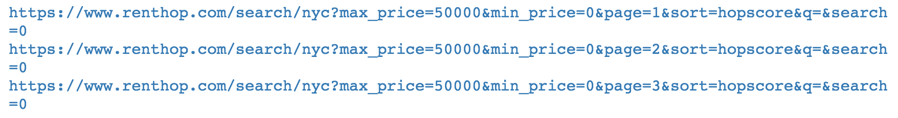

# 第二章：构建一个应用程序来找到低价公寓

在第一章，*Python 机器学习生态系统*中，我们学习了处理数据的基本知识。接下来，我们将应用这些知识，构建我们的第一个机器学习应用程序。我们将从一个简明但高度实用的例子开始：构建一个识别低价公寓的应用程序。

如果你曾经搜索过公寓，你一定能体会到这个过程有多么令人沮丧。它不仅耗时，而且即便你找到了一个你喜欢的公寓，你如何确定它就是合适的呢？

很可能，你有一个预算目标和一个地点目标。但是，如果你像我一样，你也愿意做出一些妥协。例如，我住在纽约市，靠近地铁这种设施是一个很大的优势。但这值得多少？我是否应该为了靠近地铁而放弃住在有电梯的楼里？步行到地铁站的几分钟，是否值得爬上一层楼梯？租房时，像这样的疑问有很多。那么，我们怎样才能利用机器学习帮助我们做出这些决策呢？

本章剩下的内容将围绕这一主题展开。我们不能解答所有问题（有些原因稍后会变得清楚），但在本章结束时，我们将创建一个应用程序，让找到合适的公寓变得稍微容易一些。

本章我们将涵盖以下内容：

+   获取公寓列表数据

+   检查和准备数据

+   可视化数据

+   回归建模

+   预测

# 获取公寓列表数据

在 1970 年代初期，如果你想购买股票，你需要聘请一个经纪人，他会收取近 1%的固定佣金。如果你想购买机票，你需要联系旅行代理商，他们会赚取大约 7%的佣金。如果你想卖房，你需要联系房地产代理商，他们会赚取 6%的佣金。而到了 2018 年，你几乎可以免费完成前两项。而最后一项依然保持着 1970 年代的样子。

为什么会这样？更重要的是，这一切与机器学习有什么关系呢？现实情况是，这一切归根结底是关于数据的，关于谁能访问这些数据。

你可能认为可以通过 API 或**网络爬虫**轻松获取大量房地产列表数据。你错了。如果你打算遵循这些网站的条款和条件的话，那就错了。房地产数据由**美国房地产经纪人协会**（**NAR**）严格控制，他们运营着**多重房源服务**（**MLS**）。这是一个汇总房源数据的服务，只提供给经纪人和代理商，且费用昂贵。所以，你可以想象，他们并不热衷于让任何人轻松下载这些数据*大规模地*。

这是不幸的，因为开放这些数据无疑将会带来有用的消费者应用程序。这对于家庭预算中最大的一部分购买决策尤为重要。

话虽如此，并不是所有希望都失去，因为并非每个网站都明确禁止抓取数据。

# 获取公寓列表数据

我们将使用 RentHop 网站， [`www.renthop.com`](https://www.renthop.com/)，来获取我们的公寓列表数据。以下是该网站的截图，展示了我们将要提取的列表布局：


从中我们可以看到，公寓列表中包括地址、价格、卧室数量和浴室数量。我们将从每个列表中获取这些信息。

我们将使用 Python 的 Requests 库来完成此任务。Requests 被称为 *人性化的 HTTP*，它使得获取网站变得非常容易。如果你想了解如何使用 Requests，快速入门指南可以在 [`docs.python-requests.org/en/master/user/quickstart/`](http://docs.python-requests.org/en/master/user/quickstart/) 上找到。请按以下步骤操作：

1.  所以，第一步是准备好我们的 Jupyter Notebook，并导入我们在这个任务中将使用的库。我们在以下代码片段中完成这项操作：

```py
import numpy as np 
import pandas as pd 
import requests 
import matplotlib.pyplot as plt 
%matplotlib inline 
```

我们可能需要在稍后导入更多的库，但现在这应该足以让我们开始了。

1.  我们将在模型中使用纽约公寓数据。该数据的网址是 [`www.renthop.com/nyc/apartments-for-rent`](https://www.renthop.com/nyc/apartments-for-rent)。让我们进行一个快速测试，确保我们能成功获取该页面。我们在以下代码中完成这个操作：

```py
r = requests.get('https://www.renthop.com/nyc/apartments-for-rent') 
r.content 
```

1.  这段代码调用了该网站，并获取了信息，将其存储在 `r` 对象中。我们可以从 `r` 对象中获取许多属性，但现在我们只关心页面内容。我们可以在以下截图中看到这个输出：


1.  经检查，看来我们需要的数据都包含在其中。为了验证这一点，让我们将所有 HTML 复制并粘贴到文本编辑器中，然后在浏览器中打开。我将使用 **Sublime Text**，这是一款流行的文本编辑器，可以在 [`www.sublimetext.com/`](https://www.sublimetext.com/) 上找到。

1.  在下面的截图中，您可以看到我已将从 Jupyter 输出中复制的 HTML 粘贴到 Sublime Text 中，并保存为 `test.html`：


HTML 文本

1.  接下来，我们点击“在浏览器中打开”，可以看到类似以下图片的输出：


注意，尽管文本没有正确渲染（因为缺少 CSS），但我们目标的所有数据都在那里。幸运的是，这意味着 RentHop 网站没有使用任何高级的 JavaScript 渲染技术，这样就使得我们的工作更轻松。如果使用了高级技术，我们就不得不使用像 Selenium 这样的工具了。

现在让我们检查页面元素，看看如何解析页面数据：

1.  在 Chrome 中打开 RentHop 网站，并右键点击页面的任意位置。

1.  在上下文菜单的底部，你应该能看到“检查”（Inspect）选项。点击它。页面现在应该看起来像下图：


1.  在刚刚打开的工具中，左上角有一个带箭头的方框。点击它，然后点击页面上的数据。它应该像下图一样：


从这里我们可以看到，每个房源的数据都在一个表格中，第一个`td`标签包含价格，第二个包含卧室数量，第三个包含浴室数量。我们还需要公寓的地址，它可以在一个锚点标签或`<a>`标签中找到。

现在让我们开始编写代码，测试我们的数据解析。为了进行 HTML 解析，我们将使用一个叫做**BeautifulSoup**的库。它的文档可以在[`www.crummy.com/software/BeautifulSoup/`](https://www.crummy.com/software/BeautifulSoup/)找到。BeautifulSoup 是一个流行、易于使用的 Python HTML 解析库。如果你还没有安装，可以通过 pip 安装。我们将使用它来提取我们公寓列表的所有单独规格：

1.  要开始，我们只需要将页面内容传递给`BeautifulSoup`类。这可以在下面的代码中看到：

```py
from bs4 import BeautifulSoup 

soup = BeautifulSoup(r.content, "html5lib") 
```

1.  我们现在可以使用我们创建的`soup`对象开始解析公寓数据。我们要做的第一件事是获取包含我们房源数据的`div`标签。我们可以在下面的代码中看到：

```py
listing_divs = soup.select('div[class*=search-info]') 
listing_divs 
```

在前面的代码中，我们做的是选择所有包含`search-info`的`div`元素。这些正是包含我们数据的`div`元素。

1.  接下来，我们来看一下下面截图中的输出：


1.  注意，我们有一个包含所有目标`div`标签的 Python 列表。根据页面显示，我们知道应该有二十个这些元素。我们来确认一下：

```py
len(listing_divs) 
```

1.  然后我们会看到以下输出，这确认我们已经成功获取到所有需要的数据：


# 提取单独的数据点

现在我们已经拥有了所有包含房源数据的`div`元素，接下来需要提取每个公寓的单独数据点。

这些是我们要在每个房源中提取的点：

+   房源的 URL

+   公寓的地址

+   邻里

+   卧室数量

+   浴室数量

显然，我们希望获得更多的信息——例如，公寓的面积，但我们只能利用现有的数据。

让我们从查看第一个房源开始：

```py
listing_divs[0] 
```

上面的代码将输出以下结果：


请注意，这第一个`div`包含了我们寻找的所有数据点。现在我们只需开始解析它们，逐个提取。让我们先看看第一个我们想要获取的内容，URL。

我们可以看到页面的 URL 带有一个锚点或标签。现在让我们解析这个 URL。我们可以使用另一个`select`语句来完成这个操作，以下是相关代码片段：

```py
listing_divs[0].select('a[id*=title]')[0]['href'] 
```

我们可以在以下截图中看到输出结果：


这正是我们所期望的结果。现在我们可以继续提取列表中的其他数据点。我们在下面的代码中执行了这一操作：

```py
href = current_listing.select('a[id*=title]')[0]['href'] 
addy = current_listing.select('a[id*=title]')[0].string 
hood = current_listing.select('div[id*=hood]')[0]\ 
       .string.replace('\n','') 
```

让我们通过打印出我们已经捕获到的数据来验证这一点。我们通过以下代码来实现：

```py
print(href) 
print(addy) 
print(hood) 
```

上面的代码生成了以下输出：


根据此输出，我们得到了所需的数据。接下来，让我们继续获取最后几个数据项——卧室数、浴室数和价格。

由于这些项目的呈现方式略有不同，它们在我们的`div`标签中的`table`标签内，并且在表格行`tr`中，我们需要遍历每个数据点以捕获数据。我们在下面的代码中进行了这个操作：

```py
listing_specs = listing_divs[0].select('table[id*=info] tr') 
for spec in listing_specs: 
    spec_data = spec.text.strip().replace(' ', '_').split() 
    print(spec_data) 
```

上面的代码生成了以下输出：


再次检查，这正是我们要找的结果。我们现在已经收集了所有我们需要的数据。接下来，让我们将这些数据整合到一个循环中，以便从每个列表中提取数据并保存到一个列表里。

在接下来的代码中，我们将提取每个公寓列表中的所有数据点：

```py
listing_list = [] 
for idx in range(len(listing_divs)): 
    indv_listing = [] 
    current_listing = listing_divs[idx] 
    href = current_listing.select('a[id*=title]')[0]['href'] 
    addy = current_listing.select('a[id*=title]')[0].string 
    hood = current_listing.select('div[id*=hood]')[0]\ 
    .string.replace('\n','') 
  indv_listing.append(href) 
    indv_listing.append(addy) 
    indv_listing.append(hood) 

    listing_specs = current_listing.select('table[id*=info] tr') 
    for spec in listing_specs: 
        try: 
            indv_listing.extend(spec.text.strip()\ 
                                .replace(' ', '_').split()) 
        except: 
            indv_listing.extend(np.nan) 
    listing_list.append(indv_listing) 
```

让我们稍微分析一下前面的代码。我们知道页面上有 20 个`div`元素，其中包含公寓的列表，所以我们创建了一个`for`循环，遍历每个元素，提取数据并将其添加到`indv_listing`中。完成后，所有单独公寓的数据会被添加到`listing_list`中，该列表包含了所有 20 个公寓的最终信息。我们可以通过以下代码来验证这一点：

```py
listing_list 
```

上面的代码生成了以下输出：


再次检查，我们似乎得到了预期的结果，所以我们将继续进行。`listing_list`中的项数也确认我们已经获得了页面上的所有 20 个公寓。

到目前为止，我们已经成功获取了第一页的数据。虽然这很好，但如果我们想构建一个有意义的模型，我们将需要更多的公寓数据。为此，我们需要遍历多个页面。为此，我们需要使用适当的 URLs。我们可以看到在公寓列表的底部，有一个写着“下一页”的按钮。如果你右键点击该按钮并选择“复制链接地址”，你会看到以下的 URL：[`www.renthop.com/search/nyc?max_price=50000&min_price=0&page=2&sort=hopscore&q=&search=0`](https://www.renthop.com/search/nyc?max_price=50000&min_price=0&page=2&sort=hopscore&q=&search=0)。

# 解析数据

对 URL 进行基本分析，我们可以看到传入的参数包括最小价格和最大价格，但最重要的是，页码。我们可以在代码中使用这个参数，并动态地改变页码，以便通过循环拉取更多的页面。

让我们试试一些示例代码：

```py
url_prefix = "https://www.renthop.com/search/nyc?max_price=50000&min_price=0&page=" 
page_no = 1 
url_suffix = "&sort=hopscore&q=&search=0" 

for i in range(3): 
    target_page = url_prefix + str(page_no) + url_suffix 
    print(target_page) 
    page_no += 1 
```

前面的代码产生了以下输出：



看起来像是成功了。现在我们只需要把它们合并到一起。我们将通过将我们的解析循环转化为一个适当的函数来开始，这样我们就可以在每个页面上调用它。我们通过以下代码来实现：

```py
def parse_data(listing_divs): 
    listing_list = [] 
    for idx in range(len(listing_divs)): 
        indv_listing = [] 
        current_listing = listing_divs[idx] 
        href = current_listing.select('a[id*=title]')[0]['href'] 
        addy = current_listing.select('a[id*=title]')[0].string 
        hood = current_listing.select('div[id*=hood]')[0]\ 
        .string.replace('\n','') 

        indv_listing.append(href) 
        indv_listing.append(addy) 
        indv_listing.append(hood) 

        listing_specs = current_listing.select('table[id*=info] tr') 
        for spec in listing_specs: 
            try: 
                values = spec.text.strip().replace(' ', '_').split() 
                clean_values = [x for x in values if x != '_'] 
                indv_listing.extend(clean_values) 
            except: 
                indv_listing.extend(np.nan) 
        listing_list.append(indv_listing) 
    return listing_list 
```

这个函数会接收一整页的`listing_divs`，并返回每个条目的数据载荷。然后我们可以将数据继续添加到我们的主公寓数据列表中。注意，在这段代码中有额外的代码来验证并移除一些错误的`'_'`值，这些值是在`listing_spec`循环中被加进去的。这样做是为了避免一些错误的解析，这些解析本不应该添加额外的列。

接下来，我们将构建主循环，该循环将检索每个页面，获取`listing_divs`，解析数据点，最后将所有信息添加到我们最终的 Python 列表中，包含每个条目的所有数据点。我们通过以下代码来实现：

```py
all_pages_parsed = [] 
for i in range(100): 
    target_page = url_prefix + str(page_no) + url_suffix 
    print(target_page) 
    r = requests.get(target_page) 

    soup = BeautifulSoup(r.content, 'html5lib') 

    listing_divs = soup.select('div[class*=search-info]') 

    one_page_parsed = parse_data(listing_divs) 

    all_pages_parsed.extend(one_page_parsed) 

    page_no += 1 
```

在尝试 100 个页面之前，你应该确认它在更小的数量上能正常工作，比如 3 个页面。

你应该注意到页面在代码运行时已经被打印出来。如果你使用了 30 页，你应该会看到`all_pages_parsed`列表中有 2,000 个条目。

现在，让我们将数据移入一个`pandas` DataFrame，这样我们可以更方便地处理它。我们通过以下代码来实现：

```py
df = pd.DataFrame(all_pages_parsed, columns=['url', 'address', 'neighborhood', 'rent', 'beds', 'baths']) 

df 
```

前面的代码产生了以下输出：


现在我们已经把所有数据拉取、解析并整合进了一个 DataFrame，接下来我们将进行数据的清理和验证。

# 检查并准备数据

让我们首先检查每一列的数据点。我们希望查找数据中的异常值和离群值。我们将从查看卧室和卫生间列开始：

1.  在以下代码中，我们查看卧室的唯一值：

```py
df['beds'].unique() 
```

前面的代码产生了以下输出：


1.  现在，让我们来看一下卫生间。我们通过以下代码来实现：

```py
df['baths'].unique() 
```

前面的代码产生了以下输出：


1.  根据前面两个查询的输出，我们看到需要修正一些前面带有下划线的项。现在我们来做这个修改：

```py
df['beds'] = df['beds'].map(lambda x: x[1:] if x.startswith('_') else x) 
df['baths'] = df['baths'].map(lambda x: x[1:] if x.startswith('_') else x) 
```

1.  在前面的代码中，我们使用了 pandas 的`map`函数和一个`lambda`函数，基本上检查元素是否以下划线开始，如果是，则移除它。快速检查一下床和浴室的唯一值，应该可以发现我们错误的下划线已被移除：

```py
df['beds'].unique() 
```

前面的代码产生了以下输出：


让我们执行以下代码行并查看结果：

```py
df['baths'].unique() 
```

上面的代码生成了以下输出：


1.  接下来，我们希望查看一些描述性统计数据，以更好地理解我们的数据。一种方法是使用`describe`方法。让我们在下面的代码中尝试一下：

```py
df.describe() 
```

上面的代码生成了以下输出：


虽然我们希望得到诸如平均卧室和浴室数量、最大租金等指标，但我们实际上得到的结果远少于预期。问题是数据的类型不适合这些操作。Pandas 无法对字符串对象执行这些类型的操作。我们需要进一步清理数据，并将其设置为正确的数据类型。我们将在下面的代码中进行操作：

```py
df['rent'] = df['rent'].map(lambda x: str(x).replace('$','').replace(',','')).astype('int') 
df['beds'] = df['beds'].map(lambda x: x.replace('_Bed', '')) 
df['beds'] = df['beds'].map(lambda x: x.replace('Studio', '0')) 
df['beds'] = df['beds'].map(lambda x: x.replace('Loft', '0')).astype('int') 
df['baths'] = df['baths'].map(lambda x: x.replace('_Bath', '')).astype('float') 
```

在前面的代码中，我们做了一个操作，将每个值中非数字的部分移除。你可以看到，我们去除了`_Bed`和`_Bath`，只留下了数字，并且我们将诸如`Studio`和`Loft`之类的词替换为实际的卧室数量，替换成了零。

# 数据类型预览

现在，让我们来看一下我们的数据类型：

```py
df.dtypes 
```

上面的代码生成了以下输出：


这是我们想要看到的结果。请注意，由于我们可以有半个浴室，因此我们需要使用浮动类型而不是整数。

接下来，让我们进行一次检查。我们来统计每个社区单元的数量：

```py
df.groupby('neighborhood')['rent'].count().to_frame('count')\ 
.sort_values(by='count', ascending=False) 
```

上面的代码生成了以下输出：


看起来大多数单元都位于曼哈顿，这也是我们所预期的。让我们确保我们的社区字符串是干净的。我们可以通过执行多个`groupby`操作来做到这一点：

```py
df[df['neighborhood'].str.contains('Upper East Side')]['neighborhood'].value_counts() 
```

上面的代码生成了以下输出：


看起来我们在数据中有一些前导空格，可能还存在尾随空格的问题。让我们清理一下这些问题。我们将在以下代码中进行处理：

```py
df['neighborhood'] = df['neighborhood'].map(lambda x: x.strip()) 
```

这样应该就清楚了。我们来验证一下：

```py
df[df['neighborhood'].str.contains('Upper East Side')]['neighborhood'].value_counts() 
```

上面的代码生成了以下输出：


完美！正是我们想要看到的结果。到此为止，我们可以再做一些检查。我们来看看每个社区的平均租金：

```py
df.groupby('neighborhood')['rent'].mean().to_frame('mean')\ 
.sort_values(by='mean', ascending=False) 
```

上面的代码生成了以下输出：


我们看到林肯广场区域的租金平均值似乎是最高的。到此为止，我们可以继续查询数据以寻找有趣的模式，但现在我们将继续进行数据的可视化。

# 可视化我们的数据

在处理地理数据时，就像我们现在做的那样，能够绘制这些信息是非常有价值的。一种实现方法是使用被称为 **染色图** 的地图。染色图本质上是一个地理热力图。我们将创建一个染色图，生成按 ZIP 码分布的平均租金价格热力图。

我们需要做的第一件事是 ZIP 码。不幸的是，我们的数据集中没有 ZIP 码信息。然而，我们有物业的地址。借助 Google Maps API，我们可以获取这些信息。

目前，Google Maps API 是一个收费 API。收费标准合理，1,000 次调用 $5，但每月还提供 $200 的信用额度（截至写作时）。他们还允许你在开始计费之前先注册免费试用，并且只有在你明确同意的情况下才会开始收费。由于市面上没有真正免费的替代品，我们将继续注册一个账户。接下来我将为你讲解步骤：

1.  第一步是访问 Google Maps API 页面：[`developers.google.com/maps/documentation/geocoding/intro`](https://developers.google.com/maps/documentation/geocoding/intro)：


1.  点击右上角的 GET STARTED。接下来，你将被提示创建一个项目。给它取一个你喜欢的名字：


创建一个项目

1.  然后你将启用计费：


1.  接下来，你将启用 API 密钥：


1.  完成后并获得 API 密钥后，返回首页启用地理定位 API。点击左侧面板中的 APIs：


1.  然后，在未使用的 API 下，点击地理定位 API：


完成这些步骤并获得 API 密钥后，使用 `pip install -U googlemaps` 安装 Google Maps。你可以在命令行中执行此操作：

现在让我们继续在 Jupyter Notebook 中使用这个 API。我们将导入新的地图 API 并进行测试：

```py
import googlemaps 

gmaps = googlemaps.Client(key='YOUR_API_KEY_GOES_HERE') 

ta = df.loc[3,['address']].values[0] + ' '\ 
+ df.loc[3,['neighborhood']].values[0].split(', ')[-1] 

ta 
```

上述代码会输出以下结果：


好的，实际上我们在代码的最后部分所做的就是导入并初始化 `googlemaps` 客户端，并使用我们某个公寓的地址作为可用地址。现在让我们将该地址传递给 Google Maps API：

```py
geocode_result = gmaps.geocode(ta) 

geocode_result 
```

上述代码生成以下输出：


记住，我们这里的目标是提取 ZIP 码。ZIP 码嵌入在 JSON 中，但由于响应 JSON 对象的格式，这需要一些工作来提取。我们现在来做这个：

```py
for piece in geocode_result[0]['address_components']: 
    if 'postal_code' in piece['types'] : 
        print(piece['short_name']) 
```

上述代码会输出以下结果：


看起来我们正在获得我们想要的信息。然而，有一个注意事项。深入查看地址栏时，我们可以看到偶尔并没有提供完整的地址。这将导致没有邮政编码返回。我们只需稍后处理这个问题。现在，让我们构建一个函数来检索邮政编码，代码如下：

```py
import re 
def get_zip(row): 
    try: 
        addy = row['address'] + ' ' + row['neighborhood'].split(', ')[-1] 
        print(addy) 
        if re.match('^\d+\s\w', addy): 
            geocode_result = gmaps.geocode(addy) 
            for piece in geocode_result[0]['address_components']: 
                if 'postal_code' in piece['types']: 
                    return piece['short_name'] 
                else: 
                    pass 
        else: 
            return np.nan 
    except: 
        return np.nan 

df['zip'] = df.apply(get_zip, axis=1) 
```

上述代码片段有不少内容，让我们来讨论一下这里的过程：

首先，在底部，你会看到我们在 DataFrame 上运行了`apply`方法。因为我们设置了`axis=1`，所以`df` DataFrame 的每一行都会传递到我们的函数中。在函数内部，我们正在拼接一个地址来调用 Google Maps 地理定位 API。我们使用正则表达式限制我们的调用仅限于那些以街道编号开头的地址。然后，我们遍历 JSON 响应来解析出邮政编码。如果找到了邮政编码，我们就返回它，否则返回`np.nan`，即空值。请注意，这个函数运行时需要一些时间，因为我们需要进行数百次调用并解析响应。

一旦完成，我们将得到一个新的 DataFrame，其中包含了那些提供了完整地址的物业的邮政编码。让我们来看一下，看看有多少条数据实际上是有邮政编码的：

```py
df[df['zip'].notnull()].count() 
```

上述代码生成了以下输出：


所以，我们失去了相当一部分数据，但无论如何，现在我们拥有的数据在许多方面都更有用，因此我们将继续进行。

首先，由于获取所有邮政编码数据需要较长时间，让我们现在存储我们已经获得的数据，以便以后需要时可以随时检索，而不必再次进行所有的 API 调用。我们可以通过以下代码来实现：

```py
df.to_csv('apts_with_zip.csv') 
```

我们还将把仅包含邮政编码信息的数据存储在一个新的 DataFrame 中。我们将其命名为`zdf`：

```py
zdf = df[df['zip'].notnull()].copy() 
```

最后，让我们按邮政编码进行聚合，看看每个邮政编码的平均租金是多少：

```py
zdf_mean = zdf.groupby('zip')['rent'].mean().to_frame('avg_rent')\ 
.sort_values(by='avg_rent', ascending=False).reset_index() 
zdf_mean 
```

上述代码生成了以下输出：


我们可以看到，这与我们之前发现的林肯中心区域的租金均价最高一致，因为 10069 就在林肯中心区域。

现在我们继续进行数据可视化：

# 可视化数据

由于这些数据是基于邮政编码的，最好的可视化方式是使用色块图。如果你不熟悉色块图，它只是根据颜色谱表示数据的可视化方式。现在让我们使用一个名为`folium`的 Python 映射库来创建一个色块图，[`github.com/python-visualization/folium`](https://github.com/python-visualization/folium)**。** 如果你没有安装 folium，可以通过命令行使用`pip install`来安装。

现在我们继续创建我们的可视化：

```py
import folium 

m = folium.Map(location=[40.748817, -73.985428], zoom_start=13) 

m.choropleth( 
    geo_data=open('nyc.json').read(), 
    data=zdf_mean, 
    columns=['zip', 'avg_rent'], 
    key_on='feature.properties.postalCode', 
    fill_color='YlOrRd', fill_opacity=0.7, line_opacity=0.2, 
    ) 

m 
```

这里有很多内容，我们来一步步看：

1.  在导入`folium`后，我们创建一个`.Map()`对象。我们需要传入坐标和缩放级别来居中地图。通过 Google 搜索帝国大厦的坐标，可以获得正确的纬度和经度（将经度符号翻转以正确显示）。最后，调整缩放级别，使其适合我们的数据并正确居中。

1.  下一行代码需要使用 GeoJSON 文件。这是一种表示地理属性的开放格式。您可以通过搜索纽约市的 GeoJSON 文件来找到它们——特别是那些包含邮政编码映射的文件。完成后，我们通过输入文件路径来引用 GeoJSON 文件。

1.  接下来，我们在`data`参数中引用我们的 DataFrame。在这里，我们使用的是之前创建的按邮政编码划分的平均租金。`columns`参数引用了这些列。`key_on`参数引用了我们目标 JSON 文件中的部分内容，在这个例子中是`postalCode`。

1.  最后，其他选项确定了色板和一些其他参数，用于调整图例和颜色。

当该单元格运行时，地图应该会在您的 Jupyter Notebook 中呈现，如下图所示：


完成热力图后，您可以开始了解哪些区域的租金较高或较低。这可以帮助我们在针对特定区域时做出决策，但让我们通过使用回归建模来进一步深入分析。

# 数据建模

让我们开始使用我们的数据集进行建模。我们将分析邮政编码和卧室数量对租金价格的影响。这里我们将使用两个包：第一个是`statsmodels`，我们在第一章《Python 机器学习生态系统》中介绍过，而第二个是`patsy`，[`patsy.readthedocs.org/en/latest/index.html`](https://patsy.readthedocs.org/en/latest/index.html)，这个包使得使用`statsmodels`更加简便。Patsy 允许您在运行回归时使用类似 R 语言的公式。我们现在来实现一下：

```py
import patsy 
import statsmodels.api as sm 

f = 'rent ~ zip + beds' 
y, X = patsy.dmatrices(f, zdf, return_type='dataframe') 

results = sm.OLS(y, X).fit() 
results.summary() 
```

上述代码生成了以下输出：


请注意，前面的输出被截断了。

只需要几行代码，我们就运行了第一个机器学习算法。

虽然大多数人不认为线性回归是机器学习的一部分，但它实际上正是机器学习的一种。线性回归是一种有监督的机器学习方法。在此上下文中，“有监督”意味着我们为训练集提供了输出值。

现在，让我们来拆解一下发生了什么。在导入包之后，我们有两行与`patsy`模块相关。第一行是我们将使用的公式。在波浪号（~）左侧是我们的响应变量或因变量`rent`。在右侧是我们的自变量或预测变量`zip`和`beds`。这个公式的意思就是我们想知道邮政编码和卧室数量如何影响租金价格。

我们的公式接着与包含相应列名的 DataFrame 一起传递给 `patsy.dmatrices()`。Patsy 会返回一个包含预测变量 `X` 矩阵和响应变量 *y* 向量的 DataFrame。这些数据随后被传递给 `sm.OLS()`，并通过 `.fit()` 来运行我们的模型。最后，我们输出模型的结果。

如你所见，输出结果中提供了大量的信息。让我们从最上面的部分开始看。我们看到模型包含了 `555` 个观察值，调整后的 R² 值为 `.367`，并且具有显著性，其 `F-统计量` 的概率为 `3.50e-31`。这意味着什么呢？这意味着我们建立的模型能够利用卧室数和邮政编码解释大约三分之一的价格方差。这是一个好的结果吗？为了更好地回答这个问题，我们现在来看输出的中间部分。

中间部分为我们提供了关于模型中每个自变量的信息。从左到右，我们看到以下内容：变量、模型中的变量系数、标准误差、*t*-统计量、*t*-统计量的 *p*-值，以及 95% 的置信区间。

这些信息告诉我们什么？如果我们查看 *p*-值列，就可以判断各个变量是否在统计上显著。在回归模型中，统计显著性意味着自变量与响应变量之间的关系不太可能是偶然发生的。通常，统计学家使用 *p*-值为 `.05` 来确定这一点。`.05` 的 *p*-值意味着我们看到的结果只有 5% 的概率是偶然发生的。在这里的输出中，卧室数量显然是显著的。那么邮政编码呢？

这里需要注意的第一点是，我们的截距表示的是 07302 邮政编码。在进行线性回归建模时，需要一个截距。截距就是回归线与 *y* 轴相交的点。Statsmodels 会自动选择一个预测变量作为截距。在此，它选择了泽西市（07302），因为它将邮政编码按升序排列。我们可以通过以下方式确认这一点：

```py
X 
```

上面的代码生成了以下输出：


请注意，它们是按升序排列的，如果我们查看 DataFrame 中排序后的邮政编码值，我们会发现除了缺失的邮政编码 07302 外，其他都符合排序规则，07302 现在成为了我们的基准，所有其他邮政编码将与之进行比较。

再次查看我们的结果输出，我们注意到一些邮政编码非常显著，而其他的则不显著。让我们来看一下我们的老朋友，林肯中心附近的 10069 区。如果你记得的话，这个地区是我们样本中租金最高的地方。我们可以预期，与泽西市作为基准相比，它应该是显著的并且有一个较大的正系数，实际上它确实是如此。*p*-值为 0.000，系数为 4116。这意味着，与你在泽西市的同等公寓相比，你可以预期林肯中心附近的租金会显著更高——这并不令人意外。

现在让我们使用我们的模型进行一系列预测。

# 预测

假设我们从之前的分析中决定，我们对三个特定的邮政编码感兴趣：`10002`，`10003`和`10009`。我们如何使用模型来确定我们应该为某个公寓支付多少钱呢？现在让我们来看一下。

首先，我们需要了解模型的输入是怎样的，这样我们才能知道如何输入新的数据。让我们来看一下我们的`X`矩阵：

```py
X.head() 
```

前面的代码生成了以下输出：


我们看到的是，输入数据使用了所谓的**虚拟变量（dummy variables）**编码。由于邮政编码不是数值型特征，所以采用虚拟编码来表示它。如果公寓位于 10003 区域，那么该列将被编码为`1`，而所有其他邮政编码则编码为`0`。卧室数将根据实际数值进行编码，因为它是数值型特征。所以让我们现在创建自己的输入行进行预测：

```py
to_pred_idx = X.iloc[0].index 
to_pred_zeros = np.zeros(len(to_pred_idx)) 
tpdf = pd.DataFrame(to_pred_zeros, index=to_pred_idx, columns=['value']) 

tpdf 
```

前面的代码生成了以下输出：


我们刚刚使用了`X`矩阵中的索引，并用全零填充了数据。现在让我们填入我们的值。我们将定价位于`10009`区号的单卧公寓：

```py
tpdf.loc['Intercept'] = 1 
tpdf.loc['beds'] = 1 
tpdf.loc['zip[T.10009]'] = 1 

tpdf 
```

对于线性回归，截距值必须始终设置为`1`，这样模型才能返回准确的统计值。

前面的代码生成了以下输出：


我们已经将特征设置为合适的值，现在让我们使用模型返回预测结果。我们需要将其转换为 DataFrame 并进行转置，以获得正确的格式。我们可以按以下方式操作：

```py
results.predict(tpdf['value'].to_frame().T) 
```

前面的代码生成了以下输出：


你会记得`results`是我们保存模型时的变量名。该模型对象有一个`.predict()`方法，我们用输入值调用它。正如你所看到的，模型返回了一个预测值。

如果我们想添加另一个卧室呢？我们可以按照以下方式操作：

1.  让我们改变输入并查看结果：

```py
tpdf['value'] = 0 
tpdf.loc['Intercept'] = 1 
tpdf.loc['beds'] = 2 
tpdf.loc['zip[T.10009]'] = 1 
```

1.  然后我们再次运行预测：

```py
results.predict(tpdf['value'].to_frame().T) 
```

前面的代码生成了以下输出：


1.  看起来额外的卧室每月大约需要多花$800。但如果我们选择`10069`呢？让我们修改输入并看看：

```py
tpdf['value'] = 0 
tpdf.loc['Intercept'] = 1 
tpdf.loc['beds'] = 2 
tpdf.loc['zip[T.10069]'] = 1 

results.predict(tpdf['value'].to_frame().T) 
```

前面的代码生成了如下输出：


根据我们的模型，在林肯中心地区，两间卧室的租金将比东村高出不少。

# 扩展模型

到目前为止，我们仅仅考察了邮政编码、卧室数量与租金价格之间的关系。尽管我们的模型有一些解释性作用，但数据集非常小，特征也太少，无法充分考察房地产估值这个复杂的领域。

然而幸运的是，如果我们向模型中添加更多数据和特征，我们可以使用完全相同的框架来扩展我们的分析。

一些可能的未来扩展可以探索利用来自 Foursquare 或 Yelp 等 API 的餐厅和酒吧数据，或者利用 Walk Score 等提供商的数据来评估步行便利性和交通便捷性。

扩展模型有很多种方式，我建议如果你确实打算做这样的项目，可以探索多种方法。每天都有更多的数据发布，借助这些数据，模型只能越来越好。

# 小结

在这一章中，我们学习了如何获取房地产列表数据，如何利用 pandas 的功能对数据进行处理和清洗，如何通过地理热力图对数据进行可视化检查，最后，如何构建和使用回归模型来估算公寓价格。

到此为止，我们仅仅触及了机器学习的表面。在接下来的章节中，我们将深入学习如何评估模型的质量，同时也将了解如何将这些模型转化为完整的解决方案。
