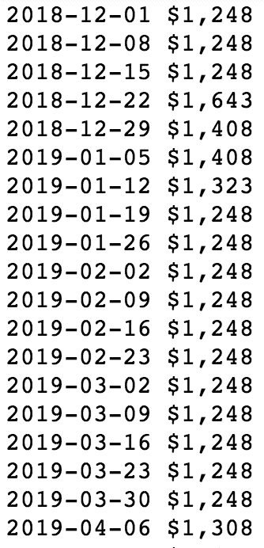
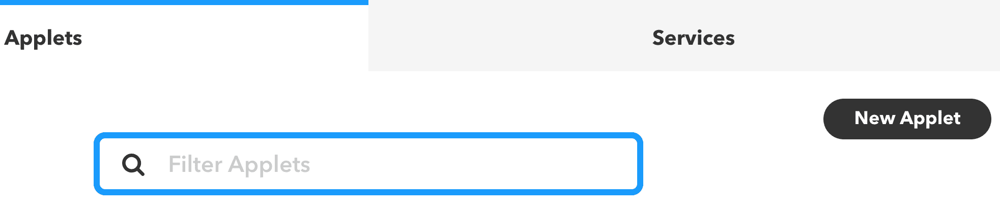

# 第三章：构建一个查找便宜机票的应用程序

让我们谈谈错误。它们是生活的一部分；每个人都会犯错误——包括航空公司。

2014 年，某天下午我正好在浏览我的 Twitter 动态，看到我关注的一个账户发推称某家美国主要航空公司出售的欧洲机票价格远低于预期。当时，从纽约到维也纳的最低票价大约为 800 美元，但某些日期的广告票价却在 350 美元到 450 美元之间。这听起来好像太好以至于不真实。但事实并非如此。我幸运地碰到了业内所称的*错误票价*。

在旅行黑客和常旅客的超级机密圈子里，大家都知道航空公司偶尔会—而且是意外地—发布不包括燃油附加费的票价。更令人惊讶的是，这并不是他们唯一犯的错误。你可能会认为，先进的算法会为每个航班更新票价，考虑到大量的因素。大多数情况下，你的想法是对的。但由于传统系统的限制以及处理多个航空公司和多个法域的复杂性，错误有时确实会发生。

以下是一些最近的错误票价列表：

+   2007 年，联合航空公司将从旧金山飞往新西兰的商务舱机票售卖为 1500 美元

+   2013 年，达美航空公司将从多个美国城市飞往夏威夷的经济舱票价定为 6.90 美元

+   2015 年，美国航空公司从华盛顿特区到中国的商务舱票价为 450 美元

现在你知道这些票价的存在，那你该怎么利用它们呢？当然是机器学习！由于这些票价通常只持续几个小时就会消失，我们将构建一个应用程序，持续监控票价变化，检查是否有异常价格，从而生成一个可以迅速采取行动的警报。

本章内容包括：

+   在网上获取机票定价

+   使用先进的网页抓取技术获取票价数据

+   解析 DOM 以提取价格

+   使用异常检测技术识别异常票价

+   使用 IFTTT 发送实时文本警报

# 获取机票定价数据

幸运的是，获取机票数据比获取房地产数据要容易一些。有许多提供这类数据的服务商，且有付费和免费的 API。一项挑战是，获取数据需要进行多个网页请求。在本书的前一版中，我们概述了如何从 Google 的**Flight Explorer**页面抓取数据。这是查看多个城市的数周票价数据的理想方式。不幸的是，该页面现在已被移除，Google 现在提供的是一个更为典型的搜索界面，用户需要输入出发城市、目的城市、起始日期和结束日期。一个幸运的特性是，仍然可以输入整个区域而不是具体的城市。我们将在抓取中使用这一点。下面的截图可以作为一个示例：


如您所见，我们输入了`New York`作为出发城市，并简单地将`Asia`作为目的地。这将返回所有亚洲（以及中东地区，出于某些原因）的主要城市的票价。这是一个好消息，因为我们希望在一个网页请求中捕获尽可能多的票价。

虽然界面仍然具有一些使得抓取数据更容易的功能，但我们需要使用一些比过去更高级的技术。接下来我们将讨论这些技术。

# 使用高级网页抓取技术获取票价数据

在前面的章节中，我们已经学习了如何使用`Requests`库来获取网页。如我之前所说，它是一个很棒的工具，但不幸的是，在这里我们无法使用它。我们想抓取的页面完全基于 AJAX。**异步 JavaScript** (**AJAX**) 是一种从服务器获取数据的方法，无需重新加载页面。这对我们意味着，我们需要使用浏览器来获取数据。虽然这听起来可能需要大量的开销，但有两个库，如果一起使用，可以使这个任务变得轻便。

这两个库分别是 Selenium 和 ChromeDriver。Selenium 是一个强大的网页浏览器自动化工具，而 ChromeDriver 是一个浏览器。为什么使用 ChromeDriver 而不是 Firefox 或 Chrome 本身呢？ChromeDriver 是一种被称为**无头浏览器**的工具。这意味着它没有用户界面。这使得它更加精简，十分适合我们要做的事情。

要安装 ChromeDriver，您可以从[`sites.google.com/a/chromium.org/chromedriver/downloads`](https://sites.google.com/a/chromium.org/chromedriver/downloads)下载二进制文件或源代码。至于 Selenium，它可以通过 pip 安装。

我们还需要一个名为`BeautifulSoup`的库，用于解析页面中的数据。如果您尚未安装它，应该立即使用`pip install`安装它。

完成这些之后，我们开始吧。我们将在 Jupyter Notebook 中开始，这对于探索性分析效果最好。稍后，当我们完成探索后，将转向文本编辑器编写我们要部署的代码。以下是操作步骤：

1.  首先，我们导入常用库，如下面的代码片段所示：

```py
import numpy as np 
import pandas as pd 
import matplotlib.pyplot as plt 
%matplotlib inline 
```

1.  接下来，请确保您已经安装了`BeautifulSoup`和`Selenium`，并下载了`ChromeDriver`，如前所述。我们现在将在新单元格中导入它们：

```py
from bs4 import BeautifulSoup 
from selenium import webdriver 

# replace this with the path of where you downloaded chromedriver 
chromedriver_path = "/Users/alexcombs/Downloads/chromedriver" 

browser = webdriver.Chrome(chromedriver_path) 
```

请注意，我已经引用了我机器上下载的`ChromeDriver`路径。请记住，您需要将该路径替换为您自己机器上的路径。

# 创建链接

现在，值得注意的是，我们已经拥有开始进行航班票价抓取所需的所有内容，只有一个例外：我们需要 URL。在这个练习中，我将专注于从纽约市（NYC）出发飞往欧洲的航班。由于我们不希望下载大量数据并冒着被封锁的风险，我们将仅提取从纽约出发的直飞航班数据，这些航班在周六起飞，次周六返回。当然，你可以根据自己的需求修改目标航班，但我们将以此作为示例项目。

下一步是填写 Google Flights 表单。确保选择一个未来的日期。一旦输入数据并点击搜索，从浏览器地址栏复制 URL 字符串，如以下截图所示：


我复制的 URL 是 2018 年 12 月 1 日起飞并于 2018 年 12 月 8 日返回的航班。可以在搜索字符串中看到这些日期。如果你选择不同的日期，复制的字符串中应该会反映这些变化。现在我们来编写代码：

1.  让我们输入该字符串并将其保存为变量 `sats`，如以下代码块所示：

```py
sats = 'https://www.google.com/flights/f=0#f=0&flt=/m/02_286.r/m/02j9z.2018-12-01*r/m/02j9z./m/02_286.2018-12-08;c:USD;e:1;s:0*1;sd:1;t:e' 
```

1.  接下来，我们将测试能否成功提取页面上看到的内容。我们将使用以下代码行来进行测试，这段代码使用了 `selenium`：

```py
browser.get(sats) 
```

1.  这一行代码就足够我们获取页面了。我们可以通过添加几行额外的代码来验证获取是否成功。

1.  首先，让我们检查页面的标题：

```py
browser.title 
```

结果输出如下所示：


看起来我们成功获取了正确的页面。现在让我们检查一下是否抓取了我们所需要的所有内容。我们可以通过截取页面的截图来检查。我们通过以下代码行来实现：

```py
browser.save_screenshot('/Users/alexcombs/Desktop/test_flights.png') 
```

同样，我保存截图的路径是基于我的机器的；你需要在自己的机器上引用一个路径。如以下输出所示，我们成功获取了页面的所有内容：


由于我们似乎已经获取了所需的页面数据，接下来我们将介绍如何从页面中提取个别数据点。为此，首先，我们需要了解 **文档对象模型** (**DOM**)。

# 解析 DOM 以提取定价数据

DOM 是组成网页的元素集合。它包括 HTML 标签，如 `body` 和 `div`，以及嵌入在这些标签中的类和 ID。

让我们来看一下 Google 页面上的 DOM：

1.  要查看它，请右键点击页面并选择“检查”。在 Firefox 或 Chrome 中应该是一样的。这将打开开发者工具标签，允许你查看页面源代码，如以下截图所示：


1.  打开页面后，选择左上角的元素选择器，点击一个元素以跳转到该元素在页面源代码中的位置：


1.  我们关注的元素是包含航班信息的框。这可以通过下面的截图看到：


如果仔细查看元素，你会注意到它是一个名为`div`的元素。这个`div`有一个名为`class`的属性。这个`class`是由一长串随机的数字和字母组成的，但你会注意到它包含了字符串`info-container`。我们可以利用这一信息来提取所有包含航班信息的`div`元素。我们稍后会进行操作，现在先讨论一下解析过程。

# 解析

为了开始解析，我们需要使用前面提到的`BeautifulSoup`库。我们已经导入了这个库，现在只需要将页面源代码传递给`BeautifulSoup`。我们可以通过以下代码来实现：

```py
soup = BeautifulSoup(browser.page_source, "html5lib") 
```

请注意，浏览器对象包含`page_source`属性。这是我们之前用`get`请求检索到的所有 HTML 内容。传递给`BeautifulSoup`的另一个参数是它将使用的解析库。在这里，我们将使用`html5lib`。

现在，一旦页面内容被传递给`BeautifulSoup`，我们就可以开始提取感兴趣的元素了。这时，`div`元素和`info-container`类就派上了用场。我们将提取这些元素。每个`div`元素代表一个城市。

我们先提取第一个`div`：

```py
cards = soup.select('div[class*=info-container]') cards[0] 
```

上述代码的输出如下所示：


在前面的代码中，我们在`soup`对象上使用了`select`方法。`select`方法允许我们使用 CSS 选择器来引用感兴趣的元素。在这里，我们指定了要选择包含字符串`info-container`的`class`属性的`div`元素。有关 BeautifulSoup 的 CSS 选择器和其他方法的详细文档，可以在[`www.crummy.com/software/BeautifulSoup/bs4/doc/#css-selectors`](https://www.crummy.com/software/BeautifulSoup/bs4/doc/#css-selectors)找到。

查看前面的输出时，请注意，在标记中深埋着目的地城市名称（`London`）和票价（`$440`）。由于我们只需要数据而非所有的 HTML 标记，我们需要编写代码来遍历每个`info-container`的`div`，并提取城市和票价：

```py
for card in cards: 
    print(card.select('h3')[0].text) 
    print(card.select('span[class*=price]')[0].text) 
    print('\n') 
```

上述代码的输出如下所示：


由于我们似乎已经成功地获取了每个城市的票价，现在让我们继续构建一个完整的抓取和解析程序，以处理大量的票价数据。

现在我们将尝试获取从纽约市到欧洲的最低价、直飞航班票价，时间跨度为 26 周。我使用的开始日期是 2018 年 12 月 1 日，但显然，如果你是在这个日期之后阅读本文，确保相应地调整你的日期。

我们首先需要做的是引入一些额外的导入语句。我们在以下代码中完成这一操作：

```py
from datetime import date, timedelta 
from time import sleep 
```

接下来，我们将构建剩余的抓取代码：

```py
start_sat = '2018-12-01' 
end_sat = '2018-12-08' 

start_sat_date = datetime.strptime(start_sat, '%Y-%m-%d') 
end_sat_date = datetime.strptime(end_sat, '%Y-%m-%d') 

fare_dict = {} 

for i in range(26):     
    sat_start = str(start_sat_date).split()[0] 
    sat_end = str(end_sat_date).split()[0] 

    fare_dict.update({sat_start: {}}) 

    sats = "https://www.google.com/flights/?f=0#f=0&flt=/m/02_286.r/m/02j9z." + \ 
    sat_start + "*r/m/02j9z./m/02_286." + \ 
    sat_end + ";c:USD;e:1;s:0*1;sd:1;t:e" 

    sleep(np.random.randint(3,7)) 
    browser.get(sats) 

    soup = BeautifulSoup(browser.page_source, "html5lib") 

    cards = soup.select('div[class*=info-container]') 

    for card in cards: 
        city = card.select('h3')[0].text 
        fare = card.select('span[class*=price]')[0].text 
        fare_dict[sat_start] = {**fare_dict[sat_start], **{city: fare}} 

    start_sat_date = start_sat_date + timedelta(days=7) 
    end_sat_date = end_sat_date + timedelta(days=7) 
```

这段代码量比较大，所以我们将逐行分析。前两行仅仅是创建我们将要使用的开始和结束日期。接下来的两行将这些日期字符串转换为`datetime`对象。这将在以后使用`timedelta`时加入一周。`for`循环前的最后一行仅仅是创建一个字典，用于存储我们解析后的数据。

下一行开始了一个`for`循环。在这个将运行 26 次的循环内，我们将`datetime`对象转换回字符串，以便将其传递到我们将用浏览器对象调用的 URL 中。同时，注意到每次迭代时，我们都会用开始日期填充票价字典。然后，我们使用创建的日期字符串来构建 URL。

接下来，我们使用`numpy.random`函数和 Python 的`sleep`函数插入一个随机的暂停。这只是为了避免我们看起来像是一个机器人，并防止对网站造成过大负担。

然后我们用浏览器对象获取页面，将其传递给`BeautifulSoup`进行解析，选择`info-container` divs，然后解析并更新我们的票价字典。最后，我们将开始和结束日期各加上一周，以便下一次迭代能够向前推进一周。

现在，让我们查看我们票价字典中的数据：

```py
fare_dict 
```

上面的代码生成了以下输出：


如你所见，我们有一个以日期为主键的字典，然后是包含城市和票价配对的子字典。

现在，让我们深入了解一个城市的数据。我们从`柏林`开始：

```py
city_key = 'Berlin' 
for key in fare_dict: 
    print(key, fare_dict[key][city_key]) 
```

上面的代码生成了以下输出：



我们立即注意到的一件事是，我们需要清理票价数据，以便进行处理。我们需要移除美元符号和逗号，并将其转换为整数。我们在以下代码中完成这一操作：

```py
city_dict = {} 
for k,v in fare_dict.items(): 
    city_dict.update({k:int(v[city_key].replace(',','').split('$')[1])}) 
```

上面的代码生成了以下输出：


请记住，上述代码的输出仅适用于柏林，因为我们现在只是在检查一个城市的数据。

现在，让我们绘制这些数据：

```py
prices = [int(x) for x in city_dict.values()] 
dates = city_dict.keys() 

fig,ax = plt.subplots(figsize=(10,6)) 
plt.scatter(dates, prices, color='black', s=50) 
ax.set_xticklabels(dates, rotation=-70); 
```

上面的代码生成了以下输出：


请注意，我们有 26 个连续的周的数据，在这种情况下，从纽约到柏林的直飞航班，周六出发，次周六返回。这些票价存在相当大的变化。仅凭眼观数据，看起来在期间的开始和结束处可能有两个高端的异常值。

现在，让我们来看另一个城市。为此，我们只需返回我们的代码并更改`city_key`变量。然后我们可以重新运行下面的单元格。我们将在以下代码中执行此操作：

```py
city_key = 'Milan' 
for key in fare_dict: 
    print(key, fare_dict[key][city_key]) 
```

这导致以下输出：


我们需要去掉美元符号和逗号，并将它们转换为整数。我们在以下代码中执行此操作：

```py
city_dict = {} 
for k,v in fare_dict.items(): 
    city_dict.update({k:int(v[city_key].replace(',','').split('$')[1])}) 

city_dict 
```

以下代码生成以下输出：


现在，让我们绘制这些数据：

```py
prices = [int(x) for x in city_dict.values()] 
dates = city_dict.keys() 

fig,ax = plt.subplots(figsize=(10,6)) 
plt.scatter(dates, prices, color='black', s=50) 
ax.set_xticklabels(dates, rotation=-70); 
```

以下代码生成以下输出：


在这里，我们可以看到更广泛的变化，票价从低于$600 到超过$1,200 不等。左侧的廉价票价正是我们想了解的类型。我们将要创建一个异常值检测系统，告诉我们这些便宜的票价。我们将继续讨论这个问题。

# 使用异常检测技术识别异常票价

有多种严格的异常值定义，但对于我们的目的，**异常值**是指远离数据集中其他观测值的极端值。有许多用于识别异常值的技术，包括**基于密度的空间聚类应用（DBSCAN）**、孤立森林和格鲁布斯测试，这些算法的例子。通常，数据类型决定了使用的算法类型。例如，某些算法在多变量数据上表现更好，而在单变量数据上表现不错。在这里，我们处理的是单变量时间序列数据，因此我们希望选择一个能很好处理这种数据的算法。

如果您对*时间序列*这个术语不熟悉，它简单地意味着以固定间隔记录的数据，比如股票的每日收盘价。

我们将用于我们的数据的算法称为**广义极端学生化偏差检验**（**Generalized ESD**）异常值检验。由于我们的数据是单变量且近似正态分布，这个算法非常适合我们的数据。

我们可以使用几种方法来确保我们的数据近似正态分布，但我们还可以使用正态概率图来直观检查我们的数据的正态性。现在，我们将为莫斯科城市数据使用来自 SciPy 库的一些功能执行此操作：

```py
from scipy import stats 
fix, ax = plt.subplots(figsize=(10,6)) 
stats.probplot(list(city_dict.values()), plot=plt) 
plt.show() 
```

以下代码生成以下输出：


在评估**正态概率**或**分位数-分位数**（**Q-Q**）**图**时，我们希望数据尽可能靠近直线，以揭示正态性。数据如果向一个方向偏离，或者呈现出明显的 S 形，则表明数据不符合正态分布。这里，我们的数据点较少，且已有的数据点大致平衡分布在对角线上。如果我们有更多数据，可能会更接近对角线。这个结果应该足够满足我们的需求。

接下来，我们将进入异常值检测代码部分。我们将使用另一个库——`PyAstronomy`。如果你没有这个库，可以通过 pip 安装。

让我们看看代码：

```py
from PyAstronomy import pyasl 

r = pyasl.generalizedESD(prices, 3, 0.025, fullOutput=True) 

print('Total Outliers:', r[0]) 

out_dates = {} 
for i in sorted(r[1]): 
    out_dates.update({list(dates)[i]: list(prices)[i]}) 

print('Outlier Dates', out_dates.keys(), '\n') 
print('     R         Lambda') 

for i in range(len(r[2])): 
    print('%2d  %8.5f  %8.5f' % ((i+1), r[2][i], r[3][i])) 

fig, ax = plt.subplots(figsize=(10,6)) 
plt.scatter(dates, prices, color='black', s=50) 
ax.set_xticklabels(dates, rotation=-70); 

for i in range(r[0]): 
    plt.plot(r[1][i], prices[r[1][i]], 'rp') 
```

让我们来讨论一下前面的代码做了什么。第一行只是我们的导入。接下来，我们实现了通用的 ESD 算法。参数是我们的票价，然后是最大异常值数量（在这里，我们选择了`3`），显著性水平（alpha，值为`0.025`），最后是一个布尔值，用于指定我们希望获得完整输出。关于显著性水平，值越低，算法的敏感性越低，产生的假阳性越少。

接下来的两行仅仅是打印出与`R`和`Lambda`值相关的数据。这些数据用于判断一个数据点是否为异常值。

最后，代码的其余部分仅用于生成散点图，并将异常值的票价标记为红色。

上面的代码生成了以下输出：


再次提醒，这些数据是针对莫斯科的。确保你已经更改了`city_key`变量，以便获取相关数据。注意，尽管数据中存在一些变化，但并没有异常值。

现在，让我们也为米兰运行这个代码。我们将返回上面，修改`city_key`变量，然后运行下面的单元格以更新所有内容，正如下图所示：


请注意，这一次我们发现有三个异常值，这些票价低于$600，而平均票价似乎超过了$900，所以这对我们来说是个好结果。

让我们试试另一个城市。这一次，我们将通过更新`city_key`变量来查看雅典的数据，并运行随后的单元格：


请注意，这一次我们有三个异常值，但它们是极高的票价。由于我们只对便宜票价的异常值感兴趣，我们可以设置一个机制，仅当异常票价低于平均票价时才会发出警报。

现在，我们将创建一些代码来处理这一元素：

```py
city_mean = np.mean(list(city_dict.values())) 

for k,v in out_dates.items(): 
    if v < city_mean: 
        print('Alert for', city_key + '!') 
        print('Fare: $' + str(v), 'on', k) 
        print('\n') 
```

当我们为雅典运行代码时，它不会生成任何输出。而为米兰运行时，它会生成以下输出：


所以，现在，我们已经创建了一个系统来抓取数据，解析它，并识别异常值。接下来我们将创建一个完整的应用程序，在实时中警告我们。

请记住，我们刚刚对我们的异常值检测模型进行了初步分析。在实际应用中，可能需要进行更加彻底的一系列测试，以确认我们是否为模型选择了可行的参数。

# 使用 IFTTT 发送实时提醒

为了有机会获得这些便宜的票价，我们需要几乎实时地知道它们何时发生。为此，我们将使用一个名为 **If This Then That**（**IFTTT**）的服务。这个免费的服务允许你通过一系列的触发器和动作将大量服务连接起来。想将 Instagram 上的所有照片保存到你的 iPhone 照片库吗？想每次某个人发推文时收到邮件通知吗？想将你的 Facebook 更新发布到 Twitter 吗？IFTTT 可以做到这一切。请按照以下步骤操作：

1.  第一步是访问 [`www.ifttt.com`](https://ifttt.com/) 注册账户。

1.  一旦完成，你需要注册 Maker 渠道，[`ifttt.com/maker_webhooks`](https://ifttt.com/maker_webhooks)，以及 SMS 渠道，[`ifttt.com/sms`](https://ifttt.com/sms)。

1.  Maker 允许你通过发送和接收 HTTP 请求来创建 IFTTT 配方。

1.  一旦你创建了账户并激活了 Maker 和 SMS 渠道，点击主页上的我的 Applets，然后点击新建 Applet：



1.  然后，点击此项，如下图所示：


1.  然后，搜索 `webhooks` 并点击接收一个 Web 请求：


1.  然后，我们将创建一个名为 `cheap_fares` 的事件：


1.  填写事件名称后，点击创建触发器。接下来，我们将设置 +that：


1.  点击那，然后搜索 `SMS` 并选择它：


然后，选择发送短信给我：


1.  之后，我们将自定义我们的消息：


完成后，点击完成以结束设置：


要测试设置，访问 [`www.ifttt.com/maker_webhooks`](https://ifttt.com/maker_webhooks) 并点击设置。你应该能看到包含带有秘密密钥的 URL 的账户信息。复制并粘贴该 URL 到浏览器中。它应该包含一个表单，包含你的秘密密钥和填写城市和价格的字段。

填写 cheap_fares 作为事件，并将城市和票价分别放入 value1 和 value2：


最后，点击测试，它应该在几秒钟内收到一条短信。

现在我们所有的部分都准备好了，是时候将它们整合成一个监控票价 24/7 的单一脚本了。

# 将所有内容整合在一起

到目前为止，我们一直在 Jupyter Notebook 中工作，但现在，为了部署我们的应用程序，我们将转到文本编辑器中工作。Notebook 非常适合探索性分析和可视化，但运行后台任务最好是在简单的`.py`文件中完成。所以，开始吧。

我们将从导入开始。如果你还没有安装这些库，可能需要通过`pip install`安装一些：

```py
import sys 
import sys 
import numpy as np 
from bs4 import BeautifulSoup 
from selenium import webdriver 
import requests 
import scipy 
from PyAstronomy import pyasl 

from datetime import date, timedelta, datetime 
import time 
from time import sleep 
import schedule 
```

接下来，我们将创建一个函数，拉取数据并运行我们的算法：

```py
def check_flights(): 
   # replace this with the path of where you downloaded chromedriver 
   chromedriver_path = "/Users/alexcombs/Downloads/chromedriver" 

   browser = webdriver.Chrome(chromedriver_path) 

   start_sat = sys.argv[2] 
   end_sat = sys.argv[3] 

   start_sat_date = datetime.strptime(start_sat, '%Y-%m-%d') 
   end_sat_date = datetime.strptime(end_sat, '%Y-%m-%d') 

   fare_dict = {} 

   for i in range(26):     
       sat_start = str(start_sat_date).split()[0] 
       sat_end = str(end_sat_date).split()[0] 

       fare_dict.update({sat_start: {}}) 

       sats = "https://www.google.com/flights/?f=0#f=0&flt=/m/02_286.r/m/02j9z." + \ 
       sat_start + "*r/m/02j9z./m/02_286." + \ 
       sat_end + ";c:USD;e:1;s:0*1;sd:1;t:e" 

       sleep(np.random.randint(10,15)) 

       browser.get(sats) 
       soup = BeautifulSoup(browser.page_source, "html5lib") 

       cards = soup.select('div[class*=info-container]') 

       for card in cards: 
           city = card.select('h3')[0].text 
           fare = card.select('span[class*=price]')[0].text 
           fare_dict[sat_start] = {**fare_dict[sat_start], **{city: fare}} 

       start_sat_date = start_sat_date + timedelta(days=7) 
       end_sat_date = end_sat_date + timedelta(days=7) 

   city_key = sys.argv[1] 

   city_dict = {} 
   for k,v in fare_dict.items(): 
       city_dict.update({k:int(v[city_key].replace(',','').split('$')[1])}) 

   prices = [int(x) for x in city_dict.values()] 
   dates = city_dict.keys() 

   r = pyasl.generalizedESD(prices, 3, 0.025, fullOutput=True) 

   print('Total Outliers:', r[0]) 

   out_dates = {} 
   for i in sorted(r[1]): 
       out_dates.update({list(dates)[i]: list(prices)[i]}) 

   city_mean = np.mean(list(city_dict.values())) 

   for k,v in out_dates.items(): 
       if v < city_mean: 
          requests.post('https://maker.ifttt.com/trigger/cheap_fares/with/key/bNHFwiZx0wMS7EnD425n3T', \ 
             data={ "value1" : str(city_key), "value2" : str(v), "value3" : "" }) 
          print('Alert for', city_key + '!') 
          print('Fare: $' + str(v), 'on', k) 
          print('\n') 
       else: 
          print(str(v) + ' is greater than ' + str(city_mean)) 

```

最后，我们将加入一个调度器。它将每 60 分钟运行一次我们的代码：

```py
# set up the scheduler to run our code every 60 min 
schedule.every(60).minutes.do(check_flights) 

while 1: 
    schedule.run_pending() 
    time.sleep(1) 
```

这应该就够了。现在我们可以将其保存为`fare_alerter.py`，并通过命令行运行它。你需要传入三个参数。第一个是城市，第二个是开始日期，最后一个是结束日期。示例如下：

```py
python fare_alerter.py 'Milan' '2018-12-01' '2018-12-08'
```

脚本将继续运行，每 60 分钟检查一次票价。如果发生错误票价，我们将是最先得知的之一！

# 总结

本章我们涵盖了很多内容。我们学会了如何在网上找到最佳的机票数据，如何通过 DOM 操作找到我们要解析的元素，如何识别异常值，最后，如何通过 IFTTT 通过网页请求发送文本提醒。虽然我们这里讲的是机票，但几乎所有的内容都可以应用于任何你希望收到提醒的定价类型。

如果你决定使用它来查询机票价格，希望它能为你带来愉快的旅行！
