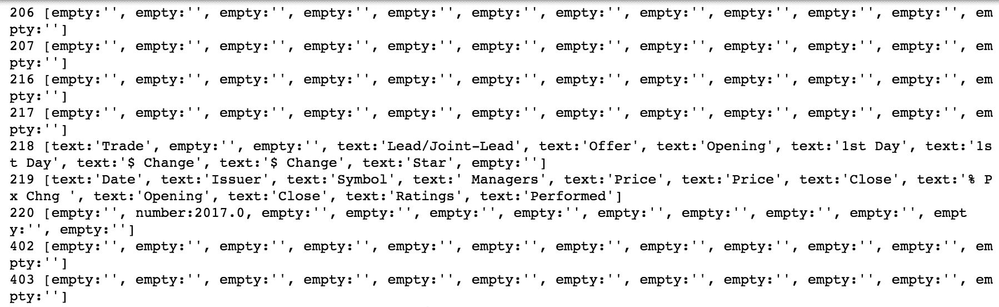
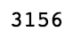
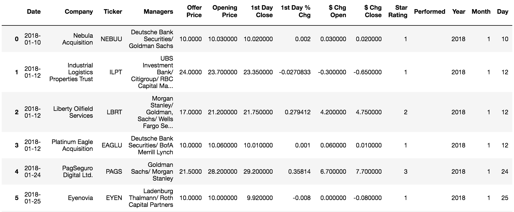
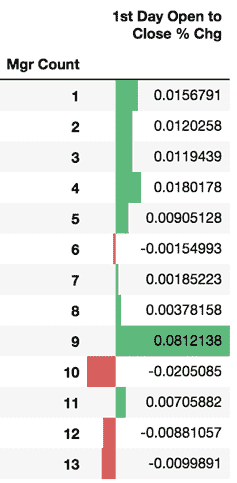
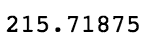

# 第四章：使用逻辑回归预测 IPO 市场

在 1990 年代末，参与正确的**首次公开募股**（**IPO**）就像中了大奖一样。某些科技公司在第一天的回报是其初始发行价格的数倍，如果你足够幸运地获得配售，你就能大赚一笔。以下是这一时期几个首日表现最突出的例子：

+   VA Linux 上涨 697%，1999 年 12 月 9 日

+   Globe.com 上涨 606%，1998 年 11 月 13 日

+   Foundry Networks 上涨 525%，1999 年 9 月 28 日

虽然互联网泡沫的时代已经远去，但 IPO 仍然可能在首日产生巨大的回报。以下是过去一年内一些在首个交易日上涨显著的例子：

+   Bloom Energy 上涨 67%

+   拼多多上涨 32%

+   Tenable 上涨 32%

正如你所看到的，这仍然是一个值得关注的市场。在本章中，我们将更深入地了解 IPO 市场。我们将看看如何利用机器学习帮助我们决定哪些 IPO 值得关注，哪些我们可能要放弃。

本章内容概览：

+   IPO 市场

+   数据清洗与特征工程

+   使用逻辑回归进行二元分类

+   模型评估

+   特征重要性

# IPO 市场

在我们开始建模之前，先来讨论一下什么是 IPO（首次公开募股），以及研究告诉我们关于这个市场的信息。之后，我们将讨论可以应用的多种策略。

# 什么是 IPO？

IPO（首次公开募股）是一个私人公司变成上市公司的过程。公开募股为公司筹集资本，并为公众提供通过购买公司股票来投资该公司的机会。

尽管这一过程有所不同，但在典型的发行中，公司会寻求一个或多个投资银行的帮助来承销其发行。这意味着银行向公司保证，他们将在 IPO 当天按发行价购买所有的股票。当然，承销商并不打算自己持有所有的股票。在发行公司的帮助下，他们会进行所谓的**路演**，以引起机构客户的兴趣。这些客户会对股票进行**认购**，表示他们有兴趣在 IPO 当天购买股票。这是一份非约束性合同，因为发行价格直到 IPO 当天才会最终确定。然后，承销商会根据表达出的兴趣来设定发行价格。

从我们的角度来看，值得注意的是，研究表明 IPO 常常出现系统性的定价过低现象。有许多理论解释为什么会发生这种情况，以及为什么这种定价过低的程度随时间变化，但研究表明，每年都会有数十亿美元未被充分利用。

在 IPO 中，**未被利用的资金**是指股票的发行价格与首日收盘价之间的差额。

还有一点需要在继续之前说明，那就是发行价与开盘价的区别。虽然你偶尔可以通过你的经纪人以发行价参与 IPO，但在几乎所有情况下，作为普通公众，你必须以（通常较高的）开盘价购买 IPO。我们将在这个假设下构建我们的模型。

# 最近 IPO 市场表现

现在我们来看一下 IPO 市场的表现。我们将从`IPOScoop.com`获取数据，这是一个提供即将上市 IPO 评级的服务。请访问[`www.iposcoop.com/scoop-track-record-from-2000-to-present/`](https://www.iposcoop.com/scoop-track-record-from-2000-to-present/)，点击页面底部的按钮下载电子表格。我们将把这个文件加载到 pandas 中，并使用 Jupyter 笔记本进行一些可视化分析。

不幸的是，数据的格式使得我们无法通过常规的`.read_csv()`方法直接加载到 pandas 中。我们需要使用一个库，允许我们将 Excel 文件读取为 Python 列表，然后执行一些预处理，过滤掉那些不相关的行，主要是表头行以及一些额外的信息。请按照以下步骤设置笔记本：

1.  现在让我们在笔记本中开始，设置我们需要的库：

```py
import numpy as np 
import pandas as pd 
import xlrd 
import matplotlib.pyplot as plt 
%matplotlib inline 
```

`xlrd`库是我们将用来处理之前下载的 Excel 电子表格的库。如果你还没有安装它，可以通过命令行使用`pip install xlrd`将其添加到你的 Python 环境中。

1.  下一步是加载工作簿，如下代码块所示：

```py
wb = xlrd.open_workbook('SCOOP-Rating-Performance.xls') 
```

1.  现在我们已经加载了整个 Excel 工作簿，让我们定位到我们要处理的工作表，在这个例子中是第一个工作表：

```py
ws = wb.sheet_by_index(0)  
```

1.  现在让我们检查一下是否获取了预期的数据：

```py
ws.nrows 
```

1.  上面的代码行会生成以下输出：


1.  与电子表格对比后，这个数字看起来差不多，所以我们现在开始逐行地合并数据：

```py
ipo_list = [] 
for i in range(36,ws.nrows): 
    if isinstance(ws.row(i)[0].value, float): 
        ipo_list.append([x.value for x in ws.row(i)]) 
    else: 
        print(i, ws.row(i)) 
```

上面的代码会生成以下输出：



让我们来解释一下那段代码发生了什么。首先，我们创建了一个空列表，然后将每一行添加到列表中。接着，我们遍历电子表格中的每一行，检查第一列（最左边的单元格）是否为浮动值。如果是的话，我们将该行所有单元格的值添加到我们的列表中。这是因为`Date`列在读取时会作为浮动值出现，而我们只关心那些以日期为开头的行。请注意，我们还从第 36 行开始循环，以跳过表格中的摘要数据。

1.  现在我们再检查一下我们期望的行数是否在列表中：

```py
len(ipo_list) 
```

上面的代码会生成以下输出：



在去除标题和其他不感兴趣的行后，这样看起来差不多正确。

# 处理数据框

现在让我们开始准备数据框（DataFrame）以供使用：

```py
df = pd.DataFrame(ipo_list) 

df.head() 
```

上述代码生成了以下输出：


数据看起来不错，现在让我们添加我们的列：

```py
df.columns = ['Date', 'Company', 'Ticker', 'Managers', \ 
              'Offer Price', 'Opening Price', '1st Day Close',\ 
              '1st Day % Chg', '$ Chg Open', '$ Chg Close',\ 
              'Star Rating', 'Performed'] 

df.head() 
```

上述代码生成了以下输出：


现在让我们把那个`Date`列从浮动数值转换为正确的日期格式。`xlrd`库有一些功能可以帮助我们做到这一点。我们将在一个函数中使用它，确保日期格式正确：

```py
def to_date(x): 
    return xlrd.xldate.xldate_as_datetime(x, wb.datemode) 
df['Date'] = df['Date'].apply(to_date) 
df 
```

上述代码生成了以下输出：


现在我们有了可以使用的日期数据，让我们添加一些额外的日期相关列，以帮助我们更好地处理数据：

```py
df['Year'], df['Month'], df['Day'], df['Day of Week'] = \ 
df['Date'].dt.year, df['Date'].dt.month, df['Date'].dt.day, df['Date'].dt.weekday 
df 
```

上述代码生成了以下输出：



现在我们完成了这些步骤，让我们将数据框中的数据与原始电子表格中的数据进行对比：

```py
by_year_cnt = df.groupby('Year')[['Ticker']].count() 

by_year_cnt 
```

上述代码生成了以下输出：


将此与电子表格中的相同数值进行比较，结果显示我们有几乎相同的数值，所以可以继续进行。

在这里，我们将采取一个额外的步骤，排除有时被称为*便士股票*，或者是特别低价的股票。然后，我们将检查数据类型，以确保它们看起来合适：

```py
df.drop(df[df['Offer Price'] < 5].index, inplace=True) 

df.reset_index(drop=True, inplace=True) 

df.dtypes 
```

上述代码生成了以下输出：


这看起来与我们的预期相符，除了`1st Day % Chg`这一列。我们将通过将数据类型更改为浮动数值来纠正这一点：

```py
df['1st Day % Chg'] = df['1st Day % Chg'].astype(float) 
df.dtypes 
```

上述代码生成了以下输出：


# 数据分析

数据类型现在看起来都没问题了，因此我们将通过绘制自 2000 年以来 IPO 的数量来开始我们的探索性分析：

```py
fig, ax = plt.subplots(figsize=(16,8)) 
by_year_cnt.plot(kind='bar', ax=ax, color='crimson') 
ax.legend(['Ticker Count']) 
ax.set_title('IPO Count by Year', fontdict={'size': 18}, y=1.02); 
```

上述代码生成了以下输出：


从图表中我们可以看到，大多数年份的 IPO 数量超过 100 个，但在 2001 年及 2008 年之后，数量明显减少，这很可能是由于 9/11 事件和金融危机的后果。

# 总结股票表现

我们将通过执行以下代码来快速总结过去 18 年股票的表现：

```py
summary_by_year = df.groupby('Year')['1st Day % Chg'].describe() 

summary_by_year 
```

上述代码生成了以下输出：


从表格中，我们可以看到 2000 年 IPO 市场的异常平均回报率。超过 35%的回报率是列表中任何其他年份的两倍多。另一个显著的事实是，每一年的首次交易表现平均回报率都是正数。

让我们绘制首次交易表现，以便更好地了解它：

```py
fig, ax = plt.subplots(figsize=(16,8)) 
summary_by_year['mean'].plot(kind='bar', ax=ax) 
ax.set_title('Mean First Day Percentage Change by Year', fontdict={'size': 18}, y=1.02); 
```

上述代码生成了以下输出：


关于这些数字的重要一点是，它们不是普通投资者在第一天能够期望获得的回报。只有那些参与了发行的投资者才能期望看到这些数字。

普通投资者在第一天能够期望获得的回报将是开盘价与收盘价之间的差额。这完全不同，也远没有那么有利可图。现在让我们添加一列数据，反映这一值，并看看结果：

```py
df['1st Day Open to Close % Chg'] = ((df['1st Day Close'] - df['Opening Price'])/df['Opening Price']) 

df['1st Day Open to Close % Chg'].describe() 
```

上述代码生成了以下输出：


这显示出的回报明显不如预期那么令人激动。现在让我们像之前一样绘制这些数据：

```py
fig, ax = plt.subplots(figsize=(16,8)) 
df.groupby('Year')['1st Day Open to Close % Chg'].mean().plot(kind='bar', ax=ax) 
ax.set_title('Mean First Day Open to Close % Change by Year', fontdict={'size': 18}, y=1.02); 
```

上述代码生成了以下输出：


比较前面的图表和早期的图表，可以明显看到，第一天的年平均回报显示在其数量级范围内，而在许多情况下要低得多。

# 基准 IPO 策略

假设我们以每个 IPO 的精确开盘价购买一股，并以这些数字中精确的收盘价卖出；那么我们的回报在赚取的美元上会是什么样子呢？

为了回答这个问题，让我们看看实际的开盘到收盘的美元价格变化：

```py
df['1st Day Open to Close $ Chg'] = (df['1st Day Close'] - df['Opening Price']) 

df[df['Year']==2018].sum() 
```

上述代码生成了以下输出：


从中我们可以看到，第一天从开盘到收盘的总金额刚好超过 28 美元。这个数字是基于 2018 年迄今为止的 173 多只 IPO：

```py
df[df['Year']==2018]['1st Day Open to Close $ Chg'].describe() 
```

上述代码生成了以下输出：


这反映了每个首次公开募股（IPO）第一天的平均收益略高于 16 美分。请记住，这是在忽略交易成本和滑点的理想条件下计算的。

滑点是你试图进场或出场的目标股票价格与实际成交价格之间的差额。

现在让我们看看这些 IPO 的回报分布是什么样的。这可能有助于我们理解如何提高相对于简单买入每个 IPO 的基准朴素贝叶斯策略的回报：

```py
fig, ax = plt.subplots(figsize=(16,8)) 
df[df['Year']==2018]['1st Day Open to Close % Chg'].plot(kind='hist', bins=25, ax=ax) 
```

上述代码生成了以下输出：


我们看到回报围绕零分布，但右侧有一个长尾，那里有一些异常的回报。如果我们能够识别出这些异常 IPO 的共同特点并加以利用，那将是非常有利可图的。

让我们看看是否可以利用机器学习来帮助改善来自朴素贝叶斯方法的结果。一个合理的策略似乎是针对右侧的长尾，所以我们将在下一节专注于特征工程。

# 数据清洗和特征工程

什么因素可能影响一只股票在交易开始时的表现？也许整体市场的表现或者承销商的声望会有影响？也许交易的星期几或月份很重要？在模型中考虑并加入这些因素的过程被称为**特征工程**，对其建模几乎和使用的数据一样重要。如果你的特征不具备信息量，那么你的模型就不会有价值。

让我们通过添加一些我们认为可能影响 IPO 表现的特征来开始这个过程。

# 添加特征以影响首次公开募股（IPO）的表现

可能有用的需求度量之一是**开盘缺口**。这是发行价和开盘价之间的差异。让我们把它添加到我们的 DataFrame 中：

```py
df['Opening Gap % Chg'] = (df['Opening Price'] - df['Offer Price'])/df['Offer Price'] 
```

接下来，让我们统计一下承销商的数量。也许更多的银行参与能够更好地推广此次发行？这在以下代码块中得到了演示：

```py
def get_mgr_count(x): 
    return len(x.split('/')) 

df['Mgr Count'] = df['Managers'].apply(get_mgr_count) 
```

让我们快速通过可视化来查看这个假设是否可能成立：

```py
df.groupby('Mgr Count')['1st Day Open to Close % Chg'].mean().to_frame().style.bar(align='mid', color=['#d65f5f', '#5fba7d']) 
```

上述代码生成了以下输出：



从这个图表上并不明显能看出什么关系，但显然九位银行家是最佳的选择！

接下来，让我们继续提取列表中的第一个承销商。这将是主承销商，也许该银行的声望对首日收益至关重要：

```py
df['Lead Mgr'] = df['Managers'].apply(lambda x: x.split('/')[0])
```

接下来，让我们快速查看一下我们新创建的列中的数据：

```py
df['Lead Mgr'].unique() 
```

上述代码生成了以下输出：


即使是粗略检查前面的内容，我们也可以发现数据中存在一些实际问题。很多名字存在不同的拼写和标点形式。在这一点上，我们可以停止并尝试清理数据，如果我们计划依赖我们的模型进行一些重要操作，这将是正确的做法，但因为这只是一个玩具项目，我们将继续进行，希望影响尽可能小。

# 使用逻辑回归进行二元分类

我们不打算预测总的首日回报率，而是尝试预测是否应该购买这只 IPO 进行交易。此时我们要指出，这不是投资建议，仅用于演示目的。请不要随便拿这个模型去进行 IPO 日内交易，这样做的结果会很糟糕。

现在，要预测二元结果（即`1`或`0`，也就是“是”或“否”），我们将从一个叫做**逻辑回归**的模型开始。逻辑回归实际上是一个二元分类模型，而不是回归模型。但它确实使用了典型的线性回归形式，只不过是在逻辑函数中进行。

一个典型的单变量回归模型具有以下形式：


在这里，*t*是单一解释变量*x*的线性函数。当然，这可以扩展为多个变量的线性组合。对于一个二元结果变量，这种形式的问题是*t*自然不会落在 1 和 0 之间。

下列方程中的逻辑函数具有一些非常有利的数学性质，包括它能够接受任何数值作为输入（此处为*t*）并返回一个介于 0 和 1 之间的结果：


图表如下所示：


通过将*t*替换为我们的回归函数，现在我们有了一个能够提供每个预测变量的重要性（beta 系数）并给出二元预测结果的模型，表示*成功*的概率，或者是*正向结果*：


在我们继续对数据建模之前，需要将数据转换为适合 scikit-learn 格式的形式。

我们将通过导入一个可以帮助我们完成此任务的库开始；它叫做`patsy`，如果需要，可以通过 pip 安装：

```py
from patsy import dmatrix 
```

# 创建我们模型的目标

现在，我们将为我们的模型创建目标。这是告诉我们模型每个 IPO 是否应该被投资的列。我们将假设任何在第一天回报率达到 2.5%或更高的 IPO 都应该投资。显然，这是一个任意的数字，但它似乎是一个合理的值，足以让我们关注这个投资：

```py
y = df['1st Day Open to Close % Chg'].apply(lambda x: 1 if x > .025 else 0) 
```

现在我们已经设置了目标列，我们需要设置预测变量。我们将再次使用`patsy`来实现：

```py
X = dmatrix("Q('Opening Gap % Chg') + C(Q('Month'), Treatment) + C(Q('Day of Week'), Treatment)\ 
+ Q('Mgr Count') + Q('Lead Mgr') + Q('Offer Price') + C(Q('Star Rating'), Treatment)", df, return_type="dataframe") 
```

让我们讨论一下那行代码的含义。`X`是我们的设计矩阵，或者说是包含我们预测变量的矩阵。我们已经包含了之前讨论过的可能会对性能产生影响的因素：开盘差距大小、IPO 的月份和日期、发行价格、主承销商、承销商数量，以及最后，`IPOScoop.com`在 IPO 上市之前提供的星级评分。

为了说明代码行中的 Q 和 C 的含义，Q 仅用于为包含空格的列名提供引号，而 C 用于指示引用的列应作为分类特征并进行虚拟编码。

# 虚拟编码

虚拟编码是一种方法，如果我们有一列表示学生最喜欢的课程作为预测变量，我们会将每个课程转化为自己的列，并在该列中放置一个`1`，如果它是学生最喜欢的课程，如下图所示：


来源: http://www.statisticssolutions.com/dummy-coding-the-how-and-why/

一旦完成这一操作，接下来的步骤就是实际删除其中一列。被删除的列将成为**基准情况**。然后，所有其他情况将与该基准情况进行比较。在我们使用月份作为预测变量的 IPO 示例中，我们将删除一月作为例子，然后所有其他月份将与一月的表现进行比较。星期几或任何其他类别的预测变量也是如此。删除列的目的是防止多重共线性，因为多重共线性会对模型的解释能力产生负面影响。

让我们通过在 Jupyter 单元格中运行以下代码来看看这个代码的实际效果：

```py
X 
```

上述代码生成以下输出：


现在我们已经有了`X`和`*y*`，我们准备好拟合模型了。我们将使用一个非常简单的训练/测试划分，并仅在除了最后 200 只 IPO 的所有数据上训练我们的模型：

```py
from sklearn.linear_model import LogisticRegression 

X_train = X[:-200] 
y_train = y[:-200] 

X_test = X[-200:] 
y_test = y[-200:] 

clf = LogisticRegression() 
clf.fit(X_train, y_train) 
```

至此，我们得到了我们的模型。让我们来评估这个非常简单的模型的表现。

# 评估模型表现

我们将首先对我们的测试数据进行预测，然后检查我们的预测是否正确：

```py
y_hat = clf.predict(X_test) 
y_true = y_test 

pdf = pd.DataFrame({'y_true': y_true, 'y_hat': y_hat}) 

pdf['correct'] = pdf.apply(lambda x: 1 if x['y_true'] == x['y_hat'] else 0, axis=1) 

pdf 
```

上述代码生成以下输出：


现在，让我们看看我们应该投资的 200 只 IPO 中的百分比——记住，这意味着它们从开盘到收盘上涨了超过 2.5%：

```py
pdf['y_true'].value_counts(normalize=True) 
```

上述代码生成以下输出：


因此，超过一半的 IPO 从开盘到收盘上涨了超过 2.5%。让我们看看我们的模型预测的准确性如何：

```py
pdf['correct'].value_counts(normalize=True) 
```

上述代码生成以下输出：


看起来我们的模型的准确性差不多像抛硬币一样。这似乎不太有前景。但是在投资中，重要的不是准确性，而是预期收益。如果我们有一些小的亏损，但有几个巨大的胜利，总体上，模型仍然可能非常盈利。让我们看看这里是否也是这样。我们将把我们的结果数据与首日变化数据结合起来，以便深入探讨：

```py
results = pd.merge(df[['1st Day Open to Close $ Chg']], pdf, left_index=True, right_index=True) 

results 
```

上述代码生成以下输出：


首先，让我们看看如果我们投资了每一只 200 只 IPO 中的一只股票，我们的结果会是什么样的：

```py
results['1st Day Open to Close $ Chg'].sum() 
```

上述代码生成以下输出：



从这点来看，在理想的无成本情境下，我们将获得超过 215 美元的收益。现在，让我们来看看与这些 IPO 相关的其他一些统计数据：

```py
results['1st Day Open to Close $ Chg'].describe() 
```

上述代码生成以下输出：


根据上述内容，我们看到平均收益略超过 1 美元，而最大亏损是平均收益的 15 倍。我们的模型与这些数据相比如何？首先，我们看看模型建议我们进行的交易以及相应的收益：

```py
# ipo buys 
results[results['y_hat']==1]['1st Day Open to Close $ Chg'].sum() 
```

上面的代码生成了以下输出：


让我们也看看其他统计数据：

```py
# ipo buys 
results[results['y_hat']==1]['1st Day Open to Close $ Chg'].describe() 
```

上面的代码生成了以下输出：


在这里，我们看到我们的模型建议只投资 34 个 IPO，平均收益上升到 1.50 美元，最大损失减少到 10 美元以下，我们仍然能够捕捉到表现最好的 IPO。这不是特别出色，但我们可能发现了一些值得关注的东西。我们需要进一步探索，才能真正知道是否有值得进一步扩展的内容。

现在，让我们继续检查那些似乎影响我们模型表现的因素。

# 从我们的模型中生成特征的重要性

逻辑回归的一个优点是，它提供了预测系数，告诉我们预测变量或特征的相对重要性。对于分类特征，特征系数上的正号告诉我们，当该特征存在时，它增加了正面结果的概率，相对于基准。对于连续特征，正号告诉我们特征值的增加对应于正面结果概率的增加。系数的大小告诉我们概率增加的幅度。

让我们从我们的模型中生成特征的重要性，然后我们可以检查它的影响：

```py
fv = pd.DataFrame(X_train.columns, clf.coef_.T).reset_index() 
fv.columns = ['Coef', 'Feature'] 
fv.sort_values('Coef', ascending=0).reset_index(drop=True) 
```

上面的代码生成了以下输出：


在上面的截图中，我们看到了那些具有最大系数的特征。让我们看看星期几及其影响：

```py
fv[fv['Feature'].str.contains('Day')] 
```

上面的代码生成了以下输出：


在这里，星期一是每周的第一天，并且被编码为`T.0`，即基准情况。所有其他星期几都会与星期一进行比较。从上面的截图中，我们看到星期四似乎是最好的交易日。星期六似乎是进行首次公开募股（IPO）的糟糕日子，很可能是因为那天市场关闭。（很可能，那些日期只是记录错误。）

进一步观察具有最高系数的特征时，我们现在可以理解，对于每个特征提取有预测价值的有用信息是困难的，因为其中许多特征涉及已经不存在的事物。例如，虽然德意志银行仍然存在，但它不再以德意志银行亚历克斯·布朗的名义进行承销，所以它实际上是在传递历史信息，而不是对未来有用的信息。

另一个问题是，特征并没有反映它们产生影响的频率。一个只在 2000 年运营并且拥有 3 个非常成功 IPO 的银行，其出现会有一个非常大的正系数，但在我们的建模工作中是没有意义的。

# 随机森林分类器方法

另一种建模方法是通过随机森林分类器得出的特征重要性，它告诉我们哪些特征对模型有影响。这种方法更准确地反映了某个特征的真实影响。

让我们将数据输入这种类型的模型并检查结果：

```py
from sklearn.ensemble import RandomForestClassifier 
clf_rf = RandomForestClassifier(n_estimators=1000) 
clf_rf.fit(X_train, y_train) 

f_importances = clf_rf.feature_importances_ 

f_names = X_train.columns 
f_std = np.std([tree.feature_importances_ for tree in clf_rf.estimators_], axis=0) 

zz = zip(f_importances, f_names, f_std) 
zzs = sorted(zz, key=lambda x: x[0], reverse=True) 

n_features = 10 
imps = [x[0] for x in zzs[:n_features]] 
labels = [x[1] for x in zzs[:n_features]] 
errs = [x[2] for x in zzs[:n_features]] 

fig, ax = plt.subplots(figsize=(16, 8)) 
ax.bar(range(n_features), imps, color="r", yerr=errs) 
plt.xticks(range(n_features), labels) 
plt.setp( ax.xaxis.get_majorticklabels(), rotation=-70, ha="left" ); 
```

上述代码生成了以下输出：


在前面的代码中，我们运行了一个随机森林分类器，提取并排序了特征的重要性，然后将这些值与它们的误差条一起绘制了图表。

从这些数据中，我们可以看出，模型中影响最大的是开盘差距、报价和参与交易的经理人数。这些特征似乎都有预测价值，因为它们表明该交易有强烈的需求。

# 总结

本章我们涵盖了很多内容，但在构建这种类型的模型方面，我们仅仅触及了表面。希望你能更好地理解建模过程，从数据清理、特征工程到测试。并且希望你能利用这些信息自己扩展模型并加以改进。

在下一章，我们将转向一个完全不同的领域，从数字数据转向基于文本的数据。
