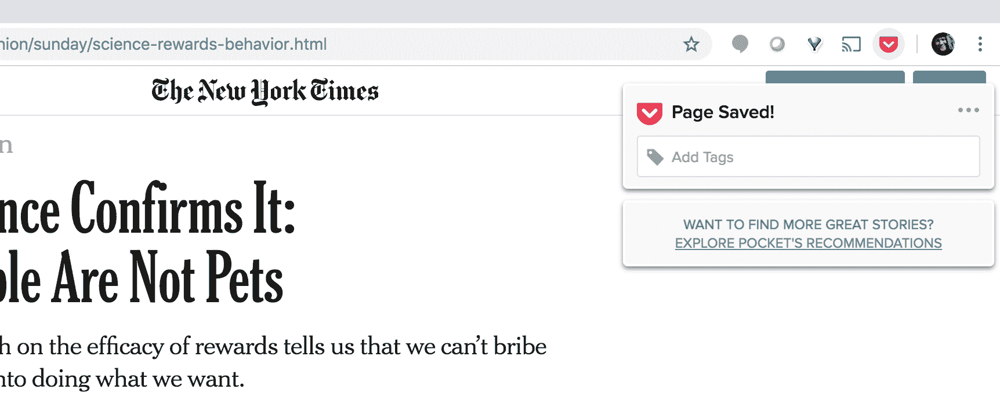
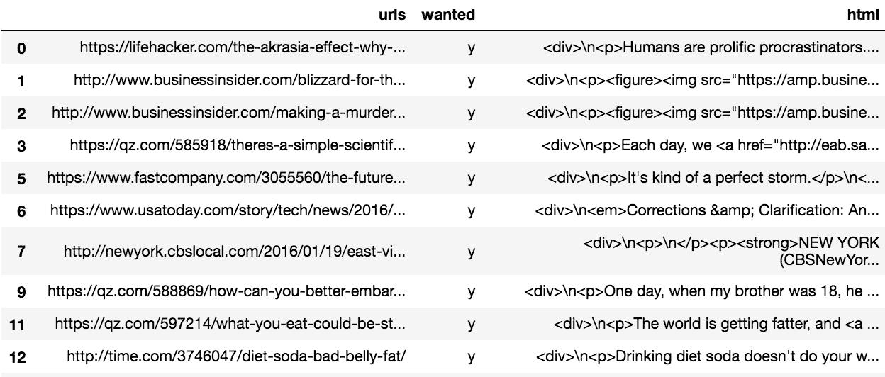
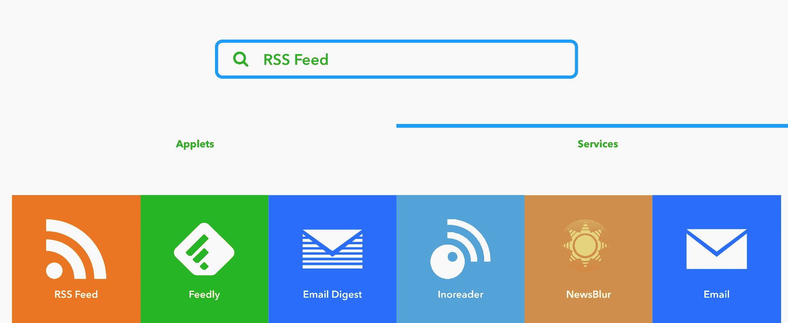
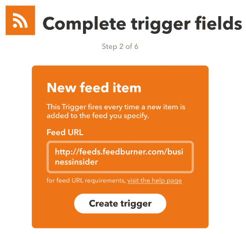

# 第五章：创建自定义新闻订阅源

我阅读的*很多*。有些人甚至会说是强迫症。我曾经一天看过超过一百篇文章。但即便如此，我经常感到自己还在寻找更多的文章。总有一种隐隐的感觉，觉得自己错过了什么有趣的东西，永远会在知识的空白中受困！

如果你也有类似的困扰，不用担心，因为在本章中，我将揭示一个简单的技巧，帮助你找到所有你想阅读的文章，而不必翻找那些你不感兴趣的。

到本章结束时，你将学会如何构建一个能够理解你新闻兴趣的系统，并且每天向你发送个性化的新闻简报。

本章内容概述：

+   使用 Pocket 应用创建监督学习数据集

+   利用 Pocket API 获取文章

+   使用 Embedly API 提取文章正文

+   自然语言处理基础

+   支持向量机

+   IFTTT 与 RSS 订阅和 Google Sheets 的集成

+   设置每日个人新闻简报

# 使用 Pocket 创建一个监督学习数据集

在我们创建一个能够理解我们新闻兴趣的模型之前，我们需要训练数据。这些训练数据将输入到我们的模型中，以教会它区分我们感兴趣的文章和不感兴趣的文章。为了构建这个语料库，我们需要标注大量文章，标注它们是否符合我们的兴趣。我们将为每篇文章标记`y`或`n`，表示它是否是我们希望每天收到的新闻简报中的文章。

为了简化这个过程，我们将使用 Pocket 应用。Pocket 是一个可以让你保存稍后阅读的故事的应用程序。你只需安装浏览器扩展程序，然后在想保存文章时，点击浏览器工具栏中的 Pocket 图标。文章会保存到你的个人仓库。Pocket 的一个强大功能是你可以为保存的文章打上自定义标签。我们将用`y`标记有趣的文章，用`n`标记不感兴趣的文章。

# 安装 Pocket Chrome 扩展

我正在使用 Google Chrome，但其他浏览器应该也能类似操作。按照以下步骤安装 Pocket Chrome 扩展：

1.  对于 Chrome，访问 Google 应用商店并查找扩展程序部分：


Pocket Chrome 扩展

1.  点击“添加到 Chrome”。如果你已经有账户，登录即可；如果没有，注册一个（是免费的）。

1.  完成后，你应该能在浏览器的右上角看到 Pocket 图标。

1.  它会变灰，但一旦有你想保存的文章，你可以点击它。文章保存后，它会变为红色：


保存的页面如下所示：



《纽约时报》保存页面

现在是有趣的部分！在你的一天中，开始保存你想阅读的文章，以及你不想阅读的文章。将感兴趣的文章标记为`y`，将不感兴趣的文章标记为`n`。这将需要一些工作。你的最终结果将与训练集的质量直接相关，因此你需要为成百上千的文章进行标记。如果你保存文章时忘记标记，可以随时访问[`www.get.pocket.com`](https://getpocket.com/)，在那里进行标记。

# 使用 Pocket API 来检索文章

现在你已经认真地将文章保存到 Pocket，下一步是检索它们。为此，我们将使用 Pocket API。你可以在[`getpocket.com/developer/apps/new`](https://getpocket.com/developer/apps/new)注册一个账户。请按照步骤完成：

1.  点击左上角的“创建新应用”，并填写详细信息以获取你的 API 密钥。

1.  确保点击所有权限，以便你可以添加、更改和检索文章：


1.  一旦你填写并提交了这些，你将收到你的**消费者密钥**。

1.  你可以在左上角的“我的应用”下找到它。它看起来会像下面的截图，但显然会有一个真实的密钥：


1.  一旦设置完成，你就可以继续进行下一步，即设置授权。我们现在开始操作。

1.  这要求你输入消费者密钥和重定向 URL。重定向 URL 可以是任何内容。在这里，我使用了我的 Twitter 账户：

```py
import requests 
import pandas as pd 
import json 
pd.set_option('display.max_colwidth', 200) 

CONSUMER_KEY = 'enter_your_consumer_key_here 

auth_params = {'consumer_key': CONSUMER_KEY, 'redirect_uri': 'https://www.twitter.com/acombs'} 

tkn = requests.post('https://getpocket.com/v3/oauth/request', data=auth_params) 

tkn.text 
```

上面的代码将产生以下输出：


1.  输出将包含你下一步所需的代码。将以下内容放入浏览器地址栏：

[`getpocket.com/auth/authorize?request_token=some_long_access_code&amp;redirect_uri=https%3A//www.twitter.com/acombs`](https://getpocket.com/auth/authorize?request_token=some_long_access_code&redirect_uri=https%3A//www.twitter.com/acombs)

1.  如果你将重定向 URL 更改为你自己的某个 URL，请确保进行 URL 编码（就是你在前面的 URL 中看到的`%3A`类型的东西）。

1.  此时，你应该会看到一个授权屏幕。点击同意，然后我们可以继续进行下一步：

```py
# below we parse out the access code from the tkn.text string 
ACCESS_CODE = tkn.text.split('=')[1] 

usr_params = {'consumer_key': CONSUMER_KEY, 'code': ACCESS_CODE} 

usr = requests.post('https://getpocket.com/v3/oauth/authorize', data=usr_params) 

usr.text 
```

上面的代码将产生以下输出：


1.  我们将使用这里的输出代码，继续检索这些文章。首先，我们检索标记为`n`的文章：

```py
# below we parse out the access token from the usr.text string 
ACCESS_TOKEN = usr.text.split('=')[1].split('&amp;')[0] 

no_params = {'consumer_key': CONSUMER_KEY, 
'access_token': ACCESS_TOKEN, 
'tag': 'n'} 

no_result = requests.post('https://getpocket.com/v3/get', data=no_params) 

no_result.text 
```

上面的代码将产生以下输出：


你会注意到我们在所有标记为`n`的文章中有一个很长的 JSON 字符串。这个字符串中有多个键，但此时我们只关心 URL。

1.  我们将继续创建一个包含所有 URL 的列表：

```py
no_jf = json.loads(no_result.text) 
no_jd = no_jf['list'] 

no_urls=[] 
for i in no_jd.values(): 
    no_urls.append(i.get('resolved_url')) no_urls 
```

上面的代码将产生以下输出：


URL 列表

1.  这个列表包含了我们不感兴趣的所有故事的 URL。现在我们将它放入一个 DataFrame，并标记为不感兴趣：

```py
no_uf = pd.DataFrame(no_urls, columns=['urls']) 
no_uf = no_uf.assign(wanted = lambda x: 'n') no_uf 
```

前面的代码产生了以下输出：


标记 URL

1.  现在我们已经处理好了不感兴趣的故事。让我们对我们感兴趣的故事做同样的事情：

```py
yes_params = {'consumer_key': CONSUMER_KEY, 
'access_token': ACCESS_TOKEN, 
'tag': 'y'} 
yes_result = requests.post('https://getpocket.com/v3/get', data=yes_params) 

yes_jf = json.loads(yes_result.text) 
yes_jd = yes_jf['list'] 

yes_urls=[] 
for i in yes_jd.values(): 
    yes_urls.append(i.get('resolved_url')) 

yes_uf = pd.DataFrame(yes_urls, columns=['urls']) 
yes_uf = yes_uf.assign(wanted = lambda x: 'y') 

yes_uf 
```

前面的代码产生了以下输出：


标记我们感兴趣的故事的 URL

1.  现在我们已经拥有了两种类型的故事作为训练数据，让我们将它们合并成一个单一的 DataFrame：

```py
df = pd.concat([yes_uf, no_uf]) 

df.dropna(inplace=True) 

df 
```

前面的代码产生了以下输出：


合并 URL——感兴趣的和不感兴趣的

现在我们已经将所有 URL 和对应的标签放入一个框架中，接下来我们将开始下载每篇文章的 HTML 内容。我们将使用另一个免费的服务来完成这个操作，名为 Embedly。

# 使用 Embedly API 下载故事正文

我们已经拥有了所有故事的 URL，但不幸的是，这还不足以进行训练；我们还需要完整的文章正文。如果我们想自己编写抓取程序，这可能会变成一个巨大的挑战，特别是当我们需要从数十个网站上提取故事时。我们需要编写代码来专门提取文章正文，同时小心避免抓取到周围的其他无关内容。幸运的是，就我们而言，有一些免费的服务可以帮我们做到这一点。我将使用 Embedly 来完成这项任务，但你也可以选择其他服务。

第一步是注册 Embedly API 访问权限。你可以在 [`app.embed.ly/signup`](https://app.embed.ly/signup) 上进行注册。这个过程很简单。确认注册后，你会收到一个 API 密钥。这就是你需要的一切。你只需要在 HTTP 请求中使用这个密钥。现在我们来操作一下：

```py
import urllib 

EMBEDLY_KEY = 'your_embedly_api_key_here' 

def get_html(x): 
    try: 
        qurl = urllib.parse.quote(x) 
        rhtml = requests.get('https://api.embedly.com/1/extract?url=' + qurl + '&amp;key=' + EMBEDLY_KEY) 
        ctnt = json.loads(rhtml.text).get('content') 
    except: 
        return None 
    return ctnt 
```

前面的代码产生了以下输出：



HTTP 请求

到此为止，我们已经获取了每篇故事的 HTML 内容。

由于内容嵌入在 HTML 标记中，而我们希望将纯文本输入到模型中，我们将使用解析器来剥离掉标记标签：

```py
from bs4 import BeautifulSoup 

def get_text(x): 
    soup = BeautifulSoup(x, 'html5lib') 
    text = soup.get_text() 
    return text 

df.loc[:,'text'] = df['html'].map(get_text) 

df 
```

前面的代码产生了以下输出：


到此为止，我们已经准备好了训练集。现在可以开始讨论如何将文本转化为模型能够处理的形式。

# 自然语言处理基础

如果机器学习模型只能处理数字数据，我们该如何将文本转化为数字表示呢？这正是**自然语言处理**（**NLP**）的核心问题。我们来简单了解一下它是如何做到的。

我们将从一个包含三句话的小语料库开始：

1.  那只新小猫和其他小猫一起玩

1.  她吃了午饭

1.  她爱她的小猫

我们将首先将语料库转换为**词袋模型**（**BOW**）表示。暂时跳过预处理。将语料库转换为 BOW 表示包括获取每个词及其出现次数，以创建所谓的**词项-文档矩阵**。在词项-文档矩阵中，每个独特的单词会被分配到一列，每个文档会被分配到一行。它们的交点处会记录出现次数：

| **序号**  | **the** | **新** | **小猫** | **玩** | **与** | **其他** | **小猫们** | **她** | **吃** | **午餐** | **爱** | **她** |
| --- | --- | --- | --- | --- | --- | --- | --- | --- | --- | --- | --- | --- |
| 1 | 1 | 1 | 1 | 1 | 1 | 1 | 1 | 0 | 0 | 0 | 0 | 0 |
| 2 | 0 | 0 | 0 | 0 | 0 | 0 | 0 | 1 | 1 | 1 | 0 | 0 |
| 3 | 0 | 0 | 1 | 0 | 0 | 0 | 0 | 1 | 0 | 0 | 1 | 1 |

请注意，对于这三句话，我们已经有了 12 个特征。正如你所想象的那样，如果我们处理的是实际的文档，比如新闻文章或甚至是书籍，特征的数量会激增到数十万。为了减少这种膨胀，我们可以采取一系列措施，删除那些对分析几乎没有信息价值的特征。

我们可以采取的第一步是移除**停用词**。这些是那些如此常见的词，通常不会提供关于文档内容的任何信息。常见的英语停用词有*the*、*is*、*at*、*which*和*on*。我们将删除这些词，并重新计算我们的词项-文档矩阵：

| **序号** | **新** | **小猫** | **玩** | **小猫们** | **吃** | **午餐** | **爱** |
| --- | --- | --- | --- | --- | --- | --- | --- |
| 1 | 1 | 1 | 1 | 1 | 0 | 0 | 0 |
| 2 | 0 | 0 | 0 | 0 | 1 | 1 | 0 |
| 3 | 0 | 1 | 0 | 0 | 0 | 0 | 1 |

如你所见，特征数量从 12 个减少到了 7 个。这很好，但我们还可以进一步减少特征。我们可以进行**词干提取**或**词形还原**来进一步减少特征。注意，在我们的矩阵中，我们有*kitten*和*kittens*两个词。通过词干提取或词形还原，我们可以将其合并成*kitten*：

| **序号** | **新** | **小猫** | **玩** | **吃** | **午餐** | **爱** |
| --- | --- | --- | --- | --- | --- | --- |
| 1 | 1 | 2 | 1 | 0 | 0 | 0 |
| 2 | 0 | 0 | 0 | 1 | 1 | 0 |
| 3 | 0 | 1 | 0 | 0 | 0 | 1 |

我们的新矩阵将*kittens*和*kitten*合并了，但还发生了其他变化。我们丢失了*played*和*loved*的后缀，*ate*被转换成了*eat*。为什么？这就是词形还原的作用。如果你还记得小学的语法课，我们已经从动词的屈折形式转到了词根形式。如果这就是词形还原，那词干提取是什么呢？词干提取有相同的目标，但采用的是一种不那么精细的方法。这种方法有时会生成伪单词，而不是实际的词根形式。例如，在词形还原中，如果将*ponies*还原，你会得到*pony*，但在词干提取中，你会得到*poni*。

现在让我们进一步应用另一个变换到我们的矩阵。到目前为止，我们使用了每个词的简单计数，但我们可以应用一种算法，这种算法会像一个过滤器一样作用于我们的数据，增强每个文档中独特的词汇。这个算法叫做**词频-逆文档频率** (**tf-idf**)**。**

我们为矩阵中的每个词项计算 tf-idf 比率。让我们通过几个例子来计算。对于文档一中的词汇*new*，词频就是它的出现次数，即`1`。逆文档频率是通过计算语料库中所有文档数与该词出现的文档数的比值的对数来得出的。对于*new*，这个值是*log (3/1)*，即.4471。所以，完整的 tf-idf 值就是*tf * idf*，或者在这里，它是*1 x .4471*，即.4471。对于文档一中的词汇*kitten*，tf-idf 是*2 * log (3/2)*，即.3522。

完成其余词项和文档的计算后，我们得到了以下结果：

| **序号** | **new** | **kitten** | **play** | **eat** | **lunch** | **love** |
| --- | --- | --- | --- | --- | --- | --- |
| 1 | .4471 | .3522 | .4471 | 0 | 0 | 0 |
| 2 | 0 | 0 | 0 | .4471 | .4471 | 0 |
| 3 | 0 | .1761 | 0 | 0 | 0 | .4471 |

为什么要做这些呢？假设我们有一个关于多个主题（医学、计算机、食物、动物等）的文档集，并且我们想将它们分类成不同的主题。很少有文档会包含词汇*sphygmomanometer*，它是用来测量血压的仪器；而所有包含这个词的文档，可能都涉及医学主题。显然，这个词在文档中出现的次数越多，它就越可能与医学相关。所以，一个在整个语料库中很少出现，但在某个文档中出现多次的词汇，很可能与该文档的主题紧密相关。通过这种方式，可以认为文档是通过那些具有高 tf-idf 值的词汇来表示的。

在这个框架的帮助下，我们现在将训练集转换为 tf-idf 矩阵：

```py
from sklearn.feature_extraction.text import TfidfVectorizer 

vect = TfidfVectorizer(ngram_range=(1,3), stop_words='english', min_df=3) 

tv = vect.fit_transform(df['text']) 
```

通过这三行，我们已将所有文档转换为 tf-idf 向量。我们传入了若干参数：`ngram_range`、`stop_words`和`min_df`。接下来我们逐一讨论。

首先，`ngram_range`是文档的分词方式。在之前的示例中，我们使用每个单词作为一个词元，但在这里，我们将所有的 1 到 3 个词的序列作为词元。以我们第二句“*She ate lunch*”为例。我们暂时忽略停用词。这个句子的 n-grams 会是：*she*、*she ate*、*she ate lunch*、*ate*、*ate lunch*和*lunch*。

接下来是`stop_words`。我们传入`english`，以移除所有的英文停用词。正如之前讨论的，这会移除所有缺乏信息内容的词汇。

最后，我们有`min_df`。这个参数会移除所有在至少三个文档中未出现的词汇。添加这个选项可以去除非常稀有的词汇，并减少我们的矩阵大小。

现在，我们的文章语料库已经转化为可操作的数值格式，我们将继续将其输入到分类器中。

# 支持向量机

在这一章中，我们将使用一种新的分类器——线性 **支持向量机**（**SVM**）。SVM 是一种算法，试图通过使用 **最大边距超平面** 来将数据点线性地分到不同类别。这个词听起来很复杂，所以我们来看看它到底是什么意思。

假设我们有两个类别的数据，并且我们想用一条线将它们分开。（在这里我们只处理两个特征或维度。）放置这条线的最有效方式是什么呢？让我们看看下面的插图：


在上面的图示中，线 **H[1]** 并不能有效地区分这两个类别，所以我们可以去掉它。线 **H[2]** 能够干净利落地区分它们，但 **H[3]** 是最大边界线。这意味着这条线位于每个类别的两个最近点之间的中间，这些点被称为 **支持向量**。这些可以在下图中看到为虚线：


如果数据无法如此整齐地被分割成不同类别呢？如果数据点之间存在重叠呢？在这种情况下，仍然有一些选项。一种方法是使用所谓的 **软边距 SVM**。这种公式仍然最大化边距，但其代价是对落在边距错误一侧的点进行惩罚。另一种方法是使用所谓的 **核技巧**。这种方法将数据转换到一个更高维度的空间，在那里数据可以被线性分割。这里提供了一个示例：


二维表示如下：


我们已经将一维特征空间映射到二维特征空间。这个映射只是将每个 *x* 值映射到 *x*，*x²*。这样做使我们能够添加一个线性分隔平面。

既然已经涵盖了这些，我们现在将我们的 tf-idf 矩阵输入到 SVM 中：

```py
from sklearn.svm import LinearSVC 

clf = LinearSVC() 
model = clf.fit(tv, df['wanted']) 
```

`tv` 是我们的矩阵，而 `df['wanted']` 是我们的标签列表。记住，这个列表的内容要么是 `y`，要么是 `n`，表示我们是否对这篇文章感兴趣。一旦运行完毕，我们的模型就训练完成了。

在这一章中，我们没有正式评估我们的模型。你几乎总是应该有一个保留集来评估你的模型，但由于我们将不断更新模型并每天评估它，所以本章将跳过这一步。请记住，这通常是一个非常糟糕的主意。

现在我们继续设置我们的每日新闻订阅源。

# IFTTT 与订阅源、Google Sheets 和电子邮件的集成

我们使用 Pocket 来构建我们的训练集，但现在我们需要一个文章的流媒体订阅源来运行我们的模型。为了设置这个，我们将再次使用 IFTTT、Google Sheets，以及一个允许我们与 Google Sheets 进行交互的 Python 库。

# 通过 IFTTT 设置新闻订阅源和 Google Sheets

希望此时你已经设置好 IFTTT 帐户，如果没有，请现在设置好。完成后，你需要设置与订阅源和 Google Sheets 的集成：

1.  首先，在主页的搜索框中搜索“feeds”，然后点击“服务”，接着点击进行设置：



1.  你只需要点击“连接”：


1.  接下来，在“服务”下搜索`Google Drive`：


1.  点击该按钮，它将带你到一个页面，在这里你可以选择你想要连接的 Google 帐户。选择帐户后，点击“允许”以使 IFTTT 访问你的 Google Drive 帐户。完成后，你应该会看到以下内容：


1.  现在，连接了我们的频道，我们可以设置订阅源。点击右上角用户名下拉菜单中的“新建 Applet”。这将带你到这里：


1.  点击+this，搜索`RSS Feed`，然后点击它。这将带你到如下页面：


1.  从这里，点击“新建订阅源项”：



1.  然后，将 URL 添加到框中并点击“创建触发器”。完成后，你将返回继续添加+that 动作：


1.  点击+that，搜索`Sheets`，然后点击它的图标。完成后，你会看到如下界面：


1.  我们希望我们的新闻项流入 Google Drive 电子表格，因此点击“添加行到电子表格”。然后你将有机会自定义电子表格：


我将电子表格命名为`NewStories`，并将其放入名为`IFTTT`的 Google Drive 文件夹中。点击“创建动作”完成配方设置，很快你就会看到新闻项开始流入你的 Google Drive 电子表格。请注意，它只会添加新进项，而不是你创建表格时已经存在的项。我建议你添加多个订阅源。你需要为每个源创建单独的配方。最好添加你训练集中网站的订阅源，换句话说，就是你在 Pocket 中保存的那些网站。

给这些故事一两天的时间在表格中积累，然后它应该会看起来像这样：


幸运的是，完整的文章 HTML 主体已包括在内。这意味着我们不需要使用 Embedly 为每篇文章下载它。我们仍然需要从 Google Sheets 下载文章，然后处理文本以去除 HTML 标签，但这一切都可以相对轻松地完成。

为了下载文章，我们将使用一个名为`gspread`的 Python 库。可以通过 pip 安装。一旦安装完成，你需要按照**OAuth 2**的设置步骤进行操作。具体可以参考[`gspread.readthedocs.org/en/latest/oauth2.html`](http://gspread.readthedocs.org/en/latest/oauth2.html)。你最终会下载一个 JSON 凭证文件。至关重要的是，在获得该文件后，找到其中带有`client_email`键的电子邮件地址。然后，你需要将你要发送故事的`NewStories`电子表格与该电子邮件地址共享。只需点击表格右上角的蓝色“分享”按钮，并粘贴电子邮件地址。你会在 Gmail 账户中收到*发送失败*的消息，但这是预期的。确保在以下代码中替换为你文件的路径和文件名：

```py
import gspread 

from oauth2client.service_account import ServiceAccountCredentials 
JSON_API_KEY = 'the/path/to/your/json_api_key/here' 

scope = ['https://spreadsheets.google.com/feeds', 
         'https://www.googleapis.com/auth/drive'] 

credentials = ServiceAccountCredentials.from_json_keyfile_name(JSON_API_KEY, scope) 
gc = gspread.authorize(credentials) 
```

现在，如果一切顺利，它应该能正常运行。接下来，你可以下载这些故事：

```py
ws = gc.open("NewStories") 
sh = ws.sheet1 

zd = list(zip(sh.col_values(2),sh.col_values(3), sh.col_values(4))) 

zf = pd.DataFrame(zd, columns=['title','urls','html']) 
zf.replace('', pd.np.nan, inplace=True) 
zf.dropna(inplace=True) 

zf 
```

上述代码会产生以下输出：


通过这一过程，我们从源中下载了所有文章，并将它们放入了 DataFrame 中。现在我们需要去除 HTML 标签。我们可以使用之前用来提取文本的函数。然后，我们将使用 tf-idf 向量化器进行转换：

```py
zf.loc[:,'text'] = zf['html'].map(get_text) 

zf.reset_index(drop=True, inplace=True) 

test_matrix = vect.transform(zf['text']) 

test_matrix 
```

上述代码会产生以下输出：


在这里，我们看到我们的向量化已经成功。接下来，我们将其传入模型以获取结果：

```py
results = pd.DataFrame(model.predict(test_matrix), columns=['wanted']) 

results 
```

上述代码会产生以下输出：


在这里，我们看到每篇故事都有对应的结果。现在让我们将它们与故事本身合并，这样我们就可以评估结果：

```py
rez = pd.merge(results,zf, left_index=True, right_index=True) 

rez 
```

上述代码会产生以下输出：


在此时，我们可以通过查看结果并纠正错误来改进模型。你需要自己完成这个步骤，但这是我如何修改我自己的模型：

```py
change_to_no = [130, 145, 148, 163, 178, 199, 219, 222, 223, 226, 235, 279, 348, 357, 427, 440, 542, 544, 546, 568, 614, 619, 660, 668, 679, 686, 740, 829] 

change_to_yes = [0, 9, 29, 35, 42, 71, 110, 190, 319, 335, 344, 371, 385, 399, 408, 409, 422, 472, 520, 534, 672] 

for i in rez.iloc[change_to_yes].index: 
    rez.iloc[i]['wanted'] = 'y' 

for i in rez.iloc[change_to_no].index: 
    rez.iloc[i]['wanted'] = 'n' 

rez 
```

上述代码会产生以下输出：


这些看起来可能是很多更改，但在评估的 900 多篇文章中，我只需要更改非常少的几篇。通过这些修正，我们现在可以将其反馈到我们的模型中，以进一步改进它。让我们将这些结果添加到我们之前的训练数据中，然后重新构建模型：

```py
combined = pd.concat([df[['wanted', 'text']], rez[['wanted', 'text']]]) combined 
```

上述代码会产生以下输出：


使用以下代码重新训练模型：

```py
tvcomb = vect.fit_transform(combined['text'], combined['wanted']) 

model = clf.fit(tvcomb, combined['wanted']) 
```

现在我们已经使用所有可用的数据重新训练了我们的模型。随着时间的推移，您可能需要多次执行此操作，以获取更多的结果。添加的数据越多，结果将会越好。

在这一点上，我们假设您已经有一个训练有素的模型，并准备开始使用它。现在让我们看看如何部署它来设置个性化新闻订阅。

# 设置您的每日个性化新闻简报

为了设置一个包含新闻故事的个人电子邮件，我们将再次利用 IFTTT。与之前一样，在第三章中，*构建一个查找廉价机票的应用*，我们将使用 Webhooks 渠道发送 `POST` 请求。但这次，负载将是我们的新闻故事。如果您还没有设置 Webhooks 渠道，请立即执行此操作。有关说明，请参阅第三章。您还应该设置 Gmail 渠道。完成后，我们将添加一个配方来将两者结合起来。按照以下步骤设置 IFTTT：

1.  首先，从 IFTTT 主页点击新 Applet，然后点击 +this。然后，搜索 Webhooks 渠道：


1.  选择它，然后选择接收 Web 请求：


1.  然后，给请求一个名称。我使用 `news_event`：


1.  最后，点击创建触发器。接下来，点击 +that 来设置电子邮件部分。搜索 Gmail 并点击它：


1.  一旦您点击了 Gmail，请点击发送自己邮件。从那里，您可以自定义您的电子邮件消息：


输入主题行，并在电子邮件正文中包含 `{{Value1}}`。我们将通过我们的 `POST` 请求将故事标题和链接传递到这里。点击创建操作，然后完成以完成设置。

现在，我们准备生成一个计划运行的脚本，自动发送我们感兴趣的文章。我们将为此创建一个单独的脚本，但我们现有的代码中还需要做一件事情，即序列化我们的向量化器和模型，如下面的代码块所示：

```py
import pickle 

pickle.dump(model, open(r'/input/a/path/here/to/news_model_pickle.p', 'wb')) 

pickle.dump(vect, open(r'/input/a/path/here/to/news_vect_pickle.p', 'wb')) 
```

现在，我们已经保存了我们模型所需的一切。在我们的新脚本中，我们将读取它们以生成我们的新预测。我们将使用与我们在第三章中使用的相同调度库来运行代码，*构建一个查找廉价机票的应用*。将所有内容组合起来，我们有以下脚本：

```py
import pandas as pd 
from sklearn.feature_extraction.text import TfidfVectorizer 
from sklearn.svm import LinearSVC 
import schedule 
import time 
import pickle 
import json 
import gspread 
from oauth2client.service_account import ServiceAccountCredentials 
import requests 
from bs4 import BeautifulSoup 

def fetch_news(): 

    try: 
        vect = pickle.load(open(r'/your/path/to/news_vect_pickle.p', 'rb')) 
        model = pickle.load(open(r'/your/path/to /news_model_pickle.p', 'rb')) 

        JSON_API_KEY = r'/your/path/to/API KEY.json' 

        scope = ['https://spreadsheets.google.com/feeds', 'https://www.googleapis.com/auth/drive'] 

        credentials = ServiceAccountCredentials.from_json_keyfile_name(JSON_API_KEY, scope) 
        gc = gspread.authorize(credentials) 

        ws = gc.open("NewStories") 
        sh = ws.sheet1 
        zd = list(zip(sh.col_values(2),sh.col_values(3), sh.col_values(4))) 
        zf = pd.DataFrame(zd, columns=['title','urls','html']) 
        zf.replace('', pd.np.nan, inplace=True) 
        zf.dropna(inplace=True) 

        def get_text(x): 
            soup = BeautifulSoup(x, 'html5lib') 
            text = soup.get_text() 
            return text 

        zf.loc[:,'text'] = zf['html'].map(get_text) 

        tv = vect.transform(zf['text']) 
        res = model.predict(tv) 

        rf = pd.DataFrame(res, columns=['wanted']) 
        rez = pd.merge(rf, zf, left_index=True, right_index=True) 

        rez = rez.iloc[:20,:] 

        news_str = '' 
 for t, u in zip(rez[rez['wanted']=='y']['title'], rez[rez['wanted']=='y']['urls']): 
            news_str = news_str + t + '\n' + u + '\n' 

        payload = {"value1" : news_str} 
        r = requests.post('https://maker.ifttt.com/trigger/news_event/with/key/bNHFwiZx0wMS7EnD425n3T', data=payload) 

        # clean up worksheet 
        lenv = len(sh.col_values(1)) 
        cell_list = sh.range('A1:F' + str(lenv)) 
        for cell in cell_list: 
            cell.value = "" 
        sh.update_cells(cell_list) 
        print(r.text) 

    except: 
        print('Action Failed') 

schedule.every(480).minutes.do(fetch_news) 

while 1: 
    schedule.run_pending() 
    time.sleep(1) 
```

这个脚本将每 4 小时运行一次，从 Google Sheets 下载新闻故事，通过模型运行故事，通过向 IFTTT 发送 `POST` 请求生成邮件，预测为感兴趣的故事，最后清空电子表格中的故事，以便在下一封电子邮件中只发送新故事。

恭喜！你现在拥有了属于自己的个性化新闻推送！

# 总结

在本章中，我们学习了如何在训练机器学习模型时处理文本数据。我们还学习了自然语言处理（NLP）和支持向量机（SVM）的基础知识。

在下一章，我们将进一步发展这些技能，并尝试预测哪些内容会变得流行。
