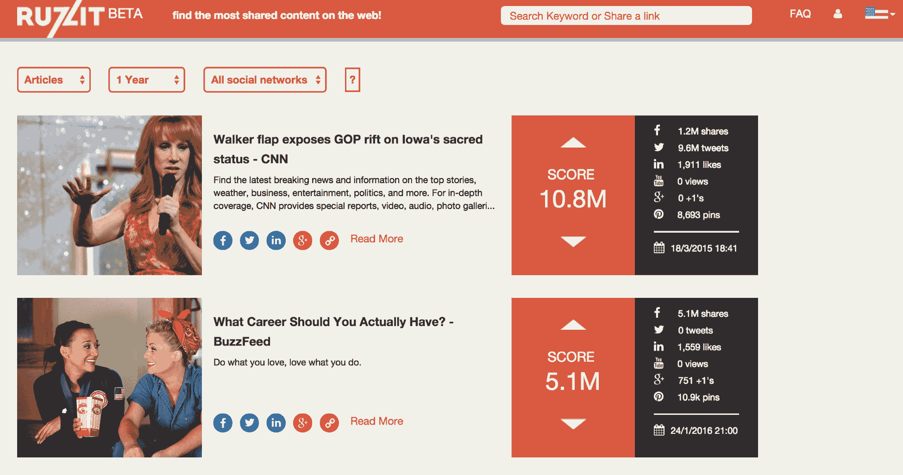
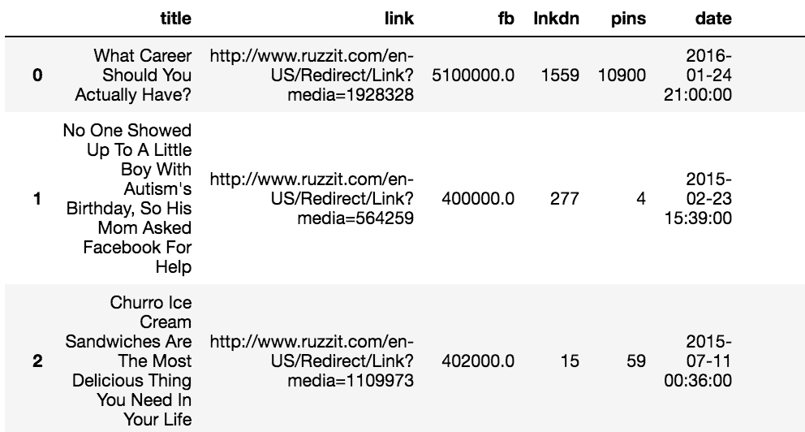
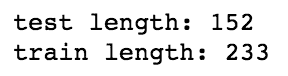
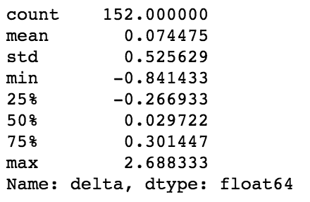

# 第六章：预测你的内容是否会成为病毒式传播

像许多伟大的事物一样，这一切都始于一场赌注。那是 2001 年，乔纳·佩雷蒂当时是麻省理工学院的研究生，他在拖延。与其写论文，他决定接受耐克提供的定制运动鞋服务。在耐克最近推出的一个项目下，任何人都可以通过他们的网站 NIKEiD 来定制鞋子。唯一的问题，至少从耐克的角度来看，就是佩雷蒂要求在鞋子上印上“*sweatshop*”字样，这显然是不可行的。佩雷蒂通过一系列电子邮件回应，指出这个词绝不属于任何会导致个性化请求被拒绝的敏感词汇类别。

佩雷蒂认为其他人也许会觉得他与耐克客服代表之间的来回邮件很有趣，于是将这些邮件转发给了几位亲密的朋友。几天之内，这些邮件传到了全世界的收件箱里。包括《时代》杂志、Salon、《卫报》以及《今日秀》等主要媒体纷纷报道。佩雷蒂成为了一场病毒式现象的中心。

但困扰佩雷蒂的问题是，这种事情能否被复制？他的朋友卡梅伦·马洛正在准备写他的博士论文，研究病毒式现象，并坚信这种事情过于复杂，任何人都无法复制。而在这里，赌注开始起作用。马洛打赌，佩雷蒂无法复制他在最初那组与耐克的电子邮件中获得的成功。

快进到 15 年后，乔纳·佩雷蒂领导着那个名字已与病毒式传播划上等号的网站——BuzzFeed。2015 年，它的独立访客超过 7700 万，排名超越了《纽约时报》的总覆盖面。我想可以放心地说，佩雷蒂赢得了那场赌注。

那么佩雷蒂到底是如何做到的呢？他是如何拼凑出创造如野火般传播内容的秘密公式的？在本章中，我们将尝试解开其中的一些谜团。我们将研究一些最具分享性的内容，并尝试找出与人们不太愿意分享的内容之间的共同点。

本章将涵盖以下主题：

+   研究告诉我们关于病毒式传播的什么？

+   获取共享数量和内容

+   探索分享性特点

+   构建一个预测内容得分模型

# 研究告诉我们关于病毒式传播的什么？

理解分享行为是大生意。随着消费者越来越对传统广告视而不见，推动的力量是超越简单的推销，讲述引人入胜的故事。越来越多地，这些努力的成功是通过社交分享来衡量的。为什么要这么麻烦？因为作为一个品牌，每一次分享都代表着我接触到的另一个消费者——而这一切不需要花费额外的一分钱。

由于这种价值，一些研究者已经研究了分享行为，希望了解其动机。研究者们发现的动机包括以下几点：

+   为了为他人提供实际价值（利他动机）

+   为了与某些观念和概念关联（身份动机）

+   为了与他人围绕共同的情感建立联系（社群动机）

关于最后一个动机，有一项特别精心设计的研究调查了《纽约时报》上的 7,000 篇内容，研究了情感对分享的影响。他们发现，仅仅简单的情感倾向不足以解释分享行为，但当情感与情绪激发相结合时，解释力更强。

例如，尽管悲伤具有强烈的负面情感，它被认为是一种低激发状态。而愤怒则具有负面情感，且与高度激发状态相伴。因此，令读者感到悲伤的故事往往生成的分享远少于激怒读者的故事。那么，难道我们不应该感到惊讶的是，如今在政治中起着重要作用的*假新闻*往往就是这种形式吗？下图展示了相同的结果：


该图摘自*《什么使在线内容具有病毒性？》*，作者：乔纳·伯杰（Jonah Berger）与凯瑟琳·L·米尔克曼（Katherine L. Milkman），《市场营销研究杂志》，可通过以下网址获得：http://jonahberger.com/wp-content/uploads/2013/02/ViralityB.pdf

这部分内容涵盖了动机方面的内容，但如果我们将这些因素保持不变，其他属性如何影响内容的病毒性呢？其中的一些因素可能包括以下内容：标题措辞、标题长度、标题的词性、内容长度、发布的社交网络、主题、内容的时效性等等。毫无疑问，一个人可以花费一生的时间研究这一现象。然而，现阶段，我们只会花大约 30 页左右的篇幅来进行探讨。从那里，你可以决定是否希望进一步深入研究。

# 共享计数和内容的来源

在我们开始探讨哪些特征使内容具有可分享性之前，我们需要收集大量的内容，并获取有关这些内容被分享的频率的数据。不幸的是，获取这类数据在过去几年变得更加困难。实际上，当本书的第一版在 2016 年出版时，这些数据是很容易获得的。但如今，似乎没有免费的数据来源，尽管如果你愿意支付费用，仍然可以找到这些数据。

幸运的是，我拥有一个从现已关闭的网站`ruzzit.com`收集的数据集。当这个网站还在运营时，它追踪了随着时间推移分享次数最多的内容，这正是我们这个项目所需要的：



我们将首先将我们的导入文件加载到笔记本中，像往常一样，然后加载数据。这个数据是 JSON 格式的。我们可以使用 pandas 的`read_json()`方法读取，如下所示：

```py
import numpy as np 
import pandas as pd 
import matplotlib.pyplot as plt 
%matplotlib inline 

dfc = pd.read_json('viral_dataset.json') 
dfc.reset_index(drop=True, inplace=True) 
dfc 
```

上述代码会生成以下输出：



让我们来看看这个数据集的列，以更好地理解我们将要处理的内容：

```py
dfc.columns 
```

上述代码会生成以下输出：


现在，我们来逐一看看这些列代表的含义：

+   `title`: 文章的标题

+   `link`: `ruzzit.com`的链接

+   `bb`: Facebook 的点赞次数

+   `lnkdn`: LinkedIn 分享次数

+   `pins`: Pinterest 上的钉住次数

+   `date`: 文章的日期

+   `redirect`: 原始文章的链接

+   `pg_missing`: 描述该页面是否可用的字段

+   `img_link`: 文章中图片的链接

+   `json_data`: 文章的附加数据

+   `site`: 文章托管的网站域名

+   `img_count`: 文章中包含的图片数量

+   `entities`: 与人物、地点和事物相关的文章特征

+   `html`: 文章的正文

+   `text`: 文章正文的文本

另一个有用的功能是每篇文章的字数。我们目前的数据中没有这个信息，因此让我们创建一个函数来提供字数：

```py
def get_word_count(x): 
    if not x is None: 
        return len(x.split(' ')) 
    else: 
        return None 

dfc['word_count'] = dfc['text'].map(get_word_count) 
dfc 
```

上述代码会生成以下输出：


我们来添加更多功能。我们将提取页面中第一张图片的最突出颜色。每张图片的颜色以 RGB 值的形式列在 JSON 数据中，因此我们可以从中提取：

```py
import matplotlib.colors as mpc 

def get_rgb(x): 
    try: 
        if x.get('images'): 
            main_color = x.get('images')[0].get('colors')[0].get('color') 
            return main_color 
    except: 
        return None 

def get_hex(x): 
    try: 
        if x.get('images'): 
            main_color = x.get('images')[0].get('colors')[0].get('color') 
            return mpc.rgb2hex([(x/255) for x in main_color]) 
    except: 
        return None 
 dfc['main_hex'] = dfc['json_data'].map(get_hex) 
dfc['main_rgb'] = dfc['json_data'].map(get_rgb) 

dfc 
```

上述代码会生成以下输出：


我们从第一张图片中提取了最突出颜色的 RGB 值，同时也将其转换为十六进制值。稍后我们会在分析图片颜色时使用这个值。

数据现在准备好了，我们可以开始进行分析。我们将尝试找出是什么让内容具有高度的分享性。

# 探索分享功能

我们在这里收集的故事大约代表了 2015 年和 2016 年初最具分享性的 500 篇内容。我们将尝试拆解这些文章，找出让它们如此具有分享性的共同特征。我们将从图片数据开始。

# 探索图片数据

我们先来看看每篇故事包含的图片数量。我们将对其进行计数，然后绘制图表：

```py
dfc['img_count'].value_counts().to_frame('count') 
```

这应该会显示类似以下的输出：


现在，让我们绘制相同的信息：

```py
fig, ax = plt.subplots(figsize=(8,6)) 
y = dfc['img_count'].value_counts().sort_index() 
x = y.sort_index().index 
plt.bar(x, y, color='k', align='center') 
plt.title('Image Count Frequency', fontsize=16, y=1.01) 
ax.set_xlim(-.5,5.5) 
ax.set_ylabel('Count') 
ax.set_xlabel('Number of Images') 
```

这段代码会生成以下输出：


目前为止，我对这些数字感到惊讶。绝大多数故事都包含五张图片，而那些只有一张图片或完全没有图片的故事则相当罕见。

因此，我们可以看到人们倾向于分享大量包含图片的内容。接下来，我们来看看这些图片中最常见的颜色：

```py
mci = dfc['main_hex'].value_counts().to_frame('count') 

mci 
```

这段代码生成了以下输出：


我不知道你怎么看，但对我来说，这并不十分有帮助，因为我并不能把十六进制值当作颜色来看。不过，我们可以使用 pandas 中的一个新功能——条件格式化来帮助我们：

```py
mci['color'] = ' ' 

def color_cells(x): 
    return 'background-color: ' + x.index 

mci.style.apply(color_cells, subset=['color'], axis=0) 

mci 
```

上述代码生成了以下输出：


# 聚类

这当然有所帮助，但颜色的粒度如此精细，以至于我们总共有超过 450 种独特的颜色。让我们使用一点聚类技术将其缩减到一个更易管理的范围。由于我们有每种颜色的 RGB 值，因此我们可以创建一个三维空间，通过 k-means 算法对它们进行聚类。这里我不打算深入讲解该算法，但它是一个相当简单的迭代算法，基于通过测量与中心的距离来生成聚类并进行重复。该算法要求我们选择 *k*，即我们期望的聚类数量。由于 RGB 的范围是从 0 到 256，我们将使用 256 的平方根，即 16。这样应该能给我们一个可管理的数量，同时保留我们调色板的特点。

首先，我们将 RGB 值拆分成单独的列：

```py
def get_csplit(x): 
    try: 
        return x[0], x[1], x[2] 
    except: 
        return None, None, None 

dfc['reds'], dfc['greens'], dfc['blues'] = zip(*dfc['main_rgb'].map(get_csplit)) 
```

接下来，我们将使用这个功能来运行我们的 k-means 模型，并获取中心值：

```py
from sklearn.cluster import KMeans 

clf = KMeans(n_clusters=16) 
clf.fit(dfc[['reds', 'greens', 'blues']].dropna()) 

clusters = pd.DataFrame(clf.cluster_centers_, columns=['r', 'g', 'b']) 

clusters 
```

这将生成以下输出：


现在，我们从每张图片的第一张图片中提取了十六种最流行的主导颜色。接下来，我们来看看它们是否使用了我们在之前创建的 `DataFrame.style()` 方法，以及用于为单元格着色的函数。我们需要将索引设置为三列的十六进制值，以便使用我们的 `color_cells` 函数，因此我们也会做这一步：

```py
def hexify(x): 
    rgb = [round(x['r']), round(x['g']), round(x['b'])] 
    hxc = mpc.rgb2hex([(x/255) for x in rgb]) 
    return hxc 

clusters.index = clusters.apply(hexify, axis=1) 

clusters['color'] = ' ' 

clusters.style.apply(color_cells, subset=['color'], axis=0) 
```

这将生成以下输出：


所以，结果就是这些；这些是你在最常被分享的内容中看到的最常见的颜色（至少是第一张图片中的颜色）。这些颜色比我预期的有些单调，因为前几种似乎都是米色和灰色的不同色调。

现在，让我们继续，检查一下我们故事的头条新闻。

# 探索头条新闻

让我们从创建一个可以用来检查最常见元组的函数开始。我们将使它可以在稍后的正文文本中使用。我们将使用 Python **自然语言工具包**（**NLTK**）库来实现。如果你还没有安装这个库，可以通过 pip 安装：

```py
from nltk.util import ngrams 
from nltk.corpus import stopwords 
import re 

def get_word_stats(txt_series, n, rem_stops=False): 
    txt_words = [] 
    txt_len = [] 
    for w in txt_series: 
        if w is not None: 
            if rem_stops == False: 
                word_list = [x for x in ngrams(re.findall('[a-z0-9\']+', w.lower()), n)] 
            else: 
                word_list = [y for y in ngrams([x for x in re.findall('[a-z0-9\']+', w.lower())\ 
                                                if x not in stopwords.words('english')], n)] 
            word_list_len = len(list(word_list)) 
            txt_words.extend(word_list) 
            txt_len.append(word_list_len) 
    return pd.Series(txt_words).value_counts().to_frame('count'), pd.DataFrame(txt_len, columns=['count']) 
```

这里面有很多内容，我们来逐步解析。我们创建了一个函数，该函数接收一个系列、一个整数和一个布尔值。整数确定我们将用于 n-gram 解析的 *n* 值，而布尔值决定是否排除停用词。该函数返回每行的元组数和每个元组的频率。

让我们在保留停用词的情况下运行这个，首先从单个词开始：

```py
hw,hl = get_word_stats(dfc['title'], 1, 0) 

hl 
```

这段代码生成以下输出：


现在，我们得到了每个标题的字数统计。让我们看看这些统计数据是什么样的：

```py
hl.describe() 
```

这段代码生成以下输出：


我们可以看到，我们的病毒式故事的中位数标题长度恰好是 11 个单词。接下来，我们来看看最常用的单词：


这并不完全有用，但符合我们可能的预期。现在，我们来看一下双字组（bi-grams）的相同信息：

```py
hw,hl = get_word_stats(dfc['title'], 2, 0) 

hw 
```

这段代码生成以下输出：


这明显更有趣了。我们开始看到标题中一些重复出现的元素。最突出的是 `(donald, trump)` 和 `(dies, at)`。特朗普在选举期间发表了一些引人注目的声明，所以特朗普的名字出现很有道理，但我对 *dies* 这个词的标题感到惊讶。我查看了这些标题，显然有很多高调的人物在那一年去世，所以这也能解释得通。

现在，让我们在移除停用词后运行这个：

```py
hw,hl = get_word_stats(dfc['title'], 2, 1) 

hw 
```

这段代码生成以下输出：


再次，我们可以看到很多我们可能预期的结果。看起来如果我们改变解析数字的方式（将每个数字替换为一个单一标识符，比如数字），我们可能会看到更多这些词汇浮现出来。如果你想尝试，留给读者自己去做这个练习吧。

现在，我们来看看三字组（tri-grams）：

```py
hw,hl = get_word_stats(dfc['title'], 3, 0) 
```

这段代码生成以下输出：


看起来我们包含的单词越多，标题就越接近经典的 BuzzFeed 原型。实际上，咱们来看看是不是这样。我们还没有查看哪些网站产生了最多的病毒式故事；让我们看看 BuzzFeed 是否占据了榜首：

```py
dfc['site'].value_counts().to_frame() 
```

这段代码生成以下输出：


我们可以清楚地看到，BuzzFeed 主导了这个列表。排在第二位的是《赫芬顿邮报》，顺便提一下，乔纳·佩雷蒂曾在这家网站工作过。看起来，研究病毒传播的科学确实能带来丰厚的回报。

到目前为止，我们已经检查了图像和标题。接下来，我们将开始检查故事的完整文本。

# 探索故事内容

在上一节中，我们创建了一个函数来检查我们故事标题中常见的 n-grams。现在，让我们将这一方法应用到探索故事的完整内容上。

我们将首先探索去除停用词的二元组。由于标题相较于正文较短，因此查看带有停用词的标题是合理的，而在正文中，通常需要去除停用词：

```py
hw,hl = get_word_stats(dfc['text'], 2, 1) 

hw 
```

这将生成以下输出：


有趣的是，我们可以看到，在标题中的轻松氛围完全消失了。现在，文本充满了讨论恐怖主义、政治和种族关系的内容。

既然标题如此轻松愉快，而正文却显得沉重且富有争议，怎么可能是这样呢？我认为这是因为像《*13 只看起来像猫王的小狗*》这样的文章，其正文文字会比《*伊斯兰国历史*》少得多。

让我们再看一个。我们将评估故事正文的三元组（tri-grams）：

```py
hw,hl = get_word_stats(dfc['text'], 3, 1) 

hw 
```

这段代码生成了以下输出：


我们似乎突然进入了广告和社会迎合的领域。接下来，让我们开始构建一个用于内容评分的预测模型。

# 构建预测内容评分模型

让我们运用所学知识，创建一个可以估算给定内容分享数的模型。我们将使用已经创建的特征，并结合一些额外的特征。

理想情况下，我们会有一个更大的内容样本，尤其是那些有更多典型分享数的内容，但我们只能利用手头的这些。

我们将使用一种叫做**随机森林回归**的算法。在之前的章节中，我们讨论了基于分类的随机森林的更典型实现，但在这里，我们将尝试预测分享数。我们可以将分享类别合并为区间，但在处理连续变量时，使用回归更为合适，而我们这里正是处理的连续变量。

首先，我们将创建一个简化的模型。我们将使用图像数量、网站和字数作为特征，并以 Facebook 点赞数作为训练目标。我们还将把数据分为两个集合：训练集和测试集。

首先，我们将导入 scikit-learn 库，然后通过删除空值行、重置索引，最后将数据框分为训练集和测试集来准备数据：

```py
from sklearn.ensemble import RandomForestRegressor 

all_data = dfc.dropna(subset=['img_count', 'word_count']) 
all_data.reset_index(inplace=True, drop=True) 

train_index = [] 
test_index = [] 
for i in all_data.index: 
    result = np.random.choice(2, p=[.65,.35]) 
    if result == 1: 
        test_index.append(i) 
    else: 
        train_index.append(i) 
```

我们使用了一个随机数生成器，并设置了约三分之二和三分之一的概率，用来决定哪些行项（根据它们的`index`）将被分配到每个集合中。通过这种概率设置，我们确保训练集的行数大约是测试集的两倍。我们可以在以下代码中看到这一点：

```py
print('test length:', len(test_index), '\ntrain length:', len(train_index)) 
```

上述代码生成以下输出：



现在，我们将继续准备我们的数据。接下来，我们需要为我们的网站设置分类编码。目前，我们的 DataFrame 中每个网站的名称都是以字符串形式表示的。我们需要使用虚拟编码。这会为每个网站创建一列，如果该行包含该网站，那么该列将填充为`1`，而所有其他网站的列将用`0`进行编码。现在我们来做这个：

```py
sites = pd.get_dummies(all_data['site']) 

sites 
```

上述代码生成以下输出：


你可以从上述输出中看到虚拟编码是如何显示的。

现在，我们继续：

```py
y_train = all_data.iloc[train_index]['fb'].astype(int) 
X_train_nosite = all_data.iloc[train_index][['img_count', 'word_count']] 

X_train = pd.merge(X_train_nosite, sites.iloc[train_index], left_index=True, right_index=True) 

y_test = all_data.iloc[test_index]['fb'].astype(int) 
X_test_nosite = all_data.iloc[test_index][['img_count', 'word_count']] 

X_test = pd.merge(X_test_nosite, sites.iloc[test_index], left_index=True, right_index=True) 
```

通过这些步骤，我们已经设置好了我们的`X_test`、`X_train`、`y_test`和`y_train`变量。现在，我们将使用我们的训练数据来构建模型：

```py
clf = RandomForestRegressor(n_estimators=1000) 
clf.fit(X_train, y_train) 
```

通过这两行代码，我们已经训练了我们的模型。现在，让我们使用它来预测测试集中的 Facebook 点赞数：

```py
y_actual = y_test 
deltas = pd.DataFrame(list(zip(y_pred, y_actual, (y_pred - y_actual)/(y_actual))), columns=['predicted', 'actual', 'delta']) 

deltas 
```

这段代码生成以下输出：


在这里，我们可以看到预测值、实际值以及它们之间的差异（以百分比形式）并排显示。让我们来看一下这些数据的描述性统计：

```py
deltas['delta'].describe() 
```

上述代码生成以下输出：



这看起来很棒。我们的中位数误差是 0！不过，不幸的是，这实际上是一个相当有用的信息，因为误差在正负两边都有——并且倾向于平均化，这也是我们在这里看到的。让我们看看一个更有信息量的指标来评估我们的模型。我们将看一下均方根误差占实际均值的百分比。

# 评估模型

为了说明这为什么更有用，我们来在两个示例序列上运行以下场景：

```py
a = pd.Series([10,10,10,10]) 
b = pd.Series([12,8,8,12]) 

np.sqrt(np.mean((b-a)**2))/np.mean(a) 
```

这将生成以下输出：


现在，将其与均值进行比较：

```py
(b-a).mean() 
```

这将生成以下输出：


很明显，后者是更有意义的统计数据。现在，我们来为我们的模型运行它：

```py
np.sqrt(np.mean((y_pred-y_actual)**2))/np.mean(y_actual) 
```

这将生成以下输出：


突然间，我们的精彩模型看起来没那么精彩了。让我们来看看模型的部分预测值与实际值的对比：

```py
deltas[['predicted','actual']].iloc[:30,:].plot(kind='bar', figsize=(16,8)) 
```

上述代码生成以下输出：


根据我们在这里看到的数据，模型——至少在这个样本中——倾向于轻微低估典型文章的传播性，但对于少数几篇文章则严重低估其传播性。我们来看一下那些数据：

```py
all_data.loc[test_index[:30],['title', 'fb']].reset_index(drop=True) 
```

上述代码会产生以下输出：


从前面的输出中，我们可以看到，一篇关于*马拉拉*的文章和一篇关于*丈夫抱怨留守妻子花费过多*的文章，远远超出了我们模型预测的数字。这两篇文章似乎都具有较高的情感效价。

# 向我们的模型添加新特征

现在，让我们为我们的模型添加另一个特征。我们来看看，加入单词计数是否能帮助我们的模型。我们将使用`CountVectorizer`来完成这一操作。就像我们处理网站名称时一样，我们将把单个词和 n-grams 转换成特征：

```py
from sklearn.feature_extraction.text import CountVectorizer 

vect = CountVectorizer(ngram_range=(1,3)) 
X_titles_all = vect.fit_transform(all_data['title']) 

X_titles_train = X_titles_all[train_index] 
X_titles_test = X_titles_all[test_index] 

X_test = pd.merge(X_test, pd.DataFrame(X_titles_test.toarray(), index=X_test.index), left_index=True, right_index=True) 

X_train = pd.merge(X_train, pd.DataFrame(X_titles_train.toarray(), index=X_train.index), left_index=True, right_index=True) 
```

在前面的几行中，我们将现有特征与新的 n-gram 特征结合起来。让我们训练我们的模型，看看是否有任何改善：

```py
clf.fit(X_train, y_train) 

y_pred = clf.predict(X_test) 

deltas = pd.DataFrame(list(zip(y_pred, y_actual, (y_pred - y_actual)/(y_actual))), columns=['predicted', 'actual', 'delta']) 

deltas 
```

这段代码生成了以下输出：


如果我们再次检查我们的错误，我们将看到以下结果：

```py
np.sqrt(np.mean((y_pred-y_actual)**2))/np.mean(y_actual) 
```

前面的代码生成了以下输出：


看起来我们的模型有了适度的改善。让我们再为模型添加一个特征——标题的单词数：

```py
all_data = all_data.assign(title_wc = all_data['title'].map(lambda x: len(x.split(' ')))) 

X_train = pd.merge(X_train, all_data[['title_wc']], left_index=True, right_index=True) 

X_test = pd.merge(X_test, all_data[['title_wc']], left_index=True, right_index=True) 

clf.fit(X_train, y_train) 

y_pred = clf.predict(X_test) 

np.sqrt(np.mean((y_pred-y_actual)**2))/np.mean(y_actual) 
```

这段代码生成了以下输出：


看起来每个特征都对我们的模型有了一定的改进。当然，我们还有更多的特征可以添加。例如，我们可以添加星期几和发布时间的小时数，或者通过对标题进行正则表达式匹配来判断文章是否为列表文章，或者我们可以分析每篇文章的情感。但是，这仅仅触及了模型化病毒传播中可能重要的特征。我们当然需要走得更远，继续减少模型中的错误。

我还应该指出，我们对模型只做了最初步的测试。每个测量结果应该进行多次测试，以便更准确地表示实际的错误率。由于我们只进行了一次测试，可能没有统计学上显著的差异。

# 总结

在这一章中，我们考察了病毒式内容的共同特征，以及如何使用随机森林回归模型来预测病毒传播性。我们还学会了如何组合多种类型的特征，以及如何将模型拆分为训练集和测试集。

希望你能将你在这里学到的知识运用到下一个病毒式传播的帝国。如果那不行，也许下一章关于掌握股市的内容会有帮助。
