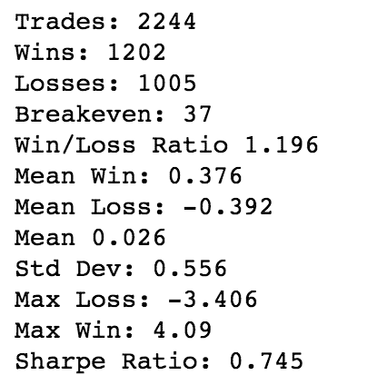

# 第七章：使用机器学习预测股市

最近，我正在阅读一篇文章，描述了一种特定治疗方法在抗击**耐甲氧西林金黄色葡萄球菌**（**MRSA**）超级细菌方面取得的巨大成功。如果你没有直接听说过 MRSA，你很可能听说过我们即将面临一个时代——我们的抗生素将不再有效的担忧。这在很大程度上是一个不可避免的现象，因为某些细菌群体在基因上对相关药物具有更强的抵抗力。当易感药物的细菌在治疗过程中被消灭时，剩下的耐药性细菌就会繁殖并成为群体中占主导地位的变种。为了应对这种情况，科学家们不断推动科学的边界，寻找新的方法来抗击这些细菌。

在生物学中，这种情况被称为**红皇后竞赛**：这个术语来源于路易斯·卡罗尔的*《镜中奇遇记》*中的一句话：

“现在，看看，这里，你看，得跑得越快，才能保持在原地。”

这有效地描述了我们在抗生素领域所面临的状况，但或许答案不在于转向新的、更先进的药物。或许答案在于理解正在起作用的更大周期，并利用它为我们所用。

我之前讨论的那个针对 MRSA 的新治疗方法？实际上来自一本 10^(th)世纪的医学药方书，名为**巴尔德的引血书**。书中列举的成分包括大蒜、酒和洋葱。这种组合的效果超越了我们当前的最后治疗手段——**万古霉素**。

但这一切和预测股市有什么关系呢？我想建议的是，这两种情况中正好存在着同样的现象。例如，时不时会有一篇论文发布，警告金融界某种现象的存在，而这种现象是一种有利可图的异常现象。很可能，这种现象是某些外部强加的、现实世界的约束所带来的下游效应。

以年底税务亏损销售为例。由于税法的性质，交易者在年底卖出亏损的股票是有意义的。这会对亏损股票在年底施加下行压力。然后，股价的下跌意味着这些股票可能被低于其公允价值的价格折扣出售。这也意味着，到了 1 月，原本的下行压力消失，取而代之的是上涨的压力，因为新资金开始投资于这些被低估的资产。但一旦这一现象被广泛传播，交易者就会试图走在前面，在 12 月末开始买入这些股票，并卖给那些预计会在 1 月成为买家的其他交易者。新的交易者进入市场后，实际上稀释了这一效应。他们减轻了年底的卖压，并降低了 1 月的买压。这个效应本质上被套利掉了，连同盈利一同消失。曾经有效的策略不再有效，交易者将开始放弃这种策略，转向下一个新的机会。

到现在为止，我希望你已经开始看到这些相似之处。大蒜、葡萄酒和洋葱的组合可能曾是一个非常有效的抗菌疗法，但随着细菌的适应，它逐渐失去了效力。由于很久以前这种治疗方法已被废弃，细菌也没有理由避免那些使它们对这种治疗敏感的原始基因。现实世界中的一些限制使得这些类型的循环几乎不可避免——无论是在生物体中还是在市场中。关键是如何利用这一点来为我们所用。

在本章中，我们将花一些时间讨论如何建立和测试交易策略。然而，我们将花更多的时间讨论如何*不*这样做。在尝试设计你自己的系统时，有无数的陷阱需要避免，而这几乎是一项不可能完成的任务，但它可以非常有趣，有时甚至能带来盈利。话虽如此，千万不要做出那些你无法承受的亏损的愚蠢决定。

如果你决定用这里学到的任何知识进行交易，你得自己承担风险。这不应被视为任何形式的投资建议，我对你的行为不承担任何责任。

在本章中，我们将涵盖以下主题：

+   市场分析的类型

+   研究告诉我们关于股市的什么信息？

+   如何开发交易系统

# 市场分析的类型

让我们从讨论一些金融市场分析时的关键术语和分析方法开始。虽然金融工具种类繁多，包括股票、债券、ETF、货币和掉期，但我们将把讨论限定在股票和股市上。股票只是公众公司所有权的一个部分份额。当公司未来前景上升时，股票价格预计会增加，而当这些前景下滑时，股票价格则会下降。

投资者通常会分为两大阵营。第一类是基本面分析师。这些分析师仔细研究公司的财务数据，寻找表明市场在某种程度上低估公司股票的信息。这些投资者会关注各种因素，如收入、盈利、现金流以及这些值的各种比率。这通常涉及将一家公司财务与另一家公司进行对比。

第二类投资者是技术分析师。技术分析师认为，股票价格已经反映了所有公开的可得信息，而研究基本面分析基本上是浪费时间。他们认为，通过观察历史价格—股票图表—可以看出价格上涨、下跌或停滞的区域。一般来说，他们认为这些图表揭示了投资者心理的线索。

两种类型的投资者有一个共同点，那就是他们都相信正确的分析能够带来利润。但这是正确的吗？

# 研究告诉我们关于股市的什么信息？

过去 50 年中，或许最有影响力的股市理论就是有效市场假说。这个理论由尤金·法马（Eugene Fama）提出，规定市场是理性的，所有可得的信息都已恰当反映在股价中。因此，投资者不可能在风险调整后的基础上持续*战胜市场*。有效市场假说通常被讨论为有三种形式：弱型形式、半强型形式和强型形式：

1.  在弱型形式下，市场是有效的，因为你无法利用价格的过去信息来预测未来的价格。信息会相对较快地反映在股票中，虽然技术分析无效，但在某些情况下，基本面分析可能是有效的。

1.  在半强型形式下，价格会立即以公正的方式反映所有相关的公共新信息。在这种情况下，技术分析和基本面分析都不会有效。

1.  最终，在强型形式下，股票价格反映所有的公共和私人信息。

根据这些理论，通过利用市场中的模式来赚钱并没有太大希望。但幸运的是，尽管整体市场运作效率较高，但仍然有一些效率低下的独立领域被发现。这些低效领域大多数都是短暂的，但也有一些被证明是持续存在的。即便按照法马的说法，其中最值得注意的一点就是动量策略的超常表现。

# 那么，动量策略究竟是什么呢？

这个主题有许多变化，但基本的思路是根据股票在一段时间内的回报将其从高到低排序。排名靠前的股票被购买并持有一段时间，之后在固定的持有期过后，重复这一过程。一个典型的只做多的动量策略可能包括购买过去一年在标准普尔 500 指数中表现最好的 25 只股票，持有一年后卖出，然后再重复这一过程。

这听起来可能是一个过于简单的策略，确实如此，但它始终如一地产生了出人意料的结果。那么，为什么呢？正如你可以想象的那样，许多研究已经探讨了这一现象，假设是人类在处理新信息时存在某种固有的系统性偏差。研究表明，人们在短期内对新闻反应不足，而在长期内则反应过度。这意味着，当股票因极好的新闻开始上涨时，投资者并没有完全将股价提升到能够完全反映这些新闻的水平；他们需要一些时间才能适应并将这种乐观情绪纳入考量。

投资者未能在面对极好新闻时充分重新定价股票的倾向，可能是由一种广为记录的偏差——**锚定效应**——所导致的。实际上，当呈现给我们一个数字，即使是一个随机数字，然后要求我们估计一个现实世界的值（比如非洲的国家数量），我们的答案会在心理上被固定在我们最初接收到的那个数字上。值得注意的是，即使我们知道这个数字是随机生成的，并与问题无关，这种情况依然发生。

那么，随着越来越多的交易者了解这一策略并纷纷加入，动量策略是否会被套利消除呢？近年来确实有一些证据表明这一点，但仍然不清楚。无论如何，这一效应确实存在，并且持续的时间远远超出了目前有效市场假说能够解释的范围。因此，至少似乎存在一些市场预测的希望。考虑到这一点，让我们接下来探讨如何挖掘我们自己的市场异常。

# 如何开发一个交易策略

我们将从技术层面开始策略开发。让我们来看看过去几年的标准普尔 500 指数。我们将使用`pandas`导入我们的数据。这将让我们访问多个股票数据源，包括 Yahoo！和 Google。

1.  首先，你需要安装数据读取器：

```py
!pip install pandas_datareader 
```

1.  然后，继续加入你的导入语句：

```py
import pandas as pd 
from pandas_datareader import data, wb 
import matplotlib.pyplot as plt 

%matplotlib inline 
pd.set_option('display.max_colwidth', 200) 
```

1.  现在，我们将获取`SPY` ETF 的数据，该 ETF 代表标准普尔 500 指数中的股票。我们将提取 2010 年初至 2018 年 12 月的数据：

```py
import pandas_datareader as pdr 

start_date = pd.to_datetime('2010-01-01') 
stop_date = pd.to_datetime('2018-12-01') 

spy = pdr.data.get_data_yahoo('SPY', start_date, stop_date) 
```

这段代码生成以下输出：


1.  现在，我们可以绘制我们的数据了。我们将只选择收盘价：

```py
spy_c = spy['Close'] 

fig, ax = plt.subplots(figsize=(15,10)) 
spy_c.plot(color='k') 
plt.title("SPY", fontsize=20); 
```

1.  这将生成以下输出：


在前面的图表中，我们看到的是我们选择的期间内，标准普尔 500 指数每日收盘价的价格图。

# 数据分析

让我们进行一些分析，看看如果我们投资了这个 ETF，这段时间的回报会是什么样：

1.  我们将首先提取`first_open`的数据：

```py
first_open = spy['Open'].iloc[0] 
first_open 
```

这将生成以下输出：


1.  接下来，让我们获取该期间最后一天的收盘价：

```py
last_close = spy['Close'].iloc[-1] 
last_close 
```

这将生成以下输出：


1.  最后，我们来看一下整个时期内的变化：

```py
last_close - first_open 
```

这将生成以下输出：


所以，看起来在该期间开始时购买 100 股将花费大约 11,237 美元，而在该期间结束时，这 100 股的价值大约为 27,564 美元。这个交易将使我们在该期间内获得约 145%的收益。还不错。

现在我们来看一下同一时期内仅考虑日内涨幅的回报。这假设我们每天在开盘时买入股票，并在当天收盘时卖出：

```py
spy['Daily Change'] = pd.Series(spy['Close'] - spy['Open']) 
```

这将给我们每天从开盘到收盘的变化。让我们来看一下：

```py
spy['Daily Change'] 
```

这将生成以下输出：


现在让我们总计一下这段期间的变化：

```py
spy['Daily Change'].sum() 
```

这将生成以下输出：


如您所见，我们从超过 163 点的收益下降到了略高于 53 点的收益。哎呀！市场的收益中超过一半来自于期间的隔夜持有。

# 回报的波动性

隔夜回报优于日内回报，但波动性如何呢？回报总是以风险调整后的方式来评判的，因此我们来看看隔夜交易和日内交易在标准差上的对比。

我们可以使用 NumPy 来计算这个，方法如下：

```py
np.std(spy['Daily Change']) 
```

这将生成以下输出：


```py
spy['Overnight Change'] = pd.Series(spy['Open'] - spy['Close'].shift(1)) 

np.std(spy['Overnight Change']) 
```

这将生成以下输出：


因此，与日内交易相比，我们的隔夜交易不仅收益更高，而且波动性更低。但并非所有的波动性都是相同的。我们来比较一下两种策略下，跌日与涨日的平均变化：

```py
 spy[spy['Daily Change']<0]['Daily Change'].mean() 
```

这段代码生成了以下输出：


运行这个代码以分析涨日：

```py
 spy[spy['Overnight Change']<0]['Overnight Change'].mean() 
```

我们得到的输出如下：


再次看到，平均的下行波动性对于我们的隔夜交易策略要远低于日内交易策略。

# 每日回报

到目前为止，我们一直是从点数的角度来看的，但现在让我们来看一下日常回报。这将帮助我们将收益和亏损放入一个更现实的背景中。让我们为每种情况创建一个 pandas 系列：日常回报（收盘到收盘的变化）、日内回报和过夜回报：

```py
daily_rtn = ((spy['Close'] - spy['Close'].shift(1))/spy['Close'].shift(1))*100 

id_rtn = ((spy['Close'] - spy['Open'])/spy['Open'])*100 

on_rtn = ((spy['Open'] - spy['Close'].shift(1))/spy['Close'].shift(1))*100 
```

我们所做的就是使用 pandas 的 `.shift()` 方法，从前一天的系列中减去每个系列。例如，对于前面第一个系列，我们将每天的收盘价与前一天的收盘价相减。这将导致少一个数据点。如果你打印出新的系列，你可以看到如下内容：

```py
Daily_rtn 
```

这会生成以下输出：


# 各策略的统计数据

现在让我们来看一下这三种策略的统计数据。我们将创建一个函数，可以接收每一组回报数据，并打印出总结结果。我们将获取每个盈利、亏损和持平交易的统计数据，还有一个叫做**夏普比率**的东西。我之前说过，回报是基于风险调整来评估的；这正是夏普比率所提供的；它是一种通过考虑回报波动性来比较回报的方法。在这里，我们使用经过调整的夏普比率来年化比率：

```py
def get_stats(s, n=252): 
    s = s.dropna() 
    wins = len(s[s>0]) 
    losses = len(s[s<0]) 
    evens = len(s[s==0]) 
    mean_w = round(s[s>0].mean(), 3) 
    mean_l = round(s[s<0].mean(), 3) 
    win_r = round(wins/losses, 3) 
    mean_trd = round(s.mean(), 3) 
    sd = round(np.std(s), 3) 
    max_l = round(s.min(), 3) 
    max_w = round(s.max(), 3) 
    sharpe_r = round((s.mean()/np.std(s))*np.sqrt(n), 4) 
    cnt = len(s) 
    print('Trades:', cnt,\ 
          '\nWins:', wins,\ 
          '\nLosses:', losses,\ 
          '\nBreakeven:', evens,\ 
          '\nWin/Loss Ratio', win_r,\ 
          '\nMean Win:', mean_w,\ 
          '\nMean Loss:', mean_l,\ 
          '\nMean', mean_trd,\ 
          '\nStd Dev:', sd,\ 
          '\nMax Loss:', max_l,\ 
          '\nMax Win:', max_w,\ 
          '\nSharpe Ratio:', sharpe_r) 
```

现在让我们运行每个策略，看看统计数据。我们将从买入并持有策略（每日回报）开始，然后依次处理其他两个策略，如下所示：

```py
get_stats(daily_rtn) 
```

这会生成以下输出：


运行以下代码来计算日内回报：

```py
get_stats(id_rtn) 
```

这会生成以下输出：


运行以下代码来计算过夜回报：

```py
get_stats(on_rtn) 
```

这会生成以下输出：



如你所见，买入并持有策略具有三种策略中最高的平均回报和最高的标准差。它还拥有最大的日内最大回撤（亏损）。你还会注意到，尽管仅限过夜策略的平均回报高于日内策略，但它的波动性要小得多。这反过来使得它的夏普比率高于日内策略。

到目前为止，我们已经有了一个坚实的基准来比较我们未来的策略。现在，我将告诉你一个能够轻松击败这三种策略的策略。

# 神秘策略

现在让我们来看一下这个新神秘策略的统计数据：


通过这个策略，我基本上将夏普比率从买入并持有策略的水平提高了一倍，大幅降低了波动性，增加了最大盈利，并显著降低了最大亏损。

那么，我是如何设计出这个超越市场的策略的呢？等等... 我是通过生成 5000 个随机的过夜信号，并挑选出最好的一个来做到的。

显然，这不是击败市场的方法。那么，我为什么这么做呢？是为了演示，如果你测试足够多的策略，仅凭随机机会，你会碰到一个看似非常优秀的数字。这就是所谓的**数据挖掘谬误**，它是交易策略开发中的一个实际风险。这也是为什么找到一个与现实世界投资者偏见和行为相匹配的策略是如此重要。如果你想在交易中占有优势，你不是在交易市场，你是在交易那些交易市场的人。*。

因此，优势来自于深思熟虑地理解人们在某些情况下可能做出的错误反应。

现在，让我们扩展分析。首先，我们将提取从 2000 年开始的指数数据：

```py
start_date = pd.to_datetime('2000-01-01') 
stop_date = pd.to_datetime('2018-12-01') 

sp = pdr.data.get_data_yahoo('SPY', start_date, stop_date) 
```

现在，让我们看看我们的图表：

```py
fig, ax = plt.subplots(figsize=(15,10)) 
sp['Close'].plot(color='k') 
plt.title("SPY", fontsize=20) 
```

这将生成以下输出：


这里，我们看到从 2000 年初到 2018 年 12 月 1 日`SPY`的价格走势。在此期间，市场经历了高度正面和高度负面的市场周期，波动非常大。

让我们为三种基本策略的新扩展期设置基准。

首先，让我们为每个设置变量：

```py
long_day_rtn = ((sp['Close'] - sp['Close'].shift(1))/sp['Close'].shift(1))*100 

long_id_rtn = ((sp['Close'] - sp['Open'])/sp['Open'])*100 

long_on_rtn = ((sp['Open'] - sp['Close'].shift(1))/sp['Close'].shift(1))*100 
```

现在，让我们看看每个的得分总计：

```py
(sp['Close'] - sp['Close'].shift(1)).sum() 
```

这将生成以下输出：


现在，让我们看看从开盘到收盘的得分总计：

```py
(sp['Close'] - sp['Open']).sum() 
```

这将生成以下输出：


现在，让我们看看从收盘到开盘的得分总计：

```py
(sp['Open'] - sp['Close'].shift(1)).sum() 
```

这将生成以下输出：


现在让我们看看每个的统计数据：

```py
get_stats(long_day_rtn) 
```

这将生成以下输出：


现在，让我们看看盘中回报的统计数据：

```py
get_stats(long_id_rtn) 
```

这将生成以下输出：


现在，让我们看看隔夜回报的统计数据：

```py
get_stats(long_on_rtn) 
```

这将生成以下输出：


我们可以看到，在较长的时间段内，三者之间的差异更加显著。如果你在过去 18 年只在白天持有这个 S&P ETF，你将会亏钱。如果你只在隔夜持有，你的总点数回报将提高超过 18%！显然，这假设没有交易成本和税费，并且有完美的成交，但无论如何，这都是一个显著的发现。

# 构建回归模型

现在我们有了对比的基准，接下来我们将构建我们的第一个回归模型。我们将使用一个非常基础的模型，只利用股票的前一个收盘值来预测第二天的收盘，并使用支持向量回归来构建它。那么，让我们开始设置模型：

1.  第一步是设置一个包含每日价格历史的 DataFrame。我们将在模型中包括过去 20 个收盘数据：

```py
for i in range(1, 21, 1): 
    sp.loc[:,'Close Minus ' + str(i)] = sp['Close'].shift(i) 

sp20 = sp[[x for x in sp.columns if 'Close Minus' in x or x == 'Close']].iloc[20:,] 

sp20 
```

1.  这段代码给出了每一天的收盘价，以及之前的 20 天数据，所有数据都在同一行。我们的代码结果如下所示：


1.  这将形成我们将输入到模型中的*X*数组。但在我们准备好之前，还需要一些额外的步骤。

1.  首先，我们将反转我们的列，使时间从左到右排列：

```py
sp20 = sp20.iloc[:,::-1] 

sp20 
```

这生成了以下输出：


1.  现在，让我们导入支持向量机并设置我们的训练和测试矩阵及向量：

```py
from sklearn.svm import SVR 
clf = SVR(kernel='linear') 

X_train = sp20[:-2000] 
y_train = sp20['Close'].shift(-1)[:-2000] 

X_test = sp20[-2000:] 
y_test = sp20['Close'].shift(-1)[-2000:] 
```

1.  我们只有 5,000 个数据点可供使用，所以我选择了最后 2,000 个数据点作为测试集。现在让我们拟合我们的模型，并使用它来检查样本外数据：

```py
model = clf.fit(X_train, y_train) 

preds = model.predict(X_test) 
```

1.  现在我们有了预测结果，让我们将它们与实际数据进行比较：

```py
tf = pd.DataFrame(list(zip(y_test, preds)), columns=['Next Day Close', 'Predicted Next Close'], index=y_test.index) 

tf 
```

上面的代码生成了以下输出：


# 模型的表现

现在让我们看看我们模型的表现。如果预测的收盘价高于开盘价，我们将买入次日的开盘价。然后，我们将在当天的收盘时卖出。为了计算我们的结果，我们需要向数据框中添加一些额外的数据点，具体如下：

```py
cdc = sp[['Close']].iloc[-1000:] 
ndo = sp[['Open']].iloc[-1000:].shift(-1) 

tf1 = pd.merge(tf, cdc, left_index=True, right_index=True) 
tf2 = pd.merge(tf1, ndo, left_index=True, right_index=True) 
tf2.columns = ['Next Day Close', 'Predicted Next Close', 'Current Day Close', 'Next Day Open'] 

tf2 
```

这生成了以下输出：


这里我们将添加以下代码，以获取我们的信号和该信号的盈亏：

```py
def get_signal(r): 
    if r['Predicted Next Close'] > r['Next Day Open']: 
        return 1 
    else: 
        return 0 

def get_ret(r): 
    if r['Signal'] == 1: 
        return ((r['Next Day Close'] - r['Next Day Open'])/r['Next Day Open']) * 100 
    else: 
        return 0 

tf2 = tf2.assign(Signal = tf2.apply(get_signal, axis=1)) 
tf2 = tf2.assign(PnL = tf2.apply(get_ret, axis=1)) 

tf2 
```

这生成了以下输出：


现在让我们看看，仅凭价格历史，我们是否能够成功预测次日的价格。我们将从计算收益点数开始：

```py
(tf2[tf2['Signal']==1]['Next Day Close'] - tf2[tf2['Signal']==1]['Next Day Open']).sum() 
```

这生成了以下输出：


哎呀！看起来很糟糕。但是我们测试的那一段时间呢？我们从未单独评估过它。我们的基本日内策略在过去 2,000 天内生成了多少点数：

```py
(sp['Close'].iloc[-2000:] - sp['Open'].iloc[-2000:]).sum() 
```

这生成了以下输出：


看起来我们的策略非常糟糕。让我们比较一下两者。

首先是该时期的基本日内策略：

```py
get_stats((sp['Close'].iloc[-2000:] - sp['Open'].iloc[-2000:])/sp['Open'].iloc[-2000:] * 100) 
```

这生成了以下输出：


现在是我们模型的结果：

```py
get_stats(tf2['PnL']) 
```

这生成了以下输出：


很明显，我们的策略并不是我们想要实现的策略。我们如何改进现有的策略呢？如果我们修改我们的交易策略会怎样？如果我们只选择那些预期上涨 1 点或以上的交易，而不仅仅是任何大于开盘价的交易呢？这会有帮助吗？让我们试试。我们将使用修改后的信号重新运行策略，如下所示的代码块：

```py
def get_signal(r): 
    if r['Predicted Next Close'] > r['Next Day Open'] + 1: 
        return 1 
    else: 
        return 0 

def get_ret(r): 
    if r['Signal'] == 1: 
        return ((r['Next Day Close'] - r['Next Day Open'])/r['Next Day Open']) * 100 
    else: 
        return 0 

tf2 = tf2.assign(Signal = tf2.apply(get_signal, axis=1)) 
tf2 = tf2.assign(PnL = tf2.apply(get_ret, axis=1)) 

(tf2[tf2['Signal']==1]['Next Day Close'] - tf2[tf2['Signal']==1]['Next Day Open']).sum() 
```

这生成了以下输出：


现在是统计数据：

```py
get_stats(tf2['PnL']) 
```

这生成了以下输出：


我们的情况变得越来越糟。看起来，如果过去的价格历史暗示未来会有好结果，你实际上可以预期恰恰相反。我们似乎开发了一个反向指标。那如果我们探索一下这个呢？让我们看看如果我们将模型反转，当我们预测强劲的涨幅时，我们不交易，而其他情况下我们进行交易，结果会如何：

```py
def get_signal(r): 
    if r['Predicted Next Close'] > r['Next Day Open'] + 1: 
        return 0 
    else: 
        return 1 

def get_ret(r): 
    if r['Signal'] == 1: 
        return ((r['Next Day Close'] - r['Next Day Open'])/r['Next Day Open']) * 100 
    else: 
        return 0 

tf2 = tf2.assign(Signal = tf2.apply(get_signal, axis=1)) 
tf2 = tf2.assign(PnL = tf2.apply(get_ret, axis=1)) 

(tf2[tf2['Signal']==1]['Next Day Close'] - tf2[tf2['Signal']==1]['Next Day Open']).sum() 
```

这会生成以下输出：


让我们获取我们的统计数据：

```py
get_stats(tf2['PnL']) 
```

这会生成以下输出：


看起来我们确实有一个反向指标。当我们的模型预测第二天强劲的涨幅时，市场表现明显不佳，至少在我们的测试期间是这样。这个结论在大多数情况下成立吗？不太可能。市场往往会从均值回归的状态转变为趋势持续的状态。

到此为止，我们可以对这个模型做出一些扩展。我们甚至没有涉及使用技术指标或基本面数据，也将我们的交易限制为一天内完成。所有这些都可以调整和扩展，但有一个我们还没有涉及的重要点，必须提及。

我们正在处理的数据是一种特殊类型，称为**时间序列数据**。时间序列数据需要特殊处理以正确建模，因为它通常违反了统计建模所需的假设，如恒定的均值和方差。

错误地处理时间序列数据的一个后果是，误差度量会给出极其不准确的结果。由于存在显著的自相关，换句话说，下一个周期的数据与当前周期的数据高度相关，因此看起来我们的预测比实际情况要好得多。

为了解决这些问题，时间序列数据通常会被**差分**（在股市数据中，这意味着我们查看的是每日变化，而不是指数的绝对值），以使其变为我们所谓的**平稳**数据；也就是说，数据具有恒定的均值和方差，并且没有显著的自相关。

如果你打算继续处理时间序列数据，我强烈建议你更详细地研究这些概念。

# 动态时间规整

接下来，我想介绍另一个使用完全不同算法的模型。这个算法叫做**动态时间规整**。它的作用是给出一个度量，表示两个时间序列之间的相似性：

1.  为了开始，我们需要通过`pip install`安装`fastdtw`库：

```py
!pip install fastdtw 
```

1.  安装完成后，我们将导入需要的其他库：

```py
from scipy.spatial.distance import euclidean 
from fastdtw import fastdtw 
```

1.  接下来，我们将创建一个函数，接受两个序列并返回它们之间的距离：

```py
def dtw_dist(x, y): 
    distance, path = fastdtw(x, y, dist=euclidean) 
    return distance 
```

1.  现在，我们将把 18 年的时间序列数据分成不同的五天周期。我们将每个周期与一个额外的点配对。这将用于创建我们的*x*和*y*数据，具体如下：

```py
tseries = [] 
tlen = 5 
for i in range(tlen, len(sp), tlen): 
    pctc = sp['Close'].iloc[i-tlen:i].pct_change()[1:].values * 100 
    res = sp['Close'].iloc[i-tlen:i+1].pct_change()[-1] * 100 
    tseries.append((pctc, res)) 
```

1.  我们可以查看我们的第一个序列，了解数据的样子：

```py
tseries[0] 
```

这将生成以下输出：


1.  现在我们有了每个系列，我们可以通过我们的算法将它们与其他所有系列进行比对，计算每个系列与其他系列的距离度量：

```py
dist_pairs = [] 
for i in range(len(tseries)): 
    for j in range(len(tseries)): 
        dist = dtw_dist(tseries[i][0], tseries[j][0]) 
        dist_pairs.append((i,j,dist,tseries[i][1], tseries[j][1])) 
```

一旦我们得到这些，我们可以将其放入一个`DataFrame`。我们将删除距离为`0`的系列，因为它们代表相同的系列。我们还将按系列的日期进行排序，并只查看那些第一个系列出现在第二个系列之前的情况，按照时间顺序：

```py
dist_frame = pd.DataFrame(dist_pairs, columns=['A','B','Dist', 'A Ret', 'B Ret']) 

sf = dist_frame[dist_frame['Dist']>0].sort_values(['A','B']).reset_index(drop=1) 

sfe = sf[sf['A']<sf['B']] 
```

最后，我们将限制交易距离小于`1`并且第一个系列有正回报的情况：

```py
winf = sfe[(sfe['Dist']<=1)&(sfe['A Ret']>0)] 

winf 
```

这将生成以下输出：


让我们看看我们最顶尖的一个模式（A:6 和 B:598）绘制出来是什么样子的：

```py
plt.plot(np.arange(4), tseries[6][0]); 
```

上述代码生成了以下输出：


现在，我们来绘制第二个：

```py
plt.plot(np.arange(4), tseries[598][0]) 
```

上述代码生成了以下输出：


如你所见，这些曲线几乎完全相同，这正是我们所期望的。我们将尝试找到所有有正向次日收益的曲线，然后，一旦我们找到一条与这些盈利曲线高度相似的曲线，我们就会购买它，期待再次获得收益。

# 评估我们的交易

现在，让我们构建一个函数来评估我们的交易。我们将购买相似的曲线，除非它们未能产生正向回报。如果发生这种情况，我们将把它们剔除，代码如下：

```py
excluded = {} 
return_list = [] 
def get_returns(r): 
    if excluded.get(r['A']) is None: 
        return_list.append(r['B Ret']) 
        if r['B Ret'] < 0: 
            excluded.update({r['A']:1}) 

winf.apply(get_returns, axis=1); 
```

现在我们已经将所有交易的回报存储在`return_list`中，接下来让我们评估一下结果：

```py
get_stats(pd.Series(return_list)) 
```

这将生成以下输出：


这些结果是我们迄今为止看到的最好的。盈亏比和均值都远高于其他模型。看起来我们在这个新模型上可能有所突破，尤其是与我们之前看到的其他模型相比。

此时，为了进一步验证我们的模型，我们应通过检视其他时间段来考察其稳健性。延长四天的时间跨度是否能改进模型？我们是否应该总是排除那些产生亏损的模式？此时有大量问题需要探讨，但我将把这些作为留给读者的练习。

# 总结

在这一章中，我们探讨了股市的内部运作，并探索了多种在交易策略中应用机器学习的方法。毫无疑问，本章的内容本身就足以填满一本书。我们甚至没有涵盖一些最重要的交易方面，比如投资组合构建、风险缓解和资金管理。这些都是任何策略中至关重要的组成部分，甚至可能比交易信号更为重要。

希望这能成为你自己探索的起点，但再次提醒你，*战胜市场*几乎是一个不可能的游戏——你将与世界上最聪明的头脑竞争。如果你决定尝试，祝你好运。只要记住，如果结果不如你所愿，我已经提醒过你！
