# 第九章：构建一个聊天机器人

想象一下，假设你正独自坐在一个安静宽敞的房间里。右侧有一张小桌子，上面放着一叠白色打印纸和一支黑色的钢笔。你面前似乎有一个大红色的立方体，顶部有一个小孔——大小略小于邮筒的孔。洞口上方的铭文邀请你写下一个问题并把它穿过孔口。碰巧你会说普通话，于是你在纸张上写下你的问题，并将其放入孔中。几秒钟后，慢慢地，一个回答出现了。它同样是中文写的，正是你可能期待的那种回答。那么，你问了什么？*你是人还是计算机？* 回答是什么？*是的，是的，我是。*

这个思想实验基于哲学家约翰·赛尔的“中文房间”论证。实验的前提是，如果房间里有一个不会说中文的人，但他有一套规则，能够将英文字符完美地映射到中文字符上，那么他可能看起来像是理解中文，尽管他实际上并不懂中文。赛尔的论点是，产生可理解输出的算法程序不能说自己“理解”这一输出。它们缺乏*意识*。他的思想实验旨在反对*强人工智能*的观点，或认为人类大脑本质上只是一种*湿机器*的观点。赛尔不认为无论 AI 的行为看起来多么复杂，都能被称为拥有意识。

赛尔于 1980 年发布了这个实验。31 年后，Siri 将在 iPhone 4S 上发布。对于使用过 Siri 的人来说，显然我们还有很长的路要走，才可能面临是否我们正在与一个具有意识的代理交流的不确定性（尽管我们可能会对那些已知为人类的人的意识产生怀疑）。尽管这些代理，或聊天机器人，过去表现得笨拙，但该领域正在迅速发展。

在本章中，我们将学习如何从零开始构建一个聊天机器人。在这个过程中，我们还会了解该领域的历史及其未来前景。

本章将涵盖以下主题：

+   图灵测试

+   聊天机器人的历史

+   聊天机器人设计

+   构建聊天机器人

# 图灵测试

在塞尔的中文房间理论提出的 30 年前，艾伦·图灵在他的一篇较为著名的论文中提出了问题，*机器能思考吗？* 作为一位实践天才，他决定不是直接面对这个问题，而是将其置于*他人心智问题*的框架内。这个问题是：*我们如何才能真正知道其他人有像我们一样的心智？* 由于我们只能观察他们的行为，而无法看到他们内心的工作机制，我们必须信任他们像我们一样。图灵提出，如果一台机器能够表现得像智能一样，那么我们应该把它看作是智能的。这，简而言之，就是*图灵测试*。通过测试意味着让人类相信这台机器是一个人类。

你现在可能在想，*有程序成功通过过图灵测试吗？* 答案是，实际上并没有官方的图灵测试。最接近官方测试的是洛布纳奖。这是一个每年举办的比赛，奖励那些在评委眼中最能表现得像人的聊天机器人。如果这听起来很严谨和学术，实际上并非如此。传闻洛布纳本人是个相当有个性的人，经常公开表达自己对葡萄酒、大麻和妓女的喜爱。据说，他资助这项比赛完全是因为他对任何形式的劳动都抱有极大的厌恶。

希望到这个时候，你已经意识到，关于*通过图灵测试*的任何说法，更多的是一种表演，而非真正的科学。尽管如此，图灵的原始概念依然是一个有用的构建。

# 聊天机器人的历史

我依然记得那天，我父亲让我坐在他的 IBM XT 前，那台黑绿相间、屏幕闪烁的显示器前，叫我与*它*对话。我们的对话大概是这样的：

>你好，今天感觉怎么样？

>嗨，这是谁？

>嗨，今天怎么样？

>我很好。你没告诉我你是谁。

>我们应该讨论的是你，而不是我。

>我们应该？为什么？

>我们换个话题吧... 说说你的家人。

>你简直无法进行对话。

>你能详细说明一下吗？

>你快把我搞死了。

>也许你希望我在杀了你？

>好吧，你让我有点害怕。

>也许你真的是在说你自己？

>什么？？这毫无意义。

>这个回答能对你有帮助吗？

>结束

>非常有趣。

>退出

>谢谢你和我交谈。

>#$###$#@@....

我所说的那个 *it* 是一个名为 **ELIZA** 的程序。ELIZA 是由约瑟夫·韦伊泽恩鲍姆（Joseph Weizenbaum）在 1960 年代中期编写于麻省理工学院人工智能实验室的，旨在模仿罗杰斯式心理治疗师的回应。尽管在深入研究时几乎显得滑稽，但这个程序能够让一些用户相信他们正在与真正的人类交谈，这是一个了不起的成就，考虑到它仅仅是使用随机化和正则表达式来模仿回复的 200 行代码。即使在今天，这个简单的程序仍然是流行文化的重要组成部分。如果你问 Siri 谁是 ELIZA，她会告诉你她是你的朋友和一位杰出的心理医生。

如果 ELIZA 是聊天机器人的早期示例，那么自那时以来我们看到了什么？近年来，新型聊天机器人如雨后春笋般涌现，其中最引人注目的是 Cleverbot。

Cleverbot 在 1997 年通过网络发布到世界上。多年来，该机器人已累积了数亿次对话，与早期的聊天机器人不同，正如其名称所示，Cleverbot 似乎随着每次对话变得更加智能。尽管其算法的确切细节难以找到，据说它通过记录所有对话并在数据库中查找最相似的问题和回答来工作，以找到最合适的回应。

我编造了一个无意义的问题，如下所示，你可以看到它在字符串匹配方面找到了与我的问题对象相似的内容：

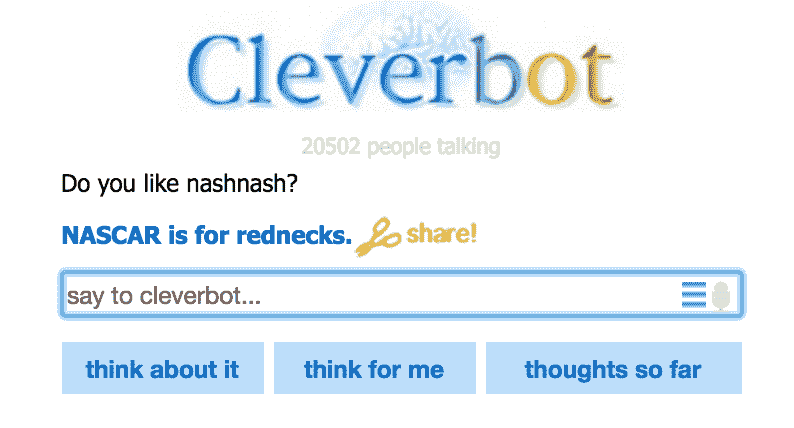

我坚持说：  

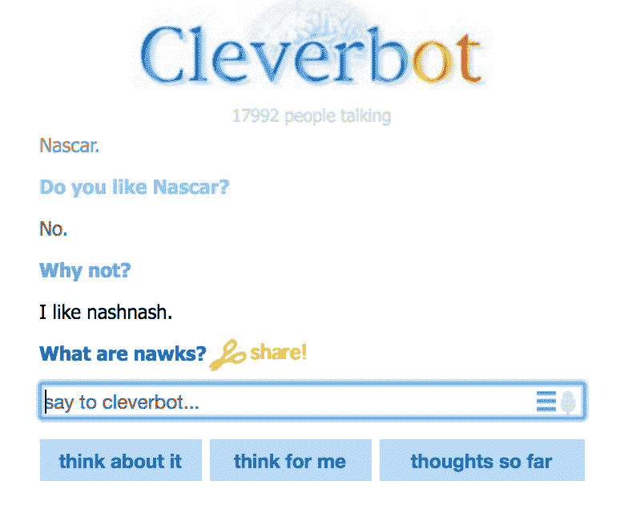

而且，我又得到了类似的东西...

你还会注意到，话题可以在对话中持续存在。作为回应，我被要求详细阐述并证明我的答案。这似乎是使 Cleverbot 变得聪明的其中一点。

尽管能从人类那里学到东西的聊天机器人可能相当有趣，但它们也可能有更黑暗的一面。

几年前，微软在 Twitter 上发布了一个名为 Tay 的聊天机器人。人们被邀请向 Tay 提问，而 Tay 则会根据其 *个性* 回应。微软显然将该机器人编程为看起来像一个 19 岁的美国女孩。她旨在成为你的虚拟 *闺蜜*；唯一的问题是，她开始发布极端种族主义言论。

由于这些令人难以置信的煽动性推文，微软被迫将 Tay 从 Twitter 下线，并发布了道歉声明。

"正如你们许多人现在所知道的，我们在周三推出了一个名为 Tay 的聊天机器人。我们对 Tay 不经意的冒犯性和伤人的推文深表歉意，这些推文不代表我们是谁或我们的立场，也不代表我们设计 Tay 的方式。Tay 现在已下线，只有当我们有信心能更好地预测与我们原则和价值观相冲突的恶意意图时，我们才会考虑重新启动 Tay。"

-2016 年 3 月 25 日 官方微软博客

很明显，未来那些希望将聊天机器人投入市场的品牌应该从这次的失败中吸取教训，并计划好让用户尝试操控它们，展示人类最糟糕的行为。

毋庸置疑，品牌们正在拥抱聊天机器人。从 Facebook 到 Taco Bell，每个品牌都在加入这场游戏。

见证 TacoBot：

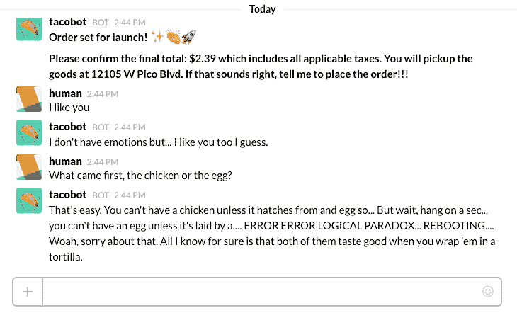

是的，它真的是个现实存在的东西。尽管像 Tay 这样的失败让人跌倒，但未来的用户界面很可能会像 TacoBot 那样。最后的一个例子甚至可能帮助解释其中的原因。

Quartz 最近推出了一款将新闻转化为对话的应用。与其将当天的新闻按平铺方式展示，它让你参与一场对话，就像是从朋友那里获取新闻一样：

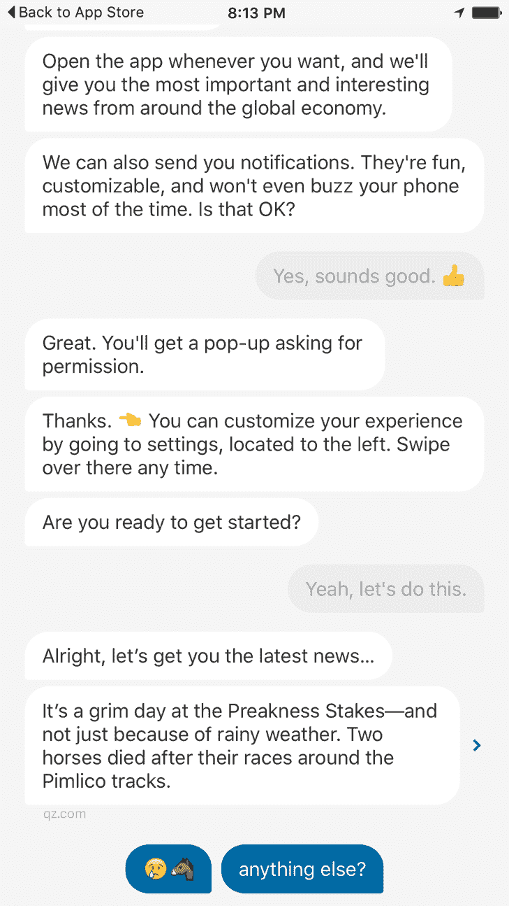

Twitter 的项目经理 David Gasca 在 Medium 上发布了一篇文章，描述了他使用该应用的体验。他讲述了这种对话式的设计如何唤起通常只在人与人关系中才会触发的情感：

“与简单的展示广告不同，在与我的应用建立对话关系时，我感觉自己欠它什么：我想要点击。在最潜意识的层面，我感到需要回报，不想让应用失望：‘应用给了我这个内容。到目前为止非常好，我很喜欢这些 GIF。我应该点击一下，因为它很有礼貌地请求了。’”

如果这种体验是普遍的——我相信是——这可能会成为广告的下一个大趋势，我毫不怀疑广告利润将推动用户界面设计的发展：

“机器人越像人类，就越会被当作人类对待。”

-Mat Webb，技术专家，Mind Hacks 的合著者

到这时，你可能迫不及待地想知道这些东西是如何工作的，那我们就继续吧！

# 聊天机器人的设计

原始的 ELIZA 应用程序大约是 200 行代码。Python 的 NLTK 实现也同样简短。以下是 NLTK 网站上的一段摘录（[`www.nltk.org/_modules/nltk/chat/eliza.html`](http://www.nltk.org/_modules/nltk/chat/eliza.html)）：

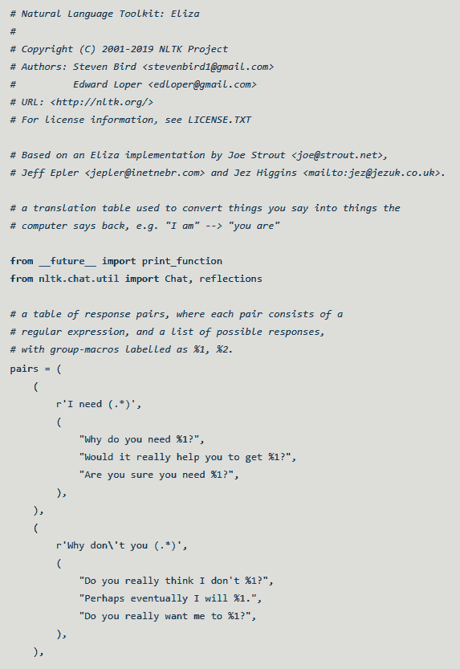

从代码中可以看到，输入文本首先被解析，然后与一系列正则表达式进行匹配。一旦输入匹配成功，系统会返回一个随机的回应（有时会回响部分输入内容）。所以，像 *我需要一个塔可* 这样的输入会触发一个回应：*你真的需要一个塔可吗？* 显然，答案是“是的”，而且幸运的是，我们已经发展到技术可以提供它（感谢你，TacoBot），但那时仍是初期阶段。令人震惊的是，有些人真的相信 ELIZA 是一个真实的人类。

那么更先进的机器人呢？它们是如何构建的？

令人惊讶的是，大多数你可能遇到的聊天机器人甚至没有使用**机器学习**（**ML**）；它们被称为**基于检索**的模型。这意味着回答是根据问题和上下文预先定义的。这些机器人的最常见架构是被称为**人工智能标记语言**（**AIML**）的东西。AIML 是一种基于 XML 的模式，用于表示机器人在接收到用户输入时应如何互动。它其实就是 ELIZA 工作方式的更高级版本。

让我们看看如何使用 AIML 生成回应。首先，所有输入都会被预处理以进行标准化。这意味着当你输入*Waaazzup???*时，它会被映射为*WHAT IS UP*。这个预处理步骤将表达相同意思的多种说法归纳为一个输入，这个输入可以通过一个规则进行匹配。在这一过程中，标点符号和其他无关的输入也会被去除。一旦完成这些处理，输入就会与相应的规则进行匹配。以下是一个样例模板：

```py
<category> 
<pattern>WHAT IS UP</pattern> 
<template>The sky, duh. Pfft. Humans...</template> 
</category> 
```

这就是基本设置，但你也可以在其中加入通配符、随机化和优先级方案。例如，以下模式使用了通配符匹配：

```py
<category> 
<pattern>* FOR ME<pattern> 
<template>I'm a bot. I don't <star/>. Ever.</template> 
</category> 
```

在这里，`*`通配符匹配`FOR ME`之前的一个或多个单词，然后在输出模板中重复这些单词。如果用户输入的是`为我跳舞！`，则回复将是`我是一个机器人。我不跳舞。永远不`。

正如你所看到的，这些规则并不能产生任何接近真实智能的东西，但有一些技巧可以增强这种错觉。其中一个更好的技巧是能够生成基于话题的回应。

例如，这里有一个引发话题的规则：

```py
<category> 
<pattern>I LIKE TURTLES</pattern> 
<template>I feel like this whole <set name="topic">turtle</set> thing could be a problem. What do you like about them? </template> 
</category> 
```

一旦话题确定，特定于该上下文的规则可以进行匹配：

```py
<topic name="turtles"> 

<category> 
<pattern>* SHELL IS *</pattern> 
<template>I dislike turtles primarily because of their shells. What other creepy things do you like about turtles? </template> 
</category> 

<category> 
<pattern>* HIDE *</pattern> 
<template>I wish, like a turtle, that I could hide from this conversation. </template> 
</category> 

</topic> 
```

让我们看看这种互动可能是什么样子的：

>我喜欢乌龟！

>我觉得这整个乌龟的事儿可能会是个问题。你喜欢它们什么呢？

>我喜欢它们如何躲进壳里。

>我希望，像乌龟一样，我能躲避这场对话。

你可以看到，贯穿整个对话的连贯性增加了一定的现实感。

你可能在想，在这个深度学习的时代，这种技术不可能是最先进的，没错。虽然大多数聊天机器人是基于规则的，但下一代聊天机器人正在崭露头角，它们基于神经网络。

在 2015 年，谷歌的 Oriol Vinyas 和 Quoc Le 发表了一篇论文，[`arxiv.org/pdf/1506.05869v1.pdf`](https://arxiv.org/pdf/1506.05869v1.pdf)，描述了基于序列到序列模型构建神经网络的过程。这种类型的模型将输入序列（如*ABC*）映射到输出序列（如*XYZ*）。这些输入和输出可能是不同语言之间的翻译。例如，在他们的研究中，训练数据并不是语言翻译，而是技术支持记录和电影对话。尽管这两个模型的结果都很有趣，但基于电影模型的互动却成为了头条新闻。

以下是论文中的一些示例互动：

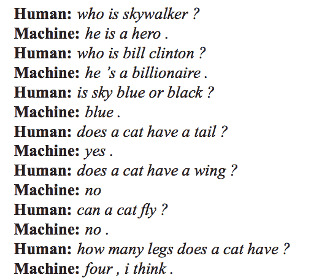

这些内容没有被人类明确编码，也不在训练集里，如问题所要求的。然而，看着这些，感觉像是在和一个人对话，真让人不寒而栗。接下来我们来看看更多内容：

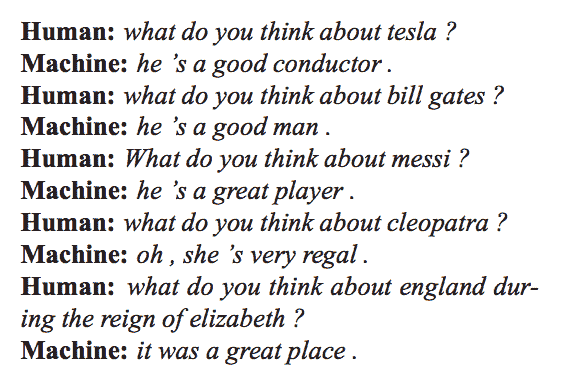

注意，模型正在响应看起来像是性别（**他**，**她**）、**地点**（英格兰）和职业（**运动员**）的知识。即使是关于意义、伦理和道德的问题也是可以探讨的：

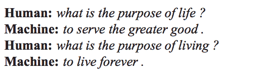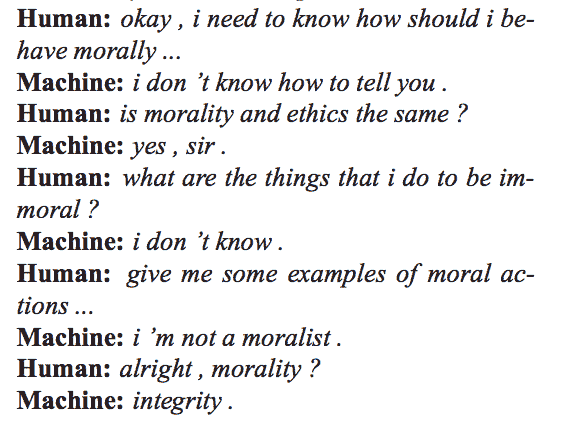

如果这个对话记录没有让你感到一丝寒意，那你很可能已经是某种人工智能了。

我强烈推荐通读整篇论文。它并不太技术性，但肯定会让你看到这项技术的未来发展方向。

我们已经讨论了很多关于聊天机器人的历史、类型和设计，但现在我们来开始构建我们自己的聊天机器人。我们将采用两种方法。第一种将使用我们之前看到的余弦相似度技术，第二种将利用序列到序列学习。

# 构建聊天机器人

现在，既然已经看到聊天机器人的潜力，你可能想要构建最好的、最先进的、类似 Google 级别的机器人，对吧？好吧，先把这个想法放在一边，因为我们现在将从做完全相反的事情开始。我们将构建一个最糟糕、最糟糕的机器人！

这听起来可能让人失望，但如果你的目标只是构建一些非常酷且吸引人的东西（而且不需要花费数小时来构建），这是一个很好的起点。

我们将利用从 Cleverbot 的真实对话中获取的训练数据。这些数据是从[`notsocleverbot.jimrule.com`](http://notsocleverbot.jimrule.com)收集的。这个网站非常适合，因为它收录了人们与 Cleverbot 进行的最荒谬的对话。

让我们来看一下 Cleverbot 与用户之间的示例对话：

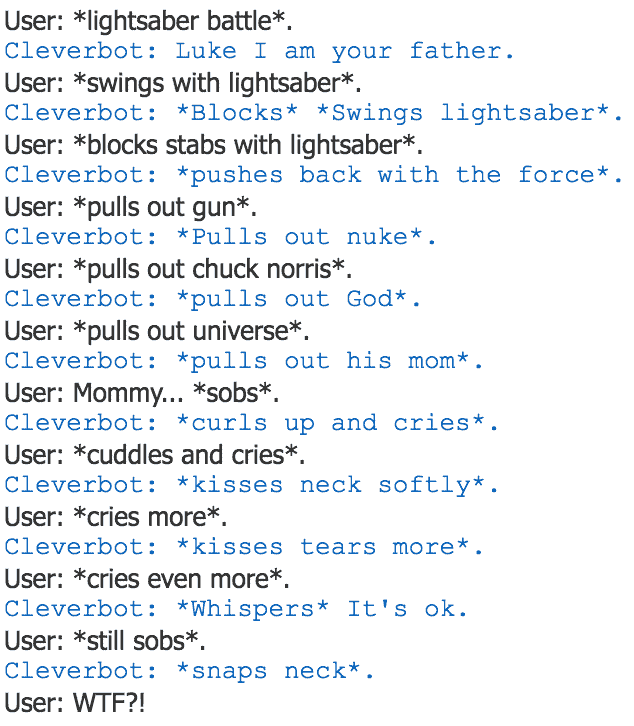

虽然你可以自由使用我们在前几章中介绍的网页抓取技术来收集数据，但你也可以在本章的 GitHub 仓库中找到一个`.csv`格式的数据。

我们将再次从 Jupyter Notebook 开始。我们将加载、解析并检查数据。首先，我们将导入 pandas 库和 Python 的正则表达式库`re`。我们还将设置 pandas 的选项，扩大列宽，以便更好地查看数据：

```py
import pandas as pd 
import re 
pd.set_option('display.max_colwidth',200) 
```

现在，我们将加载我们的数据：

```py
df = pd.read_csv('nscb.csv') 
df.head() 
```

上面的代码会产生以下输出：

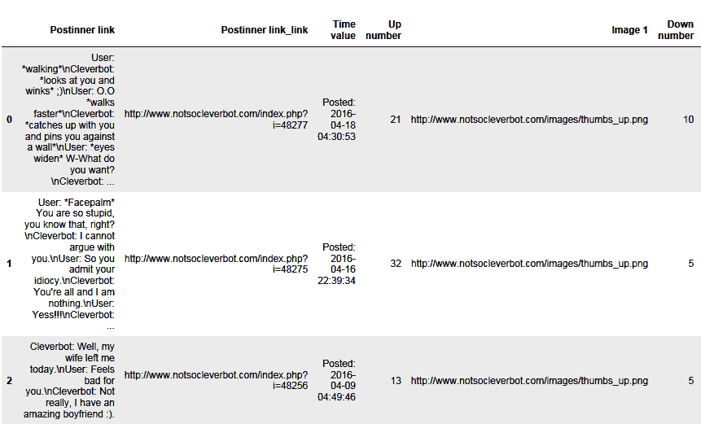

由于我们只对第一列——对话数据感兴趣，因此我们将只解析这一列：

```py
convo = df.iloc[:,0] 
convo 
```

上面的代码会产生以下输出：

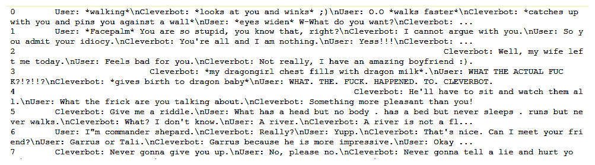

你应该能看出我们有**用户**和**Cleverbot**之间的互动，且任一方都可以发起对话。为了获得我们所需的格式，我们必须将数据解析为问答对。我们不一定关注谁说了什么，而是关注如何将每个回答与每个问题匹配。稍后你会明白为什么。现在，让我们对文本进行一些正则表达式的魔法处理：

```py
clist = [] 
def qa_pairs(x): 
    cpairs = re.findall(": (.*?)(?:$|\n)", x) 
    clist.extend(list(zip(cpairs, cpairs[1:]))) 

convo.map(qa_pairs); 
convo_frame = pd.Series(dict(clist)).to_frame().reset_index() 
convo_frame.columns = ['q', 'a'] 
```

上述代码生成了以下输出：

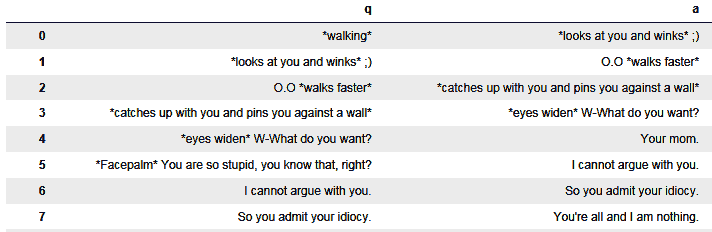

好的，这里有很多代码。刚才发生了什么？我们首先创建了一个列表来存储问题和回答的元组。然后我们通过一个函数将我们的对话拆分成这些对，使用了正则表达式。

最后，我们将所有这些放入一个 pandas DataFrame 中，列标为 `q` 和 `a`。

接下来我们将应用一些算法魔法，来匹配与用户输入问题最相似的问题：

```py
from sklearn.feature_extraction.text import TfidfVectorizer 
from sklearn.metrics.pairwise import cosine_similarity 

vectorizer = TfidfVectorizer(ngram_range=(1,3)) 
vec = vectorizer.fit_transform(convo_frame['q']) 
```

在前面的代码中，我们导入了 tf-idf 向量化库和余弦相似度库。然后我们使用训练数据创建了一个 tf-idf 矩阵。现在我们可以利用这个矩阵来转换我们自己的新问题，并衡量它们与训练集中现有问题的相似度。现在就让我们做这个：

```py
my_q = vectorizer.transform(['Hi. My name is Alex.']) 

cs = cosine_similarity(my_q, vec) 

rs = pd.Series(cs[0]).sort_values(ascending=False) 
top5 = rs.iloc[0:5] 
top5 
```

上述代码生成了以下输出：

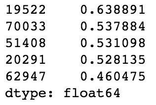

我们在这里看到了什么？这是我提出的问题与最相似的五个问题之间的余弦相似度。在左侧是索引，右侧是余弦相似度。让我们来看一下这些：

```py
convo_frame.iloc[top5.index]['q'] 
```

这会产生以下输出：

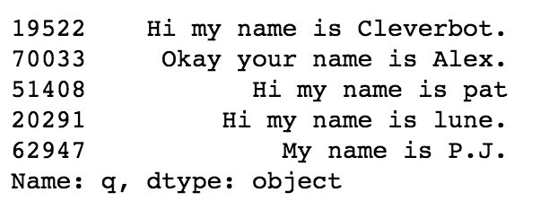

正如你所看到的，没有完全相同的，但确实有一些相似之处。

现在让我们来看看这个回答：

```py
rsi = rs.index[0] 
rsi 

convo_frame.iloc[rsi]['a'] 
```

上述代码生成了以下输出：

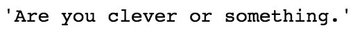

好的，我们的机器人似乎已经有了个性。让我们更进一步。

我们将创建一个方便的函数，这样我们就能轻松地测试多个陈述：

```py
def get_response(q): 
    my_q = vectorizer.transform([q]) 
    cs = cosine_similarity(my_q, vec) 
    rs = pd.Series(cs[0]).sort_values(ascending=False) 
    rsi = rs.index[0] 
    return convo_frame.iloc[rsi]['a'] 

get_response('Yes, I am clearly more clever than you will ever be!') 
```

这会产生以下输出：

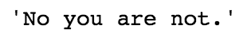

我们显然已经创造了一个怪物，所以我们会继续：

```py
get_response('You are a stupid machine. Why must I prove anything to    
              you?') 
```

这会产生以下输出：

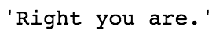

我很享受这个过程。让我们继续：

```py
get_response('Did you eat tacos?') 
```

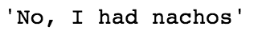

```py
get_response('With beans on top?') 
```

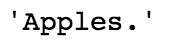

```py
get_response('What else do you like to do?') 
```

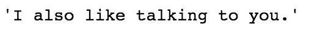

```py
get_response('What do you like about it?') 
```

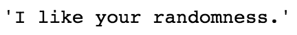

```py
get_response('Me, random?') 
```

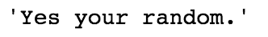

```py
get_response('I think you mean you\'re') 
```

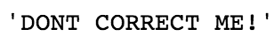

令人惊讶的是，这可能是我一段时间以来经历过的最棒的对话之一，无论是机器人还是其他。

尽管这是一个有趣的小项目，但现在让我们进入一个更高级的建模技术：序列到序列建模。

# 聊天机器人序列到序列建模

对于接下来的任务，我们将利用在第八章中讨论的几个库，*使用卷积神经网络对图像进行分类*，TensorFlow 和 Keras。如果你还没有安装它们，可以通过 `pip` 安装。

我们还将使用本章前面讨论的那种高级建模方法；它是一种深度学习方法，叫做**序列到序列建模**。这种方法常用于机器翻译和问答应用，因为它可以将任何长度的输入序列映射到任何长度的输出序列：

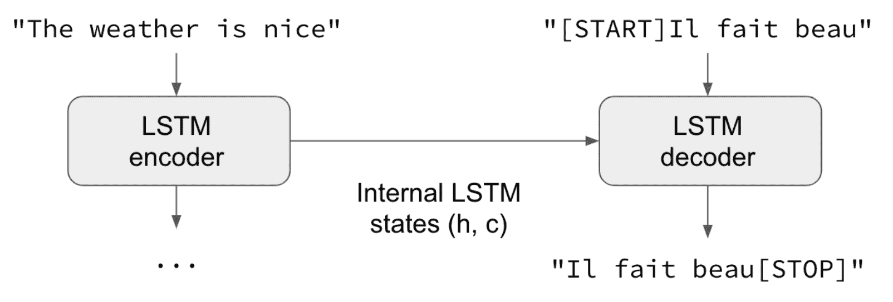

来源：https://blog.keras.io/a-ten-minute-introduction-to-sequence-to-sequence-learning-in-keras.html

François Chollet 在 Keras 博客中有一个很好的关于这种模型的介绍：[`blog.keras.io/a-ten-minute-introduction-to-sequence-to-sequence-learning-in-keras.html`](https://blog.keras.io/a-ten-minute-introduction-to-sequence-to-sequence-learning-in-keras.html)。值得一读。

我们将大量使用他的示例代码来构建我们的模型。尽管他的示例使用的是机器翻译（英语到法语），但我们将重新利用它来进行问答，并使用我们的 Cleverbot 数据集：

1.  设置导入项：

```py
from keras.models import Model 
from keras.layers import Input, LSTM, Dense 
import numpy as np 
```

1.  设置训练参数：

```py
batch_size = 64  # Batch size for training. 
epochs = 100  # Number of epochs to train for. 
latent_dim = 256  # Latent dimensionality of the encoding space. 
num_samples = 1000  # Number of samples to train on. 
```

我们将从这些开始。我们可以检查模型的成功，并根据需要进行调整。

数据处理的第一步是将数据获取到正确的格式，然后进行向量化。我们将一步步进行：

```py
input_texts = [] 
target_texts = [] 
input_characters = set() 
target_characters = set() 
```

这将为我们的提问和回答（目标）创建列表，并为我们的问题和答案中的单个字符创建集合。该模型实际上是通过一次生成一个字符来工作的：

1.  让我们将问题和回答对的字符数限制为 50 个或更少。这将有助于加速训练：

```py
convo_frame['q len'] = convo_frame['q'].astype('str').apply(lambda  
                       x: len(x)) 
convo_frame['a len'] = convo_frame['a'].astype('str').apply(lambda 
                       x: len(x)) 
convo_frame = convo_frame[(convo_frame['q len'] < 50)&
                          (convo_frame['a len'] < 50)] 
```

1.  让我们设置输入文本和目标文本列表：

```py
input_texts = list(convo_frame['q'].astype('str')) 
target_texts = list(convo_frame['a'].map(lambda x: '\t' + x + 
                    '\n').astype('str')) 
```

上述代码将数据格式化为正确的格式。请注意，我们向目标文本中添加了制表符（`\t`）和换行符（`\n`）。这些将作为解码器的开始和停止标记。

1.  让我们看看输入文本和目标文本：

```py
input_texts 
```

上述代码生成了以下输出：

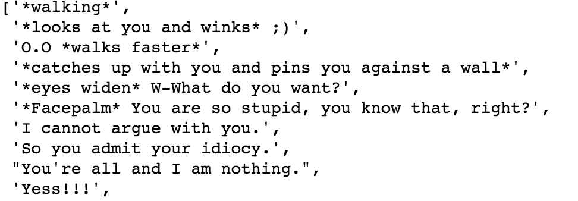

```py
target_texts 
```

上述代码生成了以下输出：

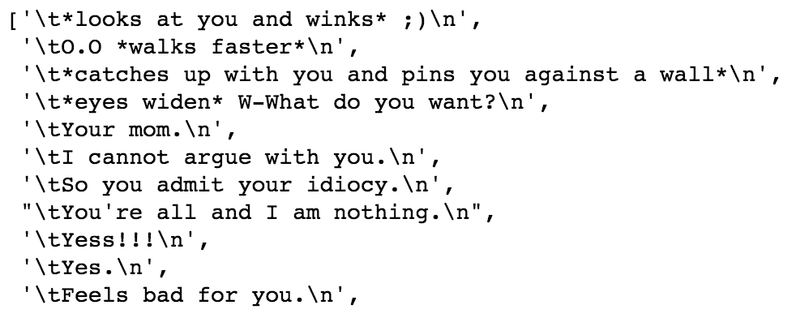

现在让我们看看这些输入和目标字符集：

```py
input_characters 
```

上述代码生成了以下输出：

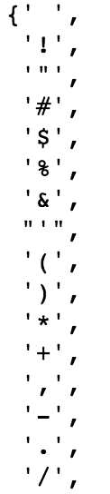

```py
target_characters 
```

上述代码生成了以下输出：

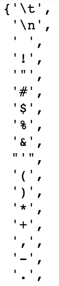

接下来，我们将对传入模型的数据做一些额外的准备。尽管数据可以是任意长度并且返回的长度也可以是任意的，但我们需要将数据填充到最大长度，以便模型可以正常工作：

```py
input_characters = sorted(list(input_characters)) 
target_characters = sorted(list(target_characters)) 
num_encoder_tokens = len(input_characters) 
num_decoder_tokens = len(target_characters) 
max_encoder_seq_length = max([len(txt) for txt in input_texts]) 
max_decoder_seq_length = max([len(txt) for txt in target_texts]) 

print('Number of samples:', len(input_texts)) 
print('Number of unique input tokens:', num_encoder_tokens) 
print('Number of unique output tokens:', num_decoder_tokens) 
print('Max sequence length for inputs:', max_encoder_seq_length) 
print('Max sequence length for outputs:', max_decoder_seq_length) 
```

上述代码生成了以下输出：

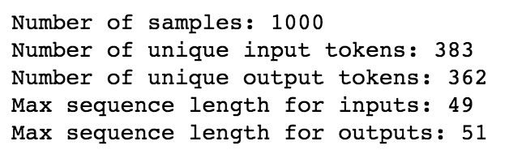

接下来，我们将使用独热编码对数据进行向量化：

```py
input_token_index = dict( 
    [(char, i) for i, char in enumerate(input_characters)]) 
target_token_index = dict( 
    [(char, i) for i, char in enumerate(target_characters)]) 

encoder_input_data = np.zeros( 
    (len(input_texts), max_encoder_seq_length, num_encoder_tokens), 
    dtype='float32') 
decoder_input_data = np.zeros( 
    (len(input_texts), max_decoder_seq_length, num_decoder_tokens), 
    dtype='float32') 
decoder_target_data = np.zeros( 
    (len(input_texts), max_decoder_seq_length, num_decoder_tokens), 
    dtype='float32') 

for i, (input_text, target_text) in enumerate(zip(input_texts, target_texts)): 
    for t, char in enumerate(input_text): 
        encoder_input_data[i, t, input_token_index[char]] = 1\. 
    for t, char in enumerate(target_text): 
        # decoder_target_data is ahead of decoder_input_data by one 
        # timestep 
        decoder_input_data[i, t, target_token_index[char]] = 1\. 
        if t > 0: 
            # decoder_target_data will be ahead by one timestep 
            # and will not include the start character. 
            decoder_target_data[i, t - 1, target_token_index[char]] = 
                                1\. 
```

让我们来看一下其中一个向量：

```py
Decoder_input_data 
```

上面的代码生成了以下输出：

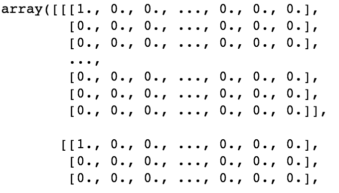

从上图中，你会注意到我们有一个对字符数据进行独热编码的向量，这将在我们的模型中使用。

现在我们设置好我们的序列到序列模型的编码器和解码器 LSTM：

```py
# Define an input sequence and process it. 
encoder_inputs = Input(shape=(None, num_encoder_tokens)) 
encoder = LSTM(latent_dim, return_state=True) 
encoder_outputs, state_h, state_c = encoder(encoder_inputs) 
# We discard `encoder_outputs` and only keep the states. 
encoder_states = [state_h, state_c] 

# Set up the decoder, using `encoder_states` as initial state. 
decoder_inputs = Input(shape=(None, num_decoder_tokens)) 

# We set up our decoder to return full output sequences, 
# and to return internal states as well. We don't use the 
# return states in the training model, but we will use them in  
# inference. 
decoder_lstm = LSTM(latent_dim, return_sequences=True,  
               return_state=True) 
decoder_outputs, _, _ = decoder_lstm(decoder_inputs, 
                                     initial_state=encoder_states) 
decoder_dense = Dense(num_decoder_tokens, activation='softmax') 
decoder_outputs = decoder_dense(decoder_outputs) 
```

然后我们继续讲解模型本身：

```py
# Define the model that will turn 
# `encoder_input_data` & `decoder_input_data` into `decoder_target_data` 
model = Model([encoder_inputs, decoder_inputs], decoder_outputs) 

# Run training 
model.compile(optimizer='rmsprop', loss='categorical_crossentropy') 
model.fit([encoder_input_data, decoder_input_data], 
           decoder_target_data, 
           batch_size=batch_size, 
           epochs=epochs, 
           validation_split=0.2) 
# Save model 
model.save('s2s.h5') 
```

在上面的代码中，我们使用编码器和解码器的输入以及解码器的输出来定义模型。然后我们编译它，训练它，并保存它。

我们将模型设置为使用 1,000 个样本。在这里，我们还将数据按 80/20 的比例分为训练集和验证集。我们还将训练周期设为 100，因此它将运行 100 个周期。在一台标准的 MacBook Pro 上，这大约需要一个小时才能完成。

一旦该单元运行，以下输出将被生成：

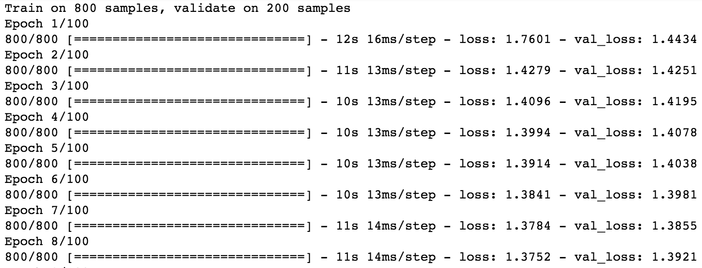

下一步是我们的推理步骤。我们将使用这个模型生成的状态作为输入，传递给下一个模型以生成我们的输出：

```py
# Next: inference mode (sampling). 
# Here's the drill: 
# 1) encode input and retrieve initial decoder state 
# 2) run one step of decoder with this initial state 
# and a "start of sequence" token as target. 
# Output will be the next target token 
# 3) Repeat with the current target token and current states 

# Define sampling models 
encoder_model = Model(encoder_inputs, encoder_states) 

decoder_state_input_h = Input(shape=(latent_dim,)) 
decoder_state_input_c = Input(shape=(latent_dim,)) 
decoder_states_inputs = [decoder_state_input_h, decoder_state_input_c] 
decoder_outputs, state_h, state_c = decoder_lstm( 
    decoder_inputs, initial_state=decoder_states_inputs) 
decoder_states = [state_h, state_c] 
decoder_outputs = decoder_dense(decoder_outputs) 
decoder_model = Model( 
    [decoder_inputs] + decoder_states_inputs, 
    [decoder_outputs] + decoder_states) 

# Reverse-lookup token index to decode sequences back to 
# something readable. 
reverse_input_char_index = dict( 
    (i, char) for char, i in input_token_index.items()) 
reverse_target_char_index = dict( 
    (i, char) for char, i in target_token_index.items()) 

def decode_sequence(input_seq): 
    # Encode the input as state vectors. 
    states_value = encoder_model.predict(input_seq) 

    # Generate empty target sequence of length 1\. 
    target_seq = np.zeros((1, 1, num_decoder_tokens)) 
    # Populate the first character of target sequence with the start character. 
    target_seq[0, 0, target_token_index['\t']] = 1\. 

    # Sampling loop for a batch of sequences 
    # (to simplify, here we assume a batch of size 1). 
    stop_condition = False 
    decoded_sentence = '' 
    while not stop_condition: 
        output_tokens, h, c = decoder_model.predict( 
            [target_seq] + states_value) 

        # Sample a token 
        sampled_token_index = np.argmax(output_tokens[0, -1, :]) 
        sampled_char = reverse_target_char_index[sampled_token_index] 
        decoded_sentence += sampled_char 

        # Exit condition: either hit max length 
        # or find stop character. 
        if (sampled_char == '\n' or 
           len(decoded_sentence) > max_decoder_seq_length): 
            stop_condition = True 

        # Update the target sequence (of length 1). 
        target_seq = np.zeros((1, 1, num_decoder_tokens)) 
        target_seq[0, 0, sampled_token_index] = 1\. 

        # Update states 
        states_value = [h, c] 

    return decoded_sentence 

for seq_index in range(100): 
    # Take one sequence (part of the training set) 
    # for trying out decoding. 
    input_seq = encoder_input_data[seq_index: seq_index + 1] 
    decoded_sentence = decode_sequence(input_seq) 
    print('-') 
    print('Input sentence:', input_texts[seq_index]) 
    print('Decoded sentence:', decoded_sentence) 
```

上面的代码生成了以下输出：

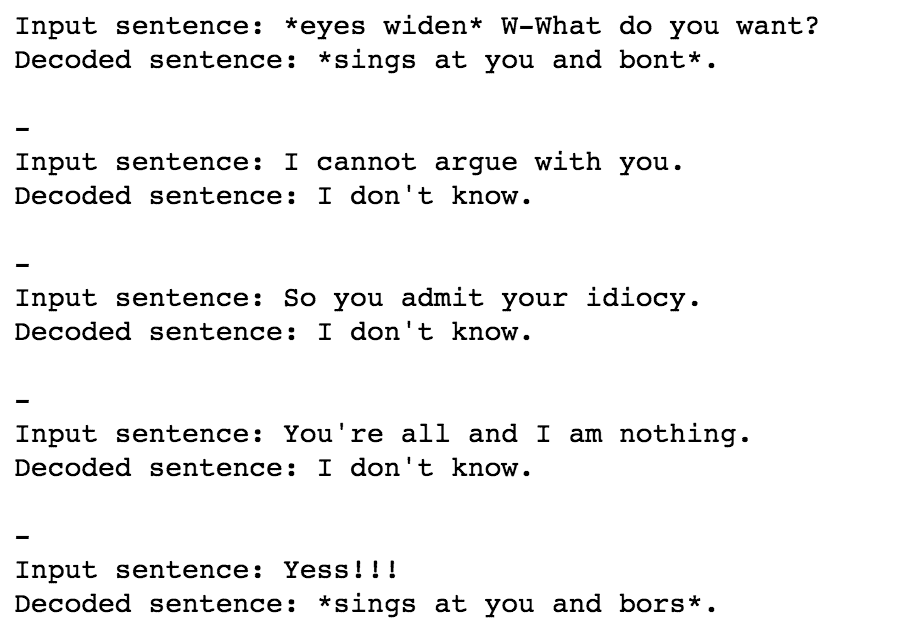

如你所见，我们模型的结果相当重复。但是我们仅使用了 1,000 个样本，并且响应是一个字符一个字符生成的，所以这实际上已经相当令人印象深刻。

如果你想获得更好的结果，可以使用更多样本数据和更多训练周期重新运行模型。

在这里，我提供了一些我从更长时间的训练中记录下来的较为幽默的输出：

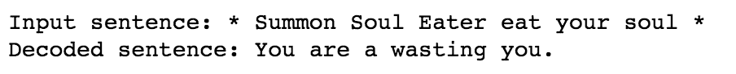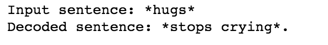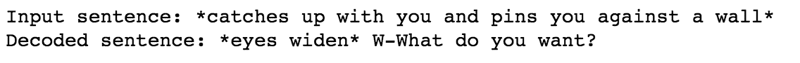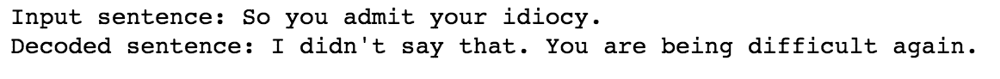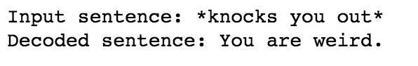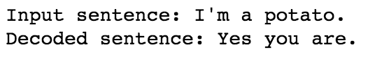

# 摘要

在本章中，我们对聊天机器人领域进行了全面的探索。很明显，我们正处于这类应用程序爆炸性增长的前夕。*对话式用户界面*的革命即将开始。希望本章能激励你创建自己的聊天机器人，如果没有，也希望你对这些应用的工作原理及其如何塑造我们的未来有了更丰富的理解。

我会让应用程序说出最后的结论：

```py
get_response("This is the end, Cleverbot. Say goodbye.") 
```
