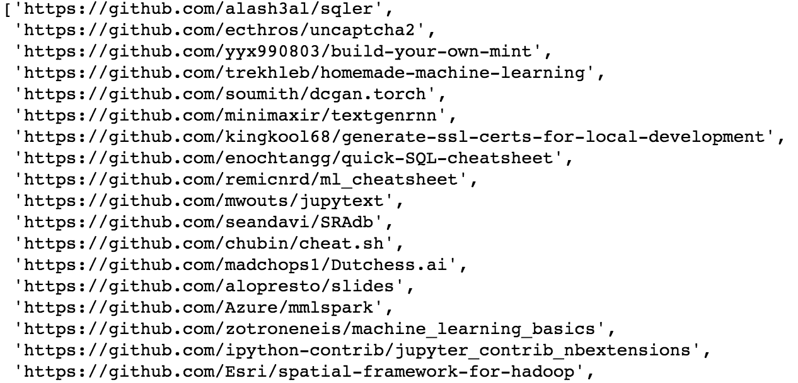

# 第十章：构建推荐引擎

就像许多事情一样，它源于挫败感和烈酒。那是一个星期六，两个年轻人再次陷入了没有约会的困境。当他们坐下来倒酒、分享苦恼时，这两个哈佛大学的新生开始构思一个想法。如果他们不再依赖随机机会来遇到合适的女孩，而是能利用计算机算法呢？

他们认为，匹配人们的关键是创建一组问题，提供每个人在第一次尴尬约会时真正想了解的信息。通过使用这些问卷来匹配人们，你可以消除那些最好避免的约会。这个过程将是超级高效的。

这个想法是将他们的新服务推向波士顿及全国各地的大学生。简而言之，他们确实做到了这一点。

不久之后，他们所构建的数字匹配服务获得了巨大的成功。它吸引了全国媒体的关注，并在接下来的几年里生成了数万次匹配。事实上，这家公司如此成功，以至于最终被一家更大的公司收购，该公司希望利用其技术。

如果你认为我在谈论**OkCupid**，那你就错了——而且错得有点远，大约错了 40 年。我说的这家公司从 1965 年开始就做了这些事——那时候，匹配计算是通过 IBM 1401 主机上的穿孔卡来完成的。完成计算甚至需要三天时间。

但奇怪的是，**OkCupid**和它 1965 年的前身兼容性研究公司（Compatibility Research, Inc.）之间有一种联系。兼容性研究的共同创始人是杰夫·塔尔（Jeff Tarr），他的女儿詹妮弗·塔尔（Jennifer Tarr）是**OkCupid**共同创始人克里斯·科因（Chris Coyne）的妻子。真是个小世界。

那么，为什么这一切和构建推荐引擎的章节有关系呢？因为很可能这实际上是第一个推荐引擎。而尽管大多数人通常把推荐引擎视为用来寻找相关产品、音乐和电影的工具，这些是人们可能会喜欢的，但最初的版本是用来寻找潜在的伴侣的。作为思考这些系统如何工作的模型，它提供了一个很好的参考框架。

本章我们将探索推荐系统的不同种类。我们将看到它们是如何商业化实施的，以及它们是如何运作的。最后，我们将实现自己的推荐引擎，用来查找 GitHub 上的仓库。

本章将涵盖以下主题：

+   协同过滤

+   基于内容的过滤

+   混合系统

+   构建推荐引擎

# 协同过滤

2012 年初，一则新闻报道了一个男人的故事，他来到明尼阿波利斯的 Target 商店投诉送到他家中的一本优惠券书。实际上，他对这些优惠券非常生气，这些优惠券是寄给他女儿的，而她当时是一名高中生。虽然这看起来像是对一项潜在的省钱机会的奇怪反应，但得知这些优惠券只针对产前维生素、尿布、婴儿配方奶粉、婴儿床等产品时，可能会改变你的看法。

经理在听到投诉后，深感抱歉。事实上，他感到十分难过，以至于几天后他再次打电话进行跟进并解释事情是如何发生的。但在经理还没开始道歉之前，父亲开始向经理道歉。事实证明，他的女儿实际上已经怀孕了，而且她的购物习惯暴露了这一点。

揭露她的算法很可能至少部分基于一种在推荐引擎中使用的算法，叫做**协同过滤**。

# 那么，什么是协同过滤？

协同过滤基于这样一个理念：在世界的某个地方，你有一个品味的双胞胎——一个与自己在评价*星际大战*的好坏以及*真爱至上*的糟糕程度上有相同看法的人。

其核心理念是，你对一组物品的评分方式非常类似于另一个人——这个双胞胎——对这些物品的评分方式，但你们每个人又分别对其他物品进行了评分，而这些物品对方并没有评分。由于你们的品味相似，推荐可以基于你们的双胞胎对某些你没有评分的高分物品，或者基于你对某些他没有评分的高分物品进行生成。从某种意义上讲，这就像是数字化的配对，但结果是你会喜欢的歌曲或产品，而不是实际的人。

因此，在我们怀孕的高中女生的例子中，当她购买了正确的无香料润肤霜、棉花球和维生素补充剂组合时，她很可能与那些后来购买婴儿床和尿布的人配对了。

让我们通过一个例子来看看这在实际中是如何运作的。

我们将从所谓的**效用矩阵**开始。这与**词-文档矩阵**类似，但我们将代表的是产品和用户，而不是词汇和文档。

在这里，我们假设我们有客户*A-D*，以及一组他们根据 0 到 5 的评分标准对产品的评价：

| **客户** | **斯纳奇薯片** | **顺滑润肤霜** | **达夫啤酒** | **更佳水** | **XX 大型生活足球衫** | **雪白棉花**

**尿布** | **迪斯波索尿布** |

| **A** | 4 |  | 5 | 3 | 5 |  |  |
| --- | --- | --- | --- | --- | --- | --- | --- |
| **B** |  | 4 |  | 4 |  | 5 |  |
| **C** | 2 |  | 2 |  | 1 |  |  |
| **D** |  | 5 |  | 3 |  | 5 | 4 |

我们之前看到，当我们想要找到相似的项目时，可以使用余弦相似度。我们就在这里尝试一下。我们将找到最像用户 *A* 的用户。由于我们有一个稀疏向量，其中包含许多未评分的项目，我们需要为这些缺失值输入一些内容。我们这里就使用 0。我们从比较用户 *A* 和用户 *B* 开始：

```py
from sklearn.metrics.pairwise import cosine_similarity 
cosine_similarity(np.array([4,0,5,3,5,0,0]).reshape(1,-1),\ 
                  np.array([0,4,0,4,0,5,0]).reshape(1,-1)) 
```

上述代码的结果是以下输出：


如你所见，两者的相似度评分并不高，这也有道理，因为他们没有共同的评分项。

现在我们来看一下用户 C 与用户 *A* 进行比较：

```py
cosine_similarity(np.array([4,0,5,3,5,0,0]).reshape(1,-1),\ 
                  np.array([2,0,2,0,1,0,0]).reshape(1,-1)) 
```

上述代码的结果是以下输出：


在这里，我们看到他们之间有很高的相似度评分（记住，1 是完美相似），尽管他们对相同的产品给出了截然不同的评分。为什么会得到这样的结果呢？问题出在我们选择使用 0 来表示未评分的产品。它被视为这些未评分产品的强烈（负向）一致性。0 在这种情况下并不是中立的。

那么，我们该如何解决这个问题呢？

我们可以做的，不仅仅是对缺失值使用 0，而是重新调整每个用户的评分，使得平均评分为 0，或者说是中立的。我们通过将每个用户的评分减去该用户所有评分的平均值来实现这一点。例如，对于用户 *A*，其平均值为 17/4，即 4.25。然后，我们从用户 *A* 提供的每个评分中减去这个平均值。

完成这一步后，我们继续为每个用户计算平均值，并将其从每个用户的评分中减去，直到所有用户都被处理完。

这个过程将生成如下表格。你会注意到每个用户的行总和为 0（这里忽略四舍五入问题）：

| **顾客** | **Snarky's 土豆片** | **SoSo 顺滑** **乳液** | **Duffly** **啤酒** | **BetterTap** **水** | **XXLargeLivin'** **橄榄球球衣** | **Snowy** **棉花**

**Balls** | **Disposos'** **尿布** |

| **A** | -.25 |  | .75 | -1.25 | .75 |  |  |
| --- | --- | --- | --- | --- | --- | --- | --- |
| **B** |  | -.33 |  | -.33 |  | .66 |  |
| **C** | .33 |  | .33 |  | -.66 |  |  |
| **D** |  | .75 |  | -1.25 |  | .75 | -.25 |

现在让我们在我们重新调整过的数据上尝试余弦相似度。我们将再次进行用户 *A* 与用户 *B* 和 *C* 的比较。

首先，让我们将用户 *A* 与用户 *B* 进行比较：

```py
cosine_similarity(np.array([-.25,0,.75,-1.25,.75,0,0])\ 
                  .reshape(1,-1),\ 
                  np.array([0,-.33,0,-.33,0,.66,0])\ 
                  .reshape(1,-1)) 
```

上述代码的结果是以下输出：


现在让我们尝试将用户 *A* 和 *C* 进行比较：

```py
cosine_similarity(np.array([-.25,0,.75,-1.25,.75,0,0])\ 
                  .reshape(1,-1),\ 
                  np.array([.33,0,.33,0,-.66,0,0])\ 
                  .reshape(1,-1)) 
```

上述代码的结果是以下输出：


我们可以看到，*A* 和 *B* 之间的相似度略有增加，而 *A* 和 *C* 之间的相似度则大幅下降。这正是我们希望看到的结果。

这个中心化过程，除了帮助我们处理缺失值外，还具有一个副作用，帮助我们处理评分严格或宽松的用户，因为现在每个人的评分都是围绕 0 进行中心化的。你可能会注意到，这个公式等同于皮尔逊相关系数，就像那个系数一样，数值范围在`-1`到`1`之间。

# 预测产品评分

现在，让我们利用这个框架来预测某个产品的评分。我们将示例限定为三位用户，用户*X*、用户*Y*和用户*Z*。我们将预测用户*X*未评分的产品，但用户*Y*和用户*Z*已经对其进行了评分，而且他们与*X*非常相似。

我们将从每个用户的基础评分开始，如下表所示：

| **客户** | **Snarky's Potato Chips** | **SoSo Smooth** **Lotion** | **Duffly** **Beer** | **BetterTap** **Water** | **XXLargeLivin'** **Football Jersey** | **Snowy** **Cotton**

**球** | **Disposos'** **Diapers** |

| **X** |  | 4 |  | 3 |  | 4 |  |
| --- | --- | --- | --- | --- | --- | --- | --- |
| **Y** |  | 3.5 |  | 2.5 |  | 4 | 4 |
| **Z** |  | 4 |  | 3.5 |  | 4.5 | 4.5 |

接下来，我们将对评分进行中心化处理：

| **客户** | **Snarky's Potato Chips** | **SoSo Smooth** **Lotion** | **Duffly** **Beer** | **BetterTap** **Water** | **XXLargeLivin'** **Football Jersey** | **Snowy** **Cotton**

**球** | **Disposos'** **Diapers** |

| **X** |  | .33 |  | -.66 |  | .33 | ? |
| --- | --- | --- | --- | --- | --- | --- | --- |
| **Y** |  | 0 |  | -1 |  | .5 | .5 |
| **Z** |  | -.125 |  | -.625 |  | .375 | .375 |

现在，我们想知道用户*X*可能给**Disposos' Diapers**的评分是多少。通过使用用户*Y*和用户*Z*的评分，我们可以根据他们的中心化余弦相似度计算加权平均值来得到这个评分。

我们先计算出这个数值：

```py
user_x = [0,.33,0,-.66,0,33,0] 
user_y = [0,0,0,-1,0,.5,.5] 

cosine_similarity(np.array(user_x).reshape(1,-1),\ 
                  np.array(user_y).reshape(1,-1)) 
```

前面的代码产生了以下输出：


现在，让我们计算用户*Z*的数值：

```py
user_x = [0,.33,0,-.66,0,33,0] 
user_z = [0,-.125,0,-.625,0,.375,.375] 

cosine_similarity(np.array(user_x).reshape(1,-1),\ 
                  np.array(user_z).reshape(1,-1)) 
```

前面的代码产生了以下输出：


所以，现在我们已经得到了用户*X*与用户*Y*（`0.42447212`）和用户*Z*（`0.46571861`）之间的相似度值。

将所有内容整合在一起，我们通过每个用户与*X*的相似度加权评分，然后再按总相似度进行除法，如下所示：

*(.42447212 * (4) + .46571861 * (4.5) ) / (.42447212 + .46571861) = 4.26*

我们可以看到，用户*X*对**Disposos' Diapers**的预期评分是 4.26（最好发送一个优惠券！）

目前为止，我们只看了用户对用户的协同过滤方法，但还有一种方法可以使用。在实际应用中，这种方法优于用户对用户的过滤；它被称为**项目对项目过滤**。该方法的工作原理是：与其基于过去的评分将每个用户与其他相似的用户进行匹配，不如将每个已评分的项目与所有其他项目进行比较，以找到最相似的项目，再次使用中心化余弦相似度。

让我们看看这个是如何工作的。

我们又有了一个效用矩阵；这次，我们将查看用户对歌曲的评分。用户在列上，歌曲在行上，结果如下：

| **实体** | **U1** | **U2** | **U3** | **U4** | **U5** |
| --- | --- | --- | --- | --- | --- |
| **S1** | 2 |  | 4 |  | 5 |
| **S2** |  | 3 |  | 3 |  |
| **S3** | 1 |  | 5 |  | 4 |
| **S4** |  | 4 | 4 | 4 |  |
| **S5** | 3 |  |  |  | 5 |

现在，假设我们想知道用户 3 会给歌曲 5 打多少分。我们不再寻找相似的用户，而是根据这些歌曲在不同用户中的评分相似度，寻找相似的歌曲。

让我们看一个例子。

首先，我们通过对每首歌的行进行居中，并计算与我们的目标行*S5*的余弦相似度，结果如下：

| **实体** | **U1** | **U2** | **U3** | **U4** | **U5** | **CntrdCoSim** |
| --- | --- | --- | --- | --- | --- | --- |
| **S1** | -1.66 |  | .33 |  | 1.33 | .98 |
| **S2** |  | 0 |  | 0 |  | 0 |
| **S3** | -2.33 |  | 1.66 |  | .66 | .72 |
| **S4** |  | 0 | 0 | 0 |  | 0 |
| **S5** | -1 |  | ? |  | 1 | 1 |

你可以看到最右列是通过每一行与行*S5*的中心余弦相似度计算出来的。

我们接下来需要选择一个数字，*k*，即我们用来对用户 3 打分的最近邻数量。在这个简单的示例中，我们使用*k = 2*。

你可以看到歌曲*S1*和歌曲*S3*是最相似的，因此我们将使用这两首歌曲以及用户 3 对*S1*和*S3*的评分（分别为 4 和 5）。

现在让我们来计算评分：

*(.98 * (4) + .72 * (5)) / (.98 + .72) = 4.42*

所以，根据这个物品到物品的协同过滤，我们可以看到用户 3 可能会对歌曲*S5*给出非常高的评分，计算结果为 4.42。

之前，我说过用户到用户过滤不如物品到物品过滤有效。这是为什么呢？

很有可能你有一些朋友非常喜欢你也喜欢的东西，但每个人还有其他一些兴趣领域，而这些领域是对方完全没有兴趣的。

例如，也许你们俩都喜欢*权力的游戏*，但你的朋友还喜欢挪威死亡金属。然而，你宁愿死掉也不愿听挪威死亡金属。如果你们在许多方面相似——排除死亡金属——通过用户到用户的推荐，你仍然会看到许多包含*火焰*、*斧头*、*骷髅*和*重击*等词语的乐队推荐。而通过物品到物品的过滤，最有可能的是，你将避免这些建议。

到目前为止，我们一直将用户和物品视为一个整体进行比较，但现在让我们看看另一种方法，它将用户和物品分解为可能称为**特征篮子**的东西。

# 基于内容的过滤

作为一名音乐人，Tim Westergren 曾在路上度过多年时间，聆听其他有才华的音乐人，思考为什么他们始终无法成功突破。尽管他们的音乐很好——与无线电广播上播放的音乐一样出色——然而，他们似乎从未迎来大爆发。他想，这一定是因为他们的音乐从未出现在足够多合适的人面前。

Tim 最终辞去了音乐人工作，转而担任电影配乐作曲家。在那里，他开始认为每一段音乐都有独特的结构，可以被分解成组成部分——一种音乐 DNA 的形式。

思考了一段时间后，他开始考虑围绕构建**音乐基因组**的这个想法成立一家公司。他向一位曾经创建并出售过公司朋友介绍了这个概念。朋友非常喜欢 Tim 的这个想法。事实上，他喜欢到开始帮助 Tim 编写商业计划书，并为项目筹集初期的资金。这项计划得到了推进。

在接下来的几年里，他们雇佣了一支小型的音乐家团队，细致地为超过百万首音乐作品制定了近 400 个独特的音乐特征。每个特征都用 0 到 5 分的评分标准手工评分（或者说是用耳朵评分可能更为恰当）。每首三到四分钟的歌曲需要将近半小时才能分类完毕。

特征包括主唱的声音沙哑程度或节奏的每分钟节拍数等。他们的第一个原型花了近一年时间才完成。这个原型完全是用 Excel 和 VBA 宏构建的，单单返回一个推荐就需要近四分钟的时间。但最终，它成功了，并且效果非常好。

这家公司现在被称为 Pandora 音乐，可能你要么听说过它，要么使用过它的产品，因为它在全球有数百万的日活跃用户。毫无疑问，这是基于内容的过滤的一个成功案例。

与基于内容的过滤方法将每首歌视为一个不可分割的单元不同，这些歌曲变成了特征向量，可以使用我们的老朋友余弦相似度进行比较。

另一个好处是，不仅歌曲可以被分解成特征向量，听众的偏好也可以被分解。每个听众的品味档案也会变成该空间中的一个向量，这样就可以在他们的品味档案和歌曲之间进行衡量。

对 Tim Westergren 来说，这就是魔力所在，因为与许多基于流行度的推荐不同，这个系统的推荐是基于固有的结构相似性做出的。也许你从未听说过歌曲*X*，但如果你喜欢歌曲*Y*，那么你也应该喜欢歌曲*X*，因为它在*基因上*几乎是相同的。这就是基于内容的过滤。

# 混合系统

我们现在已经看了两种主要的推荐系统，但你应该知道，在任何大规模的生产环境中，你可能会看到结合这两种方式的推荐系统。这被称为**混合系统**，混合系统的偏好原因在于，它们有助于消除使用单一系统时可能出现的缺点。这两个系统结合在一起，创造了一个更强大的解决方案。

让我们来看看每种类型的优缺点。

# 协同过滤

协同过滤的优点如下：

+   不需要手动制作特征

缺点如下：

+   如果没有大量的商品和用户，效果不好

+   当商品数量远远超过可以购买的数量时，会出现稀疏性问题

# 基于内容的过滤

基于内容的过滤的优点如下：

+   它不需要大量的用户

缺点如下：

+   定义正确的特征可能是一个挑战

+   缺乏偶然性

正如你所看到的，当你还没有建立起庞大的用户基础时，基于内容的过滤是一个更好的选择，但随着你的发展，增加协同过滤可以帮助将更多的偶然性引入推荐中。

现在你已经熟悉了推荐引擎的类型和工作原理，让我们开始构建一个自己的推荐引擎。

# 构建推荐引擎

我喜欢偶然发现一些非常有用的 GitHub 仓库。你可以找到从手工策划的机器学习教程到可以节省你大量代码行数的库，特别是在使用 **Elasticsearch** 时。问题是，找到这些库比应该的更难。幸运的是，我们现在有了足够的知识，可以通过 GitHub API 来帮助我们找到这些代码宝藏。

我们将使用 GitHub API 来基于协同过滤创建一个推荐引擎。计划是获取我一段时间内标记的所有仓库，然后获取这些仓库的所有创建者，查看他们标记了哪些仓库。一旦完成，我们将找到与我（或你，如果你为自己的仓库运行此过程，我建议这样做）最相似的用户。一旦找到最相似的用户，我们就可以使用他们标记的，而我没有标记的仓库来生成推荐列表。

让我们开始吧：

1.  我们将导入所需的库：

```py
import pandas as pd 
import numpy as np 
import requests 
import json 
```

1.  你需要在 GitHub 上注册一个帐户，并标记一些仓库，这样才能使你的 GitHub 账号生效，但实际上你不需要注册开发者程序。你可以从你的个人资料中获得一个授权令牌，这将允许你使用 API。你也可以用这段代码使它正常工作，但由于限制太多，无法在我们的示例中使用。

1.  要为 API 创建一个令牌，请访问以下网址：[`github.com/settings/tokens`](https://github.com/settings/tokens)。在这里，你会看到右上角有一个按钮，像这样：


1.  你需要点击那个生成新令牌的按钮。点击之后，你需要选择权限，我选择了仅限 public_repo。然后，最后复制它给你的令牌，并在以下代码中使用。确保将其包含在引号内：

```py
myun = YOUR_GITHUB_HANDLE 
mypw = YOUR_PERSONAL_TOKEN 
```

1.  我们将创建一个函数，提取你标星的每个仓库的名字：

```py
my_starred_repos = [] 
def get_starred_by_me(): 
    resp_list = [] 
    last_resp = '' 
    first_url_to_get = 'https://api.github.com/user/starred' 
    first_url_resp = requests.get(first_url_to_get, auth=(myun,mypw)) 
    last_resp = first_url_resp 
    resp_list.append(json.loads(first_url_resp.text)) 

    while last_resp.links.get('next'): 
        next_url_to_get = last_resp.links['next']['url'] 
        next_url_resp = requests.get(next_url_to_get, auth=(myun,mypw)) 
        last_resp = next_url_resp 
        resp_list.append(json.loads(next_url_resp.text)) 

    for i in resp_list: 
        for j in i: 
            msr = j['html_url'] 
            my_starred_repos.append(msr) 
```

这里发生了很多事情，但本质上，我们在查询 API 以获取我们自己的标星仓库。GitHub 使用分页，而不是一次性返回所有内容。因此，我们需要检查每个响应中返回的`.links`。只要还有“下一页”链接可调用，我们就会继续这样做。

1.  我们只需要调用我们创建的那个函数：

```py
get_starred_by_me() 
```

1.  然后，我们可以看到所有被标星的仓库的完整列表：

```py
my_starred_repos 
```

前面的代码将输出类似以下内容：



1.  我们需要解析出我们标星的每个库的用户名，以便我们可以获取他们标星的库：

```py
my_starred_users = [] 
for ln in my_starred_repos: 
    right_split = ln.split('.com/')[1] 
    starred_usr = right_split.split('/')[0] 
    my_starred_users.append(starred_usr) 

my_starred_users 
```

这将产生类似以下的输出：


1.  现在我们已经获取了所有我们标星的用户的用户名，我们需要获取他们标星的所有仓库。以下函数将实现这一功能：

```py
starred_repos = {k:[] for k in set(my_starred_users)} 
def get_starred_by_user(user_name): 
    starred_resp_list = [] 
    last_resp = '' 
    first_url_to_get = 'https://api.github.com/users/'+ user_name +'/starred' 
    first_url_resp = requests.get(first_url_to_get, auth=(myun,mypw)) 
    last_resp = first_url_resp 
    starred_resp_list.append(json.loads(first_url_resp.text)) 

    while last_resp.links.get('next'): 
        next_url_to_get = last_resp.links['next']['url'] 
        next_url_resp = requests.get(next_url_to_get, auth=(myun,mypw)) 
        last_resp = next_url_resp 
        starred_resp_list.append(json.loads(next_url_resp.text)) 

    for i in starred_resp_list: 
        for j in i: 
            sr = j['html_url'] 
            starred_repos.get(user_name).append(sr) 
```

这个函数的工作方式与我们之前调用的函数几乎相同，但它调用的是不同的端点。它将把他们标星的仓库添加到我们稍后会用到的字典中。

1.  现在让我们调用它。根据每个用户标星的仓库数量，它可能需要几分钟才能运行完成。实际上，我有一个用户标星了超过 4,000 个仓库：

```py
for usr in list(set(my_starred_users)): 
    print(usr) 
    try: 
        get_starred_by_user(usr) 
    except: 
        print('failed for user', usr) 
```

前面的代码将输出类似以下内容：


注意，在调用它之前，我将标星用户列表转成了集合。我注意到有一些重复项，是因为一个用户标星了多个仓库，所以按这些步骤操作来减少额外的调用是很有意义的：

1.  现在我们需要构建一个特征集，包含我们所有标星的用户标星的所有仓库：

```py
repo_vocab = [item for sl in list(starred_repos.values()) for item in sl] 
```

1.  我们将把它转换为集合，去除可能存在的重复项，这些重复项可能是多个用户标星了相同的仓库：

```py
repo_set = list(set(repo_vocab)) 
```

1.  让我们看看这会生成多少内容：

```py
len(repo_vocab) 
```

前面的代码应该会输出类似以下内容：


我标星了 170 个仓库，此外，这些仓库的用户们一共标星了超过 27,000 个独立的仓库。你可以想象，如果我们再往外推一步，会看到多少仓库。

现在我们拥有了完整的特征集或仓库词汇，我们需要对每个用户进行操作，创建一个二进制向量，对于每个他们标星的仓库赋值`1`，对于每个没有标星的仓库赋值`0`：

```py
all_usr_vector = [] 
for k,v in starred_repos.items(): 
    usr_vector = [] 
    for url in repo_set: 
        if url in v: 
            usr_vector.extend([1]) 
        else: 
            usr_vector.extend([0]) 
    all_usr_vector.append(usr_vector) 
```

我们刚才做的事情是检查每个用户是否标星了我们仓库词汇中的每个仓库。如果标星了，他们会得到`1`，如果没有，他们会得到`0`。

到目前为止，我们为每个用户（总共 170 个用户）创建了一个包含 27,098 个项目的二进制向量。现在，让我们将其放入一个`DataFrame`中。行索引将是我们标星过的用户句柄，列将是仓库词汇：

```py
df = pd.DataFrame(all_usr_vector, columns=repo_set, index=starred_repos.keys()) 

df 
```

上面的代码将生成类似以下的输出：


接下来，为了与其他用户进行比较，我们需要将我们自己的行添加到这个框架中。在这里，我添加了我的用户句柄，但你应该添加你自己的：

```py
my_repo_comp = [] 
for i in df.columns: 
    if i in my_starred_repos: 
        my_repo_comp.append(1) 
    else: 
        my_repo_comp.append(0) 

mrc = pd.Series(my_repo_comp).to_frame('acombs').T 

mrc 
```

上面的代码将生成类似以下的输出：


我们现在需要添加适当的列名，并将其与我们的其他`DataFrame`进行拼接：

```py
mrc.columns = df.columns 

fdf = pd.concat([df, mrc]) 

fdf 
```

上面的代码将生成类似以下的输出：


你可以在上面的截图中看到，我已经被加入到了`DataFrame`中。

从这里开始，我们只需要计算自己与其他我们标星过的用户之间的相似度。我们现在就用`pearsonr`函数来做这个计算，我们需要从 SciPy 导入这个函数：

```py
from scipy.stats import pearsonr 

sim_score = {} 
for i in range(len(fdf)): 
    ss = pearsonr(fdf.iloc[-1,:], fdf.iloc[i,:]) 
    sim_score.update({i: ss[0]}) 

sf = pd.Series(sim_score).to_frame('similarity') 
sf 
```

上面的代码将生成类似以下的输出：


我们刚才所做的是将我们的向量（`DataFrame`中的最后一个）与其他所有用户的向量进行比较，以生成一个居中的余弦相似度（皮尔逊相关系数）。由于某些用户没有标星任何仓库，因此有些值必然为`NaN`，这会导致在计算时除以零：

1.  现在让我们对这些值进行排序，返回最相似用户的索引：

```py
sf.sort_values('similarity', ascending=False) 
```

上面的代码将生成类似以下的输出：


所以，我们得到了最相似的用户，因此我们可以利用这些用户来推荐我们可能喜欢的仓库。让我们看看这些用户以及他们标星了哪些我们可能喜欢的仓库。

1.  你可以忽略第一个具有完美相似度分数的用户；那是我们自己的仓库。向下看，三个最接近的匹配是用户 6、用户 42 和用户 116。我们来看看每一个：

```py
fdf.index[6] 
```

上面的代码将生成类似以下的输出：


1.  让我们看看这个用户是谁以及他们的仓库。通过[`github.com/cchi`](https://github.com/cchi)，我可以看到这个仓库属于以下用户：


这个人实际上是 Charles Chi，我以前在彭博社的同事，所以这不是什么意外。我们来看看他标星了哪些内容：

1.  有几种方法可以做到这一点；我们可以使用代码，或者直接点击他们头像下方的星标。我们这次做两者，比较一下并确保结果一致。首先，让我们通过代码来操作：

```py
fdf.iloc[6,:][fdf.iloc[6,:]==1] 
```

这将产生以下输出：


1.  我们看到他加星了 30 个仓库。让我们将这些仓库与 GitHub 网站上的仓库进行比较：


1.  在这里我们看到它们是相同的，你会注意到可以标识出我们都加星的仓库：它们是那些标记为 Unstar 的。

1.  不幸的是，仅凭 30 个加星的仓库，推荐的仓库数量并不多。

1.  与我相似的下一个用户是 42，Artem Golubin：

```py
fdf.index[42] 
```

上述代码将产生以下输出：


以及他下面的 GitHub 资料：


这是他加星的仓库：


1.  Artem 加星了超过 500 个仓库，所以那里肯定有一些推荐。

1.  最后，让我们来看一下第三位最相似的用户：

```py
fdf.index[116] 
```

这将产生以下输出：


这位用户，Kevin Markham，加星了大约 60 个仓库：


我们可以在下面的图像中看到加星的仓库：


这无疑是生成推荐的肥沃土壤。现在，让我们就做这件事；我们将使用这三个链接来生成一些推荐：

1.  我们需要收集他加星的仓库链接，而我没有加星的仓库。我们将创建一个`DataFrame`，包含我加星的仓库以及与我最相似的三位用户：

```py
all_recs = fdf.iloc[[6,42,116,159],:] 
all_recs.T 
```

上述代码将产生以下输出：


1.  如果它看起来全是零，不用担心；这是一个稀疏矩阵，所以大部分值为 0。让我们看看是否有我们都加星的仓库：

```py
all_recs[(all_recs==1).all(axis=1)] 
```

上述代码将产生以下输出：


1.  正如你所见，我们似乎都热衷于 scikit-learn 和机器学习的仓库——这不令人惊讶。让我们看看他们可能都加星了哪些我错过的仓库。我们将先创建一个不包含我的框架，然后查询其中共同加星的仓库：

```py
str_recs_tmp = all_recs[all_recs[myun]==0].copy() 
str_recs = str_recs_tmp.iloc[:,:-1].copy() 
str_recs[(str_recs==1).all(axis=1)] 
```

上述代码产生以下输出：


1.  好的，看起来我没有错过任何明显的内容。让我们看看是否有至少三位用户中有两位加星的仓库。为了找到这些仓库，我们将对行进行求和：

```py
str_recs.sum(axis=1).to_frame('total').sort_values(by='total', ascending=False) 
```

上述代码将产生类似以下的输出：


这看起来很有前景。有很多很好的机器学习和人工智能的存储库，老实说，我很羞愧以前没收藏 fuzzywuzzy，因为我经常用到它。

到目前为止，我必须说我对结果感到印象深刻。这些确实是我感兴趣的存储库，我会去查看它们。

到目前为止，我们已经通过协同过滤生成了推荐，并且通过聚合做了一些轻量的附加过滤。如果我们想更进一步，可以根据推荐所收到的总星标数来排序。这可以通过再次调用 GitHub API 来实现。GitHub 有一个端点提供这一信息。

我们可以做的另一件事是增加一层基于内容的过滤。这就是我们之前讨论的混合化步骤。我们需要从我们自己的存储库中创建一组特征，来表示我们感兴趣的内容类型。一种方法是通过对我们已收藏的存储库名称及其描述进行分词，来创建一组特征。

这是我收藏的存储库：


正如你想象的那样，这将生成一组我们可以用来筛选通过协同过滤找到的存储库的词特征。这将包括许多词，如 *Python*、*机器学习* 和 *数据科学*。这可以确保即使是与我们不太相似的用户，也能提供基于我们自己兴趣的推荐。同时，这也会减少推荐的偶然性，这一点需要考虑。也许有些东西与我目前拥有的完全不同，我会喜欢看到。这个可能性是存在的。

那么，基于内容的过滤步骤在 DataFrame 中会是什么样子的呢？列将是词特征（n-grams），行则是通过协同过滤步骤生成的存储库。我们只需要再次运行相似度处理，使用我们自己的存储库进行比较。

# 总结

在本章中，我们了解了推荐引擎。我们学习了当前使用的两种主要系统：协同过滤和基于内容的过滤。我们还学习了如何将这两者结合使用，形成一个混合系统。我们还讨论了每种系统的优缺点。最后，我们一步步了解了如何使用 GitHub API 从零开始构建推荐引擎。

我希望你能按照本章的指导，构建你自己的推荐引擎，并找到对你有用的资源。我知道我已经发现了许多我一定会使用的东西。祝你在旅程中好运！
