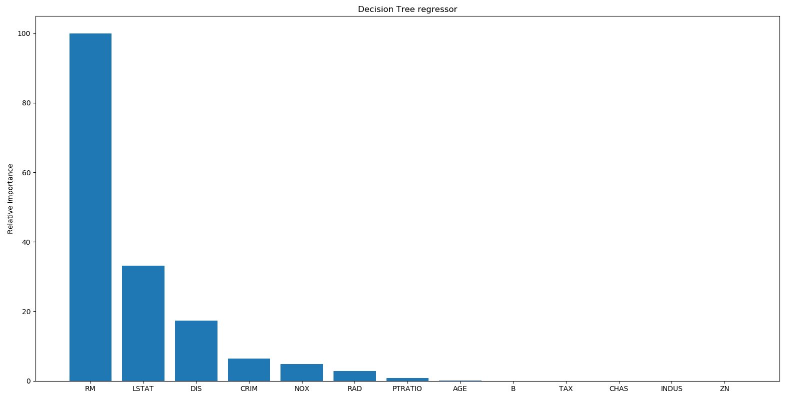

# 第一章：监督学习领域

在本章中，我们将涵盖以下食谱：

+   在 Python 中创建数组

+   使用均值移除进行数据预处理

+   数据缩放

+   归一化

+   二值化

+   One-hot 编码

+   标签编码

+   构建线性回归器

+   计算回归精度

+   实现模型持久化

+   构建岭回归器

+   构建多项式回归器

+   估计房价

+   计算特征的相对重要性

+   估计自行车需求分布

# 技术要求

在本书的整个过程中，我们将使用各种 Python 包，如 NumPy、SciPy、scikit-learn 和 Matplotlib 来构建各种东西。如果您使用 Windows，建议您使用与 SciPy 兼容的 Python 版本。您可以在[`www.scipy.org/install.html`](http://www.scipy.org/install.html)查看兼容版本列表。这些发行版已经预装了所有必要的包。如果您使用 MacOS X 或 Ubuntu，安装这些包相对简单。以下是安装和文档的一些有用链接：

+   NumPy: [`www.numpy.org/devdocs/user/install.html`](https://www.numpy.org/devdocs/user/install.html).

+   SciPy: [`www.scipy.org/install.html.`](http://www.scipy.org/install.html)

+   Scikit-learn: [`scikit-learn.org/stable/install.html`](https://scikit-learn.org/stable/install.html).

+   Matplotlib: [`matplotlib.org/users/installing.html`](https://matplotlib.org/users/installing.html).

在继续之前，请确保您的机器上已安装了这些包。在每个食谱中，我们将详细解释我们将使用的函数，以便使其简单快捷。

# 简介

机器学习是一个跨学科领域，它诞生于计算机科学、统计学、神经生物学和控制理论交叉的地方，并且在这些领域之间产生了协同效应。它在各个领域都发挥了关键作用，并且彻底改变了编程软件的视野。对于人类，以及更广泛地，对于每一个生物体，学习是通过经验使系统适应其环境的一种适应形式。这种适应过程必须在没有人类干预的情况下导致改进。为了实现这一目标，系统必须能够学习，这意味着它必须能够通过检查与它相关的一系列示例来提取有关给定问题的有用信息。

如果您熟悉机器学习的基础知识，您当然会知道什么是监督学习。为了快速回顾，**监督学习**指的是基于标记样本构建机器学习模型。算法生成一个函数，通过一组标记示例将输入值连接到期望的输出，其中每个数据输入都有其相对的输出数据。这用于构建预测模型。例如，如果我们构建一个基于各种参数（如大小、地区等）来估算房价的系统，我们首先需要创建一个数据库并对其进行标记。我们需要告诉我们的算法哪些参数对应于哪些价格。基于这些数据，我们的算法将学习如何使用输入参数来计算房价。

**无监督学习**与我们刚才讨论的内容截然不同。这里没有可用的标记数据。算法试图在没有一组用于构建描述性模型的预分类示例的帮助下，从一般输入中获取知识。让我们假设我们有一组数据点，我们只想将它们分成多个组。我们并不确切知道分离的标准会是什么。因此，无监督学习算法将尝试以最佳方式将给定的数据集分成固定数量的组。我们将在接下来的章节中讨论无监督学习。

在以下菜谱中，我们将探讨各种数据预处理技术。

# Python 中的数组创建

数组是许多编程语言的基本元素。数组是顺序对象，其行为与列表非常相似，只是它们包含的元素类型受到限制。类型是在使用单个字符**类型码**创建对象时指定的。

# 准备就绪

在本菜谱中，我们将介绍数组创建过程。我们首先将使用 NumPy 库创建一个数组，然后显示其结构。

# 如何操作...

让我们看看如何在 Python 中创建一个数组：

1.  要开始，按照以下方式导入 NumPy 库：

```py
>> import numpy as np
```

我们刚刚导入了一个必要的包，`numpy`。这是 Python 进行科学计算的基本包。它包含了许多其他内容，例如以下内容：

+   强大的 N 维数组对象

+   复杂的广播功能

+   用于集成 C、C++和 FORTRAN 代码的工具

+   有用的线性代数、傅里叶变换和随机数功能

除了其明显的用途外，NumPy 还用作高效的多维通用数据容器。可以找到任意数据类型。这使得 NumPy 能够与不同类型的数据库集成。

记住，要导入 Python 初始发行版中不存在的库，您必须使用`pip install`命令，后跟库的名称。此命令应仅使用一次，而不是每次运行代码时都使用。

1.  让我们创建一些示例数据。在 Python 终端中添加以下行：

```py
>> data = np.array([[3, -1.5, 2, -5.4], [0, 4, -0.3, 2.1], [1, 3.3, -1.9, -4.3]])
```

`np.array`函数创建一个 NumPy 数组。NumPy 数组是一个值网格，所有值类型相同，通过一个非负整数元组进行索引。`rank`和`shape`是 NumPy 数组的基本特性。`rank`变量是数组的维度数。`shape`变量是一个整数元组，返回数组在每个维度上的大小。

1.  我们使用以下代码片段显示新创建的数组：

```py
>> print(data)
```

返回以下结果：

```py
[[ 3\. -1.5  2\.  -5.4]
 [ 0\.  4\.  -0.3  2.1]
 [ 1\.  3.3 -1.9 -4.3]]
```

我们现在可以开始对这个数据进行操作。

# 它是如何工作的...

NumPy 是 Python 环境中用于科学计算的扩展包，它是基础性的。这是因为它增加了现有工具的典型特性，包括 N 维数组的典型特征、逐元素操作、线性代数中的大量数学运算，以及集成和调用用 C、C++和 FORTRAN 编写的源代码的能力。在这个菜谱中，我们学习了如何使用 NumPy 库创建数组。

# 还有更多...

NumPy 为我们提供了创建数组的各种工具。例如，要创建一个从 0 到 10 的等距值的单维数组，我们将使用`arange()`函数，如下所示：

```py
>> NpArray1 = np.arange(10)
>> print(NpArray1)
```

返回以下结果：

```py
[0 1 2 3 4 5 6 7 8 9]
```

要创建一个从 0 到 50 的数值数组，步长为 5（使用预定的步长），我们将编写以下代码：

```py
>> NpArray2 = np.arange(10, 100, 5)
>> print(NpArray2)
```

下面的数组被打印出来：

```py
[10 15 20 25 30 35 40 45 50 55 60 65 70 75 80 85 90 95]
```

此外，要创建一个在两个极限值之间且在此范围内等距的 50 个数字的单维数组，我们将使用`linspace()`函数：

```py
>> NpArray3 = np.linspace(0, 10, 50)
>> print(NpArray3)
```

返回以下结果：

```py
[ 0\. 0.20408163 0.40816327 0.6122449 0.81632653 1.02040816
 1.2244898 1.42857143 1.63265306 1.83673469 2.04081633 2.24489796
 2.44897959 2.65306122 2.85714286 3.06122449 3.26530612 3.46938776
 3.67346939 3.87755102 4.08163265 4.28571429 4.48979592 4.69387755
 4.89795918 5.10204082 5.30612245 5.51020408 5.71428571 5.91836735
 6.12244898 6.32653061 6.53061224 6.73469388 6.93877551 7.14285714
 7.34693878 7.55102041 7.75510204 7.95918367 8.16326531 8.36734694
 8.57142857 8.7755102 8.97959184 9.18367347 9.3877551 9.59183673
 9.79591837 10\. ]
```

这些只是 NumPy 的一些简单示例。在接下来的章节中，我们将更深入地探讨这个主题。

# 参见

+   NumPy 开发者指南([`docs.scipy.org/doc/numpy/dev/`](https://docs.scipy.org/doc/numpy/dev/)).

+   NumPy 教程([`docs.scipy.org/doc/numpy/user/quickstart.html`](https://docs.scipy.org/doc/numpy/user/quickstart.html)).

+   NumPy 参考([`devdocs.io/numpy~1.12/`](https://devdocs.io/numpy~1.12/)).

# 使用均值移除进行数据预处理

在现实世界中，我们通常必须处理大量的原始数据。这些原始数据不能直接被机器学习算法摄取。为了准备机器学习数据，我们必须在将其输入各种算法之前对其进行预处理。这是一个耗时的工作，在某些情况下几乎占整个数据分析过程的 80%，然而，对于数据分析工作流程的其余部分来说至关重要，因此有必要学习这些技术的最佳实践。在我们将数据发送到任何机器学习算法之前，我们需要交叉检查数据的质和准确度。如果我们无法正确访问存储在 Python 中的数据，或者如果我们不能从原始数据切换到可以分析的数据，我们就无法继续。数据可以通过多种方式进行预处理——标准化、缩放、归一化、二值化和独热编码是一些预处理技术的例子。我们将通过简单的示例来介绍它们。

# 准备工作

**标准化**或**均值移除**是一种通过移除每个特征的均值来简单地将数据中心化的技术，然后通过将非常数特征除以其标准差来缩放它。通常从每个特征中移除均值以便它以零为中心是有益的。这有助于我们从特征中去除偏差。用于实现此目的的公式如下：


标准化导致特征重新缩放，这反过来又代表了标准正态分布的特性：

+   **均值** = 0

+   **标准差** = 1

在此公式中，**均值**是均值，**sd**是从均值的标准差。

# 如何做...

让我们看看如何在 Python 中预处理数据：

1.  让我们先导入库：

```py
>> from sklearn import preprocessing
```

`sklearn` 库是 Python 编程语言的免费软件机器学习库。它具有各种分类、回归和聚类算法，包括**支持向量机**（**SVMs**）、随机森林、梯度提升、k-means 和 DBSCAN，并且旨在与 Python 数值和科学库 NumPy 和 SciPy 互操作。

1.  为了理解均值移除对我们数据的影响，我们首先可视化我们刚刚创建的向量的均值和标准差：

```py
>> print("Mean: ",data.mean(axis=0))
>> print("Standard Deviation: ",data.std(axis=0))
```

`mean()` 函数返回数据的样本算术平均值，它可以是序列或迭代器。`std()` 函数返回标准差，它是数组元素分布的度量。`axis` 参数指定这些函数计算的轴（`0` 为列，`1` 为行）。

返回以下结果：

```py
Mean: [ 1.33333333 1.93333333 -0.06666667 -2.53333333]
Standard Deviation: [1.24721913 2.44449495 1.60069429 3.30689515]
```

1.  现在我们可以进行标准化：

```py
>> data_standardized = preprocessing.scale(data)
```

`preprocessing.scale()` 函数沿任何轴标准化数据集。此方法将数据中心在均值上，并调整组件的大小以使其具有单位方差。

1.  现在我们重新计算标准化数据上的均值和标准差：

```py
>> print("Mean standardized data: ",data_standardized.mean(axis=0))
>> print("Standard Deviation standardized data: ",data_standardized.std(axis=0))
```

返回以下结果：

```py
Mean standardized data: [ 5.55111512e-17 -1.11022302e-16 -7.40148683e-17 -7.40148683e-17]
Standard Deviation standardized data: [1\. 1\. 1\. 1.]
```

你可以看到平均值几乎为 0，标准差为 1。

# 它是如何工作的...

`sklearn.preprocessing`包提供了几个常见的实用函数和转换类，以修改适合我们需求的表示中的特征。在这个配方中，使用了`scale()`函数（z 分数标准化）。总结来说，z 分数（也称为标准分数）表示观察点或数据的值相对于观察或测量的平均值超出多少个标准差。超过平均值的值有正的 z 分数，而低于平均值的值有负的 z 分数。z 分数是一个没有维度的量，通过从单个粗略分数中减去总体平均值，然后除以总体的标准差来获得。

# 还有更多...

标准化在我们不知道数据分布的最小值和最大值时特别有用。在这种情况下，无法使用其他形式的数据转换。作为转换的结果，归一化值没有最小值和固定的最大值。此外，这种技术不受异常值存在的影响，或者至少与其他方法不同。

# 参见

+   Scikit-learn 的`sklearn.preprocessing.scale()`函数官方文档：[`scikit-learn.org/stable/modules/generated/sklearn.preprocessing.scale.html`](https://scikit-learn.org/stable/modules/generated/sklearn.preprocessing.scale.html)。

# 数据缩放

数据集中每个特征值可能在随机值之间变化。因此，有时对它们进行缩放以使这成为一个公平的竞争环境是很重要的。通过这个统计过程，可以比较属于不同分布和不同变量的相同变量。

记住，在训练机器学习算法之前重新缩放数据是一种良好的实践。通过缩放，数据单位被消除，这使得你可以轻松地比较来自不同位置的数据。

# 准备工作

我们将使用**最小-最大**方法（通常称为**特征缩放**）来获取所有缩放数据在范围[0, 1]内。实现这一目标的公式如下：


为了将特征缩放到给定的最小值和最大值之间——在我们的例子中，在 0 和 1 之间——使得每个特征的绝对最大值缩放到单位大小，可以使用`preprocessing.MinMaxScaler()`函数。

# 如何操作...

让我们看看如何在 Python 中缩放数据：

1.  让我们先定义`data_scaler`变量：

```py
>> data_scaler = preprocessing.MinMaxScaler(feature_range=(0, 1))
```

1.  现在，我们将使用`fit_transform()`方法，该方法先拟合数据然后转换它（我们将使用与上一个配方相同的数据）：

```py
>> data_scaled = data_scaler.fit_transform(data)
```

返回一个特定形状的 NumPy 数组。为了理解这个函数如何转换数据，我们显示数组中每列的最小值和最大值。

1.  首先，对于原始数据，然后对于处理后的数据：

```py
>> print("Min: ",data.min(axis=0))
>> print("Max: ",data.max(axis=0))
```

以下结果被返回：

```py
Min: [ 0\. -1.5 -1.9 -5.4]
Max: [3\. 4\. 2\. 2.1]
```

1.  现在，让我们使用以下代码对缩放数据进行相同的操作：

```py
>> print("Min: ",data_scaled.min(axis=0))
>> print("Max: ",data_scaled.max(axis=0))
```

以下结果被返回：

```py
Min: [0\. 0\. 0\. 0.]
Max: [1\. 1\. 1\. 1.]
```

缩放后，所有特征值都在指定的值之间。

1.  要显示缩放数组，我们将使用以下代码：

```py
>> print(data_scaled)
```

输出将如下所示：

```py
[[ 1\.          0\.          1\.          0\.        ] 
 [ 0\.          1\.          0.41025641  1\.        ]
 [ 0.33333333  0.87272727  0\.          0.14666667]]
```

现在，所有数据都包含在同一个区间内。

# 它是如何工作的...

当数据有不同的范围时，对响应变量的影响可能比数值范围较小的数据更高，这可能会影响预测精度。我们的目标是提高预测精度并确保这种情况不会发生。因此，我们可能需要在不同特征下缩放值，使它们落在相似的范围之内。通过这个统计过程，可以比较属于不同分布的相同变量或不同变量，或者以不同单位表示的变量。

# 还有更多...

特征缩放 包括限制一组值在一定预定义区间内的波动。这保证了所有 功能都有相同的尺度，但处理异常值并不好。这是因为极端值成为新变化范围的极端。通过这种方式，实际值通过保持与异常值的距离而被压缩。

# 相关内容

+   Scikit-learn 的`sklearn.preprocessing.MinMaxScaler()`函数的官方文档：[`scikit-learn.org/stable/modules/generated/sklearn.preprocessing.MinMaxScaler.html`](https://scikit-learn.org/stable/modules/generated/sklearn.preprocessing.MinMaxScaler.html).

# 归一化

数据归一化用于当你想要调整特征向量中的值，以便它们可以在一个共同的尺度上进行测量时。在机器学习中使用的最常见的归一化形式之一是将特征向量的值调整为总和为 1。

# 准备工作

要归一化数据，可以使用`preprocessing.normalize()`函数。此函数将输入向量单独缩放到单位范数（向量长度）。提供了三种类型的范数，**l[1]**，**l[2]**或**max**，它们将在下面解释。如果*x*是长度为*n*的协变量向量，则归一化向量为*y=x/z*，其中*z*定义如下：


**范数**是一个函数，它将正长度分配给属于向量空间中的每个向量，除了 0。

# 如何做...

让我们看看如何在 Python 中归一化数据：

1.  正如我们所说，要归一化数据，可以使用`preprocessing.normalize()`函数如下（我们将使用与上一个配方相同的数据）：

```py
>> data_normalized = preprocessing.normalize(data, norm='l1', axis=0)
```

1.  要显示归一化数组，我们将使用以下代码：

```py
>> print(data_normalized)
```

以下输出被返回：

```py
[[ 0.75 -0.17045455  0.47619048  -0.45762712]
 [ 0\.    0.45454545 -0.07142857   0.1779661 ]
 [ 0.25  0.375      -0.45238095  -0.36440678]]
```

这通常用于确保数据集不会因为其特征的基本性质而人为地被提升。

1.  如前所述，沿列（特征）归一化的数组必须返回一个等于 1 的总和。让我们检查每一列：

```py
>> data_norm_abs = np.abs(data_normalized)
>> print(data_norm_abs.sum(axis=0))
```

在代码的第一行，我们使用了`np.abs()`函数来计算数组中每个元素的绝对值。在代码的第二行，我们使用了`sum()`函数来计算每列的总和（`axis=0`）。以下结果被返回：

```py
[1\. 1\. 1\. 1.]
```

因此，每列元素绝对值的总和等于 1，所以数据被归一化。

# 它是如何工作的...

在这个食谱中，我们将可用的数据归一化到单位范数。每个至少有一个非零成分的样本都会独立于其他样本进行缩放，使其范数等于 1。

# 还有更多...

在文本分类和聚类问题中，将输入缩放到单位范数是一个非常常见的任务。

# 相关内容

+   Scikit-learn 的`sklearn.preprocessing.normalize()`函数的官方文档：[`scikit-learn.org/stable/modules/generated/sklearn.preprocessing.normalize.html`](https://scikit-learn.org/stable/modules/generated/sklearn.preprocessing.normalize.html)。

# 二值化

二值化用于将数值特征向量转换为布尔向量。在数字图像处理领域，图像二值化是将彩色或灰度图像转换为二值图像的过程，即只包含两种颜色（通常是黑白）的图像。

# 准备工作

这种技术用于对象的识别、形状的识别，特别是字符的识别。通过二值化，可以区分感兴趣的对象及其背景。相反，骨架化是对象的一种基本和简化的表示，通常作为后续真实识别的前奏。

# 如何做...

让我们看看如何在 Python 中二值化数据：

1.  要进行二值化，我们将使用`preprocessing.Binarizer()`函数如下（我们将使用与上一个食谱相同的数据）：

```py
>> data_binarized = preprocessing.Binarizer(threshold=1.4).transform(data)
```

`preprocessing.Binarizer()`函数根据设定的`threshold`值对数据进行二值化。大于`threshold`的值映射为 1，而小于或等于`threshold`的值映射为 0。默认的`threshold`值为 0，只有正数映射为 1。在我们的例子中，设定的`threshold`值为`1.4`，所以大于`1.4`的值映射为 1，而小于`1.4`的值映射为 0。

1.  要显示二值化数组，我们将使用以下代码：

```py
>> print(data_binarized)
```

返回以下输出：

```py
[[ 1\.  0\.  1\.  0.]
 [ 0\.  1\.  0\.  1.]
 [ 0\.  1\.  0\.  0.]]
```

这是一个非常有用的技术，通常在我们对数据有一些先验知识时使用。

# 它是如何工作的...

在这个菜谱中，我们对数据进行二值化。这种技术的核心思想是画一条固定的分界线。因此，这是一个找到适当的阈值，并断言所有光强度低于一定值的图像点属于对象（背景），而所有光强度更高的点属于背景（对象）。

# 还有更多...

二值化是计数数据上的一种常见操作，分析师可以选择只考虑特征的呈现或缺失，而不是发生次数的数量。否则，它可以作为考虑随机布尔变量的估计器的预处理步骤。

# 参见

+   Scikit-learn 的`sklearn.preprocessing.Binarizer()`函数的官方文档：[`scikit-learn.org/stable/modules/generated/sklearn.preprocessing.Binarizer.html`](https://scikit-learn.org/stable/modules/generated/sklearn.preprocessing.Binarizer.html)。

# One-hot 编码

我们经常处理稀疏且散布各处的数值。我们实际上不需要存储这些值。这就是 one-hot 编码发挥作用的地方。我们可以将 one-hot 编码视为一个工具，它可以紧缩特征向量。它查看每个特征并确定不同值的总数。它使用一个*one-of-k*方案来编码值。特征向量中的每个特征都是基于这个方案进行编码的。这有助于我们在空间方面更加高效。

# 准备工作

假设我们正在处理四维特征向量。为了编码特征向量中的*n*特征，编码器将遍历每个特征向量中的*n*特征，并计算不同值的数量。如果不同值的数量是*k*，它将特征转换为一个*k*维向量，其中只有一个值为 1，其余值都为 0。让我们用一个简单的例子来理解它是如何工作的。

# 如何实现...

让我们看看如何在 Python 中编码数据：

1.  让我们以一个有四行（向量）和三列（特征）的数组为例：

```py
>> data = np.array([[1, 1, 2], [0, 2, 3], [1, 0, 1], [0, 1, 0]])
>> print(data)
```

打印出以下结果：

```py
[[1 1 2]
 [0 2 3]
 [1 0 1]
 [0 1 0]]
```

让我们分析每个列（特征）中存在的值：

+   第一个特征有两个可能的值：0，1

+   第二个特征有三个可能的值：0，1，2

+   第三个特征有四个可能的值：0，1，2，3

因此，总的来说，每个特征中可能存在的值的总和为 2 + 3 + 4 = 9。这意味着需要 9 个条目来唯一表示任何向量。这三个特征将如下表示：

+   特征 1 从索引`0`开始

+   特征 2 从索引`2`开始

+   特征 3 从索引`5`开始

1.  要将分类整数特征编码为 one-hot 数值数组，可以使用`preprocessing.OneHotEncoder()`函数如下：

```py
>> encoder = preprocessing.OneHotEncoder()
>> encoder.fit(data)
```

第一行代码设置了编码器，然后`fit()`函数将`OneHotEncoder`对象拟合到数据数组。

1.  现在我们可以使用单热编码转换数据数组。为此，将使用 `transform()` 函数，如下所示：

```py
>> encoded_vector = encoder.transform([[1, 2, 3]]).toarray()
```

如果你打印 `encoded_vector`，预期的输出将是：

```py
[[0\. 1\. 0\. 0\. 1\. 0\. 0\. 0\. 1.]]
```

结果很清晰：第一个特征（1）的索引为 1，第二个特征（3）的索引为 4，第三个特征（3）的索引为 8。正如我们可以验证的那样，只有这些位置被 1 占据；所有其他位置都是 0。记住，Python 从 0 开始索引位置，所以 9 个条目将有从 0 到 8 的索引。

# 它是如何工作的...

`preprocessing.OneHotEncoder()` 函数将分类整数特征编码为单热数值数组。从表示分类特征（离散）所取值的整数或字符串数组开始，此函数使用单热编码方案对特征进行编码，返回虚拟变量。这为每个类别创建一个二进制列，并返回一个稀疏数组或密集数组。

# 更多内容...

经常发生的情况是你需要转换分类数据。这是因为许多机器学习算法不能直接处理分类数据。为了使用这些方法，首先需要将分类数据转换为数值数据。这既适用于输入变量也适用于输出变量。

# 相关内容

+   Scikit-learn 的 `sklearn.preprocessing.OneHotEncoder()` 函数的官方文档：[`scikit-learn.org/stable/modules/generated/sklearn.preprocessing.OneHotEncoder.html`](https://scikit-learn.org/stable/modules/generated/sklearn.preprocessing.OneHotEncoder.html)。

# 标签编码

在监督学习中，我们通常处理各种标签。这些可以是数字或单词。如果是数字，则算法可以直接使用它们。然而，标签通常需要以人类可读的形式存在。因此，人们通常用单词标记训练数据。

# 准备工作

标签编码是指将单词标签转换为数值形式，以便算法可以理解如何操作它们。让我们看看如何做到这一点。

# 如何做…

让我们看看如何在 Python 中执行标签编码：

1.  创建一个新的 Python 文件并导入 `preprocessing()` 包：

```py
>> from sklearn import preprocessing
```

1.  此软件包包含用于数据预处理的所需的各种函数。要使用介于 0 和 `n_classes`-1 之间的值对标签进行编码，可以使用 `preprocessing.LabelEncoder()` 函数。让我们定义标签编码器，如下所示：

```py
>> label_encoder = preprocessing.LabelEncoder()
```

1.  `label_encoder` 对象知道如何理解单词标签。让我们创建一些标签：

```py
>> input_classes = ['audi', 'ford', 'audi', 'toyota', 'ford', 'bmw']
```

1.  我们现在准备好对这些标签进行编码——首先，使用 `fit()` 函数来拟合标签编码器，然后打印类映射编码器：

```py
>> label_encoder.fit(input_classes)
>> print("Class mapping: ")
>> for i, item in enumerate(label_encoder.classes_):
...    print(item, "-->", i)
```

1.  运行代码，你将在终端上看到以下输出：

```py
Class mapping:
audi --> 0
bmw --> 1
ford --> 2
toyota --> 3
```

1.  如前一个输出所示，单词已经被转换为零索引的数字。现在，当你遇到一组标签时，你可以简单地转换它们，如下所示：

```py
>> labels = ['toyota', 'ford', 'audi']
>> encoded_labels = label_encoder.transform(labels)
>> print("Labels =", labels)
>> print("Encoded labels =", list(encoded_labels))
```

这是你在终端上看到的输出：

```py
Labels = ['toyota', 'ford', 'audi']
Encoded labels = [3, 2, 0]
```

1.  这比手动维护单词和数字之间的映射要容易得多。你可以通过将数字转换回单词标签来检查正确性：

```py
>> encoded_labels = [2, 1, 0, 3, 1]
>> decoded_labels = label_encoder.inverse_transform(encoded_labels)
>> print("Encoded labels =", encoded_labels)
>> print("Decoded labels =", list(decoded_labels))
```

为了将标签转换回原始编码，应用了`inverse_transform()`函数。以下是输出：

```py
Encoded labels = [2, 1, 0, 3, 1]
Decoded labels = ['ford', 'bmw', 'audi', 'toyota', 'bmw']
```

如您所见，映射被完美地保留。

# 它是如何工作的...

在这个食谱中，我们使用了`preprocessing.LabelEncoder()`函数将单词标签转换为数值形式。为此，我们首先设置了一系列标签对应于尽可能多的汽车品牌。然后我们将这些标签转换为数值。最后，为了验证程序的运行情况，我们打印出对应于每个标记类别的值。

# 更多内容...

在最后的两个食谱中，*标签编码*和*独热编码*，我们看到了如何转换数据。这两种方法都适用于处理分类数据。但两种方法的优缺点是什么？让我们来看看：

+   标签编码可以将分类数据转换为数值数据，但如果获得的值用于数学运算，则强加的顺序性会引发问题。

+   独热编码的优点是结果是二进制而不是有序的，并且所有内容都在正交向量空间中。缺点是对于高基数，特征空间可能会爆炸。

# 参见

+   Scikit-learn 关于`sklearn.preprocessing.LabelEncoder()`函数的官方文档：[`scikit-learn.org/stable/modules/generated/sklearn.preprocessing.LabelEncoder.html`](https://scikit-learn.org/stable/modules/generated/sklearn.preprocessing.LabelEncoder.html)。

# 构建线性回归器

线性回归是指通过输入变量的线性组合来寻找潜在函数。上一个例子有一个输入变量和一个输出变量。简单的线性回归容易理解，但它是回归技术的基础。一旦这些概念被理解，我们将更容易处理其他类型的回归。

考虑以下图表：


线性回归方法包括精确地确定一条能够代表二维平面上点分布的直线，也就是说，如果对应于观察点的点接近这条线，那么所选模型将能够有效地描述变量之间的联系。

理论上，有无限多条可能近似观察到的线，而在实践中，只有一个数学模型能够优化数据的表示。在线性数学关系的情况下，可以通过`x`变量的观察值的线性函数获得`y`变量的观察值。对于每个观察值，我们将使用以下公式：


在前面的公式中，*x*是解释变量，*y*是响应变量。α和β参数，分别代表线的斜率和与 y 轴的截距，必须根据收集到的模型中包含的两个变量的观察值来估计。

斜率，α，特别有趣，即解释变量每增加一个增量时平均响应的变化。这个系数的变化又如何呢？如果斜率是正的，回归线从左到右上升，如果斜率是负的，线从左到右下降。当斜率为零时，解释变量对响应值没有影响。但不仅仅是α的符号建立了变量之间关系的权重。更普遍地说，它的值也很重要。在正斜率的情况下，当解释变量较高时，平均响应也较高，而在负斜率的情况下，当解释变量较高时，平均响应较低。

线性回归的主要目的是获取连接输入变量和输出变量的潜在线性模型。这反过来又通过线性函数减少了实际输出和预测输出之间的差异的平方和。这种方法被称为**普通最小二乘法**。在这个方法中，系数是通过确定数值来估计的，这些数值最小化了观察到的响应和拟合响应之间的平方偏差之和，根据以下方程：


这个量表示每个实验数据点（x[i]，y[i]）到对应直线上的点的距离的平方和。

你可能会说，可能存在一条曲线更适合这些点，但线性回归不允许这样做。线性回归的主要优势是它不复杂。如果你进行非线性回归，你可能会得到更精确的模型，但它们会慢一些。如图所示，模型试图使用直线来近似输入数据点。让我们看看如何在 Python 中构建线性回归模型。

# 准备工作

回归用于找出输入数据与连续值输出数据之间的关系。这通常表示为实数，我们的目标是估计计算输入到输出映射的核心函数。让我们从一个非常简单的例子开始。考虑以下输入和输出之间的映射：

```py
1 --> 2
3 --> 6
4.3 --> 8.6
7.1 --> 14.2
```

如果我让你估计输入和输出之间的关系，你可以通过分析模式轻松做到这一点。我们可以看到，在每种情况下，输出都是输入值的两倍，因此转换如下：


这是一个简单的函数，将输入值与输出值相关联。然而，在现实世界中，情况通常并非如此。现实世界中的函数并不那么直接！

您已经提供了一个名为`VehiclesItaly.txt`的数据文件。该文件包含逗号分隔的行，其中第一元素是输入值，第二元素是与该输入值对应的输出值。我们的目标是找到州车辆注册数与州人口之间的线性回归关系。您应该使用此作为输入参数。正如预期的那样，`Registrations`变量包含在意大利注册的车辆数量，而`Population`变量包含不同地区的总人口。

# 如何做到这一点...

让我们看看如何在 Python 中构建线性回归器：

1.  创建一个名为`regressor.py`的文件，并添加以下行：

```py
filename = "VehiclesItaly.txt"
X = []
y = []
with open(filename, 'r') as f:
    for line in f.readlines():
        xt, yt = [float(i) for i in line.split(',')]
        X.append(xt)
        y.append(yt)
```

我们只是将输入数据加载到`X`和`y`中，其中`X`代表自变量（解释变量），而`y`代表因变量（响应变量）。在前面的代码循环中，我们解析每一行并根据逗号操作符进行分割。然后我们将它们转换为浮点值并保存在`X`和`y`中。

1.  当我们构建机器学习模型时，我们需要一种方法来验证我们的模型并检查它是否表现令人满意。为此，我们需要将我们的数据分成两组——训练数据集和测试数据集。训练数据集将用于构建模型，而测试数据集将用于查看训练好的模型在未知数据上的表现。所以，让我们继续将数据分成训练集和测试集：

```py
num_training = int(0.8 * len(X))
num_test = len(X) - num_training

import numpy as np

# Training data
X_train = np.array(X[:num_training]).reshape((num_training,1))
y_train = np.array(y[:num_training])

# Test data
X_test = np.array(X[num_training:]).reshape((num_test,1))
y_test = np.array(y[num_training:])
```

首先，我们将 80%的数据留作训练数据集，剩余的 20%用于测试数据集。然后，我们构建了四个数组：`X_train`、`X_test`、`y_train`和`y_test`。

1.  我们现在准备好训练模型了。让我们创建一个`regressor`对象，如下所示：

```py
from sklearn import linear_model

# Create linear regression object
linear_regressor = linear_model.LinearRegression()

# Train the model using the training sets
linear_regressor.fit(X_train, y_train)
```

首先，我们从`sklearn`库中导入了`linear_model`方法，这些方法是用于回归的方法，其中目标值预计是输入变量的线性组合。然后，我们使用了`LinearRegression()`函数，该函数执行普通最小二乘线性回归。最后，使用`fit()`函数来拟合线性模型。传递了两个参数——训练数据（`X_train`）和目标值（`y_train`）。

1.  我们刚刚根据我们的训练数据训练了线性回归器。`fit()`方法接受输入数据并训练模型。为了看到它如何拟合，我们必须用拟合的模型预测训练数据：

```py
y_train_pred = linear_regressor.predict(X_train)
```

1.  为了绘制输出，我们将使用`matplotlib`库，如下所示：

```py
import matplotlib.pyplot as plt
plt.figure()
plt.scatter(X_train, y_train, color='green')
plt.plot(X_train, y_train_pred, color='black', linewidth=4)
plt.title('Training data')
plt.show()
```

当你在终端中运行这个程序时，会显示以下图表：


1.  在前面的代码中，我们使用了训练好的模型来预测训练数据的输出。这并不能告诉我们模型在未知数据上的表现，因为我们是在训练数据上运行它的。这仅仅给我们一个模型在训练数据上拟合程度的印象。看起来它做得还不错，正如你可以在前面的图表中看到的那样！

1.  让我们根据这个模型预测测试数据集的输出并绘制它，如下所示：

```py
y_test_pred = linear_regressor.predict(X_test)
plt.figure()
plt.scatter(X_test, y_test, color='green')
plt.plot(X_test, y_test_pred, color='black', linewidth=4)
plt.title('Test data')
plt.show()
```

当你在终端中运行此代码时，会返回以下输出：


如你所预期，一个州的 人口与车辆注册数量之间存在正相关关系。

# 工作原理...

在这个菜谱中，我们寻找了一个州的车牌注册数量与该州人口之间的线性回归关系。为此，我们使用了`sklearn`库中`linear_model`方法的`LinearRegression()`函数。在构建模型后，我们首先使用训练模型的数据来直观地验证模型拟合数据的好坏。然后，我们使用测试数据来验证结果。

# 还有更多...

最好的方式是通过特殊的图表来展示模拟的结果。事实上，我们已经在本节中使用了这种技术。我指的是我们绘制了包含回归线的分布散点图的图表。在第五章《可视化数据》中，我们将看到其他可以让我们检查模型假设的图表。

# 参见

+   Scikit-learn 官方文档中的`sklearn.linear_model.LinearRegression()`函数：[`scikit-learn.org/stable/modules/generated/sklearn.linear_model.LinearRegression.html`](https://scikit-learn.org/stable/modules/generated/sklearn.linear_model.LinearRegression.html)。

+   《使用 R 进行回归分析》，作者：Giuseppe Ciaburro，出版社：Packt Publishing。

+   *线性回归*：[`en.wikipedia.org/wiki/Linear_regression`](https://en.wikipedia.org/wiki/Linear_regression)。

+   *线性回归简介*：[`onlinestatbook.com/2/regression/intro.html`](http://onlinestatbook.com/2/regression/intro.html)。

# 计算回归精度

现在我们已经知道了如何构建回归器，了解如何评估回归器的质量也同样重要。在这种情况下，误差被定义为实际值与回归器预测值之间的差异。

# 准备工作

让我们快速看一下可以用来衡量回归器质量的指标。回归器可以使用许多不同的指标进行评估。`scikit-learn`库中有一个模块提供了计算以下所有指标的功能。这是`sklearn.metrics`模块，它包括评分函数、性能指标、成对指标和距离计算。

# 如何实现...

让我们看看如何在 Python 中计算回归精度：

1.  现在我们将使用之前菜谱中开发的线性回归模型可用的函数来评估其性能：

```py
import sklearn.metrics as sm
print("Mean absolute error =", round(sm.mean_absolute_error(y_test, y_test_pred), 2)) 
print("Mean squared error =", round(sm.mean_squared_error(y_test, y_test_pred), 2)) 
print("Median absolute error =", round(sm.median_absolute_error(y_test, y_test_pred), 2)) 
print("Explain variance score =", round(sm.explained_variance_score(y_test, y_test_pred), 2)) 
print("R2 score =", round(sm.r2_score(y_test, y_test_pred), 2))
```

以下结果被返回：

```py
Mean absolute error = 241907.27
Mean squared error = 81974851872.13
Median absolute error = 240861.94
Explain variance score = 0.98
R2 score = 0.98
```

R2 分数接近 1 表示模型能够很好地预测数据。跟踪每一个单一指标可能会变得繁琐，所以我们选择一两个指标来评估我们的模型。一个好的做法是确保均方误差低，解释方差分数高。

# 它是如何工作的...

可以使用许多不同的指标来评估回归器，如下所示：

+   **均方绝对误差**：这是给定数据集中所有数据点绝对误差的平均值。

+   **均方误差**：这是给定数据集中所有数据点误差平方的平均值。这是最受欢迎的指标之一！

+   **中值绝对误差**：这是给定数据集中所有误差的中位数。这个指标的主要优点是它对异常值具有鲁棒性。测试数据集中一个错误的数据点不会扭曲整个误差指标，这与平均误差指标相反。

+   **解释方差分数**：这个分数衡量我们的模型能够解释数据集中变化的程度。分数为 1.0 表示我们的模型是完美的。

+   **R2 分数**：这个分数读作 R-squared，这个分数指的是确定系数。这告诉我们我们的模型将如何预测未知样本。最佳可能的分数是 1.0，但分数也可以是负数。

# 更多...

`sklearn.metrics`模块包含一系列简单的函数，用于测量预测误差：

+   以`_score`结尾的函数返回一个要最大化的值；越高越好

+   以`_error`或`_loss`结尾的函数返回一个要最小化的值；越低越好

# 参见

+   Scikit-learn 的`sklearn.metrics`模块官方文档：[`scikit-learn.org/stable/modules/classes.html#module-sklearn.metrics`](https://scikit-learn.org/stable/modules/classes.html#module-sklearn.metrics)。

+   *使用 R 进行回归分析*，Giuseppe Ciaburro，Packt Publishing。

# 实现模型持久化

当我们训练一个模型时，如果能将其保存为文件以便稍后通过重新加载它来使用，那就太好了。

# 准备工作

让我们看看如何通过编程实现模型持久化。为此，可以使用`pickle`模块。`pickle`模块用于存储 Python 对象。这个模块是 Python 标准库的一部分，与你的 Python 安装一起提供。

# 如何做...

让我们看看如何在 Python 中实现模型持久化：

1.  将以下行添加到`regressor.py`文件中：

```py
import pickle

output_model_file = "3_model_linear_regr.pkl"

with open(output_model_file, 'wb') as f:
    pickle.dump(linear_regressor, f) 
```

1.  回归器对象将被保存到`saved_model.pkl`文件中。让我们看看如何加载它并使用它，如下所示：

```py
with open(output_model_file, 'rb') as f:
    model_linregr = pickle.load(f)

y_test_pred_new = model_linregr.predict(X_test)
print("New mean absolute error =", round(sm.mean_absolute_error(y_test, y_test_pred_new), 2))
```

以下结果被返回：

```py
New mean absolute error = 241907.27
```

这里，我们只是将回归器从文件中加载到`model_linregr`变量中。你可以将前面的结果与前面的结果进行比较，以确认它们是相同的。

# 它是如何工作的...

`pickle`模块将任意 Python 对象转换成一系列字节。这个过程也称为对象的序列化。表示对象的字节流可以传输或存储，随后重建以创建具有相同特征的新对象。其逆操作称为**反序列化**。

# 更多内容...

在 Python 中，还有另一种执行序列化的方法，即使用`marshal`模块。通常，推荐使用`pickle`模块来序列化 Python 对象。`marshal`模块可以用来支持 Python 的`.pyc`文件。

# 参见

+   Python 官方文档中的`pickle`模块：[`docs.python.org/3/library/pickle.html`](https://docs.python.org/3/library/pickle.html)

# 构建岭回归

线性回归的一个主要问题是它对异常值很敏感。在现实世界的数据收集过程中，错误地测量输出是很常见的。线性回归使用普通最小二乘法，试图最小化误差的平方。异常值往往会引起问题，因为它们对总体误差的贡献很大。这往往会破坏整个模型。

让我们尝试深化对异常值概念的理解：异常值是与其他值相比特别极端的值（明显远离其他观察值的值）。异常值是一个问题，因为它们可能会扭曲数据分析结果；更具体地说，描述性统计和相关性。我们需要在数据清洗阶段找到这些异常值，然而，我们也可以在数据分析的下一阶段开始处理它们。异常值可以是单变量的，当它们对单个变量有极端值时；也可以是多变量的，当它们在多个变量上有独特的值组合时。让我们考虑以下图表：


右下角的两个点显然是异常值，但这个模型试图拟合所有点。因此，整体模型往往不够准确。异常值是分布的极端值，与分布的其他部分相比，它们要么极高，要么极低，因此代表了相对于其他分布的孤立案例。通过视觉检查，我们可以看到以下输出是一个更好的模型：


普通最小二乘法在构建模型时会考虑每一个数据点。因此，实际模型最终看起来就像前面图表中显示的虚线所示。我们可以清楚地看到这个模型是不理想的。

`正则化`方法涉及修改性能函数，通常选择为训练集上回归误差平方和。当有大量变量可用时，线性模型的平方估计通常具有较低的偏差，但相对于变量较少的模型具有较高的方差。在这些条件下，存在过拟合问题。为了通过允许更大的偏差但较小的方差来提高预测精度，我们可以使用变量选择方法和降维，但这些方法可能在第一种情况下计算负担较大，或者在第二种情况下难以解释。

解决过拟合问题的另一种方法是通过修改估计方法，忽略无偏参数估计器的要求，而是考虑使用有偏估计器的可能性，这可能有较小的方差。存在几种有偏估计器，其中大多数基于正则化：`岭回归`、`Lasso`和`ElasticNet`是最受欢迎的方法。

# 准备工作

**岭回归**是一种正则化方法，对系数的大小施加惩罚。正如我们在*构建线性回归器*部分所说，在普通最小二乘法中，系数是通过确定数值来估计的，这些数值最小化了观察到的响应和拟合响应之间的平方偏差之和，如下面的方程所示：


岭回归，为了估计β系数，从**残差平方和**（**RSS**）的基本公式开始，并添加惩罚项。λ（≥0）定义为调整参数，它乘以β系数平方的总和（不包括截距）以定义惩罚期，如下面的方程所示：


显然，λ = 0 意味着模型中没有惩罚，也就是说，我们会产生与最小二乘法相同的估计。另一方面，当λ趋向于无穷大时，意味着有很高的惩罚效果，这将使许多系数接近于零，但不会意味着它们被排除在模型之外。让我们看看如何在 Python 中构建岭回归。

# 如何做…

让我们看看如何在 Python 中构建岭回归：

1.  您可以使用在先前的例子中使用的相同数据：*构建线性回归器*（`VehiclesItaly.txt`）。此文件每行包含两个值。第一个值是解释变量，第二个是响应变量。

1.  在`regressor.py`中添加以下行。让我们用一些参数初始化一个岭回归：

```py
from sklearn import linear_model
ridge_regressor = linear_model.Ridge(alpha=0.01, fit_intercept=True, max_iter=10000)
```

1.  `alpha`参数控制复杂性。当`alpha`接近 0 时，岭回归器趋向于更像具有普通最小二乘法的线性回归器。因此，如果你想使其对异常值具有鲁棒性，你需要给`alpha`分配一个更高的值。我们考虑了`0.01`这个适中的值。

1.  让我们按照以下步骤训练这个回归器：

```py
ridge_regressor.fit(X_train, y_train)
y_test_pred_ridge = ridge_regressor.predict(X_test)
print( "Mean absolute error =", round(sm.mean_absolute_error(y_test, y_test_pred_ridge), 2))
print( "Mean squared error =", round(sm.mean_squared_error(y_test, y_test_pred_ridge), 2))
print( "Median absolute error =", round(sm.median_absolute_error(y_test, y_test_pred_ridge), 2))
print( "Explain variance score =", round(sm.explained_variance_score(y_test, y_test_pred_ridge), 2))
print( "R2 score =", round(sm.r2_score(y_test, y_test_pred_ridge), 2))
```

运行此代码以查看错误指标。你可以构建一个线性回归器，在相同的数据上比较和对比结果，以查看将正则化引入模型的影响。

# 它是如何工作的...

**岭回归**是一种正则化方法，对系数的大小施加惩罚。岭回归在岭系数通过减少一个多少有些不同的量来计算的情况下与最小二乘法相同。在岭回归中，尺度变换有显著的影响。因此，为了避免根据预测的尺度测量获得不同的结果，建议在估计模型之前对所有预测变量进行标准化。为了标准化变量，我们必须从它们的平均值中减去，并除以它们的标准差。

# 参见

+   Scikit-learn 的官方文档中关于`linear_model.Ridge`函数的说明：[`scikit-learn.org/stable/modules/generated/sklearn.linear_model.Ridge.html`](https://scikit-learn.org/stable/modules/generated/sklearn.linear_model.Ridge.html)

+   《岭回归》，哥伦比亚大学：[`www.mailman.columbia.edu/research/population-health-methods/ridge-regression`](https://www.mailman.columbia.edu/research/population-health-methods/ridge-regression)

+   《多重共线性及其他回归陷阱》，宾夕法尼亚州立大学：[`newonlinecourses.science.psu.edu/stat501/node/343/`](https://newonlinecourses.science.psu.edu/stat501/node/343/)

# 构建多项式回归器

线性回归模型的一个主要约束是它试图将线性函数拟合到输入数据。多项式回归模型通过允许函数为多项式来克服这个问题，从而提高了模型的准确性。

# 准备工作

多项式模型应该在响应变量和解释变量之间存在曲线关系的地方应用。有时，多项式模型也可以用来在解释变量的小范围内模拟非线性关系。一个多项式二次（平方）或三次（立方）项将线性回归模型转换为多项式曲线。然而，由于是解释变量被平方或立方，而不是 beta 系数，因此它仍然被视为线性模型。这使得它成为建模曲线的一种简单易行的方法，无需创建大的非线性模型。让我们考虑以下图表：


我们可以看到数据点的模式存在自然曲线。这个线性模型无法捕捉到这一点。让我们看看多项式模型会是什么样子：


点线代表线性回归模型，实线代表多项式回归模型。该模型的曲率由多项式的次数控制。随着模型曲率的增加，其准确性也会提高。然而，曲率也会增加模型的复杂性，使其运行速度变慢。这是一个权衡：你必须根据计算限制来决定你希望模型有多准确。

# 如何做到这一点...

让我们看看如何在 Python 中构建一个多项式回归器：

1.  在这个例子中，我们只处理二次抛物线回归。现在，我们将展示如何用多项式建模数据。我们测量了一天中几个小时内的温度。我们想知道即使在未测量的时候，温度的趋势。然而，这些时间是在我们的测量开始时间和结束时间之间：

```py
import numpy as np

Time = np.array([6, 8, 11, 14, 16, 18, 19])
Temp = np.array([4, 7, 10, 12, 11.5, 9, 7])
```

1.  现在，我们将展示一天中几个时间点的温度：

```py
import matplotlib.pyplot as plt
plt.figure()
plt.plot(Time, Temp, 'bo')
plt.xlabel("Time")
plt.ylabel("Temp")
plt.title('Temperature versus time')
plt.show()
```

以下图表是生成的：


如果我们分析图表，可以注意到数据可以由以下方程式表示的二次多项式建模的曲线模式：


未知系数 β[0]、β[1] 和 β[2] 通过减小平方和的值来估计。这是通过最小化数据与模型之间的偏差来实现的，直到其最低值（最小二乘拟合）。

1.  让我们计算多项式系数：

```py
beta = np.polyfit(Time, Temp, 2)
```

`numpy.polyfit()` 函数返回一个多项式系数，该多项式的次数为 *n*（由我们给出），是数据最佳拟合的。函数返回的系数按降幂排列（最高次幂首先），如果 *n* 是多项式的次数，其长度为 *n+1*。

1.  在创建模型后，让我们验证它实际上是否适合我们的数据。为此，使用模型在均匀分布的时间点上评估多项式。要评估指定点上的模型，我们可以使用 `poly1d()` 函数。此函数返回一个多项式在由我们提供的点上的值。输入参数是一个长度为 *n+1* 的向量，其元素是按多项式降幂排列的系数：

```py
p = np.poly1d(beta)
```

如您在即将出现的图表中看到的，这接近输出值。如果我们想让它更接近，我们需要增加多项式的次数。

1.  现在我们可以将原始数据和模型绘制在同一张图上：

```py
xp = np.linspace(6, 19, 100)
plt.figure()
plt.plot(Time, Temp, 'bo', xp, p(xp), '-')
plt.show()
```

打印出以下图表：


如果我们分析图表，我们可以看到曲线充分地拟合了我们的数据。这个模型比简单的线性回归模型更好地拟合了数据。在回归分析中，保持模型阶数尽可能低是很重要的。在第一次分析中，我们将模型保持为一阶多项式。如果这还不满意，那么就尝试二阶多项式。使用更高阶的多项式可能导致错误的评估。

# 它是如何工作的...

当线性回归不够好时，应使用多项式回归。在多项式回归中，我们采用一种模型，其中一些预测变量以等于或大于二的次数出现，以曲线拟合数据。多项式回归通常用于变量之间的关系看起来是曲线的情况。

# 更多内容...

我们应该在多项式的哪个次数上停止？这取决于我们寻求的精度程度。多项式的次数越高，模型的精度就越高，但计算起来就越困难。此外，还需要验证找到的系数的显著性，但让我们直接进入正题。

# 参考内容

+   Python 官方文档中关于`numpy.polyfit()`函数的说明([`docs.scipy.org/doc/numpy/reference/generated/numpy.polyfit.html`](https://docs.scipy.org/doc/numpy/reference/generated/numpy.polyfit.html))

+   Python 官方文档中关于`numpy.poly1d()`函数的说明([`docs.scipy.org/doc/numpy-1.14.0/reference/generated/numpy.poly1d.html`](https://docs.scipy.org/doc/numpy-1.14.0/reference/generated/numpy.poly1d.html))

# 估计房价

是时候将我们的知识应用到现实世界的问题上了。让我们将这些原则应用到估计房价的问题上。这是用来理解回归的最受欢迎的例子之一，它也是一个很好的入门点。这是直观且相关的，因此在我们进行更复杂的机器学习操作之前，更容易理解这些概念。我们将使用带有 AdaBoost 的决策树回归器来解决这个问题。

# 准备工作

决策树是一种树，其中每个节点都做出一个简单的决策，这些决策有助于最终输出。叶节点代表输出值，分支代表基于输入特征做出的中间决策。**AdaBoost**代表**自适应提升**，这是一种用于提高另一个系统结果准确性的技术。这种方法通过加权求和结合不同版本的算法（称为弱学习器）的输出，以获得最终输出。在 AdaBoost 算法的每个阶段收集到的信息会反馈到系统中，以便后期的学习器专注于难以分类的训练样本。这样，它提高了系统的准确性。

使用 AdaBoost，我们在数据集上拟合一个回归器。我们计算误差，然后根据这个误差估计再次在相同的数据集上拟合回归器。我们可以将其视为回归器的微调，直到达到所需的精度。您得到一个包含影响房价的各种参数的数据集。我们的目标是估计这些参数与房价之间的关系，以便我们可以使用这些参数来估计给定未知输入参数的价格。

# 如何做到这一点...

让我们看看如何在 Python 中估计房价：

1.  创建一个名为 `housing.py` 的新文件，并添加以下行：

```py
import numpy as np
from sklearn.tree import DecisionTreeRegressor
from sklearn.ensemble import AdaBoostRegressor
from sklearn import datasets
from sklearn.metrics import mean_squared_error, explained_variance_score
from sklearn.utils import shuffle
import matplotlib.pyplot as plt
```

1.  有一个标准的住房数据集，人们通常用它来开始机器学习。您可以在 [`archive.ics.uci.edu/ml/machine-learning-databases/housing/`](https://archive.ics.uci.edu/ml/machine-learning-databases/housing/) 下载它。我们将使用数据集的一个略微修改版本，该版本与代码文件一起提供。

    好事是 `scikit-learn` 提供了一个直接加载数据集的函数：

```py
housing_data = datasets.load_boston()
```

每个数据点都有 12 个影响房价的输入参数。您可以使用 `housing_data.data` 访问输入数据，并使用 `housing_data.target` 访问相应的价格。以下属性是可用的：

+   `crim`：城镇人均犯罪率

+   `zn`：用于超过 25,000 平方英尺地块的住宅用地比例

+   `indus`：城镇非零售商业面积的比例

+   `chas`：查尔斯河虚拟变量（= 1 如果地块边界是河流；否则为 0）

+   `nox`：一氧化氮浓度（每千万分之一）

+   `rm`：每套住宅的平均房间数

+   `age`：1940 年前建造的业主自住单元比例

+   `dis`：到五个波士顿就业中心的加权距离

+   `rad`：到达放射状高速公路的指数

+   `tax`：每 $10,000 的全额物业税税率

+   `ptratio`：城镇的师生比例

+   `lstat`：人口中低阶层百分比

+   `target`：业主自住房屋的中值（单位：$1000）

在这些参数中，`target` 是响应变量，而其他 12 个变量是可能的预测变量。分析的目标是拟合一个回归模型，以最好地解释 `target` 的变化。

1.  让我们将这些分为输入和输出。为了使这独立于数据的顺序，让我们也对其进行打乱：

```py
X, y = shuffle(housing_data.data, housing_data.target, random_state=7)
```

`sklearn.utils.shuffle()` 函数以一致的方式打乱数组或稀疏矩阵，以进行集合的随机排列。打乱数据可以减少方差，并确保模式保持一般性，减少过拟合。`random_state` 参数控制我们如何打乱数据，以便我们可以得到可重复的结果。

1.  让我们将数据分为训练集和测试集。我们将分配 80% 用于训练，20% 用于测试：

```py
num_training = int(0.8 * len(X))
X_train, y_train = X[:num_training], y[:num_training]
X_test, y_test = X[num_training:], y[num_training:]
```

记住，机器学习算法通过使用有限的数据集来训练模型。在训练阶段，模型根据其对训练集的预测进行评估。但算法的目标是生成一个模型，该模型可以预测以前未见过的观察结果，换句话说，它能够从已知数据和未知数据开始，通过泛化问题。因此，数据被分为两个数据集：训练集和测试集。训练集用于训练模型，而测试集用于验证系统泛化的能力。

1.  我们现在已准备好拟合一个决策树回归模型。让我们选择一个最大深度为 4 的树，这意味着我们不让树变得任意深：

```py
dt_regressor = DecisionTreeRegressor(max_depth=4)
dt_regressor.fit(X_train, y_train)
```

`DecisionTreeRegressor` 函数已被用于构建决策树回归器。

1.  让我们也用 AdaBoost 拟合决策树回归模型：

```py
ab_regressor = AdaBoostRegressor(DecisionTreeRegressor(max_depth=4), n_estimators=400, random_state=7)
ab_regressor.fit(X_train, y_train)
```

`AdaBoostRegressor` 函数已被用于比较结果，以查看 AdaBoost 真正如何提升决策树回归器的性能。

1.  让我们来评估决策树回归器的性能：

```py
y_pred_dt = dt_regressor.predict(X_test)
mse = mean_squared_error(y_test, y_pred_dt)
evs = explained_variance_score(y_test, y_pred_dt)
print("#### Decision Tree performance ####")
print("Mean squared error =", round(mse, 2))
print("Explained variance score =", round(evs, 2))
```

首先，我们使用了 `predict()` 函数根据测试数据预测响应变量。接下来，我们计算了均方误差和解释方差。`均方误差` 是实际值与预测值之间平方差的平均值，它是在所有输入数据点的实际值与预测值之间。`解释方差` 是一个指标，以比例的形式表示，表明我们的数据中有多少可变性是由所讨论的模型解释的。

1.  现在，让我们评估 AdaBoost 的性能：

```py
y_pred_ab = ab_regressor.predict(X_test)
mse = mean_squared_error(y_test, y_pred_ab)
evs = explained_variance_score(y_test, y_pred_ab)
print("#### AdaBoost performance ####")
print("Mean squared error =", round(mse, 2))
print("Explained variance score =", round(evs, 2))
```

这里是终端上的输出：

```py
#### Decision Tree performance ####
Mean squared error = 14.79
Explained variance score = 0.82

#### AdaBoost performance ####
Mean squared error = 7.54
Explained variance score = 0.91
```

当我们使用 AdaBoost 时，如前所述的输出所示，误差更低，方差分数更接近 1。

# 它是如何工作的...

`DecisionTreeRegressor` 构建决策树回归器。决策树用于根据多个输入变量预测响应或类别 *y*；*x1*，*x2*，…，*xn*。如果 *y* 是连续响应，则称为回归树，如果 *y* 是分类的，则称为分类树。该算法基于以下程序：我们在树的每个节点处查看输入 *x[i]* 的值，并根据答案继续向左或向右分支。当我们到达一个叶子节点时，我们将找到预测值。在回归树中，我们试图将数据空间划分为很小的部分，在每个部分上装备一个简单的不同模型。树的非叶子部分只是找出我们将使用哪个模型进行预测的方法。

回归树是由一系列节点组成的，这些节点将根分支分割成两个子分支。这种细分继续级联。每个新的分支，然后，可以进入另一个节点，或者保持为叶子节点，带有预测值。

# 还有更多...

AdaBoost 回归器是一个元估计器，它首先在真实数据集上装备一个回归器，然后在同一数据集上添加额外的回归器副本，但实例的权重会根据当前预测的错误进行调整。因此，连续的回归器会关注困难案例。这将帮助我们比较结果，并看到 AdaBoost 真正如何提高决策树回归器的性能。

# 参考信息

+   Scikit-learn 的 `DecisionTreeRegressor` 函数官方文档（[`scikit-learn.org/stable/modules/generated/sklearn.tree.DecisionTreeRegressor.html`](https://scikit-learn.org/stable/modules/generated/sklearn.tree.DecisionTreeRegressor.html)）

+   Scikit-learn 的 `AdaBoostRegressor` 函数官方文档（[`scikit-learn.org/stable/modules/generated/sklearn.ensemble.AdaBoostRegressor.html`](https://scikit-learn.org/stable/modules/generated/sklearn.ensemble.AdaBoostRegressor.html)）

# 计算特征的相对重要性

所有特征都同等重要吗？在这种情况下，我们使用了 13 个输入特征，它们都对模型做出了贡献。然而，这里的一个重要问题是，*我们如何知道哪些特征更重要？* 显然，并非所有特征都对输出做出了同等贡献。如果我们想稍后丢弃其中的一些，我们需要知道哪些特征相对不那么重要。Scikit-learn 提供了这种功能。

# 准备工作

让我们计算特征的相对重要性。特征重要性提供了一个衡量标准，它表示每个特征在模型构建中的价值。一个属性被用来构建模型的次数越多，其相对重要性就越大。这种重要性会针对数据集中的每个属性显式计算，允许你将属性相互分类和比较。特征重要性是模型中的一个属性（`feature_importances_`）。

# 如何实现

让我们看看如何计算特征的相对重要性：

1.  让我们看看如何提取它。将以下行添加到 `housing.py` 文件中：

```py
DTFImp= dt_regressor.feature_importances_
DTFImp= 100.0 * (DTFImp / max(DTFImp))
index_sorted = np.flipud(np.argsort(DTFImp))
pos = np.arange(index_sorted.shape[0]) + 0.5
```

回归器对象有一个可调用的 `feature_importances_` 方法，它给出了每个特征的相对重要性。为了比较结果，重要性值已经被归一化。然后，我们将索引值排序并颠倒顺序，以便它们按重要性降序排列。最后，为了显示目的，*x* 轴上标签的位置已经被居中。

1.  为了可视化结果，我们将绘制条形图：

```py
plt.figure()
plt.bar(pos, DTFImp[index_sorted], align='center')
plt.xticks(pos, housing_data.feature_names[index_sorted])
plt.ylabel('Relative Importance')
plt.title("Decision Tree regressor")
plt.show()
```

1.  我们只从 `feature_importances_` 方法中获取值，并将它们缩放到 0 到 100 之间。让我们看看以下输出中基于决策树的回归器会得到什么：



因此，决策树回归器表示最重要的特征是 RM。

1.  现在，我们对 AdaBoost 模型执行类似的程序：

```py
ABFImp= ab_regressor.feature_importances_ 
ABFImp= 100.0 * (ABFImp / max(ABFImp))
index_sorted = np.flipud(np.argsort(ABFImp))
pos = np.arange(index_sorted.shape[0]) + 0.5
```

1.  为了可视化结果，我们将绘制条形图：

```py
plt.figure()
plt.bar(pos, ABFImp[index_sorted], align='center')
plt.xticks(pos, housing_data.feature_names[index_sorted])
plt.ylabel('Relative Importance')
plt.title("AdaBoost regressor")
plt.show()
```

让我们看看 AdaBoost 在以下输出中说了什么：


根据 AdaBoost，最重要的特征是 LSTAT。实际上，如果你在这组数据上构建各种回归器，你会发现最重要的特征实际上是 LSTAT。这显示了使用基于决策树的回归器与 AdaBoost 结合的优势。

# 工作原理...

特征重要性提供了一个衡量指标，表示每个特征在模型构建中的价值。一个属性在构建模型中使用的越多，其相对重要性就越大。在这个菜谱中，使用了`feature_importances_`属性来从模型中提取特征的相对重要性。

# 更多内容...

相对重要性返回每个特征在决策树构建中的效用。一个属性在决策树中用于预测的越多，其相对重要性就越大。这种重要性是针对数据集中的每个属性显式计算的，允许你分类和比较属性。

# 参考资料链接

+   Scikit-learn 的`DecisionTreeRegressor`函数官方文档：[`scikit-learn.org/stable/modules/generated/sklearn.tree.DecisionTreeRegressor.html`](https://scikit-learn.org/stable/modules/generated/sklearn.tree.DecisionTreeRegressor.html)

# 估计自行车需求分布

让我们使用不同的回归方法来解决自行车需求分布问题。我们将使用随机森林回归器来估计输出值。随机森林是一组决策树。这基本上使用由数据集的各种子集构建的决策树集合，然后使用平均化来提高整体性能。

# 准备工作

我们将使用提供的`bike_day.csv`文件。这个文件也可以在[`archive.ics.uci.edu/ml/datasets/Bike+Sharing+Dataset`](https://archive.ics.uci.edu/ml/datasets/Bike+Sharing+Dataset)找到。这个数据集有 16 列。前两列对应序列号和实际日期，所以我们不会用它们来进行分析。最后三列对应不同的输出类型。最后一列是第十四列和第十五列值的总和，所以当我们构建模型时可以省略这两列。 让我们继续看看如何在 Python 中实现这一点。我们将逐行分析代码以理解每个步骤。

# 如何操作...

让我们看看如何估计自行车需求分布：

1.  我们首先需要导入几个新的包，如下所示：

```py
import csv
import numpy as np
```

1.  我们正在处理 CSV 文件，因此 CSV 包对于处理这些文件很有用。让我们将数据导入 Python 环境：

```py
filename="bike_day.csv"
file_reader = csv.reader(open(filename, 'r'), delimiter=',')
X, y = [], []
for row in file_reader:
    X.append(row[2:13])
    y.append(row[-1])
```

这段代码只是从 CSV 文件中读取了所有数据。`csv.reader()` 函数返回一个 `reader` 对象，它将遍历给定 CSV 文件中的行。从 CSV 文件中读取的每一行都返回为一个字符串列表。因此，返回了两个列表：`X` 和 `y`。我们已经将数据与输出值分开，并返回了它们。现在我们将提取特征名称：

```py
feature_names = np.array(X[0])
```

特征名称在我们在图上显示它们时很有用。因此，我们必须从 X 和 y 中移除第一行，因为它们是特征名称：

```py
X=np.array(X[1:]).astype(np.float32)
y=np.array(y[1:]).astype(np.float32)
```

我们还将这两个列表转换成了两个数组。

1.  让我们打乱这两个数组，使它们与文件中数据排列的顺序无关：

```py
from sklearn.utils import shuffle
X, y = shuffle(X, y, random_state=7)  
```

1.  正如我们之前所做的那样，我们需要将数据分为训练数据和测试数据。这次，让我们用 90%的数据进行训练，剩下的 10%用于测试：

```py
num_training = int(0.9 * len(X))
X_train, y_train = X[:num_training], y[:num_training]
X_test, y_test = X[num_training:], y[num_training:]
```

1.  让我们继续训练回归器：

```py
from sklearn.ensemble import RandomForestRegressor
rf_regressor = RandomForestRegressor(n_estimators=1000, max_depth=10, min_samples_split=2)
rf_regressor.fit(X_train, y_train)
```

`RandomForestRegressor()` 函数构建了一个随机森林回归器。在这里，`n_estimators` 指的是估计器的数量，即我们想在随机森林中使用的决策树的数量。`max_depth` 参数指的是每棵树的最大深度，而 `min_samples_split` 参数指的是在树中分裂一个节点所需的数据样本数量。

1.  让我们来评估随机森林回归器的性能：

```py
y_pred = rf_regressor.predict(X_test)
from sklearn.metrics import mean_squared_error, explained_variance_score
mse = mean_squared_error(y_test, y_pred)
evs = explained_variance_score(y_test, y_pred)
print( "#### Random Forest regressor performance ####")
print("Mean squared error =", round(mse, 2))
print("Explained variance score =", round(evs, 2))
```

返回以下结果：

```py
#### Random Forest regressor performance ####
Mean squared error = 357864.36
Explained variance score = 0.89
```

1.  让我们提取特征的重要性：

```py
RFFImp= rf_regressor.feature_importances_ 
RFFImp= 100.0 * (RFFImp / max(RFFImp))
index_sorted = np.flipud(np.argsort(RFFImp))
pos = np.arange(index_sorted.shape[0]) + 0.5
```

为了可视化结果，我们将绘制一个条形图：

```py
import matplotlib.pyplot as plt
plt.figure()
plt.bar(pos, RFFImp[index_sorted], align='center')
plt.xticks(pos, feature_names[index_sorted])
plt.ylabel('Relative Importance')
plt.title("Random Forest regressor")
plt.show()
```

下面的输出是绘制的：


看起来温度是控制自行车租赁的最重要因素。

# 它是如何工作的...

随机森林是由一组简单的回归器（决策树）组成的特殊回归器，这些回归器表示为独立同分布的随机向量，其中每个向量选择单个树的平均预测。这种结构在回归精度方面取得了显著改进，并属于集成学习的范畴。随机森林中的每一棵树都是从训练集数据的一个随机子集中构建和训练的。因此，这些树不使用完整的数据集，并且对于每个节点，不再选择最佳属性，而是从一组随机选择的属性中选择最佳属性。

随机性是一个因素，它成为回归器构建的一部分，目的是增加它们的多样性，从而减少相关性。随机森林最终返回的结果只是不同树在回归情况下返回的数值结果的平均值，或者在使用随机森林算法进行分类时，返回由最多树返回的类别。

# 还有更多…

让我们看看当你将数据集中的第十四列和第十五列包含进来时会发生什么。在特征重要性图中，除了这两个特征之外，其他所有特征都必须归零。原因是输出可以通过简单地累加第十四列和第十五列来获得，因此算法不需要任何其他特征来计算输出。在`for`循环内做出以下更改（其余代码保持不变）：

```py
X.append(row[2:15])
```

如果你现在绘制特征重要性图，你会看到以下内容：


如预期的那样，它表明只有这两个特征是重要的。直观上这是有道理的，因为最终输出是这两个特征的简单累加。因此，这两个变量与输出值之间存在直接关系。因此，回归器说它不需要任何其他变量来预测输出。这是一个在数据集中消除冗余变量的极其有用的工具。但这并不是与先前模型唯一的区别。如果我们分析模型的表现，我们可以看到显著的改进：

```py
#### Random Forest regressor performance ####
Mean squared error = 22552.26
Explained variance score = 0.99
```

因此，我们解释了 99%的方差：一个非常好的结果。

另有一个名为`bike_hour.csv`的文件，其中包含有关每小时自行车共享情况的数据。我们需要考虑第 3 列到第 14 列，所以让我们在代码中做出以下更改（其余代码保持不变）：

```py
filename="bike_hour.csv"
file_reader = csv.reader(open(filename, 'r'), delimiter=',')
X, y = [], []
for row in file_reader:
    X.append(row[2:14])
    y.append(row[-1])
```

如果你运行新的代码，你会看到回归器的性能显示如下：

```py
#### Random Forest regressor performance ####
Mean squared error = 2613.86
Explained variance score = 0.92
```

特征重要性图将看起来如下：


这表明一天中的小时是最重要的特征，如果你这样想的话，直观上是有道理的！下一个重要的特征是温度，这与我们之前的分析一致。

# 参见

+   Scikit-learn 的`RandomForestRegressor`函数官方文档：[`scikit-learn.org/stable/modules/generated/sklearn.ensemble.RandomForestRegressor.html`](https://scikit-learn.org/stable/modules/generated/sklearn.ensemble.RandomForestRegressor.html)
