# 第二章：构建分类器

在本章中，我们将涵盖以下配方：

+   构建简单的分类器

+   构建逻辑回归分类器

+   构建朴素贝叶斯分类器

+   将数据集拆分为训练集和测试集

+   使用交叉验证评估准确性

+   可视化混淆矩阵

+   提取性能报告

+   根据特征评估汽车

+   提取验证曲线

+   提取学习曲线

+   估算收入区间

+   预测葡萄酒质量

+   新闻组热门话题分类

# 技术要求

要在本章中处理配方，你需要以下文件（可在 GitHub 上找到）：

+   `simple_classifier.py`

+   `logistic_regression.py`

+   `naive_bayes.py`

+   `data_multivar.txt`

+   `splitting_dataset.py`

+   `confusion_matrix.py`

+   `` `performance_report.py` ``

+   `car.py`

+   `car.data.txt`

+   `income.py`

+   `adult.data.txt`

+   `wine.quality.py`

+   `wine.txt`

+   `post.classification`

# 简介

在机器学习领域，**分类**指的是使用数据的特征将其分为一定数量的类别的过程。这与我们在第一章“监督学习领域”中讨论的回归不同，其中输出是一个实数。监督学习分类器使用标记的训练数据构建模型，然后使用此模型对未知数据进行分类。

分类器可以是任何实现分类的算法。在简单的情况下，分类器可以是一个直接的数学函数。在更现实的情况下，分类器可以采取非常复杂的形式。在学习过程中，我们将看到分类可以是二元的，其中我们将数据分为两个类别，或者它是多类的，其中我们将数据分为两个以上的类别。为处理分类问题而设计的数学技术往往处理两个类别，因此我们以不同的方式扩展它们以处理多类问题。

评估分类器的准确性对于机器学习至关重要。我们需要了解的是，我们如何使用可用的数据，并一窥模型在现实世界中的表现。在本章中，我们将探讨处理所有这些内容的配方。

# 构建简单的分类器

**分类器**是一个具有某些特征的系统，允许你识别所检查样本的类别。在不同的分类方法中，组被称为**类别**。分类器的目标是建立分类标准以最大化性能。分类器的性能通过评估泛化能力来衡量。**泛化**意味着将正确的类别分配给每个新的实验观察结果。这些类别被识别的方式区分了不同可用的方法。

# 准备工作

分类器根据从一系列样本（数据集）中提取的知识来识别新目标对象的类别。从一个数据集开始，分类器提取一个模型，然后使用该模型对新实例进行分类。

# 如何做到这一点...

让我们看看如何使用一些训练数据构建一个简单的分类器：

1.  我们将使用已经提供给你作为参考的`simple_classifier.py`文件。首先，我们导入`numpy`和`matplotlib.pyplot`包，就像我们在第一章，“监督学习领域”中所做的那样，然后我们创建一些样本数据：

```py
import numpy as np
import matplotlib.pyplot as plt

X = np.array([[3,1], [2,5], [1,8], [6,4], [5,2], [3,5], [4,7], [4,-1]])
```

1.  让我们给这些点分配一些标签：

```py
y = [0, 1, 1, 0, 0, 1, 1, 0]
```

1.  由于我们只有两个类别，`y`列表包含 0 和 1。一般来说，如果你有*N*个类别，那么`y`中的值将范围从 0 到*N-1*。让我们根据标签将数据分开成类别：

```py
class_0 = np.array([X[i] for i in range(len(X)) if y[i]==0])
class_1 = np.array([X[i] for i in range(len(X)) if y[i]==1])
```

1.  为了了解我们的数据，让我们按照以下方式绘制它：

```py
plt.figure()
plt.scatter(class_0[:,0], class_0[:,1], color='black', marker='s')
plt.scatter(class_1[:,0], class_1[:,1], color='black', marker='x')
plt.show()
```

这是一个**散点图**，我们使用方块和交叉来绘制点。在这个上下文中，`marker`参数指定了你想要使用的形状。我们用方块表示`class_0`中的点，用交叉表示`class_1`中的点。如果你运行这段代码，你会看到以下输出：


1.  在前两行中，我们只是使用`X`和`y`之间的映射来创建两个列表。如果你被要求视觉检查数据点并绘制一条分隔线，你会怎么做？你会在它们之间简单地画一条线。让我们来做这件事：

```py
line_x = range(10)
line_y = line_x
```

1.  我们刚刚使用数学方程*y = x*创建了一条线。让我们按照以下方式绘制它：

```py
plt.figure()
plt.scatter(class_0[:,0], class_0[:,1], color='black', marker='s')
plt.scatter(class_1[:,0], class_1[:,1], color='black', marker='x')
plt.plot(line_x, line_y, color='black', linewidth=3)
plt.show()
```

1.  如果你运行这段代码，你应该看到以下输出：


前面的例子展示了在两个类别之间构建分隔线是如何简单的。在这个简单的例子中，这个操作很容易，但在许多情况下，在两个类别之间构建分隔线可能非常困难。

# 它是如何工作的...

在这个例子中，我们展示了构建分类器是多么简单。我们从平面上尽可能多的点（*x, y*）的识别对开始。因此，我们给这些点中的每一个分配了一个类别（0,1），以便将它们分成两组。为了理解这些点的空间排列，我们通过为每个类别关联不同的标记来可视化它们。最后，为了将这两组分开，我们绘制了*y = x*方程的线。

# 还有更多...

我们使用以下规则构建了一个简单的分类器——输入点（*a, b*）属于`class_0`当且仅当*a*大于或等于*b*；否则，它属于`class_1`。如果你逐个检查这些点，你会看到这实际上是正确的。就是这样！你刚刚构建了一个可以分类未知数据的线性分类器。它是一个线性分类器，因为分隔线是直线。如果它是曲线，那么它就变成了*非线性*分类器。

这种形式工作得很好，因为点的数量有限，我们可以直观地检查它们。如果有成千上万的点呢？我们将如何泛化这个过程？让我们在下一个菜谱中讨论这个问题。

# 参考阅读

+   NumPy 库的官方文档([`www.numpy.org/`](http://www.numpy.org/))

+   Matplotlib 库的官方文档([`matplotlib.org/`](https://matplotlib.org/))

# 构建逻辑回归分类器

尽管名称中包含 `regression` 一词，但逻辑回归实际上用于分类目的。给定一组数据点，我们的目标是构建一个模型，该模型可以在我们的类别之间绘制线性边界。它通过解决从训练数据导出的一组方程来提取这些边界。在这个菜谱中，我们将构建一个逻辑回归分类器。

# 准备工作

逻辑回归是一种非线性回归模型，当因变量是二元时使用。目的是确定一个观测值可以生成因变量一个或另一个值的概率；它也可以根据其特征将观测值分类到两个类别中。

# 如何实现它……

让我们看看如何构建一个逻辑回归分类器：

1.  让我们看看如何在 Python 中实现这个功能。我们将使用提供的 `logistic_regression.py` 文件作为参考。假设你已经导入了必要的包，让我们创建一些样本数据，以及相应的训练标签：

```py
import numpy as np
from sklearn import linear_model
import matplotlib.pyplot as plt
X = np.array([[4, 7], [3.5, 8], [3.1, 6.2], [0.5, 1], [1, 2], [1.2, 1.9], [6, 2], [5.7, 1.5], [5.4, 2.2]])
y = np.array([0, 0, 0, 1, 1, 1, 2, 2, 2])
```

在这里，我们假设我们有三个类别（`0`、`1` 和 `2`）。

1.  让我们初始化逻辑回归分类器：

```py
classifier = linear_model.LogisticRegression(solver='lbfgs', C=100)
```

对于前面的函数，可以指定许多输入参数，但其中两个重要的参数是 `solver` 和 `C`。`solver` 参数指定算法将用于解决方程组的 `solver` 类型。`C` 参数控制正则化强度。较低的值表示较高的正则化强度。

1.  让我们训练分类器：

```py
classifier.fit(X, y)
```

1.  让我们绘制数据点和边界。为此，首先，我们需要定义绘图的范围，如下所示：

```py
x_min, x_max = min(X[:, 0]) - 1.0, max(X[:, 0]) + 1.0
y_min, y_max = min(X[:, 1]) - 1.0, max(X[:, 1]) + 1.0
```

前面的值表示我们想在图中使用的值的范围。这些值通常从我们数据中的最小值到最大值。为了清晰起见，我们在前面的行中添加了一些缓冲区，例如 `1.0`。

1.  为了绘制边界，我们需要在点网格上评估函数并绘制它。让我们继续定义网格：

```py
# denotes the step size that will be used in the mesh grid
step_size = 0.01

# define the mesh grid
x_values, y_values = np.meshgrid(np.arange(x_min, x_max, step_size), np.arange(y_min, y_max, step_size))
```

`x_values` 和 `y_values` 变量包含函数将被评估的点网格。

1.  让我们计算分类器对所有这些点的输出：

```py
# compute the classifier output
mesh_output = classifier.predict(np.c_[x_values.ravel(), y_values.ravel()])

# reshape the array
mesh_output = mesh_output.reshape(x_values.shape)
```

1.  让我们使用彩色区域绘制边界：

```py
# Plot the output using a colored plot 
plt.figure()

# choose a color scheme you can find all the options 
# here: http://matplotlib.org/examples/color/colormaps_reference.html
plt.pcolormesh(x_values, y_values, mesh_output, cmap=plt.cm.gray)
```

这基本上是一个 3D 绘图器，它接受 2D 点和相关的值，使用颜色方案绘制不同的区域。

1.  让我们在图上叠加训练点：

```py
# Overlay the training points on the plot 
plt.scatter(X[:, 0], X[:, 1], c=y, s=80, edgecolors='black', linewidth=1, cmap=plt.cm.Paired)

# specify the boundaries of the figure
plt.xlim(x_values.min(), x_values.max())
plt.ylim(y_values.min(), y_values.max())

# specify the ticks on the X and Y axes
plt.xticks((np.arange(int(min(X[:, 0])-1), int(max(X[:, 0])+1), 1.0)))
plt.yticks((np.arange(int(min(X[:, 1])-1), int(max(X[:, 1])+1), 1.0)))

plt.show()
```

在这里，`plt.scatter` 在二维图上绘制点。`X[:, 0]` 指定我们应该取沿着 0 轴（在我们的情况下是*x*轴）的所有值，而 `X[:, 1]` 指定轴 1（*y*轴）。`c=y` 参数表示颜色序列。我们使用目标标签通过 `cmap` 来映射颜色。基本上，我们想要基于目标标签的不同颜色。因此，我们使用 `y` 作为映射。显示图形的界限是通过 `plt.xlim` 和 `plt.ylim` 来设置的。为了标记轴上的值，我们需要使用 `plt.xticks` 和 `plt.yticks`。这些函数通过值标记轴，这样我们更容易看到点的位置。在先前的代码中，我们希望刻度位于最小值和最大值之间，并有一个单位宽度的缓冲区。同时，我们希望这些刻度是整数。因此，我们使用 `int()` 函数来四舍五入值。

1.  如果你运行这段代码，你应该看到以下输出：

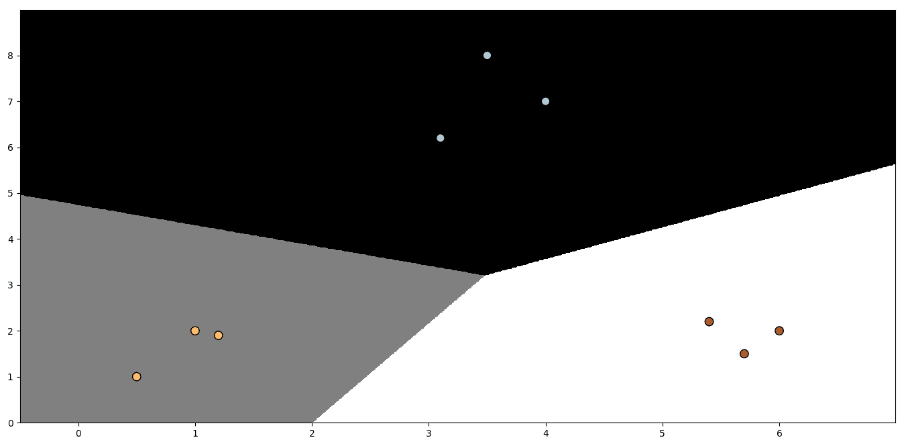

1.  让我们看看 `C` 参数如何影响我们的模型。`C` 参数表示误分类的惩罚。如果我们将其设置为 `1.0`，我们将得到以下结果：

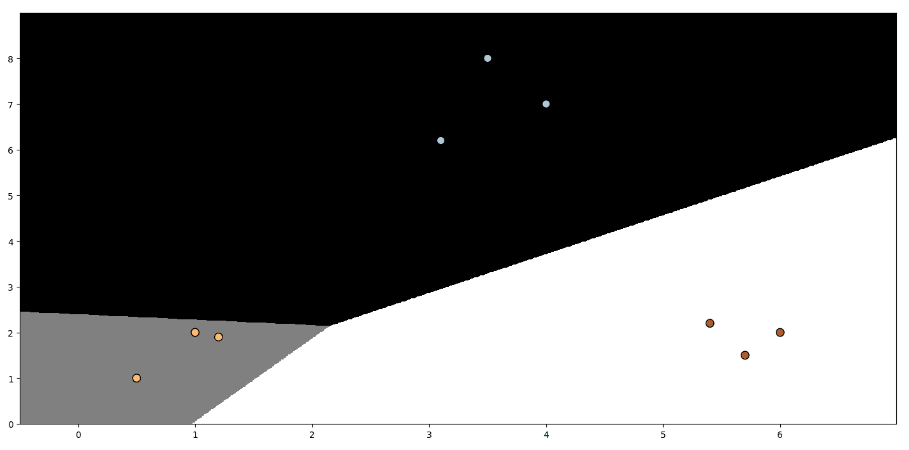

1.  如果我们将 `C` 设置为 `10000`，我们将得到以下结果：

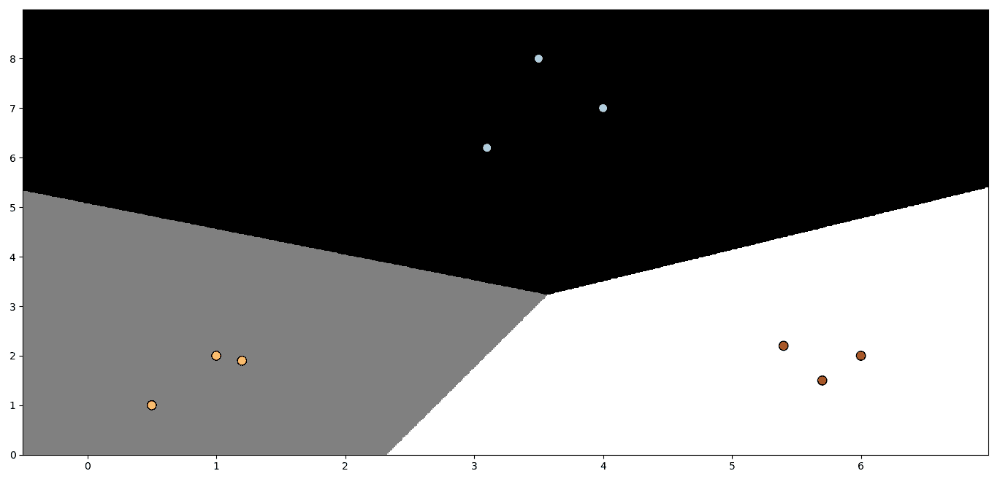

随着 C 的增加，误分类的惩罚更高。因此，边界变得更加优化。

# 它是如何工作的...

**逻辑回归**是监督学习算法家族中的分类方法。使用统计方法，逻辑回归允许我们生成一个结果，实际上它代表了一个给定输入值属于给定类的概率。在二项逻辑回归问题中，输出属于某一类的概率将是 *P*，而属于另一类的概率将是 *1-P*（其中 *P* 是一个介于 0 和 1 之间的数字，因为它表示概率）。

逻辑回归使用逻辑函数来确定输入值的分类。也称为**Sigmoid**函数，逻辑函数是一个 S 形曲线，可以将任何实数值映射到 0 到 1 之间的值（不包括极端值）。它可以由以下方程描述：


这个函数将实数值转换为 0 到 1 之间的数字。

# 更多内容...

为了获得用概率术语表示的逻辑回归方程，我们需要在逻辑回归方程中包含概率：


回想一下，`e` 函数是自然对数（`ln`）的逆函数，我们可以写出：


此函数被称为 **logit** 函数。另一方面，logit 函数允许我们将概率（因此，一个介于 0 和 1 之间的值）与实数范围的全部关联起来。它是一个链接函数，代表逻辑函数的逆函数。

# 参考信息

+   *Logit Models for Binary Data*，普林斯顿大学：[`data.princeton.edu/`](https://data.princeton.edu/wws509/notes/c3.pdf)

+   *使用 R 进行回归分析*，Giuseppe Ciaburro，Packt 出版

+   [wws509/notes/c3.pdf](https://data.princeton.edu/wws509/notes/c3.pdf)

+   Matplotlib 颜色方案选项：[`matplotlib.org/examples/color/colormaps_reference.html`](http://matplotlib.org/examples/color/colormaps_reference.html)

# 构建朴素贝叶斯分类器

分类器解决的是在较大集合中识别具有某些特征的个人子集的问题，可能使用一组称为先验（训练集）的个人子集。朴素贝叶斯分类器是一种监督学习分类器，它使用贝叶斯定理来构建模型。在本教程中，我们将构建一个朴素贝叶斯分类器。

# 准备工作

贝叶斯分类器的潜在原理是，某些个人基于某些观察结果，以一定的概率属于感兴趣的类别。这个概率基于这样的假设，即观察到的特征可以是相互依赖的或相互独立的；在第二种情况下，贝叶斯分类器被称为朴素，因为它假设在感兴趣的类别中，特定特征的呈现或缺失与其他特征的呈现或缺失无关，这大大简化了计算。让我们继续构建朴素贝叶斯分类器。

# 如何做到这一点…

让我们看看如何构建朴素贝叶斯分类器：

1.  我们将使用提供的 `naive_bayes.py` 作为参考。让我们导入一些库：

```py
import numpy as np
import matplotlib.pyplot as plt
from sklearn.naive_bayes import GaussianNB
```

1.  您提供了一个 `data_multivar.txt` 文件。这个文件包含我们将在这里使用的数据。每行包含逗号分隔的数值数据。让我们从这个文件中加载数据：

```py
input_file = 'data_multivar.txt'
X = []
y = []
with open(input_file, 'r') as f:
    for line in f.readlines():
        data = [float(x) for x in line.split(',')]
        X.append(data[:-1])
        y.append(data[-1])
X = np.array(X)
y = np.array(y)
```

我们现在已将输入数据加载到 `X` 中，并将标签加载到 `y` 中。有四个标签：0、1、2 和 3。

1.  让我们构建朴素贝叶斯分类器：

```py
classifier_gaussiannb = GaussianNB()
classifier_gaussiannb.fit(X, y)
y_pred = classifier_gaussiannb.predict(X)
```

`gauusiannb` 函数指定高斯朴素贝叶斯模型。

1.  让我们计算分类器的 `accuracy` 测量值：

```py
accuracy = 100.0 * (y == y_pred).sum() / X.shape[0]
print("Accuracy of the classifier =", round(accuracy, 2), "%")
```

返回以下准确度：

```py
Accuracy of the classifier = 99.5 %
```

1.  让我们绘制数据和边界。我们将使用在先前的教程中遵循的程序，*构建逻辑回归分类器*：

```py
x_min, x_max = min(X[:, 0]) - 1.0, max(X[:, 0]) + 1.0
y_min, y_max = min(X[:, 1]) - 1.0, max(X[:, 1]) + 1.0

# denotes the step size that will be used in the mesh grid
step_size = 0.01

# define the mesh grid
x_values, y_values = np.meshgrid(np.arange(x_min, x_max, step_size), np.arange(y_min, y_max, step_size))

# compute the classifier output
mesh_output = classifier_gaussiannb.predict(np.c_[x_values.ravel(), y_values.ravel()])

# reshape the array
mesh_output = mesh_output.reshape(x_values.shape)

# Plot the output using a colored plot 
plt.figure()

# choose a color scheme 
plt.pcolormesh(x_values, y_values, mesh_output, cmap=plt.cm.gray)

# Overlay the training points on the plot 
plt.scatter(X[:, 0], X[:, 1], c=y, s=80, edgecolors='black', linewidth=1, cmap=plt.cm.Paired)

# specify the boundaries of the figure
plt.xlim(x_values.min(), x_values.max())
plt.ylim(y_values.min(), y_values.max())

# specify the ticks on the X and Y axes
plt.xticks((np.arange(int(min(X[:, 0])-1), int(max(X[:, 0])+1), 1.0)))
plt.yticks((np.arange(int(min(X[:, 1])-1), int(max(X[:, 1])+1), 1.0)))

plt.show()
```

您应该看到以下内容：

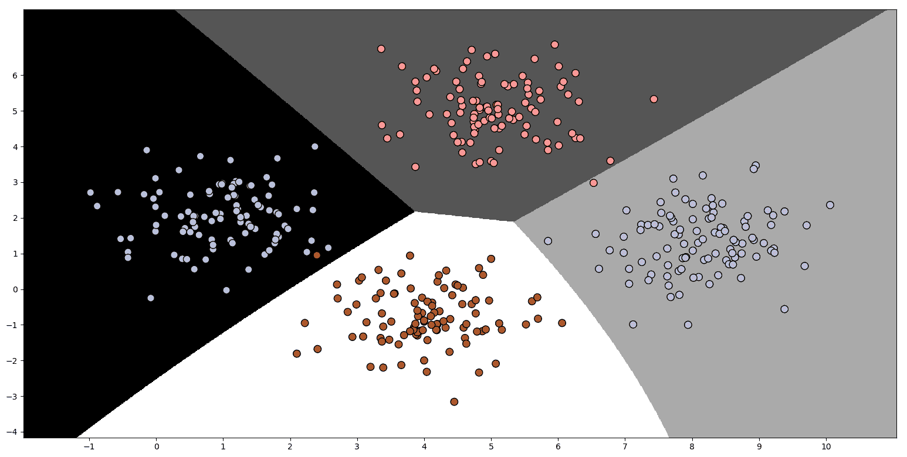

在这里对边界的限制没有线性要求。在前面的配方中， *构建逻辑回归分类器*，我们使用了所有数据进行训练。在机器学习中，有一个好的做法是训练和测试数据不重叠。理想情况下，我们需要一些未使用的数据进行测试，以便我们可以准确估计模型在未知数据上的表现。`scikit-learn` 中有一个很好的处理这个问题的方案，如下一个配方所示。

# 它是如何工作的...

**贝叶斯分类器** 是基于贝叶斯定理应用的分类器。这个分类器需要有关问题的先验和条件概率的知识；这些量通常未知，但通常是可估计的。如果可以获取定理中涉及的概率的可靠估计，贝叶斯分类器通常是可靠的，并且可能是紧凑的。

给定事件 (*E*) 发生的概率，是事件本身有利情况的数量 (*s*) 与可能情况总数 (*n*) 的比率，前提是所有考虑的情况都是等可能的。这可以用以下公式更好地表示：


给定两个事件， *A* 和 *B*，如果这两个事件是独立的（一个事件的发生不影响另一个事件发生的概率），那么事件的联合概率等于 *A* 和 *B* 的概率乘积：


如果两个事件是相关的（即，一个事件的发生会影响另一个事件发生的概率），那么相同的规则可能适用，前提是 *P(B | A)* 是在事件 *B* 发生的情况下事件 *A* 发生的概率。这个条件引入了条件概率，我们现在将深入探讨：


在事件 *B* 发生的条件下，计算事件 *A* 发生的概率被称为 **条件概率**，用 *P(A | B)* 表示。它是使用以下公式计算的：


设 *A* 和 *B* 为两个相关事件，正如我们所述，它们之间的联合概率是使用以下公式计算的：


或者，类似地，我们可以使用以下公式：


通过观察这两个公式，我们看到它们有第一个相等的成员。这表明即使第二个成员也相等，所以可以写出以下方程：


通过解这些关于条件概率的方程，我们得到以下结果：


提出的公式代表了贝叶斯定理的数学表述。使用哪一个取决于我们寻找什么。

# 还有更多...

1763 年，托马斯·贝叶斯牧师在英国发表了一篇文章；这篇文章因其含义而闻名。根据文章，对现象的预测不仅取决于科学家从实验中获得的观察结果，还取决于他自己对研究现象的看法和理解，甚至在开始实验之前。这些前提在 20 世纪由一些杰出的学者发展，如布鲁诺·德·菲尼蒂（*《预测：其逻辑法则，其主观来源》，1937 年*），L J 萨维奇（*《统计学基础再思考》，1959 年*）等人。

# 参见

+   *Keras 2.x 项目*，Giuseppe Ciaburro，Packt 出版。

+   *贝叶斯定理*，斯坦福哲学百科全书：[`plato.stanford.edu/entries/bayes-theorem/`](https://plato.stanford.edu/entries/bayes-theorem/)

+   `sklearn.naive_bayes.GaussianNB`函数的官方文档：[`scikit-learn.org/stable/modules/generated/sklearn.naive_bayes.GaussianNB.html`](https://scikit-learn.org/stable/modules/generated/sklearn.naive_bayes.GaussianNB.html)

# 分割数据集以进行训练和测试

让我们看看如何正确地将我们的数据分割成训练集和测试集。正如我们在第一章中提到的，*监督学习领域*，在*构建线性回归器*配方中，当我们构建机器学习模型时，我们需要一种方法来验证我们的模型，以检查其是否在令人满意的水平上运行。为此，我们需要将我们的数据分成两组——一个**训练**集和一个**测试**集。训练集将用于构建模型，测试集将用于查看训练好的模型在未知数据上的表现。

在本配方中，我们将学习如何分割数据集以进行训练和测试阶段。

# 准备工作

基于机器学习的模型的基本目标是做出准确的预测。在使用模型进行预测之前，有必要评估模型的预测性能。为了估计模型预测的质量，有必要使用你以前从未见过的数据。在相同的数据上训练预测模型并进行测试是一种方法上的错误：一个仅仅对刚刚看到的样本标签进行分类的模型会有很高的分数，但无法预测新的数据类别。在这些条件下，模型的泛化能力会较低。

# 如何操作…

让我们看看如何分割数据集：

1.  配方的第一部分与之前的配方类似，*构建朴素贝叶斯分类器*（加载`Splitting_dataset.py`文件）：

```py
import numpy as np
import matplotlib.pyplot as plt
from sklearn.naive_bayes import GaussianNB 

input_file = 'data_multivar.txt'

X = []
y = []
with open(input_file, 'r') as f:
    for line in f.readlines():
        data = [float(x) for x in line.split(',')]
        X.append(data[:-1])
        y.append(data[-1]) 

X = np.array(X)
y = np.array(y)

#Splitting the dataset for training and testing
from sklearn import model_selection
X_train, X_test, y_train, y_test = model_selection.train_test_split(X, y, test_size=0.25, random_state=5)

#Building the classifier
classifier_gaussiannb_new = GaussianNB()
classifier_gaussiannb_new.fit(X_train, y_train)
```

在这里，我们按照`test_size`参数指定的，分配了 25%的数据用于测试，剩余的 75%数据将用于训练。

1.  让我们在测试数据上评估分类器：

```py
y_test_pred = classifier_gaussiannb_new.predict(X_test)
```

1.  让我们计算分类器的`accuracy`度量：

```py
accuracy = 100.0 * (y_test == y_test_pred).sum() / X_test.shape[0]
print("Accuracy of the classifier =", round(accuracy, 2), "%")
```

打印出以下结果：

```py
Accuracy of the classifier = 98.0 %
```

1.  让我们在测试数据上绘制数据点和边界：

```py
#Plot a classifier
#Define the data
X= X_test
y=y_test

# define ranges to plot the figure 
x_min, x_max = min(X[:, 0]) - 1.0, max(X[:, 0]) + 1.0
y_min, y_max = min(X[:, 1]) - 1.0, max(X[:, 1]) + 1.0

# denotes the step size that will be used in the mesh grid
step_size = 0.01

# define the mesh grid
x_values, y_values = np.meshgrid(np.arange(x_min, x_max, step_size), np.arange(y_min, y_max, step_size))

# compute the classifier output
mesh_output = classifier_gaussiannb_new.predict(np.c_[x_values.ravel(), y_values.ravel()])

# reshape the array
mesh_output = mesh_output.reshape(x_values.shape)

# Plot the output using a colored plot 
plt.figure()

# choose a color scheme
plt.pcolormesh(x_values, y_values, mesh_output, cmap=plt.cm.gray)

# Overlay the training points on the plot 
plt.scatter(X[:, 0], X[:, 1], c=y, s=80, edgecolors='black', linewidth=1, cmap=plt.cm.Paired)

# specify the boundaries of the figure
plt.xlim(x_values.min(), x_values.max())
plt.ylim(y_values.min(), y_values.max())

# specify the ticks on the X and Y axes
plt.xticks((np.arange(int(min(X[:, 0])-1), int(max(X[:, 0])+1), 1.0)))
plt.yticks((np.arange(int(min(X[:, 1])-1), int(max(X[:, 1])+1), 1.0)))

plt.show()
```

1.  您应该看到以下内容：

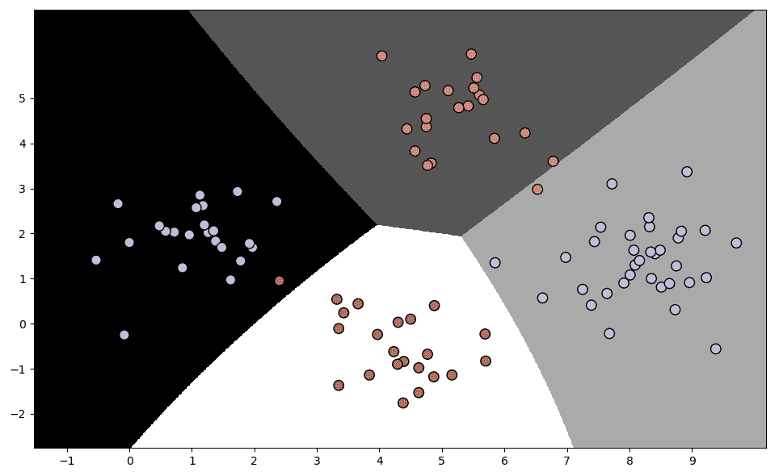

# 它是如何工作的...

在这个菜谱中，我们使用`scikit-learn`库的`train_test_split()`函数来分割数据。这个函数将数组或矩阵分割成随机的训练和测试子集。将输入数据随机分割成训练和测试数据源确保了训练和测试数据源的数据分布相似。当不需要保留输入数据的顺序时，您可以选择此选项。

# 还有更多...

性能估计取决于所使用的数据。因此，简单地将数据随机分割成训练和测试集并不能保证结果具有统计学意义。在不同随机分割上重复评估以及计算性能的平均值和标准差可以创建一个更可靠的估计。

然而，即使在不同的随机分割上重复评估，也可能防止最复杂的数据在测试（或训练）阶段被分类。

# 参考阅读

+   `sklearn.model_selection.train_test_split`函数的官方文档：[`scikit-learn.org/stable/modules/generated/sklearn.model_selection.train_test_split.html`](https://scikit-learn.org/stable/modules/generated/sklearn.model_selection.train_test_split.html)

+   *数据分割*，查尔斯大学：[`www.mff.cuni.cz/veda/konference/wds/proc/pdf10/WDS10_105_i1_Reitermanova.pdf`](https://www.mff.cuni.cz/veda/konference/wds/proc/pdf10/WDS10_105_i1_Reitermanova.pdf)

# 使用交叉验证指标评估精度

**交叉验证**是机器学习中的一个重要概念。在前一个菜谱中，我们将数据分割成训练和测试数据集。然而，为了使其更加稳健，我们需要用不同的子集重复这个过程。如果我们只为特定的子集微调，我们可能会过度拟合模型。**过度拟合**是指我们将模型过度微调到数据集上，以至于它在未知数据上的表现不佳。我们希望我们的机器学习模型在未知数据上表现良好。在这个菜谱中，我们将学习如何使用交叉验证指标来评估模型精度。

# 准备工作…

当我们处理机器学习模型时，我们通常关注三个指标——精确度、召回率和 F1 分数。我们可以使用参数评分来获取所需性能指标。**精确度**是指正确分类的项目数占列表中所有项目总数的百分比。**召回率**是指检索到的项目数占训练列表中所有项目总数的百分比。

# 如何做到这一点…

让我们看看如何使用交叉验证指标来评估模型精度：

1.  我们将使用在*构建朴素贝叶斯分类器*配方中使用的分类器（加载`naive_bayes.py`文件）。我们将从`准确度`度量开始：

```py
from sklearn import model_selection
num_validations = 5
accuracy = model_selection.cross_val_score(classifier_gaussiannb,
        X, y, scoring='accuracy', cv=num_validations)
print "Accuracy: " + str(round(100*accuracy.mean(), 2)) + "%"
```

1.  我们将使用前面的函数来计算`精确度`、`召回率`和`F1`分数：

```py
f1 = model_selection.cross_val_score(classifier_gaussiannb,
 X, y, scoring='f1_weighted', cv=num_validations)
print "F1: " + str(round(100*f1.mean(), 2)) + "%"
precision = model_selection.cross_val_score(classifier_gaussiannb,
 X, y, scoring='precision_weighted', cv=num_validations)
print "Precision: " + str(round(100*precision.mean(), 2)) + "%"
recall = model_selection.cross_val_score(classifier_gaussiannb,
 X, y, scoring='recall_weighted', cv=num_validations)
print "Recall: " + str(round(100*recall.mean(), 2)) + "%"

```

# 它是如何工作的...

让我们考虑一个包含 100 个项目的测试数据集，其中 82 个对我们来说是有兴趣的。现在，我们希望我们的分类器为我们识别这 82 个项目。我们的分类器挑选出 73 个项目作为感兴趣的项目。在这些 73 个项目中，只有 65 个实际上是感兴趣的项目，其余的 8 个被错误分类。我们可以以下方式计算精确度：

+   正确识别的数量 = 65

+   识别的总数 = 73

+   精确度 = 65 / 73 = 89.04%

为了计算召回率，我们使用以下方法：

+   数据集中感兴趣项目的总数 = 82

+   正确检索的项目数量 = 65

+   召回率 = 65 / 82 = 79.26%

一个好的机器学习模型需要同时具有良好的精确度和良好的召回率。虽然很容易使其中一个达到 100%，但另一个指标会受到影响！我们需要同时保持这两个指标都很高。为了量化这一点，我们使用 F1 分数，它是精确度和召回率的组合。这实际上是精确度和召回率的调和平均数：


在前面的情况下，F1 分数将如下：


# 还有更多...

在交叉验证中，所有可用数据都按固定大小的组交替作为测试集和训练集使用。因此，每个模式要么被分类（至少一次），要么用于训练。然而，所获得的效果取决于特定的划分。因此，重复交叉验证几次可能是有用的，以便独立于特定的划分。

# 参见

+   `sklearn.model_selection.cross_val_score`函数的官方文档：[`scikit-learn.org/stable/modules/generated/sklearn.model_selection.cross_val_score.html#sklearn.model_selection.cross_val_score`](https://scikit-learn.org/stable/modules/generated/sklearn.model_selection.cross_val_score.html#sklearn.model_selection.cross_val_score)

+   *交叉验证*（来自 scikit-learn 官方文档）：[`ogrisel.github.io/scikit-learn.org/sklearn-tutorial/modules/cross_validation.html`](http://ogrisel.github.io/scikit-learn.org/sklearn-tutorial/modules/cross_validation.html)

# 可视化混淆矩阵

**混淆矩阵**是一个表格，我们用它来了解分类模型的性能。这有助于我们了解如何将测试数据分类到不同的类别。当我们想要微调我们的算法时，我们需要在做出这些更改之前了解数据是如何被错误分类的。有些类别比其他类别更差，混淆矩阵将帮助我们了解这一点。让我们看看以下内容：

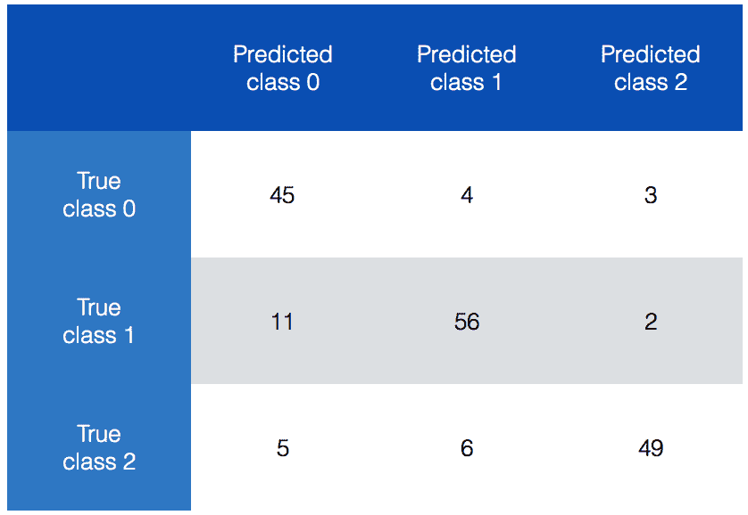

在前面的图表中，我们可以看到我们如何将数据分类到不同的类别中。理想情况下，我们希望所有非对角线元素都是 0。这将表示完美的分类！让我们考虑类别 0。总体而言，52 个项目实际上属于类别 0。如果我们把第一行的数字加起来，我们会得到 52。现在，其中 45 个项目被正确预测，但我们的分类器说其中 4 个属于类别 1，3 个属于类别 2。我们可以对剩余的 2 行也进行同样的分析。值得注意的是，有 11 个来自类别 1 的项目被错误分类为类别 0。这构成了这个类别中数据点的约 16%。这是一个我们可以用来优化我们模型的见解。

# 准备工作

混淆矩阵确定了分类错误的性质，因为我们的分类结果与真实数据进行了比较。在这个矩阵中，对角线单元格显示了正确分类的案例数量；所有其他单元格显示了错误分类的案例。

# 如何做到这一点...

让我们看看如何可视化混淆矩阵：

1.  我们将使用您已经提供的 `confusion_matrix.py` 文件作为参考。让我们看看如何从我们的数据中提取混淆矩阵：

```py
import numpy as np
import matplotlib.pyplot as plt
from sklearn.metrics import confusion_matrix
```

我们在这里使用一些样本数据。我们有 4 个类别，其值从 0 到 3。我们还有预测标签。我们使用 `confusion_matrix` 方法提取混淆矩阵并绘制它。

1.  让我们继续定义这个函数：

```py
# Show confusion matrix
def plot_confusion_matrix(confusion_mat):
    plt.imshow(confusion_mat, interpolation='nearest', cmap=plt.cm.Paired)
    plt.title('Confusion matrix')
    plt.colorbar()
    tick_marks = np.arange(4)
    plt.xticks(tick_marks, tick_marks)
    plt.yticks(tick_marks, tick_marks)
    plt.ylabel('True label')
    plt.xlabel('Predicted label')
    plt.show()
```

我们使用 `imshow` 函数来绘制混淆矩阵。函数中的其他一切都很简单！我们只是使用相关函数设置标题、颜色条、刻度和标签。`tick_marks` 参数从 0 到 3，因为我们数据集中有 4 个不同的标签。`np.arange` 函数给我们这个 `numpy` 数组。

1.  让我们定义数据（真实和预测），然后我们将调用 `confusion_matrix` 函数：

```py
y_true = [1, 0, 0, 2, 1, 0, 3, 3, 3]
y_pred = [1, 1, 0, 2, 1, 0, 1, 3, 3]
confusion_mat = confusion_matrix(y_true, y_pred)
plot_confusion_matrix(confusion_mat)
```

1.  如果你运行前面的代码，你会看到以下内容：

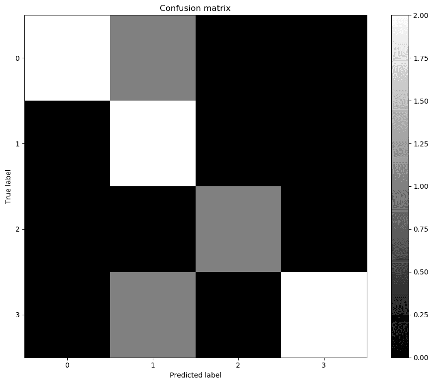

对角线的颜色很强烈，我们希望它们很强烈。黑色表示零。非对角线空间中有几个灰色方块，表示错误分类。例如，当真实标签为 0 时，预测标签为 1，正如我们在第一行中看到的那样。实际上，所有错误分类都属于类别 1，因为在第二列中有 3 行非零。从矩阵中很容易看出这一点。

# 它是如何工作的...

混淆矩阵显示了模型做出的实际和预测分类的信息。这些系统的性能通过矩阵中的数据来评估。

下表显示了双类分类器的混淆矩阵：

|  | 预测为正 | 预测为负 |
| --- | --- | --- |
| **实际为真** | TP | FN |
| **实际为假** | FP | TN |

混淆矩阵中的条目具有以下含义：

+   TP 表示一个实例被正确预测为正数的正确预测数量

+   FN 是一个实例被错误地预测为负的预测数量

+   FP 是一个实例被错误地预测为正的预测数量

+   TN 是一个实例被正确预测为负的预测数量

# 更多...

混淆矩阵显示了算法的性能。每一行返回实际类别的实例，而每一列返回预期类别的实例。*混淆矩阵*这一术语源于它使得容易看出系统是否混淆了两个类别。

# 参考信息

+   `sklearn.metrics.confusion_matrix()` 函数的官方文档：[`scikit-learn.org/stable/modules/generated/sklearn.metrics.confusion_matrix.html`](https://scikit-learn.org/stable/modules/generated/sklearn.metrics.confusion_matrix.html)

+   *混淆矩阵*，圣母大学：[`www3.nd.edu/~busiforc/Confusion_Matrix.html`](https://www3.nd.edu/~busiforc/Confusion_Matrix.html)

# 提取性能报告

在 *使用交叉验证指标评估准确度* 的配方中，我们计算了一些指标来衡量模型的准确度。让我们记住它的含义。准确度返回正确分类的百分比。精确度返回正确分类的正分类的百分比。召回率（灵敏度）返回测试集中被分类为正的正元素百分比。最后，在 F1 中，精确度和召回率都用于计算分数。在这个配方中，我们将学习如何提取性能报告。

# 准备工作

我们在 `scikit-learn` 中还有一个可以直接打印精确度、召回率和 F1 分数的函数。让我们看看如何做这个。

# 如何操作...

让我们看看如何提取性能报告：

1.  将以下行添加到新的 Python 文件中（加载 `performance_report.py` 文件）：

```py
from sklearn.metrics import classification_report
y_true = [1, 0, 0, 2, 1, 0, 3, 3, 3]
y_pred = [1, 1, 0, 2, 1, 0, 1, 3, 3]
target_names = ['Class-0', 'Class-1', 'Class-2', 'Class-3']
print(classification_report(y_true, y_pred, target_names=target_names))
```

1.  如果你运行此代码，你将在你的终端上看到以下内容：


而不是单独计算这些指标，你可以直接使用前面的函数从你的模型中提取这些统计数据。

# 它是如何工作的...

在这个配方中，我们使用了 scikit-learn 库的 `classification_report()` 函数来提取性能报告。此函数构建一个文本报告，显示主要的分类指标。返回每个类别的精确度、召回率和 F1 分数的文本摘要。参照前一个配方中提到的混淆矩阵中的术语，这些指标按以下方式计算：

+   精确度是 tp / (tp + fp) 的比率，其中 tp 是真正例的数量，fp 是假正例的数量。精确度是分类器不将负样本标记为正样本的能力。

+   召回率是 tp / (tp + fn) 的比率，其中 tp 是真正例的数量，fn 是假负例的数量。召回率是分类器找到正样本的能力。

+   F1 分数被认为是精确率和召回率的加权调和平均值，其中 F-beta 分数在 1 处达到峰值，在 0 处达到最低分。

# 还有更多…

报告的平均值包括 **微观平均**（平均总真实阳性、假阴性和假阳性）、**宏观平均**（平均每个标签的无权平均值）、**加权平均**（平均每个标签的支持加权平均值）和 **样本平均**（仅适用于多标签分类）。

# 参见

+   `sklearn.metrics.classification_report()` 函数的官方文档：[`scikit-learn.org/stable/modules/generated/sklearn.metrics.classification_report.html`](https://scikit-learn.org/stable/modules/generated/sklearn.metrics.classification_report.html)

# 根据汽车特征进行评估

在本食谱中，我们将看看如何将分类技术应用于现实世界问题。我们将使用一个包含一些关于汽车细节的数据集，例如车门数量、后备箱空间、维护成本等。我们的目标是确定汽车的质量。对于分类的目的，质量可以取四个值：不可接受、可接受、良好或非常好。

# 准备工作

您可以在此处下载数据集：[`archive.ics.uci.edu/ml/datasets/Car+Evaluation`](https://archive.ics.uci.edu/ml/datasets/Car+Evaluation)。

您需要将数据集中的每个值都视为字符串。我们考虑数据集中的六个属性。以下是属性及其可能取的值：

+   `buying`: 这些将是 `非常高`、`高`、`中` 和 `低`。

+   `maint`: 这些将是 `非常高`、`高`、`中` 和 `低`。

+   `doors`: 这些将是 `2`、`3`、`4`、`5` 和 `更多`。

+   `persons`: 这些将是 `2`、`4` 和 `更多`。

+   `lug_boot`: 这些将是 `小`、`中` 和 `大`。

+   `safety`: 这些将是 `低`、`中` 和 `高`。

由于每行都包含字符串，我们需要假设所有特征都是字符串，并设计一个分类器。在上一章中，我们使用随机森林构建了一个回归器。在本食谱中，我们将使用随机森林作为分类器。

# 如何操作…

让我们看看如何根据汽车特征进行评估：

1.  我们将使用您已经提供的 `car.py` 文件作为参考。让我们继续并导入一些包：

```py
from sklearn import preprocessing
from sklearn.ensemble import RandomForestClassifier
```

1.  让我们加载数据集：

```py
input_file = 'car.data.txt'
# Reading the data
X = []
count = 0
with open(input_file, 'r') as f:
    for line in f.readlines():
        data = line[:-1].split(',')
        X.append(data)
X = np.array(X)
```

每行包含一个以逗号分隔的单词列表。因此，我们解析输入文件，分割每一行，然后将列表追加到主数据中。我们忽略每行的最后一个字符，因为它是一个换行符。Python 包只处理数值数据，因此我们需要将这些属性转换成那些包可以理解的形式。

1.  在上一章中，我们讨论了标签编码。这就是我们在这里将字符串转换为数字所使用的：

```py
# Convert string data to numerical data
label_encoder = []
X_encoded = np.empty(X.shape)
for i,item in enumerate(X[0]):
    label_encoder.append(preprocessing.LabelEncoder())
    X_encoded[:, i] = label_encoder[-1].fit_transform(X[:, i])
X = X_encoded[:, :-1].astype(int)
y = X_encoded[:, -1].astype(int)
```

由于每个属性可以取有限数量的值，我们可以使用标签编码器将它们转换为数字。我们需要为每个属性使用不同的标签编码器。例如，`lug_boot`属性可以取三个不同的值，我们需要一个知道如何编码这个属性的标签编码器。每行的最后一个值是类别，所以我们将其分配给*y*变量。

1.  让我们训练分类器：

```py
# Build a Random Forest classifier
params = {'n_estimators': 200, 'max_depth': 8, 'random_state': 7}
classifier = RandomForestClassifier(**params)
classifier.fit(X, y)
```

你可以调整`n_estimators`和`max_depth`参数，看看它们如何影响分类准确率。我们实际上很快就会以标准化的方式进行这项操作。

1.  让我们进行交叉验证：

```py
# Cross validation
from sklearn import model_selection

accuracy = model_selection.cross_val_score(classifier, 
        X, y, scoring='accuracy', cv=3)
print("Accuracy of the classifier: " + str(round(100*accuracy.mean(), 2)) + "%")
```

一旦我们训练了分类器，我们需要看看它的表现。我们使用三折交叉验证来计算这里的准确率。以下结果被返回：

```py
Accuracy of the classifier: 78.19%
```

1.  构建分类器的主要目标之一是将其用于孤立和未知的数据实例。让我们使用一个数据点，看看我们如何使用这个分类器对其进行分类：

```py
# Testing encoding on single data instance
input_data = ['high', 'low', '2', 'more', 'med', 'high']
input_data_encoded = [-1] * len(input_data)
for i,item in enumerate(input_data):
    input_data_encoded[i] = int(label_encoder[i].transform([input_data[i]]))
input_data_encoded = np.array(input_data_encoded)
```

第一步是将数据转换为数值数据。我们需要使用在训练期间使用的标签编码器，因为我们希望它保持一致性。如果输入数据点中存在未知值，标签编码器会抱怨，因为它不知道如何处理这些数据。例如，如果你将列表中的第一个值从`high`改为`abcd`，那么标签编码器将无法工作，因为它不知道如何解释这个字符串。这就像一个错误检查，用来查看输入数据点是否有效。

1.  我们现在准备好预测这个数据点的输出类别：

```py
# Predict and print output for a particular datapoint
output_class = classifier.predict([input_data_encoded])
print("Output class:", label_encoder[-1].inverse_transform(output_class)[0])
```

我们使用`predict()`方法来估计输出类别。如果我们输出编码后的输出标签，对我们来说没有任何意义。因此，我们使用`inverse_transform`方法将此标签转换回其原始形式并打印输出类别。以下结果被返回：

```py
Output class: acc
```

# 它是如何工作的...

**随机森林**是由 Leo Breiman（美国加州大学伯克利分校）基于分类树的使用而开发的。他通过将其整合到蒙特卡洛模拟过程中扩展了分类树技术，并将其命名为**随机森林**。它基于创建大量树分类器，每个分类器都旨在对单个实例进行分类，其中一些特征已被评估。比较森林中每棵树提供的分类建议，以确定请求应归因于哪个类别：即获得最多投票的那个类别。

# 还有更多...

随机森林有三个调整参数：树的数量、终端节点的最小幅度以及每个节点中采样的变量数量。由于不存在过拟合，前两个参数仅从计算角度考虑才显得重要。

# 参见

+   `sklearn.ensemble.RandomForestClassifier()`函数的官方文档：[`scikit-learn.org/stable/modules/generated/sklearn.ensemble.RandomForestClassifier.html`](https://scikit-learn.org/stable/modules/generated/sklearn.ensemble.RandomForestClassifier.html)

+   *随机森林*，由 Leo Breiman 和 Adele Cutler（加州大学伯克利分校）所著：[`www.stat.berkeley.edu/~breiman/RandomForests/cc_home.htm`](https://www.stat.berkeley.edu/~breiman/RandomForests/cc_home.htm)

# 提取验证曲线

在之前的食谱*根据特征评估汽车*中，我们使用了随机森林来构建分类器，但我们并不确切知道如何定义参数。在我们的情况下，我们处理了两个参数：`n_estimators`和`max_depth`。它们被称为**超参数**，分类器的性能取决于它们。看到我们改变超参数时性能如何受到影响将是非常有用的。这就是验证曲线发挥作用的地方。

# 准备工作

验证曲线帮助我们理解每个超参数如何影响训练分数。基本上，所有其他参数都保持不变，我们根据我们的范围改变感兴趣的超参数。然后我们将能够可视化这如何影响分数。

# 如何操作…

让我们看看如何提取验证曲线：

1.  将以下代码添加到与之前食谱相同的 Python 文件中，*根据特征评估汽车*：

```py
# Validation curves
import matplotlib.pyplot as plt
from sklearn.model_selection import validation_curve

classifier = RandomForestClassifier(max_depth=4, random_state=7)

parameter_grid = np.linspace(25, 200, 8).astype(int)
train_scores, validation_scores = validation_curve(classifier, X, y, "n_estimators", parameter_grid, cv=5)
print("##### VALIDATION CURVES #####")
print("\nParam: n_estimators\nTraining scores:\n", train_scores)
print("\nParam: n_estimators\nValidation scores:\n", validation_scores)
```

在这种情况下，我们通过固定`max_depth`参数来定义分类器。我们想要估计使用最佳估计器的数量，因此使用`parameter_grid`定义了我们的搜索空间。它将通过从 25 迭代到 200，以 8 步为间隔来提取训练和验证分数。

1.  如果你运行它，你将在你的终端上看到以下内容：


1.  让我们绘制它：

```py
# Plot the curve
plt.figure()
plt.plot(parameter_grid, 100*np.average(train_scores, axis=1), color='black')
plt.title('Training curve')
plt.xlabel('Number of estimators')
plt.ylabel('Accuracy')
plt.show()
```

1.  这是你将得到的结果：

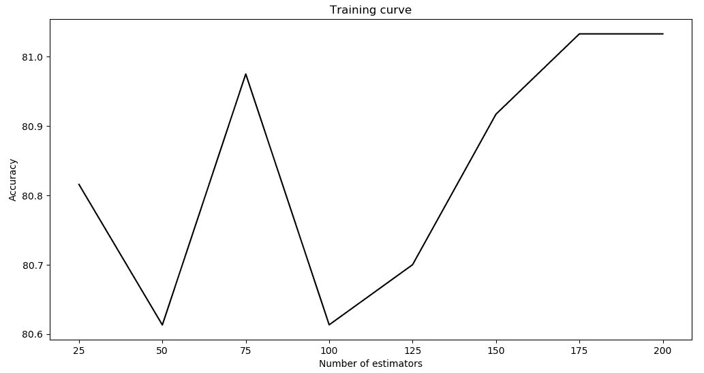

1.  让我们对`max_depth`参数做同样的操作：

```py
classifier = RandomForestClassifier(n_estimators=20, random_state=7)
parameter_grid = np.linspace(2, 10, 5).astype(int)
train_scores, valid_scores = validation_curve(classifier, X, y, 
        "max_depth", parameter_grid, cv=5)
print("\nParam: max_depth\nTraining scores:\n", train_scores)
print("\nParam: max_depth\nValidation scores:\n", validation_scores)
```

我们将`n_estimators`参数固定为 20，以查看性能如何随`max_depth`的变化而变化。以下是终端上的输出：

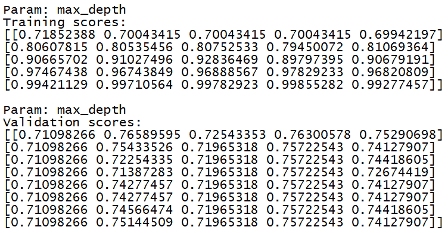

1.  让我们绘制它：

```py
# Plot the curve
plt.figure()
plt.plot(parameter_grid, 100*np.average(train_scores, axis=1), color='black')
plt.title('Validation curve')
plt.xlabel('Maximum depth of the tree')
plt.ylabel('Accuracy')
plt.show()
```

1.  如果你运行此代码，你将得到以下结果：

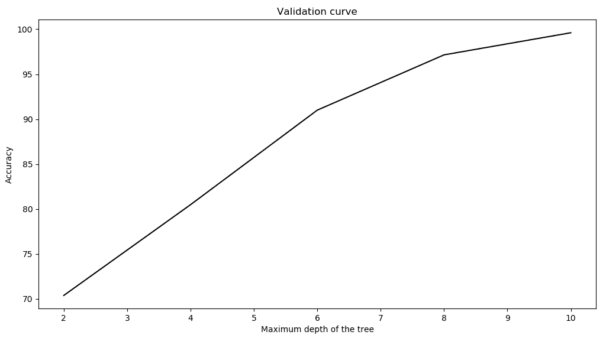

# 它是如何工作的…

在这个食谱中，我们使用了 scikit-learn 库的`validation_curve`函数来绘制验证曲线。此函数确定不同参数值下的训练和测试分数，并计算具有不同参数值的估计器的分数。

# 更多内容…

选择估计器的超参数是设置模型的基本程序之一。在可用的程序中，网格搜索是最常用的方法之一。此程序选择在验证集或多个验证集上具有最高分数的超参数。

# 参考阅读

+   `sklearn.model_selection.validation_curve()` 函数的官方文档：[`scikit-learn.org/stable/modules/generated/sklearn.model_selection.validation_curve.html`](https://scikit-learn.org/stable/modules/generated/sklearn.model_selection.validation_curve.html)

+   *验证曲线：绘制分数以评估模型*（来自 scikit-learn 的官方文档）：[`scikit-learn.org/stable/modules/learning_curve.html`](https://scikit-learn.org/stable/modules/learning_curve.html)

# 提取学习曲线

学习曲线帮助我们理解训练数据集的大小如何影响机器学习模型。当你必须处理计算限制时，这非常有用。让我们继续通过改变训练数据集的大小来绘制学习曲线。

# 准备工作

学习曲线显示了不同数量的训练样本的估计器的验证和训练分数。

# 如何做...

让我们看看如何提取学习曲线：

1.  将以下代码添加到与之前菜谱中相同的 Python 文件中，*提取验证曲线*：

```py
from sklearn.model_selection import validation_curve

classifier = RandomForestClassifier(random_state=7)

parameter_grid = np.array([200, 500, 800, 1100])
train_scores, validation_scores = validation_curve(classifier, X, y, "n_estimators", parameter_grid, cv=5)
print("\n##### LEARNING CURVES #####")
print("\nTraining scores:\n", train_scores)
print("\nValidation scores:\n", validation_scores)

```

我们想使用 200、500、800 和 1,100 个样本的训练数据集来评估性能指标。我们使用五折交叉验证，如`validation_curve`方法中 cv 参数所指定的。

1.  如果你运行此代码，你将在终端上得到以下输出：

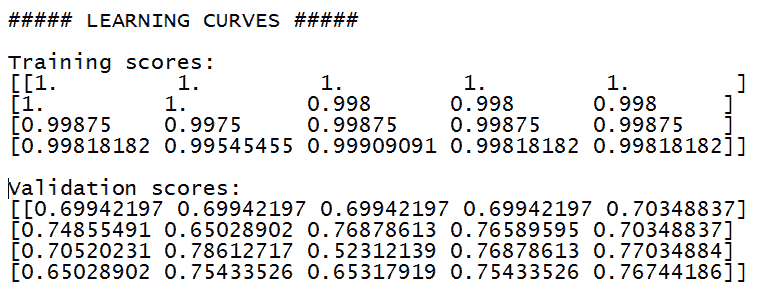

1.  让我们绘制它：

```py
# Plot the curve
plt.figure()
plt.plot(parameter_grid, 100*np.average(train_scores, axis=1), color='black')
plt.title('Learning curve')
plt.xlabel('Number of training samples')
plt.ylabel('Accuracy')
plt.show()
```

1.  这里是输出：

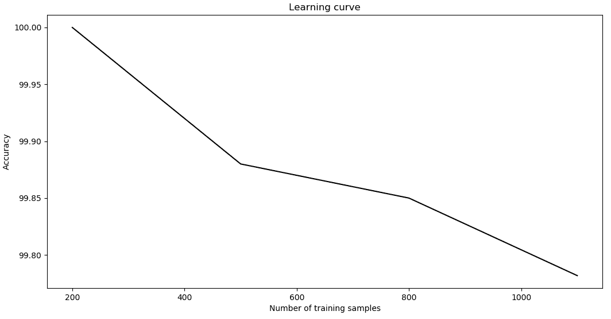

虽然较小的训练集似乎能给出更好的准确度，但它们容易过拟合。如果我们选择更大的训练数据集，它会消耗更多资源。因此，我们需要在这里进行权衡，以选择合适的训练数据集大小。

# 它是如何工作的...

在这个菜谱中，我们使用了 scikit-learn 库的`validation_curve`函数来绘制学习曲线。此函数确定不同训练集大小的交叉验证训练和测试分数。

# 更多内容...

学习曲线使我们能够检查添加训练数据是否带来好处。它还允许我们估计来自方差误差和偏差误差的贡献。如果验证分数和训练分数在训练集大小太低时与训练集大小收敛，我们将不会从更多的训练数据中受益。

# 相关内容

+   `sklearn.model_selection.validation_curve` 函数的官方文档：[`scikit-learn.org/stable/modules/generated/sklearn.model_selection.validation_curve.html`](https://scikit-learn.org/stable/modules/generated/sklearn.model_selection.validation_curve.html)

+   *学习曲线*（来自 scikit-learn 的官方文档）：[`scikit-learn.org/stable/modules/learning_curve.html`](https://scikit-learn.org/stable/modules/learning_curve.html)

# 估算收入区间

我们将构建一个分类器，根据 14 个属性估计一个人的收入区间。可能的输出类别是高于 50,000 或低于或等于 50,000。在这个数据集中有一个小小的转折，即每个数据点都是数字和字符串的混合。数值数据很有价值，在这些情况下我们不能使用标签编码器。我们需要设计一个可以同时处理数值和非数值数据的系统。

# 准备工作

我们将使用可从[`archive.ics.uci.edu/ml/datasets/Census+Income`](https://archive.ics.uci.edu/ml/datasets/census+income)获取的普查收入数据集。

该数据集具有以下特征：

+   实例数量：48,842

+   属性数量：14

以下是一个属性列表：

+   Age: 连续型

+   Workclass: 文本

+   fnlwgt: 连续型

+   Education: 文本

+   Education-num: 连续型

+   Marital-status: 文本

+   Occupation: 文本

+   Relationship: 文本

+   Race: 文本

+   Sex: 女性 或 男性

+   Capital-gain: 连续型

+   Capital-loss: 连续型

+   Hours-per-week: 连续型

+   Native-country: 文本

# 如何做到这一点…

让我们看看如何估计收入区间：

1.  我们将使用已提供的作为参考的`income.py`文件。我们将使用朴素贝叶斯分类器来实现这一点。让我们导入一些包：

```py
import numpy as np
from sklearn import preprocessing
from sklearn.naive_bayes import GaussianNB
```

1.  让我们加载数据集：

```py
input_file = 'adult.data.txt'
# Reading the data
X = []
y = []
count_lessthan50k = 0
count_morethan50k = 0
num_images_threshold = 10000
```

1.  我们将从数据集中使用 20,000 个数据点——每个类别 10,000 个，以避免类别不平衡。在训练过程中，如果你使用属于单个类别的许多数据点，分类器往往会偏向该类别。因此，最好为每个类别使用相同数量的数据点：

```py
with open(input_file, 'r') as f:
    for line in f.readlines():
        if '?' in line:
            continue
        data = line[:-1].split(', ')
        if data[-1] == '<=50K' and count_lessthan50k < num_images_threshold:
            X.append(data)
            count_lessthan50k = count_lessthan50k + 1
        elif data[-1] == '>50K' and count_morethan50k < num_images_threshold:
            X.append(data)
            count_morethan50k = count_morethan50k + 1
        if count_lessthan50k >= num_images_threshold and count_morethan50k >= num_images_threshold:
            break
X = np.array(X)
```

这又是一个以逗号分隔的文件。我们就像之前一样，将数据加载到`X`变量中。

1.  我们需要将字符串属性转换为数值数据，同时保留原始数值数据：

```py
# Convert string data to numerical data
label_encoder = []
X_encoded = np.empty(X.shape)
for i,item in enumerate(X[0]):
    if item.isdigit():
        X_encoded[:, i] = X[:, i]
    else:
        label_encoder.append(preprocessing.LabelEncoder())
        X_encoded[:, i] = label_encoder[-1].fit_transform(X[:, i])
X = X_encoded[:, :-1].astype(int)
y = X_encoded[:, -1].astype(int)
```

`isdigit()`函数帮助我们识别数值数据。我们将字符串数据转换为数值数据，并将所有标签编码器存储在一个列表中，以便我们在需要分类未知数据时使用。

1.  让我们训练分类器：

```py
# Build a classifier
classifier_gaussiannb = GaussianNB()
classifier_gaussiannb.fit(X, y)
```

1.  让我们将数据拆分为训练集和测试集以提取性能指标：

```py
# Cross validation
from sklearn import model_selection
X_train, X_test, y_train, y_test = model_selection.train_test_split(X, y, test_size=0.25, random_state=5)
classifier_gaussiannb = GaussianNB()
classifier_gaussiannb.fit(X_train, y_train)
y_test_pred = classifier_gaussiannb.predict(X_test)
```

1.  让我们提取性能指标：

```py
# compute F1 score of the classifier
f1 = model_selection.cross_val_score(classifier_gaussiannb,
        X, y, scoring='f1_weighted', cv=5)
print("F1 score: " + str(round(100*f1.mean(), 2)) + "%")
```

返回以下结果：

```py
F1 score: 75.9%
```

1.  让我们看看如何对单个数据点进行分类。我们需要将数据点转换为我们的分类器可以理解的形式：

```py
# Testing encoding on single data instance
input_data = ['39', 'State-gov', '77516', 'Bachelors', '13', 'Never-married', 'Adm-clerical', 'Not-in-family', 'White', 'Male', '2174', '0', '40', 'United-States']
count = 0
input_data_encoded = [-1] * len(input_data)
for i,item in enumerate(input_data):
    if item.isdigit():
        input_data_encoded[i] = int([input_data[i]])
    else:
        input_data_encoded[i] = int(label_encoder[count].transform([input_data[i]]))
        count = count + 1 
input_data_encoded = np.array(input_data_encoded)
```

1.  我们现在准备好进行分类：

```py
# Predict and print output for a particular datapoint
output_class = classifier_gaussiannb.predict([input_data_encoded])
print(label_encoder[-1].inverse_transform(output_class)[0])
```

正如之前一样，我们使用`predict`方法获取`output`类别，并使用`inverse_transform`方法将这个标签转换回其原始形式，以便在终端上打印出来。以下为返回结果：

```py
<=50K
```

# 它是如何工作的...

贝叶斯分类器的潜在原理是，基于某些观察，某些个体以一定的概率属于感兴趣的类别。这个概率基于这样的假设，即观察到的特征可以相互依赖或独立；在后一种情况下，贝叶斯分类器被称为*朴素*，因为它假设在感兴趣的给定类别中，特定特征的呈现与否与其他特征的呈现与否无关，这大大简化了计算。让我们继续构建一个朴素贝叶斯分类器。

# 更多内容...

将贝叶斯理论应用于分类的概念非常直观：如果我观察一个特定的可测量特征，我可以在观察后估计这个特征代表某个类别的概率。

# 参见

+   `sklearn.naive_bayes.GaussianNB` 函数的官方文档：[`scikit-learn.org/stable/modules/generated/sklearn.naive_bayes.GaussianNB.html`](https://scikit-learn.org/stable/modules/generated/sklearn.naive_bayes.GaussianNB.html)

# 预测葡萄酒的质量

在这个食谱中，我们将根据种植的葡萄酒的化学特性来预测葡萄酒的质量。代码使用了一个葡萄酒数据集，它包含一个包含 177 行和 13 列的 DataFrame；第一列包含类别标签。这些数据来自意大利（皮埃蒙特）同一地区种植的葡萄酒的化学分析，但来自三种不同的品种——即内比奥洛、巴贝拉和格里尼奥洛葡萄。来自内比奥洛葡萄的葡萄酒被称为巴罗洛。

# 准备工作

数据包括在三种类型的葡萄酒中发现的几种成分的量，以及一些光谱变量。属性如下：

+   酒精

+   苹果酸

+   灰分

+   灰分的碱性

+   镁

+   总酚

+   黄酮

+   非黄酮酚

+   原花青素

+   颜色强度

+   颜色

+   稀释葡萄酒的 OD280/OD315

+   �脯氨酸

DataFrame 的第一列包含类别，表示三种类型的葡萄酒之一（0、1 或 2）。

# 如何做到这一点...

让我们看看如何预测葡萄酒的质量：

1.  我们将使用已提供的`wine.quality.py`文件作为参考。我们像往常一样，首先导入 NumPy 库并加载数据（`wine.txt`）：

```py
import numpy as np
input_file = 'wine.txt'
X = []
y = []
with open(input_file, 'r') as f:
  for line in f.readlines():
     data = [float(x) for x in line.split(',')]
     X.append(data[1:])
     y.append(data[0])
X = np.array(X)
y = np.array(y)
```

返回两个数组：`X`（输入数据）和`y`（目标）。

1.  现在，我们需要将我们的数据分为两组：一个训练数据集和一个测试数据集。训练数据集将用于构建模型，测试数据集将用于查看这个训练模型在未知数据上的表现：

```py
from sklearn import model_selection
X_train, X_test, y_train, y_test = model_selection.train_test_split(X, y, test_size=0.25, random_state=5)
```

返回四个数组：`X_train`、`X_test`、`y_train`和`y_test`。这些数据将用于训练和验证模型。

1.  让我们训练这个分类器：

```py
from sklearn.tree import DecisionTreeClassifier

classifier_DecisionTree = DecisionTreeClassifier()
classifier_DecisionTree.fit(X_train, y_train)
```

为了训练模型，使用了决策树算法。决策树算法基于一种非参数监督学习方法，用于分类和回归。目标是构建一个模型，使用从数据特征推断出的决策规则来预测目标变量的值。

1.  现在是计算分类器准确率的时候了：

```py
y_test_pred = classifier_DecisionTree.predict(X_test)

accuracy = 100.0 * (y_test == y_test_pred).sum() / X_test.shape[0]
print("Accuracy of the classifier =", round(accuracy, 2), "%")
```

返回以下结果：

```py
Accuracy of the classifier = 91.11 %
```

1.  最后，将计算混淆矩阵以计算模型性能：

```py
from sklearn.metrics import confusion_matrix

confusion_mat = confusion_matrix(y_test, y_test_pred)
print(confusion_mat)
```

返回以下结果：

```py
[[17  2  0]
 [ 1 12  1]
 [ 0  0 12]]
```

对角线上没有出现的值表示分类错误。因此，分类器只犯了四个错误。

# 它是如何工作的...

在这个菜谱中，基于种植的葡萄酒的化学性质预测了葡萄酒的质量。为此，使用了决策树算法。决策树以图形方式显示所做的或建议的选择。事情并不总是如此清晰，以至于两个解决方案之间的选择是立即的。通常，一个决定是由一系列级联条件决定的。用表格和数字表示这个概念是困难的。事实上，即使表格代表了一个现象，它也可能使读者困惑，因为选择的理由并不明显。

# 还有更多...

树状结构使我们能够通过突出显示我们插入的分支来确定选择或评估，从而以清晰的易读性提取信息。决策树技术通过创建一个具有可能结果的模型来识别策略或追求目标是有用的。决策树图立即指引结果的阅读。图表比充满数字的表格更有说服力。人类的大脑更喜欢先看到解决方案，然后再回头理解解决方案的合理性，而不是一系列代数描述、百分比和数据来描述结果。

# 参见

+   `sklearn.tree.DecisionTreeClassifier()`函数的官方文档：[`scikit-learn.org/stable/modules/generated/sklearn.tree.DecisionTreeClassifier.html#sklearn.tree.DecisionTreeClassifier`](https://scikit-learn.org/stable/modules/generated/sklearn.tree.DecisionTreeClassifier.html#sklearn.tree.DecisionTreeClassifier)

+   *决策树*（来自德国希尔德斯海姆大学）：[`www.ismll.uni-hildesheim.de/lehre/ml-06w/skript/ml-4up-04-decisiontrees.pdf`](https://www.ismll.uni-hildesheim.de/lehre/ml-06w/skript/ml-4up-04-decisiontrees.pdf)

+   *决策树*（来自 scikit-learn 官方文档）：[`scikit-learn.org/stable/modules/tree.html#tree`](https://scikit-learn.org/stable/modules/tree.html#tree)

# 新组趋势主题分类

新闻组是关于许多问题的讨论组，由位于世界各地的新闻服务器提供，这些服务器收集来自客户端的消息并将它们传输给所有用户，另一方面，传输给连接到网络的其它新闻服务器。这项技术的成功归功于讨论中的用户互动。每个人都必须遵守组规。

# 准备工作

在这个菜谱中，我们将构建一个分类器，使我们能够将主题的成员资格分类到特定的讨论组中。这个操作将有助于验证主题是否与讨论组相关。我们将使用以下 URL 中可用的 20 个新闻组数据集中的数据：[`qwone.com/~jason/20Newsgroups/`](http://qwone.com/~jason/20Newsgroups/)。

这是一个大约有 20,000 篇新闻组文档的集合，分为 20 个不同的新闻组。最初由 Ken Lang 收集，并在*Newsweeder 论文：学习过滤网络新闻*中发表，这个数据集特别适用于处理文本分类问题。

# 如何做到这一点…

在这个菜谱中，我们将学习如何执行新闻组趋势主题分类：

1.  我们将使用已经提供给你作为参考的`post.classification.py`文件。我们开始导入数据集如下：

```py
from sklearn.datasets import fetch_20newsgroups
```

这个数据集包含在`sklearn.datasets`库中；这样，我们将很容易恢复数据。正如预期的那样，数据集包含与 20 个新闻组相关的帖子。我们将仅分析以下两个新闻组：

```py
NewsClass = ['rec.sport.baseball', 'rec.sport.hockey']
```

1.  下载数据：

```py
DataTrain = fetch_20newsgroups(subset='train',categories=NewsClass, shuffle=True, random_state=42)
```

1.  数据有两个属性：`data`和`target`。显然，`data`代表输入，`target`是输出。让我们检查哪些新闻组已被选中：

```py
print(DataTrain.target_names)
```

打印以下结果：

```py
['rec.sport.baseball', 'rec.sport.hockey']
```

1.  让我们检查形状：

```py
print(len(DataTrain.data))
print(len(DataTrain.target))
```

返回以下结果：

```py
1197
1197
```

1.  为了从文本中提取特征，我们将使用以下`CountVectorizer()`函数：

```py
from sklearn.feature_extraction.text import CountVectorizer

CountVect = CountVectorizer()
XTrainCounts = CountVect.fit_transform(DataTrain.data)
print(XTrainCounts.shape)
```

返回以下结果：

```py
(1197, 18571)
```

这样，我们已经对单词的出现次数进行了计数。

1.  现在我们将文档中每个单词出现的次数除以文档中单词的总数：

```py
from sklearn.feature_extraction.text import TfidfTransformer

TfTransformer = TfidfTransformer(use_idf=False).fit(XTrainCounts)
XTrainNew = TfTransformer.transform(XTrainCounts)
TfidfTransformer = TfidfTransformer()
XTrainNewidf = TfidfTransformer.fit_transform(XTrainCounts)
```

1.  现在我们可以构建分类器：

```py
from sklearn.naive_bayes import MultinomialNB

NBMultiClassifier = MultinomialNB().fit(XTrainNewidf, DataTrain.target)
```

1.  最后，我们将计算分类器的准确率：

```py
NewsClassPred = NBMultiClassifier.predict(XTrainNewidf)

accuracy = 100.0 * (DataTrain.target == NewsClassPred).sum() / XTrainNewidf.shape[0]
print("Accuracy of the classifier =", round(accuracy, 2), "%")
```

返回以下结果：

```py
Accuracy of the classifier = 99.67 %
```

# 它是如何工作的...

在这个菜谱中，我们构建了一个分类器，用于将主题的成员资格分类到特定的讨论组中。为了从文本中提取特征，需要一个**分词**过程。在分词阶段，在每个单独的句子中，识别出称为**标记**的原子元素；基于识别出的标记，可以执行句子本身的分析和评估。一旦提取了文本的特征，就构建了一个基于多项式朴素贝叶斯算法的分类器。

# 还有更多...

当特征表示文档中单词（文本或视觉）的频率时，朴素贝叶斯多项式算法用于文本和图像。

# 参见

+   *数据集加载工具*的官方文档：[`scikit-learn.org/stable/datasets/index.html`](https://scikit-learn.org/stable/datasets/index.html)

+   `sklearn.feature_extraction.text.CountVectorizer()`函数的官方文档：[`scikit-learn.org/stable/modules/generated/sklearn.feature_extraction.text.CountVectorizer.html`](https://scikit-learn.org/stable/modules/generated/sklearn.feature_extraction.text.CountVectorizer.html)

+   `sklearn.feature_extraction.text.TfidfTransformer()`函数的官方文档：[`scikit-learn.org/stable/modules/generated/sklearn.feature_extraction.text.TfidfTransformer.html`](https://scikit-learn.org/stable/modules/generated/sklearn.feature_extraction.text.TfidfTransformer.html)

+   `sklearn.naive_bayes.MultinomialNB()`函数的官方文档：[`scikit-learn.org/stable/modules/generated/sklearn.naive_bayes.MultinomialNB.html`](https://scikit-learn.org/stable/modules/generated/sklearn.naive_bayes.MultinomialNB.html)
